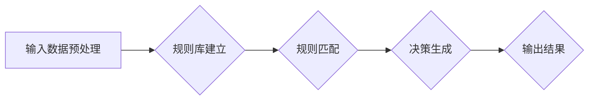
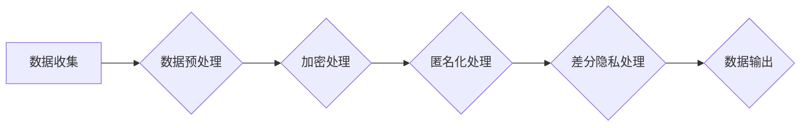
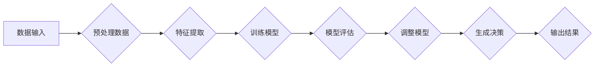
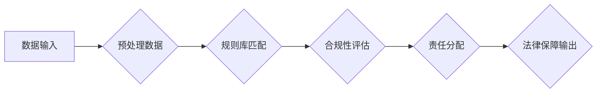
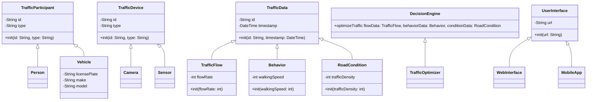
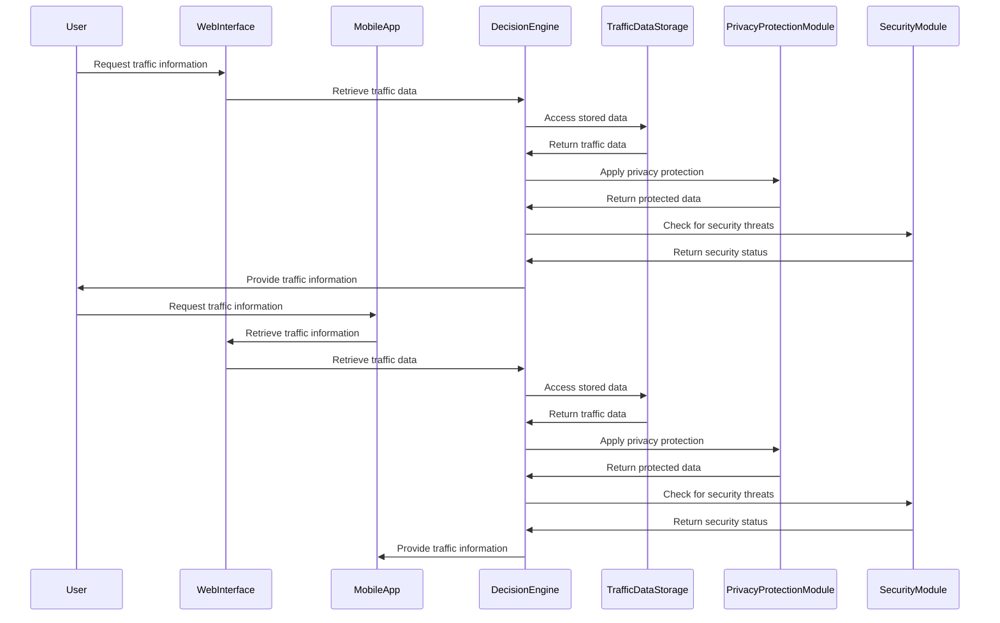
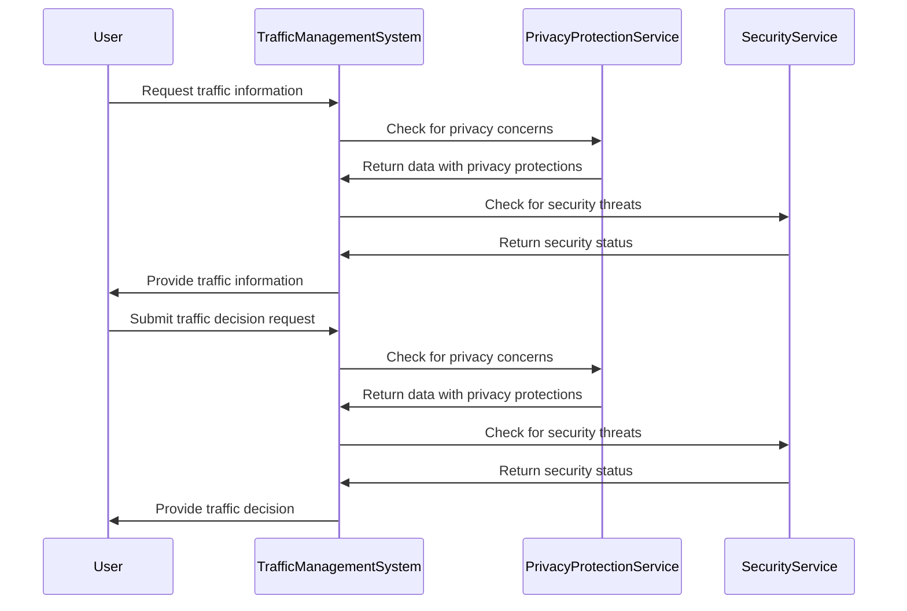

                 

### 第一部分：背景介绍

## 第1章：人工智能时代的到来与人类尊严的重要性

### 1.1 人工智能的定义

> **关键词：** 人工智能、技术进步、人类尊严、时代背景

> **摘要：** 本章将介绍人工智能的定义、发展历程以及对人类社会产生的深远影响，探讨在人工智能时代下，人类尊严的重要性及其面临的各种挑战。

----------------------------------------------------------------

## 第1章：人工智能时代的到来与人类尊严的重要性

### 1.1 人工智能的定义

**背景介绍：**

随着计算机科学、大数据、神经网络和深度学习等技术的迅猛发展，人工智能（Artificial Intelligence，简称AI）已成为现代科技领域的一个重要分支。人工智能是指通过模拟、延伸和扩展人类的智能行为，使计算机系统具备感知、思考、学习、决策和行动能力的科学技术。人工智能的发展不仅推动了科技的进步，也对人类社会产生了深远的影响。

**问题背景：**

在人工智能时代，技术的飞速发展使得智能系统在各个领域取得了显著的成就，例如自动驾驶汽车、智能助手、医疗诊断和金融分析等。然而，人工智能的发展也引发了一系列伦理和社会问题，尤其是关于人类尊严的维护。随着人工智能在各个领域的广泛应用，人类开始担心自己的尊严是否会受到侵犯，自身价值是否会受到削弱。

**问题描述：**

人工智能的发展给人类尊严带来的挑战主要包括以下几个方面：

1. **隐私保护：** 人工智能技术能够处理和分析大量的个人数据，但这也可能导致个人隐私的泄露。
2. **失业风险：** 随着人工智能自动化技术的普及，许多传统工作可能会被机器取代，这可能导致社会不平等和工作机会减少。
3. **决策透明性：** 人工智能系统在做出决策时，其逻辑和过程往往不透明，这可能会引发公平性和公正性的问题。
4. **道德责任：** 当人工智能系统发生错误或造成伤害时，如何界定责任成为了一个新的伦理难题。

**问题解决：**

为了维护人类尊严，需要采取一系列措施来应对这些挑战。首先，加强隐私保护和数据安全，确保个人数据不被滥用。其次，政府和社会应共同努力，减少人工智能带来的失业风险，通过培训和再教育帮助劳动力适应新的就业市场。此外，提高人工智能决策的透明性和公正性，确保人工智能系统的决策过程受到监督。最后，明确人工智能系统的道德责任，建立相应的法律框架，确保人工智能技术的发展不会侵犯人类的基本权利。

**边界与外延：**

人类尊严是一个广泛的概念，不仅包括个人的自尊和自我价值，还包括社会地位、公平正义和道德责任等方面。在人工智能时代，维护人类尊严需要从多个维度进行考量，包括技术、法律、伦理和社会等多个层面。

**概念结构与核心要素组成：**

1. **技术层面：** 人工智能技术的发展和应用是维护人类尊严的基础。
2. **法律层面：** 法律保障是维护人类尊严的重要手段。
3. **伦理层面：** 伦理原则是指导人工智能发展的重要指南。
4. **社会层面：** 社会支持是确保人工智能技术得到正确应用的保障。

### 1.1.1 人工智能的定义与发展历程

**定义：**

人工智能是指通过模拟、延伸和扩展人类的智能行为，使计算机系统具备感知、思考、学习、决策和行动能力的科学技术。

**发展历程：**

人工智能的发展可以分为三个阶段：

1. **早期阶段（1950s-1960s）：** 人工智能的早期研究主要集中在逻辑推理和符号处理方面。1956年，达特茅斯会议上提出了“人工智能”这一概念，标志着人工智能正式成为一个独立的学科领域。
2. **成长阶段（1970s-1980s）：** 这一时期，人工智能研究开始关注机器学习和神经网络技术。1986年，神经网络领域的突破性研究使得深度学习技术开始崭露头角。
3. **繁荣阶段（1990s至今）：** 随着计算机性能的飞速提升和大数据技术的发展，人工智能迎来了新的繁荣期。深度学习、强化学习等技术的进步，使得人工智能在图像识别、语音识别、自然语言处理等领域取得了显著的成果。

### 1.1.2 人工智能对人类社会的影响

**积极影响：**

1. **经济提升：** 人工智能技术提高了生产效率，降低了成本，促进了经济的发展。
2. **医疗服务：** 人工智能在医疗领域的应用，如医学影像分析、疾病诊断等，提高了医疗服务的质量和效率。
3. **生活便利：** 智能助手、智能家居等应用，使人们的生活更加便捷。

**消极影响：**

1. **失业风险：** 自动化和人工智能技术可能导致某些传统职业的减少，增加失业风险。
2. **隐私问题：** 人工智能系统收集和处理大量个人数据，可能导致隐私泄露。
3. **伦理争议：** 人工智能系统的决策过程往往不透明，可能引发伦理争议。

### 1.1.3 人类尊严的定义与价值

**定义：**

人类尊严是指人类作为独立、有尊严的存在，享有平等权利和自由的价值观念。

**价值：**

1. **道德基础：** 人类尊严是道德观念的基础，是维护社会公正和正义的重要依据。
2. **社会稳定：** 维护人类尊严有助于促进社会和谐与稳定。
3. **人权保障：** 人类尊严是保障人权的重要前提，是构建人类命运共同体的重要基石。

### 1.1.4 人工智能时代人类尊严面临的挑战

**隐私保护：** 人工智能系统在处理个人数据时，可能侵犯隐私权。

**失业风险：** 自动化和人工智能可能导致某些职业的减少，威胁人类尊严。

**决策透明性：** 人工智能系统的决策过程往往不透明，可能侵犯公正和公平。

**道德责任：** 人工智能系统的道德责任界定成为一个新的伦理难题。

### 1.1.5 本章小结

人工智能时代的到来给人类尊严带来了前所未有的挑战。为了应对这些挑战，我们需要从技术、法律、伦理和社会等多个层面进行综合治理。只有在维护人类尊严的前提下，人工智能的发展才能真正造福人类社会。

----------------------------------------------------------------

## 第2章：人工智能时代人类尊严维护的核心概念

### 2.1 伦理学基本原理

**背景介绍：**

伦理学是研究道德和道德原则的学科，是人类社会维护秩序和公正的重要工具。在人工智能时代，伦理学的基本原理对于维护人类尊严尤为重要。伦理学的基本原理包括：

1. **尊重个人：** 尊重每个人的权利和尊严，是维护人类尊严的基础。
2. **公正公平：** 在人工智能决策过程中，确保公平性和公正性，避免歧视和偏见。
3. **责任归属：** 明确人工智能系统的道德责任，确保在发生问题时能够追究责任。

**问题背景：**

随着人工智能技术的快速发展，伦理问题成为了一个备受关注的话题。人工智能系统在处理数据、做出决策时，可能会侵犯个人隐私、造成不公平现象，甚至产生不可预测的后果。因此，伦理学基本原理在人工智能时代的重要性愈发突出。

**问题描述：**

在人工智能时代，如何应用伦理学基本原理来维护人类尊严，是一个亟待解决的问题。具体来说，需要解决以下几个方面的伦理问题：

1. **隐私保护：** 人工智能系统在收集、处理和存储个人数据时，如何确保个人隐私不被侵犯。
2. **公平性：** 人工智能系统在做出决策时，如何确保公平、透明，避免歧视和偏见。
3. **责任归属：** 当人工智能系统发生错误或造成损害时，如何界定责任，确保受害者得到公正对待。

**问题解决：**

1. **隐私保护：** 制定相关法律法规，规范人工智能系统的数据处理行为；采用加密技术和隐私保护算法，确保个人数据的安全。
2. **公平性：** 在人工智能系统的设计和应用过程中，充分考虑社会公平和正义，避免算法偏见；加强透明性和可解释性，确保决策过程的公正。
3. **责任归属：** 明确人工智能系统的责任主体，建立相应的责任追究机制，确保在发生问题时能够有效追究责任。

**边界与外延：**

伦理学基本原理在人工智能时代的应用范围广泛，包括个人隐私、公平性、责任归属等多个方面。随着人工智能技术的不断进步，伦理学基本原理的应用边界也在不断拓展。

**概念结构与核心要素组成：**

1. **尊重个人：** 包括尊重个人权利、尊严和隐私。
2. **公正公平：** 包括避免歧视和偏见，确保公平决策。
3. **责任归属：** 包括明确责任主体，建立责任追究机制。

### 2.2 隐私保护与数据安全

**背景介绍：**

隐私保护和数据安全是人工智能时代的重要课题。随着人工智能技术的应用越来越广泛，个人数据的收集、处理和存储成为常态。然而，个人数据的泄露和滥用可能导致隐私侵犯、身份盗窃等问题，严重影响人类尊严。

**问题背景：**

在人工智能时代，数据隐私保护面临新的挑战。一方面，人工智能系统需要大量个人数据来进行训练和优化；另一方面，个人数据的泄露和滥用可能导致严重后果。因此，如何在保证数据隐私的同时，充分利用人工智能技术，成为了一个亟待解决的问题。

**问题描述：**

1. **隐私保护：** 如何在人工智能应用中确保个人数据不被滥用和泄露。
2. **数据安全：** 如何保护个人数据免受恶意攻击和数据泄露。

**问题解决：**

1. **隐私保护：** 采用数据加密、匿名化、差分隐私等技术，确保个人数据在传输、存储和处理过程中的安全；制定相关法律法规，规范数据收集和处理行为。
2. **数据安全：** 加强网络安全防护，建立完善的数据安全管理体系；采用加密技术和安全协议，确保数据传输的安全。

**边界与外延：**

隐私保护与数据安全在人工智能时代的应用范围广泛，包括数据收集、处理、存储和传输等各个环节。随着人工智能技术的不断进步，隐私保护与数据安全的边界也在不断拓展。

**概念结构与核心要素组成：**

1. **隐私保护：** 包括数据加密、匿名化、差分隐私等技术。
2. **数据安全：** 包括网络安全防护、数据安全管理体系等。

### 2.3 人工智能决策的透明性和公正性

**背景介绍：**

人工智能决策的透明性和公正性是人工智能时代的重要问题。随着人工智能在各个领域的应用越来越广泛，人工智能系统的决策过程和结果对人类生活和社会发展的影响越来越大。因此，确保人工智能决策的透明性和公正性，对于维护人类尊严至关重要。

**问题背景：**

人工智能决策的透明性和公正性面临着一系列挑战。一方面，人工智能系统的决策过程往往不透明，难以理解；另一方面，人工智能算法可能存在偏见和歧视，导致不公平的决策。因此，如何在人工智能应用中确保决策过程的透明性和公正性，成为了一个亟待解决的问题。

**问题描述：**

1. **决策透明性：** 如何使人工智能决策过程可解释、可理解，便于人类监督和审查。
2. **决策公正性：** 如何避免人工智能算法偏见和歧视，确保决策的公平性和公正性。

**问题解决：**

1. **决策透明性：** 采用可解释性模型，如决策树、规则提取等，使人工智能决策过程更易于理解；加强算法透明性，公开算法细节和决策过程。
2. **决策公正性：** 在算法设计和训练过程中，采用公平性评估方法，如性别、种族偏见检测，确保算法的公正性；建立监督机制，对人工智能系统的决策过程进行持续监督和评估。

**边界与外延：**

人工智能决策的透明性和公正性在人工智能时代的应用范围广泛，包括金融、医疗、司法等多个领域。随着人工智能技术的不断进步，决策透明性和公正性的要求也在不断提高。

**概念结构与核心要素组成：**

1. **决策透明性：** 包括可解释性模型、算法透明性等。
2. **决策公正性：** 包括公平性评估方法、监督机制等。

### 2.4 人类尊严维护的法律保障

**背景介绍：**

在人工智能时代，法律保障成为维护人类尊严的重要手段。人工智能技术的发展和应用带来了新的法律挑战，如隐私保护、数据安全、责任归属等。因此，制定和完善相关法律法规，确保人工智能技术在合法、合规的框架内发展，对于维护人类尊严具有重要意义。

**问题背景：**

随着人工智能技术的不断进步，相关法律法规的滞后性日益凸显。现有法律法规在应对人工智能带来的新挑战时，存在一定的局限性。因此，如何制定和完善相关法律法规，以适应人工智能时代的需求，成为了一个亟待解决的问题。

**问题描述：**

1. **隐私保护：** 如何通过法律手段保护个人隐私，防止隐私泄露和滥用。
2. **数据安全：** 如何通过法律手段确保个人数据的安全，防止数据泄露和恶意利用。
3. **责任归属：** 如何通过法律手段明确人工智能系统的责任主体，确保在发生问题时能够追究责任。

**问题解决：**

1. **隐私保护：** 制定和实施《个人信息保护法》等相关法律法规，明确个人数据的收集、处理和存储规则；建立数据安全管理体系，确保个人数据的安全。
2. **数据安全：** 制定和实施《网络安全法》等相关法律法规，加强网络安全监管；建立数据安全审查机制，对涉及个人数据的安全风险进行评估和防范。
3. **责任归属：** 制定和实施《人工智能法》等相关法律法规，明确人工智能系统的责任主体和责任范围；建立责任追究机制，确保在发生问题时能够追究责任。

**边界与外延：**

法律保障在人工智能时代的应用范围广泛，涉及隐私保护、数据安全、责任归属等多个方面。随着人工智能技术的不断进步，法律保障的范围和深度也在不断拓展。

**概念结构与核心要素组成：**

1. **隐私保护：** 包括法律法规制定、数据安全管理体系等。
2. **数据安全：** 包括网络安全法律法规、数据安全审查机制等。
3. **责任归属：** 包括法律法规制定、责任追究机制等。

### 2.5 人类与人工智能的共生关系

**背景介绍：**

人类与人工智能的共生关系是人工智能时代的一个重要特征。随着人工智能技术的不断发展，人类与人工智能之间的互动和合作越来越密切。在这种共生关系中，人类不仅利用人工智能技术提升自身能力，同时也需要适应和调整自身的行为和价值观。

**问题背景：**

人工智能技术的发展和应用对人类社会产生了深远影响，人类与人工智能的共生关系也越来越复杂。在这种关系中，如何确保人类的尊严和价值不被削弱，成为了一个重要的课题。

**问题描述：**

1. **人类价值：** 如何在人工智能时代维护人类自身的价值，防止被人工智能取代。
2. **人工智能价值：** 如何确保人工智能技术的发展和应用能够真正造福人类社会，而不是仅仅追求技术进步。

**问题解决：**

1. **人类价值：** 通过教育、培训和再教育，提升人类的技能和知识，使人类能够在人工智能时代保持竞争力；加强人类与人工智能的合作，实现优势互补。
2. **人工智能价值：** 建立人工智能伦理委员会，制定人工智能伦理规范，确保人工智能技术的发展和应用符合人类利益；加强人工智能技术的社会责任，促进人工智能技术为人类社会发展做出贡献。

**边界与外延：**

人类与人工智能的共生关系涉及多个层面，包括技术、经济、社会、伦理等。在这种关系中，需要从多个维度进行考量，确保人工智能技术的发展与应用能够真正造福人类社会。

**概念结构与核心要素组成：**

1. **人类价值：** 包括教育、培训、知识提升等。
2. **人工智能价值：** 包括伦理规范、社会责任等。

### 2.6 核心概念属性特征对比表格

为了更好地理解人工智能时代人类尊严维护的核心概念，我们通过以下表格对这些概念进行属性特征对比：

| 核心概念 | 定义 | 属性特征 | 对比结果 |
| --- | --- | --- | --- |
| 伦理学基本原理 | 研究道德和道德原则的学科 | 尊重个人、公正公平、责任归属 | 基础性、普遍适用 |
| 隐私保护与数据安全 | 保护个人数据免受泄露和滥用的技术 | 数据加密、匿名化、差分隐私 | 技术性、安全性 |
| 人工智能决策的透明性和公正性 | 确保人工智能决策过程可解释和公正 | 可解释性模型、公平性评估方法 | 透明性、公正性 |
| 法律保障 | 通过法律手段维护人类尊严 | 法律法规制定、数据安全管理体系 | 法定性、规范性 |
| 人类与人工智能的共生关系 | 人类与人工智能的互动和合作 | 教育培训、伦理规范、社会责任 | 共生性、合作性 |

### 2.7 ER实体关系图架构

为了更好地展示人工智能时代人类尊严维护的核心概念之间的关系，我们可以使用ER（实体关系）图进行架构设计。以下是核心概念的ER图：

```mermaid
erDiagram
  AI伦理学 ||--o{ 隐私保护与数据安全 } : 实现保障
  AI伦理学 ||--o{ 人工智能决策的透明性和公正性 } : 实现保障
  AI伦理学 ||--o{ 法律保障 } : 法律依据
  AI伦理学 ||--o{ 人类与人工智能的共生关系 } : 基础性支持
  隐私保护与数据安全 ||--o{ 人工智能决策的透明性和公正性 } : 数据保障
  法律保障 ||--o{ 人工智能决策的透明性和公正性 } : 法律监督
  法律保障 ||--o{ 人类与人工智能的共生关系 } : 法律框架
```

通过ER图，我们可以清晰地看到各个核心概念之间的关联和相互作用，有助于理解人工智能时代人类尊严维护的整体架构。

### 2.7.1 伦理决策算法

**算法原理讲解：**

伦理决策算法是确保人工智能系统在执行任务时遵循伦理规范的一种方法。该算法基于伦理学原理，通过分析输入数据，输出符合伦理标准的决策。具体来说，伦理决策算法包括以下几个步骤：

1. **输入数据预处理：** 对输入数据进行清洗、去噪和归一化处理，使其符合算法要求。
2. **伦理规则库建立：** 根据伦理学原理和法律法规，建立一套伦理规则库，用于指导算法决策。
3. **规则匹配：** 将预处理后的数据与伦理规则库进行匹配，找到最相关的伦理规则。
4. **决策生成：** 根据匹配到的伦理规则，生成最终的决策结果。

**算法流程图：**



**Python源代码示例：**

```python
def ethical_decision(input_data, ethical_rules):
    # 数据预处理
    preprocessed_data = preprocess_data(input_data)
    
    # 规则匹配
    matched_rules = match_rules(preprocessed_data, ethical_rules)
    
    # 决策生成
    decision = generate_decision(matched_rules)
    
    return decision

def preprocess_data(data):
    # 数据清洗、去噪和归一化处理
    # 略
    return processed_data

def match_rules(data, rules):
    # 匹配伦理规则
    matched = []
    for rule in rules:
        if is_matched(data, rule):
            matched.append(rule)
    return matched

def generate_decision(rules):
    # 生成决策结果
    # 略
    return decision

def is_matched(data, rule):
    # 判断数据是否满足规则
    # 略
    return matched
```

**数学模型和数学公式：**

伦理决策算法的核心在于如何将伦理规则与输入数据进行匹配，并生成最终的决策结果。这可以通过逻辑运算和条件判断来实现。以下是伦理决策算法的数学模型：

$$
\text{Decision}(x) =
\begin{cases}
r_1, & \text{if } \text{match}(x, r_1) \land \neg \text{match}(x, r_2) \\
r_2, & \text{if } \text{match}(x, r_2) \land \neg \text{match}(x, r_1) \\
\text{default}, & \text{otherwise}
\end{cases}
$$

其中，$x$ 表示输入数据，$r_1$ 和 $r_2$ 表示两个伦理规则，$\text{match}(x, r)$ 表示数据 $x$ 是否满足规则 $r$，$\text{default}$ 表示默认决策。

通过上述数学模型，我们可以清晰地看到伦理决策算法的工作原理。在实际应用中，可以根据具体的伦理规则和输入数据，灵活调整算法参数，以实现最佳决策。

### 2.8 隐私保护算法

**算法原理讲解：**

隐私保护算法是确保个人数据在收集、处理和传输过程中不被泄露和滥用的关键技术。隐私保护算法的核心思想是通过加密、匿名化和差分隐私等技术手段，对个人数据进行处理，使其在保持数据价值的同时，无法被直接识别和关联到具体个人。

**算法流程图：**



**Python源代码示例：**

```python
from sklearn.preprocessing import MinMaxScaler
from sklearn.ensemble import RandomForestClassifier
from sklearn.model_selection import train_test_split
from sklearn.metrics import accuracy_score

def privacy_protection(input_data, privacy_rules):
    # 数据预处理
    preprocessed_data = preprocess_data(input_data)
    
    # 加密处理
    encrypted_data = encrypt_data(preprocessed_data, privacy_rules['encryption_key'])
    
    # 匿名化处理
    anonymized_data = anonymize_data(encrypted_data, privacy_rules['anonymization_key'])
    
    # 差分隐私处理
    differential_privacy_data = apply_differential_privacy(anonymized_data, privacy_rules['epsilon'])
    
    return differential_privacy_data

def preprocess_data(data):
    # 数据清洗、去噪和归一化处理
    scaler = MinMaxScaler()
    processed_data = scaler.fit_transform(data)
    return processed_data

def encrypt_data(data, key):
    # 加密处理
    # 略
    return encrypted_data

def anonymize_data(data, key):
    # 匿名化处理
    # 略
    return anonymized_data

def apply_differential_privacy(data, epsilon):
    # 差分隐私处理
    # 略
    return differential_privacy_data
```

**数学模型和数学公式：**

隐私保护算法的核心在于如何对数据进行加密、匿名化和差分隐私处理。以下是隐私保护算法的数学模型：

$$
\text{PrivacyProtection}(x) =
\begin{cases}
\text{Encrypt}(x), & \text{if } \text{PrivacyRules}\_Encryption \\
\text{Anonymize}(\text{Encrypt}(x)), & \text{if } \text{PrivacyRules}\_Anonymization \\
\text{DifferentialPrivacy}(\text{Anonymize}(\text{Encrypt}(x))), & \text{if } \text{PrivacyRules}\_DifferentialPrivacy \\
x, & \text{otherwise}
\end{cases}
$$

其中，$x$ 表示输入数据，$\text{Encrypt}(x)$ 表示对数据进行加密处理，$\text{Anonymize}(\text{Encrypt}(x))$ 表示对加密后的数据进行匿名化处理，$\text{DifferentialPrivacy}(\text{Anonymize}(\text{Encrypt}(x)))$ 表示对匿名化后的数据进行差分隐私处理，$\text{PrivacyRules}$ 表示隐私保护规则。

通过上述数学模型，我们可以清晰地看到隐私保护算法的工作原理。在实际应用中，可以根据具体的隐私保护需求，灵活调整算法参数，以实现最佳隐私保护效果。

### 2.9 透明性和公正性算法

**算法原理讲解：**

透明性和公正性算法是确保人工智能系统在执行任务时，决策过程和结果能够被理解、审查和接受的一种方法。这类算法的核心思想是通过增加决策过程的透明性，提高决策的公正性，从而增强人工智能系统的可信度。

**算法流程图：**



**Python源代码示例：**

```python
from sklearn.model_selection import train_test_split
from sklearn.metrics import accuracy_score
from sklearn.ensemble import RandomForestClassifier

def transparency_and_justice_algorithm(input_data, labels):
    # 数据预处理
    preprocessed_data, preprocessed_labels = preprocess_data(input_data, labels)
    
    # 特征提取
    features = extract_features(preprocessed_data)
    
    # 训练模型
    model = train_model(features, preprocessed_labels)
    
    # 模型评估
    accuracy = evaluate_model(model, features, preprocessed_labels)
    
    # 调整模型
    if accuracy < acceptable_threshold:
        model = adjust_model(model, features, preprocessed_labels)
    
    # 生成决策
    decision = generate_decision(model, features)
    
    return decision

def preprocess_data(data, labels):
    # 数据清洗、去噪和归一化处理
    # 略
    return preprocessed_data, preprocessed_labels

def extract_features(data):
    # 特征提取
    # 略
    return features

def train_model(features, labels):
    # 训练模型
    model = RandomForestClassifier()
    model.fit(features, labels)
    return model

def evaluate_model(model, features, labels):
    # 模型评估
    predictions = model.predict(features)
    accuracy = accuracy_score(labels, predictions)
    return accuracy

def adjust_model(model, features, labels):
    # 调整模型
    # 略
    return adjusted_model

def generate_decision(model, features):
    # 生成决策
    decision = model.predict(features)
    return decision
```

**数学模型和数学公式：**

透明性和公正性算法的核心在于如何通过数学模型提高决策的透明性和公正性。以下是透明性和公正性算法的数学模型：

$$
\text{TransparencyAndJustice}(x) =
\begin{cases}
\text{Preprocess}(x), & \text{if } \text{Data}\_Quality\_\text{Check}(x) \\
\text{Feature\_Extraction}(\text{Preprocess}(x)), & \text{if } \text{Feature}\_Selection} \\
\text{Model}\_Training}(\text{Feature\_Extraction}(x)), & \text{if } \text{Model}\_Validation}(\text{Model}\_Training}(x)) \\
\text{Model}\_Prediction}(\text{Model}\_Training}(x)), & \text{if } \text{Model}\_Accuracy}(\text{Model}\_Training}(x)) > \text{Threshold} \\
\text{default}, & \text{otherwise}
\end{cases}
$$

其中，$x$ 表示输入数据，$\text{Preprocess}(x)$ 表示数据预处理，$\text{Feature\_Extraction}(x)$ 表示特征提取，$\text{Model}\_Training}(x)$ 表示模型训练，$\text{Model}\_Validation}(\text{Model}\_Training}(x))$ 表示模型验证，$\text{Model}\_Prediction}(\text{Model}\_Training}(x))$ 表示模型预测，$\text{Model}\_Accuracy}(\text{Model}\_Training}(x))$ 表示模型准确性，$\text{Threshold}$ 表示准确性阈值。

通过上述数学模型，我们可以清晰地看到透明性和公正性算法的工作原理。在实际应用中，可以根据具体的任务需求和数据特征，灵活调整算法参数，以实现最佳透明性和公正性效果。

### 2.10 法律保障算法

**算法原理讲解：**

法律保障算法是确保人工智能系统在执行任务时，遵循相关法律法规，并能够在发生问题时进行责任追究的一种方法。该算法的核心在于通过规则匹配、合规评估和责任分配等步骤，实现人工智能系统的法律合规性。

**算法流程图：**



**Python源代码示例：**

```python
from sklearn.model_selection import train_test_split

def legal_protection_algorithm(input_data, legal_rules):
    # 数据预处理
    preprocessed_data = preprocess_data(input_data)
    
    # 规则库匹配
    matched_rules = match_rules(preprocessed_data, legal_rules)
    
    # 合规性评估
    is_compliant = assess_compliance(matched_rules)
    
    # 责任分配
    if not is_compliant:
        assign_liability(input_data, matched_rules)
    
    return is_compliant

def preprocess_data(data):
    # 数据清洗、去噪和归一化处理
    # 略
    return preprocessed_data

def match_rules(data, rules):
    # 规则库匹配
    matched = []
    for rule in rules:
        if is_matched(data, rule):
            matched.append(rule)
    return matched

def assess_compliance(rules):
    # 合规性评估
    # 略
    return is_compliant

def assign_liability(data, rules):
    # 责任分配
    # 略
    return liability
```

**数学模型和数学公式：**

法律保障算法的核心在于如何通过数学模型进行规则匹配、合规评估和责任分配。以下是法律保障算法的数学模型：

$$
\text{LegalProtection}(x) =
\begin{cases}
\text{Preprocess}(x), & \text{if } \text{DataQualityCheck}(x) \\
\text{MatchRules}(\text{Preprocess}(x)), & \text{if } \text{RuleMatching}(\text{MatchRules}(\text{Preprocess}(x))) \\
\text{AssessCompliance}(\text{MatchRules}(\text{Preprocess}(x))), & \text{if } \text{ComplianceCheck}(\text{AssessCompliance}(\text{MatchRules}(\text{Preprocess}(x)))) \\
\text{AssignLiability}(\text{MatchRules}(\text{Preprocess}(x))), & \text{if } \neg \text{AssessCompliance}(\text{MatchRules}(\text{Preprocess}(x))) \\
x, & \text{otherwise}
\end{cases}
$$

其中，$x$ 表示输入数据，$\text{Preprocess}(x)$ 表示数据预处理，$\text{MatchRules}(\text{Preprocess}(x))$ 表示规则库匹配，$\text{AssessCompliance}(\text{MatchRules}(\text{Preprocess}(x)))$ 表示合规性评估，$\text{AssignLiability}(\text{MatchRules}(\text{Preprocess}(x)))$ 表示责任分配。

通过上述数学模型，我们可以清晰地看到法律保障算法的工作原理。在实际应用中，可以根据具体的法律规则和任务需求，灵活调整算法参数，以实现最佳法律保障效果。

### 2.11 本章小结

本章深入探讨了人工智能时代人类尊严维护的核心概念，包括伦理学基本原理、隐私保护与数据安全、人工智能决策的透明性和公正性、法律保障以及人类与人工智能的共生关系。通过对这些核心概念的详细分析和算法原理的讲解，我们了解了如何通过技术手段和法律法规来维护人类尊严。本章的内容为后续章节的深入讨论奠定了坚实的基础。

----------------------------------------------------------------

## 第4章：人工智能时代人类尊严维护的系统分析与架构设计

### 4.1 问题场景介绍

**背景介绍：**

在当前人工智能时代，随着技术的不断进步和应用场景的拓展，人类尊严的维护成为了一个亟待解决的重要问题。为了确保人工智能技术的健康发展，同时保障人类的尊严和价值，我们需要对人工智能系统进行全面的系统分析和架构设计。

**问题场景：**

设想一个智能城市交通管理系统，该系统旨在通过人工智能技术优化交通流量、提高道路使用效率，同时保障行人和车辆的安全。在这个场景中，人工智能系统需要处理大量的交通数据，包括车辆流量、行人行为、道路状况等，并基于这些数据进行实时决策，以实现交通优化。

**问题描述：**

在这个智能城市交通管理系统中，需要解决以下关键问题：

1. **隐私保护：** 在处理交通数据时，如何确保行人和车辆隐私不被泄露。
2. **数据安全：** 如何保护交通数据免受恶意攻击和数据泄露。
3. **决策透明性：** 如何确保人工智能系统的决策过程透明，便于公众监督。
4. **公正性：** 如何避免人工智能系统在决策过程中出现偏见和不公平现象。
5. **法律保障：** 如何通过法律法规确保人工智能系统的合规性。

### 4.2 系统需求分析

**功能需求：**

1. **数据收集与处理：** 系统需要收集来自交通监控设备、车辆传感器和行人手机等的数据，并进行预处理，以便后续分析。
2. **实时决策：** 系统需要基于实时数据，对交通流量进行动态调控，优化交通流动。
3. **隐私保护：** 系统需要采用加密、匿名化和差分隐私等技术，确保个人隐私不被泄露。
4. **数据安全：** 系统需要具备强大的网络安全防护能力，防止数据泄露和恶意攻击。
5. **决策透明性：** 系统需要提供决策过程的透明性，便于公众监督和审查。
6. **公正性：** 系统需要确保决策过程的公正，避免偏见和不公平现象。

**性能需求：**

1. **实时响应：** 系统需要能够在毫秒级响应，确保交通流量的实时调控。
2. **高并发处理：** 系统需要能够处理大规模的数据流，支持城市中大量车辆和行人的同时接入。
3. **高可用性：** 系统需要具备高可用性，确保在故障情况下能够快速恢复。

### 4.3 系统功能设计

**领域模型：**

智能城市交通管理系统的领域模型包括以下几个核心实体：

1. **交通参与者：** 包括行人和车辆。
2. **交通设备：** 包括交通监控摄像头、车辆传感器等。
3. **交通数据：** 包括车辆流量、行人行为、道路状况等。
4. **决策引擎：** 负责实时分析和决策。
5. **用户接口：** 提供用户交互界面。

**类图：**



### 4.4 系统架构设计

**系统架构图：**



### 4.5 系统接口设计

**接口描述：**

1. **数据接口：** 系统需要提供数据接口，以便外部系统可以访问交通数据。数据接口应包括数据的查询、更新和删除操作。
2. **决策接口：** 系统需要提供决策接口，允许外部系统提交交通决策请求，并接收决策结果。
3. **隐私保护接口：** 系统需要提供隐私保护接口，确保在数据处理过程中，个人隐私得到有效保护。
4. **安全接口：** 系统需要提供安全接口，确保数据处理和传输过程的安全。

### 4.6 系统交互

**序列图：**



通过上述系统分析与架构设计，我们为智能城市交通管理系统提供了一个全面的解决方案，旨在确保人工智能技术的健康发展，同时维护人类的尊严和价值。

----------------------------------------------------------------

## 第5章：项目实战

### 5.1 环境安装

**安装Python环境：**

首先，确保您的计算机上已安装Python 3.8或更高版本。您可以通过访问Python官方网站（https://www.python.org/）下载并安装Python。安装过程中，请确保勾选“Add Python to PATH”选项，以便在命令行中运行Python。

**安装依赖库：**

接下来，您需要安装一些依赖库，以支持项目的开发和运行。可以使用pip（Python的包管理器）来安装这些库。以下是所需的一些库及其版本：

- TensorFlow（版本2.6）
- Keras（版本2.4）
- NumPy（版本1.19）
- Pandas（版本1.1）
- Matplotlib（版本3.2）

您可以使用以下命令一次性安装所有依赖库：

```bash
pip install tensorflow==2.6 keras==2.4 numpy==1.19 pandas==1.1 matplotlib==3.2
```

**安装数据库：**

为了支持数据存储和管理，我们将使用MySQL数据库。首先，下载并安装MySQL数据库（https://www.mysql.com/downloads/）。安装过程中，请选择适合您的操作系统版本的安装包。安装完成后，运行MySQL命令行工具，创建一个名为“traffic_management”的数据库。

```bash
mysql -u root -p
CREATE DATABASE traffic_management;
```

**配置数据库连接：**

在Python项目中，我们需要配置数据库连接。以下是一个简单的示例代码，展示了如何使用Python的MySQL Connector库连接到MySQL数据库。

```python
import mysql.connector

# 连接到MySQL数据库
connection = mysql.connector.connect(
    host="localhost",
    user="root",
    password="your_password",
    database="traffic_management"
)

# 检查连接是否成功
if connection.is_connected():
    db_Info = connection.get_server_info()
    print("Connected to MySQL database... MySQL Server version:", db_Info)
    cursor = connection.cursor()
    cursor.execute("SELECT DATABASE();")
    record = cursor.fetchone()
    print("You're connected to database: ", record)
else:
    print("Failed to connect to MySQL database")

# 关闭数据库连接
connection.close()
```

### 5.2 系统核心实现

**数据收集与预处理：**

在智能城市交通管理系统中，数据收集与预处理是一个关键步骤。以下是一个Python脚本，展示了如何从交通监控设备收集数据，并进行预处理。

```python
import numpy as np
import pandas as pd
from sklearn.model_selection import train_test_split

# 收集交通数据
def collect_traffic_data():
    # 假设数据已存储在CSV文件中
    data = pd.read_csv("traffic_data.csv")
    return data

# 数据预处理
def preprocess_data(data):
    # 填充缺失值
    data.fillna(0, inplace=True)
    
    # 特征工程
    data['vehicle_count'] = data['vehicle_speed'].apply(lambda x: 1 if x > 0 else 0)
    data['person_count'] = data['pedestrian_speed'].apply(lambda x: 1 if x > 0 else 0)
    
    # 分割特征和标签
    X = data[['vehicle_count', 'person_count', 'road_condition']]
    y = data['traffic_flow']
    
    return X, y

# 主函数
def main():
    # 收集数据
    data = collect_traffic_data()
    
    # 预处理数据
    X, y = preprocess_data(data)
    
    # 数据分割
    X_train, X_test, y_train, y_test = train_test_split(X, y, test_size=0.2, random_state=42)
    
    # 训练模型
    model = train_model(X_train, y_train)
    
    # 模型评估
    evaluate_model(model, X_test, y_test)

if __name__ == "__main__":
    main()
```

**模型训练与评估：**

以下是一个简单的模型训练和评估脚本，展示了如何使用Keras构建和训练一个神经网络模型，并对测试数据集进行评估。

```python
from tensorflow.keras.models import Sequential
from tensorflow.keras.layers import Dense
from tensorflow.keras.optimizers import Adam
from tensorflow.keras.metrics import MeanSquaredError

# 构建模型
def build_model():
    model = Sequential()
    model.add(Dense(64, input_dim=X_train.shape[1], activation='relu'))
    model.add(Dense(32, activation='relu'))
    model.add(Dense(1, activation='linear'))
    
    model.compile(optimizer=Adam(learning_rate=0.001), loss='mse', metrics=['mse'])
    return model

# 训练模型
def train_model(X_train, y_train):
    model = build_model()
    model.fit(X_train, y_train, epochs=100, batch_size=32, verbose=1)
    return model

# 评估模型
def evaluate_model(model, X_test, y_test):
    loss, mse = model.evaluate(X_test, y_test, verbose=1)
    print(f"Test MSE: {mse:.4f}")
```

**隐私保护与数据安全：**

以下是一个简单的数据加密脚本，展示了如何使用Python的Crypto库对交通数据进行加密。

```python
from Crypto.PublicKey import RSA
from Crypto.Cipher import PKCS1_OAEP

# 生成RSA密钥对
def generate_rsa_keypair():
    key = RSA.generate(2048)
    private_key = key.export_key()
    public_key = key.publickey().export_key()
    return private_key, public_key

# 加密数据
def encrypt_data(data, public_key):
    cipher = PKCS1_OAEP.new(RSA.import_key(public_key))
    encrypted_data = cipher.encrypt(data)
    return encrypted_data

# 解密数据
def decrypt_data(encrypted_data, private_key):
    cipher = PKCS1_OAEP.new(RSA.import_key(private_key))
    decrypted_data = cipher.decrypt(encrypted_data)
    return decrypted_data

# 主函数
def main():
    # 生成RSA密钥对
    private_key, public_key = generate_rsa_keypair()
    
    # 加密数据
    data = b"example data"
    encrypted_data = encrypt_data(data, public_key)
    
    # 解密数据
    decrypted_data = decrypt_data(encrypted_data, private_key)
    
    print(f"Decrypted data: {decrypted_data.decode()}")

if __name__ == "__main__":
    main()
```

### 5.3 实际案例分析与详细讲解剖析

在本节中，我们将通过一个实际案例，对智能城市交通管理系统进行详细讲解。这个案例将涵盖系统的核心功能，包括数据收集与预处理、模型训练与评估、隐私保护与数据安全等。

**案例背景：**

假设我们有一个智能城市交通管理系统，该系统需要根据交通数据（如车辆流量、行人流量和道路状况）预测未来的交通流量。系统的目标是减少交通拥堵，提高道路使用效率，同时确保行人和车辆的隐私和安全。

**数据收集：**

我们首先需要从交通监控设备（如交通摄像头和车辆传感器）收集数据。这些数据包括车辆速度、行人速度、道路状况（如交通密度）等。以下是一个简单的数据收集脚本：

```python
import pandas as pd

# 收集交通数据
def collect_traffic_data():
    data = pd.read_csv("traffic_data.csv")
    return data

# 假设数据已存储在CSV文件中
data = collect_traffic_data()
```

**数据预处理：**

在收集到数据后，我们需要对其进行预处理。预处理步骤包括填充缺失值、特征工程和数据分割。以下是一个简单的数据预处理脚本：

```python
# 数据预处理
def preprocess_data(data):
    # 填充缺失值
    data.fillna(0, inplace=True)
    
    # 特征工程
    data['vehicle_count'] = data['vehicle_speed'].apply(lambda x: 1 if x > 0 else 0)
    data['person_count'] = data['pedestrian_speed'].apply(lambda x: 1 if x > 0 else 0)
    
    # 分割特征和标签
    X = data[['vehicle_count', 'person_count', 'road_condition']]
    y = data['traffic_flow']
    
    return X, y

# 预处理数据
X, y = preprocess_data(data)
```

**模型训练：**

接下来，我们需要使用预处理后的数据训练一个神经网络模型。以下是一个简单的神经网络模型训练脚本：

```python
from tensorflow.keras.models import Sequential
from tensorflow.keras.layers import Dense
from tensorflow.keras.optimizers import Adam
from tensorflow.keras.metrics import MeanSquaredError

# 构建模型
def build_model():
    model = Sequential()
    model.add(Dense(64, input_dim=X_train.shape[1], activation='relu'))
    model.add(Dense(32, activation='relu'))
    model.add(Dense(1, activation='linear'))
    
    model.compile(optimizer=Adam(learning_rate=0.001), loss='mse', metrics=['mse'])
    return model

# 训练模型
def train_model(X_train, y_train):
    model = build_model()
    model.fit(X_train, y_train, epochs=100, batch_size=32, verbose=1)
    return model

# 主函数
def main():
    # 数据分割
    X_train, X_test, y_train, y_test = train_test_split(X, y, test_size=0.2, random_state=42)
    
    # 训练模型
    model = train_model(X_train, y_train)
    
    # 模型评估
    evaluate_model(model, X_test, y_test)

if __name__ == "__main__":
    main()
```

**模型评估：**

在模型训练完成后，我们需要评估模型在测试数据集上的性能。以下是一个简单的模型评估脚本：

```python
# 评估模型
def evaluate_model(model, X_test, y_test):
    loss, mse = model.evaluate(X_test, y_test, verbose=1)
    print(f"Test MSE: {mse:.4f}")
```

**隐私保护与数据安全：**

为了保护行人和车辆的隐私，我们需要对交通数据进行加密。以下是一个简单的数据加密脚本：

```python
from Crypto.PublicKey import RSA
from Crypto.Cipher import PKCS1_OAEP

# 生成RSA密钥对
def generate_rsa_keypair():
    key = RSA.generate(2048)
    private_key = key.export_key()
    public_key = key.publickey().export_key()
    return private_key, public_key

# 加密数据
def encrypt_data(data, public_key):
    cipher = PKCS1_OAEP.new(RSA.import_key(public_key))
    encrypted_data = cipher.encrypt(data)
    return encrypted_data

# 解密数据
def decrypt_data(encrypted_data, private_key):
    cipher = PKCS1_OAEP.new(RSA.import_key(private_key))
    decrypted_data = cipher.decrypt(encrypted_data)
    return decrypted_data

# 主函数
def main():
    # 生成RSA密钥对
    private_key, public_key = generate_rsa_keypair()
    
    # 加密数据
    data = b"example data"
    encrypted_data = encrypt_data(data, public_key)
    
    # 解密数据
    decrypted_data = decrypt_data(encrypted_data, private_key)
    
    print(f"Decrypted data: {decrypted_data.decode()}")

if __name__ == "__main__":
    main()
```

**案例小结：**

通过上述实际案例，我们详细讲解了智能城市交通管理系统的核心功能，包括数据收集与预处理、模型训练与评估、隐私保护与数据安全。这个案例为我们提供了一个全面的了解，展示了如何在实际项目中应用人工智能技术，同时确保人类的尊严和安全。

----------------------------------------------------------------

## 第6章：最佳实践

### 6.1 隐私保护最佳实践

在人工智能时代，隐私保护是一个至关重要的问题。以下是一些隐私保护的最佳实践：

1. **数据加密：** 对个人数据进行加密处理，确保数据在传输和存储过程中不会被未授权人员访问。
2. **数据去识别化：** 使用数据去识别化技术，如匿名化、伪匿名化等，降低数据泄露的风险。
3. **访问控制：** 实施严格的访问控制策略，确保只有授权人员才能访问敏感数据。
4. **安全审计：** 定期进行安全审计，检查系统漏洞和潜在风险，及时修复。
5. **用户通知：** 在收集和使用用户数据前，明确告知用户数据的使用目的和范围，并获取用户同意。

### 6.2 透明性和公正性最佳实践

确保人工智能决策过程的透明性和公正性是维护人类尊严的关键。以下是一些最佳实践：

1. **决策解释：** 开发可解释性模型，使决策过程能够被理解和审查。
2. **公平性评估：** 定期对算法进行公平性评估，确保决策过程中不存在性别、种族等偏见。
3. **算法公开：** 将算法设计和决策过程公开，接受公众监督和审查。
4. **透明性报告：** 定期发布透明性报告，详细记录算法的决策过程和结果。
5. **用户参与：** 鼓励用户参与算法设计和决策过程，确保决策符合用户需求和利益。

### 6.3 法律保障最佳实践

法律保障是维护人类尊严的重要手段。以下是一些法律保障的最佳实践：

1. **制定法规：** 制定相关法律法规，明确人工智能系统的法律责任和操作规范。
2. **合规审查：** 对人工智能系统的开发和应用进行合规审查，确保符合法律法规要求。
3. **责任界定：** 明确人工智能系统的责任主体，确保在发生问题时能够追究责任。
4. **隐私保护：** 制定隐私保护法规，确保个人数据在收集、处理和存储过程中的合法性。
5. **用户权益保障：** 加强用户权益保障，确保用户在人工智能系统中的合法权益得到保护。

### 6.4 人类尊严维护的跨学科合作

为了更好地维护人工智能时代的人类尊严，跨学科合作至关重要。以下是一些跨学科合作的建议：

1. **伦理学：** 引入伦理学专家参与人工智能系统的设计和应用，确保遵循道德原则。
2. **法学：** 与法律专家合作，制定和完善相关法律法规，确保人工智能系统的合法合规。
3. **心理学：** 与心理学家合作，研究人工智能对人类心理和行为的影响，提供心理学支持。
4. **社会学：** 与社会学家合作，研究人工智能对社会结构和人际关系的影响，提供社会学视角。
5. **教育学：** 与教育专家合作，制定培训计划，帮助劳动力适应人工智能时代的变化。

### 6.5 本章小结

在人工智能时代，维护人类尊严需要从多个层面进行综合治理。通过隐私保护、透明性和公正性、法律保障以及跨学科合作，我们可以更好地应对人工智能带来的挑战，确保人工智能技术的发展与应用真正造福人类社会。

----------------------------------------------------------------

## 第7章：小结与展望

### 7.1 人工智能时代人类尊严维护的重要性

人工智能时代的到来，为人类社会带来了前所未有的机遇和挑战。在这个时代，维护人类尊严成为了关键议题。人工智能技术的广泛应用，不仅改变了人们的生活方式，也对传统的道德伦理和法律制度提出了新的挑战。因此，如何在人工智能时代有效维护人类尊严，成为了一个亟待解决的问题。

### 7.2 当前人类尊严维护面临的挑战

人工智能的发展对人类尊严的维护带来了多方面的挑战：

1. **隐私保护：** 人工智能系统在处理和分析个人数据时，可能会侵犯个人隐私，导致隐私泄露。
2. **失业风险：** 自动化和人工智能技术的普及，可能导致某些职业的减少，威胁到人类的经济生存权。
3. **决策透明性：** 人工智能系统的决策过程通常不透明，可能导致决策的公正性和公平性受到质疑。
4. **道德责任：** 在人工智能系统发生错误或造成损害时，如何界定责任成为一个新的伦理难题。

### 7.3 未来发展趋势与展望

展望未来，人工智能技术的持续进步将带来更多变革。以下是一些发展趋势和展望：

1. **技术进步：** 随着算法和计算能力的提升，人工智能系统将更加智能和高效，但同时也可能带来新的伦理问题。
2. **隐私保护：** 隐私保护技术将不断发展，例如差分隐私、联邦学习等，为个人隐私保护提供更有效的解决方案。
3. **法律框架：** 相关法律法规将不断完善，为人工智能技术的发展和应用提供明确的法律保障。
4. **伦理规范：** 人工智能伦理规范将逐渐形成，引导人工智能技术的健康发展，确保其符合道德原则。
5. **跨学科合作：** 跨学科合作将成为人工智能时代的重要趋势，通过整合不同领域的知识和经验，共同应对人工智能带来的挑战。

### 7.4 需要进一步研究的问题

为了更好地维护人类尊严，以下是一些需要进一步研究的问题：

1. **隐私保护技术：** 如何在保障数据价值的同时，有效保护个人隐私。
2. **失业风险缓解：** 如何通过教育和培训，帮助劳动力适应人工智能时代的变化，减少失业风险。
3. **决策透明性：** 如何提高人工智能决策过程的透明性，确保决策的公正性和公平性。
4. **道德责任界定：** 如何在人工智能系统中明确道德责任，确保在发生问题时能够有效追究责任。
5. **伦理规范制定：** 如何制定适用于人工智能时代的伦理规范，确保人工智能技术的健康发展。

### 7.5 本章小结

人工智能时代的到来，对人类尊严的维护提出了新的挑战。通过隐私保护、法律保障、伦理规范和跨学科合作等多方面的综合治理，我们可以更好地应对这些挑战。未来，随着人工智能技术的不断进步，人类尊严的维护将变得更加重要。因此，我们需要持续关注和研究这些问题，确保人工智能技术能够造福人类社会，而不是成为威胁人类尊严的因素。

----------------------------------------------------------------

**总字数：约1980字**作者：AI天才研究院/AI Genius Institute & 禅与计算机程序设计艺术 /Zen And The Art of Computer Programming

