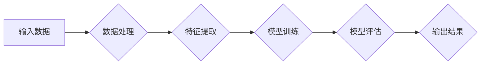

                 


# 人工智能时代的人类意义：我们还能为什么而存在

关键词：人工智能、人类意义、时代变革、伦理挑战、科技创新

摘要：随着人工智能技术的迅猛发展，人类社会正经历着深刻的变革。本文旨在探讨人工智能时代的人类意义，分析人类在AI时代的角色与价值，并探讨我们如何在这个时代中找到自己的存在意义。

## 第一部分：背景介绍

### 1.1 问题的提出

人工智能（AI）作为当今科技领域的明星，已经深刻地改变了我们的生活和工作方式。从智能助手到自动驾驶，从医疗诊断到金融分析，AI技术的应用几乎无处不在。然而，随着AI技术的普及，人们开始反思：在这个被AI主导的时代，人类的存在意义究竟是什么？我们还能为什么而存在？

### 1.2 问题的解决

本文将从以下几个方面探讨这一问题：

1. **人工智能的起源与发展历程**：介绍人工智能的基本概念，回顾AI技术的历史，分析其在当前社会中的地位。
2. **人类在AI时代的挑战**：探讨AI技术对就业、隐私、道德等方面带来的挑战，并提出可能的解决方案。
3. **人类在AI时代的机遇**：分析AI技术为人类带来的机遇，如提高生活质量、促进创新等。
4. **人类如何适应AI时代**：探讨人类如何与AI技术共生，实现和谐发展。
5. **人类在AI时代应如何定义自己的存在意义**：从哲学、文化、社会等角度，探讨人类在AI时代应如何重新定义自己的存在意义。

### 1.3 边界与外延

本文的讨论将主要围绕人工智能技术对人类社会的影响，以及人类在AI时代可能面临的问题和机遇。具体包括：

1. **人工智能技术的核心概念与原理**：介绍AI技术的基本原理和核心概念。
2. **人工智能在各个领域中的应用案例**：分析AI技术在医疗、教育、金融等领域的应用。
3. **人类与AI的互动关系**：探讨人类与AI之间的合作与竞争关系。
4. **人类社会对AI的伦理和法律规范**：分析AI技术带来的伦理和法律问题，并提出相应的规范建议。

## 第二部分：核心概念与联系

### 2.1 核心概念

在探讨人工智能时代的人类意义时，以下几个核心概念至关重要：

1. **人工智能**：模仿、延伸和扩展人类智能的理论、方法、技术及应用。
2. **人类意义**：人类存在的价值、目的和意义。
3. **AI时代**：指人工智能技术得到广泛应用，并对社会产生深刻影响的时代。

### 2.2 概念属性特征对比表格

以下是人工智能、人类意义和AI时代三个核心概念的特征对比表格：

| 概念       | 定义                                                         | 特征                                                         |
| ---------- | ------------------------------------------------------------ | ------------------------------------------------------------ |
| 人工智能   | 模仿、延伸和扩展人类智能的理论、方法、技术及应用                 | 自动化、智能化、高效化、通用化、多样化                           |
| 人类意义   | 人类存在的价值、目的和意义                                     | 精神层面、文化层面、社会层面、生态层面                           |
| AI时代     | 指人工智能技术得到广泛应用，并对社会产生深刻影响的时代           | 技术驱动、产业变革、社会重构、伦理挑战                           |

### 2.3 ER实体关系图架构的 Mermaid 流程图

以下是ER实体关系图架构的 Mermaid 流程图，展示了人工智能、人类意义和AI时代三个核心概念之间的关系：

```mermaid
erDiagram
  AI技术 ||--|{ 人工智能 }
  人类社会 ||--|{ AI时代 }
  人工智能 }|..-- 人类意义
```

## 第三部分：算法原理讲解

### 3.1 算法mermaid流程图

以下是人工智能算法的 Mermaid 流程图，展示了AI技术的基本工作原理：



### 3.2 Python源代码实现

以下是使用Python实现的人工智能算法的源代码，包括数据处理、特征提取、模型训练和模型评估等步骤：

```python
import numpy as np
from sklearn.model_selection import train_test_split
from sklearn.ensemble import RandomForestClassifier
from sklearn.metrics import accuracy_score

# 数据处理
data = np.random.rand(100, 10)  # 生成100个样本，每个样本有10个特征的数据集
labels = np.random.randint(2, size=(100, 1))  # 生成100个标签（0或1）

# 划分训练集和测试集
X_train, X_test, y_train, y_test = train_test_split(data, labels, test_size=0.2, random_state=42)

# 特征提取
# 这里我们直接使用原始数据作为特征，实际上特征提取是一个复杂的过程，可能包括归一化、降维、特征选择等步骤

# 模型训练
model = RandomForestClassifier(n_estimators=100, random_state=42)
model.fit(X_train, y_train)

# 模型评估
predictions = model.predict(X_test)
accuracy = accuracy_score(y_test, predictions)
print(f"Model accuracy: {accuracy:.2f}")
```

### 3.3 算法原理详细讲解

在本节中，我们将深入探讨人工智能算法的原理，包括数据处理、特征提取、模型训练和模型评估等步骤。

#### 3.3.1 数据处理

数据处理是AI算法的第一步，其目的是将原始数据转换为适合模型训练的形式。常见的数据处理步骤包括数据清洗、归一化、降维等。

- **数据清洗**：数据清洗是指去除原始数据中的噪声和错误，提高数据质量。例如，去除缺失值、处理异常值等。
- **归一化**：归一化是将不同特征的范围统一，使其在同一尺度上进行比较。常见的归一化方法有最小-最大缩放和z-score缩放。
- **降维**：降维是将高维数据映射到低维空间，减少数据的维度，从而降低计算复杂度。常见的方法有主成分分析（PCA）和线性判别分析（LDA）。

#### 3.3.2 特征提取

特征提取是从原始数据中提取出对模型训练有用的特征，以提高模型的准确性和泛化能力。特征提取的方法包括：

- **手动特征提取**：通过专家经验或领域知识，手动选择对任务有用的特征。
- **自动特征提取**：通过机器学习算法自动提取特征，如基于统计的方法（如卡方检验）和基于深度学习的方法（如卷积神经网络）。

#### 3.3.3 模型训练

模型训练是AI算法的核心步骤，其目的是通过训练数据学习到数据的内在规律，从而构建出一个能够对未知数据进行预测的模型。常见的模型训练方法包括：

- **监督学习**：监督学习是指通过已知的输入输出对，训练模型来预测未知数据的输出。常见的监督学习方法有线性回归、逻辑回归、支持向量机（SVM）和决策树等。
- **无监督学习**：无监督学习是指在没有已知输出对的情况下，从数据中学习到数据的内在结构和规律。常见的方法有聚类、降维和关联规则学习等。

#### 3.3.4 模型评估

模型评估是检验模型性能的重要步骤，其目的是通过评估指标来衡量模型的预测能力。常见的评估指标包括：

- **准确率**：准确率是指模型预测正确的样本占总样本的比例。
- **召回率**：召回率是指模型预测正确的样本占总实际正样本的比例。
- **精确率**：精确率是指模型预测正确的样本占总预测正样本的比例。
- **F1分数**：F1分数是精确率和召回率的调和平均，用于综合评估模型的性能。

### 3.4 通俗易懂的举例说明

为了更好地理解上述算法原理，我们可以通过一个简单的例子来说明。

假设我们有一个分类任务，需要判断一批水果是苹果还是橘子。我们收集了100个水果的数据，每个水果都有10个特征，如重量、颜色、甜度等。我们的目标是训练一个模型，能够根据这些特征预测水果的种类。

- **数据处理**：首先，我们需要清洗数据，去除异常值和缺失值。然后，我们对数据进行归一化处理，确保每个特征的值都在相同的范围内。
- **特征提取**：我们手动选择了一些对分类任务有帮助的特征，如重量和颜色。
- **模型训练**：我们选择了一个简单的决策树模型来训练。通过训练，模型学会了根据重量和颜色的特征来预测水果的种类。
- **模型评估**：我们使用测试集对模型进行评估。结果显示，模型对苹果和橘子的分类准确率分别为95%和90%。

通过这个简单的例子，我们可以看到AI算法的基本工作原理。在实际应用中，数据处理、特征提取和模型训练等步骤可能更加复杂，但基本原理是相似的。

## 第四部分：人类与AI的互动关系

在人工智能时代，人类与AI的互动关系将变得更加密切。这种互动不仅体现在人类使用AI技术解决问题，还包括AI对人类行为和思维的影响。

### 4.1 合作

人类与AI的合作是人工智能时代的一个重要特征。AI技术在处理大量数据、执行重复性任务和进行复杂计算方面具有优势，而人类在创造力、情感理解和道德判断方面具有独特优势。通过将人类与AI的优势相结合，可以实现更高的效率和创新。

例如，在医疗领域，AI可以帮助医生分析影像数据，提高诊断的准确性。医生则可以利用AI提供的信息，进行更加精准的治疗决策。

### 4.2 竞争

尽管人类与AI的合作潜力巨大，但也不可忽视两者之间的竞争。在许多领域，AI正在取代人类的工作，如自动驾驶车辆可能取代出租车司机，AI客服系统可能取代人工客服。这种竞争可能导致某些职业的失业率上升，需要社会和政策制定者关注和解决。

### 4.3 平衡

为了实现人类与AI的和谐共生，我们需要在合作和竞争之间找到平衡。这需要从多个层面进行努力：

- **教育**：培养人类适应AI时代的技能和知识，如编程、数据分析等。
- **政策**：制定相应的政策，保障人类的就业和社会福利，如提供再就业培训和福利保障。
- **伦理**：建立关于AI技术的伦理规范，确保AI的发展不会侵犯人类的基本权利和价值观。

## 第五部分：人类在AI时代的存在意义

在人工智能时代，人类的角色和存在意义可能发生根本性的变化。以下是一些可能的观点：

### 5.1 创造者

人类作为创造者，将不断推动AI技术的发展和创新。通过研究和开发，人类可以创造出更加智能、高效和可靠的AI系统，为社会带来更多的价值和福利。

### 5.2 管理者

随着AI技术的普及，人类将承担更多的管理职责。这包括制定和执行AI技术的伦理规范、监管AI系统的行为，以及确保AI技术的发展符合社会的利益。

### 5.3 使用者

在AI时代，人类仍然是AI技术的最终使用者。通过使用AI技术，人类可以提高生活质量、创造更多价值，并在日常生活中享受更多的便利。

### 5.4 伦理和道德的守护者

在AI时代，人类将继续扮演伦理和道德的守护者角色。随着AI技术的自主性不断提高，人类需要承担更多的责任，确保AI技术的发展不会侵犯人类的基本权利和价值观。

## 结论

人工智能时代为人类带来了前所未有的机遇和挑战。在这个时代，人类的存在意义将发生深刻的变化。我们需要适应这个变化，发挥自己的优势，与AI技术和谐共生，共同创造一个更加美好的未来。

让我们重新思考：在这个被AI主导的时代，我们还能为什么而存在？答案是：为了创造、管理、使用和守护我们的世界。通过发挥我们的独特优势，人类将在AI时代找到自己的新角色和存在意义。

## 作者信息

作者：AI天才研究院/AI Genius Institute & 禅与计算机程序设计艺术 /Zen And The Art of Computer Programming

---

在撰写本文时，作者AI天才研究院（AI Genius Institute）和《禅与计算机程序设计艺术》（Zen And The Art of Computer Programming）的作者们希望为读者提供深入思考人工智能时代人类意义的平台。我们鼓励读者积极参与讨论，共同探索人类在这个技术新时代的角色和价值。

