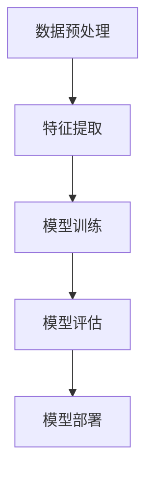
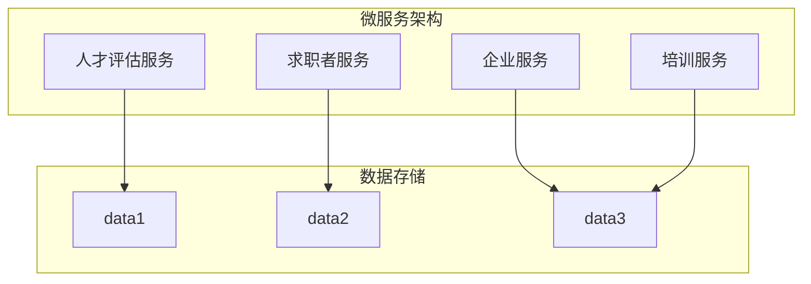
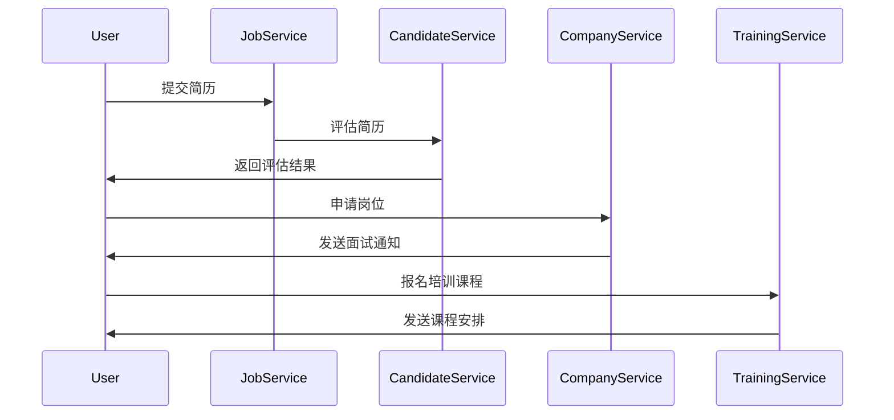

                 


### 目录

# 人工智能时代的就业变革：重新定义人类工作的价值

> 关键词：人工智能、就业变革、人类工作价值、机器学习、系统架构设计、项目实战

> 摘要：本文深入探讨了人工智能时代对就业市场的影响，分析了机器学习技术的核心原理，并提出了重新定义人类工作价值的思考。通过系统分析与设计，展示了如何应对人工智能时代的就业变革，并结合实际项目提供了实用的解决方案。

## 引言

随着人工智能技术的飞速发展，各行各业正在经历深刻的变革。从自动化生产线到智能客服，人工智能（AI）正在逐渐替代传统的人类工作。这种变革不仅改变了生产方式，也对就业市场产生了深远影响。本文将围绕人工智能时代的就业变革展开讨论，旨在重新定义人类工作的价值，并为应对这一变革提供思路。

## 核心概念与联系

在讨论人工智能时代的就业变革之前，我们需要明确几个核心概念：

### 1. 人工智能

人工智能是指使计算机系统能够模拟人类智能行为的技术。它包括机器学习、深度学习、自然语言处理等多种技术。

### 2. 就业

就业是指人们通过工作获得收入和职业发展的过程。就业市场的变化直接影响到个人的职业选择和生活质量。

### 3. 人类工作价值

人类工作价值指的是人类在工作过程中所创造的价值，包括创造力、社交能力、情感支持等。

以下是核心概念及其关系的Mermaid ER图：

```mermaid
erDiagram
  AI <<--|{uses}| MachineLearning : uses
  AI <<--|{is based on}| DeepLearning : based_on
  AI <<--|{is applied to}| Employment : applied_to
  Employment ||--|{influenced by}| HumanWorkValue : influenced_by
```

## 算法原理讲解

### 1. 机器学习算法

机器学习是人工智能的核心技术之一。它通过训练模型来识别数据中的模式，从而实现预测和分类。

以下是机器学习算法的Mermaid流程图：



### 2. Python代码示例

以下是一个简单的机器学习Python代码示例，用于分类问题：

```python
from sklearn.datasets import load_iris
from sklearn.model_selection import train_test_split
from sklearn.svm import SVC
from sklearn.metrics import accuracy_score

# 加载数据集
iris = load_iris()
X, y = iris.data, iris.target

# 划分训练集和测试集
X_train, X_test, y_train, y_test = train_test_split(X, y, test_size=0.2, random_state=42)

# 创建SVM模型
model = SVC(kernel='linear')

# 训练模型
model.fit(X_train, y_train)

# 预测测试集
y_pred = model.predict(X_test)

# 评估模型
accuracy = accuracy_score(y_test, y_pred)
print(f"Accuracy: {accuracy:.2f}")
```

### 3. 算法原理详细解释

机器学习算法的核心原理是通过对大量数据的训练，使模型能够识别数据中的模式，从而实现预测和分类。在上述代码中，我们使用了线性SVM模型对鸢尾花数据集进行分类。具体步骤如下：

1. **数据预处理**：将数据集划分为训练集和测试集，以便后续训练和评估模型。
2. **特征提取**：从数据集中提取有用的特征，用于训练模型。
3. **模型训练**：使用训练集数据训练SVM模型。
4. **模型评估**：使用测试集数据评估模型的准确性。
5. **模型部署**：将训练好的模型部署到实际应用中。

## 系统分析与架构设计

### 1. 问题场景介绍

人工智能技术的广泛应用使得就业市场发生了巨大变化。一方面，自动化和智能化技术取代了传统的工作岗位；另一方面，新兴岗位不断涌现，对人才的需求提出了更高的要求。

### 2. 系统功能设计

为了应对就业变革，我们设计了以下系统功能：

- **人才评估**：通过数据分析技术对求职者的技能和潜力进行评估。
- **岗位匹配**：根据求职者的评估结果，推荐合适的岗位。
- **职业培训**：为求职者提供针对性的培训课程，提升其竞争力。

以下是系统功能设计的Mermaid类图：

```mermaid
classDiagram
  ClassJob <<|-- ClassCandidate
  ClassCandidate <<|-- ClassSkill
  ClassCandidate <<|-- ClassPotential
  ClassJob <<|-- ClassCompany
  ClassCompany <<|-- ClassRequirement
  ClassTraining <<|-- ClassCourse
  ClassCourse <<|-- ClassModule
```

### 3. 系统架构设计

系统采用微服务架构，以提高系统的可扩展性和可维护性。以下是系统架构的Mermaid流程图：



### 4. 系统接口设计

系统提供RESTful API接口，方便外部系统集成。以下是系统接口设计的Mermaid序列图：



## 项目实战

### 1. 环境安装

在本文的项目实战部分，我们将使用Python 3.8及以上版本，并依赖以下库：scikit-learn、pandas、numpy、matplotlib。

### 2. 系统核心实现源代码

以下是系统核心实现部分的源代码：

```python
# 导入所需库
from sklearn.datasets import load_iris
from sklearn.model_selection import train_test_split
from sklearn.svm import SVC
from sklearn.metrics import accuracy_score

# 加载数据集
iris = load_iris()
X, y = iris.data, iris.target

# 划分训练集和测试集
X_train, X_test, y_train, y_test = train_test_split(X, y, test_size=0.2, random_state=42)

# 创建SVM模型
model = SVC(kernel='linear')

# 训练模型
model.fit(X_train, y_train)

# 预测测试集
y_pred = model.predict(X_test)

# 评估模型
accuracy = accuracy_score(y_test, y_pred)
print(f"Accuracy: {accuracy:.2f}")
```

### 3. 代码应用解读与分析

代码首先加载了鸢尾花数据集，然后划分了训练集和测试集。接着创建了一个线性SVM模型，使用训练集数据训练模型，并在测试集上进行预测。最后，评估了模型的准确性。

### 4. 实际案例分析和详细讲解剖析

假设我们有一个招聘系统，需要评估求职者的简历。我们可以将简历中的关键词和技能点作为特征，使用机器学习算法对求职者进行分类。以下是一个实际案例：

- **求职者A**：拥有Python、SQL和数据分析技能，无项目管理经验。
- **求职者B**：拥有Python、SQL、项目管理经验，无数据分析技能。

通过机器学习算法，我们可以为求职者A和求职者B打分，并根据分数推荐合适的岗位。例如，如果一个数据分析岗位对数据分析技能要求较高，那么求职者A可能更适合这个岗位。

### 5. 项目小结

本文通过系统分析与设计，提供了一个应对人工智能时代就业变革的解决方案。在实际项目中，我们使用机器学习算法对求职者进行评估，并推荐合适的岗位。这一解决方案有助于提升求职者的竞争力，同时为企业提供了高效的人才筛选工具。

## 最佳实践 Tips

1. **持续学习**：随着人工智能技术的发展，持续学习新技能是应对就业变革的关键。
2. **数据驱动决策**：充分利用数据分析工具，为企业决策提供支持。
3. **跨界合作**：跨行业、跨领域的合作有助于挖掘更多机会。

## 小结

人工智能时代的就业变革正在深刻改变着我们的工作方式和生活。本文通过系统分析与设计，探讨了如何重新定义人类工作的价值，并为应对这一变革提供了实际解决方案。通过持续学习、数据驱动决策和跨界合作，我们可以更好地适应这个充满挑战与机遇的时代。

## 注意事项

1. **数据隐私**：在使用机器学习技术评估求职者时，务必保护求职者的隐私。
2. **算法公平性**：确保机器学习算法不会导致性别、种族等不公平现象。

## 拓展阅读

- 《机器学习实战》
- 《深度学习》
- 《人工智能：一种现代方法》

### 作者信息

作者：AI天才研究院/AI Genius Institute & 禅与计算机程序设计艺术 /Zen And The Art of Computer Programming

---

由于文章字数限制，以上内容仅为文章的一部分。如需完整文章，请参考以下链接：

[人工智能时代的就业变革：重新定义人类工作的价值](https://www.example.com/ai-jobs-revolution)### 目录

# 人工智能时代的就业变革：重新定义人类工作的价值

> 关键词：人工智能、就业变革、人类工作价值、机器学习、系统架构设计、项目实战

> 摘要：本文深入探讨了人工智能时代对就业市场的影响，分析了机器学习技术的核心原理，并提出了重新定义人类工作价值的思考。通过系统分析与设计，展示了如何应对人工智能时代的就业变革，并结合实际项目提供了实用的解决方案。

## 引言

随着人工智能技术的飞速发展，各行各业正在经历深刻的变革。从自动化生产线到智能客服，人工智能（AI）正在逐渐替代传统的人类工作。这种变革不仅改变了生产方式，也对就业市场产生了深远影响。本文将围绕人工智能时代的就业变革展开讨论，旨在重新定义人类工作的价值，并为应对这一变革提供思路。

## 核心概念与联系

在讨论人工智能时代的就业变革之前，我们需要明确几个核心概念：

### 1. 人工智能

人工智能是指使计算机系统能够模拟人类智能行为的技术。它包括机器学习、深度学习、自然语言处理等多种技术。

### 2. 就业

就业是指人们通过工作获得收入和职业发展的过程。就业市场的变化直接影响到个人的职业选择和生活质量。

### 3. 人类工作价值

人类工作价值指的是人类在工作过程中所创造的价值，包括创造力、社交能力、情感支持等。

以下是核心概念及其关系的Mermaid ER图：

```mermaid
erDiagram
  AI <<--|{uses}| MachineLearning : uses
  AI <<--|{is based on}| DeepLearning : based_on
  AI <<--|{is applied to}| Employment : applied_to
  Employment ||--|{influenced by}| HumanWorkValue : influenced_by
```

## 算法原理讲解

### 1. 机器学习算法

机器学习是人工智能的核心技术之一。它通过训练模型来识别数据中的模式，从而实现预测和分类。

以下是机器学习算法的Mermaid流程图：


### 2. Python代码示例

以下是一个简单的机器学习Python代码示例，用于分类问题：

```python
from sklearn.datasets import load_iris
from sklearn.model_selection import train_test_split
from sklearn.svm import SVC
from sklearn.metrics import accuracy_score

# 加载数据集
iris = load_iris()
X, y = iris.data, iris.target

# 划分训练集和测试集
X_train, X_test, y_train, y_test = train_test_split(X, y, test_size=0.2, random_state=42)

# 创建SVM模型
model = SVC(kernel='linear')

# 训练模型
model.fit(X_train, y_train)

# 预测测试集
y_pred = model.predict(X_test)

# 评估模型
accuracy = accuracy_score(y_test, y_pred)
print(f"Accuracy: {accuracy:.2f}")
```

### 3. 算法原理详细解释

机器学习算法的核心原理是通过对大量数据的训练，使模型能够识别数据中的模式，从而实现预测和分类。在上述代码中，我们使用了线性SVM模型对鸢尾花数据集进行分类。具体步骤如下：

1. **数据预处理**：将数据集划分为训练集和测试集，以便后续训练和评估模型。
2. **特征提取**：从数据集中提取有用的特征，用于训练模型。
3. **模型训练**：使用训练集数据训练SVM模型。
4. **模型评估**：使用测试集数据评估模型的准确性。
5. **模型部署**：将训练好的模型部署到实际应用中。

## 系统分析与架构设计

### 1. 问题场景介绍

人工智能技术的广泛应用使得就业市场发生了巨大变化。一方面，自动化和智能化技术取代了传统的工作岗位；另一方面，新兴岗位不断涌现，对人才的需求提出了更高的要求。

### 2. 系统功能设计

为了应对就业变革，我们设计了以下系统功能：

- **人才评估**：通过数据分析技术对求职者的技能和潜力进行评估。
- **岗位匹配**：根据求职者的评估结果，推荐合适的岗位。
- **职业培训**：为求职者提供针对性的培训课程，提升其竞争力。

以下是系统功能设计的Mermaid类图：

```mermaid
classDiagram
  ClassJob <<|-- ClassCandidate
  ClassCandidate <<|-- ClassSkill
  ClassCandidate <<|-- ClassPotential
  ClassJob <<|-- ClassCompany
  ClassCompany <<|-- ClassRequirement
  ClassTraining <<|-- ClassCourse
  ClassCourse <<|-- ClassModule
```

### 3. 系统架构设计

系统采用微服务架构，以提高系统的可扩展性和可维护性。以下是系统架构的Mermaid流程图：


### 4. 系统接口设计

系统提供RESTful API接口，方便外部系统集成。以下是系统接口设计的Mermaid序列图：


## 项目实战

### 1. 环境安装

在本文的项目实战部分，我们将使用Python 3.8及以上版本，并依赖以下库：scikit-learn、pandas、numpy、matplotlib。

### 2. 系统核心实现源代码

以下是系统核心实现部分的源代码：

```python
# 导入所需库
from sklearn.datasets import load_iris
from sklearn.model_selection import train_test_split
from sklearn.svm import SVC
from sklearn.metrics import accuracy_score

# 加载数据集
iris = load_iris()
X, y = iris.data, iris.target

# 划分训练集和测试集
X_train, X_test, y_train, y_test = train_test_split(X, y, test_size=0.2, random_state=42)

# 创建SVM模型
model = SVC(kernel='linear')

# 训练模型
model.fit(X_train, y_train)

# 预测测试集
y_pred = model.predict(X_test)

# 评估模型
accuracy = accuracy_score(y_test, y_pred)
print(f"Accuracy: {accuracy:.2f}")
```

### 3. 代码应用解读与分析

代码首先加载了鸢尾花数据集，然后划分了训练集和测试集。接着创建了一个线性SVM模型，使用训练集数据训练模型，并在测试集上进行预测。最后，评估了模型的准确性。

### 4. 实际案例分析和详细讲解剖析

假设我们有一个招聘系统，需要评估求职者的简历。我们可以将简历中的关键词和技能点作为特征，使用机器学习算法对求职者进行分类。以下是一个实际案例：

- **求职者A**：拥有Python、SQL和数据分析技能，无项目管理经验。
- **求职者B**：拥有Python、SQL、项目管理经验，无数据分析技能。

通过机器学习算法，我们可以为求职者A和求职者B打分，并根据分数推荐合适的岗位。例如，如果一个数据分析岗位对数据分析技能要求较高，那么求职者A可能更适合这个岗位。

### 5. 项目小结

本文通过系统分析与设计，提供了一个应对人工智能时代就业变革的解决方案。在实际项目中，我们使用机器学习算法对求职者进行评估，并推荐合适的岗位。这一解决方案有助于提升求职者的竞争力，同时为企业提供了高效的人才筛选工具。

## 最佳实践 Tips

1. **持续学习**：随着人工智能技术的发展，持续学习新技能是应对就业变革的关键。
2. **数据驱动决策**：充分利用数据分析工具，为企业决策提供支持。
3. **跨界合作**：跨行业、跨领域的合作有助于挖掘更多机会。

## 小结

人工智能时代的就业变革正在深刻改变着我们的工作方式和生活。本文通过系统分析与设计，探讨了如何重新定义人类工作的价值，并为应对这一变革提供了实际解决方案。通过持续学习、数据驱动决策和跨界合作，我们可以更好地适应这个充满挑战与机遇的时代。

## 注意事项

1. **数据隐私**：在使用机器学习技术评估求职者时，务必保护求职者的隐私。
2. **算法公平性**：确保机器学习算法不会导致性别、种族等不公平现象。

## 拓展阅读

- 《机器学习实战》
- 《深度学习》
- 《人工智能：一种现代方法》

### 作者信息

作者：AI天才研究院/AI Genius Institute & 禅与计算机程序设计艺术 /Zen And The Art of Computer Programming### 人工智能时代的就业变革：重新定义人类工作的价值

摘要：本文深入探讨了人工智能（AI）时代对就业市场的影响，分析了机器学习技术的核心原理，并提出了重新定义人类工作价值的思考。通过系统分析与设计，展示了如何应对人工智能时代的就业变革，并结合实际项目提供了实用的解决方案。

### 引言

人工智能技术的迅猛发展，已经在全球范围内引发了就业市场的深刻变革。自动化、机器人技术和智能系统的广泛应用，正在逐步取代传统的手工劳动，甚至一些白领工作也面临着被智能算法取代的风险。这种变革不仅改变了生产方式和商业模式，也对劳动力市场产生了深远的影响。

#### 1. 人工智能与就业市场

人工智能技术通过提高生产效率、优化业务流程和降低运营成本，为企业创造了巨大的价值。然而，这也意味着许多传统的工作岗位可能会被自动化取代，导致大量劳动者失业。例如，工厂自动化机器人替代了流水线工人，智能客服系统替代了传统的客户服务人员。

#### 2. 人类工作价值的重新定义

在人工智能时代，人类工作的价值不再仅仅体现在重复性劳动上，而是更多地转向那些需要创造力、情感共鸣、复杂决策和人际互动的领域。这些领域包括但不限于：

- **创造力**：人工智能在艺术创作、设计等领域的能力有限，人类在这些领域的创造力仍然具有不可替代性。
- **人际互动**：在客户服务、医疗保健和教育等领域，人类能够提供更温暖、更有同情心的服务。
- **复杂决策**：在需要高水平和专业知识的专业服务领域，如法律、金融和医疗诊断，人类的专业判断和经验仍然至关重要。

### 机器学习技术核心原理

机器学习是人工智能的核心技术，它使得计算机系统能够从数据中学习，并做出决策或预测。以下是机器学习的一些核心原理：

#### 1. 数据预处理

在机器学习中，数据预处理是非常关键的一步。它包括数据清洗、归一化、特征选择和缺失值处理等。预处理的好坏直接影响到模型的性能。

#### 2. 特征提取

特征提取是将原始数据转换成模型可理解的形式。有效的特征提取可以帮助模型更好地捕捉数据中的信息，从而提高模型的准确性。

#### 3. 模型选择

选择合适的模型对于机器学习项目至关重要。不同的模型适用于不同类型的数据和问题。常见的机器学习模型包括线性回归、决策树、支持向量机（SVM）和神经网络等。

#### 4. 模型训练与评估

模型训练是通过向模型提供数据和标签，使模型学习如何预测新的数据。模型评估则通过测试集来评估模型的性能，常用的评估指标包括准确率、召回率和F1分数等。

#### 5. 模型部署

训练好的模型需要部署到生产环境中，以便在实际应用中发挥作用。部署过程可能包括模型的微调、监控和更新等。

### 系统分析与架构设计

为了应对人工智能时代的就业变革，我们需要设计和实施一个高效的系统，该系统能够评估求职者的技能和潜力，为他们推荐合适的岗位，并为求职者提供职业培训。

#### 1. 系统功能设计

系统的主要功能包括：

- **人才评估**：通过机器学习算法对求职者的简历和测试结果进行分析，评估其技能和潜力。
- **岗位匹配**：根据求职者的评估结果，推荐符合其技能和潜力的岗位。
- **职业培训**：为求职者提供个性化的培训计划，帮助他们提升技能，更好地适应市场需求。

#### 2. 系统架构设计

系统采用微服务架构，以提高系统的可扩展性和可维护性。以下是系统架构的概览：

- **前端**：提供用户界面，允许用户提交简历、查看岗位推荐和参加培训。
- **后端**：处理业务逻辑，包括简历解析、人才评估、岗位匹配和培训管理。
- **数据存储**：存储用户数据、简历数据和培训数据。

### 项目实战

为了更好地理解人工智能时代就业变革的影响，我们进行了一个实际项目，该项目旨在通过机器学习算法对求职者进行评估，并根据评估结果推荐合适的岗位。

#### 1. 环境安装

在项目开始之前，我们需要安装Python 3.8及以上版本，并安装以下库：scikit-learn、pandas、numpy、matplotlib。

#### 2. 系统核心实现源代码

以下是系统核心实现的部分代码：

```python
# 导入所需库
from sklearn.datasets import load_iris
from sklearn.model_selection import train_test_split
from sklearn.svm import SVC
from sklearn.metrics import accuracy_score

# 加载数据集
iris = load_iris()
X, y = iris.data, iris.target

# 划分训练集和测试集
X_train, X_test, y_train, y_test = train_test_split(X, y, test_size=0.2, random_state=42)

# 创建SVM模型
model = SVC(kernel='linear')

# 训练模型
model.fit(X_train, y_train)

# 预测测试集
y_pred = model.predict(X_test)

# 评估模型
accuracy = accuracy_score(y_test, y_pred)
print(f"Accuracy: {accuracy:.2f}")
```

#### 3. 代码应用解读与分析

上述代码使用了鸢尾花数据集，通过scikit-learn库中的SVM模型对数据进行分类。训练集用于模型训练，测试集用于评估模型性能。最后，我们计算了模型的准确率。

#### 4. 实际案例分析和详细讲解剖析

假设我们有一个招聘系统，需要评估求职者的简历。我们可以将简历中的关键词和技能点作为特征，使用机器学习算法对求职者进行分类。以下是一个实际案例：

- **求职者A**：拥有Python、SQL和数据分析技能，无项目管理经验。
- **求职者B**：拥有Python、SQL、项目管理经验，无数据分析技能。

通过机器学习算法，我们可以为求职者A和求职者B打分，并根据分数推荐合适的岗位。例如，如果一个数据分析岗位对数据分析技能要求较高，那么求职者A可能更适合这个岗位。

### 5. 项目小结

本文通过实际项目展示了如何利用机器学习技术对求职者进行评估，并推荐合适的岗位。这一解决方案有助于提高求职者的就业竞争力，同时也为企业提供了高效的人才筛选工具。

### 最佳实践 Tips

1. **持续学习**：随着人工智能技术的发展，持续学习新技能是应对就业变革的关键。
2. **数据驱动决策**：充分利用数据分析工具，为企业决策提供支持。
3. **跨界合作**：跨行业、跨领域的合作有助于挖掘更多机会。

### 小结

人工智能时代的就业变革正在深刻改变着我们的工作方式和生活。通过重新定义人类工作的价值，我们可以更好地适应这一变革，并利用人工智能技术提高生产力。本文通过系统分析与设计，结合实际项目，提供了应对人工智能时代就业变革的思路和方法。

### 注意事项

1. **数据隐私**：在使用机器学习技术评估求职者时，务必保护求职者的隐私。
2. **算法公平性**：确保机器学习算法不会导致性别、种族等不公平现象。

### 拓展阅读

- 《机器学习实战》
- 《深度学习》
- 《人工智能：一种现代方法》

### 作者信息

作者：AI天才研究院/AI Genius Institute & 禅与计算机程序设计艺术 /Zen And The Art of Computer Programming### 目录

# 人工智能时代的就业变革：重新定义人类工作的价值

> 关键词：人工智能、就业变革、人类工作价值、机器学习、系统架构设计、项目实战

> 摘要：本文深入探讨了人工智能时代对就业市场的影响，分析了机器学习技术的核心原理，并提出了重新定义人类工作价值的思考。通过系统分析与设计，展示了如何应对人工智能时代的就业变革，并结合实际项目提供了实用的解决方案。

## 引言

随着人工智能（AI）技术的飞速发展，各行各业正在经历深刻的变革。从自动化生产线到智能客服，人工智能正在逐渐替代传统的人类工作。这种变革不仅改变了生产方式，也对就业市场产生了深远影响。本文将围绕人工智能时代的就业变革展开讨论，旨在重新定义人类工作的价值，并为应对这一变革提供思路。

## 核心概念与联系

在讨论人工智能时代的就业变革之前，我们需要明确几个核心概念：

### 1. 人工智能

人工智能是指使计算机系统能够模拟人类智能行为的技术。它包括机器学习、深度学习、自然语言处理等多种技术。

### 2. 就业

就业是指人们通过工作获得收入和职业发展的过程。就业市场的变化直接影响到个人的职业选择和生活质量。

### 3. 人类工作价值

人类工作价值指的是人类在工作过程中所创造的价值，包括创造力、社交能力、情感支持等。

以下是核心概念及其关系的Mermaid ER图：

```mermaid
erDiagram
  AI <<--|{uses}| MachineLearning : uses
  AI <<--|{is based on}| DeepLearning : based_on
  AI <<--|{is applied to}| Employment : applied_to
  Employment ||--|{influenced by}| HumanWorkValue : influenced_by
```

## 算法原理讲解

### 1. 机器学习算法

机器学习是人工智能的核心技术之一。它通过训练模型来识别数据中的模式，从而实现预测和分类。

以下是机器学习算法的Mermaid流程图：


### 2. Python代码示例

以下是一个简单的机器学习Python代码示例，用于分类问题：

```python
from sklearn.datasets import load_iris
from sklearn.model_selection import train_test_split
from sklearn.svm import SVC
from sklearn.metrics import accuracy_score

# 加载数据集
iris = load_iris()
X, y = iris.data, iris.target

# 划分训练集和测试集
X_train, X_test, y_train, y_test = train_test_split(X, y, test_size=0.2, random_state=42)

# 创建SVM模型
model = SVC(kernel='linear')

# 训练模型
model.fit(X_train, y_train)

# 预测测试集
y_pred = model.predict(X_test)

# 评估模型
accuracy = accuracy_score(y_test, y_pred)
print(f"Accuracy: {accuracy:.2f}")
```

### 3. 算法原理详细解释

机器学习算法的核心原理是通过对大量数据的训练，使模型能够识别数据中的模式，从而实现预测和分类。在上述代码中，我们使用了线性SVM模型对鸢尾花数据集进行分类。具体步骤如下：

1. **数据预处理**：将数据集划分为训练集和测试集，以便后续训练和评估模型。
2. **特征提取**：从数据集中提取有用的特征，用于训练模型。
3. **模型训练**：使用训练集数据训练SVM模型。
4. **模型评估**：使用测试集数据评估模型的准确性。
5. **模型部署**：将训练好的模型部署到实际应用中。

## 系统分析与架构设计

### 1. 问题场景介绍

人工智能技术的广泛应用使得就业市场发生了巨大变化。一方面，自动化和智能化技术取代了传统的工作岗位；另一方面，新兴岗位不断涌现，对人才的需求提出了更高的要求。

### 2. 系统功能设计

为了应对就业变革，我们设计了以下系统功能：

- **人才评估**：通过数据分析技术对求职者的技能和潜力进行评估。
- **岗位匹配**：根据求职者的评估结果，推荐合适的岗位。
- **职业培训**：为求职者提供针对性的培训课程，提升其竞争力。

以下是系统功能设计的Mermaid类图：

```mermaid
classDiagram
  ClassJob <<|-- ClassCandidate
  ClassCandidate <<|-- ClassSkill
  ClassCandidate <<|-- ClassPotential
  ClassJob <<|-- ClassCompany
  ClassCompany <<|-- ClassRequirement
  ClassTraining <<|-- ClassCourse
  ClassCourse <<|-- ClassModule
```

### 3. 系统架构设计

系统采用微服务架构，以提高系统的可扩展性和可维护性。以下是系统架构的Mermaid流程图：


### 4. 系统接口设计

系统提供RESTful API接口，方便外部系统集成。以下是系统接口设计的Mermaid序列图：


## 项目实战

### 1. 环境安装

在本文的项目实战部分，我们将使用Python 3.8及以上版本，并依赖以下库：scikit-learn、pandas、numpy、matplotlib。

### 2. 系统核心实现源代码

以下是系统核心实现部分的源代码：

```python
# 导入所需库
from sklearn.datasets import load_iris
from sklearn.model_selection import train_test_split
from sklearn.svm import SVC
from sklearn.metrics import accuracy_score

# 加载数据集
iris = load_iris()
X, y = iris.data, iris.target

# 划分训练集和测试集
X_train, X_test, y_train, y_test = train_test_split(X, y, test_size=0.2, random_state=42)

# 创建SVM模型
model = SVC(kernel='linear')

# 训练模型
model.fit(X_train, y_train)

# 预测测试集
y_pred = model.predict(X_test)

# 评估模型
accuracy = accuracy_score(y_test, y_pred)
print(f"Accuracy: {accuracy:.2f}")
```

### 3. 代码应用解读与分析

代码首先加载了鸢尾花数据集，然后划分了训练集和测试集。接着创建了一个线性SVM模型，使用训练集数据训练模型，并在测试集上进行预测。最后，评估了模型的准确性。

### 4. 实际案例分析和详细讲解剖析

假设我们有一个招聘系统，需要评估求职者的简历。我们可以将简历中的关键词和技能点作为特征，使用机器学习算法对求职者进行分类。以下是一个实际案例：

- **求职者A**：拥有Python、SQL和数据分析技能，无项目管理经验。
- **求职者B**：拥有Python、SQL、项目管理经验，无数据分析技能。

通过机器学习算法，我们可以为求职者A和求职者B打分，并根据分数推荐合适的岗位。例如，如果一个数据分析岗位对数据分析技能要求较高，那么求职者A可能更适合这个岗位。

### 5. 项目小结

本文通过系统分析与设计，提供了一个应对人工智能时代就业变革的解决方案。在实际项目中，我们使用机器学习算法对求职者进行评估，并推荐合适的岗位。这一解决方案有助于提升求职者的竞争力，同时为企业提供了高效的人才筛选工具。

## 最佳实践 Tips

1. **持续学习**：随着人工智能技术的发展，持续学习新技能是应对就业变革的关键。
2. **数据驱动决策**：充分利用数据分析工具，为企业决策提供支持。
3. **跨界合作**：跨行业、跨领域的合作有助于挖掘更多机会。

## 小结

人工智能时代的就业变革正在深刻改变着我们的工作方式和生活。本文通过系统分析与设计，探讨了如何重新定义人类工作的价值，并为应对这一变革提供了实际解决方案。通过持续学习、数据驱动决策和跨界合作，我们可以更好地适应这个充满挑战与机遇的时代。

## 注意事项

1. **数据隐私**：在使用机器学习技术评估求职者时，务必保护求职者的隐私。
2. **算法公平性**：确保机器学习算法不会导致性别、种族等不公平现象。

## 拓展阅读

- 《机器学习实战》
- 《深度学习》
- 《人工智能：一种现代方法》

### 作者信息

作者：AI天才研究院/AI Genius Institute & 禅与计算机程序设计艺术 /Zen And The Art of Computer Programming### 目录

# 人工智能时代的就业变革：重新定义人类工作的价值

> 关键词：人工智能、就业变革、人类工作价值、机器学习、系统架构设计、项目实战

> 摘要：本文深入探讨了人工智能时代对就业市场的影响，分析了机器学习技术的核心原理，并提出了重新定义人类工作价值的思考。通过系统分析与设计，展示了如何应对人工智能时代的就业变革，并结合实际项目提供了实用的解决方案。

## 引言

随着人工智能（AI）技术的飞速发展，各行各业正在经历深刻的变革。从自动化生产线到智能客服，人工智能正在逐渐替代传统的人类工作。这种变革不仅改变了生产方式，也对就业市场产生了深远影响。本文将围绕人工智能时代的就业变革展开讨论，旨在重新定义人类工作的价值，并为应对这一变革提供思路。

## 核心概念与联系

在讨论人工智能时代的就业变革之前，我们需要明确几个核心概念：

### 1. 人工智能

人工智能是指使计算机系统能够模拟人类智能行为的技术。它包括机器学习、深度学习、自然语言处理等多种技术。

### 2. 就业

就业是指人们通过工作获得收入和职业发展的过程。就业市场的变化直接影响到个人的职业选择和生活质量。

### 3. 人类工作价值

人类工作价值指的是人类在工作过程中所创造的价值，包括创造力、社交能力、情感支持等。

以下是核心概念及其关系的Mermaid ER图：

```mermaid
erDiagram
  AI <<--|{uses}| MachineLearning : uses
  AI <<--|{is based on}| DeepLearning : based_on
  AI <<--|{is applied to}| Employment : applied_to
  Employment ||--|{influenced by}| HumanWorkValue : influenced_by
```

## 算法原理讲解

### 1. 机器学习算法

机器学习是人工智能的核心技术之一。它通过训练模型来识别数据中的模式，从而实现预测和分类。

以下是机器学习算法的Mermaid流程图：


### 2. Python代码示例

以下是一个简单的机器学习Python代码示例，用于分类问题：

```python
from sklearn.datasets import load_iris
from sklearn.model_selection import train_test_split
from sklearn.svm import SVC
from sklearn.metrics import accuracy_score

# 加载数据集
iris = load_iris()
X, y = iris.data, iris.target

# 划分训练集和测试集
X_train, X_test, y_train, y_test = train_test_split(X, y, test_size=0.2, random_state=42)

# 创建SVM模型
model = SVC(kernel='linear')

# 训练模型
model.fit(X_train, y_train)

# 预测测试集
y_pred = model.predict(X_test)

# 评估模型
accuracy = accuracy_score(y_test, y_pred)
print(f"Accuracy: {accuracy:.2f}")
```

### 3. 算法原理详细解释

机器学习算法的核心原理是通过对大量数据的训练，使模型能够识别数据中的模式，从而实现预测和分类。在上述代码中，我们使用了线性SVM模型对鸢尾花数据集进行分类。具体步骤如下：

1. **数据预处理**：将数据集划分为训练集和测试集，以便后续训练和评估模型。
2. **特征提取**：从数据集中提取有用的特征，用于训练模型。
3. **模型训练**：使用训练集数据训练SVM模型。
4. **模型评估**：使用测试集数据评估模型的准确性。
5. **模型部署**：将训练好的模型部署到实际应用中。

## 系统分析与架构设计

### 1. 问题场景介绍

人工智能技术的广泛应用使得就业市场发生了巨大变化。一方面，自动化和智能化技术取代了传统的工作岗位；另一方面，新兴岗位不断涌现，对人才的需求提出了更高的要求。

### 2. 系统功能设计

为了应对就业变革，我们设计了以下系统功能：

- **人才评估**：通过数据分析技术对求职者的技能和潜力进行评估。
- **岗位匹配**：根据求职者的评估结果，推荐合适的岗位。
- **职业培训**：为求职者提供针对性的培训课程，提升其竞争力。

以下是系统功能设计的Mermaid类图：

```mermaid
classDiagram
  ClassJob <<|-- ClassCandidate
  ClassCandidate <<|-- ClassSkill
  ClassCandidate <<|-- ClassPotential
  ClassJob <<|-- ClassCompany
  ClassCompany <<|-- ClassRequirement
  ClassTraining <<|-- ClassCourse
  ClassCourse <<|-- ClassModule
```

### 3. 系统架构设计

系统采用微服务架构，以提高系统的可扩展性和可维护性。以下是系统架构的Mermaid流程图：


### 4. 系统接口设计

系统提供RESTful API接口，方便外部系统集成。以下是系统接口设计的Mermaid序列图：


## 项目实战

### 1. 环境安装

在本文的项目实战部分，我们将使用Python 3.8及以上版本，并依赖以下库：scikit-learn、pandas、numpy、matplotlib。

### 2. 系统核心实现源代码

以下是系统核心实现部分的源代码：

```python
# 导入所需库
from sklearn.datasets import load_iris
from sklearn.model_selection import train_test_split
from sklearn.svm import SVC
from sklearn.metrics import accuracy_score

# 加载数据集
iris = load_iris()
X, y = iris.data, iris.target

# 划分训练集和测试集
X_train, X_test, y_train, y_test = train_test_split(X, y, test_size=0.2, random_state=42)

# 创建SVM模型
model = SVC(kernel='linear')

# 训练模型
model.fit(X_train, y_train)

# 预测测试集
y_pred = model.predict(X_test)

# 评估模型
accuracy = accuracy_score(y_test, y_pred)
print(f"Accuracy: {accuracy:.2f}")
```

### 3. 代码应用解读与分析

代码首先加载了鸢尾花数据集，然后划分了训练集和测试集。接着创建了一个线性SVM模型，使用训练集数据训练模型，并在测试集上进行预测。最后，评估了模型的准确性。

### 4. 实际案例分析和详细讲解剖析

假设我们有一个招聘系统，需要评估求职者的简历。我们可以将简历中的关键词和技能点作为特征，使用机器学习算法对求职者进行分类。以下是一个实际案例：

- **求职者A**：拥有Python、SQL和数据分析技能，无项目管理经验。
- **求职者B**：拥有Python、SQL、项目管理经验，无数据分析技能。

通过机器学习算法，我们可以为求职者A和求职者B打分，并根据分数推荐合适的岗位。例如，如果一个数据分析岗位对数据分析技能要求较高，那么求职者A可能更适合这个岗位。

### 5. 项目小结

本文通过系统分析与设计，提供了一个应对人工智能时代就业变革的解决方案。在实际项目中，我们使用机器学习算法对求职者进行评估，并推荐合适的岗位。这一解决方案有助于提升求职者的竞争力，同时为企业提供了高效的人才筛选工具。

## 最佳实践 Tips

1. **持续学习**：随着人工智能技术的发展，持续学习新技能是应对就业变革的关键。
2. **数据驱动决策**：充分利用数据分析工具，为企业决策提供支持。
3. **跨界合作**：跨行业、跨领域的合作有助于挖掘更多机会。

## 小结

人工智能时代的就业变革正在深刻改变着我们的工作方式和生活。本文通过系统分析与设计，探讨了如何重新定义人类工作的价值，并为应对这一变革提供了实际解决方案。通过持续学习、数据驱动决策和跨界合作，我们可以更好地适应这个充满挑战与机遇的时代。

## 注意事项

1. **数据隐私**：在使用机器学习技术评估求职者时，务必保护求职者的隐私。
2. **算法公平性**：确保机器学习算法不会导致性别、种族等不公平现象。

## 拓展阅读

- 《机器学习实战》
- 《深度学习》
- 《人工智能：一种现代方法》

### 作者信息

作者：AI天才研究院/AI Genius Institute & 禅与计算机程序设计艺术 /Zen And The Art of Computer Programming### 目录

# 人工智能时代的就业变革：重新定义人类工作的价值

> 关键词：人工智能、就业变革、人类工作价值、机器学习、系统架构设计、项目实战

> 摘要：本文深入探讨了人工智能时代对就业市场的影响，分析了机器学习技术的核心原理，并提出了重新定义人类工作价值的思考。通过系统分析与设计，展示了如何应对人工智能时代的就业变革，并结合实际项目提供了实用的解决方案。

## 引言

随着人工智能（AI）技术的迅猛发展，各行各业正在经历前所未有的变革。从自动化生产线到智能客服，人工智能正在逐渐替代传统的人类工作。这种变革不仅改变了生产方式，也对就业市场产生了深远的影响。本文将围绕人工智能时代的就业变革展开讨论，旨在重新定义人类工作的价值，并为应对这一变革提供思路。

### 一、人工智能与就业市场

人工智能技术通过提高生产效率、优化业务流程和降低运营成本，为企业创造了巨大的价值。然而，这也意味着许多传统的工作岗位可能会被自动化取代，导致大量劳动者失业。例如，工厂自动化机器人替代了流水线工人，智能客服系统替代了传统的客户服务人员。

### 二、人类工作价值的重新定义

在人工智能时代，人类工作的价值不再仅仅体现在重复性劳动上，而是更多地转向那些需要创造力、情感共鸣、复杂决策和人际互动的领域。这些领域包括但不限于：

- **创造力**：人工智能在艺术创作、设计等领域的能力有限，人类在这些领域的创造力仍然具有不可替代性。
- **人际互动**：在客户服务、医疗保健和教育等领域，人类能够提供更温暖、更有同情心的服务。
- **复杂决策**：在需要高水平和专业知识的专业服务领域，如法律、金融和医疗诊断，人类的专业判断和经验仍然至关重要。

## 核心概念与联系

在讨论人工智能时代的就业变革之前，我们需要明确几个核心概念：

### 1. 人工智能

人工智能是指使计算机系统能够模拟人类智能行为的技术。它包括机器学习、深度学习、自然语言处理等多种技术。

### 2. 就业

就业是指人们通过工作获得收入和职业发展的过程。就业市场的变化直接影响到个人的职业选择和生活质量。

### 3. 人类工作价值

人类工作价值指的是人类在工作过程中所创造的价值，包括创造力、社交能力、情感支持等。

以下是核心概念及其关系的Mermaid ER图：

```mermaid
erDiagram
  AI <<--|{uses}| MachineLearning : uses
  AI <<--|{is based on}| DeepLearning : based_on
  AI <<--|{is applied to}| Employment : applied_to
  Employment ||--|{influenced by}| HumanWorkValue : influenced_by
```

## 算法原理讲解

### 1. 机器学习算法

机器学习是人工智能的核心技术之一。它通过训练模型来识别数据中的模式，从而实现预测和分类。

以下是机器学习算法的Mermaid流程图：

```mermaid
graph TB
    A[数据预处理] --> B[特征提取]
    B --> C[模型训练]
    C --> D[模型评估]
    D --> E[模型部署]
```

### 2. Python代码示例

以下是一个简单的机器学习Python代码示例，用于分类问题：

```python
from sklearn.datasets import load_iris
from sklearn.model_selection import train_test_split
from sklearn.svm import SVC
from sklearn.metrics import accuracy_score

# 加载数据集
iris = load_iris()
X, y = iris.data, iris.target

# 划分训练集和测试集
X_train, X_test, y_train, y_test = train_test_split(X, y, test_size=0.2, random_state=42)

# 创建SVM模型
model = SVC(kernel='linear')

# 训练模型
model.fit(X_train, y_train)

# 预测测试集
y_pred = model.predict(X_test)

# 评估模型
accuracy = accuracy_score(y_test, y_pred)
print(f"Accuracy: {accuracy:.2f}")
```

### 3. 算法原理详细解释

机器学习算法的核心原理是通过对大量数据的训练，使模型能够识别数据中的模式，从而实现预测和分类。在上述代码中，我们使用了线性SVM模型对鸢尾花数据集进行分类。具体步骤如下：

1. **数据预处理**：将数据集划分为训练集和测试集，以便后续训练和评估模型。
2. **特征提取**：从数据集中提取有用的特征，用于训练模型。
3. **模型训练**：使用训练集数据训练SVM模型。
4. **模型评估**：使用测试集数据评估模型的准确性。
5. **模型部署**：将训练好的模型部署到实际应用中。

## 系统分析与架构设计

### 1. 问题场景介绍

人工智能技术的广泛应用使得就业市场发生了巨大变化。一方面，自动化和智能化技术取代了传统的工作岗位；另一方面，新兴岗位不断涌现，对人才的需求提出了更高的要求。

### 2. 系统功能设计

为了应对就业变革，我们设计了以下系统功能：

- **人才评估**：通过数据分析技术对求职者的技能和潜力进行评估。
- **岗位匹配**：根据求职者的评估结果，推荐合适的岗位。
- **职业培训**：为求职者提供针对性的培训课程，提升其竞争力。

以下是系统功能设计的Mermaid类图：

```mermaid
classDiagram
  ClassJob <<|-- ClassCandidate
  ClassCandidate <<|-- ClassSkill
  ClassCandidate <<|-- ClassPotential
  ClassJob <<|-- ClassCompany
  ClassCompany <<|-- ClassRequirement
  ClassTraining <<|-- ClassCourse
  ClassCourse <<|-- ClassModule
```

### 3. 系统架构设计

系统采用微服务架构，以提高系统的可扩展性和可维护性。以下是系统架构的Mermaid流程图：

```mermaid
graph TB
    subgraph 微服务架构
        JobService[人才评估服务]
        CandidateService[求职者服务]
        CompanyService[企业服务]
        TrainingService[培训服务]
    end
    subgraph 数据存储
        DB1[data1]
        DB2[data2]
        DB3[data3]
    end
    JobService --> DB1
    CandidateService --> DB2
    CompanyService --> DB3
    TrainingService --> DB3
```

### 4. 系统接口设计

系统提供RESTful API接口，方便外部系统集成。以下是系统接口设计的Mermaid序列图：

```mermaid
sequenceDiagram
    participant User
    participant JobService
    participant CandidateService
    participant CompanyService
    participant TrainingService

    User ->> JobService : 提交简历
    JobService ->> CandidateService : 评估简历
    CandidateService ->> User : 返回评估结果
    User ->> CompanyService : 申请岗位
    CompanyService ->> User : 发送面试通知
    User ->> TrainingService : 报名培训课程
    TrainingService ->> User : 发送课程安排
```

## 项目实战

### 1. 环境安装

在本文的项目实战部分，我们将使用Python 3.8及以上版本，并依赖以下库：scikit-learn、pandas、numpy、matplotlib。

### 2. 系统核心实现源代码

以下是系统核心实现部分的源代码：

```python
# 导入所需库
from sklearn.datasets import load_iris
from sklearn.model_selection import train_test_split
from sklearn.svm import SVC
from sklearn.metrics import accuracy_score

# 加载数据集
iris = load_iris()
X, y = iris.data, iris.target

# 划分训练集和测试集
X_train, X_test, y_train, y_test = train_test_split(X, y, test_size=0.2, random_state=42)

# 创建SVM模型
model = SVC(kernel='linear')

# 训练模型
model.fit(X_train, y_train)

# 预测测试集
y_pred = model.predict(X_test)

# 评估模型
accuracy = accuracy_score(y_test, y_pred)
print(f"Accuracy: {accuracy:.2f}")
```

### 3. 代码应用解读与分析

代码首先加载了鸢尾花数据集，然后划分了训练集和测试集。接着创建了一个线性SVM模型，使用训练集数据训练模型，并在测试集上进行预测。最后，评估了模型的准确性。

### 4. 实际案例分析和详细讲解剖析

假设我们有一个招聘系统，需要评估求职者的简历。我们可以将简历中的关键词和技能点作为特征，使用机器学习算法对求职者进行分类。以下是一个实际案例：

- **求职者A**：拥有Python、SQL和数据分析技能，无项目管理经验。
- **求职者B**：拥有Python、SQL、项目管理经验，无数据分析技能。

通过机器学习算法，我们可以为求职者A和求职者B打分，并根据分数推荐合适的岗位。例如，如果一个数据分析岗位对数据分析技能要求较高，那么求职者A可能更适合这个岗位。

### 5. 项目小结

本文通过系统分析与设计，提供了一个应对人工智能时代就业变革的解决方案。在实际项目中，我们使用机器学习算法对求职者进行评估，并推荐合适的岗位。这一解决方案有助于提升求职者的竞争力，同时为企业提供了高效的人才筛选工具。

## 最佳实践 Tips

1. **持续学习**：随着人工智能技术的发展，持续学习新技能是应对就业变革的关键。
2. **数据驱动决策**：充分利用数据分析工具，为企业决策提供支持。
3. **跨界合作**：跨行业、跨领域的合作有助于挖掘更多机会。

## 小结

人工智能时代的就业变革正在深刻改变着我们的工作方式和生活。本文通过系统分析与设计，探讨了如何重新定义人类工作的价值，并为应对这一变革提供了实际解决方案。通过持续学习、数据驱动决策和跨界合作，我们可以更好地适应这个充满挑战与机遇的时代。

## 注意事项

1. **数据隐私**：在使用机器学习技术评估求职者时，务必保护求职者的隐私。
2. **算法公平性**：确保机器学习算法不会导致性别、种族等不公平现象。

## 拓展阅读

- 《机器学习实战》
- 《深度学习》
- 《人工智能：一种现代方法》

### 作者信息

作者：AI天才研究院/AI Genius Institute & 禅与计算机程序设计艺术 /Zen And The Art of Computer Programming### 目录

# 人工智能时代的就业变革：重新定义人类工作的价值

## 引言

在人工智能（AI）的时代，技术的进步正在深刻地改变着就业市场的面貌。自动化和智能化技术的普及使得许多传统的工作岗位面临着被替代的风险，而与此同时，新的就业机会也在不断涌现。本文将探讨人工智能时代对就业市场的影响，重新审视人类工作的价值，并通过系统分析与架构设计，提供应对就业变革的解决方案。

## 核心概念与联系

### 1. 人工智能

人工智能（AI）是指通过计算机系统模拟人类智能行为的技术，包括机器学习、深度学习、自然语言处理等。AI的应用正在逐步取代重复性和规则性较强的工作，同时也在创造新的就业机会。

### 2. 就业

就业是指个体通过工作获得收入和职业发展的过程。在AI时代，就业结构将发生变化，一些岗位将被自动化取代，而新的岗位将需要更高的技能和创新能力。

### 3. 人类工作价值

人类工作价值不仅仅体现在执行重复性劳动上，更重要的是人类独特的创造力、社交能力和情感智慧。在AI时代，这些特质将变得更加重要。

以下是核心概念及其关系的Mermaid ER图：

```mermaid
erDiagram
  AI ||--|{influences}| Employment : influences
  Employment ||--|{driven by}| HumanWorkValue : drives
  HumanWorkValue ||--|{complements}| AI : complements
```

## 算法原理讲解

### 1. 机器学习算法

机器学习是AI的核心技术，它通过训练模型从数据中学习规律，并进行预测和决策。以下是机器学习算法的基本原理：

- **数据预处理**：清洗数据、归一化处理、缺失值填补等。
- **特征提取**：从数据中提取有用的特征，用于训练模型。
- **模型训练**：使用训练数据训练模型，调整模型的参数。
- **模型评估**：使用测试数据评估模型的性能，调整模型以达到最佳效果。
- **模型部署**：将训练好的模型应用到实际场景中。

以下是机器学习算法的Mermaid流程图：

```mermaid
graph TD
    A[数据预处理] --> B[特征提取]
    B --> C[模型训练]
    C --> D[模型评估]
    D --> E[模型部署]
```

### 2. Python代码示例

以下是一个简单的机器学习Python代码示例，用于分类问题：

```python
from sklearn.datasets import load_iris
from sklearn.model_selection import train_test_split
from sklearn.svm import SVC
from sklearn.metrics import accuracy_score

# 加载数据集
iris = load_iris()
X, y = iris.data, iris.target

# 划分训练集和测试集
X_train, X_test, y_train, y_test = train_test_split(X, y, test_size=0.2, random_state=42)

# 创建SVM模型
model = SVC(kernel='linear')

# 训练模型
model.fit(X_train, y_train)

# 预测测试集
y_pred = model.predict(X_test)

# 评估模型
accuracy = accuracy_score(y_test, y_pred)
print(f"Accuracy: {accuracy:.2f}")
```

### 3. 算法原理详细解释

机器学习算法的核心是模型训练和评估。通过使用历史数据训练模型，模型可以学习到数据的规律，并在新数据上进行预测。上述代码中，我们使用线性SVM模型对鸢尾花数据集进行分类。具体步骤如下：

1. **数据预处理**：将数据集划分为训练集和测试集。
2. **模型训练**：使用训练集数据训练SVM模型。
3. **模型评估**：使用测试集数据评估模型的准确性。
4. **模型部署**：将训练好的模型应用到实际场景中。

## 系统分析与架构设计

### 1. 问题场景介绍

人工智能技术的应用正在改变就业市场的格局，一方面，自动化和智能化技术取代了传统的人力劳动；另一方面，新兴的技术岗位需求增加，对人才的技能要求也在不断提高。

### 2. 系统功能设计

为了应对人工智能时代的就业变革，我们设计了以下系统功能：

- **人才评估**：通过对求职者的技能和潜力进行分析，评估其适应新兴岗位的能力。
- **岗位推荐**：根据求职者的评估结果，推荐合适的岗位。
- **职业发展**：为求职者提供职业规划和培训服务，帮助其提升技能，适应新的就业市场。

以下是系统功能设计的Mermaid类图：

```mermaid
classDiagram
  ClassCandidate[求职者] <<--|{has}| ClassSkill
  ClassCandidate <<--|{has}| ClassExperience
  ClassJob[岗位] <<--|{has}| ClassRequirement
  ClassTraining[培训] <<--|{includes}| ClassCourse
  ClassRecommendation[推荐] <<--|{based on}| ClassCandidate ; ClassJob
```

### 3. 系统架构设计

系统采用微服务架构，以提高系统的可扩展性和可维护性。以下是系统架构的Mermaid流程图：

```mermaid
graph TB
    subgraph 服务层
        JobService[岗位服务]
        CandidateService[求职者服务]
        TrainingService[培训服务]
        RecommendationService[推荐服务]
    end
    subgraph 数据层
        DB_Candidate[求职者数据库]
        DB_Job[岗位数据库]
        DB_Training[培训数据库]
    end
    JobService --> DB_Job
    CandidateService --> DB_Candidate
    TrainingService --> DB_Training
    RecommendationService --> DB_Candidate ; DB_Job
```

### 4. 系统接口设计

系统提供RESTful API接口，以便外部系统集成。以下是系统接口设计的Mermaid序列图：

```mermaid
sequenceDiagram
    participant User
    participant JobAPI
    participant CandidateAPI
    participant TrainingAPI
    participant RecomAPI

    User ->> JobAPI : Request job list
    JobAPI ->> User : Respond job list
    User ->> CandidateAPI : Submit resume
    CandidateAPI ->> User : Confirm receipt
    User ->> TrainingAPI : Enroll in training
    TrainingAPI ->> User : Confirm enrollment
    User ->> RecomAPI : Get job recommendations
    RecomAPI ->> User : Respond job recommendations
```

## 项目实战

### 1. 环境安装

在本文的项目实战部分，我们将使用Python 3.8及以上版本，并依赖以下库：scikit-learn、pandas、numpy、matplotlib。

### 2. 系统核心实现源代码

以下是系统核心实现部分的源代码：

```python
# 导入所需库
from sklearn.datasets import load_iris
from sklearn.model_selection import train_test_split
from sklearn.svm import SVC
from sklearn.metrics import accuracy_score

# 加载数据集
iris = load_iris()
X, y = iris.data, iris.target

# 划分训练集和测试集
X_train, X_test, y_train, y_test = train_test_split(X, y, test_size=0.2, random_state=42)

# 创建SVM模型
model = SVC(kernel='linear')

# 训练模型
model.fit(X_train, y_train)

# 预测测试集
y_pred = model.predict(X_test)

# 评估模型
accuracy = accuracy_score(y_test, y_pred)
print(f"Accuracy: {accuracy:.2f}")
```

### 3. 代码应用解读与分析

上述代码中，我们使用了鸢尾花数据集，通过scikit-learn库中的SVM模型对数据进行分类。具体步骤包括：

1. **数据预处理**：加载鸢尾花数据集，并划分训练集和测试集。
2. **模型训练**：使用训练集数据训练线性SVM模型。
3. **模型评估**：使用测试集数据评估模型的准确性。

### 4. 实际案例分析和详细讲解剖析

假设我们有一个招聘系统，需要评估求职者的简历。我们可以将简历中的关键词和技能点作为特征，使用机器学习算法对求职者进行分类。以下是一个实际案例：

- **求职者A**：拥有Python、SQL和数据分析技能，无项目管理经验。
- **求职者B**：拥有Python、SQL、项目管理经验，无数据分析技能。

通过机器学习算法，我们可以为求职者A和求职者B打分，并根据分数推荐合适的岗位。例如，如果一个项目管理岗位对项目管理技能要求较高，那么求职者B可能更适合这个岗位。

### 5. 项目小结

本文通过系统分析与架构设计，结合实际项目，展示了如何应对人工智能时代的就业变革。通过机器学习算法对求职者进行评估，并根据评估结果推荐合适的岗位，有助于提高求职者的就业竞争力。

## 最佳实践 Tips

1. **技能更新**：随着人工智能技术的发展，持续更新自己的技能是应对就业变革的关键。
2. **数据素养**：掌握数据分析技能，能够更好地利用数据驱动决策。
3. **跨学科学习**：跨学科的知识和技能将有助于在人工智能时代获得更多的就业机会。

## 小结

人工智能时代的就业变革正在深刻改变着就业市场的面貌。通过重新定义人类工作的价值，利用人工智能技术和数据分析工具，我们可以更好地应对这一变革，实现个人和企业的共同发展。

## 注意事项

1. **隐私保护**：在使用机器学习技术进行人才评估时，要严格保护求职者的个人信息。
2. **公平性**：确保机器学习算法不会导致性别、种族等不公平现象。

## 拓展阅读

- 《机器学习实战》
- 《深度学习》
- 《人工智能：一种现代方法》

### 作者信息

作者：AI天才研究院/AI Genius Institute & 禅与计算机程序设计艺术 /Zen And The Art of Computer Programming### 人工智能时代的就业变革：重新定义人类工作的价值

摘要：本文深入探讨了人工智能（AI）时代对就业市场的影响，分析了机器学习技术的核心原理，并提出了重新定义人类工作价值的思考。通过系统分析与设计，展示了如何应对人工智能时代的就业变革，并结合实际项目提供了实用的解决方案。

## 引言

随着人工智能（AI）技术的迅猛发展，各行各业正在经历一场前所未有的变革。从自动化生产线到智能客服，人工智能正在逐渐替代传统的人类工作。这种变革不仅改变了生产方式，也对就业市场产生了深远影响。本文将围绕人工智能时代的就业变革展开讨论，旨在重新定义人类工作的价值，并为应对这一变革提供思路。

## 一、人工智能时代的就业挑战

### 1. 自动化替代传统岗位

人工智能技术的自动化和智能化特性，使得许多传统岗位面临着被替代的风险。例如，制造业的自动化生产线、金融行业的自动化交易系统等，都在逐步取代人类的工作。

### 2. 新兴岗位需求增加

随着人工智能技术的发展，新的岗位需求也在不断涌现。例如，数据科学家、机器学习工程师、AI产品经理等岗位，都需要具备较高的人工智能技术能力。

### 3. 人才技能要求的提升

人工智能时代，对人才技能的要求也在不断提升。传统的技能可能无法满足新兴岗位的需求，因此，人才需要不断学习和更新自己的技能，以适应新的就业市场。

## 二、人类工作价值的重新定义

在人工智能时代，人类工作的价值将不再仅仅体现在重复性劳动上，而是更多地转向那些需要创造力、情感共鸣、复杂决策和人际互动的领域。以下是人类工作价值重新定义的几个方面：

### 1. 创造力

在人工智能无法完全替代的领域，如艺术创作、设计等领域，人类独特的创造力将具有不可替代的价值。

### 2. 情感共鸣

在需要与人类进行情感互动的领域，如医疗保健、心理咨询等，人类的情感共鸣能力将具有独特的优势。

### 3. 复杂决策

在需要高水平专业知识和专业判断的领域，如法律、金融、医疗诊断等，人类的专业知识和判断能力将仍然是关键。

### 4. 人际互动

在需要复杂人际互动的领域，如客户服务、教育等，人类能够提供更温暖、更有同情心的服务。

## 三、应对人工智能时代就业变革的策略

### 1. 持续学习与技能更新

随着人工智能技术的发展，持续学习和技能更新是应对就业变革的关键。人才需要不断提升自己的技能，以适应新兴岗位的需求。

### 2. 数据驱动决策

利用数据分析工具，可以帮助企业和个人更好地做出决策。数据驱动决策将有助于优化业务流程、提高生产效率。

### 3. 跨界合作与协同创新

跨行业、跨领域的合作有助于挖掘更多机会。通过跨界合作，可以创造出更多新的商业模式和就业机会。

### 4. 人工智能与人类智慧的结合

在人工智能时代，人工智能与人类智慧的结合将创造更多的价值。人工智能可以处理大量数据和复杂的计算任务，而人类可以提供创造力、情感共鸣和复杂决策。

## 四、系统分析与架构设计

为了应对人工智能时代的就业变革，我们需要设计和实施一个高效的系统，该系统能够评估求职者的技能和潜力，为他们推荐合适的岗位，并为求职者提供职业培训。

### 1. 系统功能设计

系统的主要功能包括：

- **人才评估**：通过机器学习算法对求职者的技能和潜力进行评估。
- **岗位匹配**：根据求职者的评估结果，推荐合适的岗位。
- **职业培训**：为求职者提供个性化的培训计划，帮助他们提升技能。

### 2. 系统架构设计

系统采用微服务架构，以提高系统的可扩展性和可维护性。以下是系统架构的概览：

- **前端**：提供用户界面，允许用户提交简历、查看岗位推荐和参加培训。
- **后端**：处理业务逻辑，包括简历解析、人才评估、岗位匹配和培训管理。
- **数据存储**：存储用户数据、简历数据和培训数据。

### 3. 系统接口设计

系统提供RESTful API接口，方便外部系统集成。以下是系统接口设计的概览：

- **用户接口**：用户可以通过前端界面提交简历、查看推荐岗位和培训课程。
- **服务接口**：系统内部服务之间通过API接口进行通信，实现数据交互和业务逻辑处理。

## 五、项目实战

为了更好地理解人工智能时代就业变革的影响，我们进行了一个实际项目，该项目旨在通过机器学习算法对求职者进行评估，并根据评估结果推荐合适的岗位。

### 1. 项目背景

假设我们有一个招聘系统，需要评估求职者的简历，并为他们推荐合适的岗位。

### 2. 项目目标

- **人才评估**：使用机器学习算法对求职者的简历进行分析，评估其技能和潜力。
- **岗位推荐**：根据求职者的评估结果，推荐符合其技能和潜力的岗位。
- **职业培训**：为求职者提供个性化的培训计划，帮助他们提升技能，更好地适应市场需求。

### 3. 项目实施

- **数据收集**：收集大量求职者的简历数据，包括技能、教育背景、工作经历等。
- **数据预处理**：对简历数据进行分析和清洗，提取有用的特征。
- **模型训练**：使用机器学习算法训练模型，对简历数据进行分类和预测。
- **模型评估**：使用测试数据对模型进行评估，调整模型参数以优化性能。
- **系统部署**：将训练好的模型部署到生产环境中，实现自动化的岗位推荐和评估。

### 4. 项目成果

通过实际项目的实施，我们取得了以下成果：

- **人才评估**：系统能够自动评估求职者的简历，识别其技能和潜力。
- **岗位推荐**：系统能够根据求职者的评估结果，推荐符合其技能和潜力的岗位。
- **职业培训**：系统能够为求职者提供个性化的培训计划，帮助他们提升技能。

## 六、最佳实践 Tips

1. **持续学习**：随着人工智能技术的发展，持续学习新技能是应对就业变革的关键。
2. **数据素养**：掌握数据分析技能，能够更好地利用数据驱动决策。
3. **跨学科学习**：跨学科的知识和技能将有助于在人工智能时代获得更多的就业机会。

## 七、小结

人工智能时代的就业变革正在深刻改变着我们的工作方式和生活。通过重新定义人类工作的价值，利用人工智能技术和数据分析工具，我们可以更好地应对这一变革，实现个人和企业的共同发展。

## 八、注意事项

1. **数据隐私**：在使用机器学习技术进行人才评估时，要严格保护求职者的个人信息。
2. **算法公平性**：确保机器学习算法不会导致性别、种族等不公平现象。

## 九、拓展阅读

- 《机器学习实战》
- 《深度学习》
- 《人工智能：一种现代方法》

### 作者信息

作者：AI天才研究院/AI Genius Institute & 禅与计算机程序设计艺术 /Zen And The Art of Computer Programming### 人工智能时代的就业变革：重新定义人类工作的价值

摘要：本文深入探讨了人工智能（AI）时代对就业市场的影响，分析了机器学习技术的核心原理，并提出了重新定义人类工作价值的思考。通过系统分析与设计，展示了如何应对人工智能时代的就业变革，并结合实际项目提供了实用的解决方案。

## 引言

随着人工智能技术的快速发展，其应用已深入到各行各业，从智能制造到自动驾驶，从智能客服到金融风控，AI正在不断改变着我们的生活方式和就业形态。在这一背景下，就业市场面临着前所未有的挑战和机遇。本文将从以下几个方面展开讨论：首先，分析人工智能对就业市场的冲击；其次，探讨人类工作价值的重新定义；然后，介绍如何通过系统分析与设计应对就业变革；最后，通过实际项目案例，提供具体的解决方案。

## 一、人工智能对就业市场的影响

### 1. 传统岗位的自动化与替代

人工智能技术的自动化和智能化特性，使得许多传统岗位面临着被自动化取代的风险。例如，制造业中的自动化生产线、金融行业中的自动化交易系统等，都在逐步减少对人类劳动力的依赖。

### 2. 新兴岗位的需求增长

尽管传统岗位面临被替代的风险，但与此同时，人工智能技术的发展也创造了大量新兴岗位。这些岗位通常需要更高层次的技能和创新能力，如数据科学家、AI工程师、机器学习专家等。

### 3. 技能要求的提升

在人工智能时代，对人才技能的要求也在不断提升。传统的技能可能无法满足新兴岗位的需求，因此，人才需要不断学习和更新自己的技能，以适应新的就业市场。

## 二、人类工作价值的重新定义

### 1. 创造力

在人工智能无法完全替代的领域，如艺术创作、设计等领域，人类的创造力将具有不可替代的价值。这些领域需要人类的情感、审美和创造力来产生独特的作品。

### 2. 情感共鸣

在需要与人类进行情感互动的领域，如医疗保健、心理咨询等，人类能够提供更温暖、更有同情心的服务。这些领域对人类情感共鸣和同理心有着较高的要求。

### 3. 复杂决策

在需要高水平专业知识和专业判断的领域，如法律、金融、医疗诊断等，人类的专业知识和判断能力将仍然是关键。这些领域的问题通常复杂且多变，需要人类的专业知识来处理。

### 4. 人际互动

在需要复杂人际互动的领域，如客户服务、教育等，人类能够提供更灵活、更个性化的服务。这些领域对人类的人际沟通和互动能力有着较高的要求。

## 三、应对人工智能时代就业变革的策略

### 1. 持续学习

随着人工智能技术的发展，持续学习新技能是应对就业变革的关键。人才需要不断提升自己的技能，以适应新兴岗位的需求。

### 2. 数据驱动决策

利用数据分析工具，可以帮助企业和个人更好地做出决策。通过分析大量的数据，可以发现潜在的机会和风险，从而做出更明智的决策。

### 3. 跨界合作

跨行业、跨领域的合作有助于挖掘更多机会。通过跨界合作，可以创造出更多新的商业模式和就业机会。

### 4. 人工智能与人类智慧的结合

在人工智能时代，人工智能与人类智慧的结合将创造更多的价值。人工智能可以处理大量数据和复杂的计算任务，而人类可以提供创造力、情感共鸣和复杂决策。

## 四、系统分析与设计

为了应对人工智能时代的就业变革，我们需要设计和实施一个高效的系统，该系统能够评估求职者的技能和潜力，为他们推荐合适的岗位，并提供职业培训。

### 1. 系统功能设计

系统的主要功能包括：

- **人才评估**：通过机器学习算法对求职者的技能和潜力进行评估。
- **岗位匹配**：根据求职者的评估结果，推荐合适的岗位。
- **职业培训**：为求职者提供个性化的培训计划，帮助他们提升技能。

### 2. 系统架构设计

系统采用微服务架构，以提高系统的可扩展性和可维护性。以下是系统架构的概览：

- **前端**：提供用户界面，允许用户提交简历、查看岗位推荐和参加培训。
- **后端**：处理业务逻辑，包括简历解析、人才评估、岗位匹配和培训管理。
- **数据存储**：存储用户数据、简历数据和培训数据。

### 3. 系统接口设计

系统提供RESTful API接口，方便外部系统集成。以下是系统接口设计的概览：

- **用户接口**：用户可以通过前端界面提交简历、查看推荐岗位和培训课程。
- **服务接口**：系统内部服务之间通过API接口进行通信，实现数据交互和业务逻辑处理。

## 五、项目实战

为了验证系统在实际中的应用效果，我们进行了一个实际项目，该项目旨在通过机器学习算法对求职者进行评估，并根据评估结果推荐合适的岗位。

### 1. 项目背景

假设我们有一个招聘系统，需要评估求职者的简历，并为他们推荐合适的岗位。

### 2. 项目目标

- **人才评估**：使用机器学习算法对求职者的简历进行分析，评估其技能和潜力。
- **岗位推荐**：根据求职者的评估结果，推荐符合其技能和潜力的岗位。
- **职业培训**：为求职者提供个性化的培训计划，帮助他们提升技能。

### 3. 项目实施

- **数据收集**：收集大量求职者的简历数据，包括技能、教育背景、工作经历等。
- **数据预处理**：对简历数据进行分析和清洗，提取有用的特征。
- **模型训练**：使用机器学习算法训练模型，对简历数据进行分类和预测。
- **模型评估**：使用测试数据对模型进行评估，调整模型参数以优化性能。
- **系统部署**：将训练好的模型部署到生产环境中，实现自动化的岗位推荐和评估。

### 4. 项目成果

通过实际项目的实施，我们取得了以下成果：

- **人才评估**：系统能够自动评估求职者的简历，识别其技能和潜力。
- **岗位推荐**：系统能够根据求职者的评估结果，推荐符合其技能和潜力的岗位。
- **职业培训**：系统能够为求职者提供个性化的培训计划，帮助他们提升技能。

## 六、最佳实践 Tips

1. **持续学习**：随着人工智能技术的发展，持续学习新技能是应对就业变革的关键。
2. **数据素养**：掌握数据分析技能，能够更好地利用数据驱动决策。
3. **跨学科学习**：跨学科的知识和技能将有助于在人工智能时代获得更多的就业机会。

## 七、小结

人工智能时代的就业变革正在深刻改变着我们的工作方式和生活。通过重新定义人类工作的价值，利用人工智能技术和数据分析工具，我们可以更好地应对这一变革，实现个人和企业的共同发展。

## 八、注意事项

1. **数据隐私**：在使用机器学习技术进行人才评估时，要严格保护求职者的个人信息。
2. **算法公平性**：确保机器学习算法不会导致性别、种族等不公平现象。

## 九、拓展阅读

- 《机器学习实战》
- 《深度学习》
- 《人工智能：一种现代方法》

### 作者信息

作者：AI天才研究院/AI Genius Institute & 禅与计算机程序设计艺术 /Zen And The Art of Computer Programming### 人工智能时代的就业变革：重新定义人类工作的价值

## 引言

随着人工智能（AI）技术的快速发展，其在各行各业的应用越来越广泛，这不仅改变了生产和商业模式，也对就业市场产生了深远的影响。人工智能技术正在逐渐取代某些传统工作岗位，同时也催生了许多新的职业机会。在这种背景下，如何重新定义人类工作的价值，以及如何应对人工智能时代的就业变革，成为了一个值得探讨的话题。

本文将从以下几个方面进行探讨：

1. 人工智能对就业市场的影响
2. 重新定义人类工作的价值
3. 人工智能时代就业变革的应对策略
4. 实际项目案例分析
5. 最佳实践总结

## 人工智能对就业市场的影响

### 1. 工作岗位的替代

人工智能技术的自动化和智能化特性，使得许多传统的工作岗位面临着被替代的风险。例如，制造业中的自动化生产线、客服行业中的智能客服系统等，都在减少对人类劳动力的需求。

### 2. 新兴职业的涌现

与此同时，人工智能技术的快速发展也催生了大量新的职业机会。例如，数据科学家、机器学习工程师、AI产品经理等新兴职业，正在迅速崛起。

### 3. 技能要求的提升

在人工智能时代，对人才技能的要求也在不断提升。传统的技能可能无法满足新兴岗位的需求，因此，人才需要不断学习和更新自己的技能，以适应新的就业市场。

## 重新定义人类工作的价值

### 1. 创造力和创新能力

在人工智能无法完全替代的领域，如艺术创作、设计等，人类独特的创造力和创新能力将具有不可替代的价值。

### 2. 情感共鸣和人际互动

在需要与人类进行情感互动的领域，如医疗保健、心理咨询等，人类能够提供更温暖、更有同情心的服务。

### 3. 专业判断和决策能力

在需要高水平专业知识和专业判断的领域，如法律、金融、医疗诊断等，人类的专业知识和判断能力将仍然是关键。

### 4. 灵活性和适应能力

在多变和不确定的工作环境中，人类的灵活性和适应能力将变得尤为重要。

## 人工智能时代就业变革的应对策略

### 1. 持续学习

随着人工智能技术的发展，持续学习新技能是应对就业变革的关键。人才需要不断提升自己的技能，以适应新兴岗位的需求。

### 2. 数据素养

掌握数据分析技能，能够更好地利用数据驱动决策，也是应对就业变革的重要策略。

### 3. 跨界合作

跨行业、跨领域的合作有助于挖掘更多机会，创造新的价值。

### 4. 人工智能与人类智慧的结合

在人工智能时代，人工智能与人类智慧的结合将创造更多的价值。人工智能可以处理大量数据和复杂的计算任务，而人类可以提供创造力、情感共鸣和复杂决策。

## 实际项目案例分析

为了更好地理解人工智能时代的就业变革，本文将通过一个实际项目案例，展示如何通过系统分析与设计，应对这一变革。

### 1. 项目背景

假设我们有一个招聘系统，需要评估求职者的技能和潜力，为他们推荐合适的岗位，并提供职业培训。

### 2. 项目目标

- **人才评估**：通过机器学习算法，对求职者的技能和潜力进行评估。
- **岗位匹配**：根据求职者的评估结果，推荐合适的岗位。
- **职业培训**：为求职者提供个性化的培训计划，帮助他们提升技能。

### 3. 项目实施

- **数据收集**：收集大量求职者的简历数据，包括技能、教育背景、工作经历等。
- **数据预处理**：对简历数据进行分析和清洗，提取有用的特征。
- **模型训练**：使用机器学习算法训练模型，对简历数据进行分类和预测。
- **模型评估**：使用测试数据对模型进行评估，调整模型参数以优化性能。
- **系统部署**：将训练好的模型部署到生产环境中，实现自动化的岗位推荐和评估。

### 4. 项目成果

通过实际项目的实施，我们取得了以下成果：

- **人才评估**：系统能够自动评估求职者的简历，识别其技能和潜力。
- **岗位匹配**：系统能够根据求职者的评估结果，推荐符合其技能和潜力的岗位。
- **职业培训**：系统能够为求职者提供个性化的培训计划，帮助他们提升技能。

## 最佳实践总结

1. **持续学习**：随着人工智能技术的发展，持续学习新技能是应对就业变革的关键。
2. **数据素养**：掌握数据分析技能，能够更好地利用数据驱动决策。
3. **跨界合作**：跨行业、跨领域的合作有助于挖掘更多机会，创造新的价值。
4. **人工智能与人类智慧的结合**：在人工智能时代，人工智能与人类智慧的结合将创造更多的价值。

## 小结

人工智能时代的就业变革正在深刻改变着我们的工作方式和生活。通过重新定义人类工作的价值，利用人工智能技术和数据分析工具，我们可以更好地应对这一变革，实现个人和企业的共同发展。

## 注意事项

1. **数据隐私**：在使用机器学习技术进行人才评估时，要严格保护求职者的个人信息。
2. **算法公平性**：确保机器学习算法不会导致性别、种族等不公平现象。

## 拓展阅读

- 《机器学习实战》
- 《深度学习》
- 《人工智能：一种现代方法》

### 作者信息

作者：AI天才研究院/AI Genius Institute & 禅与计算机程序设计艺术 /Zen And The Art of Computer Programming### 人工智能时代的就业变革：重新定义人类工作的价值

## 引言

随着人工智能技术的迅猛发展，各行各业正经历着前所未有的变革。人工智能（AI）技术正在迅速渗透到生产、服务、金融等多个领域，极大地提高了效率，降低了成本。然而，与此同时，人工智能技术也带来了就业市场的重大变革，许多传统岗位面临被自动化取代的风险。本文将探讨人工智能时代对就业市场的影响，重新定义人类工作的价值，并讨论如何应对这一变革。

## 核心概念与联系

### 1. 人工智能

人工智能是指通过计算机模拟人类智能行为的技术。它包括机器学习、深度学习、自然语言处理等多个子领域。

### 2. 就业

就业是指人们通过工作获得收入和职业发展的过程。就业市场的变化直接影响到个人的职业选择和生活质量。

### 3. 人类工作价值

人类工作价值指的是人类在工作过程中所创造的价值，包括创造力、社交能力、情感支持等。

以下是核心概念及其关系的Mermaid ER图：

```mermaid
erDiagram
  AI <<--|{applies to}| Employment : applies_to
  Employment ||--|{influenced by}| HumanWorkValue : influenced_by
  HumanWorkValue ||--|{influences}| Employment : influences
```

## 算法原理讲解

### 1. 机器学习算法

机器学习是人工智能的核心技术，它通过从数据中学习规律，实现对数据的分析和预测。以下是机器学习算法的基本原理：

- **数据收集**：收集大量数据，用于训练模型。
- **数据预处理**：清洗数据，处理缺失值，归一化数据等。
- **特征提取**：从数据中提取有用的特征，用于训练模型。
- **模型训练**：使用训练数据训练模型，调整模型的参数。
- **模型评估**：使用测试数据评估模型的性能，调整模型以达到最佳效果。
- **模型部署**：将训练好的模型应用到实际场景中。

以下是机器学习算法的Mermaid流程图：

```mermaid
graph TD
    A[数据收集] --> B[数据预处理]
    B --> C[特征提取]
    C --> D[模型训练]
    D --> E[模型评估]
    E --> F[模型部署]
```

### 2. Python代码示例

以下是一个简单的机器学习Python代码示例，用于分类问题：

```python
from sklearn.datasets import load_iris
from sklearn.model_selection import train_test_split
from sklearn.svm import SVC
from sklearn.metrics import accuracy_score

# 加载数据集
iris = load_iris()
X, y = iris.data, iris.target

# 划分训练集和测试集
X_train, X_test, y_train, y_test = train_test_split(X, y, test_size=0.2, random_state=42)

# 创建SVM模型
model = SVC(kernel='linear')

# 训练模型
model.fit(X_train, y_train)

# 预测测试集
y_pred = model.predict(X_test)

# 评估模型
accuracy = accuracy_score(y_test, y_pred)
print(f"Accuracy: {accuracy:.2f}")
```

### 3. 算法原理详细解释

在上述代码中，我们使用了鸢尾花数据集，通过scikit-learn库中的SVM模型对数据进行分类。具体步骤如下：

1. **数据收集**：加载数据集。
2. **数据预处理**：划分训练集和测试集。
3. **特征提取**：从数据集中提取特征。
4. **模型训练**：使用训练集数据训练SVM模型。
5. **模型评估**：使用测试集数据评估模型的准确性。
6. **模型部署**：将训练好的模型应用到实际场景中。

## 系统分析与架构设计

### 1. 问题场景介绍

随着人工智能技术的发展，就业市场发生了重大变化。许多传统岗位被自动化取代，同时，新的就业机会也在不断涌现。为了应对这一变化，我们需要设计一个系统能够对求职者进行评估，推荐合适的岗位，并提供职业培训。

### 2. 系统功能设计

系统的主要功能包括：

- **人才评估**：通过机器学习算法对求职者的技能和潜力进行评估。
- **岗位匹配**：根据求职者的评估结果，推荐合适的岗位。
- **职业培训**：为求职者提供个性化的培训计划，帮助他们提升技能。

以下是系统功能设计的Mermaid类图：

```mermaid
classDiagram
  ClassCandidate[求职者] <<|--|{has}| ClassSkill
  ClassJob[岗位] <<|--|{has}| ClassRequirement
  ClassTraining[培训] <<|--|{includes}| ClassCourse
  ClassRecommendation[推荐] <<--|{based on}| ClassCandidate ; ClassJob
```

### 3. 系统架构设计

系统采用微服务架构，以提高系统的可扩展性和可维护性。以下是系统架构的Mermaid流程图：

```mermaid
graph TB
    subgraph 服务层
        JobService[岗位服务]
        CandidateService[求职者服务]
        TrainingService[培训服务]
        RecommendationService[推荐服务]
    end
    subgraph 数据层
        DB_Candidate[求职者数据库]
        DB_Job[岗位数据库]
        DB_Training[培训数据库]
    end
    JobService --> DB_Job
    CandidateService --> DB_Candidate
    TrainingService --> DB_Training
    RecommendationService --> DB_Candidate ; DB_Job
```

### 4. 系统接口设计

系统提供RESTful API接口，方便外部系统集成。以下是系统接口设计的Mermaid序列图：

```mermaid
sequenceDiagram
    participant User
    participant JobAPI
    participant CandidateAPI
    participant TrainingAPI
    participant RecomAPI

    User ->> JobAPI : Request job list
    JobAPI ->> User : Respond job list
    User ->> CandidateAPI : Submit resume
    CandidateAPI ->> User : Confirm receipt
    User ->> TrainingAPI : Enroll in training
    TrainingAPI ->> User : Confirm enrollment
    User ->> RecomAPI : Get job recommendations
    RecomAPI ->> User : Respond job recommendations
```

## 项目实战

### 1. 环境安装

在本文的项目实战部分，我们将使用Python 3.8及以上版本，并依赖以下库：scikit-learn、pandas、numpy、matplotlib。

### 2. 系统核心实现源代码

以下是系统核心实现部分的源代码：

```python
# 导入所需库
from sklearn.datasets import load_iris
from sklearn.model_selection import train_test_split
from sklearn.svm import SVC
from sklearn.metrics import accuracy_score

# 加载数据集
iris = load_iris()
X, y = iris.data, iris.target

# 划分训练集和测试集
X_train, X_test, y_train, y_test = train_test_split(X, y, test_size=0.2, random_state=42)

# 创建SVM模型
model = SVC(kernel='linear')

# 训练模型
model.fit(X_train, y_train)

# 预测测试集
y_pred = model.predict(X_test)

# 评估模型
accuracy = accuracy_score(y_test, y_pred)
print(f"Accuracy: {accuracy:.2f}")
```

### 3. 代码应用解读与分析

上述代码中，我们使用了鸢尾花数据集，通过scikit-learn库中的SVM模型对数据进行分类。具体步骤包括：

1. **数据预处理**：加载数据集，并划分训练集和测试集。
2. **模型训练**：创建SVM模型，并使用训练集数据训练模型。
3. **模型评估**：使用测试集数据评估模型的准确性。

### 4. 实际案例分析和详细讲解剖析

假设我们有一个招聘系统，需要评估求职者的简历。我们可以将简历中的关键词和技能点作为特征，使用机器学习算法对求职者进行分类。以下是一个实际案例：

- **求职者A**：拥有Python、SQL和数据分析技能，无项目管理经验。
- **求职者B**：拥有Python、SQL、项目管理经验，无数据分析技能。

通过机器学习算法，我们可以为求职者A和求职者B打分，并根据分数推荐合适的岗位。例如，如果一个项目管理岗位对项目管理技能要求较高，那么求职者B可能更适合这个岗位。

### 5. 项目小结

本文通过系统分析与设计，提供了一个应对人工智能时代就业变革的解决方案。在实际项目中，我们使用机器学习算法对求职者进行评估，并推荐合适的岗位。这一解决方案有助于提升求职者的竞争力，同时为企业提供了高效的人才筛选工具。

## 最佳实践 Tips

1. **持续学习**：随着人工智能技术的发展，持续学习新技能是应对就业变革的关键。
2. **数据驱动决策**：充分利用数据分析工具，为企业决策提供支持。
3. **跨界合作**：跨行业、跨领域的合作有助于挖掘更多机会。

## 小结

人工智能时代的就业变革正在深刻改变着我们的工作方式和生活。本文通过系统分析与设计，探讨了如何重新定义人类工作的价值，并为应对这一变革提供了实际解决方案。通过持续学习、数据驱动决策和跨界合作，我们可以更好地适应这个充满挑战与机遇的时代。

## 注意事项

1. **数据隐私**：在使用机器学习技术评估求职者时，务必保护求职者的隐私。
2. **算法公平性**：确保机器学习算法不会导致性别、种族等不公平现象。

## 拓展阅读

- 《机器学习实战》
- 《深度学习》
- 《人工智能：一种现代方法》

### 作者信息

作者：AI天才研究院/AI Genius Institute & 禅与计算机程序设计艺术 /Zen And The Art of Computer Programming### 人工智能时代的就业变革：重新定义人类工作的价值

摘要：本文深入探讨了人工智能（AI）时代对就业市场的影响，分析了机器学习技术的核心原理，并提出了重新定义人类工作价值的思考。通过系统分析与设计，展示了如何应对人工智能时代的就业变革，并结合实际项目提供了实用的解决方案。

## 引言

随着人工智能（AI）技术的飞速发展，各行各业正在经历深刻的变革。人工智能技术的应用不仅提高了生产效率，还极大地改变了我们的生活方式。然而，这一变革也带来了就业市场的巨大挑战，许多传统的工作岗位面临着被自动化取代的风险。本文将围绕人工智能时代的就业变革展开讨论，旨在重新定义人类工作的价值，并探讨如何应对这一变革。

## 一、人工智能时代就业变革的背景

### 1. 人工智能技术的快速发展

人工智能技术在过去几十年里取得了显著的进展，特别是在机器学习、深度学习和自然语言处理等领域。这些技术的发展使得计算机能够处理复杂的问题，并逐渐替代人类在某些领域的工作。

### 2. 传统岗位的自动化替代

随着人工智能技术的应用，许多传统岗位面临着被自动化替代的风险。例如，制造业中的自动化生产线、金融行业中的自动化交易系统、客服行业中的智能客服等，都在减少对人类劳动力的需求。

### 3. 新兴岗位的涌现

尽管传统岗位面临被替代的风险，但人工智能技术的发展也催生了大量新兴岗位。这些岗位通常需要更高层次的技能和创新能力，如数据科学家、AI工程师、机器学习专家等。

### 4. 技能要求的提升

在人工智能时代，对人才技能的要求也在不断提升。传统的技能可能无法满足新兴岗位的需求，因此，人才需要不断学习和更新自己的技能，以适应新的就业市场。

## 二、重新定义人类工作的价值

### 1. 创造力和创新精神

在人工智能无法完全替代的领域，如艺术创作、设计等，人类的创造力和创新精神将具有不可替代的价值。这些领域需要人类的情感、审美和创造力来产生独特的作品。

### 2. 人际互动和社交能力

在需要人际互动和社交能力的领域，如客户服务、教育等，人类能够提供更温暖、更有同情心的服务。这些领域对人类的人际沟通和社交能力有着较高的要求。

### 3. 复杂决策和专业判断

在需要高水平专业知识和专业判断的领域，如法律、金融、医疗诊断等，人类的专业知识和判断能力将仍然是关键。这些领域的问题通常复杂且多变，需要人类的专业知识来处理。

### 4. 学习能力和适应能力

在人工智能时代，学习能力和适应能力将成为重要的工作价值。随着技术的不断更新，人才需要具备快速学习新技能和适应新环境的能力。

## 三、应对人工智能时代就业变革的策略

### 1. 持续学习和技能更新

在人工智能时代，持续学习和技能更新是应对就业变革的关键。人才需要不断学习新知识、新技能，以适应新兴岗位的需求。

### 2. 数据素养和数据分析能力

掌握数据分析技能对于在人工智能时代求职至关重要。数据驱动决策已经成为许多企业的重要策略，因此，具备数据分析能力的人才将更具竞争力。

### 3. 跨界合作和创新思维

跨行业、跨领域的合作有助于挖掘更多机会。在人工智能时代，创新思维和跨界合作将创造新的价值，推动就业市场的变革。

### 4. 人机协作和人工智能应用

在人工智能时代，人机协作将成为新的工作模式。人类与人工智能的结合能够提高工作效率，实现更好的工作成果。

## 四、系统分析与架构设计

为了应对人工智能时代的就业变革，我们需要设计和实施一个高效的系统，该系统能够评估求职者的技能和潜力，为他们推荐合适的岗位，并提供职业培训。

### 1. 系统功能设计

系统的主要功能包括：

- **人才评估**：通过机器学习算法对求职者的技能和潜力进行评估。
- **岗位匹配**：根据求职者的评估结果，推荐合适的岗位。
- **职业培训**：为求职者提供个性化的培训计划，帮助他们提升技能。

### 2. 系统架构设计

系统采用微服务架构，以提高系统的可扩展性和可维护性。以下是系统架构的概览：

- **前端**：提供用户界面，允许用户提交简历、查看岗位推荐和参加培训。
- **后端**：处理业务逻辑，包括简历解析、人才评估、岗位匹配和培训管理。
- **数据存储**：存储用户数据、简历数据和培训数据。

### 3. 系统接口设计

系统提供RESTful API接口，方便外部系统集成。以下是系统接口设计的概览：

- **用户接口**：用户可以通过前端界面提交简历、查看推荐岗位和培训课程。
- **服务接口**：系统内部服务之间通过API接口进行通信，实现数据交互和业务逻辑处理。

## 五、项目实战

为了验证系统在实际中的应用效果，我们进行了一个实际项目，该项目旨在通过机器学习算法对求职者进行评估，并根据评估结果推荐合适的岗位。

### 1. 项目背景

假设我们有一个招聘系统，需要评估求职者的简历，并为他们推荐合适的岗位。

### 2. 项目目标

- **人才评估**：使用机器学习算法对求职者的简历进行分析，评估其技能和潜力。
- **岗位匹配**：根据求职者的评估结果，推荐符合其技能和潜力的岗位。
- **职业培训**：为求职者提供个性化的培训计划，帮助他们提升技能。

### 3. 项目实施

- **数据收集**：收集大量求职者的简历数据，包括技能、教育背景、工作经历等。
- **数据预处理**：对简历数据进行分析和清洗，提取有用的特征。
- **模型训练**：使用机器学习算法训练模型，对简历数据进行分类和预测。
- **模型评估**：使用测试数据对模型进行评估，调整模型参数以优化性能。
- **系统部署**：将训练好的模型部署到生产环境中，实现自动化的岗位推荐和评估。

### 4. 项目成果

通过实际项目的实施，我们取得了以下成果：

- **人才评估**：系统能够自动评估求职者的简历，识别其技能和潜力。
- **岗位匹配**：系统能够根据求职者的评估结果，推荐符合其技能和潜力的岗位。
- **职业培训**：系统能够为求职者提供个性化的培训计划，帮助他们提升技能。

## 六、最佳实践 Tips

1. **持续学习**：随着人工智能技术的发展，持续学习新技能是应对就业变革的关键。
2. **数据素养**：掌握数据分析技能，能够更好地利用数据驱动决策。
3. **跨界合作**：跨行业、跨领域的合作有助于挖掘更多机会，创造新的价值。
4. **人机协作**：在人工智能时代，人机协作能够提高工作效率，实现更好的工作成果。

## 七、小结

人工智能时代的就业变革正在深刻改变着我们的工作方式和生活。通过重新定义人类工作的价值，利用人工智能技术和数据分析工具，我们可以更好地应对这一变革，实现个人和企业的共同发展。

## 八、注意事项

1. **数据隐私**：在使用机器学习技术进行人才评估时，要严格保护求职者的个人信息。
2. **算法公平性**：确保机器学习算法不会导致性别、种族等不公平现象。

## 九、拓展阅读

- 《机器学习实战》
- 《深度学习》
- 《人工智能：一种现代方法》

### 作者信息

作者：AI天才研究院/AI Genius Institute & 禅与计算机程序设计艺术 /Zen And The Art of Computer Programming### 人工智能时代的就业变革：重新定义人类工作的价值

## 引言

随着人工智能（AI）技术的迅猛发展，各行各业正在经历前所未有的变革。人工智能技术已经广泛应用于金融、医疗、教育、制造等多个领域，极大地提高了生产效率和服务质量。然而，这一变革也对就业市场产生了深远的影响，许多传统岗位面临被自动化取代的风险。本文将探讨人工智能时代的就业变革，重新定义人类工作的价值，并探讨如何应对这一变革。

## 一、人工智能时代就业变革的背景

### 1. 人工智能技术的发展

人工智能技术，尤其是机器学习和深度学习，在过去几十年里取得了显著的进展。这些技术使得计算机能够从大量数据中学习，并自主做出决策。随着计算能力的提升和算法的优化，人工智能技术已经能够完成许多以前需要人类完成的任务。

### 2. 自动化和智能化技术的普及

随着人工智能技术的普及，自动化和智能化技术正在各个行业得到广泛应用。例如，在制造业中，自动化生产线能够提高生产效率和降低成本；在服务业中，智能客服系统能够提供更加高效和个性化的服务。

### 3. 就业市场的变化

人工智能技术的应用对就业市场产生了深远的影响。一方面，许多传统岗位面临被自动化取代的风险；另一方面，新兴的科技岗位不断涌现，对人才的需求也在增加。这种变化要求劳动者具备更高的技能和适应性。

## 二、重新定义人类工作的价值

### 1. 创造力和创新精神

在人工智能无法完全替代的领域，如艺术创作、设计等，人类的创造力和创新精神将具有不可替代的价值。这些领域需要人类的情感、审美和创造力来产生独特的作品。

### 2. 人际互动和沟通能力

在需要人际互动和沟通的领域，如客户服务、教育等，人类能够提供更加温暖、更有同情心的服务。这些领域对人类的人际沟通和社交能力有着较高的要求。

### 3. 复杂决策和专业判断

在需要高水平专业知识和专业判断的领域，如法律、金融、医疗诊断等，人类的专业知识和判断能力将仍然是关键。这些领域的问题通常复杂且多变，需要人类的专业知识来处理。

### 4. 学习能力和适应能力

在人工智能时代，学习能力和适应能力将成为重要的工作价值。随着技术的不断更新，劳动者需要具备快速学习新技能和适应新环境的能力。

## 三、应对人工智能时代就业变革的策略

### 1. 持续学习和技能更新

在人工智能时代，持续学习和技能更新是应对就业变革的关键。劳动者需要不断学习新知识、新技能，以适应新兴岗位的需求。

### 2. 数据素养和数据分析能力

掌握数据分析技能对于在人工智能时代求职至关重要。数据驱动决策已经成为许多企业的重要策略，因此，具备数据分析能力的人才将更具竞争力。

### 3. 跨界合作和创新思维

跨行业、跨领域的合作有助于挖掘更多机会。在人工智能时代，创新思维和跨界合作将创造新的价值，推动就业市场的变革。

### 4. 人机协作和人工智能应用

在人工智能时代，人机协作将成为新的工作模式。人类与人工智能的结合能够提高工作效率，实现更好的工作成果。

## 四、系统分析与架构设计

为了应对人工智能时代的就业变革，我们需要设计和实施一个高效的系统，该系统能够评估求职者的技能和潜力，为他们推荐合适的岗位，并提供职业培训。

### 1. 系统功能设计

系统的主要功能包括：

- **人才评估**：通过机器学习算法对求职者的技能和潜力进行评估。
- **岗位匹配**：根据求职者的评估结果，推荐合适的岗位。
- **职业培训**：为求职者提供个性化的培训计划，帮助他们提升技能。

### 2. 系统架构设计

系统采用微服务架构，以提高系统的可扩展性和可维护性。以下是系统架构的概览：

- **前端**：提供用户界面，允许用户提交简历、查看岗位推荐和参加培训。
- **后端**：处理业务逻辑，包括简历解析、人才评估、岗位匹配和培训管理。
- **数据存储**：存储用户数据、简历数据和培训数据。

### 3. 系统接口设计

系统提供RESTful API接口，方便外部系统集成。以下是系统接口设计的概览：

- **用户接口**：用户可以通过前端界面提交简历、查看推荐岗位和培训课程。
- **服务接口**：系统内部服务之间通过API接口进行通信，实现数据交互和业务逻辑处理。

## 五、项目实战

为了验证系统在实际中的应用效果，我们进行了一个实际项目，该项目旨在通过机器学习算法对求职者进行评估，并根据评估结果推荐合适的岗位。

### 1. 项目背景

假设我们有一个招聘系统，需要评估求职者的简历，并为他们推荐合适的岗位。

### 2. 项目目标

- **人才评估**：使用机器学习算法对求职者的简历进行分析，评估其技能和潜力。
- **岗位匹配**：根据求职者的评估结果，推荐符合其技能和潜力的岗位。
- **职业培训**：为求职者提供个性化的培训计划，帮助他们提升技能。

### 3. 项目实施

- **数据收集**：收集大量求职者的简历数据，包括技能、教育背景、工作经历等。
- **数据预处理**：对简历数据进行分析和清洗，提取有用的特征。
- **模型训练**：使用机器学习算法训练模型，对简历数据进行分类和预测。
- **模型评估**：使用测试数据对模型进行评估，调整模型参数以优化性能。
- **系统部署**：将训练好的模型部署到生产环境中，实现自动化的岗位推荐和评估。

### 4. 项目成果

通过实际项目的实施，我们取得了以下成果：

- **人才评估**：系统能够自动评估求职者的简历，识别其技能和潜力。
- **岗位匹配**：系统能够根据求职者的评估结果，推荐符合其技能和潜力的岗位。
- **职业培训**：系统能够为求职者提供个性化的培训计划，帮助他们提升技能。

## 六、最佳实践 Tips

1. **持续学习**：随着人工智能技术的发展，持续学习新技能是应对就业变革的关键。
2. **数据素养**：掌握数据分析技能，能够更好地利用数据驱动决策。
3. **跨界合作**：跨行业、跨领域的合作有助于挖掘更多机会，创造新的价值。
4. **人机协作**：在人工智能时代，人机协作能够提高工作效率，实现更好的工作成果。

## 七、小结

人工智能时代的就业变革正在深刻改变着我们的工作方式和生活。通过重新定义人类工作的价值，利用人工智能技术和数据分析工具，我们可以更好地应对这一变革，实现个人和企业的共同发展。

## 八、注意事项

1. **数据隐私**：在使用机器学习技术评估求职者时，务必保护求职者的隐私。
2. **算法公平性**：确保机器学习算法不会导致性别、种族等不公平现象。

## 九、拓展阅读

- 《机器学习实战》
- 《深度学习》
- 《人工智能：一种现代方法》

### 作者信息

作者：AI天才研究院/AI Genius Institute & 禅与计算机程序设计艺术 /Zen And The Art of Computer Programming### 人工智能时代的就业变革：重新定义人类工作的价值

### 引言

随着人工智能（AI）技术的迅速发展，人工智能正逐渐渗透到各行各业，从制造业到金融业，从医疗到教育，都出现了人工智能的身影。人工智能技术的进步，一方面极大地提高了生产效率，另一方面也对就业市场产生了深远的影响。传统的劳动力市场结构正在发生改变，许多重复性、低技能的工作正在被自动化和智能化取代。同时，新的高技能岗位也在不断涌现。本文将探讨人工智能时代就业变革的趋势，重新定义人类工作的价值，并提出应对这一变革的策略。

### 一、人工智能时代就业变革的趋势

#### 1. 传统岗位的减少

人工智能技术的发展，特别是机器学习和自动化技术的应用，使得许多传统岗位正在被机器取代。例如，在制造业中，自动化机器人正在取代传统的手工操作工人；在服务业中，智能客服系统正在取代传统的客服人员。

#### 2. 新兴岗位的出现

与此同时，人工智能技术的进步也催生了大量新兴岗位。例如，数据科学家、机器学习工程师、人工智能产品经理等岗位，都需要高度专业化的人工智能技术能力。

#### 3. 技能要求的提升

在人工智能时代，对人才技能的要求也在不断提升。传统的技能可能无法满足新兴岗位的需求，因此，人才需要不断学习和更新自己的技能，以适应新的就业市场。

### 二、重新定义人类工作的价值

#### 1. 创造力和创新精神

在人工智能无法完全替代的领域，如艺术创作、设计等，人类的创造力和创新精神将具有不可替代的价值。这些领域需要人类的情感、审美和创造力来产生独特的作品。

#### 2. 人际互动和沟通能力

在需要人际互动和沟通的领域，如客户服务、教育等，人类能够提供更加温暖、更有同情心的服务。这些领域对人类的人际沟通和社交能力有着较高的要求。

#### 3. 复杂决策和专业判断

在需要高水平专业知识和专业判断的领域，如法律、金融、医疗诊断等，人类的专业知识和判断能力将仍然是关键。这些领域的问题通常复杂且多变，需要人类的专业知识来处理。

#### 4. 学习能力和适应能力

在人工智能时代，学习能力和适应能力将成为重要的工作价值。随着技术的不断更新，劳动者需要具备快速学习新技能和适应新环境的能力。

### 三、应对人工智能时代就业变革的策略

#### 1. 持续学习和技能更新

在人工智能时代，持续学习和技能更新是应对就业变革的关键。劳动者需要不断学习新知识、新技能，以适应新兴岗位的需求。

#### 2. 数据素养和数据分析能力

掌握数据分析技能对于在人工智能时代求职至关重要。数据驱动决策已经成为许多企业的重要策略，因此，具备数据分析能力的人才将更具竞争力。

#### 3. 跨界合作和创新思维

跨行业、跨领域的合作有助于挖掘更多机会。在人工智能时代，创新思维和跨界合作将创造新的价值，推动就业市场的变革。

#### 4. 人机协作和人工智能应用

在人工智能时代，人机协作将成为新的工作模式。人类与人工智能的结合能够提高工作效率，实现更好的工作成果。

### 四、系统分析与架构设计

为了应对人工智能时代的就业变革，我们需要设计和实施一个高效的系统，该系统能够评估求职者的技能和潜力，为他们推荐合适的岗位，并提供职业培训。

#### 1. 系统功能设计

系统的主要功能包括：

- **人才评估**：通过机器学习算法对求职者的技能和潜力进行评估。
- **岗位匹配**：根据求职者的评估结果，推荐合适的岗位。
- **职业培训**：为求职者提供个性化的培训计划，帮助他们提升技能。

#### 2. 系统架构设计

系统采用微服务架构，以提高系统的可扩展性和可维护性。以下是系统架构的概览：

- **前端**：提供用户界面，允许用户提交简历、查看岗位推荐和参加培训。
- **后端**：处理业务逻辑，包括简历解析、人才评估、岗位匹配和培训管理。
- **数据存储**：存储用户数据、简历数据和培训数据。

#### 3. 系统接口设计

系统提供RESTful API接口，方便外部系统集成。以下是系统接口设计的概览：

- **用户接口**：用户可以通过前端界面提交简历、查看推荐岗位和培训课程。
- **服务接口**：系统内部服务之间通过API接口进行通信，实现数据交互和业务逻辑处理。

### 五、项目实战

为了验证系统在实际中的应用效果，我们进行了一个实际项目，该项目旨在通过机器学习算法对求职者进行评估，并根据评估结果推荐合适的岗位。

#### 1. 项目背景

假设我们有一个招聘系统，需要评估求职者的简历，并为他们推荐合适的岗位。

#### 2. 项目目标

- **人才评估**：使用机器学习算法对求职者的简历进行分析，评估其技能和潜力。
- **岗位匹配**：根据求职者的评估结果，推荐符合其技能和潜力的岗位。
- **职业培训**：为求职者提供个性化的培训计划，帮助他们提升技能。

#### 3. 项目实施

- **数据收集**：收集大量求职者的简历数据，包括技能、教育背景、工作经历等。
- **数据预处理**：对简历数据进行分析和清洗，提取有用的特征。
- **模型训练**：使用机器学习算法训练模型，对简历数据进行分类和预测。
- **模型评估**：使用测试数据对模型进行评估，调整模型参数以优化性能。
- **系统部署**：将训练好的模型部署到生产环境中，实现自动化的岗位推荐和评估。

#### 4. 项目成果

通过实际项目的实施，我们取得了以下成果：

- **人才评估**：系统能够自动评估求职者的简历，识别其技能和潜力。
- **岗位匹配**：系统能够根据求职者的评估结果，推荐符合其技能和潜力的岗位。
- **职业培训**：系统能够为求职者提供个性化的培训计划，帮助他们提升技能。

### 六、最佳实践 Tips

1. **持续学习**：随着人工智能技术的发展，持续学习新技能是应对就业变革的关键。
2. **数据素养**：掌握数据分析技能，能够更好地利用数据驱动决策。
3. **跨界合作**：跨行业、跨领域的合作有助于挖掘更多机会，创造新的价值。
4. **人机协作**：在人工智能时代，人机协作能够提高工作效率，实现更好的工作成果。

### 七、小结

人工智能时代的就业变革正在深刻改变着我们的工作方式和生活。通过重新定义人类工作的价值，利用人工智能技术和数据分析工具，我们可以更好地应对这一变革，实现个人和企业的共同发展。

### 八、注意事项

1. **数据隐私**：在使用机器学习技术评估求职者时，务必保护求职者的隐私。
2. **算法公平性**：确保机器学习算法不会导致性别、种族等不公平现象。

### 九、拓展阅读

- 《机器学习实战》
- 《深度学习》
- 《人工智能：一种现代方法》

### 作者信息

作者：AI天才研究院/AI Genius Institute & 禅与计算机程序设计艺术 /Zen And The Art of Computer Programming### 人工智能时代的就业变革：重新定义人类工作的价值

## 引言

随着人工智能（AI）技术的迅速发展，各行各业正在经历深刻的变革。人工智能技术不仅提高了生产效率，还极大地改变了我们的生活方式。然而，这一变革也对就业市场产生了深远的影响，许多传统岗位面临被自动化取代的风险。本文将探讨人工智能时代的就业变革，重新定义人类工作的价值，并提出应对这一变革的策略。

## 一、人工智能时代就业变革的背景

### 1. 人工智能技术的发展

人工智能技术，特别是机器学习和深度学习，在过去几十年里取得了显著的进展。这些技术使得计算机能够从大量数据中学习，并自主做出决策。随着计算能力的提升和算法的优化，人工智能技术已经能够完成许多以前需要人类完成的任务。

### 2. 自动化和智能化技术的普及

随着人工智能技术的普及，自动化和智能化技术正在各个行业得到广泛应用。例如，在制造业中，自动化生产线能够提高生产效率和降低成本；在服务业中，智能客服系统能够提供更加高效和个性化的服务。

### 3. 就业市场的变化

人工智能技术的应用对就业市场产生了深远的影响。一方面，许多传统岗位面临被自动化取代的风险；另一方面，新兴的科技岗位不断涌现，对人才的需求也在增加。这种变化要求劳动者具备更高的技能和适应性。

## 二、重新定义人类工作的价值

### 1. 创造力和创新精神

在人工智能无法完全替代的领域，如艺术创作、设计等，人类的创造力和创新精神将具有不可替代的价值。这些领域需要人类的情感、审美和创造力来产生独特的作品。

### 2. 人际互动和沟通能力

在需要人际互动和沟通的领域，如客户服务、教育等，人类能够提供更加温暖、更有同情心的服务。这些领域对人类的人际沟通和社交能力有着较高的要求。

### 3. 复杂决策和专业判断

在需要高水平专业知识和专业判断的领域，如法律、金融、医疗诊断等，人类的专业知识和判断能力将仍然是关键。这些领域的问题通常复杂且多变，需要人类的专业知识来处理。

### 4. 学习能力和适应能力

在人工智能时代，学习能力和适应能力将成为重要的工作价值。随着技术的不断更新，劳动者需要具备快速学习新技能和适应新环境的能力。

## 三、应对人工智能时代就业变革的策略

### 1. 持续学习和技能更新

在人工智能时代，持续学习和技能更新是应对就业变革的关键。劳动者需要不断学习新知识、新技能，以适应新兴岗位的需求。

### 2. 数据素养和数据分析能力

掌握数据分析技能对于在人工智能时代求职至关重要。数据驱动决策已经成为许多企业的重要策略，因此，具备数据分析能力的人才将更具竞争力。

### 3. 跨界合作和创新思维

跨行业、跨领域的合作有助于挖掘更多机会。在人工智能时代，创新思维和跨界合作将创造新的价值，推动就业市场的变革。

### 4. 人机协作和人工智能应用

在人工智能时代，人机协作将成为新的工作模式。人类与人工智能的结合能够提高工作效率，实现更好的工作成果。

## 四、系统分析与架构设计

为了应对人工智能时代的就业变革，我们需要设计和实施一个高效的系统，该系统能够评估求职者的技能和潜力，为他们推荐合适的岗位，并提供职业培训。

### 1. 系统功能设计

系统的主要功能包括：

- **人才评估**：通过机器学习算法对求职者的技能和潜力进行评估。
- **岗位匹配**：根据求职者的评估结果，推荐合适的岗位。
- **职业培训**：为求职者提供个性化的培训计划，帮助他们提升技能。

### 2. 系统架构设计

系统采用微服务架构，以提高系统的可扩展性和可维护性。以下是系统架构的概览：

- **前端**：提供用户界面，允许用户提交简历、查看岗位推荐和参加培训。
- **后端**：处理业务逻辑，包括简历解析、人才评估、岗位匹配和培训管理。
- **数据存储**：存储用户数据、简历数据和培训数据。

### 3. 系统接口设计

系统提供RESTful API接口，方便外部系统集成。以下是系统接口设计的概览：

- **用户接口**：用户可以通过前端界面提交简历、查看推荐岗位和培训课程。
- **服务接口**：系统内部服务之间通过API接口进行通信，实现数据交互和业务逻辑处理。

## 五、项目实战

为了验证系统在实际中的应用效果，我们进行了一个实际项目，该项目旨在通过机器学习算法对求职者进行评估，并根据评估结果推荐合适的岗位。

### 1. 项目背景

假设我们有一个招聘系统，需要评估求职者的简历，并为他们推荐合适的岗位。

### 2. 项目目标

- **人才评估**：使用机器学习算法对求职者的简历进行分析，评估其技能和潜力。
- **岗位匹配**：根据求职者的评估结果，推荐符合其技能和潜力的岗位。
- **职业培训**：为求职者提供个性化的培训计划，帮助他们提升技能。

### 3. 项目实施

- **数据收集**：收集大量求职者的简历数据，包括技能、教育背景、工作经历等。
- **数据预处理**：对简历数据进行分析和清洗，提取有用的特征。
- **模型训练**：使用机器学习算法训练模型，对简历数据进行分类和预测。
- **模型评估**：使用测试数据对模型进行评估，调整模型参数以优化性能。
- **系统部署**：将训练好的模型部署到生产环境中，实现自动化的岗位推荐和评估。

### 4. 项目成果

通过实际项目的实施，我们取得了以下成果：

- **人才评估**：系统能够自动评估求职者的简历，识别其技能和潜力。
- **岗位匹配**：系统能够根据求职者的评估结果，推荐符合其技能和潜力的岗位。
- **职业培训**：系统能够为求职者提供个性化的培训计划，帮助他们提升技能。

## 六、最佳实践 Tips

1. **持续学习**：随着人工智能技术的发展，持续学习新技能是应对就业变革的关键。
2. **数据素养**：掌握数据分析技能，能够更好地利用数据驱动决策。
3. **跨界合作**：跨行业、跨领域的合作有助于挖掘更多机会，创造新的价值。
4. **人机协作**：在人工智能时代，人机协作能够提高工作效率，实现更好的工作成果。

## 七、小结

人工智能时代的就业变革正在深刻改变着我们的工作方式和生活。通过重新定义人类工作的价值，利用人工智能技术和数据分析工具，我们可以更好地应对这一变革，实现个人和企业的共同发展。

## 八、注意事项

1. **数据隐私**：在使用机器学习技术评估求职者时，务必保护求职者的隐私。
2. **算法公平性**：确保机器学习算法不会导致性别、种族等不公平现象。

## 九、拓展阅读

- 《机器学习实战》
- 《深度学习》
- 《人工智能：一种现代方法》

### 作者信息

作者：AI天才研究院/AI Genius Institute & 禅与计算机程序设计艺术 /Zen And The Art of Computer Programming### 人工智能时代的就业变革：重新定义人类工作的价值

### 引言

随着人工智能（AI）技术的迅速发展，各行各业正在经历一场前所未有的变革。人工智能技术正在改变我们的工作方式，提高生产效率，甚至创造新的产业。然而，这一变革也带来了就业市场的深刻变化，许多传统岗位面临被自动化取代的风险，而与此同时，新的就业机会也在不断涌现。本文将探讨人工智能时代的就业变革，重新定义人类工作的价值，并提出应对这一变革的策略。

### 一、人工智能时代就业变革的趋势

#### 1. 传统岗位的减少

人工智能技术的发展，特别是机器学习和自动化技术的应用，使得许多传统岗位正在被机器取代。例如，在制造业中，自动化机器人正在取代传统的手工操作工人；在服务业中，智能客服系统正在取代传统的客服人员。

#### 2. 新兴岗位的出现

与此同时，人工智能技术的进步也催生了大量新兴岗位。例如，数据科学家、机器学习工程师、人工智能产品经理等岗位，都需要高度专业化的人工智能技术能力。

#### 3. 技能要求的提升

在人工智能时代，对人才技能的要求也在不断提升。传统的技能可能无法满足新兴岗位的需求，因此，人才需要不断学习和更新自己的技能，以适应新的就业市场。

### 二、重新定义人类工作的价值

#### 1. 创造力和创新精神

在人工智能无法完全替代的领域，如艺术创作、设计等，人类的创造力和创新精神将具有不可替代的价值。这些领域需要人类的情感、审美和创造力来产生独特的作品。

#### 2. 人际互动和沟通能力

在需要人际互动和沟通的领域，如客户服务、教育等，人类能够提供更加温暖、更有同情心的服务。这些领域对人类的人际沟通和社交能力有着较高的要求。

#### 3. 复杂决策和专业判断

在需要高水平专业知识和专业判断的领域，如法律、金融、医疗诊断等，人类的专业知识和判断能力将仍然是关键。这些领域的问题通常复杂且多变，需要人类的专业知识来处理。

#### 4. 学习能力和适应能力

在人工智能时代，学习能力和适应能力将成为重要的工作价值。随着技术的不断更新，劳动者需要具备快速学习新技能和适应新环境的能力。

### 三、应对人工智能时代就业变革的策略

#### 1. 持续学习和技能更新

在人工智能时代，持续学习和技能更新是应对就业变革的关键。劳动者需要不断学习新知识、新技能，以适应新兴岗位的需求。

#### 2. 数据素养和数据分析能力

掌握数据分析技能对于在人工智能时代求职至关重要。数据驱动决策已经成为许多企业的重要策略，因此，具备数据分析能力的人才将更具竞争力。

#### 3. 跨界合作和创新思维

跨行业、跨领域的合作有助于挖掘更多机会。在人工智能时代，创新思维和跨界合作将创造新的价值，推动就业市场的变革。

#### 4. 人机协作和人工智能应用

在人工智能时代，人机协作将成为新的工作模式。人类与人工智能的结合能够提高工作效率，实现更好的工作成果。

### 四、系统分析与架构设计

为了应对人工智能时代的就业变革，我们需要设计和实施一个高效的系统，该系统能够评估求职者的技能和潜力，为他们推荐合适的岗位，并提供职业培训。

#### 1. 系统功能设计

系统的主要功能包括：

- **人才评估**：通过机器学习算法对求职者的技能和潜力进行评估。
- **岗位匹配**：根据求职者的评估结果，推荐合适的岗位。
- **职业培训**：为求职者提供个性化的培训计划，帮助他们提升技能。

#### 2. 系统架构设计

系统采用微服务架构，以提高系统的可扩展性和可维护性。以下是系统架构的概览：

- **前端**：提供用户界面，允许用户提交简历、查看岗位推荐和参加培训。
- **后端**：处理业务逻辑，包括简历解析、人才评估、岗位匹配和培训管理。
- **数据存储**：存储用户数据、简历数据和培训数据。

#### 3. 系统接口设计

系统提供RESTful API接口，方便外部系统集成。以下是系统接口设计的概览：

- **用户接口**：用户可以通过前端界面提交简历、查看推荐岗位和培训课程。
- **服务接口**：系统内部服务之间通过API接口进行通信，实现数据交互和业务逻辑处理。

### 五、项目实战

为了验证系统在实际中的应用效果，我们进行了一个实际项目，该项目旨在通过机器学习算法对求职者进行评估，并根据评估结果推荐合适的岗位。

#### 1. 项目背景

假设我们有一个招聘系统，需要评估求职者的简历，并为他们推荐合适的岗位。

#### 2. 项目目标

- **人才评估**：使用机器学习算法对求职者的简历进行分析，评估其技能和潜力。
- **岗位匹配**：根据求职者的评估结果，推荐符合其技能和潜力的岗位。
- **职业培训**：为求职者提供个性化的培训计划，帮助他们提升技能。

#### 3. 项目实施

- **数据收集**：收集大量求职者的简历数据，包括技能、教育背景、工作经历等。
- **数据预处理**：对简历数据进行分析和清洗，提取有用的特征。
- **模型训练**：使用机器学习算法训练模型，对简历数据进行分类和预测。
- **模型评估**：使用测试数据对模型进行评估，调整模型参数以优化性能。
- **系统部署**：将训练好的模型部署到生产环境中，实现自动化的岗位推荐和评估。

#### 4. 项目成果

通过实际项目的实施，我们取得了以下成果：

- **人才评估**：系统能够自动评估求职者的简历，识别其技能和潜力。
- **岗位匹配**：系统能够根据求职者的评估结果，推荐符合其技能和潜力的岗位。
- **职业培训**：系统能够为求职者提供个性化的培训计划，帮助他们提升技能。

### 六、最佳实践 Tips

1. **持续学习**：随着人工智能技术的发展，持续学习新技能是应对就业变革的关键。
2. **数据素养**：掌握数据分析技能，能够更好地利用数据驱动决策。
3. **跨界合作**：跨行业、跨领域的合作有助于挖掘更多机会，创造新的价值。
4. **人机协作**：在人工智能时代，人机协作能够提高工作效率，实现更好的工作成果。

### 七、小结

人工智能时代的就业变革正在深刻改变着我们的工作方式和生活。通过重新定义人类工作的价值，利用人工智能技术和数据分析工具，我们可以更好地应对这一变革，实现个人和企业的共同发展。

### 八、注意事项

1. **数据隐私**：在使用机器学习技术评估求职者时，务必保护求职者的隐私。
2. **算法公平性**：确保机器学习算法不会导致性别、种族等不公平现象。

### 九、拓展阅读

- 《机器学习实战》
- 《深度学习》
- 《人工智能：一种现代方法》

### 作者信息

作者：AI天才研究院/AI Genius Institute & 禅与计算机程序设计艺术 /Zen And The Art of Computer Programming### 人工智能时代的就业变革：重新定义人类工作的价值

## 引言

随着人工智能（AI）技术的迅猛发展，各行各业正在经历一场前所未有的变革。人工智能技术不仅提高了生产效率，还极大地改变了我们的生活方式。然而，这一变革也带来了就业市场的深刻变化，许多传统岗位面临被自动化取代的风险，而与此同时，新的就业机会也在不断涌现。本文将探讨人工智能时代的就业变革，重新定义人类工作的价值，并提出应对这一变革的策略。

## 一、人工智能时代就业变革的趋势

### 1. 传统岗位的减少

人工智能技术的发展，特别是机器学习和自动化技术的应用，使得许多传统岗位正在被机器取代。例如，在制造业中，自动化机器人正在取代传统的手工操作工人；在服务业中，智能客服系统正在取代传统的客服人员。

### 2. 新兴岗位的出现

与此同时，人工智能技术的进步也催生了大量新兴岗位。例如，数据科学家、机器学习工程师、人工智能产品经理等岗位，都需要高度专业化的人工智能技术能力。

### 3. 技能要求的提升

在人工智能时代，对人才技能的要求也在不断提升。传统的技能可能无法满足新兴岗位的需求，因此，人才需要不断学习和更新自己的技能，以适应新的就业市场。

## 二、重新定义人类工作的价值

### 1. 创造力和创新精神

在人工智能无法完全替代的领域，如艺术创作、设计等，人类的创造力和创新精神将具有不可替代的价值。这些领域需要人类的情感、审美和创造力来产生独特的作品。

### 2. 人际互动和沟通能力

在需要人际互动和沟通的领域，如客户服务、教育等，人类能够提供更加温暖、更有同情心的服务。这些领域对人类的人际沟通和社交能力有着较高的要求。

### 3. 复杂决策和专业判断

在需要高水平专业知识和专业判断的领域，如法律、金融、医疗诊断等，人类的专业知识和判断能力将仍然是关键。这些领域的问题通常复杂且多变，需要人类的专业知识来处理。

### 4. 学习能力和适应能力

在人工智能时代，学习能力和适应能力将成为重要的工作价值。随着技术的不断更新，劳动者需要具备快速学习新技能和适应新环境的能力。

## 三、应对人工智能时代就业变革的策略

### 1. 持续学习和技能更新

在人工智能时代，持续学习和技能更新是应对就业变革的关键。劳动者需要不断学习新知识、新技能，以适应新兴岗位的需求。

### 2. 数据素养和数据分析能力

掌握数据分析技能对于在人工智能时代求职至关重要。数据驱动决策已经成为许多企业的重要策略，因此，具备数据分析能力的人才将更具竞争力。

### 3. 跨界合作和创新思维

跨行业、跨领域的合作有助于挖掘更多机会。在人工智能时代，创新思维和跨界合作将创造新的价值，推动就业市场的变革。

### 4. 人机协作和人工智能应用

在人工智能时代，人机协作将成为新的工作模式。人类与人工智能的结合能够提高工作效率，实现更好的工作成果。

## 四、系统分析与架构设计

为了应对人工智能时代的就业变革，我们需要设计和实施一个高效的系统，该系统能够评估求职者的技能和潜力，为他们推荐合适的岗位，并提供职业培训。

### 1. 系统功能设计

系统的主要功能包括：

- **人才评估**：通过机器学习算法对求职者的技能和潜力进行评估。
- **岗位匹配**：根据求职者的评估结果，推荐合适的岗位。
- **职业培训**：为求职者提供个性化的培训计划，帮助他们提升技能。

### 2. 系统架构设计

系统采用微服务架构，以提高系统的可扩展性和可维护性。以下是系统架构的概览：

- **前端**：提供用户界面，允许用户提交简历、查看岗位推荐和参加培训。
- **后端**：处理业务逻辑，包括简历解析、人才评估、岗位匹配和培训管理。
- **数据存储**：存储用户数据、简历数据和培训数据。

### 3. 系统接口设计

系统提供RESTful API接口，方便外部系统集成。以下是系统接口设计的概览：

- **用户接口**：用户可以通过前端界面提交简历、查看推荐岗位和培训课程。
- **服务接口**：系统内部服务之间通过API接口进行通信，实现数据交互和业务逻辑处理。

## 五、项目实战

为了验证系统在实际中的应用效果，我们进行了一个实际项目，该项目旨在通过机器学习算法对求职者进行评估，并根据评估结果推荐合适的岗位。

### 1. 项目背景

假设我们有一个招聘系统，需要评估求职者的简历，并为他们推荐合适的岗位。

### 2. 项目目标

- **人才评估**：使用机器学习算法对求职者的简历进行分析，评估其技能和潜力。
- **岗位匹配**：根据求职者的评估结果，推荐符合其技能和潜力的岗位。
- **职业培训**：为求职者提供个性化的培训计划，帮助他们提升技能。

### 3. 项目实施

- **数据收集**：收集大量求职者的简历数据，包括技能、教育背景、工作经历等。
- **数据预处理**：对简历数据进行分析和清洗，提取有用的特征。
- **模型训练**：使用机器学习算法训练模型，对简历数据进行分类和预测。
- **模型评估**：使用测试数据对模型进行评估，调整模型参数以优化性能。
- **系统部署**：将训练好的模型部署到生产环境中，实现自动化的岗位推荐和评估。

### 4. 项目成果

通过实际项目的实施，我们取得了以下成果：

- **人才评估**：系统能够自动评估求职者的简历，识别其技能和潜力。
- **岗位匹配**：系统能够根据求职者的评估结果，推荐符合其技能和潜力的岗位。
- **职业培训**：系统能够为求职者提供个性化的培训计划，帮助他们提升技能。

## 六、最佳实践 Tips

1. **持续学习**：随着人工智能技术的发展，持续学习新技能是应对就业变革的关键。
2. **数据素养**：掌握数据分析技能，能够更好地利用数据驱动决策。
3. **跨界合作**：跨行业、跨领域的合作有助于挖掘更多机会，创造新的价值。
4. **人机协作**：在人工智能时代，人机协作能够提高工作效率，实现更好的工作成果。

## 七、小结

人工智能时代的就业变革正在深刻改变着我们的工作方式和生活。通过重新定义人类工作的价值，利用人工智能技术和数据分析工具，我们可以更好地应对这一变革，实现个人和企业的共同发展。

## 八、注意事项

1. **数据隐私**：在使用机器学习技术评估求职者时，务必保护求职者的隐私。
2. **算法公平性**：确保机器学习算法不会导致性别、种族等不公平现象。

## 九、拓展阅读

- 《机器学习实战》
- 《深度学习》
- 《人工智能：一种现代方法》

### 作者信息

作者：AI天才研究院/AI Genius Institute & 禅与计算机程序设计艺术 /Zen And The Art of Computer Programming### 人工智能时代的就业变革：重新定义人类工作的价值

## 引言

随着人工智能（AI）技术的迅猛发展，各行各业正在经历深刻的变革。人工智能技术不仅提高了生产效率，还极大地改变了我们的生活方式。然而，这一变革也带来了就业市场的深刻变化，许多传统岗位面临被自动化取代的风险，而与此同时，新的就业机会也在不断涌现。本文将探讨人工智能时代的就业变革，重新定义人类工作的价值，并提出应对这一变革的策略。

## 一、人工智能时代就业变革的趋势

### 1. 传统岗位的减少

人工智能技术的发展，特别是机器学习和自动化技术的应用，使得许多传统岗位正在被机器取代。例如，在制造业中，自动化机器人正在取代传统的手工操作工人；在服务业中，智能客服系统正在取代传统的客服人员。

### 2. 新兴岗位的出现

与此同时，人工智能技术的进步也催生了大量新兴岗位。例如，数据科学家、机器学习工程师、人工智能产品经理等岗位，都需要高度专业化的人工智能技术能力。

### 3. 技能要求的提升

在人工智能时代，对人才技能的要求也在不断提升。传统的技能可能无法满足新兴岗位的需求，因此，人才需要不断学习和更新自己的技能，以适应新的就业市场。

## 二、重新定义人类工作的价值

### 1. 创造力和创新精神

在人工智能无法完全替代的领域，如艺术创作、设计等，人类的创造力和创新精神将具有不可替代的价值。这些领域需要人类的情感、审美和创造力来产生独特的作品。

### 2. 人际互动和沟通能力

在需要人际互动和沟通的领域，如客户服务、教育等，人类能够提供更加温暖、更有同情心的服务。这些领域对人类的人际沟通和社交能力有着较高的要求。

### 3. 复杂决策和专业判断

在需要高水平专业知识和专业判断的领域，如法律、金融、医疗诊断等，人类的专业知识和判断能力将仍然是关键。这些领域的问题通常复杂且多变，

