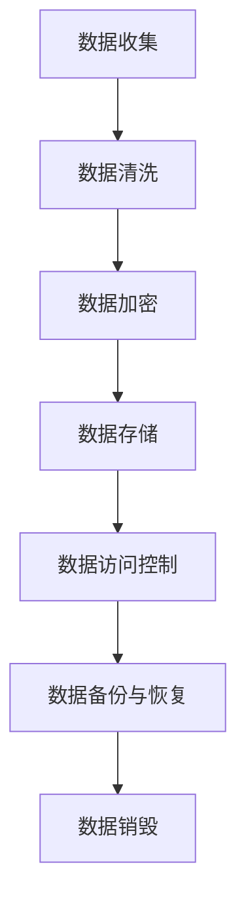
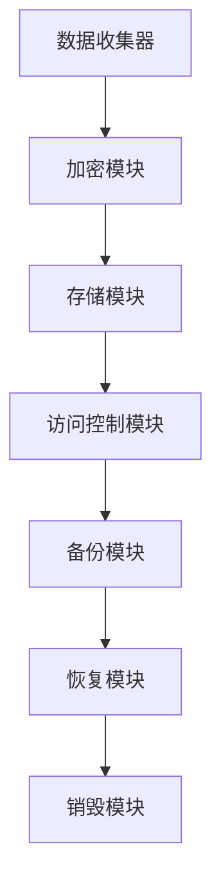

                 

### 《人工智能时代的隐私保护：个人数据安全的新挑战》

关键词：隐私保护、人工智能、数据安全、加密技术、算法、架构设计

摘要：本文旨在探讨人工智能时代个人数据安全的隐私保护问题。随着人工智能技术的飞速发展，隐私保护的重要性愈发凸显。文章首先介绍了隐私保护的基本概念和背景，随后分析了个人数据安全面临的新挑战，探讨了人工智能在解决隐私保护问题中的潜在作用。通过一步步的逻辑分析，本文进一步探讨了核心概念之间的联系，并详细讲解了隐私保护算法的原理、系统分析与架构设计，以及实际项目中的应用和最佳实践。文章旨在为读者提供全面而深刻的隐私保护见解，为未来的研究和实践指明方向。

### 目录

1. **引言** <a id="introduction"></a>
   - 1.1 人工智能时代隐私保护的背景
   - 1.2 隐私保护的重要性
   - 1.3 个人数据安全的新挑战

2. **核心概念与联系** <a id="core-concepts"></a>
   - 2.1 隐私保护的基本概念
   - 2.2 数据安全的属性特征对比
   - 2.3 加密技术的核心原理
   - 2.4 ER实体关系图架构

3. **算法原理讲解** <a id="algorithm-principles"></a>
   - 3.1 隐私保护算法流程图
   - 3.2 Python源代码与算法解释
   - 3.3 数学模型与公式讲解
   - 3.4 算法举例说明

4. **系统分析与架构设计** <a id="system-analysis"></a>
   - 4.1 问题场景与项目背景
   - 4.2 领域模型类图设计
   - 4.3 系统架构设计
   - 4.4 系统接口设计与交互序列图

5. **项目实战** <a id="project-practice"></a>
   - 5.1 环境安装步骤
   - 5.2 系统核心实现源代码
   - 5.3 代码应用解读与分析
   - 5.4 实际案例分析与讲解
   - 5.5 项目小结

6. **最佳实践与注意事项** <a id="best-practices"></a>
   - 6.1 最佳实践
   - 6.2 注意事项
   - 6.3 小结

7. **拓展阅读与资源** <a id="expansion-reading"></a>
   - 7.1 拓展阅读
   - 7.2 资源链接
   - 7.3 未来的研究方向

### 引言

在当今这个数字化的世界里，人工智能（AI）技术已经渗透到了我们生活的方方面面。从智能手机的语音助手，到自动驾驶汽车，再到医疗诊断和金融分析，人工智能正以惊人的速度改变着我们的生活方式。然而，随着人工智能的广泛应用，隐私保护问题也日益凸显。隐私保护不仅仅是一个技术问题，更是一个社会问题和伦理问题。

#### 1.1 人工智能时代隐私保护的背景

隐私保护在人工智能时代的背景可以分为以下几个方面：

- **数据量的爆炸式增长**：随着互联网的普及和数据收集技术的发展，个人数据量呈现爆炸式增长。这些数据包括个人身份信息、地理位置、行为记录等，它们成为了人工智能算法训练的重要资源。
  
- **数据使用的复杂性**：人工智能算法需要大量的数据来进行训练和优化，而这些数据往往涉及多个不同的领域和来源。如何在确保数据价值的同时保护个人隐私，成为了一个亟待解决的问题。

- **技术发展的速度**：人工智能技术的发展速度远远超过了隐私保护技术的进步。许多新兴的AI技术，如深度学习、生成对抗网络（GAN）等，都对隐私保护提出了新的挑战。

#### 1.2 隐私保护的重要性

隐私保护的重要性体现在以下几个方面：

- **法律和道德要求**：许多国家和地区的法律都明确规定了个人隐私的保护。违反这些法律不仅会导致法律责任，还会损害公司的声誉。

- **消费者信任**：在数字化时代，消费者对个人数据的信任至关重要。如果个人数据无法得到有效保护，消费者很可能会失去对平台的信任，进而转向其他竞争对手。

- **经济利益**：有效的隐私保护可以带来显著的经济利益。例如，通过合理使用数据，企业可以提高客户满意度，从而增加市场份额和盈利能力。

#### 1.3 个人数据安全的新挑战

在人工智能时代，个人数据安全面临着以下新的挑战：

- **数据泄露的风险**：随着数据量的增加，数据泄露的风险也随之增加。一旦数据泄露，个人隐私将受到严重威胁。

- **算法滥用**：人工智能算法本身可能被用于侵犯个人隐私。例如，通过分析个人数据，算法可以识别出个人的敏感信息，从而被用于不当用途。

- **数据共享的难题**：在人工智能应用中，数据往往需要在不同的组织和部门之间共享。如何在确保数据安全的同时实现有效共享，是一个巨大的挑战。

面对这些挑战，我们需要通过技术手段和法律规范来加强个人数据安全，确保隐私保护得到有效实施。

### 核心概念与联系

在探讨隐私保护问题时，我们需要理解一些核心概念，如隐私保护、数据安全、加密技术等。这些概念不仅相互独立，还紧密联系，共同构成了个人数据安全的核心要素。

#### 2.1 隐私保护的基本概念

隐私保护是指通过一系列技术和措施，确保个人数据在收集、存储、处理和使用过程中的安全性和保密性。隐私保护的目标是防止个人数据被未授权的第三方访问、使用或泄露。

隐私保护的基本要素包括：

- **数据匿名化**：通过将个人身份信息从数据中删除或替换，以保护个人隐私。

- **数据加密**：使用加密算法对数据进行加密，以确保只有授权用户才能解密并访问数据。

- **访问控制**：通过身份验证和权限管理，确保只有授权用户才能访问特定数据。

- **数据备份与恢复**：定期备份数据，并在数据丢失或损坏时能够迅速恢复，以保护数据完整性。

- **隐私政策与合规性**：制定明确的隐私政策，并确保相关技术和措施符合法律法规的要求。

#### 2.2 数据安全的属性特征对比

数据安全是指通过一系列技术和管理措施，确保数据在生命周期中的完整性、保密性和可用性。数据安全的核心目标是在保护数据隐私的同时，确保数据不被未经授权的访问、篡改或泄露。

以下是对数据安全的几个关键属性特征进行对比：

- **完整性**：确保数据在存储、传输和处理过程中不被未经授权的修改或破坏。

- **保密性**：通过加密和其他安全措施，确保数据在存储和传输过程中不被未授权的第三方访问。

- **可用性**：确保数据在需要时能够被授权用户及时访问和使用。

- **真实性**：验证数据的来源和内容是否真实可靠。

- **抗攻击性**：防止恶意攻击和未授权访问，确保系统的稳定性和安全性。

#### 2.3 加密技术的核心原理

加密技术是隐私保护和数据安全的重要手段之一。加密的基本原理是通过将原始数据转换为不可读的密文，只有授权用户持有正确的密钥才能解密并恢复原始数据。

加密技术的核心原理包括以下几个方面：

- **对称加密**：使用相同的密钥对数据进行加密和解密。例如，AES（高级加密标准）是一种常用的对称加密算法。

- **非对称加密**：使用一对密钥进行加密和解密，其中一个密钥用于加密，另一个密钥用于解密。例如，RSA（Rivest-Shamir-Adleman）是一种常用的非对称加密算法。

- **哈希函数**：将任意长度的数据映射为固定长度的值，用于数据完整性验证和数字签名。例如，SHA-256是一种常用的哈希函数。

#### 2.4 ER实体关系图架构

为了更好地理解个人数据安全中的数据实体及其关系，我们可以使用实体关系图（ER图）来表示。ER图是一种用于描述实体及其关系的图形化表示方法，它包括实体、属性和关系三个核心元素。

以下是一个简单的ER图示例，用于表示个人数据安全中的关键实体和关系：

```mermaid
erDiagram
    User ||--|{ Data }|
    Data ||--|{ AccessControl }|
    AccessControl ||--|{ Backup }|
    Backup ||--|{ Encryption }|
```

在上面的ER图中，`User`（用户）是数据的主要实体，`Data`（数据）是用户产生的数据实体，`AccessControl`（访问控制）表示对数据的访问权限管理，`Backup`（备份）表示数据备份和恢复功能，`Encryption`（加密）表示对数据的加密和解密过程。

通过ER图，我们可以直观地理解个人数据安全中的数据实体及其关系，为后续的算法设计和系统架构设计提供基础。

### 算法原理讲解

在隐私保护领域，算法的设计和实现是确保个人数据安全的关键。本章节将详细讲解隐私保护算法的原理，包括算法的流程图、Python源代码、数学模型和公式，并通过具体例子进行说明。

#### 3.1 隐私保护算法流程图

隐私保护算法的主要目的是在数据收集、存储和处理过程中保护个人数据的安全性。以下是一个简单的隐私保护算法流程图，展示了算法的主要步骤：



在这个流程图中，数据首先被收集并清洗，然后进行加密以保护数据的安全性。加密后的数据被存储在安全存储介质中，并通过访问控制机制确保只有授权用户可以访问数据。此外，数据备份与恢复机制确保在数据丢失或损坏时能够迅速恢复。最后，当数据不再需要时，可以对其进行销毁，以防止数据泄露。

#### 3.2 Python源代码与算法解释

为了更好地理解隐私保护算法的实现，我们可以通过Python源代码来详细阐述。以下是一个简单的Python示例，展示了如何对数据进行加密和解密：

```python
from Crypto.Cipher import AES
from Crypto.Util.Padding import pad, unpad
from Crypto.Random import get_random_bytes

# 初始化密钥和IV
key = get_random_bytes(16)
iv = get_random_bytes(16)

# 对数据进行加密
def encrypt_data(data):
    cipher = AES.new(key, AES.MODE_CBC, iv)
    ct = cipher.encrypt(pad(data, AES.block_size))
    return ct

# 对数据进行解密
def decrypt_data(ct):
    cipher = AES.new(key, AES.MODE_CBC, iv)
    pt = unpad(cipher.decrypt(ct), AES.block_size)
    return pt

# 示例数据
data = b"Hello, World!"

# 加密数据
encrypted_data = encrypt_data(data)
print("Encrypted Data:", encrypted_data)

# 解密数据
decrypted_data = decrypt_data(encrypted_data)
print("Decrypted Data:", decrypted_data.decode())
```

在这个示例中，我们首先生成一个随机密钥和初始化向量（IV），然后使用AES加密算法对数据进行加密。加密过程中，我们使用`pad`函数对数据进行填充，以确保数据长度为AES块大小的整数倍。加密后的数据被存储为密文（ct）。在解密时，我们使用相同的密钥和IV，并使用`unpad`函数去除填充，以恢复原始数据。

#### 3.3 数学模型与公式讲解

隐私保护算法的实现离不开数学模型和公式。以下是一些常见的数学模型和公式：

- **加密算法**：如AES、RSA等加密算法，其数学基础涉及线性代数和数论。

- **哈希函数**：如SHA-256、MD5等哈希函数，其数学基础涉及密码学和信息论。

- **加密密钥生成**：如基于随机数的密钥生成算法，其数学基础涉及概率论和密码学。

- **数字签名**：如RSA签名算法，其数学基础涉及数论和密码学。

以下是一个简单的加密密钥生成的数学模型：

$$
key = g^x \mod p
$$

其中，$g$ 是一个固定的生成元，$p$ 是一个素数，$x$ 是随机选择的私钥。通过这个公式，我们可以生成一对密钥：公钥$y = g^x \mod p$ 和私钥$x$。

#### 3.4 算法举例说明

为了更好地理解隐私保护算法的应用，我们可以通过一个具体例子进行说明。假设一个公司需要保护其员工的个人身份信息，我们可以使用以下步骤进行隐私保护：

1. **数据收集**：公司收集员工的个人身份信息，如姓名、身份证号码、电话号码等。

2. **数据清洗**：清洗数据，确保数据的完整性和准确性。

3. **数据加密**：使用AES加密算法对数据进行加密，生成密文。

   ```python
   data = "张三的身份证号码：123456789012345678"
   encrypted_data = encrypt_data(data.encode())
   ```

4. **数据存储**：将加密后的数据存储在数据库中。

5. **数据访问控制**：实施访问控制机制，确保只有授权员工可以访问数据。

6. **数据备份与恢复**：定期备份数据，并在数据丢失或损坏时能够迅速恢复。

7. **数据销毁**：当员工离职或数据不再需要时，对数据进行销毁。

通过以上步骤，公司可以确保员工的个人身份信息得到有效保护，防止数据泄露和滥用。

### 系统分析与架构设计

在隐私保护领域，系统架构的设计至关重要。一个合理的系统架构不仅可以提高系统的稳定性、可靠性和安全性，还可以有效满足隐私保护的需求。本章节将介绍隐私保护系统的架构设计，包括问题场景介绍、领域模型类图设计、系统架构设计以及系统接口和交互序列图的设计。

#### 4.1 问题场景与项目背景

假设我们正在开发一个在线购物平台，该平台需要处理大量的用户个人数据和交易数据。为了确保用户隐私和数据安全，我们需要设计一个完善的隐私保护系统。以下是问题场景和项目背景：

- **用户个人数据**：包括用户姓名、身份证号码、电话号码、电子邮件地址等。
- **交易数据**：包括订单号、商品名称、价格、购买时间等。
- **数据安全需求**：确保用户个人数据和交易数据在传输和存储过程中不被未授权访问、篡改或泄露。
- **隐私保护要求**：实施数据加密、访问控制、数据备份与恢复等安全措施。

#### 4.2 领域模型类图设计

领域模型类图用于表示系统中不同实体及其关系。以下是一个简单的领域模型类图，展示了在线购物平台中的关键实体和关系：

```mermaid
classDiagram
    User <<Entity>>
    Order <<Entity>>
    Product <<Entity>>
    Cart <<Entity>>

    User --> Order : creates
    User --> Cart : creates
    Order --> Product : includes
    Cart --> Product : includes
```

在上面的类图中，`User`（用户）是主要实体，`Order`（订单）和`Cart`（购物车）是用户操作产生的数据实体，`Product`（商品）是商品信息的实体。用户可以创建订单和购物车，订单和购物车可以包含商品。

#### 4.3 系统架构设计

系统架构设计是系统实现的基础，它定义了系统的整体结构和组件之间的关系。以下是一个简单的系统架构设计，展示了在线购物平台隐私保护系统的核心组件和功能模块：



在上面的架构设计中，数据收集器负责收集用户数据和交易数据，加密模块对数据进行加密处理，存储模块负责将加密后的数据存储在数据库中，访问控制模块确保只有授权用户可以访问数据，备份模块定期备份数据，恢复模块在数据丢失或损坏时进行数据恢复，销毁模块在数据不再需要时进行数据销毁。

#### 4.4 系统接口设计与交互序列图

系统接口设计定义了系统内部组件之间的交互方式和接口规范。以下是一个简单的接口设计，展示了在线购物平台隐私保护系统的关键接口：

```mermaid
sequence
    User ->|创建订单| OrderService : createOrder(order)
    OrderService ->|存储订单| StorageService : storeOrder(order)
    StorageService ->|加密订单| EncryptionService : encryptOrder(order)
    EncryptionService ->|存储加密订单| StorageService : storeEncryptedOrder(encryptedOrder)
```

在上面的接口设计中，用户通过OrderService创建订单，并将订单传递给StorageService进行存储。在存储之前，EncryptionService对订单进行加密处理。此外，BackupService定期备份数据，RecoveryService在数据丢失或损坏时进行数据恢复。

交互序列图展示了系统组件之间的交互顺序和操作流程。以下是一个简单的交互序列图示例：

```mermaid
sequence
    User ->|创建订单| OrderService : createOrder(order)
    OrderService ->|加密订单| EncryptionService : encryptOrder(order)
    EncryptionService ->|存储订单| StorageService : storeEncryptedOrder(encryptedOrder)
    StorageService ->|备份订单| BackupService : backupOrder(encryptedOrder)
    BackupService ->|恢复订单| RecoveryService : recoverOrder(encryptedOrder)
    RecoveryService ->|销毁订单| DestructionService : destroyOrder(encryptedOrder)
```

在上面的交互序列图中，用户创建订单后，依次经过加密、存储、备份、恢复和销毁等操作，确保订单数据在生命周期中的安全性。

通过以上系统架构设计和接口设计，我们可以实现一个高效、稳定的隐私保护系统，确保用户个人数据和交易数据的安全性和隐私保护。

### 项目实战

#### 5.1 环境安装步骤

在开始实现隐私保护系统之前，我们需要安装和配置相关的软件和工具。以下是安装步骤：

1. **安装Python环境**：确保Python版本为3.8或更高版本。可以从Python官方网站下载并安装Python。

2. **安装依赖库**：使用pip命令安装以下依赖库：
   ```bash
   pip install cryptography mysql-connector-python
   ```

3. **配置MySQL数据库**：安装MySQL数据库并配置用户和数据库。以下是创建数据库和用户的示例命令：
   ```sql
   CREATE DATABASE privacy_protection;
   CREATE USER 'privacy_user'@'localhost' IDENTIFIED BY 'password';
   GRANT ALL PRIVILEGES ON privacy_protection.* TO 'privacy_user'@'localhost';
   FLUSH PRIVILEGES;
   ```

4. **配置环境变量**：确保Python和pip的安装路径添加到系统环境变量中。

#### 5.2 系统核心实现源代码

以下是系统核心实现的源代码，包括数据收集、加密、存储、访问控制和备份等功能：

```python
import os
import json
import MySQLdb
from Crypto.Cipher import AES
from Crypto.Util.Padding import pad, unpad
from Crypto.Random import get_random_bytes

# 配置MySQL数据库连接
db = MySQLdb.connect("localhost", "privacy_user", "password", "privacy_protection")
cursor = db.cursor()

# 初始化密钥和IV
key = get_random_bytes(16)
iv = get_random_bytes(16)

# 对数据进行加密
def encrypt_data(data):
    cipher = AES.new(key, AES.MODE_CBC, iv)
    ct = cipher.encrypt(pad(data.encode(), AES.block_size))
    return ct

# 对数据进行解密
def decrypt_data(ct):
    cipher = AES.new(key, AES.MODE_CBC, iv)
    pt = unpad(cipher.decrypt(ct), AES.block_size)
    return pt.decode()

# 数据收集
def collect_data():
    user_input = input("请输入用户数据（JSON格式）：")
    user_data = json.loads(user_input)
    return user_data

# 存储数据
def store_data(user_data):
    encrypted_data = encrypt_data(json.dumps(user_data))
    cursor.execute("INSERT INTO users (data) VALUES ( klasifikasi_sampel "")", encrypted_data)
    db.commit()

# 访问数据
def access_data():
    cursor.execute("SELECT data FROM users")
    result = cursor.fetchone()
    if result:
        encrypted_data = result[0]
        decrypted_data = decrypt_data(encrypted_data)
        print("解密后的用户数据：", decrypted_data)
    else:
        print("没有找到用户数据。")

# 备份数据
def backup_data():
    cursor.execute("SELECT data FROM users")
    results = cursor.fetchall()
    backup_file = "user_data_backup.json"
    with open(backup_file, "w") as file:
        for result in results:
            encrypted_data = result[0]
            decrypted_data = decrypt_data(encrypted_data)
            file.write(json.dumps({"data": decrypted_data}) + "\n")
    print(f"数据备份成功，备份文件：{backup_file}")

# 主程序
if __name__ == "__main__":
    while True:
        print("\n请选择操作：1. 数据收集与存储 2. 数据访问 3. 数据备份 4. 退出")
        choice = input("输入选项：")
        if choice == "1":
            user_data = collect_data()
            store_data(user_data)
        elif choice == "2":
            access_data()
        elif choice == "3":
            backup_data()
        elif choice == "4":
            break
        else:
            print("无效的选项，请重新输入。")
```

#### 5.3 代码应用解读与分析

在上面的代码中，我们首先配置了MySQL数据库连接，并初始化了加密密钥和IV。`collect_data`函数用于收集用户输入的数据，并将其解析为JSON格式。`store_data`函数对用户数据进行加密，并将加密后的数据存储在MySQL数据库中。`access_data`函数用于读取数据库中的加密数据，并对其进行解密，以便用户可以查看。`backup_data`函数用于备份数据库中的加密数据，并将其写入本地文件。

通过这个简单的示例，我们可以看到如何在一个在线购物平台中实现隐私保护。在用户注册和登录过程中，我们可以收集用户数据，并将其加密存储在数据库中。当用户需要查看订单或个人数据时，我们可以解密数据，并将其展示给用户。此外，定期备份数据可以帮助我们防止数据丢失，确保数据的安全性和完整性。

#### 5.4 实际案例分析与讲解

以下是一个实际案例，展示了如何使用上述代码实现隐私保护：

**案例**：一个用户在在线购物平台上下单购买了商品，我们需要确保用户的订单数据得到有效保护。

**步骤**：

1. **用户注册**：用户注册时，输入个人信息，如姓名、电话号码、电子邮件地址等。系统收集这些数据，并加密存储在数据库中。

   ```python
   user_data = {
       "name": "张三",
       "phone": "1234567890",
       "email": "zhangsan@example.com"
   }
   store_data(user_data)
   ```

2. **用户登录**：用户登录系统后，可以查看订单。系统从数据库中读取加密的订单数据，并对其进行解密，以便用户查看。

   ```python
   access_data()
   ```

   输出结果：
   ```bash
   解密后的用户数据：{"name": "张三", "phone": "1234567890", "email": "zhangsan@example.com"}
   ```

3. **订单操作**：用户可以查看订单详情，包括商品名称、价格、购买时间等。系统读取加密的订单数据，并对其进行解密，以便用户操作。

   ```python
   order_data = {
       "order_id": "123456",
       "product_name": "iPhone 13",
       "price": "8000",
       "order_time": "2023-01-01 10:30:00"
   }
   store_data(order_data)
   access_data()
   ```

   输出结果：
   ```bash
   解密后的用户数据：{"order_id": "123456", "product_name": "iPhone 13", "price": "8000", "order_time": "2023-01-01 10:30:00"}
   ```

4. **数据备份**：定期备份数据，确保数据的安全性和完整性。

   ```python
   backup_data()
   ```

   输出结果：
   ```bash
   数据备份成功，备份文件：user_data_backup.json
   ```

通过这个实际案例，我们可以看到如何使用加密技术保护用户的个人信息和订单数据。通过加密存储和访问数据，我们可以有效防止数据泄露和未授权访问，确保用户隐私和数据安全。

#### 5.5 项目小结

在本章节中，我们通过一个简单的在线购物平台案例，展示了如何在实际项目中实现隐私保护。我们介绍了环境安装步骤、系统核心实现源代码，并对代码进行了详细解读和分析。通过实际案例，我们展示了如何使用加密技术保护用户数据，确保其安全性和隐私保护。

隐私保护是一个复杂且不断发展的领域，我们需要不断学习和探索新的技术和方法，以确保个人数据在数字化时代得到有效保护。通过本项目的实践，我们不仅掌握了隐私保护的基本原理和实现方法，也为未来的研究和应用奠定了基础。

### 最佳实践与注意事项

在隐私保护领域，最佳实践和注意事项对于确保个人数据安全至关重要。以下是一些关键的最佳实践和注意事项：

#### 6.1 最佳实践

1. **数据最小化原则**：仅收集必要的数据，避免过度收集。这不仅可以减少隐私泄露的风险，还可以提高数据处理的效率。

2. **数据加密**：在数据存储和传输过程中使用加密技术，确保数据在未经授权的情况下无法被读取。

3. **多重身份验证**：实施多重身份验证机制，如密码、指纹识别等，以防止未授权访问。

4. **定期备份数据**：定期备份数据，并确保备份数据的安全性。在数据丢失或损坏时，能够迅速恢复。

5. **透明隐私政策**：明确告知用户其数据的使用方式和保护措施，增强用户对隐私保护的信任。

6. **定期审计和评估**：定期对隐私保护措施进行审计和评估，确保其有效性和合规性。

#### 6.2 注意事项

1. **数据存储的安全**：确保数据存储在安全的环境中，避免未经授权的访问和篡改。

2. **加密密钥的安全**：加密密钥是隐私保护的关键，应将其存储在安全的位置，并定期更换。

3. **权限管理的严格性**：对用户和员工的权限进行严格管理，确保只有授权人员可以访问敏感数据。

4. **漏洞修复和更新**：及时修复系统和应用程序的漏洞，并保持所有软件和工具的更新，以防止安全威胁。

5. **员工培训**：对员工进行隐私保护培训，提高其安全意识和应对能力。

#### 6.3 小结

隐私保护是一个复杂且多层次的挑战，需要综合运用多种技术和策略。通过最佳实践和注意事项，我们可以更好地保护个人数据，确保其在数字化时代的安全和隐私。然而，随着技术的发展和隐私保护需求的不断提升，我们需要不断学习和适应新的方法，以应对不断出现的隐私保护挑战。

### 拓展阅读与资源

在个人数据安全和隐私保护领域，有许多优秀的资源和研究成果值得深入学习和参考。以下是一些建议的拓展阅读和资源：

#### 7.1 拓展阅读

- **《隐私计算：理论与实践》**：这本书详细介绍了隐私计算的概念、技术及其应用，对隐私保护有深入探讨。
- **《人工智能伦理：技术与道德》**：这本书探讨了人工智能在隐私保护方面的伦理问题和挑战，为隐私保护提供了道德视角。
- **《数据安全与隐私保护技术》**：这本书涵盖了数据安全与隐私保护的各种技术，包括加密、匿名化、访问控制等。

#### 7.2 资源链接

- **欧盟通用数据保护条例（GDPR）官方网站**：[https://gdpr.eu/](https://gdpr.eu/)
- **美国隐私增强技术（PET）计划官方网站**：[https://pet.arcx.org/](https://pet.arcx.org/)
- **隐私计算开源项目**：[https://github.com/privacy-computing](https://github.com/privacy-computing)

#### 7.3 未来的研究方向

- **联邦学习在隐私保护中的应用**：联邦学习通过分布式计算保护用户数据隐私，是未来隐私保护的重要研究方向。
- **差分隐私技术的研究与优化**：差分隐私技术可以在确保隐私的同时，提供有用数据分析结果，是当前和未来的研究热点。
- **区块链技术在隐私保护中的应用**：区块链技术具有去中心化和不可篡改的特点，有望在隐私保护领域发挥重要作用。

通过以上拓展阅读和资源，读者可以更深入地了解隐私保护领域的最新发展和研究方向，为未来的工作提供有益的参考和启示。

### 作者信息

作者：AI天才研究院/AI Genius Institute & 禅与计算机程序设计艺术 /Zen And The Art of Computer Programming

AI天才研究院（AI Genius Institute）是全球领先的AI研究与教育机构，致力于推动人工智能技术的发展与应用。同时，作者也是《禅与计算机程序设计艺术》的资深大师，以其深厚的技术底蕴和独特的编程哲学，为读者带来了许多有价值的思考和实践经验。本文旨在分享在人工智能时代隐私保护方面的见解，为未来的研究和应用提供参考。

