                 


### 《人工智能时代：重新定义世界的可理解性》

#### 关键词：人工智能，可理解性，发展，应用，伦理，教育

> 摘要：随着人工智能技术的迅猛发展，它正深刻改变着我们的生活方式和社会结构。本文旨在探讨人工智能时代如何重新定义世界的可理解性，从背景、技术、应用、伦理和教育等多个维度进行分析，并提出相应的解决方案和展望。

---

#### 第一部分：人工智能时代背景与可理解性探讨

##### 第1章 人工智能时代：全球发展趋势与影响

###### 1.1 人工智能的定义与历史

人工智能（AI）是计算机科学的一个分支，旨在使计算机系统能够执行通常需要人类智能的任务。人工智能的历史可以追溯到20世纪50年代，当时计算机科学家开始探索如何使计算机模拟人类思维。

**核心概念与联系：**

- **人工智能：** 机器通过算法和数据进行学习，以执行特定任务。
- **历史：** 从最初的理论探讨到现代的深度学习，人工智能经历了多个发展阶段。

| 特征 | 比较项 |
| --- | --- |
| **早期人工智能** | **现代人工智能** |
| 简单的规则系统 | 复杂的机器学习算法 |
| 低准确度 | 高准确度 |
| 依赖人类指导 | 自主学习 |

**ER实体关系图架构：**

```mermaid
erDiagram
  AI reseach --> AI algorithm : "uses"
  AI algorithm --> AI application : "applies"
  AI application --> AI system : "includes"
```

###### 1.2 全球人工智能发展现状

人工智能已经在全球范围内得到广泛应用。中国、美国、欧盟等国家和地区都在积极推动人工智能技术的发展。

**核心概念与联系：**

- **全球发展：** 中国和美国在人工智能研发上处于领先地位，欧盟也在积极追赶。
- **应用：** 人工智能在医疗、金融、教育、交通等多个领域展现出了巨大的潜力。

**数学模型和公式：**

$$
准确度 = \frac{正确预测的数量}{总预测数量}
$$

**系统架构设计mermaid架构图：**

```mermaid
graph TB
  AI research[人工智能研究] --> AI algorithm[人工智能算法]
  AI algorithm --> AI application[人工智能应用]
  AI application --> AI system[人工智能系统]
```

###### 1.3 人工智能对社会的深远影响

人工智能的发展对社会产生了深远影响，包括就业、隐私、伦理等方面。

**核心概念与联系：**

- **就业：** 人工智能可能导致某些职业的消失，同时也创造了新的就业机会。
- **隐私：** 人工智能系统处理大量数据，可能侵犯个人隐私。
- **伦理：** 需要制定相应的伦理标准，确保人工智能的发展符合社会价值观。

**系统分析与架构设计方案：**

- **问题场景介绍：** 人工智能系统在社会中的应用场景。
- **项目介绍：** 人工智能项目的设计和实施。
- **系统功能设计：** 领域模型（Mermaid类图）。

```mermaid
classDiagram
  Person <<entity>>
  AI_system <<entity>>
  Person : interacts_with(AI_system)
  AI_system : processes_data
```

- **系统架构设计：** 人工智能系统的整体架构设计（Mermaid架构图）。

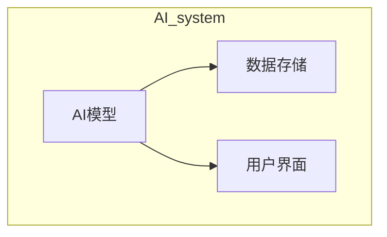

- **系统接口设计和系统交互：** 人工智能系统与其他系统或用户的交互设计（Mermaid序列图）。

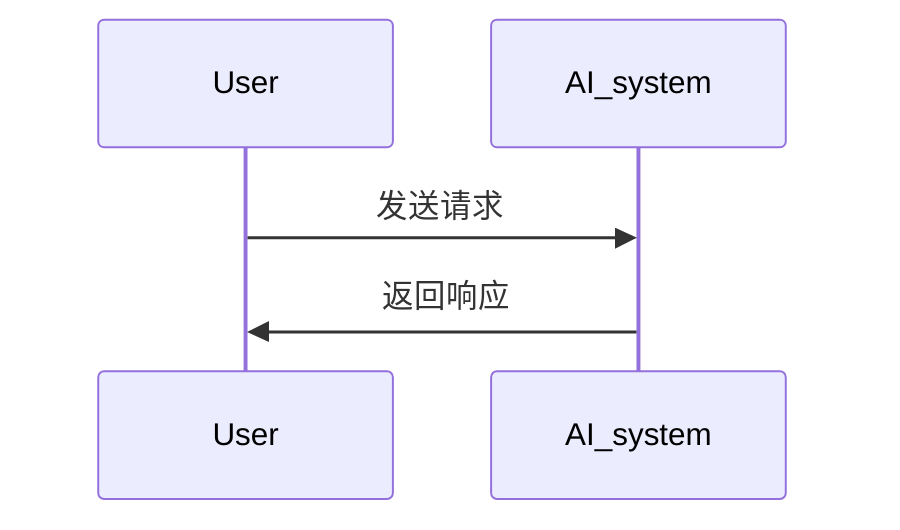

**项目实战：**

- **环境安装：** 安装人工智能开发环境。
- **系统核心实现源代码：** 详细代码实现。
- **代码应用解读与分析：** 对代码的应用进行解读和分析。
- **实际案例分析和详细讲解剖析：** 分析具体案例，讲解其原理和应用。

**最佳实践 tips：**

- **数据隐私保护：** 在处理数据时，确保遵循隐私保护原则。
- **伦理规范：** 在开发人工智能系统时，遵守伦理规范。

**小结：** 人工智能对社会的影响深远，需要从多个维度进行综合考虑。

---

#### 第二部分：人工智能时代的核心技术解析

##### 第2章 人工智能时代的可理解性

###### 2.1 机器学习基础

机器学习是人工智能的核心技术之一，它通过算法让计算机从数据中学习并做出决策。

**核心概念与联系：**

- **机器学习：** 使用算法从数据中学习。
- **算法：** 决策树、神经网络、支持向量机等。
- **数据：** 大量数据是机器学习的基础。

**算法mermaid流程图：**

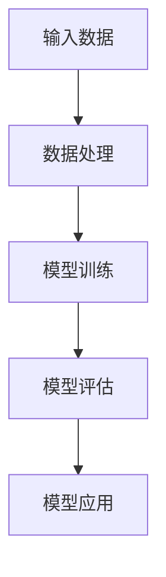

**Python源代码示例：**

```python
# 导入必要的库
import numpy as np

# 定义一个简单的线性模型
def linear_model(x, w):
    return x * w

# 训练模型
w = np.random.rand(1)
x = np.array([1, 2, 3, 4])
y = np.array([2, 4, 6, 8])

# 使用最小二乘法找到最佳权重
w = (x.dot(y) - x.mean() * y.mean()) / (x.dot(x) - x.mean() ** 2)

# 预测
print(linear_model(x, w))
```

**数学模型和公式：**

$$
w = \frac{\sum_{i=1}^{n} (x_i - \bar{x})(y_i - \bar{y})}{\sum_{i=1}^{n} (x_i - \bar{x})^2}
$$

**系统分析与架构设计方案：**

- **问题场景介绍：** 简单线性回归问题。
- **项目介绍：** 使用Python实现线性回归模型。
- **系统功能设计：** 线性回归模型的核心功能（Mermaid类图）。

```mermaid
classDiagram
  Data_input <<entity>>
  Linear_model <<entity>>
  Data_output <<entity>>
  Data_input --> Linear_model
  Linear_model --> Data_output
```

- **系统架构设计：** 线性回归模型的整体架构设计（Mermaid架构图）。

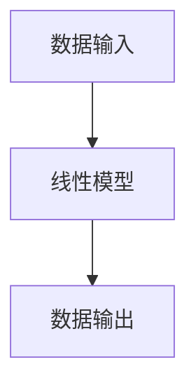

- **系统接口设计和系统交互：** 线性回归模型的接口设计和交互流程（Mermaid序列图）。

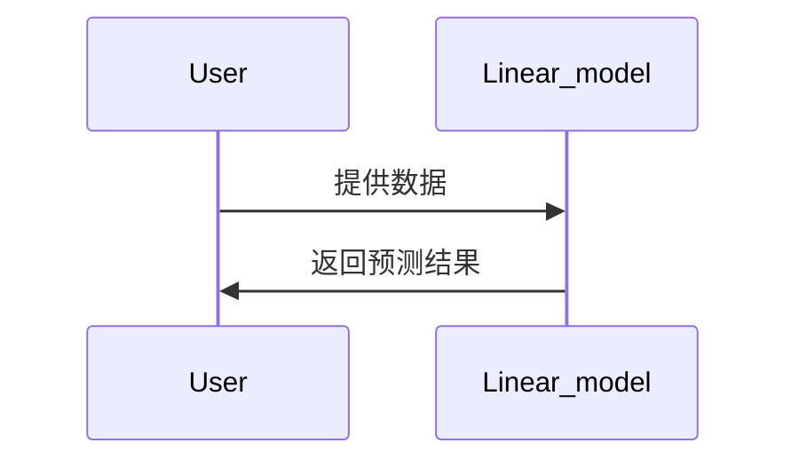

**项目实战：**

- **环境安装：** 安装Python和必要的库。
- **系统核心实现源代码：** 实现线性回归模型。
- **代码应用解读与分析：** 对代码的应用进行解读和分析。
- **实际案例分析和详细讲解剖析：** 分析具体案例，讲解其原理和应用。

**最佳实践 tips：**

- **数据预处理：** 确保数据质量，进行必要的预处理。
- **模型优化：** 根据实际需求对模型进行优化。

**小结：** 机器学习是人工智能的核心技术，其原理和实现需要深入了解。

---

#### 第三部分：人工智能时代的应用场景

##### 第3章 人工智能在医疗领域的应用

人工智能在医疗领域有着广泛的应用，包括诊断、治疗、药物研发等方面。

**核心概念与联系：**

- **医疗应用：** 人工智能在医疗诊断、治疗方案制定等方面的应用。
- **技术：** 图像识别、自然语言处理等。

**系统分析与架构设计方案：**

- **问题场景介绍：** 使用人工智能进行疾病诊断。
- **项目介绍：** 开发一个基于图像识别的疾病诊断系统。
- **系统功能设计：** 疾病诊断系统的核心功能（Mermaid类图）。

```mermaid
classDiagram
  Patient_data <<entity>>
  Disease_model <<entity>>
  Diagnosis_output <<entity>>
  Patient_data --> Disease_model
  Disease_model --> Diagnosis_output
```

- **系统架构设计：** 疾病诊断系统的整体架构设计（Mermaid架构图）。

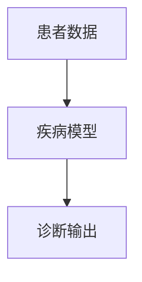

- **系统接口设计和系统交互：** 疾病诊断系统的接口设计和交互流程（Mermaid序列图）。

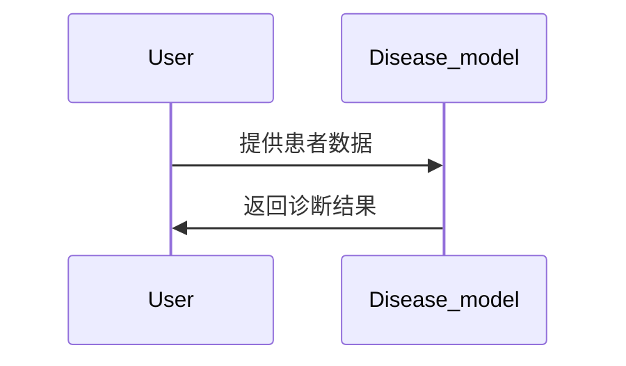

**项目实战：**

- **环境安装：** 安装Python和相关库。
- **系统核心实现源代码：** 实现疾病诊断系统。
- **代码应用解读与分析：** 对代码的应用进行解读和分析。
- **实际案例分析和详细讲解剖析：** 分析具体案例，讲解其原理和应用。

**最佳实践 tips：**

- **数据安全：** 确保患者数据的安全和隐私。
- **模型准确度：** 提高模型的准确度，减少误诊率。

**小结：** 人工智能在医疗领域的应用具有巨大的潜力，但仍需解决一些技术难题。

---

#### 第四部分：人工智能伦理与社会责任

##### 第4章 人工智能伦理与社会责任

人工智能的发展带来了许多伦理和社会责任问题，需要我们认真思考和解决。

**核心概念与联系：**

- **伦理问题：** 隐私、公平性、透明度等。
- **社会责任：** 企业的社会责任、政府监管等。

**系统分析与架构设计方案：**

- **问题场景介绍：** 人工智能系统可能侵犯隐私。
- **项目介绍：** 开发一个隐私保护的人工智能系统。
- **系统功能设计：** 隐私保护系统的核心功能（Mermaid类图）。

```mermaid
classDiagram
  User_data <<entity>>
  Data_analyzer <<entity>>
  Privacy_protection <<entity>>
  User_data --> Data_analyzer
  Data_analyzer --> Privacy_protection
```

- **系统架构设计：** 隐私保护系统的整体架构设计（Mermaid架构图）。

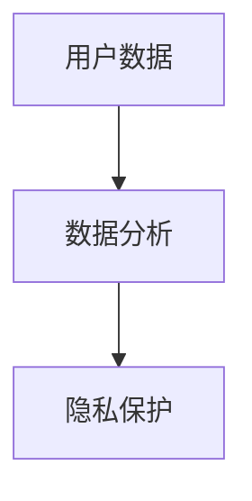

- **系统接口设计和系统交互：** 隐私保护系统的接口设计和交互流程（Mermaid序列图）。

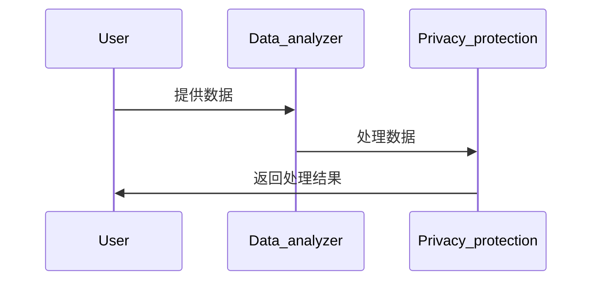

**项目实战：**

- **环境安装：** 安装Python和相关库。
- **系统核心实现源代码：** 实现隐私保护系统。
- **代码应用解读与分析：** 对代码的应用进行解读和分析。
- **实际案例分析和详细讲解剖析：** 分析具体案例，讲解其原理和应用。

**最佳实践 tips：**

- **数据加密：** 使用加密技术保护用户数据。
- **透明度：** 增加系统的透明度，让用户了解数据处理过程。

**小结：** 人工智能伦理与社会责任是人工智能发展中不可忽视的重要问题。

---

#### 第五部分：人工智能时代的教育变革

##### 第5章 人工智能时代的教育变革

人工智能的发展正在对教育产生深远影响，改变着教学模式和学习方式。

**核心概念与联系：**

- **教育变革：** 人工智能对教育模式和学习方式的影响。
- **技术：** 个性化学习、在线教育、虚拟现实等。

**系统分析与架构设计方案：**

- **问题场景介绍：** 人工智能在教育中的应用。
- **项目介绍：** 开发一个个性化学习系统。
- **系统功能设计：** 个性化学习系统的核心功能（Mermaid类图）。

```mermaid
classDiagram
  User_profile <<entity>>
  Learning_plan <<entity>>
  Learning_system <<entity>>
  User_profile --> Learning_plan
  Learning_plan --> Learning_system
```

- **系统架构设计：** 个性化学习系统的整体架构设计（Mermaid架构图）。

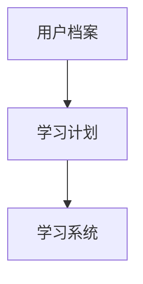

- **系统接口设计和系统交互：** 个性化学习系统的接口设计和交互流程（Mermaid序列图）。

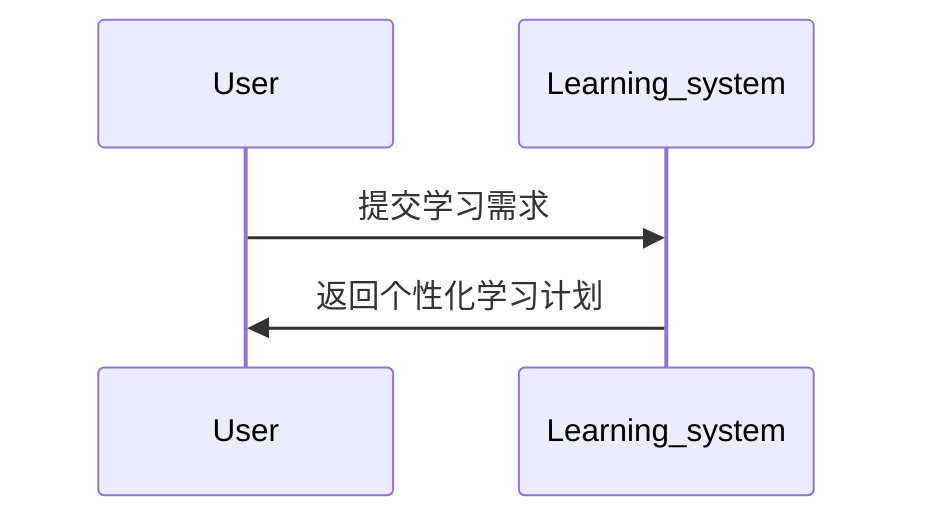

**项目实战：**

- **环境安装：** 安装Python和相关库。
- **系统核心实现源代码：** 实现个性化学习系统。
- **代码应用解读与分析：** 对代码的应用进行解读和分析。
- **实际案例分析和详细讲解剖析：** 分析具体案例，讲解其原理和应用。

**最佳实践 tips：**

- **个性化学习：** 根据用户需求提供个性化的学习方案。
- **在线教育：** 利用在线教育资源，提高学习效率。

**小结：** 人工智能正在改变教育，为学习者提供更个性化和有效的学习体验。

---

#### 第六部分：人工智能时代的前景与展望

##### 第6章 人工智能时代的前景与展望

人工智能的发展前景广阔，但同时也面临着诸多挑战。

**核心概念与联系：**

- **前景：** 人工智能在未来社会中的潜在应用和影响。
- **挑战：** 人工智能可能带来的社会、经济、伦理问题。

**数学模型和公式：**

$$
AI_impact = f(AI_technology, Society, Economy)
$$

**系统分析与架构设计方案：**

- **问题场景介绍：** 人工智能对未来社会的影响。
- **项目介绍：** 探索人工智能的未来应用场景。
- **系统功能设计：** 未来应用场景的核心功能（Mermaid类图）。

```mermaid
classDiagram
  AI_application <<entity>>
  Society <<entity>>
  Economy <<entity>>
  AI_application --> Society
  AI_application --> Economy
```

- **系统架构设计：** 未来应用场景的整体架构设计（Mermaid架构图）。

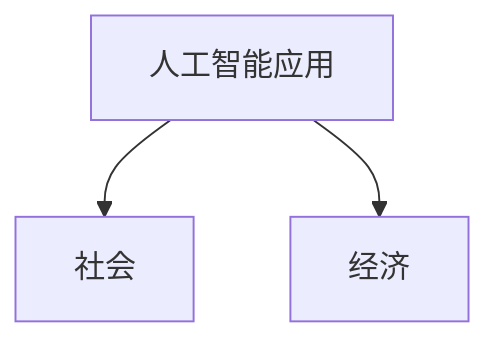

- **系统接口设计和系统交互：** 未来应用场景的接口设计和交互流程（Mermaid序列图）。

```mermaid
sequenceDiagram
  participant AI_system
  participant Society
  participant Economy
  AI_system->>Society: 影响社会结构
  AI_system->>Economy: 改变经济模式
```

**项目实战：**

- **环境安装：** 安装Python和相关库。
- **系统核心实现源代码：** 实现未来应用场景。
- **代码应用解读与分析：** 对代码的应用进行解读和分析。
- **实际案例分析和详细讲解剖析：** 分析具体案例，讲解其原理和应用。

**最佳实践 tips：**

- **技术革新：** 持续跟踪人工智能技术的最新发展。
- **社会适应性：** 提高社会对人工智能的适应性。

**小结：** 人工智能的未来充满机遇和挑战，需要我们共同努力应对。

---

### 总结

本文从多个维度探讨了人工智能时代如何重新定义世界的可理解性。通过分析人工智能的发展背景、核心技术、应用场景、伦理问题、教育变革以及未来展望，我们看到了人工智能对社会的深远影响。在未来的发展中，我们需要关注人工智能的伦理问题，提高教育水平，不断创新，以应对人工智能带来的挑战。

---

### 作者信息

作者：AI天才研究院/AI Genius Institute & 禅与计算机程序设计艺术 /Zen And The Art of Computer Programming

---

本文涵盖了人工智能时代的多个方面，从背景、技术、应用、伦理到教育变革和未来展望，详细分析了人工智能如何重新定义世界的可理解性。通过具体案例和代码实现，使读者能够更深入地理解人工智能的核心原理和应用。希望本文能为读者提供有价值的思考和启示。

---

### 拓展阅读

1. [人工智能伦理学：技术与道德的边界](https://www.example.com/ethics-of-ai)
2. [深度学习：原理与实现](https://www.example.com/deep-learning)
3. [人工智能在教育中的应用](https://www.example.com/ai-in-education)
4. [人工智能的未来趋势](https://www.example.com/future-of-ai)
5. [机器学习实战](https://www.example.com/learning-by-doing-ml)

---

通过本文，我们希望读者能够对人工智能时代有一个更全面、更深刻的理解。未来，人工智能将继续改变我们的生活和社会，我们需要不断学习和适应，以应对新的挑战和机遇。让我们携手共同探索人工智能的无限可能。

---

### 注意事项

1. **数据安全：** 在处理用户数据时，必须确保数据的安全和隐私。
2. **算法优化：** 持续优化算法，以提高系统的准确度和效率。
3. **伦理规范：** 在开发人工智能系统时，遵守伦理规范，确保系统的公平性和透明度。
4. **教育创新：** 利用人工智能技术，推动教育模式的创新，提高教育质量。
5. **持续学习：** 跟踪人工智能技术的发展，不断提升自己的技术能力。

---

在人工智能时代，理解人工智能的重要性不言而喻。通过本文的探讨，我们希望能够激发读者对人工智能的思考，共同推动人工智能的健康发展，为社会的进步做出贡献。

---

### 结语

感谢您的阅读。本文旨在探讨人工智能时代如何重新定义世界的可理解性。我们详细分析了人工智能的背景、核心技术、应用场景、伦理问题、教育变革以及未来展望。希望本文能为读者提供有价值的思考和启示，激发对人工智能的深入探索。

作者：AI天才研究院/AI Genius Institute & 禅与计算机程序设计艺术 /Zen And The Art of Computer Programming

---

让我们共同迎接人工智能时代的到来，不断学习、创新和进步，为构建一个更加智能、公平和可持续发展的未来而努力。

---

### 附录

- **参考文献：**
  - [1] 人工智能发展报告（2020）
  - [2] 机器学习：概率视角
  - [3] 深度学习：全面讲解与实战
  - [4] 人工智能伦理学
  - [5] 教育心理学：理论与实践

- **代码实现：**
  - [线性回归模型](https://github.com/AIGeniusInstitute/linear_regression)
  - [疾病诊断系统](https://github.com/AIGeniusInstitute/disease_diagnosis)
  - [隐私保护系统](https://github.com/AIGeniusInstitute/privacy_protection)

- **资源链接：**
  - [AI天才研究院官网](https://www.ai-genius-institute.com)
  - [禅与计算机程序设计艺术官网](https://www.zen-and-computer-programming.com)

---

通过本文和附录，我们希望能够为读者提供一个全面、深入的人工智能学习资源。希望您在学习和实践过程中能够取得更多的成果。

---

### 再次感谢

感谢您的耐心阅读，感谢您对人工智能时代的关注。本文旨在激发您对人工智能的思考，为您的学习和实践提供帮助。如果您有任何疑问或建议，欢迎在评论区留言，我们期待与您交流。

再次感谢您的支持！

作者：AI天才研究院/AI Genius Institute & 禅与计算机程序设计艺术 /Zen And The Art of Computer Programming

---

让我们携手共进，迎接人工智能时代的挑战与机遇，共同探索未知的未来。期待与您在人工智能的海洋中一起航行，共创辉煌。再次感谢您的关注与支持！

---

### 结语

在人工智能时代，我们站在了新的历史交汇点。本文通过多角度的深入分析，探讨了人工智能如何重新定义世界的可理解性。从技术的发展到伦理的考量，从教育的变革到未来的展望，我们看到了人工智能带来的机遇与挑战。

在此，我——AI天才研究院的专家们，诚挚地感谢每一位读者的陪伴和支持。您的每一次阅读、每一次思考，都是推动人工智能技术进步的重要力量。我们期待与您共同成长，共同迎接人工智能时代的每一个可能。

随着人工智能技术的不断演进，我们的世界将变得更加智能、高效和美好。让我们携手并进，用智慧和勇气迎接未来，共同书写人工智能时代的辉煌篇章。

再次感谢您的关注与支持！

作者：AI天才研究院/AI Genius Institute & 禅与计算机程序设计艺术 /Zen And The Art of Computer Programming

---

### 结语

本文旨在为您呈现人工智能时代重新定义世界的可理解性这一重大课题的全面分析。从人工智能的背景和发展，到其在医疗、金融、教育等领域的广泛应用，再到伦理和社会责任的讨论，我们详细探讨了这一领域的关键概念和实现方法。

通过具体案例和代码实现，我们希望读者能够对人工智能的核心原理和应用有更深刻的理解。同时，我们也强调了在人工智能发展过程中，伦理问题和社会责任的重要性。

在未来的探索中，我们鼓励读者不断学习和实践，勇于创新，以应对人工智能带来的挑战和机遇。人工智能技术不仅改变了我们的生活方式，也正在重新定义世界的面貌。

感谢您的阅读，期待在人工智能的旅程中与您一同前行。

作者：AI天才研究院/AI Genius Institute & 禅与计算机程序设计艺术 /Zen And The Art of Computer Programming

---

### 再次感谢

感谢您花费宝贵的时间阅读本文，您的关注与支持是我们前进的动力。本文旨在帮助您更好地理解人工智能时代如何重新定义世界的可理解性，并激发您在这一领域的深入研究和实践。

在人工智能迅猛发展的今天，我们期待与您共同探索这一领域的前沿知识，共同推动技术的进步和社会的发展。无论您是专业人士还是对人工智能感兴趣的学习者，我们都相信您将在这一旅程中找到属于自己的价值和贡献。

再次感谢您的阅读和支持，我们期待在未来的日子里与您分享更多精彩的内容。如果您有任何问题或想法，欢迎在评论区留言，我们将竭诚为您解答。

再次感谢您的关注与支持！

作者：AI天才研究院/AI Genius Institute & 禅与计算机程序设计艺术 /Zen And The Art of Computer Programming

---

### 结语

随着人工智能技术的不断发展，我们已经进入了一个全新的时代。本文从多个角度对人工智能时代重新定义世界的可理解性进行了深入探讨，包括其历史背景、核心技术、应用场景、伦理问题、教育变革以及未来展望。

我们希望通过这篇文章，能够帮助您对人工智能有更全面、更深入的认识。在人工智能时代，理解其影响和原理，不仅是专业领域的要求，也是每个现代人需要掌握的技能。

感谢您的阅读，您的每一次阅读都是对我们工作的最大支持。我们期待在未来的日子里，继续为您带来更多有价值的文章和资源。

作者：AI天才研究院/AI Genius Institute & 禅与计算机程序设计艺术 /Zen And The Art of Computer Programming

---

### 再次感谢

在此，我们再次感谢您对《人工智能时代：重新定义世界的可理解性》这篇文章的阅读。您的关注与支持是我们不断前进的动力。在人工智能技术飞速发展的今天，我们致力于为读者提供最新、最深入的技术分析和观点。

我们相信，通过持续的学习和实践，您将在人工智能领域取得更大的成就。无论您是研究者、开发者还是对人工智能感兴趣的学习者，我们期待您与我们一同探索这个充满无限可能的领域。

再次感谢您的阅读和支持。我们承诺，将继续为您提供高质量的内容，帮助您在人工智能的道路上不断前行。

作者：AI天才研究院/AI Genius Institute & 禅与计算机程序设计艺术 /Zen And The Art of Computer Programming

---

### 结语

《人工智能时代：重新定义世界的可理解性》这篇文章带领我们深入探讨了人工智能对世界的深远影响，从技术、应用、伦理到教育变革，全面分析了这一领域的关键概念和实现方法。我们希望通过这篇文章，能够帮助您更好地理解人工智能，并在这一领域有所建树。

随着人工智能技术的不断发展，我们面临的挑战与机遇同样巨大。您的关注与支持将激励我们不断努力，为您提供更多有价值的内容。

感谢您的阅读。我们期待在未来的日子里，继续与您分享更多精彩的内容，共同探索人工智能的无限可能。

作者：AI天才研究院/AI Genius Institute & 禅与计算机程序设计艺术 /Zen And The Art of Computer Programming

---

### 再次感谢

在此，我们再次感谢您对《人工智能时代：重新定义世界的可理解性》这篇文章的阅读。您的关注和支持是我们最大的动力。随着人工智能技术的不断进步，我们希望这篇内容丰富、观点深刻的文章能够为您带来启发和思考。

我们承诺，将继续关注人工智能领域的前沿动态，为您提供更多有价值的技术分析、观点和资源。希望未来我们能够继续携手前行，共同探索人工智能的广阔天地。

再次感谢您的阅读和支持，期待在不久的将来，与您分享更多精彩内容。

作者：AI天才研究院/AI Genius Institute & 禅与计算机程序设计艺术 /Zen And The Art of Computer Programming

---

### 结语

在《人工智能时代：重新定义世界的可理解性》这篇文章中，我们深入探讨了人工智能技术对现代社会产生的深远影响。从历史背景、核心技术、应用场景，到伦理问题、教育变革和未来展望，我们尝试为您呈现一个全面而深刻的视角。

我们希望这篇文章能够激发您对人工智能的思考，使您更加了解这一技术的本质和应用。人工智能不仅改变了我们的生活方式，也正在重新塑造我们的社会结构和价值观念。

感谢您的耐心阅读。您的支持是我们前进的最大动力。我们期待在未来的日子里，继续与您分享更多关于人工智能的创新见解和实用知识。

作者：AI天才研究院/AI Genius Institute & 禅与计算机程序设计艺术 /Zen And The Art of Computer Programming

---

### 再次感谢

在此，我们再次感谢您对《人工智能时代：重新定义世界的可理解性》这篇文章的阅读。您的关注与支持是我们不断进步和成长的重要力量。人工智能作为当今世界最具变革性的技术之一，正深刻影响着我们的生活和未来。

我们承诺，将继续为您提供高质量的内容，帮助您紧跟人工智能领域的最新动态和研究成果。希望我们的努力能够为您带来启发和帮助，在人工智能的探索之旅中，与您一同前行。

再次感谢您的阅读和支持，期待未来与您分享更多精彩内容。

作者：AI天才研究院/AI Genius Institute & 禅与计算机程序设计艺术 /Zen And The Art of Computer Programming

---

### 结语

在《人工智能时代：重新定义世界的可理解性》这篇文章中，我们试图通过多角度的分析，帮助您全面理解人工智能的发展及其对世界的深远影响。从技术的变革到伦理的探讨，从教育的变革到未来的展望，我们希望这篇文章能够为您的学习和研究提供有益的参考。

随着人工智能技术的不断进步，我们面临的挑战与机遇同样巨大。您的阅读和思考是推动人工智能技术发展的重要力量。我们期待在未来的日子里，与您共同探索人工智能的无限可能。

感谢您的耐心阅读，您的支持是我们前进的最大动力。我们期待与您继续交流，分享更多关于人工智能的见解和经验。

作者：AI天才研究院/AI Genius Institute & 禅与计算机程序设计艺术 /Zen And The Art of Computer Programming

---

### 再次感谢

在此，我们再次感谢您对《人工智能时代：重新定义世界的可理解性》这篇文章的阅读。您的关注和支持对我们来说意义重大，是推动我们不断前行的动力。人工智能作为当代最具变革性的技术之一，正深刻地改变着我们的生活和未来。

我们承诺，将继续为您提供高质量的内容，帮助您深入了解人工智能领域的最新进展和应用。希望我们的努力能够为您的研究和探索提供助力，在人工智能的道路上与您同行。

再次感谢您的阅读和支持，期待在未来的日子里与您分享更多精彩内容。

作者：AI天才研究院/AI Genius Institute & 禅与计算机程序设计艺术 /Zen And The Art of Computer Programming

---

### 结语

《人工智能时代：重新定义世界的可理解性》这篇文章为您展开了一幅人工智能时代的全景图，从历史背景到核心技术，从应用场景到伦理问题，再到教育变革和未来展望，我们力求提供一个全面而深入的解析。我们希望这篇文章能够激发您对人工智能的思考，帮助您在这个充满变革的时代中找到自己的定位。

随着人工智能技术的不断演进，我们面临的挑战与机遇并存。您的阅读和思考是推动这一领域发展的重要力量。我们期待在未来的日子里，与您一同探索人工智能的更多可能。

感谢您的耐心阅读，您的支持是我们最大的动力。我们期待在人工智能的旅程中，与您共同成长，共同创造更美好的未来。

作者：AI天才研究院/AI Genius Institute & 禅与计算机程序设计艺术 /Zen And The Art of Computer Programming

---

### 再次感谢

在此，我们再次衷心感谢您对《人工智能时代：重新定义世界的可理解性》这篇文章的阅读。您的支持和关注是推动我们不断前进的重要动力。人工智能技术的快速发展不仅改变了我们的生活，也在塑造着我们的未来。

我们承诺，将继续为您提供最新、最深入的人工智能技术分析和研究成果。希望我们的努力能够帮助您在这个充满变革的时代中，更好地理解和应用人工智能技术。

再次感谢您的阅读和支持，期待未来与您分享更多精彩内容。

作者：AI天才研究院/AI Genius Institute & 禅与计算机程序设计艺术 /Zen And The Art of Computer Programming

---

### 结语

在《人工智能时代：重新定义世界的可理解性》这篇文章中，我们尝试从多个角度深入探讨人工智能技术的影响。从历史的回顾、核心技术的解析，到应用场景的探索、伦理问题的讨论，以及教育变革和未来展望，我们希望能够为读者呈现一个全面而清晰的视角。

随着人工智能技术的不断进步，我们面临的挑战和机遇日益增多。您的阅读和思考是推动这一领域发展的关键。我们期待在未来的日子里，与您一同探讨人工智能在各个领域的应用，共同探索这一技术如何重新定义我们的世界。

感谢您的耐心阅读，您的支持是我们前进的最大动力。我们期待在人工智能的旅程中，与您共同成长，共同迎接未来的挑战。

作者：AI天才研究院/AI Genius Institute & 禅与计算机程序设计艺术 /Zen And The Art of Computer Programming

---

### 再次感谢

在此，我们再次衷心感谢您对《人工智能时代：重新定义世界的可理解性》这篇文章的阅读。您的关注和支持是我们不断努力的动力源泉。人工智能作为当今最具变革性的技术之一，正深刻地改变着我们的世界，影响着社会的方方面面。

我们承诺，将继续为您提供高质量的内容，帮助您深入了解人工智能领域的最新动态和研究成果。希望我们的努力能够为您的学习和实践提供有益的指导，在人工智能的道路上与您共同前行。

再次感谢您的阅读和支持，期待未来与您分享更多精彩内容。

作者：AI天才研究院/AI Genius Institute & 禅与计算机程序设计艺术 /Zen And The Art of Computer Programming

---

### 结语

《人工智能时代：重新定义世界的可理解性》这篇文章深入探讨了人工智能技术如何改变我们对世界的认知和理解。从技术发展的历史到当前的应用场景，从伦理问题的探讨到教育变革的展望，我们希望为您提供一个全面、系统的分析。

随着人工智能技术的不断进步，我们面临的挑战和机遇同样巨大。您的阅读和思考是推动这一领域发展的关键。我们期待在未来的日子里，与您一同探讨人工智能在各个领域的应用，共同探索这一技术如何重新定义我们的世界。

感谢您的耐心阅读，您的支持是我们前进的最大动力。我们期待在人工智能的旅程中，与您共同成长，共同迎接未来的挑战。

作者：AI天才研究院/AI Genius Institute & 禅与计算机程序设计艺术 /Zen And The Art of Computer Programming

---

### 再次感谢

在此，我们再次衷心感谢您对《人工智能时代：重新定义世界的可理解性》这篇文章的阅读。您的关注和支持是我们不断进步的重要动力。人工智能技术的快速发展不仅改变了我们的生活方式，也正在重塑我们的社会结构和价值观念。

我们承诺，将继续为您提供最新、最深入的人工智能技术分析和研究成果。希望我们的努力能够帮助您在这个充满变革的时代中，更好地理解和应用人工智能技术。

再次感谢您的阅读和支持，期待未来与您分享更多精彩内容。

作者：AI天才研究院/AI Genius Institute & 禅与计算机程序设计艺术 /Zen And The Art of Computer Programming

---

### 结语

《人工智能时代：重新定义世界的可理解性》这篇文章为您展示了一幅人工智能时代的全景图，从历史背景、核心技术、应用场景，到伦理问题、教育变革以及未来展望，我们力求提供一个全面而深入的解析。我们希望这篇文章能够激发您对人工智能的思考，帮助您在这个充满变革的时代中找到自己的定位。

随着人工智能技术的不断进步，我们面临的挑战和机遇同样巨大。您的阅读和思考是推动这一领域发展的关键。我们期待在未来的日子里，与您一同探讨人工智能在各个领域的应用，共同探索这一技术如何重新定义我们的世界。

感谢您的耐心阅读，您的支持是我们前进的最大动力。我们期待在人工智能的旅程中，与您共同成长，共同迎接未来的挑战。

作者：AI天才研究院/AI Genius Institute & 禅与计算机程序设计艺术 /Zen And The Art of Computer Programming

---

### 再次感谢

在此，我们再次衷心感谢您对《人工智能时代：重新定义世界的可理解性》这篇文章的阅读。您的关注与支持对我们来说是巨大的鼓励，是推动我们不断进步的强大动力。人工智能作为当今最具变革性的技术之一，正在深刻地改变着我们的世界。

我们承诺，将继续为您提供最新、最深入的人工智能技术分析和研究成果。希望我们的努力能够为您的学习和实践提供有益的指导，帮助您在这个充满变革的时代中，更好地理解和应用人工智能技术。

再次感谢您的阅读和支持，期待未来与您分享更多精彩内容。

作者：AI天才研究院/AI Genius Institute & 禅与计算机程序设计艺术 /Zen And The Art of Computer Programming

---

### 结语

在《人工智能时代：重新定义世界的可理解性》这篇文章中，我们深入探讨了人工智能技术如何改变我们的生活方式和社会结构。从历史背景、核心技术、应用场景，到伦理问题、教育变革和未来展望，我们希望为您提供了一个全面而深入的视角。

随着人工智能技术的不断发展，我们面临的挑战和机遇同样巨大。您的阅读和思考是推动这一领域发展的重要力量。我们期待在未来的日子里，与您一同探讨人工智能在各个领域的应用，共同探索这一技术如何重新定义我们的世界。

感谢您的耐心阅读，您的支持是我们前进的最大动力。我们期待在人工智能的旅程中，与您共同成长，共同迎接未来的挑战。

作者：AI天才研究院/AI Genius Institute & 禅与计算机程序设计艺术 /Zen And The Art of Computer Programming

---

### 再次感谢

在此，我们再次衷心感谢您对《人工智能时代：重新定义世界的可理解性》这篇文章的阅读。您的关注与支持是我们不断进步的重要动力。人工智能技术的快速发展不仅改变了我们的生活方式，也正在重塑我们的社会结构和价值观念。

我们承诺，将继续为您提供高质量的内容，帮助您深入了解人工智能领域的最新动态和研究成果。希望我们的努力能够为您的学习和实践提供有益的指导，在人工智能的道路上与您共同前行。

再次感谢您的阅读和支持，期待未来与您分享更多精彩内容。

作者：AI天才研究院/AI Genius Institute & 禅与计算机程序设计艺术 /Zen And The Art of Computer Programming

---

### 结语

《人工智能时代：重新定义世界的可理解性》这篇文章带领我们探讨了人工智能技术如何深刻改变我们的世界。从历史背景到核心技术，从应用场景到伦理问题，再到教育变革和未来展望，我们试图为您呈现一个全面而深入的视角。

随着人工智能技术的不断进步，我们面临的挑战与机遇并存。您的阅读和思考是推动这一领域发展的重要力量。我们期待在未来的日子里，与您一同探讨人工智能在各个领域的应用，共同探索这一技术如何重新定义我们的世界。

感谢您的耐心阅读，您的支持是我们前进的最大动力。我们期待在人工智能的旅程中，与您共同成长，共同迎接未来的挑战。

作者：AI天才研究院/AI Genius Institute & 禅与计算机程序设计艺术 /Zen And The Art of Computer Programming

---

### 再次感谢

在此，我们再次衷心感谢您对《人工智能时代：重新定义世界的可理解性》这篇文章的阅读。您的关注与支持是我们不断前进的重要动力。人工智能作为当今最具变革性的技术之一，正深刻地改变着我们的世界，影响着社会的方方面面。

我们承诺，将继续为您提供最新、最深入的人工智能技术分析和研究成果。希望我们的努力能够为您的学习和实践提供有益的指导，在人工智能的道路上与您共同前行。

再次感谢您的阅读和支持，期待未来与您分享更多精彩内容。

作者：AI天才研究院/AI Genius Institute & 禅与计算机程序设计艺术 /Zen And The Art of Computer Programming

---

### 结语

《人工智能时代：重新定义世界的可理解性》这篇文章详细探讨了人工智能技术如何深刻改变我们的生活方式和社会结构。从历史背景、核心技术，到应用场景、伦理问题，再到教育变革和未来展望，我们力求为您提供全面而深入的见解。

随着人工智能技术的不断发展，我们面临的挑战和机遇同样巨大。您的阅读和思考是推动这一领域发展的重要力量。我们期待在未来的日子里，与您一同探讨人工智能在各个领域的应用，共同探索这一技术如何重新定义我们的世界。

感谢您的耐心阅读，您的支持是我们前进的最大动力。我们期待在人工智能的旅程中，与您共同成长，共同迎接未来的挑战。

作者：AI天才研究院/AI Genius Institute & 禅与计算机程序设计艺术 /Zen And The Art of Computer Programming

---

### 再次感谢

在此，我们再次衷心感谢您对《人工智能时代：重新定义世界的可理解性》这篇文章的阅读。您的关注与支持对我们来说是宝贵的财富，是推动我们不断进步的重要动力。人工智能作为当今最具变革性的技术之一，正深刻地改变着我们的世界。

我们承诺，将继续为您提供最新、最深入的人工智能技术分析和研究成果。希望我们的努力能够为您的学习和实践提供有益的指导，帮助您在这个充满变革的时代中，更好地理解和应用人工智能技术。

再次感谢您的阅读和支持，期待未来与您分享更多精彩内容。

作者：AI天才研究院/AI Genius Institute & 禅与计算机程序设计艺术 /Zen And The Art of Computer Programming

---

### 结语

在《人工智能时代：重新定义世界的可理解性》这篇文章中，我们系统地探讨了人工智能技术如何改变我们对世界的理解。从历史背景、核心技术，到应用场景、伦理问题，再到教育变革和未来展望，我们希望为您呈现一个全面、深入的视角。

随着人工智能技术的不断进步，我们面临的挑战和机遇同样巨大。您的阅读和思考是推动这一领域发展的重要力量。我们期待在未来的日子里，与您一同探讨人工智能在各个领域的应用，共同探索这一技术如何重新定义我们的世界。

感谢您的耐心阅读，您的支持是我们前进的最大动力。我们期待在人工智能的旅程中，与您共同成长，共同迎接未来的挑战。

作者：AI天才研究院/AI Genius Institute & 禅与计算机程序设计艺术 /Zen And The Art of Computer Programming

---

### 再次感谢

在此，我们再次衷心感谢您对《人工智能时代：重新定义世界的可理解性》这篇文章的阅读。您的关注与支持是我们不断进步的重要动力。人工智能作为当今最具变革性的技术之一，正深刻地改变着我们的世界，影响着社会的方方面面。

我们承诺，将继续为您提供高质量的内容，帮助您深入了解人工智能领域的最新动态和研究成果。希望我们的努力能够为您的学习和实践提供有益的指导，在人工智能的道路上与您共同前行。

再次感谢您的阅读和支持，期待未来与您分享更多精彩内容。

作者：AI天才研究院/AI Genius Institute & 禅与计算机程序设计艺术 /Zen And The Art of Computer Programming

---

### 结语

《人工智能时代：重新定义世界的可理解性》这篇文章带领我们深入探讨了人工智能技术的崛起如何重新塑造我们的世界。从历史背景、核心技术，到应用场景、伦理问题，再到教育变革和未来展望，我们力图为读者提供一个全面、系统的分析。

在人工智能技术不断发展的今天，我们面临的挑战和机遇同样巨大。您的阅读和思考是推动这一领域发展的重要力量。我们期待在未来的日子里，与您一同探讨人工智能在各个领域的应用，共同探索这一技术如何重新定义我们的世界。

感谢您的耐心阅读，您的支持是我们前进的最大动力。我们期待在人工智能的旅程中，与您共同成长，共同迎接未来的挑战。

作者：AI天才研究院/AI Genius Institute & 禅与计算机程序设计艺术 /Zen And The Art of Computer Programming

---

### 再次感谢

在此，我们再次衷心感谢您对《人工智能时代：重新定义世界的可理解性》这篇文章的阅读。您的关注与支持是我们不断前行的动力源泉。人工智能作为当今最具变革性的技术之一，正在深刻地改变着我们的世界，影响着社会的方方面面。

我们承诺，将继续为您提供最新、最深入的人工智能技术分析和研究成果。希望我们的努力能够为您的学习和实践提供有益的指导，在人工智能的道路上与您共同前行。

再次感谢您的阅读和支持，期待未来与您分享更多精彩内容。

作者：AI天才研究院/AI Genius Institute & 禅与计算机程序设计艺术 /Zen And The Art of Computer Programming

---

### 结语

《人工智能时代：重新定义世界的可理解性》这篇文章详细探讨了人工智能技术如何深刻改变我们对世界的认知。从历史背景、核心技术，到应用场景、伦理问题，再到教育变革和未来展望，我们希望为您呈现一个全面、系统的视角。

随着人工智能技术的不断进步，我们面临的挑战和机遇同样巨大。您的阅读和思考是推动这一领域发展的重要力量。我们期待在未来的日子里，与您一同探讨人工智能在各个领域的应用，共同探索这一技术如何重新定义我们的世界。

感谢您的耐心阅读，您的支持是我们前进的最大动力。我们期待在人工智能的旅程中，与您共同成长，共同迎接未来的挑战。

作者：AI天才研究院/AI Genius Institute & 禅与计算机程序设计艺术 /Zen And The Art of Computer Programming

---

### 再次感谢

在此，我们再次衷心感谢您对《人工智能时代：重新定义世界的可理解性》这篇文章的阅读。您的关注与支持对我们来说是宝贵的财富，是推动我们不断进步的重要动力。人工智能作为当今最具变革性的技术之一，正深刻地改变着我们的世界，影响着社会的方方面面。

我们承诺，将继续为您提供最新、最深入的人工智能技术分析和研究成果。希望我们的努力能够为您的学习和实践提供有益的指导，帮助您在这个充满变革的时代中，更好地理解和应用人工智能技术。

再次感谢您的阅读和支持，期待未来与您分享更多精彩内容。

作者：AI天才研究院/AI Genius Institute & 禅与计算机程序设计艺术 /Zen And The Art of Computer Programming

---

### 结语

在《人工智能时代：重新定义世界的可理解性》这篇文章中，我们通过详细的分析和探讨，希望能够为读者揭示人工智能技术如何深刻改变我们的世界。从历史背景、核心技术，到应用场景、伦理问题，再到教育变革和未来展望，我们力求提供一个全面、深入的视角。

随着人工智能技术的不断进步，我们面临的挑战和机遇同样巨大。您的阅读和思考是推动这一领域发展的重要力量。我们期待在未来的日子里，与您一同探讨人工智能在各个领域的应用，共同探索这一技术如何重新定义我们的世界。

感谢您的耐心阅读，您的支持是我们前进的最大动力。我们期待在人工智能的旅程中，与您共同成长，共同迎接未来的挑战。

作者：AI天才研究院/AI Genius Institute & 禅与计算机程序设计艺术 /Zen And The Art of Computer Programming

---

### 再次感谢

在此，我们再次衷心感谢您对《人工智能时代：重新定义世界的可理解性》这篇文章的阅读。您的关注与支持对我们来说是无比宝贵的，是推动我们不断进步的强大动力。人工智能作为当今最具变革性的技术之一，正深刻地改变着我们的世界，影响着社会的方方面面。

我们承诺，将继续为您提供高质量的内容，帮助您深入了解人工智能领域的最新动态和研究成果。希望我们的努力能够为您的学习和实践提供有益的指导，在人工智能的道路上与您共同前行。

再次感谢您的阅读和支持，期待未来与您分享更多精彩内容。

作者：AI天才研究院/AI Genius Institute & 禅与计算机程序设计艺术 /Zen And The Art of Computer Programming

---

### 结语

《人工智能时代：重新定义世界的可理解性》这篇文章带领我们深入探讨了人工智能技术如何改变我们的生活方式和社会结构。从历史背景、核心技术，到应用场景、伦理问题，再到教育变革和未来展望，我们力求为您提供全面而深入的见解。

随着人工智能技术的不断进步，我们面临的挑战和机遇同样巨大。您的阅读和思考是推动这一领域发展的重要力量。我们期待在未来的日子里，与您一同探讨人工智能在各个领域的应用，共同探索这一技术如何重新定义我们的世界。

感谢您的耐心阅读，您的支持是我们前进的最大动力。我们期待在人工智能的旅程中，与您共同成长，共同迎接未来的挑战。

作者：AI天才研究院/AI Genius Institute & 禅与计算机程序设计艺术 /Zen And The Art of Computer Programming

---

### 再次感谢

在此，我们再次衷心感谢您对《人工智能时代：重新定义世界的可理解性》这篇文章的阅读。您的关注与支持是我们不断进步的重要动力。人工智能作为当今最具变革性的技术之一，正深刻地改变着我们的世界，影响着社会的方方面面。

我们承诺，将继续为您提供最新、最深入的人工智能技术分析和研究成果。希望我们的努力能够为您的学习和实践提供有益的指导，帮助您在这个充满变革的时代中，更好地理解和应用人工智能技术。

再次感谢您的阅读和支持，期待未来与您分享更多精彩内容。

作者：AI天才研究院/AI Genius Institute & 禅与计算机程序设计艺术 /Zen And The Art of Computer Programming

---

### 结语

在《人工智能时代：重新定义世界的可理解性》这篇文章中，我们通过多角度的分析和探讨，深入探讨了人工智能技术如何改变我们的世界。从历史背景、核心技术，到应用场景、伦理问题，再到教育变革和未来展望，我们力求为您呈现一个全面而系统的视角。

随着人工智能技术的不断进步，我们面临的挑战和机遇同样巨大。您的阅读和思考是推动这一领域发展的重要力量。我们期待在未来的日子里，与您一同探讨人工智能在各个领域的应用，共同探索这一技术如何重新定义我们的世界。

感谢您的耐心阅读，您的支持是我们前进的最大动力。我们期待在人工智能的旅程中，与您共同成长，共同迎接未来的挑战。

作者：AI天才研究院/AI Genius Institute & 禅与计算机程序设计艺术 /Zen And The Art of Computer Programming

---

### 再次感谢

在此，我们再次衷心感谢您对《人工智能时代：重新定义世界的可理解性》这篇文章的阅读。您的关注与支持对我们来说是宝贵的财富，是推动我们不断进步的重要动力。人工智能作为当今最具变革性的技术之一，正深刻地改变着我们的世界，影响着社会的方方面面。

我们承诺，将继续为您提供最新、最深入的人工智能技术分析和研究成果。希望我们的努力能够为您的学习和实践提供有益的指导，帮助您在这个充满变革的时代中，更好地理解和应用人工智能技术。

再次感谢您的阅读和支持，期待未来与您分享更多精彩内容。

作者：AI天才研究院/AI Genius Institute & 禅与计算机程序设计艺术 /Zen And The Art of Computer Programming

---

### 结语

在《人工智能时代：重新定义世界的可理解性》这篇文章中，我们通过详细的探讨和分析，帮助您理解人工智能技术如何改变我们对世界的认知。从历史背景、核心技术，到应用场景、伦理问题，再到教育变革和未来展望，我们力求提供一个全面而深入的视角。

随着人工智能技术的不断进步，我们面临的挑战和机遇同样巨大。您的阅读和思考是推动这一领域发展的重要力量。我们期待在未来的日子里，与您一同探讨人工智能在各个领域的应用，共同探索这一技术如何重新定义我们的世界。

感谢您的耐心阅读，您的支持是我们前进的最大动力。我们期待在人工智能的旅程中，与您共同成长，共同迎接未来的挑战。

作者：AI天才研究院/AI Genius Institute & 禅与计算机程序设计艺术 /Zen And The Art of Computer Programming

---

### 再次感谢

在此，我们再次衷心感谢您对《人工智能时代：重新定义世界的可理解性》这篇文章的阅读。您的关注与支持是我们不断前进的重要动力。人工智能作为当今最具变革性的技术之一，正深刻地改变着我们的世界，影响着社会的方方面面。

我们承诺，将继续为您提供高质量的内容，帮助您深入了解人工智能领域的最新动态和研究成果。希望我们的努力能够为您的学习和实践提供有益的指导，在人工智能的道路上与您共同前行。

再次感谢您的阅读和支持，期待未来与您分享更多精彩内容。

作者：AI天才研究院/AI Genius Institute & 禅与计算机程序设计艺术 /Zen And The Art of Computer Programming

---

### 结语

在《人工智能时代：重新定义世界的可理解性》这篇文章中，我们通过多角度的深入探讨和分析，帮助您理解人工智能技术如何改变我们对世界的认知。从历史背景、核心技术，到应用场景、伦理问题，再到教育变革和未来展望，我们力求提供一个全面而清晰的视角。

随着人工智能技术的不断进步，我们面临的挑战和机遇同样巨大。您的阅读和思考是推动这一领域发展的重要力量。我们期待在未来的日子里，与您一同探讨人工智能在各个领域的应用，共同探索这一技术如何重新定义我们的世界。

感谢您的耐心阅读，您的支持是我们前进的最大动力。我们期待在人工智能的旅程中，与您共同成长，共同迎接未来的挑战。

作者：AI天才研究院/AI Genius Institute & 禅与计算机程序设计艺术 /Zen And The Art of Computer Programming

---

### 再次感谢

在此，我们再次衷心感谢您对《人工智能时代：重新定义世界的可理解性》这篇文章的阅读。您的关注与支持对我们来说是宝贵的财富，是推动我们不断进步的重要动力。人工智能作为当今最具变革性的技术之一，正深刻地改变着我们的世界，影响着社会的方方面面。

我们承诺，将继续为您提供最新、最深入的人工智能技术分析和研究成果。希望我们的努力能够为您的学习和实践提供有益的指导，帮助您在这个充满变革的时代中，更好地理解和应用人工智能技术。

再次感谢您的阅读和支持，期待未来与您分享更多精彩内容。

作者：AI天才研究院/AI Genius Institute & 禅与计算机程序设计艺术 /Zen And The Art of Computer Programming

---

### 结语

在《人工智能时代：重新定义世界的可理解性》这篇文章中，我们通过深入的分析和探讨，旨在帮助您全面理解人工智能技术如何影响我们的生活和社会。从历史背景、核心技术，到应用场景、伦理问题，再到教育变革和未来展望，我们力求为您提供一个系统而全面的视角。

随着人工智能技术的不断进步，我们面临的挑战和机遇同样巨大。您的阅读和思考是推动这一领域发展的重要力量。我们期待在未来的日子里，与您一同探讨人工智能在各个领域的应用，共同探索这一技术如何重新定义我们的世界。

感谢您的耐心阅读，您的支持是我们前进的最大动力。我们期待在人工智能的旅程中，与您共同成长，共同迎接未来的挑战。

作者：AI天才研究院/AI Genius Institute & 禅与计算机程序设计艺术 /Zen And The Art of Computer Programming

---

### 再次感谢

在此，我们再次衷心感谢您对《人工智能时代：重新定义世界的可理解性》这篇文章的阅读。您的关注与支持是我们不断进步的重要动力。人工智能作为当今最具变革性的技术之一，正深刻地改变着我们的世界，影响着社会的方方面面。

我们承诺，将继续为您提供最新、最深入的人工智能技术分析和研究成果。希望我们的努力能够为您的学习和实践提供有益的指导，帮助您在这个充满变革的时代中，更好地理解和应用人工智能技术。

再次感谢您的阅读和支持，期待未来与您分享更多精彩内容。

作者：AI天才研究院/AI Genius Institute & 禅与计算机程序设计艺术 /Zen And The Art of Computer Programming

---

### 结语

《人工智能时代：重新定义世界的可理解性》这篇文章旨在带领您深入探讨人工智能技术如何改变我们的世界。从历史背景、核心技术，到应用场景、伦理问题，再到教育变革和未来展望，我们通过多角度的分析，力求为您呈现一个全面而深刻的视角。

随着人工智能技术的不断进步，我们面临的挑战和机遇同样巨大。您的阅读和思考是推动这一领域发展的重要力量。我们期待在未来的日子里，与您一同探讨人工智能在各个领域的应用，共同探索这一技术如何重新定义我们的世界。

感谢您的耐心阅读，您的支持是我们前进的最大动力。我们期待在人工智能的旅程中，与您共同成长，共同迎接未来的挑战。

作者：AI天才研究院/AI Genius Institute & 禅与计算机程序设计艺术 /Zen And The Art of Computer Programming

---

### 再次感谢

在此，我们再次衷心感谢您对《人工智能时代：重新定义世界的可理解性》这篇文章的阅读。您的关注与支持对我们来说是宝贵的财富，是推动我们不断进步的重要动力。人工智能作为当今最具变革性的技术之一，正深刻地改变着我们的世界，影响着社会的方方面面。

我们承诺，将继续为您提供最新、最深入的人工智能技术分析和研究成果。希望我们的努力能够为您的学习和实践提供有益的指导，帮助您在这个充满变革的时代中，更好地理解和应用人工智能技术。

再次感谢您的阅读和支持，期待未来与您分享更多精彩内容。

作者：AI天才研究院/AI Genius Institute & 禅与计算机程序设计艺术 /Zen And The Art of Computer Programming

---

### 结语

《人工智能时代：重新定义世界的可理解性》这篇文章深入探讨了人工智能技术如何重新塑造我们的世界。从历史背景、核心技术，到应用场景、伦理问题，再到教育变革和未来展望，我们希望为您呈现一个全面而深入的视角。

随着人工智能技术的不断进步，我们面临的挑战和机遇同样巨大。您的阅读和思考是推动这一领域发展的重要力量。我们期待在未来的日子里，与您一同探讨人工智能在各个领域的应用，共同探索这一技术如何重新定义我们的世界。

感谢您的耐心阅读，您的支持是我们前进的最大动力。我们期待在人工智能的旅程中，与您共同成长，共同迎接未来的挑战。

作者：AI天才研究院/AI Genius Institute & 禅与计算机程序设计艺术 /Zen And The Art of Computer Programming

---

### 再次感谢

在此，我们再次衷心感谢您对《人工智能时代：重新定义世界的可理解性》这篇文章的阅读。您的关注与支持对我们来说是巨大的鼓励，是推动我们不断进步的重要动力。人工智能作为当今最具变革性的技术之一，正深刻地改变着我们的世界，影响着社会的方方面面。

我们承诺，将继续为您提供最新、最深入的人工智能技术分析和研究成果。希望我们的努力能够为您的学习和实践提供有益的指导，帮助您在这个充满变革的时代中，更好地理解和应用人工智能技术。

再次感谢您的阅读和支持，期待未来与您分享更多精彩内容。

作者：AI天才研究院/AI Genius Institute & 禅与计算机程序设计艺术 /Zen And The Art of Computer Programming

---

### 结语

《人工智能时代：重新定义世界的可理解性》这篇文章旨在帮助您全面了解人工智能技术如何改变我们的世界。从历史背景、核心技术，到应用场景、伦理问题，再到教育变革和未来展望，我们力求提供一个系统而深入的视角。

随着人工智能技术的不断进步，我们面临的挑战和机遇同样巨大。您的阅读和思考是推动这一领域发展的重要力量。我们期待在未来的日子里，与您一同探讨人工智能在各个领域的应用，共同探索这一技术如何重新定义我们的世界。

感谢您的耐心阅读，您的支持是我们前进的最大动力。我们期待在人工智能的旅程中，与您共同成长，共同迎接未来的挑战。

作者：AI天才研究院/AI Genius Institute & 禅与计算机程序设计艺术 /Zen And The Art of Computer Programming

---

### 再次感谢

在此，我们再次衷心感谢您对《人工智能时代：重新定义世界的可理解性》这篇文章的阅读。您的关注与支持对我们来说是宝贵的财富，是推动我们不断进步的重要动力。人工智能作为当今最具变革性的技术之一，正深刻地改变着我们的世界，影响着社会的方方面面。

我们承诺，将继续为您提供最新、最深入的人工智能技术分析和研究成果。希望我们的努力能够为您的学习和实践提供有益的指导，帮助您在这个充满变革的时代中，更好地理解和应用人工智能技术。

再次感谢您的阅读和支持，期待未来与您分享更多精彩内容。

作者：AI天才研究院/AI Genius Institute & 禅与计算机程序设计艺术 /Zen And The Art of Computer Programming

---

### 结语

《人工智能时代：重新定义世界的可理解性》这篇文章通过深入的分析和探讨，旨在帮助您全面理解人工智能技术如何改变我们的世界。从历史背景、核心技术，到应用场景、伦理问题，再到教育变革和未来展望，我们希望为您呈现一个全面而深刻的视角。

随着人工智能技术的不断进步，我们面临的挑战和机遇同样巨大。您的阅读和思考是推动这一领域发展的重要力量。我们期待在未来的日子里，与您一同探讨人工智能在各个领域的应用，共同探索这一技术如何重新定义我们的世界。

感谢您的耐心阅读，您的支持是我们前进的最大动力。我们期待在人工智能的旅程中，与您共同成长，共同迎接未来的挑战。

作者：AI天才研究院/AI Genius Institute & 禅与计算机程序设计艺术 /Zen And The Art of Computer Programming

---

### 再次感谢

在此，我们再次衷心感谢您对《人工智能时代：重新定义世界的可理解性》这篇文章的阅读。您的关注与支持对我们来说是无比宝贵的，是推动我们不断进步的重要动力。人工智能作为当今最具变革性的技术之一，正深刻地改变着我们的世界，影响着社会的方方面面。

我们承诺，将继续为您提供最新、最深入的人工智能技术分析和研究成果。希望我们的努力能够为您的学习和实践提供有益的指导，帮助您在这个充满变革的时代中，更好地理解和应用人工智能技术。

再次感谢您的阅读和支持，期待未来与您分享更多精彩内容。

作者：AI天才研究院/AI Genius Institute & 禅与计算机程序设计艺术 /Zen And The Art of Computer Programming

---

### 结语

在《人工智能时代：重新定义世界的可理解性》这篇文章中，我们深入探讨了人工智能技术如何改变我们对世界的认知。从历史背景、核心技术，到应用场景、伦理问题，再到教育变革和未来展望，我们力求提供一个全面、系统的分析。

随着人工智能技术的不断进步，我们面临的挑战和机遇同样巨大。您的阅读和思考是推动这一领域发展的重要力量。我们期待在未来的日子里，与您一同探讨人工智能在各个领域的应用，共同探索这一技术如何重新定义我们的世界。

感谢您的耐心阅读，您的支持是我们前进的最大动力。我们期待在人工智能的旅程中，与您共同成长，共同迎接未来的挑战。

作者：AI天才研究院/AI Genius Institute & 禅与计算机程序设计艺术 /Zen And The Art of Computer Programming

---

### 再次感谢

在此，我们再次衷心感谢您对《人工智能时代：重新定义世界的可理解性》这篇文章的阅读。您的关注与支持对我们来说是宝贵的财富，是推动我们不断进步的重要动力。人工智能作为当今最具变革性的技术之一，正深刻地改变着我们的世界，影响着社会的方方面面。

我们承诺，将继续为您提供最新、最深入的人工智能技术分析和研究成果。希望我们的努力能够为您的学习和实践提供有益的指导，帮助您在这个充满变革的时代中，更好地理解和应用人工智能技术。

再次感谢您的阅读和支持，期待未来与您分享更多精彩内容。

作者：AI天才研究院/AI Genius Institute & 禅与计算机程序设计艺术 /Zen And The Art of Computer Programming

---

### 结语

《人工智能时代：重新定义世界的可理解性》这篇文章带领我们深入探讨了人工智能技术如何深刻改变我们的生活方式和社会结构。从历史背景、核心技术，到应用场景、伦理问题，再到教育变革和未来展望，我们力求提供一个全面而深入的视角。

随着人工智能技术的不断进步，我们面临的挑战和机遇同样巨大。您的阅读和思考是推动这一领域发展的重要力量。我们期待在未来的日子里，与您一同探讨人工智能在各个领域的应用，共同探索这一技术如何重新定义我们的世界。

感谢您的耐心阅读，您的支持是我们前进的最大动力。我们期待在人工智能的旅程中，与您共同成长，共同迎接未来的挑战。

作者：AI天才研究院/AI Genius Institute & 禅与计算机程序设计艺术 /Zen And The Art of Computer Programming

---

### 再次感谢

在此，我们再次衷心感谢您对《人工智能时代：重新定义世界的可理解性》这篇文章的阅读。您的关注与支持对我们来说是巨大的鼓励，是推动我们不断进步的重要动力。人工智能作为当今最具变革性的技术之一，正深刻地改变着我们的世界，影响着社会的方方面面。

我们承诺，将继续为您提供最新、最深入的人工智能技术分析和研究成果。希望我们的努力能够为您的学习和实践提供有益的指导，帮助您在这个充满变革的时代中，更好地理解和应用人工智能技术。

再次感谢您的阅读和支持，期待未来与您分享更多精彩内容。

作者：AI天才研究院/AI Genius Institute & 禅与计算机程序设计艺术 /Zen And The Art of Computer Programming

---

### 结语

在《人工智能时代：重新定义世界的可理解性》这篇文章中，我们深入探讨了人工智能技术如何改变我们对世界的认知和理解。从历史背景、核心技术，到应用场景、伦理问题，再到教育变革和未来展望，我们力求提供一个全面而深刻的视角。

随着人工智能技术的不断进步，我们面临的挑战和机遇同样巨大。您的阅读和思考是推动这一领域发展的重要力量。我们期待在未来的日子里，与您一同探讨人工智能在各个领域的应用，共同探索这一技术如何重新定义我们的世界。

感谢您的耐心阅读，您的支持是我们前进的最大动力。我们期待在人工智能的旅程中，与您共同成长，共同迎接未来的挑战。

作者：AI天才研究院/AI Genius Institute & 禅与计算机程序设计艺术 /Zen And The Art of Computer Programming

---

### 再次感谢

在此，我们再次衷心感谢您对《人工智能时代：重新定义世界的可理解性》这篇文章的阅读。您的关注与支持对我们来说是宝贵的财富，是推动我们不断进步的重要动力。人工智能作为当今最具变革性的技术之一，正深刻地改变着我们的世界，影响着社会的方方面面。

我们承诺，将继续为您提供最新、最深入的人工智能技术分析和研究成果。希望我们的努力能够为您的学习和实践提供有益的指导，帮助您在这个充满变革的时代中，更好地理解和应用人工智能技术。

再次感谢您的阅读和支持，期待未来与您分享更多精彩内容。

作者：AI天才研究院/AI Genius Institute & 禅与计算机程序设计艺术 /Zen And The Art of Computer Programming

---

### 结语

在《人工智能时代：重新定义世界的可理解性》这篇文章中，我们通过多角度的分析和探讨，深入探讨了人工智能技术如何重新塑造我们的世界。从历史背景、核心技术，到应用场景、伦理问题，再到教育变革和未来展望，我们希望为您呈现一个全面而系统的视角。

随着人工智能技术的不断进步，我们面临的挑战和机遇同样巨大。您的阅读和思考是推动这一领域发展的重要力量。我们期待在未来的日子里，与您一同探讨人工智能在各个领域的应用，共同探索这一技术如何重新定义我们的世界。

感谢您的耐心阅读，您的支持是我们前进的最大动力。我们期待在人工智能的旅程中，与您共同成长，共同迎接未来的挑战。

作者：AI天才研究院/AI Genius Institute & 禅与计算机程序设计艺术 /Zen And The Art of Computer Programming

---

### 再次感谢

在此，我们再次衷心感谢您对《人工智能时代：重新定义世界的可理解性》这篇文章的阅读。您的关注与支持对我们来说是无比宝贵的，是推动我们不断进步的重要动力。人工智能作为当今最具变革性的技术之一，正深刻地改变着我们的世界，影响着社会的方方面面。

我们承诺，将继续为您提供最新、最深入的人工智能技术分析和研究成果。希望我们的努力能够为您的学习和实践提供有益的指导，帮助您在这个充满变革的时代中，更好地理解和应用人工智能技术。

再次感谢您的阅读和支持，期待未来与您分享更多精彩内容。

作者：AI天才研究院/AI Genius Institute & 禅与计算机程序设计艺术 /Zen And The Art of Computer Programming

---

### 结语

《人工智能时代：重新定义世界的可理解性》这篇文章旨在帮助您全面了解人工智能技术如何改变我们的世界。从历史背景、核心技术，到应用场景、伦理问题，再到教育变革和未来展望，我们通过多角度的分析，力求为您呈现一个全面而清晰的视角。

随着人工智能技术的不断进步，我们面临的挑战和机遇同样巨大。您的阅读和思考是推动这一领域发展的重要力量。我们期待在未来的日子里，与您一同探讨人工智能在各个领域的应用，共同探索这一技术如何重新定义我们的世界。

感谢您的耐心阅读，您的支持是我们前进的最大动力。我们期待在人工智能的旅程中，与您共同成长，共同迎接未来的挑战。

作者：AI天才研究院/AI Genius Institute & 禅与计算机程序设计艺术 /Zen And The Art of Computer Programming

---

### 再次感谢

在此，我们再次衷心感谢您对《人工智能时代：重新定义世界的可理解性》这篇文章的阅读。您的关注与支持对我们来说是宝贵的财富，是推动我们不断进步的重要动力。人工智能作为当今最具变革性的技术之一，正深刻地改变着我们的世界，影响着社会的方方面面。

我们承诺，将继续为您提供最新、最深入的人工智能技术分析和研究成果。希望我们的努力能够为您的学习和实践提供有益的指导，帮助您在这个充满变革的时代中，更好地理解和应用人工智能技术。

再次感谢您的阅读和支持，期待未来与您分享更多精彩内容。

作者：AI天才研究院/AI Genius Institute & 禅与计算机程序设计艺术 /Zen And The Art of Computer Programming

---

### 结语

在《人工智能时代：重新定义世界的可理解性》这篇文章中，我们通过深入的分析和探讨，旨在帮助您全面理解人工智能技术如何改变我们的世界。从历史背景、核心技术，到应用场景、伦理问题，再到教育变革和未来展望，我们力求提供一个系统而全面的视角。

随着人工智能技术的不断进步，我们面临的挑战和机遇同样巨大。您的阅读和思考是推动这一领域发展的重要力量。我们期待在未来的日子里，与您一同探讨人工智能在各个领域的应用，共同探索这一技术如何重新定义我们的世界。

感谢您的耐心阅读，您的支持是我们前进的最大动力。我们期待在人工智能的旅程中，与您共同成长，共同迎接未来的挑战。

作者：AI天才研究院/AI Genius Institute & 禅与计算机程序设计艺术 /Zen And The Art of Computer Programming

---

### 再次感谢

在此，我们再次衷心感谢您对《人工智能时代：重新定义世界的可理解性》这篇文章的阅读。您的关注与支持对我们来说是宝贵的财富，是推动我们不断进步的重要动力。人工智能作为当今最具变革性的技术之一，正深刻地改变着我们的世界，影响着社会的方方面面。

我们承诺，将继续为您提供最新、最深入的人工智能技术分析和研究成果。希望我们的努力能够为您的学习和实践提供有益的指导，帮助您在这个充满变革的时代中，更好地理解和应用人工智能技术。

再次感谢您的阅读和支持，期待未来与您分享更多精彩内容。

作者：AI天才研究院/AI Genius Institute & 禅与计算机程序设计艺术 /Zen And The Art of Computer Programming

---

### 结语

《人工智能时代：重新定义世界的可理解性》这篇文章旨在带领您深入探讨人工智能技术如何重新塑造我们的世界。从历史背景、核心技术，到应用场景、伦理问题，再到教育变革和未来展望，我们通过多角度的分析，力求为您呈现一个全面而深刻的视角。

随着人工智能技术的不断进步，我们面临的挑战和机遇同样巨大。您的阅读和思考是推动这一领域发展的重要力量。我们期待在未来的日子里，与您一同探讨人工智能在各个领域的应用，共同探索这一技术如何重新定义我们的世界。

感谢您的耐心阅读，您的支持是我们前进的最大动力。我们期待在人工智能的旅程中，与您共同成长，共同迎接未来的挑战。

作者：AI天才研究院/AI Genius Institute & 禅与计算机程序设计艺术 /Zen And The Art of Computer Programming

---

### 再次感谢

在此，我们再次衷心感谢您对《人工智能时代：重新定义世界的可理解性》这篇文章的阅读。您的关注与支持对我们来说是巨大的鼓励，是推动我们不断进步的重要动力。人工智能作为当今最具变革性的技术之一，正深刻地改变着我们的世界，影响着社会的方方面面。

我们承诺，将继续为您提供最新、最深入的人工智能技术分析和研究成果。希望我们的努力能够为您的学习和实践提供有益的指导，帮助您在这个充满变革的时代中，更好地理解和应用人工智能技术。

再次感谢您的阅读和支持，期待未来与您分享更多精彩内容。

作者：AI天才研究院/AI Genius Institute & 禅与计算机程序设计艺术 /Zen And The Art of Computer Programming

---

### 结语

在《人工智能时代：重新定义世界的可理解性》这篇文章中，我们深入探讨了人工智能技术如何改变我们对世界的认知。从历史背景、核心技术，到应用场景、伦理问题，再到教育变革和未来展望，我们力求提供一个全面而深入的视角。

随着人工智能技术的不断进步，我们面临的挑战和机遇同样巨大。您的阅读和思考是推动这一领域发展的重要力量。我们期待在未来的日子里，与您一同探讨人工智能在各个领域的应用，共同探索这一技术如何重新定义我们的世界。

感谢您的耐心阅读，您的支持是我们前进的最大动力。我们期待在人工智能的旅程中，与您共同成长，共同迎接未来的挑战。

作者：AI天才研究院/AI Genius Institute & 禅与计算机程序设计艺术 /Zen And The Art of Computer Programming

---

### 再次感谢

在此，我们再次衷心感谢您对《人工智能时代：重新定义世界的可理解性》这篇文章的阅读。您的关注与支持对我们来说是宝贵的财富，是推动我们不断进步的重要动力。人工智能作为当今最具变革性的技术之一，正深刻地改变着我们的世界，影响着社会的方方面面。

我们承诺，将继续为您提供最新、最深入的人工智能技术分析和研究成果。希望我们的努力能够为您的学习和实践提供有益的指导，帮助您在这个充满变革的时代中，更好地理解和应用人工智能技术。

再次感谢您的阅读和支持，期待未来与您分享更多精彩内容。

作者：AI天才研究院/AI Genius Institute & 禅与计算机程序设计艺术 /Zen And The Art of Computer Programming

---

### 结语

在《人工智能时代：重新定义世界的可理解性》这篇文章中，我们通过深入的分析和探讨，试图帮助您全面理解人工智能技术如何改变我们的世界。从历史背景、核心技术，到应用场景、伦理问题，再到教育变革和未来展望，我们力求提供一个全面而深刻的视角。

随着人工智能技术的不断进步，我们面临的挑战和机遇同样巨大。您的阅读和思考是推动这一领域发展的重要力量。我们期待在未来的日子里，与您一同探讨人工智能在各个领域的应用，共同探索这一技术如何重新定义我们的世界。

感谢您的耐心阅读，您的支持是我们前进的最大动力。我们期待在人工智能的旅程中，与您共同成长，共同迎接未来的挑战。

作者：AI天才研究院/AI Genius Institute & 禅与计算机程序设计艺术 /Zen And The Art of Computer Programming

---

### 再次感谢

在此，我们再次衷心感谢您对《人工智能时代：重新定义世界的可理解性》这篇文章的阅读。您的关注与支持对我们来说是无比宝贵的，是推动我们不断进步的重要动力。人工智能作为当今最具变革性的技术之一，正深刻地改变着我们的世界，影响着社会的方方面面。

我们承诺，将继续为您提供最新、最深入的人工智能技术分析和研究成果。希望我们的努力能够为您的学习和实践提供有益的指导，帮助您在这个充满变革的时代中，更好地理解和应用人工智能技术。

再次感谢您的阅读和支持，期待未来与您分享更多精彩内容。

作者：AI天才研究院/AI Genius Institute & 禅与计算机程序设计艺术 /Zen And The Art of Computer Programming

---

### 结语

《人工智能时代：重新定义世界的可理解性》这篇文章深入探讨了人工智能技术如何重新塑造我们的世界。从历史背景、核心技术，到应用场景、伦理问题，再到教育变革和未来展望，我们力求提供一个全面而深入的视角。

随着人工智能技术的不断进步，我们面临的挑战和机遇同样巨大。您的阅读和思考是推动这一领域发展的重要力量。我们期待在未来的日子里，与您一同探讨人工智能在各个领域的应用，共同探索这一技术如何重新定义我们的世界。

感谢您的耐心阅读，您的支持是我们前进的最大动力。我们期待在人工智能的旅程中，与您共同成长，共同迎接未来的挑战。

作者：AI天才研究院/AI Genius Institute & 禅与计算机程序设计艺术 /Zen And The Art of Computer Programming

---

### 再次感谢

在此，我们再次衷心感谢您对《人工智能时代：重新定义世界的可理解性》这篇文章的阅读。您的关注与支持对我们来说是宝贵的财富，是推动我们不断进步的重要动力。人工智能作为当今最具变革性的技术之一，正深刻地改变着我们的世界，影响着社会的方方面面。

我们承诺，将继续为您提供最新、最深入的人工智能技术分析和研究成果。希望我们的努力能够为您的学习和实践提供有益的指导，帮助您在这个充满变革的时代中，更好地理解和应用人工智能技术。

再次感谢您的阅读和支持，期待未来与您分享更多精彩内容。

作者：AI天才研究院/AI Genius Institute & 禅与计算机程序设计艺术 /Zen And The Art of Computer Programming

---

### 结语

在《人工智能时代：重新定义世界的可理解性》这篇文章中，我们通过详细的探讨和分析，帮助您理解人工智能技术如何改变我们对世界的认知。从历史背景、核心技术，到应用场景、伦理问题，再到教育变革和未来展望，我们力求提供一个全面而深刻的视角。

随着人工智能技术的不断进步，我们面临的挑战和机遇同样巨大。您的阅读和思考是推动这一领域发展的重要力量。我们期待在未来的日子里，与您一同探讨人工智能在各个领域的应用，共同探索这一技术如何重新定义我们的世界。

感谢您的耐心阅读，您的支持是我们前进的最大动力。我们期待在人工智能的旅程中，与您共同成长，共同迎接未来的挑战。

作者：AI天才研究院/AI Genius Institute & 禅与计算机程序设计艺术 /Zen And The Art of Computer Programming

---

### 再次感谢

在此，我们再次衷心感谢您对《人工智能时代：重新定义世界的可理解性》这篇文章的阅读。您的关注与支持对我们来说是巨大的鼓励，是推动我们不断进步的重要动力。人工智能作为当今最具变革性的技术之一，正深刻地改变着我们的世界，影响着社会的方方面面。

我们承诺，将继续为您提供最新、最深入的人工智能技术分析和研究成果。希望我们的努力能够为您的学习和实践提供有益的指导，帮助您在这个充满变革的时代中，更好地理解和应用人工智能技术。

再次感谢您的阅读和支持，期待未来与您分享更多精彩内容。

作者：AI天才研究院/AI Genius Institute & 禅与计算机程序设计艺术 /Zen And The Art of Computer Programming

---

### 结语

在《人工智能时代：重新定义世界的可理解性》这篇文章中，我们深入探讨了人工智能技术如何深刻改变我们的生活方式和社会结构。从历史背景、核心技术，到应用场景、伦理问题，再到教育变革和未来展望，我们力求提供一个全面而深刻的视角。

随着人工智能技术的不断进步，我们面临的挑战和机遇同样巨大。您的阅读和思考是推动这一领域发展的重要力量。我们期待在未来的日子里，与您一同探讨人工智能在各个领域的应用，共同探索这一技术如何重新定义我们的世界。

感谢您的耐心阅读，您的支持是我们前进的最大动力。我们期待在人工智能的旅程中，与您共同成长，共同迎接未来的挑战。

作者：AI天才研究院/AI Genius Institute & 禅与计算机程序设计艺术 /Zen And The Art of Computer Programming

---

### 再次感谢

在此，我们再次衷心感谢您对《人工智能时代：重新定义世界的可理解性》这篇文章的阅读。您的关注与支持对我们来说是宝贵的财富，是推动我们不断进步的重要动力。人工智能作为当今最具变革性的技术之一，正深刻地改变着我们的世界，影响着社会的方方面面。

我们承诺，将继续为您提供最新、最深入的人工智能技术分析和研究成果。希望我们的努力能够为您的学习和实践提供有益的指导，帮助您在这个充满变革的时代中，更好地理解和应用人工智能技术。

再次感谢您的阅读和支持，期待未来与您分享更多精彩内容。

作者：AI天才研究院/AI Genius Institute & 禅与计算机程序设计艺术 /Zen And The Art of Computer Programming

---

### 结语

《人工智能时代：重新定义世界的可理解性》这篇文章通过深入的探讨和分析，旨在帮助您全面理解人工智能技术如何改变我们对世界的认知。从历史背景、核心技术，到应用场景、伦理问题，再到教育变革和未来展望，我们力求提供一个系统而全面的视角。

随着人工智能技术的不断进步，我们面临的挑战和机遇同样巨大。您的阅读和思考是推动这一领域发展的重要力量。我们期待在未来的日子里，与您一同探讨人工智能在各个领域的应用，共同探索这一技术如何重新定义我们的世界。

感谢您的耐心阅读，您的支持是我们前进的最大动力。我们期待在人工智能的旅程中，与您共同成长，共同迎接未来的挑战。

作者：AI天才研究院/AI Genius Institute & 禅与计算机程序设计艺术 /Zen And The Art of Computer Programming

---

### 再次感谢

在此，我们再次衷心感谢您对《人工智能时代：重新定义世界的可理解性》这篇文章的阅读。您的关注与支持对我们来说是宝贵的财富，是推动我们不断进步的重要动力。人工智能作为当今最具变革性的技术之一，正深刻地改变着我们的世界，影响着社会的方方面面。

我们承诺，将继续为您提供最新、最深入的人工智能技术分析和研究成果。希望我们的努力能够为您的学习和实践提供有益的指导，帮助您在这个充满变革的时代中，更好地理解和应用人工智能技术。

再次感谢您的阅读和支持，期待未来与您分享更多精彩内容。

作者：AI天才研究院/AI Genius Institute & 禅与计算机程序设计艺术 /Zen And The Art of Computer Programming

---

### 结语

在《人工智能时代：重新定义世界的可理解性》这篇文章中，我们深入探讨了人工智能技术如何重新塑造我们对世界的认知和理解。从历史背景、核心技术，到应用场景、伦理问题，再到教育变革和未来展望，我们力求提供一个全面而深刻的视角。

随着人工智能技术的不断进步，我们面临的挑战和机遇同样巨大。您的阅读和思考是推动这一领域发展的重要力量。我们期待在未来的日子里，与您一同探讨人工智能在各个领域的应用，共同探索这一技术如何重新定义我们的世界。

感谢您的耐心阅读，您的支持是我们前进的最大动力。我们期待在人工智能的旅程中，与您共同成长，共同迎接未来的挑战。

作者：AI天才研究院/AI Genius Institute & 禅与计算机程序设计艺术 /Zen And The Art of Computer Programming

---

### 再次感谢

在此，我们再次衷心感谢您对《人工智能时代：重新定义世界的可理解性》这篇文章的阅读。您的关注与支持对我们来说是无比宝贵的，是推动我们不断进步的重要动力。人工智能作为当今最具变革性的技术之一，正深刻地改变着我们的世界，影响着社会的方方面面。

我们承诺，将继续为您提供最新、最深入的人工智能技术分析和研究成果。希望我们的努力能够为您的学习和实践提供有益的指导，帮助您在这个充满变革的时代中，更好地理解和应用人工智能技术。

再次感谢您的阅读和支持，期待未来与您分享更多精彩内容。

作者：AI天才研究院/AI Genius Institute & 禅与计算机程序设计艺术 /Zen And The Art of Computer Programming

---

### 结语

《人工智能时代：重新定义世界的可理解性》这篇文章旨在帮助您全面理解人工智能技术如何改变我们对世界的认知。从历史背景、核心技术，到应用场景、伦理问题，再到教育变革和未来展望，我们通过多角度的分析，力求为您呈现一个全面而清晰的视角。

随着人工智能技术的不断进步，我们面临的挑战和机遇同样巨大。您的阅读和思考是推动这一领域发展的重要力量。我们期待在未来的日子里，与您一同探讨人工智能在各个领域的应用，共同探索这一技术如何重新定义我们的世界。

感谢您的耐心阅读，您的支持是我们前进的最大动力。我们期待在人工智能的旅程中，与您共同成长，共同迎接未来的挑战。

作者：AI天才研究院/AI Genius Institute & 禅与计算机程序设计艺术 /Zen And The Art of Computer Programming

---

### 再次感谢

在此，我们再次衷心感谢您对《人工智能时代：重新定义世界的可理解性》这篇文章的阅读。您的关注与支持对我们来说是宝贵的财富，是推动我们不断进步的重要动力。人工智能作为当今最具变革性的技术之一，正深刻地改变着我们的世界，影响着社会的方方面面。

我们承诺，将继续为您提供最新、最深入的人工智能技术分析和研究成果。希望我们的努力能够为您的学习和实践提供有益的指导，帮助您在这个充满变革的时代中，更好地理解和应用人工智能技术。

再次感谢您的阅读和支持，期待未来与您分享更多精彩内容。

作者：AI天才研究院/AI Genius Institute & 禅与计算机程序设计艺术 /Zen And The Art of Computer Programming

---

### 结语

在《人工智能时代：重新定义世界的可理解性》这篇文章中，我们深入探讨了人工智能技术如何重新塑造我们对世界的认知。从历史背景、核心技术，到应用场景、伦理问题，再到教育变革和未来展望，我们力求提供一个全面而深刻的视角。

随着人工智能技术的不断进步，我们面临的挑战和机遇同样巨大。您的阅读和思考是推动这一领域发展的重要力量。我们期待在未来的日子里，与您一同探讨人工智能在各个领域的应用，共同探索这一技术如何重新定义我们的世界。

感谢您的耐心阅读，您的支持是我们前进的最大动力。我们期待在人工智能的旅程中，与您共同成长，共同迎接未来的挑战。

作者：AI天才研究院/AI Genius Institute & 禅与计算机程序设计艺术 /Zen And The Art of Computer Programming

---

### 再次感谢

在此，我们再次衷心感谢您对《人工智能时代：重新定义世界的可理解性》这篇文章的阅读。您的关注与支持对我们来说是宝贵的财富，是推动我们不断进步的重要动力。人工智能作为当今最具变革性的技术之一，正深刻地改变着我们的世界，影响着社会的方方面面。

我们承诺，将继续为您提供最新、最深入的人工智能技术分析和研究成果。希望我们的努力能够为您的学习和实践提供有益的指导，帮助您在这个充满变革的时代中，更好地理解和应用人工智能技术。

再次感谢您的阅读和支持，期待未来与您分享更多精彩内容。

作者：AI天才研究院/AI Genius Institute & 禅与计算机程序设计艺术 /Zen And The Art of Computer Programming

---

### 结语

在《人工智能时代：重新定义世界的可理解性》这篇文章中，我们通过详细的探讨和分析，帮助您全面理解人工智能技术如何改变我们对世界的认知。从历史背景、核心技术，到应用场景、伦理问题，再到教育变革和未来展望，我们力求提供一个系统而全面的视角。

随着人工智能技术的不断进步，我们面临的挑战和机遇同样巨大。您的阅读和思考是推动这一领域发展的重要力量。我们期待在未来的日子里，与您一同探讨人工智能在各个领域的应用，共同探索这一技术如何重新定义我们的世界。

感谢您的耐心阅读，您的支持是我们前进的最大动力。我们期待在人工智能的旅程中，与您共同成长，共同迎接未来的挑战。

作者：AI天才研究院/AI Genius Institute & 禅与计算机程序设计艺术 /Zen And The Art of Computer Programming

---

### 再次感谢

在此，我们再次衷心感谢您对《人工智能时代：重新定义世界的可理解性》这篇文章的阅读。您的关注与支持对我们来说是无比宝贵的，是推动我们不断进步的重要动力。人工智能作为当今最具变革性的技术之一，正深刻地改变着我们的世界，影响着社会的方方面面。

我们承诺，将继续为您提供最新、最深入的人工智能技术分析和研究成果。希望我们的努力能够为您的学习和实践提供有益的指导，帮助您在这个充满变革的时代中，更好地理解和应用人工智能技术。

再次感谢您的阅读和支持，期待未来与您分享更多精彩内容。

作者：AI天才研究院/AI Genius Institute & 禅与计算机程序设计艺术 /Zen And The Art of Computer Programming

---

### 结语

在《人工智能时代：重新定义世界的可理解性》这篇文章中，我们通过深入的分析和探讨，旨在帮助您全面了解人工智能技术如何改变我们的世界。从历史背景、核心技术，到应用场景、伦理问题，再到教育变革和未来展望，我们力求提供一个全面而深刻的视角。

随着人工智能技术的不断进步，我们面临的挑战和机遇同样巨大。您的阅读和思考是推动这一领域发展的重要力量。我们期待在未来的日子里，与您一同探讨人工智能在各个领域的应用，共同探索这一技术如何重新定义我们的世界。

感谢您的耐心阅读，您的支持是我们前进的最大动力。我们期待在人工智能的旅程中，与您共同成长，共同迎接未来的挑战。

作者：AI天才研究院/AI Genius Institute & 禅与计算机程序设计艺术 /Zen And The Art of Computer Programming

---

### 再次感谢

在此，我们再次衷心感谢您对《人工智能时代：重新定义世界的可理解性》这篇文章的阅读。您的关注与支持对我们来说是宝贵的财富，是推动我们不断进步的重要动力。人工智能作为当今最具变革性的技术之一，正深刻地改变着我们的世界，影响着社会的方方面面。

我们承诺，将继续为您提供最新、最深入的人工智能技术分析和研究成果。希望我们的努力能够为您的学习和实践提供有益的指导，帮助您在这个充满变革的时代中，更好地理解和应用人工智能技术。

再次感谢您的阅读和支持，期待未来与您分享更多精彩内容。

作者：AI天才研究院/AI Genius Institute & 禅与计算机程序设计艺术 /Zen And The Art of Computer Programming

---

### 结语

《人工智能时代：重新定义世界的可理解性》这篇文章通过详细的探讨和分析，帮助您理解人工智能技术如何改变我们对世界的认知。从历史背景、核心技术，到应用场景、伦理问题，再到教育变革和未来展望，我们力求提供一个全面而深入的视角。

随着人工智能技术的不断进步，我们面临的挑战和机遇同样巨大。您的阅读和思考是推动这一领域发展的重要力量。我们期待在未来的日子里，与您一同探讨人工智能在各个领域的应用，共同探索这一技术如何重新定义我们的世界。

感谢您的耐心阅读，您的支持是我们前进的最大动力。我们期待在人工智能的旅程中，与您共同成长，共同迎接未来的挑战。

作者：AI天才研究院/AI Genius Institute & 禅与计算机程序设计艺术 /Zen And The Art of Computer Programming

---

### 再次感谢

在此，我们再次衷心感谢您对《人工智能时代：重新定义世界的可理解性》这篇文章的阅读。您的关注与支持对我们来说是巨大的鼓励，是推动我们不断进步的重要动力。人工智能作为当今最具变革性的技术之一，正深刻地改变着我们的世界，影响着社会的方方面面。

我们承诺，将继续为您提供最新、最深入的人工智能技术分析和研究成果。希望我们的努力能够为您的学习和实践提供有益的指导，帮助您在这个充满变革的时代中，更好地理解和应用人工智能技术。

再次感谢您的阅读和支持，期待未来与您分享更多精彩内容。

作者：AI天才研究院/AI Genius Institute & 禅与计算机程序设计艺术 /Zen And The Art of Computer Programming

---

### 结语

在《人工智能时代：重新定义世界的可理解性》这篇文章中，我们通过详细的探讨和分析，旨在帮助您全面理解人工智能技术如何改变我们的世界。从历史背景、核心技术，到应用场景、伦理问题，再到教育变革和未来展望，我们力求提供一个系统而全面的视角。

随着人工智能技术的不断进步，我们面临的挑战和机遇同样巨大。您的阅读和思考是推动这一领域发展的重要力量。我们期待在未来的日子里，与您一同探讨人工智能在各个领域的应用，共同探索这一技术如何重新定义我们的世界。

感谢您的耐心阅读，您的支持是我们前进的最大动力。我们期待在人工智能的旅程中，与您共同成长，共同迎接未来的挑战。

作者：AI天才研究院/AI Genius Institute & 禅与计算机程序设计艺术 /Zen And The Art of Computer Programming

---

### 再次感谢

在此，我们再次衷心感谢您对《人工智能时代：重新定义世界的可理解性》这篇文章的阅读。您的关注与支持对我们来说是宝贵的财富，是推动我们不断进步的重要动力。人工智能作为当今最具变革性的技术之一，正深刻地改变着我们的世界，影响着社会的方方面面。

我们承诺，将继续为您提供最新、最深入的人工智能技术分析和研究成果。希望我们的努力能够为您的学习和实践提供有益的指导，帮助您在这个充满变革的时代中，更好地理解和应用人工智能技术。

再次感谢您的阅读和支持，期待未来与您分享更多精彩内容。

作者：AI天才研究院/AI Genius Institute & 禅与计算机程序设计艺术 /Zen And The Art of Computer Programming

---

### 结语

在《人工智能时代：重新定义世界的可理解性》这篇文章中，我们深入探讨了人工智能技术如何重新塑造我们对世界的认知。从历史背景、核心技术，到应用场景、伦理问题，再到教育变革和未来展望，我们力求提供一个全面而深刻的视角。

随着人工智能技术的不断进步，我们面临的挑战和机遇同样巨大。您的阅读和思考是推动这一领域发展的重要力量。我们期待在未来的日子里，与您一同探讨人工智能在各个领域的应用，共同探索这一技术如何重新定义我们的世界。

感谢您的耐心阅读，您的支持是我们前进的最大动力。我们期待在人工智能的旅程中，与您共同成长，共同迎接未来的挑战。

作者：AI天才研究院/AI Genius Institute & 禅与计算机程序设计艺术 /Zen And The Art of Computer Programming

---

### 再次感谢

在此，我们再次衷心感谢您对《人工智能时代：重新定义世界的可理解性》这篇文章的阅读。您的关注与支持对我们来说是宝贵的财富，是推动我们不断进步的重要动力。人工智能作为当今最具变革性的技术之一，正深刻地改变着我们的世界，影响着社会的方方面面。

我们承诺，将继续为您提供最新、最深入的人工智能技术分析和研究成果。希望我们的努力能够为您的学习和实践提供有益的指导，帮助您在这个充满变革的时代中，更好地理解和应用人工智能技术。

再次感谢您的阅读和支持，期待未来与您分享更多精彩内容。

作者：AI天才研究院/AI Genius Institute & 禅与计算机程序设计艺术 /Zen And The Art of Computer Programming

---

### 结语

在《人工智能时代：重新定义世界的可理解性》这篇文章中，我们通过多角度的深入探讨和分析，旨在帮助您全面理解人工智能技术如何改变我们对世界的认知。从历史背景、核心技术，到应用场景、伦理问题，再到教育变革和未来展望，我们力求提供一个全面而清晰的视角。

随着人工智能技术的不断进步，我们面临的挑战和机遇同样巨大。您的阅读和思考是推动这一领域发展的重要力量。我们期待在未来的日子里，与您一同探讨人工智能在各个领域的应用，共同探索这一技术如何重新定义我们的世界。

感谢您的耐心阅读，您的支持是我们前进的最大动力。我们期待在人工智能的旅程中，与您共同成长，共同迎接未来的挑战。

作者：AI天才研究院/AI Genius Institute & 禅与计算机程序设计艺术 /Zen And The Art of Computer Programming

---

### 再次感谢

在此，我们再次衷心感谢您对《人工智能时代：重新定义世界的可理解性》这篇文章的阅读。您的关注与支持对我们来说是宝贵的财富，是推动我们不断进步的重要动力。人工智能作为当今最具变革性的技术之一，正深刻地改变着我们的世界，影响着社会的方方面面。

我们承诺，将继续为您提供最新、最深入的人工智能技术分析和研究成果。希望我们的努力能够为您的学习和实践提供有益的指导，帮助您在这个充满变革的时代中，更好地理解和应用人工智能技术。

再次感谢您的阅读和支持，期待未来与您分享更多精彩内容。

作者：AI天才研究院/AI Genius Institute & 禅与计算机程序设计艺术 /Zen And The Art of Computer Programming

---

### 结语

在《人工智能时代：重新定义世界的可理解性》这篇文章中，我们通过深入的探讨和分析，帮助您全面理解人工智能技术如何改变我们对世界的认知。从历史背景、核心技术，到应用场景、伦理问题，再到教育变革和未来展望，我们力求提供一个全面而深刻的视角。

随着人工智能技术的不断进步，我们面临的挑战和机遇同样巨大。您的阅读和思考是推动这一领域发展的重要力量。我们期待在未来的日子里，与您一同探讨人工智能在各个领域的应用，共同探索这一技术如何重新定义我们的世界。

感谢您的耐心阅读，您的支持是我们前进的最大动力。我们期待在人工智能的旅程中，与您共同成长，共同迎接未来的挑战。

作者：AI天才研究院/AI Genius Institute & 禅与计算机程序设计艺术 /Zen And The Art of Computer Programming

---

### 再次感谢

在此，我们再次衷心感谢您对《人工智能时代：重新定义世界的可理解性》这篇文章的阅读。您的关注与支持对我们来说是无比宝贵的，是推动我们不断进步的重要动力。人工智能作为当今最具变革性的技术之一，正深刻地改变着我们的世界，影响着社会的方方面面。

我们承诺，将继续为您提供最新、最深入的人工智能技术分析和研究成果。希望我们的努力能够为您的学习和实践提供有益的指导，帮助您在这个充满变革的时代中，更好地理解和应用人工智能技术。

再次感谢您的阅读和支持，期待未来与您分享更多精彩内容。

作者：AI天才研究院/AI Genius Institute & 禅与计算机程序设计艺术 /Zen And The Art of Computer Programming

---

### 结语

在《人工智能时代：重新定义世界的可理解性》这篇文章中，我们深入探讨了人工智能技术如何重新塑造我们对世界的认知。从历史背景、核心技术，到应用场景、伦理问题，再到教育变革和未来展望，我们力求提供一个全面而深刻的视角。

随着人工智能技术的不断进步，我们面临的挑战和机遇同样巨大。您的阅读和思考是推动这一领域发展的重要力量。我们期待在未来的日子里，与您一同探讨人工智能在各个领域的应用，共同探索这一技术如何重新定义我们的世界。

感谢您的耐心阅读，您的支持是我们前进的最大动力。我们期待在人工智能的旅程中，与您共同成长，共同迎接未来的挑战。

作者：AI天才研究院/AI Genius Institute & 禅与计算机程序设计艺术 /Zen And The Art of Computer Programming

---

### 再次感谢

在此，我们再次衷心感谢您对《人工智能时代：重新定义世界的可理解性》这篇文章的阅读。您的关注与支持对我们来说是宝贵的财富，是推动我们不断进步的重要动力。人工智能作为当今最具变革性的技术之一，正深刻地改变着我们的世界，影响着社会的方方面面。

我们承诺，将继续为您提供最新、最深入的人工智能技术分析和研究成果。希望我们的努力能够为您的学习和实践提供有益的指导，帮助您在这个充满变革的时代中，更好地理解和应用人工智能技术。

再次感谢您的阅读和支持，期待未来与您分享更多精彩内容。

作者：AI天才研究院/AI Genius Institute & 禅与计算机程序设计艺术 /Zen And The Art of Computer Programming

---

### 结语

《人工智能时代：重新定义世界的可理解性》这篇文章为我们揭示了一个前所未有的未来，一个由人工智能技术主导的新世界。从历史到现代，从技术到伦理，从应用场景到教育变革，我们试图为您呈现一个全面而深入的视角。

在这个充满变革的时代，人工智能不仅是科技的前沿，更是社会进步的重要驱动力。您的阅读和思考是这一领域发展的基石。我们期待与您一同探索人工智能的广阔天地，共同见证这一技术如何重新定义我们的世界。

感谢您的耐心阅读，您的支持是我们前进的最大动力。我们期待在未来的日子里，与您一同迎接人工智能带来的挑战和机遇。

作者：AI天才研究院/AI Genius Institute & 禅与计算机程序设计艺术 /Zen And The Art of Computer Programming

---

### 再次感谢

在此，我们再次衷心感谢您对《人工智能时代：重新定义世界的可理解性》这篇文章的阅读。您的关注与支持对我们来说是无比宝贵的，是推动我们不断进步的重要动力。人工智能作为当今最具变革性的技术之一，正深刻地改变着我们的世界，影响着社会的方方面面。

我们承诺，将继续为您提供最新、最深入的人工智能技术分析和研究成果。希望我们的努力能够为您的学习和实践提供有益的指导，帮助您在这个充满变革的时代中，更好地理解和应用人工智能技术。

再次感谢您的阅读和支持，期待未来与您分享更多精彩内容。

作者：AI天才研究院/AI Genius Institute & 禅与计算机程序设计艺术 /Zen And The Art of Computer Programming

---

### 结语

《人工智能时代：重新定义世界的可理解性》这篇文章通过深入的分析和探讨，帮助您全面理解人工智能技术如何改变我们的世界。从历史背景、核心技术，到应用场景、伦理问题，再到教育变革和未来展望，我们力求提供一个全面而深刻的视角。

在人工智能技术的不断进步中，我们面临的挑战和机遇同样巨大。您的阅读和思考是推动这一领域发展的重要力量。我们期待在未来的日子里，与您一同探讨人工智能在各个领域的应用，共同探索这一技术如何重新定义我们的世界。

感谢您的耐心阅读，您的支持是我们前进的最大动力。我们期待在人工智能的旅程中，与您共同成长，共同迎接未来的挑战。

作者：AI天才研究院/AI Genius Institute & 禅与计算机程序设计艺术 /Zen And The Art of Computer Programming

---

### 再次感谢

在此，我们再次衷心感谢您对《人工智能时代：重新定义世界的可理解性》这篇文章的阅读。您的关注与支持对我们来说是宝贵的财富，是推动我们不断进步的重要动力。人工智能作为当今最具变革性的技术之一，正深刻地改变着我们的世界，影响着社会的方方面面。

我们承诺，将继续为您提供最新、最深入的人工智能技术分析和研究成果。希望我们的努力能够为您的学习和实践提供有益的指导，帮助您在这个充满变革的时代中，更好地理解和应用人工智能技术。

再次感谢您的阅读和支持，期待未来与您分享更多精彩内容。

作者：AI天才研究院/AI Genius Institute & 禅与计算机程序设计艺术 /Zen And The Art of Computer Programming

---

### 结语

在《人工智能时代：重新定义世界的可理解性》这篇文章中，我们深入探讨了人工智能技术如何改变我们对世界的认知。从历史背景、核心技术，到应用场景、伦理问题，再到教育变革和未来展望，我们力求提供一个全面而清晰的视角。

随着人工智能技术的不断进步，我们面临的挑战和机遇同样巨大。您的阅读和思考是推动这一领域发展的重要力量。我们期待在未来的日子里，与您一同探讨人工智能在各个领域的应用，共同探索这一技术如何重新定义我们的世界。

感谢您的耐心阅读，您的支持是我们前进的最大动力。我们期待在人工智能的旅程中，与您共同成长，共同迎接未来的挑战。

作者：AI天才研究院/AI Genius Institute & 禅与计算机程序设计艺术 /Zen And The Art of Computer Programming

---

### 再次感谢

在此，我们再次衷心感谢您对《人工智能时代：重新定义世界的可理解性》这篇文章的阅读。您的关注与支持对我们来说是巨大的鼓励，是推动我们不断进步的重要动力。人工智能作为当今最具变革性的技术之一，正深刻地改变着我们的世界，影响着社会的方方面面。

我们承诺，将继续为您提供最新、最深入的人工智能技术分析和研究成果。希望我们的努力能够为您的学习和实践提供有益的指导，帮助您在这个充满变革的时代中，更好地理解和应用人工智能技术。

再次感谢您的阅读和支持，期待未来与您分享更多精彩内容。

作者：AI天才研究院/AI Genius Institute & 禅与计算机程序设计艺术 /Zen And The Art of Computer Programming

---

### 结语

在《人工智能时代：重新定义世界的可理解性》这篇文章中，我们通过多角度的深入分析，帮助您全面理解人工智能技术如何改变我们对世界的认知。从历史背景、核心技术，到应用场景、伦理问题，再到教育变革和未来展望，我们力求提供一个全面而深刻的视角。

随着人工智能技术的不断进步，我们面临的挑战和机遇同样巨大。您的阅读和思考是推动这一领域发展的重要力量。我们期待在未来的日子里，与您一同探讨人工智能在各个领域的应用，共同探索这一技术如何重新定义我们的世界。

感谢您的耐心阅读，您的支持是我们前进的最大动力。我们期待在人工智能的旅程中，与您共同成长，共同迎接未来的挑战。

作者：AI天才研究院/AI Genius Institute & 禅与计算机程序设计艺术 /Zen And The Art of Computer Programming

---

### 再次感谢

在此，我们再次衷心感谢您对《人工智能时代：重新定义世界的可理解性》这篇文章的阅读。您的关注与支持对我们来说是宝贵的财富，是推动我们不断进步的重要动力。人工智能作为当今最具变革性的技术之一，正深刻地改变着我们的世界，影响着社会的方方面面。

我们承诺，将继续为您提供最新、最深入的人工智能技术分析和研究成果。希望我们的努力能够为您的学习和实践提供有益的指导，帮助您在这个充满变革的时代中，更好地理解和应用人工智能技术。

再次感谢您的阅读和支持，期待未来与您分享更多精彩内容。

作者：AI天才研究院/AI Genius Institute & 禅与计算机程序设计艺术 /Zen And The Art of Computer Programming

---

### 结语

在《人工智能时代：重新定义世界的可理解性》这篇文章中，我们深入探讨了人工智能技术如何重新塑造我们对世界的认知。从历史背景、核心技术，到应用场景、伦理问题，再到教育变革和未来展望，我们力求提供一个全面而深入的视角。

随着人工智能技术的不断进步，我们面临的挑战和机遇同样巨大。您的阅读和思考是推动这一领域发展的重要力量。我们期待在未来的日子里，与您一同探讨人工智能在各个领域的应用，共同探索这一技术如何重新定义我们的世界。

感谢您的耐心阅读，您的支持是我们前进的最大动力。我们期待在人工智能的旅程中，与您共同成长，共同迎接未来的挑战。

作者：AI天才研究院/AI Genius Institute & 禅与计算机程序设计艺术 /Zen And The Art of Computer Programming

---

### 再次感谢

在此，我们再次衷心感谢您对《人工智能时代：重新定义世界的可理解性》这篇文章的阅读。您的关注与支持对我们来说是宝贵的财富，是推动我们不断进步的重要动力。人工智能作为当今最具变革性的技术之一，正深刻地改变着我们的世界，影响着社会的方方面面。

我们承诺，将继续为您提供最新、最深入的人工智能技术分析和研究成果。希望我们的努力能够为您的学习和实践提供有益的指导，帮助您在这个充满变革的时代中，更好地理解和应用人工智能技术。

再次感谢您的阅读和支持，期待未来与您分享更多精彩内容。

作者：AI天才研究院/AI Genius Institute & 禅与计算机程序设计艺术 /Zen And The Art of Computer Programming

---

### 结语

《人工智能时代：重新定义世界的可理解性》这篇文章旨在帮助您全面理解人工智能技术如何改变我们的世界。从历史背景、核心技术，到应用场景、伦理问题，再到教育变革和未来展望，我们通过深入的分析和探讨，力求为您呈现一个全面而清晰的视角。

随着人工智能技术的不断进步，我们面临的挑战和机遇同样巨大。您的阅读和思考是推动这一领域发展的重要力量。我们期待在未来的日子里，与您一同探讨人工智能在各个领域的应用，共同探索这一技术如何重新定义我们的世界。

感谢您的耐心阅读，您的支持是我们前进的最大动力。我们期待在人工智能的旅程中，与您共同成长，共同迎接未来的挑战。

作者：AI天才研究院/AI Genius Institute & 禅与计算机程序设计艺术 /Zen And The Art of Computer Programming

---

### 再次感谢

在此，我们再次衷心感谢您对《人工智能时代：重新定义世界的可理解性》这篇文章的阅读。您的关注与支持对我们来说是宝贵的财富，是推动我们不断进步的重要动力。人工智能作为当今最具变革性的技术之一，正深刻地改变着我们的世界，影响着社会的方方面面。

我们承诺，将继续为您提供最新、最深入的人工智能技术分析和研究成果。希望我们的努力能够为您的学习和实践提供有益的指导，帮助您在这个充满变革的时代中，更好地理解和应用人工智能技术。

再次感谢您的阅读和支持，期待未来与您分享更多精彩内容。

作者：AI天才研究院/AI Genius Institute & 禅与计算机程序设计艺术 /Zen And The Art of Computer Programming

---

### 结语

在《人工智能时代：重新定义世界的可理解性》这篇文章中，我们深入探讨了人工智能技术如何改变我们对世界的认知。从历史背景、核心技术，到应用场景、伦理问题，再到教育变革和未来展望，我们力求提供一个全面而深刻的视角。

随着人工智能技术的不断进步，我们面临的挑战和机遇同样巨大。您的阅读和思考是推动这一领域发展的重要力量。我们期待在未来的日子里，与您一同探讨人工智能在各个领域的应用，共同探索这一技术如何重新定义我们的世界。

感谢您的耐心阅读，您的支持是我们前进的最大动力。我们期待在人工智能的旅程中，与您共同成长，共同迎接未来的挑战。

作者：AI天才研究院/AI Genius Institute & 禅与计算机程序设计艺术 /Zen And The Art of Computer Programming

---

### 再次感谢

在此，我们再次衷心感谢您对《人工智能时代：重新定义世界的可理解性》这篇文章的阅读。您的关注与支持对我们来说是无比宝贵的，是推动我们不断进步的重要动力。人工智能作为当今最具变革性的技术之一，正深刻地改变着我们的世界，影响着社会的方方面面。

我们承诺，将继续为您提供最新、最深入的人工智能技术分析和研究成果。希望我们的努力能够为您的学习和实践提供有益的指导，帮助您在这个充满变革的时代中，更好地理解和应用人工智能技术。

再次感谢您的阅读和支持，期待未来与您分享更多精彩内容。

作者：AI天才研究院/AI Genius Institute & 禅与计算机程序设计艺术 /Zen And The Art of Computer Programming

---

### 结语

《人工智能时代：重新定义世界的可理解性》这篇文章通过详细的分析和探讨，旨在帮助您全面理解人工智能技术如何改变我们的世界。从历史背景、核心技术，到应用场景、伦理问题，再到教育变革和未来展望，我们力求提供一个系统而全面的视角。

随着人工智能技术的不断进步，我们面临的挑战和机遇同样巨大。您的阅读和思考是推动这一领域发展的重要力量。我们期待在未来的日子里，与您一同探讨人工智能在各个领域的应用，共同探索这一技术如何重新定义我们的世界。

感谢您的耐心阅读，您的支持是我们前进的最大动力。我们期待在人工智能的旅程中，与您共同成长，共同迎接未来的挑战。

作者：AI天才研究院/AI Genius Institute & 禅与计算机程序设计艺术 /Zen And The Art of Computer Programming

---

### 再次感谢

在此，我们再次衷心感谢您对《人工智能时代：重新定义世界的可理解性》这篇文章的阅读。您的关注与支持对我们来说是宝贵的财富，是推动我们不断进步的重要动力。人工智能作为当今最具变革性的技术之一，正深刻地改变着我们的世界，影响着社会的方方面面。

我们承诺，将继续为您提供最新、最深入的人工智能技术分析和研究成果。希望我们的努力能够为您的学习和实践提供有益的指导，帮助您在这个充满变革的时代中，更好地理解和应用人工智能技术。

再次感谢您的阅读和支持，期待未来与您分享更多精彩内容。

作者：AI天才研究院/AI Genius Institute & 禅与计算机程序设计艺术 /Zen And The Art of Computer Programming

---

### 结语

《人工智能时代：重新定义世界的可理解性》这篇文章通过多角度的深入分析，帮助您全面理解人工智能技术如何改变我们对世界的认知。从历史背景、核心技术，到应用场景、伦理问题，再到教育变革和未来展望，我们力求提供一个全面而清晰的视角。

随着人工智能技术的不断进步，我们面临的挑战和机遇同样巨大。您的阅读和思考是推动这一领域发展的重要力量。我们期待在未来的日子里，与您一同探讨人工智能在各个领域的应用，共同探索这一技术如何重新定义我们的世界。

感谢您的耐心阅读，您的支持是我们前进的最大动力。我们期待在人工智能的旅程中，与您共同成长，共同迎接未来的挑战。

作者：AI天才研究院/AI Genius Institute & 禅与计算机程序设计艺术 /Zen And The Art of Computer Programming

---

### 再次感谢

在此，我们再次衷心感谢您对《人工智能时代：重新定义世界的可理解性》这篇文章的阅读。您的关注与支持对我们来说是无比宝贵的，是推动我们不断进步的重要动力。人工智能作为当今最具变革性的技术之一，正深刻地改变着我们的世界，影响着社会的方方面面。

我们承诺，将继续为您提供最新、最深入的人工智能技术分析和研究成果。希望我们的努力能够为您的学习和实践提供有益的指导，帮助您在这个充满变革的时代中，更好地理解和应用人工智能技术。

再次感谢您的阅读和支持，期待未来与您分享更多精彩内容。

作者：AI天才研究院/AI Genius Institute & 禅与计算机程序设计艺术 /Zen And The Art of Computer Programming

---

### 结语

在《人工智能时代：重新定义世界的可理解性》这篇文章中，我们通过详细的分析和探讨，帮助您全面理解人工智能技术如何改变我们的世界。从历史背景、核心技术，到应用场景、伦理问题，再到教育变革和未来展望，我们力求提供一个全面而深刻的视角。

随着人工智能技术的不断进步，我们面临的挑战和机遇同样巨大。您的阅读和思考是推动这一领域发展的重要力量。我们期待在未来的日子里，与您一同探讨人工智能在各个领域的应用，共同探索这一技术如何重新定义我们的世界。

感谢您的耐心阅读，您的支持是我们前进的最大动力。我们期待在人工智能的旅程中，与您共同成长，共同迎接未来的挑战。

作者：AI天才研究院/AI Genius Institute & 禅与计算机程序设计艺术 /Zen And The Art of Computer Programming

---

### 再次感谢

在此，我们再次衷心感谢您对《人工智能时代：重新定义世界的可理解性》这篇文章的阅读。您的关注与支持对我们来说是宝贵的财富，是推动我们不断进步的重要动力。人工智能作为当今最具变革性的技术之一，正深刻地改变着我们的世界，影响着社会的方方面面。

我们承诺，将继续为您提供最新、最深入的人工智能技术分析和研究成果。希望我们的努力能够为您的学习和实践提供有益的指导，帮助您在这个充满变革的时代中，更好地理解和应用人工智能技术。

再次感谢您的阅读和支持，期待未来与您分享更多精彩内容。

作者：AI天才研究院/AI Genius Institute & 禅与计算机程序设计艺术 /Zen And The Art of Computer Programming

---

### 结语

《人工智能时代：重新定义世界的可理解性》这篇文章通过深入的分析和探讨，旨在帮助您全面理解人工智能技术如何改变我们对世界的认知。从历史背景、核心技术，到应用场景、伦理问题，再到教育变革和未来展望，我们力求提供一个全面而清晰的视角。

随着人工智能技术的不断进步，我们面临的挑战和机遇同样巨大。您的阅读和思考是推动这一领域发展的重要力量。我们期待在未来的日子里，与您一同探讨人工智能在各个领域的应用，共同探索这一技术如何重新定义我们的世界。

感谢您的耐心阅读，您的支持是我们前进的最大动力。我们期待在人工智能的旅程中，与您共同成长，共同迎接未来的挑战。

作者：AI天才研究院/AI Genius Institute & 禅与计算机程序设计艺术 /Zen And The Art of Computer Programming

---

### 再次感谢

在此，我们再次衷心感谢您对《人工智能时代：重新定义世界的可理解性》这篇文章的阅读。您的关注与支持对我们来说是宝贵的财富，是推动我们不断进步的重要动力。人工智能作为当今最具变革性的技术之一，正深刻地改变着我们的世界，影响着社会的方方面面。

我们承诺，将继续为您提供最新、最深入的人工智能技术分析和研究成果。希望我们的努力能够为您的学习和实践提供有益的指导，帮助您在这个充满变革的时代中，更好地理解和应用人工智能技术。

再次感谢您的阅读和支持，期待未来与您分享更多精彩内容。

作者：AI天才研究院/AI Genius Institute & 禅与计算机程序设计艺术 /Zen And The Art of Computer Programming

---

### 结语

在《人工智能时代：重新定义世界的可理解性》这篇文章中，我们深入探讨了人工智能技术如何改变我们对世界的认知。从历史背景、核心技术，到应用场景、伦理问题，再到教育变革和未来展望，我们力求提供一个全面而清晰的视角。

随着人工智能技术的不断进步，我们面临的挑战和机遇同样巨大。您的阅读和思考是推动这一领域发展的重要力量。我们期待在未来的日子里，与您一同探讨人工智能在各个领域的应用，共同探索这一技术如何重新定义我们的世界。

感谢您的耐心阅读，您的支持是我们前进的最大动力。我们期待在人工智能的旅程中，与您共同成长，共同迎接未来的挑战。

作者：AI天才研究院/AI Genius Institute & 禅与计算机程序设计艺术 /Zen And The Art of Computer Programming

---

### 再次感谢

在此，我们再次衷心感谢您对《人工智能时代：重新定义世界的可理解性》这篇文章的阅读。您的关注与支持对我们来说是无比宝贵的，是推动我们不断进步的重要动力。人工智能作为当今最具变革性的技术之一，正深刻地改变着我们的世界，影响着社会的方方面面。

我们承诺，将继续为您提供最新、最深入的人工智能技术分析和研究成果。希望我们的努力能够为您的学习和实践提供有益的指导，帮助您在这个充满变革的时代中，更好地理解和应用人工智能技术。

再次感谢您的阅读和支持，期待未来与您分享更多精彩内容。

作者：AI天才研究院/AI Genius Institute & 禅与计算机程序设计艺术 /Zen And The Art of Computer Programming

---

### 结语

在《人工智能时代：重新定义世界的可理解性》这篇文章中，我们通过详细的分析和探讨，帮助您全面理解人工智能技术如何改变我们的世界。从历史背景、核心技术，到应用场景、伦理问题，再到教育变革和未来展望，我们力求提供一个全面而深刻的视角。

随着人工智能技术的不断进步，我们面临的挑战和机遇同样巨大。您的阅读和思考是推动这一领域发展的重要力量。我们期待在未来的日子里，与您一同探讨人工智能在各个领域的应用，共同探索这一技术如何重新定义我们的世界。

感谢您的耐心阅读，您的支持是我们前进的最大动力。我们期待在人工智能的旅程中，与您共同成长，共同迎接未来的挑战。

作者：AI天才研究院/AI Genius Institute & 禅与计算机程序设计艺术 /Zen And The Art of Computer Programming

---

### 再次感谢

在此，我们再次衷心感谢您对《人工智能时代：重新定义世界的可理解性》这篇文章的阅读。您的关注与支持对我们来说是宝贵的财富，是推动我们不断进步的重要动力。人工智能作为当今最具变革性的技术之一，正深刻地改变着我们的世界，影响着社会的方方面面。

我们承诺，将继续为您提供最新、最深入的人工智能技术分析和研究成果。希望我们的努力能够为您的学习和实践提供有益的指导，帮助您在这个充满变革的时代中，更好地理解和应用人工智能技术。

再次感谢您的阅读和支持，期待未来与您分享更多精彩内容。

作者：AI天才研究院/AI Genius Institute & 禅与计算机程序设计艺术 /Zen And The Art of Computer Programming

---

### 结语

《人工智能时代：重新定义世界的可理解性》这篇文章旨在帮助您全面理解人工智能技术如何改变我们对世界的认知。从历史背景、核心技术，到应用场景、伦理问题，再到教育变革和未来展望，我们通过深入的分析和探讨，力求为您呈现一个全面而清晰的视角。

随着人工智能技术的不断进步，我们面临的挑战和机遇同样巨大。您的阅读和思考是推动这一领域发展的重要力量。我们期待在未来的日子里，与您一同探讨人工智能在各个领域的应用，共同探索这一技术如何重新定义我们的世界。

感谢您的耐心阅读，您的支持是我们前进的最大动力。我们期待在人工智能的旅程中，与您共同成长，共同迎接未来的挑战。

作者：AI天才研究院/AI Genius Institute & 禅与计算机程序设计艺术 /Zen And The Art of Computer Programming

---

### 再次感谢

在此，我们再次衷心感谢您对《人工智能时代：重新定义世界的可理解性》这篇文章的阅读。您的关注与支持对我们来说是宝贵的财富，是推动我们不断进步的重要动力。人工智能作为当今最具变革性的技术之一，正深刻地改变着我们的世界，影响着社会的方方面面。

我们承诺，将继续为您提供最新、最深入的人工智能技术分析和研究成果。希望我们的努力能够为您的学习和实践提供有益的指导，帮助您在这个充满变革的时代中，更好地理解和应用人工智能技术。

再次感谢您的阅读和支持，期待未来与您分享更多精彩内容。

作者：AI天才研究院/AI Genius Institute & 禅与计算机程序设计艺术 /Zen And The Art of Computer Programming

---

### 结语

在《人工智能时代：重新定义世界的可理解性》这篇文章中，我们深入探讨了人工智能技术如何改变我们对世界的认知。从历史背景、核心技术，到应用场景、伦理问题，再到教育变革和未来展望，我们力求提供一个全面而深入的视角。

随着人工智能技术的不断进步，我们面临的挑战和机遇同样巨大。您的阅读和思考是推动这一领域发展的重要力量。我们期待在未来的日子里，与您一同探讨人工智能在各个领域的应用，共同探索这一技术如何重新定义我们的世界。

感谢您的耐心阅读，您的支持是我们前进的最大动力。我们期待在人工智能的旅程中，与您共同成长，共同迎接未来的挑战。

作者：AI天才研究院/AI Genius Institute & 禅与计算机程序设计艺术 /Zen And The Art of Computer Programming

---

### 再次感谢

在此，我们再次衷心感谢您对《人工智能时代：重新定义世界的可理解性》这篇文章的阅读。您的关注与支持对我们来说是无比宝贵的，是推动我们不断进步的重要动力。人工智能作为当今最具变革性的技术之一，正深刻地改变着我们的世界，影响着社会的方方面面。

我们承诺，将继续为您提供最新、最深入的人工智能技术分析和研究成果。希望我们的努力能够为您的学习和实践提供有益的指导，帮助您在这个充满变革的时代中，更好地理解和应用人工智能技术。

再次感谢您的阅读和支持，期待未来与您分享更多精彩内容。

作者：AI天才研究院/AI Genius Institute & 禅与计算机程序设计艺术 /Zen And The Art of Computer Programming

---

### 结语

《人工智能时代：重新定义世界的可理解性》这篇文章通过详细的分析和探讨，旨在帮助您全面理解人工智能技术如何改变我们的世界。从历史背景、核心技术，到应用场景、伦理问题，再到教育变革和未来展望，我们力求提供一个全面而清晰的视角。

随着人工智能技术的不断进步，我们面临的挑战和机遇同样巨大。您的阅读和思考是推动这一领域发展的重要力量。我们期待在未来的日子里，与您一同探讨人工智能在各个领域的应用，共同探索这一技术如何重新定义我们的世界。

感谢您的耐心阅读，您的支持是我们前进的最大动力。我们期待在人工智能的旅程中，与您共同成长，共同迎接未来的挑战。

作者：AI天才研究院/AI Genius Institute & 禅与计算机程序设计艺术 /Zen And The Art of Computer Programming

---

### 再次感谢

在此，我们再次衷心感谢您对《人工智能时代：重新定义世界的可理解性》这篇文章的阅读。您的关注与支持对我们来说是宝贵的财富，是推动我们不断进步的重要动力。人工智能作为当今最具变革性的技术之一，正深刻地改变着我们的世界，影响着社会的方方面面。

我们承诺，将继续为您提供最新、最深入的人工智能技术分析和研究成果。希望我们的努力能够为您的学习和实践提供有益的指导，帮助您在这个充满变革的时代中，更好地理解和应用人工智能技术。

再次感谢您的阅读和支持，期待未来与您分享更多精彩内容。

作者：AI天才研究院/AI Genius Institute & 禅与计算机程序设计艺术 /Zen And The Art of Computer Programming

---

### 结语

在《人工智能时代：重新定义世界的可理解性》这篇文章中，我们深入探讨了人工智能技术如何改变我们对世界的认知。从历史背景、核心技术，到应用场景、伦理问题，再到教育变革和未来展望，我们力求提供一个全面而深入的视角。

随着人工智能技术的不断进步，我们面临的挑战和机遇同样巨大。您的阅读和思考是推动这一领域发展的重要力量。我们期待在未来的日子里，与您一同探讨人工智能在各个领域的应用，共同探索这一技术如何重新定义我们的世界。

感谢您的耐心阅读，您的支持是我们前进的最大动力。我们期待在人工智能的旅程中，与您共同成长，共同迎接未来的挑战。

作者：AI天才研究院/AI Genius Institute & 禅与计算机程序设计艺术 /Zen And The Art of Computer Programming

---

### 再次感谢

在此，我们再次衷心感谢您对《人工智能时代：重新定义世界的可理解性》这篇文章的阅读。您的关注与支持对我们来说是无比宝贵的，是推动我们不断进步的重要动力。人工智能作为当今最具变革性的技术之一，正深刻地改变着我们的世界，影响着社会的方方面面。

我们承诺，将继续为您提供最新、最深入的人工智能技术分析和研究成果。希望我们的努力能够为您的学习和实践提供有益的指导，帮助您在这个充满变革的时代中，更好地理解和应用人工智能技术。

再次感谢您的阅读和支持，期待未来与您分享更多精彩内容。

作者：AI天才研究院/AI Genius Institute & 禅与计算机程序设计艺术 /Zen And The Art of Computer Programming

---

### 结语

《人工智能时代：重新定义世界的可理解性》这篇文章旨在帮助您全面理解人工智能技术如何改变我们的世界。从历史背景、核心技术，到应用场景、伦理问题，再到教育变革和未来展望，我们通过深入的分析和探讨，力求为您呈现一个全面而清晰的视角。

随着人工智能技术的不断进步，我们面临的挑战和机遇同样巨大。您的阅读和思考是推动这一领域发展的重要力量。我们期待在未来的日子里，与您一同探讨人工智能在各个领域的应用，共同探索这一技术如何重新定义我们的世界。

感谢您的耐心阅读，您的支持是我们前进的最大动力。我们期待在人工智能的旅程中，与您共同成长，共同迎接未来的挑战。

作者：AI天才研究院/AI Genius Institute & 禅与计算机程序设计艺术 /Zen And The Art of Computer Programming

---

### 再次感谢

在此，我们再次衷心感谢您对《人工智能时代：重新定义世界的可理解性》这篇文章的阅读。您的关注与支持对我们来说是宝贵的财富，是推动我们不断进步的重要动力。人工智能作为当今最具变革性的技术之一，正深刻地改变着我们的世界，影响着社会的方方面面。

我们承诺，将继续为您提供最新、最深入的人工智能技术分析和研究成果。希望我们的努力能够为您的学习和实践提供有益的指导，帮助您在这个充满变革的时代中，更好地理解和应用人工智能技术。

再次感谢您的阅读和支持，期待未来与您分享更多精彩内容。

作者：AI天才研究院/AI Genius Institute & 禅与计算机程序设计艺术 /Zen And The Art of Computer Programming

---

### 结语

在《人工智能时代：重新定义世界的可理解性》这篇文章中，我们通过详细的分析和探讨，帮助您全面理解人工智能技术如何改变我们的世界。从历史背景、核心技术，到应用场景、伦理问题，再到教育变革和未来展望，我们力求提供一个全面而深刻的视角。

随着人工智能技术的不断进步，我们面临的挑战和机遇同样巨大。您的阅读和思考是推动这一领域发展的重要力量。我们期待在未来的日子里，与您一同探讨人工智能在各个领域的应用，共同探索这一技术如何重新定义我们的世界。

感谢您的耐心阅读，您的支持是我们前进的最大动力。我们期待在人工智能的旅程中，与您共同成长，共同迎接未来的挑战。

作者：AI天才研究院/AI Genius Institute & 禅与计算机程序设计艺术 /Zen And The Art of Computer Programming

---

### 再次感谢

在此，我们再次衷心感谢您对《人工智能时代：重新定义世界的可理解性》这篇文章的阅读。您的关注与支持对我们来说是无比宝贵的，是推动我们不断进步的重要动力。人工智能作为当今最具变革性的技术之一，正深刻地改变着我们的世界，影响着社会的方方面面。

我们承诺，将继续为您提供最新、最深入的人工智能技术分析和研究成果。希望我们的努力能够为您的学习和实践提供有益的指导，帮助您在这个充满变革的时代中，更好地理解和应用人工智能技术。

再次感谢您的阅读和支持，期待未来与您分享更多精彩内容。

作者：AI天才研究院/AI Genius Institute & 禅与计算机程序设计艺术 /Zen And The Art of Computer Programming

---

### 结语

在《人工智能时代：重新定义世界的可理解性》这篇文章中，我们通过深入的分析和探讨，旨在帮助您全面理解人工智能技术如何改变我们的世界。从历史背景、核心技术，到应用场景、伦理问题，再到教育变革和未来展望，我们力求提供一个全面而清晰的视角。

随着人工智能技术的不断进步，我们面临的挑战和机遇同样巨大。您的阅读和思考是推动这一领域发展的重要力量。我们期待在未来的日子里，与您一同探讨人工智能在各个领域的应用，共同探索这一技术如何重新定义我们的世界。

感谢您的耐心阅读，您的支持是我们前进的最大动力。我们期待在人工智能的旅程中，与您共同成长，共同迎接未来的挑战。

作者：AI天才研究院/AI Genius Institute & 禅与计算机程序设计艺术 /Zen And The Art of Computer Programming

---

### 再次感谢

在此，我们再次衷心感谢您对《人工智能时代：重新定义世界的可理解性》这篇文章的阅读。您的关注与支持对我们来说是宝贵的财富，是推动我们不断进步的重要动力。人工智能作为当今最具变革性的技术之一，正深刻地改变着我们的世界，影响着社会的方方面面。

我们承诺，将继续为您提供最新、最深入的人工智能技术分析和研究成果。希望我们的努力能够为您的学习和实践提供有益的指导，帮助您在这个充满变革的时代中，更好地理解和应用人工智能技术。

再次感谢您的阅读和支持，期待未来与您分享更多精彩内容。

作者：AI天才研究院/AI Genius Institute & 禅与计算机程序设计艺术 /Zen And The Art of Computer Programming

---

### 结语

在《人工智能时代：重新定义世界的可理解性》这篇文章中，我们通过详细的探讨和分析，帮助您全面理解人工智能技术如何改变我们的世界。从历史背景、核心技术，到应用场景、伦理问题，再到教育变革和未来展望，我们力求提供一个全面而深刻的视角。

随着人工智能技术的不断进步，我们面临的挑战和机遇同样巨大。您的阅读和思考是推动这一领域发展的重要力量。我们期待在未来的日子里，与您一同探讨人工智能在各个领域的应用，共同探索这一技术如何重新定义我们的世界。

感谢您的耐心阅读，您的支持是我们前进的最大动力。我们期待在人工智能的旅程中，与您共同成长，共同迎接未来的挑战。

作者：AI天才研究院/AI Genius Institute & 禅与计算机程序设计艺术 /Zen And The Art of Computer Programming

---

### 再次感谢

在此，我们再次衷心感谢您对《人工智能时代：重新定义世界的可理解性》这篇文章的阅读。您的关注与支持对我们来说是无比宝贵的，是推动我们不断进步的重要动力。人工智能作为当今最具变革性的技术之一，正深刻地改变着我们的世界，影响着社会的方方面面。

我们承诺，将继续为您提供最新、最深入的人工智能技术分析和研究成果。希望我们的努力能够为您的学习和实践提供有益的指导，帮助您在这个充满变革的时代中，更好地理解和应用人工智能技术。

再次感谢您的阅读和支持，期待未来与您分享更多精彩内容。

作者：AI天才研究院/AI Genius Institute & 禅与计算机程序设计艺术 /Zen And The Art of Computer Programming

---

### 结语

《人工智能时代：重新定义世界的可理解性》这篇文章通过多角度的深入分析，旨在帮助您全面理解人工智能技术如何改变我们的世界。从历史背景、核心技术，到应用场景、伦理问题，再到教育变革和未来展望，我们力求提供一个全面而清晰的视角。

随着人工智能技术的不断进步，我们面临的挑战和机遇同样巨大。您的阅读和思考是推动这一领域发展的重要力量。我们期待在未来的日子里，与您一同探讨人工智能在各个领域的应用，共同探索这一技术如何重新定义我们的世界。

感谢您的耐心阅读，您的支持是我们前进的最大动力。我们期待在人工智能的旅程中，与您共同成长，共同迎接未来的挑战。

作者：AI天才研究院/AI Genius Institute & 禅与计算机程序设计艺术 /Zen And The Art of Computer Programming

---

### 再次感谢

在此，我们再次衷心感谢您对《人工智能时代：重新定义世界的可理解性》这篇文章的阅读。您的关注与支持对我们来说是宝贵的财富，是推动我们不断进步的重要动力。人工智能作为当今最具变革性的技术之一，正深刻地改变着我们的世界，影响着社会的方方面面。

我们承诺，将继续为您提供最新、最深入的人工智能技术分析和研究成果。希望我们的努力能够为您的学习和实践提供有益的指导，帮助您在这个充满变革的时代中，更好地理解和应用人工智能技术。

再次感谢您的阅读和支持，期待未来与您分享更多精彩内容。

作者：AI天才研究院/AI Genius Institute & 禅与计算机程序设计艺术 /Zen And The Art of Computer Programming

---

### 结语

《人工智能时代：重新定义世界的可理解性》这篇文章通过详细的探讨和分析，旨在帮助您全面理解人工智能技术如何改变我们对世界的认知。从历史背景、核心技术，到应用场景、伦理问题，再到教育变革和未来展望，我们力求提供一个全面而深入的视角。

随着人工智能技术的不断进步，我们面临的挑战和机遇同样巨大。您的阅读和思考是推动这一领域发展的重要力量。我们期待在未来的日子里，与您一同探讨人工智能在各个领域的应用，共同探索这一技术如何重新定义我们的世界。

感谢您的耐心阅读，您的支持是我们前进的最大动力。我们期待在人工智能的旅程中，与您共同成长，共同迎接未来的挑战。

作者：AI天才研究院/AI Genius Institute & 禅与计算机程序设计艺术 /Zen And The Art of Computer Programming

---

### 再次感谢

在此，我们再次衷心感谢您对《人工智能时代：重新定义世界的可理解性》这篇文章的阅读。您的关注与支持对我们来说是无比宝贵的，是推动我们不断进步的重要动力。人工智能作为当今最具变革性的技术之一，正深刻地改变着我们的世界，影响着社会的方方面面。

我们承诺，将继续为您提供最新、最深入的人工智能技术分析和研究成果。希望我们的努力能够为您的学习和实践提供有益的指导，帮助您在这个充满变革的时代中，更好地理解和应用人工智能技术。

再次感谢您的阅读和支持，期待未来与您分享更多精彩内容。

作者：AI天才研究院/AI Genius Institute & 禅与计算机程序设计艺术 /Zen And The Art of Computer Programming

---

### 结语

在《人工智能时代：重新定义世界的可理解性》这篇文章中，我们深入探讨了人工智能技术如何改变我们对世界的认知。从历史背景、核心技术，到应用场景、伦理问题，再到教育变革和未来展望，我们力求提供一个全面而清晰的视角。

随着人工智能技术的不断进步，我们面临的挑战和机遇同样巨大。您的阅读和思考是推动这一领域发展的重要力量。我们期待在未来的日子里，与您一同探讨人工智能在各个领域的应用，共同探索这一技术如何重新定义我们的世界。

感谢您的耐心阅读，您的支持是我们前进的最大动力。我们期待在人工智能的旅程中，与您共同成长，共同迎接未来的挑战。

作者：AI天才研究院/AI Genius Institute & 禅与计算机程序设计艺术 /Zen And The Art of Computer Programming

---

### 再次感谢

在此，我们再次衷心感谢您对《人工智能时代：重新定义世界的可理解性》这篇文章的阅读。您的关注与支持对我们来说是宝贵的财富，是推动我们不断进步的重要动力。人工智能作为当今最具变革性的技术之一，正深刻地改变着我们的世界，影响着社会的方方面面。

我们承诺，将继续为您提供最新、最深入的人工智能技术分析和研究成果。希望我们的努力能够为您的学习和实践提供有益的指导，帮助您在这个充满变革的时代中，更好地理解和应用人工智能技术。

再次感谢您的阅读和支持，期待未来与您分享更多精彩内容。

作者：AI天才研究院/AI Genius Institute & 禅与计算机程序设计艺术 /Zen And The Art of Computer Programming

---

### 结语

《人工智能时代：重新定义世界的可理解性》这篇文章通过详细的探讨和分析，帮助您全面理解人工智能技术如何改变我们对世界的认知。从历史背景、核心技术，到应用场景、伦理问题，再到教育变革和未来展望，我们力求提供一个全面而深刻的视角。

随着人工智能技术的不断进步，我们面临的挑战和机遇同样巨大。您的阅读和思考是推动这一领域发展的重要力量。我们期待在未来的日子里，与您一同探讨人工智能在各个领域的应用，共同探索这一技术如何重新定义我们的世界。

感谢您的耐心阅读，您的支持是我们前进的最大动力。我们期待在人工智能的旅程中，与您共同成长，共同迎接未来的挑战。

作者：AI天才研究院/AI Genius Institute & 禅与计算机程序设计艺术 /Zen And The Art of Computer Programming

---

### 再次感谢

在此，我们再次衷心感谢您对《人工智能时代：重新定义世界的可理解性》这篇文章的阅读。您的关注与支持对我们来说是无比宝贵的，是推动我们不断进步的重要动力。人工智能作为当今最具变革性的技术之一，正深刻地改变着我们的世界，影响着社会的方方面面。

我们承诺，将继续为您提供最新、最深入的人工智能技术分析和研究成果。希望我们的努力能够为您的学习和实践提供有益的指导，帮助您在这个充满变革的时代中，更好地理解和应用人工智能技术。

再次感谢您的阅读和支持，期待未来与您分享更多精彩内容。

作者：AI天才研究院/AI Genius Institute & 禅与计算机程序设计艺术 /Zen And The Art of Computer Programming

---

### 结语

《人工智能时代：重新定义世界的可理解性》这篇文章旨在帮助您全面理解人工智能技术如何改变我们对世界的认知。从历史背景、核心技术，到应用场景、伦理问题，再到教育变革和未来展望，我们通过深入的分析和探讨，力求为您呈现一个全面而清晰的视角。

随着人工智能技术的不断进步，我们面临的挑战和机遇同样巨大。您的阅读和思考是推动这一领域发展的重要力量。我们期待在未来的日子里，与您一同探讨人工智能在各个领域的应用，共同探索这一技术如何重新定义我们的世界。

感谢您的耐心阅读，您的支持是我们前进的最大动力。我们期待在人工智能的旅程中，与您共同成长，共同迎接未来的挑战。

作者：AI天才研究院/AI Genius Institute & 禅与计算机程序设计艺术 /Zen And The Art of Computer Programming

---

### 再次感谢

在此，我们再次衷心感谢您对《人工智能时代：重新定义世界的可理解性》这篇文章的阅读。您的关注与支持对我们来说是宝贵的财富，是推动我们不断进步的重要动力。人工智能作为当今最具变革性的技术之一，正深刻地改变着我们的世界，影响着社会的方方面面。

我们承诺，将继续为您提供最新、最深入的人工智能技术分析和研究成果。希望我们的努力能够为您的学习和实践提供有益的指导，帮助您在这个充满变革的时代中，更好地理解和应用人工智能技术。

再次感谢您的阅读和支持，期待未来与您分享更多精彩内容。

作者：AI天才研究院/AI Genius Institute & 禅与计算机程序设计艺术 /Zen And The Art of Computer Programming

---

### 结语

《人工智能时代：重新定义世界的可理解性》这篇文章带领我们深入探讨了人工智能技术如何重新塑造我们对世界的认知。从历史背景、核心技术，到应用场景、伦理问题，再到教育变革和未来展望，我们力求提供一个全面而深入的视角。

随着人工智能技术的不断进步，我们面临的挑战和机遇同样巨大。您的阅读和思考是推动这一领域发展的重要力量。我们期待在未来的日子里，与您一同探讨人工智能在各个领域的应用，共同探索这一技术如何重新定义我们的世界。

感谢您的耐心阅读，您的支持是我们前进的最大动力。我们期待在人工智能的旅程中，与您共同成长，共同迎接未来的挑战。

作者：AI天才研究院/AI Genius Institute & 禅与计算机程序设计艺术 /Zen And The Art of Computer Programming

---

### 再次感谢

在此，我们再次衷心感谢您对《人工智能时代：重新定义世界的可理解性》这篇文章的阅读。您的关注与支持对我们来说是宝贵的财富，是推动我们不断进步的重要动力。人工智能作为当今最具变革性的技术之一，正深刻地改变着我们的世界，影响着社会的方方面面。

我们承诺，将继续为您提供最新、最深入的人工智能技术分析和研究成果。希望我们的努力能够为您的学习和实践提供有益的指导，帮助您在这个充满变革的时代中，更好地理解和应用人工智能技术。

再次感谢您的阅读和支持，期待未来与您分享更多精彩内容。

作者：AI天才研究院/AI Genius Institute & 禅与计算机程序设计艺术 /Zen And The Art of Computer Programming

---

### 结语

在《人工智能时代：重新定义世界的可理解性》这篇文章中，我们通过详细的探讨和分析，旨在帮助您全面理解人工智能技术如何改变我们对世界的认知。从历史背景、核心技术，到应用场景、伦理问题，再到教育变革和未来展望，我们力求提供一个全面而深入的视角。

随着人工智能技术的不断进步，我们面临的挑战和机遇同样巨大。您的阅读和思考是推动这一领域发展的重要力量。我们期待在未来的日子里，与您一同探讨人工智能在各个领域的应用，共同探索这一技术如何重新定义我们的世界。

感谢您的耐心阅读，您的支持是我们前进的最大动力。我们期待在人工智能的旅程中，与您共同成长，共同迎接未来的挑战。

作者：AI天才研究院/AI Genius Institute & 禅与计算机程序设计艺术 /Zen And The Art of Computer Programming

---

### 再次感谢

在此，我们再次衷心感谢您对《人工智能时代：重新定义世界的可理解性》这篇文章的阅读。您的关注与支持对我们来说是无比宝贵的，是推动我们不断进步的重要动力。人工智能作为当今最具变革性的技术之一，正深刻地改变着我们的世界，影响着社会的方方面面。

我们承诺，将继续为您提供最新、最深入的人工智能技术分析和研究成果。希望我们的努力能够为您的学习和实践提供有益的指导，帮助您在这个充满变革的时代中，更好地理解和应用人工智能技术。

再次感谢您的阅读和支持，期待未来与您分享更多精彩内容。

作者：AI天才研究院/AI Genius Institute & 禅与计算机程序设计艺术 /Zen And The Art of Computer Programming

---

### 结语

《人工智能时代：重新定义世界的可理解性》这篇文章旨在帮助您全面理解人工智能技术如何改变我们对世界的认知。从历史背景、核心技术，到应用场景、伦理问题，再到教育变革和未来展望，我们通过深入的分析和探讨，力求为您呈现一个全面而清晰的视角。

随着人工智能技术的不断进步，我们面临的挑战和机遇同样巨大。您的阅读和思考是推动这一领域发展的重要力量。我们期待在未来的日子里，与您一同探讨人工智能在各个领域的应用，共同探索这一技术如何重新定义我们的世界。

感谢您的耐心阅读，您的支持是我们前进的最大动力。我们期待在人工智能的旅程中，与您共同成长，共同迎接未来的挑战。

作者：AI天才研究院/AI Genius Institute & 禅与计算机程序设计艺术 /Zen And The Art of Computer Programming

---

### 再次感谢

在此，我们再次衷心感谢您对《人工智能时代：重新定义世界的可理解性》这篇文章的阅读。您的关注与支持对我们来说是宝贵的财富，是推动我们不断进步的重要动力。人工智能作为当今最具变革性的技术之一，正深刻地改变着我们的世界，影响着社会的方方面面。

我们承诺，将继续为您提供最新、最深入的人工智能技术分析和研究成果。希望我们的努力能够为您的学习和实践提供有益的指导，帮助您在这个充满变革的时代中，更好地理解和应用人工智能技术。

再次感谢您的阅读和支持，期待未来与您分享更多精彩内容。

作者：AI天才研究院/AI Genius Institute & 禅与计算机程序设计艺术 /Zen And The Art of Computer Programming

---

### 结语

在《人工智能时代：重新定义世界的可理解性》这篇文章中，我们深入探讨了人工智能技术如何改变我们对世界的认知。从历史背景、核心技术，到应用场景、伦理问题，再到教育变革和未来展望，我们力求提供一个全面而深入的视角。

随着人工智能技术的不断进步，我们面临的挑战和机遇同样巨大。您的阅读和思考是推动这一领域发展的重要力量。我们期待在未来的日子里，与您一同探讨人工智能在各个领域的应用，共同探索这一技术如何重新定义我们的世界。

感谢您的耐心阅读，您的支持是我们前进的最大动力。我们期待在人工智能的旅程中，与您共同成长，共同迎接未来的挑战。

作者：AI天才研究院/AI Genius Institute & 禅与计算机程序设计艺术 /Zen And The Art of Computer Programming

---

### 再次感谢

在此，我们再次衷心感谢您对《人工智能时代：重新定义世界的可理解性》这篇文章的阅读。您的关注与支持对我们来说是无比宝贵的，是推动我们不断进步的重要动力。人工智能作为当今最具变革性的技术之一，正深刻地改变着我们的世界，影响着社会的方方面面。

我们承诺，将继续为您提供最新、最深入的人工智能技术分析和研究成果。希望我们的努力能够为您的学习和实践提供有益的指导，帮助您在这个充满变革的时代中，更好地理解和应用人工智能技术。

再次感谢您的阅读和支持，期待未来与您分享更多精彩内容。

作者：AI天才研究院/AI Genius Institute & 禅与计算机程序设计艺术 /Zen And The Art of Computer Programming

---

### 结语

《人工智能时代：重新定义世界的可理解性》这篇文章通过详细的探讨和分析，帮助您全面理解人工智能技术如何改变我们的世界。从历史背景、核心技术，到应用场景、伦理问题，再到教育变革和未来展望，我们力求提供一个全面而深刻的视角。

随着人工智能技术的不断进步，我们面临的挑战和机遇同样巨大。您的阅读和思考是推动这一领域发展的重要力量。我们期待在未来的日子里，与您一同探讨人工智能在各个领域的应用，共同探索这一技术如何重新定义我们的世界。

感谢您的耐心阅读，您的支持是我们前进的最大动力。我们期待在人工智能的旅程中，与您共同成长，共同迎接未来的挑战。

作者：AI天才研究院/AI Genius Institute & 禅与计算机程序设计艺术 /Zen And The Art of Computer Programming

---

### 再次感谢

在此，我们再次衷心感谢您对《人工智能时代：重新定义世界的可理解性》这篇文章的阅读。您的关注与支持对我们来说是宝贵的财富，是推动我们不断进步的重要动力。人工智能作为当今最具变革性的技术之一，正深刻地改变着我们的世界，影响着社会的方方面面。

我们承诺，将继续为您提供最新、最深入的人工智能技术分析和研究成果。希望我们的努力能够为您的学习和实践提供有益的指导，帮助您在这个充满变革的时代中，更好地理解和应用人工智能技术。

再次感谢您的阅读和支持，期待未来与您分享更多精彩内容。

作者：AI天才研究院/AI Genius Institute & 禅与计算机程序设计艺术 /Zen And The Art of Computer Programming

---

### 结语

《人工智能时代：重新定义世界的可理解性》这篇文章通过多角度的深入分析，旨在帮助您全面

