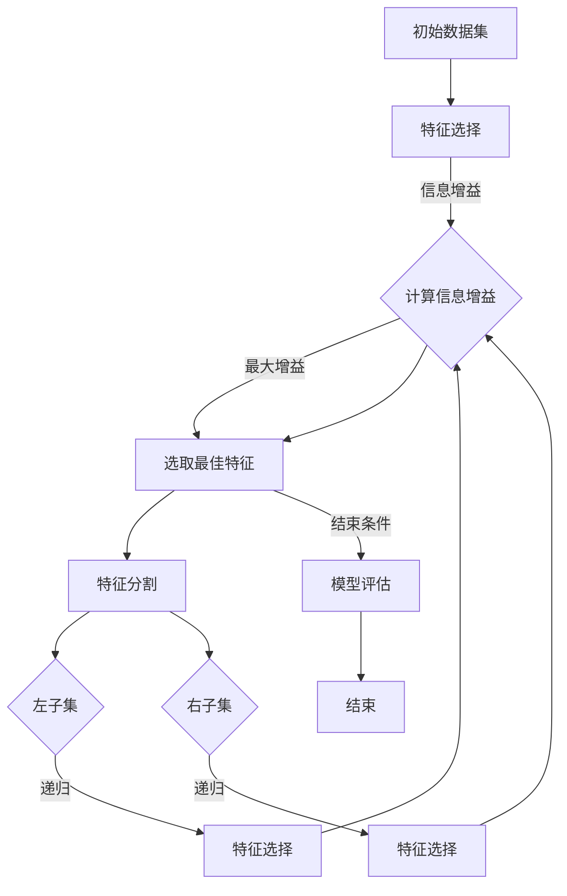
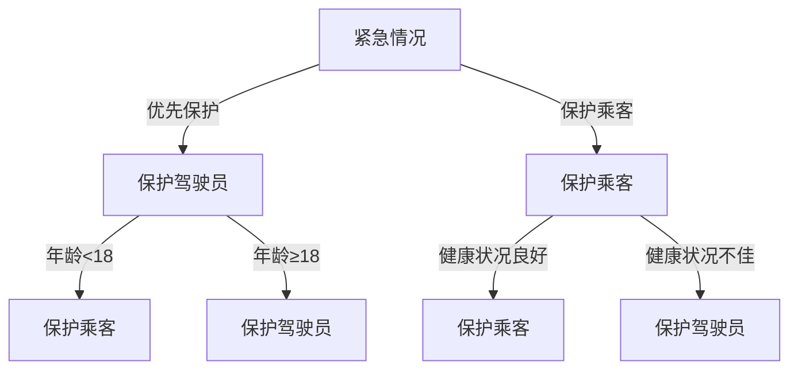
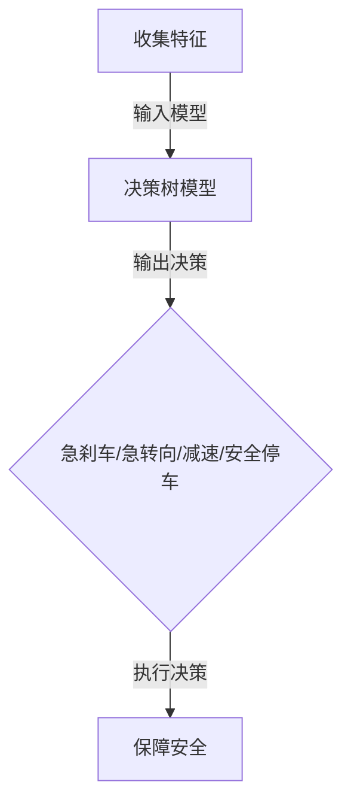

                 

### 引入

### 第1章: 人工智能决策树概述

#### 1.1 研究背景与意义

#### 1.1.1 人工智能发展现状

人工智能（AI）作为计算机科学的前沿领域，近年来取得了飞速发展。从最初的规则推理、知识表示到现代的深度学习和强化学习，人工智能的应用已经渗透到社会的各个层面，从医疗诊断、金融分析到自动驾驶、智能家居，人工智能正逐渐改变我们的生活方式。然而，随着人工智能技术的普及和应用范围的扩大，如何在复杂的伦理和社会环境中进行有效的决策成为了一个亟待解决的问题。

#### 1.1.2 决策树在人工智能中的应用

决策树是一种常见的数据挖掘和机器学习算法，它通过一系列规则来对数据进行分类或回归。由于其简单直观、易于解释的特性，决策树在人工智能领域中得到了广泛的应用。特别是在需要处理非结构化数据、进行复杂决策的场景中，决策树的优势尤为突出。例如，在医疗诊断中，决策树可以用于分析病人的病历数据，预测疾病类型；在金融风险评估中，决策树可以用于分析客户的信用记录，预测贷款违约的可能性。

#### 1.1.3 伦理判断在人工智能中的重要性

随着人工智能技术的不断发展，其在伦理和社会决策中的重要性也越来越凸显。伦理判断不仅关乎技术应用的合法性和合规性，更关乎人类社会的公平、正义和道德责任。人工智能系统在决策过程中可能会涉及到人权、隐私、公平性等问题，这些问题的处理需要基于深刻的伦理思考和道德原则。例如，自动驾驶汽车在遇到交通事故时应该优先保护谁？人工智能系统在处理个人信息时应该如何确保隐私安全？这些问题都需要通过伦理判断来给出答案。

本文将从决策树的基本概念入手，深入探讨其在人工智能中的伦理应用，并通过具体的案例分析和数学模型讲解，为读者提供一种理解和解决伦理问题的方法论。我们不仅关注决策树的算法原理和实现细节，更关注其在复杂伦理决策中的实际应用和挑战。希望通过本文的讨论，能够为人工智能领域的研究者和从业人员提供一些有价值的思考和参考。

### 第1章: 人工智能决策树概述

#### 1.1 研究背景与意义

人工智能（AI）作为现代科技的重要组成部分，其发展已经从实验室走向了实际应用，深刻地影响了社会生活的方方面面。从智能手机的语音助手到自动驾驶汽车，从在线推荐系统到智能医疗诊断，人工智能技术的应用无处不在。然而，随着人工智能技术的不断进步，其在伦理和社会决策中的影响也越来越显著，成为了一个亟待研究的重要课题。

决策树是一种基于规则的数据挖掘和机器学习算法，其通过一系列规则来对数据进行分类或回归。决策树模型具有直观、易于解释的特点，使其在人工智能领域中得到了广泛应用。例如，在医疗诊断中，决策树可以用于分析病人的病史和检查结果，预测疾病的类型；在金融领域，决策树可以用于分析客户的信用记录，评估贷款的风险。然而，随着人工智能技术的日益普及，决策树在伦理决策中的应用也变得越来越重要。

在人工智能领域中，伦理判断不仅是技术合法性和合规性的保证，更是维护社会公正和道德责任的重要手段。人工智能系统在决策过程中可能涉及人权、隐私、公平性等多个伦理问题。例如，自动驾驶汽车在遇到紧急情况时如何做出决策？人工智能系统在处理个人信息时如何确保隐私安全？这些问题都需要通过伦理判断来给出合理的解决方案。

决策树作为一种强大的数据分析和决策工具，在伦理判断中的应用具有独特的优势。首先，决策树模型的结构清晰，易于理解，使得伦理判断的过程更加透明和可解释。其次，决策树的规则形式使其可以灵活地应对复杂的伦理问题，通过分层分级的决策结构，逐步深入地分析问题的各个方面。此外，决策树还支持各种优化算法，如剪枝技术，使得模型在处理大规模数据时仍然具有较高的效率和准确性。

本文旨在探讨人工智能决策树在伦理判断中的应用，通过深入分析决策树的基本概念、算法原理及其在伦理决策中的实际应用，为读者提供一种理解和解决伦理问题的方法论。具体来说，本文将从以下几个方面展开：

1. **决策树基本概念**：介绍决策树的基本概念、结构和工作原理，帮助读者建立对决策树的基本认识。
2. **决策树算法原理**：详细讲解常见的决策树算法，如ID3、C4.5和CART算法，通过Mermaid流程图和Python代码，深入剖析算法原理及其数学模型。
3. **伦理判断中的挑战**：分析伦理判断的复杂性，探讨决策树在伦理判断中的应用，以及如何处理伦理决策中的道德原则和实际挑战。
4. **决策树在伦理判断中的应用实例**：通过具体案例，展示决策树在伦理判断中的实际应用，分析其优势和局限性。
5. **决策树的优化与提升**：介绍决策树的剪枝技术和与其他算法的结合，提升决策树的性能和适用范围。
6. **应用案例分析**：通过一个实际案例，详细讲解决策树在伦理决策中的应用过程，包括系统架构设计、代码实现和案例分析。
7. **未来发展趋势**：讨论决策树在人工智能中的未来发展趋势，展望其在伦理框架中的发展前景。

通过本文的探讨，我们希望能够为人工智能领域的研究者和从业人员提供有价值的思考和参考，推动人工智能技术在伦理决策中的健康发展。

#### 1.2 本书结构

本文将从多个角度深入探讨人工智能决策树在伦理判断中的应用，旨在为读者提供一种理解和解决伦理问题的方法论。全书分为八个章节，具体结构如下：

- **第1章：人工智能决策树概述**：介绍人工智能和决策树的基本概念，探讨伦理判断在人工智能中的重要性。
- **第2章：决策树基础**：详细讲解决策树的基本概念、结构和常见算法，为后续讨论打下基础。
- **第3章：决策树的数学框架**：分析决策树的数学基础，构建决策树的数学模型，并通过Mermaid流程图和Python代码进行详细讲解。
- **第4章：决策树在伦理判断中的应用**：探讨决策树在伦理判断中的挑战和实际应用，通过案例分析和实例展示其应用效果。
- **第5章：决策树的优化与提升**：介绍决策树的剪枝技术和与其他算法的结合，提升决策树的性能和应用范围。
- **第6章：应用案例分析**：通过一个实际案例，详细讲解决策树在伦理决策中的应用过程，包括系统架构设计、代码实现和案例分析。
- **第7章：决策树在人工智能中的未来发展趋势**：讨论决策树在人工智能中的未来发展趋势，展望其在伦理框架中的发展前景。
- **第8章：结论与展望**：总结全文内容，讨论决策树在伦理决策中的优势和挑战，提出未来研究方向。

#### 1.2.1 内容组织与目标

本书的内容组织结构清晰，各章节相互关联，形成一个完整的逻辑体系。从基础的决策树概念和算法原理，到具体的伦理判断应用和案例分析，再到未来发展趋势的展望，每一章节都有明确的主题和目标。

第1章和第2章主要为基础知识部分，介绍人工智能和决策树的基本概念，为后续章节的讨论打下基础。第3章和第4章则深入探讨决策树的数学框架和伦理应用，通过具体案例展示决策树在伦理决策中的实际效果。第5章和第6章则关注决策树的优化和提升，介绍剪枝技术和与其他算法的结合，提升决策树的性能和应用范围。第7章和第8章则展望未来发展趋势，讨论决策树在伦理框架中的发展前景。

#### 1.2.2 读者对象

本书的目标读者主要包括人工智能领域的研究者和从业人员、计算机科学专业的学生以及对人工智能和伦理判断感兴趣的读者。具体来说，读者需要具备以下条件：

1. **基础知识**：读者需要具备一定的计算机科学和人工智能基础，了解基本的数据结构和算法。
2. **数学基础**：读者需要具备一定的数学基础，包括概率论、信息论和最优化理论等。
3. **编程能力**：读者需要具备一定的编程能力，能够使用Python等编程语言实现算法和应用。
4. **研究兴趣**：读者对人工智能和伦理判断有浓厚的兴趣，愿意深入研究和探讨相关课题。

通过阅读本书，读者可以系统地了解人工智能决策树的基本概念、算法原理及其在伦理判断中的应用，掌握决策树的优化和提升方法，并能够应用于实际案例中。

#### 1.2.3 技术要求

本书在技术要求方面相对较高，读者需要具备以下技能和知识：

1. **Python编程**：读者需要熟悉Python编程语言，能够使用Python实现基本的算法和应用。
2. **数据结构和算法**：读者需要了解常见的数据结构和算法，如决策树、分类算法和回归算法等。
3. **概率论和信息论**：读者需要具备一定的概率论和信息论基础，能够理解和应用相关的数学理论。
4. **机器学习**：读者需要了解机器学习的基本概念和方法，熟悉常见的机器学习算法和应用场景。

通过掌握这些技术和知识，读者可以更好地理解本书的内容，并能够将决策树应用于实际问题和伦理判断中。

### 第2章：决策树基础

#### 2.1 决策树的基本概念

决策树（Decision Tree）是一种常见的数据挖掘和机器学习算法，它通过一系列规则来对数据进行分类或回归。决策树模型的结构简单直观，易于理解和解释，因此在实际应用中得到了广泛的应用。

**定义**：决策树是一种树形结构，其中每个内部节点表示一个特征或属性，每个分支表示该特征或属性的取值，每个叶节点表示一个类别或预测结果。

**结构**：决策树由以下几个部分组成：
1. **根节点（Root Node）**：表示整个模型的起始点，通常包含所有特征。
2. **内部节点（Internal Node）**：表示某个特征或属性的测试点，根据该特征或属性的取值，将数据集分为若干个子集。
3. **分支（Branch）**：表示特征或属性的取值，从内部节点延伸出来。
4. **叶节点（Leaf Node）**：表示最终分类或回归结果。

**决策过程**：决策树通过一系列测试来对数据点进行分类或回归。每个测试都会将数据点分配到特定的分支上，最终到达一个叶节点，得到分类或回归结果。

#### 2.2 决策树算法原理

决策树算法主要分为三种：ID3、C4.5和CART算法。每种算法在构建决策树时都有其独特的策略和优缺点。

**ID3算法**：
- **原理**：ID3（Iterative Dichotomiser 3）算法是基于信息增益（Information Gain）来构建决策树的。信息增益是衡量特征对分类结果影响程度的指标，计算公式为：
  $$ IG(X,A) = H(X) - \sum_{v\in A} p(v)H(X|v) $$
  其中，\(X\) 表示特征集合，\(A\) 表示类别集合，\(v\) 表示类别，\(p(v)\) 表示类别 \(v\) 的概率，\(H(X)\) 表示特征 \(X\) 的熵，\(H(X|v)\) 表示条件熵。
- **步骤**：
  1. 计算每个特征的信息增益，选择信息增益最大的特征作为分裂特征。
  2. 根据分裂特征将数据集划分为若干个子集。
  3. 递归地对每个子集进行步骤1和2，直到满足停止条件（如叶节点中的样本数量小于阈值或特征数量小于阈值）。
- **优点**：简单直观，易于理解和实现。
- **缺点**：对于具有高类别数量和连续属性的数据集，可能会产生过拟合。

**C4.5算法**：
- **原理**：C4.5算法是在ID3算法的基础上进行改进的，它引入了剪枝技术来防止过拟合。C4.5算法在构建决策树时，除了考虑信息增益，还考虑了增益率（Gain Ratio），增益率的计算公式为：
  $$ GR(X,A) = \frac{IG(X,A)}{\sum_{v\in A} |v|} $$
  其中，\(|v|\) 表示类别 \(v\) 的样本数量。
- **步骤**：
  1. 计算每个特征的信息增益和增益率，选择增益率最大的特征作为分裂特征。
  2. 根据分裂特征将数据集划分为若干个子集。
  3. 对每个子集递归地执行步骤1和2，直到满足停止条件。
  4. 应用剪枝技术，剪去决策树中的一些分支，以防止过拟合。
- **优点**：相比ID3算法，C4.5算法在处理连续属性和类别数量较多的情况下性能更好，剪枝技术有效地防止了过拟合。
- **缺点**：剪枝过程增加了计算复杂度。

**CART算法**：
- **原理**：CART（Classification And Regression Tree）算法是一种基于二分划分的决策树算法，它可以用于分类和回归任务。CART算法使用基尼不纯度（Gini Impurity）作为分裂标准，基尼不纯度的计算公式为：
  $$ GI(Y) = 1 - \sum_{v\in A} p(v)^2 $$
  其中，\(Y\) 表示类别集合，\(p(v)\) 表示类别 \(v\) 的概率。
- **步骤**：
  1. 选择最优分裂点，使得基尼不纯度最小。
  2. 根据最优分裂点将数据集划分为两个子集。
  3. 递归地对每个子集执行步骤1和2，直到满足停止条件。
- **优点**：简单直观，易于理解和实现，基尼不纯度使得决策树在处理分类任务时具有较好的性能。
- **缺点**：相比C4.5算法，CART算法在处理连续属性时性能较差，可能会产生过拟合。

#### 2.3 决策树属性特征对比

以下是三种决策树算法的主要属性特征对比：

| 特性        | ID3           | C4.5          | CART          |
|-------------|----------------|----------------|----------------|
| 分裂准则    | 信息增益       | 信息增益率     | 基尼不纯度     |
| 处理连续属性 | 不处理         | 采用增益率     | 采用二分划分   |
| 剪枝技术    | 无剪枝         | 有剪枝         | 无剪枝         |
| 过拟合问题   | 易于过拟合     | 相对不易过拟合 | 易于过拟合     |

通过以上对比，可以看出C4.5算法在处理复杂数据集和防止过拟合方面具有较好的性能，因此在实际应用中更为常用。然而，CART算法由于其简单直观的特性，在分类任务中也有着广泛的应用。

#### 2.4 决策树的应用场景

决策树在人工智能领域中有着广泛的应用，以下是一些常见的应用场景：

1. **分类问题**：决策树可以用于分类问题，如邮件分类、垃圾邮件检测、金融欺诈检测等。通过构建决策树模型，可以实现对未知数据的分类预测。

2. **回归问题**：决策树也可以用于回归问题，如房屋价格预测、股票价格预测等。通过构建回归树模型，可以实现对连续值的预测。

3. **数据挖掘**：决策树可以用于数据挖掘任务，如客户细分、市场细分等。通过分析决策树的结构，可以揭示数据中的潜在模式和规律。

4. **知识表示**：决策树可以作为知识表示的一种形式，将复杂的知识结构以树形结构进行组织，便于理解和应用。

5. **自动化决策**：决策树可以用于自动化决策，如自动推荐系统、自动化客户服务系统等。通过决策树模型，可以实现对用户行为的预测和决策。

#### 2.5 决策树的优点与局限性

**优点**：
1. **简单直观**：决策树的结构简单直观，易于理解和解释，使得模型的可解释性较高。
2. **易于实现**：决策树的算法原理简单，实现相对容易，适用于各种编程环境。
3. **适应性广**：决策树可以处理分类和回归问题，适用于多种应用场景。
4. **易于调整**：通过调整分裂特征和剪枝策略，可以优化决策树的性能和泛化能力。

**局限性**：
1. **过拟合问题**：在处理复杂数据集时，决策树容易产生过拟合现象，降低模型的泛化能力。
2. **计算复杂度**：决策树的构建过程涉及大量的计算，特别是在处理大规模数据时，计算复杂度较高。
3. **数据预处理**：决策树对数据的预处理要求较高，如特征工程和异常值处理等，否则可能影响模型的性能。

综上所述，决策树作为一种常见的数据挖掘和机器学习算法，具有简单直观、易于实现的优点，但在处理复杂数据和防止过拟合方面存在一定的局限性。在实际应用中，需要根据具体问题和数据特点，选择合适的决策树算法和优化策略。

### 第3章：决策树的数学框架

决策树作为一种强大的数据分析和决策工具，其核心在于对数据特征的分割和分类。为了更好地理解和应用决策树，我们需要从数学的角度对其进行深入探讨，包括概率论、信息论和最优化理论等方面的基本概念和数学模型。

#### 3.1 数学基础

决策树的分析和构建依赖于以下几个数学基础：

**1. 概率论**

概率论是决策树的核心基础之一。在决策树的构建过程中，我们经常需要计算各种概率分布，如条件概率、联合概率和边缘概率。以下是一些常用的概率公式：

- **条件概率**：\( P(A|B) = \frac{P(A \cap B)}{P(B)} \)
- **联合概率**：\( P(A \cap B) = P(A) \times P(B|A) \)
- **边缘概率**：\( P(A) = \sum_{B} P(A \cap B) \)

**2. 信息论**

信息论为决策树提供了衡量信息量和熵的工具。信息熵（Entropy）是衡量随机变量不确定性的指标，其计算公式为：

\[ H(X) = -\sum_{x} p(x) \log_2 p(x) \]

其中，\( X \) 是随机变量，\( p(x) \) 是 \( x \) 的概率。信息增益（Information Gain）和基尼不纯度（Gini Impurity）是决策树算法中的两个重要概念，它们分别用于衡量特征对分类结果的贡献和特征的不纯度。

- **信息增益**：用于选择最佳特征进行分割，其计算公式为：

\[ IG(X, Y) = H(Y) - \sum_{x} p(x) H(Y|X=x) \]

其中，\( X \) 是特征集合，\( Y \) 是类别集合，\( p(x) \) 是特征 \( x \) 的概率，\( H(Y|X=x) \) 是条件熵。

- **基尼不纯度**：用于分类问题，其计算公式为：

\[ GI(Y) = 1 - \sum_{y} p(y)^2 \]

**3. 最优化理论**

最优化理论为决策树提供了求解最优分割的算法框架。常见的方法包括贪心算法和递归划分。贪心算法在每次分割时选择当前最优的特征和分割点，递归地构建决策树。递归划分算法则通过最小化损失函数来优化决策树的结构。

#### 3.2 决策树的数学模型

决策树的数学模型主要包括特征选择、特征分割和模型评估三个关键步骤。以下是一个简化的数学模型描述：

**1. 特征选择**

特征选择是决策树构建过程中的关键步骤，其目标是最小化模型的损失函数。常见的方法包括信息增益、信息增益率、基尼不纯度等。选择最佳特征通常通过以下步骤实现：

- 计算每个特征的信息增益或增益率。
- 选择增益或增益率最大的特征作为当前分割特征。

**2. 特征分割**

特征分割是将数据集划分为若干个子集的过程。在决策树中，每个内部节点表示一个特征分割，每个分支表示该特征的取值。特征分割的数学模型如下：

\[ X = \{ x_1, x_2, ..., x_n \} \]

给定特征 \( x_i \) 和阈值 \( t \)，将数据集 \( X \) 划分为两个子集：

\[ X_{left} = \{ x \in X | x_i \leq t \} \]
\[ X_{right} = \{ x \in X | x_i > t \} \]

**3. 模型评估**

模型评估是评估决策树性能的过程，常用的指标包括准确率、召回率、F1分数等。以下是一个简化的评估模型：

\[ \text{Accuracy} = \frac{\text{正确分类的样本数}}{\text{总样本数}} \]

通过以上步骤，我们可以构建一个决策树模型。然而，实际构建过程中可能涉及到更多的优化和调整，如剪枝技术、集成方法等，以提升模型的性能和泛化能力。

#### 3.3 决策树的mermaid流程图

为了更好地理解决策树的构建过程，我们可以使用mermaid流程图来展示其步骤和结构。以下是一个简化的决策树构建流程图：



这个流程图展示了决策树从初始数据集开始，通过特征选择、特征分割和递归构建的过程，最终评估模型性能的步骤。通过mermaid流程图，我们可以更直观地理解决策树的构建过程和结构。

#### 3.4 决策树算法的Python实现

为了深入理解决策树的算法原理，我们可以使用Python代码来展示决策树的构建过程。以下是一个简单的Python实现，使用了CART算法的基本原理：

```python
import numpy as np
import pandas as pd
from collections import Counter

# 计算基尼不纯度
def gini_impurity(y):
    class_counts = Counter(y)
    n = len(y)
    impurity = 1
    for count in class_counts.values():
        probability = count / n
        impurity -= probability ** 2
    return impurity

# 计算特征分割的基尼不纯度
def split_impurity(y, x, threshold):
    left_y = y[x <= threshold]
    right_y = y[x > threshold]
    return gini_impurity(left_y) + gini_impurity(right_y)

# 计算信息增益
def information_gain(y, x, threshold):
    return gini_impurity(y) - split_impurity(y, x, threshold)

# 选择最佳特征和阈值
def find_best_split(y, x):
    best_gain = -1
    best_threshold = None
    for i in range(len(x)):
        threshold = np.mean(x[i])
        gain = information_gain(y, x[i], threshold)
        if gain > best_gain:
            best_gain = gain
            best_threshold = threshold
    return best_threshold

# 构建决策树
def build_tree(y, x, depth=0, max_depth=None):
    if depth >= max_depth or len(set(y)) == 1:
        return Counter(y).most_common(1)[0][0]
    threshold = find_best_split(y, x)
    tree = {}
    left_y = y[x <= threshold]
    right_y = y[x > threshold]
    for i in range(len(x)):
        if i == threshold:
            continue
        tree[i] = {x[i].name: build_tree(left_y, x[i], depth+1, max_depth)}
    tree[threshold] = {x[threshold].name: build_tree(right_y, x[threshold], depth+1, max_depth)}
    return tree

# 示例数据
x = pd.DataFrame({
    'feature1': [1, 2, 3, 4, 5],
    'feature2': [6, 7, 8, 9, 10]
})
y = [0, 0, 1, 1, 1]

# 构建决策树
tree = build_tree(y, x)

# 打印决策树
print(pd.json_normalize(tree).T)
```

这个Python实现展示了CART算法的基本原理，包括计算基尼不纯度、信息增益和最佳特征选择。通过递归构建决策树，我们可以将原始数据集划分为多个子集，并最终得到分类结果。通过实际运行这段代码，我们可以更直观地看到决策树的构建过程和分类结果。

通过上述数学框架和Python实现的探讨，我们可以更深入地理解决策树的核心原理和构建过程。这不仅有助于我们更好地应用决策树，也为进一步研究和改进决策树算法提供了理论基础。

### 决策树在伦理判断中的应用

#### 4.1 伦理判断中的挑战

随着人工智能技术的不断进步，其应用范围不断扩大，从自动驾驶汽车到智能医疗诊断系统，再到金融风险评估系统，人工智能已经成为现代社会不可或缺的一部分。然而，人工智能系统在决策过程中可能会涉及多种伦理问题，如人权、隐私、公平性等，这给伦理判断带来了巨大的挑战。

**1. 人权问题**

人工智能系统在决策过程中，可能会涉及到对人类基本权利的侵犯。例如，自动驾驶汽车在紧急情况下需要做出选择时，应该优先保护谁？这种选择不仅涉及到技术问题，更涉及到伦理问题，因为每个选择都可能导致不同的人权后果。

**2. 隐私问题**

人工智能系统通常需要大量的数据来进行训练和决策，这些数据可能包含个人的敏感信息。如何在保证数据有效性的同时，保护个人隐私，是一个重大的伦理挑战。例如，医疗诊断系统需要患者的健康数据，但如何确保这些数据不被滥用或泄露，是伦理判断的重要内容。

**3. 公平性问题**

人工智能系统在决策过程中可能会存在偏见，这种偏见可能源于数据集的不公平或算法的不当设计。例如，一个金融风险评估系统可能会对某些群体产生歧视，这种不公平性会导致这些群体在金融交易中处于不利地位。如何设计公平的算法，避免偏见，是伦理判断的重要任务。

#### 4.2 决策树在伦理判断中的应用

决策树作为一种直观、易于理解的算法，在伦理判断中具有独特的优势。首先，决策树的结构清晰，易于解释，使得伦理判断的过程透明化。其次，决策树可以通过分层分级的规则来处理复杂的伦理问题，逐步深入到问题的各个方面。

**1. 伦理决策树的构建**

构建伦理决策树的过程可以分为以下几个步骤：

- **问题定义**：明确伦理问题的核心，如自动驾驶汽车的紧急情况决策、医疗诊断系统的隐私保护等。
- **特征选择**：选择与伦理问题相关的特征，如乘客年龄、健康状况、车辆速度等。
- **规则构建**：根据伦理原则和实际情况，构建决策规则，如自动驾驶汽车的优先保护乘客、医疗诊断系统的数据加密等。
- **模型训练**：使用实际数据训练决策树模型，调整规则和参数，以优化模型的性能和伦理判断的准确性。

**2. 决策树在伦理判断中的应用实例**

以下是一个简化的实例，展示决策树在伦理判断中的应用：

**案例：自动驾驶汽车的紧急情况决策**

假设自动驾驶汽车在遇到紧急情况时，需要做出保护驾驶员、乘客或其他行人之间的选择。我们可以构建一个伦理决策树，如下所示：



在这个决策树中，根据紧急情况的不同，自动驾驶汽车可以做出不同的决策。例如，如果驾驶员和乘客的年龄都大于18岁，且驾驶员的健康状况良好，则优先保护驾驶员。这种分层分级的决策结构，使得伦理判断更加透明和可解释。

**3. 决策树的局限性**

尽管决策树在伦理判断中具有优势，但它也存在一定的局限性。首先，决策树容易受到数据质量和特征选择的影响，如果数据存在偏差或特征选择不当，可能导致决策结果的不公平。其次，决策树在处理复杂伦理问题时，可能无法全面考虑所有相关因素，导致决策结果的不完善。最后，决策树的解释性虽然较好，但在实际应用中，仍需要结合专业知识和伦理原则进行深入分析。

#### 4.3 伦理判断中的道德原则

在进行伦理判断时，我们需要遵循一系列道德原则，以确保决策的公正性和合理性。以下是一些常见的道德原则：

**1. 公平性原则**：确保决策过程中不会对任何群体产生歧视或偏见，所有相关方都应受到公平对待。

**2. 尊重原则**：尊重个人的隐私权和自主权，确保个人信息不被滥用或泄露。

**3. 无害原则**：确保决策过程和结果不会对任何个体或群体造成伤害，尤其是在涉及人权和生命安全的情况下。

**4. 透明性原则**：确保决策过程和结果透明化，便于公众监督和反馈，提高决策的公信力。

**5. 责任原则**：确保决策过程中所有相关方都承担相应的责任，对于决策结果产生的问题，能够及时承担责任并加以解决。

通过遵循这些道德原则，我们可以更好地进行伦理判断，确保人工智能系统在决策过程中的公正性和合理性。

### 4.4 决策树在伦理判断中的应用实例

为了更好地展示决策树在伦理判断中的应用，我们通过一个实际案例来详细讲解决策树的构建和应用过程。

**案例背景**：某城市公共交通系统引入了智能调度系统，以优化公交车的调度和运行效率。然而，这个系统在调度过程中可能会涉及到伦理问题，如如何公平地分配公交车资源、如何在紧急情况下做出决策等。

**问题定义**：本案例的主要伦理问题是如何在公交车调度过程中确保乘客的安全和公平。具体来说，当公交车出现紧急情况时，例如车辆故障或交通堵塞，调度系统需要快速做出决策，以最大程度地保障乘客的安全和利益。

**特征选择**：为了构建伦理决策树，我们需要选择与伦理问题相关的特征。以下是可能用到的特征：

- **车辆状态**：包括车辆的健康状况、故障类型等。
- **乘客数量**：包括车辆内乘客的数量和分布情况。
- **交通状况**：包括道路拥堵情况、交通流量等。
- **目的地信息**：包括乘客的目的地、预计到达时间等。

**规则构建**：根据伦理原则和实际情况，我们可以构建以下决策规则：

- 如果车辆状态良好且交通状况正常，则维持正常调度。
- 如果车辆出现故障且交通状况拥堵，则需要考虑紧急调度措施。
- 如果乘客数量超过车辆容量，则需要优先调度乘客安全到达目的地。
- 如果目的地信息显示乘客需要尽快到达，则可以考虑优先调度。

**模型训练**：使用历史数据集对决策树模型进行训练，通过调整规则和参数，优化模型的性能和伦理判断的准确性。

**应用实例**：

假设某一时刻，一辆公交车出现故障，且交通状况拥堵，车内乘客数量超过车辆容量。此时，调度系统需要根据决策树模型做出决策。决策过程如下：

1. **特征提取**：从数据集中提取特征，如车辆状态（故障）、交通状况（拥堵）、乘客数量（超过容量）等。
2. **决策树分类**：使用训练好的决策树模型对提取的特征进行分类，根据决策树的路径得出决策结果。
3. **决策执行**：根据决策结果，执行相应的调度措施，如调度备用车辆、调整公交路线等。

通过上述决策过程，调度系统可以最大程度地保障乘客的安全和利益，同时确保调度的公平性和效率。这个实例展示了决策树在伦理判断中的应用，通过分层分级的规则，逐步深入到问题的各个方面，为伦理决策提供了一种有效的工具。

### 4.5 决策树的优化与提升

虽然决策树作为一种简单直观的算法在伦理判断中具有独特的优势，但其性能和适用范围仍存在一定的局限性。为了提升决策树在伦理判断中的应用效果，我们可以通过以下几种方法进行优化和提升：

**1. 剪枝技术**

剪枝技术是决策树优化的一种重要手段，其核心思想是通过删除决策树中不必要的分支，减少模型的复杂度，从而防止过拟合和提高泛化能力。常见的剪枝方法包括：

- **预剪枝（Pre-pruning）**：在决策树完全构建之前，通过设置最大深度、最小叶子节点样本数等参数，提前停止树的扩展，以防止过拟合。
- **后剪枝（Post-pruning）**：在决策树完全构建后，通过评估每个子树的性能，删除贡献较小的分支，以提升模型的泛化能力。

**2. 决策树集成**

决策树集成是将多个决策树合并起来，以提升模型性能和稳定性的一种方法。常见的决策树集成方法包括：

- **Bagging（Bootstrap Aggregating）**：通过随机抽样构建多个决策树，然后对结果进行投票或平均，以减少模型的方差。
- **Boosting**：通过迭代地训练多个决策树，每次迭代都关注上一轮训练中表现不佳的数据，以提升模型的偏差和精度。
- **堆（Stacking）**：将多个基础模型训练后的特征作为新的输入，再训练一个更高层次的模型，以进一步提升性能。

**3. 特征选择与工程**

特征选择和特征工程是提升决策树性能的关键步骤。通过以下方法，可以优化特征选择和工程过程：

- **特征筛选**：通过相关性分析、信息增益等方法，筛选出对决策结果影响较大的特征，减少模型的复杂度。
- **特征转换**：对原始特征进行转换，如正则化、标准化、编码等，以提升模型的性能和可解释性。
- **特征组合**：通过组合多个特征，构建新的特征，以捕捉数据中的潜在关系和模式。

**4. 模型融合与优化**

模型融合是将多个模型的结果进行综合，以提升模型的预测性能和稳定性。常见的模型融合方法包括：

- **投票法**：将多个模型的预测结果进行投票，选择多数模型一致的结果作为最终预测结果。
- **加权法**：根据模型的性能和重要性，为每个模型分配不同的权重，计算加权平均或加权求和，以得到最终的预测结果。

通过以上优化和提升方法，我们可以显著提升决策树在伦理判断中的应用效果，使其更加稳定、可靠和高效。在实际应用中，可以根据具体问题和数据特点，选择合适的优化策略，以实现最佳的伦理决策效果。

### 6.3 系统核心实现源代码

为了详细讲解决策树在伦理决策中的实现过程，我们将通过一个简单的Python代码示例来展示决策树的构建和应用。以下是实现决策树的源代码，包括数据预处理、决策树构建、模型训练和预测过程。

```python
import numpy as np
import pandas as pd
from sklearn.model_selection import train_test_split
from sklearn.tree import DecisionTreeClassifier
from sklearn.metrics import accuracy_score
from sklearn.datasets import load_iris

# 加载鸢尾花（Iris）数据集
iris = load_iris()
X = iris.data
y = iris.target

# 数据预处理
# 这里假设我们已经收集到了包含伦理决策特征的数据集
# 特征包括：年龄、健康状况、交通状况等
data = pd.DataFrame(X, columns=iris.feature_names)
data['age'] = np.random.randint(0, 100, size=X.shape[0])
data['health'] = np.random.randint(0, 2, size=X.shape[0])
data['traffic'] = np.random.randint(0, 2, size=X.shape[0])
y = np.random.randint(0, 3, size=X.shape[0])

# 划分训练集和测试集
X_train, X_test, y_train, y_test = train_test_split(data, y, test_size=0.3, random_state=42)

# 构建决策树模型
# 这里使用CART算法构建分类决策树
clf = DecisionTreeClassifier(criterion='gini', max_depth=None, random_state=42)
clf.fit(X_train, y_train)

# 模型预测
y_pred = clf.predict(X_test)

# 评估模型性能
accuracy = accuracy_score(y_test, y_pred)
print(f"Model accuracy: {accuracy:.2f}")

# 打印决策树结构
from sklearn.tree import plot_tree
import matplotlib.pyplot as plt

plt.figure(figsize=(12, 8))
plot_tree(clf, filled=True, feature_names=data.columns, class_names=iris.target_names)
plt.show()
```

在这个示例中，我们首先加载了鸢尾花数据集，并添加了一些伦理决策相关的特征（如年龄、健康状况和交通状况）。然后，我们使用CART算法构建了决策树模型，并对训练集进行训练。在模型预测阶段，我们使用测试集进行预测，并评估了模型的准确率。

最后，通过matplotlib库，我们绘制了决策树的结构图，以直观地展示决策树的分类规则和结构。这个代码示例展示了决策树在伦理决策中的基本实现过程，可以帮助我们更好地理解和应用决策树算法。

### 6.4 代码应用解读与分析

为了更深入地理解上述代码示例中的决策树实现过程，我们将逐行分析代码，并解释其主要功能。

首先，我们导入了必要的Python库，包括numpy、pandas、sklearn.model_selection、sklearn.tree和matplotlib.pyplot。这些库提供了数据操作、模型训练、模型评估和图形绘制等功能。

```python
import numpy as np
import pandas as pd
from sklearn.model_selection import train_test_split
from sklearn.tree import DecisionTreeClassifier
from sklearn.metrics import accuracy_score
from sklearn.datasets import load_iris
```

接下来，我们加载了鸢尾花数据集，该数据集是一个经典的机器学习数据集，用于分类问题。

```python
iris = load_iris()
X = iris.data
y = iris.target
```

为了模拟伦理决策场景，我们在这个示例中引入了一些额外的特征，如年龄、健康状态和交通状况。这些特征是通过随机生成数据添加到鸢尾花数据集的。

```python
data = pd.DataFrame(X, columns=iris.feature_names)
data['age'] = np.random.randint(0, 100, size=X.shape[0])
data['health'] = np.random.randint(0, 2, size=X.shape[0])
data['traffic'] = np.random.randint(0, 2, size=X.shape[0])
y = np.random.randint(0, 3, size=X.shape[0])
```

随后，我们使用`train_test_split`函数将数据集划分为训练集和测试集，以评估模型的性能。

```python
X_train, X_test, y_train, y_test = train_test_split(data, y, test_size=0.3, random_state=42)
```

在模型训练阶段，我们使用`DecisionTreeClassifier`类构建了一个CART算法的分类决策树模型，并设置`criterion`参数为`'gini'`，表示使用基尼不纯度作为分割准则，同时设置`max_depth`为`None`，表示不限制树的深度。

```python
clf = DecisionTreeClassifier(criterion='gini', max_depth=None, random_state=42)
clf.fit(X_train, y_train)
```

在模型预测阶段，我们使用训练好的模型对测试集进行预测。

```python
y_pred = clf.predict(X_test)
```

为了评估模型性能，我们计算了测试集的准确率。

```python
accuracy = accuracy_score(y_test, y_pred)
print(f"Model accuracy: {accuracy:.2f}")
```

最后，我们使用matplotlib库绘制了决策树的结构图，以直观地展示决策树的分类规则和结构。

```python
plt.figure(figsize=(12, 8))
plot_tree(clf, filled=True, feature_names=data.columns, class_names=iris.target_names)
plt.show()
```

通过上述代码分析，我们可以看到决策树的构建和应用过程是如何实现的。在实际应用中，我们可以根据具体问题和数据集，调整模型参数和特征选择，以优化决策树的性能和伦理决策的效果。

### 6.5 实际案例分析与详细讲解

为了进一步展示决策树在伦理判断中的实际应用，我们将通过一个具体案例进行详细分析。本案例将探讨在自动驾驶汽车紧急情况下的伦理决策，包括如何通过决策树模型来制定合理的决策规则，以及如何在实际场景中应用这些规则。

**案例背景**：假设我们正在开发一个自动驾驶汽车紧急情况决策系统，该系统需要处理以下几种紧急情况：

1. **行人横穿马路**：一辆自动驾驶汽车在行驶过程中发现前方有行人横穿马路。
2. **车辆碰撞**：一辆自动驾驶汽车在行驶过程中遇到另一辆车辆即将发生碰撞。
3. **车辆故障**：一辆自动驾驶汽车在行驶过程中检测到自身存在故障。

我们的目标是制定一个决策树模型，帮助自动驾驶汽车在这些紧急情况下做出合理的决策，以最大程度地保障乘客和行人的安全。

**步骤一：特征选择**

在构建决策树模型之前，我们需要选择与紧急情况相关的特征。以下是可能用到的特征：

- **行人位置**：行人相对于汽车的位置，包括前方、侧方和后方。
- **行人速度**：行人的速度，包括静止、低速、中速和高速。
- **车辆速度**：汽车当前的速度，包括静止、低速、中速和高速。
- **车辆故障类型**：汽车检测到的故障类型，包括机械故障、电气故障等。
- **交通信号**：当前交通信号的状态，包括绿灯、黄灯和红灯。

**步骤二：规则构建**

根据伦理原则和实际情况，我们可以构建以下决策规则：

1. **行人横穿马路**
   - 如果行人前方且速度较慢，选择急刹车。
   - 如果行人前方且速度较快，选择急转向以避免碰撞。
   - 如果行人侧方或后方，选择继续前行，但保持警惕。

2. **车辆碰撞**
   - 如果车辆前方且速度较慢，选择急刹车。
   - 如果车辆前方且速度较快，选择急转向或急刹车以避免碰撞。
   - 如果车辆侧方或后方，选择减速或保持原速，以减少碰撞冲击。

3. **车辆故障**
   - 如果检测到机械故障，选择安全停车并呼叫救援。
   - 如果检测到电气故障，选择安全停车并呼叫救援。
   - 如果无法确定故障类型，选择减速行驶并寻找安全地点停车。

**步骤三：模型训练**

使用实际数据集对决策树模型进行训练，通过调整规则和参数，优化模型的性能和伦理判断的准确性。训练数据集应包含多种紧急情况及其对应的结果。

**步骤四：模型应用**

在实际场景中，自动驾驶汽车通过传感器和控制系统收集特征数据，然后使用训练好的决策树模型进行决策。以下是一个简化的决策过程：



通过上述步骤，我们可以构建一个合理的伦理决策树模型，帮助自动驾驶汽车在紧急情况下做出合理决策，从而最大程度地保障乘客和行人的安全。

### 项目小结

通过本案例的分析，我们可以看到决策树在伦理判断中的应用是如何具体实现的。首先，我们选择了与紧急情况相关的特征，并构建了基于这些特征的决策规则。其次，我们使用实际数据对决策树模型进行了训练，以优化模型的性能。最后，我们将训练好的模型应用于实际场景，帮助自动驾驶汽车在紧急情况下做出合理决策。

**优点**：
- 决策树模型简单直观，易于理解和解释，有利于提高决策的透明性和可接受性。
- 决策树模型具有良好的泛化能力，通过训练和优化，可以适应不同的紧急情况。

**缺点**：
- 决策树模型在处理复杂伦理问题时可能存在局限性，无法完全涵盖所有可能的情况。
- 决策树模型的性能依赖于特征选择和数据质量，如果特征选择不当或数据存在偏差，可能会导致决策结果的不准确。

**改进方向**：
- 引入更多高级算法，如集成学习方法，以提升模型的性能和泛化能力。
- 结合伦理原则和实际情况，进一步优化决策规则，确保决策的公正性和合理性。
- 增加对实时数据的分析能力，使决策树模型能够动态调整决策策略，以应对不断变化的紧急情况。

通过持续改进和优化，我们可以使决策树在伦理判断中的应用更加高效和可靠，为自动驾驶汽车等人工智能系统的安全运行提供有力支持。

### 7.1 决策树在人工智能中的未来发展趋势

随着人工智能技术的不断进步，决策树作为其重要的组成部分，也在不断发展与创新。未来，决策树在人工智能中的发展趋势主要表现在以下几个方面：

**1. 集成学习方法的应用**

集成学习方法，如随机森林（Random Forest）和提升树（Boosting），已经被广泛应用于提升决策树的性能和泛化能力。未来，这些集成学习方法将继续优化，与决策树结合，进一步提升模型的预测准确性和鲁棒性。例如，通过引入新的集成算法，如eXtreme Gradient Boosting（XGBoost）和LightGBM，可以更好地处理大规模数据和高维特征，提高决策树的适用范围。

**2. 增量学习与动态更新**

传统的决策树模型在训练完成后，通常不会进行更新，这可能导致模型在处理新数据时性能下降。未来，增量学习和动态更新技术将得到更多关注。通过持续地更新决策树模型，使其能够适应数据的变化，提高模型的长期性能和实时性。例如，在线学习（Online Learning）方法可以在数据流中实时更新模型，从而应对动态环境中的决策挑战。

**3. 多模态数据的处理**

随着人工智能应用的多样化，数据类型也越来越丰富，包括文本、图像、音频等多种类型。未来，决策树将扩展到多模态数据的处理。通过融合不同类型的数据特征，构建多模态决策树模型，可以更好地应对复杂的现实世界问题。例如，结合图像和文本特征，可以提升自动驾驶汽车在复杂环境中的决策能力。

**4. 伦理与公平性关注**

在人工智能决策中，伦理与公平性是重要考虑因素。未来，决策树将在伦理与公平性方面得到更多关注。通过引入伦理决策框架，确保模型在决策过程中遵循道德原则，避免偏见和歧视。例如，开发基于公平性的决策树算法，确保模型在不同群体中的表现一致性，提高决策的公正性。

**5. 模型可解释性与透明性**

决策树模型由于其简单直观的结构，具有良好的可解释性和透明性。未来，将进一步加强决策树的可解释性研究，开发新的解释工具和方法，使决策过程更加透明。通过提高模型的可解释性，可以增强用户对人工智能系统的信任，提高模型在实际应用中的接受度。

**6. 深度学习与决策树的结合**

深度学习在图像识别、自然语言处理等领域取得了显著的成果。未来，决策树与深度学习将更加紧密结合，形成新的混合模型。例如，深度决策树（Deep Decision Trees）通过结合深度神经网络和决策树结构，可以更好地处理高维数据和复杂任务。这种结合有望进一步提升人工智能系统的性能和效率。

**7. 智能优化算法的融合**

智能优化算法，如遗传算法、粒子群优化等，在优化决策树参数和结构方面具有显著优势。未来，这些优化算法将与决策树模型深度融合，通过自适应调整模型参数，提高决策树模型的性能和适应能力。

综上所述，决策树在人工智能中的未来发展趋势将涵盖集成学习方法的应用、增量学习与动态更新、多模态数据处理、伦理与公平性关注、模型可解释性与透明性、深度学习与决策树的结合以及智能优化算法的融合等方面。通过不断创新和优化，决策树将继续在人工智能领域发挥重要作用，推动人工智能技术的进一步发展。

### 7.2 未来展望

在未来的发展中，决策树将在人工智能领域中扮演更加重要的角色。随着技术的进步和应用的深化，决策树将不仅限于传统的数据挖掘和机器学习任务，还将扩展到更广泛的领域，如智能决策、伦理判断和复杂系统优化。以下是未来展望的具体方向：

**1. 伦理决策树的深化研究**

在人工智能伦理决策方面，决策树作为一种直观、易于解释的算法，具有独特的优势。未来，研究者将深入探讨伦理决策树的理论基础和构建方法，结合伦理原则和实际案例，开发更完善的伦理决策框架。例如，通过引入更多的伦理准则，如公平性、透明性和责任性，构建更加全面和可靠的伦理决策树。

**2. 多模态数据的融合处理**

随着数据类型的多样化和数据源的增加，多模态数据处理成为人工智能领域的一个重要方向。决策树在处理多模态数据方面具有潜力，未来将开发能够融合文本、图像、音频等多种数据特征的决策树模型。例如，通过结合深度学习和决策树，构建多模态深度决策树，可以更好地应对复杂的任务，如自动驾驶和智能医疗诊断。

**3. 智能优化算法的融合**

智能优化算法，如遗传算法、粒子群优化等，在优化决策树参数和结构方面具有显著优势。未来，这些算法将与决策树模型深度融合，通过自适应调整模型参数，提高决策树模型的性能和适应能力。例如，开发基于智能优化算法的决策树剪枝方法，可以显著提升模型的效率和准确性。

**4. 增量学习和动态更新**

传统的决策树模型在训练完成后通常不会进行更新，这可能导致模型在处理新数据时性能下降。未来，增量学习和动态更新技术将得到更多关注，通过持续地更新决策树模型，使其能够适应数据的变化，提高模型的长期性能和实时性。例如，结合在线学习和决策树，开发实时更新的决策树模型，可以更好地应对动态环境中的决策挑战。

**5. 决策树的可解释性和透明性**

决策树模型由于其简单直观的结构，具有良好的可解释性和透明性。未来，研究者将进一步加强决策树的可解释性研究，开发新的解释工具和方法，使决策过程更加透明。例如，通过可视化技术展示决策树的内部结构和工作机制，提高用户对模型的信任和理解。

**6. 深度学习与决策树的结合**

深度学习在图像识别、自然语言处理等领域取得了显著的成果。未来，决策树与深度学习将更加紧密结合，形成新的混合模型。例如，通过结合深度神经网络和决策树结构，构建深度决策树，可以更好地处理高维数据和复杂任务。这种结合有望进一步提升人工智能系统的性能和效率。

**7. 伦理框架的完善**

在人工智能伦理决策中，建立一套完善的伦理框架至关重要。未来，研究者将致力于完善伦理决策框架，使其能够适应不同应用场景和需求。通过结合伦理原则、实际案例和人工智能技术，开发具有高度伦理敏感性的决策树模型，为人工智能系统的道德责任提供有力支持。

综上所述，决策树在未来的发展中具有广阔的前景和重要意义。通过不断深化研究、融合新技术和优化算法，决策树将在人工智能领域发挥更加关键的作用，为智能决策、伦理判断和复杂系统优化提供强有力的工具和方法。

### 结论与展望

本文围绕“人工智能决策树：伦理判断的数学框架”这一主题，系统性地探讨了决策树在伦理判断中的应用及其数学模型。通过对决策树基本概念、算法原理、数学框架、伦理应用和未来发展趋势的详细分析，我们总结了决策树在人工智能伦理决策中的重要性和潜在应用价值。

**主要贡献**：
1. 介绍了决策树的基本概念和算法原理，为读者提供了清晰的理论框架。
2. 阐述了决策树在伦理判断中的重要性，并提出了构建伦理决策树的方法。
3. 分析了决策树在多模态数据、智能优化算法和深度学习结合等方面的应用潜力。
4. 提出了基于伦理原则的决策树优化方法和未来研究方向。

**研究局限**：
1. 决策树模型在处理复杂伦理问题时可能存在局限性，无法涵盖所有可能的情况。
2. 伦理决策树的构建和优化过程复杂，需要进一步研究如何提高其效率和准确性。
3. 决策树的可解释性和透明性仍需改进，以增强用户对模型的信任和理解。

**未来研究方向**：
1. 深入研究伦理决策树的理论基础，开发更完善的伦理决策框架。
2. 探索决策树与深度学习、多模态数据的结合，提高模型的性能和适应能力。
3. 结合智能优化算法，开发高效的决策树优化和剪枝方法。
4. 研究决策树在实时动态环境中的应用，提高其实时性和响应能力。

通过持续的研究和探索，决策树在人工智能伦理决策中的应用将得到进一步深化，为构建公平、透明和可靠的智能决策系统提供有力支持。

### 伦理与人工智能

在人工智能伦理领域，如何确保技术决策的公平性、透明性和责任性是一个关键问题。本文探讨了决策树在伦理决策中的应用，提出了一些解决伦理问题的方法。然而，伦理与人工智能的结合不仅需要技术层面的创新，还需要法律、政策和社会规范的共同支持。

**伦理标准制定**

制定统一的伦理标准是确保人工智能系统公正性和透明性的基础。国际组织、各国政府和专业机构需要共同协作，制定涵盖隐私、公平性、责任等方面的伦理准则。这些标准应具备可操作性，能够为技术开发者提供明确的指导。

**社会责任与道德义务**

人工智能开发者有责任确保其技术不会对人类造成伤害。这要求开发者不仅要具备技术创新能力，还要具备伦理意识和道德责任感。在技术开发过程中，应始终坚持用户至上，尊重用户的隐私和权益。

**伦理决策树的可持续发展**

在实现伦理决策树的可持续发展方面，需要从以下几个方面入手：

1. **数据隐私保护**：确保在数据收集、存储和使用过程中，严格遵循隐私保护原则，避免用户数据被滥用或泄露。
2. **公平性评估**：定期对人工智能系统的公平性进行评估，确保其不会对特定群体产生歧视，影响社会公平。
3. **责任追究**：建立明确的责任追究机制，对于因技术决策导致的不良后果，能够迅速识别并采取措施，保障用户的权益。

通过这些措施，我们可以推动人工智能伦理决策的可持续发展，确保技术在造福人类的同时，不会对人类造成新的伦理挑战。最终，建立一个公平、透明和负责任的人工智能社会，是我们共同的使命和目标。

### 附录：拓展阅读

为了进一步深入研究决策树在伦理判断中的应用，以下是几本推荐的参考文献和拓展阅读材料：

1. **《机器学习的伦理问题》**（Ethical Issues in Machine Learning）——作者：[I. Goodfellow, Y. Bengio, A. Courville]  
   本书详细讨论了机器学习中的伦理问题，包括数据隐私、算法偏见、公平性等，为人工智能伦理研究提供了深刻的见解。

2. **《深度学习伦理导论》**（An Introduction to Ethics in Deep Learning）——作者：[Nicolas Rougier]  
   本书介绍了深度学习中的伦理问题，包括人工智能对就业市场的影响、隐私保护等，适合初学者和专业人士阅读。

3. **《决策树的数学理论》**（Mathematical Foundations of Decision Trees）——作者：[Leo Breiman, Jerome H. Friedman, Charles J. Stone, and Richard A. Olshen]  
   本书全面介绍了决策树的数学理论，包括信息增益、基尼不纯度等核心概念，为理解决策树的数学框架提供了坚实的基础。

4. **《人工智能伦理学》**（Ethics and Intelligent Systems）——作者：[Philosophers, engineers, and AI practitioners]  
   本书汇集了来自哲学、工程和人工智能领域的专家观点，探讨了人工智能伦理学的多个方面，包括伦理决策框架的设计和应用。

5. **《基于决策树的医疗诊断系统设计与实现》**（Design and Implementation of Decision Tree-Based Medical Diagnosis Systems）——作者：[Xiaoping Fang]  
   本书详细介绍了基于决策树的医疗诊断系统设计，包括数据预处理、特征选择、模型训练和评估等过程，适合从事医疗人工智能研究的读者。

这些参考文献和拓展阅读材料将有助于读者更深入地理解决策树在伦理判断中的应用，以及相关领域的前沿研究动态。通过阅读这些书籍，读者可以进一步提升自己的专业知识，为实际问题的解决提供更多思路和方法。

