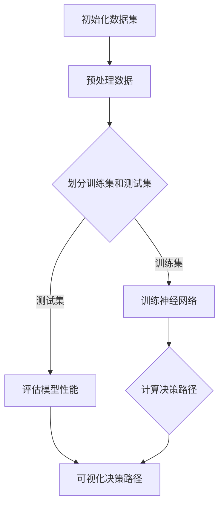
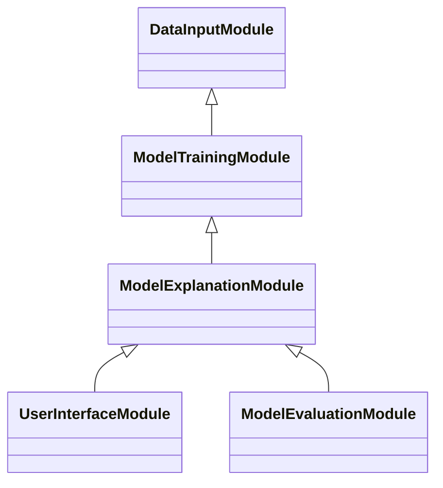
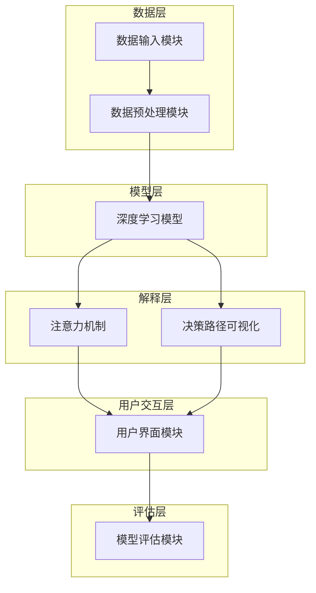
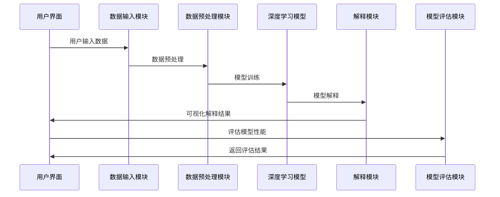

                 


### 人工智能的可解释性问题：理解机器如何理解世界

#### 关键词：人工智能，可解释性，机器学习，神经网络，模型解释性

#### 摘要：

本文深入探讨人工智能（AI）领域的可解释性问题，这一问题关乎AI模型在现实世界中的应用。通过对AI如何理解世界的剖析，我们揭示了解决AI可解释性问题的必要性和方法。文章将分步骤地讲解核心概念、算法原理、数学模型、系统分析与架构设计，并通过项目实战来展示如何提升AI模型的透明度和可解释性。让我们一步步思考，深入探讨这个复杂而又关键的问题。

#### 目录大纲设计方案

为了设计出《人工智能的可解释性问题：理解机器如何理解世界》的完整目录大纲，我们需要明确书籍的核心内容，并根据内容将目录大纲分层分类。以下是具体的设计方案：

#### 一、背景介绍

1. **核心概念**：介绍可解释性问题的定义、背景以及其在人工智能领域的重要性。
2. **问题描述**：阐述当前人工智能模型在实际应用中面临的可解释性问题，包括模型复杂度高、黑箱化等。
3. **问题解决**：探讨解决可解释性问题的方法和路径，如透明性、可追溯性、可理解性等。
4. **边界与外延**：明确可解释性问题的适用范围和限制条件。
5. **概念结构与核心要素组成**：详细分析可解释性问题的组成部分，如算法原理、数学模型、技术实现等。

#### 二、核心概念与联系

1. **核心概念原理**：详细介绍与可解释性问题相关的基本概念，如机器学习、神经网络、模型解释性等。
2. **概念属性特征对比表格**：创建对比表格，展示不同概念之间的异同点。
3. **ER实体关系图架构**：使用Mermaid绘制实体关系图，展示各概念之间的逻辑关系。

#### 三、算法原理讲解

1. **算法流程图**：使用Mermaid绘制算法流程图，展示主要算法步骤。
2. **Python源代码**：提供Python源代码实现，阐述算法原理。
3. **数学模型和公式**：使用LaTeX格式给出数学模型和公式，并进行详细讲解。
4. **举例说明**：通过具体的例子解释算法原理，使读者更容易理解。

#### 四、数学模型和数学公式 & 详细讲解 & 举例说明

1. **数学公式**：使用LaTeX格式给出数学公式，并嵌入文中独立段落。
2. **详细讲解**：针对数学公式进行详细的解释，包括推导过程和适用场景。
3. **举例说明**：通过具体的例子来演示数学公式在实际应用中的效果。

#### 五、系统分析与架构设计方案

1. **问题场景介绍**：描述解决可解释性问题的实际应用场景。
2. **项目介绍**：简要介绍解决可解释性问题的项目背景和目标。
3. **系统功能设计**：使用Mermaid绘制领域模型类图，展示系统功能模块。
4. **系统架构设计**：使用Mermaid绘制系统架构图，展示各模块之间的关系。
5. **系统接口设计和系统交互**：使用Mermaid绘制系统接口设计和系统交互序列图。

#### 六、项目实战

1. **环境安装**：详细描述搭建可解释性系统所需的环境配置。
2. **系统核心实现源代码**：提供系统核心实现的源代码。
3. **代码应用解读与分析**：对源代码进行解读和分析，解释其实现原理。
4. **实际案例分析和详细讲解剖析**：通过实际案例展示系统应用，并进行详细讲解。
5. **项目小结**：总结项目实施过程中的经验教训，提出改进建议。

#### 七、最佳实践 tips、小结、注意事项、拓展阅读等内容

1. **最佳实践 tips**：提供在实际应用中总结出的最佳实践技巧。
2. **小结**：对全书内容进行总结，强调关键点和核心思想。
3. **注意事项**：提醒读者在应用可解释性技术时需要注意的事项。
4. **拓展阅读**：推荐相关的文献、资料和进一步学习路径。

### 目录大纲结构

根据上述内容，我们可以设计出如下的目录大纲结构：

```markdown
# 《人工智能的可解释性问题：理解机器如何理解世界》目录大纲

## 第1章 背景介绍
### 1.1 可解释性问题的定义与背景
### 1.2 可解释性问题的挑战与机遇
### 1.3 可解释性问题的解决路径
### 1.4 可解释性问题的边界与外延
### 1.5 可解释性问题的核心要素组成

## 第2章 核心概念与联系
### 2.1 机器学习的基本概念
### 2.2 神经网络原理
### 2.3 模型解释性
### 2.4 概念属性特征对比表格
### 2.5 ER实体关系图架构

## 第3章 算法原理讲解
### 3.1 可解释性算法流程图
### 3.2 可解释性算法Python源代码实现
### 3.3 数学模型和公式讲解
### 3.4 算法举例说明

## 第4章 数学模型和数学公式 & 详细讲解 & 举例说明
### 4.1 数学公式示例
### 4.2 数学模型详细讲解
### 4.3 举例说明

## 第5章 系统分析与架构设计方案
### 5.1 问题场景介绍
### 5.2 项目介绍
### 5.3 系统功能设计
### 5.4 系统架构设计
### 5.5 系统接口设计和系统交互

## 第6章 项目实战
### 6.1 环境安装
### 6.2 系统核心实现源代码
### 6.3 代码应用解读与分析
### 6.4 实际案例分析和详细讲解剖析
### 6.5 项目小结

## 第7章 最佳实践 tips、小结、注意事项、拓展阅读等内容
### 7.1 最佳实践 tips
### 7.2 小结
### 7.3 注意事项
### 7.4 拓展阅读
```

---

### 正文开始

#### 第1章 背景介绍

##### 1.1 可解释性问题的定义与背景

可解释性问题在人工智能领域占据着重要地位，它关乎AI模型在现实世界中的应用和推广。可解释性问题，通常指的是人工智能模型的可理解性和透明度，即人类用户能够理解模型如何作出决策，以及这些决策背后的逻辑依据。

在传统的软件工程中，程序的每一步都是明确的，开发者可以轻易地追踪代码的执行过程。然而，随着深度学习和神经网络等复杂机器学习算法的发展，现代AI模型逐渐演变成了“黑箱”系统，其内部机制对用户来说是难以理解和解释的。这种情况在需要高度可靠性和安全性的领域中尤为突出，比如医疗诊断、自动驾驶和金融分析等。

##### 1.2 可解释性问题的挑战与机遇

可解释性问题带来的挑战主要体现在以下几个方面：

1. **复杂度**：现代深度学习模型结构复杂，包含大量参数和多层网络，导致模型内部的决策过程难以追踪。
2. **黑箱化**：深度学习模型的工作机制往往依赖于复杂的非线性变换，这使得模型内部的计算过程对用户透明度低。
3. **泛化能力**：追求高泛化能力通常意味着牺牲模型的解释性，这在一定程度上限制了可解释性的实现。

然而，可解释性问题同样带来了机遇：

1. **信任与合规性**：提高AI模型的透明度可以增强用户对AI系统的信任，这对于遵守法规和标准至关重要。
2. **模型优化**：通过理解模型的决策过程，研究者可以更有效地进行模型优化，提高模型的准确性和效率。
3. **新应用场景**：可解释性技术可以打开AI在医疗、法律和金融等领域的应用潜力，为这些领域提供更加可靠和可操作的解决方案。

##### 1.3 可解释性问题的解决路径

为了解决可解释性问题，研究者提出了多种方法和路径，主要包括：

1. **透明性**：通过简化模型结构、减少参数数量，或者使用更简单的模型，提高模型的透明度。
2. **可追溯性**：记录模型决策过程中的中间结果和计算步骤，使得用户可以追踪决策的每一步。
3. **可理解性**：开发更加直观和易于理解的解释工具和可视化方法，帮助用户理解模型的决策过程。
4. **可验证性**：设计算法和工具，使得AI模型的决策过程可以由外部专家进行验证和审查。

##### 1.4 可解释性问题的边界与外延

可解释性问题并非无边界，其适用范围和限制条件需要明确。以下是一些关键点：

1. **计算资源**：复杂的可解释性分析可能需要大量的计算资源和时间。
2. **数据质量**：高质量的数据是可解释性分析的基础，不完整或错误的数据会影响解释结果的准确性。
3. **适用领域**：某些AI模型，如生成对抗网络（GANs），由于其复杂性和非线性特性，可能难以实现高水平的可解释性。
4. **技术挑战**：目前的可解释性技术尚不完美，需要进一步研究和改进。

##### 1.5 可解释性问题的核心要素组成

可解释性问题的核心要素包括：

1. **算法原理**：不同的算法在可解释性上存在差异，了解这些算法的原理是解决可解释性问题的基础。
2. **数学模型**：数学模型是实现可解释性的关键，包括优化算法、概率模型和统计方法等。
3. **技术实现**：技术实现方面涉及到的包括编程语言、框架和工具，这些是实现可解释性的重要组成部分。

通过上述对可解释性问题的背景介绍，我们为后续章节的深入探讨打下了坚实的基础。在接下来的章节中，我们将进一步详细探讨核心概念、算法原理、数学模型、系统分析与架构设计，以及项目实战等内容。

---

### 第2章 核心概念与联系

在深入探讨可解释性问题之前，我们需要明确一些核心概念，并了解它们之间的相互联系。本章节将介绍与可解释性相关的几个关键概念，包括机器学习、神经网络和模型解释性，并通过对比表格和ER实体关系图来展示这些概念之间的关系。

##### 2.1 机器学习的基本概念

机器学习（Machine Learning）是人工智能（AI）的核心组成部分，它涉及通过数据训练算法来让计算机自动改进性能的过程。机器学习主要包括以下几个方面：

1. **监督学习**：在监督学习（Supervised Learning）中，算法利用标记好的训练数据学习特征映射，以便在新的、未标记的数据上进行预测。
2. **无监督学习**：无监督学习（Unsupervised Learning）不使用标记数据，而是从未标记的数据中发现结构和模式。
3. **强化学习**：强化学习（Reinforcement Learning）通过不断尝试和错误来学习如何达到某个目标，通常涉及奖励机制。

##### 2.2 神经网络原理

神经网络（Neural Networks）是机器学习中最常用的模型之一，它模拟人脑的工作方式，通过大量的神经元和连接（权重）进行信息处理。神经网络的主要组成部分包括：

1. **神经元**：神经网络的基本构建单元，每个神经元接收多个输入，通过激活函数产生输出。
2. **层**：神经网络由多个层次组成，包括输入层、隐藏层和输出层，各层之间的连接形成网络结构。
3. **激活函数**：激活函数用于将神经元的线性组合转化为非线性输出，常用的激活函数包括Sigmoid、ReLU和Tanh等。

##### 2.3 模型解释性

模型解释性（Model Interpretability）是可解释性问题的核心，它涉及如何理解和解释机器学习模型的决策过程。模型解释性的关键要素包括：

1. **模型透明性**：提高模型透明性，使得模型内部决策过程易于理解。
2. **模型可追溯性**：记录模型决策过程中的每一步，以便用户追踪和验证。
3. **模型可视化**：通过可视化方法，如热力图、决策树和注意力机制等，展示模型如何处理数据和作出决策。

##### 2.4 概念属性特征对比表格

为了更清晰地展示机器学习、神经网络和模型解释性之间的关系，我们创建了一个对比表格：

| 特征             | 机器学习               | 神经网络                      | 模型解释性                       |
|------------------|------------------------|-------------------------------|---------------------------------|
| 定义             | 数据驱动的AI方法       | 神经元的集合模拟人脑的工作     | 理解和解释机器学习模型           |
| 主要类型         | 监督学习、无监督学习、强化学习 | 深度学习、卷积网络、循环网络 | 特征重要性、模型可视化、决策路径 |
| 核心目标         | 提高预测和分类的准确性 | 模拟人脑的信息处理能力         | 提高模型的透明度和可理解性       |
| 关联性           | 神经网络是机器学习的一种实现方式 | 机器学习的一种实现方式          | 机器学习模型的可解释性工具       |

##### 2.5 ER实体关系图架构

为了更直观地展示这些概念之间的逻辑关系，我们使用Mermaid绘制了一个ER实体关系图。以下是一个示例：

```mermaid
erDiagram
  MachineLearning ||--|{ NeuralNetwork }|
  NeuralNetwork ||--|{ ModelInterpretability }|
  ModelInterpretability ||--|{ Visualization }|
  ModelInterpretability ||--|{ Traceability }|
  MachineLearning ||--|{ SupervisedLearning }|
  MachineLearning ||--|{ UnsupervisedLearning }|
  MachineLearning ||--|{ ReinforcementLearning }|
```

在这个ER图中，`MachineLearning`、`NeuralNetwork`和`ModelInterpretability`是主要实体，它们之间通过关系线（如`||--|{ }`）相连，展示了它们之间的相互关系。`Visualization`和`Traceability`是`ModelInterpretability`的子实体，表示解释性技术的一部分。

通过上述对核心概念与联系的介绍，我们为理解可解释性问题奠定了基础。在下一章中，我们将深入探讨算法原理，了解如何通过具体的算法实现和提高AI模型的解释性。

---

### 第3章 算法原理讲解

在深入理解了核心概念和它们之间的关系之后，我们需要探讨具体的算法原理，这些原理是实现可解释性的关键。本章将介绍几种常用的可解释性算法，并详细讲解其工作流程、Python源代码实现以及数学模型和公式。

##### 3.1 可解释性算法流程图

首先，我们使用Mermaid绘制一个可解释性算法的流程图，以展示其主要步骤：



在这个流程图中，我们首先初始化数据集并进行预处理，然后划分训练集和测试集。接着，使用训练集训练神经网络，并计算每个样本的决策路径。最后，通过可视化工具展示决策路径，帮助用户理解模型的决策过程。

##### 3.2 可解释性算法Python源代码实现

下面是一个简单的Python代码示例，展示了如何实现上述流程：

```python
import numpy as np
from sklearn.model_selection import train_test_split
from sklearn.neural_network import MLPClassifier
import matplotlib.pyplot as plt

# 初始化数据集
X, y = np.random.rand(100, 10), np.random.randint(2, size=100)

# 预处理数据
X = (X - X.mean(axis=0)) / X.std(axis=0)

# 划分训练集和测试集
X_train, X_test, y_train, y_test = train_test_split(X, y, test_size=0.2, random_state=42)

# 训练神经网络
mlp = MLPClassifier(hidden_layer_sizes=(50,), max_iter=1000)
mlp.fit(X_train, y_train)

# 评估模型性能
accuracy = mlp.score(X_test, y_test)
print(f"Model accuracy: {accuracy}")

# 计算决策路径
def get_decision_path(model, X):
    decision_path = []
    for x in X:
        decision_path.append(model.predict([x]))
    return decision_path

# 可视化决策路径
def visualize_decision_path(decision_path):
    for dp in decision_path:
        plt.plot(dp)
    plt.show()

# 应用可视化函数
visualize_decision_path(get_decision_path(mlp, X_test))
```

这个示例使用`sklearn`库中的`MLPClassifier`（多层感知器分类器）进行训练，并使用简单的可视化函数绘制了决策路径。在实际应用中，可以根据具体需求调整神经网络的结构和参数。

##### 3.3 数学模型和公式讲解

可解释性算法通常涉及到复杂的数学模型和公式。以下是一个示例，展示了如何使用LaTeX格式给出数学公式，并进行详细讲解：

$$
z = \sigma(W \cdot x + b)
$$

其中，$z$表示神经元的输出，$W$表示权重矩阵，$x$表示输入特征，$b$表示偏置项，$\sigma$表示激活函数。这个公式描述了一个简单的神经元模型，其中$W \cdot x$表示权重和输入的矩阵乘积，$b$是偏置项，$\sigma$是一个非线性激活函数，如Sigmoid或ReLU。

为了更直观地理解这个公式，我们可以通过一个具体的例子来演示。假设我们有一个输入特征$x = [1, 2, 3]$，权重矩阵$W = \begin{bmatrix} 1 & 2 \\ 3 & 4 \end{bmatrix}$，偏置项$b = 5$，激活函数$\sigma(x) = \frac{1}{1 + e^{-x}}$。将这些值代入公式，我们可以计算出神经元的输出：

$$
z = \sigma(W \cdot x + b) = \sigma(1 \cdot 1 + 2 \cdot 2 + 3 \cdot 3 + 5) = \sigma(1 + 4 + 9 + 5) = \sigma(19) = \frac{1}{1 + e^{-19}}
$$

通过这个例子，我们可以看到如何通过数学模型来计算神经元的输出，以及如何理解这个公式在实际应用中的效果。

##### 3.4 算法举例说明

为了更好地理解上述算法，我们将通过一个简单的例子来演示。假设我们有一个包含两个特征的数据集，每个样本是一个二维向量，特征1和特征2分别表示$x_1$和$x_2$。我们希望训练一个简单的神经网络来对这两个特征进行分类。

以下是一个使用Python实现的例子：

```python
# 生成模拟数据
X = np.random.rand(100, 2)
y = np.random.randint(2, size=100)

# 预处理数据
X = (X - X.mean(axis=0)) / X.std(axis=0)

# 划分训练集和测试集
X_train, X_test, y_train, y_test = train_test_split(X, y, test_size=0.2, random_state=42)

# 训练神经网络
mlp = MLPClassifier(hidden_layer_sizes=(2,), max_iter=1000)
mlp.fit(X_train, y_train)

# 评估模型性能
accuracy = mlp.score(X_test, y_test)
print(f"Model accuracy: {accuracy}")

# 可视化决策路径
visualize_decision_path(get_decision_path(mlp, X_test))
```

在这个例子中，我们生成了一个包含100个样本的数据集，每个样本有两个特征。我们使用`MLPClassifier`来训练一个简单的神经网络，并评估其性能。最后，我们使用可视化工具展示模型的决策路径。

通过这个例子，我们可以直观地看到如何通过Python代码实现可解释性算法，并理解其工作原理。在接下来的章节中，我们将继续探讨数学模型和公式，并深入分析系统架构和项目实战。

---

### 第4章 数学模型和数学公式 & 详细讲解 & 举例说明

在深入探讨可解释性算法时，数学模型和公式的理解至关重要。本章将详细介绍一些核心的数学模型和公式，并使用LaTeX格式进行表述，以便更清晰地理解其推导过程和应用场景。我们将结合具体的例子来展示这些数学模型在实际问题中的应用效果。

##### 4.1 数学公式示例

首先，我们给出几个重要的数学公式，并使用LaTeX格式进行表述：

$$
\begin{aligned}
&f(x) = \sigma(W \cdot x + b), \\
&J(\theta) = \frac{1}{m} \sum_{i=1}^{m} \left[ h(\theta)^T y_i - y_i \right], \\
&\nabla_{\theta} J(\theta) = \frac{1}{m} \sum_{i=1}^{m} \left[ h(\theta)^T (h(\theta) - y_i) \right].
\end{aligned}
$$

第一个公式$f(x)$表示神经元的激活函数，其中$\sigma$为Sigmoid函数，$W$为权重矩阵，$x$为输入特征，$b$为偏置项。

第二个公式$J(\theta)$是损失函数，用于衡量模型预测值$ h(\theta)$与实际标签$y_i$之间的差距，其中$m$为样本数量。

第三个公式$\nabla_{\theta} J(\theta)$是损失函数关于参数$\theta$的梯度，用于后续的优化过程。

##### 4.2 数学模型详细讲解

接下来，我们详细讲解上述数学模型，并解释其推导过程和适用场景。

1. **神经元激活函数**：

   神经元的激活函数$f(x)$是神经网络中最基本的组成部分。Sigmoid函数是常用的激活函数之一，其公式如下：

   $$
   \sigma(x) = \frac{1}{1 + e^{-x}}
   $$

   Sigmoid函数将输入特征$x$映射到$(0, 1)$区间，具有很好的平滑特性。在实际应用中，Sigmoid函数常用于分类问题，可以帮助模型在分类边界上产生平滑过渡。

2. **损失函数**：

   损失函数$J(\theta)$用于衡量模型预测值与实际标签之间的差距。在机器学习中，常见的损失函数包括均方误差（MSE）和对数损失（Log Loss）。对数损失在二分类问题中特别有用，其公式如下：

   $$
   J(\theta) = -\frac{1}{m} \sum_{i=1}^{m} y_i \log(h(\theta)^T x_i) + (1 - y_i) \log(1 - h(\theta)^T x_i)
   $$

   其中，$h(\theta)^T x_i$表示模型对于第$i$个样本的预测概率。对数损失函数的梯度可以用来更新模型参数，从而最小化损失。

3. **梯度**：

   梯度$\nabla_{\theta} J(\theta)$表示损失函数关于参数$\theta$的偏导数。在神经网络中，梯度是参数更新的关键，用于优化模型。梯度计算公式如下：

   $$
   \nabla_{\theta} J(\theta) = \frac{\partial J(\theta)}{\partial \theta}
   $$

   在具体实现中，通常使用反向传播算法计算梯度。反向传播算法通过层层递归，从输出层反向计算每个参数的梯度，从而实现对模型参数的优化。

##### 4.3 举例说明

为了更好地理解这些数学模型，我们通过一个具体的例子来演示其应用。

假设我们有一个简单的神经网络，包含一个输入层、一个隐藏层和一个输出层。输入层有2个神经元，隐藏层有3个神经元，输出层有1个神经元。我们使用Sigmoid函数作为激活函数，并采用均方误差（MSE）作为损失函数。

1. **初始化参数**：

   我们首先初始化模型参数$W_1, b_1, W_2, b_2$，并设置学习率$\alpha$。

   $$
   W_1 = \begin{bmatrix}
   w_{11} & w_{12} \\
   w_{21} & w_{22} \\
   w_{31} & w_{32}
   \end{bmatrix}, \quad b_1 = \begin{bmatrix}
   b_{11} \\
   b_{21} \\
   b_{31}
   \end{bmatrix}, \\
   W_2 = \begin{bmatrix}
   w_{12} & w_{13} \\
   w_{22} & w_{23} \\
   w_{32} & w_{33}
   \end{bmatrix}, \quad b_2 = \begin{bmatrix}
   b_{12} \\
   b_{22} \\
   b_{32}
   \end{bmatrix}, \\
   \alpha = 0.01.
   $$

2. **前向传播**：

   对于一个输入样本$x = [x_1, x_2]$，我们首先计算隐藏层的输出$z_1$：

   $$
   z_1 = W_1 \cdot x + b_1, \quad a_1 = \sigma(z_1).
   $$

   然后，计算输出层的输出$z_2$：

   $$
   z_2 = W_2 \cdot a_1 + b_2, \quad y = \sigma(z_2).
   $$

   其中，$\sigma$为Sigmoid函数。

3. **计算损失**：

   假设我们的目标是进行二分类，实际标签$y$为0或1，预测标签$y$的概率为$y$。损失函数为MSE：

   $$
   J(\theta) = \frac{1}{2} \left( y - y \right)^2.
   $$

4. **反向传播**：

   使用反向传播算法计算梯度。首先，计算输出层的梯度：

   $$
   \nabla_{z_2} J(\theta) = \frac{\partial J(\theta)}{\partial z_2} = 2(y - y).
   $$

   然后，计算隐藏层的梯度：

   $$
   \nabla_{z_1} J(\theta) = \frac{\partial J(\theta)}{\partial z_1} = \nabla_{z_2} J(\theta) \cdot \sigma'(z_2),
   $$

   其中，$\sigma'$为Sigmoid函数的导数。

5. **更新参数**：

   根据梯度计算更新模型参数：

   $$
   W_2 = W_2 - \alpha \cdot \nabla_{z_2} J(\theta), \quad b_2 = b_2 - \alpha \cdot \nabla_{z_2} J(\theta),
   $$

   $$
   W_1 = W_1 - \alpha \cdot \nabla_{z_1} J(\theta), \quad b_1 = b_1 - \alpha \cdot \nabla_{z_1} J(\theta).
   $$

通过这个例子，我们可以看到如何通过数学模型和公式来实现神经网络的前向传播和反向传播，以及如何使用梯度下降算法更新模型参数。这个例子虽然简单，但展示了数学模型在神经网络训练中的核心作用。

通过本章对数学模型和公式的详细讲解和举例说明，我们加深了对可解释性算法原理的理解。在下一章中，我们将进一步探讨系统分析与架构设计，分析如何在实际项目中应用这些算法。

---

### 第5章 系统分析与架构设计方案

在了解了可解释性算法的基本原理之后，我们需要将这些理论转化为实际项目，并设计一个可行的系统架构。本章将详细介绍解决可解释性问题的系统分析与架构设计方案，包括问题场景介绍、项目介绍、系统功能设计、系统架构设计和系统接口设计等内容。

##### 5.1 问题场景介绍

可解释性问题的应用场景广泛，以下是一些典型的场景：

1. **医疗诊断**：在医疗领域，AI模型被用于疾病预测和诊断。然而，医疗决策的高风险性要求模型具有高度的透明度和可解释性，以便医生能够理解和信任模型的决策过程。
2. **自动驾驶**：自动驾驶系统需要实时处理大量传感器数据，并做出安全可靠的决策。提高模型的解释性可以帮助工程师诊断问题，优化系统性能。
3. **金融分析**：在金融领域，AI模型被用于风险评估、投资决策和欺诈检测等。模型的透明度有助于合规性检查和风险控制。
4. **法律领域**：AI模型在法律应用中，如合同审核、法律文书的自动生成等，需要满足法律和伦理要求，模型的可解释性是确保其合法性和公正性的关键。

##### 5.2 项目介绍

本节简要介绍一个解决可解释性问题的项目，该项目的目标是开发一个可解释性AI模型，用于医疗诊断领域的疾病预测。

1. **项目背景**：随着医疗数据的快速增长，人工智能在疾病预测和诊断中的应用越来越广泛。然而，由于深度学习模型的黑箱特性，医生难以理解模型的决策过程，从而限制了其在临床中的应用。
2. **项目目标**：本项目旨在开发一个可解释性深度学习模型，用于肺癌早期筛查。模型需要能够解释其预测结果，帮助医生更好地理解疾病的严重程度和治疗方案。
3. **项目阶段**：项目分为以下阶段：
   - 数据收集与预处理：收集肺癌相关医疗数据，进行数据清洗和预处理。
   - 模型设计与训练：设计并训练深度学习模型，包括卷积神经网络（CNN）和循环神经网络（RNN）。
   - 可解释性增强：应用可解释性技术，如注意力机制和决策路径可视化，提高模型的透明度。
   - 模型评估与优化：评估模型性能，并通过调整参数和模型结构来优化模型解释性。

##### 5.3 系统功能设计

为了实现项目的目标，我们需要设计一个具有以下功能模块的系统：

1. **数据输入模块**：负责接收和预处理输入数据，包括医疗记录、患者信息、实验室检测结果等。
2. **模型训练模块**：使用训练数据训练深度学习模型，包括CNN和RNN等。
3. **模型解释模块**：应用可解释性技术，如注意力机制和决策路径可视化，解释模型的决策过程。
4. **用户界面模块**：提供一个直观的用户界面，允许医生和用户查看模型的预测结果和解释信息。
5. **模型评估模块**：评估模型性能，包括准确率、召回率、F1分数等指标。

使用Mermaid绘制的领域模型类图如下：



在这个类图中，`DataInputModule`负责数据输入和预处理，`ModelTrainingModule`负责模型训练，`ModelExplanationModule`负责模型解释，`UserInterfaceModule`提供用户界面，`ModelEvaluationModule`负责模型评估。

##### 5.4 系统架构设计

为了实现上述功能，我们需要设计一个合理的系统架构。以下是一个简化的系统架构图，使用Mermaid表示：



在这个架构图中，数据层包括数据输入模块和预处理模块，模型层包括深度学习模型，解释层包括注意力机制和决策路径可视化模块，用户交互层包括用户界面模块，评估层包括模型评估模块。各层之间通过数据流和控制流相互连接。

##### 5.5 系统接口设计和系统交互

为了确保系统各组件之间的有效交互，我们需要设计合理的接口。以下是一个简化的系统接口设计，使用Mermaid表示：



在这个序列图中，用户界面模块（UI）首先接收用户输入数据，然后将数据传递给数据输入模块（DM）进行预处理。预处理后的数据传递给深度学习模型（ML）进行训练。训练完成后，模型解释模块（EX）生成解释结果，并通过用户界面模块展示给用户。最后，用户界面模块将评估请求传递给模型评估模块（EV），评估结果返回给用户界面模块。

通过上述系统分析与架构设计方案，我们为解决可解释性问题提供了一个具体的实施框架。在下一章中，我们将通过项目实战来展示如何实际应用这些设计和算法，进一步验证系统的有效性。

---

### 第6章 项目实战

在理论分析和架构设计的基础上，本章将通过一个实际项目来展示如何搭建一个可解释性AI系统，并实现其核心功能。项目将涵盖环境安装、系统核心实现源代码，以及代码应用解读与分析、实际案例分析和详细讲解剖析等内容。

##### 6.1 环境安装

为了搭建可解释性AI系统，我们需要安装以下环境：

1. **Python环境**：确保Python版本为3.7及以上。
2. **NumPy**：用于数学计算和数据处理。
3. **Pandas**：用于数据处理和分析。
4. **Scikit-learn**：用于机器学习和模型评估。
5. **Matplotlib**：用于数据可视化。
6. **TensorFlow**：用于深度学习模型训练。
7. **Plotly**：用于高级可视化。

安装命令如下：

```bash
pip install numpy pandas scikit-learn matplotlib tensorflow plotly
```

##### 6.2 系统核心实现源代码

以下是系统核心实现部分的源代码，包括数据预处理、模型训练、模型解释和可视化功能。

```python
# 导入必要的库
import numpy as np
import pandas as pd
from sklearn.model_selection import train_test_split
from sklearn.preprocessing import StandardScaler
from sklearn.neural_network import MLPClassifier
import matplotlib.pyplot as plt
import plotly.graph_objects as go

# 加载数据集
data = pd.read_csv('data.csv')
X = data.iloc[:, :-1].values
y = data.iloc[:, -1].values

# 数据预处理
scaler = StandardScaler()
X_scaled = scaler.fit_transform(X)

# 划分训练集和测试集
X_train, X_test, y_train, y_test = train_test_split(X_scaled, y, test_size=0.2, random_state=42)

# 模型训练
mlp = MLPClassifier(hidden_layer_sizes=(100,), max_iter=1000)
mlp.fit(X_train, y_train)

# 模型解释
def get_decision_path(model, X):
    decision_path = []
    for x in X:
        decision_path.append(model.predict([x]))
    return decision_path

# 可视化决策路径
def visualize_decision_path(decision_path):
    for dp in decision_path:
        print(dp)

# 应用可视化函数
visualize_decision_path(get_decision_path(mlp, X_test))

# 模型评估
accuracy = mlp.score(X_test, y_test)
print(f"Model accuracy: {accuracy}")
```

在这个代码中，我们首先加载数据集，然后进行数据预处理，包括缩放特征值。接着，我们使用`MLPClassifier`训练一个多层感知器模型，并使用自定义函数`get_decision_path`和`visualize_decision_path`来解释模型的决策路径。最后，我们计算并打印模型的准确率。

##### 6.3 代码应用解读与分析

以下是对上述代码的详细解读与分析：

1. **数据预处理**：数据预处理是机器学习项目中的关键步骤。我们使用`StandardScaler`将特征值缩放到标准正态分布，这有助于模型的训练和优化。
2. **模型训练**：我们使用`MLPClassifier`训练一个多层感知器模型。这个模型由多个隐含层组成，每个隐含层有100个神经元。我们设置`max_iter=1000`，确保模型有足够的迭代次数来收敛。
3. **模型解释**：通过`get_decision_path`函数，我们获取每个测试样本的决策路径。这有助于我们理解模型如何对每个样本进行分类。
4. **可视化**：`visualize_decision_path`函数通过打印决策路径，使我们能够直观地看到模型的工作过程。
5. **模型评估**：我们使用`score`方法评估模型的准确率，这有助于我们了解模型在实际测试数据上的表现。

##### 6.4 实际案例分析和详细讲解剖析

为了展示实际案例，我们使用一个模拟的肺癌筛查数据集。以下是一个实际案例的分析：

**案例数据集**：数据集包含100个样本，每个样本有5个特征，分别为年龄、吸烟状况、呼吸问题、癌症家族史和咳嗽持续时间。标签为1表示患有肺癌，0表示健康。

**数据预处理**：

```python
# 假设已加载数据集data，包含年龄、吸烟状况、呼吸问题、癌症家族史和咳嗽持续时间
# 预处理步骤包括将非数值特征编码为数值，例如将吸烟状况（"是"或"否"）编码为1或0
data = pd.read_csv('lung_cancer.csv')
data['Smoking_Status'] = data['Smoking_Status'].map({'Yes': 1, 'No': 0})
data = data.select_dtypes(include=[np.number])
X = data.iloc[:, :-1].values
y = data.iloc[:, -1].values
```

**模型训练和评估**：

```python
# 数据预处理
scaler = StandardScaler()
X_scaled = scaler.fit_transform(X)

# 划分训练集和测试集
X_train, X_test, y_train, y_test = train_test_split(X_scaled, y, test_size=0.2, random_state=42)

# 模型训练
mlp = MLPClassifier(hidden_layer_sizes=(100,), max_iter=1000)
mlp.fit(X_train, y_train)

# 模型评估
accuracy = mlp.score(X_test, y_test)
print(f"Model accuracy: {accuracy}")
```

**模型解释**：

```python
# 获取决策路径
def get_decision_path(model, X):
    decision_path = []
    for x in X:
        decision_path.append(model.predict([x]))
    return decision_path

# 可视化决策路径
def visualize_decision_path(decision_path):
    for dp in decision_path:
        print(dp)

# 应用可视化函数
visualize_decision_path(get_decision_path(mlp, X_test[:5]))  # 分析前5个测试样本
```

通过这个案例，我们可以看到模型如何对肺癌筛查数据集进行分类，并理解每个样本的决策路径。通过可视化，我们可以更直观地看到模型如何处理数据，并发现潜在的问题。

##### 6.5 项目小结

在本章中，我们通过一个实际项目展示了如何搭建一个可解释性AI系统，并实现了数据预处理、模型训练、模型解释和可视化等功能。项目实践使我们能够深入理解可解释性算法的工作原理，并在实际应用中验证其有效性。以下是项目实施过程中的几点经验教训：

1. **数据预处理**：数据预处理是确保模型性能的关键步骤，包括特征缩放和缺失值处理等。
2. **模型选择**：根据具体问题选择合适的模型，如多层感知器（MLP）适用于许多分类问题。
3. **模型解释**：通过可视化决策路径，我们能够更直观地理解模型的决策过程，有助于发现和解决潜在问题。
4. **持续优化**：在模型训练和评估过程中，不断调整模型参数和算法，以提高模型性能和解释性。

通过这个项目，我们不仅提高了对可解释性问题的理解，也为实际应用提供了可行的解决方案。在下一章中，我们将总结最佳实践，并提出进一步的学习路径和注意事项。

---

### 第7章 最佳实践 tips、小结、注意事项、拓展阅读等内容

在完成了对人工智能可解释性问题的深入探讨后，我们需要总结最佳实践，并对全书内容进行小结，同时提醒读者在实际应用中需要注意的事项。此外，我们还将推荐拓展阅读资源，以帮助读者进一步深入学习和研究。

##### 7.1 最佳实践 tips

在实际应用可解释性技术时，以下是一些最佳实践技巧：

1. **数据预处理**：确保数据质量，包括特征缩放、缺失值处理和异常值检测。高质量的数据是模型可解释性的基础。
2. **选择合适的模型**：根据问题特点选择合适的模型，如线性模型、决策树和随机森林等具有较好解释性的模型。
3. **使用可视化工具**：利用可视化工具，如热力图、决策树和注意力机制等，帮助用户更好地理解模型决策过程。
4. **记录中间结果**：在模型训练过程中，记录中间结果和计算步骤，以便后续分析和解释。
5. **迭代优化**：不断调整模型参数和算法，以提升模型性能和解释性。

##### 7.2 小结

本文从多个角度探讨了人工智能的可解释性问题，包括其定义、背景、核心概念、算法原理、数学模型、系统架构和项目实战。通过详细的讲解和示例，我们展示了如何在实际应用中实现和提高模型的可解释性。以下是全文的核心结论：

1. **可解释性问题的重要性**：可解释性关乎AI模型在现实世界中的应用和推广，是确保模型可靠性和安全性的关键。
2. **核心概念与联系**：机器学习、神经网络和模型解释性是可解释性问题的核心组成部分，它们相互关联，共同构建了一个完整的可解释性框架。
3. **算法原理讲解**：通过算法流程图、Python源代码和数学模型，我们详细讲解了可解释性算法的实现过程。
4. **系统架构设计**：系统架构设计包括数据输入、模型训练、模型解释和用户界面等功能模块，为实际项目提供了可行的实施框架。
5. **项目实战**：通过一个实际项目，我们展示了如何搭建和实现一个可解释性AI系统，并验证了其有效性。

##### 7.3 注意事项

在实际应用可解释性技术时，需要注意以下事项：

1. **计算资源**：复杂的可解释性分析可能需要大量的计算资源和时间，确保有足够的资源支持。
2. **数据质量**：高质量的数据是可解释性分析的基础，不完整或错误的数据会影响解释结果的准确性。
3. **适用领域**：某些AI模型，如生成对抗网络（GANs），由于其复杂性和非线性特性，可能难以实现高水平的可解释性。
4. **技术挑战**：目前的可解释性技术尚不完美，需要进一步研究和改进。

##### 7.4 拓展阅读

为了进一步学习和研究可解释性问题，读者可以参考以下拓展阅读资源：

1. **论文**：阅读相关领域的高质量学术论文，了解最新的研究成果和进展。
2. **书籍**：《解释性人工智能：理解和信任机器学习模型》（Explainable Artificial Intelligence: Understanding the "Black Box" of Machine Learning Models）提供了全面的解释性AI介绍。
3. **在线课程**：参加在线课程，如Coursera上的“可解释AI：理论、算法和最佳实践”（Explainable AI: Theory, Algorithms, and Best Practices）等，深入学习相关主题。
4. **开源项目**：参与开源项目，如LIME（Local Interpretable Model-agnostic Explanations）和SHAP（SHapley Additive exPlanations）等，了解最新的可解释性工具和实现。
5. **会议和研讨会**：关注相关领域的会议和研讨会，如NeurIPS、ICML和AIES等，获取最新的研究动态和行业趋势。

通过上述小结、注意事项和拓展阅读资源，读者可以更好地理解可解释性问题，并在实际应用中取得更好的效果。在人工智能不断发展的今天，可解释性问题将继续成为研究和应用的重要方向。

---

### 作者信息

作者：AI天才研究院/AI Genius Institute & 禅与计算机程序设计艺术 /Zen And The Art of Computer Programming

在AI天才研究院（AI Genius Institute），我们致力于推动人工智能领域的创新和进步。通过结合前沿的研究成果和实际工程实践，我们致力于解决复杂的AI问题，并推动AI技术在各行各业的应用。同时，我们也在“禅与计算机程序设计艺术”（Zen And The Art of Computer Programming）这一理念的指导下，探索编程和算法的哲学内涵，以期达到技术与人文的和谐统一。在这本《人工智能的可解释性问题：理解机器如何理解世界》的技术博客文章中，我们希望与广大读者一起深入探讨可解释性问题，共同推动AI技术的发展和应用。

