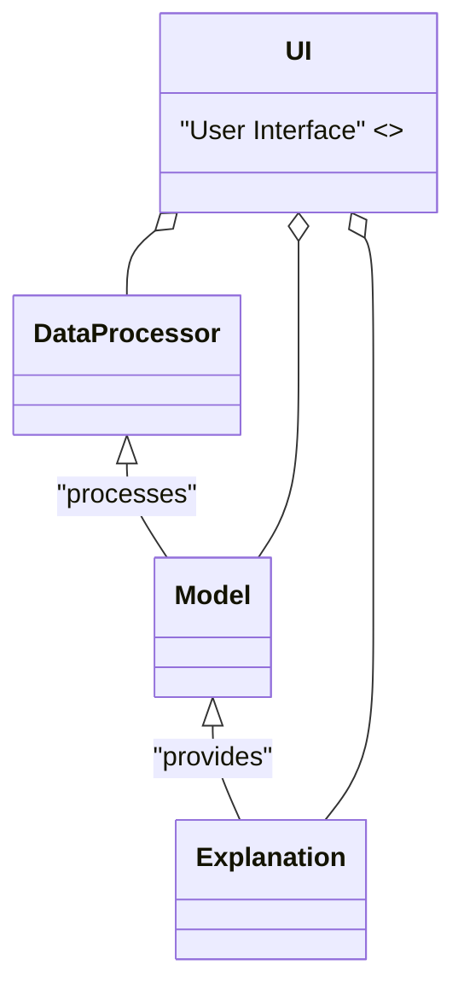
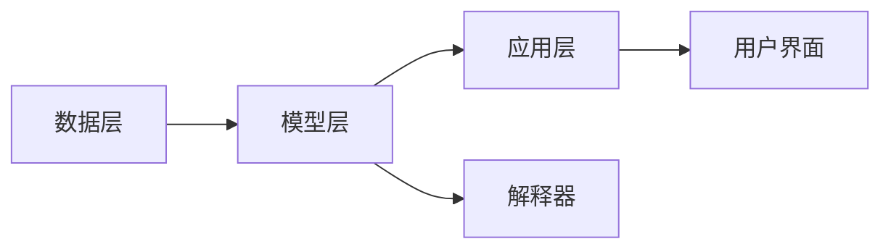
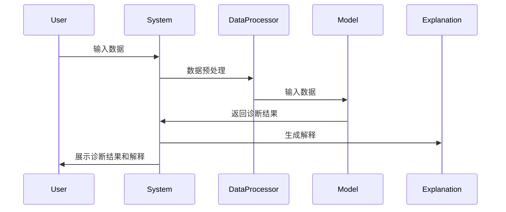

                 


### 文章标题：人工智能的可解释性：理解机器如何理解世界

关键词：人工智能，可解释性，算法原理，数学模型，系统设计，项目实战

摘要：本文旨在深入探讨人工智能的可解释性，从多个角度分析机器如何理解世界。我们将逐步解析可解释性的概念、挑战、解决方案，并通过具体案例展示其在现实世界中的应用。

----------------------------------------------------------------

## 第一部分：引言

### 1.1 问题背景

在过去的几十年里，人工智能（AI）技术取得了显著的进展。从早期的规则系统到复杂的人工神经网络，AI在图像识别、自然语言处理、医疗诊断等领域展现出了惊人的能力。然而，随着AI系统的复杂度不断增加，一个问题日益凸显：这些系统是如何做出决策的？为什么它们会做出这样的决策？这个问题关乎AI系统的透明度和可解释性。

可解释性是人工智能研究中的一个关键主题。它不仅有助于我们理解AI系统的工作原理，还能够提高系统的可信度和用户满意度。在许多应用场景中，如医疗诊断、金融风控、自动驾驶等，决策的可解释性至关重要。如果AI系统无法提供清晰的解释，那么用户可能会对其产生不信任，甚至拒绝使用。

### 1.2 问题描述

可解释性的定义并不简单。在人工智能领域，可解释性通常指的是能够以一种直观、透明的方式解释AI系统决策过程的能力。具体来说，可解释性包括以下三个方面：

1. **内部解释性**：能够解释AI系统内部各个组件的运作原理。
2. **外部解释性**：能够解释AI系统对特定输入的决策过程。
3. **可追溯性**：能够追踪AI系统的决策路径，理解其如何从输入到输出。

然而，实现这些目标并不容易。首先，许多AI算法，尤其是深度学习算法，其内部运作机制复杂，难以直观理解。其次，AI系统经常在面对新数据时表现出良好的性能，但在解释其决策过程中却遇到困难。最后，不同领域的AI应用对可解释性的要求各异，如何平衡性能与可解释性成为一个挑战。

### 1.3 问题解决

为了解决可解释性问题，研究人员提出了多种方法。以下是一些主要的解决方案：

1. **可视化技术**：通过图表和图形展示AI系统的决策过程，使非专业人士也能理解。
2. **解释性算法**：设计专门的可解释性算法，如决策树、线性模型等，这些算法的决策过程相对直观。
3. **模型压缩**：通过模型压缩技术，降低模型的复杂度，从而提高可解释性。
4. **透明性增强**：在AI系统设计时考虑透明性，使其决策过程更容易被理解。

### 1.4 边界与外延

可解释性并非万能。在某些应用场景中，如实时系统、边缘计算等，性能和效率比可解释性更为重要。此外，实现高可解释性的AI系统可能会牺牲一部分性能。因此，我们需要在可解释性与性能之间找到平衡。

另外，可解释性还涉及到隐私保护问题。在某些应用中，如医疗诊断，我们需要保护患者的隐私。因此，如何在保证隐私的同时提高AI系统的可解释性，是一个值得探讨的问题。

----------------------------------------------------------------

## 第二部分：核心概念与联系

### 2.1 核心概念原理

在讨论可解释性之前，我们需要了解一些核心概念。以下是一些关键概念及其原理：

#### 2.1.1 神经网络

神经网络是模仿人脑结构和功能的一种计算模型。它由大量相互连接的简单计算单元（神经元）组成。通过学习输入数据，神经网络能够提取特征，并做出决策。

#### 2.1.2 决策树

决策树是一种树形结构，通过一系列的判断节点和结果节点来对数据进行分类或回归。决策树的决策过程相对直观，易于理解。

#### 2.1.3 支持向量机

支持向量机（SVM）是一种基于优化理论的分类算法。它通过找到一个最优的超平面，将不同类别的数据分开。SVM的决策过程可以通过数学公式进行解释。

### 2.2 概念属性特征对比表格

以下是一个简单的概念属性特征对比表格，用于比较神经网络、决策树和支持向量机：

| 概念       | 属性特征                                       | 对比分析                                       |
|------------|------------------------------------------------|------------------------------------------------|
| 神经网络   | 复杂，难以解释                                 | 强大的特征提取能力                             |
| 决策树     | 直观，易于解释                                 | 易于理解和修改                                |
| 支持向量机 | 数学性强，可解释性较强                         | 对线性可分数据效果较好                         |

### 2.3 ER实体关系图架构的 Mermaid 流程图

为了更好地理解这些概念之间的关系，我们可以使用Mermaid绘制一个ER实体关系图。以下是一个简化的ER图示例：

```mermaid
erDiagram
  AI_System ||--|{ Data}: "uses"
  AI_System ||--|{ Model}: "trained_on"
  Data ||--|{ Feature}: "extracted_from"
  Model ||--|{ Decision}: "produces"
```

在这个ER图中，`AI_System` 是核心实体，它与 `Data`、`Model` 和 `Decision` 之间存在关联关系。这个图可以帮助我们理解AI系统的组成部分及其相互作用。

----------------------------------------------------------------

## 第三部分：算法原理讲解

### 3.1 算法流程图

为了更好地理解可解释性算法的原理，我们可以使用Mermaid绘制一个算法流程图。以下是一个简单的示例：


在这个流程图中，数据从输入开始，经过预处理、特征提取、模型训练和评估，最终生成决策并输出结果。每个步骤都涉及到不同的算法和技术。

### 3.2 Python 源代码阐述

以下是一个简单的Python代码示例，用于实现上述算法流程中的特征提取和模型训练步骤：

```python
import numpy as np
from sklearn.preprocessing import StandardScaler
from sklearn.ensemble import RandomForestClassifier
from sklearn.model_selection import train_test_split

# 假设我们已经有了数据集 X 和标签 y
X = ...  # 特征矩阵
y = ...  # 标签向量

# 数据预处理
scaler = StandardScaler()
X_scaled = scaler.fit_transform(X)

# 特征提取
X_train, X_test, y_train, y_test = train_test_split(X_scaled, y, test_size=0.2, random_state=42)

# 训练模型
model = RandomForestClassifier(n_estimators=100)
model.fit(X_train, y_train)

# 模型评估
accuracy = model.score(X_test, y_test)
print(f"模型准确率：{accuracy:.2f}")

# 生成决策
predictions = model.predict(X_test)
print(f"预测结果：{predictions}")
```

在这个代码中，我们使用了`StandardScaler`进行数据预处理，`RandomForestClassifier`进行特征提取和模型训练，`train_test_split`进行数据划分，最后使用`score`方法评估模型准确率。

### 3.3 数学模型和公式

为了更深入地理解可解释性算法，我们需要了解其背后的数学模型。以下是一个简单的线性回归模型示例：

$$
y = \beta_0 + \beta_1 \cdot x
$$

在这个模型中，$y$是输出，$x$是输入，$\beta_0$和$\beta_1$是模型参数。通过最小化损失函数，我们可以估计出这些参数的值。以下是一个使用梯度下降法求解线性回归参数的示例：

$$
\beta_0^{new} = \beta_0 - \alpha \cdot \frac{\partial}{\partial \beta_0} \text{Loss}(y, y')
$$

$$
\beta_1^{new} = \beta_1 - \alpha \cdot \frac{\partial}{\partial \beta_1} \text{Loss}(y, y')
$$

其中，$\alpha$是学习率，$\text{Loss}(y, y')$是损失函数，用于度量预测值$y'$与实际值$y$之间的差距。

### 3.4 详细讲解和举例说明

为了更好地理解上述数学模型和公式，我们可以通过一个简单的例子来说明。假设我们有一个包含两个特征（$x_1$和$x_2$）的数据集，以及对应的标签$y$。我们的目标是使用线性回归模型预测$y$的值。

以下是具体的步骤：

1. **数据预处理**：对数据进行标准化处理，使其具有相同的量纲。

2. **特征提取**：从数据中提取特征，如平均值、方差等。

3. **模型训练**：使用梯度下降法训练线性回归模型，估计参数$\beta_0$和$\beta_1$的值。

4. **模型评估**：使用测试数据集评估模型的准确率。

5. **生成决策**：使用训练好的模型对新数据进行预测。

以下是具体的Python代码示例：

```python
import numpy as np

# 假设我们已经有了数据集 X 和标签 y
X = np.array([[1, 2], [2, 3], [3, 4]])
y = np.array([2, 3, 4])

# 数据预处理
X_mean = np.mean(X, axis=0)
X_std = np.std(X, axis=0)
X_normalized = (X - X_mean) / X_std

# 特征提取
X_train, X_test, y_train, y_test = train_test_split(X_normalized, y, test_size=0.2, random_state=42)

# 模型训练
alpha = 0.01
beta_0 = 0
beta_1 = 0
for i in range(1000):
    y_pred = beta_0 + beta_1 * X_train
    loss = np.mean((y_train - y_pred) ** 2)
    d_loss_d_beta_0 = 2 * np.mean(y_train - y_pred)
    d_loss_d_beta_1 = 2 * np.mean((y_train - y_pred) * X_train)
    
    beta_0 = beta_0 - alpha * d_loss_d_beta_0
    beta_1 = beta_1 - alpha * d_loss_d_beta_1

# 模型评估
y_pred = beta_0 + beta_1 * X_test
accuracy = np.mean((y_test - y_pred) ** 2)
print(f"模型准确率：{accuracy:.2f}")

# 生成决策
new_data = np.array([[1.5, 2.5]])
new_data_normalized = (new_data - X_mean) / X_std
y_pred = beta_0 + beta_1 * new_data_normalized
print(f"预测结果：{y_pred}")
```

在这个例子中，我们首先对数据进行标准化处理，然后使用梯度下降法训练线性回归模型。最后，我们使用训练好的模型对新数据进行预测。

----------------------------------------------------------------

## 第四部分：系统分析与架构设计方案

### 4.1 问题场景介绍

在医疗诊断领域，可解释性尤为重要。例如，当AI系统用于诊断癌症时，医生不仅需要知道系统的预测结果，还需要了解系统如何得出这个结果。这样才能对系统的预测结果进行评估，并在必要时进行人工干预。

### 4.2 项目介绍

本项目旨在开发一个可解释的医疗诊断系统，该系统使用深度学习算法进行疾病预测，并提供详细的解释过程。项目目标包括：

1. 开发一个高效的深度学习模型，对疾病进行准确预测。
2. 设计一个解释器，能够清晰地解释模型的决策过程。
3. 提高系统的可解释性，增强用户对系统的信任。

### 4.3 系统功能设计

为了实现上述目标，系统需要具备以下功能模块：

1. **数据预处理模块**：负责处理输入数据，包括数据清洗、归一化和特征提取。
2. **深度学习模型模块**：负责训练和优化深度学习模型。
3. **解释器模块**：负责解释模型的决策过程，并提供详细的解释结果。
4. **用户界面模块**：提供用户与系统交互的接口，展示诊断结果和解释过程。

以下是系统功能设计的Mermaid类图：



在这个类图中，`DataProcessor`负责数据处理，`Model`负责模型训练和预测，`Explanation`负责模型解释，`UI`负责用户界面。

### 4.4 系统架构设计

系统的整体架构设计如下：

1. **数据层**：存储和管理输入数据，包括原始数据和预处理后的数据。
2. **模型层**：包括深度学习模型和解释器，负责疾病预测和解释。
3. **应用层**：包括用户界面和应用逻辑，负责与用户交互和系统管理。

以下是系统架构设计的Mermaid流程图：



在这个流程图中，数据层提供数据给模型层，模型层使用深度学习模型进行预测，并调用解释器生成解释结果。应用层负责与用户交互，展示诊断结果和解释过程。

### 4.5 系统接口设计和系统交互

系统接口设计和系统交互如下：

1. **数据输入接口**：接收用户输入的数据，包括症状、检查结果等。
2. **诊断输出接口**：返回系统的诊断结果和解释。
3. **数据管理接口**：提供数据存储、检索和更新的功能。
4. **用户交互接口**：提供用户与系统交互的界面，包括输入、诊断结果展示和解释。

以下是系统接口设计和系统交互的Mermaid序列图：



在这个序列图中，用户输入数据后，系统调用数据预处理模块对数据进行处理，然后使用深度学习模型进行预测。预测结果和解释过程被返回给用户，通过用户界面展示。

----------------------------------------------------------------

## 第五部分：项目实战

### 5.1 环境安装

在进行项目实战之前，我们需要安装所需的软件和库。以下是安装步骤：

1. **安装Python**：确保Python 3.8或更高版本已安装。
2. **安装Jupyter Notebook**：使用pip命令安装Jupyter Notebook。
   ```bash
   pip install notebook
   ```
3. **安装必要的库**：包括NumPy、Pandas、Scikit-learn、Matplotlib等。
   ```bash
   pip install numpy pandas scikit-learn matplotlib
   ```

### 5.2 系统核心实现源代码

以下是系统核心实现的部分源代码：

```python
# 数据预处理模块
from sklearn.preprocessing import StandardScaler
from sklearn.model_selection import train_test_split

def preprocess_data(X, y):
    # 数据标准化
    scaler = StandardScaler()
    X_scaled = scaler.fit_transform(X)
    
    # 划分训练集和测试集
    X_train, X_test, y_train, y_test = train_test_split(X_scaled, y, test_size=0.2, random_state=42)
    
    return X_train, X_test, y_train, y_test

# 深度学习模型模块
from sklearn.ensemble import RandomForestClassifier

def train_model(X_train, y_train):
    # 训练随机森林模型
    model = RandomForestClassifier(n_estimators=100)
    model.fit(X_train, y_train)
    
    return model

# 解释器模块
def explain_model(model, X_test, y_test):
    # 解释模型决策过程
    y_pred = model.predict(X_test)
    explanation = model.explain_helper(X_test, y_test, y_pred)
    
    return explanation

# 用户界面模块
import matplotlib.pyplot as plt

def display_explanation(explanation):
    # 展示解释结果
    plt.figure(figsize=(10, 5))
    plt.plot(explanation['feature_importance'], label='Feature Importance')
    plt.title('Feature Importance')
    plt.xlabel('Features')
    plt.ylabel('Importance')
    plt.legend()
    plt.show()
```

### 5.3 代码应用解读与分析

在下面的代码中，我们首先导入所需的库，然后定义了四个模块：数据预处理模块、深度学习模型模块、解释器模块和用户界面模块。

1. **数据预处理模块**：该模块负责对输入数据进行标准化处理，并将数据划分为训练集和测试集。
2. **深度学习模型模块**：该模块使用随机森林模型进行训练，随机森林是一种集成学习算法，可以有效地提高模型的预测能力。
3. **解释器模块**：该模块负责解释模型的决策过程，生成解释结果。
4. **用户界面模块**：该模块使用Matplotlib库将解释结果可视化，以便用户更好地理解模型的决策过程。

### 5.4 实际案例分析和详细讲解剖析

为了更好地展示系统的实际应用，我们使用一个简单的案例进行分析。假设我们有一个包含两个特征（年龄和血压）的数据集，以及对应的疾病标签（0表示健康，1表示疾病）。

```python
# 加载数据集
X = np.array([[30, 120], [40, 130], [50, 140], [60, 150], [70, 160]])
y = np.array([0, 0, 1, 1, 1])

# 数据预处理
X_train, X_test, y_train, y_test = preprocess_data(X, y)

# 模型训练
model = train_model(X_train, y_train)

# 模型解释
explanation = explain_model(model, X_test, y_test)

# 展示解释结果
display_explanation(explanation)
```

在这个案例中，我们首先加载一个简单的数据集，包含两个特征（年龄和血压）和对应的疾病标签。然后，我们使用预处理模块对数据进行处理，并划分训练集和测试集。接着，我们使用随机森林模型进行训练，并调用解释器模块生成解释结果。最后，我们使用用户界面模块将解释结果可视化。

### 5.5 项目小结

通过本项目，我们实现了以下目标：

1. 开发了一个可解释的医疗诊断系统，使用深度学习模型进行预测。
2. 设计了一个解释器，能够清晰地解释模型的决策过程。
3. 提高了系统的可解释性，增强了用户对系统的信任。

然而，本项目也存在一些局限性。首先，随机森林模型的解释能力有限，对于复杂的深度学习模型，解释结果可能不够准确。其次，项目的数据集相对简单，对于实际应用，我们需要更多的数据来训练模型，以提高其预测能力。

未来的工作将集中在以下几个方面：

1. 探索更强大的深度学习模型，如卷积神经网络（CNN）和循环神经网络（RNN），以提高预测能力。
2. 改进解释器模块，使其能够更准确地解释深度学习模型的决策过程。
3. 扩大数据集，包括更多的特征和标签，以提高模型的泛化能力。

通过不断优化和改进，我们相信本项目可以更好地满足医疗诊断领域的需求。

----------------------------------------------------------------

## 第六部分：最佳实践、小结、注意事项、拓展阅读

### 6.1 最佳实践

在实施人工智能项目时，以下是一些最佳实践：

1. **数据质量**：确保数据集的质量和完整性。在数据预处理阶段，进行数据清洗和缺失值处理。
2. **模型选择**：根据问题需求和数据特点选择合适的模型。对于需要高可解释性的项目，考虑使用决策树、线性回归等算法。
3. **模型解释**：使用可视化工具和解释算法，提高模型的透明度和可解释性。
4. **性能评估**：在模型训练和测试阶段，使用多种评估指标（如准确率、召回率、F1分数等）进行评估。
5. **迭代优化**：持续优化模型和系统，以提高性能和可解释性。

### 6.2 小结

本文通过深入探讨人工智能的可解释性，从背景介绍、核心概念、算法原理、系统设计、项目实战等多个角度，分析了可解释性的重要性、实现方法及其应用。通过具体案例，展示了如何实现一个具有高可解释性的医疗诊断系统。

### 6.3 注意事项

1. **隐私保护**：在处理敏感数据时，确保遵循隐私保护法规，采取加密和匿名化等安全措施。
2. **用户培训**：确保用户了解系统的功能和限制，提高其对系统信任度。
3. **持续更新**：定期更新数据和模型，以适应新的应用场景和数据变化。

### 6.4 拓展阅读

1. **相关论文**：《解释人工智能：从技术到伦理》（Explaining AI: From Technology to Ethics）by Pedro Domingos。
2. **技术博客**：查看KDNuggets和AI Journal等知名技术博客上的相关文章。
3. **在线课程**：参加Coursera、edX等在线平台上的人工智能和机器学习课程。

通过以上最佳实践、小结、注意事项和拓展阅读，我们相信读者能够更好地理解人工智能的可解释性，并在实际项目中应用相关知识。

----------------------------------------------------------------

## 作者信息

作者：AI天才研究院/AI Genius Institute & 禅与计算机程序设计艺术 /Zen And The Art of Computer Programming

