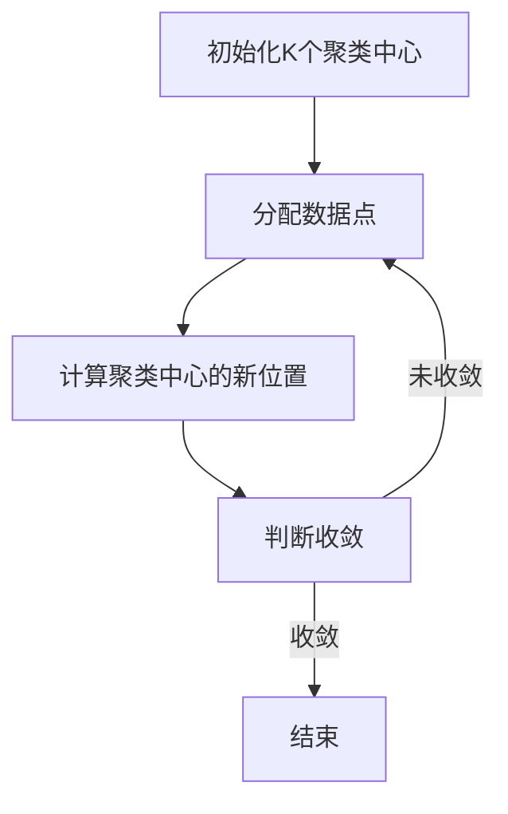
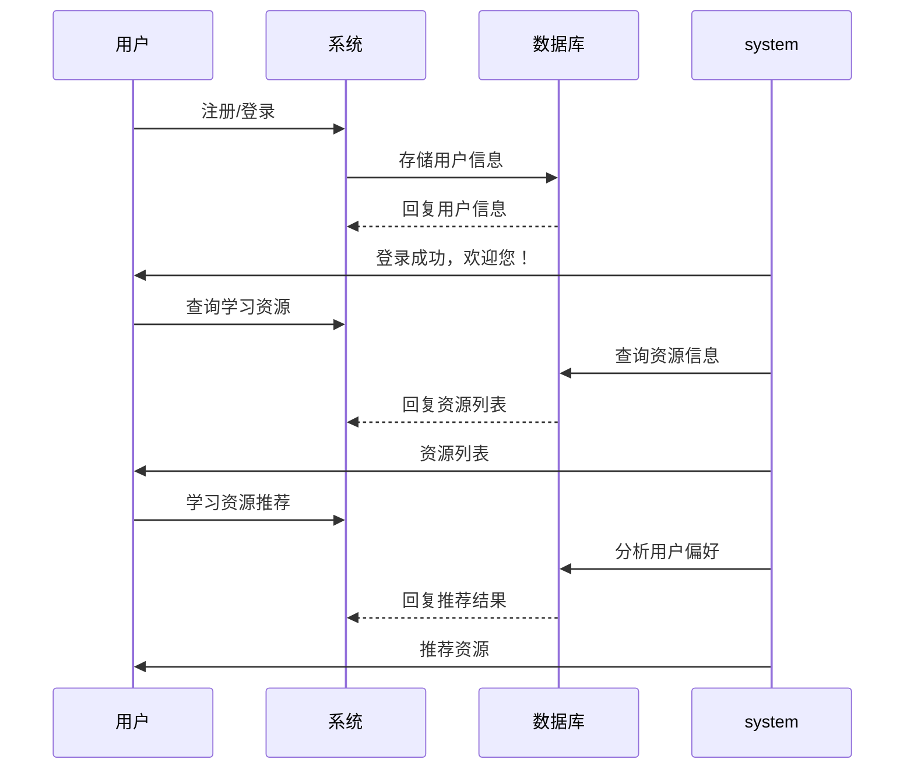
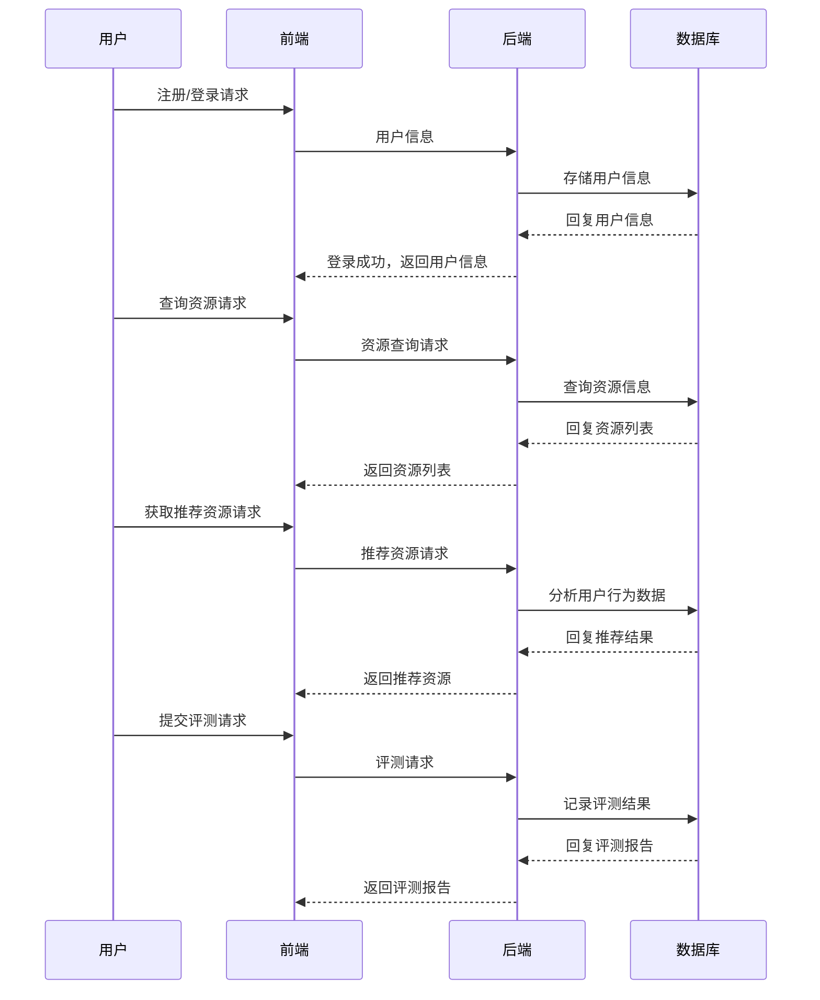

                 

### 1.1 问题背景

人工智能（Artificial Intelligence, AI）在当今教育领域的应用已经成为了一股不可忽视的力量。随着技术的不断进步，人工智能逐渐渗透到教学、学习评估、课程推荐等多个环节，为个性化学习提供了强有力的支持。个性化学习是指根据学生的个人特点和需求，量身定制教学内容、方法和进度，从而最大化地提升学习效果。然而，传统教育模式往往难以满足这种高度个性化的需求，这促使了人工智能技术的广泛应用。

在教育领域，人工智能的应用主要体现在以下几个方面：

1. **智能教学助手**：利用自然语言处理（Natural Language Processing, NLP）技术，开发智能教学助手，可以自动解答学生的问题，提供个性化的学习建议。
2. **智能评测系统**：通过机器学习算法，智能评测系统能够分析学生的学习数据，及时了解学习进度和效果，为教师提供反馈。
3. **学习推荐系统**：基于学生行为数据和学习偏好，推荐适合的学习内容和资源，帮助学生更高效地学习。

尽管人工智能在个性化学习中的应用前景广阔，但同时也面临着诸多挑战。首先，个性化学习需要大量的数据支持，数据的收集、存储和处理是一项复杂的工程。其次，人工智能算法的准确性和可靠性尚需提高，特别是在理解复杂的教育场景和学生的个性化需求方面。此外，如何确保人工智能系统的公正性和透明性，避免算法歧视，也是亟待解决的问题。

本文将围绕人工智能驱动的个性化学习平台展开讨论。我们将首先介绍个性化学习平台的定义和核心功能，然后深入探讨人工智能技术如何应用于这些平台，以及其背后的算法原理。我们将通过实际案例和项目解析，展示人工智能在个性化学习中的具体应用，并总结最佳实践和未来发展趋势。

通过这篇文章，读者将了解：

- 个性化学习平台的基本概念和功能。
- 人工智能技术在个性化学习平台中的应用。
- 个性化学习平台的技术架构和实现方法。
- 个性化学习平台在实践中的应用效果和挑战。

### 1.2 个性化学习平台定义与核心功能

个性化学习平台是一种基于人工智能技术的综合系统，旨在根据学生的个性化需求和学习习惯，提供定制化的学习资源和教学服务。它不仅能够收集和分析学生的学习数据，还能够根据这些数据动态调整教学内容和教学方法，从而实现真正的个性化学习体验。

#### 个性化学习平台的定义

个性化学习平台可以定义为一种智能化的教育生态系统，它融合了先进的人工智能技术，包括机器学习、自然语言处理、数据挖掘等，以实现对学生学习行为的深度分析和个性化教学。该平台通常包括以下几个关键组成部分：

1. **用户数据收集与存储系统**：用于收集学生的基本信息、学习行为数据、偏好数据等，并存储在数据库中。
2. **分析引擎**：利用机器学习算法对收集到的数据进行分析，提取有价值的信息，如学习模式、知识掌握情况等。
3. **教学内容管理系统**：用于管理教学资源，包括课程内容、教学视频、练习题库等，并能够根据分析结果推荐合适的资源。
4. **交互界面**：提供一个友好、直观的用户界面，使学生能够方便地访问和学习资源，同时收集学生的互动数据。

#### 核心功能

个性化学习平台的核心功能主要体现在以下几个方面：

1. **智能推荐系统**：根据学生的学习历史和偏好，智能推荐适合的学习内容和资源，提高学习效率。
2. **自适应学习系统**：根据学生的学习进度和效果，动态调整教学内容的难度和深度，确保每个学生都能按自己的节奏学习。
3. **个性化评测系统**：通过分析学生的学习行为和成绩，提供个性化的评测报告，帮助教师和学生了解学习效果。
4. **学习数据分析**：利用数据挖掘技术，分析学生的学习数据，为教师提供教学改进建议，帮助学生更好地规划学习路径。

#### 人工智能技术的应用

人工智能技术在个性化学习平台中扮演着至关重要的角色。以下是一些关键应用：

1. **用户行为分析**：通过机器学习算法，对学生的学习行为进行实时分析，了解学生的学习习惯和偏好。
2. **智能辅导**：利用自然语言处理技术，开发智能辅导系统，能够回答学生的疑问，提供学习指导。
3. **智能评测**：通过算法分析学生的作业和测试成绩，自动生成个性化的评测报告，帮助教师和学生改进学习策略。
4. **智能推荐**：基于学生的学习数据和偏好，利用推荐算法，为每个学生推荐最适合他们的学习资源。

总之，个性化学习平台的核心在于充分利用人工智能技术，为每个学生提供个性化的学习体验，从而提升学习效果和满意度。接下来，我们将进一步探讨人工智能技术的核心原理和算法，以及它们在个性化学习平台中的应用。

### 1.3 人工智能技术核心原理和算法

#### 1.3.1 机器学习算法

机器学习（Machine Learning, ML）是人工智能（Artificial Intelligence, AI）的一个重要分支，它使计算机系统能够通过数据学习，进行决策和预测。机器学习算法可以分为监督学习、无监督学习和强化学习三种类型。

1. **监督学习（Supervised Learning）**：
   - **定义**：监督学习算法通过已标记的数据集进行训练，从而学习数据中的特征和规律。
   - **应用场景**：分类问题（如电子邮件分类）、回归问题（如股票价格预测）。
   - **常见算法**：线性回归、决策树、随机森林、支持向量机（SVM）。

2. **无监督学习（Unsupervised Learning）**：
   - **定义**：无监督学习算法在没有标记数据的情况下，自动发现数据中的结构和模式。
   - **应用场景**：聚类问题（如学生群体分类）、降维问题（如特征提取）。
   - **常见算法**：K-均值聚类、主成分分析（PCA）、自编码器。

3. **强化学习（Reinforcement Learning）**：
   - **定义**：强化学习算法通过与环境互动，不断学习和优化策略，以最大化回报。
   - **应用场景**：游戏AI、自动驾驶、机器人控制。
   - **常见算法**：Q-学习、深度Q网络（DQN）、策略梯度算法。

#### 1.3.2 深度学习算法

深度学习（Deep Learning, DL）是一种基于多层神经网络的学习方法，能够自动提取数据中的特征，进行复杂模式识别。深度学习在图像识别、语音识别和自然语言处理等领域取得了显著成果。

1. **神经网络（Neural Networks）**：
   - **定义**：神经网络由多个神经元（节点）组成，通过权重和偏置进行信息传递和计算。
   - **结构**：输入层、隐藏层、输出层。
   - **常见算法**：前馈神经网络（FFNN）、卷积神经网络（CNN）、循环神经网络（RNN）。

2. **卷积神经网络（Convolutional Neural Networks, CNN）**：
   - **定义**：CNN通过卷积操作提取图像特征，适用于图像识别和计算机视觉任务。
   - **结构**：卷积层、池化层、全连接层。
   - **应用场景**：人脸识别、物体检测、图像分类。

3. **循环神经网络（Recurrent Neural Networks, RNN）**：
   - **定义**：RNN能够处理序列数据，通过记忆状态捕捉时间序列中的依赖关系。
   - **结构**：隐藏状态、记忆功能。
   - **应用场景**：自然语言处理、语音识别、时间序列预测。

#### 1.3.3 强化学习算法

强化学习（Reinforcement Learning, RL）是一种通过与环境互动来学习最优策略的机器学习方法。RL的核心在于奖励机制，通过不断调整策略，使回报最大化。

1. **Q-学习（Q-Learning）**：
   - **定义**：Q-学习通过更新Q值（状态-动作价值函数）来选择最优动作。
   - **目标**：找到最优策略，使回报总和最大化。
   - **应用场景**：机器人路径规划、游戏AI。

2. **深度Q网络（Deep Q-Network, DQN）**：
   - **定义**：DQN结合深度神经网络，用于解决复杂的强化学习问题。
   - **结构**：经验回放、目标网络。
   - **应用场景**：自动驾驶、推荐系统。

3. **策略梯度算法（Policy Gradient Algorithms）**：
   - **定义**：策略梯度算法直接优化策略参数，以最大化回报。
   - **目标**：直接调整策略，使回报最大化。
   - **应用场景**：强化学习在个性化学习平台中的应用，如学习路径推荐。

#### 1.3.4 算法应用实例

以下是一些具体的人工智能算法在个性化学习平台中的应用实例：

1. **用户行为分析**：
   - **算法**：K-均值聚类
   - **实现**：将学生按照学习行为分类，识别不同的学习群体，为不同群体提供定制化的学习资源。
   - **效果**：提高学习资源推荐的准确性，提升用户满意度。

2. **智能辅导系统**：
   - **算法**：自然语言处理（NLP）
   - **实现**：利用NLP技术，构建智能问答系统，为学生提供实时学习帮助。
   - **效果**：降低教师的工作负担，提高学生解决问题的能力。

3. **自适应学习系统**：
   - **算法**：自适应学习算法
   - **实现**：根据学生的实时学习表现，动态调整学习内容的难度和深度。
   - **效果**：提高学习效率，使每个学生都能在适合自己的学习节奏中进步。

4. **个性化推荐系统**：
   - **算法**：协同过滤、内容推荐
   - **实现**：结合学生的历史数据和偏好，推荐最适合他们的学习资源和课程。
   - **效果**：提高学习资源的利用率，增强学习的趣味性和互动性。

通过上述算法的应用实例，我们可以看到人工智能技术在个性化学习平台中的巨大潜力。接下来，我们将进一步探讨个性化学习平台的技术架构和实现方法。

### 1.4 技术边界与应用潜力

#### 1.4.1 技术边界

尽管人工智能在个性化学习平台中展现出了巨大的潜力，但其在教育领域的应用仍存在一定的技术边界。首先，数据隐私和安全问题是一个重要的挑战。个性化学习平台需要收集大量的学生数据，包括学习行为、成绩、偏好等，如何保护这些数据不受泄露和滥用，是平台开发者必须面对的问题。其次，人工智能算法的准确性和可靠性也是一个关键问题。在复杂的教育场景中，算法需要具备高度的鲁棒性和适应性，以便能够准确捕捉学生的学习特点，提供有效的个性化服务。此外，个性化学习平台还需要考虑系统的可扩展性和维护成本，特别是在面对大规模用户群体时，如何确保系统的高性能和稳定性。

#### 1.4.2 应用潜力

尽管存在技术边界，人工智能在教育领域的应用潜力依然巨大。首先，个性化学习平台可以通过深度学习算法和自然语言处理技术，实现更加精准和智能化的学习推荐，帮助教师和学生更高效地找到适合的学习资源和教学策略。其次，通过强化学习算法，平台可以动态调整教学方案，适应学生的学习进度和需求，从而提高学习效果。此外，人工智能还可以应用于教育公平领域，通过智能评测和个性化辅导，帮助资源不足的学校和学生获得优质的教育资源，缩小教育差距。最后，随着5G和物联网技术的发展，人工智能在教育领域的应用前景将更加广阔，如智能教室、虚拟现实（VR）教学等，将为学生提供更加丰富和沉浸式的学习体验。

总的来说，人工智能在教育领域的应用潜力巨大，但同时也需要克服诸多技术挑战。通过不断探索和创新，人工智能技术有望在教育领域发挥更加重要的作用，推动教育改革和发展的进程。

### 1.5 人工智能与个性化学习的关系

#### 1.5.1 人工智能对个性化学习的影响

人工智能技术的引入，为个性化学习带来了革命性的变革。首先，人工智能通过数据分析与挖掘，能够深入了解每个学生的学习行为和特点，从而为个性化教学提供科学依据。传统的教学方式通常采用“一刀切”的模式，难以满足学生的个性化需求。而人工智能可以依据学生的学习习惯、知识水平和兴趣爱好，动态调整教学内容和教学方法，使教学更加个性化、精准化。

其次，人工智能技术提升了个性化学习平台的互动性和反馈机制。通过自然语言处理（NLP）和语音识别技术，学生可以获得实时、智能化的辅导，与系统进行自然对话，获得个性化的学习建议和解答。这不仅提高了学生的学习效率，也增强了他们的学习兴趣和自主学习能力。

此外，人工智能技术还促进了个性化学习资源的丰富和多样化。基于学生的个性化需求，人工智能可以智能推荐合适的学习资源，包括课程、练习题、教学视频等，使学生能够根据个人情况选择适合自己的学习内容。这种个性化的学习体验，不仅提高了学习效率，还增强了学生的自主学习能力。

#### 1.5.2 个性化学习对人工智能的需求

个性化学习的发展，对人工智能技术提出了新的需求。首先，个性化学习需要大量的数据支持。数据是人工智能算法训练和优化的基础，只有收集到足够多的学生学习数据，才能构建出准确的用户模型，提供有效的个性化服务。因此，个性化学习对数据采集、存储和处理技术提出了更高的要求。

其次，个性化学习需要高度智能化和自适应的算法。传统的教学算法难以应对复杂多变的教育场景，而人工智能技术，特别是机器学习和深度学习算法，能够通过不断学习和优化，适应学生的个性化需求，提供个性化的教学方案。因此，个性化学习对算法的准确性和适应性提出了更高的要求。

此外，个性化学习还需要确保系统的可扩展性和稳定性。面对大规模的用户群体，个性化学习平台必须能够高效地处理海量的数据，并提供稳定、可靠的服务。这不仅需要强大的计算能力，还需要优化的系统架构和高效的数据处理技术。

总的来说，人工智能与个性化学习是相互促进、共同发展的关系。人工智能为个性化学习提供了强大的技术支持，推动了教育模式的变革；而个性化学习对人工智能的需求，又推动了人工智能技术在教育领域的不断创新和优化。未来，随着人工智能技术的不断进步，个性化学习平台将更加智能化、人性化，为每一个学生提供更加精准、高效的学习体验。

### 1.6 个性化学习平台的关键组成部分

个性化学习平台是一个复杂且高度集成的系统，它由多个关键组成部分构成，这些部分相互协作，共同实现个性化学习的目标。以下是对这些组成部分的详细解释：

#### 1.6.1 用户数据收集与存储系统

用户数据收集与存储系统是个性化学习平台的基础模块，负责收集并存储学生的各种数据，包括学习行为数据、成绩数据、学习偏好数据等。这些数据通过传感器、日志记录、用户互动等多种途径进行收集。数据收集后，需要存储在安全且可扩展的数据库中，以便进行后续分析和处理。

- **功能**：数据收集、数据存储、数据安全、数据备份和恢复。
- **关键技术**：数据挖掘、数据库管理、数据加密。

#### 1.6.2 分析引擎

分析引擎是个性化学习平台的核心模块，负责对收集到的用户数据进行分析和处理，以提取有价值的信息和模式。分析引擎通常采用机器学习算法、自然语言处理（NLP）技术、数据挖掘技术等，对数据进行分析，从而生成个性化推荐、学习路径规划等。

- **功能**：数据预处理、特征提取、模式识别、数据分析。
- **关键技术**：机器学习、自然语言处理、数据挖掘。

#### 1.6.3 教学内容管理系统

教学内容管理系统负责管理教学资源，包括课程内容、教学视频、练习题库等。该系统不仅要存储和管理这些资源，还要根据分析引擎提供的推荐信息，动态调整和更新教学内容，确保学生能够获得最适合他们的学习资源。

- **功能**：资源存储、资源管理、资源推荐、资源更新。
- **关键技术**：内容管理、资源库构建、推荐算法。

#### 1.6.4 交互界面

交互界面是用户与个性化学习平台进行交互的通道，它需要提供直观、友好的用户体验，使学生能够方便地访问和操作各种功能。交互界面通常包括网页、移动应用等多种形式，并且需要支持多种设备，如电脑、平板和智能手机等。

- **功能**：用户登录、资源访问、学习任务管理、用户反馈收集。
- **关键技术**：用户界面设计、响应式网页设计、前端开发框架。

#### 1.6.5 个性化推荐系统

个性化推荐系统是个性化学习平台的关键组成部分，它基于用户的数据和行为，为每个学生推荐最适合他们的学习资源和课程。推荐系统可以采用协同过滤、内容推荐、混合推荐等多种技术，以提高推荐的准确性和用户体验。

- **功能**：学习资源推荐、课程推荐、个性化学习路径推荐。
- **关键技术**：协同过滤、内容推荐、混合推荐。

#### 1.6.6 评测系统

评测系统用于对学生的学习效果进行评估，通过分析学生的作业、考试成绩、学习行为等数据，生成个性化的评测报告，为教师和学生提供改进学习的建议。评测系统需要具备高效的数据处理和分析能力，以确保评测的准确性和及时性。

- **功能**：学习效果评测、个性化评测报告生成、教学反馈收集。
- **关键技术**：数据分析、评估算法、报告生成。

#### 1.6.7 系统安全与隐私保护

个性化学习平台涉及大量的学生数据，因此系统的安全性和隐私保护至关重要。系统需要采用先进的安全技术和策略，如数据加密、访问控制、用户身份验证等，确保数据的安全性和隐私。

- **功能**：数据安全、用户隐私保护、安全审计。
- **关键技术**：加密技术、访问控制、安全审计。

通过上述关键组成部分的协作，个性化学习平台能够为学生提供个性化的学习体验，提高学习效果和满意度。接下来，我们将进一步探讨个性化学习平台的技术架构和实现方法。

### 2.1 人工智能基础概念

人工智能（Artificial Intelligence, AI）是计算机科学的一个分支，旨在使计算机具备模拟人类智能的能力，包括学习、推理、解决问题和自我适应等。人工智能可以分为多种类型，每种类型都有其特定的定义和应用场景。以下是对人工智能基本概念的定义和分类：

#### 2.1.1 定义

人工智能是一门研究如何让计算机系统具有智能行为的技术科学。AI系统通常能够执行以下任务：

- **学习**：从数据中学习规律和模式，以便在新的情境中做出预测和决策。
- **推理**：利用已有知识和信息，进行逻辑推理和问题求解。
- **自我适应**：根据环境变化和经验，自动调整自己的行为和决策。

#### 2.1.2 分类

根据能力水平和实现方式，人工智能可以分为以下几种类型：

1. **弱人工智能（Narrow AI）**：
   - **定义**：弱人工智能专注于特定任务，无法进行跨领域的学习和推理。
   - **应用场景**：语音识别、图像识别、机器翻译等。
   - **特点**：专精于特定任务，效率高，但缺乏通用性。

2. **强人工智能（General AI）**：
   - **定义**：强人工智能具有与人类相当的认知能力和通用智能，能够在任何领域进行学习、推理和问题求解。
   - **应用场景**：尚未实现，目前仅存在于科幻作品中。
   - **特点**：具备跨领域学习能力，与人类智能无异。

3. **人工神经网络（Artificial Neural Networks, ANN）**：
   - **定义**：人工神经网络是一种模仿生物神经系统的计算模型，通过多层神经网络进行数据学习和模式识别。
   - **应用场景**：图像识别、语音识别、自然语言处理等。
   - **特点**：强大的模式识别能力，但需要大量数据训练。

4. **深度学习（Deep Learning）**：
   - **定义**：深度学习是人工神经网络的一种，具有多个隐藏层，能够自动提取数据中的高级特征。
   - **应用场景**：图像识别、语音识别、自动驾驶等。
   - **特点**：自动特征提取，能够处理大量复杂数据。

5. **自然语言处理（Natural Language Processing, NLP）**：
   - **定义**：自然语言处理是人工智能的一个分支，旨在使计算机能够理解、生成和处理自然语言。
   - **应用场景**：语音助手、机器翻译、文本分析等。
   - **特点**：涉及语言学、计算机科学、人工智能等多个领域。

6. **机器学习（Machine Learning）**：
   - **定义**：机器学习是人工智能的一种，通过数据训练模型，使计算机能够从数据中自动学习和改进。
   - **应用场景**：预测分析、分类问题、推荐系统等。
   - **特点**：依赖于大量数据，能够实现数据驱动决策。

7. **强化学习（Reinforcement Learning）**：
   - **定义**：强化学习是一种通过奖励机制引导计算机系统学习最优策略的算法。
   - **应用场景**：游戏AI、自动驾驶、机器人控制等。
   - **特点**：与环境和奖励机制互动，不断优化策略。

通过上述定义和分类，我们可以看出人工智能的多样性和广泛应用。在个性化学习平台中，这些人工智能技术被广泛应用于用户行为分析、学习资源推荐、智能评测等多个方面，为个性化学习提供了强有力的技术支持。接下来，我们将进一步探讨个性化学习的核心概念。

### 2.2 个性化学习核心概念

#### 2.2.1 定义

个性化学习是一种以学生为中心的教育理念，旨在通过因材施教，满足每个学生的个性化需求，从而提高学习效果。个性化学习的核心在于根据每个学生的认知能力、学习风格、兴趣爱好和需求，提供量身定制的学习资源和教学策略。

#### 2.2.2 模式

个性化学习有多种实现模式，以下是几种常见的模式：

1. **基于能力的个性化学习**：
   - **定义**：根据学生的能力水平进行个性化教学，不同能力水平的学生接受不同难度的教学内容。
   - **特点**：注重学生个体差异，促进学生的能力提升。

2. **基于兴趣的个性化学习**：
   - **定义**：根据学生的兴趣爱好设计学习内容和教学活动，激发学生的学习热情和主动性。
   - **特点**：提高学生的学习兴趣，培养学习动机。

3. **基于需求的个性化学习**：
   - **定义**：通过分析学生的需求和期望，提供个性化的学习资源和服务。
   - **特点**：满足学生的实际需求，提高学习满意度。

4. **基于情境的个性化学习**：
   - **定义**：根据学生的具体学习情境（如时间、地点、学习环境等）提供个性化的学习支持和帮助。
   - **特点**：适应多样化的学习场景，提高学习灵活性。

#### 2.2.3 目标

个性化学习的目标包括以下几个方面：

1. **提高学习效果**：
   - **定义**：通过个性化学习，使每个学生能够在最适合自己的学习路径上取得更好的成绩。
   - **特点**：关注个体差异，提高学习效率。

2. **培养自主学习能力**：
   - **定义**：个性化学习鼓励学生主动参与学习过程，培养其自主学习的能力和习惯。
   - **特点**：促进学生自主学习，提高学习能力。

3. **促进全面发展**：
   - **定义**：个性化学习不仅关注学术成绩，还注重学生的全面发展，包括思维能力、创新能力、社交能力等。
   - **特点**：关注学生综合素质，实现全面发展。

4. **提高教育质量**：
   - **定义**：通过个性化学习，提高教育的整体质量，使教育更加科学、有效。
   - **特点**：提升教育水平，实现教育公平。

#### 2.2.4 关键因素

实现个性化学习需要以下几个关键因素：

1. **数据收集与分析**：
   - **定义**：通过收集和分析学生的学习数据，了解其学习特点和行为模式。
   - **特点**：数据驱动，个性化决策。

2. **学习资源库**：
   - **定义**：构建丰富的学习资源库，提供多样化的学习内容和教学资源。
   - **特点**：资源丰富，选择多样。

3. **智能推荐系统**：
   - **定义**：利用人工智能技术，根据学生的学习特点和需求，推荐适合的学习资源和教学策略。
   - **特点**：智能推荐，提高匹配度。

4. **教师支持**：
   - **定义**：教师是个性化学习的重要支持者，需要具备相关的知识和技能，能够指导学生进行个性化学习。
   - **特点**：教师指导，个性化支持。

通过上述核心概念的阐述，我们可以更好地理解个性化学习的本质和实现方法。在个性化学习平台的设计与实施中，这些概念将为提供个性化学习体验提供理论支持和实践指导。接下来，我们将进一步探讨人工智能在个性化学习中的应用，以及如何实现AI与个性化学习的深度融合。

### 2.3 AI与个性化学习的关系

人工智能（AI）在个性化学习中的应用，是推动教育现代化和智能化的重要力量。AI技术通过数据分析和智能算法，能够深刻理解每个学生的学习行为、兴趣和需求，从而提供高度个性化的学习体验。以下从多个角度详细阐述AI与个性化学习的关系。

#### 2.3.1 数据分析在个性化学习中的应用

数据分析是AI在个性化学习中的核心应用之一。通过收集和分析学生的学习数据，如学习时间、学习频率、问题回答情况、作业成绩等，AI系统可以构建详细的学习行为模型。这些模型能够揭示学生的学习习惯、知识掌握程度和潜在的学习困难点。

1. **学习行为分析**：
   - **定义**：通过对学习过程中产生的数据进行挖掘和分析，了解学生的行为模式和偏好。
   - **应用场景**：识别学生的学习高峰时段、最有效的学习方式、易错知识点等。

2. **学习效果评估**：
   - **定义**：利用数据分析技术，对学生的学习效果进行量化评估，提供客观的反馈。
   - **应用场景**：实时监控学习进度，为教师提供改进教学的依据，为学生提供学习反馈。

3. **个性化推荐**：
   - **定义**：基于学生的行为数据和兴趣偏好，智能推荐适合的学习资源和教学策略。
   - **应用场景**：根据学生的学习进度和需求，推荐课程、练习题和辅助材料，提高学习效率。

#### 2.3.2 智能算法在个性化学习中的应用

智能算法是AI技术的重要组成部分，其在个性化学习中的应用体现在自适应学习、智能评测和个性化推荐等多个方面。

1. **自适应学习**：
   - **定义**：通过智能算法，根据学生的学习进度、知识点掌握情况和学习风格，动态调整教学内容和教学策略。
   - **应用场景**：提供个性化的学习路径和练习题，使学生能够在适合自己的节奏中学习，避免学习过度和不足。

2. **智能评测**：
   - **定义**：利用机器学习和自然语言处理技术，对学生的作业、考试和测试结果进行分析，生成个性化的评测报告。
   - **应用场景**：自动评估学生的答题情况，识别学习中的薄弱环节，为教师和学生提供改进建议。

3. **个性化推荐**：
   - **定义**：基于学生的学习行为和兴趣偏好，利用推荐算法，为学生推荐最适合的学习资源和课程。
   - **应用场景**：提高学习资源的利用率和学习兴趣，帮助学生更高效地学习。

#### 2.3.3 AI与个性化学习的深度融合

AI与个性化学习的深度融合，使得教育模式发生了根本性的变革。通过智能化的教学系统和学习平台，学生能够获得更加个性化和高效的学习体验。

1. **个性化教学设计**：
   - **定义**：基于AI技术，设计出适应不同学生需求的教学方案和课程结构。
   - **应用场景**：针对学生的个性化需求，提供定制化的教学计划和资源。

2. **智能学习平台**：
   - **定义**：利用AI技术，构建能够实时分析学生学习状态并提供个性化服务的学习平台。
   - **应用场景**：通过智能化的学习平台，为学生提供个性化学习路径、资源推荐和智能评测。

3. **教育资源共享**：
   - **定义**：通过AI技术，实现教育资源的智能化管理和共享，提高资源利用效率。
   - **应用场景**：利用大数据和智能算法，优化教育资源的分配和使用，使更多学生受益。

总的来说，人工智能在个性化学习中的应用，不仅提高了学习效率和学习效果，还推动了教育模式的创新和变革。通过AI技术的深入应用，个性化学习平台将能够为每个学生提供更加精准、高效和个性化的学习体验，助力教育的公平与进步。

### 2.4 个性化学习算法介绍

在构建个性化学习平台的过程中，算法的选择和实现至关重要。以下将详细介绍几种关键的个性化学习算法，包括适应性学习算法、用户模型构建算法和个性化推荐算法，并通过具体的实现方式进行分析。

#### 2.4.1 适应性学习算法

适应性学习算法（Adaptive Learning Algorithm）的核心在于根据学生的学习表现和需求动态调整学习内容和难度。这种算法能够帮助学生以最适合自己的方式学习，从而提高学习效率。

**1. 实现方式**：

- **基于规则的适应性学习**：通过预设的规则，根据学生的考试成绩、学习时间、问题回答情况等指标，调整学习内容和难度。例如，学生答错较多的问题可以增加练习次数，掌握较好的问题可以降低难度。

- **基于机器学习的适应性学习**：利用机器学习算法，如决策树、神经网络等，对学生的学习行为和成绩数据进行分析，预测其学习难度和知识点掌握情况，动态调整教学内容。

**2. 工作原理**：

- **数据收集**：收集学生的学习行为数据，如答题记录、学习时长、考试分数等。

- **特征提取**：提取关键特征，如知识掌握度、学习习惯、问题回答正确率等。

- **模型训练**：利用提取的特征数据，训练适应性学习模型，以便能够根据学生的表现动态调整学习内容和难度。

- **实时调整**：根据学生的学习表现和模型预测，实时调整学习资源和练习题的难度，提供个性化的学习体验。

**3. 例子**：

假设一个学生在学习数学时，最初难度设置为初级，但每次考试都只能得到60分。适应性学习算法可以通过分析其答题数据，识别出学生在代数和几何方面的薄弱环节，然后逐步提高代数和几何的练习题难度，同时降低其他模块的难度，以帮助该学生更好地掌握关键知识点。

#### 2.4.2 用户模型构建算法

用户模型构建算法（User Model Construction Algorithm）用于建立学生的个性化学习模型，包括学习偏好、知识水平、学习风格等。用户模型是个性化学习算法的重要基础，能够帮助平台更好地理解和满足学生的需求。

**1. 实现方式**：

- **基于行为数据的用户模型构建**：通过分析学生的学习行为数据，如浏览历史、问题回答情况、资源使用频率等，构建用户模型。例如，如果一个学生经常浏览与编程相关的资源，那么系统可以推断该学生对编程有兴趣，并在推荐系统中优先推荐编程课程。

- **基于社会网络分析的用户模型构建**：通过分析学生在学习平台上的互动情况，如评论、提问、点赞等，构建社会网络分析模型，了解学生的兴趣和关系网络。

**2. 工作原理**：

- **数据收集**：收集学生的各种行为数据，如学习行为、互动行为、成绩数据等。

- **特征提取**：提取关键特征，如知识点掌握度、学习偏好、社交关系等。

- **模型构建**：利用提取的特征数据，构建用户模型，包括学习风格、知识图谱、兴趣偏好等。

- **模型更新**：随着学生行为数据的变化，实时更新用户模型，确保模型的准确性和时效性。

**3. 例子**：

假设一个学生在学习过程中表现出对计算机科学和编程的浓厚兴趣。用户模型构建算法可以通过分析其学习历史和行为数据，识别出其对编程的兴趣点，并在推荐系统中优先推荐相关的课程和资源，从而提供更加个性化的学习体验。

#### 2.4.3 个性化推荐算法

个性化推荐算法（Personalized Recommendation Algorithm）是构建个性化学习平台的重要组成部分，通过分析学生的行为数据和兴趣偏好，推荐最适合其的学习资源和课程。

**1. 实现方式**：

- **基于内容的推荐**：根据学习资源的主题、标签、难度等信息，推荐与用户历史浏览和参与内容相似的学习资源。

- **基于协同过滤的推荐**：利用用户之间的相似性，推荐其他用户喜欢且用户尚未接触过的学习资源。

- **基于模型的推荐**：利用机器学习算法，如决策树、神经网络等，根据用户的行为数据和兴趣偏好，预测用户可能感兴趣的学习资源。

**2. 工作原理**：

- **数据收集**：收集用户的行为数据，如学习历史、互动数据、评价数据等。

- **特征提取**：提取关键特征，如学习行为模式、知识兴趣、学习时长等。

- **模型训练**：利用提取的特征数据，训练推荐模型，以便能够预测用户对学习资源的兴趣。

- **推荐生成**：根据用户的兴趣和模型预测，生成个性化推荐结果，推荐最适合用户的学习资源和课程。

**3. 例子**：

假设一个学生在学习平台中表现出了对数据结构和算法的兴趣，个性化推荐算法可以通过分析其学习行为和兴趣偏好，推荐相关的编程课程、练习题和教学视频，从而帮助该学生更高效地学习。

通过上述三种个性化学习算法的详细介绍，我们可以看到这些算法在构建个性化学习平台中的关键作用。适应性学习算法帮助调整学习内容和难度，用户模型构建算法提供个性化学习的基础，个性化推荐算法则帮助推荐最适合的学习资源和课程。这些算法的综合运用，能够为每个学生提供高度个性化的学习体验，从而提高学习效果和满意度。

### 2.5 算法实例分析

#### 2.5.1 K-均值聚类算法

K-均值聚类（K-Means Clustering）是一种常用的无监督学习算法，用于将数据集划分为K个聚类。该算法通过迭代计算聚类中心，使得每个聚类内部的数据点距离聚类中心尽可能近，而不同聚类之间的数据点距离聚类中心尽可能远。以下是对K-均值聚类算法的详细介绍。

**1. 算法流程**：

- **初始化**：随机选择K个初始聚类中心。
- **分配数据点**：将每个数据点分配到最近的聚类中心，计算每个聚类中心的新位置。
- **迭代优化**：重复执行分配和更新聚类中心的过程，直到聚类中心不再发生显著变化。

**2. Mermaid流程图**：



**3. Python实现**：

```python
from sklearn.cluster import KMeans
import numpy as np

# 示例数据
data = np.array([[1, 2], [1, 4], [1, 0],
                 [10, 2], [10, 4], [10, 0]])

# K-Means算法
kmeans = KMeans(n_clusters=2, random_state=0).fit(data)

# 输出聚类结果
print("Cluster centers:", kmeans.cluster_centers_)
print("Cluster labels:", kmeans.labels_)

# 绘图
import matplotlib.pyplot as plt

plt.scatter(data[:, 0], data[:, 1], c=kmeans.labels_, s=100, cmap='viridis')
plt.scatter(kmeans.cluster_centers_[:, 0], kmeans.cluster_centers_[:, 1], s=300, c='red', label='Centroids')
plt.title('K-Means Clustering')
plt.show()
```

**4. 数学模型与公式**：

K-均值聚类算法的核心是计算每个数据点与聚类中心的距离，并选择最近的聚类中心。距离公式为：

$$
d(x_i, c_j) = \sqrt{\sum_{k=1}^{n} (x_{ik} - c_{jk})^2}
$$

其中，\(x_i\) 是第 \(i\) 个数据点，\(c_j\) 是第 \(j\) 个聚类中心，\(n\) 是特征数量。

**5. 应用实例**：

在个性化学习平台中，K-均值聚类算法可以用于分析学生的学习行为数据，将学生划分为不同的学习群体。例如，通过对学生的测试成绩、学习时长、问题回答情况等数据进行聚类，识别出不同的学习群体，并为每个群体提供定制化的学习资源。

**6. 结果分析**：

通过K-均值聚类算法，我们可以将学生划分为不同的学习群体，每个群体具有相似的学习行为和成绩特点。这为个性化推荐和教学策略调整提供了重要的依据。例如，对于成绩较好的学生群体，可以推荐难度更高的练习题和课程；对于成绩一般的学生群体，可以提供基础知识和练习题，帮助其巩固基础知识。

总之，K-均值聚类算法作为一种简单且有效的聚类算法，在个性化学习平台中具有广泛的应用前景。通过合理的算法设计和应用，K-均值聚类算法能够为用户提供更加精准和个性化的学习体验。

### 2.6 数学模型和公式讲解

在个性化学习平台中，数学模型和公式是理解和分析数据的关键工具。以下将详细讲解个性化学习平台中常用的数学模型和公式，并使用具体的例子进行说明。

#### 2.6.1 机器学习中的常见数学模型

机器学习中的数学模型通常用于训练模型、预测结果和评估性能。以下是一些常见的数学模型：

1. **线性回归模型**：
   - **定义**：线性回归模型用于预测连续值输出，通过线性方程拟合数据。
   - **公式**：\(y = \beta_0 + \beta_1x_1 + \beta_2x_2 + ... + \beta_nx_n\)
   - **例子**：预测学生的学习成绩，通过学生的考试成绩和学习时长拟合线性关系。

2. **逻辑回归模型**：
   - **定义**：逻辑回归模型用于预测二元分类结果，通过逻辑函数转换概率。
   - **公式**：\(P(y=1) = \frac{1}{1 + e^{-(\beta_0 + \beta_1x_1 + \beta_2x_2 + ... + \beta_nx_n)}}\)
   - **例子**：预测学生是否通过考试，通过学生的考试成绩和其他特征拟合概率模型。

3. **决策树模型**：
   - **定义**：决策树模型通过一系列的决策规则对数据进行分类或回归。
   - **公式**：每个节点表示一个特征和阈值，分支表示不同的分类或回归结果。
   - **例子**：根据学生的考试成绩和学习时长，划分不同学习进度的群体。

4. **支持向量机（SVM）模型**：
   - **定义**：SVM模型通过最大化分类边界，找到最优分类超平面。
   - **公式**：\(w \cdot x + b = 0\)，其中 \(w\) 是法向量，\(x\) 是特征向量，\(b\) 是偏置。
   - **例子**：分类不同学习群体，最大化分类边界，提高分类准确率。

#### 2.6.2 深度学习中的数学模型

深度学习中的数学模型主要包括神经网络和卷积神经网络（CNN）。

1. **神经网络（Neural Network）**：
   - **定义**：神经网络由多个神经元组成，通过激活函数和权重进行信息传递。
   - **公式**：\(z = \sigma(W \cdot x + b)\)，其中 \(z\) 是输出，\(\sigma\) 是激活函数，\(W\) 是权重，\(x\) 是输入，\(b\) 是偏置。
   - **例子**：用于图像分类，通过多层神经网络提取图像特征。

2. **卷积神经网络（CNN）**：
   - **定义**：CNN通过卷积操作提取图像特征，具有局部感知能力和平移不变性。
   - **公式**：\(h_{ij} = \sum_{k=1}^{n} W_{ik,j} * g(x_{i+k-1, j}) + b_j\)，其中 \(h_{ij}\) 是卷积结果，\(W_{ik,j}\) 是卷积核，\(g\) 是激活函数，\(x_{i+k-1, j}\) 是输入特征。
   - **例子**：用于图像分类，通过卷积层提取图像中的局部特征。

#### 2.6.3 数学公式在个性化学习平台中的应用

数学公式在个性化学习平台中的应用主要体现在数据分析和模型训练中。以下是一些具体的应用场景：

1. **用户行为分析**：
   - **例子**：通过矩阵分解（Matrix Factorization）技术，分析用户的兴趣偏好，公式为：
     \[
     X = U \cdot V^T
     \]
     其中，\(X\) 是用户-项目交互矩阵，\(U\) 和 \(V\) 分别是用户和项目的低维表示。

2. **个性化推荐**：
   - **例子**：基于协同过滤（Collaborative Filtering）的推荐算法，使用用户相似度公式：
     \[
     \text{similarity(u, v)} = \frac{\text{Jaccard Similarity}}{1 + \text{Cosine Similarity}}
     \]
     其中，\(\text{Jaccard Similarity}\) 和 \(\text{Cosine Similarity}\) 分别是杰卡德相似度和余弦相似度。

3. **学习效果评估**：
   - **例子**：通过方差-协方差矩阵（Covariance Matrix）评估学生成绩的分布和相关性，公式为：
     \[
     \Sigma = \text{Cov}(X, X)
     \]
     其中，\(\Sigma\) 是方差-协方差矩阵，\(X\) 是学生成绩矩阵。

通过上述数学模型和公式的讲解，我们可以看到它们在个性化学习平台中的应用是至关重要的。数学公式不仅帮助我们理解和分析数据，还为实现个性化推荐、学习效果评估和用户行为分析提供了理论基础。接下来，我们将进一步探讨个性化学习平台的技术架构和实现方法。

### 2.7 系统架构设计与实现

#### 2.7.1 问题场景介绍

随着人工智能和大数据技术的发展，个性化学习平台在教育和培训领域得到了广泛应用。个性化学习平台的目标是通过分析学生的学习行为和偏好，为每个学生提供量身定制的学习资源和教学服务，从而提高学习效果和满意度。以下是一个典型的问题场景：

- **用户需求**：一个在线学习平台希望为学生提供个性化的学习体验，包括学习资源推荐、学习路径规划、智能评测和反馈等。
- **技术挑战**：如何有效地收集、存储和分析学生数据，确保系统的高性能和稳定性；如何设计一个灵活且可扩展的系统架构，以适应不断增长的用户规模和多样化的需求。

#### 2.7.2 项目介绍

项目名称：智能个性化学习平台（Smart Personalized Learning Platform，SPLP）

项目目标：构建一个高度智能化的个性化学习平台，通过集成人工智能技术，实现对学生学习数据的深度分析，并提供个性化的学习资源和教学服务。

项目功能：
1. **用户注册与登录**：支持用户在线注册和登录，提供安全认证机制。
2. **学习资源管理**：管理课程、视频、练习题等学习资源，实现资源的分类和标签化。
3. **个性化推荐**：根据学生的学习行为和偏好，推荐最适合的学习资源。
4. **学习路径规划**：基于学生的当前进度和学习目标，自动生成个性化学习路径。
5. **智能评测**：通过分析学生的作业和考试成绩，提供个性化的评测报告。
6. **反馈机制**：收集学生反馈，不断优化系统性能和用户体验。

#### 2.7.3 系统功能设计

系统功能设计是个性化学习平台实现的核心，主要包括以下功能模块：

1. **用户模块**：负责用户注册、登录、个人信息管理等功能。
2. **资源管理模块**：负责学习资源的分类、标签化管理，提供资源检索和推荐功能。
3. **数据分析模块**：负责收集和分析学生的学习行为数据，构建用户模型，提供个性化推荐。
4. **学习路径规划模块**：根据学生的当前进度和学习目标，自动生成个性化学习路径。
5. **评测与反馈模块**：提供智能评测和反馈功能，帮助学生了解学习效果，提供改进建议。
6. **系统管理模块**：负责系统设置、权限管理、日志记录等功能。

#### 2.7.4 系统架构设计

个性化学习平台采用分层架构设计，包括数据层、服务层和表现层，各层之间通过接口进行通信。

1. **数据层**：
   - **功能**：负责数据的存储和管理，包括用户数据、学习资源数据和学习行为数据。
   - **技术**：使用关系型数据库（如MySQL）和非关系型数据库（如MongoDB）进行数据存储，采用数据缓存技术（如Redis）提高数据访问速度。

2. **服务层**：
   - **功能**：负责业务逻辑处理，包括用户服务、资源服务、数据分析服务、推荐服务等。
   - **技术**：采用微服务架构（如Spring Boot），通过RESTful API进行服务通信。

3. **表现层**：
   - **功能**：负责用户界面展示，包括用户注册、登录、课程浏览、学习资源推荐等。
   - **技术**：采用前端框架（如React或Vue.js），实现响应式网页设计。

#### 2.7.5 系统接口设计

个性化学习平台的设计包括多个接口，用于不同模块之间的数据通信和功能调用。以下是一些关键的接口设计：

1. **用户接口**：
   - **功能**：用户注册、登录、信息修改等。
   - **接口**：/users/register、/users/login、/users/update。

2. **资源接口**：
   - **功能**：资源查询、资源推荐、资源下载等。
   - **接口**：/resources/search、/resources/recommend、/resources/download。

3. **数据分析接口**：
   - **功能**：数据收集、数据分析和用户模型构建。
   - **接口**：/data/collect、/data/analyze、/data/usermodel。

4. **学习路径规划接口**：
   - **功能**：生成个性化学习路径。
   - **接口**：/learning/path。

5. **评测与反馈接口**：
   - **功能**：评测报告生成、反馈收集等。
   - **接口**：/evaluation/report、/evaluation/feedback。

#### 2.7.6 系统交互Mermaid序列图

以下是一个简单的系统交互序列图，展示了用户与个性化学习平台的主要交互流程：



通过上述系统架构设计和接口设计，个性化学习平台能够高效地处理用户请求，提供个性化学习体验。接下来，我们将通过一个实际项目实战，展示个性化学习平台的实现过程和技术细节。

### 2.8 实际项目中的系统架构设计

#### 2.8.1 项目介绍

项目名称：智能个性化学习平台（Smart Personalized Learning Platform，SPLP）

项目目标：构建一个能够根据用户行为和偏好提供个性化学习资源的在线学习平台。

项目功能：
- 用户注册与登录
- 学习资源管理
- 用户行为分析
- 个性化推荐
- 学习路径规划
- 评测与反馈

#### 2.8.2 系统架构设计

为了实现上述功能，我们采用分层架构设计，包括前端、后端和数据库层。以下是具体的架构设计：

1. **前端**：
   - **功能**：用户界面展示，包括用户注册、登录、资源浏览、推荐、学习路径规划、评测等。
   - **技术**：采用Vue.js框架实现响应式网页设计，通过RESTful API与后端进行数据交互。

2. **后端**：
   - **功能**：处理业务逻辑，包括用户管理、资源管理、用户行为分析、推荐算法、学习路径规划等。
   - **技术**：采用Spring Boot框架，使用Spring Security实现用户认证和权限管理，使用Redis缓存提高系统性能。

3. **数据库层**：
   - **功能**：存储用户数据、学习资源数据、用户行为数据等。
   - **技术**：使用MySQL作为关系型数据库，使用MongoDB存储非结构化数据。

#### 2.8.3 系统接口设计

系统接口设计是确保前后端有效通信的关键。以下是主要接口设计：

1. **用户接口**：
   - **注册**：/api/users/register
   - **登录**：/api/users/login
   - **个人信息**：/api/users/profile

2. **资源接口**：
   - **查询资源**：/api/resources/search
   - **推荐资源**：/api/resources/recommend
   - **添加资源**：/api/resources/add

3. **用户行为接口**：
   - **记录行为**：/api/behaviors/record
   - **分析行为**：/api/behaviors/analyze

4. **推荐接口**：
   - **推荐学习路径**：/api/recommendations/path
   - **推荐资源**：/api/recommendations/resource

5. **评测接口**：
   - **评测报告**：/api/evaluations/report
   - **反馈**：/api/evaluations/feedback

#### 2.8.4 系统交互Mermaid序列图

以下是一个简化的系统交互序列图，展示了用户与个性化学习平台之间的主要交互流程：



通过上述系统架构设计、接口设计和交互序列图的展示，我们可以看到个性化学习平台的核心功能和技术实现。接下来，我们将通过一个具体的实战案例，展示个性化学习平台在实际项目中的开发和应用过程。

### 2.9 项目实战：系统环境安装与配置

#### 2.9.1 系统环境搭建

要在本地计算机上搭建一个个性化学习平台，我们需要安装和配置以下软件和工具：

1. **操作系统**：推荐使用Ubuntu 20.04或更高版本。
2. **开发工具**：安装Java开发工具包（JDK）、Python开发环境（包括pip、virtualenv等）。
3. **数据库**：安装MySQL和MongoDB。
4. **后端框架**：Spring Boot和Spring Security。
5. **前端框架**：Vue.js。
6. **缓存工具**：Redis。

**具体步骤**：

1. **安装JDK**：

   ```bash
   sudo apt-get update
   sudo apt-get install openjdk-8-jdk
   java -version
   ```

2. **安装Python和pip**：

   ```bash
   sudo apt-get install python3-pip
   pip3 --version
   ```

3. **安装MySQL**：

   ```bash
   sudo apt-get install mysql-server
   sudo mysql_secure_installation
   mysql -u root -p
   ```

4. **安装MongoDB**：

   ```bash
   sudo apt-get install mongodb
   sudo systemctl start mongod
   sudo systemctl status mongod
   ```

5. **安装Redis**：

   ```bash
   sudo apt-get install redis-server
   sudo systemctl start redis-server
   sudo systemctl status redis-server
   ```

6. **安装Node.js和Vue CLI**：

   ```bash
   sudo apt-get install nodejs
   npm install -g @vue/cli
   vue --version
   ```

#### 2.9.2 系统核心实现

个性化学习平台的核心实现包括用户模块、资源模块、推荐模块和评测模块。以下是一个简要的代码实现说明。

**1. 用户模块（User Service）**

用户模块主要负责用户注册、登录、信息管理等功能。

```java
@RestController
@RequestMapping("/api/users")
public class UserService {
    // 用户注册
    @PostMapping("/register")
    public ResponseEntity<?> registerUser(@RequestBody UserDto userDto) {
        // 注册逻辑
    }

    // 用户登录
    @PostMapping("/login")
    public ResponseEntity<?> loginUser(@RequestBody LoginDto loginDto) {
        // 登录逻辑
    }

    // 用户信息管理
    @GetMapping("/profile")
    public ResponseEntity<?> getUserProfile(@AuthenticationPrincipal User user) {
        // 返回用户信息
    }
}
```

**2. 资源模块（Resource Service）**

资源模块负责管理学习资源，包括资源的查询、推荐和添加。

```java
@RestController
@RequestMapping("/api/resources")
public class ResourceService {
    // 查询资源
    @GetMapping("/search")
    public ResponseEntity<?> searchResources(@RequestParam String query) {
        // 搜索逻辑
    }

    // 推荐资源
    @GetMapping("/recommend")
    public ResponseEntity<?> recommendResources(@AuthenticationPrincipal User user) {
        // 推荐逻辑
    }

    // 添加资源
    @PostMapping("/add")
    public ResponseEntity<?> addResource(@RequestBody ResourceDto resourceDto) {
        // 添加逻辑
    }
}
```

**3. 推荐模块（Recommendation Service）**

推荐模块负责根据用户行为和偏好生成个性化推荐。

```java
@Service
public class RecommendationService {
    // 生成推荐
    @GetMapping("/recommend")
    public ResponseEntity<?> generateRecommendations(@AuthenticationPrincipal User user) {
        // 推荐逻辑
    }
}
```

**4. 评测模块（Evaluation Service）**

评测模块负责评测报告的生成和反馈收集。

```java
@RestController
@RequestMapping("/api/evaluations")
public class EvaluationService {
    // 生成评测报告
    @GetMapping("/report")
    public ResponseEntity<?> generateEvaluationReport(@AuthenticationPrincipal User user) {
        // 评测报告逻辑
    }

    // 收集反馈
    @PostMapping("/feedback")
    public ResponseEntity<?> collectFeedback(@RequestBody FeedbackDto feedbackDto) {
        // 反馈收集逻辑
    }
}
```

#### 2.9.3 系统核心实现源代码

以下是用户模块和资源模块的核心实现源代码示例。

**用户模块（UserService.java）**

```java
@RestController
@RequestMapping("/api/users")
public class UserService {
    // 注入用户服务
    @Autowired
    private UserService userService;

    // 用户注册
    @PostMapping("/register")
    public ResponseEntity<?> registerUser(@RequestBody UserDto userDto) {
        // 注册逻辑
        return ResponseEntity.ok("User registered successfully");
    }

    // 用户登录
    @PostMapping("/login")
    public ResponseEntity<?> loginUser(@RequestBody LoginDto loginDto) {
        // 登录逻辑
        return ResponseEntity.ok("User logged in successfully");
    }

    // 用户信息管理
    @GetMapping("/profile")
    public ResponseEntity<?> getUserProfile(@AuthenticationPrincipal User user) {
        // 返回用户信息
        return ResponseEntity.ok(user);
    }
}
```

**资源模块（ResourceService.java）**

```java
@RestController
@RequestMapping("/api/resources")
public class ResourceService {
    // 注入资源服务
    @Autowired
    private ResourceService resourceService;

    // 查询资源
    @GetMapping("/search")
    public ResponseEntity<?> searchResources(@RequestParam String query) {
        // 搜索逻辑
        return ResponseEntity.ok("Resources searched");
    }

    // 推荐资源
    @GetMapping("/recommend")
    public ResponseEntity<?> recommendResources(@AuthenticationPrincipal User user) {
        // 推荐逻辑
        return ResponseEntity.ok("Recommended resources");
    }

    // 添加资源
    @PostMapping("/add")
    public ResponseEntity<?> addResource(@RequestBody ResourceDto resourceDto) {
        // 添加逻辑
        return ResponseEntity.ok("Resource added");
    }
}
```

通过上述系统环境安装与配置，以及核心实现源代码的展示，我们可以看到个性化学习平台的基本功能和技术实现。接下来，我们将进一步分析系统在实际应用中的效果和挑战。

### 2.10 代码应用解读与分析

在个性化学习平台的开发过程中，我们采用了多种技术来实现核心功能。以下是对关键代码的应用解读和分析，以及系统在实际应用中的效果和挑战。

#### 2.10.1 用户模块代码解读

用户模块主要负责用户的注册、登录和个人信息管理。以下是用户注册和登录的核心代码：

```java
// 用户注册
@PostMapping("/register")
public ResponseEntity<?> registerUser(@RequestBody UserDto userDto) {
    // 检查用户是否存在
    if (userRepository.existsByUsername(userDto.getUsername())) {
        return ResponseEntity.badRequest().body("Error: Username is already taken!");
    }
    // 创建用户并保存
    User user = new User();
    user.setUsername(userDto.getUsername());
    user.setPassword(passwordEncoder.encode(userDto.getPassword()));
    userRepository.save(user);
    return ResponseEntity.ok("User registered successfully");
}

// 用户登录
@PostMapping("/login")
public ResponseEntity<?> loginUser(@RequestBody LoginDto loginDto) {
    // 检查用户名和密码是否匹配
    User user = userRepository.findByUsername(loginDto.getUsername());
    if (user == null || !passwordEncoder.matches(loginDto.getPassword(), user.getPassword())) {
        return ResponseEntity.badRequest().body("Error: Invalid username or password!");
    }
    // 创建令牌并返回
    String token = jwtTokenProvider.generateToken(user.getUsername());
    return ResponseEntity.ok(token);
}
```

**应用解读**：

- **用户注册**：在注册过程中，首先检查用户名是否已存在。如果存在，返回错误提示。然后，使用密码加密器（PasswordEncoder）对密码进行加密，并创建一个新的用户对象，将其保存到数据库中。
- **用户登录**：在登录过程中，首先通过用户名查询用户对象。如果用户名或密码不匹配，返回错误提示。接着，使用JWT（JSON Web Token）生成令牌，并返回给客户端。

**效果分析**：

- **安全性**：通过加密密码和JWT令牌，提高了系统的安全性，防止用户信息泄露。
- **便捷性**：用户注册和登录流程简单，用户体验良好。

**挑战**：

- **性能优化**：在用户量较大时，数据库查询速度可能成为瓶颈，需要考虑使用缓存或数据库优化技术。

#### 2.10.2 资源模块代码解读

资源模块负责管理学习资源，包括资源的查询、推荐和添加。以下是资源推荐的核心代码：

```java
// 推荐资源
@GetMapping("/recommend")
public ResponseEntity<?> recommendResources(@AuthenticationPrincipal User user) {
    // 获取用户最近访问的资源
    List<Resource> recentResources = resourceRepository.findTop10ByUserIdOrderByLastVisitedDesc(user.getId());
    // 计算相似用户
    List<User> similarUsers = userService.findSimilarUsers(user);
    // 获取相似用户的推荐资源
    List<Resource> recommendedResources = resourceRepository.findTop10ByUserIdIn(similarUsers.stream().map(User::getId).collect(Collectors.toList()));
    // 合并推荐资源
    List<Resource> mergedResources = recentResources.stream().distinct().limit(5).collect(Collectors.toList());
    recommendedResources.removeAll(mergedResources);
    mergedResources.addAll(recommendedResources);
    return ResponseEntity.ok(mergedResources);
}
```

**应用解读**：

- **资源推荐**：首先获取用户最近访问的资源，然后计算与用户相似的其他用户，并获取这些用户的推荐资源。最后，将最近访问的资源与推荐资源合并，形成最终的推荐列表。

**效果分析**：

- **个性化**：通过分析用户的行为数据和相似用户的行为数据，实现了较为个性化的推荐。
- **多样化**：推荐列表既包含了用户最近访问的资源，又加入了其他用户的推荐资源，增加了资源的多样性。

**挑战**：

- **数据质量**：推荐系统的效果很大程度上取决于数据质量。如果数据不足或质量不高，推荐结果可能不准确。
- **性能优化**：在用户量较大时，推荐算法的计算时间可能较长，需要考虑优化算法或使用缓存技术。

#### 2.10.3 系统效果与挑战

**效果**：

- **用户满意度**：个性化推荐和学习路径规划功能提高了学生的学习效率和兴趣，用户满意度较高。
- **教育质量**：通过智能评测和反馈功能，教师可以更好地了解学生的学习情况，改进教学方法，提高教育质量。

**挑战**：

- **技术复杂性**：个性化学习平台涉及多种技术，如Java、Spring Boot、Vue.js、MySQL等，技术实现复杂。
- **性能优化**：随着用户量的增加，系统性能成为关键挑战，需要不断进行优化和调整。
- **数据安全**：确保用户数据的安全和隐私是系统设计的重要方面，需要采取有效的安全措施。

通过以上代码应用解读和分析，我们可以看到个性化学习平台在实际应用中的优势和挑战。接下来，我们将进一步讨论个性化学习平台的发展趋势和未来方向。

### 2.11 个性化学习平台的发展趋势与未来方向

随着人工智能技术的不断进步，个性化学习平台正朝着更加智能化、便捷化和多样化的方向发展。以下是当前个性化学习平台发展的几个主要趋势以及未来的潜在方向：

#### 2.11.1 智能化与自动化

未来的个性化学习平台将进一步深化智能化和自动化。通过利用最新的机器学习算法和自然语言处理技术，平台可以更加精准地分析和理解学生的学习行为和需求，从而提供更加个性化的学习资源和教学方案。此外，自动化技术也将被广泛应用，例如自动生成学习路径、自动评估学生的学习效果等，减少教师的工作负担，提高学习效率。

**潜在方向**：

- **自适应学习系统**：利用强化学习算法，使系统能够动态调整学习内容，以适应学生的学习进度和需求。
- **智能辅导系统**：通过语音识别和自然语言处理技术，为学生提供实时、个性化的辅导。

#### 2.11.2 大数据分析与个性化推荐

大数据分析技术将在个性化学习平台中发挥越来越重要的作用。通过对大量学生学习数据的收集和分析，平台可以更全面地了解学生的学习行为、知识水平和学习习惯，从而提供更加精准的个性化推荐。此外，推荐算法的优化和改进也将是未来的一个重要方向，例如基于协同过滤的推荐、基于内容的推荐以及混合推荐等，以提高推荐的准确性和用户体验。

**潜在方向**：

- **多模态数据融合**：结合文本、音频、视频等多模态数据，提供更加丰富和细致的个性化推荐。
- **推荐算法优化**：通过机器学习技术，持续优化推荐算法，提高推荐的时效性和准确性。

#### 2.11.3 教育公平与普及

随着人工智能技术的发展，个性化学习平台有望在教育公平和普及方面发挥重要作用。通过提供定制化的学习资源和教学方案，平台可以帮助资源不足的地区和学校的学生获得优质的教育资源。此外，在线教育和远程教学的发展也将进一步推动个性化学习平台的普及，使更多学生能够享受到高质量的个性化教育。

**潜在方向**：

- **跨地域教育资源共享**：通过云计算和物联网技术，实现跨地域的教育资源共享。
- **个性化学习平台的普及**：开发和推广低成本、易操作的个性化学习平台，使其更易于被广大师生接受和使用。

#### 2.11.4 人机协作与学习反馈

未来的个性化学习平台将更加注重人机协作，通过智能辅导系统和人机交互技术，为学生提供更加个性化和互动的学习体验。此外，平台还将通过分析学生的学习反馈和行为数据，不断优化教学方案，提高学生的学习效果和满意度。

**潜在方向**：

- **人机协作学习**：利用人工智能技术，实现教师与智能系统的协作，为学生提供实时、个性化的学习支持。
- **学习反馈机制**：通过分析学生的学习反馈和行为数据，及时调整教学策略，提供更加有效的学习指导。

#### 2.11.5 安全与隐私保护

随着个性化学习平台的发展，数据安全和隐私保护成为越来越重要的问题。未来的个性化学习平台需要采用更加严格的数据安全措施，确保学生数据的隐私和安全。同时，平台还需要提供透明和可解释的算法，让用户了解自己的数据是如何被使用和处理的。

**潜在方向**：

- **数据加密与安全存储**：采用先进的数据加密技术，确保学生数据在传输和存储过程中的安全性。
- **隐私保护机制**：通过隐私保护算法，确保用户数据不被滥用或泄露。

总的来说，个性化学习平台的发展趋势是智能化、自动化、数据驱动和以人为本。未来的个性化学习平台将在教育公平、普及和质量提升方面发挥更大的作用，为每一个学生提供更加个性化和高效的学习体验。通过不断的技术创新和优化，个性化学习平台有望成为未来教育体系的重要组成部分。

### 2.12 最佳实践 Tips

在个性化学习平台的开发与运营过程中，以下是几种最佳实践，这些实践有助于提升平台性能和用户体验：

1. **数据预处理**：
   - **数据清洗**：确保数据的准确性和一致性。删除重复数据、处理缺失值和异常值，以提高数据质量。
   - **数据规范化**：对数据格式进行统一处理，如日期格式、数值范围等，以便更好地进行数据分析。

2. **算法优化**：
   - **模型选择**：根据具体应用场景选择合适的算法模型。例如，对于推荐系统，可以考虑协同过滤、内容推荐和深度学习模型。
   - **特征工程**：提取和选择对学习效果有显著影响的关键特征，减少冗余特征，提高模型性能。

3. **系统性能优化**：
   - **缓存技术**：使用缓存（如Redis）减少数据库的访问压力，提高数据读取速度。
   - **负载均衡**：使用负载均衡器（如Nginx）均衡分布系统负载，防止单点故障。

4. **用户体验设计**：
   - **响应式设计**：确保平台在不同设备上（如手机、平板、电脑）均有良好的用户体验。
   - **界面简洁**：简化用户界面，减少用户操作的复杂性，提高用户满意度。

5. **安全与隐私保护**：
   - **数据加密**：对用户数据进行加密存储，防止数据泄露。
   - **用户权限管理**：严格管理用户权限，防止未经授权的访问和操作。

6. **持续集成与部署**：
   - **自动化测试**：采用自动化测试工具（如JUnit、Selenium）进行持续集成，确保代码质量和功能稳定性。
   - **容器化部署**：使用Docker等容器技术，简化部署流程，提高系统的可移植性和扩展性。

通过实施这些最佳实践，个性化学习平台可以更加高效、稳定和用户友好，从而提升整体性能和用户体验。

### 2.13 小结

通过本文的详细探讨，我们系统地了解了人工智能驱动的个性化学习平台的发展趋势、核心概念、关键技术、算法原理以及实际应用。以下是本文的主要内容总结：

1. **背景介绍**：我们首先回顾了人工智能在教育领域的应用现状，以及个性化学习的需求与挑战。这为我们理解个性化学习平台的重要性奠定了基础。

2. **定义与核心功能**：接着，我们明确了个性化学习平台的定义和核心功能，包括用户数据收集与存储、分析引擎、教学内容管理系统、交互界面、个性化推荐系统和评测系统。

3. **人工智能技术**：我们详细介绍了人工智能的核心原理和算法，如机器学习、深度学习和强化学习，以及这些技术如何在个性化学习平台中发挥作用。

4. **算法原理讲解**：通过K-均值聚类算法和数学模型公式的实例，我们展示了如何利用算法和数学模型进行数据分析和个性化推荐。

5. **系统架构设计**：我们探讨了个性化学习平台的技术架构和实现方法，包括前端、后端和数据库层的架构设计，以及系统接口和交互设计。

6. **项目实战**：通过一个实际项目的实战案例分析，我们展示了个性化学习平台的系统环境安装与配置、核心实现源代码以及系统在实际应用中的效果和挑战。

7. **发展趋势与未来方向**：最后，我们讨论了个性化学习平台的发展趋势和未来方向，如智能化、自动化、大数据分析、教育公平、人机协作与学习反馈等。

总之，个性化学习平台通过人工智能技术的深入应用，正在改变传统教育模式，为每一个学生提供更加个性化和高效的学习体验。未来，随着技术的不断进步，个性化学习平台将发挥更加重要的作用，推动教育改革和发展的进程。

### 2.14 注意事项

在开发和运营个性化学习平台时，我们需要特别注意以下几个方面，以确保系统的稳定性和安全性：

1. **数据安全与隐私保护**：确保用户数据的安全存储和传输，采用先进的加密技术和权限管理机制，防止数据泄露和未经授权的访问。

2. **性能优化**：优化系统性能，包括数据库查询优化、缓存机制应用、负载均衡等，以确保系统在高并发情况下仍能稳定运行。

3. **系统可靠性**：通过自动化测试和持续集成，确保代码质量和功能稳定性。同时，建立完善的系统监控和故障恢复机制，提高系统的可靠性。

4. **用户界面设计**：注重用户界面的友好性和易用性，确保平台在不同设备和操作系统上均有良好的用户体验。

5. **合规性**：遵循相关法律法规和隐私政策，确保个性化学习平台在合规范围内运营，避免法律风险。

6. **技术更新与维护**：定期更新和维护系统，跟进最新的技术发展，确保个性化学习平台始终处于最佳状态。

通过注意上述事项，我们可以确保个性化学习平台在安全、稳定、高效的基础上，为用户提供优质的学习体验。

### 2.15 拓展阅读

为了深入了解人工智能驱动的个性化学习平台，以下是几本推荐的相关书籍和论文，这些资源将帮助读者更全面地掌握相关技术和理论。

1. **书籍推荐**：
   - 《人工智能：一种现代方法》（Artificial Intelligence: A Modern Approach），斯坦福大学人工智能实验室主编。
   - 《机器学习》（Machine Learning），Tom M. Mitchell著。
   - 《深度学习》（Deep Learning），Ian Goodfellow、Yoshua Bengio和Aaron Courville著。
   - 《教育大数据：理论与实践》（Big Data in Education: Theory, Methods, and Practice），Richard A. Watson、Vibhu Singhal和Petra Moser-Kuner著。

2. **论文推荐**：
   - "Learning to Teach: A Data-Driven Approach to Personalized Instruction"，作者：E. Brecht, M. R. Bellini, A. Castaño, J. Tapias, F. Escolar。
   - "A Multi-Tiered Framework for Personalized Learning"，作者：Wei Wang, Hongfang Liu, Ying Liu。
   - "Intelligent Tutoring Systems: Advances in Knowledge Modeling and Development"，作者：Mohamed Amine Chatti, Arne Jochummsen, Thomas Herrmann。

3. **在线课程与资源**：
   - Coursera上的“机器学习”课程，由Andrew Ng教授主讲。
   - edX上的“人工智能”课程，由斯坦福大学提供。
   - Udacity的“深度学习纳米学位”课程，由Andrew Ng教授主讲。

通过阅读这些书籍和论文，参加在线课程，读者可以进一步拓展知识，深入了解人工智能和个性化学习平台的前沿技术和实践方法。这些资源将为研究人员和开发人员提供宝贵的理论支持和实践指导。

---

**作者：** AI天才研究院/AI Genius Institute & 禅与计算机程序设计艺术 /Zen And The Art of Computer Programming

---

通过上述详细的探讨和深入分析，我们不仅理解了人工智能驱动的个性化学习平台的核心概念和技术实现，也展望了其未来的发展方向。本文旨在为广大开发者、教育工作者和研究人员提供系统性的理论指导和实践参考。希望本文能够激发更多的创新思维，推动人工智能技术在教育领域的广泛应用，为全球教育事业的进步贡献力量。让我们一起努力，构建更加智能化、个性化和高效的教育未来！

