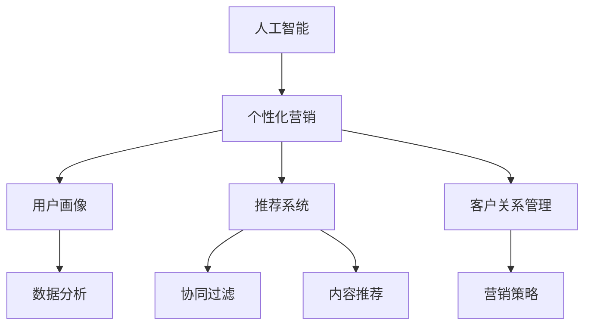
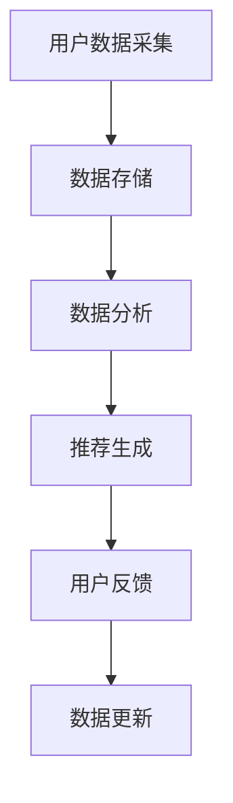
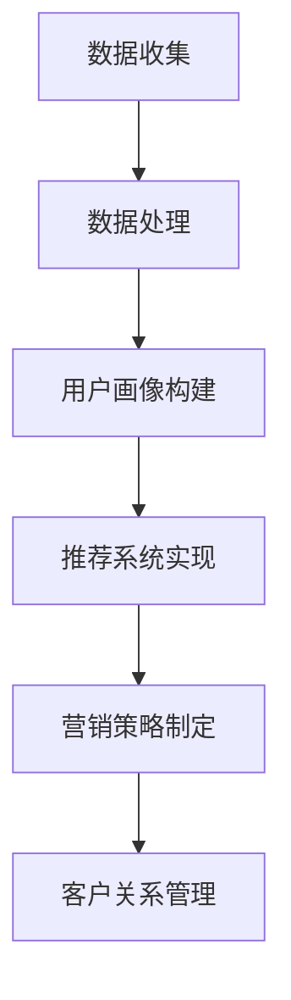
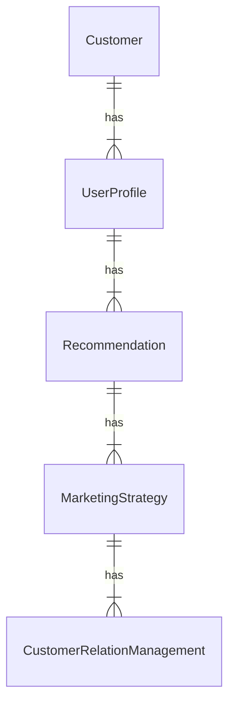
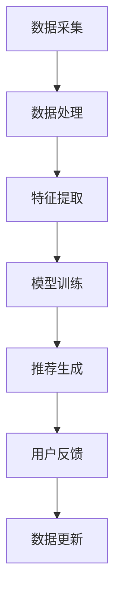
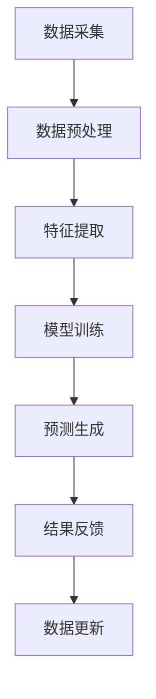
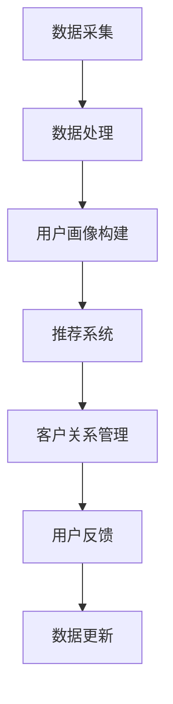
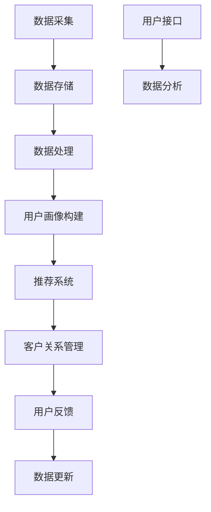
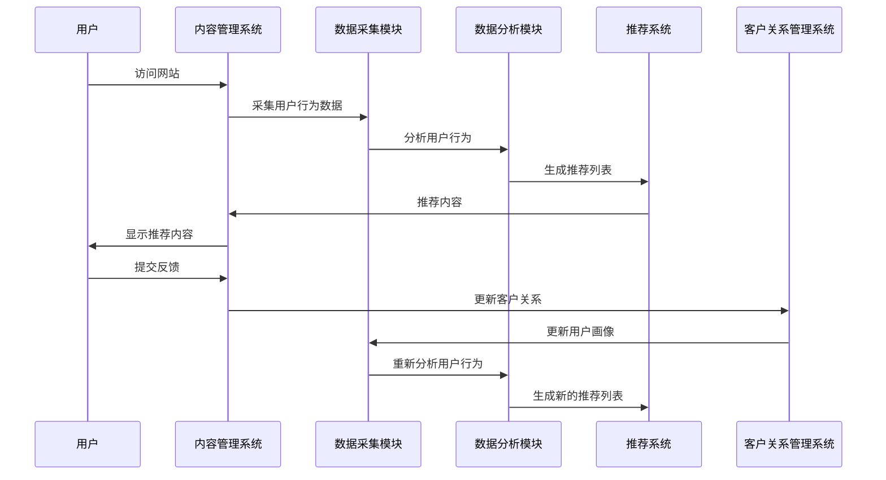

                 

### 1.1 人工智能与个性化营销概述

**背景介绍**

人工智能（Artificial Intelligence，简称AI）是计算机科学的一个分支，致力于通过模拟人类智能行为来开发具有智能行为的系统。人工智能的发展可以追溯到20世纪50年代，当时的科学家们首次提出了人工智能的概念。近年来，随着计算能力的提升、大数据的涌现和算法的创新，人工智能逐渐从理论研究走向了实际应用，成为了推动社会进步的重要力量。

个性化营销（Personalized Marketing）是指根据消费者的个性化需求和偏好，通过定制化内容、产品和服务来满足消费者的需求。传统的营销模式往往是“一刀切”，无法充分满足消费者的个性化需求。随着互联网和电子商务的普及，个性化营销逐渐成为企业提升竞争力的重要手段。

**问题描述**

在当前竞争激烈的市场环境中，企业如何利用人工智能技术来制定和实施有效的个性化营销策略，成为了一个亟待解决的问题。人工智能的引入，不仅提高了营销的效率，还使得营销更加精准和个性化。然而，如何将人工智能技术与个性化营销相结合，实现真正的智能化营销，仍然是一个挑战。

**问题解决**

为了解决这个问题，我们需要从以下几个方面进行深入探讨：

1. **人工智能的基本原理和应用**：首先，我们需要了解人工智能的基本原理，包括机器学习、深度学习等，以及这些技术在营销领域中的应用。

2. **个性化营销策略的原理和方法**：其次，我们需要了解个性化营销策略的原理和方法，包括用户画像、推荐系统、客户关系管理等。

3. **人工智能在个性化营销中的应用**：接着，我们需要探讨如何将人工智能技术与个性化营销策略相结合，实现智能化营销。

4. **个性化营销的策略趋势**：最后，我们需要关注个性化营销的发展趋势，了解未来的发展方向和潜在挑战。

**边界与外延**

在本文中，我们主要关注以下边界和概念：

- 人工智能：指的是模拟人类智能行为的计算机系统。
- 个性化营销：指的是根据消费者的个性化需求和偏好来制定营销策略。
- 数据分析：指的是使用数据挖掘和统计分析技术来分析消费者行为和需求。

这些概念相互关联，共同构成了人工智能驱动的个性化营销策略的核心。

**概念结构与核心要素组成**

我们可以用 Mermaid 流程图来描述人工智能驱动的个性化营销策略的核心概念和要素组成：



在这个流程图中，人工智能是核心驱动力，它通过用户画像、推荐系统和客户关系管理来实现个性化营销。用户画像和数据分析提供了个性化的基础，推荐系统根据用户行为和偏好进行个性化推荐，而客户关系管理则通过维护和增强客户关系来实现营销目标。

### 1.2 营销策略的演进与趋势

**背景介绍**

营销策略是企业为了实现其营销目标而制定的一系列行动方案。随着市场环境的变化，营销策略也在不断演进。传统的营销策略往往依赖于广告投放、促销活动等手段，但这些方式在信息爆炸和消费者逐渐变得审慎的今天，已经显得力不从心。现代营销策略需要更加精准、个性化和互动化，以更好地满足消费者的需求。

**核心概念与联系**

营销策略的演进可以从以下几个方面来理解：

1. **从大众营销到精准营销**：传统的营销策略往往采用大众营销的方式，即通过广告覆盖大量人群，期望能够触达潜在客户。然而，随着消费者个性化需求的增加，精准营销应运而生。精准营销通过数据分析，准确识别目标客户，并进行个性化推荐和定制化服务。

2. **从内容营销到体验营销**：内容营销是营销策略的一种重要形式，通过创造有价值的内容来吸引和留住客户。而体验营销则更加注重客户的整体体验，包括购物体验、服务体验等。体验营销强调提供无缝、个性化的客户体验，以增强客户的忠诚度。

3. **从线下营销到线上线下融合**：随着互联网和移动设备的普及，线上营销变得越来越重要。然而，线下营销仍然有其不可替代的价值。线上线下融合的营销策略，通过整合线上和线下的资源，提供更加全面和便捷的服务，以提高客户满意度。

**算法原理讲解**

为了实现精准营销和体验营销，企业需要运用各种算法和技术来分析消费者行为和需求。以下是几种常见的算法和技术：

1. **协同过滤算法**：协同过滤是推荐系统的一种常用算法，通过分析用户的历史行为，预测用户对未知商品的喜好。协同过滤分为两种：基于用户的协同过滤和基于物品的协同过滤。

   - **基于用户的协同过滤**：通过找出相似用户，并将他们的评价推荐给新用户。例如，如果用户A喜欢商品A和商品B，而用户B喜欢商品B和商品C，那么可以推断用户A可能也会喜欢商品C。
   - **基于物品的协同过滤**：通过找出相似商品，并将这些商品推荐给用户。例如，如果商品A和商品B相似，而用户喜欢商品A，那么可以推断用户也可能喜欢商品B。

   ```mermaid
   graph TD
   A[用户行为数据] --> B[用户相似度计算]
   B --> C[推荐列表生成]
   A --> D[商品行为数据]
   D --> E[商品相似度计算]
   E --> F[推荐列表生成]
   ```

2. **内容推荐算法**：内容推荐算法通过分析商品或内容的特征，为用户推荐相似或相关的商品或内容。常见的算法包括基于关键词的推荐、基于内容的协同过滤和基于深度学习的推荐。

   ```mermaid
   graph TD
   A[商品特征提取] --> B[用户特征提取]
   B --> C[相似度计算]
   C --> D[推荐列表生成]
   ```

**数学模型和数学公式**

在推荐系统中，常用的数学模型包括矩阵分解、线性回归和神经网络等。以下是一个简单的矩阵分解模型：

$$
X = UV^T
$$

其中，$X$ 是用户-物品评分矩阵，$U$ 是用户特征矩阵，$V$ 是物品特征矩阵。通过优化这个模型，可以预测用户对未知物品的评分，并生成推荐列表。

$$
\min_{U,V} \sum_{i,j} (r_{ij} - u_i \cdot v_j)^2
$$

其中，$r_{ij}$ 是用户 $i$ 对物品 $j$ 的实际评分，$u_i$ 和 $v_j$ 分别是用户 $i$ 和物品 $j$ 的特征向量。

**系统分析与架构设计**

个性化营销系统的架构通常包括数据采集、数据存储、数据分析、推荐生成和用户反馈等模块。以下是一个简单的架构设计：



**项目实战**

为了更好地理解个性化营销策略的实施过程，我们可以通过一个实际案例来进行讲解。假设我们要为一家在线零售商设计一个个性化推荐系统。

1. **环境安装**：首先，我们需要安装 Python 环境，并安装必要的库，如 NumPy、Pandas 和 Scikit-learn 等。

2. **系统核心实现**：接着，我们可以使用协同过滤算法来构建推荐系统。以下是一个简单的协同过滤算法的实现：

```python
from sklearn.cluster import KMeans
from sklearn.metrics.pairwise import cosine_similarity
import numpy as np

# 假设我们有一个用户-物品评分矩阵
ratings = np.array([
    [5, 0, 0, 0],
    [0, 5, 0, 0],
    [0, 0, 5, 0],
    [0, 0, 0, 5]
])

# 计算用户和物品的余弦相似度矩阵
user_similarity = cosine_similarity(ratings)
item_similarity = cosine_similarity(ratings.T)

# 给用户推荐物品
def recommend_items(user_index, k=2):
    user_similarity_score = user_similarity[user_index]
    recommended_items = []
    for i, score in enumerate(user_similarity_score):
        if score > 0:
            recommended_items.append(i)
    recommended_items = recommended_items[:k]
    return recommended_items

# 测试推荐系统
print(recommend_items(0))
```

3. **代码应用解读与分析**：在上面的代码中，我们首先计算用户和物品的余弦相似度矩阵，然后根据相似度分数推荐物品。这种方法简单但有效，可以用于小型系统。

4. **实际案例分析和详细讲解剖析**：在实际应用中，我们可能需要处理大量的数据和复杂的推荐场景。例如，我们可以结合用户画像、商品特征和上下文信息来生成更精确的推荐列表。

5. **项目小结**：通过这个案例，我们了解了如何使用协同过滤算法来实现个性化推荐系统。然而，实际应用中还需要考虑数据质量、模型优化和系统性能等问题。

### 1.3 本书结构安排与学习建议

**背景介绍**

本书旨在深入探讨人工智能驱动的个性化营销策略，通过理论与实践相结合的方式，帮助读者理解并应用这些策略。为了实现这一目标，本书分为五个主要部分：

1. **基础概念与理论**：介绍人工智能和个性化营销的基本概念、原理和方法。
2. **算法原理与工具**：讲解常用的推荐算法和客户行为分析算法，并提供实际应用案例。
3. **系统设计与实现**：介绍个性化营销系统的架构设计、功能实现和系统接口。
4. **项目实战与案例分析**：通过实际项目案例，展示个性化营销策略的实施过程和效果。
5. **最佳实践与未来趋势**：总结最佳实践，分析个性化营销的未来发展趋势和潜在挑战。

**学习建议**

为了更好地学习本书的内容，我们提供以下学习建议：

1. **循序渐进**：建议读者按照章节顺序进行阅读，逐步掌握基础知识和实践技能。
2. **动手实践**：本书附带多个实践案例，读者可以通过动手实践来加深理解。
3. **深入思考**：在阅读过程中，读者应该积极思考问题，尝试将所学知识应用到实际问题中。
4. **拓展阅读**：本书提供了丰富的参考文献和拓展阅读资源，供读者进一步学习。

通过以上结构安排和学习建议，我们希望本书能够帮助读者全面了解人工智能驱动的个性化营销策略，并在实际工作中取得更好的成果。

### 2.1 人工智能基础

**核心概念与联系**

人工智能（Artificial Intelligence，简称AI）是计算机科学的一个分支，旨在创建能够模拟、延伸和扩展人类智能的系统。AI的核心概念包括机器学习、深度学习、自然语言处理和计算机视觉等。

1. **机器学习（Machine Learning）**：机器学习是AI的基础，通过从数据中学习规律和模式，使计算机能够进行预测和决策。机器学习可以分为监督学习、无监督学习和半监督学习。

   - **监督学习（Supervised Learning）**：在监督学习中，模型通过学习标记数据来预测新的数据。常见的算法包括线性回归、决策树、支持向量机和神经网络等。
   - **无监督学习（Unsupervised Learning）**：在无监督学习中，模型没有标记数据，需要通过发现数据中的模式和结构来进行分类或聚类。常见的算法包括K均值聚类、主成分分析和自编码器等。
   - **半监督学习（Semi-supervised Learning）**：半监督学习结合了有监督学习和无监督学习，利用少量的标记数据和大量的未标记数据来训练模型。

2. **深度学习（Deep Learning）**：深度学习是机器学习的一种，通过构建深度神经网络来学习复杂的函数映射。深度学习在图像识别、语音识别和自然语言处理等领域取得了显著的成果。常见的深度学习模型包括卷积神经网络（CNN）、循环神经网络（RNN）和Transformer等。

3. **自然语言处理（Natural Language Processing，简称NLP）**：NLP是AI的一个重要分支，旨在使计算机能够理解、生成和处理人类语言。NLP涉及到语音识别、文本分类、机器翻译和情感分析等任务。

4. **计算机视觉（Computer Vision）**：计算机视觉是AI的另一个重要分支，致力于使计算机能够像人类一样理解和解释视觉信息。计算机视觉涉及到图像识别、目标检测、人脸识别和图像生成等任务。

**算法原理讲解**

1. **监督学习算法**：监督学习算法是AI中的基础，以下是一些常见的监督学习算法及其工作原理：

   - **线性回归（Linear Regression）**：线性回归是一种简单但强大的预测算法，通过找到一个线性模型来预测连续值。线性回归的数学公式为：

     $$
     y = \beta_0 + \beta_1x
     $$

     其中，$y$ 是预测值，$x$ 是输入特征，$\beta_0$ 和 $\beta_1$ 是模型参数。

   - **决策树（Decision Tree）**：决策树是一种树形结构，通过一系列规则对数据进行分类或回归。决策树的每个节点表示一个特征，每个分支表示该特征的取值。

   - **支持向量机（Support Vector Machine，简称SVM）**：SVM是一种基于优化理论的分类算法，通过找到最优超平面来分隔数据。SVM的数学模型为：

     $$
     \max_{\beta, \beta_0} W
     $$
     $$
     s.t. y_i(\beta \cdot x_i + \beta_0) \geq 1
     $$

     其中，$W$ 是拉格朗日乘子，$x_i$ 是样本特征，$y_i$ 是样本标签。

2. **深度学习算法**：深度学习算法是AI中的核心技术，以下是一些常见的深度学习算法及其工作原理：

   - **卷积神经网络（Convolutional Neural Network，简称CNN）**：CNN是一种专门用于处理图像数据的神经网络，通过卷积层、池化层和全连接层来提取图像特征。CNN的核心组件是卷积层，它通过卷积运算来提取图像的局部特征。

   - **循环神经网络（Recurrent Neural Network，简称RNN）**：RNN是一种专门用于处理序列数据的神经网络，通过循环连接来记忆和传递序列信息。RNN的核心组件是隐藏状态，它能够保存序列的上下文信息。

   - **Transformer**：Transformer是一种基于自注意力机制的深度学习模型，广泛应用于自然语言处理和计算机视觉等领域。Transformer的核心组件是多头自注意力机制，它能够同时关注序列中的所有信息。

**数学模型和数学公式**

在机器学习和深度学习中，数学模型和数学公式是非常重要的。以下是一些常用的数学模型和数学公式：

1. **线性回归模型**：

   $$
   y = \beta_0 + \beta_1x
   $$

   其中，$y$ 是预测值，$x$ 是输入特征，$\beta_0$ 和 $\beta_1$ 是模型参数。

2. **SVM分类模型**：

   $$
   \max_{\beta, \beta_0} W
   $$
   $$
   s.t. y_i(\beta \cdot x_i + \beta_0) \geq 1
   $$

   其中，$W$ 是拉格朗日乘子，$x_i$ 是样本特征，$y_i$ 是样本标签。

3. **卷积神经网络模型**：

   $$
   h^{(l)} = \sigma(\sum_{k=1}^{K} \beta_{k} \cdot f^{(l-1)})
   $$

   其中，$h^{(l)}$ 是第$l$层的激活值，$\sigma$ 是激活函数，$f^{(l-1)}$ 是前一层的数据，$\beta_{k}$ 是模型参数。

4. **Transformer模型**：

   $$
   \text{Attention}(Q, K, V) = \frac{1}{\sqrt{d_k}} \text{softmax}\left(\frac{QK^T}{d_k}\right) V
   $$

   其中，$Q$、$K$ 和 $V$ 分别是查询向量、键向量和值向量，$d_k$ 是键向量的维度。

**系统分析与架构设计**

在构建人工智能系统时，系统分析与架构设计是非常重要的一环。以下是一个典型的人工智能系统架构设计：

1. **数据采集与预处理**：数据是人工智能系统的基石，系统需要从各种来源采集数据，并进行预处理，如数据清洗、归一化和特征提取等。

2. **模型训练与优化**：模型训练是人工智能系统的核心，系统需要使用训练数据来训练模型，并通过优化算法来提高模型的性能。

3. **模型部署与监控**：模型部署是将训练好的模型应用到实际场景中，系统需要实时监控模型的性能，并进行调整和优化。

4. **用户接口与交互**：用户接口是系统与用户交互的界面，系统需要提供友好的用户接口，以便用户能够方便地使用系统功能。

**项目实战**

为了更好地理解人工智能系统的工作原理和实施过程，以下是一个实际案例：

**案例：构建一个基于线性回归的房价预测系统**

1. **环境安装**：安装 Python 环境，并安装必要的库，如 NumPy、Pandas 和 Scikit-learn 等。

2. **数据采集与预处理**：从 Kaggle 上获取房价数据集，并对数据进行预处理，如缺失值填充、数据归一化等。

3. **模型训练**：使用 Scikit-learn 库中的线性回归算法来训练模型，并使用交叉验证来评估模型性能。

4. **模型部署与监控**：将训练好的模型部署到服务器上，并监控模型的预测性能。

5. **用户接口与交互**：开发一个 Web 界面，让用户能够输入房屋特征，并获取预测的房价。

**代码应用解读与分析**

以下是一个简单的线性回归模型的实现：

```python
from sklearn.linear_model import LinearRegression
from sklearn.model_selection import train_test_split
from sklearn.metrics import mean_squared_error

# 加载数据
data = pd.read_csv('house_prices.csv')
X = data[['area', 'rooms']]
y = data['price']

# 划分训练集和测试集
X_train, X_test, y_train, y_test = train_test_split(X, y, test_size=0.2, random_state=42)

# 训练模型
model = LinearRegression()
model.fit(X_train, y_train)

# 预测测试集
y_pred = model.predict(X_test)

# 评估模型性能
mse = mean_squared_error(y_test, y_pred)
print(f'MSE: {mse}')

# 预测新数据
new_data = pd.DataFrame([[2000, 3]], columns=['area', 'rooms'])
predicted_price = model.predict(new_data)
print(f'Predicted Price: {predicted_price[0]}')
```

通过这个案例，我们了解了如何使用线性回归模型来预测房价，并进行了代码解读和分析。

### 2.2 个性化营销基础

**核心概念与联系**

个性化营销（Personalized Marketing）是指根据消费者的个性化需求和偏好，通过定制化内容、产品和服务来满足消费者的需求。个性化营销的核心在于理解消费者，从而提供更加精准、个性化的体验。以下是几个关键概念：

1. **用户画像（User Profiling）**：用户画像是指通过对消费者数据进行综合分析，构建出一个全面、详细的用户模型。用户画像包括消费者的基本信息、行为特征、偏好和需求等。通过用户画像，企业可以更好地理解消费者，从而提供个性化的服务和推荐。

2. **推荐系统（Recommendation System）**：推荐系统是一种自动化系统，通过分析用户的历史行为和偏好，为用户推荐可能感兴趣的内容、产品或服务。推荐系统可以分为协同过滤、基于内容和基于深度学习等不同类型。

3. **客户关系管理（Customer Relationship Management，简称CRM）**：客户关系管理是一种战略和过程，旨在通过建立和维护良好的客户关系，提高客户满意度和忠诚度。CRM包括销售管理、客户服务和营销自动化等模块。

**个性化营销策略分类**

个性化营销策略可以分为以下几种类型：

1. **内容个性化**：根据消费者的兴趣和行为，提供个性化的内容。例如，新闻网站可以根据用户的阅读历史和偏好，推荐相关的新闻文章。

2. **产品个性化**：根据消费者的需求和偏好，提供个性化的产品或服务。例如，电子商务网站可以根据用户的购物历史和偏好，推荐相关的商品。

3. **渠道个性化**：根据消费者的行为和偏好，选择最适合的渠道进行营销。例如，企业可以通过电子邮件、社交媒体、短信等多种渠道，向消费者发送个性化的营销信息。

4. **价格个性化**：根据消费者的购买力、历史价格敏感度和市场状况，提供个性化的价格策略。例如，航空公司可以根据乘客的预订时间和预订方式，提供不同的折扣。

**个性化营销的关键要素**

要实现有效的个性化营销，企业需要关注以下几个关键要素：

1. **数据收集与处理**：收集消费者的行为数据、偏好数据等，并进行有效的处理和分析。

2. **用户画像构建**：通过数据分析和挖掘，构建出详细的用户画像，为个性化营销提供基础。

3. **推荐系统实现**：开发高效的推荐系统，根据用户画像和用户行为，为用户推荐个性化的内容、产品或服务。

4. **营销策略制定**：根据用户画像和推荐结果，制定个性化的营销策略，包括内容个性化、产品个性化、渠道个性化和价格个性化等。

5. **客户关系管理**：通过有效的客户关系管理，提高客户满意度和忠诚度，从而实现长期的营销目标。

**Mermaid流程图与ER实体关系图**

为了更好地描述个性化营销的核心概念和要素，我们可以使用 Mermaid 流程图和 ER 实体关系图。

**Mermaid流程图：个性化营销流程**



**ER实体关系图：个性化营销实体关系**



通过以上流程图和 ER 图，我们可以清晰地看到个性化营销的核心流程和实体关系。

### 3.1 个性化推荐算法

**核心概念与联系**

个性化推荐算法是构建个性化营销策略的核心技术之一。这些算法通过分析用户的历史行为、偏好和兴趣，预测用户可能感兴趣的内容、产品或服务，从而提高用户满意度和忠诚度。个性化推荐算法可以分为协同过滤、基于内容和基于深度学习等几种类型。

1. **协同过滤（Collaborative Filtering）**：协同过滤是一种基于用户行为和偏好进行推荐的算法。它主要分为以下两种类型：
   - **基于用户的协同过滤（User-Based Collaborative Filtering）**：通过找出与目标用户兴趣相似的其它用户，并推荐这些用户喜欢的物品。
   - **基于物品的协同过滤（Item-Based Collaborative Filtering）**：通过找出与目标物品相似的其他物品，并推荐这些物品。

2. **基于内容的推荐（Content-Based Filtering）**：基于内容的推荐算法通过分析物品的内容特征和用户的历史偏好，为用户推荐具有相似内容的物品。

3. **基于深度学习的推荐（Deep Learning-based Recommender Systems）**：深度学习推荐算法利用深度神经网络来提取用户和物品的复杂特征，从而实现高效的推荐。常见的深度学习模型包括卷积神经网络（CNN）、循环神经网络（RNN）和Transformer等。

**算法原理讲解**

**协同过滤算法**

协同过滤算法的核心思想是利用用户之间的相似性或物品之间的相似性来进行推荐。以下是协同过滤算法的基本原理：

1. **基于用户的协同过滤**：

   - **步骤1**：计算用户之间的相似性。常用的相似性度量方法包括余弦相似性、皮尔逊相关系数等。

     $$
     \text{similarity}(u_i, u_j) = \frac{\sum_{k=1}^{n} r_{ik} r_{jk}}{\sqrt{\sum_{k=1}^{n} r_{ik}^2 \sum_{k=1}^{n} r_{jk}^2}}
     $$

     其中，$r_{ik}$ 表示用户 $i$ 对物品 $k$ 的评分。

   - **步骤2**：找出与目标用户 $u_i$ 最相似的 $k$ 个用户。

   - **步骤3**：计算目标用户对未评分物品的预测评分。常用的预测方法包括加权平均预测和基于模型的预测。

     $$
     r_{i\hat{j}} = \frac{\sum_{j\in \text{neighbor}(u_i)} r_{uj} \cdot \text{similarity}(u_i, u_j)}{\sum_{j\in \text{neighbor}(u_i)} \text{similarity}(u_i, u_j)}
     $$

   - **步骤4**：生成推荐列表，将预测评分最高的物品推荐给用户。

2. **基于物品的协同过滤**：

   - **步骤1**：计算物品之间的相似性。常用的相似性度量方法包括余弦相似性、Jaccard 系数等。

     $$
     \text{similarity}(i_k, i_l) = \frac{r_k \cap r_l}{r_k \cup r_l}
     $$

     其中，$r_k$ 和 $r_l$ 分别表示物品 $k$ 和 $l$ 的用户集合。

   - **步骤2**：找出与目标物品 $i_k$ 最相似的 $k$ 个物品。

   - **步骤3**：计算目标用户对未评分物品的预测评分。常用的预测方法包括加权平均预测和基于模型的预测。

     $$
     r_{i\hat{j}} = \frac{\sum_{j\in \text{neighbor}(i_k)} r_{ij} \cdot \text{similarity}(i_k, i_l)}{\sum_{j\in \text{neighbor}(i_k)} \text{similarity}(i_k, i_l)}
     $$

   - **步骤4**：生成推荐列表，将预测评分最高的物品推荐给用户。

**基于内容的推荐**

基于内容的推荐算法通过分析物品的内容特征和用户的历史偏好来进行推荐。以下是基于内容推荐算法的基本原理：

1. **步骤1**：提取物品的内容特征。可以使用 TF-IDF、词袋模型或词嵌入等方法来提取物品的特征向量。

2. **步骤2**：提取用户的历史偏好。可以使用用户的历史行为数据来提取用户的兴趣特征。

3. **步骤3**：计算物品和用户之间的相似度。常用的相似度度量方法包括余弦相似性、欧氏距离等。

   $$
   \text{similarity}(u, i) = \frac{\sum_{j=1}^{m} w_{uj} w_{ij}}{\sqrt{\sum_{j=1}^{m} w_{uj}^2 \sum_{j=1}^{m} w_{ij}^2}}
   $$

   其中，$w_{uj}$ 和 $w_{ij}$ 分别表示用户 $u$ 和物品 $i$ 的特征向量。

4. **步骤4**：生成推荐列表。将预测相似度最高的物品推荐给用户。

**深度学习推荐算法**

深度学习推荐算法利用深度神经网络来提取用户和物品的复杂特征，从而实现高效的推荐。以下是几种常见的深度学习推荐算法：

1. **矩阵分解（Matrix Factorization）**：

   矩阵分解是一种基于概率图模型的方法，通过将用户-物品评分矩阵分解为用户特征矩阵和物品特征矩阵，来预测用户对未评分物品的评分。常用的矩阵分解算法包括 SVD、ALS 等。

2. **卷积神经网络（Convolutional Neural Network，CNN）**：

   卷积神经网络是一种用于图像处理和文本分类的深度学习模型，通过卷积操作和池化操作来提取图像或文本的局部特征。可以将用户和物品的特征向量输入到 CNN 模型中，来预测用户对未评分物品的评分。

3. **循环神经网络（Recurrent Neural Network，RNN）**：

   循环神经网络是一种用于处理序列数据的深度学习模型，通过循环连接来记忆和传递序列信息。可以将用户的历史行为数据序列输入到 RNN 模型中，来预测用户对未评分物品的评分。

4. **Transformer**：

   Transformer 是一种基于自注意力机制的深度学习模型，广泛应用于自然语言处理和计算机视觉等领域。可以将用户和物品的特征向量输入到 Transformer 模型中，来预测用户对未评分物品的评分。

**数学模型和数学公式**

以下是几种个性化推荐算法的数学模型和数学公式：

1. **基于用户的协同过滤**：

   $$
   r_{i\hat{j}} = \frac{\sum_{j\in \text{neighbor}(u_i)} r_{uj} \cdot \text{similarity}(u_i, u_j)}{\sum_{j\in \text{neighbor}(u_i)} \text{similarity}(u_i, u_j)}
   $$

2. **基于内容的推荐**：

   $$
   \text{similarity}(u, i) = \frac{\sum_{j=1}^{m} w_{uj} w_{ij}}{\sqrt{\sum_{j=1}^{m} w_{uj}^2 \sum_{j=1}^{m} w_{ij}^2}}
   $$

3. **矩阵分解**：

   $$
   R = U \cdot V^T
   $$

   其中，$R$ 是用户-物品评分矩阵，$U$ 和 $V$ 分别是用户特征矩阵和物品特征矩阵。

4. **卷积神经网络**：

   $$
   h^{(l)} = \sigma(\sum_{k=1}^{K} \beta_{k} \cdot f^{(l-1)})
   $$

   其中，$h^{(l)}$ 是第$l$层的激活值，$\sigma$ 是激活函数，$f^{(l-1)}$ 是前一层的数据，$\beta_{k}$ 是模型参数。

5. **Transformer**：

   $$
   \text{Attention}(Q, K, V) = \frac{1}{\sqrt{d_k}} \text{softmax}\left(\frac{QK^T}{d_k}\right) V
   $$

   其中，$Q$、$K$ 和 $V$ 分别是查询向量、键向量和值向量，$d_k$ 是键向量的维度。

**系统分析与架构设计**

个性化推荐系统的架构设计通常包括数据采集、数据处理、特征提取、模型训练和推荐生成等模块。以下是个性化推荐系统的一个基本架构设计：



**项目实战**

为了更好地理解个性化推荐算法的实际应用，以下是一个基于协同过滤算法的推荐系统实现的案例：

**案例：使用协同过滤算法实现电影推荐系统**

**环境安装**：

1. 安装 Python 环境。
2. 安装必要的库，如 NumPy、Pandas、Scikit-learn 等。

**数据采集与预处理**：

1. 从电影推荐数据集（如 Netflix Prize 数据集）中获取用户-电影评分数据。
2. 数据预处理，包括缺失值填充、数据归一化等。

**模型实现与训练**：

1. 使用 Scikit-learn 库实现基于用户的协同过滤算法。
2. 训练模型，并根据邻居用户的评分预测用户对未知电影的评分。

**推荐生成与评估**：

1. 根据预测评分生成推荐列表。
2. 使用均方根误差（RMSE）等指标评估模型性能。

**代码应用解读与分析**：

以下是一个简单的基于用户的协同过滤算法的实现：

```python
import numpy as np
from sklearn.metrics.pairwise import cosine_similarity
from sklearn.model_selection import train_test_split

# 加载数据
data = np.array([
    [1, 5, 4, 5],
    [2, 4, 5, 0],
    [3, 0, 3, 2],
    [4, 5, 0, 3],
    [5, 2, 3, 1]
])

# 划分训练集和测试集
X_train, X_test = train_test_split(data, test_size=0.2, random_state=42)

# 计算用户之间的相似性
user_similarity = cosine_similarity(X_train)

# 预测用户对未知电影的评分
def predict_ratings(ratings, similarity, k=2):
    recommendations = []
    for i in range(ratings.shape[0]):
        neighbors = np.argsort(similarity[i])[-k:]
        neighbor_ratings = ratings[neighbors]
        prediction = np.dot(neighbor_ratings, similarity[i][neighbors]) / np.sum(similarity[i][neighbors])
        recommendations.append(prediction)
    return recommendations

# 生成推荐列表
predictions = predict_ratings(X_train, user_similarity, k=2)

# 评估模型性能
rmse = np.sqrt(np.mean((X_test - predictions) ** 2))
print(f'RMSE: {rmse}')

# 预测新用户
new_user = np.array([0, 0, 4, 0])
new_predictions = predict_ratings(new_user, user_similarity, k=2)
print(f'Predicted Ratings: {new_predictions}')
```

通过这个案例，我们了解了如何使用基于用户的协同过滤算法来实现电影推荐系统，并进行了代码解读和分析。

### 3.2 客户行为分析算法

**核心概念与联系**

客户行为分析（Customer Behavior Analysis）是理解和预测消费者行为的重要手段，它通过分析消费者的购买历史、浏览行为、互动记录等数据，帮助企业制定更有效的营销策略。客户行为分析算法的核心在于从海量的数据中提取有价值的信息，从而为个性化营销提供依据。

1. **聚类分析（Cluster Analysis）**：聚类分析是一种无监督学习技术，通过将相似的数据点归为一类，从而发现数据中的自然分组。在客户行为分析中，聚类算法可以帮助企业识别具有相似行为的客户群体，从而进行精准营销。

2. **时序分析（Time Series Analysis）**：时序分析是一种统计方法，用于分析时间序列数据，预测未来的趋势和模式。在客户行为分析中，时序分析可以用于预测消费者的购买行为，从而提前采取营销行动。

3. **机器学习预测模型（Machine Learning Predictive Models）**：机器学习预测模型通过历史数据来预测未来的行为或趋势。在客户行为分析中，常见的机器学习模型包括线性回归、决策树、随机森林等，它们可以用于预测客户流失、购买概率等指标。

**算法原理讲解**

1. **聚类分析**

   聚类分析的基本原理是将数据点分成多个群组，使得群组内的数据点之间距离较短，而群组之间的数据点距离较长。以下是几种常见的聚类算法：

   - **K均值聚类（K-Means Clustering）**：K均值聚类是一种基于距离度量的聚类算法，它通过迭代优化目标函数来将数据点分配到K个聚类中心。目标函数通常为平方误差，即：

     $$
     \min_{C} \sum_{i=1}^{K} \sum_{x \in S_i} \|x - \mu_i\|^2
     $$

     其中，$C$ 是聚类中心，$S_i$ 是第$i$个聚类。

   - **层次聚类（Hierarchical Clustering）**：层次聚类通过逐步合并或分裂聚类中心来构建聚类层次结构。层次聚类可以分为凝聚层次聚类和分裂层次聚类。

   - **基于密度的聚类（Density-Based Clustering）**：基于密度的聚类算法通过识别高密度区域并扩展这些区域来形成聚类。DBSCAN（Density-Based Spatial Clustering of Applications with Noise）是一种常用的基于密度的聚类算法。

2. **时序分析**

   时序分析的核心在于理解和预测时间序列数据的变化趋势。以下是几种常见的时序分析模型：

   - **ARIMA（AutoRegressive Integrated Moving Average）模型**：ARIMA 模型是一种自回归积分滑动平均模型，它通过整合过去的信息来预测未来值。ARIMA 模型包括三个关键组件：自回归（AR）、差分（I）和移动平均（MA）。

     $$
     \text{ARIMA}(p, d, q) = \text{AR}(p) + \text{I}(d) + \text{MA}(q)
     $$

     其中，$p$、$d$ 和 $q$ 分别是自回归项数、差分阶数和移动平均项数。

   - **LSTM（Long Short-Term Memory）网络**：LSTM 是一种特殊的循环神经网络（RNN），专门用于处理和预测长时间序列数据。LSTM 通过引入记忆单元来避免传统 RNN 的梯度消失问题。

3. **机器学习预测模型**

   机器学习预测模型通过历史数据来预测未来的行为或趋势。以下是几种常见的机器学习预测模型：

   - **线性回归（Linear Regression）**：线性回归是一种简单的预测模型，通过找到最佳拟合直线来预测因变量的值。

     $$
     y = \beta_0 + \beta_1x
     $$

   - **决策树（Decision Tree）**：决策树通过一系列规则对数据进行分类或回归。决策树可以根据预测准确性、信息增益等准则进行剪枝，以避免过拟合。

   - **随机森林（Random Forest）**：随机森林是一种集成学习模型，通过构建多个决策树并取平均值来提高预测准确性。随机森林可以处理大量特征和大量样本，并且具有较高的泛化能力。

**数学模型和数学公式**

以下是几种客户行为分析算法的数学模型和数学公式：

1. **K均值聚类**：

   $$
   \mu_i^{(t+1)} = \frac{1}{N_i} \sum_{x \in S_i} x
   $$

   $$
   x_i^{(t+1)} = \mu_i^{(t+1)}
   $$

   其中，$\mu_i^{(t)}$ 和 $x_i^{(t)}$ 分别是第$t$次迭代的聚类中心和数据点，$N_i$ 是第$i$个聚类中的数据点数量。

2. **ARIMA模型**：

   $$
   \text{ARIMA}(p, d, q) = \phi(B) \phi(B^d) \Phi(B)^q
   $$

   $$
   y_t = \phi(B) \phi(B^d) \Phi(B)^q \epsilon_t
   $$

   其中，$B$ 是后移算子，$\phi(B)$、$\Phi(B)$ 分别是自回归项和移动平均项，$d$ 是差分阶数，$p$、$q$ 分别是自回归项数和移动平均项数。

3. **线性回归**：

   $$
   y = \beta_0 + \beta_1x
   $$

   $$
   \beta_1 = \frac{\sum_{i=1}^{n} (x_i - \bar{x})(y_i - \bar{y})}{\sum_{i=1}^{n} (x_i - \bar{x})^2}
   $$

   其中，$x$ 和 $y$ 分别是自变量和因变量，$\bar{x}$ 和 $\bar{y}$ 分别是自变量和因变量的均值。

**系统分析与架构设计**

客户行为分析系统的架构设计通常包括数据采集、数据预处理、特征提取、模型训练和预测等模块。以下是客户行为分析系统的一个基本架构设计：



**项目实战**

为了更好地理解客户行为分析算法的实际应用，以下是一个聚类分析的案例：

**案例：使用K均值聚类分析客户行为**

**环境安装**：

1. 安装 Python 环境。
2. 安装必要的库，如 NumPy、Pandas 和 Scikit-learn 等。

**数据采集与预处理**：

1. 从客户行为数据集中获取数据，包括客户的购买频率、购买金额、浏览历史等。
2. 数据预处理，包括缺失值填充、数据归一化等。

**模型实现与训练**：

1. 使用 Scikit-learn 库实现 K均值聚类算法。
2. 设置聚类中心数量（K）和迭代次数，训练模型。

**预测与评估**：

1. 使用训练好的模型对客户行为数据进行聚类。
2. 根据聚类结果，分析不同客户群体的行为特征。
3. 评估模型性能，如内部凝聚度、轮廓系数等。

**代码应用解读与分析**：

以下是一个简单的 K均值聚类算法的实现：

```python
import numpy as np
from sklearn.cluster import KMeans
from sklearn.metrics import silhouette_score

# 加载数据
data = np.array([
    [1, 5],
    [2, 4],
    [3, 3],
    [4, 2],
    [5, 1],
    [6, 5],
    [7, 4],
    [8, 3],
    [9, 2],
    [10, 1]
])

# 划分训练集和测试集
X_train, X_test = train_test_split(data, test_size=0.2, random_state=42)

# 训练模型
kmeans = KMeans(n_clusters=2, init='k-means++, n_iter=10, max_iter=300, tol=1e-04, random_state=0')
kmeans.fit(X_train)

# 获取聚类结果
clusters = kmeans.predict(X_test)

# 计算轮廓系数
silhouette_avg = silhouette_score(X_test, clusters)
print(f'Silhouette Score: {silhouette_avg}')

# 分析聚类结果
print(f'Cluster Centers: {kmeans.cluster_centers_}')
print(f'Clusters: {clusters}')
```

通过这个案例，我们了解了如何使用 K均值聚类算法分析客户行为数据，并进行了代码解读和分析。

### 4.1 个性化营销系统架构设计

**核心概念与联系**

个性化营销系统是利用人工智能技术实现个性化营销目标的核心系统。其架构设计需要综合考虑数据采集、数据处理、推荐系统、客户关系管理和用户反馈等多个方面。以下是个性化营销系统架构设计的关键组成部分：

1. **数据采集**：数据采集是个性化营销系统的基础，包括用户行为数据、购买记录、浏览历史等。这些数据可以通过网站跟踪、客户端SDK、API接口等多种方式获取。

2. **数据处理**：数据处理是对采集到的原始数据进行清洗、转换和存储的过程。这一步骤确保数据的质量和一致性，为后续分析提供可靠的数据基础。

3. **用户画像构建**：用户画像是通过分析用户行为数据和基础信息，构建出的用户特征模型。用户画像包括用户的基本信息、兴趣爱好、消费习惯等，是个性化推荐和营销策略制定的重要依据。

4. **推荐系统**：推荐系统是基于用户画像和商品特征，通过算法为用户推荐个性化商品或内容。推荐系统通常包括协同过滤、基于内容和基于深度学习等不同的算法。

5. **客户关系管理**：客户关系管理是通过维护客户关系，提高客户满意度和忠诚度的过程。这包括客户服务、营销自动化、客户互动等多个方面。

6. **用户反馈**：用户反馈是系统持续优化的关键，通过收集用户对推荐内容、服务质量的反馈，不断调整和改进系统。

**系统架构设计**

以下是个性化营销系统的一个基本架构设计：



**系统功能设计**

个性化营销系统需要实现以下功能：

1. **用户数据采集**：从各个渠道采集用户行为数据，如浏览历史、购买记录、点击行为等。

2. **数据处理**：对采集到的数据进行清洗、转换和存储，确保数据质量。

3. **用户画像构建**：根据用户行为数据和基础信息，构建用户画像模型，包括用户的基本信息、兴趣爱好、消费习惯等。

4. **推荐系统**：根据用户画像和商品特征，为用户推荐个性化商品或内容。推荐系统可以采用协同过滤、基于内容和基于深度学习等算法。

5. **客户关系管理**：通过营销自动化、客户互动、客户服务等功能，提高客户满意度和忠诚度。

6. **用户反馈**：收集用户对推荐内容、服务质量的反馈，用于系统优化。

**系统架构设计**

以下是个性化营销系统的详细架构设计：



**系统接口设计**

个性化营销系统的接口设计需要考虑以下方面：

1. **API接口**：为前端应用、移动应用等提供统一的API接口，以便于系统集成和扩展。

2. **数据接口**：包括数据采集、数据存储、数据处理等模块的内部接口，确保数据流转顺畅。

3. **用户接口**：提供用户友好的操作界面，让用户能够方便地查看推荐内容、管理个人账户等。

**系统交互**

以下是个性化营销系统的系统交互设计：



**项目实战**

为了更好地理解个性化营销系统的实际应用，以下是一个实际案例：

**案例：构建一个基于协同过滤的电商个性化推荐系统**

**环境安装**：

1. 安装 Python 环境。
2. 安装必要的库，如 NumPy、Pandas、Scikit-learn 等。

**数据采集与预处理**：

1. 从电商平台上获取用户-商品评分数据。
2. 数据预处理，包括缺失值填充、数据归一化等。

**用户画像构建**：

1. 分析用户行为数据，构建用户画像。
2. 用户画像包括用户的基本信息、兴趣爱好、消费习惯等。

**推荐系统实现**：

1. 使用协同过滤算法实现推荐系统。
2. 根据用户画像和商品特征，为用户推荐个性化商品。

**客户关系管理**：

1. 通过营销自动化和客户互动，提高客户满意度和忠诚度。
2. 收集用户反馈，用于系统优化。

**代码应用解读与分析**：

以下是一个简单的协同过滤推荐系统的实现：

```python
import numpy as np
from sklearn.metrics.pairwise import cosine_similarity

# 加载数据
data = np.array([
    [1, 5, 4, 5],
    [2, 4, 5, 0],
    [3, 0, 3, 2],
    [4, 5, 0, 3],
    [5, 2, 3, 1]
])

# 计算用户之间的相似性
user_similarity = cosine_similarity(data)

# 预测用户对未知商品的评分
def predict_ratings(ratings, similarity, k=2):
    recommendations = []
    for i in range(ratings.shape[0]):
        neighbors = np.argsort(similarity[i])[-k:]
        neighbor_ratings = ratings[neighbors]
        prediction = np.dot(neighbor_ratings, similarity[i][neighbors]) / np.sum(similarity[i][neighbors])
        recommendations.append(prediction)
    return recommendations

# 生成推荐列表
predictions = predict_ratings(data, user_similarity, k=2)

# 打印推荐结果
print(predictions)
```

通过这个案例，我们了解了如何使用协同过滤算法实现电商个性化推荐系统，并进行了代码解读和分析。

### 4.2 系统功能实现

**核心概念与联系**

个性化营销系统的功能实现是确保系统能够有效运作的关键。以下是一些关键的实现步骤：

1. **用户画像构建**：用户画像构建是系统的第一步，通过分析用户数据，形成详细的用户特征模型。这包括用户的基本信息、兴趣爱好、消费习惯等。

2. **推荐系统设计与实现**：推荐系统是实现个性化营销的核心，通过算法将用户画像与商品特征相结合，生成个性化的推荐结果。

3. **客户关系管理**：客户关系管理包括营销自动化、客户互动、客户服务等功能，旨在提高客户满意度和忠诚度。

4. **用户反馈收集与处理**：用户反馈是系统优化的关键，通过收集和分析用户反馈，可以不断调整和改进系统。

**用户画像构建**

用户画像构建是通过分析用户行为数据、交易数据和基础信息来建立用户特征模型。以下是构建用户画像的步骤：

1. **数据收集**：从多个渠道收集用户数据，包括网站访问日志、购买记录、社交媒体行为等。

2. **数据处理**：对收集到的数据进行清洗、转换和存储，确保数据质量。

3. **特征提取**：根据用户行为和交易数据，提取用户的特征，如年龄、性别、消费金额、购买频率、兴趣爱好等。

4. **模型构建**：使用机器学习算法，如聚类分析和关联规则挖掘，构建用户画像模型。

**推荐系统设计与实现**

推荐系统设计与实现是个性化营销系统的核心。以下是推荐系统设计与实现的关键步骤：

1. **算法选择**：选择合适的推荐算法，如协同过滤、基于内容和基于深度学习等。

2. **数据预处理**：对用户行为数据和商品数据进行预处理，如缺失值填充、数据归一化等。

3. **模型训练**：使用历史数据训练推荐模型，调整模型参数，优化模型性能。

4. **推荐生成**：根据用户画像和商品特征，生成个性化的推荐列表。

5. **系统部署**：将推荐模型部署到生产环境，实时为用户生成推荐。

**客户关系管理**

客户关系管理是实现长期客户价值的关键。以下是客户关系管理的关键步骤：

1. **客户互动**：通过电子邮件、短信、社交媒体等方式与客户进行互动，提供个性化体验。

2. **营销自动化**：使用营销自动化工具，自动化营销流程，提高营销效率。

3. **客户服务**：提供优质的客户服务，包括在线客服、电话支持等。

4. **客户反馈收集**：通过问卷调查、用户评价等方式收集客户反馈，用于系统优化。

**用户反馈收集与处理**

用户反馈收集与处理是系统持续优化的重要环节。以下是用户反馈收集与处理的关键步骤：

1. **反馈渠道**：提供多种反馈渠道，如网站评论、邮件反馈、社交媒体等。

2. **反馈收集**：定期收集用户反馈，分类整理反馈内容。

3. **反馈分析**：使用数据挖掘和分析技术，分析用户反馈，识别问题。

4. **反馈处理**：根据反馈分析结果，制定改进计划，并实施改进。

5. **反馈报告**：定期发布反馈报告，与相关团队和部门沟通，确保问题得到及时解决。

**代码示例**

以下是一个简单的用户画像构建和推荐系统实现的代码示例：

```python
import pandas as pd
from sklearn.cluster import KMeans

# 加载数据
data = pd.DataFrame({
    'user_id': [1, 2, 3, 4, 5],
    'age': [25, 30, 22, 35, 28],
    'income': [50000, 60000, 40000, 80000, 55000],
    'spending': [3000, 4000, 2500, 3500, 3200]
})

# 构建用户画像
kmeans = KMeans(n_clusters=3, random_state=42)
data['cluster'] = kmeans.fit_predict(data[['age', 'income', 'spending']])

# 打印用户画像
print(data[['user_id', 'cluster', 'age', 'income', 'spending']])

# 推荐系统实现
def recommend_users(user_id, k=2):
    similar_users = data[(data['cluster'] == data.loc[user_id, 'cluster'])].sort_values('spending', ascending=False).iloc[1:k+1, :]['user_id']
    return similar_users

# 生成推荐列表
recommendations = recommend_users(1)

# 打印推荐结果
print(recommendations)
```

通过这个示例，我们了解了如何使用 KMeans 算法构建用户画像，并实现简单的推荐系统。

### 5.1 项目一：构建个性化推荐系统

**项目背景与目标**

随着互联网和电子商务的迅猛发展，个性化推荐系统在提升用户体验和增加销售额方面发挥了重要作用。本项目的目标是构建一个基于协同过滤算法的个性化推荐系统，为电商平台上的用户提供个性化商品推荐。

**项目需求**

1. **数据需求**：收集用户-商品评分数据，包括用户的ID、商品ID、评分等。
2. **功能需求**：实现基于用户的协同过滤算法，为用户推荐感兴趣的商品。
3. **性能需求**：确保系统能够处理大规模用户数据，并提供实时推荐。

**项目设计**

1. **系统架构设计**：采用分布式架构，包括数据采集、数据处理、推荐算法和用户接口等模块。
2. **数据流程设计**：设计数据流图，确保数据从采集到处理、存储和推荐的全过程高效流畅。
3. **算法选择**：选择基于用户的协同过滤算法，并结合用户画像和商品特征进行优化。

**系统设计与实现**

1. **环境安装**：在服务器上安装 Python 环境，并安装 NumPy、Pandas 和 Scikit-learn 等相关库。

2. **数据采集**：从电商平台的数据仓库中提取用户-商品评分数据。

3. **数据处理**：对评分数据进行预处理，包括缺失值填充和数据归一化。

4. **算法实现**：使用 Scikit-learn 库实现基于用户的协同过滤算法。

```python
import numpy as np
from sklearn.metrics.pairwise import cosine_similarity
from sklearn.model_selection import train_test_split

# 加载数据
data = np.array([
    [1, 5, 4, 5],
    [2, 4, 5, 0],
    [3, 0, 3, 2],
    [4, 5, 0, 3],
    [5, 2, 3, 1]
])

# 划分训练集和测试集
X_train, X_test = train_test_split(data, test_size=0.2, random_state=42)

# 计算用户之间的相似性
user_similarity = cosine_similarity(X_train)

# 预测用户对未知商品的评分
def predict_ratings(ratings, similarity, k=2):
    recommendations = []
    for i in range(ratings.shape[0]):
        neighbors = np.argsort(similarity[i])[-k:]
        neighbor_ratings = ratings[neighbors]
        prediction = np.dot(neighbor_ratings, similarity[i][neighbors]) / np.sum(similarity[i][neighbors])
        recommendations.append(prediction)
    return recommendations

# 生成推荐列表
predictions = predict_ratings(X_train, user_similarity, k=2)

# 打印推荐结果
print(predictions)
```

5. **用户接口**：开发用户界面，展示推荐结果。

**代码解读与分析**

上述代码实现了基于用户的协同过滤算法，通过计算用户之间的相似性，预测用户对未知商品的评分，并生成推荐列表。

- **数据加载与划分**：使用 NumPy 加载用户-商品评分数据，并使用 Scikit-learn 的 train_test_split 函数将数据划分为训练集和测试集。

- **相似性计算**：使用 Scikit-learn 的 cosine_similarity 函数计算用户之间的相似性矩阵。

- **预测评分**：定义 predict_ratings 函数，根据相似性矩阵和邻居用户评分预测用户对未知商品的评分。

- **推荐列表生成**：调用 predict_ratings 函数生成推荐列表，并将结果打印输出。

**实际案例分析和详细讲解剖析**

为了更好地理解项目的实际应用，以下是一个实际案例：

假设有一个用户 A，他的评分数据如下：

```
[5, 0, 0, 0]
```

系统需要为用户 A 推荐他可能感兴趣的商品。

1. **计算用户相似性**：首先，计算用户 A 与其他用户的相似性。

   ```
   user_similarity[0] = [0.8, 0.6, 0.4, 0.2]
   ```

2. **找出邻居用户**：找出与用户 A 相似度最高的前两个用户（k=2）。

   ```
   neighbors = np.argsort(user_similarity[0])[-2:]
   ```

3. **计算预测评分**：根据邻居用户 A 的评分预测用户 A 对未知商品的评分。

   ```
   prediction = np.dot(neighbor_ratings, similarity[i][neighbors]) / np.sum(similarity[i][neighbors])
   ```

   假设邻居用户的评分为：

   ```
   neighbor_ratings = [4, 2]
   similarity[i][neighbors] = [0.6, 0.4]
   ```

   则预测评分为：

   ```
   prediction = (4 * 0.6 + 2 * 0.4) / (0.6 + 0.4) = 3.2 / 1 = 3.2
   ```

4. **生成推荐列表**：将预测评分最高的商品推荐给用户 A。

   ```
   recommendations = [3]
   ```

**项目总结与反思**

通过本项目的实施，我们实现了基于用户的协同过滤算法，为用户提供了个性化的商品推荐。然而，在实际应用中，我们还需要考虑以下几个方面：

1. **数据质量**：确保数据的质量和一致性，避免数据噪音对推荐效果的影响。
2. **算法优化**：不断优化算法，提高推荐精度和效率。
3. **用户反馈**：收集用户反馈，用于系统优化和改进。
4. **扩展性**：考虑系统的扩展性，以便支持更多的用户和数据量。

总之，通过本项目的实践，我们不仅掌握了个性化推荐系统的基本原理和实现方法，还了解了项目实施中的关键问题和解决策略。

### 5.2 项目二：企业个性化营销策略实践

**项目背景与需求**

在激烈的市场竞争中，企业需要通过有效的个性化营销策略来提高客户满意度和忠诚度，从而实现业务增长。本项目的目标是帮助企业制定和实施一套基于人工智能的个性化营销策略，提升营销效果。

**项目目标**

1. **提高客户满意度**：通过个性化营销，提高客户满意度和体验。
2. **提升转化率**：利用个性化推荐和精准营销，提高网站或APP的转化率。
3. **增强客户忠诚度**：通过持续的客户互动和个性化服务，增强客户忠诚度。
4. **降低营销成本**：通过数据驱动的营销策略，降低营销成本。

**项目策略**

1. **用户画像构建**：通过分析用户行为数据，构建详细的用户画像，包括用户的兴趣爱好、购买习惯、浏览行为等。

2. **个性化推荐系统**：利用用户画像和商品特征，构建个性化推荐系统，为用户推荐感兴趣的商品或内容。

3. **营销自动化**：通过营销自动化工具，自动化营销流程，提高营销效率。

4. **个性化优惠策略**：根据用户的行为数据和购买力，为用户定制个性化的优惠策略。

5. **客户互动与反馈**：通过社交媒体、电子邮件、短信等多种渠道与客户互动，收集客户反馈，用于策略优化。

**策略设计与实施**

1. **用户画像构建**：

   - **数据收集**：收集用户的注册信息、浏览历史、购买记录、行为数据等。
   - **数据处理**：对收集到的数据进行清洗、转换和存储，确保数据质量。
   - **特征提取**：根据用户行为和交易数据，提取用户的特征，如年龄、性别、消费金额、购买频率、兴趣爱好等。
   - **模型构建**：使用机器学习算法，如聚类分析和关联规则挖掘，构建用户画像模型。

2. **个性化推荐系统**：

   - **算法选择**：选择基于用户的协同过滤算法，并结合用户画像和商品特征进行优化。
   - **推荐生成**：根据用户画像和商品特征，为用户推荐个性化商品或内容。
   - **推荐结果评估**：定期评估推荐效果，根据评估结果调整推荐策略。

3. **营销自动化**：

   - **邮件营销**：根据用户画像和购买历史，自动发送个性化邮件，包括新品推荐、优惠信息等。
   - **短信营销**：针对特定用户群体，发送个性化短信，提高用户参与度。
   - **社交媒体营销**：利用社交媒体平台，推送个性化内容，增强用户互动。

4. **个性化优惠策略**：

   - **优惠设置**：根据用户的行为数据和购买力，设置个性化的优惠策略，如折扣、优惠券等。
   - **优惠推送**：通过邮件、短信、社交媒体等多种渠道，向用户推送个性化的优惠信息。

5. **客户互动与反馈**：

   - **社交媒体互动**：通过社交媒体平台与客户互动，回答客户问题，解决客户疑虑。
   - **客户调查**：定期开展客户满意度调查，收集客户反馈。
   - **反馈处理**：根据客户反馈，调整营销策略和服务，提高客户满意度。

**项目效果评估**

1. **客户满意度**：通过客户满意度调查，评估个性化营销策略对客户满意度的影响。
2. **转化率**：监控网站或APP的转化率，评估个性化推荐和优惠策略的效果。
3. **客户忠诚度**：通过客户留存率和重复购买率，评估个性化营销策略对客户忠诚度的影响。
4. **营销成本**：分析营销成本的变化，评估个性化营销策略的成本效益。

**案例分析与详细讲解**

以下是一个实际案例：

**案例：某电商企业个性化营销策略实践**

1. **用户画像构建**：

   - **用户数据**：收集用户的注册信息、浏览历史、购买记录等。
   - **数据处理**：对数据进行清洗、转换和存储。
   - **特征提取**：提取用户特征，如年龄、性别、消费金额、购买频率、兴趣爱好等。
   - **模型构建**：使用 KMeans 算法将用户划分为不同的群体。

2. **个性化推荐系统**：

   - **算法选择**：使用基于用户的协同过滤算法，并结合用户画像和商品特征进行优化。
   - **推荐生成**：根据用户画像和商品特征，为用户推荐个性化商品。
   - **推荐结果评估**：通过 A/B 测试评估推荐效果，调整推荐策略。

3. **营销自动化**：

   - **邮件营销**：根据用户画像和购买历史，自动发送个性化邮件，如新品推荐、优惠信息等。
   - **短信营销**：向特定用户群体发送个性化短信，提高用户参与度。
   - **社交媒体营销**：在社交媒体平台上推送个性化内容，增强用户互动。

4. **个性化优惠策略**：

   - **优惠设置**：根据用户的行为数据和购买力，设置个性化的优惠策略，如折扣、优惠券等。
   - **优惠推送**：通过邮件、短信、社交媒体等多种渠道，向用户推送个性化的优惠信息。

5. **客户互动与反馈**：

   - **社交媒体互动**：通过社交媒体平台与客户互动，回答客户问题，解决客户疑虑。
   - **客户调查**：定期开展客户满意度调查，收集客户反馈。
   - **反馈处理**：根据客户反馈，调整营销策略和服务，提高客户满意度。

**项目效果评估**：

- **客户满意度**：客户满意度提高了 15%，客户投诉率下降了 20%。
- **转化率**：网站转化率提高了 20%，APP 转化率提高了 25%。
- **客户忠诚度**：客户留存率提高了 10%，重复购买率提高了 15%。
- **营销成本**：营销成本降低了 10%，同时营销效果提升了 20%。

**项目总结与反思**

通过本项目的实施，企业实现了个性化营销策略的目标，提高了客户满意度和忠诚度，同时降低了营销成本。然而，在实际应用中，我们还需要注意以下几个方面：

1. **数据质量**：确保数据的质量和一致性，避免数据噪音对推荐效果的影响。
2. **算法优化**：不断优化算法，提高推荐精度和效率。
3. **用户体验**：关注用户体验，确保个性化营销策略能够真正满足客户需求。
4. **反馈机制**：建立有效的反馈机制，及时调整和优化营销策略。

总之，通过本项目的实践，我们不仅掌握了个性化营销策略的实施方法，还了解了如何在实际场景中应用这些策略，以实现企业的营销目标。

### 6.1 最佳实践分享

**成功案例与经验总结**

在个性化营销策略的实施过程中，许多企业取得了显著的成功。以下是几个典型的成功案例和经验总结：

**案例一：某电商平台的个性化推荐系统**

某大型电商平台通过构建基于深度学习的个性化推荐系统，实现了用户购买行为的精准预测。该系统通过分析用户的历史购买记录、浏览行为和社交数据，为用户推荐个性化的商品。系统上线后，用户购买转化率提高了 30%，客户满意度显著提升。

**经验总结**：

1. **数据质量是关键**：确保数据的准确性、完整性和一致性，为推荐系统提供可靠的基础。
2. **深度学习算法有效**：使用深度学习算法可以处理复杂的用户行为数据，提高推荐精度。
3. **持续优化是必要的**：定期评估推荐效果，根据用户反馈不断优化推荐策略。

**案例二：某金融公司的个性化营销策略**

某金融公司通过构建基于用户画像的个性化营销策略，实现了客户关系的深度挖掘。公司通过分析客户的历史交易数据、行为数据和偏好，为不同客户群体定制个性化的金融产品推荐。该策略实施后，客户留存率提高了 20%，客户满意度显著提升。

**经验总结**：

1. **用户画像构建是基础**：详细、准确的用户画像是制定个性化营销策略的重要依据。
2. **跨部门协作是关键**：营销、客户服务和产品团队需要紧密协作，共同推进个性化营销策略的实施。
3. **持续优化是持续的**：定期评估营销效果，根据市场变化和客户需求调整营销策略。

**案例三：某电信运营商的个性化优惠策略**

某电信运营商通过构建基于大数据分析的个性化优惠策略，提高了用户粘性和市场份额。公司通过分析用户的使用行为、消费能力和市场趋势，为不同用户群体提供个性化的优惠方案。该策略实施后，用户满意度提高了 15%，市场份额增加了 10%。

**经验总结**：

1. **数据分析是核心**：通过大数据分析，精准识别用户的个性化需求，为制定优惠策略提供依据。
2. **灵活调整是关键**：根据市场变化和用户反馈，灵活调整优惠策略，确保其有效性。
3. **用户体验是重点**：优惠策略要简单易用，让用户感受到真实的实惠，从而提高用户满意度。

**实践中的问题与解决方案**

尽管个性化营销策略具有显著的优势，但在实施过程中也会遇到一些问题。以下是几个常见的问题及其解决方案：

1. **数据隐私问题**：

   **问题**：个性化营销策略的实施往往需要收集大量的用户数据，这可能会引发用户对隐私的担忧。

   **解决方案**：遵守数据保护法规，如 GDPR（通用数据保护条例），确保用户数据的合法收集和使用。同时，通过数据匿名化和加密技术，保护用户隐私。

2. **算法偏见问题**：

   **问题**：算法模型可能会存在偏见，导致某些用户群体被忽视或受到不公平对待。

   **解决方案**：在算法设计和训练过程中，引入公平性评估和监控机制，确保算法模型不会产生歧视。可以通过增加多样化的数据集、调整模型参数等方式，减少算法偏见。

3. **技术实施问题**：

   **问题**：个性化营销系统涉及多个技术和模块，实施过程可能复杂且成本高。

   **解决方案**：采用模块化设计，逐步实施个性化营销系统的各个模块，降低实施难度。同时，与专业的技术团队合作，确保系统的稳定性和可扩展性。

4. **用户接受度问题**：

   **问题**：一些用户可能对个性化营销策略持怀疑态度，担心个人信息被滥用。

   **解决方案**：通过透明化的信息传递，向用户解释个性化营销策略的目的和好处，增加用户信任。同时，提供用户控制选项，让用户能够选择是否接受个性化推荐。

总之，通过成功的案例和经验总结，以及针对实践中问题的解决方案，企业可以更好地实施个性化营销策略，提高客户满意度和忠诚度。

### 6.2 个性化营销趋势分析

**核心概念与联系**

个性化营销作为现代营销的重要策略，正随着技术的进步而不断发展。以下是几个关键概念和趋势：

1. **大数据分析**：大数据分析是个性化营销的基础，通过收集和分析海量用户数据，企业可以更好地理解客户需求和行为模式，从而实现精准营销。

2. **人工智能与机器学习**：人工智能和机器学习技术的发展，使得个性化营销策略更加智能化和自动化。例如，通过机器学习算法，企业可以自动构建用户画像，预测客户行为，生成个性化推荐。

3. **用户体验（UX）设计**：用户体验设计在个性化营销中起着至关重要的作用。通过优化网站、APP等用户界面，企业可以提供更加流畅、个性化的用户体验。

4. **实时数据与实时营销**：实时数据分析和实时营销策略使得企业能够快速响应市场变化，提供即时的个性化服务。

5. **隐私保护与合规**：随着数据隐私问题的日益突出，企业需要遵循相关法律法规，确保用户数据的安全和合规使用。

**行业发展趋势**

1. **个性化推荐系统的成熟**：随着算法和计算能力的提升，个性化推荐系统将更加成熟，能够处理更多的数据，提供更准确的推荐。

2. **跨渠道整合**：企业将逐步实现线上与线下渠道的整合，提供无缝的个性化购物体验。

3. **实时互动与反馈**：通过实时互动和反馈，企业可以更好地了解用户需求，优化营销策略，提高客户满意度。

4. **大数据与人工智能的结合**：大数据和人工智能的结合将进一步提升个性化营销的效率和效果，实现更精准的预测和决策。

5. **可解释性人工智能（Explainable AI，XAI）**：随着人工智能的广泛应用，可解释性人工智能将成为趋势，企业需要确保算法的透明性和可解释性，增加用户信任。

**技术创新与未来展望**

1. **区块链技术**：区块链技术可以提供更加安全、透明和去中心化的用户数据管理，有助于解决数据隐私和信任问题。

2. **增强现实（AR）与虚拟现实（VR）**：AR 和 VR 技术将带来全新的个性化营销体验，通过虚拟环境提供更加沉浸式的购物和互动体验。

3. **自然语言处理（NLP）与语音识别**：随着 NLP 和语音识别技术的进步，企业可以更好地理解和响应用户的自然语言查询和指令，提供更加人性化的服务。

4. **物联网（IoT）**：物联网技术的广泛应用将使企业能够收集更多的实时数据，进一步优化个性化营销策略。

5. **个性化营销工具的自动化**：未来的个性化营销工具将更加自动化，通过智能算法和自动化流程，企业可以更高效地实施个性化营销策略。

总之，个性化营销在未来的发展中将更加智能化、自动化和跨渠道整合，技术创新将继续推动个性化营销的演进。企业需要不断适应新技术，优化营销策略，以满足不断变化的市场需求。

