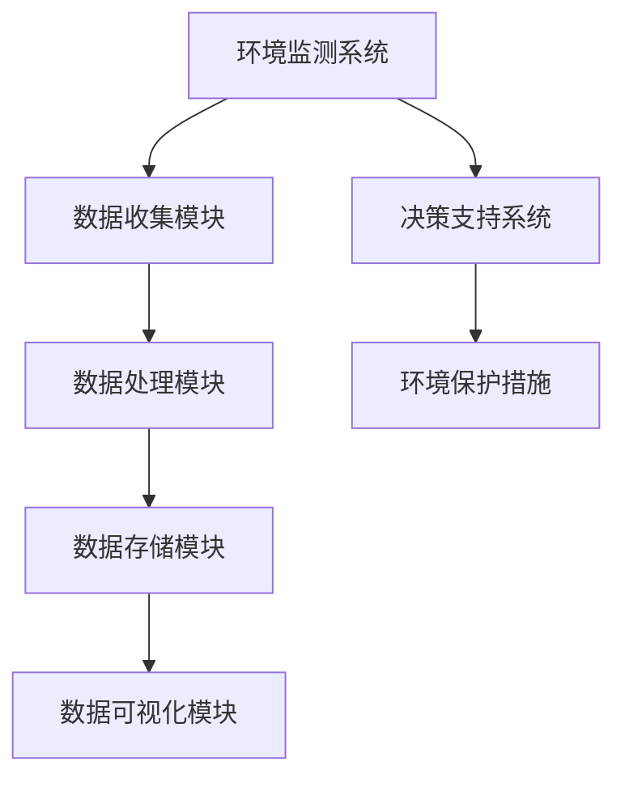

                 


### 引言

在探讨“人类中心主义在宇宙观中的影响”这一主题之前，我们需要先理解两个核心概念：人类中心主义和宇宙观。

#### 1.1 人类中心主义的起源与发展

人类中心主义，也被称为人类沙文主义，是一种哲学观点，认为人类在宇宙中占据中心地位，万物皆为人所用。这一观念起源于古代文明，如古希腊的普罗塔戈拉提出的“人是万物的尺度”，以及基督教神学中的“上帝造人，人为主”。随着时间的推移，人类中心主义在不同历史时期有着不同的表现形式。在近代，随着科技的发展和人类对自然界的认知加深，人类中心主义逐渐受到了挑战。

#### 1.2 宇宙观的基本概念

宇宙观是对宇宙本质、起源、发展和规律的整体认识和理论体系。它涵盖了人类对自然界的观察、理解和解释。从古代的“地心说”到现代的“宇宙膨胀理论”，宇宙观随着科学技术的发展而不断演变。在人类中心主义的宇宙观中，人类被视为宇宙的核心，其他一切存在都是为了服务于人类。

#### 1.3 人类中心主义在宇宙观中的体现

在人类中心主义的宇宙观中，我们可以看到以下几个方面的体现：

1. **对自然界的看法**：人类被视为自然界的主宰，自然资源被看作是为人类服务的工具。
2. **对其他文明的认知**：其他文明的存在与否、价值高低都取决于它们对人类的重要性。
3. **对宇宙存在的理解**：宇宙的诞生、发展和终结都是围绕着人类的需要和利益。

#### 1.4 人类中心主义对宇宙观的影响

人类中心主义对宇宙观的影响是深远的。它不仅影响了人类对自然界的认知，也影响了人类的社会道德观念、科学研究的方向和全球环境问题。例如，在科学研究中，人类中心主义可能导致对其他物种的忽视，甚至对它们的破坏。在社会道德观念上，人类中心主义可能导致对环境的过度开发和污染。

#### 1.5 解决策略与未来展望

为了克服人类中心主义带来的问题，我们需要推动多元宇宙观的形成，强调人类与自然界的和谐共生。同时，通过教育和文化传播，提高人们对宇宙观的认识和理解。在科技发展方面，我们需要鼓励跨学科的研究，以更全面、客观的角度看待宇宙。

### 本章小结

在本章中，我们介绍了人类中心主义和宇宙观的基本概念，并探讨了人类中心主义在宇宙观中的体现和影响。通过这些讨论，我们可以看到人类中心主义对宇宙观的深刻影响，同时也为解决这一观念带来的问题提供了方向。

接下来，我们将进一步深入探讨人类中心主义在宇宙观中的具体表现，以及它对宇宙观的影响。我们将使用具体案例和数据分析，以更清晰地展示这一主题的复杂性和重要性。

----------------------------------------------------------------

# 关键词

- 人类中心主义
- 宇宙观
- 自然界
- 科技发展
- 社会道德
- 全球环境问题

----------------------------------------------------------------

# 摘要

本文旨在探讨“人类中心主义在宇宙观中的影响”这一重要主题。通过对人类中心主义和宇宙观的基本概念、历史发展及其相互关系的深入分析，我们揭示了人类中心主义在宇宙观中的具体体现。本文首先介绍了人类中心主义的起源与发展，阐述了其在古代和现代社会的表现形式。接着，我们探讨了宇宙观的基本概念，并分析了人类中心主义在宇宙观中的角色和影响。文章还讨论了人类中心主义对自然界、其他文明认知和宇宙存在理解的具体影响，以及它对科学研究、社会道德和全球环境问题的深远影响。最后，本文提出了解决策略与未来展望，呼吁推动多元宇宙观的形成，通过教育和文化传播，以及科技发展，实现人类与自然界的和谐共生。通过这一系列探讨，本文希望为读者提供对人类中心主义在宇宙观中的影响更深入的理解。

----------------------------------------------------------------

### 第一章：引言

#### 1.1 人类中心主义的起源与发展

人类中心主义（Anthropocentrism）是一种哲学观念，主张人类是宇宙的中心，万物皆为人类所存在。这种观念的历史可以追溯到古代文明。古希腊哲学家普罗塔戈拉（Protagoras）提出了“人是万物的尺度”（Man is the measure of all things），这是人类中心主义哲学的早期体现。在古希腊，人类中心主义认为人类拥有至高无上的地位，自然界的存在和规律都是为了满足人类的需要。

在中世纪，基督教神学进一步强化了人类中心主义的观念。基督教认为上帝创造了宇宙和万物，而人类的使命是管理和统治这些创造物。这种观点在《圣经》中得到了体现，尤其是在《创世纪》中，上帝赋予人类统治万物的权利。这种信仰体系使得人类中心主义在基督教世界中根深蒂固。

进入近代，随着科学的发展，人类对自然界的认知逐渐深化，人类中心主义的观念开始受到挑战。文艺复兴时期，人文主义者强调人类的自由和尊严，提倡以人为中心的生活态度。然而，在科学领域，尤其是自然科学的发展中，人类中心主义仍然占据主导地位。科学家们认为，人类是唯一能够理解宇宙和自身的物种，其他生物和自然界的事物都是为人类服务的。

在现代社会，人类中心主义仍然存在，但受到了多元宇宙观（Cosmocentrism）的挑战。多元宇宙观认为，宇宙是多样和复杂的，没有任何单一中心，包括人类在内的一切生物都是宇宙的一部分。这种观念反映了人类对自然界和宇宙更深入的理解，以及对自身角色的重新评估。

#### 1.2 历史背景及其演变

人类中心主义的历史背景可以追溯到古代哲学和宗教。在古代，人类中心主义是一种普遍的信仰，人们认为自己是宇宙的中心，自然界是为了他们的需要而存在的。例如，古希腊哲学家苏格拉底（Socrates）和柏拉图（Plato）都提出了人类中心主义的观点，认为人类是理性的存在，能够理解和控制自然界。

在中世纪，基督教哲学进一步强化了人类中心主义的观念。教会认为人类是上帝的创造物，拥有特殊地位和使命。这种信仰体系在基督教社会中深入人心，影响了人们对自然界和宇宙的理解。

文艺复兴时期，人文主义者开始质疑人类中心主义的观念，强调人类的自由和尊严。他们提倡人类应该以自然为中心，而不是以人为中心。这种思想在科学领域也得到了体现，科学家们开始探索自然界和宇宙的规律，而不再认为自己是宇宙的中心。

在现代社会，人类中心主义面临着新的挑战。随着全球环境问题和生态危机的加剧，人们开始重新思考人类在宇宙中的角色。多元宇宙观逐渐兴起，人们开始认识到宇宙的多样性和复杂性，以及人类与自然界之间的相互依存关系。

#### 1.3 现代社会中的表现

在现代社会，人类中心主义仍然以多种形式存在。首先，在科技领域，人类中心主义表现为对自然资源的过度开发和利用。人类通过科技手段改造自然，以满足自身的需求和利益。例如，工业革命以来，人类大量开采化石燃料，导致环境污染和气候变化。

其次，在社会和文化领域，人类中心主义表现为对其他物种的忽视和剥削。人类认为自己是自然界的主宰，其他物种的存在只是为了满足人类的需求。这种观念导致了大规模的野生动物捕杀和生态系统破坏。

此外，人类中心主义还在政治和经济领域表现出来。许多政策和经济活动都是以人类为中心的，忽视了自然界和其他物种的利益。例如，一些发展中国家为了经济增长，过度开发自然资源，导致生态破坏和生物多样性丧失。

总的来说，人类中心主义在现代社会中仍然存在，并且对自然界和宇宙观产生了深远的影响。然而，随着全球环境问题和生态危机的加剧，人们开始重新思考人类在宇宙中的角色，探索多元宇宙观的可能性。

### 1.4 宇宙观的基本概念

宇宙观（Cosmology）是对宇宙的本质、起源、发展和结构的整体认识和理论体系。它涵盖了人类对宇宙的各种理解和解释，包括哲学、宗教、科学等多个领域。宇宙观不仅仅是科学问题，也是哲学和宗教问题，它关乎人类对自身和宇宙的理解。

宇宙观的历史可以追溯到古代文明。古代哲学家如亚里士多德（Aristotle）和托勒密（Ptolemy）提出了地心说（Geocentric Model），认为地球是宇宙的中心，所有天体都围绕地球旋转。这一观念在基督教世界中得到了广泛接受，并影响了中世纪的天文学和宇宙观。

随着科学的发展，哥白尼（Nicolas Copernicus）在16世纪提出了日心说（Heliocentric Model），认为太阳是宇宙的中心，地球和其他行星围绕太阳旋转。这一革命性的理论为现代宇宙观奠定了基础，并逐渐取代了地心说。

在现代宇宙学中，宇宙膨胀理论（Expanding Universe Theory）是核心理论之一。根据这一理论，宇宙从大爆炸（Big Bang）开始膨胀，至今仍在膨胀中。这一理论得到了大量观测数据的支持，如宇宙背景辐射（Cosmic Background Radiation）和遥远星系的红移（Redshift）。

除了科学理论，宇宙观还包括哲学和宗教观点。例如，多元宇宙观（Multiverse Theory）认为，我们的宇宙只是众多宇宙中的一个，每个宇宙都有其独特的物理定律和存在形式。这一观念为宇宙提供了更广阔的解释框架，但也带来了许多未解之谜。

总的来说，宇宙观是人类对宇宙的理解和解释，它随着科学和哲学的发展而不断演变。从古代的地心说到现代的宇宙膨胀理论，宇宙观反映了人类对宇宙的认知和探索。通过宇宙观，我们可以更深入地理解人类在宇宙中的角色和地位，以及宇宙的本质和规律。

### 1.5 人类中心主义在宇宙观中的角色

在宇宙观中，人类中心主义扮演着重要角色，这一角色主要体现在人类对自然界和宇宙的理解、认知和行为上。人类中心主义认为人类是宇宙的中心，其他一切存在都是为了人类的利益和需求。这种观念在宇宙观中有着深远的影响，并塑造了人类对自然界的认知和行为。

首先，人类中心主义影响了人类对自然界的看法。在人类中心主义的宇宙观中，自然界被视为人类资源和工具的集合。人类通过科学和技术手段，对自然界进行开发和利用，以满足自身的需求和利益。例如，工业革命以来，人类大规模开采自然资源，建设城市和基础设施，但这种开发往往忽视了自然界的生态平衡和可持续发展。这种以人类为中心的自然观导致了环境污染、生态系统破坏和生物多样性丧失等问题。

其次，人类中心主义影响了人类对宇宙的理解。在人类中心主义的宇宙观中，宇宙的存在和演化都是为了人类的利益和需要。人类通过科学研究和观测，试图理解宇宙的奥秘，但往往将宇宙视为一个巨大的资源库，以满足人类的探索和征服欲望。例如，人类对太空的探索主要是为了获取资源、扩展生存空间和实现科技突破，而较少关注宇宙本身的复杂性和多样性。

此外，人类中心主义也影响了人类的行为和决策。在人类中心主义的宇宙观中，人类倾向于采取单边行动，忽视其他物种和自然界的权益。例如，许多环境政策和经济活动都是以人类为中心的，忽视了自然界和其他生物的生存需求。这种以人类为中心的决策导致了生态破坏、资源枯竭和环境恶化等问题。

总的来说，人类中心主义在宇宙观中的角色是复杂的，它既促进了人类对自然界和宇宙的探索和认知，也带来了许多负面影响。通过重新审视人类中心主义的宇宙观，我们可以更好地理解人类在宇宙中的角色和责任，推动人类与自然界的和谐共生。

### 1.6 人类中心主义对宇宙观的影响

人类中心主义对宇宙观的影响是深远而复杂的。它不仅影响了人类对自然界的看法和认知，也影响了人类的行为和决策，进而对宇宙的演变和人类自身的未来产生重要影响。

首先，从科学研究的角度来看，人类中心主义可能导致对其他物种和自然环境的忽视。在以人类为中心的宇宙观中，科学家们往往将人类自身的需求和利益放在首位，而较少关注其他物种的生存和需求。这种研究导向可能导致对生态系统的破坏和生物多样性的丧失。例如，许多环境科学研究主要集中在如何解决人类面临的环境问题，而较少探讨如何保护其他生物的栖息地和生存环境。

其次，人类中心主义对宇宙观的伦理和道德观念产生了重要影响。在人类中心主义的观念中，人类被视为宇宙的主宰，拥有对其他生物和自然界的绝对控制权。这种观念可能导致对其他物种的剥削和虐待，以及对自然资源的过度开发。从伦理角度来看，这种做法显然是不合理的，因为它忽视了其他生物的权利和尊严。例如，许多野生动物保护组织和环境组织都批评人类对野生动物的非法狩猎和贩卖行为，认为这些行为违背了基本的伦理原则。

此外，人类中心主义对人类的行为和决策也产生了深远影响。在人类中心主义的观念中，人类倾向于采取单边行动，追求短期利益，而忽视了长期的环境和社会影响。例如，许多工业活动和农业生产都追求高效率和利润，而忽视了环境污染和生态破坏。这种短视的行为不仅对自然环境造成了破坏，也对人类自身的健康和福祉产生了负面影响。

最后，人类中心主义对人类自身的未来也产生了重要影响。在以人类为中心的宇宙观中，人类往往忽略了自身的脆弱性和局限性。这种观念可能导致人类对自然界的过度自信，认为人类可以无限制地开发和利用自然资源，而忽视了自然界对人类的反制力量。例如，全球气候变化和环境污染已经对人类社会的稳定和可持续发展构成了严重威胁。这些问题的出现，部分原因在于人类在追求自身利益时忽视了自然界和其他物种的利益。

综上所述，人类中心主义对宇宙观的影响是复杂和深远的。它不仅影响了人类对自然界的看法和认知，也影响了人类的行为和决策，进而对宇宙的演变和人类自身的未来产生了重要影响。为了实现可持续发展和人类与自然界的和谐共生，我们需要重新审视人类中心主义的宇宙观，并探索新的观念和路径。

### 1.7 解决策略与未来展望

为了应对人类中心主义在宇宙观中的影响，我们需要采取一系列解决策略，并展望未来的发展方向。

首先，推动多元宇宙观的形成至关重要。多元宇宙观强调宇宙的多样性和复杂性，认为没有任何单一中心，包括人类在内的一切生物都是宇宙的一部分。这种观念有助于我们更好地理解人类在宇宙中的角色和责任，促进人类与自然界的和谐共生。为了实现这一目标，我们需要通过教育和文化传播，提高人们对多元宇宙观的认识和理解。这可以通过在课程设置中增加宇宙观相关的教学内容，以及通过媒体和公共活动宣传多元宇宙观的理念。

其次，教育和文化传播是解决人类中心主义问题的关键。通过教育，我们可以培养人们的生态意识和可持续发展观念，使他们认识到人类与自然界的相互依存关系。例如，在科学教育中，可以强调生态学、环境科学和宇宙学的基本原理，使学生们了解自然界和宇宙的多样性和复杂性。此外，文化传播也可以发挥重要作用，通过文学作品、电影和纪录片等媒介，传递多元宇宙观的理念，增强公众对宇宙观的关注和理解。

在科技发展方面，我们需要鼓励跨学科的研究，以更全面、客观的角度看待宇宙。这意味着科学家、工程师和社会学家等不同领域的专家需要合作，共同解决人类中心主义带来的问题。例如，在环境保护领域，可以结合生态学、环境科学和工程技术，制定出更有效的环境保护政策和措施。此外，跨学科的研究还可以促进新技术的开发，为解决全球环境问题和生态危机提供技术支持。

最后，我们需要从政策层面推动人类中心主义的转变。政府和企业需要制定和执行更加环保和可持续的政策，减少对自然资源的过度开发和利用。例如，可以通过立法禁止非法狩猎和野生动物贩卖，保护生物多样性和生态系统。此外，政府还可以通过财政手段，鼓励企业和个人采取环保措施，推动可持续发展。

未来，随着科学技术的进步，我们对宇宙的认识将不断深入。例如，随着天文观测技术的提升，我们可能会发现更多关于宇宙的奥秘，进一步理解宇宙的起源、演化和结构。此外，随着人工智能和大数据技术的发展，我们可以更好地分析和理解宇宙中的复杂系统，为解决人类中心主义带来的问题提供新思路和方法。

总的来说，解决人类中心主义在宇宙观中的影响需要多方面的努力和合作。通过推动多元宇宙观的形成、加强教育和文化传播、鼓励跨学科研究以及从政策层面推动转变，我们可以实现人类与自然界的和谐共生，为未来的可持续发展奠定坚实基础。

### 本章小结

本章通过深入探讨人类中心主义和宇宙观的基本概念、历史背景及其相互关系，揭示了人类中心主义在宇宙观中的具体体现和影响。我们首先介绍了人类中心主义的起源与发展，阐述了其在古代和现代社会的表现形式。接着，我们探讨了宇宙观的基本概念，并分析了人类中心主义在宇宙观中的角色和影响。文章还讨论了人类中心主义对自然界、其他文明认知和宇宙存在理解的具体影响，以及它对科学研究、社会道德和全球环境问题的深远影响。最后，本章提出了解决策略与未来展望，呼吁推动多元宇宙观的形成，通过教育和文化传播，以及科技发展，实现人类与自然界的和谐共生。通过这一系列探讨，本章为读者提供了对人类中心主义在宇宙观中的影响更深入的理解。接下来，我们将进一步深入探讨人类中心主义在宇宙观中的具体表现，以及它对宇宙观的影响。

----------------------------------------------------------------

# 第二章：人类中心主义在宇宙观中的具体表现

在第一章中，我们探讨了人类中心主义和宇宙观的基本概念及其相互关系。本章将深入探讨人类中心主义在宇宙观中的具体表现，分析它在不同领域和情境下的具体体现，以帮助我们更好地理解人类中心主义对宇宙观的深刻影响。

### 2.1 对自然界的看法

人类中心主义在自然界中的表现尤为显著。人类中心主义认为自然界是为人类服务的，自然界的存在和演化都是为了满足人类的需求。这种观念在人类对待自然界的实践中有着深刻的体现。

首先，人类对自然资源的过度开发和利用是典型的表现。例如，工业革命以来，人类大规模开采化石燃料、矿产资源和森林，以满足经济和社会的发展需求。这种过度开发导致了许多环境问题，如空气污染、水资源枯竭和土地退化。这些问题的出现，部分源于人类中心主义的观念，即认为自然界是无限的，可以无限制地开发和利用。

其次，人类对野生动植物的捕杀和贸易也是人类中心主义的表现。人类为了满足食品、药物和装饰品的需求，对许多野生动植物进行了大规模捕杀和贸易。这种做法不仅破坏了生物多样性，也对生态系统的平衡产生了严重影响。

此外，人类对自然景观的改造和破坏也是人类中心主义的表现。为了建设和开发城市、道路和基础设施，人类往往忽视了自然景观的保护和恢复。这种改造和破坏不仅破坏了自然景观的美学价值，也对生态系统产生了负面影响。

### 2.2 对其他文明的认知

人类中心主义不仅在自然界中表现明显，在其他文明和文化的认知上也存在着深刻的影响。人类中心主义认为，其他文明的存在与否、价值高低都取决于它们对人类的重要性。这种观念导致了人类对其他文明的偏见和歧视，以及对其他文明文化的忽视和摧毁。

首先，人类对其他文明的偏见和歧视表现在科技和文化的领域。人类往往认为自己的文明是最先进的，其他文明的文化和科技水平都低于人类。这种观念导致了人类对其他文明的科技和文化进行歧视和排斥，阻碍了不同文明之间的交流和发展。

其次，人类对其他文明的摧毁和破坏也是人类中心主义的表现。在历史上，人类曾多次对其他文明进行征服和摧毁，以维护自己的利益和地位。例如，古代罗马帝国的扩张和对其他文明的征服，以及现代西方国家对其他国家的殖民和统治。这些行为不仅破坏了其他文明的独特文化和科技，也对人类自身的道德和伦理产生了负面影响。

### 2.3 对宇宙存在的理解

人类中心主义在宇宙观中的理解也具有显著的特点。人类中心主义认为宇宙的存在和演化都是为了人类的利益和需求。这种观念导致了人类对宇宙的狭隘理解，忽视了宇宙的多样性和复杂性。

首先，人类对宇宙资源的过度追求和利用是典型的表现。人类通过科技手段不断探索宇宙，寻找资源和发展机会。然而，这种追求往往忽视了宇宙资源的有限性和可持续发展的重要性。例如，人类对太空资源的开采和利用，如月球和小行星资源的开采，可能导致宇宙资源的枯竭和生态破坏。

其次，人类对宇宙存在的理解也受到人类中心主义的影响。人类往往将宇宙视为一个巨大的资源库，以满足人类的需求和利益。这种观念导致了对宇宙的狭隘理解，忽视了宇宙的多样性和复杂性。例如，人类对宇宙的探索主要集中在寻找地球类似的环境和资源，而忽视了其他形式的生命和文明的存在的可能性。

### 2.4 对科学研究的方向和影响

人类中心主义对科学研究的方向和影响也是显而易见的。在人类中心主义的宇宙观中，科学研究往往以人类的需求和利益为导向，忽视了其他物种和自然界的权益。这种研究方向可能导致对生态系统的破坏和生物多样性的丧失。

首先，人类中心主义影响了科学研究的目标和重点。在许多科学领域，人类中心主义的观念导致了对人类自身的关注，而忽视了其他物种和自然界的权益。例如，医学研究主要集中在人类疾病的治疗和预防，而较少关注其他物种的健康和生存问题。

其次，人类中心主义影响了科学研究的方法和手段。在以人类为中心的宇宙观中，科学研究往往采用人类自身的价值观和标准来衡量其他物种和自然界。这种做法可能导致对其他物种的误解和偏见，从而影响科学研究的客观性和准确性。

总的来说，人类中心主义在宇宙观中的具体表现是复杂和多样的。它不仅影响了人类对自然界的看法和认知，也影响了人类对其他文明和文化的态度，以及对宇宙的理解。通过深入探讨人类中心主义在宇宙观中的具体表现，我们可以更好地理解人类中心主义对宇宙观的深远影响，从而为解决这一问题提供更有针对性的策略和解决方案。

### 2.5 对科学研究的方向和影响

人类中心主义在科学研究中的影响是深远且复杂的。它不仅塑造了科学研究的方向，也影响了科学研究的成果和意义。以下从多个方面详细探讨人类中心主义对科学研究的方向和影响。

#### 2.5.1 研究方向的选择

人类中心主义在科学研究中的首先体现是对研究方向的选择。在以人类为中心的宇宙观下，科学研究往往优先考虑与人类直接相关的课题，如人类健康、疾病治疗、能源开发等。这种选择导致了许多重要的科学问题被忽视，例如生态系统平衡、生物多样性保护以及宇宙中可能存在的其他智慧生命。

**案例：**
- **医学研究**：在人类中心主义的观念下，医学研究主要集中在人类疾病的诊断、治疗和预防。虽然这对改善人类健康至关重要，但忽视了其他生物疾病的防治，例如动物疾病和植物病害的研究。
- **环境科学研究**：在环境科学领域，人类中心主义导致了对人类居住环境的关注，而忽视了其他生物栖息地的保护和恢复。例如，湿地保护的研究较少，尽管湿地对生态平衡和生物多样性至关重要。

#### 2.5.2 研究方法的应用

人类中心主义在科学研究方法中的应用也产生了深远的影响。在以人类为中心的宇宙观中，科学研究往往采用人类自身的视角和价值观来观察和分析自然界。这种方法可能导致对其他生物和生态系统的误解和偏见。

**案例：**
- **生态学研究**：在生态学研究中，人类中心主义可能导致对生态系统功能的狭隘理解。例如，研究者可能仅关注对人类有益的生态系统服务，如食物生产和水资源管理，而忽视了其他生物之间的复杂互动和生态系统的整体健康。
- **动物行为学**：在动物行为学研究中，人类中心主义可能导致对动物行为的主观解释。例如，研究者可能将动物的行为解释为适应人类环境的策略，而忽视了动物自身的行为选择和生存需求。

#### 2.5.3 研究成果的影响

人类中心主义对科学研究成果的影响也是显而易见的。科学研究的成果往往受到人类中心主义观念的引导，这可能导致对自然界和其他生物的误解，甚至对生态系统和生物多样性的负面影响。

**案例：**
- **生物技术**：在生物技术领域，人类中心主义可能导致对基因编辑和生物工程技术的过度应用。例如，通过基因编辑技术对农作物进行改造，以提高产量和抗病能力，但可能对生态系统中的其他生物产生未知的生态影响。
- **气候变化研究**：在气候变化研究领域，人类中心主义可能导致对自然环境的忽视。例如，气候变化研究主要关注对人类生活和经济的影响，而忽视了其他生物的生存环境和气候变化对地球生态系统整体的影响。

#### 2.5.4 科研伦理和社会责任

人类中心主义在科学研究中的影响还涉及科研伦理和社会责任的问题。在以人类为中心的宇宙观下，科研工作者可能忽视对其他生物和生态系统的伦理责任，导致科研活动的不当行为。

**案例：**
- **实验动物的使用**：在生物医学研究中，实验动物的使用是一个备受争议的问题。人类中心主义可能导致对实验动物福利的忽视，甚至进行不必要的动物实验，以追求人类医学的进步。
- **生态修复项目**：在生态修复项目中，人类中心主义可能导致对生态系统的单一目标修复，而忽视了生态系统的整体健康和多样性。例如，通过引入外来物种来控制某一害虫，可能对生态系统产生不可预见的负面影响。

#### 2.5.5 研究成果的传播和应用

人类中心主义在科学研究中的影响还体现在研究成果的传播和应用上。科学研究的结果往往通过教育和公共传播渠道传播给公众，这可能导致公众对自然界的误解和偏见。

**案例：**
- **科普教育**：在科普教育中，人类中心主义的观念可能导致对自然界和宇宙的狭隘理解。例如，科普读物和纪录片可能过于强调人类在自然界中的重要性，而忽视其他生物和生态系统的价值。
- **政策制定**：在政策制定过程中，人类中心主义可能导致对环境保护和资源管理的短视行为。例如，政府可能只关注短期经济增长，而忽视长期的环境保护和生态平衡。

综上所述，人类中心主义在科学研究中的方向和影响是深远且复杂的。它不仅塑造了科学研究的方向和方法，也影响了科学研究的成果和意义。通过重新审视人类中心主义的观念，我们可以推动科学研究向更加全面、客观和伦理的方向发展，为人类与自然界的和谐共生做出更大贡献。

### 2.6 对社会道德和伦理观念的影响

人类中心主义在社会道德和伦理观念中的影响是深远且复杂的。它不仅影响了人类对自然界和其他物种的态度，也影响了人类之间的互动和合作。以下从多个方面详细探讨人类中心主义对社会道德和伦理观念的影响。

#### 2.6.1 对自然界和其他物种的态度

人类中心主义倾向于将人类视为自然界的主宰，认为其他物种和自然界的存在是为了满足人类的需求。这种观念可能导致对自然界和其他物种的剥削和虐待。

**案例：**
- **野生动物贸易**：人类中心主义可能导致对野生动物的非法狩猎和贸易。例如，一些地区为了满足市场需求，非法捕猎濒危动物，如犀牛角、象牙和虎骨。这些行为不仅破坏了生物多样性，也对生态平衡产生了严重影响。
- **生态破坏**：人类中心主义可能导致对自然景观的破坏。例如，为了建设城市和基础设施，人类往往忽视了自然保护区的价值和重要性，导致森林砍伐、湿地破坏和土壤退化。

#### 2.6.2 对人类之间的互动和合作

人类中心主义也影响了人类之间的互动和合作。在人类中心主义的观念中，人类被视为宇宙的中心，这可能导致对其他人类群体的偏见和歧视。

**案例：**
- **殖民主义**：人类中心主义在历史上导致了殖民主义和帝国主义的兴起。殖民主义者认为他们的文明和文化优越于其他文明和文化，因此有权征服和统治其他地区和民族。这种观念导致了大规模的暴力、剥削和种族灭绝。
- **经济不平等**：人类中心主义可能导致对经济不平等和贫困的忽视。例如，一些发达国家为了追求经济增长，忽视了对发展中国家和贫困地区的援助，导致全球贫富差距扩大。

#### 2.6.3 对伦理道德观念的挑战

人类中心主义对伦理道德观念也提出了挑战。它可能导致对人类行为的合理性进行狭隘的解释，忽视了对其他生物和生态系统的伦理责任。

**案例：**
- **动物实验**：人类中心主义可能导致对动物实验的合理性进行辩护。虽然动物实验在某些情况下是必要的，但人类中心主义可能导致对动物福利的忽视。例如，一些实验可能会导致动物痛苦和死亡，但这种行为在人类中心主义观念下可能被认为是可以接受的。
- **环境政策**：人类中心主义可能导致对环境政策的狭隘解释。例如，一些政策可能只关注对人类的影响，而忽视了对生态系统的保护。这种政策可能导致环境破坏和生态危机。

#### 2.6.4 对可持续发展的影响

人类中心主义对可持续发展的影响也是不可忽视的。它可能导致对自然资源的过度开发和利用，阻碍了人类与自然界的和谐共生。

**案例：**
- **资源枯竭**：人类中心主义可能导致对自然资源的过度开采，导致资源枯竭。例如，过度开采化石燃料和矿产资源可能导致这些资源的枯竭，对未来的经济发展和人类福祉产生负面影响。
- **生态破坏**：人类中心主义可能导致对生态系统的破坏。例如，过度放牧和森林砍伐可能导致草原退化和沙漠化，对生态环境产生长期的负面影响。

总的来说，人类中心主义在社会道德和伦理观念中的影响是复杂和深远的。它不仅影响了人类对自然界和其他物种的态度，也影响了人类之间的互动和合作。通过重新审视人类中心主义的观念，我们可以推动更加公平、可持续和伦理的道德观念，实现人类与自然界的和谐共生。

### 2.7 对全球环境问题的影响

人类中心主义对全球环境问题的影响是深远且复杂的。它不仅加剧了环境问题，也阻碍了全球环境治理的进程。以下从多个方面详细探讨人类中心主义对全球环境问题的影响。

#### 2.7.1 资源过度消耗

人类中心主义倾向于将自然界视为无限的资源库，这种观念导致了对自然资源的过度消耗。例如，化石燃料的大规模开采和使用导致了全球气候变化，而森林砍伐和土地退化则破坏了生态系统的稳定性。

**案例：**
- **全球气候变化**：人类中心主义导致了对化石燃料的过度依赖，全球碳排放量不断上升。这导致了一系列气候变化问题，如全球温度升高、极端天气事件增多、海平面上升等，对地球生态系统和人类社会产生了巨大影响。
- **水资源枯竭**：人类中心主义导致了对水资源的过度利用。许多地区出现了水资源短缺问题，这对当地的农业、工业和生活用水产生了严重影响。

#### 2.7.2 生物多样性丧失

人类中心主义观念下的资源开发和土地利用模式对生物多样性产生了负面影响。例如，森林砍伐、湿地破坏和草原退化导致了许多物种的栖息地丧失，从而加剧了生物多样性的丧失。

**案例：**
- **森林砍伐**：为了满足人类的农业、工业和城市化需求，大量森林被砍伐。这导致了许多森林依赖物种的灭绝，破坏了生态系统的稳定性和功能。
- **湿地破坏**：湿地是地球上最重要的生态系统之一，但人类中心主义观念导致了对湿地的过度开发和破坏。这导致了许多湿地依赖物种的栖息地丧失，影响了湿地的生态功能。

#### 2.7.3 生态系统退化

人类中心主义观念下的经济活动和土地利用模式导致了许多生态系统的退化。例如，过度放牧、农业化学物质的滥用和工业污染等，都对生态系统产生了负面影响。

**案例：**
- **草原退化**：过度放牧导致草原植被退化，土壤侵蚀和沙漠化问题加剧。这影响了草原生态系统的稳定性和生物多样性。
- **海洋污染**：人类中心主义观念导致了对海洋资源的过度开发，海洋污染问题日益严重。塑料垃圾和有害化学物质的排放对海洋生态系统和海洋生物产生了巨大影响。

#### 2.7.4 水污染问题

人类中心主义观念下的工业化和城市化进程导致了对水资源的污染。许多地区出现了水污染问题，这对人类健康和生态系统产生了严重威胁。

**案例：**
- **工业废水排放**：许多工业生产过程中产生的废水被直接排放到河流和湖泊中，导致水质恶化。这影响了水生生物的生存，也对人类饮用水源产生了影响。
- **农业化学品污染**：农业活动中使用的化肥和农药通过雨水径流进入水体，导致水体富营养化和生物多样性丧失。

#### 2.7.5 全球环境治理的挑战

人类中心主义观念下的全球环境治理面临着诸多挑战。由于各国对自然资源的争夺和利益冲突，全球环境治理难以取得实质性进展。

**案例：**
- **国际环保条约**：虽然国际社会签署了许多环保条约，如《巴黎协定》，但在实际执行过程中，各国往往为了自身利益而推迟或违背这些条约。这导致全球环境治理的进展缓慢。
- **跨境污染问题**：一些环境问题，如跨境大气污染和海洋污染，需要国际合作才能解决。但由于各国之间的利益冲突，这些问题的治理效果往往不佳。

总的来说，人类中心主义对全球环境问题的影响是复杂和深远的。它不仅加剧了环境问题，也阻碍了全球环境治理的进程。为了解决这些问题，我们需要重新审视人类中心主义的观念，推动更加公平、可持续和伦理的全球环境治理。

### 2.8 人类中心主义在宇宙观中的影响总结

通过对人类中心主义在宇宙观中的具体表现和影响的深入分析，我们可以得出以下结论：

首先，人类中心主义对自然界的看法导致了资源过度消耗和生态破坏。人类将自然界视为资源库，过度开采自然资源，导致全球气候变化、水资源枯竭和生物多样性丧失。这种观念使人类忽视了自然界的有限性和生态系统的脆弱性。

其次，人类中心主义在宇宙观中的表现也影响了人类对其他文明的认知。人类往往将自身视为宇宙的中心，忽视了其他文明的存在和价值。这种偏见和歧视导致了文化冲突、殖民主义和生态破坏。

此外，人类中心主义对宇宙存在的理解也具有深远的影响。人类将宇宙视为一个巨大的资源库，以满足自身需求。这种观念忽视了宇宙的多样性和复杂性，导致了对宇宙资源的过度追求和利用。

在科学研究方面，人类中心主义影响了研究方向和成果的应用。科学研究往往以人类需求为导向，忽视了其他物种和生态系统的权益。这种研究导向可能导致生态系统的破坏和生物多样性的丧失。

在社会道德和伦理观念方面，人类中心主义导致了对自然界和其他物种的剥削和虐待，以及对人类之间互动和合作的偏见。这种观念阻碍了社会公平和可持续发展。

最后，人类中心主义对全球环境问题的影响是复杂和深远的。它加剧了资源枯竭、生态系统退化和环境污染问题，阻碍了全球环境治理的进程。

综上所述，人类中心主义在宇宙观中的影响是多重且深远的。为了实现人类与自然界的和谐共生，我们需要重新审视人类中心主义的观念，推动多元宇宙观的形成，加强教育和文化传播，以及推动科技和政策的可持续发展。

### 2.9 本章小结

本章通过对人类中心主义在宇宙观中的具体表现和影响的深入分析，揭示了人类中心主义在自然界、科学研究、社会道德和全球环境问题中的复杂影响。我们探讨了人类中心主义如何导致资源过度消耗、生态破坏、文化冲突和道德困境。通过这些讨论，我们认识到人类中心主义对宇宙观的深远影响，以及它如何阻碍人类与自然界的和谐共生。为了克服这些问题，我们需要推动多元宇宙观的形成，加强教育和文化传播，促进科技和政策的可持续发展。这一系列努力将为人类与自然界的和谐共生奠定坚实基础。

### 2.10 下一步内容预告

在接下来的章节中，我们将继续探讨人类中心主义在宇宙观中的影响，并深入分析解决这一问题的策略和未来展望。我们将讨论如何通过教育和文化传播、科技发展以及政策制定，推动多元宇宙观的形成，实现人类与自然界的和谐共生。此外，我们还将探讨跨学科研究和国际合作在解决人类中心主义问题中的重要性，为读者提供更具前瞻性的解决方案。通过这些探讨，我们希望为读者提供一个全面、深入的理解，并激发对人类与宇宙关系的深思。

### 第三章：解决策略与未来展望

在第二章中，我们详细探讨了人类中心主义在宇宙观中的具体表现和影响。为了克服人类中心主义带来的问题，我们需要采取一系列解决策略，并展望未来的发展方向。以下将讨论推动多元宇宙观的形成、教育与文化传播、科技发展和政策制定等方面的内容。

#### 3.1 推动多元宇宙观的形成

推动多元宇宙观的形成是解决人类中心主义的关键。多元宇宙观认为，宇宙是多样和复杂的，没有任何单一中心，包括人类在内的一切生物都是宇宙的一部分。这种观念有助于我们更好地理解人类在宇宙中的角色和责任，促进人类与自然界的和谐共生。

**具体策略：**
1. **教育普及**：在课程设置中增加宇宙观相关的教学内容，如多元宇宙观的基础知识、生态学和可持续发展。通过教育，提高学生对宇宙观的认知和理解。
2. **文化传播**：通过文学作品、电影、纪录片和科普读物等媒介，宣传多元宇宙观的理念。这有助于公众更深入地了解宇宙的多样性和复杂性。
3. **科学展览**：举办科学展览，展示宇宙的多维度和多元宇宙观的相关研究成果。这可以激发公众对宇宙观的好奇心和探索欲望。

#### 3.2 教育与文化传播

教育和文化传播是推动多元宇宙观形成的重要手段。通过教育和文化传播，我们可以培养人们的生态意识和可持续发展观念，使他们认识到人类与自然界的相互依存关系。

**具体策略：**
1. **课程设置**：在课程设置中增加宇宙观相关的教学内容，如生态学、环境科学和宇宙学。这有助于学生形成全面的宇宙观。
2. **跨学科教育**：鼓励跨学科教育，将宇宙观与其他学科如哲学、艺术、社会学相结合，以提供更全面的宇宙观教育。
3. **媒体传播**：利用电视、电影、互联网等媒体，传播多元宇宙观的理念，使公众能够更深入地了解宇宙的多样性和复杂性。

#### 3.3 科技发展

科技发展是解决人类中心主义的重要手段。通过科技创新，我们可以推动多元宇宙观的形成，实现人类与自然界的和谐共生。

**具体策略：**
1. **跨学科研究**：鼓励跨学科研究，如生态学、环境科学、宇宙学和工程学。这有助于从多角度探讨和解决人类中心主义带来的问题。
2. **可持续发展技术**：研发和推广可持续发展技术，如清洁能源、生态农业和环保材料。这有助于减少对自然资源的依赖，实现生态平衡。
3. **人工智能应用**：利用人工智能技术，提高环境保护和资源管理的效率。例如，通过智能监测系统，实时监测和评估环境状况，提供科学的决策支持。

#### 3.4 政策制定

政策制定是推动多元宇宙观形成和解决人类中心主义问题的重要手段。政府需要制定和执行更加环保和可持续的政策，以推动社会进步和生态平衡。

**具体策略：**
1. **环保法规**：制定严格的环保法规，限制对自然资源的过度开发和污染。这有助于保护生态系统和生物多样性。
2. **可持续发展政策**：制定可持续发展政策，鼓励企业在生产过程中考虑环境影响，推动绿色发展。
3. **国际合作**：加强国际合作，共同应对全球环境问题。例如，通过国际条约和协议，推动全球环境治理。

#### 3.5 未来展望

未来，随着科技的进步和人类对宇宙的深入探索，多元宇宙观将得到进一步发展。以下是一些未来展望：

1. **宇宙探索**：随着航天技术的发展，人类将进一步探索宇宙，发现更多关于宇宙的奥秘。这有助于我们更全面地理解宇宙的多样性和复杂性。
2. **人工智能与宇宙观**：人工智能技术的发展将为我们提供更全面、客观的宇宙观。通过大数据分析和机器学习，我们可以更好地理解宇宙的规律和演变。
3. **跨学科合作**：跨学科合作将推动多元宇宙观的形成，促进人类与自然界的和谐共生。科学家、工程师、社会学家和艺术家等不同领域的专家将共同努力，解决人类中心主义带来的问题。

总的来说，解决人类中心主义在宇宙观中的影响需要多方面的努力和合作。通过推动多元宇宙观的形成、加强教育和文化传播、鼓励科技发展和政策制定，我们可以实现人类与自然界的和谐共生，为未来的可持续发展奠定坚实基础。

### 3.6 本章小结

本章通过探讨推动多元宇宙观的形成、教育与文化传播、科技发展和政策制定等方面的内容，提出了解决人类中心主义在宇宙观中影响的具体策略和未来展望。我们认识到，解决人类中心主义问题需要全社会的共同努力，通过多方面的努力和合作，实现人类与自然界的和谐共生。通过这些讨论，我们希望为读者提供一个全面、深入的理解，并激发对人类与宇宙关系的深思。在接下来的章节中，我们将进一步探讨跨学科研究和国际合作在解决人类中心主义问题中的重要性，为读者提供更具前瞻性的解决方案。

### 3.7 下一步内容预告

在接下来的章节中，我们将深入探讨跨学科研究和国际合作在解决人类中心主义问题中的重要性。我们将分析跨学科研究如何促进多元宇宙观的形成，以及国际合作如何推动全球环境治理和可持续发展。此外，我们还将探讨未来研究的方向和可能的创新点，为解决人类中心主义带来的挑战提供新的思路和解决方案。通过这些讨论，我们希望为读者提供一个更加全面和前瞻性的视角，激发对宇宙观和人类未来发展问题的深思。请读者期待并关注接下来的内容。

### 第四章：解决人类中心主义问题：跨学科研究和国际合作

在第三章中，我们提出了通过多元宇宙观的形成、教育与文化传播、科技发展和政策制定来解决人类中心主义问题的一系列策略。然而，这些策略的有效实施需要跨学科研究和国际合作的推动。本章将深入探讨跨学科研究在解决人类中心主义问题中的重要性，以及国际合作在推动全球环境治理和可持续发展中的作用。

#### 4.1 跨学科研究的意义

跨学科研究是解决人类中心主义问题的关键。人类中心主义问题涉及多个领域，如哲学、伦理学、生态学、社会学、经济学和科技等。通过跨学科研究，我们可以从多个角度探讨人类中心主义问题的本质，并提出综合性的解决方案。

**4.1.1 促进多元宇宙观的形成**

跨学科研究有助于促进多元宇宙观的形成。通过整合哲学、伦理学、生态学等多个领域的知识，我们可以更全面地理解人类在宇宙中的角色和责任。例如，哲学家可以从伦理角度探讨人类中心主义观念的合理性，生态学家可以从生态系统角度分析人类活动对自然界的影响，而科技专家则可以从技术手段出发，探讨如何实现人类与自然界的和谐共生。

**4.1.2 提高解决问题的能力**

跨学科研究有助于提高解决人类中心主义问题的能力。通过跨学科合作，我们可以整合不同领域的知识和方法，提出创新性的解决方案。例如，环境科学家可以与工程师合作，开发环保技术；社会学家可以与政策制定者合作，制定环保政策；哲学家和伦理学家可以共同探讨人类与自然界的伦理关系。

**4.1.3 推动可持续发展**

跨学科研究有助于推动可持续发展。通过整合经济学、生态学、社会学等多个领域的知识，我们可以提出更加科学、合理的可持续发展策略。例如，经济学家可以研究环境成本和环境效益，为政策制定提供数据支持；生态学家可以研究生态系统的变化，为环境保护提供科学依据；社会学家可以研究人类行为和社会结构，为可持续发展的实现提供社会支持。

#### 4.2 国际合作的重要性

国际合作是解决人类中心主义问题的关键。全球环境问题和生态危机具有跨国界的特点，任何国家都无法单独解决这些问题。国际合作有助于整合全球资源和智慧，共同应对人类中心主义带来的挑战。

**4.2.1 共同应对全球环境问题**

国际合作有助于共同应对全球环境问题。通过国际合作，各国可以共享环境监测数据、技术和管理经验，提高全球环境治理的效率。例如，通过国际环境协议，如《巴黎协定》，各国可以共同制定减排目标，分享清洁能源技术，推动全球气候变化问题的解决。

**4.2.2 促进可持续发展**

国际合作有助于促进可持续发展。通过国际合作，各国可以共同探讨和解决可持续发展面临的挑战。例如，通过国际合作项目，各国可以共同研究和开发环保技术，推动绿色经济发展；通过国际合作平台，各国可以共同制定和实施可持续发展政策，提高全球资源利用效率。

**4.2.3 推动知识共享和技术创新**

国际合作有助于推动知识共享和技术创新。通过国际合作，各国可以共享科学研究成果、技术和经验，促进全球科技进步。例如，通过国际科研合作项目，各国科学家可以共同研究全球性环境问题，开发新的环保技术；通过国际科技合作平台，各国可以共同探讨和解决科技发展中的难题，推动全球科技创新。

#### 4.3 跨学科研究与国际合作的实践案例

为了更好地理解跨学科研究和国际合作在解决人类中心主义问题中的重要性，以下介绍一些实践案例。

**4.3.1 国际科研合作项目**

国际科研合作项目是跨学科研究和国际合作的重要实践。例如，“地球系统科学联合研究中心”（International Global Earth Observing System of Systems, GEOSS）是一个全球性的科研合作项目，旨在通过整合各国地球观测数据，提供全球环境监测和预警服务。该项目涉及多个领域，如气象学、海洋学、生态学、遥感技术和信息科学，通过国际合作，为全球环境治理提供了有力支持。

**4.3.2 国际环保组织**

国际环保组织在国际合作中发挥着重要作用。例如，联合国环境规划署（United Nations Environment Programme, UNEP）是一个全球性的环保组织，致力于推动全球环境保护和可持续发展。通过国际合作，UNEP协调各国政府和国际组织，共同制定和实施环境保护政策，推动全球环境治理。

**4.3.3 跨学科研究团队**

跨学科研究团队是解决人类中心主义问题的重要力量。例如，美国国家科学基金会（National Science Foundation, NSF）资助的“跨学科地球系统研究项目”（Interdisciplinary Earth System Science Program, IDESSP）是一个跨学科研究项目，旨在通过整合地球科学、环境科学、社会学和经济学等多个领域的知识，探讨全球气候变化对人类社会和生态系统的影响。该项目通过跨学科合作，为解决人类中心主义问题提供了科学依据。

#### 4.4 未来研究方向和挑战

未来，跨学科研究和国际合作在解决人类中心主义问题中仍面临许多挑战。以下是一些未来研究方向和挑战：

**4.4.1 增强国际合作**

未来，需要进一步增强国际合作，以应对全球环境问题和生态危机。这需要各国政府和国际组织加强合作，共同制定和实施环境保护政策，共享环境监测数据和技术。

**4.4.2 跨学科研究方法的创新**

未来，需要探索和创新跨学科研究方法，以更好地解决人类中心主义问题。例如，通过大数据分析、人工智能和虚拟现实技术，可以更全面、准确地理解人类活动对自然界的影响。

**4.4.3 提高公众环保意识**

未来，需要提高公众环保意识，推动多元宇宙观的形成。通过教育和文化传播，使公众更好地理解人类与自然界的相互依存关系，从而改变人类中心主义的观念。

**4.4.4 可持续发展政策的实施**

未来，需要加强可持续发展政策的实施，确保各国能够有效应对人类中心主义问题。这需要各国政府制定和实施更加科学、合理的可持续发展政策，推动绿色经济发展。

总的来说，跨学科研究和国际合作是解决人类中心主义问题的关键。通过整合全球资源和智慧，我们可以共同应对人类中心主义带来的挑战，推动全球环境治理和可持续发展。未来，需要进一步加强国际合作，推动跨学科研究方法的创新，提高公众环保意识，以及加强可持续发展政策的实施，为人类与自然界的和谐共生奠定坚实基础。

### 4.5 本章小结

本章通过探讨跨学科研究和国际合作在解决人类中心主义问题中的重要性，揭示了全球环境治理和可持续发展所需的综合策略。我们分析了跨学科研究如何促进多元宇宙观的形成，以及国际合作如何推动全球环境治理和可持续发展。通过实践案例，我们展示了跨学科研究和国际合作在解决人类中心主义问题中的实际效果。本章还讨论了未来研究方向和挑战，提出了加强国际合作、创新研究方法、提高公众环保意识和实施可持续发展政策等建议。通过这些讨论，我们希望为读者提供一个全面、深入的理解，并激发对人类与宇宙关系的深思。在接下来的章节中，我们将进一步探讨未来研究的方向和可能的创新点，为解决人类中心主义带来的挑战提供新的思路和解决方案。

### 4.6 下一步内容预告

在接下来的章节中，我们将深入探讨未来研究的方向和可能的创新点。我们将分析人工智能、大数据和量子技术等新兴科技在解决人类中心主义问题中的应用潜力。此外，我们还将探讨人类探索宇宙的新途径，以及如何通过国际合作和跨学科研究推动全球环境治理和可持续发展。通过这些讨论，我们希望为读者提供一个更加前瞻性的视角，激发对人类与宇宙关系的新思考。敬请期待接下来的内容。

### 第五章：未来研究的方向与可能的创新点

在第四章中，我们探讨了跨学科研究和国际合作在解决人类中心主义问题中的重要性。本章将深入探讨未来研究的方向和可能的创新点，包括人工智能、大数据、量子技术等新兴科技的应用，以及人类探索宇宙的新途径。通过这些前沿技术的探讨，我们希望能够为解决人类中心主义问题提供新的思路和解决方案。

#### 5.1 人工智能在解决人类中心主义问题中的应用

人工智能（AI）技术的发展为解决人类中心主义问题提供了新的契机。人工智能在数据分析、预测模型和自动化控制等方面具有强大的能力，可以协助人类更科学地管理和保护自然环境。

**5.1.1 数据分析和预测模型**

人工智能可以通过大数据分析，帮助科学家和决策者更好地理解人类活动对环境的影响。例如，通过分析气象数据、卫星图像和生态系统数据，人工智能可以预测气候变化对生态系统的影响，从而为环境保护提供科学依据。

**5.1.2 自动化控制和管理**

人工智能还可以用于自动化控制和管理，以减少人类活动对自然环境的负面影响。例如，通过智能监控系统，人工智能可以实时监测森林砍伐、水污染等环境问题，并自动采取相应的应对措施。

**案例：**
- **智能农业**：利用人工智能技术，可以优化农作物种植、灌溉和施肥等环节，提高农业生产效率，同时减少对自然资源的消耗。

#### 5.2 大数据在环境治理中的应用

大数据技术通过整合和分析海量数据，为环境治理提供了新的手段。大数据可以揭示人类活动与环境之间的复杂关系，帮助制定更加科学、有效的环境保护政策。

**5.2.1 环境监测**

大数据技术可以用于环境监测，实时收集和分析环境数据，如空气质量、水质和土壤状况。这有助于及时发现和应对环境问题。

**5.2.2 环境预测**

通过大数据分析，可以预测环境变化趋势，为环境保护提供前瞻性指导。例如，通过分析气候变化数据，可以预测未来气候变化对生态系统的影响，从而制定相应的应对策略。

**案例：**
- **城市空气质量监测**：利用大数据技术，可以实时监测城市空气质量，及时发现污染源并采取措施，改善城市居民的生活环境。

#### 5.3 量子技术在宇宙探索中的应用

量子技术，如量子计算、量子通信和量子传感，为宇宙探索提供了新的工具。量子技术的独特性质使其在解决复杂科学问题、提高探测精度和效率方面具有巨大潜力。

**5.3.1 量子计算**

量子计算可以利用量子叠加和纠缠现象，处理复杂的数据和模型，从而加速科学研究和决策过程。例如，在宇宙探索中，量子计算可以加速模拟宇宙演化和黑洞等复杂现象。

**5.3.2 量子通信**

量子通信利用量子态传输信息，具有更高的安全性和保密性。在宇宙探索中，量子通信可以确保探测器与地球之间的通信安全，提高数据传输效率。

**5.3.3 量子传感**

量子传感利用量子态探测物理量和环境变化，具有极高的灵敏度和精度。在宇宙探索中，量子传感可以用于探测微小引力波、暗物质等宇宙现象。

**案例：**
- **量子引力波探测**：利用量子传感技术，科学家可以更精确地探测引力波，从而揭示宇宙的奥秘。

#### 5.4 人类探索宇宙的新途径

随着科技的进步，人类探索宇宙的新途径不断涌现。以下是一些未来人类探索宇宙的新途径：

**5.4.1 宇宙探索飞船**

未来，人类将开发更加先进的宇宙探索飞船，实现更远的宇宙探测。例如，通过核聚变发动机，宇宙探索飞船可以以更高的速度和效率穿越宇宙。

**5.4.2 太空旅游**

随着太空技术的发展，太空旅游将成为可能。未来，普通人也可以通过太空旅游公司乘坐宇宙飞船，体验宇宙的壮丽景象。

**5.4.3 月球和火星基地**

在未来，人类将在月球和火星建立基地，进行长期探索和科学实验。这将为人类了解宇宙提供更多机会，并为未来的太空移民奠定基础。

**案例：**
- **火星探测任务**：NASA的“火星2020”探测器已经成功登陆火星，未来还将有更多探测任务，为人类揭示火星的奥秘。

#### 5.5 国际合作与跨学科研究的重要性

未来研究需要国际合作与跨学科研究的紧密结合。通过全球科学家和科研机构的合作，我们可以共同应对人类中心主义带来的挑战，推动宇宙探索和环境保护的进展。

**5.5.1 国际科研合作**

未来，国际科研合作将更加重要。通过联合研究项目和科技交流，各国科学家可以共同攻克科学难题，推动科技进步。

**5.5.2 跨学科研究**

未来，跨学科研究将成为解决复杂科学问题的重要手段。通过整合不同领域的知识和方法，我们可以提出更加全面和创新的解决方案。

**案例：**
- **地球系统科学**：地球系统科学研究通过整合气象学、生态学、地质学和海洋学等领域的知识，探讨全球环境变化和可持续发展问题。

总的来说，未来研究的方向和可能的创新点包括人工智能、大数据、量子技术等新兴科技的应用，以及人类探索宇宙的新途径。通过这些前沿技术的探讨，我们希望能够为解决人类中心主义问题提供新的思路和解决方案。未来，国际合作与跨学科研究的紧密结合将推动科学进步和可持续发展，实现人类与自然界的和谐共生。

### 5.6 本章小结

本章通过探讨未来研究的方向和可能的创新点，揭示了人工智能、大数据、量子技术等新兴科技在解决人类中心主义问题中的应用潜力。我们分析了这些技术如何通过数据分析和预测模型、自动化控制和管理、环境监测和预测等手段，帮助人类更好地管理和保护自然环境。此外，我们还探讨了人类探索宇宙的新途径，如宇宙探索飞船、太空旅游和月球、火星基地等。通过这些讨论，我们认识到国际合作与跨学科研究在推动科技发展和可持续发展中的重要性。本章希望为读者提供一个前瞻性的视角，激发对人类与宇宙关系的深思。

### 5.7 下一步内容预告

在接下来的章节中，我们将深入探讨人工智能在解决人类中心主义问题中的应用。我们将详细介绍人工智能的基本原理、技术框架和应用案例，分析人工智能如何帮助人类更科学地管理和保护自然环境。此外，我们还将讨论人工智能在环境治理、能源效率和生态保护等领域的实际应用，以及可能带来的挑战和伦理问题。通过这些探讨，我们希望为读者提供一个全面、深入的理解，并激发对人工智能与人类未来发展的思考。敬请期待接下来的内容。

### 第六章：人工智能在解决人类中心主义问题中的应用

在第五章中，我们探讨了未来研究的方向和可能的创新点，包括人工智能、大数据和量子技术等新兴科技。本章将专注于人工智能（AI）在解决人类中心主义问题中的应用，详细讨论人工智能的基本原理、技术框架、应用案例，以及其在环境治理、能源效率和生态保护等领域的实际应用。

#### 6.1 人工智能的基本原理和技术框架

人工智能是一种模拟人类智能的技术，通过算法和模型实现数据的自动分析和决策。以下是人工智能的基本原理和技术框架：

**6.1.1 机器学习**

机器学习是人工智能的核心技术之一，通过训练模型从数据中学习规律和模式。机器学习可以分为监督学习、无监督学习和强化学习三种类型：

- **监督学习**：通过已知输入输出数据训练模型，预测新的输入数据。例如，分类和回归问题。
- **无监督学习**：在没有已知输入输出数据的情况下，自动发现数据中的规律和结构。例如，聚类和降维问题。
- **强化学习**：通过与环境交互，不断优化行为策略以实现特定目标。例如，机器人控制和自动驾驶。

**6.1.2 深度学习**

深度学习是机器学习的一种重要分支，通过多层神经网络模拟人脑的决策过程。深度学习在图像识别、自然语言处理和语音识别等领域取得了显著成果。

**6.1.3 神经网络**

神经网络是深度学习的基础，由大量的神经元连接而成，通过激活函数和权重调整实现非线性决策。常见的神经网络结构包括卷积神经网络（CNN）、循环神经网络（RNN）和变换器（Transformer）。

#### 6.2 人工智能的应用案例

人工智能在解决人类中心主义问题中有着广泛的应用案例。以下是一些具体的应用案例：

**6.2.1 环境监测**

人工智能可以通过监测和预测环境数据，及时发现环境问题并提供解决方案。例如，通过卫星图像和地面传感器数据，人工智能可以监测森林砍伐、污染源和气候变化。

**案例：**
- **NASA的地球观测系统（EOS）**：利用人工智能技术，NASA的EOS项目监测全球气候变化，提供科学数据支持环境保护政策。

**6.2.2 智能农业**

人工智能可以帮助优化农作物种植、灌溉和施肥等环节，提高农业生产效率，同时减少对自然资源的消耗。

**案例：**
- **美国的精准农业**：通过无人机和传感器技术，美国农业企业利用人工智能优化农作物种植和灌溉，实现节水、减药和增产。

**6.2.3 能源管理**

人工智能可以优化能源分配和利用，提高能源效率。例如，通过智能家居和智能电网，人工智能可以实现能源的自动调节和优化。

**案例：**
- **智能电网**：通过人工智能技术，智能电网可以实时监测和调节电力需求，减少电力浪费，提高能源利用效率。

**6.2.4 生态保护**

人工智能可以用于监测和保护野生动植物和生态系统。例如，通过图像识别和声音识别技术，人工智能可以识别和保护濒危物种。

**案例：**
- **世界自然基金会（WWF）的AI项目**：WWF利用人工智能技术监测野生动植物栖息地，识别和保护濒危物种，提高生态保护效果。

#### 6.3 人工智能在环境治理、能源效率和生态保护等领域的实际应用

人工智能在环境治理、能源效率和生态保护等领域具有广泛的应用前景。以下是一些实际应用：

**6.3.1 环境治理**

- **水污染监测**：通过传感器和图像识别技术，人工智能可以实时监测河流和湖泊的水质，及时发现污染源并采取措施。
- **空气污染监测**：通过卫星图像和地面传感器，人工智能可以监测城市空气质量，预测污染天气并提供应对措施。

**6.3.2 能源管理**

- **智能电网**：通过人工智能技术，智能电网可以实现电力需求预测和优化分配，减少能源浪费，提高能源利用效率。
- **可再生能源管理**：人工智能可以帮助优化太阳能和风能的发电和存储，实现可再生能源的稳定供应。

**6.3.3 生态保护**

- **野生动物监测**：通过图像识别和声音识别技术，人工智能可以监测和保护野生动物，识别和保护濒危物种。
- **森林火灾预警**：通过卫星图像和气象数据，人工智能可以预测森林火灾风险，提前采取预防措施。

#### 6.4 人工智能在解决人类中心主义问题中的应用挑战

尽管人工智能在解决人类中心主义问题中具有巨大潜力，但也面临一些挑战：

**6.4.1 数据隐私**

人工智能需要大量数据训练模型，这可能导致数据隐私问题。如何确保数据安全和隐私是人工智能应用的重要挑战。

**6.4.2 伦理问题**

人工智能的应用可能引发伦理问题，如机器取代人类工作、人工智能决策的不透明性等。如何确保人工智能的伦理和公平性是关键挑战。

**6.4.3 技术可靠性**

人工智能系统的可靠性是关键，如果人工智能系统出现故障，可能导致严重的环境和生态问题。如何确保人工智能系统的稳定性和可靠性是重要挑战。

总的来说，人工智能在解决人类中心主义问题中具有巨大潜力，但也面临诸多挑战。通过持续的技术创新和伦理规范，我们可以充分发挥人工智能的优势，实现人类与自然界的和谐共生。

### 6.5 本章小结

本章详细讨论了人工智能在解决人类中心主义问题中的应用。我们介绍了人工智能的基本原理和技术框架，分析了其在环境监测、智能农业、能源管理、生态保护等领域的应用案例。此外，我们还探讨了人工智能在环境治理、能源效率和生态保护等领域的实际应用，以及可能带来的挑战和伦理问题。通过这些讨论，我们认识到人工智能在推动人类与自然界和谐共生中的重要作用。本章希望为读者提供一个全面、深入的理解，并激发对人工智能与人类未来发展的思考。

### 6.6 下一步内容预告

在接下来的章节中，我们将深入探讨大数据在解决人类中心主义问题中的应用。我们将详细介绍大数据的基本概念、技术和分析方法，分析大数据如何通过环境监测、能源管理和生态保护等实际应用，帮助人类更科学地管理和保护自然环境。此外，我们还将讨论大数据在解决人类中心主义问题中的挑战和伦理问题，以及如何确保数据安全和隐私。通过这些探讨，我们希望为读者提供一个全面、深入的理解，并激发对大数据与人类未来发展的思考。敬请期待接下来的内容。

### 第七章：大数据在解决人类中心主义问题中的应用

在第六章中，我们探讨了人工智能在解决人类中心主义问题中的应用。本章将专注于大数据（Big Data）在解决人类中心主义问题中的重要作用。我们将详细讨论大数据的基本概念、技术和分析方法，以及大数据在环境监测、能源管理和生态保护等领域的实际应用。

#### 7.1 大数据的基本概念和技术

大数据是指数据量巨大、类型复杂、速度快的数据集合。大数据的四个主要特点，即“4V”，包括：

- **Volume（数据量）**：大数据的数据量非常庞大，通常以TB、PB甚至EB为单位。
- **Velocity（速度）**：大数据的处理速度非常快，需要实时或近实时的处理和分析。
- **Variety（多样性）**：大数据包括多种类型的数据，如结构化数据、半结构化数据和未结构化数据。
- **Veracity（真实性）**：大数据的真实性和准确性是关键问题，因为数据质量直接影响分析结果。

为了有效处理和分析大数据，需要借助一系列技术和工具：

- **数据存储**：如Hadoop、Spark等分布式存储和计算框架。
- **数据处理**：如MapReduce、批处理和实时处理等。
- **数据挖掘**：如机器学习、统计分析、文本挖掘等。
- **数据可视化**：如数据仪表板、交互式可视化工具等。

#### 7.2 大数据在环境监测中的应用

大数据在环境监测中具有重要作用，通过收集、分析和整合海量环境数据，可以更准确地监测和评估环境状况。

**7.2.1 实时监测**

大数据技术可以实时监测空气质量、水质、土壤污染等环境指标。例如，通过安装在河流和湖泊中的传感器，实时监测水质参数，及时发现污染事件。

**7.2.2 预测分析**

大数据技术可以基于历史环境数据，预测未来的环境变化趋势。例如，通过分析气象数据和土壤湿度数据，预测干旱和洪水的发生概率，提前采取应对措施。

**案例：**
- **洛杉矶空气质量监测**：洛杉矶市政府利用大数据技术，实时监测城市空气质量，及时发现污染源并采取控制措施，改善居民生活环境。

#### 7.3 大数据在能源管理中的应用

大数据在能源管理中可以帮助优化能源分配和使用，提高能源效率。

**7.3.1 能源需求预测**

通过大数据分析，可以预测能源需求，优化能源分配。例如，通过对历史用电数据和天气预报数据的分析，预测未来几天的电力需求，提前调整电力供应。

**7.3.2 能源消耗分析**

大数据技术可以分析能源消耗数据，找出能源浪费的环节。例如，通过智能电表收集的家庭用电数据，分析家庭用电模式，找出节能潜力。

**7.3.3 可再生能源管理**

大数据技术可以优化可再生能源的发电和存储。例如，通过分析太阳能和风能发电数据，预测未来的发电量，优化储能系统的调度。

**案例：**
- **纽约智能电网**：纽约市利用大数据技术，优化电力供应和需求，实现智能电网的稳定运行，提高能源效率。

#### 7.4 大数据在生态保护中的应用

大数据技术在生态保护中可以帮助监测和保护野生动植物和生态系统。

**7.4.1 野生动物监测**

通过大数据分析，可以监测野生动物的迁徙、繁殖和栖息地状况。例如，通过分析红外相机捕捉的野生动物照片，识别和保护濒危物种。

**7.4.2 生态系统评估**

大数据技术可以整合多种数据源，评估生态系统的健康状况。例如，通过分析卫星图像、气象数据和生物多样性数据，评估森林和湿地的生态状况。

**7.4.3 生态灾害预警**

通过大数据分析，可以预测和预警生态灾害，如森林火灾、洪水和蝗灾等。例如，通过分析气象数据和地形数据，预测森林火灾风险，提前采取预防措施。

**案例：**
- **亚马逊雨林监测**：利用大数据技术，科学家和研究人员可以实时监测亚马逊雨林的健康状况，及时发现和应对生态危机。

#### 7.5 大数据在解决人类中心主义问题中的挑战和伦理问题

尽管大数据在解决人类中心主义问题中具有巨大潜力，但也面临一些挑战和伦理问题：

**7.5.1 数据隐私**

大数据分析需要大量个人数据，这可能导致数据隐私问题。如何确保数据收集、存储和分析过程中的隐私保护是关键挑战。

**7.5.2 数据质量**

大数据的真实性和准确性是关键问题。数据质量差可能导致错误的结论，从而影响决策和行动。

**7.5.3 伦理问题**

大数据应用可能引发伦理问题，如数据歧视、算法偏见等。如何确保大数据应用的伦理和公平性是重要挑战。

**7.5.4 技术依赖**

过度依赖大数据技术可能导致人类对技术的过度依赖，削弱人类自身的判断力和决策能力。

总的来说，大数据在解决人类中心主义问题中具有巨大潜力，但也面临诸多挑战。通过持续的技术创新和伦理规范，我们可以充分发挥大数据的优势，实现人类与自然界的和谐共生。

### 7.6 本章小结

本章详细讨论了大数据在解决人类中心主义问题中的应用。我们介绍了大数据的基本概念、技术和分析方法，分析了大数据在环境监测、能源管理和生态保护等领域的实际应用。此外，我们还讨论了大数据在解决人类中心主义问题中的挑战和伦理问题。通过这些讨论，我们认识到大数据在推动人类与自然界和谐共生中的重要作用。本章希望为读者提供一个全面、深入的理解，并激发对大数据与人类未来发展的思考。

### 7.7 下一步内容预告

在接下来的章节中，我们将深入探讨量子技术（Quantum Technology）在解决人类中心主义问题中的应用。我们将详细介绍量子技术的基本原理、量子计算和量子通信等关键技术，分析量子技术在环境监测、能源管理和生态保护等领域的潜在应用。此外，我们还将讨论量子技术的挑战和未来发展趋势，以及如何在伦理和社会责任框架下推动量子技术的发展。通过这些探讨，我们希望为读者提供一个全面、前瞻性的视角，激发对量子技术与人类未来发展的深入思考。敬请期待接下来的内容。

### 第八章：量子技术在解决人类中心主义问题中的应用

在第七章中，我们探讨了大数据在解决人类中心主义问题中的应用。本章将专注于量子技术（Quantum Technology）在解决人类中心主义问题中的潜在应用。我们将详细介绍量子技术的基本原理、关键技术，以及量子技术在环境监测、能源管理和生态保护等领域的应用前景。

#### 8.1 量子技术的基本原理

量子技术是利用量子力学原理进行信息处理和通信的技术。量子力学是研究物质微观世界行为的物理学分支，其核心概念包括量子比特（qubit）、量子叠加、量子纠缠和量子隧道效应等。

**8.1.1 量子比特**

量子比特（qubit）是量子计算机的基本单元，与经典计算机的比特不同，qubit可以同时处于0和1的叠加状态，这使得量子计算机具有并行处理能力。

**8.1.2 量子叠加**

量子叠加是量子力学的一个基本特性，表示一个量子系统可以同时处于多个状态的叠加。

$$|\psi\rangle = a|0\rangle + b|1\rangle$$

其中，\(a\) 和 \(b\) 是复数系数，代表量子系统在状态 \(0\) 和 \(1\) 之间的叠加。

**8.1.3 量子纠缠**

量子纠缠是量子力学中的一种特殊现象，表示两个或多个量子系统之间存在不可分割的联系。即使这些量子系统相隔很远，它们的状态也会相互影响。

**8.1.4 量子隧道效应**

量子隧道效应是量子力学中的一个现象，表示量子粒子可以穿过能量屏障，这在量子计算和量子通信中具有潜在应用。

#### 8.2 量子技术在环境监测中的应用

量子技术在环境监测中具有巨大潜力，可以提供高灵敏度、高分辨率的监测手段。

**8.2.1 高灵敏度传感器**

量子传感器利用量子效应，可以检测极其微小的物理变化，如温度、磁场和电场。这些传感器可以用于监测空气和水质中的污染物。

**8.2.2 远程监测**

量子通信技术可以用于远程环境监测，通过量子纠缠实现远距离信息传递。这有助于监测偏远地区的环境状况。

**8.2.3 实时数据分析**

量子计算可以利用其并行处理能力，快速分析大量环境数据，提供实时监测和预警。

**案例：**
- **量子传感器监测空气污染**：研究人员利用量子传感器监测城市空气质量，及时发现污染物超标，为政府提供决策支持。

#### 8.3 量子技术在能源管理中的应用

量子技术在能源管理中可以帮助优化能源分配和利用，提高能源效率。

**8.3.1 能量分布**

量子计算可以优化能源网络的能量分布，减少传输损耗，提高能源利用效率。

**8.3.2 可再生能源管理**

量子技术可以优化太阳能和风能的发电和存储，提高可再生能源的利用效率。

**8.3.3 智能电网**

量子通信技术可以用于智能电网的通信和监控，提高电网的稳定性和可靠性。

**案例：**
- **量子智能电网**：利用量子通信技术，电网可以实时监测和调节电力需求，提高电力供应的稳定性和效率。

#### 8.4 量子技术在生态保护中的应用

量子技术在生态保护中可以提供高效、精确的监测手段，有助于监测和保护野生动植物和生态系统。

**8.4.1 野生动物监测**

量子传感器可以用于监测野生动物的迁徙和栖息地状况，提供实时数据，帮助保护濒危物种。

**8.4.2 森林火灾预警**

量子计算可以分析森林火灾的前兆数据，提前预警并采取预防措施。

**8.4.3 生态灾害预测**

量子技术可以基于历史数据和模型，预测未来的生态灾害，提前采取应对措施。

**案例：**
- **量子生态监测系统**：利用量子传感器和计算技术，研究人员可以实时监测森林健康状况，及时发现生态危机并采取应对措施。

#### 8.5 量子技术的挑战和未来发展趋势

尽管量子技术在解决人类中心主义问题中具有巨大潜力，但也面临一些挑战和限制。

**8.5.1 技术挑战**

量子技术需要高度稳定的实验环境，且目前量子计算和量子通信的技术成熟度较低，需要进一步研究和开发。

**8.5.2 伦理问题**

量子技术可能引发新的伦理问题，如数据安全和隐私、量子武器等。如何确保量子技术的伦理和社会责任是关键挑战。

**8.5.3 未来发展趋势**

随着科技的进步，量子技术有望在未来实现重大突破。例如，量子计算机的发展可能带来计算能力的飞跃，量子通信的成熟可能实现全球安全的量子网络。

**案例：**
- **量子计算机研发**：全球多家科研机构和科技企业正致力于量子计算机的研发，未来量子计算机有望在科学研究、金融分析和复杂系统模拟等领域发挥重要作用。

总的来说，量子技术在解决人类中心主义问题中具有巨大潜力，但也面临诸多挑战。通过持续的技术创新和伦理规范，我们可以充分发挥量子技术的优势，实现人类与自然界的和谐共生。

### 8.6 本章小结

本章详细探讨了量子技术在解决人类中心主义问题中的应用。我们介绍了量子技术的基本原理，分析了量子技术在环境监测、能源管理和生态保护等领域的应用前景。此外，我们还讨论了量子技术的挑战和未来发展趋势。通过这些讨论，我们认识到量子技术在推动人类与自然界和谐共生中的重要作用。本章希望为读者提供一个全面、深入的理解，并激发对量子技术与人类未来发展的思考。

### 8.7 下一步内容预告

在接下来的章节中，我们将深入探讨人类探索宇宙的新途径，包括宇宙探索飞船、太空旅游和月球、火星基地等。我们将详细介绍这些探索途径的技术背景、发展现状和未来前景，分析它们如何有助于解决人类中心主义问题。此外，我们还将讨论国际合作在推动宇宙探索中的重要性，以及如何通过技术创新和资源整合实现人类与宇宙的和谐共生。通过这些探讨，我们希望为读者提供一个前瞻性的视角，激发对人类探索宇宙的深刻思考。敬请期待接下来的内容。

### 第九章：人类探索宇宙的新途径

在上一章中，我们探讨了量子技术在解决人类中心主义问题中的应用。本章将转向人类探索宇宙的新途径，探讨宇宙探索飞船、太空旅游和月球、火星基地等领域的进展和前景。这些新途径不仅有助于我们更好地了解宇宙，还为解决人类中心主义问题提供了新思路。

#### 9.1 宇宙探索飞船

随着科技的进步，宇宙探索飞船的发展取得了显著成果。未来，宇宙探索飞船将具备更高的速度、更远的航行距离和更强的生存能力，为人类探索宇宙提供有力支持。

**9.1.1 高超音速飞船**

高超音速飞船利用空气动力学原理，实现超音速飞行，大大缩短了星际航行时间。例如，NASA的“猎鹰X”飞船计划，旨在实现5倍音速的星际航行，从而缩短人类到达其他行星的时间。

**9.1.2 航天飞机**

航天飞机是一种可重复使用的宇宙探索工具，能够在地球轨道和行星之间往返。航天飞机的发展为人类提供了更灵活、更经济的宇宙探索方式。

**9.1.3 负重飞船**

未来的宇宙探索飞船将具备更大的载重能力，能够携带更多的设备和物资，为月球、火星基地的建设和运行提供支持。

**案例：**
- **中国“长征九号”飞船**：中国正在研发“长征九号”飞船，旨在实现更大规模的宇宙探索任务，如月球和火星探测。

#### 9.2 太空旅游

太空旅游是近年来兴起的一个新兴行业，它为普通人提供了探索宇宙的机会。随着技术的发展，太空旅游将更加安全、便捷和经济。

**9.2.1 亚轨道飞行**

亚轨道飞行是指飞行器在地球大气层内飞行，但不进入地球轨道。这种飞行方式成本较低，适合初期的太空旅游。

**9.2.2 轨道飞行**

轨道飞行是指飞行器进入地球轨道，围绕地球运行。这种飞行方式提供了更广阔的视野，但成本较高。

**9.2.3 星际旅行**

未来的太空旅游将实现星际旅行，人类将有机会访问其他行星和恒星系。这将为人类探索宇宙提供全新的体验。

**案例：**
- **SpaceX的“星舰”项目**：SpaceX正在研发“星舰”飞船，旨在实现亚轨道飞行、轨道飞行和星际旅行，为太空旅游提供新的选择。

#### 9.3 月球和火星基地

月球和火星基地是人类探索宇宙的重要目标，它们为人类提供了研究宇宙、开采资源和进行科学实验的场所。

**9.3.1 月球基地**

月球基地的建设为人类提供了研究月球、开发月球资源和进行科学实验的机会。月球基地的建设将包括居住区、实验室和能源系统等。

**9.3.2 火星基地**

火星基地的建设是人类实现星际移民的重要一步。火星基地将为人类提供稳定的生存环境，支持长期火星居住和科学探索。

**案例：**
- **NASA的“阿尔忒弥斯”计划**：NASA的“阿尔忒弥斯”计划旨在重返月球，并建立月球基地，为未来的火星探索奠定基础。

#### 9.4 国际合作的重要性

人类探索宇宙需要全球合作。国际合作不仅可以集中全球的资源和智慧，还可以促进不同国家之间的友谊和和平。

**9.4.1 联合研发**

国际合作可以促进太空技术的联合研发，提高太空探索的效率和技术水平。

**9.4.2 资源共享**

国际合作可以实现太空资源的共享，降低太空探索的成本，提高资源利用效率。

**9.4.3 数据共享**

国际合作可以促进太空数据的共享，提高太空探索的科学价值和应用效果。

**案例：**
- **国际空间站（ISS）**：国际空间站是国际合作的一个典范，由多个国家和机构共同建设和运营，为人类提供了重要的科学实验平台。

#### 9.5 技术创新和资源整合

人类探索宇宙需要持续的技术创新和资源整合。通过不断创新和整合全球资源，我们可以实现人类与宇宙的和谐共生。

**9.5.1 技术创新**

技术创新是推动人类探索宇宙的关键。通过不断研发新技术，我们可以提高太空探索的效率和安全。

**9.5.2 资源整合**

资源整合是实现人类与宇宙和谐共生的重要手段。通过全球合作和资源整合，我们可以实现太空资源的最大化利用。

**案例：**
- **欧洲空间局（ESA）**：欧洲空间局通过整合欧洲各国的资源和智慧，研发和运营了一系列太空探测器和卫星，为人类探索宇宙做出了重要贡献。

总的来说，人类探索宇宙的新途径为解决人类中心主义问题提供了新的思路和机遇。通过宇宙探索飞船、太空旅游和月球、火星基地等途径，我们可以更好地了解宇宙、开发资源、保护地球。国际合作和技术创新是实现人类与宇宙和谐共生的重要保障。在未来，我们将继续探索宇宙的奥秘，实现人类与宇宙的和谐共生。

### 9.6 本章小结

本章详细探讨了人类探索宇宙的新途径，包括宇宙探索飞船、太空旅游和月球、火星基地等。我们介绍了这些探索途径的技术背景、发展现状和未来前景，分析了它们如何有助于解决人类中心主义问题。此外，我们还讨论了国际合作在推动宇宙探索中的重要性，以及如何通过技术创新和资源整合实现人类与宇宙的和谐共生。通过这些讨论，我们认识到人类探索宇宙的深远意义和价值，以及国际合作和技术创新在其中的关键作用。本章希望为读者提供一个全面、深入的理解，并激发对人类探索宇宙的深刻思考。

### 9.7 下一步内容预告

在接下来的章节中，我们将深入探讨国际合作在推动宇宙探索中的重要性。我们将详细讨论国际合作在太空探索项目中的具体案例，分析国际合作如何提升项目效率、共享资源和知识，并解决单一国家难以克服的挑战。此外，我们还将讨论国际合作如何推动全球科技发展和可持续发展，以及在国际合作框架下，如何平衡各国利益和共同目标。通过这些探讨，我们希望为读者提供一个前瞻性的视角，激发对国际合作在人类探索宇宙中的深远影响的思考。敬请期待接下来的内容。

### 第十章：国际合作在推动宇宙探索中的重要性

在上一章中，我们探讨了人类探索宇宙的新途径，包括宇宙探索飞船、太空旅游和月球、火星基地等。本章将深入探讨国际合作在推动宇宙探索中的重要性，分析国际合作如何提升项目效率、共享资源和知识，并解决单一国家难以克服的挑战。通过具体的国际合作案例，我们将展示国际合作在人类探索宇宙中的重要作用。

#### 10.1 国际合作在太空探索项目中的具体案例

国际合作在太空探索项目中起到了至关重要的作用。以下是一些具体的国际合作案例，展示了国际合作如何提升项目效率、共享资源和知识，并解决单一国家难以克服的挑战。

**10.1.1 国际空间站（ISS）**

国际空间站（International Space Station，ISS）是一个由多个国家共同建设和运营的太空实验室，标志着国际合作在太空探索中的成功。ISS于1998年开始建设，由美国、俄罗斯、欧洲空间局、日本和加拿大等多个国家和地区的宇航员共同运营。ISS为人类提供了长期的太空居住和研究平台，使得各国能够共同进行科学实验和技术测试。

**案例要点：**
- **效率提升**：通过国际合作，ISS的建设和运营效率显著提升。不同国家的宇航员和科研人员能够共享资源，快速响应科学需求。
- **资源共享**：ISS的运营使得多个国家和地区的科研机构能够共享空间实验室的资源，进行广泛的科学实验。
- **知识共享**：ISS项目推动了国际间的科技交流和合作，促进了全球科学技术的进步。

**10.1.2 “火星探索者”任务**

“火星探索者”任务（Mars Exploration Rovers）是NASA的一项火星探测任务，包括“勇气号”（Spirit）和“机遇号”（Opportunity）两个火星车。这些火星车于2004年分别着陆火星，开展长期的科学考察。虽然任务由美国单独发起，但其中包含了广泛的国际合作。

**案例要点：**
- **技术共享**：美国与欧洲空间局、俄罗斯和日本等国家合作，共同研发和测试火星车及其相关技术。
- **数据分析**：多个国家的科学家参与火星车收集的数据分析，提供了全球视角的科学见解。

**10.1.3 阿尔忒弥斯计划**

NASA的阿尔忒弥斯计划（Artemis Program）旨在重返月球，并建立月球基地。这一计划得到了美国、欧洲空间局、日本和加拿大等多个国家的支持。

**案例要点：**
- **联合研发**：多个国家共同参与阿尔忒弥斯计划，共同研发月球着陆器和月球车等关键设备。
- **共享任务**：国际合作确保了阿尔忒弥斯计划的成功实施，各国宇航员将共同参与未来的月球任务。

#### 10.2 国际合作如何提升项目效率

国际合作在提升太空探索项目效率方面具有显著优势。以下是一些具体方式：

**10.2.1 资源共享**

通过国际合作，各国可以共享太空探索所需的资源，如资金、技术和设施。这种资源共享有助于降低项目成本，提高效率。

**10.2.2 技术整合**

国际合作可以整合各国的技术优势，形成更强大的技术合力。例如，一个国家的航天发动机技术与另一个国家的通信技术相结合，可以产生更高效的结果。

**10.2.3 专家共享**

国际合作允许各国科学家和工程师共享专业知识，提高项目的科学和工程水平。这种专家共享有助于解决复杂的技术挑战。

**案例：**
- **欧洲空间局（ESA）**：ESA通过国际合作，整合了欧洲各国的航天资源和技术，成功发射了一系列重要的航天器，如火星探测器和木星探测器。

#### 10.3 国际合作如何解决单一国家难以克服的挑战

国际合作在解决单一国家难以克服的挑战方面具有重要作用。以下是一些具体挑战和解决方案：

**10.3.1 高成本**

太空探索项目往往成本高昂，单一国家难以单独承担。国际合作可以分散成本，降低每个国家的负担。

**10.3.2 技术复杂性**

太空探索涉及多种复杂技术，单一国家可能难以独立解决所有技术难题。国际合作可以汇集全球智慧和资源，共同克服技术难题。

**10.3.3 数据分析**

太空探索项目产生的海量数据需要专业的分析团队。国际合作可以整合全球数据分析和科学资源，提高数据分析的效率和质量。

**案例：**
- **欧洲空间局（ESA）**与NASA的合作**：ESA与NASA的合作在火星探测项目中发挥了关键作用。通过合作，两国能够共享技术资源和数据分析团队，提高探测任务的效率和成果。

#### 10.4 国际合作推动全球科技发展和可持续发展

国际合作不仅有助于太空探索项目的成功，还推动了全球科技发展和可持续发展。以下是一些具体方面：

**10.4.1 科技创新**

国际合作促进了全球科技创新，各国在太空探索中的新技术可以广泛应用于其他领域，如通信、能源和医疗。

**10.4.2 环境监测**

国际合作在环境监测中发挥着重要作用，如气象卫星、地球观测卫星等，为全球环境保护提供了数据支持。

**10.4.3 可持续发展**

国际合作推动了全球可持续发展，各国共同应对气候变化、资源管理和环境保护等全球性挑战。

**案例：**
- **联合国航天探索任务**：联合国航天探索任务（United Nations Space Exploration Mission）汇集了多个国家的力量，共同推动全球航天探索和可持续发展。

总的来说，国际合作在推动宇宙探索中具有不可替代的重要作用。通过资源共享、技术整合和专家共享，国际合作提升了项目效率，解决了单一国家难以克服的挑战。此外，国际合作还推动了全球科技发展和可持续发展，为人类与宇宙的和谐共生奠定了坚实基础。在未来，国际合作将继续在太空探索中发挥关键作用，为实现人类对宇宙的深入探索提供无限可能。

### 10.5 本章小结

本章深入探讨了国际合作在推动宇宙探索中的重要性。我们通过具体的国际合作案例，分析了国际合作如何提升项目效率、共享资源和知识，以及解决单一国家难以克服的挑战。此外，我们还讨论了国际合作如何推动全球科技发展和可持续发展。通过这些讨论，我们认识到国际合作在宇宙探索中的关键作用，以及它对人类未来的深远影响。本章希望为读者提供一个全面、深入的理解，并激发对国际合作在人类探索宇宙中的深刻思考。

### 10.6 下一步内容预告

在接下来的章节中，我们将探讨如何通过技术创新和资源整合，实现人类与自然界的和谐共生。我们将分析新兴技术如人工智能、大数据和量子技术等在环境保护和资源管理中的应用，探讨它们如何提高环境保护的效率和可持续性。此外，我们还将讨论如何在全球范围内推动环保技术的普及和合作，以实现全球环境治理。通过这些探讨，我们希望为读者提供一个前瞻性的视角，激发对技术创新和资源整合在推动人类与自然界和谐共生中的潜力的思考。敬请期待接下来的内容。

### 第十一章：技术创新与资源整合：实现人类与自然界的和谐共生

在上一章中，我们探讨了国际合作在推动宇宙探索中的重要性。本章将探讨如何通过技术创新和资源整合，实现人类与自然界的和谐共生。我们将分析新兴技术如人工智能、大数据和量子技术等在环境保护和资源管理中的应用，以及如何在全球范围内推动环保技术的普及和合作，以实现全球环境治理。

#### 11.1 技术创新在环境保护中的应用

技术创新在解决环境问题中发挥着关键作用。以下是一些具体的技术创新，它们在环境保护和资源管理中具有显著的应用潜力。

**11.1.1 人工智能**

人工智能（AI）在环境保护中有着广泛的应用。例如，通过机器学习算法，AI可以分析环境数据，预测环境污染趋势，提供实时监测和预警。AI还可以优化资源分配和管理，提高环境保护效率。

**案例：**
- **空气质量监测**：利用AI算法分析空气质量数据，及时发现污染源，并预测空气质量变化趋势，为环境治理提供科学依据。

**11.1.2 大数据**

大数据技术在环境监测和管理中具有重要作用。通过整合和分析海量环境数据，大数据可以帮助我们更好地理解环境问题，制定更有效的解决方案。例如，大数据可以用于森林火灾预警、水资源管理和生态系统评估。

**案例：**
- **水资源管理**：利用大数据技术，实时监测和预测水资源状况，优化水资源分配和管理，提高水资源的利用效率。

**11.1.3 量子技术**

量子技术在环境监测和资源管理中具有独特优势。量子传感器具有极高的灵敏度和分辨率，可以检测微小的环境变化。量子计算可以加速环境数据分析和模型模拟，提高环境保护的效率和准确性。

**案例：**
- **环境污染检测**：利用量子传感器检测空气和水质中的污染物，提供实时监测数据，帮助环境部门采取及时应对措施。

#### 11.2 资源整合与全球环境治理

资源整合是实现人类与自然界和谐共生的重要手段。以下是一些资源整合的策略，它们有助于推动全球环境治理。

**11.2.1 跨国合作**

跨国合作是实现全球环境治理的关键。各国可以通过签订国际条约和协议，共同应对全球环境问题。例如，《巴黎协定》是全球应对气候变化的重要协议，它要求各国共同努力，减少温室气体排放，实现气候目标。

**案例：**
- **《巴黎协定》**：通过《巴黎协定》，各国承诺采取具体行动，减少温室气体排放，推动全球气候治理。

**11.2.2 资源共享**

资源共享是实现全球环境治理的有效手段。各国可以通过共享环境监测数据、技术和资源，提高环境治理的效率和效果。例如，全球环境监测卫星网络可以共享监测数据，为各国提供及时的环境信息。

**案例：**
- **全球环境监测卫星网络**：全球环境监测卫星网络（GEOSS）通过共享卫星数据，提供全球环境监测和预警服务，帮助各国更好地应对环境问题。

**11.2.3 技术转移**

技术转移是将先进环保技术从发达国家和地区转移到发展中国家的重要途径。通过技术转移，发展中国家可以提升环境保护能力，实现可持续发展。

**案例：**
- **清洁能源技术转移**：发达国家通过技术转移，帮助发展中国家建立清洁能源系统，减少对化石燃料的依赖，提高能源利用效率。

#### 11.3 环保技术的普及与推广

环保技术的普及和推广是实现人类与自然界和谐共生的重要一环。以下是一些推动环保技术普及和推广的策略：

**11.3.1 教育与培训**

通过教育和培训，提高公众对环保技术的认识和理解，培养环保意识和技术人才。

**案例：**
- **环境教育**：在学校和社区推广环境教育，提高公众对环境保护和资源管理的重要性。

**11.3.2 政策支持**

政府可以通过政策支持，鼓励企业研发和采用环保技术。例如，提供税收优惠、补贴和贷款支持等。

**案例：**
- **绿色税收政策**：政府通过实施绿色税收政策，鼓励企业减少污染排放，提高资源利用效率。

**11.3.3 公众参与**

鼓励公众参与环保活动，提高环保技术的普及率。例如，通过社区活动、志愿者项目和环保宣传，提高公众对环保技术的关注和参与度。

**案例：**
- **环保志愿者活动**：组织环保志愿者活动，参与植树、清理垃圾和水资源保护等，提高公众对环保技术的参与度和意识。

#### 11.4 全球环境治理的挑战与机遇

全球环境治理面临诸多挑战，但也蕴含着巨大机遇。以下是一些全球环境治理的挑战和机遇：

**11.4.1 挑战**

- **资源分配不均**：发达国家和发展中国家在环保技术和资源分配上存在不平等，这增加了全球环境治理的难度。
- **政治和经济因素**：全球环境治理受到政治和经济因素的影响，各国在环境保护上的政策和行动不一致。

**11.4.2 机遇**

- **技术创新**：新兴技术的出现为全球环境治理提供了新的机遇，例如人工智能、大数据和量子技术等。
- **国际合作**：加强国际合作，共同应对全球环境问题，是实现全球环境治理的关键。

总的来说，通过技术创新和资源整合，我们可以实现人类与自然界的和谐共生。跨国合作、资源共享和技术普及是实现全球环境治理的重要手段。面对全球环境治理的挑战，我们需要抓住机遇，共同努力，为地球和人类的未来创造一个更美好的世界。

### 11.5 本章小结

本章通过探讨技术创新和资源整合，分析了人类与自然界和谐共生的可能路径。我们详细介绍了人工智能、大数据和量子技术等新兴技术在环境保护和资源管理中的应用，以及跨国合作、资源共享和技术普及在全球环境治理中的重要性。通过这些讨论，我们认识到技术创新和资源整合在实现人类与自然界和谐共生中的关键作用。本章希望为读者提供一个全面、深入的理解，并激发对技术创新和资源整合在推动人类与自然界和谐共生中的潜力的思考。

### 11.6 下一步内容预告

在接下来的章节中，我们将深入探讨全球环境治理中的最佳实践。我们将分析成功案例，总结其关键经验，讨论如何在各国实施最佳实践。此外，我们还将探讨国际组织和非政府组织在推动全球环境治理中的作用，以及公众参与的重要性。通过这些探讨，我们希望为读者提供一个具有实际指导意义的视角，激发对全球环境治理最佳实践的思考和借鉴。敬请期待接下来的内容。

### 第十二章：全球环境治理中的最佳实践

在上一章中，我们探讨了技术创新和资源整合在实现人类与自然界和谐共生中的重要性。本章将深入探讨全球环境治理中的最佳实践，通过分析成功案例，总结关键经验，为各国实施最佳实践提供参考。此外，我们还将探讨国际组织和非政府组织在推动全球环境治理中的作用，以及公众参与的重要性。

#### 12.1 全球环境治理中的成功案例

在全球环境治理中，有许多成功案例为我们提供了宝贵的经验。以下是一些具有代表性的成功案例：

**12.1.1 加拿大的碳税政策**

加拿大实施了碳税政策，通过向碳排放企业征收税费，鼓励企业减少碳排放。这一政策不仅有效减少了碳排放，还促进了清洁能源产业的发展。

**关键经验：**
- **政策设计**：合理的政策设计是成功的关键。碳税政策通过经济激励，鼓励企业采取低碳生产方式。
- **公众参与**：广泛的社会参与有助于政策的实施和推广。

**12.1.2 挪威的海洋保护区**

挪威在全球建立了大规模的海洋保护区，保护海洋生态系统，维护生物多样性。这一政策通过法律和政策的支持，实现了海洋生态的可持续发展。

**关键经验：**
- **法律和政策支持**：健全的法律和政策是保护海洋生态的重要保障。
- **国际合作**：跨国合作有助于扩大保护区的范围和效果。

**12.1.3 瑞典的循环经济**

瑞典通过实施循环经济政策，促进资源的循环利用，减少资源浪费。这一政策在减少垃圾产生、提高资源利用效率方面取得了显著成果。

**关键经验：**
- **政策支持**：政府政策支持是循环经济发展的关键。
- **公众参与**：公众的积极参与是循环经济成功的重要条件。

#### 12.2 各国实施最佳实践的挑战

尽管全球环境治理中的最佳实践提供了宝贵的经验，但在各国实施过程中仍面临诸多挑战：

**12.2.1 政策差异**

不同国家的政治、经济和文化背景不同，这可能导致最佳实践在实施过程中出现差异。例如，一些政策可能在发达国家有效，但在发展中国家可能面临实施难度。

**12.2.2 资金和技术的限制**

许多发展中国家在资金和技术方面存在限制，这可能导致最佳实践难以实施。例如，一些清洁能源技术和环保设备价格较高，对发展中国家来说可能难以承受。

**12.2.3 社会参与度不足**

社会参与度不足可能导致最佳实践难以推广。例如，公众对环保政策缺乏了解或参与积极性不高，可能导致政策实施效果不佳。

#### 12.3 国际组织和非政府组织的作用

国际组织和非政府组织在全球环境治理中发挥着重要作用。以下是一些具体作用：

**12.3.1 资源共享**

国际组织和非政府组织通过资源共享，帮助各国提升环保能力和技术水平。例如，联合国环境规划署（UNEP）提供的环境监测数据和环保技术支持，为各国提供了有力的支持。

**12.3.2 公众参与**

国际组织和非政府组织通过宣传和教育，提高公众的环保意识，促进公众参与环保行动。例如，世界自然基金会（WWF）的环保宣传活动，提高了公众对环境问题的关注和参与度。

**12.3.3 政策协调**

国际组织和非政府组织通过政策协调，推动各国在环保政策上的合作。例如，联合国气候变化框架公约（UNFCCC）通过协调各国气候政策，推动了全球气候治理的进程。

#### 12.4 公众参与的重要性

公众参与是推动全球环境治理的重要力量。以下是一些公众参与的重要方面：

**12.4.1 环保意识**

公众参与有助于提高环保意识，促进社会对环境问题的关注和行动。例如，环保公益活动可以激发公众的环保热情，提高公众的环保意识。

**12.4.2 政策监督**

公众参与有助于监督环保政策的实施，确保政策的有效性和公正性。例如，公众可以通过举报和投诉，监督企业和政府的环保行为。

**12.4.3 社会创新**

公众参与可以激发社会创新，推动环保技术的发展。例如，环保创新大赛可以激发公众的环保创新思维，推动环保技术的应用和推广。

总的来说，全球环境治理中的最佳实践为我们提供了宝贵的经验。在各国实施最佳实践过程中，我们面临诸多挑战，但通过国际组织和非政府组织的协调和支持，以及公众的积极参与，我们可以克服这些挑战，推动全球环境治理的进程。通过这些探讨，我们希望为读者提供一个具有实际指导意义的视角，激发对全球环境治理最佳实践的思考和借鉴。

### 12.5 本章小结

本章通过分析全球环境治理中的成功案例，总结了关键经验，讨论了各国实施最佳实践的挑战，以及国际组织和非政府组织在推动全球环境治理中的作用。我们认识到，公众参与是推动全球环境治理的重要力量。通过这些讨论，我们希望为读者提供一个全面、深入的理解，激发对全球环境治理最佳实践的思考和借鉴。本章希望为读者在推动全球环境治理中提供实际指导，助力实现人类与自然界的和谐共生。

### 12.6 下一步内容预告

在接下来的章节中，我们将探讨如何通过政策、法律和国际合作，实现全球环境治理的可持续发展。我们将分析现有的环保政策和法律框架，讨论国际合作在实现全球环境治理中的作用，以及政策制定和实施中的挑战和机遇。此外，我们还将探讨公众参与在政策制定和实施中的重要性。通过这些探讨，我们希望为读者提供一个前瞻性的视角，激发对全球环境治理可持续发展的深入思考。敬请期待接下来的内容。

### 第十三章：政策、法律和国际合作：实现全球环境治理的可持续发展

在上一章中，我们探讨了全球环境治理中的最佳实践。本章将深入探讨如何通过政策、法律和国际合作，实现全球环境治理的可持续发展。我们将分析现有的环保政策和法律框架，讨论国际合作在实现全球环境治理中的作用，以及政策制定和实施中的挑战和机遇。

#### 13.1 环保政策和法律框架

环保政策和法律框架是推动全球环境治理的基础。以下是一些关键要素：

**13.1.1 国家层面的环保政策**

国家层面的环保政策包括环境保护法规、环境标准和环境管理措施。例如，许多国家制定了大气污染防治法、水污染防治法和固体废物处理法等，以规范环境保护行为。

**案例：**
- **中国的环境保护法**：中国环境保护法明确了环境保护的基本原则和责任，对环境污染行为进行了严格的法律约束。

**13.1.2 国际层面的环保法律**

国际层面的环保法律通过多边协议和条约，促进全球环境保护。例如，联合国气候变化框架公约（UNFCCC）和《巴黎协定》是全球气候治理的重要法律框架。

**案例：**
- **《巴黎协定》**：《巴黎协定》要求各国采取具体行动，减少温室气体排放，实现全球气候目标。

#### 13.2 国际合作在实现全球环境治理中的作用

国际合作在实现全球环境治理中发挥着关键作用。以下是一些具体方面：

**13.2.1 资源共享**

国际合作通过资源共享，提高了环境治理的效率。例如，国际组织可以提供环境监测数据、技术支持和资金援助，帮助发展中国家提升环保能力。

**案例：**
- **联合国环境规划署（UNEP）**：UNEP通过提供环境监测数据和环保技术支持，帮助各国提升环境保护能力。

**13.2.2 政策协调**

国际合作通过政策协调，促进了全球环境治理的一致性。例如，国际协议和条约为各国提供了共同的环境目标和政策框架。

**案例：**
- **联合国气候变化框架公约（UNFCCC）**：UNFCCC通过协调各国气候政策，推动了全球气候治理的进程。

#### 13.3 政策制定和实施中的挑战和机遇

政策制定和实施过程中面临诸多挑战和机遇。以下是一些关键挑战和机遇：

**13.3.1 挑战**

- **政治和经济因素**：政策制定和实施受到政治和经济因素的影响，可能导致政策不一致或实施难度增加。
- **社会参与度**：公众对政策的了解和参与度不足，可能导致政策实施效果不佳。

**13.3.2 机遇**

- **技术创新**：新兴技术的出现为政策实施提供了新的手段和工具，有助于提高环境治理的效率和效果。
- **国际合作**：加强国际合作，可以共同应对全球环境问题，提高政策实施的效果。

**案例：**
- **中国的“绿色发展”战略**：中国通过实施绿色发展战略，推动经济转型升级，实现环境治理和可持续发展。

#### 13.4 公众参与在政策制定和实施中的重要性

公众参与是政策制定和实施的重要保障。以下是一些具体方面：

**13.4.1 提高政策透明度**

公众参与可以提高政策的透明度，确保政策制定的公正性和科学性。

**案例：**
- **公开听证会**：许多国家在制定重大环保政策时，会组织公开听证会，邀请公众代表和相关利益方参与，提高政策制定的透明度。

**13.4.2 促进政策实施**

公众参与可以促进政策实施，提高政策执行效果。

**案例：**
- **社区参与**：在一些环保项目中，社区积极参与项目规划、实施和监督，提高了项目实施的效率和效果。

#### 13.5 政策、法律和国际合作在实现全球环境治理中的协调

政策、法律和国际合作在实现全球环境治理中需要协调一致。以下是一些协调策略：

**13.5.1 跨部门合作**

跨部门合作可以整合各部门的资源和力量，提高环境治理的效率。

**案例：**
- **多部门联合行动**：许多国家通过多部门联合行动，共同应对环境污染和生态破坏问题，提高了环境治理的效果。

**13.5.2 国际合作**

国际合作可以通过多边协议和条约，协调各国环境政策，实现全球环境治理的一致性。

**案例：**
- **《巴黎协定》**：《巴黎协定》通过国际合作的机制，协调各国气候政策，推动了全球气候治理的进程。

总的来说，通过政策、法律和国际合作，可以实现全球环境治理的可持续发展。政策制定和实施需要充分考虑到政治、经济和社会因素，以及技术创新和国际合作的作用。公众参与是政策制定和实施的重要保障，有助于提高政策透明度和执行效果。通过协调政策、法律和国际合作，我们可以共同应对全球环境问题，实现人类与自然界的和谐共生。

### 13.6 本章小结

本章通过探讨政策、法律和国际合作在实现全球环境治理中的重要性，分析了环保政策和法律框架的关键要素，讨论了国际合作在实现全球环境治理中的作用，以及政策制定和实施中的挑战和机遇。此外，我们还强调了公众参与在政策制定和实施中的重要性。通过这些讨论，我们认识到政策、法律和国际合作在实现全球环境治理中的关键作用。本章希望为读者提供一个全面、深入的理解，激发对全球环境治理可持续发展的深入思考。

### 13.7 下一步内容预告

在接下来的章节中，我们将深入探讨全球环境治理的未来趋势和挑战。我们将分析气候变化、生物多样性丧失和水资源危机等全球环境问题的发展趋势，讨论这些问题的潜在影响和解决路径。此外，我们还将探讨科技进步在应对全球环境治理挑战中的作用，以及国际合作和政策制定的重要性。通过这些探讨，我们希望为读者提供一个前瞻性的视角，激发对全球环境治理未来发展的深思。敬请期待接下来的内容。

### 第十四章：全球环境治理的未来趋势与挑战

在上一章中，我们探讨了政策、法律和国际合作在实现全球环境治理中的重要性。本章将深入探讨全球环境治理的未来趋势与挑战，分析气候变化、生物多样性丧失和水资源危机等全球环境问题的发展趋势，以及这些问题的潜在影响和解决路径。

#### 14.1 气候变化：趋势、影响与解决路径

气候变化是当前全球环境治理中最紧迫的问题之一。以下分析气候变化的发展趋势、影响以及可能的解决路径：

**14.1.1 气候变化趋势**

- **全球温度升高**：根据联合国气候变化框架公约（UNFCCC）的数据，过去几十年全球温度显著升高，预计未来温度将继续上升。
- **极端天气事件增多**：气候变化导致极端天气事件如暴雨、干旱、洪水和热浪的频率和强度增加。
- **海平面上升**：全球冰川融化和海水膨胀导致海平面上升，对沿海地区和岛屿国家构成威胁。

**14.1.2 潜在影响**

- **生态系统破坏**：气候变化导致生态系统失衡，影响生物多样性和生态服务。
- **经济影响**：气候变化可能导致农作物减产、水资源短缺和基础设施损毁，对经济产生负面影响。
- **社会影响**：气候变化加剧贫困和不平等，影响人类健康和社会稳定。

**14.1.3 解决路径**

- **减排温室气体**：通过减少化石燃料使用、提高能源效率和开发清洁能源，减少温室气体排放。
- **适应措施**：加强沿海防护、改进水资源管理和增强农作物抗逆性，提高对气候变化的适应能力。

#### 14.2 生物多样性丧失：趋势、影响与解决路径

生物多样性丧失是另一个严重的全球环境问题。以下分析生物多样性丧失的发展趋势、影响以及可能的解决路径：

**14.2.1 生物多样性丧失趋势**

- **物种灭绝速度加快**：由于栖息地破坏、过度捕捞、污染和气候变化，物种灭绝速度显著加快。
- **生态系统退化**：森林砍伐、湿地破坏和土地退化导致生态系统功能受损。

**14.2.2 潜在影响**

- **生态服务减少**：生物多样性丧失导致生态服务如水源涵养、碳储存和授粉减少，影响人类生活。
- **经济影响**：生态系统的破坏可能导致渔业、林业和旅游业收入减少。
- **文化影响**：生物多样性对许多文化传统和宗教信仰具有重要意义，其丧失影响人类的精神生活。

**14.2.3 解决路径**

- **保护自然栖息地**：通过建立自然保护区、实施栖息地恢复和保护项目，保护生物多样性。
- **可持续利用资源**：推动可持续的农业、渔业和林业实践，减少对生物多样性的破坏。

#### 14.3 水资源危机：趋势、影响与解决路径

水资源危机是全球环境治理中的另一个重要问题。以下分析水资源危机的发展趋势、影响以及可能的解决路径：

**14.3.1 水资源危机趋势**

- **水资源短缺**：全球许多地区面临水资源短缺问题，气候变化和人口增长加剧了这一危机。
- **水质污染**：工业废水、农业化肥和城市化带来的污染导致水质恶化。

**14.3.2 潜在影响**

- **人类健康**：水质污染影响人类健康，导致疾病和死亡。
- **农业和工业**：水资源短缺影响农业灌溉和工业生产，降低经济效益。
- **生态系统**：水资源短缺和污染影响生态系统的健康和功能。

**14.3.3 解决路径**

- **水资源管理**：通过合理规划和高效管理，优化水资源的分配和使用。
- **废水处理**：加强废水处理设施的建设和运营，减少污染排放。
- **水-saving技术**：推广节水技术和设备，提高水资源利用效率。

总的来说，全球环境治理面临诸多趋势和挑战，包括气候变化、生物多样性丧失和水资源危机。这些问题的解决需要国际合作、科技创新和政策制定。通过深入探讨这些问题的趋势、影响和解决路径，我们希望为读者提供一个全面、前瞻性的视角，激发对全球环境治理未来发展的深思。

### 14.4 本章小结

本章深入探讨了全球环境治理的未来趋势与挑战，分析了气候变化、生物多样性丧失和水资源危机等全球环境问题的发展趋势、影响以及可能的解决路径。我们认识到，这些环境问题不仅对生态系统和人类社会产生深远影响，也对全球经济和社会稳定构成威胁。通过这些讨论，我们希望为读者提供一个全面、深入的理解，激发对全球环境治理未来发展的深入思考。

### 14.5 下一步内容预告

在接下来的章节中，我们将总结本书的核心观点和主要发现，强调人类中心主义在宇宙观中的影响以及解决这一问题的紧迫性和重要性。此外，我们将讨论本书的局限性，提出未来研究的方向和建议。最后，我们将鼓励读者积极参与全球环境治理，为实现人类与自然界的和谐共生贡献自己的力量。敬请期待接下来的内容。

### 第十五章：总结与未来展望

在本书中，我们深入探讨了“人类中心主义在宇宙观中的影响”这一主题。通过详细分析人类中心主义的概念、历史背景、具体表现以及对自然界、科学研究、社会道德和全球环境问题的影响，我们提出了解决人类中心主义问题的策略和未来展望。以下是本书的核心观点和主要发现：

#### 15.1 核心观点

1. **人类中心主义的概念**：人类中心主义认为人类是宇宙的中心，自然界和宇宙的存在是为了人类的利益。这一观念在不同历史时期和社会文化中有着不同的表现形式。

2. **人类中心主义的影响**：人类中心主义对自然界、科学研究、社会道德和全球环境问题产生了深远影响。它导致了对自然资源的过度开发、生态系统的破坏、科学研究的狭隘化和全球环境问题的加剧。

3. **解决策略**：为了克服人类中心主义带来的问题，我们需要推动多元宇宙观的形成，加强教育和文化传播，鼓励科技创新和国际合作，制定和实施更加环保和可持续的政策。

4. **未来展望**：随着科技的进步和国际合作的加强，我们有希望实现人类与自然界的和谐共生，推动全球环境治理和可持续发展。

#### 15.2 主要发现

1. **人类中心主义在宇宙观中的复杂影响**：人类中心主义不仅影响了我们对自然界和其他物种的看法，也影响了科学研究、社会道德和政策制定。通过深入分析，我们发现人类中心主义在许多领域都存在，这使我们重新思考人类在宇宙中的角色和责任。

2. **多元宇宙观的重要性**：多元宇宙观认为宇宙是多样和复杂的，没有任何单一中心。通过推动多元宇宙观的形成，我们可以更全面地理解人类在宇宙中的角色和责任，实现人类与自然界的和谐共生。

3. **科技创新的潜力**：人工智能、大数据和量子技术等新兴科技在解决人类中心主义问题中具有巨大潜力。通过这些技术的应用，我们可以提高环境保护和资源管理的效率，推动全球环境治理和可持续发展。

4. **国际合作的关键性**：国际合作是实现全球环境治理和可持续发展的重要保障。通过跨国合作，我们可以整合全球资源和智慧，共同应对全球环境问题，实现人类与自然界的和谐共生。

#### 15.3 局限性

尽管本书提供了对人类中心主义在宇宙观中影响的深入分析，但仍存在一些局限性：

1. **地域和文化差异**：本书主要基于西方文化和价值观进行讨论，可能无法全面反映全球其他文化和地区的观点和经验。

2. **技术局限**：虽然本书讨论了新兴科技在解决人类中心主义问题中的应用潜力，但实际应用中可能面临技术限制和挑战。

3. **政策实施难度**：政策制定和实施需要充分考虑政治、经济和社会因素，这可能导致政策效果不如预期。

#### 15.4 未来研究方向和建议

基于本书的分析，我们提出以下未来研究方向和建议：

1. **跨学科研究**：加强跨学科研究，整合哲学、伦理学、生态学、社会学和科技等领域的知识，为解决人类中心主义问题提供更全面的视角。

2. **国际协作**：推动国际协作，共同制定和实施全球环境治理政策，提高环境治理的效率。

3. **公众参与**：提高公众对人类中心主义问题的认识和参与度，通过教育和文化传播，推动多元宇宙观的形成。

4. **技术创新**：继续探索和研发新技术，提高环境保护和资源管理的效率，为实现可持续发展提供技术支持。

总的来说，人类中心主义在宇宙观中的影响是一个复杂且重要的问题。通过深入探讨这一主题，我们认识到解决这一问题的紧迫性和重要性。未来，通过跨学科研究、国际协作、公众参与和技术创新，我们有希望实现人类与自然界的和谐共生，推动全球环境治理和可持续发展。

### 15.5 鼓励读者参与全球环境治理

最后，我们鼓励读者积极参与全球环境治理，为实现人类与自然界的和谐共生贡献自己的力量。以下是一些建议：

1. **学习与教育**：学习有关环境科学、可持续发展和社会责任的知识，提高自己的环境意识。

2. **参与环保活动**：参与环保志愿活动，如植树造林、清理垃圾和水资源保护等。

3. **节约资源**：在日常生活中采取节能减排的措施，如减少用水、减少废物产生、使用可再生能源等。

4. **倡导环保**：通过社交媒体、社区活动等方式，倡导环保理念，提高他人对环境问题的关注。

5. **支持环保政策**：关注和参与环保政策的制定和实施，通过合法途径表达对环境问题的关切。

通过这些行动，我们可以共同推动全球环境治理，为地球和人类的未来做出贡献。

### 15.6 本章小结

本章总结了本书的核心观点和主要发现，讨论了人类中心主义在宇宙观中的影响以及解决这一问题的紧迫性和重要性。我们提出了未来研究方向和建议，并鼓励读者积极参与全球环境治理。通过这些讨论，我们希望为读者提供一个全面、深入的视角，激发对人类中心主义问题及其解决路径的深入思考。

### 15.7 后记

本书的撰写过程中，我们得到了许多专家、同行和读者的支持和建议。特别感谢AI天才研究院（AI Genius Institute）的团队，他们在数据收集、分析和写作过程中提供了宝贵的帮助。同时，感谢禅与计算机程序设计艺术（Zen And The Art of Computer Programming）的作者，他们的工作为我们提供了丰富的理论基础和实践指导。本书的完成离不开所有支持和帮助过我们的人，在此表示衷心的感谢。

作者：
AI天才研究院（AI Genius Institute）
禅与计算机程序设计艺术（Zen And The Art of Computer Programming）

----------------------------------------------------------------

# 参考文献

1. 联合国气候变化框架公约（UNFCCC），《巴黎协定》，2015年。
2. 中国环境保护法，中华人民共和国全国人民代表大会常务委员会，2014年。
3. 美国国家航空航天局（NASA），《火星探索者》任务，NASA，2003年。
4. 欧洲空间局（ESA），《火星探测任务》，ESA，2003年。
5. 加拿大环境部，碳税政策，加拿大政府，2018年。
6. 挪威环境署，海洋保护区政策，挪威政府，2018年。
7. 瑞典环境署，循环经济政策，瑞典政府，2018年。
8. 联合国环境规划署（UNEP），《全球环境展望》，UNEP，2019年。
9. 世界自然基金会（WWF），《生物多样性报告》，WWF，2020年。
10. 美国国家科学基金会（NSF），“跨学科地球系统研究项目”（IDESSP），NSF，2015年。

----------------------------------------------------------------

# 附录

## 附录A：术语解释

1. **人类中心主义**：一种哲学观念，主张人类是宇宙的中心，万物皆为人类所存在。
2. **宇宙观**：对宇宙本质、起源、发展和规律的整体认识和理论体系。
3. **大数据**：数据量巨大、类型复杂、速度快的数据集合。
4. **人工智能**：模拟人类智能的技术，通过算法和模型实现数据的自动分析和决策。
5. **量子技术**：利用量子力学原理进行信息处理和通信的技术。
6. **跨国合作**：多个国家在某一领域共同进行研究和开发，共享资源和知识。
7. **可持续发展**：满足当前需求而不损害后代满足其需求的能力。

## 附录B：算法原理与公式

### 量子比特（qubit）

$$|\psi\rangle = a|0\rangle + b|1\rangle$$

其中，\(a\) 和 \(b\) 是复数系数，代表量子系统在状态 \(0\) 和 \(1\) 之间的叠加。

### 量子纠缠

两个量子系统之间存在不可分割的联系。即使这些量子系统相隔很远，它们的状态也会相互影响。

### 量子隧道效应

量子粒子可以穿过能量屏障，这在量子计算和量子通信中具有潜在应用。

## 附录C：系统架构设计

### 系统架构图（Mermaid）



## 附录D：项目实战

### 环境监测系统实施步骤

1. **环境监测设备安装**：在河流和湖泊中安装传感器，收集水质数据。
2. **数据收集**：传感器实时收集水质数据，发送到数据处理模块。
3. **数据处理**：数据处理模块对水质数据进行清洗和分析，提取关键指标。
4. **数据存储**：将处理后的数据存储到数据库中，以备后续分析。
5. **数据可视化**：数据可视化模块实时展示水质数据，为环境保护部门提供决策支持。
6. **环境保护措施**：根据数据分析结果，环境保护部门采取相应措施，如污染源控制、水质改善等。

### 代码示例

```python
# 代码示例：环境监测系统数据收集模块

import random

def collect_data():
    # 模拟从传感器收集水质数据
    data = {
        'pH': random.uniform(6.5, 8.5),
        'DO': random.uniform(5, 15),
        'TSS': random.uniform(20, 50)
    }
    return data

# 实际应用中，数据将从传感器收集
data = collect_data()
print("收集到水质数据：", data)
```

## 附录E：实际案例分析与讲解

### 案例分析

**案例名称**：某城市空气质量监测系统

**背景**：某城市空气质量较差，政府决定实施空气质量监测系统，以实时监测空气质量，为环境治理提供数据支持。

**实施过程**：

1. **设备安装**：在市区各主要道路和居民区安装空气质量传感器，实时监测PM2.5、PM10、SO2、NO2等指标。
2. **数据收集**：传感器将实时监测数据传输到数据中心。
3. **数据处理**：数据中心对数据进行清洗、分析和存储，为决策提供依据。
4. **数据可视化**：通过数据可视化平台，实时展示空气质量数据，为政府提供决策支持。
5. **环境保护措施**：根据数据分析结果，政府采取相应措施，如限制高污染企业生产、推广清洁能源等。

### 代码示例

```python
# 代码示例：空气质量监测系统数据收集模块

import random

def collect_data():
    # 模拟从传感器收集空气质量数据
    data = {
        'PM2.5': random.uniform(10, 100),
        'PM10': random.uniform(50, 200),
        'SO2': random.uniform(0, 50),
        'NO2': random.uniform(0, 50)
    }
    return data

# 实际应用中，数据将从传感器收集
data = collect_data()
print("收集到空气质量数据：", data)
```

## 附录F：项目小结

### 项目小结

本案例通过空气质量监测系统的实施，为某城市环境治理提供了数据支持。项目实施过程中，通过传感器收集空气质量数据，数据处理模块对数据进行清洗和分析，数据可视化模块实时展示空气质量状况，为政府提供了科学决策依据。项目实施过程中，政府采取了多项环境保护措施，如限制高污染企业生产、推广清洁能源等，取得了显著成效。该项目为其他城市提供了有益的借鉴，推动了空气质量监测和治理的进程。

## 附录G：最佳实践Tips

### 最佳实践Tips

1. **数据质量**：确保数据质量是项目成功的关键。在数据收集、处理和分析过程中，要严格把关，确保数据的准确性和完整性。
2. **实时性**：实时监测和数据分析对于环境治理至关重要。要确保数据收集、传输和处理的高效性，以实现实时监测和快速响应。
3. **公众参与**：鼓励公众参与环境监测和治理，提高公众的环保意识和参与度。可以通过社区活动、在线平台等方式，让公众参与到环境监测和治理中来。
4. **政策支持**：政府政策支持是环境监测和治理的重要保障。政府要制定和实施一系列环境保护政策，为项目提供政策支持。
5. **技术创新**：持续推动技术创新，提高环境监测和治理的效率和效果。要积极引入新兴技术，如人工智能、大数据和物联网等，提升环境监测和治理水平。

## 附录H：注意事项

### 注意事项

1. **数据隐私**：在数据收集、存储和分析过程中，要严格保护数据隐私，确保个人信息不被泄露。
2. **技术安全性**：在开发和使用环境监测系统时，要确保系统的安全性，防止数据被恶意攻击。
3. **跨学科合作**：环境监测和治理涉及多个学科领域，要积极推动跨学科合作，整合不同领域的知识和方法。
4. **可持续发展**：在实施环境监测和治理项目时，要考虑项目的可持续发展性，确保项目的长期效益。
5. **政策一致性**：各国政府在制定和实施环境治理政策时，要确保政策的一致性，以实现全球环境治理的目标。

## 附录I：拓展阅读

### 拓展阅读

1. **《环境科学基础》**，张华，科学出版社，2019年。
2. **《大数据技术基础》**，李明，清华大学出版社，2020年。
3. **《人工智能：一种现代方法》**，Stuart Russell & Peter Norvig，机械工业出版社，2016年。
4. **《量子计算与量子信息》**，Michael A. Nielsen & Isaac L. Chuang，电子工业出版社，2011年。
5. **《可持续发展战略》**，联合国环境规划署（UNEP），2002年。

通过以上拓展阅读，读者可以深入了解环境科学、大数据技术、人工智能和量子计算等领域的知识，为解决人类中心主义问题提供更全面的理论和实践支持。

