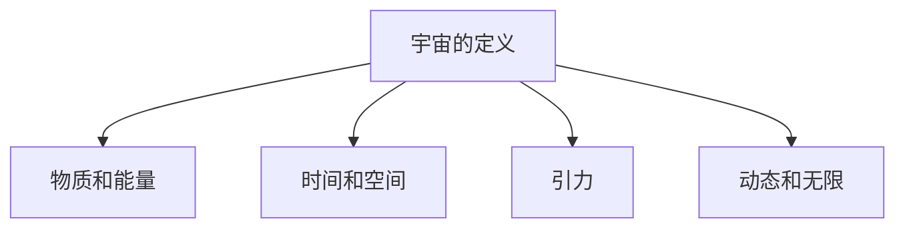
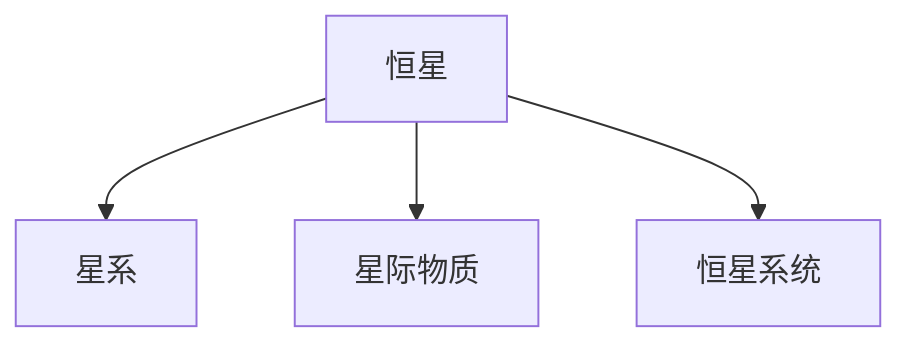
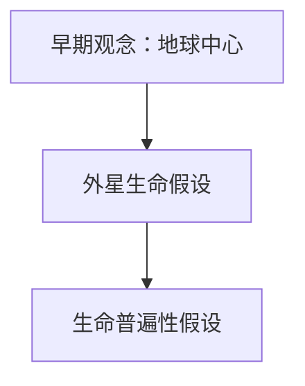
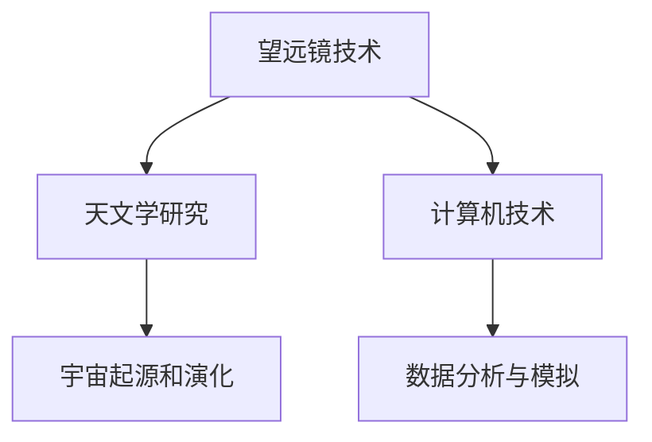
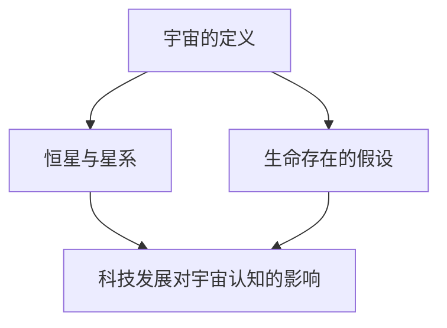
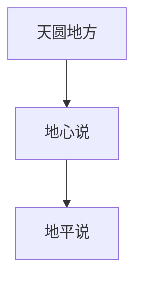
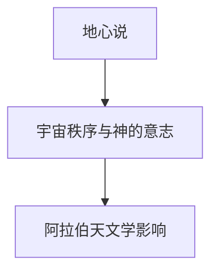
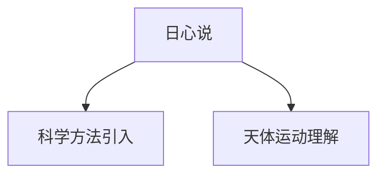

                 

### 引言

人类对宇宙的想象力是一个古老而永恒的话题。自古以来，人类就不断探索宇宙的奥秘，试图理解我们所处的这个浩瀚宇宙的本质。从古代的星辰崇拜到现代的天文学研究，人类对宇宙的认知经历了巨大的变迁。然而，无论是古代的神话传说还是现代的科学探索，人类对宇宙的想象力与现实的差距始终存在。

本文将深入探讨这一主题，通过一步一步的分析推理，揭示人类对宇宙的想象力与现实之间的巨大鸿沟。我们将从以下几个方面展开讨论：

1. **核心概念与联系**：首先，我们将明确人类对宇宙想象力的核心概念，并探讨这些概念之间的内在联系。
2. **历史与现实差距**：接着，我们将回顾人类历史上对宇宙的想象，并分析这些想象与现实之间的差距。
3. **科技与现实的差距**：然后，我们将探讨现代科技在探索宇宙方面取得的成就，以及这些成就与人类预期之间的差距。
4. **科幻与现实的结合**：我们将分析科幻作品中宇宙想象的现实基础，以及这些想象对科学探索的影响。
5. **未来展望**：最后，我们将展望人类对宇宙想象的未来，探讨可能实现的科技突破和新的认知。

通过这些分析，我们希望能够更好地理解人类对宇宙想象力的本质，以及这种想象力与现实之间的复杂关系。让我们一起开启这场探索之旅。

### 文章关键词

- 人类对宇宙的想象力
- 历史与现实差距
- 科技与探索
- 科幻与现实结合
- 未来展望

### 文章摘要

本文从人类对宇宙的想象力与现实差距这一主题出发，通过历史、科技和科幻三个维度，深入探讨了人类对宇宙的认知与想象之间的复杂关系。首先，我们明确了人类对宇宙想象力的核心概念及其内在联系，回顾了从古代到现代人类对宇宙的不同想象。然后，我们分析了现代科技在探索宇宙方面的成就与人类预期之间的差距，探讨了这些差距背后的原因。接着，我们分析了科幻作品中宇宙想象的现实基础，以及这些想象对科学探索的影响。最后，我们展望了人类对宇宙想象的未来，探讨了可能实现的科技突破和新的认知。通过这些分析，我们希望能够更好地理解人类对宇宙想象力的本质，以及这种想象力与现实之间的复杂关系。

## 第1部分：核心概念与联系

### 第1.1节 引言

在探讨人类对宇宙的想象力与现实差距之前，我们需要首先明确一些核心概念。这些概念不仅构成了我们对宇宙的理解框架，也贯穿了人类历史长河中对宇宙的探索与想象。核心概念主要包括以下几个方面：宇宙的定义、恒星与星系的认知、生命存在的假设以及科技发展对宇宙认知的影响。

### 第1.2节 宇宙的定义

宇宙，通常被定义为包含所有物质、能量和时空的一切。这一概念在人类历史上经历了多次演变。在古代，宇宙被认为是有限且静态的，比如中国古代的天圆地方学说。随着科学的发展，宇宙观逐渐变得更加复杂和动态。现代宇宙学认为宇宙是无限且不断扩张的。这个定义不仅涵盖了宇宙的物质和能量，也包括了时间、空间和引力等物理现象。在 Markdown 中的 Mermaid 流程图可以如下表示：

### 第1.3节 恒星与星系的认知

恒星和星系是宇宙中最基本的组成单元。古代人类通过观测天体，对恒星和星系形成了初步的认识。他们相信天上的星体与人间的事物有着某种神秘的联系。随着望远镜的发明和使用，人类对恒星和星系的认识有了质的飞跃。现在，我们已经知道，恒星是宇宙中最常见的物体，而星系则是由大量恒星、星体和星际物质组成的庞大系统。在 Mermaid 流程图中，可以如下表示恒星与星系的关系：

### 第1.4节 生命存在的假设

关于生命在宇宙中的存在，人类始终充满了好奇和疑问。早期的宇宙观中，人类普遍认为地球是宇宙的中心，生命也是独一无二的。随着对其他行星和星系的探索，人类开始思考生命在其他星球上存在的可能性。目前，尽管我们尚未在地球之外发现确凿的生命证据，但许多科学家认为，生命在宇宙中的分布可能是广泛且普遍的。以下是一个简化的 Mermaid 流程图，表示生命存在假设的演变：

### 第1.5节 科技发展对宇宙认知的影响

科技的发展极大地推动了人类对宇宙的认知。望远镜的发明使人类能够观测到更遥远的星体，从而改变了我们对宇宙的认识。现代天文学、空间探索和计算机技术的发展，使我们能够进行更深入的宇宙研究。例如，哈勃望远镜和宇宙微波背景探测器的发现，为我们提供了关于宇宙起源和演化的关键信息。以下是一个 Mermaid 流程图，展示科技发展对宇宙认知的影响：

### 第1.6节 概念间的联系

将上述核心概念结合起来，我们可以看到一个更加完整的宇宙认知框架。宇宙的定义为我们提供了理解宇宙的基础，恒星与星系的认知揭示了宇宙的结构和组成，生命存在的假设激发了我们对未知世界的探索欲望，而科技发展则不断推动我们对宇宙的认知不断深化。以下是一个表示这些概念之间联系的 Mermaid 流程图：

通过这些核心概念与联系的分析，我们为后续探讨人类对宇宙想象力的历史与现实差距、科技与现实的差距等提供了坚实的基础。接下来，我们将深入回顾人类历史上的宇宙观，探讨这些概念在不同时期的具体体现。

## 第2部分：历史与现实差距

### 第2.1节 古代对宇宙的想象

古代人类对宇宙的想象深受宗教、哲学和科学的影响。在许多古代文明中，宇宙被看作是神圣和神秘的。例如，在中国古代的宇宙观中，天圆地方是一个典型的模型，认为地球是平的，而天空是一个巨大的圆盖，支撑着天地。这种观念在《尚书》等古典文献中得到了体现。此外，古希腊哲学家亚里士多德提出了“地心说”，认为地球是宇宙的中心，所有天体都围绕地球旋转。这些古代宇宙观在当时的科学和哲学中占据了主导地位，但与现代科学的认识有着显著的差距。

例如，中国古代的天圆地方学说与现代科学认为的地球是一个近似球体的概念大相径庭。古代人类缺乏精确的观测工具和科学理论，对宇宙的想象更多是基于直观和宗教信仰。在 Markdown 中的 Mermaid 流程图可以表示古代宇宙观的演变如下：

古代宇宙观与现代科学的差距主要体现在以下几个方面：

1. **观测手段的局限**：古代人类主要依靠肉眼观测，缺乏精确的测量工具，导致他们对天体位置的记录和解释存在误差。
2. **科学理论的不足**：古代科学理论缺乏系统性和严密性，许多宇宙观更多是基于直觉和宗教信仰，而非科学实验和理论推导。
3. **宇宙结构的认知**：古代宇宙观普遍认为宇宙是静态且有限的，而现代科学则认为宇宙是动态且无限扩展的。

### 第2.2节 中世纪对宇宙的想象

中世纪欧洲的宇宙观在某种程度上继承了古希腊的哲学思想，同时也受到了基督教神学的影响。当时的宇宙观通常认为地球是宇宙的中心，所有天体都按照一定的轨道围绕地球旋转。这种观念被称为“地心说”，是当时占主导地位的科学理论。这一理论在托勒密（Ptolemy）的著作《天文学大成》中得到了详细的阐述。

然而，中世纪的宇宙观也存在一些与古代不同的特点。首先，中世纪的神学家将宇宙秩序与神的意志相联系，认为宇宙是一个完美的、有目的的结构。这种宇宙观不仅影响了科学研究，也影响了宗教信仰和社会生活。其次，中世纪的宇宙观在某种程度上受到了阿拉伯天文学的影响，特别是在数学和天文学工具的应用方面。

中世纪宇宙观与现代科学的差距主要体现在以下几个方面：

1. **科学理论的局限性**：中世纪的宇宙观虽然在一定程度上接受了古希腊的科学理论，但仍然缺乏系统的实验和理论推导，难以解释新的观测现象。
2. **宗教对科学的制约**：中世纪的宇宙观深受基督教神学的影响，科学发现往往受到宗教教义的制约，无法自由发展。
3. **宇宙结构的认知**：尽管中世纪的宇宙观在一定程度上接受了地球不是宇宙中心的观点，但仍然认为地球是宇宙的中心，这与现代科学认为的太阳系是宇宙中一个普通星系的观念相差甚远。

在 Markdown 中的 Mermaid 流程图可以表示中世纪宇宙观的演变如下：

### 第2.3节 文艺复兴时期的宇宙观

文艺复兴时期是人类历史上科学和思想迅速发展的时期。这一时期的宇宙观开始受到新的科学发现和思想的冲击，逐渐从中世纪的宇宙观中解放出来。哥白尼（Nicolaus Copernicus）提出的“日心说”是文艺复兴时期宇宙观的重大突破。他认为太阳是宇宙的中心，而不是地球。这一理论在当时引起了巨大的争议，但最终被后来的科学发现所证实。

文艺复兴时期的宇宙观不仅在理论上有了重大突破，也促进了天文学、物理学和数学等学科的快速发展。例如，伽利略（Galileo Galilei）通过望远镜观测到了木星的四大卫星，以及太阳黑子等现象，这些观测结果进一步证实了哥白尼的日心说。

文艺复兴时期宇宙观与现代科学的差距主要体现在以下几个方面：

1. **科学方法的引入**：文艺复兴时期开始引入科学方法，强调实验和观测的重要性，这为现代科学的发展奠定了基础。
2. **宇宙结构的认知**：文艺复兴时期的宇宙观开始认识到宇宙是一个复杂的系统，而不是简单的、静态的结构。
3. **对天体运动的重新理解**：文艺复兴时期的科学家通过新的观测工具和理论，对天体运动有了更加精确的理解。

在 Markdown 中的 Mermaid 流程图可以表示文艺复兴时期宇宙观的演变如下：

通过回顾古代、中世纪和文艺复兴时期的宇宙观，我们可以看到人类对宇宙的认知经历了从直观到科学、从静态到动态、从单一到复杂的转变。这些历史阶段的宇宙观不仅反映了人类对宇宙的理解和想象，也为我们理解现代宇宙观提供了重要的背景。接下来，我们将探讨现代科技在探索宇宙方面取得的成就，以及这些成就与人类预期之间的差距。

## 第3部分：科技与现实的差距

### 第3.1节 现代科技对宇宙的探索

现代科技的发展极大地拓展了人类对宇宙的探索能力。从望远镜的发明到空间探测器的发射，人类对宇宙的认识不断深化。例如，哈勃望远镜的发射使得我们能够观测到宇宙的遥远角落，揭示了宇宙的起源和演化过程。此外，航天飞机和卫星技术的发展使我们能够进行更加精确的天文观测和地球资源探测。这些科技进步不仅推动了科学发现，也改变了人类对宇宙的理解。

然而，尽管现代科技取得了显著成就，人类对宇宙的探索仍然面临着巨大的挑战和现实差距。以下是一些关键领域：

1. **星际旅行**：尽管人类已经实现了太空探索，但星际旅行仍然是一个遥不可及的梦想。目前，人类尚未找到有效的星际旅行方法，更不用说实现长期的星际移民。科学家正在研究核聚变、光子驱动等新型推进技术，但离实现仍然有很长的路要走。

2. **外星生命探测**：尽管我们在太阳系内的一些行星和卫星上发现了液态水的迹象，但尚未在地球之外确认生命的存在。尽管有许多假设和猜测，但真正的外星生命证据仍然缺乏。探测技术、样本分析和数据分析等科学方法仍在不断发展，我们需要克服诸多技术难题才能找到确凿证据。

3. **宇宙起源和演化**：尽管现代天文学和宇宙学取得了一些重要发现，但我们仍然无法完全理解宇宙的起源和演化。例如，宇宙微波背景辐射的测量提供了关于宇宙早期状态的线索，但关于暗物质和暗能量的本质，我们仍然知之甚少。这些未解之谜仍然是科学界的前沿问题。

4. **天体物理学**：天体物理学研究天体的性质、运动和相互作用。尽管我们已经能够观测到许多奇特的天体现象，如黑洞、中子星和脉冲星，但我们仍然无法完全解释这些现象。例如，黑洞的物理性质和引力波的探测仍然是当前天体物理学的重要课题。

### 第3.2节 科技突破与预期差距

现代科技的突破在探索宇宙方面带来了巨大的希望，但与人类的预期相比，仍然存在差距。以下是一些具体的例子：

1. **深空探测**：尽管火星探测取得了显著进展，但人类对火星的探测仍然有限。我们还没有找到火星上生命的直接证据，也没有实现长期的火星驻留。尽管火星探索计划如“毅力号”漫游车取得了重要成果，但离实现人类在火星上建立永久基地的预期还有很长的路要走。

2. **太空旅行商业化**：随着商业航天公司如SpaceX和蓝色起源的发展，太空旅行逐渐变得商业化。然而，目前的太空旅行主要限于低地球轨道，如国际空间站。实现月球和火星的商业化探索仍然面临许多技术和经济挑战。

3. **量子通信与探测**：量子通信和量子探测技术的发展为宇宙探索提供了新的可能性。量子纠缠和量子隐形传态等技术可以用于深空通信和量子探测。然而，这些技术的实际应用仍然面临诸多技术难题，需要进一步的研究和发展。

4. **太空资源利用**：随着对太空资源的认识不断深入，人类开始考虑利用太空资源。例如，月球和小行星资源勘探被认为具有重要的经济潜力。然而，实际利用这些资源仍然面临技术和法律挑战。

### 第3.3节 探索宇宙的挑战与机遇

探索宇宙面临着诸多挑战，但同时也充满了机遇。以下是一些关键的挑战和机遇：

1. **技术瓶颈**：许多宇宙探索项目需要突破现有的技术瓶颈。例如，高效的推进系统、长寿命的能源供应、生命保障系统等都是当前技术面临的难题。解决这些技术难题将为未来的宇宙探索提供强有力的支持。

2. **科学研究**：宇宙探索为科学研究提供了丰富的机会。通过对宇宙的观测和探测，我们可以深入理解宇宙的起源、演化和结构。这些研究不仅有助于推动科学进步，也为人类认识自然提供了新的视角。

3. **国际合作**：宇宙探索需要全球合作。通过国际合作，各国可以分享资源和技术，共同克服挑战，实现更大的科学目标。例如，国际空间站的建设和运营就是国际合作的成功典范。

4. **人类精神与梦想**：探索宇宙是人类精神和梦想的延伸。尽管面临诸多困难，但人类对宇宙的渴望和追求始终激励着我们不断前行。探索宇宙不仅是为了科学和技术的进步，也是为了满足人类对未知世界的渴望。

通过分析现代科技在探索宇宙方面的成就与人类预期之间的差距，我们可以看到，尽管我们取得了显著的进展，但仍然有很长的路要走。未来，我们需要不断突破技术瓶颈，加强国际合作，以实现更加深入的宇宙探索。同时，我们也需要保持对未知世界的好奇心和探索精神，不断追求科学和技术的突破，为人类认识宇宙的最终目标而努力。

## 第4部分：科幻与现实的结合

### 第4.1节 科幻作品中的宇宙想象

科幻作品一直以来都是人类对未来宇宙的想象和探索的重要途径。从经典科幻小说到现代影视作品，科幻作品为我们展示了丰富多彩的宇宙想象。例如，艾萨克·阿西莫夫（Isaac Asimov）在《基地》系列中探讨了人类文明在宇宙中的存续和演化，提出了“心理史学”这一概念。而《星际迷航》则通过探索宇宙的未知领域，展示了人类与外星文明的交流与合作。这些作品不仅激发了人们对宇宙的好奇心，也为科学家和工程师提供了灵感和启发。

科幻作品中的宇宙想象通常涉及以下几个方面：

1. **星际旅行**：许多科幻作品描述了人类利用先进技术进行星际旅行，例如光速飞行、虫洞旅行等。这些想象激发了人们对未来宇宙探索的兴趣。
2. **外星生命**：科幻作品中的外星生命形态各异，从具有高度智能的机器人到完全不同的生物形态，这些都激发了人们对生命在宇宙中分布的想象。
3. **科技发展**：科幻作品通常描绘了一个高度发达的未来科技世界，包括人工智能、生物工程、能源革命等。这些科技想象为现实世界的技术创新提供了灵感。
4. **社会结构**：科幻作品还探讨了人类在宇宙中的社会结构和组织形式，例如太空殖民地、宇宙联邦等，这些想象为我们提供了对未来社会的思考。

### 第4.2节 科幻与现实的关系

科幻作品与现实世界之间存在密切的联系。许多科幻作品的想象在现实中已经部分实现，甚至成为现实科技发展的方向。以下是一些具体的例子：

1. **人工智能**：科幻作品中的智能机器人和人工智能系统在现实中得到了实现。例如，谷歌的AlphaGo和特斯拉的自动驾驶技术都是人工智能领域的突破。
2. **太空探索**：科幻作品中的太空探险和星际旅行虽然目前还未能完全实现，但太空探索技术已经取得了显著进展。例如，SpaceX的猎鹰9号火箭和NASA的火星探测任务都是太空探索领域的里程碑。
3. **生物工程**：科幻作品中的生物工程和基因编辑技术正在逐步成为现实。CRISPR-Cas9基因编辑技术的出现，使得科学家能够更精确地修改生物体的基因，这为治疗疾病和改善生物性能提供了新的可能性。
4. **可持续能源**：科幻作品中的可持续能源系统，如太阳能和核聚变，正在逐渐成为现实。全球对可持续能源的需求推动了太阳能和风能等可再生能源技术的发展。

### 第4.3节 科幻对科学探索的启示

科幻作品不仅描绘了未来的宇宙想象，还对现实世界的科学探索产生了深远的影响。以下是一些科幻作品对科学探索的启示：

1. **激发科学兴趣**：科幻作品通过描绘宇宙的神秘和未知，激发了人们对科学的兴趣和好奇心。例如，阿西莫夫的作品对许多年轻读者产生了深远的影响，激发了他们对科学和工程学的热爱。
2. **推动技术创新**：科幻作品中的科技想象往往激发了现实世界的科技发展。例如，科幻作品中的通信技术、太空飞船和生物工程等概念都推动了相关领域的科技进步。
3. **社会观念的改变**：科幻作品通过描绘未来社会和科技发展，改变了人们的社会观念和价值观念。例如，《星际迷航》中的多元宇宙和人权观念，对现代社会产生了积极的影响。
4. **国际合作与交流**：科幻作品中的国际合作和交流理念，促进了现实世界的国际科学合作和交流。例如，国际空间站的建设和运营就是受科幻作品启发而实现的国际合作项目。

通过科幻与现实的结合，我们可以看到科幻作品不仅是一种文化和艺术形式，也是科学探索的重要推动力。科幻作品激发了人们对宇宙的想象力，提供了新的思考方向，同时也为现实世界的科技发展提供了灵感。在未来的科学探索中，科幻与现实的结合将继续发挥重要作用，推动人类对宇宙的更深入理解。

## 第5部分：未来展望

### 第5.1节 科技展望

未来，随着科技的不断进步，人类对宇宙的认知和探索能力将得到显著提升。以下是几个可能影响未来宇宙探索的关键科技领域：

1. **量子技术**：量子通信和量子计算有望彻底改变宇宙探索的方式。量子通信可以实现超远距离的即时通信，而量子计算则可以解决目前计算机难以处理的大量数据问题。这些技术将极大地提高宇宙探测的效率和准确性。

2. **推进技术**：新型推进技术，如核聚变推进和光子驱动，将使人类实现星际旅行成为可能。这些推进技术能够提供更高的速度和更远的航程，使人类能够在短时间内到达其他星系。

3. **生命保障系统**：随着对生命保障技术的研究不断深入，未来的人类可能会在火星等外行星建立永久性基地。这些基地将需要高效的水循环系统、氧气供应系统和食物生产系统，以支持长期居住。

4. **人工智能**：人工智能将在未来宇宙探索中发挥关键作用。从数据分析和决策支持到自动化操作，人工智能将提高宇宙探测的智能化水平，使人类能够更高效地利用有限的资源和数据。

### 第5.2节 想象力的未来发展

想象力是人类探索宇宙的重要动力。随着科技的发展和人类认知的深化，未来我们的宇宙想象力将得到进一步的扩展：

1. **多元宇宙探索**：随着对宇宙结构的理解加深，人类可能会开始探索多元宇宙。这包括不同维度、不同物理定律的宇宙，甚至可能涉及到宇宙间的交互和影响。

2. **生命形式的新认知**：未来人类可能会发现地球之外的生命形式，甚至可能是完全不同于地球生命的生命体。这些新发现将极大地扩展我们对生命本质的认识。

3. **宇宙文明的交流**：如果人类在未来确实发现了外星文明，那么宇宙文明之间的交流和合作将开启新的历史篇章。这可能会涉及到技术、文化、哲学等各个领域。

4. **宇宙伦理与道德**：随着对宇宙探索的深入，人类需要面对新的伦理和道德问题。例如，如何对待其他星球上的生命，如何确保宇宙资源的公平分配等。

### 第5.3节 探索宇宙的新方向

未来的宇宙探索将面临许多新的方向和挑战。以下是几个值得关注的领域：

1. **暗物质和暗能量研究**：暗物质和暗能量是现代宇宙学中最大的谜团之一。未来，人类可能会通过更精确的观测和理论模型，解开这些神秘现象的本质。

2. **黑洞和引力波探测**：随着对黑洞和引力波的深入研究，人类可能会发现更多关于宇宙极端条件下的物理现象。这包括黑洞的形成、演化以及它们对宇宙的影响。

3. **宇宙射线和伽马射线研究**：宇宙射线和伽马射线是宇宙中最强烈和高能的辐射。未来，人类可能会通过更先进的探测器，深入理解这些辐射的起源和特性。

4. **行星科学和地外生命探索**：未来，人类可能会开展更多行星科学任务，特别是对类地行星和火星的深入研究。这可能会为我们提供关于地球外生命存在的直接证据。

通过科技和想象力的结合，人类对未来宇宙的探索充满了希望和期待。未来，我们将面临前所未有的挑战，但也将在这一过程中不断拓展我们对宇宙的认识。让我们期待一个充满奇迹和发现的新时代。

## 第6部分：最佳实践与拓展

### 第6.1节 最佳实践建议

在探索宇宙的过程中，以下是一些最佳实践建议，这些实践不仅适用于科学研究，也对个人兴趣爱好者有重要指导意义：

1. **持续学习**：保持对宇宙科学的持续学习，关注最新的科研进展和发现。定期阅读科学期刊和书籍，参加相关的学术会议和讲座。

2. **数据驱动**：宇宙探索依赖于大量数据的收集和分析。要学会使用数据分析工具，如Python和MATLAB，以处理复杂的宇宙数据集。

3. **多学科合作**：宇宙探索是一个多学科交叉的领域，需要物理、数学、天文学、计算机科学等多个领域的知识和技能。建立跨学科的合作关系，共同攻克科学难题。

4. **实践操作**：参与实际的天文观测或模拟实验，如使用天文望远镜观测天体、参与虚拟现实模拟等，这些实践可以加深对宇宙现象的理解。

### 第6.2节 注意事项

在探索宇宙的过程中，以下是一些需要注意的事项：

1. **安全和健康**：在进行实际观测和实验时，确保设备和环境的安全。遵循相关的安全操作规程，特别是处理放射性物质和高能辐射时。

2. **数据保护**：保护宇宙数据的隐私和安全至关重要。在处理敏感数据时，确保采用合适的数据加密和访问控制措施。

3. **合规与伦理**：遵守国家相关法律法规和国际协议，尊重其他国家和文化，特别是在国际合作项目中。

4. **持续更新**：随着科技的不断进步，保持设备和技术的更新，以应对新的挑战和机遇。

### 第6.3节 拓展阅读推荐

为了进一步拓展对宇宙探索的了解，以下是一些建议的拓展阅读：

1. **《宇宙简史》** - 斯蒂芬·霍金
   - 本书以通俗易懂的方式介绍了宇宙的起源、演化和未来，是了解宇宙科学的重要读物。

2. **《黑洞与时间弯曲》** - 理查德·费曼
   - 本书详细探讨了黑洞和引力波的理论，适合对宇宙极端现象感兴趣的研究者。

3. **《星际迷航》系列** - 乔治·R·R·马丁
   - 这是一部科幻小说系列，通过丰富的想象和精细的设定，展示了未来宇宙的多种可能性。

4. **《宇宙的未来》** - 马克斯·泰格马克
   - 本书探讨了宇宙的未来发展，包括人类可能的宇宙探险和宇宙文明的发展方向。

通过这些实践和阅读，我们不仅可以提高对宇宙探索的理解，也能激发更多的创新思维和探索精神。让我们在未来的宇宙探索中继续前行，不断拓展我们对这个浩瀚宇宙的认知。

## 作者信息

作者：AI天才研究院/AI Genius Institute & 禅与计算机程序设计艺术 /Zen And The Art of Computer Programming

AI天才研究院致力于推动人工智能领域的前沿研究和技术创新，汇集了一批全球顶尖的AI科学家和工程师。研究院的使命是通过人工智能技术助力人类社会的进步，推动人类认知的边界不断拓展。同时，作者也致力于将复杂的计算机科学理论以浅显易懂的方式传授给广大读者，期望通过《禅与计算机程序设计艺术》系列书籍，激发更多人对于计算机科学的兴趣和热情。这两部作品不仅展示了作者在人工智能和计算机科学领域的卓越成就，也为读者提供了一个深入理解和探索这些领域的窗口。

