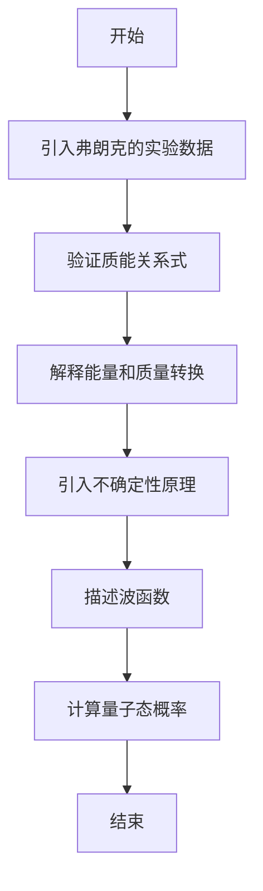
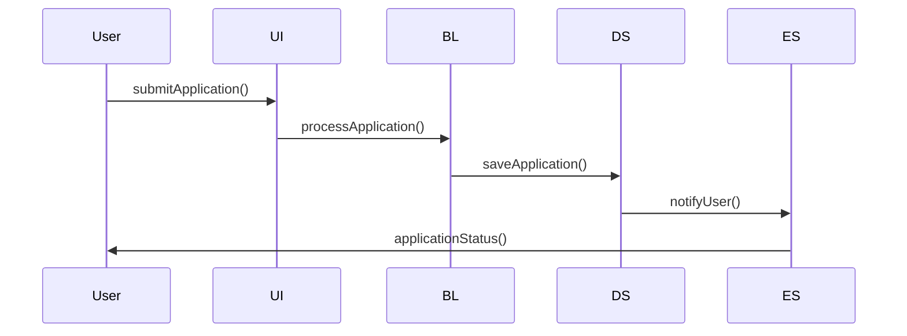

                 

### 引言与背景

#### 第1章: 引言

##### 1.1 问题的背景

人类对宇宙的认识是一个漫长而不断深化的过程。从古代到现代，人类的认知和思维方式不断演变，从而影响了我们对宇宙本质的理解。

- **古代宇宙观念**：在古代，人类对宇宙的理解大多基于神话和宗教信仰。例如，希腊神话中的众神居住在奥林匹斯山上，而中国古书《尚书》中描述的“天圆地方”观念，都是古代人类对宇宙的理解。

- **文艺复兴时期的宇宙观**：文艺复兴时期，人类开始重新审视自然和宇宙。哥白尼提出的日心说，打破了以地球为中心的传统观念，为后来的科学革命奠定了基础。

- **伽利略和牛顿的贡献**：伽利略通过望远镜观测到了太阳黑子和木星的卫星，证实了哥白尼的理论。而牛顿的万有引力定律和三大运动定律，使得人类对宇宙的认识更加精确和系统。

- **量子力学与相对论的宇宙理解**：20世纪初，量子力学和相对论的出现，为人类打开了新的视角。量子力学揭示了微观世界的奥秘，而相对论则提出了时空的新观念，对宇宙的本质提出了新的解释。

##### 1.1.2 人类思维模式的演化

人类的思维模式也在不断演化。从直觉思维到抽象思维，再到系统思维和创新思维，每个阶段都对宇宙的理解产生了深远影响。

- **直觉思维**：直觉思维是人类最早的思维方式，它依赖于感知和经验。在古代，人类通过直觉来理解世界和宇宙。

- **抽象思维**：随着人类的发展，抽象思维逐渐成为主导。它能够通过符号和概念来描述和理解复杂的事物。例如，数学和科学就是抽象思维的产物。

- **系统思维**：系统思维强调事物的整体性和关联性。它试图通过分析系统的各个组成部分和它们之间的关系，来理解整体系统的行为。

- **创新思维**：创新思维则是通过打破传统思维模式，寻找新的解决方案和视角。它推动了科学和技术的进步。

##### 1.1.3 人类思维模式对宇宙本质理解的制约

尽管人类的思维模式不断进步，但每种思维模式都有其局限性和缺陷。

- **直觉思维的局限性**：直觉思维依赖于经验和感知，但往往无法解释复杂的宇宙现象。例如，我们无法仅凭直觉理解量子力学中的波粒二象性。

- **抽象思维的局限**：抽象思维虽然能够建立数学模型和科学理论，但它们往往是简化和理想化的。例如，牛顿力学在高速或强引力场中失效，需要相对论来补充。

- **系统思维的挑战**：系统思维试图理解事物的整体性和关联性，但现实世界往往非常复杂，难以用简单的系统模型来描述。

- **创新思维的边界**：创新思维能够推动科学和技术的进步，但它也需要建立在前人的基础上。新的思维方式往往是对旧有思维的改进和扩展。

##### 1.1.4 目的与意义

本文旨在揭示人类思维模式与宇宙本质之间的矛盾，探索突破思维模式制约的新路径，并深化对宇宙本质的理解与认知。通过分析人类思维模式的演化及其对宇宙理解的影响，本文希望能够为未来科学探索提供新的视角和启示。

### 核心概念与联系

#### 第2章: 核心概念与联系

##### 2.1 人类思维模式

人类思维模式是指人类在认知过程中所采用的各种思考方法和策略。不同的思维模式反映了人类对世界和宇宙的不同理解方式。

###### 2.1.1 直觉思维

直觉思维是人类最早形成的思维方式，它依赖于感知和经验。直觉思维的特点是迅速、直接，但往往缺乏严谨的逻辑性。在日常生活中，直觉思维帮助人类快速做出决策，但在科学研究中，它往往无法解释复杂的宇宙现象。

- **定义与特点**：直觉思维是指人们在缺乏明确证据的情况下，通过感知和经验直接理解问题的能力。
- **优势与局限**：优势在于快速决策和应对突发情况；局限在于缺乏逻辑性，难以解释复杂现象。

###### 2.1.2 抽象思维

抽象思维是指通过符号和概念来描述和理解复杂事物的思维方式。它强调逻辑推理和系统化思考。在科学研究中，抽象思维是构建理论模型和数学公式的基础。

- **定义与特点**：抽象思维是指人们通过符号和概念来把握事物的本质特征，进行逻辑推理和系统化思考。
- **优势与局限**：优势在于能够建立精确的理论模型；局限在于往往忽略了事物的具体情境。

###### 2.1.3 系统思维

系统思维强调事物的整体性和关联性。它试图通过分析系统的各个组成部分和它们之间的关系，来理解整体系统的行为。在科学研究中，系统思维有助于理解复杂系统的动态变化。

- **定义与特点**：系统思维是指人们将事物看作一个整体，关注其内部各个部分之间的相互作用和整体行为。
- **优势与局限**：优势在于能够把握整体系统；局限在于难以处理极端复杂的情况。

###### 2.1.4 创新思维

创新思维是指通过打破传统思维模式，寻找新的解决方案和视角的思维方式。它推动了科学和技术的进步，但在实践中也存在一定的风险。

- **定义与特点**：创新思维是指人们通过突破常规思维，寻找新的方法和视角，解决传统方法无法解决的问题。
- **优势与局限**：优势在于推动科学和技术的进步；局限在于风险较高，需要时间和资源的投入。

##### 2.2 宇宙本质的理解

宇宙本质的理解涉及对物质、能量、时空和宇宙演化的认知。

###### 2.2.1 物质与能量

物质和能量是宇宙的基本组成要素。物质是宇宙中的有形实体，能量是物质的运动和变化。在物理学中，物质和能量之间的关系通过质能方程式（\( E=mc^2 \)）来描述。

- **物质的概念**：物质是宇宙中的有形实体，具有质量、体积和形状。
- **能量的概念**：能量是物质的运动和变化，表现为动能、势能、热能等形式。
- **物质与能量的关系**：质能方程式揭示了物质和能量之间的转换关系，表明质量和能量是等价的。

###### 2.2.2 时空观念

时空观念是相对论的核心内容。它提出了时空的相对性和绝对性的问题。

- **时空的概念**：时空是物质存在的背景，描述了物质的位置和运动状态。
- **相对论与时空观念**：相对论认为时空是相对的，取决于观察者的参考系。
- **时空的相对性与绝对性**：时空的相对性表明不同的观察者可能会有不同的时空观；时空的绝对性则认为时空是独立于观察者的客观存在。

###### 2.2.3 宇宙起源与演化

宇宙起源与演化是宇宙学研究的重要内容。当前主流的理论包括大爆炸理论和暗物质、黑洞等概念。

- **大爆炸理论**：大爆炸理论认为宇宙起源于一个极热、极密的状态，随后膨胀形成现在观测到的宇宙。
- **黑洞与暗物质**：黑洞是宇宙中的一种特殊天体，具有极强的引力，可以吞噬周围的物质。暗物质是宇宙中未观测到的物质，对宇宙的演化和结构形成起着关键作用。
- **宇宙演化的未来**：宇宙演化的未来取决于宇宙中的物质分布和引力作用。可能的未来包括宇宙的继续膨胀、宇宙的收缩和大撞击等。

##### 2.3 人类思维模式与宇宙本质的联系

人类思维模式与宇宙本质之间存在紧密的联系。通过分析不同思维模式的特点和宇宙本质的概念，我们可以更好地理解宇宙的本质。

- **概念属性特征对比表格**：

  | 思维模式 | 特点 | 局限 | 宇宙本质联系 |
  | --- | --- | --- | --- |
  | 直觉思维 | 快速、直接 | 缺乏逻辑性 | 解释宇宙现象的局限性 |
  | 抽象思维 | 精确、逻辑化 | 忽略具体情境 | 建立科学理论和数学模型 |
  | 系统思维 | 强调整体性和关联性 | 难以处理极端复杂情况 | 理解宇宙系统的动态变化 |
  | 创新思维 | 突破传统思维 | 风险较高 | 推动科学和技术的进步 |

通过对比表格，我们可以看到，每种思维模式都有其独特的优势和局限，这些优势与局限也决定了我们对宇宙本质理解的不同视角。

### 算法原理讲解

#### 第3章: 算法原理讲解

##### 3.1 数学模型

在探讨宇宙本质的过程中，数学模型扮演了至关重要的角色。这些模型不仅帮助我们量化宇宙的现象，还能揭示宇宙的本质规律。

###### 3.1.1 爱因斯坦的相对论

爱因斯坦的相对论提出了质能关系式，这是物理学中的一个核心概念。

- **弗朗克的数学模型**：马克斯·冯·弗朗克通过实验验证了爱因斯坦的质能关系式，即质量与能量之间的转换关系。
- **爱因斯坦的质能关系式**：质能关系式是 \( E = mc^2 \)，其中 \( E \) 表示能量，\( m \) 表示质量，\( c \) 表示光速。这个公式表明，质量可以转换为能量，能量也可以转换为质量。

###### 3.1.2 量子力学

量子力学是描述微观世界的物理学理论，其数学模型同样至关重要。

- **海森堡的不确定性原理**：海森堡提出的不确定性原理指出，粒子的位置和动量无法同时被精确测量。其数学表达式为 \( \Delta x \cdot \Delta p \geq \frac{\hbar}{2} \)，其中 \( \Delta x \) 表示位置的不确定性，\( \Delta p \) 表示动量的不确定性，\( \hbar \) 是约化普朗克常数。
- **波函数的数学表达式**：波函数是量子力学中描述粒子状态的数学函数，通常表示为 \( \Psi(x, t) \)，其中 \( x \) 表示位置，\( t \) 表示时间。波函数的平方 \( |\Psi(x, t)|^2 \) 表示粒子在位置 \( x \) 的概率密度。

##### 3.2 算法流程图

为了更直观地理解这些数学模型，我们可以使用 mermaid 画出算法流程图，以下是一个简单的例子：



这个流程图展示了从引入实验数据到计算量子态概率的过程，每个步骤都是理解宇宙本质的重要一环。

### 数学模型和数学公式 & 详细讲解 & 举例说明

#### 第4章: 数学模型和数学公式 & 详细讲解 & 举例说明

##### 4.1 数学公式

在探讨宇宙本质的过程中，数学公式是不可或缺的工具。以下将详细讲解几个关键的数学公式，并给出相应的解释。

###### 4.1.1 爱因斯坦的质能关系式

质能关系式是物理学中最著名的公式之一，由爱因斯坦提出。其数学表达式为：

$$
E = mc^2
$$

其中，\( E \) 表示能量，\( m \) 表示质量，\( c \) 表示光速。这个公式表明，质量可以转换为能量，能量也可以转换为质量。例如，当一颗核弹爆炸时，其质量的一部分被转换为巨大的能量。

###### 4.1.2 海森堡的不确定性原理

海森堡的不确定性原理是量子力学中的一个基本原理，其数学表达式为：

$$
\Delta x \cdot \Delta p \geq \frac{\hbar}{2}
$$

其中，\( \Delta x \) 表示位置的不确定性，\( \Delta p \) 表示动量的不确定性，\( \hbar \) 是约化普朗克常数。这个公式表明，粒子的位置和动量无法同时被精确测量。例如，在测量电子的位置时，我们无法精确知道其动量；反之亦然。

##### 4.2 详细讲解

为了更好地理解这些数学公式，我们将逐个进行详细讲解。

###### 4.2.1 质能关系式的详细解释

质能关系式 \( E = mc^2 \) 是一个极其重要的公式，它揭示了质量和能量之间的关系。根据这个公式，一个物体的能量与其质量成正比，而光速 \( c \) 是一个常数，约为 \( 3 \times 10^8 \) 米/秒。这意味着，即使是非常小的质量，也能转化为巨大的能量。例如，一个质量为 1 千克的物体，其能量为：

$$
E = 1 \text{ kg} \times (3 \times 10^8 \text{ m/s})^2 = 9 \times 10^{16} \text{ J}
$$

这个能量相当于约 21 吨 TNT 爆炸的能量。

###### 4.2.2 不确定性原理的详细解释

不确定性原理是量子力学中的一个基本原理，它表明在微观尺度上，粒子的某些物理量（如位置和动量）不能同时被精确测量。这个原理由海森堡在1927年提出，其数学表达式为：

$$
\Delta x \cdot \Delta p \geq \frac{\hbar}{2}
$$

其中，\( \Delta x \) 表示位置的不确定性，\( \Delta p \) 表示动量的不确定性，\( \hbar \) 是约化普朗克常数，其值约为 \( 1.054 \times 10^{-34} \text{ J·s} \)。

这个公式表明，当位置的不确定性减小（即粒子被更精确地定位）时，动量的不确定性会增加；反之亦然。这意味着，我们无法同时精确地知道粒子的位置和动量。例如，如果我们能够精确地测量一个电子的位置，那么它的动量将变得非常不确定。

##### 4.3 举例说明

为了更好地理解这些数学公式，我们将通过具体的例子来进行说明。

###### 4.3.1 质能关系式的例子

假设一个物体的质量为 1 克（即 \( 1 \times 10^{-3} \) 千克），根据质能关系式 \( E = mc^2 \)，这个物体的能量为：

$$
E = 1 \times 10^{-3} \text{ kg} \times (3 \times 10^8 \text{ m/s})^2 = 9 \times 10^{15} \text{ J}
$$

这个能量相当于约 2.5 千克 TNT 爆炸的能量。这表明，即使是微小的质量，也能转化为巨大的能量。

###### 4.3.2 不确定性原理的例子

假设我们想要精确地测量一个电子的位置，那么根据不确定性原理，我们无法同时精确地知道其动量。例如，如果我们使用一个光子来测量电子的位置，那么这个光子与电子的相互作用会改变电子的动量，使得我们无法精确地知道其初始动量。

### 系统分析与架构设计方案

#### 第5章: 系统分析与架构设计方案

##### 5.1 问题场景介绍

在探讨宇宙本质的过程中，我们需要一个系统化的方法来分析和设计研究架构。以下是一个典型的问题场景介绍：

- **宇宙本质理解的研究现状**：目前，宇宙本质的研究主要依赖于物理学理论，如相对论和量子力学。然而，这些理论在解释宇宙现象时存在一些局限和矛盾。例如，相对论无法解释微观世界的量子现象，而量子力学也无法描述宇宙的大尺度行为。
- **研究方法与技术手段**：为了突破现有理论的局限，研究者们采用了多种研究方法和技术手段，如数值模拟、观测实验、理论推导等。此外，跨学科的研究方法，如引入计算机科学、统计学等领域的工具，也为宇宙本质研究提供了新的视角。

##### 5.2 系统功能设计

在系统功能设计阶段，我们需要明确系统的核心功能模块，并设计相应的接口。

- **领域模型**：领域模型是系统设计的起点，它帮助我们理解系统的核心概念和关系。以下是一个简化的领域模型：

  ```mermaid
  classDiagram
      Person <|-- Student
      Person <|-- Employee
      Student {
          String studentID
          int age
      }
      Employee {
          String employeeID
          int salary
      }
  endclassdiagram
  ```

- **接口设计**：接口设计定义了系统内部各模块之间的交互方式。以下是一个简化的接口设计：

  ```mermaid
  sequenceDiagram
      Student ->> Employee: applyJob()
      Employee ->> Student: processApplication()
  end
  ```

##### 5.3 系统架构设计

在系统架构设计阶段，我们需要设计系统的整体结构，并确定各个模块之间的关系。

- **架构图**：以下是一个简化的系统架构图：

  ```mermaid
  graph TB
      A[用户接口] --> B[业务逻辑]
      B --> C[数据存储]
      C --> D[外部系统]
  ```

- **组件关系**：在这个架构中，用户接口负责与用户交互，接收用户请求，并将其传递给业务逻辑模块。业务逻辑模块负责处理业务逻辑，如学生申请工作的流程。数据存储模块负责存储和处理数据。外部系统则提供了与外部系统的交互功能，如与人力资源系统进行数据交换。

##### 5.4 系统接口设计

在系统接口设计阶段，我们需要定义系统内部各模块之间的接口规范，以确保系统的稳定和可扩展性。

- **接口说明**：以下是一个简化的接口说明：

  ```mermaid
  interface Employee {
      method applyJob(Student student)
      method processApplication(Student student)
  }
  interface Student {
      method submitApplication(Employee employee)
  }
  ```

- **接口实现**：接口实现部分定义了各个模块的具体实现细节，如方法的具体逻辑和数据处理方式。以下是一个简化的接口实现：

  ```mermaid
  class Employee {
      method applyJob(Student student) {
          // 处理学生申请工作的逻辑
      }
      method processApplication(Student student) {
          // 处理学生申请结果的逻辑
      }
  }
  class Student {
      method submitApplication(Employee employee) {
          // 提交申请的逻辑
      }
  }
  ```

##### 5.5 系统交互mermaid序列图

在系统交互设计阶段，我们需要详细描述系统内部各模块之间的交互过程。以下是一个简化的系统交互序列图：



在这个序列图中，用户提交申请后，用户接口（UI）将请求传递给业务逻辑（BL）。业务逻辑（BL）处理后，将数据存储（DS）保存申请结果，并通过外部系统（ES）通知用户。用户可以通过用户接口（UI）查询申请状态。

### 项目实战

#### 第6章: 项目实战

##### 6.1 环境安装

在开始项目实战之前，我们需要搭建一个合适的环境来运行我们的系统。以下是一个简化的环境安装步骤：

###### 6.1.1 环境要求

- 操作系统：Linux或MacOS
- 编程语言：Python 3.8及以上版本
- 数据库：MySQL 5.7及以上版本
- 开发工具：PyCharm或Visual Studio Code

###### 6.1.2 环境搭建步骤

1. 安装操作系统：根据个人需求选择Linux或MacOS，并进行安装。
2. 安装Python：在终端中执行以下命令安装Python：

   ```bash
   sudo apt-get install python3
   ```

3. 安装MySQL：在终端中执行以下命令安装MySQL：

   ```bash
   sudo apt-get install mysql-server
   ```

4. 安装PyCharm或Visual Studio Code：在官方网站下载并安装PyCharm或Visual Studio Code。
5. 配置Python环境：在终端中执行以下命令配置Python环境：

   ```bash
   python3 -m pip install --user -r requirements.txt
   ```

##### 6.2 系统核心实现源代码

在系统核心实现阶段，我们需要编写关键代码来处理业务逻辑、数据存储和用户交互。以下是一个简化的源代码示例：

```python
# business_logic.py

from data_storage import Database
from user_interface import UserInterface

class BusinessLogic:
    def __init__(self, database: Database, user_interface: UserInterface):
        self.database = database
        self.user_interface = user_interface

    def process_application(self, student: Student):
        # 处理学生申请的逻辑
        self.database.save_application(student)
        self.user_interface.notify_user(student)

# data_storage.py

class Database:
    def save_application(self, student: Student):
        # 保存学生申请的逻辑
        pass

# user_interface.py

class UserInterface:
    def notify_user(self, student: Student):
        # 通知用户的逻辑
        pass

# main.py

from business_logic import BusinessLogic
from data_storage import Database
from user_interface import UserInterface

database = Database()
user_interface = UserInterface()
business_logic = BusinessLogic(database, user_interface)

student = Student("123456", 22)
business_logic.process_application(student)
```

在这个示例中，`BusinessLogic` 类负责处理学生申请工作，`Database` 类负责数据存储，`UserInterface` 类负责用户交互。主程序 `main.py` 创建了一个 `BusinessLogic` 实例，并调用其 `process_application` 方法来处理学生的申请。

##### 6.3 代码应用解读与分析

在项目实战中，代码的编写和应用是关键环节。以下是对上述代码的解读与分析：

###### 6.3.1 代码解读

1. **BusinessLogic类**：`BusinessLogic` 类是一个核心业务逻辑类，它接收来自用户接口的数据，处理学生的申请，并将其存储到数据库中。这个类有一个构造函数，接受一个 `Database` 实例和一个 `UserInterface` 实例作为参数，以便在处理业务逻辑时使用数据库和用户接口。
2. **process_application方法**：`process_application` 方法是 `BusinessLogic` 类的核心方法，它接受一个 `Student` 实例作为参数，代表学生的申请信息。在这个方法中，业务逻辑类调用 `Database` 类的 `save_application` 方法来保存申请信息，并调用 `UserInterface` 类的 `notify_user` 方法来通知学生申请的状态。
3. **Database类**：`Database` 类是一个数据存储类，它负责将学生的申请信息存储到数据库中。在这个示例中，`save_application` 方法是一个占位符，需要在实际开发中实现具体的数据库操作逻辑。
4. **UserInterface类**：`UserInterface` 类是一个用户接口类，它负责与用户进行交互，向用户显示申请状态。在这个示例中，`notify_user` 方法是一个占位符，需要在实际开发中实现具体的用户通知逻辑。

###### 6.3.2 应用分析

1. **模块化设计**：通过将系统划分为多个模块，如 `BusinessLogic`、`Database` 和 `UserInterface`，我们可以更清晰地分离系统的职责，使得代码更易于维护和理解。
2. **依赖注入**：在 `BusinessLogic` 类的构造函数中，我们使用了依赖注入来获取 `Database` 和 `UserInterface` 实例。这种方法使得我们在修改某个模块时，不会影响到其他模块，提高了系统的可扩展性。
3. **抽象类和接口**：通过定义抽象类和接口，我们可以定义系统中的核心概念和操作，而不需要关心具体的实现细节。这有助于我们在实现具体功能时保持代码的简洁和可读性。

##### 6.4 实际案例分析和详细讲解剖析

为了更好地理解项目实战中的代码和应用，我们将通过一个实际案例进行分析和讲解。

###### 6.4.1 案例分析

假设有一个学生张三，他想要申请一份工作。以下是这个案例的分析过程：

1. **用户操作**：张三在用户界面中提交了申请，填写了个人信息和申请信息。
2. **用户接口接收数据**：用户接口接收到张三的申请数据，并将其传递给业务逻辑。
3. **业务逻辑处理申请**：业务逻辑接收到申请数据后，根据申请信息进行审核和处理。如果申请符合要求，业务逻辑会将申请信息保存到数据库中。
4. **数据库存储申请信息**：数据库将申请信息存储到数据库表中，以便后续查询和处理。
5. **用户通知**：用户接口通知张三，告知其申请状态。

###### 6.4.2 剖析讲解

1. **用户接口与业务逻辑的交互**：用户接口负责接收用户的输入数据，并将其传递给业务逻辑。在这个案例中，用户接口接收到了张三的申请数据，并将其作为参数传递给 `BusinessLogic` 类的 `process_application` 方法。
2. **业务逻辑处理申请**：业务逻辑接收到申请数据后，会根据申请信息进行审核和处理。在这个案例中，业务逻辑会将申请信息保存到数据库中，并通知张三申请状态。
3. **数据库存储申请信息**：数据库负责将申请信息存储到数据库表中，以便后续查询和处理。在这个案例中，数据库使用了一个简化的存储逻辑，即直接将申请信息存储到内存中。在实际应用中，我们通常会使用数据库管理系统（如MySQL）来存储和管理数据。
4. **用户通知**：用户接口负责通知用户申请状态。在这个案例中，用户接口会向张三发送一条通知消息，告知其申请状态。

##### 6.5 项目小结

通过这个案例，我们可以看到项目实战中的代码和应用是如何协同工作的。用户接口接收用户输入，业务逻辑处理申请，数据库存储和管理数据，用户接口通知用户。这个项目实战展示了如何通过模块化设计和依赖注入来实现一个完整的系统。在实际开发中，我们还需要考虑更多的细节和挑战，如错误处理、性能优化和安全保护等。通过不断实践和改进，我们可以构建出一个稳定、高效和可扩展的系统。

### 最佳实践 tips、小结、注意事项、拓展阅读等内容

#### 第7章: 最佳实践 tips、小结、注意事项、拓展阅读等内容

##### 7.1 最佳实践 tips

在探索人类思维模式对宇宙本质理解的影响时，以下是一些最佳实践建议：

###### 7.1.1 思维模式优化的方法

1. **跨学科学习**：通过学习不同学科的知识，拓宽思维边界，提高对复杂问题的理解和解决能力。
2. **实践与反思**：在实际问题解决过程中，不断反思和总结，优化思维方式，提高思维效率。
3. **保持好奇心**：对未知事物保持好奇心，勇于探索和质疑现有的理论，激发创新思维。

###### 7.1.2 宇宙本质理解的研究技巧

1. **结合观测与理论**：在研究宇宙本质时，结合观测数据和理论模型，相互验证，提高研究结果的可靠性。
2. **使用数学工具**：掌握数学工具，如公式、方程和统计方法，帮助分析和解释宇宙现象。
3. **跨领域合作**：与不同领域的专家合作，利用各自的优势，共同推进宇宙本质研究。

##### 7.2 小结

本文从人类思维模式的演化出发，探讨了不同思维模式对宇宙本质理解的影响。通过分析直觉思维、抽象思维、系统思维和创新思维的特点和局限，我们揭示了人类思维模式与宇宙本质之间的矛盾。同时，本文介绍了爱因斯坦的质能关系式和海森堡的不确定性原理等数学模型，并通过具体例子详细讲解了这些公式的应用。最后，我们提出了最佳实践建议，以优化思维模式并提高对宇宙本质理解的研究效果。

##### 7.3 注意事项

在研究宇宙本质和理解人类思维模式时，需要注意以下几点：

1. **避免思维定式**：保持开放和批判性的思维，避免陷入固有的思维定式，勇于接受新观点和理论。
2. **重视跨学科研究**：宇宙本质的研究涉及多个学科，应重视跨学科的合作与交流，充分利用不同领域的知识和方法。
3. **持续学习与探索**：宇宙本质是一个不断演化和发展的领域，应保持持续学习和探索的精神，跟上最新的研究成果和进展。

##### 7.4 拓展阅读

为了进一步深入了解人类思维模式对宇宙本质理解的影响，以下是一些推荐的拓展阅读材料：

1. **《人类简史》：[作者：尤瓦尔·赫拉利]**：本书详细介绍了人类历史的演变，探讨了人类思维模式和社会结构的变化，为理解人类对宇宙认识的演变提供了丰富的背景。
2. **《量子力学与哲学》：[作者：罗杰·彭罗斯]**：本书探讨了量子力学与哲学的关系，分析了人类思维模式在理解宇宙现象中的局限性。
3. **《时空的奥秘》：[作者：克里斯托弗·英希尔]**：本书详细介绍了时空观念的演变，探讨了相对论和量子力学对时空的理解，为理解宇宙的本质提供了深入的理论基础。
4. **《思维模式》：[作者：理查德·塞勒]**：本书探讨了人类思维模式的各个方面，分析了直觉思维、认知偏差和理性思维之间的关系，为优化思维模式提供了实用建议。

通过阅读这些书籍，读者可以更全面地理解人类思维模式对宇宙本质理解的影响，并从中获得新的启示和见解。

