                 

## 第1章 引言

### 1.1 问题背景

#### 1.1.1 宇宙探索的起源

宇宙探索是人类智慧的象征，它始于人类对自身生存环境和宇宙奇观的敬畏。早在古代，人类就开始通过观测星空来探索宇宙的奥秘。早期的天文学家如古希腊的泰勒斯、亚里士多德，中国的张衡、郭守敬等，他们通过对天文现象的观测和理论思考，为后来的宇宙学发展奠定了基础。

随着科学技术的进步，人类对宇宙的探索方式不断演变。从古代的观测和理论推测，到现代的天文观测和物理实验，人类对宇宙的理解逐渐深入。特别是20世纪以来，随着量子力学、相对论等物理学理论的诞生，人类对宇宙本质的认识达到了前所未有的高度。

#### 1.1.2 人类思维模式的起源

人类思维模式是人类在长期进化过程中形成的认知方式。从生物学角度来看，人类的大脑是一个高度复杂的神经网络系统，它通过感知、记忆、思考等过程来处理信息。人类思维模式的起源可以追溯到早期人类的生存需求，他们需要通过观察自然界、判断危险和寻找食物等来确保自身的生存。

在漫长的进化过程中，人类的思维模式逐渐发展出逻辑推理、抽象思考、创新思维等能力。这些能力不仅帮助人类适应了环境的变化，还推动了科学技术的进步和社会的发展。

#### 1.1.3 人类思维模式与宇宙理解的关系

人类思维模式对宇宙理解的影响是深远且复杂的。一方面，人类的思维模式决定了他们对宇宙的认知方式。从古代的天体观测到现代的天文学理论，人类的思维模式一直在影响着他们对宇宙的理解。例如，古代的天文学家通过几何和数学来描述天体运动，而现代的天文学家则利用物理学理论来解释宇宙的演化。

另一方面，宇宙的奥秘也在不断地挑战和塑造人类的思维模式。随着对宇宙的探索不断深入，人类需要不断地更新和扩展自己的认知框架，以适应新的发现。例如，量子力学和相对论的提出，不仅改变了人类对宇宙的理解，也极大地推动了科学技术的进步。

因此，探讨人类思维模式对宇宙本质理解的影响，不仅有助于我们更深入地理解宇宙，也有助于我们更好地理解人类自身。通过这篇文章，我们将一步步分析人类思维模式与宇宙理解之间的关系，试图揭示这种关系背后的奥秘。

### 1.2 核心概念与联系

#### 1.2.1 人类思维模式

##### 1.2.1.1 定义

人类思维模式是指人类在认知、思考和解决问题过程中所采用的方式和策略。它不仅包括逻辑推理、抽象思考、创新思维等认知能力，还包括感知、记忆、注意力等心理过程。人类思维模式是人类智慧的体现，它决定了人类对世界的认知和理解。

##### 1.2.1.2 分类

人类思维模式可以根据不同的标准进行分类。按照认知过程的特征，可以分为感知思维、直觉思维和逻辑思维；按照思维的深度，可以分为表层思维、中层思维和深层思维；按照思维的创造性，可以分为常规思维和创造性思维。不同类型的思维模式在人类认知过程中起着不同的作用。

##### 1.2.1.3 特点

人类思维模式具有以下特点：

1. **适应性**：人类思维模式能够根据环境和需求的变化进行适应和调整。这种适应性使人类能够有效地应对各种挑战和问题。
2. **复杂性**：人类思维模式是一个复杂的系统，它包含了多种认知过程和心理过程。这种复杂性使人类能够处理和解决复杂的问题。
3. **层次性**：人类思维模式具有层次性，从表层到深层，从简单到复杂，不同的思维层次在认知过程中发挥着不同的作用。
4. **动态性**：人类思维模式是一个动态的过程，它不断地接受新的信息，进行调整和更新。这种动态性使人类能够不断地学习和进步。

#### 1.2.2 宇宙本质

##### 1.2.2.1 定义

宇宙本质是指宇宙中一切存在和现象的根本属性和基本规律。它不仅包括宇宙的物质和能量，还包括宇宙的结构、演化、相互作用等。宇宙本质的研究涉及多个学科，包括物理学、天文学、化学、生物学等。

##### 1.2.2.2 探索历程

宇宙本质的探索历程可以追溯到古代。古代的天文学家通过观测和理论推测，试图理解天体的运动和宇宙的结构。随着科学技术的进步，人类对宇宙的探索方式不断演变。从古代的天文观测，到现代的天文观测和物理实验，人类对宇宙本质的理解逐渐深入。

在20世纪，量子力学和相对论的提出，为人类提供了全新的宇宙观。量子力学揭示了微观世界的规律，相对论则揭示了宏观宇宙的时空结构。这些理论不仅改变了人类对宇宙的理解，也为宇宙本质的探索提供了新的工具和方法。

##### 1.2.2.3 关键概念

宇宙本质研究中的关键概念包括：

1. **物质与能量**：宇宙中的所有存在和现象都是由物质和能量构成的。物质是宇宙的基础，能量则是物质存在和运动的表现。
2. **时空**：时空是宇宙的本质属性。相对论揭示了时空的相对性和弯曲性，为人类理解宇宙的演化提供了新的视角。
3. **宇宙结构**：宇宙结构包括宇宙的层次结构、星系、星团、超星系团等。宇宙结构的探索有助于我们理解宇宙的演化历史。
4. **宇宙演化**：宇宙演化是指宇宙从诞生到现在的演变过程。宇宙演化的研究揭示了宇宙的起源、发展和未来。
5. **相互作用**：宇宙中的物质和能量通过相互作用形成复杂的结构和现象。相互作用的探索有助于我们理解宇宙的本质和规律。

### 1.3 ER实体关系图架构

```mermaid
graph TD
    A[人类思维模式] --> B[认知心理学]
    A --> C[哲学思考]
    A --> D[科学探索]
    B --> E[感知与记忆]
    B --> F[思维过程]
    C --> G[宇宙观]
    C --> H[人生观]
    D --> I[观测数据]
    D --> J[理论构建]
    E --> K[感性认知]
    E --> L[理性分析]
    F --> M[逻辑推理]
    F --> N[创造力]
    G --> O[宇宙起源]
    G --> P[宇宙演化]
    G --> Q[宇宙结构]
    H --> R[存在意义]
    H --> S[人类命运]
    I --> T[实验证据]
    I --> U[模拟预测]
    J --> V[理论验证]
    J --> W[理论扩展]
    K --> X[直觉判断]
    K --> Y[实证分析]
    L --> Z[逻辑推理]
    L --> AA[数据分析]
    M --> BB[论证过程]
    M --> CC[问题解决]
    N --> DD[创新思维]
    N --> EE[思维模式转变]
    O --> FF[宇宙学理论]
    O --> GG[观测数据]
    P --> HH[宇宙演化理论]
    P --> II[观测数据]
    Q --> JJ[宇宙结构理论]
    Q --> KK[观测数据]
    R --> LL[哲学探讨]
    R --> MM[科学探究]
    S --> NN[人类学思考]
    S --> OO[未来预测]
    T --> PP[实验结果]
    T --> QQ[误差分析]
    U --> RR[模拟结果]
    U --> SS[模拟误差]
    V --> TT[理论验证]
    V --> UU[理论扩展]
    W --> VV[理论应用]
    W --> WW[理论限制]
    X --> XX[直觉判断结果]
    X --> YY[逻辑验证]
    Y --> ZZ[实证结论]
    Y --> AAA[逻辑分析]
    Z --> BBB[逻辑推导]
    Z --> CCC[数据解释]
    AA --> BBB[逻辑推理工具]
    AA --> CCC[数据分析工具]
    BB --> CCC[论证过程工具]
    CC --> CCC[问题解决工具]
    DD --> CCC[创新思维工具]
    EE --> CCC[思维模式转变工具]
    FF --> CCC[宇宙学理论工具]
    GG --> CCC[观测数据工具]
    HH --> CCC[宇宙演化理论工具]
    II --> CCC[观测数据工具]
    JJ --> CCC[宇宙结构理论工具]
    KK --> CCC[观测数据工具]
    LL --> CCC[哲学探讨工具]
    MM --> CCC[科学探究工具]
    NN --> CCC[人类学思考工具]
    OO --> CCC[未来预测工具]
    PP --> CCC[实验结果工具]
    QQ --> CCC[模拟误差工具]
    RR --> CCC[理论验证工具]
    SS --> CCC[模拟结果工具]
    TT --> CCC[理论扩展工具]
    UU --> CCC[理论应用工具]
    VV --> CCC[理论限制工具]
    WW --> CCC[直觉判断工具]
    XX --> CCC[实证结论工具]
```

通过上述ER实体关系图，我们可以清晰地看到人类思维模式与宇宙本质之间的复杂联系。这种联系不仅体现在认知和思考过程中，也体现在科学探索和理论构建中。接下来的章节中，我们将进一步探讨这些联系，揭示人类思维模式对宇宙本质理解的影响。

### 第2章 人类思维模式的深入探讨

在上一章中，我们介绍了人类思维模式的基本概念和特点，以及宇宙本质的研究背景和关键概念。接下来，我们将深入探讨人类思维模式，分析其内部结构和运行机制，以及这些特征如何影响我们对宇宙本质的理解。

#### 2.1 认知心理学视角

从认知心理学的角度来看，人类思维模式可以分解为多个子模块，每个模块在认知过程中承担不同的功能。以下是对这些子模块的详细分析：

##### 2.1.1 感知与记忆

感知是人类思维的基础，它涉及到我们对外部信息的接收和处理。感知模块包括视觉、听觉、触觉、嗅觉和味觉等感官系统，它们将外部信息转换为大脑可以处理的数据。

记忆模块则负责将感知到的信息存储起来，以便后续的思考和使用。记忆分为短期记忆和长期记忆，短期记忆用于暂存信息，而长期记忆则用于存储长期记忆的信息。

##### 2.1.2 思维过程

思维过程是人类思维的核心部分，包括逻辑推理、抽象思考、创造力等。逻辑推理是人类运用逻辑规则进行推理的过程，它帮助我们解决各种问题。抽象思考则是将具体的事物抽象为概念和原理，从而更深入地理解世界。创造力则是在现有知识基础上进行创新和发明的思维过程。

##### 2.1.3 注意力

注意力是人类思维的一个重要特征，它决定了我们在特定时刻关注哪些信息。注意力分为选择性注意和分配性注意，选择性注意帮助我们关注重要信息，而分配性注意则让我们在多个任务之间切换。

#### 2.2 哲学思考视角

哲学思考是人类思维的高级形式，它涉及到对存在、真理、价值等根本问题的探讨。以下是从哲学思考视角对人类思维模式的分析：

##### 2.2.1 宇宙观

宇宙观是哲学思考的核心内容之一，它涉及到对宇宙起源、宇宙结构、宇宙演化等问题的理解。不同的哲学流派有不同的宇宙观，例如，唯物主义认为宇宙是由物质构成的，而唯心主义则认为宇宙是意识的产物。

##### 2.2.2 人生观

人生观是哲学思考的另一重要内容，它涉及到对人类存在的意义、人生目标、人生价值等问题的理解。不同的人生观影响着人们的价值观和行为方式，从而影响他们对宇宙本质的理解。

#### 2.3 科学探索视角

科学探索是人类通过实验和理论构建来研究宇宙本质的过程。以下是从科学探索视角对人类思维模式的分析：

##### 2.3.1 观测数据

观测数据是科学探索的重要基础，它通过天文观测、物理实验等方式收集到关于宇宙的信息。观测数据的质量和数量直接影响我们对宇宙本质的理解。

##### 2.3.2 理论构建

理论构建是科学探索的关键步骤，它通过分析观测数据，构建出描述宇宙本质的理论。这些理论不仅帮助我们理解宇宙的规律，也为我们预测宇宙的未来提供了基础。

#### 2.4 人类思维模式对宇宙理解的影响

人类思维模式的特征和运作机制，直接影响我们对宇宙本质的理解。以下是对这些影响的详细分析：

##### 2.4.1 适应性与复杂性的影响

人类思维模式的适应性和复杂性使我们在面对宇宙的复杂性和多样性时，能够灵活地调整自己的认知策略，从而更深入地理解宇宙的本质。

##### 2.4.2 层次性与动态性的影响

人类思维模式的层次性和动态性使我们在不同层次上对宇宙进行深入探索，并在不断接受新信息的过程中，不断更新和完善自己的认知框架。

##### 2.4.3 哲学思考和科学探索的影响

哲学思考和科学探索是人类对宇宙理解的两条不同路径。哲学思考提供了宇宙观的指导，而科学探索则提供了实证基础。这两者的结合，使我们能够更全面地理解宇宙的本质。

#### 2.5 案例分析

为了更具体地展示人类思维模式对宇宙理解的影响，我们可以通过以下案例进行分析：

**案例1：哥白尼革命**

哥白尼提出了日心说，颠覆了地心说的宇宙观。这一变革不仅改变了人类对宇宙的理解，也推动了科学革命的发展。哥白尼的成功，得益于他独特的思维模式，包括逻辑推理、创新思维和哲学思考。

**案例2：量子力学的发展**

量子力学的发展是对传统物理学的一次革命，它揭示了微观世界的奇异规律。量子力学的提出，离不开爱因斯坦、波尔等科学家的独特思维模式，包括抽象思考、逻辑推理和科学探索。

#### 2.6 总结

通过对人类思维模式的深入探讨，我们可以看到，人类思维模式的特征和运作机制，对宇宙理解产生了深远的影响。理解这些影响，不仅有助于我们更深入地探索宇宙，也有助于我们更好地理解人类自身。在接下来的章节中，我们将继续探讨宇宙本质的探索历程，揭示人类思维模式与宇宙理解之间的复杂关系。

### 第3章 宇宙本质的探索历程

宇宙的本质是一个深远且复杂的问题，它涉及到了人类文明的各个方面。从古代的观测到现代的科学实验，人类对宇宙的理解经历了漫长的探索历程。这一章节将详细阐述这一历程，并探讨每个阶段的关键发现和理论发展。

#### 3.1 古代宇宙观

在古代，人类对宇宙的理解主要依赖于直观的观测和哲学思考。古代文明如古希腊、古印度、中国等，都有自己独特的宇宙观。

**3.1.1 古希腊宇宙观**

古希腊是西方哲学和科学的摇篮。泰勒斯是古希腊早期宇宙观的代表人物，他提出了“万物源于水”的宇宙观。后来，毕达哥拉斯提出了“数是宇宙的本质”的观点，认为宇宙是一个有序的数学结构。亚里士多德则提出了地心说，认为地球是宇宙的中心，所有的天体都围绕地球旋转。

**3.1.2 古印度宇宙观**

古印度的宇宙观深受印度教和佛教的影响。印度教认为宇宙是无始无终的，由众多宇宙周期性地生成和毁灭。佛教则强调宇宙的空性和缘起性，认为一切现象都是相互依存的。

**3.1.3 中国宇宙观**

中国古代的宇宙观以阴阳五行学说为基础。阴阳五行学说认为宇宙万物都是由阴阳两种基本力量相互平衡和转化而成的。这种宇宙观不仅影响了中医学、风水学等，也对中国的哲学和科学产生了深远的影响。

#### 3.2 中世纪宇宙观

中世纪的宇宙观深受宗教的影响。基督教、伊斯兰教和犹太教都提出了自己的宇宙观。在这些宗教宇宙观中，地球被认为是宇宙的中心，而天堂和地狱则位于地球之外。

**3.2.1 基督教宇宙观**

基督教宇宙观认为地球是上帝创造的宇宙中心，天堂和地狱分别位于地球之上和之下。这种宇宙观在中世纪的欧洲有着广泛的影响，并在天文学和宇宙学研究中有所体现。

**3.2.2 伊斯兰教宇宙观**

伊斯兰教宇宙观与基督教宇宙观类似，也认为地球是宇宙的中心。伊斯兰教的天文学家如阿拉伯天文学家阿鲁恩（Al-Farabi）和阿尔-伯努利（Al-Biruni）对天文学和宇宙学做出了重要贡献。

**3.2.3 犹太教宇宙观**

犹太教宇宙观认为宇宙是上帝创造的，地球是宇宙的中心。这种宇宙观在犹太教的祈祷和礼仪中有所体现。

#### 3.3 文艺复兴时期的宇宙观

文艺复兴时期的宇宙观标志着人类对宇宙理解的一个重要转折点。在这个时期，人们开始重新审视古希腊的科学和哲学，并对宗教宇宙观提出质疑。

**3.3.1 哥白尼的革命**

哥白尼是文艺复兴时期最重要的天文学家之一。他提出了日心说，认为太阳而不是地球是宇宙的中心，所有的行星都围绕太阳旋转。这一革命性的观点颠覆了中世纪的地心说宇宙观，并为后来的科学革命奠定了基础。

**3.3.2 开普勒的定律**

约翰内斯·开普勒是文艺复兴时期另一位重要的天文学家。他提出了行星运动的三大定律，这些定律精确描述了行星围绕太阳运动的轨迹和规律。开普勒的定律为牛顿的万有引力定律奠定了基础。

#### 3.4 20世纪的宇宙观

20世纪的宇宙观在理论和技术上都取得了巨大的进步。量子力学和相对论的提出，为人类提供了全新的宇宙观。

**3.4.1 量子力学的革命**

量子力学的革命始于20世纪初。量子力学揭示了微观世界的规律，如量子纠缠、量子叠加态等。这些发现对传统的经典物理学提出了挑战，并为宇宙本质的研究提供了新的视角。

**3.4.2 相对论的革命**

阿尔伯特·爱因斯坦在20世纪初提出了广义相对论和狭义相对论。相对论揭示了时空的相对性和弯曲性，为人类理解宇宙的结构和演化提供了新的工具。

**3.4.3 宇宙大爆炸理论**

宇宙大爆炸理论是20世纪最伟大的科学发现之一。这个理论认为宇宙起源于一个极度热密的状态，然后迅速膨胀。宇宙大爆炸理论解释了宇宙中的许多现象，如宇宙背景辐射、宇宙的膨胀等。

#### 3.5 现代宇宙观

现代宇宙观在20世纪的基础上继续发展，涉及到了多宇宙、暗物质、暗能量等前沿课题。

**3.5.1 多宇宙理论**

多宇宙理论认为，我们的宇宙只是众多宇宙中的一个。这些宇宙可能有着不同的物理常数和初始条件，从而导致了不同的物理现象和生命形式。

**3.5.2 暗物质和暗能量**

暗物质和暗能量是现代宇宙观中的两个重要概念。暗物质是宇宙中不发光、不发热，但通过引力影响可见物质的一种物质。暗能量则是推动宇宙加速膨胀的一种能量。

#### 3.6 总结

通过对宇宙本质探索历程的回顾，我们可以看到人类对宇宙理解的发展是一个不断深化的过程。从古代的直观观测和哲学思考，到中世纪的宗教宇宙观，再到文艺复兴时期的科学革命和20世纪的相对论和量子力学，人类对宇宙的理解逐渐从表面走向深入，从直观走向理论。现代宇宙观的发展更是揭示了宇宙中的许多未知和奥秘。理解这些探索历程，不仅有助于我们更深入地理解宇宙的本质，也有助于我们反思人类自身在宇宙中的位置和角色。

### 第4章 人类思维模式对宇宙理解的影响：逻辑推理的视角

逻辑推理是人类思维模式中的一个重要组成部分，它通过明确的逻辑规则和推理过程，将已知的信息和事实转化为新的知识和理解。在探讨人类思维模式对宇宙理解的影响时，逻辑推理的作用不可忽视。以下我们将从逻辑推理的视角，分析人类如何运用逻辑推理来理解宇宙，并探讨这一过程中的挑战和局限性。

#### 4.1 逻辑推理的基本概念

逻辑推理是一种基于逻辑规则和推理过程的信息转换方法。它包括两个主要部分：前提和结论。前提是已知的信息或事实，结论是基于前提推导出来的新信息或理解。逻辑推理通过一系列的逻辑步骤，将前提转化为结论，从而实现对知识和理解的深化。

逻辑推理的基本概念包括：

- **前提**：逻辑推理的起点，是已知的信息或事实。
- **结论**：基于前提推导出来的新信息或理解。
- **推理规则**：连接前提和结论的逻辑规则，确保推理的合理性和有效性。

逻辑推理的基本形式包括：

- **演绎推理**：从一般到特殊的推理过程，如从“所有人都会死”推导出“苏格拉底会死”。
- **归纳推理**：从特殊到一般的推理过程，如从“所有天鹅都是白色的”推导出“所有天鹅都是白色的”。
- **类比推理**：通过比较相似性进行推理，如从“地球上的生物需要水”推导出“外星生物可能也需要水”。

#### 4.2 逻辑推理在宇宙理解中的应用

逻辑推理在宇宙理解中的应用广泛且深远。以下是一些具体的例子：

**4.2.1 宇宙结构的推理**

通过对天文观测数据的分析，科学家们提出了宇宙结构的多种模型。例如，牛顿的万有引力定律和开普勒的行星运动定律，通过逻辑推理，解释了行星围绕太阳的运动。爱因斯坦的广义相对论则通过逻辑推理，揭示了时空的弯曲性和宇宙的膨胀。

**4.2.2 宇宙演化的推理**

宇宙大爆炸理论是逻辑推理的典范。这一理论基于对宇宙背景辐射的观测和宇宙膨胀的观测，通过逻辑推理，提出了宇宙起源于一个极度热密状态的假设。这一推理过程不仅解释了宇宙的起源，还预言了宇宙的膨胀和暗能量的存在。

**4.2.3 宇宙起源的推理**

关于宇宙起源的问题，逻辑推理也发挥了重要作用。例如，在解释宇宙如何从一个简单的初始状态演变为今天复杂的结构时，科学家们提出了多种理论，如量子宇宙学和弦理论。这些理论通过逻辑推理，试图解释宇宙的起源和演化。

#### 4.3 逻辑推理在宇宙理解中的挑战

尽管逻辑推理在宇宙理解中具有重要作用，但它也面临着一些挑战和局限性：

**4.3.1 基础假设的不确定性**

逻辑推理的前提是基础假设，但这些假设往往是不确定的。例如，关于宇宙起源的假设，如量子宇宙学的多世界解释和单世界解释，都有其局限性。

**4.3.2 观测数据的局限性**

逻辑推理依赖于观测数据，但这些数据往往有限和不完整。例如，我们对宇宙的了解还受限于观测设备的精度和观测范围的限制。

**4.3.3 推理过程的复杂性**

宇宙的本质复杂多变，逻辑推理过程也相应地复杂。科学家们需要运用多种逻辑推理方法，如演绎推理、归纳推理和类比推理，才能逐步揭示宇宙的奥秘。

#### 4.4 逻辑推理的局限性

尽管逻辑推理在宇宙理解中具有重要作用，但它也存在一些局限性：

**4.4.1 逻辑悖论**

逻辑推理过程中可能会出现悖论，如自指悖论和组合悖论。这些悖论挑战了逻辑推理的严格性和一致性。

**4.4.2 非确定性**

宇宙的本质往往是不确定的，例如量子态的不确定性和宇宙演化的不可预测性。逻辑推理难以处理这种不确定性。

**4.4.3 创造性思维的缺失**

逻辑推理主要依赖于已有的知识和规则，而创造性思维则更依赖于直觉和创新。在宇宙理解中，创造性思维和逻辑推理相结合才能取得突破性进展。

#### 4.5 逻辑推理的未来发展

未来，逻辑推理在宇宙理解中将继续发挥重要作用。随着科学技术的进步，我们将能够获取更精确和更全面的观测数据，从而为逻辑推理提供更坚实的基础。同时，新的理论和方法也将不断涌现，推动逻辑推理在宇宙理解中的应用。

**4.5.1 新的理论和方法**

例如，量子逻辑推理和相对论逻辑推理等新方法，将为我们提供更强大的工具，以应对宇宙中的复杂性和不确定性。

**4.5.2 跨学科的整合**

逻辑推理不仅在天文学和物理学中发挥作用，还可以与其他学科如生物学、化学、计算机科学等相结合，从而推动宇宙理解的全面发展。

**4.5.3 人工智能的应用**

人工智能技术的发展，将为逻辑推理提供新的动力。通过机器学习和数据挖掘等技术，我们可以从大量的观测数据中提取有价值的信息，从而提高逻辑推理的效率和准确性。

#### 4.6 总结

逻辑推理是人类思维模式中的一个重要组成部分，它在宇宙理解中发挥了关键作用。通过逻辑推理，我们可以从已知的信息和事实中推导出新的知识和理解。然而，逻辑推理也面临着一些挑战和局限性，如基础假设的不确定性、观测数据的局限性和推理过程的复杂性。未来，随着科学技术的进步，逻辑推理在宇宙理解中的应用将继续深化和发展。

### 第5章 人类思维模式对宇宙理解的影响：创新思维的视角

创新思维是人类思维模式中的一个关键要素，它涉及到对现有知识和观念的重新思考、整合和重构。在探索宇宙本质的过程中，创新思维不仅为我们提供了新的视角和方法，也推动了科学技术的进步。以下将从创新思维的视角，分析人类如何通过创新思维来理解宇宙，并探讨这一过程中的挑战和机遇。

#### 5.1 创新思维的基本概念

创新思维是一种打破常规、超越现有知识和观念的思维模式。它不仅关注问题的解决方案，还关注问题的根本性、系统性和长远性。创新思维的基本特征包括：

- **发散性**：创新思维不局限于一种思路或方法，而是从多个角度和维度进行思考，寻找多样化的解决方案。
- **综合性**：创新思维将不同的知识、观念和方法进行整合，形成新的认识和观点。
- **灵活性**：创新思维能够在变化和不确定的环境中灵活应对，寻找适应性和创造性解决方案。
- **前瞻性**：创新思维着眼于未来的发展，探索新的机遇和可能性。

创新思维的主要方法包括：

- **头脑风暴**：通过集思广益，产生大量创意。
- **思维导图**：通过图形化的方式，梳理和整合思维过程。
- **类比思维**：通过比较相似性，激发新的想法。
- **逆向思维**：从相反的角度进行思考，寻找新的解决方案。

#### 5.2 创新思维在宇宙理解中的应用

创新思维在宇宙理解中的应用广泛且深远。以下是一些具体的例子：

**5.2.1 新理论和新假说的提出**

在宇宙学中，创新思维推动了新理论和新假说的提出。例如，霍金提出的宇宙起源的多世界解释，就是通过创新思维，将量子力学与宇宙学相结合，提出了一种新的宇宙观。类似的，弦理论和循环宇宙假说等，都是通过创新思维，试图解释宇宙的复杂性和奥秘。

**5.2.2 新技术的发明和应用**

创新思维在宇宙探索中起到了关键作用。例如，哈勃望远镜的发明和应用，就是通过创新思维，将光学技术和天文观测相结合，使我们能够更深入地观察宇宙。此外，量子技术和人工智能技术的发展，也为宇宙探索提供了新的工具和方法。

**5.2.3 新观测手段的开发**

创新思维还推动了新观测手段的开发。例如，射电望远镜和引力波探测器的发明，就是通过创新思维，探索宇宙中的新现象和新规律。这些新观测手段使我们能够获取更全面、更精确的宇宙信息。

#### 5.3 创新思维在宇宙理解中的挑战

尽管创新思维在宇宙理解中具有重要作用，但它也面临着一些挑战和局限性：

**5.3.1 知识积累的限制**

创新思维依赖于已有的知识积累，但现有的知识体系可能不完全适用于新的探索。例如，在探索宇宙的早期，传统的物理学理论难以解释一些观测现象，这要求科学家们创新思维，提出新的理论。

**5.3.2 社会和文化的影响**

创新思维受到社会和文化的影响。在某些文化环境中，传统观念和权威可能会限制创新思维的发展。例如，在宗教文化深厚的地区，新的宇宙观和科学理论可能会遇到阻力。

**5.3.3 风险和不确定性**

创新思维往往涉及未知的领域和不确定的风险。例如，在探索宇宙时，科学家们可能需要投入大量资源和时间，但结果可能并不如预期。这要求科学家们具备冒险精神和承受风险的能力。

#### 5.4 创新思维的未来发展

未来，创新思维在宇宙理解中将发挥更大的作用。随着科学技术的进步，我们将有更多的工具和方法来支持创新思维：

**5.4.1 人工智能的应用**

人工智能技术的发展，将为创新思维提供新的动力。通过机器学习和数据挖掘，我们可以从大量的观测数据中提取有价值的信息，从而提高创新思维的效率和准确性。

**5.4.2 跨学科的整合**

创新思维不仅在天文学和物理学中发挥作用，还可以与其他学科如生物学、化学、计算机科学等相结合。跨学科的整合将为我们提供更全面、更深入的理解宇宙的方法。

**5.4.3 教育和培养**

创新思维的培养和推广是未来发展的重要方向。通过教育和培训，我们可以培养更多具备创新思维的人才，推动宇宙理解的发展。

#### 5.5 总结

创新思维是人类思维模式中的一个关键要素，它在宇宙理解中发挥了重要作用。通过创新思维，我们可以提出新的理论、发明新的技术、开发新的观测手段。然而，创新思维也面临着一些挑战和局限性，如知识积累的限制、社会和文化的影响、风险和不确定性。未来，随着科学技术的进步，创新思维在宇宙理解中的应用将更加广泛和深入。通过不断培养和推广创新思维，我们将能够更好地理解宇宙，探索宇宙的奥秘。

### 第6章 人类思维模式对宇宙理解的影响：科学探究的视角

科学探究是人类通过观察、实验和理论构建来研究宇宙本质的过程。在这个过程中，人类思维模式起着至关重要的作用。科学探究不仅推动了我们对宇宙的理解，也塑造了现代科学的方法论和思维方式。以下将从科学探究的视角，分析人类思维模式如何影响宇宙理解，并探讨这一过程中的关键步骤和原则。

#### 6.1 科学探究的基本概念

科学探究是一种基于实证和逻辑的方法，用于发现和理解宇宙的本质。科学探究的基本步骤包括：

**6.1.1 观察和测量**

观察和测量是科学探究的起点。通过观察自然现象和进行精确的测量，科学家们可以收集到关于宇宙的信息。这些信息包括天文观测、生物实验、物理实验等。

**6.1.2 提出假设**

基于观察和测量得到的信息，科学家们会提出假设。假设是对宇宙本质的一种推测或解释，它是科学探究的核心。

**6.1.3 设计实验**

为了验证假设，科学家们会设计实验。实验可以通过控制变量、重复操作等方式，来检验假设的正确性。

**6.1.4 分析数据**

实验完成后，科学家们会分析实验数据，以确定假设是否成立。数据分析可以通过统计方法、模型构建等方式进行。

**6.1.5 理论构建**

基于实验数据和假设验证的结果，科学家们会构建理论。理论是对宇宙本质的系统性解释，它为科学探究提供了框架。

#### 6.2 人类思维模式对科学探究的影响

人类思维模式对科学探究的影响体现在多个方面。以下是一些具体的影响：

**6.2.1 观察和测量的选择**

科学探究的第一步是观察和测量。人类思维模式决定了我们选择观察哪些现象和进行哪些测量。例如，从古希腊时期到现代，人类对宇宙的观察从肉眼观测到望远镜观测，再到射电望远镜和引力波探测器。这些变化反映了人类思维模式的发展和科技进步。

**6.2.2 假设的形成**

假设的形成是科学探究的核心。人类思维模式影响了假设的提出和选择。例如，从地心说到日心说，再到相对论和量子力学，人类对宇宙本质的假设不断演变，反映了人类思维模式的变革和科学理论的进步。

**6.2.3 实验的设计和实施**

实验的设计和实施是科学探究的重要环节。人类思维模式影响了实验的设计原则和实施方法。例如，从伽利略的斜面实验到爱因斯坦的广义相对论实验，实验的设计和实施反映了人类思维模式的逻辑性和科学性。

**6.2.4 数据的分析和解释**

数据分析是科学探究的关键步骤。人类思维模式影响了数据分析和解释的方法。例如，从简单的统计分析到复杂的模型构建，数据分析方法的发展反映了人类思维模式的深化和科学理论的进步。

**6.2.5 理论的构建和验证**

理论的构建和验证是科学探究的最终目标。人类思维模式影响了理论的构建原则和验证方法。例如，从牛顿力学到量子力学，再到相对论，科学理论的构建和验证反映了人类思维模式的变革和科学认知的深化。

#### 6.3 人类思维模式在科学探究中的关键原则

为了确保科学探究的有效性和可靠性，人类思维模式需要遵循一些关键原则。以下是一些具体的原则：

**6.3.1 客观性**

科学探究要求科学家保持客观性，避免主观偏见和情感干扰。客观性是科学探究的基础，它保证了科学结论的准确性和可靠性。

**6.3.2 可重复性**

科学探究要求实验和结果具有可重复性。通过重复实验，其他科学家可以验证和验证科学结论，从而确保科学探究的可靠性和有效性。

**6.3.3 可证伪性**

科学探究要求假设和理论具有可证伪性。可证伪性是科学探究的核心原则，它确保了科学理论的科学性和客观性。

**6.3.4 可公理性**

科学探究要求科学理论具有可公理性。可公理性意味着科学理论可以被广泛接受和验证，从而确保科学探究的公正性和普适性。

#### 6.4 科学探究的案例

为了更具体地展示人类思维模式在科学探究中的应用，以下是一些科学探究的案例：

**案例1：牛顿的万有引力定律**

牛顿的万有引力定律是通过观察和实验，结合逻辑推理和数学模型构建得出的。牛顿通过观察行星的运动，提出了万有引力定律，并通过实验验证了这一定律的正确性。这一过程反映了人类思维模式在科学探究中的应用。

**案例2：量子力学的提出**

量子力学的提出是20世纪科学革命的重要成果。量子力学通过观察和实验，提出了关于微观世界的奇异规律。爱因斯坦、波尔等科学家通过逻辑推理和数学模型，提出了量子力学的基本原理，并通过实验验证了这些原理的正确性。这一过程同样反映了人类思维模式在科学探究中的重要作用。

**案例3：宇宙大爆炸理论的提出**

宇宙大爆炸理论是通过观测和实验，结合逻辑推理和理论构建得出的。科学家们通过观测宇宙背景辐射和宇宙膨胀，提出了宇宙大爆炸理论，并通过实验验证了这一理论的正确性。这一过程展示了人类思维模式在科学探究中的综合应用。

#### 6.5 总结

科学探究是人类通过观察、实验和理论构建来研究宇宙本质的过程。在这个过程中，人类思维模式起着至关重要的作用。人类思维模式影响了科学探究的各个方面，包括观察和测量的选择、假设的形成、实验的设计和实施、数据分析和解释，以及理论的构建和验证。通过遵循科学探究的基本原则，如客观性、可重复性、可证伪性和可公理性，人类能够更深入地理解宇宙。未来，随着科学技术的进步和人类思维模式的不断演化，科学探究将在宇宙理解中发挥更大的作用。

### 第7章 人类思维模式对宇宙理解的影响：哲学思考的视角

哲学思考是人类探索宇宙本质的重要方式，它不仅提供了对宇宙本质的根本性思考，也为科学探索提供了理论基础。以下将从哲学思考的视角，分析人类如何通过哲学思考来理解宇宙，并探讨这一过程中的关键概念和哲学流派。

#### 7.1 哲学思考的基本概念

哲学思考是一种对存在、真理、价值和知识的根本性探讨。它通过逻辑推理、批判性分析和反思，寻求对宇宙本质的理解。哲学思考的基本概念包括：

**7.1.1 宇宙观**

宇宙观是哲学思考的核心内容之一，它涉及到对宇宙起源、宇宙结构、宇宙演化等问题的探讨。不同的哲学流派有不同的宇宙观，例如唯物主义、唯心主义、宇宙循环论等。

**7.1.2 存在论**

存在论是哲学思考的基础，它探讨存在的本质和意义。存在论涉及到存在的问题，如存在是什么、存在如何可能等。

**7.1.3 真理观**

真理观是哲学思考的一个重要方面，它探讨真理的本质和标准。不同的哲学流派有不同的真理观，如经验主义、理性主义、实用主义等。

**7.1.4 价值观**

价值观是哲学思考的重要组成部分，它探讨价值、道德和伦理的问题。不同的哲学流派有不同的价值观，如功利主义、康德伦理学、道德实在论等。

#### 7.2 哲学思考对宇宙理解的影响

哲学思考对宇宙理解的影响深远且复杂。以下是一些具体的方面：

**7.2.1 提供理论基础**

哲学思考为科学探索提供了理论基础。例如，唯物主义和唯心主义的对立，为物理学和宇宙学的发展提供了不同的视角和解释。理性主义和经验主义的对立，为科学方法论的发展提供了理论基础。

**7.2.2 引导科学探究**

哲学思考引导科学家进行科学探究。例如，在宇宙起源的研究中，唯物主义和宇宙循环论的观点，促使科学家们探索宇宙的起源和演化。理性主义和经验主义的方法论，指导科学家们进行观察、实验和理论构建。

**7.2.3 解读科学成果**

哲学思考帮助科学家解读科学成果。例如，量子力学的奇异现象，如量子纠缠和量子叠加态，需要通过哲学思考来解释和理解。相对论揭示的时空弯曲性，也需要哲学思考来深入探讨。

#### 7.3 哲学流派对宇宙理解的影响

不同的哲学流派对宇宙理解有不同的影响，以下是一些主要的哲学流派及其影响：

**7.3.1 唯物主义**

唯物主义认为物质是宇宙的基础，意识和思想是物质的产物。唯物主义为物理学和宇宙学的发展提供了基础，例如，经典物理学和现代宇宙学都建立在唯物主义的基础上。

**7.3.2 唯心主义**

唯心主义认为意识是宇宙的基础，物质是意识的产物。唯心主义为量子力学和宇宙学的发展提供了不同的视角。例如，量子力学的解释，如哥本哈根解释和多世界解释，都有唯心主义的影子。

**7.3.3 宇宙循环论**

宇宙循环论认为宇宙是循环生成的，没有真正的起源和终结。宇宙循环论为宇宙的演化提供了不同的视角，例如，宇宙大爆炸理论的一些扩展，如循环宇宙假说，就是基于宇宙循环论的。

**7.3.4 实证主义**

实证主义认为知识和真理是通过观察和实验获得的。实证主义为科学方法论的发展提供了基础，例如，科学方法强调观察、实验和验证。

**7.3.5 存在主义**

存在主义探讨存在的意义和人类的存在方式。存在主义对人类在宇宙中的角色和命运提供了深刻的思考，例如，尼采的存在主义思想，对人类的自我意识和价值观念产生了深远的影响。

#### 7.4 哲学思考与科学探究的关系

哲学思考与科学探究之间存在密切的关系。哲学思考为科学探究提供了理论基础和指导，而科学探究的结果也为哲学思考提供了实证基础。以下是一些具体的方面：

**7.4.1 相互促进**

哲学思考和科学探究相互促进。哲学思考提供了科学探究的理论基础，而科学探究的结果又丰富了哲学思考的内容。例如，相对论和量子力学的提出，不仅推动了宇宙学的发展，也丰富了哲学思考的内容。

**7.4.2 互为补充**

哲学思考和科学探究互为补充。哲学思考提供了对宇宙本质的深层次探讨，而科学探究则提供了对宇宙现象的具体解释。例如，哲学思考探讨了宇宙的起源和意义，而科学探究则揭示了宇宙的演化和结构。

**7.4.3 挑战与反思**

哲学思考和科学探究之间也存在挑战和反思。科学探究的结果可能会挑战哲学思考的基本假设，而哲学思考也可能会反思科学探究的方法和结论。例如，量子力学的奇异现象，如量子纠缠和量子叠加态，挑战了经典物理学和哲学的一些基本假设。

#### 7.5 总结

哲学思考是人类探索宇宙本质的重要方式，它通过逻辑推理、批判性分析和反思，提供了对宇宙本质的根本性思考。哲学流派如唯物主义、唯心主义、宇宙循环论等，对宇宙理解产生了深远的影响。哲学思考与科学探究之间存在密切的关系，相互促进和互为补充。理解哲学思考对宇宙理解的影响，不仅有助于我们更深入地探索宇宙，也有助于我们反思人类在宇宙中的角色和地位。未来，随着哲学思考和科学探究的进一步发展，我们将能够更全面地理解宇宙的本质。

### 第8章 人类思维模式与宇宙理解的关系：案例分析

为了更好地理解人类思维模式与宇宙理解之间的复杂关系，我们可以通过几个具体的案例来分析。这些案例不仅展示了人类思维模式在不同历史时期和不同领域的应用，还揭示了这些思维模式如何影响我们对宇宙本质的理解。

#### 8.1 哥白尼的革命

哥白尼是文艺复兴时期的一位重要天文学家，他的革命性观点——日心说，彻底改变了人类对宇宙的理解。在哥白尼之前，地心说占据主导地位，认为地球是宇宙的中心，所有天体都围绕地球旋转。哥白尼通过细致的天文观测和逻辑推理，提出了日心说，认为太阳是宇宙的中心，地球和其他行星围绕太阳旋转。

**案例分析**：

哥白尼的成功在于他运用了创新思维和逻辑推理。他通过观测数据提出了新的宇宙模型，并通过逻辑推理解释了行星运动的规律。这一过程不仅改变了人类对宇宙的理解，也为后来的科学革命奠定了基础。哥白尼的日心说挑战了传统的地心说，揭示了宇宙的真实结构，这是人类思维模式在宇宙理解中发挥作用的典型案例。

#### 8.2 量子力学的挑战

量子力学是20世纪最重大的科学发现之一，它揭示了微观世界的奇异规律。量子力学的出现不仅挑战了经典物理学的观念，也深刻影响了我们对宇宙本质的理解。

**案例分析**：

量子力学的发展过程中，人类思维模式的作用体现在多个方面。首先，物理学家如爱因斯坦、波尔和海森堡等，通过创新思维，提出了新的理论和假说，如波粒二象性、量子叠加态和量子纠缠等。这些理论通过逻辑推理和数学模型，揭示了微观世界的本质。其次，量子力学的观测和实验验证，需要科学家们运用批判性思维和实证分析，以检验这些理论的正确性。

量子力学的挑战表明，人类思维模式在探索宇宙本质时，不仅需要创新思维和逻辑推理，还需要实证分析和批判性思维。这种多层次的思维模式，使我们能够更全面、更深入地理解宇宙。

#### 8.3 宇宙大爆炸理论的验证

宇宙大爆炸理论是关于宇宙起源和演化的科学理论，它认为宇宙起源于一个极度热密的状态，然后迅速膨胀。这一理论在提出之初，就引起了广泛的争议和讨论。

**案例分析**：

宇宙大爆炸理论的提出和验证，体现了人类思维模式的多样性和复杂性。首先，这一理论的提出是基于对宇宙背景辐射和宇宙膨胀的观测数据，这些数据为宇宙大爆炸理论提供了实证基础。其次，科学家们通过逻辑推理和数学模型，解释了宇宙大爆炸的理论框架。最后，宇宙大爆炸理论的验证过程，需要科学家们进行大量的观测和实验，以检验理论的预测。

宇宙大爆炸理论的案例表明，人类思维模式在宇宙理解中，不仅需要创新思维和逻辑推理，还需要实证分析和实验验证。这种多层次的思维模式，使我们能够逐步揭示宇宙的本质。

#### 8.4 宇宙暗物质和暗能量的探索

暗物质和暗能量是现代宇宙学中的两个重要概念，它们解释了宇宙膨胀加速和宇宙结构的稳定性。然而，这些概念的本质和存在方式仍然是一个谜。

**案例分析**：

宇宙暗物质和暗能量的探索，展示了人类思维模式在未知领域的挑战。首先，科学家们通过观测数据和理论模型，提出了暗物质和暗能量的假说。这些假说是基于人类思维模式的逻辑推理和数学建模。其次，科学家们通过实验和观测，试图验证暗物质和暗能量的存在。这些探索过程需要人类思维模式中的实证分析和创新思维。

宇宙暗物质和暗能量的探索案例表明，人类思维模式在面对未知和复杂问题时，需要灵活运用逻辑推理、创新思维和实证分析。这种多层次的思维模式，使我们能够逐步揭示宇宙的奥秘。

#### 8.5 总结

通过以上案例分析，我们可以看到人类思维模式在宇宙理解中的重要作用。从哥白尼的革命到量子力学的挑战，从宇宙大爆炸理论的验证到宇宙暗物质和暗能量的探索，人类思维模式在每一个阶段都发挥了关键作用。通过逻辑推理、创新思维、实证分析和批判性思维，人类逐步揭示了宇宙的本质。未来，随着科学技术的进步和人类思维模式的不断演化，我们将能够更深入地理解宇宙，探索宇宙的奥秘。

### 第9章 人类思维模式对宇宙理解的综合影响

通过对前几章的详细探讨，我们可以看到人类思维模式在宇宙理解中的深远影响。无论是认知心理学、哲学思考、科学探究，还是创新思维，人类思维模式都在不同层面上影响了我们对宇宙本质的理解。以下将对这些影响进行综合分析，并讨论未来可能的趋势。

#### 9.1 影响的多样性

人类思维模式对宇宙理解的影响具有多样性。从认知心理学的角度来看，人类的感知、记忆、注意力等过程，决定了我们对宇宙信息的接收和处理。哲学思考提供了宇宙观的指导，帮助我们在宏观层面上理解宇宙的本质。科学探究则通过实验和理论构建，为我们提供了具体的宇宙模型和解释。创新思维则在探索未知领域时，提供了新的视角和方法。

#### 9.2 影响的层次性

人类思维模式的影响还具有层次性。在认知心理学层面，人类的感知和记忆决定了我们对宇宙现象的初步理解。哲学思考层面，宇宙观和真理观等概念为科学探究提供了基础。科学探究层面，理论构建和实验验证过程，进一步深化了我们对宇宙本质的理解。创新思维则在不同层次上推动了科学理论的进步和宇宙模型的发展。

#### 9.3 影响的相互关联

人类思维模式的各个方面相互关联，共同影响了宇宙理解。认知心理学为哲学思考和科学探究提供了基础，而哲学思考则为科学探究提供了指导。科学探究的结果又反过来验证和丰富了哲学思考，而创新思维则推动了科学理论和宇宙模型的发展。这种相互关联的关系，使得人类思维模式在宇宙理解中形成了完整的循环。

#### 9.4 未来可能的趋势

未来，人类思维模式对宇宙理解的影响将继续深化和扩展。以下是一些可能的趋势：

**9.4.1 人工智能的应用**

随着人工智能技术的发展，人工智能将在宇宙理解中发挥越来越重要的作用。人工智能可以通过大数据分析和机器学习，帮助我们更快速、更精确地处理宇宙信息。同时，人工智能还可以模拟和预测宇宙的演化过程，为科学探究提供新的工具和方法。

**9.4.2 跨学科的整合**

未来，宇宙理解将更加依赖于跨学科的整合。不同学科的知识和方法，将在宇宙理解中相互补充和融合。例如，计算机科学、数学、物理学、生物学等领域的知识，将共同推动宇宙学的发展。

**9.4.3 新观测手段的开发**

随着科技的进步，新的观测手段将不断涌现。例如，更先进的射电望远镜、引力波探测器等，将使我们能够更深入地观察宇宙。这些新观测手段，将为人类思维模式提供更多的实证基础，推动宇宙理解的发展。

**9.4.4 新理论和新假说的提出**

未来，人类思维模式将继续推动新理论和新假说的提出。例如，量子宇宙学和循环宇宙假说等，都可能是未来宇宙理解的重要方向。这些新理论和新假说，将帮助我们更全面、更深入地理解宇宙的本质。

#### 9.5 总结

人类思维模式在宇宙理解中具有深远的影响，它通过认知心理学、哲学思考、科学探究和创新能力，帮助我们逐步揭示了宇宙的本质。未来，随着科技的进步和人类思维模式的不断演化，我们将能够更深入地理解宇宙，探索宇宙的奥秘。理解人类思维模式对宇宙理解的综合影响，不仅有助于我们更全面地认识宇宙，也有助于我们反思人类自身在宇宙中的角色和地位。

### 第10章 结论

通过对人类思维模式与宇宙理解之间关系的深入探讨，我们可以看到，人类思维模式在宇宙探索和认知中扮演着至关重要的角色。从认知心理学的感知与记忆，到哲学思考的宇宙观与人生观，从科学探究的观察与实验，到创新思维的突破与发明，每一个环节都展示了人类思维模式对宇宙理解的深远影响。

本章我们详细分析了人类思维模式的多样性、层次性和相互关联性，以及其对宇宙理解的综合影响。通过具体的案例分析，如哥白尼的革命、量子力学的挑战、宇宙大爆炸理论的验证和宇宙暗物质与暗能量的探索，我们看到了人类思维模式在不同历史时期和不同领域的具体应用。

同时，我们也探讨了未来人类思维模式在宇宙理解中可能的发展趋势，包括人工智能的应用、跨学科的整合、新观测手段的开发和新理论的新假说的提出。这些趋势预示着，随着科技的进步和人类思维模式的不断演化，我们对宇宙的理解将更加深入和全面。

理解人类思维模式对宇宙理解的影响，不仅有助于我们更准确地把握宇宙的本质，也有助于我们反思人类自身在宇宙中的位置和角色。通过不断探索和思考，我们不仅能够扩展我们对宇宙的认知边界，还能够提升我们自身的思维能力和创新能力。

未来，随着科学技术的不断发展，人类对宇宙的理解将会更加深入。我们期待着在人类思维模式的推动下，能够揭开宇宙更多的奥秘，探索宇宙更深层次的真理。通过持续的努力和探索，我们有望在宇宙的广阔天地中，找到人类存在的真正意义和价值。

### 参考文献

1. Copernicus, De revolutionibus orbium coelestium, 1543.
2. Newton, Philosophiæ naturalis principia mathematica, 1687.
3. Einstein, Relativity: The Special and General Theory, 1916.
4. Bohr, Niels, "On the Constitution of Atoms and Molecules," 1927.
5. Hubble, Edwin, "A Striking Case of Stellar Recession," 1929.
6. Hawking, Stephen, A Brief History of Time: From the Big Bang to Black Holes, 1988.
7. Penrose, Roger, The Emperor's New Mind: Concerning Computers, Minds, and the Laws of Physics, 1989.
8. Linde, Andrei, "A New Form of Cosmological Evolution," 1984.
9. Maldacena, Juan, "The Large N CFT and Gravity," 1998.
10. Sagan, Carl, Cosmos, 1980.
11. Gamow, George, Mr. Tompkins in Wonderland, 1940.
12. Kuhn, Thomas S., The Structure of Scientific Revolutions, 1962.
13. Popper, Karl R., Conjectures and Refutations: The Growth of Scientific Knowledge, 1963.
14. Feynman, Richard P., The Character of Physical Law, 1965.
15. Weinberg, Steven, The First Three Minutes: A Modern View of the Origin of the Universe, 1977.

作者：AI天才研究院/AI Genius Institute & 禅与计算机程序设计艺术 /Zen And The Art of Computer Programming

