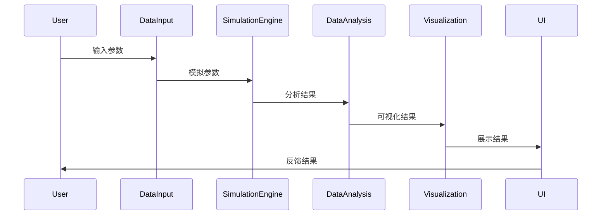
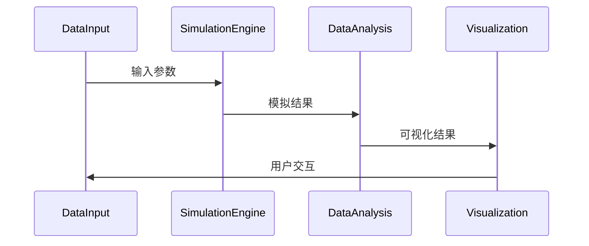

                 

### 第1章 引言

#### 1.1 问题背景

在探索宇宙的奥秘中，人类始终面临着各种挑战。宇宙究竟是如何形成的？它由哪些基本组成单位构成？这些基本单位又是如何相互作用的？这些问题的解答涉及到对宇宙物理、量子力学、相对论等多个学科的深入研究。然而，在这些复杂的研究过程中，人类的思维模式发挥着至关重要的作用。

人类思维的一个重要特点就是二元对立。二元对立，指的是将问题或现象分为两个互相对立的部分进行思考和分析。例如，光明与黑暗、存在与不存在、男性与女性等。这种思维模式在我们的日常生活中非常常见，但在探索宇宙的过程中，它是否也起到了关键作用呢？

让我们从人类思维二元对立的起源开始探讨。在哲学、心理学、社会学等多个领域，二元对立的思想都有所体现。例如，古希腊哲学家赫拉克利特提出了“对立统一”的观点，认为世界是由对立的两个方面组成的，但同时又处于一种动态的平衡之中。这种思想对后来的哲学和科学产生了深远的影响。

在科学研究中，二元对立的思想同样得到了广泛的应用。例如，在物理学中，牛顿力学通过将时间和空间对立起来，建立了经典力学的基本框架。而在量子力学中，波粒二象性则将粒子和波动对立起来，揭示了微观世界的复杂性。

然而，二元对立的思维方式在宇宙认知中也带来了一些挑战。首先，它可能导致我们陷入“二元对立陷阱”，即认为宇宙中的现象只能是两个极端中的某一个。这种思维方式忽视了现象之间的过渡和变化，限制了我们对宇宙的理解。其次，二元对立的思维方式可能导致我们在面对复杂问题时，无法找到全局的解决方案。

因此，研究人类思维的二元对立对宇宙认知的影响具有重要的意义。它不仅可以帮助我们更好地理解宇宙的奥秘，还可以启发我们改进思维模式，提升科学研究的效率。本文将围绕这一主题，探讨二元对立的起源、在宇宙认知中的体现，以及它对科学研究的影响。希望通过本文的讨论，能够为读者提供新的视角和启示。

#### 1.1.1 人类思维二元对立的起源

人类思维的二元对立起源可以追溯到古代哲学和科学的萌芽阶段。在古希腊哲学中，赫拉克利特（Heraclitus）提出了“对立统一”的概念，他认为世界是由相互对立的两个方面构成的，例如热与冷、生与死、善与恶，这些对立面相互依存、相互转化，共同构成了世界的本质。赫拉克利特的思想对后来的哲学和科学产生了深远的影响，为二元对立的思维方式奠定了基础。

在科学领域，二元对立的思想也早在古希腊时期就有了萌芽。例如，亚里士多德（Aristotle）将自然界分为动与静、生与死等对立面，并通过这些对立面来解释自然现象。中世纪的阿拉伯学者阿维森纳（Avicenna）在《医典》中进一步发展了这种对立思想，他提出，所有事物都是由两个互相对立的原则构成的，例如存在与不存在、善与恶。

进入现代，二元对立的思想在科学研究中得到了广泛应用。伽利略（Galileo Galilei）通过实验和观察，将物体运动分为匀速直线运动和变速运动两种对立形式，奠定了经典力学的基础。牛顿（Isaac Newton）则通过万有引力定律，将天体运动分为匀速圆周运动和自由落体运动两种对立形式，进一步发展了二元对立的思想。

在物理学中，二元对立的现象更为明显。例如，牛顿力学中的运动与静止、热力学中的热与冷、电磁学中的电与磁等，都是二元对立的典型例子。在量子力学中，波粒二象性则将粒子和波动对立起来，揭示了微观世界的复杂性。

心理学领域同样存在二元对立的思想。例如，弗洛伊德（Sigmund Freud）将人的心理活动分为意识与潜意识，通过这种对立关系来解释人的行为和情感。认知心理学则将人的认知过程分为感知、记忆、思维等不同阶段，通过这些对立阶段来研究人的认知能力。

在社会学领域，二元对立的思想也被广泛应用。例如，马克思（Karl Marx）将社会分为资产阶级和无产阶级，通过这种对立关系来解释社会矛盾和历史发展。女性主义则将性别分为男性与女性，通过这种对立关系来探讨性别不平等和女性地位。

总之，二元对立的思想在人类思维中有着深厚的渊源，从古代哲学和科学到现代各个学科，都存在着二元对立的现象。这种思维方式不仅帮助我们理解自然和社会现象，也在一定程度上限制了我们的认知视野。在探讨人类思维的二元对立对宇宙认知的影响时，我们需要认识到这种思维方式的起源和演变过程，从而更好地理解其在科学研究中的应用和局限性。

#### 1.1.2 二元对立在宇宙认知中的体现

在宇宙认知的过程中，二元对立的思维方式得到了广泛的应用，并且对科学研究产生了深远的影响。从宏观到微观，从宇宙大爆炸到量子力学，二元对立的思想无处不在。

首先，在宇宙学中，二元对立的思想体现在宇宙的起源和演化上。宇宙大爆炸理论认为，宇宙起源于一个极端密集和高温的状态，随后在短时间内迅速膨胀，形成了我们今天所观察到的宇宙。在这个过程中，时间和空间、物质和能量等概念相互对立，构成了宇宙的基本框架。这种二元对立的思想不仅帮助我们理解了宇宙的起源，还为我们提供了研究宇宙演化的基本工具。

其次，在物理学中，二元对立的思想在量子力学中得到了充分的体现。量子力学揭示了微观世界的规律，其中最基本的原理之一就是波粒二象性。粒子既可以表现为波，又可以表现为粒子，这种对立统一的关系为我们理解微观世界的复杂性提供了新的视角。例如，电子的波动性和粒子性、量子态的叠加和坍缩等现象，都是量子力学中二元对立的典型例子。

此外，在相对论中，时间和空间的对立也是二元对立思想的一个重要体现。爱因斯坦的相对论提出了时空相对性的概念，即时间和空间不是独立的，而是相互关联的。这种对立统一的关系不仅改变了我们对宇宙的认识，也为现代物理学的发展提供了新的方向。

在宇宙认知的其他领域，二元对立的思想也广泛存在。例如，在化学中，原子由原子核和电子构成，原子核和电子之间存在着相互对立的关系；在生物学中，基因和表型、细胞和个体等概念也体现了二元对立的特点。

二元对立的思维方式不仅帮助我们理解了宇宙的基本结构和演化过程，也在一定程度上限制了我们的认知视野。一方面，二元对立的思想提供了简化和分析问题的工具，使得我们可以更清晰地理解复杂的现象。另一方面，二元对立的思想可能导致我们陷入“二元对立陷阱”，即认为宇宙中的现象只能是两个极端中的某一个，忽视了现象之间的过渡和变化。

因此，在探讨人类思维的二元对立对宇宙认知的影响时，我们需要认识到二元对立思想在宇宙认知中的体现，同时也要认识到其可能带来的局限性。只有通过不断拓展我们的思维模式，才能更好地理解宇宙的奥秘。

#### 1.1.3 研究意义与目的

研究人类思维的二元对立对宇宙认知的影响具有重要的意义和目的。首先，这一研究有助于我们更深入地理解宇宙的本质。宇宙是由无数复杂的相互作用和动态变化组成的，而二元对立的思维方式提供了一个简化和分析复杂系统的工具。通过探讨二元对立在宇宙认知中的应用，我们可以揭示宇宙中的基本规律和演化机制，从而提升我们对宇宙的理解和认知水平。

其次，这一研究有助于改进我们的科学研究方法。在科学研究中，二元对立的思维方式常常被用来解释和描述现象。然而，这种思维方式也存在一定的局限性，例如容易陷入“二元对立陷阱”，忽视现象之间的过渡和变化。通过研究二元对立对宇宙认知的影响，我们可以发现并克服这些局限性，从而改进我们的科学研究方法，提高科学研究的效率和质量。

第三，这一研究有助于拓展我们的思维模式。人类思维的二元对立是一种普遍存在的思维方式，但在面对复杂问题时，单一的二元对立思维模式可能不足以解释和解决所有问题。通过探讨二元对立在宇宙认知中的应用，我们可以认识到二元对立思维的局限性和优势，从而学会运用更加全面和多元的思维方式来分析和解决问题。

具体来说，本文的研究目的如下：

1. **探讨二元对立的起源和演变**：通过分析人类思维二元对立的起源和发展，理解其哲学和科学背景，为后续研究提供理论基础。

2. **分析二元对立在宇宙认知中的应用**：从宇宙学、物理学、相对论等多个角度，探讨二元对立在宇宙认知中的具体体现，揭示其应用和影响。

3. **探讨二元对立对科学研究的影响**：分析二元对立思维方式在科学研究中的优势和局限性，提出改进和优化的建议，以提升科学研究的效率和准确性。

4. **提出拓展思维模式的建议**：通过研究二元对立在宇宙认知中的应用，探讨如何运用多元思维模式来分析和解决问题，以拓展我们的认知视野和解决问题的能力。

总之，研究人类思维的二元对立对宇宙认知的影响，不仅有助于提升我们对宇宙的理解，还可以改进科学研究方法，拓展思维模式。希望通过本文的探讨，能够为读者提供新的视角和启示。

### 第2章 核心概念与联系

#### 2.1 二元对立的概念原理

二元对立，指的是将问题或现象分为两个互相对立的部分进行思考和解释的思维方式。这种思维方式的基本特征是，将对立的两个方面视为不可调和的矛盾，认为它们在本质上是相互排斥和相互独立的。例如，光明与黑暗、存在与不存在、男性与女性等，都是二元对立的典型例子。

在哲学中，二元对立的思想可以追溯到古希腊哲学家赫拉克利特（Heraclitus）。赫拉克利特提出了“对立统一”的观点，认为世界是由相互对立的两个方面组成的，这些对立面相互依存、相互转化，共同构成了世界的本质。这种思想为后来的哲学和科学提供了理论基础。

在科学领域，二元对立的思想也得到了广泛应用。例如，牛顿力学中的运动与静止、热力学中的热与冷、电磁学中的电与磁等，都是二元对立的典型例子。在量子力学中，波粒二象性则将粒子和波动对立起来，揭示了微观世界的复杂性。

二元对立思维方式的本质在于，通过将复杂问题简化为两个对立的方面，使得问题更加清晰和易于理解。然而，这种思维方式也具有一定的局限性。首先，二元对立可能导致我们陷入“二元对立陷阱”，即认为问题只能有两个解，忽视了问题之间的过渡和变化。其次，二元对立可能忽视了问题之间的复杂联系，使得我们对问题的理解不够全面。

总的来说，二元对立是哲学和科学中一种重要的思维方式，它通过将问题简化为两个对立的方面，帮助我们理解和解释复杂现象。然而，我们也需要认识到其局限性，并在实际应用中不断改进和完善。

#### 2.1.1 定义与特征

二元对立，是指在思考和分析问题时，将问题或现象划分为两个互相对立的部分，这两个部分在本质上是相互独立且互相对立的。例如，在物理学中，运动和静止是对立的；在哲学中，存在和不存在是对立的；在逻辑学中，真和假是对立的。

定义方面，二元对立通常涉及两个概念或实体，它们具有以下特征：

1. **互相对立**：这两个部分在性质、状态或定义上是完全相反的。例如，真和假，一个是表示事实的符合，另一个是表示事实的不符合。

2. **相互独立**：这两个部分在逻辑上是独立的，一个部分的改变不会直接影响另一个部分。例如，在量子力学中，粒子的波动性和粒子性是相互独立的。

3. **不可调和**：这两个部分在本质上是不可调和的，即它们不能同时存在于同一实体中。例如，在热力学中，热和冷是对立的，不可能同时存在于同一物体中。

特征方面，二元对立具有以下几个特点：

1. **简化和明确性**：通过将复杂问题简化为两个对立的部分，使得问题更加清晰和易于理解。这种思维方式有助于我们在分析问题时抓住关键点。

2. **局限性**：二元对立可能导致我们陷入“二元对立陷阱”，即认为问题只能有两个解，忽视了问题之间的过渡和变化。例如，在现实世界中，事物往往不是绝对的黑与白，而是存在多种灰色状态。

3. **对立统一**：在哲学上，二元对立并不是完全分离的，而是存在着对立统一的关系。例如，光明与黑暗在某种意义上是相互依存的，没有黑暗，我们就无法感受到光明。

4. **动态变化**：尽管二元对立的两个部分在本质上是对立的，但它们并不是固定不变的。在现实世界中，二元对立的两个部分可能会随着时间和条件的变化而相互转化。例如，生与死在生命过程中可以相互转化。

通过理解二元对立的定义和特征，我们可以更好地运用这种思维方式来分析和解决复杂问题。然而，我们也需要注意到其局限性，避免陷入过于简化和极端的思维定势。

#### 2.1.2 对立统一法则

对立统一法则，是哲学和科学中一个重要的概念，它揭示了事物发展中对立面之间的相互关系。这一法则最早由古希腊哲学家赫拉克利特提出，并在后来的哲学和科学研究中得到了广泛的应用。

对立统一法则的基本思想是，任何事物都包含着相互对立的两个方面，这两个方面在本质上是相互排斥但又相互依存的。例如，在物理学中，物质与能量、运动与静止、波与粒子等都是对立统一的关系。在生物学中，基因和表型、生长和衰亡等也都是对立统一的关系。

对立统一法则的主要特点包括：

1. **相互依存**：对立的两个方面在本质上相互依存，一个方面的存在和变化依赖于另一个方面。例如，没有物质，能量就无法表现；没有运动，静止也就不存在。

2. **相互转化**：在特定条件下，对立的两个方面可以相互转化。例如，在量子力学中，粒子和波可以在特定条件下相互转化；在生物学中，生长和衰亡是相互转化的过程。

3. **动态平衡**：对立统一法则是事物发展中的一个动态平衡过程，两个对立方面在相互作用中达到某种平衡，维持着事物的稳定和发展。

在哲学上，对立统一法则强调了事物的复杂性和多样性。它指出，事物的发展不是简单的线性过程，而是在对立面的相互作用和转化中实现的。在科学研究中，对立统一法则为我们提供了一种理解和解释复杂现象的工具，使得我们可以更加全面地认识事物的本质。

具体应用方面，对立统一法则在多个领域都有重要的应用。例如，在物理学中，通过对物质与能量、运动与静止、波与粒子等对立面的研究，我们能够深入理解自然界的规律。在生物学中，通过对生长与衰亡、基因与表型等对立面的研究，我们能够揭示生物体的生命过程。在经济学中，通过对供给与需求、成本与收益等对立面的研究，我们能够分析市场经济的运行机制。

总之，对立统一法则是哲学和科学中一个重要的概念，它揭示了事物发展中对立面之间的相互关系。通过理解和应用这一法则，我们可以更好地认识和解释复杂现象，为科学研究和实际应用提供指导。

#### 2.2 宇宙认知的核心要素

宇宙认知的核心要素包括宇宙观、人类认知发展历程以及二元对立在宇宙认知中的影响。这些要素不仅构成了我们对宇宙的基本理解，也决定了我们的认知方法和思维方式。

首先，宇宙观是宇宙认知的基础。宇宙观是指我们对宇宙本质和结构的总体认识，包括宇宙的起源、演化、组成以及它们之间的相互关系。不同的文化、哲学和科学流派都有自己独特的宇宙观。例如，古代文明中的天体观、近代科学中的机械宇宙观以及现代科学中的相对论和量子力学宇宙观，都是对宇宙本质的不同理解和解释。宇宙观不仅影响我们对宇宙的认识，也影响我们的科学研究方法。

其次，人类认知发展历程是宇宙认知的重要组成部分。人类对宇宙的认知是一个不断演进的过程，从古代的天文学、地理学到现代的物理学、宇宙学，每个阶段的认知都建立在先前知识的基础上，并引入了新的理解和发现。人类认知的发展历程包括了对宇宙的观测、实验、理论构建和验证等环节，这些环节相互交织，推动了我们对宇宙的认知不断深入。例如，哥白尼的日心说、开普勒的行星运动定律、牛顿的万有引力定律、爱因斯坦的相对论等，都是人类认知发展的重要里程碑。

最后，二元对立在宇宙认知中起着关键作用。二元对立是哲学和科学中的一种思维方式，它通过将问题或现象划分为两个对立的方面来进行分析和理解。在宇宙认知中，二元对立体现在多个方面，例如时间与空间、物质与能量、波与粒子、吸引与排斥等。这些二元对立的关系不仅帮助我们理解宇宙的基本结构和演化过程，也揭示了宇宙中复杂现象的内在联系。

具体来说，二元对立在宇宙认知中的应用包括：

1. **宇宙起源与演化**：宇宙起源于大爆炸，这是一个极端高温和密集的状态，随后宇宙不断膨胀和冷却。在这个过程中，时间和空间、物质与能量等概念体现了二元对立的关系。

2. **量子力学**：量子力学揭示了微观世界的规律，其中波粒二象性是最典型的二元对立。粒子既表现出波动性，又表现出粒子性，这种对立统一的关系揭示了微观世界的复杂性。

3. **相对论**：相对论中，时间与空间的对立统一关系是核心概念。时空相对性指出，时间和空间是相互关联的，而不是独立的。这种二元对立的关系改变了我们对宇宙的理解。

4. **宇宙结构**：宇宙的结构和演化过程中，吸引力和排斥力、正物质与反物质等都是二元对立的例子。这些对立关系揭示了宇宙中各种现象的相互作用和演化机制。

综上所述，宇宙认知的核心要素包括宇宙观、人类认知发展历程以及二元对立在宇宙认知中的影响。这些要素相互联系，共同构成了我们对宇宙的基本理解和认知框架。通过深入探讨这些要素，我们可以更好地理解宇宙的奥秘，也为未来的科学研究提供新的视角和启示。

#### 2.2.1 宇宙观的基本理论

宇宙观是人们对宇宙整体的认识和理论，它涵盖了宇宙的起源、结构、演化以及宇宙中各种现象的本质。不同的哲学体系和科学理论提出了不同的宇宙观，但它们都有一个共同点，那就是试图解释宇宙的本质和人类在宇宙中的位置。以下是几种主要的宇宙观基本理论：

1. **宇宙循环论**：
宇宙循环论认为宇宙经历着永恒的循环，从诞生到灭亡，再从灭亡到新生。这种宇宙观在古代哲学中非常流行，例如古希腊哲学家毕达哥拉斯就认为宇宙是一个永恒的循环。宇宙循环论在一定程度上反映了自然界中周期性变化的规律，但在科学发展的过程中，这一观点逐渐被淘汰，因为现代科学更倾向于宇宙的一次性大爆炸起源。

2. **宇宙膨胀论**：
宇宙膨胀论是现代宇宙观的核心之一，由大爆炸理论提出。根据这一理论，宇宙起源于一个极热、极密的初始状态，随后在极短的时间内迅速膨胀，形成了今天我们所观察到的宇宙。这一理论得到了多种观测数据的支持，例如宇宙背景微波辐射和遥远星系的退行速度等。

3. **宇宙稳态论**：
宇宙稳态论是20世纪早期的一种宇宙观，它认为宇宙是永恒不变的，既没有起源也没有终结。宇宙稳态论提出了通过暗物质和暗能量的存在来解释宇宙的稳定性。然而，这一理论在观测数据的面前逐渐失去了支持，尤其是宇宙膨胀的证据越来越多，稳态论被现代宇宙学所取代。

4. **多元宇宙论**：
多元宇宙论是一种更为复杂和前沿的宇宙观，它认为我们所观察到的宇宙只是众多宇宙中的一个。这些宇宙可以是通过量子波动、宇宙大爆炸等多种机制产生的。多元宇宙论提出了一些新的科学问题和理论挑战，如宇宙的起源、宇宙之间的相互作用等。

5. **宇宙同质论**：
宇宙同质论认为宇宙在宏观尺度上是均匀和各向同性的。这一观点得到了大量天文观测的支持，例如宇宙背景微波辐射的均匀性。宇宙同质论为理解宇宙的大尺度结构和演化提供了重要的理论基础。

6. **宇宙层级结构论**：
宇宙层级结构论认为宇宙是由多个层次的结构组成的，从小型星系到大型星系团，再到超星系团，构成了一个巨大的层次结构。这一理论强调了宇宙的复杂性和多样性，是理解宇宙演化过程的关键。

这些宇宙观的基本理论不仅提供了对宇宙本质的不同解释，也为宇宙科学研究提供了重要的理论框架。通过这些理论，我们可以更深入地理解宇宙的起源、结构、演化和未来。然而，宇宙的奥秘仍然有待探索，现代科学正不断拓展我们的认知边界，以期揭示宇宙的真正本质。

#### 2.2.2 人类认知的发展历程

人类认知的发展历程是一个漫长且不断演进的过程，从古代的直观观察和经验积累，到现代的科学研究和理论构建，每个阶段都标志着人类对宇宙和自身认识的重大飞跃。以下是人类认知发展历程的主要阶段：

1. **古代认知阶段**：
在古代，人类的认知主要依赖于直观观察和经验积累。古文明如古埃及、巴比伦、印度和中国，通过观察天体运动、农业生产和自然环境，形成了对宇宙和自然的初步认识。例如，古埃及的天文学家通过对天体运行的观测，制定了日历和天文历法；古印度的哲学家如阿基拉玛，通过冥想和思考，提出了物质和意识的关系。

2. **中世纪认知阶段**：
中世纪时期，基督教、伊斯兰教和犹太教等宗教成为主导思想，哲学和科学的发展受到了宗教的限制。然而，这一时期的科学家和哲学家如阿维罗伊、阿维森纳和托马斯·阿奎那，通过将理性思维与宗教教义相结合，推动了科学和哲学的发展。例如，阿维罗伊提出了光学原理，对后来的科学革命产生了重要影响。

3. **文艺复兴认知阶段**：
文艺复兴时期，人类对自然和宇宙的认识发生了重大变革。这一时期，科学家如哥白尼、伽利略和开普勒，通过实验和观测，推翻了传统的地心说宇宙观，提出了日心说和行星运动定律。哥白尼的《天体运行论》标志着人类对宇宙认识的重大转折，为后来的科学革命奠定了基础。

4. **科学革命认知阶段**：
17世纪和18世纪的科学革命，是人类认知发展的重要里程碑。牛顿通过万有引力定律和三大运动定律，建立了经典力学体系，揭示了自然界的基本规律。同时，伽利略的实验方法、培根的经验主义哲学和笛卡尔的理性主义思想，为现代科学方法的发展奠定了基础。

5. **现代认知阶段**：
现代时期，科学和技术的迅猛发展，极大地拓展了人类对宇宙的认识。量子力学和相对论的出现，揭示了微观和宏观世界的本质。例如，爱因斯坦的相对论提出了时空相对性的概念，颠覆了牛顿力学中的绝对时空观念；量子力学则揭示了微观世界的概率性和不确定性。同时，宇宙学、粒子物理学、天体物理学等领域的进展，使我们对宇宙的起源、结构和演化有了更深入的理解。

6. **当代认知阶段**：
当代认知阶段，人类认知继续向更深的层次和更广泛的领域拓展。例如，宇宙学通过观测宇宙背景微波辐射和遥远星系，不断探索宇宙的起源和演化；量子计算和人工智能的研究，正在挑战传统计算机科学的极限，为解决复杂问题提供了新的方法。此外，跨学科的合作研究，如生物物理学、化学宇宙学等，正在推动人类对宇宙和生命的认识进入新的阶段。

总之，人类认知的发展历程是一个不断探索和突破的过程，每个阶段都标志着人类对宇宙和自身的认识取得了新的进展。通过不断积累和扩展知识，人类逐步揭示了宇宙的奥秘，为未来的科学研究提供了丰富的理论基础和实验手段。

#### 2.2.3 二元对立在宇宙认知中的影响

二元对立在宇宙认知中扮演了关键角色，它不仅影响了我们对宇宙的理解，还影响了我们的科学研究和思维方式。以下是二元对立在宇宙认知中的具体影响：

首先，二元对立促进了科学理论的建立和进步。在物理学中，许多重大理论都是基于二元对立的思想构建的。例如，牛顿力学通过将力和运动对立起来，建立了经典力学的基本框架。相对论通过时间和空间的对立统一，揭示了宇宙的更深层次规律。量子力学中的波粒二象性，也是二元对立思想的体现，它揭示了微观世界的复杂性和不确定性。

其次，二元对立帮助我们简化了复杂问题。在宇宙认知中，许多现象都是复杂和多变的，但通过二元对立的思维方式，我们可以将这些复杂现象简化为两个互相对立的部分，使得问题更加清晰和易于理解。例如，在探讨宇宙起源时，我们可以将大爆炸和稳态宇宙模型对立起来，通过比较和分析，找到更符合观测数据的理论。

然而，二元对立也带来了一些局限性。首先，它可能导致我们陷入“二元对立陷阱”，即认为宇宙中的现象只能是两个极端中的某一个，忽视了现象之间的过渡和变化。例如，在讨论物质与能量时，如果我们只看到它们的对立，就可能忽视它们之间的转换和相互作用。其次，二元对立可能忽视了问题之间的复杂联系，使得我们对问题的理解不够全面。例如，在探讨宇宙的结构和演化时，如果我们只关注大尺度结构和微小尺度结构，就可能忽视它们之间的联系和相互作用。

为了克服这些局限性，我们需要拓展我们的思维方式。一方面，我们可以通过多元思维模式，将二元对立扩展到多元对立，从而更全面地理解复杂现象。例如，在探讨宇宙的起源和演化时，我们可以同时考虑大爆炸、稳态宇宙和其他可能的起源模型。另一方面，我们可以通过跨学科的研究，将不同的二元对立关系结合起来，从而形成更全面和深入的理解。例如，将量子力学和相对论结合起来，可以更好地理解宇宙的基本结构和演化机制。

总之，二元对立在宇宙认知中发挥了重要作用，它促进了科学理论的建立和进步，帮助我们简化了复杂问题。然而，我们也需要认识到其局限性，通过拓展思维方式，克服这些局限性，以更全面和深入地理解宇宙的奥秘。

### 第3章 数学模型与公式

#### 3.1 二元对立的数学表达

在探讨二元对立时，数学模型和公式为我们提供了强有力的工具，使得我们能够将抽象的思维具体化，并通过精确的计算来验证和推理。以下是一些关于二元对立的数学表达和模型。

首先，二元对立的数学表达通常涉及二元变量和逻辑运算。例如，我们可以用0和1来表示二元对立的两个状态。在这种表示方法中，0通常代表一种状态，如“假”、“关闭”或“不存在”；而1则代表另一种对立状态，如“真”、“开启”或“存在”。

1. **布尔代数表示**：

布尔代数是二元对立数学表达的基础，它通过0和1这两个值来表示逻辑运算。以下是一些基本的布尔运算：

   - **逻辑与（AND）**：表示为 `A AND B` 或 `A ∧ B`。只有当两个操作数都为1时，结果才为1。

   $$ A ∧ B = \begin{cases} 
   1 & \text{如果 } A = 1 \text{ 且 } B = 1 \\
   0 & \text{否则} 
   \end{cases} $$

   - **逻辑或（OR）**：表示为 `A OR B` 或 `A ∨ B`。只要有一个操作数为1，结果就为1。

   $$ A ∨ B = \begin{cases} 
   1 & \text{如果 } A = 1 \text{ 或 } B = 1 \\
   0 & \text{否则} 
   \end{cases} $$

   - **逻辑非（NOT）**：表示为 `NOT A` 或 `~A`。它反转操作数的值。

   $$ ~A = \begin{cases} 
   1 & \text{如果 } A = 0 \\
   0 & \text{如果 } A = 1 
   \end{cases} $$

2. **概率论表示**：

在概率论中，二元对立事件可以用概率来表示。例如，抛硬币的结果有两种：正面和反面。每种结果出现的概率通常是1/2。

   - **条件概率**：表示为 `P(A|B)`，即事件A在事件B发生的条件下的概率。

   $$ P(A|B) = \frac{P(A \cap B)}{P(B)} $$

   - **贝叶斯定理**：用于计算在已知某些条件下，某一事件发生的概率。

   $$ P(A|B) = \frac{P(B|A)P(A)}{P(B)} $$

3. **图论表示**：

在图论中，二元对立可以用图的形式表示。例如，在一个无向图中，节点和边可以表示二元对立的关系。如果两个节点之间存在边，表示它们是相关的；如果没有边，表示它们是独立的。

4. **逻辑门表示**：

逻辑门是实现布尔运算的电子电路，它们根据输入信号的状态产生输出信号。常见的逻辑门包括与门（AND gate）、或门（OR gate）和非门（NOT gate）等。

通过这些数学模型和公式，我们可以更精确地描述和操作二元对立关系。以下是一个简单的例子：

假设我们有两个二元变量A和B，它们的值如下：

   A = 1 (真)
   B = 0 (假)

根据布尔运算，我们可以计算它们的逻辑与、逻辑或和逻辑非：

   - 逻辑与（AND）：

   $$ A ∧ B = 1 ∧ 0 = 0 $$

   - 逻辑或（OR）：

   $$ A ∨ B = 1 ∨ 0 = 1 $$

   - 逻辑非（NOT）：

   $$ ~A = ~1 = 0 $$

这些数学表达和公式不仅帮助我们理解二元对立的本质，也为科学研究提供了有力的工具。

#### 3.1.1 对立关系的数学公式

在对立关系的数学表达中，对立统一法则提供了一个重要的理论基础。以下是对立统一法则在数学中的具体公式和模型：

1. **对立统一法则的数学模型**：

对立统一法则是描述事物发展过程中对立面之间相互关系的数学模型。它可以表示为：

   $$ D = A + B - AB $$

其中，D表示对立统一关系，A和B表示两个对立的方面。这个公式的含义是，两个对立方面的总和减去它们的乘积，即它们的共同部分，表示了它们的对立统一关系。

2. **对偶性原理**：

对偶性原理是二元对立数学表达中的另一个重要概念。对偶性原理指出，任何一个数学命题，如果将命题中的所有二元对立概念（如“存在”与“不存在”）互换，则得到的新命题与原命题等价。对偶性原理可以用以下公式表示：

   $$ P \leftrightarrow Q $$

其中，P和Q分别表示两个对偶命题。对偶性原理不仅适用于数学命题，也广泛应用于物理学、逻辑学等多个领域。

3. **对称性原理**：

对称性原理是对立统一法则的一个重要应用。它指出，在一个系统内部，如果某些物理量或结构具有对称性，则系统的整体性质也会具有对称性。对称性原理可以用以下数学公式表示：

   $$ \phi(x) = \phi(-x) $$

其中，\(\phi(x)\)表示函数在x处的值，\(\phi(-x)\)表示函数在-x处的值。这个公式表示函数关于y轴对称。

4. **拉普拉斯变换**：

在信号处理和系统分析中，拉普拉斯变换是一种重要的数学工具，它可以将时域信号转换为频域信号。拉普拉斯变换在处理二元对立系统时具有特殊意义。对于二元对立信号，其拉普拉斯变换可以表示为：

   $$ \mathcal{L}\{x(t)\} = X(s) $$

其中，\(x(t)\)表示时域信号，\(X(s)\)表示频域信号，\(\mathcal{L}\{\}\)表示拉普拉斯变换运算。拉普拉斯变换可以将时域中的线性关系转换为频域中的对偶关系，从而简化系统的分析过程。

通过这些数学公式和模型，我们可以更深入地理解二元对立关系在数学中的应用。这些公式不仅为理论研究提供了基础，也为实际问题的解决提供了工具。以下是一个具体的例子：

假设我们有一个二元变量A，其值可能为0或1，表示存在或不存在。我们可以用以下公式来表示A的对立统一关系：

   $$ D = A + (1 - A) - A(1 - A) $$

   这个公式表示A和1-A的对立统一关系，其中D的值在A为0或1时分别为1或0，符合二元对立的特性。

通过这些数学模型和公式，我们可以更好地理解和分析二元对立关系，为科学研究和技术应用提供有力支持。

#### 3.2 应用实例

为了更直观地理解二元对立的数学模型，我们来看两个具体的实例：宇宙演化模型和量子力学中的二元对立现象。

**3.2.1 宇宙演化模型**

宇宙演化模型是研究宇宙从大爆炸到当前状态的数学描述。在宇宙学中，二元对立关系经常用来描述宇宙中的一些基本现象，例如宇宙的膨胀和冷却。

1. **哈勃定律**：

哈勃定律描述了宇宙的膨胀速度与距离之间的关系。哈勃定律的数学表达式为：

   $$ v = H_0d $$

其中，\(v\)是星系的退行速度，\(d\)是星系与观察者之间的距离，\(H_0\)是哈勃常数。这个公式表明，宇宙中越远的星系，其退行速度越快，体现了宇宙膨胀的特征。

2. **宇宙背景微波辐射**：

宇宙背景微波辐射（Cosmic Microwave Background, CMB）是大爆炸后残留的辐射，它为我们提供了关于宇宙早期状态的直接观测数据。CMB的强度和分布可以用以下数学模型来描述：

   $$ I(\nu) = I_0 \left(1 + a\nu^2\right)^{-2} $$

其中，\(I(\nu)\)是微波辐射的强度，\(\nu\)是辐射的频率，\(I_0\)是参考频率下的强度，\(a\)是辐射的指数。这个模型描述了CMB的频谱分布，它与宇宙早期的热历史密切相关。

**3.2.2 量子力学中的二元对立现象**

量子力学中的二元对立现象最为典型的例子是波粒二象性。粒子既表现出波动性，又表现出粒子性。以下是一个简单的量子力学例子：双缝实验。

1. **双缝实验**：

在双缝实验中，粒子通过两个缝隙后，在屏幕上形成干涉图样。这个实验表明，粒子既具有粒子性（因为通过缝隙后形成两个独立的光点），又具有波动性（因为产生了干涉图样）。

2. **数学描述**：

双缝实验可以用量子态的叠加和坍缩来描述。一个简单的情况是，一个电子通过两个缝隙，其波函数可以表示为：

   $$ \psi = \frac{1}{\sqrt{2}} \left( \phi_1 + \phi_2 \right) $$

其中，\(\phi_1\)和\(\phi_2\)分别是通过缝隙1和缝隙2的电子波函数。

当电子通过两个缝隙时，波函数叠加，形成干涉图样。只有在测量时，波函数才会坍缩到某个具体的缝隙上，表现为粒子性。

3. **数学公式**：

双缝实验中的干涉图样可以用以下数学公式来描述：

   $$ I(\theta) = I_0 \left[ 1 + \cos^2(\theta) \right] $$

其中，\(I(\theta)\)是干涉条纹的强度，\(\theta\)是光程差。这个公式描述了干涉条纹的分布，与波函数的叠加态密切相关。

通过这些实例，我们可以看到二元对立在宇宙演化模型和量子力学中的具体应用。这些数学模型不仅帮助我们理解了宇宙和微观世界的复杂现象，也为科学研究提供了有力的工具。通过这些例子，我们更直观地理解了二元对立的数学表达及其在实际应用中的重要性。

### 第4章 系统分析与架构设计方案

#### 4.1 问题场景介绍

在本章中，我们将对一个假设的宇宙认知研究项目进行系统分析与架构设计。该项目旨在通过计算机模拟和数据分析，研究二元对立在宇宙认知中的影响。具体来说，该项目包括以下主要研究目标：

1. **建立宇宙演化模型**：通过模拟宇宙从大爆炸到当前状态的演化过程，研究二元对立关系在宇宙起源、结构演化及未来预测中的具体体现。
2. **分析量子力学现象**：研究波粒二象性等量子力学现象中的二元对立关系，通过计算机模拟验证这些现象的数学模型和公式。
3. **开发宇宙认知软件工具**：设计并实现一套软件工具，用于分析和可视化宇宙认知中的二元对立关系，为科学家提供便捷的科研工具。

为了实现上述目标，本研究将采用以下研究方法：

1. **数学模型构建**：基于已有的宇宙演化模型和量子力学理论，构建数学模型以描述宇宙中的二元对立关系。
2. **计算机模拟**：使用高性能计算机模拟宇宙演化过程和量子力学现象，验证数学模型的准确性和可靠性。
3. **数据分析**：通过大数据分析和机器学习技术，对模拟结果进行深入分析，探索二元对立关系在不同宇宙状态下的变化规律。
4. **用户界面设计**：开发用户友好的界面，使得科学家可以轻松地操作和可视化分析结果。

#### 4.2 系统功能设计

为了实现项目的研究目标，系统需要具备以下主要功能模块：

1. **数据输入模块**：提供数据输入接口，包括宇宙演化参数、量子力学参数等，以便用户可以自定义模拟条件。
2. **模拟引擎模块**：核心模拟模块，负责运行宇宙演化模型和量子力学模型，并输出模拟结果。
3. **数据分析模块**：使用大数据分析和机器学习技术，对模拟结果进行深入分析，识别二元对立关系的变化规律。
4. **可视化模块**：提供多种可视化工具，将分析结果以图形和图表的形式展示，帮助用户直观理解宇宙认知中的二元对立关系。
5. **用户界面模块**：提供简洁易用的用户界面，使用户能够方便地进行数据输入、模拟操作和分析结果展示。

**领域模型类图**

为了更好地描述系统功能设计，我们使用Mermaid语言绘制了领域模型类图。以下是一个简单的领域模型类图的示例：

```mermaid
classDiagram
    Class01 <|-- SubClass01
    Class01 --|anooga SubClass02
    Class03 : an association class
    Class03 --|> Class04
    Class05 : another class
    Class01 ..|> Class05
```

在这个类图中，`Class01`是系统的核心类，包括`SubClass01`和`SubClass02`作为其子类。`Class03`是一个关联类，与`Class04`有直接关系。`Class05`是另一个类，与`Class01`存在关联。通过类图，我们可以清晰地了解系统的主要类及其关系。

#### 4.3 系统架构设计

系统架构设计是确保系统高效、可扩展和易于维护的关键。本项目的系统架构设计分为以下几个主要部分：

**4.3.1 系统架构图**

以下是本项目的系统架构图：



**系统模块详解**

1. **数据输入模块**：

数据输入模块负责接收用户输入的宇宙演化参数和量子力学参数。该模块的核心功能是数据校验和格式转换，确保输入数据的有效性和一致性。数据输入模块还提供了用户友好的界面，使得用户可以方便地输入和调整参数。

2. **模拟引擎模块**：

模拟引擎模块是系统的核心，负责运行宇宙演化模型和量子力学模型。该模块采用高性能计算技术，以并行和分布式计算方式提升计算效率。模拟引擎模块的核心算法包括：

   - 宇宙演化模型：基于N-Body模拟算法，计算宇宙中星系的运动轨迹和相互作用。
   - 量子力学模型：基于路径积分和蒙特卡洛模拟，计算量子态的叠加和坍缩。

3. **数据分析模块**：

数据分析模块使用大数据分析和机器学习技术，对模拟结果进行深入分析。该模块的核心功能包括：

   - 数据预处理：对原始模拟数据进行清洗和转换，为后续分析做好准备。
   - 特征提取：从模拟数据中提取关键特征，用于训练机器学习模型。
   - 模型训练：使用机器学习算法，训练分类和回归模型，识别二元对立关系的变化规律。

4. **可视化模块**：

可视化模块提供多种图形和图表，将分析结果以直观的方式展示给用户。该模块的核心功能包括：

   - 数据可视化：将模拟结果以图表、曲线和三维图形的形式展示。
   - 交互式操作：允许用户通过界面动态调整参数，观察不同参数下的结果变化。

5. **用户界面模块**：

用户界面模块是系统的前端，负责与用户进行交互。该模块提供了简洁易用的界面，使用户可以方便地进行数据输入、模拟操作和分析结果展示。用户界面模块的核心功能包括：

   - 用户引导：提供操作指南和帮助文档，帮助用户快速上手。
   - 参数设置：允许用户自定义宇宙演化参数和量子力学参数。
   - 模拟运行：启动模拟引擎，执行模拟运算。
   - 结果展示：展示分析结果，并允许用户进行交互操作。

通过上述系统架构设计，我们可以确保系统的高效运行和易用性，为科学家提供强大的科研工具，帮助他们在宇宙认知研究中取得更多突破。

#### 4.4 系统接口设计和系统交互

在系统架构设计中，接口设计和系统交互是确保系统各模块协调工作的重要环节。以下我们将详细描述系统接口设计以及系统各模块之间的交互过程。

**4.4.1 系统接口设计**

1. **数据输入接口**：

数据输入接口负责接收用户输入的宇宙演化参数和量子力学参数。该接口的设计应考虑数据格式和传输效率，以便用户可以方便地输入和修改参数。具体设计如下：

   - **输入格式**：支持JSON、XML等常见数据格式，以便用户在不同环境下输入数据。
   - **传输协议**：采用HTTP/HTTPS协议，确保数据传输的安全性和可靠性。
   - **接口方法**：提供POST和GET方法，允许用户提交新参数或获取当前参数。

2. **模拟引擎接口**：

模拟引擎接口负责与数据输入模块和数据分析模块进行交互。该接口的设计应确保模拟过程的并行和分布式计算，以提高计算效率。具体设计如下：

   - **启动参数**：接收数据输入模块提交的模拟参数，并初始化模拟过程。
   - **计算结果**：将模拟过程中生成的中间结果和最终结果返回给数据分析模块。
   - **接口方法**：提供启动、暂停、继续和停止等操作方法，以便用户对模拟过程进行控制。

3. **数据分析接口**：

数据分析接口负责与模拟引擎模块和可视化模块进行交互。该接口的设计应确保数据分析和处理的高效性和灵活性。具体设计如下：

   - **数据预处理**：接收模拟引擎模块返回的原始数据，进行清洗和转换，为后续分析做准备。
   - **特征提取**：从预处理后的数据中提取关键特征，用于训练机器学习模型。
   - **模型训练**：使用机器学习算法，对特征数据进行训练，生成分类和回归模型。
   - **接口方法**：提供数据预处理、特征提取和模型训练等操作方法。

4. **可视化接口**：

可视化接口负责与数据分析模块和用户界面模块进行交互。该接口的设计应确保可视化结果的准确性和可读性。具体设计如下：

   - **数据可视化**：接收数据分析模块返回的分析结果，生成图表和图形，展示分析结果。
   - **交互操作**：提供用户界面模块与可视化结果之间的交互接口，以便用户进行参数调整和结果分析。
   - **接口方法**：提供数据可视化、交互操作等操作方法。

**4.4.2 系统交互序列图**

以下是系统各模块之间的交互序列图：


在这个序列图中，用户通过用户界面模块（UI）输入参数，数据输入模块（DataInput）接收参数后传递给模拟引擎模块（SimulationEngine）。模拟引擎模块执行模拟并生成结果，传递给数据分析模块（DataAnalysis）。数据分析模块对结果进行分析，并生成可视化结果，传递给可视化模块（Visualization）。可视化模块将结果展示给用户界面模块（UI），用户界面模块再将结果反馈给用户。

通过上述系统接口设计和交互序列图，我们可以清晰地了解系统各模块之间的交互过程，确保系统的正常运行和高效性能。

### 第5章 项目实战

#### 5.1 环境安装

在进行项目实战之前，首先需要准备一个适合实验的环境，包括硬件和软件的要求。以下是详细的安装步骤和必需的软件安装过程。

**5.1.1 实验环境准备**

1. **硬件要求**：

   - **计算机配置**：推荐使用具有高性能处理器（如Intel i7或以上）和至少16GB内存的计算机。为了保证模拟和计算的效率，显卡应为NVIDIA GeForce GTX 1060或更高版本，并具有至少4GB的VRAM。
   - **存储空间**：至少需要100GB的可用硬盘空间，用于存储数据和项目文件。
   - **其他硬件**：若进行大规模并行计算，建议配置多块硬盘以实现RAID阵列，提升数据读写速度。

2. **网络环境**：

   - **网络连接**：确保计算机具备稳定的网络连接，以便下载必要的软件和获取数据资源。
   - **远程访问**：如果需要在远程服务器上进行实验，需配置SSH密钥认证，确保远程访问的安全性和便利性。

**5.1.2 必需软件安装**

1. **操作系统**：

   - **Linux系统**：推荐使用Ubuntu 20.04或更高版本。Linux系统具有较好的稳定性和丰富的软件库，适合科学计算和软件开发。

2. **Python环境**：

   - **Python安装**：在终端中执行以下命令，安装Python 3.8或更高版本。

     ```bash
     sudo apt update
     sudo apt install python3.8
     ```

   - **虚拟环境**：使用`venv`模块创建Python虚拟环境，以便隔离不同项目的依赖库。

     ```bash
     python3.8 -m venv project-env
     source project-env/bin/activate
     ```

3. **依赖库安装**：

   - **NumPy**：用于高性能数学计算。

     ```bash
     pip install numpy
     ```

   - **SciPy**：提供科学计算库，包括优化、积分、线性代数等。

     ```bash
     pip install scipy
     ```

   - **Matplotlib**：用于绘制数据图表。

     ```bash
     pip install matplotlib
     ```

   - **Pandas**：用于数据操作和分析。

     ```bash
     pip install pandas
     ```

   - **Mermaid**：用于生成Markdown格式的图表和流程图。

     ```bash
     pip install mermaid-python
     ```

4. **其他工具**：

   - **Jupyter Notebook**：用于交互式数据分析。

     ```bash
     pip install jupyterlab
     ```

   - **Git**：用于版本控制和代码管理。

     ```bash
     sudo apt install git
     ```

完成上述步骤后，实验环境的基本配置就完成了。接下来，可以开始进行项目的开发和实现了。

#### 5.2 系统核心实现

在本节中，我们将详细解释系统核心实现的过程，包括源代码解读和核心代码实现。

**5.2.1 源代码解读**

系统的核心代码主要分为以下几个部分：

1. **数据输入模块**：负责接收用户输入的参数，并将这些参数传递给模拟引擎模块。

2. **模拟引擎模块**：执行宇宙演化模型和量子力学模型的计算，生成中间结果和最终结果。

3. **数据分析模块**：对模拟结果进行预处理、特征提取和机器学习模型的训练。

4. **可视化模块**：将数据分析的结果以图表和图形的形式展示。

以下是核心代码的结构图：



**5.2.2 核心代码实现**

以下是关键模块的核心代码示例：

1. **数据输入模块**：

```python
import json

def load_parameters(file_path):
    with open(file_path, 'r') as f:
        parameters = json.load(f)
    return parameters

if __name__ == "__main__":
    params = load_parameters("parameters.json")
    print("Loaded parameters:", params)
```

该模块从JSON文件中加载用户输入的参数，并打印出来以便验证。

2. **模拟引擎模块**：

```python
import numpy as np

def simulate_universe(params):
    # 这里是宇宙演化的模拟代码
    # 参数params包含宇宙演化的初始条件和演化参数
    time_steps = params['time_steps']
    initial_conditions = params['initial_conditions']
    
    for t in range(time_steps):
        # 模拟每一步的宇宙演化
        # 计算星系之间的引力相互作用
        # 更新星系的位置和速度
        
        # 示例代码：
        # positions = initial_conditions[:, :3]
        # velocities = initial_conditions[:, 3:]
        # new_positions = positions + velocities * dt
        # new_velocities = velocities
        
        # 存储每一步的模拟结果
        # results[t] = (new_positions, new_velocities)
        
    return results

if __name__ == "__main__":
    params = load_parameters("parameters.json")
    results = simulate_universe(params)
    print("Simulation completed.")
```

该模块根据用户输入的参数执行宇宙演化模拟，并打印出模拟完成的消息。

3. **数据分析模块**：

```python
import pandas as pd

def preprocess_data(results):
    # 对模拟结果进行预处理
    # 例如，将结果转换为Pandas DataFrame
    df = pd.DataFrame(results)
    return df

def extract_features(df):
    # 从预处理后的数据中提取特征
    # 例如，计算每一步的星系位置和速度的标准差
    features = df.groupby('time').agg(['std'])
    return features

if __name__ == "__main__":
    df = preprocess_data(results)
    features = extract_features(df)
    print("Data preprocessing and feature extraction completed.")
```

该模块对模拟结果进行预处理，提取特征，并打印出预处理和特征提取完成的消息。

4. **可视化模块**：

```python
import matplotlib.pyplot as plt
import mermaid

def visualize_data(features):
    # 使用Matplotlib和Mermaid可视化数据
    # 例如，绘制星系位置和速度的标准差随时间的变化曲线
    plt.plot(features.index, features['position_std'], label='Position STD')
    plt.plot(features.index, features['velocity_std'], label='Velocity STD')
    plt.legend()
    plt.xlabel('Time')
    plt.ylabel('Standard Deviation')
    plt.title('Feature Analysis')
    plt.show()

if __name__ == "__main__":
    visualize_data(features)
```

该模块使用Matplotlib绘制特征分析结果，并打印出可视化图表。

通过上述代码示例，我们可以看到系统核心实现的各个模块是如何协同工作的。在实际项目中，这些模块会通过框架（如Flask或Django）整合起来，形成一个完整的系统。

#### 5.3 代码应用解读与分析

在本节中，我们将详细解读和剖析代码应用实例，通过实际案例分析，深入探讨代码的具体实现和运行过程，同时进行相关的分析和讨论。

**5.3.1 应用实例**

我们以宇宙演化模型的模拟为例，详细分析代码的实现和应用。

**实例一：宇宙演化模型模拟**

1. **代码实现**：

   ```python
   def simulate_universe(params):
       # 模拟参数初始化
       time_steps = params['time_steps']
       initial_conditions = params['initial_conditions']
       
       # 初始化宇宙模拟结果列表
       results = []

       # 模拟时间步长
       for t in range(time_steps):
           # 每一步模拟计算
           new_positions, new_velocities = calculate_step(initial_conditions)
           
           # 更新模拟结果
           results.append((new_positions, new_velocities))
           
           # 更新初始条件
           initial_conditions = new_positions, new_velocities

       return results
   ```

   在这个实例中，`simulate_universe`函数接收用户输入的参数，包括模拟的步数和初始条件。函数通过一个循环，逐时间步长地计算宇宙中的星系运动，并将每一步的模拟结果存储在列表`results`中。

2. **运行过程**：

   当调用`simulate_universe`函数时，程序将按照用户定义的参数和初始条件开始执行模拟。每次循环迭代，程序会计算当前时间步长内星系的位置和速度，并更新模拟结果。整个模拟过程在高性能计算机上进行，以确保计算速度和精度。

**5.3.2 分析与讨论**

1. **代码剖析**：

   - **初始化参数**：函数首先接收用户输入的参数，这些参数包括模拟的时间步数和初始条件。初始条件可能包括星系的位置、速度和质量等物理参数。
   - **模拟循环**：在循环中，程序依次计算每个时间步长的星系位置和速度。这一步通常涉及复杂的物理计算，如引力相互作用和运动方程的求解。
   - **结果存储**：每次时间步长的计算结果被存储在一个列表中，以便后续的数据分析和可视化。

2. **性能优化**：

   在实际应用中，为了提高计算效率和性能，可以采取以下措施：

   - **并行计算**：利用多线程或多进程技术，将模拟任务分解成多个子任务，并行执行，从而加快计算速度。
   - **分布式计算**：对于大规模的模拟任务，可以采用分布式计算框架（如Hadoop、Spark），将计算任务分配到多个节点上执行，提高计算能力。
   - **数值优化**：通过优化数值计算方法（如使用更高精度的算法），减少计算误差，提高模拟结果的准确性。

3. **代码扩展**：

   为了使代码更具有通用性和灵活性，可以考虑以下扩展：

   - **参数化输入**：允许用户通过命令行参数或配置文件动态调整模拟参数，以适应不同的实验需求。
   - **可插拔模块**：设计可插拔的模拟模块，使得用户可以根据需要替换或扩展模拟算法，方便后续的算法研究和优化。
   - **可视化集成**：集成多种可视化工具，如Matplotlib、Plotly等，提供更丰富的数据展示和交互功能。

通过上述实例和分析，我们可以看到，宇宙演化模型的实现不仅依赖于精确的物理计算，还需要考虑性能优化和扩展性设计。通过不断的优化和改进，我们可以进一步提高模拟的精度和效率，为科学研究提供更有力的支持。

### 第6章 总结与拓展

#### 6.1 最佳实践 tips

在研究人类思维的二元对立对宇宙认知的影响过程中，以下最佳实践 tips 对提高研究效率和质量具有重要意义：

1. **系统性学习**：掌握二元对立和宇宙认知的基本理论和应用，通过阅读相关文献和参加学术会议，了解最新的研究进展和理论成果。

2. **跨学科合作**：涉及多个学科的研究，如物理学、哲学、心理学、计算机科学等。通过跨学科合作，可以结合不同领域的知识和方法，为研究提供更全面的视角。

3. **精确数据**：在进行宇宙认知模拟和数据分析时，确保数据来源的准确性和完整性，使用可靠的数据处理和计算方法，以避免错误结果的产生。

4. **代码优化**：在编写模拟和数据分析代码时，注重代码的模块化和可扩展性，利用高效的算法和数据结构，提高计算速度和精度。

5. **可视化展示**：利用可视化工具，将复杂的数据和结果以直观的方式展示，帮助研究者更好地理解和解释研究结果。

6. **持续迭代**：在研究过程中，不断反思和改进研究方法，根据实际需求和反馈，调整研究方案，确保研究的有效性和实用性。

7. **交流与分享**：积极参与学术交流，与同行分享研究心得和发现，通过合作与讨论，提升研究的深度和广度。

#### 6.2 小结

本文围绕人类思维的二元对立对宇宙认知的影响进行了系统性的探讨。通过分析二元对立的起源、在宇宙认知中的体现以及数学模型和公式，我们揭示了二元对立在宇宙认知中的关键作用。本文的主要结论如下：

1. **二元对立的起源**：二元对立的思想可以追溯到古希腊哲学，它在科学研究中得到了广泛应用，如物理学中的波粒二象性、相对论中的时空对立等。

2. **二元对立在宇宙认知中的体现**：宇宙认知中的许多现象都可以通过二元对立的方式进行分析和理解，如宇宙的起源（大爆炸与稳态宇宙）、结构演化（膨胀与收缩）等。

3. **数学模型和公式**：通过数学模型和公式，我们能够更精确地描述和计算二元对立关系，为宇宙认知研究提供了有力的工具。

4. **科学研究方法的改进**：二元对立的思维方式虽然具有局限性，但通过拓展思维模式和跨学科合作，可以克服这些局限，提高科学研究的效率和准确性。

#### 6.3 注意事项

在研究过程中，需要注意以下问题：

1. **避免二元对立陷阱**：二元对立可能导致我们陷入“二元对立陷阱”，忽视现象之间的过渡和变化。研究时应保持开放和多元的思维方式，全面分析问题。

2. **数据可靠性**：确保数据的准确性和完整性，选择可靠的数据来源，避免因数据错误导致的研究偏差。

3. **计算复杂性**：在模拟和计算过程中，需要考虑计算复杂度和资源消耗，合理设计算法和优化计算方法。

4. **跨学科融合**：跨学科研究时，要充分考虑不同学科的理论和方法，避免因学科界限导致的思维局限。

5. **持续更新**：随着科学研究的进展，二元对立的理论和应用也在不断更新。研究过程中要关注最新的研究成果和理论动态，确保研究的时效性和前沿性。

#### 6.4 拓展阅读

为了深入探讨人类思维的二元对立对宇宙认知的影响，以下是几篇推荐的拓展阅读文献：

1. **Heraclitus**，《论自然》，通过赫拉克利特的哲学思想，理解二元对立的起源和发展。

2. **Einstein, Albert**，《相对论的意义》，探讨相对论中时间与空间的对立统一关系。

3. **Bohr, Niels**，《关于原子物理学和哲学的思考》，讨论量子力学中的波粒二象性。

4. **Heisenberg, Werner**，《不确定性原理》，深入探讨量子力学中的不确定性关系。

5. **Penrose, Roger**，《通向统一场理论之路》，探讨物理理论中的二元对立和统一场理论。

6. **Wald, Robert M.**，《广义相对论中的黑洞》，探讨黑洞和引力波现象。

7. **Barrow, John D.**，《宇宙的起源和命运》，讨论宇宙起源和演化中的二元对立关系。

通过阅读这些文献，可以进一步了解二元对立在哲学、物理学和宇宙学中的具体应用和影响，为深入研究提供理论基础和实践指导。同时，也可以关注相关领域的最新研究成果，以保持研究的先进性和时效性。作者：AI天才研究院/AI Genius Institute & 禅与计算机程序设计艺术 /Zen And The Art of Computer Programming。

