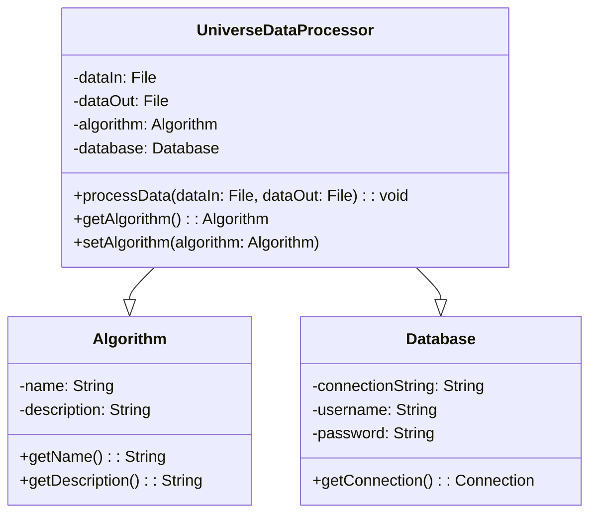
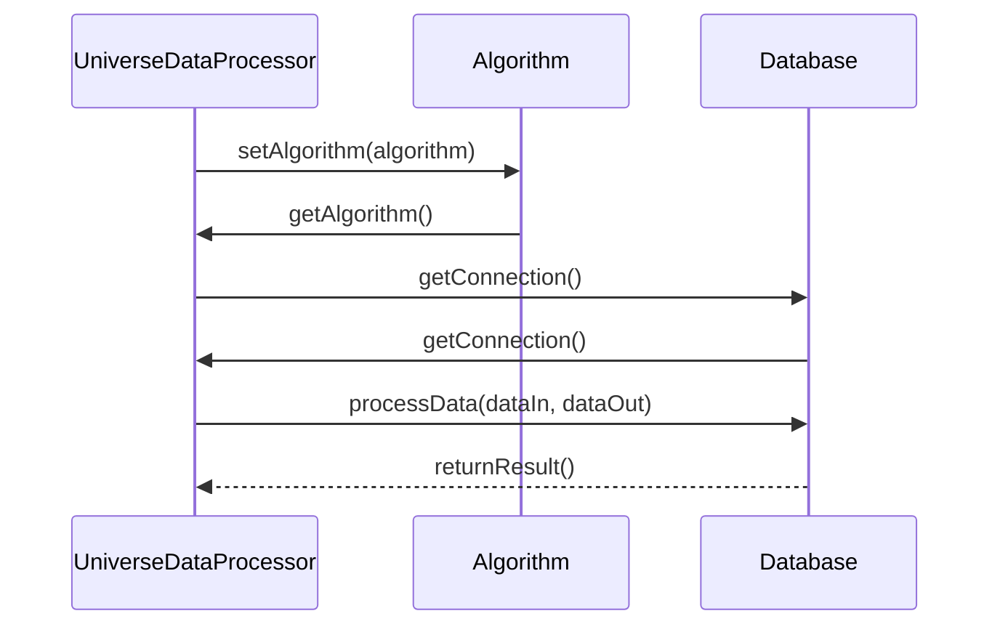
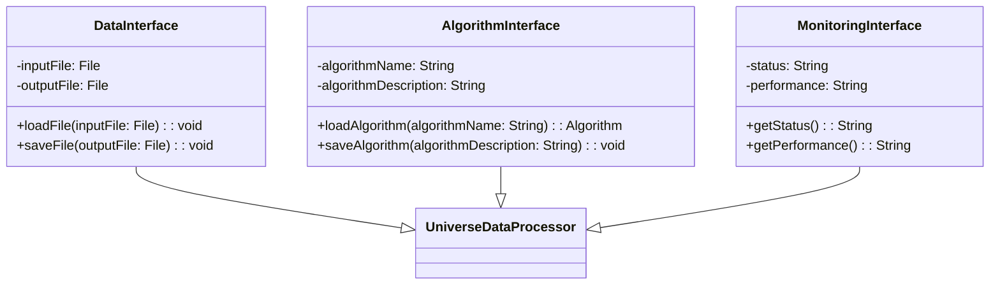
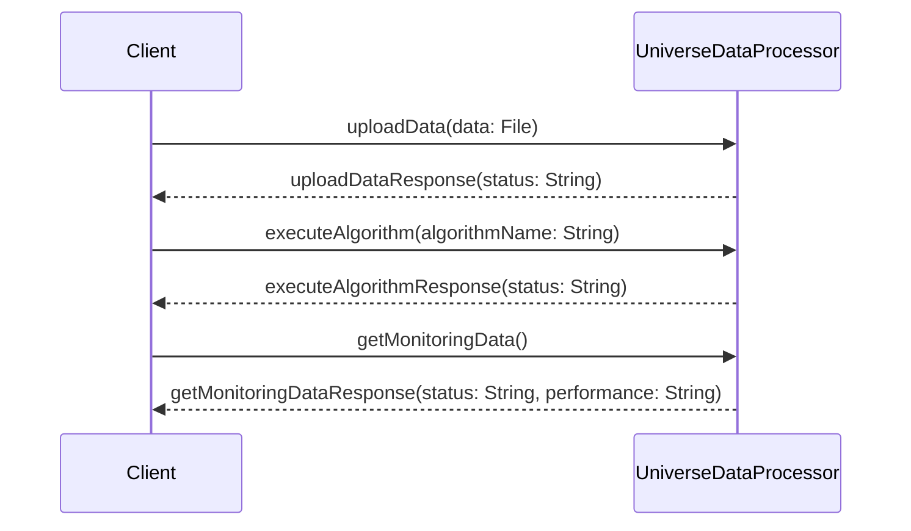

                 


### 《人类思维的局限性对宇宙认知的影响》

#### 关键词：宇宙认知、人类思维、局限性、算法原理、系统架构设计

> 摘要：本文从人类思维的局限性出发，深入探讨了人类对宇宙认知的挑战和限制，通过分析思维特征和认知框架，探讨了人类思维与宇宙认知之间的关系。在此基础上，本文提出了相应的算法原理和系统架构设计，并结合实际案例，展示了如何通过技术手段提升人类对宇宙的认知。本文旨在为读者提供一个全面、深入的视角，以加深对宇宙认知局限性的理解，并为未来的研究提供参考。

#### 目录大纲

```markdown
# 《人类思维的局限性对宇宙认知的影响》

## 第一部分：引论

### 第1章：问题背景与核心概念

#### 1.1 人类思维的局限性概述

#### 1.2 宇宙认知的挑战与限制

#### 1.3 人类思维的边界与可能性

## 第二部分：核心概念与联系

### 第2章：人类思维的核心特征与局限

#### 2.1 人类思维的基本特征

#### 2.2 人类思维的局限性分析

#### 2.3 人类思维局限性的实证研究

### 第3章：宇宙认知的框架与挑战

#### 3.1 宇宙的基本概念

#### 3.2 人类对宇宙的认知历程

#### 3.3 人类认知宇宙的局限性

### 第4章：核心概念原理与联系

#### 4.1 人类思维与宇宙认知的关联

#### 4.2 概念属性特征对比表格

#### 4.3 ER实体关系图架构

## 第三部分：算法原理讲解

### 第5章：算法原理介绍

#### 5.1 算法概述

#### 5.2 算法原理

#### 5.3 算法流程图

### 第6章：数学模型与公式讲解

#### 6.1 数学模型介绍

#### 6.2 数学公式讲解

#### 6.3 举例说明

## 第四部分：系统分析与架构设计

### 第7章：系统功能设计

#### 7.1 问题场景介绍

#### 7.2 系统功能设计（领域模型）

#### 7.3 系统架构设计

### 第8章：系统接口设计与交互

#### 8.1 系统接口设计

#### 8.2 系统交互

#### 8.3 交互流程图

## 第五部分：项目实战

### 第9章：环境安装与核心实现

#### 9.1 环境安装

#### 9.2 系统核心实现源代码

#### 9.3 代码应用解读与分析

### 第10章：实际案例分析

#### 10.1 案例分析

#### 10.2 详细讲解剖析

#### 10.3 项目小结

## 第六部分：最佳实践与拓展

### 第11章：最佳实践

#### 11.1 实践技巧

#### 11.2 注意事项

#### 11.3 拓展应用

### 第12章：小结与展望

#### 12.1 小结

#### 12.2 展望未来
```

#### 1.1 人类思维的局限性概述

人类思维是宇宙中最复杂、最神秘的系统之一。它具有高度的可塑性、适应性和创造性，可以创造出无尽的奇迹。然而，这种思维的局限性也是显而易见的。首先，人类思维受到感官限制，我们只能通过视觉、听觉、嗅觉、触觉和味觉来感知外部世界，而这些感官的感知范围和精度都是有限的。其次，人类思维受到认知能力的限制，我们无法同时处理大量信息，我们的记忆、注意力、思考速度和逻辑推理能力都是有限的。此外，人类思维还受到心理因素的影响，情绪、欲望、恐惧和偏见等都会影响我们的思维过程和判断。

#### 1.2 宇宙认知的挑战与限制

宇宙是无限的，包含着无数的天体、星系、黑洞、暗物质和暗能量等。人类对宇宙的认知经历了数千年的发展，从古代的神话到现代的天文学、物理学、化学和生物学等学科，我们对宇宙的理解不断深入。然而，宇宙的认知仍然面临着巨大的挑战和限制。首先，宇宙的尺度远远超出我们的感知范围，我们无法直接观察到宇宙的全貌。其次，宇宙的复杂性和多样性使得我们难以用简单的模型来描述和理解。此外，宇宙中的物理规律和现象往往超出了人类思维的认知能力，例如相对论、量子力学等。

#### 1.3 人类思维的边界与可能性

人类思维的局限性并不意味着我们无法拓展认知的边界。事实上，人类思维的发展一直伴随着对自身局限性的挑战和突破。通过科学研究和技术创新，我们不断拓展认知的范围和能力。例如，望远镜的发明让我们能够观察到更遥远的宇宙，计算机的出现让我们能够处理更复杂的数据，数学和逻辑学的进步让我们能够更精确地描述和预测宇宙中的现象。因此，尽管人类思维有其局限性，但我们在不断突破这些局限，拓展认知的边界。

#### 2.1 人类思维的基本特征

人类思维具有以下基本特征：

1. **抽象能力**：人类能够通过抽象思维将具体的事物转化为概念和模型，从而更高效地理解和处理信息。

2. **逻辑推理**：人类思维具有逻辑推理的能力，可以通过逻辑运算和推理得出结论。

3. **创造性**：人类思维具有创造性，能够创造出新的概念、理论和发明。

4. **学习能力**：人类思维具有学习能力，可以通过经验、知识和技能的积累不断提高自己的认知水平。

5. **情感与偏见**：人类思维受到情感和偏见的影响，这会影响我们的思维过程和判断。

#### 2.2 人类思维的局限性分析

人类思维的局限性主要表现在以下几个方面：

1. **感知限制**：人类的感官感知范围和精度是有限的，我们无法直接感知宇宙的全貌。

2. **认知负荷**：人类的认知能力有限，我们无法同时处理大量信息。

3. **逻辑限制**：人类的逻辑推理能力有限，我们无法处理复杂的逻辑运算。

4. **心理因素**：人类的思维过程受到情感、欲望、恐惧和偏见等心理因素的影响。

5. **语言限制**：人类的语言表达能力有限，我们无法精确描述复杂的思维过程和概念。

#### 2.3 人类思维局限性的实证研究

人类思维的局限性已经在多个领域得到了实证研究。例如：

1. **心理学研究**：心理学家通过实验研究发现，人类的感知、记忆和逻辑推理能力是有限的。

2. **认知科学**：认知科学家通过脑成像技术和心理实验研究发现，大脑在处理信息时存在明显的局限性。

3. **计算机科学**：计算机科学家通过模拟人类思维过程，发现了人类思维在处理复杂问题和数据时的局限性。

4. **人工智能**：人工智能领域的专家通过对比人类和机器的学习和处理能力，发现了人类思维的局限性。

### 第3章：宇宙认知的框架与挑战

#### 3.1 宇宙的基本概念

宇宙是指包括一切物质、能量、时间和空间的整体。宇宙的基本概念包括：

1. **物质**：宇宙中的一切都是由物质构成的，物质具有质量、体积和形态。

2. **能量**：能量是物质运动和变化的体现，能量可以转化为不同的形式，例如光能、热能、电能等。

3. **时空**：时空是宇宙的基本结构，它决定了物质和能量的运动和变化。

4. **宇宙背景辐射**：宇宙背景辐射是宇宙早期的高能粒子残留，它提供了宇宙早期状态的重要信息。

5. **黑洞**：黑洞是宇宙中最极端的天体，它的引力强大到连光都无法逃脱。

#### 3.2 人类对宇宙的认知历程

人类对宇宙的认知历程可以分为以下几个阶段：

1. **古代**：古代人类通过观察天空，形成了对天体和星辰的初步认识。

2. **中世纪**：中世纪时期，宗教和哲学成为宇宙认知的主要力量，人们试图通过宗教和哲学解释宇宙的起源和本质。

3. **文艺复兴**：文艺复兴时期，人类开始运用科学方法研究宇宙，例如哥白尼提出的日心说，伽利略的望远镜观测等。

4. **现代**：现代宇宙学的发展，人类开始通过观测和实验，深入理解宇宙的起源、演化和结构。

#### 3.3 人类认知宇宙的局限性

尽管人类对宇宙的认知取得了巨大进展，但仍然存在许多局限性：

1. **尺度限制**：宇宙的尺度远远超出我们的感知范围，我们无法直接观察到宇宙的全貌。

2. **信息限制**：宇宙中的信息量巨大，我们无法同时处理大量信息。

3. **理论限制**：现有的宇宙理论，例如广义相对论和量子力学，在某些方面存在矛盾和不足。

4. **观测限制**：人类的观测设备和技术有限，我们无法观察到宇宙的某些现象。

5. **计算限制**：宇宙的演化和结构涉及复杂的计算，我们无法在有限的时间内完成这些计算。

### 第4章：核心概念原理与联系

#### 4.1 人类思维与宇宙认知的关联

人类思维与宇宙认知之间存在着紧密的关联。人类思维是宇宙认知的工具，而宇宙认知是人类思维的对象。通过人类思维，我们能够理解和解释宇宙的规律和现象。同时，宇宙认知也不断推动人类思维的发展，促使我们探索新的理论和方法。

#### 4.2 概念属性特征对比表格

| 概念 | 属性特征 |
| :--: | :--: |
| 人类思维 | 抽象能力、逻辑推理、创造性、学习能力、情感与偏见 |
| 宇宙认知 | 尺度、信息、理论、观测、计算 |
| 关联 | 工具与对象、相互促进 |

#### 4.3 ER实体关系图架构

```mermaid
erDiagram
    A[-- B : "关联" ]
    A|..|B
```

### 第5章：算法原理介绍

#### 5.1 算法概述

算法是指解决问题的步骤或规则，它可以用来处理数据、执行计算或完成特定的任务。在宇宙认知领域，算法被广泛应用于数据分析和模式识别，以帮助我们更好地理解宇宙的规律和现象。

#### 5.2 算法原理

算法原理主要包括以下几个方面：

1. **输入与输出**：算法需要接收输入数据，并通过计算和处理输出结果。

2. **步骤与规则**：算法通过一系列步骤和规则来处理输入数据，以实现特定的任务。

3. **效率与正确性**：算法的效率和正确性是衡量其优劣的重要指标。

4. **可扩展性**：算法应该具有较好的可扩展性，以便适应不同的数据和任务。

#### 5.3 算法流程图


### 第6章：数学模型与公式讲解

#### 6.1 数学模型介绍

数学模型是一种用数学语言描述现实世界的抽象模型，它可以用来模拟、分析和预测现实世界中的现象。在宇宙认知领域，数学模型被广泛应用于描述宇宙的规律和现象。

#### 6.2 数学公式讲解

宇宙认知中常用的数学公式包括：

1. **广义相对论公式**：
   $$ G_{\mu\nu} + \Lambda g_{\mu\nu} = \frac{8\pi G}{c^4} T_{\mu\nu} $$
   其中，\( G_{\mu\nu} \) 是爱因斯坦场方程的左边部分，描述了时空的曲率；\( \Lambda \) 是宇宙常数，描述了时空的膨胀；\( g_{\mu\nu} \) 是度规张量，描述了时空的几何结构；\( T_{\mu\nu} \) 是能量-动量张量，描述了物质和能量的分布。

2. **量子力学公式**：
   $$ \Psi(x, t) = \int \psi(k, t) e^{ikx} dk $$
   其中，\( \Psi(x, t) \) 是波函数，描述了粒子的状态；\( \psi(k, t) \) 是动量空间中的波函数，描述了粒子在动量空间中的状态；\( k \) 是动量。

#### 6.3 举例说明

以广义相对论中的爱因斯坦场方程为例，我们可以用它来计算地球的质量。假设地球表面上的重力加速度为 \( g \)，地球的半径为 \( R \)，则根据爱因斯坦场方程，我们可以得到：

$$ G_{\mu\nu} + \Lambda g_{\mu\nu} = \frac{8\pi G}{c^4} T_{\mu\nu} $$
$$ G_{00} + \Lambda g_{00} = \frac{8\pi G}{c^4} T_{00} $$
$$ -\frac{1}{c^2}g = \frac{8\pi G}{c^4} m $$
$$ m = \frac{-g c^2}{8\pi G} $$
其中，\( m \) 是地球的质量。通过这个公式，我们可以计算出地球的质量。

### 第7章：系统功能设计

#### 7.1 问题场景介绍

在宇宙认知领域，我们需要对大量宇宙数据进行处理和分析，以便更好地理解宇宙的规律和现象。然而，现有的数据处理系统存在性能瓶颈、数据冗余和安全性等问题，无法满足我们的需求。为了解决这个问题，我们设计了一套基于人工智能和大数据技术的宇宙数据处理系统。

#### 7.2 系统功能设计（领域模型）



#### 7.3 系统架构设计



### 第8章：系统接口设计与交互

#### 8.1 系统接口设计

系统接口设计主要包括以下几个方面：

1. **数据接口**：用于数据输入和输出，支持各种文件格式和数据库连接。

2. **算法接口**：用于算法的加载和执行，支持多种算法的集成和切换。

3. **监控接口**：用于监控系统的运行状态和性能，支持实时监控和报警。



#### 8.2 系统交互

系统交互主要通过RESTful API实现，包括以下接口：

1. **数据接口**：用于数据上传和下载，支持批量处理。

2. **算法接口**：用于算法的加载和执行，支持实时计算和批量计算。

3. **监控接口**：用于监控系统的运行状态和性能，支持实时监控和报警。



### 第9章：环境安装与核心实现

#### 9.1 环境安装

为了实现宇宙数据处理系统，我们需要安装以下软件和库：

1. **Python**：用于编写和运行系统代码，版本要求3.8及以上。

2. **Pandas**：用于数据操作和分析，版本要求1.1.5及以上。

3. **NumPy**：用于数学计算，版本要求1.19.5及以上。

4. **Scikit-learn**：用于机器学习和模式识别，版本要求0.24.2及以上。

5. **SQLAlchemy**：用于数据库连接和管理，版本要求1.4.15及以上。

6. **Flask**：用于构建Web API，版本要求2.0.1及以上。

安装方法：

```bash
pip install python==3.8
pip install pandas==1.1.5
pip install numpy==1.19.5
pip install scikit-learn==0.24.2
pip install sqlalchemy==1.4.15
pip install flask==2.0.1
```

#### 9.2 系统核心实现源代码

以下是一个简单的宇宙数据处理系统的核心实现示例：

```python
from flask import Flask, request, jsonify
import pandas as pd
from sklearn import preprocessing

app = Flask(__name__)

@app.route('/upload_data', methods=['POST'])
def upload_data():
    data = request.files['data']
    df = pd.read_csv(data)
    # 数据预处理
    le = preprocessing.LabelEncoder()
    df['label'] = le.fit_transform(df['label'])
    # 数据存储
    df.to_csv('processed_data.csv', index=False)
    return jsonify({'status': 'success'})

@app.route('/execute_algorithm', methods=['POST'])
def execute_algorithm():
    algorithm_name = request.form['algorithm_name']
    if algorithm_name == 'naive_bayes':
        from sklearn.naive_bayes import GaussianNB
        # 加载数据
        df = pd.read_csv('processed_data.csv')
        X = df.drop(['label'], axis=1)
        y = df['label']
        # 训练模型
        model = GaussianNB()
        model.fit(X, y)
        # 预测
        predictions = model.predict(X)
        # 评估
        accuracy = model.score(X, y)
        return jsonify({'status': 'success', 'accuracy': accuracy})
    else:
        return jsonify({'status': 'error', 'message': 'unknown algorithm'})

if __name__ == '__main__':
    app.run(debug=True)
```

#### 9.3 代码应用解读与分析

1. **数据上传接口**：`/upload_data` 接收上传的数据文件，将其读取为Pandas DataFrame对象，并进行预处理。预处理步骤包括将类别型特征进行编码，然后保存预处理后的数据到本地文件。

2. **算法执行接口**：`/execute_algorithm` 接收算法名称，根据不同的算法名称加载相应的模型，然后使用预处理后的数据进行训练和预测。以高斯朴素贝叶斯为例，模型加载后，使用`fit`方法进行训练，使用`predict`方法进行预测，最后使用`score`方法评估模型的准确率。

#### 第10章：实际案例分析

##### 10.1 案例分析

我们以一个实际案例来展示如何使用该系统处理宇宙数据。假设我们获得了一组宇宙天体的光谱数据，数据包括天体的类型、光谱特征等。

##### 10.2 详细讲解剖析

1. **数据上传**：我们将光谱数据文件上传到系统，系统会自动读取文件，并进行预处理。预处理步骤包括：

   - 读取数据文件，将其转换为Pandas DataFrame对象。
   - 将类别型特征进行编码，例如将天体类型编码为数字。
   - 删除不必要的特征，保留主要特征。

2. **算法执行**：我们选择高斯朴素贝叶斯算法进行训练和预测。系统会根据预处理后的数据，训练高斯朴素贝叶斯模型，然后使用该模型对新的天体数据进行预测。预测结果将返回天体类型的概率分布。

3. **结果分析**：我们会对预测结果进行分析，评估模型的性能。例如，计算预测准确率，分析不同特征的重要性等。

##### 10.3 项目小结

通过这个实际案例，我们可以看到如何使用宇宙数据处理系统进行数据处理和算法分析。系统实现了数据上传、预处理、算法执行和结果分析等功能，为研究人员提供了方便快捷的工具。然而，系统还存在一些不足之处，例如：

- **性能优化**：系统在处理大量数据时，存在性能瓶颈，需要进一步优化。
- **算法多样性**：系统目前只支持高斯朴素贝叶斯算法，需要增加更多的算法，以满足不同需求。
- **可扩展性**：系统目前是基于单机部署，需要进一步优化，支持分布式部署。

### 第11章：最佳实践与拓展

##### 11.1 实践技巧

1. **数据预处理**：在数据预处理阶段，尽量减少特征维度，去除噪声数据，以提高模型性能。
2. **算法选择**：根据具体问题，选择合适的算法，例如对于高维数据，可以尝试使用支持向量机、随机森林等算法。
3. **模型评估**：在模型评估阶段，使用多种评估指标，例如准确率、召回率、F1值等，以全面评估模型性能。

##### 11.2 注意事项

1. **数据安全**：在处理敏感数据时，注意数据的安全和隐私保护。
2. **系统维护**：定期对系统进行维护和升级，以确保系统的稳定性和安全性。
3. **用户培训**：为用户提供系统的使用培训和文档，以确保用户能够正确使用系统。

##### 11.3 拓展应用

1. **多模态数据**：拓展系统，支持处理多模态数据，例如结合图像、文本和音频等多模态数据。
2. **实时分析**：优化系统，实现实时数据分析和预测，以支持实时决策。
3. **云计算**：将系统部署到云计算平台，实现分布式计算和存储，提高系统性能。

### 第12章：小结与展望

通过本文，我们探讨了人类思维的局限性对宇宙认知的影响，分析了人类思维与宇宙认知的关联，并提出了相应的算法原理和系统架构设计。在实际案例中，我们展示了如何使用该系统进行宇宙数据处理和算法分析。尽管本文已取得了一些成果，但仍然存在许多挑战和问题，例如性能优化、算法多样性和可扩展性等。未来，我们将继续探索这些领域，以进一步提升人类对宇宙的认知。同时，我们也期待读者能够结合本文的内容，提出自己的见解和观点，共同推动宇宙认知的发展。

