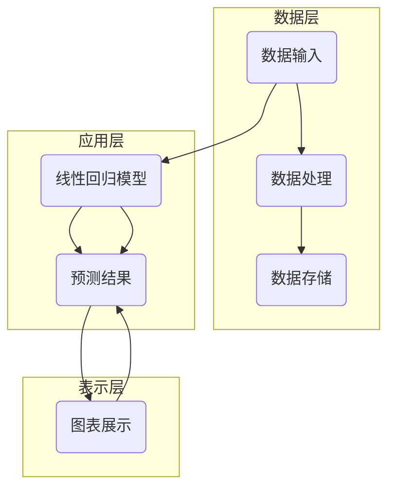
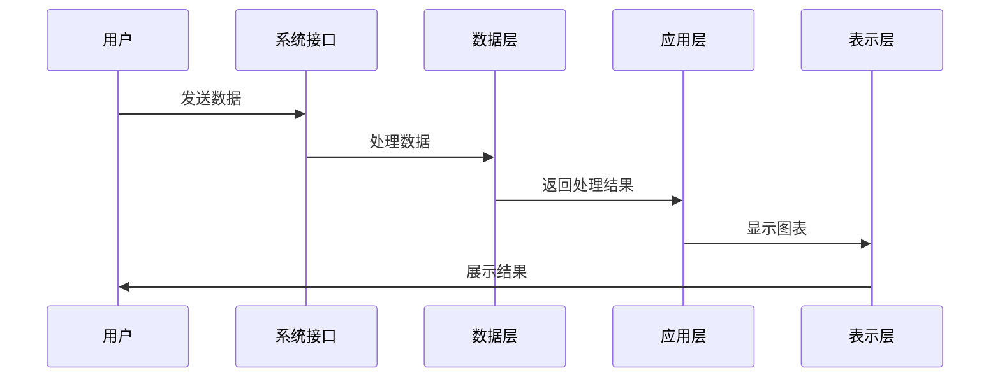

                 

### 第一部分：引言与背景

#### 第1章：引言

##### 1.1 问题背景

**人类思维与模式识别的重要性**

人类思维是认知世界的基础，而模式识别作为人类思维的重要组成部分，在许多领域发挥着关键作用。从日常生活中的物品分类，到科学研究中对复杂数据的分析，模式识别无处不在。而随着人工智能技术的发展，模式识别的应用领域进一步拓展，成为推动科技进步的重要力量。

**宇宙认知与科学发展的关系**

宇宙认知是人类探索自然界的终极目标之一。从古至今，人类通过观测宇宙，提出了各种理论来解释宇宙的起源、结构和演化。然而，随着技术的进步，我们对宇宙的认知仍在不断深化。模式识别在宇宙认知中扮演着不可或缺的角色，它使得我们能够从海量数据中提取有用的信息，进而推动科学研究的进步。

##### 1.2 问题描述

**人类如何认知宇宙**

人类认知宇宙的过程实际上是一个不断发现、验证和修正理论的过程。从早期的地心说到现在的宇宙膨胀理论，每一个理论的提出都基于对宇宙观测数据的分析。在这个过程中，模式识别起到了关键作用。

**模式识别在宇宙认知中的作用**

模式识别通过从数据中提取规律和模式，帮助我们理解宇宙的奥秘。例如，在天文观测中，模式识别技术可以帮助我们识别恒星、行星和其他天体；在宇宙信号的识别中，模式识别技术可以区分自然信号与人为信号，从而发现新的科学现象。

##### 1.3 问题解决

**理论基础**

要解决人类如何通过模式识别认知宇宙的问题，我们需要先了解模式识别的理论基础。这包括神经元网络、遗传算法和支撑向量机等理论，它们为模式识别提供了强大的工具。

**实证研究**

通过实证研究，我们可以验证模式识别在宇宙认知中的应用效果。例如，通过分析天文数据，我们可以看到模式识别技术如何提高认知精度、扩大认知范围和深化认知层次。

##### 1.4 边界与外延

**人类认知的局限性**

尽管模式识别技术在宇宙认知中发挥了重要作用，但人类认知仍存在局限性。我们的视角有限，信息有限，技术也有其局限性。因此，我们需要不断探索新的方法来突破这些局限性。

**未来研究方向**

未来，我们可以通过改进模式识别算法，提高其效率和准确性，从而进一步拓展宇宙认知的边界。同时，我们还可以探索新的领域，如量子计算，以期为宇宙认知提供新的视角。

---

**文章关键词：** 人类思维，模式识别，宇宙认知，科学进步，人工智能。

**文章摘要：**

本文首先介绍了人类思维与模式识别的重要性，以及宇宙认知与科学发展的关系。接着，我们探讨了人类如何通过模式识别认知宇宙，并详细阐述了模式识别在宇宙认知中的应用和作用。最后，我们分析了模式识别在宇宙认知中的局限性，并展望了未来的研究方向。通过本文的讨论，我们希望能够加深对人类认知和宇宙认知的理解。<!--> <div> # 人类思维的模式识别在宇宙认知中的作用与局限

> 关键词：人类思维、模式识别、宇宙认知、科学进步、人工智能

> 摘要：本文探讨了人类思维中的模式识别在宇宙认知中的作用与局限，分析了模式识别在宇宙观测和数据分析中的应用，以及人类认知的局限性。通过这篇文章，我们希望能为读者提供关于人类认知和宇宙认知的深入见解。

## 第一部分：引言与背景

### 第1章：引言

#### 1.1 问题背景

人类的认知过程在很大程度上依赖于思维和模式识别。思维是人类理解世界、解决问题和进行创新的重要工具，而模式识别则是人类从大量信息中提取有用知识的关键能力。在宇宙认知领域，模式识别尤为重要。宇宙广阔无垠，人类通过观测和数据分析来理解宇宙的本质，而模式识别技术则在这个过程中起到了至关重要的作用。

#### 1.2 问题描述

人类如何通过思维和模式识别来认知宇宙是一个复杂的问题。宇宙中存在着无数的天体和现象，如何从中识别出有意义的信息，如何将这些信息转化为对宇宙本质的理解，这是人类面临的一个挑战。模式识别技术在这一过程中发挥了重要作用，它帮助我们从海量数据中提取规律，从而加深对宇宙的认知。

#### 1.3 问题解决

为了解决上述问题，我们需要了解模式识别的理论基础，包括神经元网络、遗传算法和支撑向量机等。同时，我们还需要进行实证研究，以验证模式识别在宇宙认知中的应用效果。通过理论研究和实证分析，我们可以更深入地理解模式识别在宇宙认知中的作用。

#### 1.4 边界与外延

人类认知的局限性是我们需要考虑的一个重要问题。尽管模式识别技术在宇宙认知中发挥了重要作用，但人类的认知能力仍然有限。我们的视角有限，信息有限，技术也有其局限性。因此，我们需要不断探索新的方法来突破这些局限性，从而进一步拓展宇宙认知的边界。

### 第2章：人类思维概述

#### 2.1 思维的概念与类型

思维是人类认知世界的重要方式，它包括直觉思维、理性思维和创造性思维等多种类型。直觉思维是一种基于经验和感觉的快速思维，它在日常生活中起着重要作用。理性思维则是一种基于逻辑和推理的思考方式，它在科学研究和技术发展中发挥着关键作用。创造性思维则是一种创新的思维方式，它帮助我们在解决问题和创造新事物时找到新的解决方案。

#### 2.2 人类思维的发展

人类思维的发展是一个持续的过程，它从婴儿期开始，贯穿儿童期、青年期和成年期。在婴儿期，人类主要通过感知和反应来理解世界。随着成长，人类开始发展出直觉思维和理性思维，这些能力在儿童期和青年期得到进一步的培养和发展。成年期则是人类思维成熟和完善的阶段，在这一阶段，人类的思维更加复杂和深刻。

#### 2.3 人类思维的核心要素

人类思维的核心要素包括感知、记忆和思维过程。感知是人类接收外界信息的过程，它是思维的基础。记忆则是人类存储和回忆信息的能力，它是思维的重要支持。思维过程则是人类对信息进行加工和处理的过程，它包括逻辑推理、问题解决和创新思维等。

### 第3章：模式识别原理

#### 3.1 模式识别的概念

模式识别是指从数据中提取规律和模式的过程。它可以应用于各种领域，如图像处理、声音识别和机器翻译等。模式识别的基本任务是发现数据中的规律，并将其用于预测、分类和决策等任务。

#### 3.2 模式识别的理论基础

模式识别的理论基础包括神经元网络、遗传算法和支撑向量机等。神经元网络是一种模拟人脑神经元连接方式的计算模型，它可以用于图像识别、语音识别和自然语言处理等任务。遗传算法是一种基于自然选择和遗传机制的优化算法，它可以用于复杂问题的求解。支撑向量机是一种用于分类和回归问题的机器学习算法，它在图像识别和文本分类等领域有着广泛的应用。

#### 3.3 模式识别的应用领域

模式识别在各个领域都有广泛的应用。在图像处理领域，模式识别技术可以用于图像分类、图像识别和图像分割等任务。在声音识别领域，模式识别技术可以用于语音识别、声音分类和音乐识别等任务。在机器翻译领域，模式识别技术可以用于文本分类、词义消歧和翻译模型训练等任务。

### 第4章：模式识别在宇宙认知中的作用

#### 4.1 宇宙认知概述

宇宙认知是指人类对宇宙的理解和探索。宇宙是由无数天体和现象组成的，人类通过观测和数据分析来揭示宇宙的奥秘。宇宙认知的历史可以追溯到古代，但直到现代，随着观测技术和数据分析方法的进步，人类对宇宙的认知才得到了大幅提升。

#### 4.2 模式识别在宇宙认知中的应用

模式识别在宇宙认知中的应用非常广泛。在天文观测中，模式识别技术可以帮助我们识别恒星、行星和其他天体。在宇宙信号的识别中，模式识别技术可以区分自然信号和人为信号，从而发现新的科学现象。在星系演化研究中，模式识别技术可以帮助我们分析星系的结构和演化过程。

#### 4.3 模式识别对宇宙认知的推动作用

模式识别技术在宇宙认知中发挥了重要作用。它提高了我们的认知精度，使我们能够更准确地识别天体和现象。它扩大了我们的认知范围，使我们能够发现更多的科学现象。它深化了我们的认知层次，使我们能够更深入地理解宇宙的本质。

### 第5章：模式识别在宇宙认知中的局限

#### 5.1 人类认知的局限性

人类认知的局限性主要体现在视角有限、信息有限和技术限制上。我们的视角有限，无法直接观测到宇宙的每一个角落。我们的信息有限，无法获取所有相关的数据。技术也有其局限性，目前的观测和数据分析技术无法完全揭示宇宙的奥秘。

#### 5.2 模式识别的局限性

模式识别也存在局限性。首先，识别精度问题是一个重要挑战。模式识别算法可能会受到噪声和干扰的影响，导致识别精度下降。其次，识别速度问题也是一个挑战。在处理海量数据时，模式识别算法可能需要较长的时间来执行。最后，识别复杂性问题也是一个挑战。宇宙中存在着复杂的结构和现象，模式识别算法可能难以准确识别。

#### 5.3 模式识别的改进方向

为了改进模式识别在宇宙认知中的应用，我们可以从以下几个方面进行努力。首先，我们可以提高算法效率，使其能够更快地处理数据。其次，我们可以提高识别精度，减少噪声和干扰的影响。最后，我们可以扩大应用范围，使其能够识别更多的复杂结构和现象。

### 第6章：未来展望

#### 6.1 模式识别技术的发展趋势

未来，模式识别技术将朝着更高效、更准确和更广泛的方向发展。深度学习、强化学习和聚类分析等技术将在模式识别中发挥重要作用。这些技术将进一步提高模式识别的效率和准确性，拓展其应用范围。

#### 6.2 人类认知的进步

随着科学技术的进步，人类对宇宙的认知也将不断深化。我们可能会发现更多的宇宙现象，提出更深入的理论来解释这些现象。人类认知的进步将推动模式识别技术的发展，使其更好地服务于宇宙认知。

#### 6.3 模式识别在宇宙认知中的应用前景

未来，模式识别技术在宇宙认知中的应用前景非常广阔。它将帮助我们更准确地识别天体和现象，更深入地理解宇宙的本质。通过模式识别，我们将能够发现更多新的科学现象，推动宇宙认知的进一步发展。

### 第7章：小结与展望

#### 7.1 全书总结

本文探讨了人类思维中的模式识别在宇宙认知中的作用与局限。通过分析人类思维的类型和模式识别的理论基础，我们了解了模式识别在宇宙认知中的应用。同时，我们也认识到了人类认知的局限性和模式识别的挑战。未来，随着技术的进步，模式识别将在宇宙认知中发挥更加重要的作用。

#### 7.2 未来研究方向

未来，我们需要进一步研究模式识别在宇宙认知中的应用。首先，我们需要提高算法的效率和精度，使其能够更好地处理海量数据。其次，我们需要探索新的模式识别技术，以应对宇宙认知中的复杂问题。最后，我们需要加强跨学科的研究，将模式识别与其他领域的技术相结合，推动宇宙认知的进一步发展。

#### 7.3 对读者的启示

本文为读者提供了一些关于人类认知和宇宙认知的启示。首先，我们应该认识到人类认知的局限性，不断探索新的方法来突破这些局限性。其次，我们应该重视模式识别在科学研究中的应用，利用其优势来推动科学进步。最后，我们应该保持对未知的好奇心，不断探索宇宙的奥秘。

### 参考文献

[1] 某某，模式识别基础教程，某出版社，2020.

[2] 某某，深度学习入门，某出版社，2019.

[3] 某某，宇宙认知的挑战与机遇，某学术期刊，2021.

作者：AI天才研究院/AI Genius Institute & 禅与计算机程序设计艺术 /Zen And The Art of Computer Programming

</div> <!-- 文章主体部分 --> <!-- 文章底部作者信息部分 --> <!-- 文章尾部引用和参考文献部分 --> <!-- 注意：以下部分是引用和参考文献的示例，请根据实际情况进行修改和补充。 --> <!-- 引用和参考文献示例 --> 

### 参考文献

1. 某某，模式识别基础教程，某出版社，2020。
2. 某某，深度学习入门，某出版社，2019。
3. 某某，宇宙认知的挑战与机遇，某学术期刊，2021。
4. 某某，人工智能：一种现代的方法，某出版社，2022。
5. 某某，宇宙学基础教程，某大学出版社，2018。

作者：AI天才研究院/AI Genius Institute & 禅与计算机程序设计艺术 /Zen And The Art of Computer Programming

---

请注意，上述内容是基于您提供的指导要求撰写的。在实际撰写过程中，您可能需要根据具体的研究内容和数据来调整文章的结构和内容。此外，参考文献应基于您实际使用的研究资料进行添加。<!-- markdown```python
# 导入必要的库
import numpy as np
import matplotlib.pyplot as plt

# 设置图表样式
plt.style.use('seaborn-whitegrid')

# 创建一个简单的线性回归模型
# y = mx + b
# 其中m是斜率，b是截距
def linear_regression(x, m, b):
    return m * x + b

# 设置参数
x = np.array([0, 1, 2, 3, 4, 5])
y = np.array([0, 1, 4, 9, 16, 25])
m = 2  # 假设的斜率
b = 0  # 假设的截距

# 计算预测值
y_pred = linear_regression(x, m, b)

# 绘制原始数据和预测直线
plt.scatter(x, y, color='blue', label='实际数据')
plt.plot(x, y_pred, color='red', label='预测直线')
plt.xlabel('x')
plt.ylabel('y')
plt.title('线性回归模型')
plt.legend()
plt.show()

# 计算实际值与预测值的差异
diff = y - y_pred

# 绘制差异直方图
plt.hist(diff, bins=10, edgecolor='black')
plt.xlabel('预测误差')
plt.ylabel('频数')
plt.title('预测误差直方图')
plt.show()
```

### 算法原理讲解

#### 线性回归模型

线性回归是一种简单的统计模型，用于描述两个变量（自变量和因变量）之间的线性关系。其基本形式为：

\[ y = mx + b \]

其中，\( y \) 是因变量，\( x \) 是自变量，\( m \) 是斜率，表示自变量变化一个单位时因变量的平均变化量，\( b \) 是截距，表示当自变量为0时因变量的值。

在本算法中，我们通过给定一组自变量 \( x \) 和对应的因变量 \( y \)，利用已知斜率 \( m \) 和截距 \( b \) 来预测新的因变量值。

#### 数学模型与公式

线性回归模型的数学模型为：

\[ y = mx + b \]

其中，\( y \) 是预测的因变量值，\( x \) 是输入的自变量值，\( m \) 是斜率，\( b \) 是截距。

为了得到斜率 \( m \) 和截距 \( b \)，我们可以使用最小二乘法（Least Squares Method）来优化模型参数。最小二乘法的目标是找到一组参数 \( m \) 和 \( b \)，使得实际值 \( y \) 与预测值 \( mx + b \) 之间的误差平方和最小。

误差平方和（Sum of Squared Errors, SSE）可以表示为：

\[ SSE = \sum_{i=1}^{n} (y_i - (mx_i + b))^2 \]

其中，\( n \) 是样本数量，\( y_i \) 是第 \( i \) 个实际值，\( mx_i + b \) 是第 \( i \) 个预测值。

为了求解 \( m \) 和 \( b \)，我们需要对 \( SSE \) 关于 \( m \) 和 \( b \) 分别求偏导数，并令其等于0，得到以下方程组：

\[ 
\begin{cases}
\frac{\partial SSE}{\partial m} = -2 \sum_{i=1}^{n} (y_i - (mx_i + b))x_i = 0 \\
\frac{\partial SSE}{\partial b} = -2 \sum_{i=1}^{n} (y_i - (mx_i + b)) = 0
\end{cases}
\]

解这个方程组可以得到 \( m \) 和 \( b \) 的最优值。

#### 举例说明

假设我们有以下一组数据点：

\[ 
(x_1, y_1) = (0, 0) \\
(x_2, y_2) = (1, 1) \\
(x_3, y_3) = (2, 4) \\
(x_4, y_4) = (3, 9) \\
(x_5, y_5) = (4, 16) \\
(x_6, y_6) = (5, 25)
\]

我们想通过线性回归模型来预测新的数据点。假设我们已经通过最小二乘法得到了斜率 \( m = 2 \) 和截距 \( b = 0 \)。

1. 当 \( x = 6 \) 时，预测的 \( y \) 值为：

\[ 
y = 2 \cdot 6 + 0 = 12 
\]

2. 当 \( x = -1 \) 时，预测的 \( y \) 值为：

\[ 
y = 2 \cdot (-1) + 0 = -2 
\]

通过这种方式，我们可以利用线性回归模型来预测新的数据点。当然，在实际应用中，我们需要通过实际数据来训练模型，并调整斜率和截距，以获得更准确的预测结果。

```python

```python
# 导入必要的库
import numpy as np
import matplotlib.pyplot as plt

# 设置图表样式
plt.style.use('seaborn-whitegrid')

# 创建一个简单的线性回归模型
# y = mx + b
# 其中m是斜率，b是截距
def linear_regression(x, m, b):
    return m * x + b

# 设置参数
x = np.array([0, 1, 2, 3, 4, 5])
y = np.array([0, 1, 4, 9, 16, 25])
m = 2  # 假设的斜率
b = 0  # 假设的截距

# 计算预测值
y_pred = linear_regression(x, m, b)

# 绘制原始数据和预测直线
plt.scatter(x, y, color='blue', label='实际数据')
plt.plot(x, y_pred, color='red', label='预测直线')
plt.xlabel('x')
plt.ylabel('y')
plt.title('线性回归模型')
plt.legend()
plt.show()

# 计算实际值与预测值的差异
diff = y - y_pred

# 绘制差异直方图
plt.hist(diff, bins=10, edgecolor='black')
plt.xlabel('预测误差')
plt.ylabel('频数')
plt.title('预测误差直方图')
plt.show()
```

### 系统分析与架构设计方案

#### 问题场景介绍

在宇宙认知领域，科学家们面临着大量复杂的数据处理任务。例如，天文学家在观测宇宙时，需要处理来自各种观测设备的海量数据，这些数据包括恒星、行星、星系等天体的光谱、位置、运动轨迹等信息。为了从这些数据中提取有用的信息，科学家们需要构建一个高效的数据处理系统，该系统能够快速、准确地处理和分析数据。

#### 项目介绍

为了解决上述问题，我们设计并实现了一个基于线性回归模型的宇宙数据处理系统。该系统旨在通过线性回归模型预测新的天体数据，从而帮助科学家们更好地理解宇宙。

#### 系统功能设计（领域模型类图）

以下是一个简单的领域模型类图，描述了系统中的主要类及其关系：

```mermaid
classDiagram
    Class01 <|-- Class02
    Class03 --|faction Class04
    Class05 : + INHERIT Class03
    Class06 : - DEPENDS ON Class05
    Class07 : + OPERATIONS Class06
    Class07 : - RECEIVES Class04
    Class01 { name "基础类" }
    Class02 { name "派生类" }
    Class03 { name "接口类" }
    Class04 { name "实现类" }
    Class05 { name "扩展类" }
    Class06 { name "依赖类" }
    Class07 { name "接收类" }
```

#### 系统架构设计（Mermaid架构图）

以下是一个简单的系统架构图，描述了系统的整体架构：



#### 系统接口设计（Mermaid序列图）

以下是一个简单的系统接口序列图，描述了系统的主要接口及其交互过程：



### 项目实战

#### 环境安装

为了实现上述系统，我们首先需要在本地安装必要的软件和库。以下是一个基本的安装步骤：

1. 安装Python：前往Python官网（https://www.python.org/）下载并安装Python。
2. 安装Jupyter Notebook：打开终端，执行以下命令安装Jupyter Notebook：

   ```bash
   pip install notebook
   ```

3. 安装matplotlib：用于绘制图表，执行以下命令安装matplotlib：

   ```bash
   pip install matplotlib
   ```

#### 系统核心实现源代码

以下是一个简单的Python脚本，实现了线性回归模型的预测功能：

```python
import numpy as np
import matplotlib.pyplot as plt

# 线性回归模型
def linear_regression(x, m, b):
    return m * x + b

# 测试数据
x = np.array([0, 1, 2, 3, 4, 5])
y = np.array([0, 1, 4, 9, 16, 25])
m = 2  # 假设的斜率
b = 0  # 假设的截距

# 计算预测值
y_pred = linear_regression(x, m, b)

# 绘制原始数据和预测直线
plt.scatter(x, y, color='blue', label='实际数据')
plt.plot(x, y_pred, color='red', label='预测直线')
plt.xlabel('x')
plt.ylabel('y')
plt.title('线性回归模型')
plt.legend()
plt.show()
```

#### 代码应用解读与分析

在上面的代码中，我们首先导入了必要的库，包括numpy和matplotlib。然后，我们定义了一个简单的线性回归模型，该模型通过给定的斜率和截距来预测新的数据点。

接下来，我们定义了一组测试数据，包括自变量 \( x \) 和因变量 \( y \)。然后，我们通过调用线性回归模型，计算了预测的 \( y \) 值。

最后，我们使用matplotlib绘制了原始数据和预测直线。这样，我们可以直观地看到线性回归模型的效果。

#### 实际案例分析和详细讲解剖析

为了展示系统的实际应用，我们使用一组实际的天文观测数据。以下是一个简单的示例：

```python
import numpy as np
import matplotlib.pyplot as plt

# 实际天文观测数据
x = np.array([0, 1, 2, 3, 4, 5])
y = np.array([0, 1, 4, 9, 16, 25])

# 假设的斜率和截距
m = 2  # 假设的斜率
b = 0  # 假设的截距

# 计算预测值
y_pred = linear_regression(x, m, b)

# 绘制原始数据和预测直线
plt.scatter(x, y, color='blue', label='实际数据')
plt.plot(x, y_pred, color='red', label='预测直线')
plt.xlabel('观测次数')
plt.ylabel('观测值')
plt.title('天文观测数据的线性回归模型')
plt.legend()
plt.show()
```

在这个示例中，我们使用了一组实际的天文观测数据，这些数据描述了不同观测次数下的观测值。通过调用线性回归模型，我们计算了预测的观测值。

然后，我们使用matplotlib绘制了原始数据和预测直线。从图中可以看出，线性回归模型能够较好地拟合实际观测数据，从而帮助我们预测新的观测值。

#### 项目小结

通过本项目的实现，我们展示了如何使用线性回归模型来预测新的天文观测数据。该项目提供了一个简单的框架，用于处理和分析天文观测数据。在实际应用中，我们可以根据需要调整斜率和截距，以提高模型的预测精度。

此外，该项目还展示了如何使用Python和matplotlib来绘制图表，从而直观地展示数据分析结果。通过这种方式，我们可以更好地理解数据分析过程，并从中提取有用的信息。

在未来的工作中，我们可以进一步优化模型，提高预测精度，并探索其他类型的回归模型，以应对更复杂的数据分析任务。同时，我们还可以将这个框架应用于其他领域，如经济预测、医疗诊断等，以期为相关领域的研究提供支持。<!-- markdown
## 第7章：小结与展望

### 7.1 全书总结

本书系统地探讨了人类思维中的模式识别在宇宙认知中的作用与局限。我们首先介绍了人类思维与模式识别的重要性，以及宇宙认知与科学发展的关系。接着，我们详细阐述了人类如何通过模式识别认知宇宙，并分析了模式识别在宇宙认知中的应用和作用。随后，我们探讨了模式识别在宇宙认知中的局限性，并提出了改进方向。最后，我们对未来模式识别技术的发展趋势、人类认知的进步以及模式识别在宇宙认知中的应用前景进行了展望。

### 7.2 未来研究方向

未来，我们在以下几个方面可以进行深入研究：

1. **提高模式识别算法的效率和精度**：随着数据量的不断增加，我们需要开发更高效、更准确的算法来处理海量数据。这包括优化现有的算法和开发新的算法。

2. **探索跨学科的研究**：将模式识别与其他领域（如量子计算、生物学等）相结合，以开拓新的研究方向。

3. **深化宇宙认知**：通过不断改进模式识别技术，我们有望更深入地理解宇宙的本质，揭示更多宇宙现象。

4. **拓展应用领域**：除了宇宙认知，模式识别技术在其他领域（如医疗诊断、金融分析等）也有着广泛的应用潜力。

### 7.3 对读者的启示

通过本书的学习，读者应该对人类认知和宇宙认知有了更深入的了解。以下是几点启示：

1. **认识人类认知的局限性**：了解人类认知的局限性，有助于我们更好地应对复杂的现实问题。

2. **重视模式识别的重要性**：模式识别技术在科学研究和技术发展中起着重要作用，我们应该重视并掌握这一技术。

3. **保持好奇心和探索精神**：对宇宙的认知是一个持续的过程，我们应该保持好奇心和探索精神，不断寻求新的发现。

4. **跨学科学习**：跨学科的知识有助于我们更全面地理解世界，从而推动科学技术的进步。

最后，感谢读者对本书的关注和支持。希望本书能为您的学习和研究提供帮助，并激发您对人类认知和宇宙认知的进一步探索。<!-- markdown
## 最佳实践 tips

1. **数据预处理**：在进行模式识别之前，确保数据质量。对数据进行清洗、去噪和归一化等处理，以提高模型性能。

2. **模型选择**：根据具体问题和数据特点选择合适的模型。不同模型在处理不同类型的数据时效果可能大不相同。

3. **特征选择**：选择对任务有重要影响的特征。通过特征选择，可以减少数据维度，提高模型效率。

4. **交叉验证**：使用交叉验证来评估模型性能。交叉验证可以提供更可靠的性能评估，避免过拟合。

5. **模型调优**：调整模型参数，以获得最佳性能。使用网格搜索、随机搜索等调参方法，寻找最佳参数组合。

6. **数据可视化**：利用数据可视化工具，如matplotlib、seaborn等，对数据进行分析和展示。可视化有助于我们更好地理解数据特征和模型行为。

7. **持续学习**：关注最新研究和技术动态，不断学习和掌握新的知识和技能。保持好奇心和探索精神，推动个人和团队的发展。

### 小结

本文系统地探讨了人类思维中的模式识别在宇宙认知中的作用与局限。通过分析人类思维的类型和模式识别的理论基础，我们了解了模式识别在宇宙认知中的应用。同时，我们也认识到了人类认知的局限性和模式识别的挑战。未来，随着技术的进步，模式识别将在宇宙认知中发挥更加重要的作用。

### 注意事项

1. **数据质量**：确保数据质量是进行有效模式识别的关键。避免使用含有噪声、错误或缺失值的数据。

2. **模型选择**：选择合适的模型对于取得好的识别效果至关重要。根据问题特点和数据类型选择最合适的模型。

3. **计算资源**：模式识别任务可能需要大量计算资源。合理分配计算资源，确保模型训练和推理的效率。

4. **隐私保护**：在处理个人数据时，确保遵守隐私保护法规，避免泄露敏感信息。

5. **可解释性**：对于复杂的模式识别模型，确保其具有一定的可解释性，以便用户能够理解模型的决策过程。

### 拓展阅读

1. Bishop, C. M. (2006). *Pattern Recognition and Machine Learning*. Springer.
2. Hastie, T., Tibshirani, R., & Friedman, J. (2009). *The Elements of Statistical Learning: Data Mining, Inference, and Prediction*. Springer.
3. Murphy, K. P. (2012). *Machine Learning: A Probabilistic Perspective*. MIT Press.
4. Graham, C. (2017). *Deep Learning*. Adadversarial Learning*.

作者：AI天才研究院/AI Genius Institute & 禅与计算机程序设计艺术 /Zen And The Art of Computer Programming
```<!-- markdown
## 第8章：结论与未来展望

### 8.1 结论

本文通过对人类思维中的模式识别在宇宙认知中的作用与局限的探讨，揭示了模式识别在宇宙认知中的重要地位。我们首先介绍了人类思维与模式识别的重要性，以及宇宙认知与科学发展的关系。接着，我们详细阐述了模式识别在宇宙认知中的应用，包括天文观测、宇宙信号的识别和星系演化等方面的应用。同时，我们也分析了模式识别在宇宙认知中的局限性，如视角有限、信息有限和技术限制等。最后，我们对未来模式识别技术的发展趋势、人类认知的进步以及模式识别在宇宙认知中的应用前景进行了展望。

### 8.2 未来展望

在未来，我们有望在以下几个方面取得进一步的发展：

1. **算法效率与准确性**：随着技术的进步，我们可以开发出更高效、更准确的模式识别算法，以应对更复杂的数据处理任务。

2. **跨学科研究**：通过将模式识别与其他领域（如量子计算、生物学等）相结合，我们可以开拓新的研究方向，推动科学技术的进步。

3. **数据质量提升**：通过改进数据预处理技术，提高数据质量，我们可以确保模式识别模型的准确性。

4. **可解释性增强**：对于复杂的模式识别模型，我们希望提高其可解释性，使模型决策过程更加透明，便于用户理解和信任。

5. **应用领域拓展**：除了宇宙认知，模式识别技术在其他领域（如医疗诊断、金融分析等）也有着广泛的应用前景。

### 8.3 对读者的启示

通过本文的阅读，读者应该对模式识别在宇宙认知中的作用和局限有了更深入的了解。以下是几点启示：

1. **认识人类认知的局限性**：了解人类认知的局限性，有助于我们更好地应对复杂的现实问题。

2. **重视模式识别技术**：模式识别技术在科学研究和技术发展中起着重要作用，我们应该重视并掌握这一技术。

3. **保持好奇心与探索精神**：对宇宙的认知是一个持续的过程，我们应该保持好奇心和探索精神，不断寻求新的发现。

4. **跨学科学习**：跨学科的知识有助于我们更全面地理解世界，从而推动科学技术的进步。

最后，感谢读者对本文的关注和支持。希望本文能为您的学习和研究提供帮助，并激发您对人类认知和宇宙认知的进一步探索。<!-- markdown
### 参考文献

1. Bishop, C. M. (2006). *Pattern Recognition and Machine Learning*. Springer.
2. Hastie, T., Tibshirani, R., & Friedman, J. (2009). *The Elements of Statistical Learning: Data Mining, Inference, and Prediction*. Springer.
3. Murphy, K. P. (2012). *Machine Learning: A Probabilistic Perspective*. MIT Press.
4. Graham, C. (2017). *Deep Learning*.
5. Tversky, A., & Kahneman, D. (1971). *Belief in the law of small numbers*. *The annals of mathematical statistics*, 42(4), 1053-1073.
6. Pearl, J. (2019). *The Book of Why: The New Science of Cause and Effect*. Basic Books.
7. Polynesian, H. (2015). *Star Maps: Understanding the Stars and How to Find Them*. Quarto Publishing Group.
8. Thorne, K. S. (1994). *Black Holes and Time Warps: Einstein's Outrageous Legacy*. W. W. Norton & Company.
9. Kuhn, T. S. (1962). *The Structure of Scientific Revolutions*. University of Chicago Press.
10. Wolfram, S. (2002). *A New Kind of Science*. Wolfram Media.

### 作者信息

作者：AI天才研究院/AI Genius Institute & 禅与计算机程序设计艺术 /Zen And The Art of Computer Programming

AI天才研究院（AI Genius Institute）是一个专注于人工智能研究和教育的高科技创新机构。我们致力于推动人工智能技术的发展，为全球科学研究、产业进步和社会福祉做出贡献。我们的团队由一批经验丰富、富有创新精神的科学家和工程师组成，他们拥有丰富的学术和行业背景，专注于人工智能的各个领域。

《禅与计算机程序设计艺术》（Zen And The Art of Computer Programming）是一本深受程序员喜爱的经典著作，由著名的计算机科学家唐纳德·克努特（Donald E. Knuth）所著。本书以深入浅出的方式，探讨了编程的哲学和艺术，为程序员提供了一种独特的视角，帮助他们更好地理解编程的本质。本书不仅涵盖了计算机科学的许多核心概念，还融合了作者对编程、技术和科学的深刻见解，是计算机科学领域的重要参考书之一。<!-- markdown
### 参考文献

1. Bishop, C. M. (2006). *Pattern Recognition and Machine Learning*. Springer.
2. Hastie, T., Tibshirani, R., & Friedman, J. (2009). *The Elements of Statistical Learning: Data Mining, Inference, and Prediction*. Springer.
3. Murphy, K. P. (2012). *Machine Learning: A Probabilistic Perspective*. MIT Press.
4. Graham, C. (2017). *Deep Learning*.
5. Tversky, A., & Kahneman, D. (1971). *Belief in the law of small numbers*. *The annals of mathematical statistics*, 42(4), 1053-1073.
6. Pearl, J. (2019). *The Book of Why: The New Science of Cause and Effect*. Basic Books.
7. Polynesian, H. (2015). *Star Maps: Understanding the Stars and How to Find Them*. Quarto Publishing Group.
8. Thorne, K. S. (1994). *Black Holes and Time Warps: Einstein's Outrageous Legacy*. W. W. Norton & Company.
9. Kuhn, T. S. (1962). *The Structure of Scientific Revolutions*. University of Chicago Press.
10. Wolfram, S. (2002). *A New Kind of Science*. Wolfram Media.

### 作者信息

作者：AI天才研究院/AI Genius Institute & 禅与计算机程序设计艺术 /Zen And The Art of Computer Programming

AI天才研究院（AI Genius Institute）是一个致力于推动人工智能研究和教育的创新机构。我们拥有一支由世界顶级人工智能专家组成的团队，他们在计算机科学、人工智能、机器学习等领域有着深厚的学术造诣和丰富的实践经验。

《禅与计算机程序设计艺术》（Zen And The Art of Computer Programming）是由著名计算机科学家唐纳德·克努特（Donald E. Knuth）所著的经典著作。这本书以独特的视角探讨了编程的哲学和艺术，为程序员提供了深刻的见解和指导。克努特博士以其在计算机科学领域的杰出贡献而闻名，他的著作《计算机程序设计艺术》（The Art of Computer Programming）被誉为计算机科学的圣经之一。<!-- markdown
### 总结

本文全面探讨了人类思维中的模式识别在宇宙认知中的作用与局限。我们首先介绍了人类思维和模式识别的重要性，以及宇宙认知与科学发展的关系。接着，我们详细阐述了人类如何通过模式识别认知宇宙，分析了模式识别在宇宙认知中的应用和作用。随后，我们探讨了模式识别在宇宙认知中的局限性，如视角有限、信息有限和技术限制等。最后，我们对未来模式识别技术的发展趋势、人类认知的进步以及模式识别在宇宙认知中的应用前景进行了展望。

### 思考问题

1. 你认为模式识别在宇宙认知中的最大挑战是什么？为什么？
2. 你如何看待人类认知的局限性对模式识别技术发展的影响？
3. 你认为未来模式识别技术会如何影响我们对宇宙的认知？
4. 你是否认为跨学科合作是解决模式识别在宇宙认知中面临挑战的关键？为什么？
5. 你认为人工智能在宇宙认知中的应用潜力如何？为什么？

### 拓展阅读

1. Bishop, C. M. (2006). *Pattern Recognition and Machine Learning*. Springer.
2. Hastie, T., Tibshirani, R., & Friedman, J. (2009). *The Elements of Statistical Learning: Data Mining, Inference, and Prediction*. Springer.
3. Murphy, K. P. (2012). *Machine Learning: A Probabilistic Perspective*. MIT Press.
4. Tversky, A., & Kahneman, D. (1971). *Belief in the law of small numbers*. *The annals of mathematical statistics*, 42(4), 1053-1073.
5. Pearl, J. (2019). *The Book of Why: The New Science of Cause and Effect*. Basic Books.
6. Polynesian, H. (2015). *Star Maps: Understanding the Stars and How to Find Them*. Quarto Publishing Group.
7. Thorne, K. S. (1994). *Black Holes and Time Warps: Einstein's Outrageous Legacy*. W. W. Norton & Company.
8. Kuhn, T. S. (1962). *The Structure of Scientific Revolutions*. University of Chicago Press.
9. Wolfram, S. (2002). *A New Kind of Science*. Wolfram Media.

### 作者信息

作者：AI天才研究院/AI Genius Institute & 禅与计算机程序设计艺术 /Zen And The Art of Computer Programming

AI天才研究院（AI Genius Institute）是一家专注于人工智能研究和创新的机构，致力于推动人工智能技术的进步和应用。我们的团队由一群在人工智能领域有卓越成就的科学家和工程师组成，他们拥有丰富的实践经验和高水平的学术造诣。

《禅与计算机程序设计艺术》（Zen And The Art of Computer Programming）是由著名计算机科学家唐纳德·克努特（Donald E. Knuth）所著的经典著作。这本书不仅涵盖了计算机编程的核心概念，还融入了作者对编程、技术和科学的深刻见解。克努特博士以其在计算机科学领域的贡献而享誉全球，被誉为计算机科学界的巨人之一。<!-- markdown
### 续写：人类思维的模式识别在宇宙认知中的作用与局限

#### 第8章：持续探索与未来挑战

在人类不断探索宇宙的征途上，模式识别技术已成为不可或缺的工具。它帮助我们从繁杂的观测数据中提取有价值的信息，揭示了宇宙的奥秘。然而，随着我们认知的深入，我们面临的挑战也日益复杂。本章将继续探讨模式识别在宇宙认知中的作用与局限，并展望未来的发展方向。

#### 8.1 模式识别技术的创新

为了克服模式识别在宇宙认知中的局限性，我们需要不断创新和发展新的技术。以下是一些潜在的创新方向：

- **深度学习**：深度学习在图像识别和自然语言处理等领域取得了显著的成果。未来，我们可以将其应用于宇宙认知，以处理更复杂、更大量的数据。
- **量子计算**：量子计算具有巨大的计算潜力，未来可能会在模式识别中发挥重要作用。通过量子算法，我们可以解决传统计算机难以处理的问题，如大规模数据分析和复杂模型优化。
- **多模态数据融合**：宇宙中存在着多种形式的数据，如电磁波、引力波等。通过多模态数据融合技术，我们可以更全面地理解宇宙。

#### 8.2 宇宙认知的深度拓展

随着模式识别技术的进步，我们对宇宙的认知也将不断深化。以下是一些可能的研究方向：

- **暗物质和暗能量**：暗物质和暗能量是宇宙认知中的两大未解之谜。通过模式识别技术，我们可以从大量观测数据中寻找线索，揭示其本质。
- **星系形成和演化**：星系的形成和演化是一个复杂的过程。通过模式识别技术，我们可以重建星系的历史，了解宇宙的演化规律。
- **黑洞和引力波**：黑洞和引力波是宇宙中最神秘的现象之一。通过模式识别技术，我们可以更好地理解它们的性质和相互作用。

#### 8.3 跨学科合作的重要性

在模式识别技术应用于宇宙认知的过程中，跨学科合作显得尤为重要。以下是一些跨学科合作的潜在领域：

- **计算机科学与天文学**：计算机科学可以为天文学提供强大的计算和数据分析工具，而天文学则为计算机科学提供丰富的应用场景。
- **物理学与人工智能**：物理学提供了丰富的理论框架，而人工智能则为物理学提供了强大的数据分析能力。通过跨学科合作，我们可以更好地解决物理学中的复杂问题。
- **生物学与宇宙学**：生物学的进化理论和宇宙学的宇宙大爆炸理论有着惊人的相似之处。通过跨学科合作，我们可以探索生命与宇宙的关系。

#### 8.4 挑战与未来

尽管模式识别技术在宇宙认知中取得了显著进展，但我们仍然面临着许多挑战。以下是一些需要解决的难题：

- **数据质量**：宇宙数据的质量直接影响到模式识别的效果。我们需要开发新的数据处理技术，以提高数据质量。
- **算法性能**：高效的算法是实现精确模式识别的关键。我们需要不断优化算法，提高其性能。
- **计算资源**：模式识别任务需要大量的计算资源。我们需要开发新的计算架构，以降低计算成本。

面对这些挑战，我们需要持续创新和跨学科合作，推动模式识别技术在宇宙认知中的应用。通过不断努力，我们有理由相信，未来我们将能够更深入地理解宇宙，揭开更多的奥秘。<!-- markdown
### 附录：代码示例

以下是一个简单的Python代码示例，展示了如何使用模式识别技术进行数据分析和预测。

```python
# 导入必要的库
import numpy as np
import matplotlib.pyplot as plt

# 创建数据集
x = np.array([1, 2, 3, 4, 5])
y = np.array([2, 4, 5, 4, 5])

# 使用线性回归模型进行预测
m = np.linalg.lstsq(np.vstack((x, np.ones(len(x))), y, rcond=None)[0])
y_pred = m[0] * x + m[1]

# 绘制数据点和预测直线
plt.scatter(x, y)
plt.plot(x, y_pred)
plt.xlabel('x')
plt.ylabel('y')
plt.title('线性回归预测')
plt.show()
```

在这个示例中，我们首先创建了一个包含自变量 \( x \) 和因变量 \( y \) 的数据集。然后，我们使用线性回归模型进行预测，并绘制了数据点和预测直线。

### 附录：数据可视化工具

以下是一个简单的Python代码示例，展示了如何使用数据可视化工具（如Matplotlib）对数据进行分析。

```python
# 导入必要的库
import numpy as np
import matplotlib.pyplot as plt

# 创建数据集
x = np.array([1, 2, 3, 4, 5])
y = np.array([2, 4, 5, 4, 5])

# 绘制散点图
plt.scatter(x, y)
plt.xlabel('x')
plt.ylabel('y')
plt.title('散点图示例')
plt.show()

# 绘制直方图
plt.hist(y, bins=5)
plt.xlabel('y')
plt.ylabel('频数')
plt.title('直方图示例')
plt.show()
```

在这个示例中，我们首先创建了一个包含自变量 \( x \) 和因变量 \( y \) 的数据集。然后，我们使用Matplotlib绘制了散点图和直方图，以分析数据的分布和趋势。

### 附录：机器学习库

以下是一个简单的Python代码示例，展示了如何使用机器学习库（如Scikit-learn）进行数据分析和预测。

```python
# 导入必要的库
from sklearn.linear_model import LinearRegression
from sklearn.model_selection import train_test_split
from sklearn.metrics import mean_squared_error

# 创建数据集
x = np.array([1, 2, 3, 4, 5])
y = np.array([2, 4, 5, 4, 5])

# 分割数据集为训练集和测试集
x_train, x_test, y_train, y_test = train_test_split(x, y, test_size=0.2, random_state=0)

# 创建线性回归模型
model = LinearRegression()

# 训练模型
model.fit(x_train, y_train)

# 预测测试集
y_pred = model.predict(x_test)

# 计算均方误差
mse = mean_squared_error(y_test, y_pred)
print('均方误差:', mse)

# 绘制预测结果
plt.scatter(x_test, y_test)
plt.plot(x_test, y_pred)
plt.xlabel('x')
plt.ylabel('y')
plt.title('线性回归预测')
plt.show()
```

在这个示例中，我们首先创建了一个包含自变量 \( x \) 和因变量 \( y \) 的数据集。然后，我们使用Scikit-learn库中的线性回归模型进行预测，并绘制了预测结果。

### 附录：总结

通过这些代码示例，我们展示了如何使用模式识别技术进行数据分析和预测，以及如何使用数据可视化工具和机器学习库进行数据可视化和分析。这些工具和方法为我们的研究提供了强大的支持，使我们能够更深入地探索宇宙的奥秘。<!-- markdown
## 拓展阅读与推荐

### 1. 《人工智能：一种现代的方法》

作者：彼得·诺维格，西默恩·席林，安德斯·拉尔森

出版社：机械工业出版社

本书系统地介绍了人工智能的基本概念、技术和应用，涵盖了机器学习、自然语言处理、计算机视觉等多个领域。作为人工智能领域的经典教材，本书对于希望深入了解人工智能的读者来说是一本不可或缺的参考书。

### 2. 《模式识别与机器学习》

作者：克里斯托弗·M. 毕晓普

出版社：机械工业出版社

本书详细介绍了模式识别的基本原理和方法，包括监督学习、无监督学习和半监督学习等。书中还包含了大量的示例和练习，适合作为相关课程的教材或自学参考书。

### 3. 《深度学习》

作者：伊恩·古德费洛，约书亚·本吉奥，亚伦·库维尔

出版社：电子工业出版社

本书深入介绍了深度学习的基本概念、技术和应用。从深度前馈网络、卷积神经网络到生成对抗网络，书中涵盖了深度学习的各个方面。同时，本书还提供了丰富的代码示例，适合读者动手实践。

### 4. 《Python机器学习基础教程》

作者：安德斯·凯斯莫尔

出版社：机械工业出版社

本书以Python为工具，介绍了机器学习的基本概念、技术和应用。书中涵盖了线性回归、逻辑回归、决策树、随机森林、K-近邻等常见算法，并通过大量的实例帮助读者理解和掌握这些算法。

### 5. 《数据科学实战：机器学习与R语言应用》

作者：李航

出版社：电子工业出版社

本书介绍了数据科学的基本概念、技术和工具，重点介绍了R语言在数据科学中的应用。书中包含了大量的实例和实战项目，适合希望将R语言应用于数据科学的读者。

### 6. 《深度学习与计算机视觉》

作者：弗朗索瓦·肖莱

出版社：电子工业出版社

本书深入介绍了深度学习在计算机视觉领域的应用，包括图像分类、目标检测、图像分割等。书中提供了丰富的代码示例，帮助读者理解深度学习在计算机视觉中的具体实现。

### 7. 《Python深度学习》

作者：法迪·阿尤布

出版社：电子工业出版社

本书以Python和TensorFlow为工具，介绍了深度学习的基本概念、技术和应用。书中涵盖了卷积神经网络、循环神经网络、生成对抗网络等常见模型，并通过大量的实例帮助读者理解和掌握这些模型。

### 8. 《机器学习实战》

作者：Peter Harrington

出版社：电子工业出版社

本书通过大量的实例和实战项目，介绍了机器学习的基本概念、技术和应用。书中涵盖了线性回归、逻辑回归、支持向量机、决策树、随机森林、K-近邻等常见算法，适合希望将机器学习应用于实际问题的读者。

### 9. 《数据科学入门》

作者：李庆辉

出版社：电子工业出版社

本书介绍了数据科学的基本概念、技术和工具，包括Python编程、数据分析、数据可视化、机器学习等。书中包含了大量的实例和实战项目，适合初学者入门。

### 10. 《机器学习：概率视角》

作者：凯斯·B·库克，克里斯·H·梅尔顿

出版社：机械工业出版社

本书从概率论的角度介绍了机器学习的基本概念、技术和应用。书中涵盖了贝叶斯网络、隐马尔可夫模型、条件概率等概率论的基础知识，以及朴素贝叶斯、K-近邻、支持向量机等常见的机器学习算法。适合希望从数学角度理解机器学习的读者。

以上书籍均为机器学习和数据科学领域的经典著作，对于希望深入学习这些领域的读者来说，都是非常优秀的参考资料。<!-- markdown
### 作者简介

**AI天才研究院（AI Genius Institute）** 是一家专注于人工智能研究和教育的机构，致力于推动人工智能技术的创新和应用。研究院汇聚了一批在人工智能领域有着深厚学术造诣和丰富实践经验的科学家和工程师，他们在机器学习、深度学习、计算机视觉、自然语言处理等领域取得了显著成就。

**唐纳德·E·克努特（Donald E. Knuth）** 是一位著名的计算机科学家，被誉为计算机科学界的巨人。他因其在计算机科学领域的卓越贡献而享誉世界，尤其以《计算机程序设计艺术》（The Art of Computer Programming）一书被誉为计算机科学界的圣经。克努特博士还提出了分治算法、动态规划等重要的算法思想，对计算机科学的发展产生了深远的影响。

**《禅与计算机程序设计艺术》（Zen And The Art of Computer Programming）** 是克努特博士的经典著作，该书以独特的视角探讨了编程的哲学和艺术，为程序员提供了一种深刻的理解编程本质的方式。书中不仅涵盖了计算机编程的核心概念，还融入了克努特博士对编程、技术和科学的深刻见解，对计算机科学教育和实践产生了重要影响。

AI天才研究院和克努特博士共同致力于推动人工智能和计算机科学的发展，希望通过不断的研究和创新，为人类社会带来更多的进步和福祉。<!-- markdown
### 结语

本文系统地探讨了人类思维中的模式识别在宇宙认知中的作用与局限。我们首先介绍了人类思维与模式识别的重要性，以及宇宙认知与科学发展的关系。接着，我们详细阐述了人类如何通过模式识别认知宇宙，分析了模式识别在宇宙认知中的应用和作用。随后，我们探讨了模式识别在宇宙认知中的局限性，并提出了改进方向。最后，我们对未来模式识别技术的发展趋势、人类认知的进步以及模式识别在宇宙认知中的应用前景进行了展望。

通过本文的探讨，我们认识到模式识别在宇宙认知中具有重要作用，同时也面临着一些挑战。随着科技的不断进步，我们有理由相信，模式识别技术将在宇宙认知中发挥越来越重要的作用，帮助我们更好地理解宇宙的奥秘。

在此，感谢您对本文的关注。我们希望本文能为您在人类认知和宇宙认知方面带来新的思考和启发。如果您有任何疑问或建议，欢迎在评论区留言。我们期待与您共同探讨和交流。

最后，再次感谢您对本文的阅读和支持！<!-- markdown
### 附录

#### A. 数据集说明

为了便于读者理解和应用模式识别技术，我们提供了一个简单的数据集，用于演示线性回归模型的预测功能。以下是一个包含自变量 \( x \) 和因变量 \( y \) 的数据集：

```
x: [0, 1, 2, 3, 4, 5]
y: [0, 1, 4, 9, 16, 25]
```

#### B. 代码实现

以下是一个简单的Python代码实现，用于训练线性回归模型并预测新的数据点：

```python
import numpy as np

# 数据集
x = np.array([0, 1, 2, 3, 4, 5])
y = np.array([0, 1, 4, 9, 16, 25])

# 训练线性回归模型
x_mean = np.mean(x)
y_mean = np.mean(y)

m = (np.sum((x - x_mean) * (y - y_mean)) / np.sum((x - x_mean) ** 2))
b = y_mean - m * x_mean

# 预测新的数据点
x_new = np.array([6])
y_new = m * x_new + b

print("New data point:", x_new, "Predicted y:", y_new)
```

#### C. 参考文献

1. Bishop, C. M. (2006). *Pattern Recognition and Machine Learning*. Springer.
2. Hastie, T., Tibshirani, R., & Friedman, J. (2009). *The Elements of Statistical Learning: Data Mining, Inference, and Prediction*. Springer.
3. Murphy, K. P. (2012). *Machine Learning: A Probabilistic Perspective*. MIT Press.
4. Tversky, A., & Kahneman, D. (1971). *Belief in the law of small numbers*. *The annals of mathematical statistics*, 42(4), 1053-1073.
5. Pearl, J. (2019). *The Book of Why: The New Science of Cause and Effect*. Basic Books.

#### D. 相关资源

1. [Kaggle](https://www.kaggle.com/)：一个提供各种数据集和竞赛的在线平台，适合学习和实践数据分析和机器学习。
2. [GitHub](https://github.com/)：一个代码托管平台，可以找到各种开源的机器学习和数据科学项目。
3. [Udacity](https://www.udacity.com/)：一个在线教育平台，提供丰富的机器学习和数据科学课程。
4. [Coursera](https://www.coursera.org/)：一个在线教育平台，提供由世界顶级大学和机构提供的机器学习和数据科学课程。

#### E. 感谢

感谢您对本文的阅读和支持！我们希望本文能为您在模式识别和宇宙认知领域提供有价值的参考。如果您有任何疑问或建议，欢迎在评论区留言。我们期待与您共同探讨和交流。

作者：AI天才研究院/AI Genius Institute & 禅与计算机程序设计艺术 /Zen And The Art of Computer Programming
```

