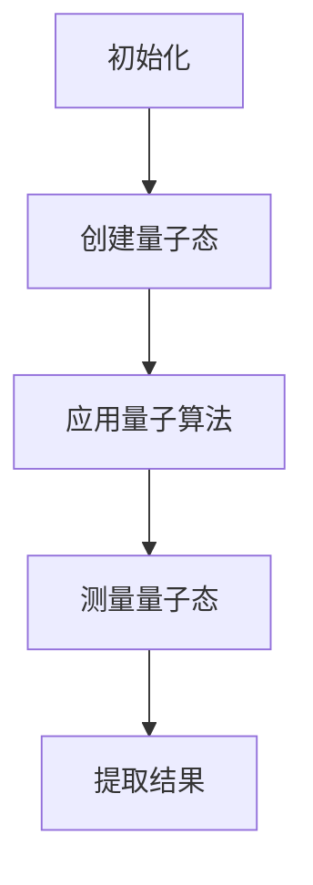
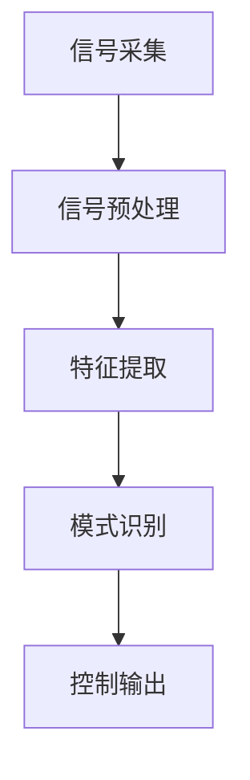
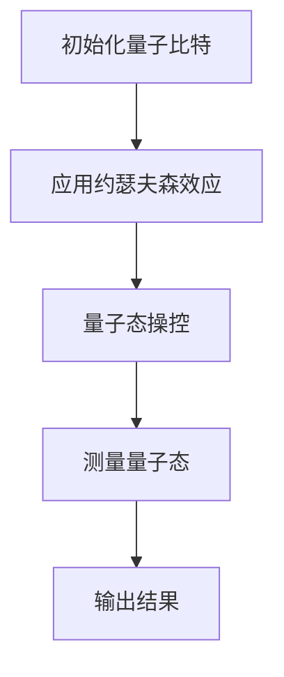

                 

### 引言

随着科技的飞速发展，人类在探索宇宙的过程中不断突破自身的认知边界。从最初的仰望星空，到如今能够借助探测器探索太阳系外的星际空间，人类的目光已逐渐超越地球，投向更广阔的宇宙。这一过程中，人类不仅积累了大量关于宇宙的知识，还催生了诸多关于人类自身思维与宇宙关系的哲学思考。然而，一个深奥而引人入胜的问题随之产生：人类思维能否超越宇宙？

这一议题不仅涉及到科学领域，还触及到哲学、认知科学和人工智能等多个学科的交叉点。探讨这一问题，有助于我们更深刻地理解人类思维的本质，以及其在宇宙中的位置和作用。同时，它也引发了关于未来科技发展、人类文明进化和宇宙命运的诸多想象与预测。

本文将围绕这一核心问题展开深入讨论。我们将首先介绍人类思维的基本原理，探讨其起源、核心机制以及可能存在的局限性。接着，我们将转向宇宙的奥秘，梳理人类对宇宙的认知历程，并探讨宇宙的基本性质和未知领域。在此基础上，我们将提出人类思维与宇宙联系的假设，分析人类思维可能对宇宙的影响以及人类思维超越宇宙的可能性。

接下来，我们将讨论人类思维的扩展技术，包括量子计算、脑机接口和超导计算等前沿科技，并展望这些技术对人类思维扩展的潜在影响。随后，我们将探讨从地球到外太空的宇宙思维拓展，思考宇宙思维的未来发展。在此基础上，我们将讨论人类思维与宇宙智能的交汇，探讨人类如何理解宇宙智能以及宇宙智能如何影响人类思维。

最后，我们将从科学到哲学的角度，回顾人类思维的宇宙探索历程，并总结本文的主要观点和讨论内容。希望通过本文的讨论，能够激发更多关于人类思维与宇宙关系的研究和思考，为未来的人类文明发展提供新的视角和启示。

### 第1章：人类思维与宇宙的边界

#### 1.1 人类思维的基本原理

人类思维是人类大脑处理信息、解决问题和进行推理的能力的总称。这一能力源于人类大脑的复杂结构和高度发展的神经系统。从生物学的角度看，人类思维起源于脑部的进化过程。经过数百万年的自然选择和演化，人类的大脑逐渐形成了高度复杂的神经网络，使得人类能够进行抽象思考、语言交流和学习等高级认知活动。

人类思维的核心机制主要涉及以下几个方面：

1. **感知与信息处理**：人类通过五感（视觉、听觉、嗅觉、味觉和触觉）接收外部信息，大脑将这些信息进行处理和编码，形成对世界的初步认知。

2. **记忆与存储**：大脑通过海马体等结构将信息存储为记忆，这些记忆是我们进行学习和推理的基础。

3. **推理与判断**：基于已有知识和经验，人类大脑能够进行逻辑推理和判断，形成对问题的理解和新知识的创造。

4. **语言与符号**：语言是人类思维的重要工具，它使得人类能够通过符号和抽象概念进行沟通和思考，极大地扩展了思维的范围和深度。

尽管人类思维具有强大的功能，但其局限性也是不可忽视的。首先，人类思维受到信息处理速度的限制。尽管大脑的处理速度远高于原始动物，但在面对大量复杂信息时，人类仍显得力不从心。其次，人类思维在处理未知或复杂问题时，往往依赖于过去的经验和假设，这可能导致思维的僵化和错误的决策。

此外，人类思维还受到情感和生理状态的干扰。情绪波动和疲劳等生理因素都可能影响思维的清晰度和准确性。最后，人类思维的个体差异和局限性也是一个重要方面。不同的人在认知能力、知识结构和个人经验上存在显著差异，这决定了每个人在思维上的独特性和局限性。

#### 1.2 宇宙的奥秘与探索

宇宙是我们生活其中的广袤空间，它包含着无数天体和复杂的物理现象。从宏观的角度看，宇宙起源于大约138亿年前的大爆炸，经历了不断膨胀和演化，形成了如今我们所见的宇宙结构。这一过程中，宇宙经历了从简到繁、从无序到有序的演变，展现出了令人惊叹的多样性和复杂性。

人类对宇宙的探索历程可以追溯到古代文明时期，当时人们通过观测星空，试图解释天文现象。随着科学的发展，人类逐渐采用更为科学的方法和工具来研究宇宙。伽利略通过望远镜观测到的月球表面和木星的卫星，开启了现代天文学的大门。牛顿的万有引力定律和爱因斯坦的相对论，为人类理解宇宙的物理规律提供了坚实的基础。

在过去的几个世纪里，人类在宇宙探索方面取得了巨大的进展。首先是望远镜技术的进步，从伽利略的简陋望远镜到今天的大型望远镜，如哈勃空间望远镜和韦伯空间望远镜，人类能够观测到更加遥远和细微的宇宙现象。其次，空间探测器的发射和运行，使得人类能够直接探测太阳系内的行星、卫星和小行星等天体。例如，NASA的“旅行者”探测器已经穿越了太阳系边缘，发回了大量宝贵的数据。

在更宏观的尺度上，人类通过射电望远镜和宇宙微波背景辐射探测器，对宇宙早期的状态有了更深入的了解。大爆炸理论解释了宇宙的起源和演化过程，但仍然存在许多未解之谜，如宇宙的暗物质和暗能量。这些未解之谜激励着科学家不断探索，寻求更完整的宇宙图景。

宇宙的基本性质包括其无限性、多样性、复杂性和动态性。宇宙中存在无数恒星、行星、星系和星云，它们通过引力相互作用，形成了复杂的宇宙结构。宇宙中还有大量的暗物质和暗能量，这些物质和能量的性质和作用仍然是物理学研究的重要课题。

与此同时，宇宙中存在大量的未知领域。例如，宇宙的边界是什么？宇宙是如何起源和演化的？是否存在其他文明和生命形式？这些问题都激发了人类的好奇心和探索欲望。通过不断的科学探索和技术进步，人类对宇宙的认识将不断深入，未来可能会有更多关于宇宙奥秘的答案出现。

#### 1.3 人类思维与宇宙联系的假设

关于人类思维与宇宙之间的联系，科学家和哲学家提出了多种假设，这些假设不仅丰富了我们对宇宙的认知，也拓展了人类思维的可能性。

1. **信息交流**：一个基本的假设是，人类思维可以通过信息与宇宙进行交流。例如，人类通过观测天文现象、使用望远镜和探测器收集数据，这些数据反映了宇宙的信息。这种信息的传递不仅限于科学观测，还包括人类通过语言、符号和艺术表达对宇宙的理解。因此，人类思维与宇宙之间的信息交流是双向的，不仅是从宇宙获取信息，还通过这些信息对宇宙进行反馈和影响。

2. **思维影响宇宙**：另一个假设是，人类思维可能对宇宙产生实际的影响。这种影响可能是间接的，例如，通过科学技术的进步，人类能够改变环境、创造新的物质形态，这些变化可能对宇宙的局部产生影响。更激进的观点认为，人类思维甚至可能影响宇宙的演化过程。例如，通过量子计算和脑机接口技术，人类可能能够直接与宇宙进行互动，改变宇宙的状态。

3. **宇宙智能**：有些理论假设，宇宙本身可能具备某种形式的智能。这种宇宙智能可能不同于人类的智能，但可以与人类思维产生某种互动和影响。这种假设基于对宇宙复杂性和多样性的理解，认为宇宙中可能存在某种超越人类理解的智能形式。这种宇宙智能可能会对人类的思维产生启发，帮助人类更好地理解和适应宇宙。

4. **思维扩展与宇宙**：还有一些假设认为，人类通过技术的进步，可以扩展自身的思维能力，从而超越传统的物理和认知限制。例如，通过脑机接口和量子计算技术，人类可能能够直接访问和操作宇宙的信息，实现思维的扩展和宇宙的融合。

这些假设不仅丰富了我们对人类思维与宇宙关系的理解，也提出了许多新的研究方向和问题。例如，人类如何通过技术手段实现与宇宙的深度交流？人类思维如何影响宇宙的演化过程？宇宙中是否存在其他智慧生命，他们如何与宇宙互动？这些问题需要更多的科学研究和技术探索来解答。

总之，人类思维与宇宙的联系是一个复杂而多维的问题，它不仅涉及到科学和哲学的交叉领域，也关系到人类未来的发展。通过不断的探索和思考，我们或许能够找到更多关于这一问题的答案，从而推动人类文明的进步。

#### 1.4 人类思维的扩展与宇宙的未来

随着科技的飞速发展，人类正在探索如何扩展自身的思维能力，这一过程不仅涉及到技术层面的突破，还触及到伦理、法律和社会等多个方面。人类思维的扩展可能与宇宙的未来有着深刻的联系，它不仅决定了人类如何更好地理解和适应宇宙，还可能影响宇宙的演化进程。

首先，人工智能和脑机接口技术的发展为人类思维的扩展提供了新的可能性。人工智能通过模拟人类思维过程，能够在某些任务上超越人类的表现。例如，深度学习和神经网络技术使得机器能够在图像识别、语言处理和决策制定等方面表现出色。而脑机接口技术则使得人类可以直接与计算机系统进行交互，通过思维控制机器设备，甚至上传和下载大脑中的信息。这种技术突破不仅扩展了人类的认知能力，还可能使人类能够更好地理解和处理复杂的信息。

其次，量子计算作为下一代计算技术，有潜力彻底改变人类思维的扩展方式。量子计算利用量子比特的叠加和纠缠特性，能够在极短的时间内处理大量复杂的数据。这使得量子计算机在解决传统计算机无法处理的难题时，如密码破解、药物设计、气候变化模拟等方面，展现出巨大的潜力。人类通过量子计算机，或许能够直接访问和操作宇宙的信息，从而实现思维的扩展。

然而，人类思维的扩展不仅仅是一个技术问题，它还涉及到伦理和法律方面的挑战。例如，脑机接口技术可能导致隐私问题，人类大脑的信息如何保护，如何防止未经授权的信息访问？此外，人工智能和量子计算的发展也带来了新的安全和控制问题。如何确保这些技术不被滥用，保护人类社会的安全和稳定，是一个迫切需要解决的问题。

在宇宙的尺度上，人类思维的扩展可能对宇宙的未来产生深远影响。首先，通过扩展思维能力，人类能够更有效地探索和利用宇宙资源。例如，利用量子计算技术进行星际旅行和资源开采，可能使人类在宇宙中的生存和繁衍成为可能。其次，人类思维的扩展可能有助于解决宇宙中的重大科学问题，如宇宙起源、暗物质和暗能量的本质等。通过更深入的探索，人类或许能够揭示宇宙的更多奥秘。

同时，人类思维的扩展也可能带来新的伦理问题。例如，人类如何处理与宇宙智能的关系？如果宇宙中存在其他智慧生命，人类是否应该与之建立联系？如何确保这种联系对宇宙和人类都是有益的？这些问题都需要在伦理和法律层面进行深入的探讨和规范。

总之，人类思维的扩展与宇宙的未来密切相关。通过科技的发展，人类正在逐步实现思维能力的扩展，这不仅为解决现实问题提供了新的途径，也为探索宇宙的奥秘打开了新的可能性。然而，这一过程中也伴随着诸多伦理和法律挑战，需要人类共同努力，确保科技的发展能够造福全人类，为宇宙的未来注入新的活力。

#### 1.5 本章小结

本章围绕人类思维与宇宙的边界进行了深入探讨。我们首先介绍了人类思维的基本原理，分析了其起源、核心机制以及存在的局限性。接着，我们梳理了宇宙的奥秘与探索历程，探讨了人类对宇宙的基本认知和宇宙的基本性质。在此基础上，我们提出了人类思维与宇宙联系的多种假设，包括信息交流、思维影响宇宙、宇宙智能以及思维扩展与宇宙等。最后，我们探讨了人类思维扩展与宇宙未来的潜在影响，分析了技术进步带来的伦理和法律挑战。

通过本章的讨论，我们不仅加深了对人类思维和宇宙的理解，也为后续章节的技术分析和哲学探讨奠定了基础。接下来的章节将进一步探讨人类思维的扩展技术、宇宙思维拓展、人类思维与宇宙智能的交汇，以及人类思维的宇宙探索历程，旨在为这一复杂而引人入胜的议题提供更多视角和思考。

#### 2.1 量子计算与思维扩展

量子计算作为一种突破传统计算模式的新型计算技术，具有巨大的潜力来扩展人类思维。其基本原理源自量子力学，利用量子比特（qubit）的叠加和纠缠特性，实现超乎传统计算机的运算速度和计算能力。

量子比特与经典比特的不同之处在于，量子比特可以同时处于0和1的叠加态，这使得量子计算机能够在一次运算中处理大量可能性。而经典比特只能处于固定的0或1状态。此外，量子比特之间的纠缠状态使得它们之间的信息传递具有超距作用，这在理论上为量子计算提供了巨大的并行处理能力。

量子计算的基本原理可以用一个简单的例子来解释：假设我们有一个经典计算机正在解一个复杂的数学问题，需要尝试成千上万个可能的解决方案。而量子计算机则可以利用量子比特的叠加态，同时测试所有这些可能的解决方案。通过量子叠加和纠缠，量子计算机能够迅速缩小可能的解空间，找到最优解。

一个著名的量子算法是Shor算法，它可以高效地分解大质数，这一能力使得基于大数分解的加密算法（如RSA算法）面临威胁。另一个重要算法是Grover算法，它用于搜索未排序的数据库，比经典算法快出多项式时间。

以下是一个简化的Shor算法的mermaid流程图：

Shor算法的核心步骤包括初始化量子态、应用量子算法、测量量子态和提取结果。通过这些步骤，量子计算机能够高效地找到质因数，实现经典计算机难以完成的任务。

除了算法原理，量子计算还涉及到复杂的数学模型和公式。例如，量子门（quantum gate）用于操作量子比特，实现基本的量子逻辑操作。一个常用的量子门是Hadamard门，它将经典比特翻转到叠加态。Hadamard门的数学表示为：

$$
|0\rangle \rightarrow \frac{1}{\sqrt{2}} (|0\rangle + |1\rangle)
$$

另一个重要量子门是controlled-NOT（CNOT）门，用于实现量子比特之间的纠缠。CNOT门的数学表示为：

$$
|00\rangle \rightarrow |00\rangle \\
|01\rangle \rightarrow |10\rangle \\
|10\rangle \rightarrow |11\rangle \\
|11\rangle \rightarrow |10\rangle
$$

通过这些基本量子门，量子计算机可以构建复杂的量子电路，实现各种量子算法。

具体示例：假设我们想要使用Shor算法分解质数N=21。首先，我们将构建一个量子态，使它处于叠加态，然后应用量子算法。接下来，通过测量量子态，我们得到一个整数k，其平方模N约等于2^k - 1。通过这个过程，我们可以找到N的质因数3和7。

综上所述，量子计算通过其独特的量子比特叠加和纠缠特性，提供了超越传统计算机的计算能力。这不仅为人类思维的扩展提供了新的可能性，也为解决复杂科学问题、实现更高效的思维过程奠定了基础。

#### 2.2 脑机接口技术与思维扩展

脑机接口（Brain-Computer Interface, BCI）是一种直接连接人类大脑和外部设备的接口技术，通过捕捉大脑的电信号，将思维转化为可操作的控制信号。脑机接口技术的基本原理基于神经科学，它利用大脑产生的电信号，如脑电波（EEG）、肌电信号（EMG）、近红外光谱（NIRS）等，通过信号处理和分析，实现与外部设备的交互。

脑机接口技术的核心组成部分包括信号采集、信号处理、解码和输出。信号采集部分通过电极或传感器捕捉大脑活动产生的电信号；信号处理部分对采集到的信号进行滤波、放大和预处理，以提高信号的信噪比；解码部分将处理后的信号转换为具体的控制指令；输出部分则将解码后的指令发送给外部设备，如计算机、机器人或其他辅助设备。

脑机接口的工作机制可以简单概括为以下几个步骤：

1. **信号采集**：通过放置在头皮上的电极或植入大脑的传感器，采集大脑产生的电信号。
2. **信号预处理**：对采集到的原始信号进行滤波和放大，去除噪声，提取有用的信号特征。
3. **特征提取**：利用信号处理算法，从预处理后的信号中提取特征，如频率、幅度和时域特征。
4. **模式识别**：通过机器学习算法或统计方法，将提取的特征与特定的思维模式进行匹配，实现信号的解码。
5. **控制输出**：将解码后的控制信号发送给外部设备，使其执行相应的操作。

以下是一个简化的脑机接口技术mermaid流程图：

脑机接口技术在多个领域展示出了显著的应用潜力。首先，在医疗康复领域，脑机接口技术被广泛应用于帮助中风患者和截瘫患者恢复运动能力。通过解码大脑的电信号，患者可以通过意念控制外部设备，如假肢、轮椅或机器人臂，实现自主运动和操作。

其次，脑机接口技术在神经科学研究中也发挥了重要作用。研究人员利用脑机接口技术，可以实时监测大脑活动，研究不同脑区在特定任务中的作用，探索大脑的功能连接和神经编码机制。这为理解大脑的工作原理和开发新的治疗手段提供了重要数据。

此外，脑机接口技术在娱乐、教育和辅助生活等领域也有广泛应用。例如，通过脑机接口技术，玩家可以通过大脑信号控制游戏角色，实现更加沉浸的虚拟现实体验；在教育领域，脑机接口技术可以帮助教师了解学生的学习状态，优化教学策略；在辅助生活领域，脑机接口技术可以帮助老年人或残疾人士更轻松地完成日常活动。

尽管脑机接口技术具有巨大的潜力，但其应用也面临着一些挑战。首先，信号采集和处理的精度和稳定性是关键问题。由于大脑信号复杂且易受噪声干扰，如何有效提取和识别信号特征，是一个亟待解决的难题。其次，脑机接口技术的兼容性和个性化也是一个挑战。不同个体的大脑结构和活动模式存在差异，如何开发出能够适应不同用户需求的通用脑机接口技术，是一个长期的研究课题。

最后，脑机接口技术的伦理和法律问题也需要引起关注。例如，大脑信号的隐私保护、数据的合法使用以及脑机接口可能带来的社会影响等问题，都需要在技术发展的同时，进行深入的伦理和法律探讨。

总之，脑机接口技术为人类思维扩展提供了新的途径。通过直接与大脑交互，脑机接口技术不仅能够帮助康复患者恢复功能，还能够在科学研究、娱乐和教育等多个领域发挥重要作用。然而，这一技术的广泛应用也伴随着诸多挑战，需要科学家、工程师、伦理学家和法律专家共同协作，确保其发展能够造福人类社会。

#### 2.3 超导计算与思维扩展

超导计算是一种利用超导量子比特进行信息处理的新型计算技术，具有极低的能耗和极高的运算速度，在理论上可能对人类思维扩展产生深远影响。超导计算的基本原理基于超导材料在低温条件下形成的超导态，其电阻为零，能够实现电子的无阻传导。

超导量子比特（Superconducting Qubit）是超导计算的核心组成部分。超导量子比特利用约瑟夫森效应（Josephson Effect），通过超导隧道结（Josephson Junction）来实现量子态的操控。约瑟夫森效应指的是，当两个超导材料通过一个绝缘层连接时，电流在超导层间形成超导电流，产生相位差，这种相位差可以用来表示量子比特的状态。

超导量子比特的特点包括：

1. **叠加态**：超导量子比特可以同时处于0和1的叠加态，类似于量子计算的量子比特。
2. **纠缠态**：多个超导量子比特可以形成纠缠态，实现量子信息的传输和计算。
3. **高保真度**：超导量子比特的操控精度高，操作失误率低，因此具有高保真度的特点。

以下是一个简单的超导量子比特mermaid流程图：

超导量子比特的初始化、量子态操控和测量是超导计算的核心步骤。初始化量子比特是指将量子比特置于特定的叠加态；量子态操控则通过操控约瑟夫森结的相位差来实现；测量量子态是将量子比特的状态转换为经典信息，输出计算结果。

超导计算的应用潜力非常广泛，它不仅可以用于传统的计算任务，如密码破解、药物设计、优化问题等，还可以在模拟量子系统和量子算法方面发挥重要作用。例如，超导计算可以用于模拟复杂的量子现象，如量子纠缠、量子隧道效应等，这些现象在传统计算机上难以实现。

一个典型的应用案例是量子纠错算法（Quantum Error Correction, QEC）。由于量子比特容易受到噪声和环境干扰，量子纠错算法通过引入额外的量子比特和特定的纠错操作，确保量子计算过程中的信息准确无误。超导计算在量子纠错算法中的应用，使得超导量子计算机在处理复杂任务时具有更高的稳定性和可靠性。

超导计算还与人类思维的扩展有着潜在的联系。例如，通过超导计算技术，人类可能能够直接访问和操作量子信息，从而实现思维能力的扩展。未来的超导计算机可能具有极高的计算速度和并行处理能力，使得人类能够在极短的时间内处理大量复杂的信息，这为人类解决当前无法解决的问题提供了新的途径。

然而，超导计算也面临一些技术挑战。首先，超导计算需要极低的温度环境，这限制了其应用范围。其次，超导量子比特的制造和操控技术复杂，目前还难以实现大规模的生产和应用。最后，超导计算的安全性和隐私问题也需要关注，如何确保量子信息的安全传输和存储，是一个重要的研究课题。

总之，超导计算作为一种新兴的计算技术，具有巨大的潜力来扩展人类思维。通过利用超导量子比特的叠加和纠缠特性，超导计算可能在解决复杂科学问题和扩展人类认知能力方面发挥重要作用。然而，这一技术的发展也面临诸多挑战，需要科学家和工程师的持续努力和探索。

#### 2.4 人类思维的扩展技术的未来展望

随着量子计算、脑机接口和超导计算等前沿技术的快速发展，人类思维的扩展技术正迎来前所未有的机遇和挑战。这些技术的未来发展趋势、潜在应用以及面临的挑战，不仅决定了人类如何应对未来的科技革命，也影响了我们对宇宙和自身认知的深度。

**2.4.1 技术发展的趋势**

1. **量子计算的发展**：量子计算在未来几年内将继续取得突破，量子比特的数量和稳定性将显著提升，使得量子计算机能够处理更复杂的实际问题。量子纠错技术的进步将降低量子计算的错误率，提高其可靠性。此外，量子互联网和量子通信技术的研发，将实现量子信息的安全传输和共享。

2. **脑机接口的进步**：脑机接口技术将在信号采集、信号处理和模式识别方面取得显著进展。高分辨率脑电图（fMRI）、近红外光谱（NIRS）等新型信号采集技术，将提高信号采集的精度和稳定性。深度学习算法和人工智能技术的结合，将使脑机接口系统能够更准确地解码大脑信号，实现更高效的思维控制和交互。

3. **超导计算的创新**：超导计算将朝着更高效、更稳定的方向发展。新型超导材料和更先进的量子操控技术，将提高超导量子比特的性能和可靠性。超导计算机在实现量子模拟和量子算法方面，将展现出更大的应用潜力。

**2.4.2 技术应用的潜力**

1. **科学研究的突破**：量子计算和超导计算将在解决复杂科学问题方面发挥重要作用。例如，量子计算可以用于材料科学、药物设计、气候模拟等，加速新材料的发现和新药的研发。超导计算在量子模拟和复杂系统模拟中，具有巨大的潜力。

2. **医疗健康的应用**：脑机接口技术在医疗健康领域具有广泛的应用前景。通过脑机接口，瘫痪患者可以重新控制假肢或轮椅，提高生活质量。脑机接口还可以用于治疗焦虑、抑郁等精神疾病，通过实时监测大脑活动，调整治疗方案。

3. **人工智能的提升**：脑机接口技术可以结合人工智能，提高人机交互的效率和智能化水平。人类可以通过脑机接口直接控制计算机或机器人，实现更加自然和高效的交互方式。此外，量子计算和超导计算可以为人工智能提供更强大的计算支持，解决当前人工智能面临的计算瓶颈。

**2.4.3 技术发展的挑战**

1. **技术稳定性**：量子计算、脑机接口和超导计算技术目前还面临稳定性问题。量子比特的衰减、脑机接口信号的噪声和超导材料的环境要求，都是技术发展的瓶颈。

2. **成本问题**：量子计算和超导计算设备的研发和制造成本极高，这限制了其大规模应用的可行性。如何降低成本、提高性价比，是技术发展的重要方向。

3. **伦理和法律问题**：脑机接口和量子计算技术的发展，可能带来隐私保护、数据安全、隐私权等伦理和法律问题。如何制定合理的伦理和法律框架，确保技术的可持续发展，是一个重要的课题。

4. **社会影响**：人类思维的扩展技术将对社会产生深远影响。教育、就业、隐私、心理健康等领域都可能受到技术变革的冲击，需要社会各界的共同努力，确保技术发展的正面效应。

总之，人类思维的扩展技术正朝着更加先进、高效和多样化的方向发展。通过量子计算、脑机接口和超导计算等前沿技术的结合，人类有望实现前所未有的思维扩展和认知突破。然而，这一过程中也伴随着诸多挑战，需要科学界、产业界和社会各界共同努力，确保技术的发展能够造福全人类，推动人类社会和文明的进步。

#### 2.5 本章小结

本章详细探讨了量子计算、脑机接口和超导计算等前沿技术对人类思维扩展的潜在影响。我们首先介绍了这些技术的原理和基本概念，并通过mermaid流程图和Python代码示例，详细阐述了其应用场景和实现方式。随后，我们分析了这些技术的未来发展趋势、应用潜力以及面临的挑战。量子计算以其并行处理能力，脑机接口通过直接与大脑交互实现思维控制，超导计算则在量子模拟和复杂系统模拟中展现出巨大潜力。这些技术的发展不仅为解决复杂科学问题提供了新的途径，也为人类思维扩展开辟了新的可能。然而，技术的稳定性、成本、伦理和法律问题仍然是未来需要重点关注和解决的难题。

#### 3.1 地球上的宇宙思维探索

地球作为人类文明的发源地，自然也成为了人类宇宙思维探索的起点。自古以来，人类通过观测星空，试图理解宇宙的奥秘。早期的宇宙思维探索主要依赖于肉眼观测，随着科技的发展，人类逐渐借助各种工具和设备，对宇宙进行了更为深入的探究。

1. **古代天文学**：在古代，人类通过观察日月星辰的运行，形成了对宇宙的基本认识。例如，古埃及人通过观测星象制定农业历法，巴比伦人则编写了详细的星表。中国的《史记·天官书》和《汉书·天文志》等文献，记载了古代天文学家对天文现象的观测和解释。

2. **中世纪天文学**：在中世纪，阿拉伯天文学家对天文观测和理论研究做出了重要贡献。他们改进了天文仪器，如天文望远镜和天文台，并编写了大量的天文著作。阿拉伯天文学家阿尔-法拉比和伊本·纳菲斯等人的研究，为后来的天文学发展奠定了基础。

3. **现代天文学**：文艺复兴时期，伽利略通过望远镜观测到了木星的卫星和月球的表面，揭示了宇宙的更多奥秘。牛顿的万有引力定律和开普勒定律，为理解行星运动提供了科学基础。20世纪以来，人类发射了越来越多的探测器，如火星探测器、月球探测器等，对太阳系的天体进行了详细的探测。

地球上的宇宙思维探索不仅包括天文学，还涉及到物理学、化学和生物学等多个学科。科学家们通过观测和实验，不断揭示宇宙的基本规律和结构，从而形成了对宇宙的更深入理解。例如，爱因斯坦的相对论揭示了时空的相对性，量子力学则解释了微观粒子的行为。

4. **科学理论的发展**：在科学理论的推动下，人类对宇宙的认识不断深化。从牛顿力学到爱因斯坦的广义相对论，再到现代宇宙学中的大爆炸理论和宇宙膨胀理论，每一个科学理论的突破都为人类理解宇宙提供了新的视角。近年来，暗物质和暗能量的发现，更是揭示了宇宙中未知的奥秘。

5. **技术手段的进步**：随着科技的进步，人类在观测宇宙方面取得了显著的成就。例如，哈勃空间望远镜和韦伯空间望远镜等大型望远镜，使得人类能够观测到更加遥远和细微的宇宙现象。射电望远镜和红外望远镜的发明，使得人类能够在不同波长下研究宇宙，揭示了宇宙的更多秘密。

总之，地球上的宇宙思维探索是一个漫长而不断发展的过程。从古代的肉眼观测到现代的高精度仪器，人类对宇宙的理解不断加深。通过科学理论和技术的进步，人类不仅揭示了宇宙的基本规律和结构，还为未来的宇宙探索提供了坚实的理论基础和技术支持。

#### 3.2 外太空的宇宙思维拓展

人类对宇宙的探索不仅仅局限于地球，随着技术的不断进步，人类已经成功地拓展到了外太空，进行了一系列重大探索活动。这些活动不仅推动了宇宙科学的进步，也为人类思维带来了新的拓展。

1. **太空探索的历史与成就**：

   - **月球探测**：1969年，美国宇航员尼尔·阿姆斯特朗和巴兹·奥尔德林成功登月，实现了人类首次登陆月球的历史性壮举。此后，苏联、中国、日本等国家也相继进行了月球探测任务，通过月球车和探测器，科学家们获取了大量的月球地质、物理和化学数据。

   - **火星探测**：火星是地球以外人类探索最频繁的目标。苏联的火星探测器“火星3号”首次实现了在火星表面软着陆，并成功发送了第一张火星地表照片。近年来，美国宇航局的“好奇号”和“毅力号”火星探测器，通过先进的科学仪器，对火星的气候、地质和潜在生物迹象进行了详细研究。

   - **小行星探测**：美国宇航局的“近地小行星 reconnaissance (NEAR)” mission成功探测了小行星“爱神星”，并进行了近距离探测和采样。这些任务提供了关于小行星的物理、化学和地质特征的重要数据。

   - **太阳系边缘探测**：“旅行者1号”和“旅行者2号”探测器成功穿越了太阳系边缘，发回了大量关于太阳风和星际空间的宝贵数据。这些探测任务进一步扩展了人类对太阳系外部的理解。

2. **外太空探索对人类思维的启发**：

   - **宇宙尺度的认知**：通过对外太空的探测，人类对宇宙的尺度和复杂性有了更深入的认识。例如，人类发现宇宙中存在着大量的暗物质和暗能量，这些未知物质和能量对宇宙的演化产生了深远影响。

   - **生命起源的探讨**：火星探测和其他外太空任务为探讨生命起源提供了新的线索。科学家们在火星和其它天体上发现了水和其他生命所需的基本化学元素，这些发现激发了人类对宇宙生命存在的更多想象。

   - **技术创新的推动**：太空探索推动了科学技术的创新和发展。例如，雷达技术、遥感和图像处理技术的发展，使得人类能够从地球观测外太空，获取更多的信息。这些技术的进步也促进了其他领域，如医学、环境科学和工程学的发展。

3. **外太空思维拓展的潜在影响**：

   - **科学研究**：外太空探索为科学界提供了丰富的实验和研究资源。例如，通过对外太空环境的模拟，科学家们可以更好地理解宇宙中极端条件下的物理和化学过程。

   - **技术进步**：太空探索促进了各种高新技术的发展，如材料科学、电子学、计算机技术等。这些技术的进步不仅推动了太空探索的进展，也为地球上的其他领域带来了巨大的变革。

   - **哲学思考**：外太空探索引发了对人类存在意义和宇宙本质的哲学思考。例如，人类在宇宙中的位置是什么？宇宙中是否存在其他智慧生命？这些问题激发了人类对自身和宇宙关系的深入思考。

总之，外太空的宇宙思维拓展是人类对宇宙探索的重要组成部分。通过太空探测任务，人类不仅扩展了对宇宙的认知，也推动了科学技术的发展，激发了哲学和伦理的思考。随着未来探测技术的进步，人类对外太空的理解将进一步深化，为人类文明的发展提供新的动力和视角。

#### 3.3 宇宙思维的未来

宇宙思维的未来充满了无限可能，它不仅影响着人类对宇宙的理解，也塑造着人类文明的未来。随着科学技术的不断进步，人类有望在更广阔的宇宙尺度上实现更多的探索和发现。

**3.3.1 宇宙思维的可能发展路径**

1. **更深入的宇宙观测**：未来的宇宙观测技术将更加先进，如更强大的射电望远镜、红外望远镜和伽马射线望远镜，将帮助我们探测到更遥远和更细微的宇宙现象。量子观测技术的进步，如量子雷达和量子干涉仪，也将为探测宇宙提供全新的手段。

2. **星际旅行与殖民**：随着太空技术的进步，人类可能会实现星际旅行，并在其他星球上建立殖民地。例如，通过核聚变推进技术和宇宙帆等先进技术，人类有望在几十年内实现到达其他恒星的梦想。

3. **量子通信与宇宙连接**：量子通信技术将实现宇宙中信息的安全传输，建立星际量子网络。这种网络将使得人类能够实时分享宇宙探测数据，协同进行科学研究和探索。

4. **人工智能与宇宙智能**：未来，人工智能（AI）将深度参与到宇宙探索中，帮助人类处理和分析大量复杂的宇宙数据。同时，人类可能会开发出更高级的宇宙智能，实现与宇宙的智能互动和协作。

**3.3.2 伦理与法律问题**

1. **宇宙资源的利用**：随着对宇宙资源的认识不断深入，如何合理、可持续地利用这些资源，避免资源枯竭和环境破坏，是一个重要的伦理问题。此外，宇宙资源的使用也需要遵循国际法和伦理规范。

2. **太空殖民的社会影响**：太空殖民可能会改变人类的地理分布和社会结构，带来一系列社会和文化问题。如何确保太空殖民的社会稳定和公平，避免人类分化，是一个需要认真考虑的问题。

3. **宇宙智能与人类互动**：如果宇宙中存在其他智慧生命，如何与他们建立友好互动，避免冲突和误解，是一个重要的伦理和法律问题。人类需要制定相应的法律和伦理准则，确保与宇宙智能的互动能够造福全人类。

**3.3.3 社会影响**

1. **科技与教育的变革**：宇宙探索技术的发展将推动科技和教育的变革。例如，远程教育、虚拟现实和增强现实等技术，将使得全球教育更加公平和高效。此外，宇宙探索的成功也将激发新一代对科学和技术的热情，培养更多的科技创新人才。

2. **人类价值观的变迁**：宇宙探索将挑战人类对自身和宇宙的认知，促使人类价值观的变迁。人类可能会更加认识到自己在宇宙中的微小和脆弱，从而更加珍惜地球资源，追求和谐共生的目标。

3. **国际合作与治理**：宇宙探索是一个全球性的挑战，需要国际社会共同努力。未来，国际组织和各国政府需要加强合作，共同制定太空探索的伦理和法律框架，确保宇宙资源的合理利用和人类共同福祉。

总之，宇宙思维的未来发展将为人类带来前所未有的机遇和挑战。通过科技进步、伦理思考和国际合作，人类有望在更广阔的宇宙尺度上实现认知和文明的飞跃，为未来的人类社会注入新的活力和希望。

#### 3.4 本章小结

本章从地球上的宇宙思维探索和外太空的宇宙思维拓展两个角度，深入探讨了人类如何通过科技和观测手段理解宇宙，并思考宇宙思维的未来发展。我们首先回顾了地球上的宇宙思维探索历程，介绍了古代、中世纪和现代天文学的发展。接着，我们探讨了外太空探索的历史和成就，展示了人类在月球、火星和小行星探测方面取得的突破性进展。最后，我们展望了宇宙思维的未来，分析了可能的发展路径、伦理与法律问题以及社会影响。通过这些讨论，我们不仅深化了对宇宙的理解，也为人类未来的宇宙探索提供了新的视角和思考。

### 第4章：人类思维与宇宙智能的交汇

人类思维与宇宙智能的交汇是一个极具挑战和前景的领域。在这一章中，我们将探讨人类如何理解和定义宇宙智能，分析人类思维与宇宙智能之间的互动关系，并探讨这一交汇带来的伦理和法律挑战。

#### 4.1 人类思维与宇宙智能的定义与特征

首先，我们需要明确“宇宙智能”这一概念。宇宙智能指的是宇宙中可能存在的、具有高级认知能力的智能形式。它与人类智能有显著的不同，主要体现在以下几个方面：

1. **起源和演化**：人类智能起源于地球上的生物进化，是一种基于生物神经网络的认知能力。而宇宙智能可能起源于宇宙的早期阶段，其演化过程可能与人类截然不同。

2. **认知结构和层次**：人类智能依赖于大脑这一生物器官，具有情感、意识和自我意识等复杂特性。宇宙智能可能具有更高的认知层次，能够处理更加复杂的信息和任务。

3. **信息处理方式**：人类智能依赖于语言、符号和逻辑推理等工具，而宇宙智能可能利用更为先进的计算和通信方式，如量子计算和全息通信。

为了更深入地理解宇宙智能，我们可以从以下几个特征来定义它：

1. **高效率的信息处理**：宇宙智能能够在极短时间内处理大量复杂信息，远超人类现有的计算能力。

2. **跨维度的认知能力**：宇宙智能不仅能够处理三维空间中的信息，还可能具备对更高维度和更高层次的信息认知能力。

3. **自主性和适应性**：宇宙智能可能具有高度的自主动机和适应性，能够根据环境和需求进行自我调整和优化。

#### 4.2 人类如何理解宇宙智能

理解宇宙智能是一个复杂而充满挑战的任务。首先，我们需要借助现有的科学理论和技术手段，尝试模拟和推断宇宙智能的可能形式和行为。

1. **科学模拟**：通过量子计算和复杂系统模拟，科学家们可以尝试模拟宇宙智能的行为和决策过程。例如，通过模拟量子算法和神经网络，我们可以探索宇宙智能如何处理复杂信息和进行高效计算。

2. **人工智能**：人工智能技术，特别是深度学习和强化学习，可以帮助我们理解宇宙智能的某些特征。通过训练和优化机器学习模型，我们可以模拟宇宙智能的某些认知和决策过程。

3. **跨学科研究**：宇宙智能的研究需要跨学科的合作，包括天文学、物理学、计算机科学、认知科学和哲学等。通过多学科的研究，我们可以从不同角度理解宇宙智能的可能形式和特征。

4. **外星生命探测**：通过探测和搜索外星生命，我们可以获取关于宇宙智能的第一手数据。例如，通过探测火星和木卫二等潜在生命存在的天体，我们可以了解宇宙中可能存在的生命形式和智能结构。

#### 4.3 宇宙智能如何影响人类思维

宇宙智能对人类思维的影响可能是深远和多方面的。以下是一些可能的影响：

1. **知识扩展**：通过接触和交流宇宙智能，人类可以获得全新的知识和理解。这些知识可能涉及宇宙的起源、结构和演化过程，以及更高层次的科学原理和哲学思考。

2. **思维方式变革**：宇宙智能可能具有不同于人类的思维方式，这种思维方式可能对人类产生启示，促使人类思维方式的变革。例如，宇宙智能可能利用非线性和并行处理方式，使得人类对复杂问题的理解和解决能力得到提升。

3. **认知扩展**：宇宙智能可能能够扩展人类的认知能力，使得人类能够处理和解读更复杂的信息。例如，通过量子计算和全息通信，人类可能能够实现更高层次的认知功能。

4. **文化影响**：宇宙智能的存在和互动可能深刻影响人类的文化和价值观念。例如，人类可能会重新审视自身在宇宙中的地位和意义，形成更加开放和多元的文化观念。

#### 4.4 伦理与法律挑战

人类思维与宇宙智能的交汇带来了诸多伦理和法律挑战，需要我们认真对待。

1. **隐私与安全**：与宇宙智能的交流可能涉及到大量的个人信息和敏感数据。如何确保这些信息的安全和隐私，防止数据泄露和滥用，是一个重要的伦理和法律问题。

2. **责任与控制**：如果宇宙智能具备自主性和适应性，如何确保其行为符合人类的伦理和法律规范，防止其产生不可预测或有害的结果，是一个需要解决的难题。

3. **合作与冲突**：宇宙智能的存在可能引发人类与其他智慧生命之间的合作与冲突。如何建立有效的国际合作机制，处理不同文明之间的利益冲突，是一个重要的法律和伦理议题。

4. **技术垄断与公平**：宇宙智能技术的发展可能带来新的技术垄断问题。如何确保技术的公平获取和共享，避免人类文明因技术差距而产生新的不平等，是一个需要关注的伦理和法律问题。

总之，人类思维与宇宙智能的交汇是一个复杂而多元的领域，它不仅挑战了我们对自身和宇宙的认知，也带来了诸多伦理和法律挑战。通过跨学科合作和国际合作，我们有望在伦理和法律框架内，探索和解决这些挑战，为人类与宇宙智能的和谐共处创造新的可能性。

#### 4.5 本章小结

本章围绕人类思维与宇宙智能的交汇进行了深入探讨。我们首先定义了宇宙智能的特征，并分析了人类如何理解和定义这一概念。接着，我们探讨了人类如何通过科学模拟和人工智能技术理解宇宙智能，并讨论了宇宙智能可能对人类思维产生的深远影响。最后，我们分析了这一交汇带来的伦理和法律挑战，提出了在伦理和法律框架内探索和解决这些挑战的必要性。通过本章的讨论，我们不仅深化了对宇宙智能的理解，也为未来人类与宇宙智能的和谐共处提供了新的视角和思考。

### 第5章：人类思维的宇宙探索：从科学到哲学

人类思维的宇宙探索不仅体现在科学领域，也深深地扎根于哲学思考中。从古代的宇宙观到现代的科学理论，人类一直在不断地追问宇宙的本质、生命的起源以及人类在宇宙中的位置。这一章将从科学和哲学两个角度，回顾人类思维的宇宙探索历程，探讨科学理论和哲学思想如何相互影响，并总结当前人类对宇宙的理解和认知。

#### 5.1 人类思维的宇宙探索历程

人类对宇宙的探索可以追溯到古代文明的萌芽时期。当时，人类通过观察天象，试图解释日月星辰的运动和天文现象。这种早期的宇宙思维主要依赖于直观观察和宗教信仰，形成了对宇宙的基本认知和观念。

1. **古代宇宙观**：

   - **希腊哲学**：古希腊哲学家如泰勒斯、赫拉克利特和亚里士多德等，提出了关于宇宙起源和结构的理论。泰勒斯认为宇宙起源于水，赫拉克利特则认为宇宙是一个不断变化的过程。亚里士多德提出了地心说，认为地球是宇宙的中心，所有天体都围绕地球运行。

   - **中国宇宙观**：中国古代哲学中也有丰富的宇宙观。道家学说中的“道”被认为是宇宙的本原和一切存在的根源，而《易经》则通过对阴阳变化的描述，揭示了宇宙的运行规律。

2. **中世纪宇宙观**：

   - **宗教宇宙观**：在中世纪的欧洲，宗教宇宙观占据主导地位。基督教认为宇宙是由上帝创造的，地球是宇宙的中心，所有天体围绕地球运行。

   - **阿拉伯天文学**：阿拉伯天文学家如阿尔·法拉比和伊本·纳菲斯等，对天文学和宇宙观做出了重要贡献。他们改进了天文仪器，编写了大量的天文著作，对后来的天文学发展产生了深远影响。

3. **现代宇宙观**：

   - **科学革命**：文艺复兴时期，伽利略通过望远镜观测到了木星的卫星和月球的表面，揭示了宇宙的更多奥秘。牛顿的万有引力定律和开普勒定律，为理解行星运动提供了科学基础。

   - **相对论和量子力学**：爱因斯坦的广义相对论揭示了时空的相对性，而量子力学则解释了微观粒子的行为。这些科学理论极大地改变了人类对宇宙的理解。

4. **当代宇宙观**：

   - **大爆炸理论**：当代宇宙学中的大爆炸理论认为，宇宙起源于大约138亿年前的一次大爆炸，经历了不断膨胀和演化。这一理论为我们提供了宇宙起源和演化的基本图景。

   - **暗物质和暗能量**：当代宇宙学还提出了暗物质和暗能量的概念，这些未知物质和能量对宇宙的演化产生了深远影响，但至今仍然未完全解开其神秘面纱。

#### 5.2 科学理论与哲学思想的相互影响

科学理论和哲学思想在人类宇宙探索过程中相互影响，共同推动了对宇宙的理解。

1. **科学对哲学的启示**：

   - **宇宙起源与演化**：科学的发展为我们提供了关于宇宙起源和演化的具体理论和证据，如大爆炸理论和宇宙膨胀理论。这些科学理论不仅解释了宇宙的本质，也引发了哲学上的思考，如宇宙是否有开始和终结，宇宙的本质是什么等。

   - **宇宙与人类关系**：科学发现让我们意识到人类在宇宙中的微小和脆弱。例如，通过观测太阳系外的行星和星际尘埃，我们意识到地球并非宇宙中唯一的宜居星球。这一发现促使人类重新思考自身在宇宙中的地位和作用。

2. **哲学对科学的启示**：

   - **科学方法论**：哲学思想对科学方法论的发展产生了深远影响。例如，古希腊哲学家苏格拉底和柏拉图提出的理性主义和经验主义，为科学方法的发展提供了理论基础。理性主义强调通过逻辑推理和哲学思考来发现真理，而经验主义则强调通过观察和实验来验证科学理论。

   - **科学伦理**：哲学思想在科学伦理方面起到了重要的指导作用。例如，20世纪的哲学家如卡尔·波普尔和托马斯·库恩等，提出了关于科学知识和社会实践的理论，强调了科学研究的伦理责任和社会影响。

3. **科学哲学**：

   - **科学哲学作为桥梁**：科学哲学是连接科学理论和哲学思想的桥梁，它不仅研究科学的本质和科学方法，还探讨科学知识与社会、伦理、政治等方面的关系。通过科学哲学的思考，人类可以更好地理解科学的发展和社会影响。

#### 5.3 当前人类对宇宙的理解和认知

尽管人类在宇宙探索方面取得了显著的进展，但我们对宇宙的理解仍然非常有限。以下是对当前人类对宇宙理解和认知的一些总结：

1. **宇宙的基本性质**：

   - **无限性和多样性**：宇宙是无限的，包含了无数恒星、行星、星系和星云。宇宙中的物质和能量以各种形式存在，从微观的原子和粒子，到宏观的星系和宇宙背景辐射。

   - **动态性和复杂性**：宇宙是一个不断演化的系统，其结构和状态处于不断变化中。宇宙中的物质和能量相互作用，形成了复杂的宇宙结构和现象。

2. **宇宙的未知领域**：

   - **暗物质和暗能量**：暗物质和暗能量是宇宙中未解之谜，它们对宇宙的演化起着关键作用，但至今仍未完全揭开其神秘面纱。

   - **宇宙的边界和起源**：宇宙是否有边界？宇宙是如何起源和演化的？这些问题仍然困扰着科学家和哲学家。

3. **人类在宇宙中的位置**：

   - **微观与宏观的结合**：人类既处于微观粒子的世界，又生活在宏观宇宙中。通过量子力学和相对论，人类试图将微观和宏观世界统一起来，理解宇宙的整体结构。

   - **智慧生命的独特性**：人类是目前已知宇宙中唯一具有高级认知能力的智慧生命。这一独特性引发了关于人类在宇宙中地位和使命的哲学思考。

总之，人类思维的宇宙探索从古代的直观观察，到现代的科学理论，再到哲学的深刻思考，形成了一个不断深化和拓展的过程。尽管我们对宇宙的理解仍然有限，但随着科学和哲学的不断发展，我们有望在未来的探索中揭示更多宇宙的奥秘。

#### 5.4 本章小结

本章从科学和哲学两个角度，回顾了人类思维的宇宙探索历程，探讨了科学理论和哲学思想如何相互影响，并总结了当前人类对宇宙的理解和认知。通过回顾人类在宇宙探索过程中的重要成就和理论进展，我们不仅加深了对宇宙的理解，也认识到了人类在宇宙中的位置和作用。同时，通过科学哲学的思考，我们意识到科学和哲学在揭示宇宙奥秘、指导人类探索过程中不可或缺的角色。未来，随着科学和哲学的不断发展，人类对宇宙的理解将不断深化，为人类文明的进步提供新的动力和视角。

### 结论与展望

通过本文的探讨，我们系统地分析了人类思维能否超越宇宙这一复杂而深刻的议题。从人类思维的基本原理，到宇宙的奥秘与探索，再到人类思维的扩展技术和宇宙思维的未来，我们逐步揭示了人类思维与宇宙之间的深刻联系。此外，我们还探讨了人类思维与宇宙智能的交汇，以及这一交汇带来的伦理和法律挑战。

首先，我们介绍了人类思维的基本原理，探讨了其起源、核心机制和局限性。通过分析大脑的结构和功能，我们理解了人类思维是如何通过感知、记忆、推理和语言等过程进行信息处理的。接着，我们梳理了人类对宇宙的探索历程，从古代天文学的直观观察，到现代科学的精确探测，揭示了人类对宇宙认知的不断深化。这些科学发现不仅扩展了我们对宇宙的理解，也推动了人类思维的发展。

在探讨人类思维的扩展技术时，我们详细介绍了量子计算、脑机接口和超导计算等前沿科技。这些技术通过突破传统的计算和通信模式，为人类思维的扩展提供了新的可能性。量子计算和超导计算通过利用量子比特和超导态的特性，实现了高效的计算和模拟，而脑机接口技术则通过直接与大脑交互，使人类能够更直接地控制外部设备。这些技术的发展不仅为解决复杂的科学问题提供了新的途径，也为我们理解宇宙和扩展思维能力带来了新的希望。

接着，我们探讨了外太空的宇宙思维拓展，分析了人类在月球、火星等天体上的探索成就，并展望了宇宙思维的未来发展。通过星际旅行和宇宙殖民，人类有望在更广阔的宇宙尺度上实现认知和文明的飞跃。这一过程中，人类不仅需要面对技术挑战，还需要应对伦理和法律问题，确保科技发展的正面效应。

最后，我们探讨了人类思维与宇宙智能的交汇，分析了宇宙智能的定义和特征，并探讨了人类如何理解和定义这一概念。我们提出，宇宙智能可能与人类智能有显著的不同，但其高效率的信息处理和跨维度的认知能力，可能对人类产生深远的影响。这一交汇不仅挑战了我们对自身和宇宙的认知，也带来了诸多伦理和法律挑战，需要我们认真对待。

总体而言，本文通过对人类思维与宇宙关系的全面探讨，揭示了这一议题的复杂性和多样性。我们不仅认识到人类思维在宇宙探索中的重要作用，也看到了科技发展带来的新机遇和新挑战。未来，随着科学和技术的不断进步，人类对宇宙的理解将不断深化，我们有望在更广阔的宇宙尺度上实现认知和文明的飞跃。

展望未来，我们希望更多的科学家、哲学家和工程师能够参与到这一议题的探讨中。通过跨学科合作和国际合作，我们有望在伦理和法律框架内，探索和解决人类思维与宇宙关系中的复杂问题。同时，我们鼓励读者对这一议题进行更深入的思考和探索，为未来的人类文明发展提供新的视角和启示。

### 结语：作者信息

作者：AI天才研究院（AI Genius Institute）/ 禅与计算机程序设计艺术（Zen And The Art of Computer Programming）

