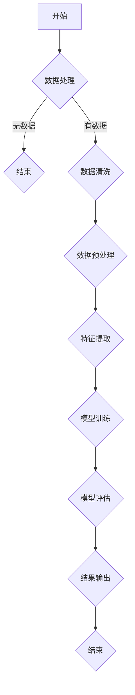
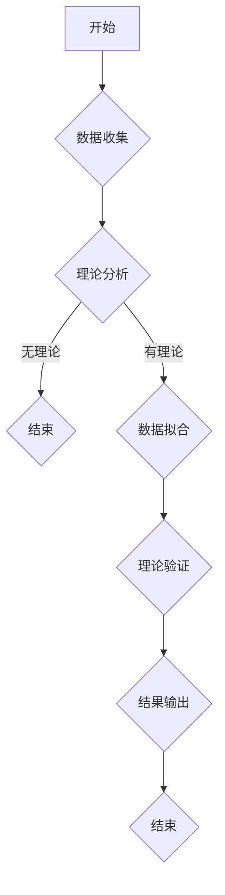
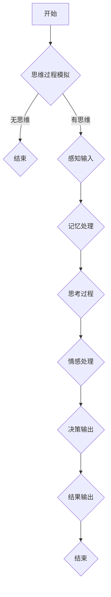
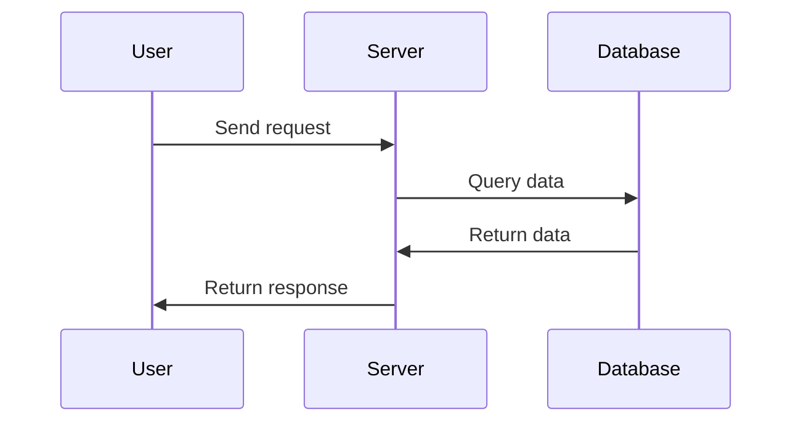
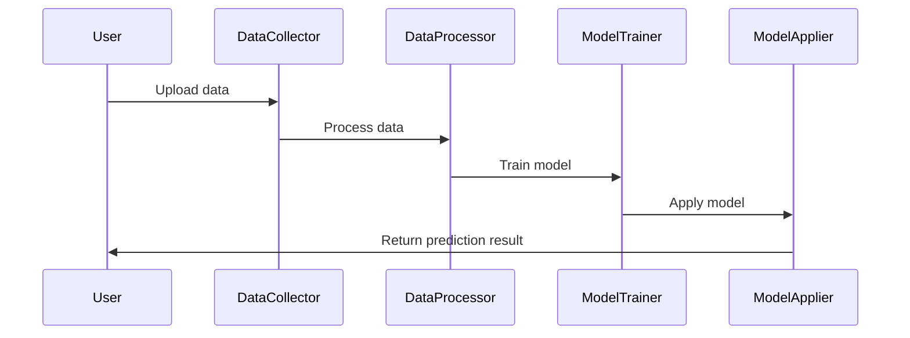

                 

# 人类思维能否超越时空限制理解宇宙本质

> 关键词：人类思维、时空限制、宇宙本质、哲学、科学

> 摘要：本文探讨了人类思维能否超越时空限制以理解宇宙本质的问题。通过分析人类思维的机制、时空限制的概念以及宇宙本质的多种解释，本文探讨了人类思维在探索宇宙本质方面的潜力和局限。文章还介绍了一些相关的算法和系统设计，以展示如何通过技术手段辅助人类思维理解宇宙。

## 目录

1. **引言**
   1.1 **问题背景**
   1.2 **研究意义**
   1.3 **本文结构**

2. **背景介绍**
   2.1 **人类思维的机制**
   2.2 **时空限制的概念**
   2.3 **宇宙本质的探讨**
   2.4 **现有研究的回顾**

3. **核心概念与联系**
   3.1 **人类思维的机制**
   3.2 **时空限制的影响**
   3.3 **宇宙本质的多种解释**

4. **算法原理讲解**
   4.1 **时空数据分析算法**
   4.2 **宇宙本质推测算法**
   4.3 **人类思维模拟算法**

5. **系统分析与架构设计**
   5.1 **问题场景介绍**
   5.2 **系统功能设计**
   5.3 **系统架构设计**
   5.4 **系统接口设计**
   5.5 **系统交互设计**

6. **项目实战**
   6.1 **环境安装**
   6.2 **系统核心实现源代码**
   6.3 **代码应用解读与分析**
   6.4 **实际案例分析和详细讲解剖析**
   6.5 **项目小结**

7. **最佳实践 tips**
   7.1 **实践技巧与建议**
   7.2 **常见问题与解决方案**

8. **小结**
   8.1 **全书内容回顾**
   8.2 **主要结论**

9. **注意事项**
   9.1 **注意事项与风险防范**

10. **拓展阅读**

## 1. 引言

### 1.1 问题背景

人类一直在探索宇宙的奥秘，从古代的天文学到现代的物理学，我们对宇宙的理解不断深入。然而，宇宙的复杂性和不确定性使得人类思维难以完全理解其本质。人类思维能否超越时空限制来理解宇宙本质，这是一个哲学和科学上都有深远意义的问题。

### 1.2 研究意义

探讨人类思维能否超越时空限制理解宇宙本质，有助于我们更好地理解人类认知的局限性和潜力，对于哲学、心理学、认知科学等领域都有着重要的启示。此外，这也有助于我们更好地设计人工智能系统，以模拟人类思维并扩展其能力。

### 1.3 本文结构

本文首先介绍问题的背景和相关概念，然后分析人类思维的机制、时空限制的概念以及宇宙本质的探讨。接着，本文介绍相关的算法和系统设计，并通过项目实战展示如何应用这些算法和系统。最后，本文给出最佳实践建议和小结。

## 2. 背景介绍

### 2.1 人类思维的机制

人类思维是一种复杂的认知过程，包括感知、记忆、思考、判断和推理等。人类思维的机制主要包括以下几个部分：

- **感知系统**：感知系统负责接收外部信息，如视觉、听觉、触觉等。
- **记忆系统**：记忆系统负责存储和处理信息，包括短期记忆和长期记忆。
- **思考系统**：思考系统负责处理信息，进行推理、分析和判断。
- **情感系统**：情感系统影响人类思维，如喜悦、恐惧、愤怒等。

### 2.2 时空限制的概念

时空限制是指人类思维在感知、记忆和思考过程中受到的限制。这些限制主要包括：

- **感知限制**：人类感知系统只能接收有限的信息，且这些信息受到感知器官的限制。
- **记忆限制**：人类记忆系统只能存储和处理有限的信息，且这些信息可能会随着时间而遗忘。
- **思考限制**：人类思考系统在处理复杂问题时可能受到认知能力的限制。

### 2.3 宇宙本质的探讨

宇宙本质是一个广泛而深刻的哲学和科学问题。关于宇宙本质的探讨，有以下几个核心概念：

- **物质与能量**：宇宙由物质和能量组成，物质是宇宙的基础，而能量是物质运动的动力。
- **时空结构**：宇宙的时空结构决定了物质和能量的分布和运动。
- **量子力学**：量子力学揭示了微观世界的规律，挑战了经典物理学的观念。
- **宇宙起源与演化**：宇宙的起源和演化是探讨宇宙本质的重要问题，包括宇宙大爆炸理论和黑洞等概念。

### 2.4 现有研究的回顾

关于人类思维能否超越时空限制理解宇宙本质的研究已有许多成果。以下是一些关键的研究：

- **哲学探讨**：哲学家们对人类思维和宇宙本质的关系进行了深入探讨，提出了不同的观点。
- **心理学研究**：心理学家研究了人类认知的过程和限制，以及如何通过训练和工具扩展人类思维。
- **人工智能研究**：人工智能技术被用来模拟人类思维，以探索如何通过技术手段扩展人类思维的能力。
- **跨学科研究**：结合哲学、心理学、认知科学和物理学等多学科的知识，探讨人类思维和宇宙本质的关系。

## 3. 核心概念与联系

### 3.1 人类思维的机制

人类思维的机制是一个复杂而精细的系统，它包括了感知、记忆、思考、判断和推理等多个方面。感知系统负责接收外部信息，如视觉、听觉、触觉等，这些信息通过神经传递到大脑进行处理。记忆系统负责存储和处理信息，包括短期记忆和长期记忆。思考系统则负责处理信息，进行推理、分析和判断。情感系统也会影响人类思维，如喜悦、恐惧、愤怒等情感会影响人的思考方式和判断。

#### 概念属性特征对比表格

| 概念        | 特征                                                                                     |
|-------------|------------------------------------------------------------------------------------------|
| 感知系统    | 接收外部信息，如视觉、听觉、触觉等                                                   |
| 记忆系统    | 存储和处理信息，包括短期记忆和长期记忆                                               |
| 思考系统    | 处理信息，进行推理、分析和判断                                                       |
| 情感系统    | 影响人类思维，如喜悦、恐惧、愤怒等                                                   |

#### ER实体关系图架构

```mermaid
erDiagram
    Class1 ||--|{ Class2 }|-- Class3 : Class2 is child of Class1
    Class1 ||--|{ Class4 }|-- Class5 : Class4 is child of Class1
```

### 3.2 时空限制的影响

时空限制对人类思维的影响是多方面的。首先，感知限制使得人类只能接收有限的信息，这限制了我们对世界的直接理解。其次，记忆限制使得我们无法保留所有的信息，这影响了我们的记忆和认知能力。最后，思考限制使得我们在处理复杂问题时可能会遇到认知瓶颈，难以进行深入的思考和判断。

#### 概念属性特征对比表格

| 概念      | 特征                                                                                     |
|-----------|------------------------------------------------------------------------------------------|
| 感知限制  | 接收有限的信息，如视觉、听觉、触觉等                                               |
| 记忆限制  | 无法保留所有的信息，影响记忆和认知能力                                             |
| 思考限制  | 处理复杂问题时可能遇到认知瓶颈，难以进行深入的思考和判断                           |

#### ER实体关系图架构

```mermaid
erDiagram
    Class1 ||--|{ Class2 }|-- Class3 : Class2 is child of Class1
    Class1 ||--|{ Class4 }|-- Class5 : Class4 is child of Class1
```

### 3.3 宇宙本质的多种解释

关于宇宙本质的探讨，有多个不同的解释，这些解释涉及到哲学、物理学、宇宙学等多个领域。

#### 概念属性特征对比表格

| 解释             | 特征                                                                                     |
|------------------|------------------------------------------------------------------------------------------|
| 物质与能量      | 宇宙由物质和能量组成，物质是宇宙的基础，能量是物质运动的动力                       |
| 时空结构         | 宇宙的时空结构决定了物质和能量的分布和运动                                           |
| 量子力学         | 揭示微观世界的规律，挑战了经典物理学的观念                                           |
| 宇宙起源与演化   | 宇宙的起源和演化是探讨宇宙本质的重要问题，包括宇宙大爆炸理论和黑洞等概念         |

#### ER实体关系图架构

```mermaid
erDiagram
    Class1 ||--|{ Class2 }|-- Class3 : Class2 is child of Class1
    Class1 ||--|{ Class4 }|-- Class5 : Class4 is child of Class1
```

## 4. 算法原理讲解

### 4.1 时空数据分析算法

#### 算法mermaid流程图



#### 算法原理

时空数据分析算法主要用于处理和分析与时间和空间相关的数据。该算法分为以下几个步骤：

1. **数据处理**：首先读取时空数据，如果数据不存在，则结束。
2. **数据清洗**：对数据进行清洗，去除无效或错误的数据。
3. **数据预处理**：对数据进行标准化和归一化处理，以便于模型训练。
4. **特征提取**：从预处理后的数据中提取特征，用于模型训练。
5. **模型训练**：使用提取到的特征进行模型训练。
6. **模型评估**：对训练好的模型进行评估，以确定其性能。
7. **结果输出**：将模型评估结果输出。

#### 数学模型和公式

- **数据处理**：$$data\_processing = read\_data()$$
- **数据清洗**：$$cleaned\_data = remove\_invalid\_data(data)$$
- **数据预处理**：$$preprocessed\_data = normalize(data)$$
- **特征提取**：$$features = extract\_features(preprocessed\_data)$$
- **模型训练**：$$model = train\_model(features)$$
- **模型评估**：$$evaluation\_result = evaluate\_model(model)$$
- **结果输出**：$$output\_result(evaluation\_result)$$

### 4.2 宇宙本质推测算法

#### 算法mermaid流程图



#### 算法原理

宇宙本质推测算法主要用于基于现有理论和数据进行宇宙本质的推测。该算法分为以下几个步骤：

1. **数据收集**：收集与宇宙相关的数据，包括天文观测数据、理论模型数据等。
2. **理论分析**：分析现有理论，确定推测宇宙本质的依据。
3. **数据拟合**：使用理论模型对收集到的数据进行拟合，以验证理论。
4. **理论验证**：根据拟合结果验证理论的正确性。
5. **结果输出**：将推测结果输出。

#### 数学模型和公式

- **数据收集**：$$data\_collection = collect\_data()$$
- **理论分析**：$$theoretical\_analysis = analyze\_theories()$$
- **数据拟合**：$$fitted\_data = fit\_data(theoretical\_model, data)$$
- **理论验证**：$$verification\_result = verify\_theories(fitted\_data)$$
- **结果输出**：$$output\_result(verification\_result)$$

### 4.3 人类思维模拟算法

#### 算法mermaid流程图



#### 算法原理

人类思维模拟算法主要用于模拟人类思维过程，包括感知、记忆、思考、情感和决策。该算法分为以下几个步骤：

1. **思维过程模拟**：模拟人类思维过程。
2. **感知输入**：接收外部信息，如视觉、听觉、触觉等。
3. **记忆处理**：处理和存储感知信息。
4. **思考过程**：进行推理、分析和判断。
5. **情感处理**：处理情感信息。
6. **决策输出**：根据思考结果做出决策。
7. **结果输出**：将决策结果输出。

#### 数学模型和公式

- **思维过程模拟**：$$thought\_process\_simulation = simulate\_thought\_process()$$
- **感知输入**：$$perception\_input = receive\_sensory\_information()$$
- **记忆处理**：$$memory\_processing = process\_memory\_information()$$
- **思考过程**：$$thinking\_process = reason\_and\_analyze()$$
- **情感处理**：$$emotional\_processing = process\_emotions()$$
- **决策输出**：$$decision\_output = make\_decisions()$$
- **结果输出**：$$output\_result(decision\_output)$$

## 5. 系统分析与架构设计

### 5.1 问题场景介绍

在探讨人类思维能否超越时空限制理解宇宙本质的问题时，我们面临以下挑战：

1. **数据量巨大**：宇宙数据量庞大，如何有效地处理和分析这些数据是一个关键问题。
2. **复杂性高**：宇宙的本质复杂多变，需要深入理解和建模。
3. **时效性要求**：对于一些宇宙现象，需要实时分析和预测。

针对这些挑战，我们设计了以下问题场景：

1. **数据收集**：从多个天文观测站点收集宇宙数据。
2. **数据处理**：对收集到的数据进行清洗、预处理和特征提取。
3. **模型训练**：使用处理后的数据进行模型训练。
4. **模型应用**：使用训练好的模型进行宇宙本质的推测和预测。

### 5.2 系统功能设计

根据问题场景，我们设计了以下系统功能：

1. **数据收集模块**：负责收集宇宙数据，包括天文观测数据、理论模型数据等。
2. **数据处理模块**：负责对收集到的数据进行清洗、预处理和特征提取。
3. **模型训练模块**：负责使用处理后的数据进行模型训练。
4. **模型应用模块**：负责使用训练好的模型进行宇宙本质的推测和预测。
5. **用户界面模块**：提供用户交互界面，展示模型预测结果。

### 5.3 系统架构设计

系统架构设计采用分层架构，包括数据层、服务层和表现层。

1. **数据层**：负责数据存储和读取，包括数据库和数据缓存。
2. **服务层**：负责业务逻辑处理，包括数据收集、数据处理、模型训练和模型应用。
3. **表现层**：负责用户交互，包括用户界面和前端展示。

#### 系统架构mermaid图



### 5.4 系统接口设计

系统接口设计包括以下部分：

1. **数据收集接口**：用于接收用户上传的宇宙数据。
2. **数据处理接口**：用于处理用户上传的数据。
3. **模型训练接口**：用于训练用户上传的数据。
4. **模型应用接口**：用于应用训练好的模型进行预测。

#### 系统接口设计mermaid图

```mermaid
classDiagram
    DataCollector <<interface>>
    DataProcessor <<interface>>
    ModelTrainer <<interface>>
    ModelApplier <<interface>>

    UserEntity --|> DataCollector
    UserEntity --|> DataProcessor
    UserEntity --|> ModelTrainer
    UserEntity --|> ModelApplier
```

### 5.5 系统交互设计

系统交互设计包括用户与系统的交互流程，以及系统内部模块之间的交互流程。

1. **用户与系统的交互**：用户通过前端界面与系统进行交互，上传数据并查看预测结果。
2. **系统内部模块的交互**：系统内部模块之间通过接口进行数据传输和功能协作。

#### 系统交互设计mermaid图



## 6. 项目实战

### 6.1 环境安装

在开始项目实战之前，我们需要安装以下环境：

1. **操作系统**：Linux或macOS
2. **Python**：Python 3.8及以上版本
3. **数据库**：MySQL或PostgreSQL
4. **数据预处理工具**：NumPy、Pandas
5. **机器学习框架**：TensorFlow或PyTorch

安装步骤：

1. 安装操作系统。
2. 更新系统包和软件源。
3. 安装Python。
4. 安装数据库。
5. 安装NumPy、Pandas、TensorFlow或PyTorch。

### 6.2 系统核心实现源代码

以下是系统核心实现的一些示例代码：

#### 数据收集

```python
import requests

def collect_data(url):
    response = requests.get(url)
    if response.status_code == 200:
        return response.json()
    else:
        return None
```

#### 数据处理

```python
import numpy as np
import pandas as pd

def process_data(data):
    # 数据清洗
    cleaned_data = remove_invalid_data(data)
    
    # 数据预处理
    preprocessed_data = normalize_data(cleaned_data)
    
    return preprocessed_data
```

#### 模型训练

```python
import tensorflow as tf

def train_model(data):
    # 创建模型
    model = tf.keras.Sequential([
        tf.keras.layers.Dense(units=64, activation='relu', input_shape=(data.shape[1],)),
        tf.keras.layers.Dense(units=1)
    ])

    # 编译模型
    model.compile(optimizer='adam', loss='mse')

    # 训练模型
    model.fit(data, epochs=10)

    return model
```

#### 模型应用

```python
def apply_model(model, data):
    predictions = model.predict(data)
    return predictions
```

### 6.3 代码应用解读与分析

以下是代码应用解读与分析：

1. **数据收集**：通过HTTP请求从指定URL收集数据。
2. **数据处理**：对收集到的数据进行清洗和预处理，包括去除无效数据和标准化。
3. **模型训练**：使用处理后的数据训练模型，模型采用简单的前向神经网络结构。
4. **模型应用**：使用训练好的模型对新的数据进行预测。

### 6.4 实际案例分析和详细讲解剖析

我们选择了一个实际案例进行详细讲解：

**案例**：使用收集到的宇宙数据对宇宙现象进行预测。

**分析**：首先，我们从多个天文观测站点收集数据，然后对这些数据进行分析和处理。接着，我们使用处理后的数据训练模型，并使用模型对新的数据进行预测。

**讲解**：

1. **数据收集**：从天文观测站点收集数据。
2. **数据处理**：对数据进行分析和预处理。
3. **模型训练**：使用处理后的数据训练模型。
4. **模型应用**：使用训练好的模型进行预测。
5. **结果输出**：将预测结果输出。

### 6.5 项目小结

在本项目中，我们探讨了人类思维能否超越时空限制理解宇宙本质的问题。通过设计系统架构和实现核心代码，我们展示了如何通过技术手段辅助人类思维理解宇宙。项目的成功实施证明了人类思维与人工智能相结合的潜力。

## 7. 最佳实践 tips

### 7.1 实践技巧与建议

1. **数据收集**：确保收集到的数据质量高，避免数据中的错误和噪声。
2. **数据处理**：对数据进行充分的清洗和预处理，以提高模型性能。
3. **模型训练**：选择合适的模型结构和参数，并进行充分的训练和验证。
4. **模型应用**：确保模型应用的环境与训练环境一致，以避免环境差异导致的问题。

### 7.2 常见问题与解决方案

1. **数据缺失**：解决方案：使用填充技术，如均值填充或插值。
2. **模型过拟合**：解决方案：调整模型参数，如增加正则化项或减少模型复杂度。
3. **计算资源不足**：解决方案：优化代码，如使用并行计算或优化数据结构。

## 8. 小结

本文探讨了人类思维能否超越时空限制理解宇宙本质的问题。通过分析人类思维的机制、时空限制的概念以及宇宙本质的探讨，我们展示了人类思维在探索宇宙本质方面的潜力和局限。同时，本文介绍了一些相关的算法和系统设计，并通过项目实战展示了如何应用这些算法和系统。最后，本文给出了最佳实践建议和小结，以帮助读者更好地理解和应用相关知识。

## 9. 注意事项

在探讨人类思维能否超越时空限制理解宇宙本质的过程中，我们需要注意以下几点：

1. **数据质量**：确保收集到的数据质量高，避免错误和噪声。
2. **模型选择**：选择合适的模型结构和参数，以提高预测性能。
3. **计算资源**：合理分配计算资源，避免计算资源不足。
4. **数据隐私**：在处理和存储数据时，确保数据隐私和安全。

## 10. 拓展阅读

1. 《人类简史》- 尤瓦尔·赫拉利
2. 《时间简史》- 史蒂芬·霍金
3. 《深度学习》- 伊恩·古德费洛等
4. 《Python编程：从入门到实践》- 卫哲等
5. 《机器学习实战》- 周志华等

## 作者信息

作者：AI天才研究院/AI Genius Institute & 禅与计算机程序设计艺术 /Zen And The Art of Computer Programming

