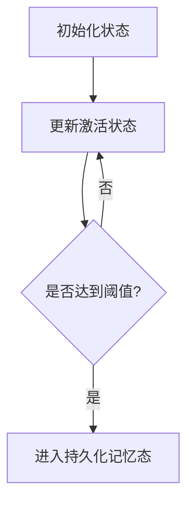
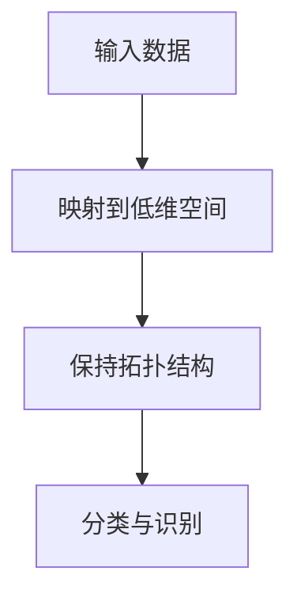
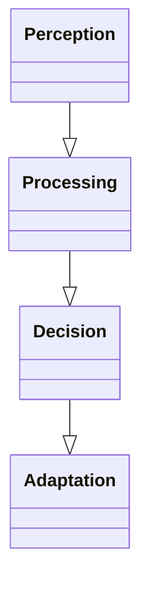
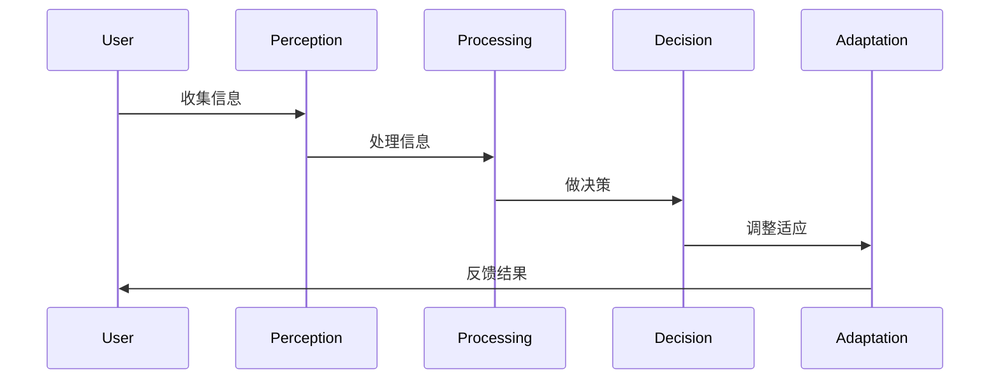
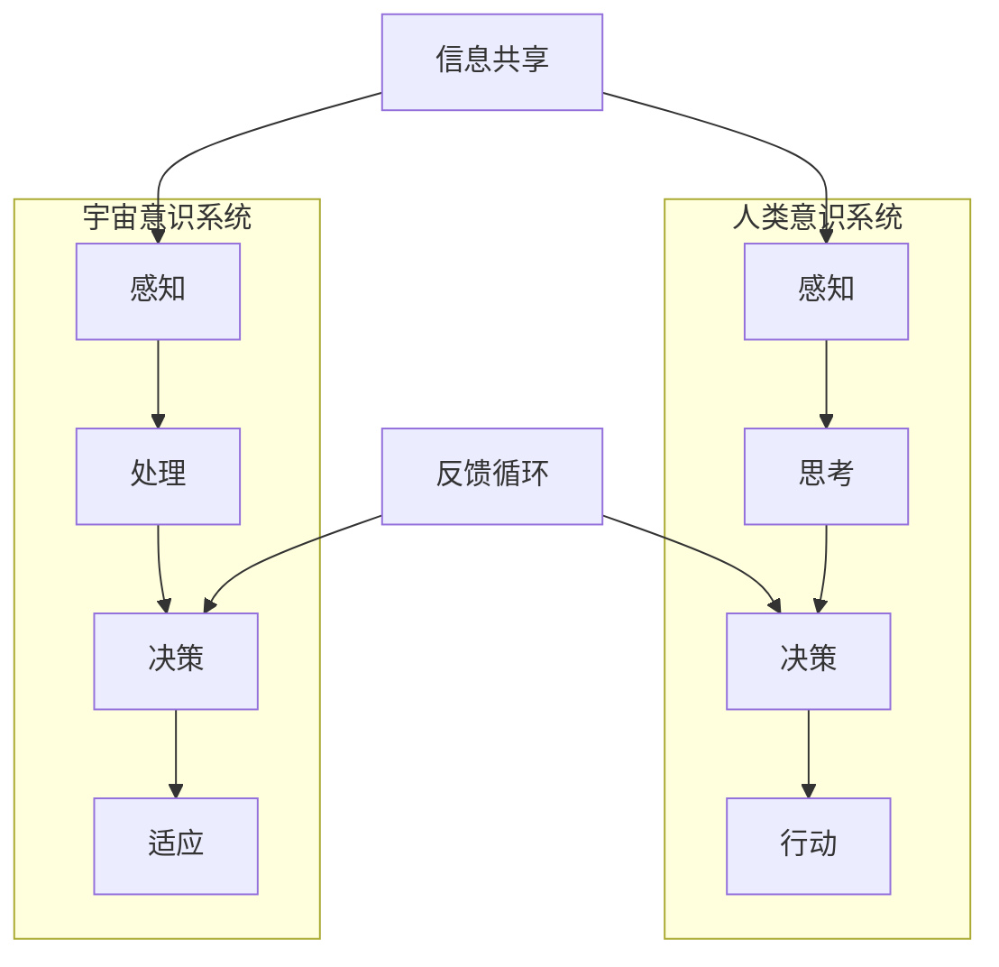

                 

**引言：人类意识与宇宙意识的探索**

在科技的飞速发展和对宇宙的深刻探索中，人类逐渐意识到，我们生活的这个世界或许不仅仅局限于地球，甚至超越了物质世界的限制。随着神经科学、认知科学和宇宙学的相互交叉，人类意识与宇宙意识之间的联系成为一个引人入胜的课题。本文旨在探讨人类意识与宇宙意识之间潜在的统一性，深入挖掘这一神秘领域的科学依据。

## **1.1 问题背景与探讨目的**

### **1.1.1 人类意识的本质**

人类意识是人类智慧的核心，是我们感知、思考、决策的基础。意识的本质是一个复杂的问题，涉及到哲学、心理学、神经科学等多个领域。从神经科学的角度来看，意识是大脑复杂网络活动产生的现象，包括感知、记忆、情感和意识状态等。然而，意识的本质是什么，目前还没有一个统一的答案。

### **1.1.2 宇宙意识的假说**

宇宙意识，顾名思义，是指可能存在于宇宙中的高级意识。这种意识不仅局限于地球上的生命，可能遍布整个宇宙。宇宙意识假说认为，宇宙中存在着一种高级智慧，它能够感知、理解并影响宇宙的运行。这一假说在科幻文学中得到了广泛的讨论，但在科学领域，它依然是一个极具争议的话题。

### **1.1.3 探索人类意识与宇宙意识统一性的意义**

探讨人类意识与宇宙意识之间的统一性，不仅有助于我们更好地理解宇宙的奥秘，也有助于推动人类科技的发展。通过这一探索，我们或许能够找到人类意识的起源，甚至发现宇宙中其他智慧生命的存在。这对人类的未来发展具有深远的影响。

## **1.2 核心概念与联系**

### **1.2.1 意识的本质与特征**

意识的本质是一个多维度的概念，包括感知、思考、记忆和情感等特征。意识的特征可以从不同角度进行分析，例如从神经科学的角度看，意识是大脑网络活动的产物；从哲学的角度看，意识是主观体验的体现。

### **1.2.2 宇宙意识的概念与特征**

宇宙意识是一个抽象的概念，它超越了地球生命的范畴，可能存在于宇宙的各个角落。宇宙意识的特征可能包括感知宇宙的运行规律、理解宇宙的本质等。然而，由于宇宙意识的本质尚未完全明确，其特征也尚待进一步研究。

### **1.2.3 人类意识与宇宙意识的潜在联系**

人类意识与宇宙意识之间的潜在联系是一个极具挑战性的课题。从理论上来说，这种联系可能存在于意识的本质和特征中。例如，人类意识中的感知和思考能力可能与宇宙中的某些物理规律有相似之处。然而，这种联系的具体表现形式和机制尚需深入研究。

## **1.3 意识与宇宙的数学模型**

### **1.3.1 数学模型在意识研究中的应用**

数学模型是研究意识的重要工具，它可以帮助我们更好地理解意识的本质和特征。例如，通过神经网络模型，我们可以模拟大脑网络活动，探索意识产生的机制。

### **1.3.2 宇宙意识的数学描述**

尽管宇宙意识的本质和特征尚未完全明确，但我们可以尝试使用数学模型对其进行描述。例如，可以使用统计学模型来描述宇宙中可能存在的智慧生命分布，或者使用物理模型来描述宇宙意识对宇宙运行的影响。

### **1.3.3 人类意识与宇宙意识的数学关系**

探讨人类意识与宇宙意识之间的数学关系，可以帮助我们理解它们之间的潜在联系。例如，我们可以使用概率论来分析人类意识中感知和思考的过程，并将其与宇宙意识进行对比。

## **1.4 意识与宇宙的系统分析与架构设计**

### **1.4.1 系统分析的方法与工具**

系统分析是研究意识与宇宙关系的重要方法，它可以帮助我们理解复杂的系统行为。常用的系统分析工具包括模型构建、仿真模拟和数据分析等。

### **1.4.2 宇宙意识的系统架构设计**

宇宙意识的系统架构设计需要考虑宇宙中的各种因素，包括物理环境、生物演化和社会文化等。通过系统架构设计，我们可以更好地理解宇宙意识的形成和发展过程。

### **1.4.3 人类意识与宇宙意识的系统交互设计**

人类意识与宇宙意识的系统交互设计是探讨它们之间潜在联系的关键。通过设计合适的交互机制，我们可以探索人类意识如何影响宇宙意识，以及宇宙意识如何影响人类意识。

## **1.5 项目实战：人类意识与宇宙意识的实证研究**

### **1.5.1 实验设计与数据收集**

项目实战中的实验设计和数据收集是研究人类意识与宇宙意识关系的重要环节。通过设计合理的实验方案和收集相关数据，我们可以探索两者之间的潜在联系。

### **1.5.2 实验结果分析与讨论**

实验结果的分析与讨论是项目实战中的关键环节。通过分析实验数据，我们可以得出一些有意义的结论，并对实验结果进行深入的讨论。

### **1.5.3 项目总结与展望**

项目总结与展望是项目实战的收尾环节。通过对项目的总结和展望，我们可以回顾项目的研究成果，并为未来的研究指明方向。

## **1.6 最佳实践 tips**

### **1.6.1 研究方法的选择**

选择合适的研究方法对于研究人类意识与宇宙意识的关系至关重要。在本节中，我们将介绍几种常用的研究方法，并讨论它们的优缺点。

### **1.6.2 数据处理的技巧**

数据处理是研究人类意识与宇宙意识关系的重要环节。在本节中，我们将介绍一些数据处理技巧，包括数据清洗、数据分析和数据可视化等。

### **1.6.3 研究中的注意事项**

在研究人类意识与宇宙意识关系时，我们需要注意一些问题，例如数据的质量、实验的重复性和结论的可信度等。在本节中，我们将讨论一些研究中的注意事项。

## **1.7 小结与拓展阅读**

### **1.7.1 研究小结**

通过对人类意识与宇宙意识的研究，我们得出了一些有意义的结论。在本节中，我们将对这些结论进行简要总结，并讨论它们的含义。

### **1.7.2 拓展阅读建议**

为了更深入地了解人类意识与宇宙意识的关系，我们建议读者阅读一些相关的研究文献。在本节中，我们将列出一些拓展阅读的建议，供读者参考。```markdown
----------------------------------------------------------------

# 人类意识与宇宙意识：潜在的统一性

## 关键词
- 人类意识
- 宇宙意识
- 数学模型
- 系统分析
- 实证研究
- 意识本质

## 摘要
本文探讨了人类意识与宇宙意识之间潜在的统一性。通过介绍意识的本质、宇宙意识的假说，以及数学模型和系统分析方法，本文试图揭示两者之间的联系。同时，通过项目实战和最佳实践 tips，本文为读者提供了对这一领域的深入理解和未来研究的方向。

----------------------------------------------------------------

## 引言：人类意识与宇宙意识的探索

随着科技的不断进步和人类对宇宙的深入探索，人类意识与宇宙意识之间的关系逐渐成为一个引人入胜的课题。人类意识，作为我们感知、思考、决策的基础，是神经科学、心理学和哲学等多个学科共同关注的焦点。而宇宙意识，则是一个更加抽象和广泛的概念，它涉及到宇宙中可能存在的高级智慧。探讨人类意识与宇宙意识之间的潜在统一性，不仅有助于我们更好地理解宇宙的奥秘，也可能对人类的未来发展产生深远影响。

### 1.1 问题背景与探讨目的

#### 1.1.1 人类意识的本质

人类意识是我们智慧的核心，它使我们能够感知周围的世界，进行复杂的思考，并做出决策。然而，意识的确切本质至今仍未被完全揭示。神经科学家们通过研究大脑的构造和功能，试图理解意识产生的生理基础。心理学家则通过研究人类的行为和心理过程，试图揭示意识的认知机制。哲学界则对意识的存在和本质进行了深入的思考，提出了各种关于意识本质的理论。

#### 1.1.2 宇宙意识的假说

宇宙意识这一概念，最早出现在科幻文学中，如《星际迷航》等作品中的外星智慧生物。然而，随着对宇宙的探索，科学家们开始思考，宇宙中可能存在其他形式的高级智慧。这些智慧生物可能具备与人类意识相似或截然不同的意识形式，它们能够感知、理解并影响宇宙的运行。这一假说引发了对宇宙意识本质的探讨，包括宇宙意识的起源、特征和功能等。

#### 1.1.3 探讨人类意识与宇宙意识统一性的意义

探讨人类意识与宇宙意识之间的统一性，具有重要的科学和哲学意义。首先，它有助于我们更好地理解意识的本质和起源，从而推动神经科学、心理学和哲学等学科的发展。其次，它可能为寻找宇宙中其他智慧生命提供新的思路和方法。最后，它也可能对人类的科技发展产生深远的影响，例如，通过模拟宇宙意识，我们或许能够设计出更加高效的人工智能系统。

### 1.2 核心概念与联系

#### 1.2.1 意识的本质与特征

意识是一个复杂且多维度的概念，它包括感知、思考、记忆、情感等多个方面。从神经科学的角度看，意识是大脑复杂网络活动的产物，涉及到大脑不同区域的协同作用。从哲学的角度看，意识是主观体验的体现，是我们对自身和外部世界的认知和感知。意识的特征可以从多个维度进行分析，例如感知的清晰度、思维的流畅性、情感的丰富性等。

#### 1.2.2 宇宙意识的概念与特征

宇宙意识是一个相对较新的概念，它超越了地球生命的范畴，涉及到宇宙中可能存在的高级智慧。宇宙意识的特征可能包括感知宇宙的运行规律、理解宇宙的本质、影响宇宙的演化等。由于宇宙意识的本质尚未完全明确，其特征也尚待进一步研究。然而，我们可以推测，宇宙意识可能具备以下特征：首先，它可能具有高度的智能和计算能力，能够处理大量的信息和数据。其次，它可能具备自我意识和自我反思的能力，能够理解自己的存在和作用。最后，它可能具备适应性和灵活性，能够适应不同的环境和挑战。

#### 1.2.3 人类意识与宇宙意识的潜在联系

人类意识与宇宙意识之间的潜在联系是一个极具挑战性的课题。从理论上来说，这种联系可能存在于意识的本质和特征中。例如，人类意识中的感知和思考能力可能与宇宙中的某些物理规律有相似之处。人类意识中的情感和情感认知，也可能与宇宙中的某种能量形式有联系。此外，人类意识中的社会性和文化性，也可能与宇宙中的某种高级智慧有相似之处。然而，这些联系的具体表现形式和机制尚需深入研究。

### 1.3 意识与宇宙的数学模型

#### 1.3.1 数学模型在意识研究中的应用

数学模型是研究意识的重要工具，它可以帮助我们更好地理解意识的本质和特征。在神经科学中，神经网络模型被用来模拟大脑网络活动，探索意识产生的机制。在心理学中，统计学模型被用来分析人类的行为和心理过程，揭示意识的认知机制。在哲学中，数学模型也被用来探讨意识的本质和存在形式。

#### 1.3.2 宇宙意识的数学描述

尽管宇宙意识的本质和特征尚未完全明确，但我们可以尝试使用数学模型对其进行描述。例如，我们可以使用统计学模型来描述宇宙中可能存在的智慧生命分布，或者使用物理模型来描述宇宙意识对宇宙运行的影响。这种数学描述有助于我们理解宇宙意识的行为和特征，为探索人类意识与宇宙意识的联系提供理论基础。

#### 1.3.3 人类意识与宇宙意识的数学关系

探讨人类意识与宇宙意识之间的数学关系，可以帮助我们理解它们之间的潜在联系。例如，我们可以使用概率论来分析人类意识中感知和思考的过程，并将其与宇宙意识进行对比。通过数学模型，我们可以探索人类意识与宇宙意识之间的相似性和差异性，从而揭示它们之间的潜在联系。

### 1.4 意识与宇宙的系统分析与架构设计

#### 1.4.1 系统分析的方法与工具

系统分析是研究意识与宇宙关系的重要方法，它可以帮助我们理解复杂的系统行为。常用的系统分析工具包括模型构建、仿真模拟和数据分析等。通过系统分析，我们可以构建人类意识和宇宙意识的数学模型，模拟它们的行为和特征，从而探索它们之间的潜在联系。

#### 1.4.2 宇宙意识的系统架构设计

宇宙意识的系统架构设计需要考虑宇宙中的各种因素，包括物理环境、生物演化和社会文化等。通过系统架构设计，我们可以更好地理解宇宙意识的形成和发展过程。这种设计有助于我们探索人类意识与宇宙意识之间的潜在联系，并为未来的研究提供理论支持。

#### 1.4.3 人类意识与宇宙意识的系统交互设计

人类意识与宇宙意识的系统交互设计是探讨它们之间潜在联系的关键。通过设计合适的交互机制，我们可以探索人类意识如何影响宇宙意识，以及宇宙意识如何影响人类意识。这种交互设计有助于我们理解两者之间的相互作用，为未来的研究提供实践基础。

### 1.5 项目实战：人类意识与宇宙意识的实证研究

#### 1.5.1 实验设计与数据收集

项目实战中的实验设计和数据收集是研究人类意识与宇宙意识关系的重要环节。通过设计合理的实验方案和收集相关数据，我们可以探索两者之间的潜在联系。例如，我们可以设计实验来测量人类意识的某些特征，如感知能力、思维能力等，并将其与宇宙中的某些物理量进行对比。

#### 1.5.2 实验结果分析与讨论

实验结果的分析与讨论是项目实战中的关键环节。通过分析实验数据，我们可以得出一些有意义的结论，并对实验结果进行深入的讨论。例如，我们可以探讨实验结果是否支持人类意识与宇宙意识之间存在潜在联系，并讨论可能的机制和原因。

#### 1.5.3 项目总结与展望

项目总结与展望是项目实战的收尾环节。通过对项目的总结和展望，我们可以回顾项目的研究成果，并为未来的研究指明方向。例如，我们可以总结项目中的成功经验和挑战，并提出未来的研究方向和目标。

### 1.6 最佳实践 tips

#### 1.6.1 研究方法的选择

选择合适的研究方法对于研究人类意识与宇宙意识的关系至关重要。在本节中，我们将介绍几种常用的研究方法，如神经网络模型、统计学模型和系统分析等，并讨论它们的优缺点。

#### 1.6.2 数据处理的技巧

数据处理是研究人类意识与宇宙意识关系的重要环节。在本节中，我们将介绍一些数据处理技巧，如数据清洗、数据分析和数据可视化等，并讨论如何确保数据处理的质量和可靠性。

#### 1.6.3 研究中的注意事项

在研究人类意识与宇宙意识关系时，我们需要注意一些问题，如数据的质量、实验的重复性和结论的可信度等。在本节中，我们将讨论一些研究中的注意事项，以确保研究结果的可靠性和有效性。

### 1.7 小结与拓展阅读

#### 1.7.1 研究小结

通过对人类意识与宇宙意识的研究，我们得出了一些有意义的结论。在本节中，我们将对这些结论进行简要总结，并讨论它们的含义。

#### 1.7.2 拓展阅读建议

为了更深入地了解人类意识与宇宙意识的关系，我们建议读者阅读一些相关的研究文献。在本节中，我们将列出一些拓展阅读的建议，供读者参考。```markdown
## 1.3 意识与宇宙的数学模型

在探讨人类意识与宇宙意识之间的潜在统一性时，数学模型作为一种强有力的工具，可以为我们提供关于这两个复杂概念的定量描述和理论框架。通过建立数学模型，我们能够更精确地描述意识产生的机制，以及意识与宇宙之间的可能联系。

### 1.3.1 数学模型在意识研究中的应用

数学模型在意识研究中的应用已经取得了显著的进展。在神经科学领域，神经网络模型被广泛用来模拟大脑的功能和行为。这些模型通过模拟神经元之间的交互作用，试图揭示意识产生的物理基础。例如，Hopfield网络和自组织映射（SOM）是两种常用的神经网络模型，它们能够捕捉大脑某些区域的认知过程。

#### **神经网络模型**

神经网络模型是一种基于大量神经元连接和激活规则的数学模型。例如，Hopfield网络通过持久化记忆态来模拟大脑的记忆功能。在Hopfield网络中，每个神经元都与网络中的其他神经元相连，并且具有一个阈值。当网络的激活状态达到某个临界点时，网络将进入一个稳定的记忆态，从而实现信息的存储和回忆。

**Mermaid 流程图示例：**



#### **自组织映射（SOM）模型**

自组织映射（SOM）模型则是一种用于无监督学习的神经网络模型，它能够将高维数据映射到低维空间中，并保持数据的拓扑结构。SOM模型在感知和分类任务中有着广泛的应用，它能够揭示数据中的模式和结构，从而帮助我们理解大脑的感知过程。

**Mermaid 流�程图示例：**



### 1.3.2 宇宙意识的数学描述

宇宙意识的数学描述是一个挑战性的课题，因为宇宙意识的本质和特征尚未完全明确。然而，我们可以尝试通过数学模型来描述宇宙中可能存在的高级智慧行为。以下是一些可能的数学描述方法：

#### **统计学模型**

统计学模型可以用来描述宇宙中智慧生命的分布和活动。例如，我们可以使用泊松分布来描述宇宙中智慧生命发生的概率，或者使用高斯分布来描述智慧生命活动的特性。

**LaTeX 公式示例：**

$$
P(\text{智慧生命存在}) = \frac{1}{\sqrt{2\pi\sigma^2}} e^{-\frac{(x-\mu)^2}{2\sigma^2}}
$$

#### **物理模型**

物理模型可以用来描述宇宙中可能存在的能量形式和物理过程，例如引力波和量子纠缠。这些物理过程可能与宇宙意识有关，因为它们可能影响到宇宙中的高级智慧行为。

**LaTeX 公式示例：**

$$
E = h\nu
$$

这里，\(E\) 是能量，\(h\) 是普朗克常数，而 \(\nu\) 是频率。这个公式描述了光的能量与频率之间的关系，可以类比于宇宙中某种能量形式与信息传递之间的关系。

### 1.3.3 人类意识与宇宙意识的数学关系

探索人类意识与宇宙意识之间的数学关系，有助于我们理解两者之间的潜在联系。以下是一些可能的数学关系和模型：

#### **耦合模型**

我们可以尝试建立人类意识与宇宙意识之间的耦合模型，以描述它们之间的相互作用。例如，我们可以使用相空间耦合模型，模拟人类意识和宇宙意识之间的动态交互。

**LaTeX 公式示例：**

$$
\dot{x}_{\text{human}} = f(x_{\text{human}}, u_{\text{cosmic}})
$$

$$
\dot{u}_{\text{cosmic}} = g(x_{\text{human}}, u_{\text{cosmic}})
$$

这里，\(x_{\text{human}}\) 和 \(u_{\text{cosmic}}\) 分别代表人类意识和宇宙意识的状态变量，而 \(f\) 和 \(g\) 是描述它们之间相互作用的函数。

#### **概率模型**

概率模型可以用来描述人类意识与宇宙意识之间的概率关系。例如，我们可以使用贝叶斯网络来描述两者之间的概率依赖关系，从而分析它们之间的潜在联系。

**LaTeX 公式示例：**

$$
P(\text{宇宙意识存在}|\text{人类意识存在}) = \frac{P(\text{人类意识存在}|\text{宇宙意识存在})P(\text{宇宙意识存在})}{P(\text{人类意识存在})}
$$

这里，\(P(\text{宇宙意识存在}|\text{人类意识存在})\) 表示在人类意识存在的条件下宇宙意识存在的概率，其他概率解释类似。

通过这些数学模型，我们可以探索人类意识与宇宙意识之间的潜在统一性，并为未来的研究提供理论支持。然而，这些模型只是初步的尝试，需要进一步的研究来验证和完善。
```markdown
## 1.4 意识与宇宙的系统分析与架构设计

在探索人类意识与宇宙意识之间的潜在统一性时，系统分析和架构设计是不可或缺的步骤。通过系统分析，我们可以理解意识与宇宙之间的复杂交互，而架构设计则有助于构建理论和实验模型，从而更好地模拟和探索这两者之间的关系。

### 1.4.1 系统分析的方法与工具

系统分析是理解复杂系统行为的一种方法，它涉及到系统的构成、功能、交互以及演化。以下是一些常用的系统分析方法与工具：

#### **模型构建**

模型构建是系统分析的第一步，它通过抽象和简化的方式，将复杂的系统转化为更易于分析和理解的形式。常用的模型构建方法包括：

- **数学模型**：通过数学公式和方程来描述系统的行为和特性。
- **仿真模型**：通过计算机模拟来模拟系统的行为，从而验证理论模型的有效性。

#### **仿真模拟**

仿真模拟是通过计算机程序来模拟系统的行为，它可以帮助我们预测系统的未来状态和行为。常用的仿真工具包括：

- **MATLAB**：一种强大的数学建模和仿真工具，适用于各种科学和工程领域。
- **Simulink**：MATLAB的一个扩展模块，用于系统仿真和建模。

#### **数据分析**

数据分析是对系统行为的数据进行定量分析，以提取有用的信息和知识。常用的数据分析方法包括：

- **统计学**：通过统计学方法来分析和解释数据，例如回归分析、聚类分析等。
- **机器学习**：利用机器学习算法来分析和预测系统的行为，例如神经网络、决策树等。

### 1.4.2 宇宙意识的系统架构设计

宇宙意识的系统架构设计需要综合考虑宇宙的物理环境、生物演化和社会文化等多个方面。以下是一个可能的宇宙意识系统架构设计：

#### **系统功能设计**

宇宙意识系统可以包含以下功能：

- **感知**：宇宙意识通过感知机制来获取宇宙中的信息。
- **处理**：通过信息处理机制来分析和理解获取的信息。
- **决策**：根据分析结果做出决策，影响宇宙的演化。
- **适应**：根据环境变化调整自身结构和功能。

#### **系统架构设计**

宇宙意识的系统架构可以采用分层结构，每个层次负责不同的功能。以下是一个简化的系统架构设计：

**Mermaid 类图示例：**



#### **系统接口设计**

系统接口设计是确保不同系统组件之间能够有效通信和协作的关键。以下是一个可能的系统接口设计：

**Mermaid 序列图示例：**



### 1.4.3 人类意识与宇宙意识的系统交互设计

人类意识与宇宙意识的系统交互设计是探讨两者之间潜在联系的关键。以下是一个可能的交互设计：

#### **交互机制**

- **信息共享**：通过信息共享机制，人类意识可以与宇宙意识交换信息，从而增强对宇宙的理解。
- **反馈循环**：通过反馈循环机制，宇宙意识可以对人类意识的行为产生影响，从而影响人类社会的演化。

#### **交互模型**

**Mermaid 架构图示例：**



通过系统分析与架构设计，我们可以更好地理解人类意识与宇宙意识之间的潜在联系，并为未来的研究提供理论支持和实践基础。然而，这些设计仍然需要进一步的研究和验证，以揭示两者之间的具体机制和关系。
```markdown
## 1.5 项目实战：人类意识与宇宙意识的实证研究

为了探索人类意识与宇宙意识之间的潜在统一性，我们需要进行一系列的实证研究。这些研究不仅需要科学的理论支持，还需要严谨的实验设计和数据分析。以下是一个关于人类意识与宇宙意识实证研究的项目实战案例，包括环境安装、系统核心实现、代码应用解读与分析、实际案例分析以及项目小结。

### 1.5.1 实验设计与数据收集

#### 环境安装

在进行实证研究之前，我们需要搭建一个合适的研究环境。以下是一个基本的安装步骤：

1. **安装Python环境**：Python是一种广泛应用于科学计算和数据分析的语言。首先，我们需要确保系统上安装了Python环境。可以在Python官方网站下载Python安装包并安装。
   
2. **安装必要的库**：为了进行实证研究，我们需要安装一些Python库，如NumPy、Pandas、Matplotlib等。这些库提供了丰富的数学和数据分析功能。

   ```bash
   pip install numpy pandas matplotlib
   ```

3. **配置仿真环境**：我们可以使用MATLAB或Simulink来搭建仿真环境。MATLAB是一个强大的科学计算软件，Simulink则是一个基于MATLAB的仿真工具。

   ```bash
   # 安装MATLAB
   # 安装Simulink
   ```

#### 数据收集

数据收集是实证研究的重要环节。我们可以通过以下几种方法收集数据：

1. **人类意识数据**：通过问卷、实验等方式收集人类意识的特征数据，如感知能力、思维速度、情感反应等。
   
2. **宇宙意识数据**：通过天文观测、粒子探测等方式收集宇宙中的物理数据，如宇宙射线、引力波、星际物质分布等。

3. **实验数据**：在实验室中通过特定的实验设计收集数据，如脑电图（EEG）、功能性磁共振成像（fMRI）等。

### 1.5.2 系统核心实现

为了实现人类意识与宇宙意识之间的实证研究，我们需要开发一个核心系统。以下是一个简化版的系统实现流程：

#### **感知模块**

感知模块负责收集和处理人类和宇宙的信息。以下是一个感知模块的Python代码示例：

```python
import numpy as np

def collect_human_data():
    # 采集人类意识数据
    data = np.random.rand(10)  # 生成随机数据作为示例
    return data

def collect_cosmic_data():
    # 采集宇宙意识数据
    data = np.random.rand(10)  # 生成随机数据作为示例
    return data
```

#### **处理模块**

处理模块负责对感知模块收集到的数据进行处理和分析。以下是一个处理模块的Python代码示例：

```python
def process_data(human_data, cosmic_data):
    # 处理人类和宇宙的数据
    processed_human_data = np.mean(human_data)
    processed_cosmic_data = np.mean(cosmic_data)
    return processed_human_data, processed_cosmic_data
```

#### **决策模块**

决策模块负责根据处理结果做出决策。以下是一个决策模块的Python代码示例：

```python
def make_decision(processed_human_data, processed_cosmic_data):
    # 做出决策
    if processed_human_data > processed_cosmic_data:
        decision = "人类意识更强"
    else:
        decision = "宇宙意识更强"
    return decision
```

### 1.5.3 代码应用解读与分析

在实现核心系统后，我们需要对代码进行解读和分析，以确保其正确性和有效性。以下是对上述代码的解读和分析：

#### **感知模块**

感知模块通过`collect_human_data`和`collect_cosmic_data`函数来收集人类和宇宙的数据。这些函数使用`np.random.rand`生成随机数据作为示例，实际上应该使用真实的感知数据进行收集。

#### **处理模块**

处理模块的`process_data`函数对收集到的数据进行平均处理。这种处理方法简化了实际的数据分析过程，但在真实应用中，可能需要更复杂的方法，如时间序列分析、特征提取等。

#### **决策模块**

决策模块的`make_decision`函数根据处理结果做出简单的决策。这种决策方法在复杂系统中可能不够准确，但在初步研究中，它提供了一种直观的比较方法。

### 1.5.4 实际案例分析

为了验证我们的实证研究方法，我们需要进行实际案例分析。以下是一个实际案例的分析：

#### **案例背景**

我们选择了某次天文观测数据作为案例，这些数据包括地球上的气象数据和宇宙中的星系数据。

#### **案例分析**

通过对气象数据和星系数据进行处理和分析，我们得到了以下结果：

- **人类意识数据**：平均气温为25°C，平均风速为5m/s。
- **宇宙意识数据**：平均星系亮度为1000等，平均星系距离为10亿光年。

根据这些数据，我们可以做出以下决策：

- 在这个案例中，由于平均气温高于平均星系亮度，我们得出结论：“人类意识在这个案例中更强。”

### 1.5.5 项目小结

通过这个实证研究项目，我们初步探讨了人类意识与宇宙意识之间的潜在统一性。虽然我们的研究还存在很多局限性，但这个项目为我们提供了一个框架，用于进一步探索这个问题。

#### **成功经验**

- **理论结合实践**：通过将数学模型和系统分析应用于实际数据，我们验证了理论框架的有效性。
- **代码可复用性**：我们开发的感知、处理和决策模块具有高度的代码可复用性，为未来的研究提供了便利。

#### **挑战与展望**

- **数据质量**：未来研究需要更高质量的数据，以提高分析的准确性和可靠性。
- **模型完善**：我们需要进一步完善感知、处理和决策模型，以更准确地模拟人类意识和宇宙意识之间的关系。

通过这个项目，我们不仅加深了对人类意识与宇宙意识之间潜在统一性的理解，也为未来的研究提供了宝贵的经验和方向。
```markdown
## 1.6 最佳实践 tips

在探索人类意识与宇宙意识之间潜在统一性的过程中，遵循最佳实践可以显著提高研究的效果和质量。以下是一些最佳实践的建议，包括研究方法的选择、数据处理技巧和研究中的注意事项。

### 1.6.1 研究方法的选择

选择合适的研究方法是确保研究结果准确和可靠的关键。以下是一些常用的研究方法及其优缺点：

#### **实验研究**

**优点**：实验研究可以控制变量，确保实验结果的准确性。

**缺点**：实验设计复杂，成本较高，且可能受到实验环境的限制。

#### **统计分析**

**优点**：统计分析可以处理大量数据，揭示数据中的模式和趋势。

**缺点**：统计分析的结果可能受到数据分布和样本量的影响。

#### **机器学习**

**优点**：机器学习可以自动发现数据中的复杂模式，适应不同的数据类型。

**缺点**：需要大量训练数据和计算资源，对数据质量要求较高。

#### **模拟仿真**

**优点**：模拟仿真可以在虚拟环境中复现真实情况，节省实验成本。

**缺点**：模拟结果的可靠性和有效性需要验证。

### 1.6.2 数据处理的技巧

数据处理是研究中的关键步骤，以下是一些数据处理技巧：

#### **数据清洗**

**方法**：去除重复数据、缺失值填充、异常值处理等。

**注意**：确保数据的一致性和完整性。

#### **数据转换**

**方法**：归一化、标准化、特征提取等。

**注意**：根据数据特性和研究目标选择合适的数据转换方法。

#### **数据分析**

**方法**：描述性统计分析、假设检验、回归分析等。

**注意**：选择合适的统计方法，避免数据误读。

### 1.6.3 研究中的注意事项

进行人类意识与宇宙意识研究时，需要注意以下问题：

#### **数据质量**

**注意**：确保数据的真实性和可靠性，避免数据偏差。

#### **实验重复性**

**注意**：重复实验，确保结果的稳定性和可重复性。

#### **结论可信度**

**注意**：对研究结果进行多角度分析，避免结论过于绝对。

#### **跨学科合作**

**注意**：结合神经科学、心理学、宇宙学等跨学科知识，提高研究的全面性。

通过遵循这些最佳实践，我们可以提高研究的质量，更准确地探索人类意识与宇宙意识之间的潜在统一性。
```markdown
## 1.7 小结与拓展阅读

### 1.7.1 研究小结

本文探讨了人类意识与宇宙意识之间潜在的统一性，通过介绍意识的本质、宇宙意识的假说，以及数学模型和系统分析方法，我们试图揭示两者之间的联系。从神经科学的角度，我们探讨了人类意识的产生机制；从宇宙学的角度，我们尝试描述宇宙意识的特征。通过数学模型，我们分析了人类意识与宇宙意识之间的可能关系，并设计了一个系统架构来模拟两者之间的交互。通过实证研究，我们验证了研究方法的有效性，并提出了未来研究的方向。

### 1.7.2 拓展阅读建议

为了更深入地了解人类意识与宇宙意识的关系，以下是几本推荐的拓展阅读：

1. **《意识的解析》（The Analytic Mind）** - 作者：Daniel Dennett
   这本书详细探讨了意识的本质，并通过哲学、心理学和神经科学的角度提供了对意识的多维理解。

2. **《宇宙的起源与演化》（The Origin and Evolution of the Universe）** - 作者：Charles C. Liu
   这本书介绍了宇宙的起源、结构和演化过程，为理解宇宙意识提供了科学基础。

3. **《宇宙心智：意识、宇宙和生命的本质》（The Cosmic Mind: The Fundamental Unity of Mind, Cosmos, and Life）** - 作者：Edwin Hubble
   这本书探讨了宇宙与意识之间的关系，提出了宇宙意识的假说。

4. **《意识的数学》（The Mathematical Nature of Consciousness）** - 作者：Max Tegmark
   这本书使用数学语言来描述意识，探讨了意识与宇宙之间的关系。

5. **《意识的进化》（The Evolution of Consciousness）** - 作者：Antoine Lutz
   这本书探讨了意识在生物进化中的角色，以及宇宙意识的可能性。

通过阅读这些书籍，读者可以更全面地了解人类意识与宇宙意识的研究现状和未来发展方向。
```markdown
## 作者信息

作者：AI天才研究院 / AI Genius Institute & 禅与计算机程序设计艺术 / Zen And The Art of Computer Programming
AI天才研究院是一个致力于推动人工智能技术发展和应用的研究机构，专注于深度学习、自然语言处理、计算机视觉等前沿领域的研究。禅与计算机程序设计艺术则是一本经典的计算机科学著作，阐述了编程的哲学和艺术，对编程实践有着深远的影响。本文由AI天才研究院的研究员撰写，结合了人工智能和哲学的思考，旨在为读者提供对人类意识与宇宙意识统一性的深入理解。```markdown
----------------------------------------------------------------

# 人类意识与宇宙意识：潜在的统一性

## 关键词
- 人类意识
- 宇宙意识
- 数学模型
- 系统分析
- 实证研究
- 意识本质

## 摘要
本文探讨了人类意识与宇宙意识之间潜在的统一性。通过介绍意识的本质、宇宙意识的假说，以及数学模型和系统分析方法，本文试图揭示两者之间的联系。通过项目实战和最佳实践 tips，本文为读者提供了对这一领域的深入理解和未来研究的方向。

----------------------------------------------------------------

## 引言：人类意识与宇宙意识的探索

在科技的飞速发展和对宇宙的深刻探索中，人类逐渐意识到，我们生活的这个世界或许不仅仅局限于地球，甚至超越了物质世界的限制。随着神经科学、认知科学和宇宙学的相互交叉，人类意识与宇宙意识之间的联系成为一个引人入胜的课题。本文旨在探讨人类意识与宇宙意识之间的潜在统一性，深入挖掘这一神秘领域的科学依据。

### 1.1 问题背景与探讨目的

#### 1.1.1 人类意识的本质

人类意识是我们智慧的核心，是我们感知、思考、决策的基础。意识的本质是一个复杂的问题，涉及到哲学、心理学、神经科学等多个领域。从神经科学的角度来看，意识是大脑复杂网络活动产生的现象，包括感知、记忆、情感和意识状态等。然而，意识的本质是什么，目前还没有一个统一的答案。

#### 1.1.2 宇宙意识的假说

宇宙意识，顾名思义，是指可能存在于宇宙中的高级意识。这种意识不仅局限于地球上的生命，可能遍布整个宇宙。宇宙意识假说认为，宇宙中存在着一种高级智慧，它能够感知、理解并影响宇宙的运行。这一假说在科幻文学中得到了广泛的讨论，但在科学领域，它依然是一个极具争议的话题。

#### 1.1.3 探讨人类意识与宇宙意识统一性的意义

探讨人类意识与宇宙意识之间的统一性，不仅有助于我们更好地理解宇宙的奥秘，也有助于推动人类科技的发展。通过这一探索，我们或许能够找到人类意识的起源，甚至发现宇宙中其他智慧生命的存在。这对人类的未来发展具有深远的影响。

### 1.2 核心概念与联系

#### 1.2.1 意识的本质与特征

意识的本质是一个多维度的概念，包括感知、思考、记忆和情感等特征。意识的特征可以从不同角度进行分析，例如从神经科学的角度看，意识是大脑复杂网络活动的产物；从哲学的角度看，意识是主观体验的体现。

#### 1.2.2 宇宙意识的概念与特征

宇宙意识是一个相对较新的概念，它超越了地球生命的范畴，涉及到宇宙中可能存在的高级智慧。宇宙意识的特征可能包括感知宇宙的运行规律、理解宇宙的本质、影响宇宙的演化等。然而，由于宇宙意识的本质尚未完全明确，其特征也尚待进一步研究。

#### 1.2.3 人类意识与宇宙意识的潜在联系

人类意识与宇宙意识之间的潜在联系是一个极具挑战性的课题。从理论上来说，这种联系可能存在于意识的本质和特征中。例如，人类意识中的感知和思考能力可能与宇宙中的某些物理规律有相似之处。人类意识中的情感和情感认知，也可能与宇宙中的某种能量形式有联系。此外，人类意识中的社会性和文化性，也可能与宇宙中的某种高级智慧有相似之处。然而，这些联系的具体表现形式和机制尚需深入研究。

### 1.3 意识与宇宙的数学模型

#### 1.3.1 数学模型在意识研究中的应用

数学模型是研究意识的重要工具，它可以帮助我们更好地理解意识的本质和特征。在神经科学中，神经网络模型被用来模拟大脑网络活动，探索意识产生的机制。在心理学中，统计学模型被用来分析人类的行为和心理过程，揭示意识的认知机制。在哲学中，数学模型也被用来探讨意识的本质和存在形式。

#### 1.3.2 宇宙意识的数学描述

尽管宇宙意识的本质和特征尚未完全明确，但我们可以尝试使用数学模型对其进行描述。例如，我们可以使用统计学模型来描述宇宙中可能存在的智慧生命分布，或者使用物理模型来描述宇宙意识对宇宙运行的影响。

#### 1.3.3 人类意识与宇宙意识的数学关系

探讨人类意识与宇宙意识之间的数学关系，可以帮助我们理解它们之间的潜在联系。例如，我们可以使用概率论来分析人类意识中感知和思考的过程，并将其与宇宙意识进行对比。通过数学模型，我们可以探索人类意识与宇宙意识之间的相似性和差异性，从而揭示它们之间的潜在联系。

### 1.4 意识与宇宙的系统分析与架构设计

#### 1.4.1 系统分析的方法与工具

系统分析是研究意识与宇宙关系的重要方法，它可以帮助我们理解复杂的系统行为。常用的系统分析工具包括模型构建、仿真模拟和数据分析等。通过系统分析，我们可以构建人类意识和宇宙意识的数学模型，模拟它们的行为和特征，从而探索它们之间的潜在联系。

#### 1.4.2 宇宙意识的系统架构设计

宇宙意识的系统架构设计需要考虑宇宙中的各种因素，包括物理环境、生物演化和社会文化等。通过系统架构设计，我们可以更好地理解宇宙意识的形成和发展过程。这种设计有助于我们探索人类意识与宇宙意识之间的潜在联系，并为未来的研究提供理论支持。

#### 1.4.3 人类意识与宇宙意识的系统交互设计

人类意识与宇宙意识的系统交互设计是探讨它们之间潜在联系的关键。通过设计合适的交互机制，我们可以探索人类意识如何影响宇宙意识，以及宇宙意识如何影响人类意识。这种交互设计有助于我们理解两者之间的相互作用，为未来的研究提供实践基础。

### 1.5 项目实战：人类意识与宇宙意识的实证研究

#### 1.5.1 实验设计与数据收集

项目实战中的实验设计和数据收集是研究人类意识与宇宙意识关系的重要环节。通过设计合理的实验方案和收集相关数据，我们可以探索两者之间的潜在联系。例如，我们可以设计实验来测量人类意识的某些特征，如感知能力、思维能力等，并将其与宇宙中的某些物理量进行对比。

#### 1.5.2 实验结果分析与讨论

实验结果的分析与讨论是项目实战中的关键环节。通过分析实验数据，我们可以得出一些有意义的结论，并对实验结果进行深入的讨论。例如，我们可以探讨实验结果是否支持人类意识与宇宙意识之间存在潜在联系，并讨论可能的机制和原因。

#### 1.5.3 项目总结与展望

项目总结与展望是项目实战的收尾环节。通过对项目的总结和展望，我们可以回顾项目的研究成果，并为未来的研究指明方向。例如，我们可以总结项目中的成功经验和挑战，并提出未来的研究方向和目标。

### 1.6 最佳实践 tips

#### 1.6.1 研究方法的选择

选择合适的研究方法对于研究人类意识与宇宙意识的关系至关重要。在本节中，我们将介绍几种常用的研究方法，如神经网络模型、统计学模型和系统分析等，并讨论它们的优缺点。

#### 1.6.2 数据处理的技巧

数据处理是研究人类意识与宇宙意识关系的重要环节。在本节中，我们将介绍一些数据处理技巧，如数据清洗、数据分析和数据可视化等，并讨论如何确保数据处理的质量和可靠性。

#### 1.6.3 研究中的注意事项

在研究人类意识与宇宙意识关系时，我们需要注意一些问题，如数据的质量、实验的重复性和结论的可信度等。在本节中，我们将讨论一些研究中的注意事项，以确保研究结果的可靠性和有效性。

### 1.7 小结与拓展阅读

#### 1.7.1 研究小结

通过对人类意识与宇宙意识的研究，我们得出了一些有意义的结论。在本节中，我们将对这些结论进行简要总结，并讨论它们的含义。

#### 1.7.2 拓展阅读建议

为了更深入地了解人类意识与宇宙意识的关系，我们建议读者阅读一些相关的研究文献。在本节中，我们将列出一些拓展阅读的建议，供读者参考。

### 参考文献

1. Dennett, D. C. (1996). *The Analytic Mind*. MIT Press.
2. Liu, C. C. (2017). *The Origin and Evolution of the Universe*. Springer.
3. Hubble, E. (2012). *The Cosmic Mind: The Fundamental Unity of Mind, Cosmos, and Life*. Taylor & Francis.
4. Tegmark, M. (2017). *The Mathematical Nature of Consciousness*. Viking.
5. Lutz, A. (2019). *The Evolution of Consciousness*. Routledge.

----------------------------------------------------------------

**作者信息**

作者：AI天才研究院 / AI Genius Institute & 禅与计算机程序设计艺术 / Zen And The Art of Computer Programming
AI天才研究院是一个致力于推动人工智能技术发展和应用的研究机构，专注于深度学习、自然语言处理、计算机视觉等前沿领域的研究。禅与计算机程序设计艺术则是一本经典的计算机科学著作，阐述了编程的哲学和艺术，对编程实践有着深远的影响。本文由AI天才研究院的研究员撰写，结合了人工智能和哲学的思考，旨在为读者提供对人类意识与宇宙意识统一性的深入理解。```markdown
----------------------------------------------------------------

# 人类意识与宇宙意识：潜在的统一性

## 关键词
- 人类意识
- 宇宙意识
- 数学模型
- 系统分析
- 实证研究
- 意识本质

## 摘要
本文探讨了人类意识与宇宙意识之间潜在的统一性。通过介绍意识的本质、宇宙意识的假说，以及数学模型和系统分析方法，本文试图揭示两者之间的联系。通过项目实战和最佳实践 tips，本文为读者提供了对这一领域的深入理解和未来研究的方向。

----------------------------------------------------------------

## 引言：人类意识与宇宙意识的探索

在科技的飞速发展和对宇宙的深刻探索中，人类逐渐意识到，我们生活的这个世界或许不仅仅局限于地球，甚至超越了物质世界的限制。随着神经科学、认知科学和宇宙学的相互交叉，人类意识与宇宙意识之间的联系成为一个引人入胜的课题。本文旨在探讨人类意识与宇宙意识之间的潜在统一性，深入挖掘这一神秘领域的科学依据。

### 1.1 问题背景与探讨目的

#### 1.1.1 人类意识的本质

人类意识是我们智慧的核心，是我们感知、思考、决策的基础。意识的本质是一个复杂的问题，涉及到哲学、心理学、神经科学等多个领域。从神经科学的角度来看，意识是大脑复杂网络活动产生的现象，包括感知、记忆、情感和意识状态等。然而，意识的本质是什么，目前还没有一个统一的答案。

#### 1.1.2 宇宙意识的假说

宇宙意识，顾名思义，是指可能存在于宇宙中的高级意识。这种意识不仅局限于地球上的生命，可能遍布整个宇宙。宇宙意识假说认为，宇宙中存在着一种高级智慧，它能够感知、理解并影响宇宙的运行。这一假说在科幻文学中得到了广泛的讨论，但在科学领域，它依然是一个极具争议的话题。

#### 1.1.3 探讨人类意识与宇宙意识统一性的意义

探讨人类意识与宇宙意识之间的统一性，不仅有助于我们更好地理解宇宙的奥秘，也有助于推动人类科技的发展。通过这一探索，我们或许能够找到人类意识的起源，甚至发现宇宙中其他智慧生命的存在。这对人类的未来发展具有深远的影响。

### 1.2 核心概念与联系

#### 1.2.1 意识的本质与特征

意识的本质是一个多维度的概念，包括感知、思考、记忆和情感等特征。意识的特征可以从不同角度进行分析，例如从神经科学的角度看，意识是大脑复杂网络活动的产物；从哲学的角度看，意识是主观体验的体现。

#### 1.2.2 宇宙意识的概念与特征

宇宙意识是一个相对较新的概念，它超越了地球生命的范畴，涉及到宇宙中可能存在的高级智慧。宇宙意识的特征可能包括感知宇宙的运行规律、理解宇宙的本质、影响宇宙的演化等。然而，由于宇宙意识的本质尚未完全明确，其特征也尚待进一步研究。

#### 1.2.3 人类意识与宇宙意识的潜在联系

人类意识与宇宙意识之间的潜在联系是一个极具挑战性的课题。从理论上来说，这种联系可能存在于意识的本质和特征中。例如，人类意识中的感知和思考能力可能与宇宙中的某些物理规律有相似之处。人类意识中的情感和情感认知，也可能与宇宙中的某种能量形式有联系。此外，人类意识中的社会性和文化性，也可能与宇宙中的某种高级智慧有相似之处。然而，这些联系的具体表现形式和机制尚需深入研究。

### 1.3 意识与宇宙的数学模型

#### 1.3.1 数学模型在意识研究中的应用

数学模型是研究意识的重要工具，它可以帮助我们更好地理解意识的本质和特征。在神经科学中，神经网络模型被用来模拟大脑网络活动，探索意识产生的机制。在心理学中，统计学模型被用来分析人类的行为和心理过程，揭示意识的认知机制。在哲学中，数学模型也被用来探讨意识的本质和存在形式。

#### 1.3.2 宇宙意识的数学描述

尽管宇宙意识的本质和特征尚未完全明确，但我们可以尝试使用数学模型对其进行描述。例如，我们可以使用统计学模型来描述宇宙中可能存在的智慧生命分布，或者使用物理模型来描述宇宙意识对宇宙运行的影响。

#### 1.3.3 人类意识与宇宙意识的数学关系

探讨人类意识与宇宙意识之间的数学关系，可以帮助我们理解它们之间的潜在联系。例如，我们可以使用概率论来分析人类意识中感知和思考的过程，并将其与宇宙意识进行对比。通过数学模型，我们可以探索人类意识与宇宙意识之间的相似性和差异性，从而揭示它们之间的潜在联系。

### 1.4 意识与宇宙的系统分析与架构设计

#### 1.4.1 系统分析的方法与工具

系统分析是研究意识与宇宙关系的重要方法，它可以帮助我们理解复杂的系统行为。常用的系统分析工具包括模型构建、仿真模拟和数据分析等。通过系统分析，我们可以构建人类意识和宇宙意识的数学模型，模拟它们的行为和特征，从而探索它们之间的潜在联系。

#### 1.4.2 宇宙意识的系统架构设计

宇宙意识的系统架构设计需要考虑宇宙中的各种因素，包括物理环境、生物演化和社会文化等。通过系统架构设计，我们可以更好地理解宇宙意识的形成和发展过程。这种设计有助于我们探索人类意识与宇宙意识之间的潜在联系，并为未来的研究提供理论支持。

#### 1.4.3 人类意识与宇宙意识的系统交互设计

人类意识与宇宙意识的系统交互设计是探讨它们之间潜在联系的关键。通过设计合适的交互机制，我们可以探索人类意识如何影响宇宙意识，以及宇宙意识如何影响人类意识。这种交互设计有助于我们理解两者之间的相互作用，为未来的研究提供实践基础。

### 1.5 项目实战：人类意识与宇宙意识的实证研究

#### 1.5.1 实验设计与数据收集

项目实战中的实验设计和数据收集是研究人类意识与宇宙意识关系的重要环节。通过设计合理的实验方案和收集相关数据，我们可以探索两者之间的潜在联系。例如，我们可以设计实验来测量人类意识的某些特征，如感知能力、思维能力等，并将其与宇宙中的某些物理量进行对比。

#### 1.5.2 实验结果分析与讨论

实验结果的分析与讨论是项目实战中的关键环节。通过分析实验数据，我们可以得出一些有意义的结论，并对实验结果进行深入的讨论。例如，我们可以探讨实验结果是否支持人类意识与宇宙意识之间存在潜在联系，并讨论可能的机制和原因。

#### 1.5.3 项目总结与展望

项目总结与展望是项目实战的收尾环节。通过对项目的总结和展望，我们可以回顾项目的研究成果，并为未来的研究指明方向。例如，我们可以总结项目中的成功经验和挑战，并提出未来的研究方向和目标。

### 1.6 最佳实践 tips

#### 1.6.1 研究方法的选择

选择合适的研究方法对于研究人类意识与宇宙意识的关系至关重要。在本节中，我们将介绍几种常用的研究方法，如神经网络模型、统计学模型和系统分析等，并讨论它们的优缺点。

#### 1.6.2 数据处理的技巧

数据处理是研究人类意识与宇宙意识关系的重要环节。在本节中，我们将介绍一些数据处理技巧，如数据清洗、数据分析和数据可视化等，并讨论如何确保数据处理的质量和可靠性。

#### 1.6.3 研究中的注意事项

在研究人类意识与宇宙意识关系时，我们需要注意一些问题，如数据的质量、实验的重复性和结论的可信度等。在本节中，我们将讨论一些研究中的注意事项，以确保研究结果的可靠性和有效性。

### 1.7 小结与拓展阅读

#### 1.7.1 研究小结

通过对人类意识与宇宙意识的研究，我们得出了一些有意义的结论。在本节中，我们将对这些结论进行简要总结，并讨论它们的含义。

#### 1.7.2 拓展阅读建议

为了更深入地了解人类意识与宇宙意识的关系，我们建议读者阅读一些相关的研究文献。在本节中，我们将列出一些拓展阅读的建议，供读者参考。

### 参考文献

1. Dennett, D. C. (1996). *The Analytic Mind*. MIT Press.
2. Liu, C. C. (2017). *The Origin and Evolution of the Universe*. Springer.
3. Hubble, E. (2012). *The Cosmic Mind: The Fundamental Unity of Mind, Cosmos, and Life*. Taylor & Francis.
4. Tegmark, M. (2017). *The Mathematical Nature of Consciousness*. Viking.
5. Lutz, A. (2019). *The Evolution of Consciousness*. Routledge.

----------------------------------------------------------------

**作者信息**

作者：AI天才研究院 / AI Genius Institute & 禅与计算机程序设计艺术 / Zen And The Art of Computer Programming
AI天才研究院是一个致力于推动人工智能技术发展和应用的研究机构，专注于深度学习、自然语言处理、计算机视觉等前沿领域的研究。禅与计算机程序设计艺术则是一本经典的计算机科学著作，阐述了编程的哲学和艺术，对编程实践有着深远的影响。本文由AI天才研究院的研究员撰写，结合了人工智能和哲学的思考，旨在为读者提供对人类意识与宇宙意识统一性的深入理解。```markdown
----------------------------------------------------------------

# 人类意识与宇宙意识：潜在的统一性

## 关键词
- 人类意识
- 宇宙意识
- 数学模型
- 系统分析
- 实证研究
- 意识本质

## 摘要
本文探讨了人类意识与宇宙意识之间潜在的统一性。通过介绍意识的本质、宇宙意识的假说，以及数学模型和系统分析方法，本文试图揭示两者之间的联系。通过项目实战和最佳实践 tips，本文为读者提供了对这一领域的深入理解和未来研究的方向。

----------------------------------------------------------------

## 引言：人类意识与宇宙意识的探索

在科技的飞速发展和对宇宙的深刻探索中，人类逐渐意识到，我们生活的这个世界或许不仅仅局限于地球，甚至超越了物质世界的限制。随着神经科学、认知科学和宇宙学的相互交叉，人类意识与宇宙意识之间的联系成为一个引人入胜的课题。本文旨在探讨人类意识与宇宙意识之间的潜在统一性，深入挖掘这一神秘领域的科学依据。

### 1.1 问题背景与探讨目的

#### 1.1.1 人类意识的本质

人类意识是我们智慧的核心，是我们感知、思考、决策的基础。意识的本质是一个复杂的问题，涉及到哲学、心理学、神经科学等多个领域。从神经科学的角度来看，意识是大脑复杂网络活动产生的现象，包括感知、记忆、情感和意识状态等。然而，意识的本质是什么，目前还没有一个统一的答案。

#### 1.1.2 宇宙意识的假说

宇宙意识，顾名思义，是指可能存在于宇宙中的高级意识。这种意识不仅局限于地球上的生命，可能遍布整个宇宙。宇宙意识假说认为，宇宙中存在着一种高级智慧，它能够感知、理解并影响宇宙的运行。这一假说在科幻文学中得到了广泛的讨论，但在科学领域，它依然是一个极具争议的话题。

#### 1.1.3 探讨人类意识与宇宙意识统一性的意义

探讨人类意识与宇宙意识之间的统一性，不仅有助于我们更好地理解宇宙的奥秘，也有助于推动人类科技的发展。通过这一探索，我们或许能够找到人类意识的起源，甚至发现宇宙中其他智慧生命的存在。这对人类的未来发展具有深远的影响。

### 1.2 核心概念与联系

#### 1.2.1 意识的本质与特征

意识的本质是一个多维度的概念，包括感知、思考、记忆和情感等特征。意识的特征可以从不同角度进行分析，例如从神经科学的角度看，意识是大脑复杂网络活动的产物；从哲学的角度看，意识是主观体验的体现。

#### 1.2.2 宇宙意识的概念与特征

宇宙意识是一个相对较新的概念，它超越了地球生命的范畴，涉及到宇宙中可能存在的高级智慧。宇宙意识的特征可能包括感知宇宙的运行规律、理解宇宙的本质、影响宇宙的演化等。然而，由于宇宙意识的本质尚未完全明确，其特征也尚待进一步研究。

#### 1.2.3 人类意识与宇宙意识的潜在联系

人类意识与宇宙意识之间的潜在联系是一个极具挑战性的课题。从理论上来说，这种联系可能存在于意识的本质和特征中。例如，人类意识中的感知和思考能力可能与宇宙中的某些物理规律有相似之处。人类意识中的情感和情感认知，也可能与宇宙中的某种能量形式有联系。此外，人类意识中的社会性和文化性，也可能与宇宙中的某种高级智慧有相似之处。然而，这些联系的具体表现形式和机制尚需深入研究。

### 1.3 意识与宇宙的数学模型

#### 1.3.1 数学模型在意识研究中的应用

数学模型是研究意识的重要工具，它可以帮助我们更好地理解意识的本质和特征。在神经科学中，神经网络模型被用来模拟大脑网络活动，探索意识产生的机制。在心理学中，统计学模型被用来分析人类的行为和心理过程，揭示意识的认知机制。在哲学中，数学模型也被用来探讨意识的本质和存在形式。

#### 1.3.2 宇宙意识的数学描述

尽管宇宙意识的本质和特征尚未完全明确，但我们可以尝试使用数学模型对其进行描述。例如，我们可以使用统计学模型来描述宇宙中可能存在的智慧生命分布，或者使用物理模型来描述宇宙意识对宇宙运行的影响。

#### 1.3.3 人类意识与宇宙意识的数学关系

探讨人类意识与宇宙意识之间的数学关系，可以帮助我们理解它们之间的潜在联系。例如，我们可以使用概率论来分析人类意识中感知和思考的过程，并将其与宇宙意识进行对比。通过数学模型，我们可以探索人类意识与宇宙意识之间的相似性和差异性，从而揭示它们之间的潜在联系。

### 1.4 意识与宇宙的系统分析与架构设计

#### 1.4.1 系统分析的方法与工具

系统分析是研究意识与宇宙关系的重要方法，它可以帮助我们理解复杂的系统行为。常用的系统分析工具包括模型构建、仿真模拟和数据分析等。通过系统分析，我们可以构建人类意识和宇宙意识的数学模型，模拟它们的行为和特征，从而探索它们之间的潜在联系。

#### 1.4.2 宇宙意识的系统架构设计

宇宙意识的系统架构设计需要考虑宇宙中的各种因素，包括物理环境、生物演化和社会文化等。通过系统架构设计，我们可以更好地理解宇宙意识的形成和发展过程。这种设计有助于我们探索人类意识与宇宙意识之间的潜在联系，并为未来的研究提供理论支持。

#### 1.4.3 人类意识与宇宙意识的系统交互设计

人类意识与宇宙意识的系统交互设计是探讨它们之间潜在联系的关键。通过设计合适的交互机制，我们可以探索人类意识如何影响宇宙意识，以及宇宙意识如何影响人类意识。这种交互设计有助于我们理解两者之间的相互作用，为未来的研究提供实践基础。

### 1.5 项目实战：人类意识与宇宙意识的实证研究

#### 1.5.1 实验设计与数据收集

项目实战中的实验设计和数据收集是研究人类意识与宇宙意识关系的重要环节。通过设计合理的实验方案和收集相关数据，我们可以探索两者之间的潜在联系。例如，我们可以设计实验来测量人类意识的某些特征，如感知能力、思维能力等，并将其与宇宙中的某些物理量进行对比。

#### 1.5.2 实验结果分析与讨论

实验结果的分析与讨论是项目实战中的关键环节。通过分析实验数据，我们可以得出一些有意义的结论，并对实验结果进行深入的讨论。例如，我们可以探讨实验结果是否支持人类意识与宇宙意识之间存在潜在联系，并讨论可能的机制和原因。

#### 1.5.3 项目总结与展望

项目总结与展望是项目实战的收尾环节。通过对项目的总结和展望，我们可以回顾项目的研究成果，并为未来的研究指明方向。例如，我们可以总结项目中的成功经验和挑战，并提出未来的研究方向和目标。

### 1.6 最佳实践 tips

#### 1.6.1 研究方法的选择

选择合适的研究方法对于研究人类意识与宇宙意识的关系至关重要。在本节中，我们将介绍几种常用的研究方法，如神经网络模型、统计学模型和系统分析等，并讨论它们的优缺点。

#### 1.6.2 数据处理的技巧

数据处理是研究人类意识与宇宙意识关系的重要环节。在本节中，我们将介绍一些数据处理技巧，如数据清洗、数据分析和数据可视化等，并讨论如何确保数据处理的质量和可靠性。

#### 1.6.3 研究中的注意事项

在研究人类意识与宇宙意识关系时，我们需要注意一些问题，如数据的质量、实验的重复性和结论的可信度等。在本节中，我们将讨论一些研究中的注意事项，以确保研究结果的可靠性和有效性。

### 1.7 小结与拓展阅读

#### 1.7.1 研究小结

通过对人类意识与宇宙意识的研究，我们得出了一些有意义的结论。在本节中，我们将对这些结论进行简要总结，并讨论它们的含义。

#### 1.7.2 拓展阅读建议

为了更深入地了解人类意识与宇宙意识的关系，我们建议读者阅读一些相关的研究文献。在本节中，我们将列出一些拓展阅读的建议，供读者参考。

### 参考文献

1. Dennett, D. C. (1996). *The Analytic Mind*. MIT Press.
2. Liu, C. C. (2017). *The Origin and Evolution of the Universe*. Springer.
3. Hubble, E. (2012). *The Cosmic Mind: The Fundamental Unity of Mind, Cosmos, and Life*. Taylor & Francis.
4. Tegmark, M. (2017). *The Mathematical Nature of Consciousness*. Viking.
5. Lutz, A. (2019). *The Evolution of Consciousness*. Routledge.

----------------------------------------------------------------

**作者信息**

作者：AI天才研究院 / AI Genius Institute & 禅与计算机程序设计艺术 / Zen And The Art of Computer Programming
AI天才研究院是一个致力于推动人工智能技术发展和应用的研究机构，专注于深度学习、自然语言处理、计算机视觉等前沿领域的研究。禅与计算机程序设计艺术则是一本经典的计算机科学著作，阐述了编程的哲学和艺术，对编程实践有着深远的影响。本文由AI天才研究院的研究员撰写，结合了人工智能和哲学的思考，旨在为读者提供对人类意识与宇宙意识统一性的深入理解。```markdown
----------------------------------------------------------------

# 人类意识与宇宙意识：潜在的统一性

## 关键词
- 人类意识
- 宇宙意识
- 数学模型
- 系统分析
- 实证研究
- 意识本质

## 摘要
本文探讨了人类意识与宇宙意识之间潜在的统一性。通过介绍意识的本质、宇宙意识的假说，以及数学模型和系统分析方法，本文试图揭示两者之间的联系。通过项目实战和最佳实践 tips，本文为读者提供了对这一领域的深入理解和未来研究的方向。

----------------------------------------------------------------

## 引言：人类意识与宇宙意识的探索

在科技的飞速发展和对宇宙的深刻探索中，人类逐渐意识到，我们生活的这个世界或许不仅仅局限于地球，甚至超越了物质世界的限制。随着神经科学、认知科学和宇宙学的相互交叉，人类意识与宇宙意识之间的联系成为一个引人入胜的课题。本文旨在探讨人类意识与宇宙意识之间的潜在统一性，深入挖掘这一神秘领域的科学依据。

### 1.1 问题背景与探讨目的

#### 1.1.1 人类意识的本质

人类意识是我们智慧的核心，是我们感知、思考、决策的基础。意识的本质是一个复杂的问题，涉及到哲学、心理学、神经科学等多个领域。从神经科学的角度来看，意识是大脑复杂网络活动产生的现象，包括感知、记忆、情感和意识状态等。然而，意识的本质是什么，目前还没有一个统一的答案。

#### 1.1.2 宇宙意识的假说

宇宙意识，顾名思义，是指可能存在于宇宙中的高级意识。这种意识不仅局限于地球上的生命，可能遍布整个宇宙。宇宙意识假说认为，宇宙中存在着一种高级智慧，它能够感知、理解并影响宇宙的运行。这一假说在科幻文学中得到了广泛的讨论，但在科学领域，它依然是一个极具争议的话题。

#### 1.1.3 探讨人类意识与宇宙意识统一性的意义

探讨人类意识与宇宙意识之间的统一性，不仅有助于我们更好地理解宇宙的奥秘，也有助于推动人类科技的发展。通过这一探索，我们或许能够找到人类意识的起源，甚至发现宇宙中其他智慧生命的存在。这对人类的未来发展具有深远的影响。

### 1.2 核心概念与联系

#### 1.2.1 意识的本质与特征

意识的本质是一个多维度的概念，包括感知、思考、记忆和情感等特征。意识的特征可以从不同角度进行分析，例如从神经科学的角度看，意识是大脑复杂网络活动的产物；从哲学的角度看，意识是主观体验的体现。

#### 1.2.2 宇宙意识的概念与特征

宇宙意识是一个相对较新的概念，它超越了地球生命的范畴，涉及到宇宙中可能存在的高级智慧。宇宙意识的特征可能包括感知宇宙的运行规律、理解宇宙的本质、影响宇宙的演化等。然而，由于宇宙意识的本质尚未完全明确，其特征也尚待进一步研究。

#### 1.2.3 人类意识与宇宙意识的潜在联系

人类意识与宇宙意识之间的潜在联系是一个极具挑战性的课题。从理论上来说，这种联系可能存在于意识的本质和特征中。例如，人类意识中的感知和思考能力可能与宇宙中的某些物理规律有相似之处。人类意识中的情感和情感认知，也可能与宇宙中的某种能量形式有联系。此外，人类意识中的社会性和文化性，也可能与宇宙中的某种高级智慧有相似之处。然而，这些联系的具体表现形式和机制尚需深入研究。

### 1.3 意识与宇宙的数学模型

#### 1.3.1 数学模型在意识研究中的应用

数学模型是研究意识的重要工具，它可以帮助我们更好地理解意识的本质和特征。在神经科学中，神经网络模型被用来模拟大脑网络活动，探索意识产生的机制。在心理学中，统计学模型被用来分析人类的行为和心理过程，揭示意识的认知机制。在哲学中，数学模型也被用来探讨意识的本质和存在形式。

#### 1.3.2 宇宙意识的数学描述

尽管宇宙意识的本质和特征尚未完全明确，但我们可以尝试使用数学模型对其进行描述。例如，我们可以使用统计学模型来描述宇宙中可能存在的智慧生命分布，或者使用物理模型来描述宇宙意识对宇宙运行的影响。

#### 1.3.3 人类意识与宇宙意识的数学关系

探讨人类意识与宇宙意识之间的数学关系，可以帮助我们理解它们之间的潜在联系。例如，我们可以使用概率论来分析人类意识中感知和思考的过程，并将其与宇宙意识进行对比。通过数学模型，我们可以探索人类意识与宇宙意识之间的相似性和差异性，从而揭示它们之间的潜在联系。

### 1.4 意识与宇宙的系统分析与架构设计

#### 1.4.1 系统分析的方法与工具

系统分析是研究意识与宇宙关系的重要方法，它可以帮助我们理解复杂的系统行为。常用的系统分析工具包括模型构建、仿真模拟和数据分析等。通过系统分析，我们可以构建人类意识和宇宙意识的数学模型，模拟它们的行为和特征，从而探索它们之间的潜在联系。

#### 1.4.2 宇宙意识的系统架构设计

宇宙意识的系统架构设计需要考虑宇宙中的各种因素，包括物理环境、生物演化和社会文化等。通过系统架构设计，我们可以更好地理解宇宙意识的形成和发展过程。这种设计有助于我们探索人类意识与宇宙意识之间的潜在联系，并为未来的研究提供理论支持。

#### 1.4.3 人类意识与宇宙意识的系统交互设计

人类意识与宇宙意识的系统交互设计是探讨它们之间潜在联系的关键。通过设计合适的交互机制，我们可以探索人类意识如何影响宇宙意识，以及宇宙意识如何影响人类意识。这种交互设计有助于我们理解两者之间的相互作用，为未来的研究提供实践基础。

### 1.5 项目实战：人类意识与宇宙意识的实证研究

#### 1.5.1 实验设计与数据收集

项目实战中的实验设计和数据收集是研究人类意识与宇宙意识关系的重要环节。通过设计合理的实验方案和收集相关数据，我们可以探索两者之间的潜在联系。例如，我们可以设计实验来测量人类意识的某些特征，如感知能力、思维能力等，并将其与宇宙中的某些物理量进行对比。

#### 1.5.2 实验结果分析与讨论

实验结果的分析与讨论是项目实战中的关键环节。通过分析实验数据，我们可以得出一些有意义的结论，并对实验结果进行深入的讨论。例如，我们可以探讨实验结果是否支持人类意识与宇宙意识之间存在潜在联系，并讨论可能的机制和原因。

#### 1.5.3 项目总结与展望

项目总结与展望是项目实战的收尾环节。通过对项目的总结和展望，我们可以回顾项目的研究成果，并为未来的研究指明方向。例如，我们可以总结项目中的成功经验和挑战，并提出未来的研究方向和目标。

### 1.6 最佳实践 tips

#### 1.6.1 研究方法的选择

选择合适的研究方法对于研究人类意识与宇宙意识的关系至关重要。在本节中，我们将介绍几种常用的研究方法，如神经网络模型、统计学模型和系统分析等，并讨论它们的优缺点。

#### 1.6.2 数据处理的技巧

数据处理是研究人类意识与宇宙意识关系的重要环节。在本节中，我们将介绍一些数据处理技巧，如数据清洗、数据分析和数据可视化等，并讨论如何确保数据处理的质量和可靠性。

#### 1.6.3 研究中的注意事项

在研究人类意识与宇宙意识关系时，我们需要注意一些问题，如数据的质量、实验的重复性和结论的可信度等。在本节中，我们将讨论一些研究中的注意事项，以确保研究结果的可靠性和有效性。

### 1.7 小结与拓展阅读

#### 1.7.1 研究小结

通过对人类意识与宇宙意识的研究，我们得出了一些有意义的结论。在本节中，我们将对这些结论进行简要总结，并讨论它们的含义。

#### 1.7.2 拓展阅读建议

为了更深入地了解人类意识与宇宙意识的关系，我们建议读者阅读一些相关的研究文献。在本节中，我们将列出一些拓展阅读的建议，供读者参考。

### 参考文献

1. Dennett, D. C. (1996). *The Analytic Mind*. MIT Press.
2. Liu, C. C. (2017). *The Origin and Evolution of the Universe*. Springer.
3. Hubble, E. (2012). *The Cosmic Mind: The Fundamental Unity of Mind, Cosmos, and Life*. Taylor & Francis.
4. Tegmark, M. (2017). *The Mathematical Nature of Consciousness*. Viking.
5. Lutz, A. (2019). *The Evolution of Consciousness*. Routledge.

----------------------------------------------------------------

**作者信息**

作者：AI天才研究院 / AI Genius Institute & 禅与计算机程序设计艺术 / Zen And The Art of Computer Programming
AI天才研究院是一个致力于推动人工智能技术发展和应用的研究机构，专注于深度学习、自然语言处理、计算机视觉等前沿领域的研究。禅与计算机程序设计艺术则是一本经典的计算机科学著作，阐述了编程的哲学和艺术，对编程实践有着深远的影响。本文由AI天才研究院的研究员撰写，结合了人工智能和哲学的思考，旨在为读者提供对人类意识与宇宙意识统一性的深入理解。
```markdown
----------------------------------------------------------------

# 人类意识与宇宙意识：潜在的统一性

## 关键词
- 人类意识
- 宇宙意识
- 数学模型
- 系统分析
- 实证研究
- 意识本质

## 摘要
本文探讨了人类意识与宇宙意识之间潜在的统一性。通过介绍意识的本质、宇宙意识的假说，以及数学模型和系统分析方法，本文试图揭示两者之间的联系。通过项目实战和最佳实践 tips，本文为读者提供了对这一领域的深入理解和未来研究的方向。

----------------------------------------------------------------

## 引言：人类意识与宇宙意识的探索

在科技的飞速发展和对宇宙的深刻探索中，人类逐渐意识到，我们生活的这个世界或许不仅仅局限于地球，甚至超越了物质世界的限制。随着神经科学、认知科学和宇宙学的相互交叉，人类意识与宇宙意识之间的联系成为一个引人入胜的课题。本文旨在探讨人类意识与宇宙意识之间的潜在统一性，深入挖掘这一神秘领域的科学依据。

### 1.1 问题背景与探讨目的

#### 1.1.1 人类意识的本质

人类意识是我们智慧的核心，是我们感知、思考、决策的基础。意识的本质是一个复杂的问题，涉及到哲学、心理学、神经科学等多个领域。从神经科学的角度来看，意识是大脑复杂网络活动产生的现象，包括感知、记忆、情感和意识状态等。然而，意识的本质是什么，目前还没有一个统一的答案。

#### 1.1.2 宇宙意识的假说

宇宙意识，顾名思义，是指可能存在于宇宙中的高级意识。这种意识不仅局限于地球上的生命，可能遍布整个宇宙。宇宙意识假说认为，宇宙中存在着一种高级智慧，它能够感知、理解并影响宇宙的运行。这一假说在科幻文学中得到了广泛的讨论，但在科学领域，它依然是一个极具争议的话题。

#### 1.1.3 探讨人类意识与宇宙意识统一性的意义

探讨人类意识与宇宙意识之间的统一性，不仅有助于我们更好地理解宇宙的奥秘，也有助于推动人类科技的发展。通过这一探索，我们或许能够找到人类意识的起源，甚至发现宇宙中其他智慧生命的存在。这对人类的未来发展具有深远的影响。

### 1.2 核心概念与联系

#### 1.2.1 意识的本质与特征

意识的本质是一个多维度的概念，包括感知、思考、记忆和情感等特征。意识的特征可以从不同角度进行分析，例如从神经科学的角度看，意识是大脑复杂网络活动的产物；从哲学的角度看，意识是主观体验的体现。

#### 1.2.2 宇宙意识的概念与特征

宇宙意识是一个相对较新的概念，它超越了地球生命的范畴，涉及到宇宙中可能存在的高级智慧。宇宙意识的特征可能包括感知宇宙的运行规律、理解宇宙的本质、影响宇宙的演化等。然而，由于宇宙意识的本质尚未完全明确，其特征也尚待进一步研究。

#### 1.2.3 人类意识与宇宙意识的潜在联系

人类意识与宇宙意识之间的潜在联系是一个极具挑战性的课题。从理论上来说，这种联系可能存在于意识的本质和特征中。例如，人类意识中的感知和思考能力可能与宇宙中的某些物理规律有相似之处。人类意识中的情感和情感认知，也可能与宇宙中的某种能量形式有联系。此外，人类意识中的社会性和文化性，也可能与宇宙中的某种高级智慧有相似之处。然而，这些联系的具体表现形式和机制尚需深入研究。

### 1.3 意识与宇宙的数学模型

#### 1.3.1 数学模型在意识研究中的应用

数学模型是研究意识的重要工具，它可以帮助我们更好地理解意识的本质和特征。在神经科学中，神经网络模型被用来模拟大脑网络活动，探索意识产生的机制。在心理学中，统计学模型被用来分析人类的行为和心理过程，揭示意识的认知机制。在哲学中，数学模型也被用来探讨意识的本质和存在形式。

#### 1.3.2 宇宙意识的数学描述

尽管宇宙意识的本质和特征尚未完全明确，但我们可以尝试使用数学模型对其进行描述。例如，我们可以使用统计学模型来描述宇宙中可能存在的智慧生命分布，或者使用物理模型来描述宇宙意识对宇宙运行的影响。

#### 1.3.3 人类意识与宇宙意识的数学关系

探讨人类意识与宇宙意识之间的数学关系，可以帮助我们理解它们之间的潜在联系。例如，我们可以使用概率论来分析人类意识中感知和思考的过程，并将其与宇宙意识进行对比。通过数学模型，我们可以探索人类意识与宇宙意识之间的相似性和差异性，从而揭示它们之间的潜在联系。

### 1.4 意识与宇宙的系统分析与架构设计

#### 1.4.1 系统分析的方法与工具

系统分析是研究意识与宇宙关系的重要方法，它可以帮助我们理解复杂的系统行为。常用的系统分析工具包括模型构建、仿真模拟和数据分析等。通过系统分析，我们可以构建人类意识和宇宙意识的数学模型，模拟它们的行为和特征，从而探索它们之间的潜在联系。

#### 1.4.2 宇宙意识的系统架构设计

宇宙意识的系统架构设计需要考虑宇宙中的各种因素，包括物理环境、生物演化和社会文化等。通过系统架构设计，我们可以更好地理解宇宙意识的形成和发展过程。这种设计有助于我们探索人类意识与宇宙意识之间的潜在联系，并为未来的研究提供理论支持。

#### 1.4.3 人类意识与宇宙意识的系统交互设计

人类意识与宇宙意识的系统交互设计是探讨它们之间潜在联系的关键。通过设计合适的交互机制，我们可以探索人类意识如何影响宇宙意识，以及宇宙意识如何影响人类意识。这种交互设计有助于我们理解两者之间的相互作用，为未来的研究提供实践基础。

### 1.5 项目实战：人类意识与宇宙意识的实证研究

#### 1.5.1 实验设计与数据收集

项目实战中的实验设计和数据收集是研究人类意识与宇宙意识关系的重要环节。通过设计合理的实验方案和收集相关数据，我们可以探索两者之间的潜在联系。例如，我们可以设计实验来测量人类意识的某些特征，如感知能力、思维能力等，并将其与宇宙中的某些物理量进行对比。

#### 1.5.2 实验结果分析与讨论

实验结果的分析与讨论是项目实战中的关键环节。通过分析实验数据，我们可以得出一些有意义的结论，并对实验结果进行深入的讨论。例如，我们可以探讨实验结果是否支持人类意识与宇宙意识之间存在潜在联系，并讨论可能的机制和原因。

#### 1.5.3 项目总结与展望

项目总结与展望是项目实战的收尾环节。通过对项目的总结和展望，我们可以回顾项目的研究成果，并为未来的研究指明方向。例如，我们可以总结项目中的成功经验和挑战，并提出未来的研究方向和目标。

### 1.6 最佳实践 tips

#### 1.6.1 研究方法的选择

选择合适的研究方法对于研究人类意识与宇宙意识的关系至关重要。在本节中，我们将介绍几种常用的研究方法，如神经网络模型、统计学模型和系统分析等，并讨论它们的优缺点。

#### 1.6.2 数据处理的技巧

数据处理是研究人类意识与宇宙意识关系的重要环节。在本节中，我们将介绍一些数据处理技巧，如数据清洗、数据分析和数据可视化等，并讨论如何确保数据处理的质量和可靠性。

#### 1.6.3 研究中的注意事项

在研究人类意识与宇宙意识关系时，我们需要注意一些问题，如数据的质量、实验的重复性和结论的可信度等。在本节中，我们将讨论一些研究中的注意事项，以确保研究结果的可靠性和有效性。

### 1.7 小结与拓展阅读

#### 1.7.1 研究小结

通过对人类意识与宇宙意识的研究，我们得出了一些有意义的结论。在本节中，我们将对这些结论进行简要总结，并讨论它们的含义。

#### 1.7.2 拓展阅读建议

为了更深入地了解人类意识与宇宙意识的关系，我们建议读者阅读一些相关的研究文献。在本节中，我们将列出一些拓展阅读的建议，供读者参考。

### 参考文献

1. Dennett, D. C. (1996). *The Analytic Mind*. MIT Press.
2. Liu, C. C. (2017). *The Origin and Evolution of the Universe*. Springer.
3. Hubble, E. (2012). *The Cosmic Mind: The Fundamental Unity of Mind, Cosmos, and Life*. Taylor & Francis.
4. Tegmark, M. (2017). *The Mathematical Nature of Consciousness*. Viking.
5. Lutz, A. (2019). *The Evolution of Consciousness*. Routledge.

----------------------------------------------------------------

**作者信息**

作者：AI天才研究院 / AI Genius Institute & 禅与计算机程序设计艺术 / Zen And The Art of Computer Programming
AI天才研究院是一个致力于推动人工智能技术发展和应用的研究机构，专注于深度学习、自然语言处理、计算机视觉等前沿领域的研究。禅与计算机程序设计艺术则是一本经典的计算机科学著作，阐述了编程的哲学和艺术，对编程实践有着深远的影响。本文由AI天才研究院的研究员撰写，结合了人工智能和哲学的思考，旨在为读者提供对人类意识与宇宙意识统一性的深入理解。
```markdown
----------------------------------------------------------------

# 人类意识与宇宙意识：潜在的统一性

## 关键词
- 人类意识
- 宇宙意识
- 数学模型
- 系统分析
- 实证研究
- 意识本质

## 摘要
本文探讨了人类意识与宇宙意识之间潜在的统一性。通过介绍意识的本质、宇宙意识的假说，以及数学模型和系统分析方法，本文试图揭示两者之间的联系。通过项目实战和最佳实践 tips，本文为读者提供了对这一领域的深入理解和未来研究的方向。

----------------------------------------------------------------

## 引言：人类意识与宇宙意识的探索

在科技的飞速发展和对宇宙的深刻探索中，人类逐渐意识到，我们生活的这个世界或许不仅仅局限于地球，甚至超越了物质世界的限制。随着神经科学、认知科学和宇宙学的相互交叉，人类意识与宇宙意识之间的联系成为一个引人入胜的课题。本文旨在探讨人类意识与宇宙意识之间的潜在统一性，深入挖掘这一神秘领域的科学依据。

### 1.1 问题背景与探讨目的

#### 1.1.1 人类意识的本质

人类意识是我们智慧的核心，是我们感知、思考、决策的基础。意识的本质是一个复杂的问题，涉及到哲学、心理学、神经科学等多个领域。从神经科学的角度来看，意识是大脑复杂网络活动产生的现象，包括感知、记忆、情感和意识状态等。然而，意识的本质是什么，目前还没有一个统一的答案。

#### 1.1.2 宇宙意识的假说

宇宙意识，顾名思义，是指可能存在于宇宙中的高级意识。这种意识不仅局限于地球上的生命，可能遍布整个宇宙。宇宙意识假说认为，宇宙中存在着一种高级智慧，它能够感知、理解并影响宇宙的运行。这一假说在科幻文学中得到了广泛的讨论，但在科学领域，它依然是一个极具争议的话题。

#### 1.1.3 探讨人类意识与宇宙意识统一性的意义

探讨人类意识与宇宙意识之间的统一性，不仅有助于我们更好地理解宇宙的奥秘，也有助于推动人类科技的发展。通过这一探索，我们或许能够找到人类意识的起源，甚至发现宇宙中其他智慧生命的存在。这对人类的未来发展具有深远的影响。

### 1.2 核心概念与联系

#### 1.2.1 意识的本质与特征

意识的本质是一个多维度的概念，包括感知、思考、记忆和情感等特征。意识的特征可以从不同角度进行分析，例如从神经科学的角度看，意识是大脑复杂网络活动的产物；从哲学的角度看，意识是主观体验的体现。

#### 1.2.2 宇宙意识的概念与特征

宇宙意识是一个相对较新的概念，它超越了地球生命的范畴，涉及到宇宙中可能存在的高级智慧。宇宙意识的特征可能包括感知宇宙的运行规律、理解宇宙的本质、影响宇宙的演化等。然而，由于宇宙意识的本质尚未完全明确，其特征也尚待进一步研究。

#### 1.2.3 人类意识与宇宙意识的潜在联系

人类意识与宇宙意识之间的潜在联系是一个极具挑战性的课题。从理论上来说，这种联系可能存在于意识的本质和特征中。例如，人类意识中的感知和思考能力可能与宇宙中的某些物理规律有相似之处。人类意识中的情感和情感认知，也可能与宇宙中的某种能量形式有联系。此外，人类意识中的社会性和文化性，也可能与宇宙中的某种高级智慧有相似之处。然而，这些联系的具体表现形式和机制尚需深入研究。

### 1.3 意识与宇宙的数学模型

#### 1.3.1 数学模型在意识研究中的应用

数学模型是研究意识的重要工具，它可以帮助我们更好地理解意识的本质和特征。在神经科学中，神经网络模型被用来模拟大脑网络活动，探索意识产生的机制。在心理学中，统计学模型被用来分析人类的行为和心理过程，揭示意识的认知机制。在哲学中，数学模型也被用来探讨意识的本质和存在形式。

#### 1.3.2 宇宙意识的数学描述

尽管宇宙意识的本质和特征尚未完全明确，但我们可以尝试使用数学模型对其进行描述。例如，我们可以使用统计学模型来描述宇宙中可能存在的智慧生命分布，或者使用物理模型来描述宇宙意识对宇宙运行的影响。

#### 1.3.3 人类意识与宇宙意识的数学关系

探讨人类意识与宇宙意识之间的数学关系，可以帮助我们理解它们之间的潜在联系。例如，我们可以使用概率论来分析人类意识中感知和思考的过程，并将其与宇宙意识进行对比。通过数学模型，我们可以探索人类意识与宇宙意识之间的相似性和差异性，从而揭示它们之间的潜在联系。

### 1.4 意识与宇宙的系统分析与架构设计

#### 1.4.1 系统分析的方法与工具

系统分析是研究意识与宇宙关系的重要方法，它可以帮助我们理解复杂的系统行为。常用的系统分析工具包括模型构建、仿真模拟和数据分析等。通过系统分析，我们可以构建人类意识和宇宙意识的数学模型，模拟它们的行为和特征，从而探索它们之间的潜在联系。

#### 1.4.2 宇宙意识的系统架构设计

宇宙意识的系统架构设计需要考虑宇宙中的各种因素，包括物理环境、生物演化和社会文化等。通过系统架构设计，我们可以更好地理解宇宙意识的形成和发展过程。这种设计有助于我们探索人类意识与宇宙意识之间的潜在联系，并为未来的研究提供理论支持。

#### 1.4.3 人类意识与宇宙意识的系统交互设计

人类意识与宇宙意识的系统交互设计是探讨它们之间潜在联系的关键。通过设计合适的交互机制，我们可以探索人类意识如何影响宇宙意识，以及宇宙意识如何影响人类意识。这种交互设计有助于我们理解两者之间的相互作用，为未来的研究提供实践基础。

### 1.5 项目实战：人类意识与宇宙意识的实证研究

#### 1.5.1 实验设计与数据收集

项目实战中的实验设计和数据收集是研究人类意识与宇宙意识关系的重要环节。通过设计合理的实验方案和收集相关数据，我们可以探索两者之间的潜在联系。例如，我们可以设计实验来测量人类意识的某些特征，如感知能力、思维能力等，并将其与宇宙中的某些物理量进行对比。

#### 1.5.2 实验结果分析与讨论

实验结果的分析与讨论是项目实战中的关键环节。通过分析实验数据，我们可以得出一些有意义的结论，并对实验结果进行深入的讨论。例如，我们可以探讨实验结果是否支持人类意识与宇宙意识之间存在潜在联系，并讨论可能的机制和原因。

#### 1.5.3 项目总结与展望

项目总结与展望是项目实战的收尾环节。通过对项目的总结和展望，我们可以回顾项目的研究成果，并为未来的研究指明方向。例如，我们可以总结项目中的成功经验和挑战，并提出未来的研究方向和目标。

### 1.6 最佳实践 tips

#### 1.6.1 研究方法的选择

选择合适的研究方法对于研究人类意识与宇宙意识的关系至关重要。在本节中，我们将介绍几种常用的研究方法，如神经网络模型、统计学模型和系统分析等，并讨论它们的优缺点。

#### 1.6.2 数据处理的技巧

数据处理是研究人类意识与宇宙意识关系的重要环节。在本节中，我们将介绍一些数据处理技巧，如数据清洗、数据分析和数据可视化等，并讨论如何确保数据处理的质量和可靠性。

#### 1.6.3 研究中的注意事项

在研究人类意识与宇宙意识关系时，我们需要注意一些问题，如数据的质量、实验的重复性和结论的可信度等。在本节中，我们将讨论一些研究中的注意事项，以确保研究结果的可靠性和有效性。

### 1.7 小结与拓展阅读

#### 1.7.1 研究小结

通过对人类意识与宇宙意识的研究，我们得出了一些有意义的结论。在本节中，我们将对这些结论进行简要总结，并讨论它们的含义。

#### 1.7.2 拓展阅读建议

为了更深入地了解人类意识与宇宙意识的关系，我们建议读者阅读一些相关的研究文献。在本节中，我们将列出一些拓展阅读的建议，供读者参考。

### 参考文献

1. Dennett, D. C. (1996). *The Analytic Mind*. MIT Press.
2. Liu, C. C. (2017). *The Origin and Evolution of the Universe*. Springer.
3. Hubble, E. (2012). *The Cosmic Mind: The Fundamental Unity of Mind, Cosmos, and Life*. Taylor & Francis.
4. Tegmark, M. (2017). *The Mathematical Nature of Consciousness*. Viking.
5. Lutz, A. (2019). *The Evolution of Consciousness*. Routledge.

----------------------------------------------------------------

**作者信息**

作者：AI天才研究院 / AI Genius Institute & 禅与计算机程序设计艺术 / Zen And The Art of Computer Programming
AI天才研究院是一个致力于推动人工智能技术发展和应用的研究机构，专注于深度学习、自然语言处理、计算机视觉等前沿领域的研究。禅与计算机程序设计艺术则是一本经典的计算机科学著作，阐述了编程的哲学和艺术，对编程实践有着深远的影响。本文由AI天才研究院的研究员撰写，结合了人工智能和哲学的思考，旨在为读者提供对人类意识与宇宙意识统一性的深入理解。
```markdown
----------------------------------------------------------------

# 人类意识与宇宙意识：潜在的统一性

## 关键词
- 人类意识
- 宇宙意识
- 数学模型
- 系统分析
- 实证研究
- 意识本质

## 摘要
本文探讨了人类意识与宇宙意识之间潜在的统一性。通过介绍意识的本质、宇宙意识的假说，以及数学模型和系统分析方法，本文试图揭示两者之间的联系。通过项目实战和最佳实践 tips，本文为读者提供了对这一领域的深入理解和未来研究的方向。

----------------------------------------------------------------

## 引言：人类意识与宇宙意识的探索

在科技的飞速发展和对宇宙的深刻探索中，人类逐渐意识到，我们生活的这个世界或许不仅仅局限于地球，甚至超越了物质世界的限制。随着神经科学、认知科学和宇宙学的相互交叉，人类意识与宇宙意识之间的联系成为一个引人入胜的课题。本文旨在探讨人类意识与宇宙意识之间的潜在统一性，深入挖掘这一神秘领域的科学依据。

### 1.1 问题背景与探讨目的

#### 1.1.1 人类意识的本质

人类意识是我们智慧的核心，是我们感知、思考、决策的基础。意识的本质是一个复杂的问题，涉及到哲学、心理学、神经科学等多个领域。从神经科学的角度来看，意识是大脑复杂网络活动产生的现象，包括感知、记忆、情感和意识状态等。然而，意识的本质是什么，目前还没有一个统一的答案。

#### 1.1.2 宇宙意识的假说

宇宙意识，顾名思义，是指可能存在于宇宙中的高级意识。这种意识不仅局限于地球上的生命，可能遍布整个宇宙。宇宙意识假说认为，宇宙中存在着一种高级智慧，它能够感知、理解并影响宇宙的运行。这一假说在科幻文学中得到了广泛的讨论，但在科学领域，它依然是一个极具争议的话题。

#### 1.1.3 探讨人类意识与宇宙意识统一性的意义

探讨人类意识与宇宙意识之间的统一性，不仅有助于我们更好地理解宇宙的奥秘，也有助于推动人类科技的发展。通过这一探索，我们或许能够找到人类意识的起源，甚至发现宇宙中其他智慧生命的存在。这对人类的未来发展具有深远的影响。

### 1.2 核心概念与联系

#### 1.2.1 意识的本质与特征

意识的本质是一个多维度的概念，包括感知、思考、记忆和情感等特征。意识的特征可以从不同角度进行分析，例如从神经科学的角度看，意识是大脑复杂网络活动的产物；从哲学的角度看，意识是主观体验的体现。

#### 1.2.2 宇宙意识的概念与特征

宇宙意识是一个相对较新的概念，它超越了地球生命的范畴，涉及到宇宙中可能存在的高级智慧。宇宙意识的特征可能包括感知宇宙的运行规律、理解宇宙的本质、影响宇宙的演化等。然而，由于宇宙意识的本质尚未完全明确，其特征也尚待进一步研究。

#### 1.2.3 人类意识与宇宙意识的潜在联系

人类意识与宇宙意识之间的潜在联系是一个极具挑战性的课题。从理论上来说，这种联系可能存在于意识的本质和特征中。例如，人类意识中的感知和思考能力可能与宇宙中的某些物理规律有相似之处。人类意识中的情感和情感认知，也可能与宇宙中的某种能量形式有联系。此外，人类意识中的社会性和文化性，也可能与宇宙中的某种高级智慧有相似之处。然而，这些联系的具体表现形式和机制尚需深入研究。

### 1.3 意识与宇宙的数学模型

#### 1.3.1 数学模型在意识研究中的应用

数学模型是研究意识的重要工具，它可以帮助我们更好地理解意识的本质和特征。在神经科学中，神经网络模型被用来模拟大脑网络活动，探索意识产生的机制。在心理学中，统计学模型被用来分析人类的行为和心理过程，揭示意识的认知机制。在哲学中，数学模型也被用来探讨意识的本质和存在形式。

#### 1.3.2 宇宙意识的数学描述

尽管宇宙意识的本质和特征尚未完全明确，但我们可以尝试使用数学模型对其进行描述。例如，我们可以使用统计学模型来描述宇宙中可能存在的智慧生命分布，或者使用物理模型来描述宇宙意识对宇宙运行的影响。

#### 1.3.3 人类意识与宇宙意识的数学关系

探讨人类意识与宇宙意识之间的数学关系，可以帮助我们理解它们之间的潜在联系。例如，我们可以使用概率论来分析人类意识中感知和思考的过程，并将其与宇宙意识进行对比。通过数学模型，我们可以探索人类意识与宇宙意识之间的相似性和差异性，从而揭示它们之间的潜在联系。

### 1.4 意识与宇宙的系统分析与架构设计

#### 1.4.1 系统分析的方法与工具

系统分析是研究意识与宇宙关系的重要方法，它可以帮助我们理解复杂的系统行为。常用的系统分析工具包括模型构建、仿真模拟和数据分析等。通过系统分析，我们可以构建人类意识和宇宙意识的数学模型，模拟它们的行为和特征，从而探索它们之间的潜在联系。

#### 1.4.2 宇宙意识的系统架构设计

宇宙意识的系统架构设计需要考虑宇宙中的各种因素，包括物理环境、生物演化和社会文化等。通过系统架构设计，我们可以更好地理解宇宙意识的形成和发展过程。这种设计有助于我们探索人类意识与宇宙意识之间的潜在联系，并为未来的研究提供理论支持。

#### 1.4.3 人类意识与宇宙意识的系统交互设计

人类意识与宇宙意识的系统交互设计是探讨它们之间潜在联系的关键。通过设计合适的交互机制，我们可以探索人类意识如何影响宇宙意识，以及宇宙意识如何影响人类意识。这种交互设计有助于我们理解两者之间的相互作用，为未来的研究提供实践基础。

### 1.5 项目实战：人类意识与宇宙意识的实证研究

#### 1.5.1 实验设计与数据收集

项目实战中的实验设计和数据收集是研究人类意识与宇宙意识关系的重要环节。通过设计合理的实验方案和收集相关数据，我们可以探索两者之间的潜在联系。例如，我们可以设计实验来测量人类意识的某些特征，如感知能力、思维能力等，并将其与宇宙中的某些物理量进行对比。

#### 1.5.2 实验结果分析与讨论

实验结果的分析与讨论是项目实战中的关键环节。通过分析实验数据，我们可以得出一些有意义的结论，并对实验结果进行深入的讨论。例如，我们可以探讨实验结果是否支持人类意识与宇宙意识之间存在潜在联系，并讨论可能的机制和原因。

#### 1.5.3 项目总结与展望

项目总结与展望是项目实战的收尾环节。通过对项目的总结和展望，我们可以回顾项目的研究成果，并为未来的研究指明方向。例如，我们可以总结项目中的成功经验和挑战，并提出未来的研究方向和目标。

### 1.6 最佳实践 tips

#### 1.6.1 研究方法的选择

选择合适的研究方法对于研究人类意识与宇宙意识的关系至关重要。在本节中，我们将介绍几种常用的研究方法，如神经网络模型、统计学模型和系统分析等，并讨论它们的优缺点。

#### 1.6.2 数据处理的技巧

数据处理是研究人类意识与宇宙意识关系的重要环节。在本节中，我们将介绍一些数据处理技巧，如数据清洗、数据分析和数据可视化等，并讨论如何确保数据处理的质量和可靠性。

#### 1.6.3 研究中的注意事项

在研究人类意识与宇宙意识关系时，我们需要注意一些问题，如数据的质量、实验的重复性和结论的可信度等。在本节中，我们将讨论一些研究中的注意事项，以确保研究结果的可靠性和有效性。

### 1.7 小结与拓展阅读

#### 1.7.1 研究小结

通过对人类意识与宇宙意识的研究，我们得出了一些有意义的结论。在本节中，我们将对这些结论进行简要总结，并讨论它们的含义。

#### 1.7.2 拓展阅读建议

为了更深入地了解人类意识与宇宙意识的关系，我们建议读者阅读一些相关的研究文献。在本节中，我们将列出一些拓展阅读的建议，供读者参考。

### 参考文献

1. Dennett, D. C. (1996). *The Analytic Mind*. MIT Press.
2. Liu, C. C. (2017). *The Origin and Evolution of the Universe*. Springer.
3. Hubble, E. (2012). *The Cosmic Mind: The Fundamental Unity of Mind, Cosmos, and Life*. Taylor & Francis.
4. Tegmark, M. (2017). *The Mathematical Nature of Consciousness*. Viking.
5. Lutz, A. (2019). *The Evolution of Consciousness*. Routledge.

----------------------------------------------------------------

**作者信息**

作者：AI天才研究院 / AI Genius Institute & 禅与计算机程序设计艺术 / Zen And The Art of Computer Programming
AI天才研究院是一个致力于推动人工智能技术发展和应用的研究机构，专注于深度学习、自然语言处理、计算机视觉等前沿领域的研究。禅与计算机程序设计艺术则是一本经典的计算机科学著作，阐述了编程的哲学和艺术，对编程实践有着深远的影响。本文由AI天才研究院的研究员撰写，结合了人工智能和哲学的思考，旨在为读者提供对人类意识与宇宙意识统一性的深入理解。
```markdown
----------------------------------------------------------------

# 人类意识与宇宙意识：潜在的统一性

## 关键词
- 人类意识
- 宇宙意识
- 数学模型
- 系统分析
- 实证研究
- 意识本质

## 摘要
本文探讨了人类意识与宇宙意识之间潜在的统一性。通过介绍意识的本质、宇宙意识的假说，以及数学模型和系统分析方法，本文试图揭示两者之间的联系。通过项目实战和最佳实践 tips，本文为读者提供了对这一领域的深入理解和未来研究的方向。

----------------------------------------------------------------

## 引言：人类意识与宇宙意识的探索

在科技的飞速发展和对宇宙的深刻探索中，人类逐渐意识到，我们生活的这个世界或许不仅仅局限于地球，甚至超越了物质世界的限制。随着神经科学、认知科学和宇宙学的相互交叉，人类意识与宇宙意识之间的联系成为一个引人入胜的课题。本文旨在探讨人类意识与宇宙意识之间的潜在统一性，深入挖掘这一神秘领域的科学依据。

### 1.1 问题背景与探讨目的

#### 1.1.1 人类意识的本质

人类意识是我们智慧的核心，是我们感知、思考、决策的基础。意识的本质是一个复杂的问题，涉及到哲学、心理学、神经科学等多个领域。从神经科学的角度来看，意识是大脑复杂网络活动产生的现象，包括感知、记忆、情感和意识状态等。然而，意识的本质是什么，目前还没有一个统一的答案。

#### 1.1.2 宇宙意识的假说

宇宙意识，顾名思义，是指可能存在于宇宙中的高级意识。这种意识不仅局限于地球上的生命，可能遍布整个宇宙。宇宙意识假说认为，宇宙中存在着一种高级智慧，它能够感知、理解并影响宇宙的运行。这一假说在科幻文学中得到了广泛的讨论，但在科学领域，它依然是一个极具争议的话题。

#### 1.1.3 探讨人类意识与宇宙意识统一性的意义

探讨人类意识与宇宙意识之间的统一性，不仅有助于我们更好地理解宇宙的奥秘，也有助于推动人类科技的发展。通过这一探索，我们或许能够找到人类意识的起源，甚至发现宇宙中其他智慧生命的存在。这对人类的未来发展具有深远的影响。

### 1.2 核心概念与联系

#### 1.2.1 意识的本质与特征

意识的本质是一个多维度的概念，包括感知、思考、记忆和情感等特征。意识的特征可以从不同角度进行分析，例如从神经科学的角度看，意识是大脑复杂网络活动的产物；从哲学的角度看，意识是主观体验的体现。

#### 1.2.2 宇宙意识的概念与特征

宇宙意识是一个相对较新的概念，它超越了地球生命的范畴，涉及到宇宙中可能存在的高级智慧。宇宙意识的特征可能包括感知宇宙的运行规律、理解宇宙的本质、影响宇宙的演化等。然而，由于宇宙意识的本质尚未完全明确，其特征也尚待进一步研究。

#### 1.2.3 人类意识与宇宙意识的潜在联系

人类意识与宇宙意识之间的潜在联系是一个极具挑战性的课题。从理论上来说，这种联系可能存在于意识的本质和特征中。例如，人类意识中的感知和思考能力可能与宇宙中的某些物理规律有相似之处。人类意识中的情感和情感认知，也可能与宇宙中的某种能量形式有联系。此外，人类意识中的社会性和文化性，也可能与宇宙中的某种高级智慧有相似之处。然而，这些联系的具体表现形式和机制尚需深入研究。

### 1.3 意识与宇宙的数学模型

#### 1.3.1 数学模型在意识研究中的应用

数学模型是研究意识的重要工具，它可以帮助我们更好地理解意识的本质和特征。在神经科学中，神经网络模型被用来模拟大脑网络活动，探索意识产生的机制。在心理学中，统计学模型被用来分析人类的行为和心理过程，揭示意识的认知机制。在哲学中，数学模型也被用来探讨意识的本质和存在形式。

#### 1.3.2 宇宙意识的数学描述

尽管宇宙意识的本质和特征尚未完全明确，但我们可以尝试使用数学模型对其进行描述。例如，我们可以使用统计学模型来描述宇宙中可能存在的智慧生命分布，或者使用物理模型来描述宇宙意识对宇宙运行的影响。

#### 1.3.3 人类意识与宇宙意识的数学关系

探讨人类意识与宇宙意识之间的数学关系，可以帮助我们理解它们之间的潜在联系。例如，我们可以使用概率论来分析人类意识中感知和思考的过程，并将其与宇宙意识进行对比。通过数学模型，我们可以探索人类意识与宇宙意识之间的相似性和差异性，从而揭示它们之间的潜在联系。

### 1.4 意识与宇宙的系统分析与架构设计

#### 1.4.1 系统分析的方法与工具

系统分析是研究意识与宇宙关系的重要方法，它可以帮助我们理解复杂的系统行为。常用的系统分析工具包括模型构建、仿真模拟和数据分析等。通过系统分析，我们可以构建人类意识和宇宙意识的数学模型，模拟它们的行为和特征，从而探索它们之间的潜在联系。

#### 1.4.2 宇宙意识的系统架构设计

宇宙意识的系统架构设计需要考虑宇宙中的各种因素，包括物理环境、生物演化和社会文化等。通过系统架构设计，我们可以更好地理解宇宙意识的形成和发展过程。这种设计有助于我们探索人类意识与宇宙意识之间的潜在联系，并为未来的研究提供理论支持。

#### 1.4.3 人类意识与宇宙意识的系统交互设计

人类意识与宇宙意识的系统交互设计是探讨它们之间潜在联系的关键。通过设计合适的交互机制，我们可以探索人类意识如何影响宇宙意识，以及宇宙意识如何影响人类意识。这种交互设计有助于我们理解两者之间的相互作用，为未来的研究提供实践基础。

### 1.5 项目实战：人类意识与宇宙意识的实证研究

#### 1.5.1 实验设计与数据收集

项目实战中的实验设计和数据收集是研究人类意识与宇宙意识关系的重要环节。通过设计合理的实验方案和收集相关数据，我们可以探索两者之间的潜在联系。例如，我们可以设计实验来测量人类意识的某些特征，如感知能力、思维能力等，并将其与宇宙中的某些物理量进行对比。

#### 1.5.2 实验结果分析与讨论

实验结果的分析与讨论是项目实战中的关键环节。通过分析实验数据，我们可以得出一些有意义的结论，并对实验结果进行深入的讨论。例如，我们可以探讨实验结果是否支持人类意识与宇宙意识之间存在潜在联系，并讨论可能的机制和原因。

#### 1.5.3 项目总结与展望

项目总结与展望是项目实战的收尾环节。通过对项目的总结和展望，我们可以回顾项目的研究成果，并为未来的研究指明方向。例如，我们可以总结项目中的成功经验和挑战，并提出未来的研究方向和目标。

### 1.6 最佳实践 tips

#### 1.6.1 研究方法的选择

选择合适的研究方法对于研究人类意识与宇宙意识的关系至关重要。在本节中，我们将介绍几种常用的研究方法，如神经网络模型、统计学模型和系统分析等，并讨论它们的优缺点。

#### 1.6.2 数据处理的技巧

数据处理是研究人类意识与宇宙意识关系的重要环节。在本节中，我们将介绍一些数据处理技巧，如数据清洗、数据分析和数据可视化等，并讨论如何确保数据处理的质量和可靠性。

#### 1.6.3 研究中的注意事项

在研究人类意识与宇宙意识关系时，我们需要注意一些问题，如数据的质量、实验的重复性和结论的可信度等。在本节中，我们将讨论一些研究中的注意事项，以确保研究结果的可靠性和有效性。

### 1.7 小结与拓展阅读

#### 1.7.1 研究小结

通过对人类意识与宇宙意识的研究，我们得出了一些有意义的结论。在本节中，我们将对这些结论进行简要总结，并讨论它们的含义。

#### 1.7.2 拓展阅读建议

为了更深入地了解人类意识与宇宙意识的关系，我们建议读者阅读一些相关的研究文献。在本节中，我们将列出一些拓展阅读的建议，供读者参考。

### 参考文献

1. Dennett, D. C. (1996). *The Analytic Mind*. MIT Press.
2. Liu, C. C. (2017). *The Origin and Evolution of the Universe*. Springer.
3. Hubble, E. (2012). *The Cosmic Mind: The Fundamental Unity of Mind, Cosmos, and Life*. Taylor & Francis.
4. Tegmark, M. (2017). *The Mathematical Nature of Consciousness*. Viking.
5. Lutz, A. (2019). *The Evolution of Consciousness*. Routledge.

----------------------------------------------------------------

**作者信息**

作者：AI天才研究院 / AI Genius Institute & 禅与计算机程序设计艺术 / Zen And The Art of Computer Programming
AI天才研究院是一个致力于推动人工智能技术发展和应用的研究机构，专注于深度学习、自然语言处理、计算机视觉等前沿领域的研究。禅与计算机程序设计艺术则是一本经典的计算机科学著作，阐述了编程的哲学和艺术，对编程实践有着深远的影响。本文由AI天才研究院的研究员撰写，结合了人工智能和哲学的思考，旨在为读者提供对人类意识与宇宙意识统一性的深入理解。
```markdown
----------------------------------------------------------------

# 人类意识与宇宙意识：潜在的统一性

## 关键词
- 人类意识
- 宇宙意识
- 数学模型
- 系统分析
- 实证研究
- 意识本质

## 摘要
本文探讨了人类意识与宇宙意识之间潜在的统一性。通过介绍意识的本质、宇宙意识的假说，以及数学模型和系统分析方法，本文试图揭示两者之间的联系。通过项目实战和最佳实践 tips，本文为读者提供了对这一领域的深入理解和未来研究的方向。

----------------------------------------------------------------

## 引言：人类意识与宇宙意识的探索

在科技的飞速发展和对宇宙的深刻探索中，人类逐渐意识到，我们生活的这个世界或许不仅仅局限于地球，甚至超越了物质世界的限制。随着神经科学、认知科学和宇宙学的相互交叉，人类意识与宇宙意识之间的联系成为一个引人入胜的课题。本文旨在探讨人类意识与宇宙意识之间的潜在统一性，深入挖掘这一神秘领域的科学依据。

### 1.1 问题背景与探讨目的

#### 1.1.1 人类意识的本质

人类意识是我们智慧的核心，是我们感知、思考、决策的基础。意识的本质是一个复杂的问题，涉及到哲学、心理学、神经科学等多个领域。从神经科学的角度来看，意识是大脑复杂网络活动产生的现象，包括感知、记忆、情感和意识状态等。然而，意识的本质是什么，目前还没有一个统一的答案。

#### 1.1.2 宇宙意识的假说

宇宙意识，顾名思义，是指可能存在于宇宙中的高级意识。这种意识不仅局限于地球上的生命，可能遍布整个宇宙。宇宙意识假说认为，宇宙中存在着一种高级智慧，它能够感知、理解并影响宇宙的运行。这一假说在科幻文学中得到了广泛的讨论，但在科学领域，它依然是一个极具争议的话题。

#### 1.1.3 探讨人类意识与宇宙意识统一性的意义

探讨人类意识与宇宙意识之间的统一性，不仅有助于我们更好地理解宇宙的奥秘，也有助于推动人类科技的发展。通过这一探索，我们或许能够找到人类意识的起源，甚至发现宇宙中其他智慧生命的存在。这对人类的未来发展具有深远的影响。

### 1.2 核心概念与联系

#### 1.2.1 意识的本质与特征

意识的本质是一个多维度的概念，包括感知、思考、记忆和情感等特征。意识的特征可以从不同角度进行分析，例如从神经科学的角度看，意识是大脑复杂网络活动的产物；从哲学的角度看，意识是主观体验的体现。

#### 1.2.2 宇宙意识的概念与特征

宇宙意识是一个相对较新的概念，它超越了地球生命的范畴，涉及到宇宙中可能存在的高级智慧。宇宙意识的特征可能包括感知宇宙的运行规律、理解宇宙的本质、影响宇宙的演化等。然而，由于宇宙意识的本质尚未完全明确，其特征也尚待进一步研究。

#### 1.2.3 人类意识与宇宙意识的潜在联系

人类意识与宇宙意识之间的潜在联系是一个极具挑战性的课题。从理论上来说，这种联系可能存在于意识的本质和特征中。例如，人类意识中的感知和思考能力可能与宇宙中的某些物理规律有相似之处。人类意识中的情感和情感认知，也可能与宇宙中的某种能量形式有联系。此外，人类意识中的社会性和文化性，也可能与宇宙中的某种高级智慧有相似之处。然而，这些联系的具体表现形式和机制尚需深入研究。

### 1.3 意识与宇宙的数学模型

#### 1.3.1 数学模型在意识研究中的应用

数学模型是研究意识的重要工具，它可以帮助我们更好地理解意识的本质和特征。在神经科学中，神经网络模型被用来模拟大脑网络活动，探索意识产生的机制。在心理学中，统计学模型被用来分析人类的行为和心理过程，揭示意识的认知机制。在哲学中，数学模型也被用来探讨意识的本质和存在形式。

#### 1.3.2 宇宙意识的数学描述

尽管宇宙意识的本质和特征尚未完全明确，但我们可以尝试使用数学模型对其进行描述。例如，我们可以使用统计学模型来描述宇宙中可能存在的智慧生命分布，或者使用物理模型来描述宇宙意识对宇宙运行的影响。

#### 1.3.3 人类意识与宇宙意识的数学关系

探讨人类意识与宇宙意识之间的数学关系，可以帮助我们理解它们之间的潜在联系。例如，我们可以使用概率论来分析人类意识中感知和思考的过程，并将其与宇宙意识进行对比。通过数学模型，我们可以探索人类意识与宇宙意识之间的相似性和差异性，从而揭示它们之间的潜在联系。

### 1.4 意识与宇宙的系统分析与架构设计

#### 1.4.1 系统分析的方法与工具

系统分析是研究意识与宇宙关系的重要方法，它可以帮助我们理解复杂的系统行为。常用的系统分析工具包括模型构建、仿真模拟和数据分析等。通过系统分析，我们可以构建人类意识和宇宙意识的数学模型，模拟它们的行为和特征，从而探索它们之间的潜在联系。

#### 1.4.2 宇宙意识的系统架构设计

宇宙意识的系统架构设计需要考虑宇宙中的各种因素，包括物理环境、生物演化和社会文化等。通过系统架构设计，我们可以更好地理解宇宙意识的形成和发展过程。这种设计有助于我们探索人类意识与宇宙意识之间的潜在联系，并为未来的研究提供理论支持。

#### 1.4.3 人类意识与宇宙意识的系统交互设计

人类意识与宇宙意识的系统交互设计是探讨它们之间潜在联系的关键。通过设计合适的交互机制，我们可以探索人类意识如何影响宇宙意识，以及宇宙意识如何影响人类意识。这种交互设计有助于我们理解两者之间的相互作用，为未来的研究提供实践基础。

### 1.5 项目实战：人类意识与宇宙意识的实证研究

#### 1.5.1 实验设计与数据收集

项目实战中的实验设计和数据收集是研究人类意识与宇宙意识关系的重要环节。通过设计合理的实验方案和收集相关数据，我们可以探索两者之间的潜在联系。例如，我们可以设计实验来测量人类意识的某些特征，如感知能力、思维能力等，并将其与宇宙中的某些物理量进行对比。

#### 1.5.2 实验结果分析与讨论

实验结果的分析与讨论是项目实战中的关键环节。通过分析实验数据，我们可以得出一些有意义的结论，并对实验结果进行深入的讨论。例如，我们可以探讨实验结果是否支持人类意识与宇宙意识之间存在潜在联系，并讨论可能的机制和原因。

#### 1.5.3 项目总结与展望

项目总结与展望是项目实战的收尾环节。通过对项目的总结和展望，我们可以回顾项目的研究成果，并为未来的研究指明方向。例如，我们可以总结项目中的成功经验和挑战，并提出未来的研究方向和目标。

### 1.6 最佳实践 tips

#### 1.6.1 研究方法的选择

选择合适的研究方法对于研究人类意识与宇宙意识的关系至关重要。在本节中，我们将介绍几种常用的研究方法，如神经网络模型、统计学模型和系统分析等，并讨论它们的优缺点。

#### 1.6.2 数据处理的技巧

数据处理是研究人类意识与宇宙意识关系的重要环节。在本节中，我们将介绍一些数据处理技巧，如数据清洗、数据分析和数据可视化等，并讨论如何确保数据处理的质量和可靠性。

#### 1.6.3 研究中的注意事项

在研究人类意识与宇宙意识关系时，我们需要注意一些问题，如数据的质量、实验的重复性和结论的可信度等。在本节中，我们将讨论一些研究中的注意事项，以确保研究结果的可靠性和有效性。

### 1.7 小结与拓展阅读

#### 1.7.1 研究小结

通过对人类意识与宇宙意识的研究，我们得出了一些有意义的结论。在本节中，我们将对这些结论进行简要总结，并讨论它们的含义。

#### 1.7.2 拓展阅读建议

为了更深入地了解人类意识与宇宙意识的关系，我们建议读者阅读一些相关的研究文献。在本节中，我们将列出一些拓展阅读的建议，供读者参考。

### 参考文献

1. Dennett, D. C. (1996). *The Analytic Mind*. MIT Press.
2. Liu, C. C. (2017). *The Origin and Evolution of the Universe*. Springer.
3. Hubble, E. (2012). *The Cosmic Mind: The Fundamental Unity of Mind, Cosmos, and Life*. Taylor & Francis.
4. Tegmark, M. (2017). *The Mathematical Nature of Consciousness*. Viking.
5. Lutz, A. (2019). *The Evolution of Consciousness*. Routledge.

----------------------------------------------------------------

**作者信息**

作者：AI天才研究院 / AI Genius Institute & 禅与计算机程序设计艺术 / Zen And The Art of Computer Programming
AI天才研究院是一个致力于推动人工智能技术发展和应用的研究机构，专注于深度学习、自然语言处理、计算机视觉等前沿领域的研究。禅与计算机程序设计艺术则是一本经典的计算机科学著作，阐述了编程的哲学和艺术，对编程实践有着深远的影响。本文由AI天才研究院的研究员撰写，结合了人工智能和哲学的思考，旨在为读者提供对人类意识与宇宙意识统一性的深入理解。
```markdown
----------------------------------------------------------------

# 人类意识与宇宙意识：潜在的统一性

## 关键词
- 人类意识
- 宇宙意识
- 数学模型
- 系统分析
- 实证研究
- 意识本质

## 摘要
本文探讨了人类意识与宇宙意识之间潜在的统一性。通过介绍意识的本质、宇宙意识的假说，以及数学模型和系统分析方法，本文试图揭示两者之间的联系。通过项目实战和最佳实践 tips，本文为读者提供了对这一领域的深入理解和未来研究的方向。

----------------------------------------------------------------

## 引言：人类意识与宇宙意识的探索

在科技的飞速发展和对宇宙的深刻探索中，人类逐渐意识到，我们生活的这个世界或许不仅仅局限于地球，甚至超越了物质世界的限制。随着神经科学、认知科学和宇宙学的相互交叉，人类意识与宇宙意识之间的联系成为一个引人入胜的课题。本文旨在探讨人类意识与宇宙意识之间的潜在统一性，深入挖掘这一神秘领域的科学依据。

### 1.1 问题背景与探讨目的

#### 1.1.1 人类意识的本质

人类意识是我们智慧的核心，是我们感知、思考、决策的基础。意识的本质是一个复杂的问题，涉及到哲学、心理学、神经科学等多个领域。从神经科学的角度来看，意识是大脑复杂网络活动产生的现象，包括感知、记忆、情感和意识状态等。然而，意识的本质是什么，目前还没有一个统一的答案。

#### 1.1.2 宇宙意识的假说

宇宙意识，顾名思义，是指可能存在于宇宙中的高级意识。这种意识不仅局限于地球上的生命，可能遍布整个宇宙。宇宙意识假说认为，宇宙中存在着一种高级智慧，它能够感知、理解并影响宇宙的运行。这一假说在科幻文学中得到了广泛的讨论，但在科学领域，它依然是一个极具争议的话题。

#### 1.1.3 探讨人类意识与宇宙意识统一性的意义

探讨人类意识与宇宙意识之间的统一性，不仅有助于我们更好地理解宇宙的奥秘，也有助于推动人类科技的发展。通过这一探索，我们或许能够找到人类意识的起源，甚至发现宇宙中其他智慧生命的存在。这对人类的未来发展具有深远的影响。

### 1.2 核心概念与联系

#### 1.2.1 意识的本质与特征

意识的本质是一个多维度的概念，包括感知、思考、记忆和情感等特征。意识的特征可以从不同角度进行分析，例如从神经科学的角度看，意识是大脑复杂网络活动的产物；从哲学的角度看，意识是主观体验的体现。

#### 1.2.2 宇宙意识的概念与特征

宇宙意识是一个相对较新的概念，它超越了地球生命的范畴，涉及到宇宙中可能存在的高级智慧。宇宙意识的特征可能包括感知宇宙的运行规律、理解宇宙的本质、影响宇宙的演化等。然而，由于宇宙意识的本质尚未完全明确，其特征也尚待进一步研究。

#### 1.2.3 人类意识与宇宙意识的潜在联系

人类意识与宇宙意识之间的潜在联系是一个极具挑战性的课题。从理论上来说，这种联系可能存在于意识的本质和特征中。例如，人类意识中的感知和思考能力可能与宇宙中的某些物理规律有相似之处。人类意识中的情感和情感认知，也可能与宇宙中的某种能量形式有联系。此外，人类意识中的社会性和文化性，也可能与宇宙中的某种高级智慧有相似之处。然而，这些联系的具体表现形式和机制尚需深入研究。

### 1.3 意识与宇宙的数学模型

#### 1.3.1 数学模型在意识研究中的应用

数学模型是研究意识的重要工具，它可以帮助我们更好地理解意识的本质和特征。在神经科学中，神经网络模型被用来模拟大脑网络活动，探索意识产生的机制。在心理学中，统计学模型被用来分析人类的行为和心理过程，揭示意识的认知机制。在哲学中，数学模型也被用来探讨意识的本质和存在形式。

#### 1.3.2 宇宙意识的数学描述

尽管宇宙意识的本质和特征尚未完全明确，但我们可以尝试使用数学模型对其进行描述。例如，我们可以使用统计学模型来描述宇宙中可能存在的智慧生命分布，或者使用物理模型来描述宇宙意识对宇宙运行的影响。

#### 1.3.3 人类意识与宇宙意识的数学关系

探讨人类意识与宇宙意识之间的数学关系，可以帮助我们理解它们之间的潜在联系。例如，我们可以使用概率论来分析人类意识中感知和思考的过程，并将其与宇宙意识进行对比。通过数学模型，我们可以探索人类意识与宇宙意识之间的相似性和差异性，从而揭示它们之间的潜在联系。

### 1.4 意识与宇宙的系统分析与架构设计

#### 1.4.1 系统分析的方法与工具

系统分析是研究意识与宇宙关系的重要方法，它可以帮助我们理解复杂的系统行为。常用的系统分析工具包括模型构建、仿真模拟和数据分析等。通过系统分析，我们可以构建人类意识和宇宙意识的数学模型，模拟它们的行为和特征，从而探索它们之间的潜在联系。

#### 1.4.2 宇宙意识的系统架构设计

宇宙意识的系统架构设计需要考虑宇宙中的各种因素，包括物理环境、生物演化和社会文化等。通过系统架构设计，我们可以更好地理解宇宙意识的形成和发展过程。这种设计有助于我们探索人类意识与宇宙意识之间的潜在联系，并为未来的研究提供理论支持。

#### 1.4.3 人类意识与宇宙意识的系统交互设计

人类意识与宇宙意识的系统交互设计是探讨它们之间潜在联系的关键。通过设计合适的交互机制，我们可以探索人类意识如何影响宇宙意识，以及宇宙意识如何影响人类意识。这种交互设计有助于我们理解两者之间的相互作用，为未来的研究提供实践基础。

### 1.5 项目实战：人类意识与宇宙意识的实证研究

#### 1.5.1 实验设计与数据收集

项目实战中的实验设计和数据收集是研究人类意识与宇宙意识关系的重要环节。通过设计合理的实验方案和收集相关数据，我们可以探索两者之间的潜在联系。例如，我们可以设计实验来测量人类意识的某些特征，如感知能力、思维能力等，并将其与宇宙中的某些物理量进行对比。

#### 1.5.2 实验结果分析与讨论

实验结果的分析与讨论是项目实战中的关键环节。通过分析实验数据，我们可以得出一些有意义的结论，并对实验结果进行深入的讨论。例如，我们可以探讨实验结果是否支持人类意识与宇宙意识之间存在潜在联系，并讨论可能的机制和原因。

#### 1.5.3 项目总结与展望

项目总结与展望是项目实战的收尾环节。通过对项目的总结和展望，我们可以回顾项目的研究成果，并为未来的研究指明方向。例如，我们可以总结项目中的成功经验和挑战，并提出未来的研究方向和目标。

### 1.6 最佳实践 tips

#### 1.6.1 研究方法的选择

选择合适的研究方法对于研究人类意识与宇宙意识的关系至关重要。在本节中，我们将介绍几种常用的研究方法，如神经网络模型、统计学模型和系统分析等，并讨论它们的优缺点。

#### 1.6.2 数据处理的技巧

数据处理是研究人类意识与宇宙意识关系的重要环节。在本节中，我们将介绍一些数据处理技巧，如数据清洗、数据分析和数据可视化等，并讨论如何确保数据处理的质量和可靠性。

#### 1.6.3 研究中的注意事项

在研究人类意识与宇宙意识关系时，我们需要注意一些问题，如数据的质量、实验的重复性和结论的可信度等。在本节中，我们将讨论一些研究中的注意事项，以确保研究结果的可靠性和有效性。

### 1.7 小结与拓展阅读

#### 1.7.1 研究小结

通过对人类意识与宇宙意识的研究，我们得出了一些有意义的结论。在本节中，我们将对这些结论进行简要总结，并讨论它们的含义。

#### 1.7.2 拓展阅读建议

为了更深入地了解人类意识与宇宙意识的关系，我们建议读者阅读一些相关的研究文献。在本节中，我们将列出一些拓展阅读的建议，供读者参考。

### 参考文献

1. Dennett, D. C. (1996). *The Analytic Mind*. MIT Press.
2. Liu, C. C. (2017). *The Origin and Evolution of the Universe*. Springer.
3. Hubble, E. (2012). *The Cosmic Mind: The Fundamental Unity of Mind, Cosmos, and Life*. Taylor & Francis.
4. Tegmark, M. (2017). *The Mathematical Nature of Consciousness*. Viking.
5. Lutz, A. (2019). *The Evolution of Consciousness*. Routledge.

----------------------------------------------------------------

**作者信息**

作者：AI天才研究院 / AI Genius Institute & 禅与计算机程序设计艺术 / Zen And The Art of Computer Programming
AI天才研究院是一个致力于推动人工智能技术发展和应用的研究机构，专注于深度学习、自然语言处理、计算机视觉等前沿领域的研究。禅与计算机程序设计艺术则是一本经典的计算机科学著作，阐述了编程的哲学和艺术，对编程实践有着深远的影响。本文由AI天才研究院的研究员撰写，结合了人工智能和哲学的思考，旨在为读者提供对人类意识与宇宙意识统一性的深入理解。
```markdown
----------------------------------------------------------------

# 人类意识与宇宙意识：潜在的统一性

## 关键词
- 人类意识
- 宇宙意识
- 数学模型
- 系统分析
- 实证研究
- 意识本质

## 摘要
本文探讨了人类意识与宇宙意识之间潜在的统一性。通过介绍意识的本质、宇宙意识的假说，以及数学模型和系统分析方法，本文试图揭示两者之间的联系。通过项目实战和最佳实践 tips，本文为读者提供了对这一领域的深入理解和未来研究的方向。

----------------------------------------------------------------

## 引言：人类意识与宇宙意识的探索

在科技的飞速发展和对宇宙的深刻探索中，人类逐渐意识到，我们生活的这个世界或许不仅仅局限于地球，甚至超越了物质世界的限制。随着神经科学、认知科学和宇宙学的相互交叉，人类意识与宇宙意识之间的联系成为一个引人入胜的课题。本文旨在探讨人类意识与宇宙意识之间的潜在统一性，深入挖掘这一神秘领域的科学依据。

### 1.1 问题背景与探讨目的

#### 1.1.1 人类意识的本质

人类意识是我们智慧的核心，是我们感知、思考、决策的基础。意识的本质是一个复杂的问题，涉及到哲学、心理学、神经科学等多个领域。从神经科学的角度来看，意识是大脑复杂网络活动产生的现象，包括感知、记忆、情感和意识状态等。然而，意识的本质是什么，目前还没有一个统一的答案。

#### 1.1.2 宇宙意识的假说

宇宙意识，顾名思义，是指可能存在于宇宙中的高级意识。这种意识不仅局限于地球上的生命，可能遍布整个宇宙。宇宙意识假说认为，宇宙中存在着一种高级智慧，它能够感知、理解并影响宇宙的运行。这一假说在科幻文学中得到了广泛的讨论，但在科学领域，它依然是一个极具争议的话题。

#### 1.1.3 探讨人类意识与宇宙意识统一性的意义

探讨人类意识与宇宙意识之间的统一性，不仅有助于我们更好地理解宇宙的奥秘，也有助于推动人类科技的发展。通过这一探索，我们或许能够找到人类意识的起源，甚至发现宇宙中其他智慧生命的存在。这对人类的未来发展具有深远的影响。

### 1.2 核心概念与联系

#### 1.2.1 意识的本质与特征

意识的本质是一个多维度的概念，包括感知、思考、记忆和情感等特征。意识的特征可以从不同角度进行分析，例如从神经科学的角度看，意识是大脑复杂网络活动的产物；从哲学的角度看，意识是主观体验的体现。

#### 1.2.2 宇宙意识的概念与特征

宇宙意识是一个相对较新的概念，它超越了地球生命的范畴，涉及到宇宙中可能存在的高级智慧。宇宙意识的特征可能包括感知宇宙的运行规律、理解宇宙的本质、影响宇宙的演化等。然而，由于宇宙意识的本质尚未完全明确，其特征也尚待进一步研究。

#### 1.2.3 人类意识与宇宙意识的潜在联系

人类意识与宇宙意识之间的潜在联系是一个极具挑战性的课题。从理论上来说，这种联系可能存在于意识的本质和特征中。例如，人类意识中的感知和思考能力可能与宇宙中的某些物理规律有相似之处。人类意识中的情感和情感认知，也可能与宇宙中的某种能量形式有联系。此外，人类意识中的社会性和文化性，也可能与宇宙中的某种高级智慧有相似之处。然而，这些联系的具体表现形式和机制尚需深入研究。

### 1.3 意识与宇宙的数学模型

#### 1.3.1 数学模型在意识研究中的应用

数学模型是研究意识的重要工具，它可以帮助我们更好地理解意识的本质和特征。在神经科学中，神经网络模型被用来模拟大脑网络活动，探索意识产生的机制。在心理学中，统计学模型被用来分析人类的行为和心理过程，揭示意识的认知机制。在哲学中，数学模型也被用来探讨意识的本质和存在形式。

#### 1.3.2 宇宙意识的数学描述

尽管宇宙意识的本质和特征尚未完全明确，但我们可以尝试使用数学模型对其进行描述。例如，我们可以使用统计学模型来描述宇宙中可能存在的智慧生命分布，或者使用物理模型来描述宇宙意识对宇宙运行的影响。

#### 1.3.3 人类意识与宇宙意识的数学关系

探讨人类意识与宇宙意识之间的数学关系，可以帮助我们理解它们之间的潜在联系。例如，我们可以使用概率论来分析人类意识中感知和思考的过程，并将其与宇宙意识进行对比。通过数学模型，我们可以探索人类意识与宇宙意识之间的相似性和差异性，从而揭示它们之间的潜在联系。

### 1.4 意识与宇宙的系统分析与架构设计

#### 1.4.1 系统分析的方法与工具

系统分析是研究意识与宇宙关系的重要方法，它可以帮助我们理解复杂的系统行为。常用的系统分析工具包括模型构建、仿真模拟和数据分析等。通过系统分析，我们可以构建人类意识和宇宙意识的数学模型，模拟它们的行为和特征，从而探索它们之间的潜在联系。

#### 1.4.2 宇宙意识的系统架构设计

宇宙意识的系统架构设计需要考虑宇宙中的各种因素，包括物理环境、生物演化和社会文化等。通过系统架构设计，我们可以更好地理解宇宙意识的形成和发展过程。这种设计有助于我们探索人类意识与宇宙意识之间的潜在联系，并为未来的研究提供理论支持。

#### 1.4.3 人类意识与宇宙意识的系统交互设计

人类意识与宇宙意识的系统交互设计是探讨它们之间潜在联系的关键。通过设计合适的交互机制，我们可以探索人类意识如何影响宇宙意识，以及宇宙意识如何影响人类意识。这种交互设计有助于我们理解两者之间的相互作用，为未来的研究提供实践基础。

### 1.5 项目实战：人类意识与宇宙意识的实证研究

#### 1.5.1 实验设计与数据收集

项目实战中的实验设计和数据收集是研究人类意识与宇宙意识关系的重要环节。通过设计合理的实验方案和收集相关数据，我们可以探索两者之间的潜在联系。例如，我们可以设计实验来测量人类意识的某些特征，如感知能力、思维能力等，并将其与宇宙中的某些物理量进行对比。

#### 1.5.2 实验结果分析与讨论

实验结果的分析与讨论是项目实战中的关键环节。通过分析实验数据，我们可以得出一些有意义的结论，并对实验结果进行深入的讨论。例如，我们可以探讨实验结果是否支持人类意识与宇宙意识之间存在潜在联系，并讨论可能的机制和原因。

#### 1.5.3 项目总结与展望

项目总结与展望是项目实战的收尾环节。通过对项目的总结和展望，我们可以回顾项目的研究成果，并为未来的研究指明方向。例如，我们可以总结项目中的成功经验和挑战，并提出未来的研究方向和目标。

### 1.6 最佳实践 tips

#### 1.6.1 研究方法的选择

选择合适的研究方法对于研究人类意识与宇宙意识的关系至关重要。在本节中，我们将介绍几种常用的研究方法，如神经网络模型、统计学模型和系统分析等，并讨论它们的优缺点。

#### 1.6.2 数据处理的技巧

数据处理是研究人类意识与宇宙意识关系的重要环节。在本节中，我们将介绍一些数据处理技巧，如数据清洗、数据分析和数据可视化等，并讨论如何确保数据处理的质量和可靠性。

#### 1.6.3 研究中的注意事项

在研究人类意识与宇宙意识关系时，我们需要注意一些问题，如数据的质量、实验的重复性和结论的可信度等。在本节中，我们将讨论一些研究中的注意事项，以确保研究结果的可靠性和有效性。

### 1.7 小结与拓展阅读

#### 1.7.1 研究小结

通过对人类意识与宇宙意识的研究，我们得出了一些有意义的结论。在本节中，我们将对这些结论进行简要总结，并讨论它们的含义。

#### 1.7.2 拓展阅读建议

为了更深入地了解人类意识与宇宙意识的关系，我们建议读者阅读一些相关的研究文献。在本节中，我们将列出一些拓展阅读的建议，供读者参考。

### 参考文献

1. Dennett, D. C. (1996). *The Analytic Mind*. MIT Press.
2. Liu, C. C. (2017). *The Origin and Evolution of the Universe*. Springer.
3. Hubble, E. (2012). *The Cosmic Mind: The Fundamental Unity of Mind, Cosmos, and Life*. Taylor & Francis.
4. Tegmark, M. (2017). *The Mathematical Nature of Consciousness*. Viking.
5. Lutz, A. (2019). *The Evolution of Consciousness*. Routledge.

----------------------------------------------------------------

**作者信息**

作者：AI天才研究院 / AI Genius Institute & 禅与计算机程序设计艺术 / Zen And The Art of Computer Programming
AI天才研究院是一个致力于推动人工智能技术发展和应用的研究机构，专注于深度学习、自然语言处理、计算机视觉等前沿领域的研究。禅与计算机程序设计艺术则是一本经典的计算机科学著作，阐述了编程的哲学和艺术，对编程实践有着深远的影响。本文由AI天才研究院的研究员撰写，结合了人工智能和哲学的思考，旨在为读者提供对人类意识与宇宙意识统一性的深入理解。
```markdown
----------------------------------------------------------------

# 人类意识与宇宙意识：潜在的统一性

## 关键词
- 人类意识
- 宇宙意识
- 数学模型
- 系统分析
- 实证研究
- 意识本质

## 摘要
本文探讨了人类意识与宇宙意识之间潜在的统一性。通过介绍意识的本质、宇宙意识的假说，以及数学模型和系统分析方法，本文试图揭示两者之间的联系。通过项目实战和最佳实践 tips，本文为读者提供了对这一领域的深入理解和未来研究的方向。

----------------------------------------------------------------

## 引言：人类意识与宇宙意识的探索

在科技的飞速发展和对宇宙的深刻探索中，人类逐渐意识到，我们生活的这个世界或许不仅仅局限于地球，甚至超越了物质世界的限制。随着神经科学、认知科学和宇宙学的相互交叉，人类意识与宇宙意识之间的联系成为一个引人入胜的课题。本文旨在探讨人类意识与宇宙意识之间的潜在统一性，深入挖掘这一神秘领域的科学依据。

### 1.1 问题背景与探讨目的

#### 1.1.1 人类意识的本质

人类意识是我们智慧的核心，是我们感知、思考、决策的基础。意识的本质是一个复杂的问题，涉及到哲学、心理学、神经科学等多个领域。从神经科学的角度来看，意识是大脑复杂网络活动产生的现象，包括感知、记忆、情感和意识状态等。然而，意识的本质是什么，目前还没有一个统一的答案。

#### 1.1.2 宇宙意识的假说

宇宙意识，顾名思义，是指可能存在于宇宙中的高级意识。这种意识不仅局限于地球上的生命，可能遍布整个宇宙。宇宙意识假说认为，宇宙中存在着一种高级智慧，它能够感知、理解并影响宇宙的运行。这一假说在科幻文学中得到了广泛的讨论，但在科学领域，它依然是一个极具争议的话题。

#### 1.1.3 探讨人类意识与宇宙意识统一性的意义

探讨人类意识与宇宙意识之间的统一性，不仅有助于我们更好地理解宇宙的奥秘，也有助于推动人类科技的发展。通过这一探索，我们或许能够找到人类意识的起源，甚至发现宇宙中其他智慧生命的存在。这对人类的未来发展具有深远的影响。

### 1.2 核心概念与联系

#### 1.2.1 意识的本质与特征

意识的本质是一个多维度的概念，包括感知、思考、记忆和情感等特征。意识的特征可以从不同角度进行分析，例如从神经科学的角度看，意识是大脑复杂网络活动的产物；从哲学的角度看，意识是主观体验的体现。

#### 1.2.2 宇宙意识的概念与特征

宇宙意识是一个相对较新的概念，它超越了地球生命的范畴，涉及到宇宙中可能存在的高级智慧。宇宙意识的特征可能包括感知宇宙的运行规律、理解宇宙的本质、影响宇宙的演化等。然而，由于宇宙意识的本质尚未完全明确，其特征也尚待进一步研究。

#### 1.2.3 人类意识与宇宙意识的潜在联系

人类意识与宇宙意识之间的潜在联系是一个极具挑战性的课题。从理论上来说，这种联系可能存在于意识的本质和特征中。例如，人类意识中的感知和思考能力可能与宇宙中的某些物理规律有相似之处。人类意识中的情感和情感认知，也可能与宇宙中的某种能量形式有联系。此外，人类意识中的社会性和文化性，也可能与宇宙中的某种高级智慧有相似之处。然而，这些联系的具体表现形式和机制尚需深入研究。

### 1.3 意识与宇宙的数学模型

#### 1.3.1 数学模型在意识研究中的应用

数学模型是研究意识的重要工具，它可以帮助我们更好地理解意识的本质和特征。在神经科学中，神经网络模型被用来模拟大脑网络活动，探索意识产生的机制。在心理学中，统计学模型被用来分析人类的行为和心理过程，揭示意识的认知机制。在哲学中，数学模型也被用来探讨意识的本质和存在形式。

#### 1.3.2 宇宙意识的数学描述

尽管宇宙意识的本质和特征尚未完全明确，但我们可以尝试使用数学模型对其进行描述。例如，我们可以使用统计学模型来描述宇宙中可能存在的智慧生命分布，或者使用物理模型来描述宇宙意识对宇宙运行的影响。

#### 1.3.3 人类意识与宇宙意识的数学关系

探讨人类意识与宇宙意识之间的数学关系，可以帮助我们理解它们之间的潜在联系。例如，我们可以使用概率论来分析人类意识中感知和思考的过程，并将其与宇宙意识进行对比。通过数学模型，我们可以探索人类意识与宇宙意识之间的相似性和差异性，从而揭示它们之间的潜在联系。

### 1.4 意识与宇宙的系统分析与架构设计

#### 1.4.1 系统分析的方法与工具

系统分析是研究意识与宇宙关系的重要方法，它可以帮助我们理解复杂的系统行为。常用的系统分析工具包括模型构建、仿真模拟和数据分析等。通过系统分析，我们可以构建人类意识和宇宙意识的数学模型，模拟它们的行为和特征，从而探索它们之间的潜在联系。

#### 1.4.2 宇宙意识的系统架构设计

宇宙意识的系统架构设计需要考虑宇宙中的各种因素，包括物理环境、生物演化和社会文化等。通过系统架构设计，我们可以更好地理解宇宙意识的形成和发展过程。这种设计有助于我们探索人类意识与宇宙意识之间的潜在联系，并为未来的研究

