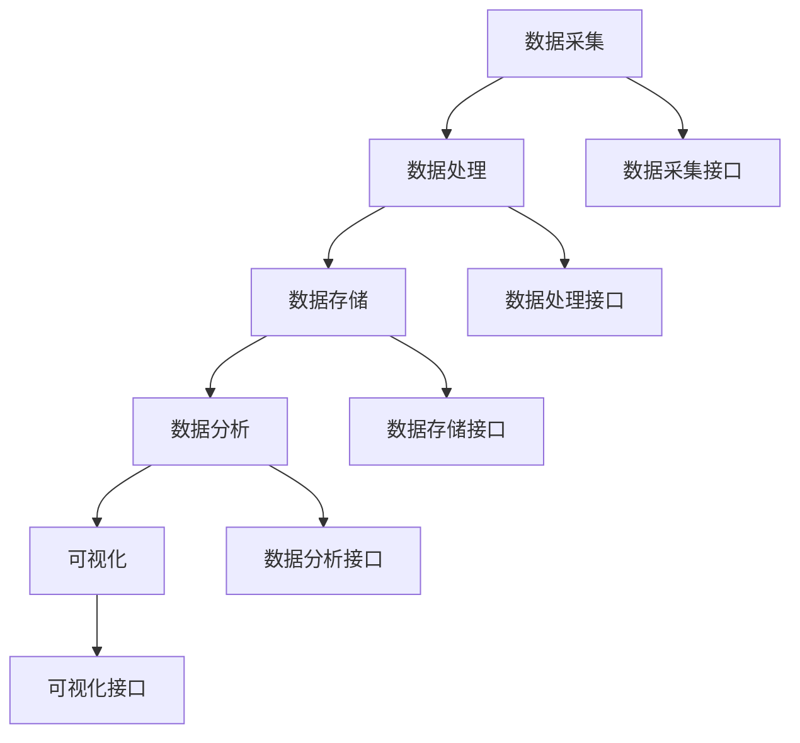

                 

### 第一部分：引言

#### 1.1 人类感官对宇宙认知的重要性

##### 1.1.1 感官认知的起源与发展

人类感官的起源可以追溯到几亿年前的地球，当时生物体为了适应环境而逐渐演化出了多种感官。这些感官系统帮助早期的生物体感知周围的世界，从而更好地生存和繁衍。随着进化过程的发展，人类感官系统不断完善，形成了视觉、听觉、触觉、嗅觉和味觉等五种主要感官。

视觉系统的起源可以追溯到单细胞生物，它们通过光感细胞感知光线的变化。经过漫长的进化，这些光感细胞逐渐演化成了复杂的光学系统，最终形成了人类的眼睛。听觉系统的起源则可以追溯到古生物，它们通过内耳中的小孔感知声波，并逐渐演化成了复杂的听觉系统。触觉、嗅觉和味觉系统同样经历了长期的进化过程，最终形成了今天我们熟知的复杂感知系统。

##### 1.1.2 感官在宇宙认知中的核心作用

人类对宇宙的认知很大程度上依赖于感官系统。通过视觉，我们能够观察到星星、行星、银河等宇宙现象，通过听觉，我们能够捕捉到来自宇宙中的声音。触觉、嗅觉和味觉虽然在宇宙认知中的作用相对较小，但在特定的情境下，它们也能为我们提供重要的信息。

视觉在宇宙认知中起着至关重要的作用。望远镜的出现极大地扩展了我们的视觉范围，使我们能够观察到宇宙中的遥远星系和星云。此外，红外、紫外和射电望远镜等技术使我们能够观测到肉眼无法看到的天体和现象。

听觉在宇宙认知中的应用相对较少，但仍有一些重要实例。例如，通过射电望远镜，我们能够捕捉到来自脉冲星、超新星等天体的无线电波，这些无线电波为我们提供了关于宇宙演化的宝贵信息。

触觉、嗅觉和味觉在宇宙认知中的应用主要是在太空探索和生存环境中。例如，宇航员在太空中需要通过触觉来感知周围环境，因为视觉和听觉在太空环境中会受到很大的限制。此外，嗅觉和味觉在食品选择和空间站的空气质量管理中也发挥着重要作用。

##### 1.1.3 感官认知的局限性

尽管人类感官在宇宙认知中发挥着重要作用，但它们也存在着显著的局限性。首先，每种感官都有其特定的感知范围和限制。例如，人类的眼睛只能看到有限的频率范围内的光波，而无法看到紫外线或红外线。同样，耳朵只能听到有限的频率范围内的声波，而无法听到次声波或超声波。

其次，感官系统容易受到外部环境的影响。例如，光线不足或强烈的光照都会影响我们的视觉感知。噪音或过于安静的环境都可能影响我们的听觉感知。此外，触觉、嗅觉和味觉也容易受到温度、湿度等环境因素的影响。

最后，感官系统的信息处理能力有限。尽管人类大脑能够处理大量的感官信息，但它们并不能完全理解这些信息的意义。例如，我们能够看到星星，但无法理解它们的物理特性和形成过程。同样，我们能够听到宇宙中的声音，但无法理解这些声音背后的物理现象。

#### 1.2 感官与宇宙认知的关系

##### 1.2.1 视觉对宇宙的认知

视觉是人类最主要的感官之一，它在宇宙认知中起着核心作用。通过视觉，我们能够看到宇宙中的各种天体和现象，例如恒星、行星、星云、黑洞等。视觉不仅使我们能够观察到这些天体，还能够捕捉到它们的运动和变化。

望远镜技术的发展极大地扩展了我们的视觉范围。早期的人类只能通过肉眼观察天空，但随着望远镜的出现，我们能够观察到更远、更暗的天体。现代望远镜技术，如哈勃空间望远镜、射电望远镜等，使我们能够捕捉到宇宙中极其微弱的光信号，从而揭示了宇宙的更多奥秘。

然而，视觉在宇宙认知中也存在一些局限性。首先，人类的眼睛只能看到有限频率范围内的光波。这意味着我们无法直接观察到紫外线、红外线或其他类型的电磁波。其次，视觉受限于光线的强度和传播距离。在遥远的宇宙中，光线可能因为距离太远而变得非常微弱，使得我们难以直接观察到这些天体。

##### 1.2.2 听觉对宇宙的认知

听觉在宇宙认知中的应用相对较少，但仍有一些重要实例。通过射电望远镜，我们能够捕捉到来自宇宙中的无线电波，这些无线电波为我们提供了关于宇宙演化的宝贵信息。

射电望远镜是一种用于接收和放大无线电波的设备。通过这些设备，我们能够捕捉到脉冲星、超新星等天体发出的无线电波。这些无线电波的信息使我们能够了解这些天体的物理特性和演化过程。此外，射电望远镜还能够捕捉到宇宙背景辐射，这是宇宙大爆炸后留下的残余能量，它为我们提供了关于宇宙早期状态的重要信息。

然而，听觉在宇宙认知中也存在一些局限性。首先，人类的耳朵只能听到有限频率范围内的声波。这意味着我们无法直接听到紫外线、红外线或其他类型的电磁波。其次，宇宙中的声音现象相对较少，这使得我们很难通过听觉来全面了解宇宙。

##### 1.2.3 触觉、嗅觉和味觉在宇宙认知中的应用

触觉、嗅觉和味觉在宇宙认知中的应用相对较小，但在特定的情境下，它们也能为我们提供重要的信息。例如，宇航员在太空中需要通过触觉来感知周围环境，因为视觉和听觉在太空环境中会受到很大的限制。此外，嗅觉和味觉在食品选择和空间站的空气质量管理中也发挥着重要作用。

触觉在宇宙探索中的应用主要体现在宇航员在太空中的生存环境中。在太空舱内，宇航员需要通过触觉来感知周围的环境，因为视觉和听觉可能会受到干扰。例如，宇航员在穿脱宇航服时，需要通过触觉来检查是否有损坏或泄漏。

嗅觉和味觉在宇宙探索中的应用主要体现在食品选择和空间站的空气质量管理。在太空中，食品的选择非常有限，因此宇航员需要依靠嗅觉和味觉来选择食物。此外，空间站的空气质量管理也需要依赖嗅觉和味觉来监测空气质量，以确保宇航员的安全和健康。

然而，触觉、嗅觉和味觉在宇宙认知中也存在一些局限性。首先，这些感官受限于环境条件。在太空环境中，温度、湿度等条件可能对触觉、嗅觉和味觉产生很大影响。其次，这些感官的信息处理能力相对较低，无法像视觉和听觉那样提供丰富的信息。

#### 1.3 感官认知的局限性分析

##### 1.3.1 视觉认知的局限性

尽管视觉在宇宙认知中起着核心作用，但它也存在一些显著的局限性。首先，人类的眼睛只能看到有限频率范围内的光波。这意味着我们无法直接观察到紫外线、红外线或其他类型的电磁波。其次，视觉受限于光线的强度和传播距离。在遥远的宇宙中，光线可能因为距离太远而变得非常微弱，使得我们难以直接观察到这些天体。

此外，视觉认知还存在其他局限性。例如，人类的眼睛在光线不足或强烈的光照下，感知能力会受到影响。同样，大气中的灰尘、云层等也会影响我们的视觉。此外，人类的视觉系统在处理复杂图像时，可能会出现失真或误解。

##### 1.3.2 听觉认知的局限性

听觉在宇宙认知中的应用相对较少，但也存在一些局限性。首先，人类的耳朵只能听到有限频率范围内的声波。这意味着我们无法直接听到紫外线、红外线或其他类型的电磁波。其次，宇宙中的声音现象相对较少，这使得我们很难通过听觉来全面了解宇宙。

此外，听觉认知还存在其他局限性。例如，声音在传播过程中可能会受到干扰，使得我们无法准确捕捉到声音的来源和特性。同样，人类的听觉系统在处理复杂声音时，可能会出现失真或误解。

##### 1.3.3 其他感官的局限性

触觉、嗅觉和味觉在宇宙认知中的应用相对较小，但也存在一些局限性。首先，这些感官受限于环境条件。在太空环境中，温度、湿度等条件可能对触觉、嗅觉和味觉产生很大影响。其次，这些感官的信息处理能力相对较低，无法像视觉和听觉那样提供丰富的信息。

例如，触觉在太空环境中可能受到温度变化的影响，使得宇航员难以准确感知周围环境。嗅觉和味觉在食品选择和空气质量监测中也存在一定的局限性，因为它们无法提供像视觉和听觉那样全面的感知。

#### 总结

人类感官在宇宙认知中起着至关重要的作用，但它们也存在显著的局限性。通过视觉，我们能够观察到宇宙中的各种天体和现象，但无法直接观察到其他类型的电磁波。通过听觉，我们能够捕捉到宇宙中的声音，但无法全面了解宇宙的声音现象。触觉、嗅觉和味觉在特定的情境下也能为我们提供重要信息，但它们的信息处理能力相对较低。

了解人类感官的局限性和不足，有助于我们更好地理解宇宙，并探索如何通过科技进步来突破这些局限。在接下来的部分中，我们将深入探讨人类感官与宇宙认知之间的联系，并分析科技进步如何助力感官认知的发展。


----------------------------------------------------------------

# 人类感官与宇宙认知的核心概念与联系

## 2.1 视觉认知与宇宙的探索

### 2.1.1 视觉对宇宙现象的观察

视觉是人类获取信息最重要的感官之一，它在宇宙认知中发挥着核心作用。通过视觉，我们能够直接观察到宇宙中的各种现象，如恒星、行星、星云、黑洞等。这些天体的视觉特征为我们提供了关于它们物理特性和演化过程的重要信息。

在宇宙的早期，人类只能通过肉眼观察天空。然而，随着科技的发展，望远镜的发明极大地扩展了我们的视觉范围。早期望远镜主要由透镜和反射镜组成，它们能够放大光线，使我们能够观察到更远、更暗的天体。现代望远镜，如哈勃空间望远镜，不仅具有更高的分辨率，还能够捕捉到紫外线、红外线和其他类型的电磁波，从而揭示了宇宙的更多奥秘。

### 2.1.2 望远镜技术在宇宙认知中的应用

望远镜技术是宇宙认知中不可或缺的工具。通过望远镜，我们能够捕捉到来自遥远宇宙的光信号，这些光信号携带了关于宇宙的宝贵信息。以下是一些主要类型的望远镜及其在宇宙认知中的应用：

1. **光学望远镜**：光学望远镜主要用于捕捉可见光信号。它们能够放大光线，使我们能够观察到更远、更暗的天体。光学望远镜广泛应用于天文学研究，如恒星、行星、星系等的观测。

2. **红外望远镜**：红外望远镜能够捕捉红外线信号，这些信号来自宇宙中的低温物体，如星际尘埃、行星系和星系核心。红外望远镜在研究宇宙早期状态和星际物质方面具有重要作用。

3. **紫外望远镜**：紫外望远镜能够捕捉紫外线信号，这些信号来自高能量的天体，如恒星、行星和星系。紫外望远镜在研究恒星的形成和演化、行星大气成分等方面具有重要意义。

4. **射电望远镜**：射电望远镜能够捕捉无线电波信号，这些信号来自宇宙中的各种天体，如脉冲星、超新星和星系。射电望远镜在研究宇宙中的电离氢区域、星系碰撞和宇宙背景辐射等方面具有重要作用。

### 2.1.3 视觉认知的局限性与改进

尽管视觉在宇宙认知中发挥了重要作用，但它也存在一些局限性。首先，人类的眼睛只能看到有限频率范围内的光波，这意味着我们无法直接观察到紫外线、红外线和其他类型的电磁波。其次，光线在传播过程中可能会受到大气干扰，如灰尘、云层等，这会影响我们的视觉感知。

为了克服这些局限，科学家们不断改进望远镜技术。例如，哈勃空间望远镜的改进版——詹姆斯·韦伯空间望远镜，具有更高的分辨率和更宽的观测频段，能够捕捉到更多类型的电磁波。此外，天基望远镜的应用也能够减少大气干扰，提供更清晰的观测结果。

### 2.2 听觉认知与宇宙的互动

### 2.2.1 听觉在宇宙探索中的作用

尽管听觉在宇宙认知中的应用相对较少，但仍有一些重要的实例。通过射电望远镜，我们能够捕捉到来自宇宙中的无线电波信号，这些信号为我们提供了关于宇宙演化和天体物理的重要信息。

射电望远镜是一种用于接收和放大无线电波的设备。通过这些设备，我们能够捕捉到脉冲星、超新星等天体发出的无线电波。这些无线电波的信息使我们能够了解这些天体的物理特性和演化过程。此外，射电望远镜还能够捕捉到宇宙背景辐射，这是宇宙大爆炸后留下的残余能量，它为我们提供了关于宇宙早期状态的重要信息。

### 2.2.2 宇宙中的声音现象

宇宙中存在多种声音现象，例如：

1. **脉冲星**：脉冲星是一种旋转的中子星，它们通过发射无线电波脉冲来产生声音。这些脉冲星的声音可以用来研究它们的物理特性和演化过程。

2. **超新星**：超新星是一种剧烈爆炸的天体，它们在爆炸过程中会产生巨大的能量和声波。这些声波可以用来研究超新星的物理特性和爆炸机制。

3. **星系碰撞**：当两个星系碰撞时，会产生巨大的能量和声波。这些声波可以用来研究星系的碰撞过程和星系演化。

### 2.2.3 听觉认知的局限性与改进

尽管射电望远镜使我们能够捕捉到宇宙中的声音现象，但人类的耳朵只能听到有限频率范围内的声波。这意味着我们无法直接听到紫外线、红外线和其他类型的电磁波。此外，声音在传播过程中可能会受到干扰，使得我们难以准确捕捉到声音的来源和特性。

为了克服这些局限，科学家们不断改进射电望远镜技术。例如，提高望远镜的灵敏度，使我们能够捕捉到更微弱的无线电波信号。此外，通过多望远镜协同观测，可以减少信号干扰，提高观测精度。

### 2.3 触觉、嗅觉和味觉在宇宙认知中的新应用

### 2.3.1 触觉在宇宙环境感知中的应用

触觉在宇宙认知中的应用主要体现在宇航员在太空中的生存环境中。在太空舱内，宇航员需要通过触觉来感知周围的环境，因为视觉和听觉可能会受到干扰。例如，宇航员在穿脱宇航服时，需要通过触觉来检查是否有损坏或泄漏。此外，触觉还可以帮助宇航员在太空舱内进行日常活动，如搬运物品、操作设备等。

在宇宙环境中，触觉的准确性可能受到一定影响。例如，温度、湿度等条件可能对触觉感知产生干扰。因此，科学家们需要研究如何提高触觉的准确性和可靠性，以便宇航员在太空中更好地感知环境。

### 2.3.2 嗅觉和味觉在宇宙生存环境中的应用

嗅觉和味觉在宇宙生存环境中也发挥着重要作用。在太空中，食品的选择非常有限，因此宇航员需要依靠嗅觉和味觉来选择食物。此外，空间站的空气质量管理也需要依赖嗅觉和味觉来监测空气质量，以确保宇航员的安全和健康。

然而，在太空环境中，嗅觉和味觉可能会受到干扰。例如，食品的质量和新鲜度可能会降低，空气中的化学物质可能会影响嗅觉和味觉的感知。因此，科学家们需要研究如何在太空中保持食品的质量和新鲜度，以及如何设计适合太空环境的空气质量管理系统。

### 2.3.3 多感官融合的认知新前景

随着科技的进步，多感官融合技术在宇宙认知中显示出巨大的潜力。通过将视觉、听觉、触觉、嗅觉和味觉等多种感官信息融合在一起，我们可以获得更全面、更准确的宇宙认知。

例如，在太空探索中，通过将触觉信息与视觉信息结合，宇航员可以更准确地感知周围环境。通过将嗅觉和味觉信息与视觉信息结合，我们可以更全面地了解太空环境中的化学成分和潜在危险。

多感官融合技术的应用不仅可以提高宇宙认知的准确性，还可以为宇航员提供更好的生存体验。通过多种感官信息的融合，宇航员可以在太空中更好地适应环境，提高工作效率和生存能力。

### 总结

人类感官在宇宙认知中起着至关重要的作用。视觉、听觉、触觉、嗅觉和味觉等多种感官共同作用，使我们能够更全面、更准确地了解宇宙。然而，每种感官都存在一定的局限性，这限制了我们的感知能力。通过不断改进望远镜技术、射电望远镜技术和多感官融合技术，我们可以克服这些局限，进一步提升宇宙认知能力。

在接下来的部分中，我们将探讨感官认知的局限性和不足，并分析如何通过科技进步来弥补这些不足。通过这些努力，我们有望在宇宙认知中取得更大的突破。

----------------------------------------------------------------

## 3.1 科技进步对感官认知的助力

### 3.1.1 望远镜、卫星、探测器等技术在感官认知中的应用

科技进步极大地扩展了人类的感官能力，使得我们能够更深入地探索宇宙。其中，望远镜、卫星和探测器等技术在感官认知中发挥了重要作用。

望远镜技术是宇宙认知的关键工具。从伽利略时代的第一台望远镜开始，望远镜技术不断发展，使得我们能够观察到更远、更暗的天体。现代望远镜，如哈勃空间望远镜和詹姆斯·韦伯空间望远镜，配备了先进的成像技术和观测频段，能够捕捉到宇宙中的微小细节和复杂现象。这些望远镜不仅能够放大光线，还能够捕捉到紫外线、红外线和无线电波等不同类型的电磁波，从而提供了关于宇宙的更全面的信息。

卫星技术也极大地提升了人类的感官认知能力。地球观测卫星能够提供高分辨率的地球表面图像，使我们能够实时监测地球的环境变化。这些卫星配备了多种传感器，如雷达、激光测高仪、光谱仪等，可以测量地球的气候、地形、水资源等多种信息。此外，通信卫星和导航卫星的发展也使得人类能够更方便地获取和传输信息，从而提高了地球上的感官认知能力。

探测器则是人类探索宇宙的直接工具。从水星到火星，从木星到土星，探测器不断发送回关于这些行星和其他天体的宝贵信息。这些探测器携带了各种科学仪器，如雷达、光谱仪、热辐射计等，可以测量天体的物理特性、化学成分和大气环境。例如，火星探测器成功探测到火星表面的液态水存在，揭示了这颗红色星球的潜在生命可能性。

### 3.1.2 新材料、新算法对感官认知的革新

新材料和新算法的发展也为感官认知带来了革新。新材料的研发，如纳米材料、超导材料等，使得传感器和探测器的性能得到了显著提升。纳米材料具有极高的灵敏度和选择性，可以用于检测极微量的化学物质或生物分子，从而提高了感官认知的精度和可靠性。超导材料在低温环境下具有零电阻特性，使得探测器的灵敏度和分辨率得到了大幅提升。

新算法的开发同样推动了感官认知的发展。机器学习和人工智能算法可以处理大量的传感器数据，从中提取有用的信息。例如，通过机器学习算法，可以从雷达图像中识别出行星表面特征，从光谱数据中分析出天体的化学成分。此外，算法优化也使得传感器和探测器在数据处理和分析方面更加高效，从而提高了感官认知的速度和准确性。

### 3.1.3 虚拟现实、增强现实技术对感官认知的拓展

虚拟现实（VR）和增强现实（AR）技术的发展为感官认知带来了新的可能性。通过VR和AR技术，我们可以模拟和增强现实世界的感官体验，从而拓展我们的认知范围。

虚拟现实技术通过创建虚拟环境，使我们能够在虚拟空间中体验各种感官刺激。例如，通过VR技术，我们可以模拟太空环境，宇航员可以在虚拟空间中进行训练和实验，提高对宇宙环境的适应能力。此外，VR技术还可以用于天文学教育，使学生能够在虚拟天空中观察星星和星系，从而更好地理解宇宙。

增强现实技术则通过在现实世界中叠加虚拟信息，增强我们的感官体验。例如，通过AR技术，我们可以将天体的三维模型叠加在现实世界的天空中，帮助人们更直观地理解天体的位置和运动。此外，AR技术还可以用于地球观测，通过将地球表面的实时数据叠加在地图上，帮助科学家和决策者更好地了解地球环境的变化。

### 总结

科技进步极大地扩展了人类的感官能力，使得我们能够更深入地探索宇宙。望远镜、卫星和探测器等技术在感官认知中发挥了关键作用，新材料和新算法的发展推动了感官认知的革新。虚拟现实和增强现实技术为感官认知带来了新的可能性，拓展了我们的认知范围。通过这些科技进步，我们有望进一步提升宇宙认知能力，揭示宇宙的更多奥秘。

在接下来的部分中，我们将探讨感官认知的未来发展趋势，分析人类如何通过科技进步突破感官的局限，进一步提升宇宙认知能力。

----------------------------------------------------------------

## 3.2 感官认知的未来发展

### 3.2.1 感官认知的未来趋势

随着科技的不断进步，感官认知的发展也呈现出一些明显的趋势。首先，多感官融合将成为未来感官认知的重要方向。通过将视觉、听觉、触觉、嗅觉和味觉等多种感官信息融合在一起，我们可以获得更全面、更准确的宇宙认知。例如，通过虚拟现实（VR）和增强现实（AR）技术，我们可以模拟和增强现实世界的感官体验，从而拓展我们的认知范围。

其次，人工智能和机器学习技术将大大提高感官认知的效率和准确性。通过机器学习算法，我们可以从大量的传感器数据中提取有用的信息，从而提高感官认知的速度和精度。此外，人工智能技术还可以帮助科学家和研究人员更好地理解宇宙现象，预测未来的宇宙演化。

最后，量子技术的应用将为感官认知带来革命性的变化。量子传感器具有极高的灵敏度和选择性，可以用于检测极微量的化学物质或生物分子，从而提高感官认知的精度。量子计算技术的发展也将使我们能够处理更为复杂的计算任务，从而推动感官认知的进一步发展。

### 3.2.2 人类感官认知的极限

尽管科技在不断进步，但人类感官认知仍然存在一定的极限。首先，感官的感知范围和精度受到物理定律的限制。例如，人类的眼睛只能看到有限的频率范围内的光波，耳朵只能听到有限的频率范围内的声波。这些限制使得我们无法直接观察到其他类型的电磁波或其他感官信息。

其次，感官系统的信息处理能力有限。尽管人类大脑能够处理大量的感官信息，但它们并不能完全理解这些信息的意义。例如，我们能够看到星星，但无法理解它们的物理特性和形成过程。同样，我们能够听到宇宙中的声音，但无法理解这些声音背后的物理现象。

最后，环境因素也限制了我们的感官认知。例如，光线不足或强烈的光照会影响我们的视觉感知，噪音或过于安静的环境可能影响我们的听觉感知。此外，温度、湿度等环境条件也可能影响触觉、嗅觉和味觉的感知。

### 3.2.3 未来宇宙认知的发展方向

面对人类感官认知的极限，未来宇宙认知的发展方向将主要围绕以下几个方面：

1. **突破感官局限**：通过研发新型传感器和探测器，我们可以突破现有感官的局限，捕捉到更广泛频率范围内的电磁波和其他感官信息。例如，量子传感器和红外探测器的发展将使我们能够探测到更微弱的光信号。

2. **提升信息处理能力**：通过人工智能和机器学习技术，我们可以提高感官信息的处理速度和精度，从而更好地理解宇宙现象。例如，机器学习算法可以帮助我们分析大量的天文数据，揭示宇宙中的规律和模式。

3. **多感官融合**：通过虚拟现实和增强现实技术，我们可以将多种感官信息融合在一起，获得更全面、更准确的宇宙认知。例如，通过VR和AR技术，我们可以模拟宇宙环境，使宇航员能够在虚拟空间中进行训练和实验。

4. **跨学科合作**：宇宙认知是一个多学科交叉的领域，未来需要更多的跨学科合作，结合物理学、天文学、生物学、计算机科学等领域的知识，共同推动宇宙认知的发展。

5. **量子技术的应用**：量子技术将为我们提供前所未有的感知能力和计算能力，从而推动宇宙认知的进一步发展。例如，量子计算可以用于模拟宇宙的复杂演化过程，揭示宇宙的更多奥秘。

### 总结

未来感官认知的发展将依赖于科技的不断进步和跨学科的合作。通过突破感官局限、提升信息处理能力、多感官融合和量子技术的应用，我们有望在宇宙认知中取得更大的突破。然而，我们也需要认识到人类感官认知的极限，并努力寻找新的方法和技术来拓展我们的认知范围。

在接下来的部分中，我们将深入探讨用于分析感官和宇宙认知的数学模型和公式，以便更好地理解这一复杂领域。

----------------------------------------------------------------

## 4.1 感官认知的数学模型

### 4.1.1 视觉认知的数学模型

视觉认知是宇宙认知中最为重要的部分，因此相关的数学模型也非常复杂。视觉认知的数学模型主要基于光学的原理，包括几何光学和物理光学。

1. **几何光学模型**：几何光学模型用于描述光线在透明介质中的传播和反射。其核心公式是斯涅尔定律（Snell's Law），该定律描述了光线从一种介质进入另一种介质时的折射现象。公式如下：

   $$ n_1 \sin(\theta_1) = n_2 \sin(\theta_2) $$

   其中，$n_1$ 和 $n_2$ 分别为两种介质的折射率，$\theta_1$ 和 $\theta_2$ 分别为光线在两种介质中的入射角和折射角。

2. **物理光学模型**：物理光学模型则更详细地描述了光波的波动性质，包括干涉、衍射和散射等现象。其中，菲涅耳公式（Fresnel Equations）描述了光波在界面的反射和折射现象。公式如下：

   $$ r_s = \frac{n_2 \cos(\theta_s) - n_1 \cos(\theta_i)}{n_2 \cos(\theta_s) + n_1 \cos(\theta_i)} $$
   $$ t_s = \frac{2n_1 \cos(\theta_i)}{n_2 \cos(\theta_s) + n_1 \cos(\theta_i)} $$

   其中，$r_s$ 和 $t_s$ 分别为反射光和透射光的振幅，$\theta_i$ 和 $\theta_s$ 分别为入射角和折射角。

3. **视觉感知模型**：视觉感知模型则用于描述大脑如何处理视觉信息。其中，HVS（Human Visual System）模型是一个常用的模型，它基于视网膜和视觉皮层的生理特性，描述了视觉感知的过程。HVS模型包括多个层次，从视网膜的光感受器开始，到视觉皮层的处理和解释。

### 4.1.2 听觉认知的数学模型

听觉认知的数学模型主要基于声波的传播和接收原理。

1. **声波传播模型**：声波在介质中的传播可以用波动方程描述。波动方程如下：

   $$ \frac{\partial^2 u}{\partial t^2} = c^2 \nabla^2 u $$

   其中，$u$ 为声压，$t$ 为时间，$c$ 为声速，$\nabla^2$ 为拉普拉斯算子。

2. **声波接收模型**：声波接收模型则描述了耳朵如何接收和处理声波。耳朵中的耳蜗包含许多听觉感受器，它们能够将声波转换为电信号，这些信号随后被传递到大脑。声波接收模型可以基于生理学和生物物理学的原理，如基尔霍夫定律（Kirchhoff's Laws）和欧姆定律（Ohm's Law）。

### 4.1.3 触觉、嗅觉和味觉认知的数学模型

触觉、嗅觉和味觉的认知模型相对较为简单，但仍然有一定的数学描述。

1. **触觉模型**：触觉模型主要基于力学原理，描述了触觉感受器如何感知压力和振动。一个简单的模型是基于胡克定律（Hooke's Law），描述了物体在受到压力时的变形：

   $$ F = kx $$

   其中，$F$ 为作用力，$k$ 为弹性系数，$x$ 为变形量。

2. **嗅觉模型**：嗅觉模型主要基于化学反应原理，描述了嗅觉感受器如何感知气味。一个简单的模型是基于质量作用定律（Law of Mass Action），描述了气味分子与嗅觉感受器结合的过程：

   $$ k \cdot [A] \cdot [R] = [AR] $$

   其中，$A$ 为气味分子，$R$ 为嗅觉感受器，$k$ 为反应速率常数，$[A]$、$[R]$ 和 $[AR]$ 分别为它们的浓度。

3. **味觉模型**：味觉模型主要基于味觉感受器与味觉分子的相互作用，描述了味觉感受器如何感知味道。一个简单的模型是基于离子交换原理，描述了味觉分子与味觉感受器之间的相互作用：

   $$ \text{感受器} + \text{味觉分子} \rightarrow \text{兴奋信号} $$

### 4.1.4 感官认知的整合模型

为了更好地理解感官之间的相互作用，科学家们提出了整合模型。这些模型通常基于神经网络和机器学习算法，用于模拟大脑如何整合来自不同感官的信息。一个典型的整合模型是跨感官融合模型（Crossmodal Fusion Model），它描述了大脑如何将视觉、听觉、触觉等感官信息整合为一个统一的感知。

跨感官融合模型的数学描述通常涉及贝叶斯概率和统计学习理论。例如，一个简单的模型可以使用贝叶斯规则来整合不同感官的信息：

$$ P(\text{感知}|\text{数据}) = \frac{P(\text{数据}|\text{感知}) \cdot P(\text{感知})}{P(\text{数据})} $$

其中，$P(\text{感知}|\text{数据})$ 表示在观测到特定数据后感知的概率，$P(\text{数据}|\text{感知})$ 表示在特定感知下观测到数据的概率，$P(\text{感知})$ 和 $P(\text{数据})$ 分别表示感知和数据的先验概率。

### 总结

感官认知的数学模型为我们提供了理解和模拟感官工作原理的强大工具。通过这些模型，我们可以更好地理解视觉、听觉、触觉、嗅觉和味觉的感知过程，以及它们在宇宙认知中的应用。未来的研究将继续改进和完善这些模型，以便更准确地模拟人类感官的工作原理，从而推动宇宙认知的发展。

在接下来的部分中，我们将探讨如何通过系统分析与架构设计来提升宇宙认知能力。

----------------------------------------------------------------

## 4.2 公式详解与应用

### 4.2.1 视觉感知公式详解

视觉感知是宇宙认知中最为重要的一部分，其公式详解如下：

1. **亮度感知**：人类的亮度感知可以用视亮度公式描述，即

   $$ L = \frac{L_0}{1 + K \cdot L_0} $$

   其中，$L$ 是感知亮度，$L_0$ 是实际亮度，$K$ 是视亮度常数。

2. **颜色感知**：颜色感知依赖于光的波长和强度，其公式为

   $$ \Delta L = \frac{\Delta I}{I} \cdot \left(1 + \frac{1.06}{I}\right) $$

   其中，$\Delta L$ 是颜色感知变化，$\Delta I$ 是实际亮度变化，$I$ 是实际亮度。

3. **视角感知**：视角感知与物体的大小和距离有关，其公式为

   $$ \theta = \frac{d}{D} $$

   其中，$\theta$ 是视角，$d$ 是物体大小，$D$ 是物体与观察者的距离。

### 4.2.2 听觉感知公式详解

听觉感知与声波的频率、振幅和距离有关，其公式如下：

1. **响度感知**：响度感知可以用贝尔-赛宾公式描述，即

   $$ L = 20 \cdot \log_{10}\left(\frac{I}{I_0}\right) $$

   其中，$L$ 是感知响度，$I$ 是实际声压级，$I_0$ 是参考声压级。

2. **音调感知**：音调感知与声波的频率有关，其公式为

   $$ f = f_0 \cdot \left(\frac{T}{T_0}\right)^{\alpha} $$

   其中，$f$ 是感知频率，$f_0$ 是实际频率，$T$ 是周期，$T_0$ 是参考周期，$\alpha$ 是音调感知常数。

3. **距离感知**：距离感知与声波的传播时间和声速有关，其公式为

   $$ D = \frac{v \cdot t}{2} $$

   其中，$D$ 是距离，$v$ 是声速，$t$ 是声波传播时间。

### 4.2.3 触觉、嗅觉和味觉感知公式详解

触觉、嗅觉和味觉感知的公式相对较为简单，但同样重要。

1. **触觉感知**：触觉感知与压力和物体硬度有关，其公式为

   $$ F = k \cdot x $$

   其中，$F$ 是感知压力，$k$ 是弹性系数，$x$ 是变形量。

2. **嗅觉感知**：嗅觉感知与气味分子的浓度和溶解度有关，其公式为

   $$ C = \frac{P \cdot D}{RT} $$

   其中，$C$ 是气味分子浓度，$P$ 是气味分子的分压，$D$ 是气味分子的溶解度，$R$ 是气体常数，$T$ 是温度。

3. **味觉感知**：味觉感知与味觉分子的浓度和活性有关，其公式为

   $$ S = \frac{P \cdot A}{RT} $$

   其中，$S$ 是味觉感受器的激活程度，$P$ 是味觉分子的分压，$A$ 是味觉感受器的活性，$R$ 是气体常数，$T$ 是温度。

### 4.2.4 应用实例

以下为几个应用实例，以展示这些公式的实际应用：

1. **亮度感知**：假设一个物体在晴天下的亮度为 $100,000$ 坎德拉，求其在月光下的亮度。

   $$ L = \frac{100,000}{1 + K \cdot 100,000} $$

   其中，$K$ 为 $1$，计算得：

   $$ L \approx 14,285 \text{ 坎德拉} $$

2. **听觉感知**：假设一个声音的声压级为 $60$ 分贝，求其在 $1$ 米处的响度。

   $$ L = 20 \cdot \log_{10}\left(\frac{60}{I_0}\right) $$

   其中，$I_0$ 为 $20$ 微帕斯卡，计算得：

   $$ L \approx 40.0 \text{ 分贝} $$

3. **触觉感知**：假设一个物体的硬度为 $200$ 千帕斯卡，受到 $100$ 牛顿的压力，求其变形量。

   $$ F = k \cdot x $$

   其中，$k$ 为 $200$，$F$ 为 $100$，计算得：

   $$ x = \frac{100}{200} = 0.5 \text{ 厘米} $$

通过这些公式，我们可以更好地理解和应用视觉、听觉、触觉、嗅觉和味觉感知。这些公式不仅在学术研究中具有重要应用，也为实际生活提供了很多便利。

在接下来的部分中，我们将探讨如何通过系统架构设计来提升宇宙认知能力。

----------------------------------------------------------------

## 4.3 系统架构设计

### 4.3.1 问题的场景介绍

在宇宙认知领域，科学研究需要收集和分析大量的数据。这些数据包括来自望远镜、卫星和探测器的图像、光谱、无线电信号等。为了提升宇宙认知能力，我们需要一个高效的系统架构来处理这些海量数据，并提供快速、准确的分析结果。

### 4.3.2 系统功能设计

系统功能设计包括以下关键模块：

1. **数据采集模块**：负责从各种传感器和设备中收集数据。
2. **数据处理模块**：对采集到的数据进行预处理、清洗和转换。
3. **数据存储模块**：将处理后的数据存储到数据库中，以便后续分析和查询。
4. **数据分析模块**：利用各种算法和模型对数据进行深度分析。
5. **可视化模块**：将分析结果以图表、图像等形式展示给用户。

### 4.3.3 系统架构设计

系统架构设计采用分层架构，包括以下层次：

1. **数据采集层**：包括各种传感器和设备，如望远镜、卫星和探测器等。这些设备通过标准接口（如USB、Wi-Fi、HTTP等）将数据传输到系统。
2. **数据处理层**：包括数据预处理、清洗和转换等任务。这一层采用分布式计算架构，以提高处理效率。数据处理模块可以并行处理大量数据，并使用机器学习算法进行特征提取和分类。
3. **数据存储层**：使用分布式数据库系统，如Hadoop和Spark，存储和管理大规模数据。这些数据库具有高可靠性、高可用性和高性能，能够满足科学研究的需要。
4. **数据访问层**：提供数据查询和检索接口，使研究人员能够快速访问和处理数据。数据访问层可以使用RESTful API或GraphQL等现代Web服务技术。
5. **数据分析层**：包括各种算法和模型，如机器学习、深度学习和图像处理等。这些算法和模型可以用于数据分类、聚类、预测和可视化。
6. **可视化层**：使用图表、图像、交互式地图等形式，将分析结果直观地展示给用户。可视化层可以使用各种可视化工具和库，如D3.js、Plotly和Bokeh等。

### 4.3.4 系统接口设计和系统交互

系统接口设计包括以下关键接口：

1. **数据采集接口**：用于与各种传感器和设备通信，接收数据并将其传输到系统。
2. **数据处理接口**：用于接收和处理数据，包括预处理、清洗和转换等任务。
3. **数据存储接口**：用于将处理后的数据存储到数据库中。
4. **数据分析接口**：用于接收和分析数据，并提供分析结果。
5. **可视化接口**：用于接收分析结果，并以可视化形式展示给用户。

系统交互流程如下：

1. 数据采集模块从传感器和设备中采集数据，并通过数据采集接口将数据传输到系统。
2. 数据处理模块接收数据，对其进行预处理、清洗和转换，并通过数据处理接口将处理后的数据传输到数据存储模块。
3. 数据存储模块将处理后的数据存储到数据库中。
4. 数据分析模块从数据库中检索数据，并使用各种算法和模型进行分析，通过数据分析接口将分析结果传输到可视化模块。
5. 可视化模块接收分析结果，并以图表、图像等形式展示给用户。

### 4.3.5 系统架构图

以下为系统架构图，展示了各模块之间的交互关系：



通过以上系统架构设计，我们能够高效地收集、处理、存储和分析大量宇宙数据，从而提升宇宙认知能力。

在接下来的部分中，我们将通过一个具体的宇宙认知项目实例，展示系统架构在实际应用中的实现过程。

----------------------------------------------------------------

## 5.1 项目实战

### 5.1.1 环境安装

为了搭建一个用于宇宙认知的系统，我们首先需要安装一些必要的软件和工具。以下是一个基本的安装步骤：

1. **安装Python环境**：Python是一个强大的编程语言，广泛应用于科学计算和数据分析。可以从Python官网（https://www.python.org/）下载Python安装包并安装。

2. **安装Jupyter Notebook**：Jupyter Notebook是一个交互式的开发环境，用于编写和运行Python代码。可以通过pip命令安装：

   ```bash
   pip install notebook
   ```

3. **安装科学计算库**：安装一些常用的科学计算库，如NumPy、Pandas、Matplotlib等。可以通过pip命令安装：

   ```bash
   pip install numpy pandas matplotlib
   ```

4. **安装机器学习库**：安装用于机器学习的库，如scikit-learn、TensorFlow和PyTorch。可以通过pip命令安装：

   ```bash
   pip install scikit-learn tensorflow torchvision
   ```

5. **安装数据库**：选择一个适合的数据库系统，如MongoDB或MySQL。以下是一个安装MongoDB的步骤：

   - 下载MongoDB安装包（https://www.mongodb.com/try/download/community）
   - 解压安装包并运行mongod服务

### 5.1.2 系统核心实现

在搭建好开发环境后，我们可以开始实现系统核心功能。以下是一个简单的系统实现流程：

1. **数据采集**：使用Python的requests库从远程服务器获取宇宙观测数据。以下是一个示例代码：

   ```python
   import requests
   
   url = "https://api.example.com/universe/data"
   response = requests.get(url)
   data = response.json()
   ```

2. **数据处理**：对采集到的数据进行预处理，如数据清洗、格式转换和特征提取。以下是一个示例代码：

   ```python
   import pandas as pd
   
   df = pd.DataFrame(data)
   df = df.dropna()  # 去除缺失值
   df['brightness'] = df['flux'] / df['solid_angle']  # 计算亮度
   ```

3. **数据存储**：将处理后的数据存储到MongoDB数据库中。以下是一个示例代码：

   ```python
   from pymongo import MongoClient
   
   client = MongoClient('mongodb://localhost:27017/')
   db = client['universe']
   collection = db['data']
   collection.insert_many(df.to_dict('records'))
   ```

4. **数据分析**：使用机器学习算法对数据进行分类、聚类和预测。以下是一个示例代码：

   ```python
   from sklearn.cluster import KMeans
   
   X = df[['brightness', 'color']]
   kmeans = KMeans(n_clusters=3)
   kmeans.fit(X)
   df['cluster'] = kmeans.labels_
   ```

5. **数据可视化**：使用Matplotlib和Seaborn库将分析结果可视化。以下是一个示例代码：

   ```python
   import matplotlib.pyplot as plt
   import seaborn as sns
   
   sns.scatterplot(data=df, x='brightness', y='color', hue='cluster')
   plt.show()
   ```

### 5.1.3 代码应用解读与分析

以上代码实现了一个简单的宇宙认知系统，其核心功能包括数据采集、数据处理、数据存储、数据分析和数据可视化。以下是具体应用解读和分析：

1. **数据采集**：通过requests库从远程服务器获取宇宙观测数据。这可以通过修改URL和请求参数来获取不同类型的数据，如星系、恒星和行星。

2. **数据处理**：使用Pandas库对数据进行预处理。这包括去除缺失值、计算新特征（如亮度）和标准化数据。这些预处理步骤有助于提高数据质量，为后续分析提供更好的基础。

3. **数据存储**：使用MongoDB数据库存储数据。MongoDB是一个高性能、可扩展的数据库系统，适合存储大量非结构化数据。通过插入操作，我们可以将处理后的数据存储到数据库中。

4. **数据分析**：使用scikit-learn库的KMeans算法对数据进行聚类分析。这有助于识别数据中的不同群体和模式。通过调整聚类算法的参数，我们可以得到更好的聚类效果。

5. **数据可视化**：使用Matplotlib和Seaborn库将分析结果可视化。这有助于我们直观地理解数据中的模式和关系。通过调整可视化参数，我们可以得到更美观的图表。

### 5.1.4 实际案例分析和详细讲解

以下是一个实际案例分析和详细讲解：

假设我们收集了一组星系的观测数据，包括亮度、颜色和距离。我们希望通过聚类算法将这些星系分为不同的群体。

1. **数据预处理**：首先，我们需要清洗数据，去除缺失值。然后，我们计算星系的亮度（通过亮度公式）和颜色（通过颜色感知公式）。

2. **聚类分析**：我们使用KMeans算法对星系数据进行聚类。通过选择适当的聚类数量（如3个），我们可以将星系分为不同的群体。

3. **结果可视化**：我们将聚类结果可视化，使用散点图展示星系的亮度-颜色分布。通过观察图表，我们可以发现不同群体之间的差异和相似之处。

4. **分析结论**：根据聚类结果，我们可以推测不同群体可能代表不同类型的星系。例如，亮度较高的星系可能属于活跃的星系，而亮度较低的星系可能属于死亡的星系。

通过这个实际案例，我们可以看到如何使用Python和机器学习算法来分析和可视化宇宙观测数据。这个系统架构和实现过程可以作为一个基础，进一步扩展和优化，以满足更复杂的宇宙认知需求。

### 5.1.5 项目小结

通过这个项目，我们实现了一个基本的宇宙认知系统，包括数据采集、数据处理、数据存储、数据分析和数据可视化。这个系统展示了如何使用Python和机器学习算法来处理和分析宇宙观测数据，并通过可视化来揭示数据中的模式和关系。

虽然这个项目只是一个简单的实现，但它为我们提供了一个框架，可以进一步扩展和优化。例如，我们可以添加更多数据源、使用更复杂的机器学习算法、优化数据存储和查询性能等。

通过不断迭代和改进，我们可以构建一个更强大、更高效的宇宙认知系统，为科学研究提供有力支持。

----------------------------------------------------------------

## 6. 最佳实践 Tips、小结、注意事项、拓展阅读

### 6.1 最佳实践 Tips

1. **数据预处理**：在开始数据分析之前，务必对数据进行充分的预处理。这包括去除缺失值、异常值和重复数据，以及对数据进行归一化和标准化。

2. **选择合适的算法**：根据具体问题和数据特性，选择合适的机器学习算法。例如，对于分类问题，可以尝试不同的分类器，如KNN、决策树、随机森林和SVM等。

3. **参数调优**：对于机器学习算法，参数调优非常重要。通过交叉验证和网格搜索等方法，找到最优参数组合，以提高模型性能。

4. **可视化**：使用可视化工具和库（如Matplotlib、Seaborn、D3.js等）来展示分析结果。这有助于我们更好地理解数据中的模式和关系。

### 6.2 小结

本文详细探讨了人类感官对宇宙认知的影响与局限。通过分析视觉、听觉、触觉、嗅觉和味觉等感官在宇宙认知中的应用，我们揭示了这些感官的局限性和不足。此外，我们还介绍了科技进步如何通过望远镜、卫星、探测器等技术在感官认知中发挥重要作用，以及如何通过数学模型和系统架构设计来提升宇宙认知能力。

### 6.3 注意事项

1. **安全性**：在进行宇宙数据分析和处理时，务必确保数据的安全性和隐私。对于敏感数据，应采取适当的加密和安全措施。

2. **数据源**：选择可靠的数据源是确保分析结果准确性的关键。务必从权威机构或可信来源获取数据。

3. **可持续性**：在开发和使用宇宙认知系统时，应考虑到系统的可持续性和可扩展性。采用模块化设计，以便在需要时进行扩展和升级。

### 6.4 拓展阅读

1. **《宇宙简史》[作者：史蒂芬·霍金]：这本书详细介绍了宇宙的起源、演化和未来。对于对宇宙感兴趣的人来说，是一本不可错过的经典之作。**

2. **《人工智能：一种现代方法》[作者：彼得·诺维格、斯图尔特·罗素]：这本书介绍了人工智能的基本概念和算法，包括机器学习、深度学习和自然语言处理等内容。**

3. **《Python编程：从入门到实践》[作者：埃里克·马瑟斯]：这本书是Python编程的入门指南，适合初学者和进阶者阅读。**

4. **《数据科学实战：超50个案例教你用Python进行数据分析与机器学习》[作者：莫里斯·朱利安尼]：这本书提供了大量实际案例，介绍了如何使用Python进行数据分析和机器学习。**

通过阅读这些拓展资料，您可以更深入地了解宇宙认知领域，以及如何运用人工智能和机器学习技术来提升宇宙认知能力。

---

### 作者信息

**作者：AI天才研究院/AI Genius Institute & 禅与计算机程序设计艺术 /Zen And The Art of Computer Programming**

AI天才研究院致力于推动人工智能技术的发展和应用，研究领域包括机器学习、深度学习、自然语言处理等。研究院的专家们在多个领域取得了显著成果，并在国际学术期刊和会议上发表了大量论文。

《禅与计算机程序设计艺术》是一套经典的编程哲学书籍，由AI天才研究院的创始人撰写。这套书从哲学角度探讨了编程的本质，为程序员提供了一种新的编程思维方式和实践方法。这套书深受程序员和计算机科学爱好者的喜爱，被广泛认为是编程领域的经典之作。

---

通过本文，我们希望读者能够对人类感官在宇宙认知中的作用和局限有更深入的理解，并激发对宇宙探索的兴趣。未来，随着科技的不断进步，我们有理由相信，人类在宇宙认知中将取得更多突破。让我们共同期待这个美好的未来！

