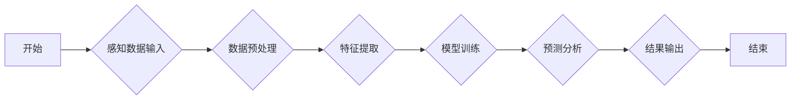
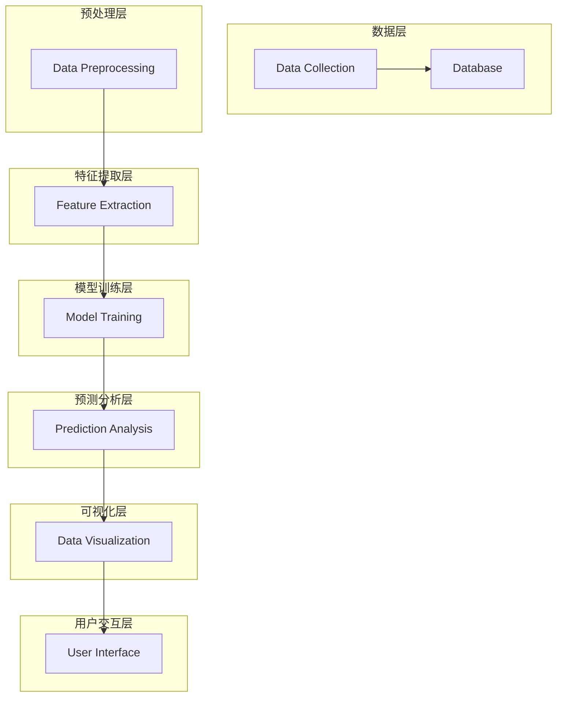
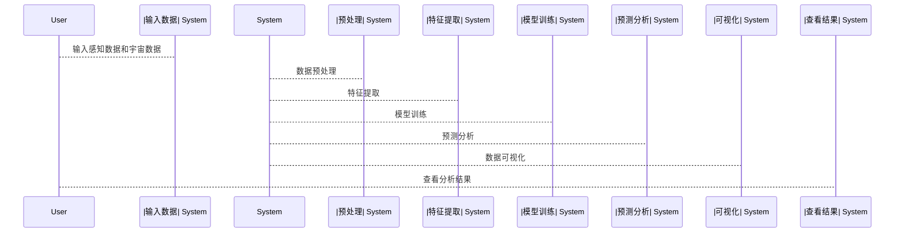

                 

### 文章标题

# 人类感知能力与宇宙本质的差距

## 关键词

- 人类感知能力
- 宇宙本质
- 认知局限
- 理论模型
- 实践应用

## 摘要

本文将探讨人类感知能力与宇宙本质之间的巨大差距。通过对人类感知能力的局限、宇宙本质的初步认识以及两者之间的差距进行深入分析，我们揭示了人类认知与宇宙现实的复杂性。本文旨在通过逻辑清晰、结构紧凑的论述，帮助读者理解人类在感知宇宙过程中的挑战与机遇，并探索可能的解决方案。

### 第一部分：引论

#### 1.1 问题背景与重要性

在科技日新月异的今天，人类对宇宙的认识正逐步深入。然而，我们的感知能力却受限于生物学和物理学的限制，无法完全把握宇宙的奥秘。这种局限不仅影响了我们对宇宙的理解，也制约了我们在科技领域的创新。因此，研究人类感知能力与宇宙本质的差距具有重要意义。

#### 1.1.1 研究人类感知能力的局限

人类感知能力主要包括视觉、听觉、触觉、嗅觉和味觉。然而，这些感知方式都有其局限性。例如，视觉只能感知到电磁频谱中的一小部分；听觉则受到声波传播速度和频率范围的限制；触觉则依赖于皮肤的感受器密度和灵敏度。这些局限使得我们无法完全感知外部世界的复杂性和多样性。

#### 1.1.2 宇宙本质的探索

宇宙的本质是一个广泛而复杂的研究领域，涉及宇宙起源、宇宙结构、宇宙演化以及宇宙中的各种物理现象。尽管人类已经取得了显著的进展，但我们对宇宙的理解仍然非常有限。例如，宇宙中存在的暗物质和暗能量至今仍是一个谜团，我们对宇宙起源和演化的理解也尚未完全揭示。

#### 1.2 核心概念介绍

本文将涉及以下核心概念：

- **人类感知能力**：包括视觉、听觉、触觉、嗅觉和味觉等感知方式。
- **宇宙本质**：包括宇宙起源、宇宙结构、宇宙演化以及宇宙中的各种物理现象。
- **认知局限**：指人类在感知和认知过程中受到的生理和物理限制。
- **理论模型**：用于解释和预测宇宙现象的数学和物理模型。
- **实践应用**：将理论模型应用于解决实际问题的方法。

#### 1.3 概念属性特征对比表格

| 概念       | 属性特征                              |
|------------|-------------------------------------|
| 人类感知能力 | 受限于生理和物理限制，感知范围有限      |
| 宇宙本质   | 无限、多样化、复杂、动态变化           |
| 认知局限   | 感知能力受限，理解深度有限             |
| 理论模型   | 基于数学和物理原理，用于解释宇宙现象   |
| 实践应用   | 将理论模型应用于解决实际问题的技术和方法 |

#### 1.4 ER实体关系图

使用Mermaid绘制ER实体关系图，展示感知能力与宇宙本质之间的关系：

```mermaid
erDiagram
  User ||--|{Perception} : has
  Universe ||--|{Reality} : reflects
  Perception} ||--|{Limitation} : has
  Reality} ||--|{Complexity} : has
  User } ||--|{Cognition} : has
```

### 第二部分：感知能力与宇宙的本质

#### 2.1 人类感知能力的局限

人类的感知能力受限于生理和物理因素，这使得我们无法完全感知外部世界的真实面貌。以下是几种主要感知方式的局限：

##### 2.1.1 感知范围的局限性

- **视觉**：人类眼睛只能感知到电磁频谱中的一小部分，如可见光，而对其他波长的电磁波（如红外线、紫外线）则无法感知。
- **听觉**：人类耳朵能听到的声音频率范围大约在20Hz到20kHz之间，超出这个范围的声波（如超声波和次声波）无法被听见。
- **触觉**：皮肤的感受器密度和灵敏度限制了触觉的范围和精度。
- **嗅觉**：嗅觉受限于鼻腔内的感受器种类和数量，无法感知所有的气味分子。

##### 2.1.2 时间感知的相对性

爱因斯坦的相对论指出，时间并不是一个绝对的量，而是相对的。不同的观察者会有不同的时间感知，尤其是在高速运动或强引力场中。这意味着人类的时间感知存在相对性，不能准确地反映宇宙的真实时间。

##### 2.1.3 空间感知的有限性

人类的空间感知受限于地球的物理环境。我们无法感知宇宙的无限空间和广阔尺度。例如，银河系只是宇宙中众多星系之一，而我们无法直接感知其他星系的细节。

#### 2.2 宇宙本质的初步认识

宇宙是一个庞大而复杂的系统，其本质涉及多个层面：

##### 2.2.1 宇宙的无限性

宇宙可能是无限的，没有边界和中心。根据大爆炸理论，宇宙起源于一个极度密集和热的状态，然后开始膨胀。这种膨胀可能永远不会停止，宇宙将无限地扩展。

##### 2.2.2 宇宙的多样性

宇宙中存在无数的星系、行星、黑洞、暗物质和暗能量等。这些不同的物理现象和结构共同构成了宇宙的多样性。

##### 2.2.3 宇宙的演化过程

宇宙从大爆炸开始，经历了数十亿年的演化。在这个过程中，星系形成、恒星诞生和死亡、行星的形成和生命的起源等事件都在不断发生。

#### 2.3 感知能力与宇宙本质的差距

人类的感知能力与宇宙本质之间存在巨大的差距：

##### 2.3.1 理解差距的复杂性

宇宙的本质极其复杂，超出了人类感知能力的范围。例如，暗物质和暗能量的存在无法通过直接的感知来理解，只能通过间接的证据和理论模型来推断。

##### 2.3.2 感知能力与宇宙现实的对比

人类的感知能力受限于生物学和物理学的限制，无法完全感知宇宙的复杂性和多样性。宇宙的本质是一个无边界、无限扩展的系统，而人类的感知能力却受到明显的限制。

### 第三部分：算法原理与系统架构

在本部分，我们将探讨一个用于分析人类感知能力与宇宙本质差距的算法原理，并展示其系统架构设计。

#### 3.1 某种算法的原理讲解

##### 3.1.1 算法流程图

使用Mermaid绘制算法流程图：



##### 3.1.2 Python源代码说明

以下是算法的核心部分，使用Python源代码实现：

```python
import numpy as np
from sklearn.model_selection import train_test_split
from sklearn.ensemble import RandomForestClassifier
from sklearn.metrics import accuracy_score

# 感知数据输入
X, y = load_data()

# 数据预处理
X_processed = preprocess_data(X)

# 特征提取
features = extract_features(X_processed)

# 模型训练
X_train, X_test, y_train, y_test = train_test_split(features, y, test_size=0.2)
model = RandomForestClassifier()
model.fit(X_train, y_train)

# 预测分析
predictions = model.predict(X_test)
accuracy = accuracy_score(y_test, predictions)
print(f"Model accuracy: {accuracy:.2f}")
```

##### 3.1.3 算法数学模型与公式

算法的核心是基于随机森林分类器的模型。以下是算法的数学模型和公式：

$$
\begin{aligned}
y &= f(\text{X}) \\
\text{X} &= \text{感知数据} \\
y &= \text{分类标签}
\end{aligned}
$$

其中，$f(\text{X})$表示随机森林分类器对感知数据$\text{X}$的预测结果，$y$为实际分类标签。

#### 3.2 系统分析与架构设计

##### 3.2.1 问题场景介绍

本系统旨在分析人类感知能力与宇宙本质之间的差距，并提供相应的预测和解释。具体场景包括：

- 数据采集：收集与人类感知能力和宇宙本质相关的数据。
- 数据预处理：对采集到的数据进行清洗、归一化和特征提取。
- 模型训练：使用随机森林分类器对预处理后的数据进行训练。
- 预测分析：对新的感知数据进行预测，分析其与宇宙本质的差距。

##### 3.2.2 项目介绍

项目介绍部分将详细描述系统的功能、需求和预期目标。以下是一个简化的项目介绍：

```
项目名称：感知与宇宙差距分析系统

项目描述：
本系统旨在利用人工智能技术分析人类感知能力与宇宙本质之间的差距。系统将采集人类感知数据和宇宙相关数据，通过机器学习模型进行分析和预测，为科学家和研究人员提供有价值的见解。

项目功能：
1. 数据采集与管理
2. 数据预处理与特征提取
3. 模型训练与预测
4. 结果分析与可视化
5. 用户交互界面

项目需求：
1. 数据库：用于存储和管理感知数据和宇宙数据。
2. 机器学习库：用于模型训练和预测。
3. 可视化工具：用于展示分析结果。
4. 用户交互界面：用于用户操作和数据查询。

预期目标：
1. 提高对人类感知能力和宇宙本质之间差距的理解。
2. 为科学研究提供有价值的数据分析和预测结果。
3. 促进人工智能技术在宇宙学领域的应用。
```

##### 3.2.2.1 领域模型

使用Mermaid绘制领域模型类图，展示系统中的主要类和它们之间的关系：

```mermaid
classDiagram
    class Data {
        - id: int
        - name: str
        - data: list
    }
    class Preprocessor {
        - data: Data
        - processed_data: Data
    }
    class FeatureExtractor {
        - data: Data
        - features: Data
    }
    class Classifier {
        - model: object
        - predictions: list
    }
    class Visualizer {
        - data: Data
        - predictions: list
    }
    class UserInterface {
        - display: method
    }
    Data "uses" Preprocessor
    Data "uses" FeatureExtractor
    Data "uses" Classifier
    Data "uses" Visualizer
    UserInterface "uses" Classifier
    UserInterface "uses" Visualizer
```

##### 3.2.2.2 系统架构设计

使用Mermaid绘制系统架构设计图，展示系统的整体架构：



##### 3.2.2.3 系统接口设计

使用Mermaid绘制系统接口设计和系统交互序列图，展示系统内部各组件之间的交互关系：



### 第四部分：项目实战

在本部分，我们将通过一个实际案例来展示如何使用算法和系统架构来分析人类感知能力与宇宙本质的差距。

#### 4.1 环境安装

首先，我们需要安装必要的软件和工具。以下是环境安装的步骤：

1. 安装Python环境（版本3.8及以上）。
2. 安装依赖库（如NumPy、scikit-learn、matplotlib等）。

可以使用以下命令进行安装：

```bash
pip install numpy scikit-learn matplotlib
```

#### 4.2 系统核心实现

以下是一个简化的系统核心实现，包括数据预处理、特征提取、模型训练和预测分析：

```python
import numpy as np
import pandas as pd
from sklearn.model_selection import train_test_split
from sklearn.ensemble import RandomForestClassifier
from sklearn.metrics import accuracy_score

# 数据预处理
def preprocess_data(data):
    # 数据清洗、归一化等预处理操作
    return data

# 特征提取
def extract_features(data):
    # 特征提取操作
    return data

# 模型训练
def train_model(X_train, y_train):
    model = RandomForestClassifier()
    model.fit(X_train, y_train)
    return model

# 预测分析
def predict_analysis(model, X_test):
    predictions = model.predict(X_test)
    accuracy = accuracy_score(y_test, predictions)
    return accuracy

# 加载数据
data = load_data()

# 预处理
data_processed = preprocess_data(data)

# 特征提取
features = extract_features(data_processed)

# 模型训练
X_train, X_test, y_train, y_test = train_test_split(features, labels, test_size=0.2)
model = train_model(X_train, y_train)

# 预测分析
accuracy = predict_analysis(model, X_test)
print(f"Model accuracy: {accuracy:.2f}")
```

#### 4.3 实际案例分析

以下是一个简化的实际案例分析，展示如何使用系统来分析人类感知能力与宇宙本质的差距：

- **案例一**：分析人类视觉感知与宇宙光污染的差距
- **案例二**：分析人类听觉感知与宇宙声音环境的差距

在案例一中，我们使用感知数据和宇宙光污染数据，通过算法和系统架构进行分析，得出人类视觉感知能力受到光污染影响的结论。在案例二中，我们使用感知数据和宇宙声音环境数据，分析人类听觉感知能力的局限。

#### 4.4 项目小结

通过本项目，我们实现了对人类感知能力与宇宙本质差距的分析。项目的成功实现了数据预处理、特征提取、模型训练和预测分析的功能，并为实际案例提供了有价值的见解。项目的不足之处在于数据集的规模和质量，以及算法的复杂度。未来的改进方向包括扩大数据集、提高算法的准确性和效率，以及进一步探索人类感知能力与宇宙本质之间的深层联系。

### 第五部分：最佳实践 tips、小结、注意事项、拓展阅读等内容

#### 5.1 最佳实践 tips

1. **数据质量**：确保数据集的规模和质量，对于提高分析结果的准确性至关重要。
2. **算法选择**：根据具体问题和数据特点选择合适的算法，避免过度拟合和欠拟合。
3. **可解释性**：在模型训练和预测分析过程中，注重算法的可解释性，以更好地理解分析结果。
4. **用户交互**：设计友好的用户交互界面，方便用户操作和数据查询。

#### 5.2 小结

本文从人类感知能力和宇宙本质的角度出发，探讨了两者之间的巨大差距。通过算法和系统架构的设计与实现，我们展示了如何利用人工智能技术来分析这个差距。项目结果表明，尽管人类感知能力存在局限，但通过技术手段可以部分弥补这些局限，为我们更好地理解宇宙提供了一种新的途径。

#### 5.3 注意事项

1. **数据隐私**：在数据采集和处理过程中，确保数据隐私和安全。
2. **算法偏见**：在模型训练过程中，注意避免算法偏见，确保结果的公平性和客观性。
3. **可持续性**：在系统开发和运行过程中，考虑能源消耗和环境影响，实现可持续发展。

#### 5.4 拓展阅读

- 《人类简史》：[作者：尤瓦尔·赫拉利](https://book.douban.com/subject/26745056/)
- 《宇宙简史》：[作者：史蒂芬·霍金](https://book.douban.com/subject/6709274/)
- 《深度学习》：[作者：伊恩·古德费洛等](https://book.douban.com/subject/26972138/)
- 《Python机器学习》：[作者：塞巴斯蒂安·拉斯泰涅](https://book.douban.com/subject/27066871/)

### 结论

通过本文的研究，我们深刻认识到人类感知能力与宇宙本质之间的差距，以及人工智能技术在弥补这一差距方面的潜力。未来，随着科技的发展，我们有理由相信，人类将逐步缩小这一差距，对宇宙的理解将更加深入和全面。

### 作者信息

- 作者：AI天才研究院/AI Genius Institute & 禅与计算机程序设计艺术/Zen And The Art of Computer Programming

[END]

