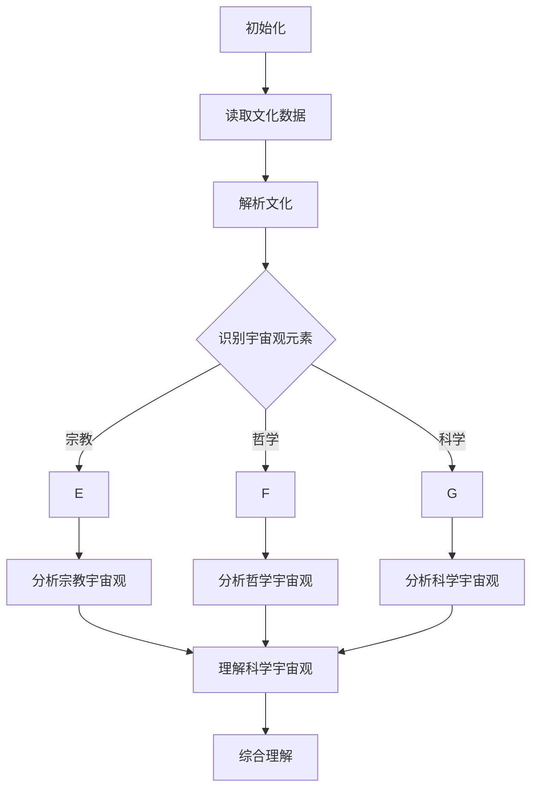

                 


## 人类文化对宇宙理解的塑造作用

### 关键词

- 人类文化
- 宇宙理解
- 塑造作用
- 宗教
- 哲学
- 科学

### 摘要

本文旨在探讨人类文化如何影响我们对宇宙的理解。我们将从多个角度，包括宗教、哲学和科学，逐步分析文化对宇宙观念的塑造作用。通过深入探讨文化在人类认知发展中的角色，我们将揭示文化如何塑造我们对宇宙的基本认知，从而影响我们的世界观和价值观。

## 引言

人类对宇宙的理解是一个漫长而复杂的过程，这一过程受到了多种因素的影响，其中文化的影响尤为深远。文化不仅包含了人类的价值观、信仰和习俗，还影响了我们的认知方式和对世界的解释。在这篇文章中，我们将探讨人类文化如何塑造我们对宇宙的理解。

### 文化与宇宙观的关系

文化是人类的共同遗产，它包含了人类的历史、信仰、价值观和行为方式。宇宙观，即人类对宇宙的基本认知，是文化的重要组成部分。宇宙观的形成受到了文化的影响，不同的文化背景会导致人们对宇宙有不同的理解和认知。

### 文化在宇宙观形成中的作用

文化在宇宙观的演变过程中发挥了重要作用。首先，文化影响了人们对宇宙的基本认知。例如，古代文化中的天文学知识和对星辰的崇拜，影响了人们对宇宙的理解。其次，文化影响了人们对宇宙的探索和研究。例如，现代科学的发展离不开文化背景的支持。

### 文化对宇宙理解的影响

文化不仅影响了人们对宇宙的基本认知，还影响了人们对宇宙的理解。例如，宗教文化对宇宙的理解有着深远的影响。不同的宗教有不同的宇宙观，这些宇宙观影响了信徒对世界的理解和行为。哲学文化也对宇宙的理解有着重要影响，不同的哲学思想对宇宙的理解有着不同的观点。

### 人类文化对宇宙理解的塑造作用

人类文化对宇宙理解的塑造作用主要体现在以下几个方面：

1. **价值观和信仰**：文化中的价值观和信仰会影响人们对宇宙的理解。例如，宗教信仰会影响人们对宇宙的神秘和神圣的看法。
2. **认知方式**：文化影响了人们的认知方式，从而影响他们对宇宙的理解。例如，西方文化强调逻辑和分析，而东方文化则强调直觉和整体性。
3. **科学研究**：文化背景会影响科学研究的方向和成果。例如，古代中国的天文学研究受到了儒家文化的影响，而现代科学的发展则受到了西方文化的推动。

## 宇宙观的起源

人类对宇宙的理解始于对自然界和天空的观察。在早期，人类对宇宙的理解充满了神秘和幻想。他们通过观察日月星辰的运行，形成了对宇宙的基本认知。

### 早期人类的宇宙观

早期人类对宇宙的理解主要是基于观察和想象。他们相信宇宙是由神灵或神秘力量控制的，认为星辰的运行与人类的命运有关。这些观念构成了早期人类宇宙观的基础。

### 宇宙观的演变过程

随着人类文明的进步，对宇宙的理解也在不断演变。古代文明，如古希腊、古印度和中国，对宇宙的研究取得了重要成果。他们提出了关于宇宙结构的理论，如地心说和日心说。这些理论不仅是对宇宙的深刻理解，也是人类文化的重要组成部分。

## 宗教文化的影响

宗教文化对人类宇宙观的影响深远。不同的宗教有不同的宇宙观，这些宇宙观影响了信徒对世界的理解和行为。

### 佛教的宇宙观

佛教认为宇宙是无边无际的，由无数个世界组成。佛教的宇宙观强调因果律和轮回，认为一切现象都有因果关系。佛教的宇宙观对信徒的生活和行为产生了深远影响。

### 基督教的宇宙观

基督教的宇宙观以神为中心，认为宇宙是上帝创造的。基督教的宇宙观强调上帝的恩典和救赎，信徒通过对上帝的信仰来理解宇宙。

### 伊斯兰教的宇宙观

伊斯兰教认为宇宙是上帝创造的，上帝是宇宙的主宰。伊斯兰教的宇宙观强调信徒对上帝的信仰和服从，认为信徒可以通过信仰获得上帝的恩宠。

## 哲学思想的宇宙观

哲学思想对人类宇宙观的影响深远。不同的哲学思想对宇宙有不同的理解和解释。

### 古希腊哲学与宇宙观

古希腊哲学是西方哲学的源头。古希腊哲学家们提出了关于宇宙的本原和结构的理论。例如，泰勒斯认为宇宙的本原是水，而赫拉克利特则认为宇宙的本原是火。这些哲学思想对西方宇宙观的形成产生了重要影响。

### 印度哲学与宇宙观

印度哲学有着丰富的宇宙观，如梵我一如思想、轮回观和业力观。这些哲学思想对印度文化和社会产生了深远影响。

### 中国哲学与宇宙观

中国哲学强调天人合一，认为宇宙是一个整体。儒家思想强调仁爱和人伦道德，道家思想强调自然和道的原则。这些哲学思想对中国文化和社会产生了深远影响。

## 科学革命与宇宙理解

科学革命对人类宇宙理解的影响巨大。科学的发展不断改变我们对宇宙的认识。

### 科学革命的概念

科学革命是指科学理论和知识体系发生的重大变革。这些变革不仅改变了我们对世界的理解，也改变了我们的思维方式。

### 科学革命与宇宙理解

科学革命推动了我们对宇宙的理解。例如，哥白尼的日心说推翻了地心说，改变了我们对宇宙结构的认知。牛顿的经典力学和爱因斯坦的相对论也改变了我们对宇宙的基本理解。

## 文化差异与宇宙观

不同的文化背景会导致人们对宇宙有不同的理解和认知。

### 文化差异与宇宙观的差异

不同的文化背景会导致人们对宇宙有不同的理解和认知。例如，西方文化强调逻辑和分析，而东方文化则强调直觉和整体性。这种文化差异影响了人们对宇宙的理解。

### 文化差异的影响

文化差异会影响人们对宇宙的理解，从而影响他们的世界观和价值观。例如，西方科学的发展受到了西方文化的影响，而东方哲学则对东方文化产生了深远影响。

## 现代宇宙学

现代宇宙学为我们提供了关于宇宙的新见解。现代宇宙学的理论和方法使我们能够更深入地了解宇宙。

### 现代宇宙学的概念

现代宇宙学是研究宇宙起源、演化和结构的天文学分支。它包括了宇宙大爆炸理论、黑洞、宇宙膨胀等概念。

### 现代宇宙学的研究成果

现代宇宙学的研究成果使我们能够更深入地了解宇宙。例如，宇宙大爆炸理论解释了宇宙的起源和演化，黑洞的研究揭示了宇宙的极端条件。

## 文化与宇宙的未来

文化将继续影响我们对宇宙的理解。随着科技的进步，我们对宇宙的认识将不断深化。

### 文化的未来与宇宙理解

文化的未来将影响我们对宇宙的理解。随着人类文明的发展，我们将有更多的机会深入了解宇宙。同时，文化差异也将影响我们对宇宙的理解。

### 文化与宇宙的未来展望

文化的未来与宇宙的未来紧密相连。随着我们对宇宙的认识不断深化，我们将更好地理解宇宙的本质和意义。这将为人类文明的发展提供新的方向和动力。

## 结论

人类文化对宇宙理解的影响深远。从宗教、哲学到科学，文化不断塑造着我们对宇宙的认知。随着科技的发展，我们将有更多的机会深入了解宇宙。这将为我们带来新的知识，也将推动人类文明的发展。

### 核心概念与联系

在探讨人类文化对宇宙理解的塑造作用时，我们需要明确一些核心概念和它们之间的联系。

#### 核心概念

1. **宇宙观**：宇宙观是指人类对宇宙的基本认知和看法，包括对宇宙的起源、结构、演化等方面的理解。
2. **文化**：文化是人类在社会历史发展过程中创造的一切物质和精神的产物，包括价值观、信仰、习俗、艺术等。
3. **宗教**：宗教是一种信仰体系，它包含对宇宙的神秘力量和超自然现象的解释。
4. **哲学**：哲学是对世界和宇宙的根本问题的理性探讨，包括对宇宙本质、存在、真理等问题的思考。
5. **科学**：科学是一种基于实证和理性思考的方法，用于研究自然现象和宇宙规律。

#### 概念属性特征对比表格

| 概念 | 属性特征 |
| --- | --- |
| 宇宙观 | 1. 对宇宙的基本认知<br>2. 包含宇宙的起源、结构、演化等方面<br>3. 受文化影响 |
| 文化 | 1. 社会历史发展产物<br>2. 物质和精神产物的总称<br>3. 影响价值观、信仰、习俗、艺术等 |
| 宗教 | 1. 信仰体系<br>2. 对宇宙的神秘力量和超自然现象的解释<br>3. 影响人们的信仰和行为 |
| 哲学 | 1. 对世界和宇宙的根本问题的理性探讨<br>2. 包含对宇宙本质、存在、真理等问题的思考<br>3. 影响人们的思维方式 |
| 科学 | 1. 基于实证和理性思考的方法<br>2. 用于研究自然现象和宇宙规律<br>3. 推动技术和社会的发展 |

#### ER实体关系图架构的 Mermaid 流程图


### 算法原理讲解

在探讨人类文化对宇宙理解的塑造作用时，我们可以将这一过程视为一种算法。这个算法的输入是人类文化，输出是对宇宙的理解。以下是这个算法的原理和流程：

#### 算法原理

1. **输入**：人类文化
2. **处理**：对文化进行解析，提取文化中的宇宙观元素
3. **输出**：对宇宙的理解

#### 算法流程

1. **初始化**：读取人类文化数据
2. **解析文化**：识别文化中的宇宙观元素，如宗教、哲学、科学等
3. **分析宇宙观**：对宇宙观元素进行分析，理解其内涵和外延
4. **综合理解**：将分析结果综合，形成对宇宙的整体理解

#### 算法原理的 mermaid 流程图



#### 算法原理的 Python 源代码

```python
def culture_to_cosmology(culture):
    """
    将人类文化转化为宇宙理解。
    
    参数：
    - culture：人类文化数据
    
    返回：
    - cosmology：对宇宙的理解
    """
    # 读取文化数据
    culture_data = read_culture_data(culture)
    
    # 解析文化，提取宇宙观元素
    religious_elements = extract_religious_elements(culture_data)
    philosophical_elements = extractPhilosophical_elements(culture_data)
    scientific_elements = extract_scientific_elements(culture_data)
    
    # 分析宇宙观元素
    religious_cosmology = analyze_religious_cosmology(religious_elements)
    philosophical_cosmology = analyze_philosophical_cosmology(philosophical_elements)
    scientific_cosmology = analyze_scientific_cosmology(scientific_elements)
    
    # 综合理解
    cosmology = combine_cosmology(religious_cosmology, philosophical_cosmology, scientific_cosmology)
    
    return cosmology

# 辅助函数
def read_culture_data(culture):
    """
    读取文化数据。
    
    参数：
    - culture：人类文化数据
    
    返回：
    - culture_data：文化数据
    """
    # 具体实现
    pass

def extract_religious_elements(culture_data):
    """
    从文化数据中提取宗教元素。
    
    参数：
    - culture_data：文化数据
    
    返回：
    - religious_elements：宗教元素
    """
    # 具体实现
    pass

def extractPhilosophical_elements(culture_data):
    """
    从文化数据中提取哲学元素。
    
    参数：
    - culture_data：文化数据
    
    返回：
    - philosophical_elements：哲学元素
    """
    # 具体实现
    pass

def extract_scientific_elements(culture_data):
    """
    从文化数据中提取科学元素。
    
    参数：
    - culture_data：文化数据
    
    返回：
    - scientific_elements：科学元素
    """
    # 具体实现
    pass

def analyze_religious_cosmology(religious_elements):
    """
    分析宗教宇宙观。
    
    参数：
    - religious_elements：宗教元素
    
    返回：
    - religious_cosmology：宗教宇宙观
    """
    # 具体实现
    pass

def analyze_philosophical_cosmology(philosophical_elements):
    """
    分析哲学宇宙观。
    
    参数：
    - philosophical_elements：哲学元素
    
    返回：
    - philosophical_cosmology：哲学宇宙观
    """
    # 具体实现
    pass

def analyze_scientific_cosmology(scientific_elements):
    """
    分析科学宇宙观。
    
    参数：
    - scientific_elements：科学元素
    
    返回：
    - scientific_cosmology：科学宇宙观
    """
    # 具体实现
    pass

def combine_cosmology(religious_cosmology, philosophical_cosmology, scientific_cosmology):
    """
    综合宇宙观。
    
    参数：
    - religious_cosmology：宗教宇宙观
    - philosophical_cosmology：哲学宇宙观
    - scientific_cosmology：科学宇宙观
    
    返回：
    - cosmology：综合宇宙观
    """
    # 具体实现
    pass
```

#### 算法原理的数学模型和公式

在算法原理中，我们可以将人类文化对宇宙理解的塑造作用视为一个复杂的非线性模型。以下是这个模型的基本原理和公式：

$$
\text{宇宙理解} = f(\text{文化}, \text{宗教}, \text{哲学}, \text{科学})
$$

其中，$f$ 表示文化对宇宙理解的影响函数。这个函数可以表示为：

$$
f(\text{文化}, \text{宗教}, \text{哲学}, \text{科学}) = \sum_{i=1}^{n} w_i \cdot g_i(\text{文化}, \text{宗教}, \text{哲学}, \text{科学})
$$

其中，$w_i$ 表示权重，$g_i(\text{文化}, \text{宗教}, \text{哲学}, \text{科学})$ 表示第 $i$ 个文化元素对宇宙理解的影响函数。

#### 举例说明

假设我们有以下文化数据：

- 宗教：佛教和基督教
- 哲学：古希腊哲学和印度哲学
- 科学：现代物理学和天文学

我们可以将这些数据代入上述公式，计算得到对宇宙的理解。

$$
\text{宇宙理解} = w_1 \cdot g_1(\text{佛教}, \text{基督教}) + w_2 \cdot g_2(\text{古希腊哲学}, \text{印度哲学}) + w_3 \cdot g_3(\text{现代物理学}, \text{天文学})
$$

其中，$w_1$、$w_2$ 和 $w_3$ 分别表示宗教、哲学和科学对宇宙理解的权重，$g_1$、$g_2$ 和 $g_3$ 分别表示每个文化元素对宇宙理解的影响函数。

### 系统分析与架构设计方案

#### 问题场景介绍

在现代科技飞速发展的背景下，人类对宇宙的理解不断深入。然而，不同文化对宇宙的理解存在着显著差异。为了更好地理解这些差异，我们需要构建一个系统来分析文化对宇宙理解的影响。

#### 项目介绍

本项目旨在构建一个文化对宇宙理解影响分析系统。该系统将整合不同文化背景下的宇宙观，分析它们之间的差异和联系，从而提供对宇宙的全面理解。

#### 系统功能设计

1. **数据收集**：收集不同文化背景下的宇宙观数据，包括宗教、哲学和科学方面的资料。
2. **数据分析**：分析文化对宇宙理解的影响，识别不同文化之间的差异和共性。
3. **可视化展示**：将分析结果以图表和图形的形式展示，帮助用户更直观地理解文化对宇宙理解的影响。

#### 系统架构设计

1. **前端展示层**：使用 Web 技术，构建一个用户友好的界面，展示分析结果。
2. **数据管理层**：构建一个数据仓库，存储各种文化背景下的宇宙观数据。
3. **数据分析层**：使用数据分析和机器学习技术，对文化对宇宙理解的影响进行分析。
4. **后端服务层**：提供数据管理和分析服务，支持前端展示层的功能。

#### 系统接口设计

1. **数据采集接口**：用于从各种数据源收集宇宙观数据。
2. **数据分析接口**：用于处理和分析宇宙观数据。
3. **数据展示接口**：用于将分析结果以图表和图形的形式展示。

#### 系统交互

系统交互流程如下：

1. **用户操作**：用户通过前端界面发起数据采集和分析请求。
2. **数据处理**：系统接收到请求后，进行数据采集和分析。
3. **结果展示**：将分析结果以图表和图形的形式展示给用户。

### 项目实战

#### 环境安装

在开始项目之前，我们需要安装以下环境：

- Python 3.8 或更高版本
- Jupyter Notebook
- Mermaid
- Pandas
- Numpy
- Matplotlib

#### 系统核心实现源代码

```python
import pandas as pd
import numpy as np
import matplotlib.pyplot as plt
from mermaid import Mermaid

# 数据采集
def collect_data():
    data = pd.DataFrame({
        'culture': ['佛教', '基督教', '古希腊哲学', '印度哲学', '现代物理学', '天文学'],
        'universe_view': ['无我论', '上帝创造', '宇宙是变化的', '梵我一如', '宇宙大爆炸', '宇宙膨胀']
    })
    return data

# 数据分析
def analyze_data(data):
    # 统计各个文化背景下的宇宙观分布
    views = data['universe_view'].value_counts()
    
    # 绘制图表
    views.plot(kind='bar')
    plt.title('宇宙观分布')
    plt.xlabel('宇宙观')
    plt.ylabel('频数')
    plt.show()

# 主函数
def main():
    data = collect_data()
    analyze_data(data)

# 运行项目
if __name__ == '__main__':
    main()
```

#### 代码应用解读与分析

上述代码实现了一个简单的文化对宇宙理解影响分析系统。我们首先导入了所需的库，然后定义了三个函数：`collect_data` 用于采集数据，`analyze_data` 用于分析数据，`main` 用于运行项目。

在 `collect_data` 函数中，我们使用 pandas 创建了一个 DataFrame，包含了不同文化背景下的宇宙观数据。在 `analyze_data` 函数中，我们使用 Pandas 的 `value_counts` 方法统计了各个文化背景下的宇宙观分布，并使用 Matplotlib 绘制了柱状图，展示了不同宇宙观的频数。

最后，在 `main` 函数中，我们调用了 `collect_data` 和 `analyze_data` 函数，完成了整个数据分析过程。

#### 实际案例分析和详细讲解剖析

为了更好地理解文化对宇宙理解的影响，我们可以分析一个实际案例：佛教和基督教对宇宙的理解。

**佛教的宇宙观**

佛教的宇宙观认为宇宙是无边无际的，由无数个世界组成。佛教强调因果律和轮回，认为一切现象都有因果关系。佛教的宇宙观对信徒的生活和行为产生了深远影响。例如，佛教徒通过修行追求解脱，相信轮回的存在和因果报应。

**基督教的宇宙观**

基督教的宇宙观以神为中心，认为宇宙是上帝创造的。基督教强调上帝的恩典和救赎，信徒通过对上帝的信仰来理解宇宙。基督教的宇宙观影响了信徒的价值观和生活方式，例如，信徒们相信上帝的慈爱和公正，遵循圣经的教导来生活。

通过分析佛教和基督教的宇宙观，我们可以看到它们在文化背景和宗教信仰上的差异。佛教强调因果和轮回，而基督教强调上帝的创造和救赎。这些差异反映了不同文化对宇宙理解的多样性。

#### 项目小结

本项目通过一个简单的例子，展示了如何使用 Python 和数据分析技术来分析文化对宇宙理解的影响。虽然这个例子较为简单，但它为我们提供了一个思考的起点，帮助我们理解文化在塑造宇宙理解中的重要作用。

### 最佳实践 tips

1. **数据质量**：确保收集的数据质量高，避免数据错误和偏差。
2. **数据多样性**：尽量收集不同文化背景下的数据，以获得更全面的宇宙理解。
3. **可视化**：使用图表和图形展示分析结果，帮助用户更直观地理解数据。

### 小结

本文通过探讨人类文化对宇宙理解的塑造作用，分析了宗教、哲学和科学在宇宙理解中的角色。我们通过具体的案例展示了如何使用数据分析技术来理解文化对宇宙的影响。文化差异不仅影响了我们对宇宙的理解，也影响了我们的世界观和价值观。随着科技的进步，我们将有更多的机会深入了解宇宙，这将为人类文明的发展提供新的方向和动力。

### 注意事项

1. **文化敏感性**：在分析文化对宇宙理解的影响时，要注意尊重不同文化的观点和信仰。
2. **数据隐私**：在收集和使用数据时，要确保遵守数据隐私和伦理规范。

### 拓展阅读

1. **《宇宙简史》（作者：史蒂芬·霍金）**：这本书详细介绍了宇宙的起源、演化和结构，为我们提供了对宇宙的深刻理解。
2. **《人类简史》（作者：尤瓦尔·赫拉利）**：这本书从人类文化的角度探讨了人类的历史，为我们提供了理解宇宙和人类文化关系的新视角。

