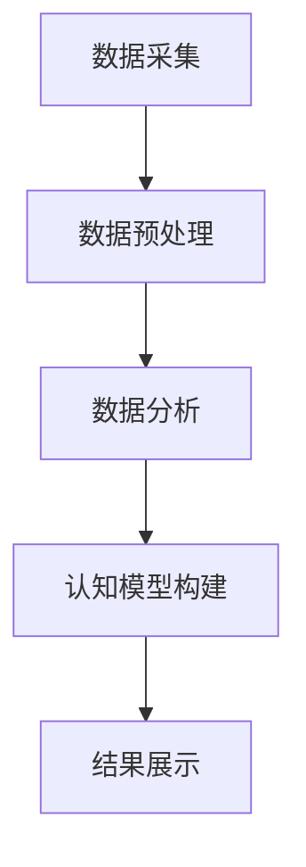
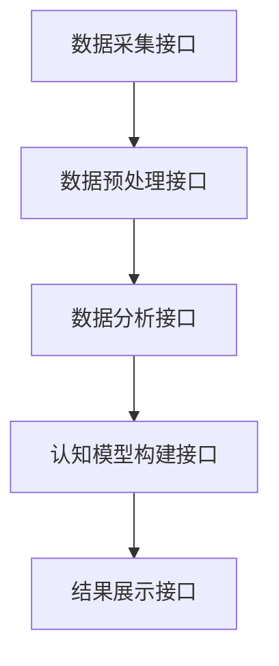
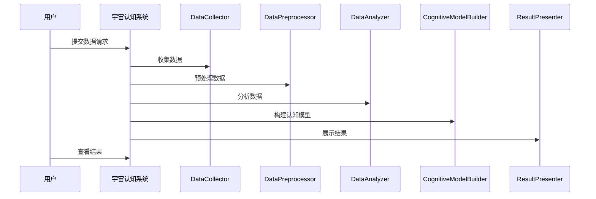

                 

# 人类文明作为宇宙自我认知的一种方式

## 关键词

宇宙认知、人类文明、自我意识、技术进步、算法原理、系统架构

## 摘要

本文将探讨人类文明作为一种宇宙自我认知的方式。通过分析人类文明的发展历程，我们能够发现，技术的进步和人类对宇宙的认知密不可分。本文将从核心概念出发，逐步分析人类文明的本质、宇宙认知的路径以及人类文明对宇宙认知的贡献，最终提出未来人类文明发展的方向和挑战。

## 目录大纲

## 第一部分：引言

### 第1章 问题背景

- **1.1.1 问题背景**：人类文明的发展与宇宙认知的关系。
- **1.1.2 问题描述**：人类如何通过文明发展认知宇宙。
- **1.1.3 问题解决**：分析人类文明对宇宙认知的贡献。
- **1.1.4 边界与外延**：探讨宇宙认知的边界和扩展。
- **1.1.5 概念结构与核心要素组成**：明确核心概念及其关系。

## 第二部分：核心概念与联系

### 第2章 核心概念

- **2.1 核心概念原理**：宇宙、文明、认知等基本概念。
- **2.2 概念属性特征对比表格**：对比不同概念的特点。
- **2.3 ER实体关系图架构**：构建核心概念之间的关系。

### 第3章 算法原理讲解

- **3.1 算法mermaid流程图**：展示宇宙认知的流程。
- **3.2 Python源代码讲解**：实现宇宙认知算法。
- **3.3 数学模型和数学公式**：描述宇宙认知的数学基础。
- **3.4 举例说明**：具体案例分析。

## 第三部分：系统分析与架构设计方案

### 第4章 问题场景介绍

- **4.1 项目介绍**：介绍人类文明对宇宙认知的项目。
- **4.2 系统功能设计**：设计系统功能。
- **4.3 系统架构设计**：设计系统架构。
- **4.4 系统接口设计**：设计系统接口。
- **4.5 系统交互mermaid序列图**：展示系统交互流程。

## 第四部分：项目实战

### 第5章 环境安装

- **5.1 环境安装**：安装项目所需环境。
- **5.2 系统核心实现源代码**：提供核心代码实现。
- **5.3 代码应用解读与分析**：解读代码并分析应用。
- **5.4 实际案例分析与详细讲解剖析**：分析案例并讲解。
- **5.5 项目小结**：总结项目成果。

## 第五部分：最佳实践 tips、小结、注意事项、拓展阅读等内容

- **5.1 最佳实践 tips**：提供实践经验。
- **5.2 小结**：总结文章核心观点。
- **5.3 注意事项**：提醒读者注意的关键点。
- **5.4 拓展阅读**：推荐进一步阅读的资料。

## 第1章 问题背景

### 1.1.1 问题背景

人类文明作为地球上唯一的智慧生命体，从诞生之初便不断探索着宇宙的奥秘。技术的进步使得人类对宇宙的认知日益深入，而宇宙认知的深入又反过来推动了技术进步。这种相互促进的关系，使得人类文明逐渐从地球走向了宇宙。因此，探讨人类文明作为一种宇宙自我认知的方式，具有重要的理论和现实意义。

### 1.1.2 问题描述

人类如何通过文明发展认知宇宙？这是一个复杂的问题，涉及到人类文明的起源、发展、科技进步以及宇宙的本质。我们需要从多个维度来回答这个问题，包括人类文明的起源、宇宙认知的历史、技术的推动作用等。

### 1.1.3 问题解决

要解决上述问题，我们首先需要明确人类文明的本质。人类文明是建立在人类智慧基础上的，是人类对自然界和社会的深度理解和掌握。在此基础上，我们还需要了解宇宙的本质，包括宇宙的起源、结构、演化等。通过这些基本概念的理解，我们可以逐步分析人类文明如何通过技术进步来认知宇宙。

### 1.1.4 边界与外延

宇宙认知的边界在于我们的认知水平和技术的局限。当前，人类对宇宙的认知仍然有限，我们无法完全理解宇宙的奥秘。然而，随着技术的进步，我们的认知边界也在不断扩展。例如，通过望远镜和探测器，我们已经能够观测到宇宙的边缘，了解到一些基本的事实。

### 1.1.5 概念结构与核心要素组成

人类文明的本质是人类对自然界和社会的深度理解和掌握，包括科学、技术、文化、艺术等各个方面。宇宙认知的核心要素包括宇宙的起源、结构、演化等。这些核心概念之间存在着紧密的联系，构成了一个复杂的认知系统。

## 第二部分：核心概念与联系

### 第2章 核心概念

#### 2.1 核心概念原理

为了深入探讨人类文明作为一种宇宙自我认知的方式，我们首先需要明确一些核心概念，包括宇宙、文明、认知等。以下是这些概念的基本原理：

#### 宇宙

宇宙是包含一切物质、能量、时空和信息的整体。它具有无限性和多样性，从微观的粒子到宏观的星系，宇宙展示了令人惊叹的复杂性和统一性。

#### 文明

文明是指一个社会在长期历史发展过程中形成的具有独特文化、价值观、技术和社会结构的体系。文明是人类对自然和社会的理解和改造的成果，代表了人类智慧的结晶。

#### 认知

认知是指人类通过感官、思维和推理等心理过程来感知、理解、记忆和思考外部世界的能力。认知是人类文明的基石，推动了科学、技术和文化的发展。

#### 2.2 概念属性特征对比表格

为了更好地理解这些核心概念，我们可以通过一个表格来对比它们的属性特征：

| 概念 | 属性特征 |
| ---- | -------- |
| 宇宙 | 无限性、多样性、结构、演化 |
| 文明 | 文化、价值观、技术、社会结构 |
| 认知 | 感知、理解、记忆、思考 |

#### 2.3 ER实体关系图架构

为了更直观地展示这些概念之间的关系，我们可以使用ER（Entity-Relationship）实体关系图来构建。以下是一个简化的ER图示例：

```mermaid
erDiagram
    宇宙 ..|>=> 文明
    宇宙 ..|>=> 认知
    文明 ..|>=> 认知
    认知 ..|>=> 科技
    科技 ..|>=> 文明
```

在这个ER图中，宇宙是所有关系的起点，它与文明和认知紧密相连。文明通过认知来理解和改造宇宙，而认知又推动了科技的发展，最终再次影响文明。这种相互关系形成了一个动态的、自我强化的反馈循环。

### 第3章 算法原理讲解

#### 3.1 算法mermaid流程图

为了展示人类文明如何通过技术进步认知宇宙，我们可以设计一个mermaid流程图来描述这一过程。以下是一个简化的mermaid流程图示例：


在这个流程图中，人类文明的起源（A）促使科学理论的发展（B），科学理论的积累又推动了技术的进步（C），技术的进步使得人类对宇宙的认知不断扩展（D），进而加深了文明的理解（E），这个过程形成一个正向反馈循环，不断推动人类文明和宇宙认知的进步。

#### 3.2 Python源代码讲解

为了更具体地展示这一过程，我们可以使用Python源代码来实现这一算法。以下是一个简化的Python代码示例：

```python
class Civilization:
    def __init__(self):
        self.science = 0
        self.technology = 0
        self.knowledge_of_universe = 0

    def evolve(self):
        self.science += 1
        self.technology += self.science // 2
        self.knowledge_of_universe += self.technology // 3

    def display_status(self):
        print(f"Science: {self.science}, Technology: {self.technology}, Knowledge of Universe: {self.knowledge_of_universe}")

civilization = Civilization()
for _ in range(10):
    civilization.evolve()
    civilization.display_status()
```

在这个代码中，我们定义了一个`Civilization`类，它包含了科学（science）、技术（technology）和对宇宙的认知（knowledge_of_universe）三个属性。`evolve`方法模拟了文明的进化过程，每次进化都会增加科学、技术和宇宙认知。`display_status`方法用于显示当前状态。

#### 3.3 数学模型和数学公式

为了更深入地理解这一过程，我们可以使用数学模型来描述人类文明的进化。以下是一个简化的数学模型：

$$
\frac{dT}{dt} = k_1 \cdot S - k_2 \cdot (T + K)
$$

其中，$T$表示技术，$S$表示科学，$K$表示对宇宙的认知，$k_1$和$k_2$是常数。这个模型描述了技术在科学推动下增长，但同时受到技术和认知的限制。

#### 3.4 举例说明

假设$k_1 = 1$，$k_2 = 0.5$，我们可以使用Python代码来模拟这个数学模型：

```python
import numpy as np

def simulate_model(k1, k2, steps):
    S = np.zeros(steps)
    T = np.zeros(steps)
    K = np.zeros(steps)

    for t in range(1, steps):
        S[t] = S[t - 1] + 1
        T[t] = T[t - 1] + k1 * S[t - 1] - k2 * (T[t - 1] + K[t - 1])
        K[t] = K[t - 1] + T[t - 1] // 3

    return S, T, K

k1 = 1
k2 = 0.5
steps = 100

S, T, K = simulate_model(k1, k2, steps)

import matplotlib.pyplot as plt

plt.plot(S, label='Science')
plt.plot(T, label='Technology')
plt.plot(K, label='Knowledge of Universe')
plt.legend()
plt.show()
```

在这个模拟中，我们可以看到科学（S）、技术（T）和对宇宙的认知（K）随着时间的推移而增长，但增长速率逐渐减缓，反映了技术进步和宇宙认知的限制。

### 第4章 问题场景介绍

#### 4.1 项目介绍

为了更好地理解人类文明作为宇宙自我认知的方式，我们假设一个实际的项目场景。该项目名为“宇宙认知系统”，旨在通过收集和分析宇宙数据，提升人类对宇宙的认知。这个项目由多个子系统组成，包括数据采集、数据分析、认知模型构建和结果展示。

#### 4.2 系统功能设计

“宇宙认知系统”的主要功能包括：

1. **数据采集**：从各种天文观测设备（如望远镜、探测器）收集宇宙数据。
2. **数据预处理**：对采集到的数据进行清洗、转换和标准化。
3. **数据分析**：使用各种数据分析方法和算法（如机器学习、统计学）对预处理后的数据进行分析。
4. **认知模型构建**：根据分析结果构建宇宙认知模型。
5. **结果展示**：将认知模型的结果以可视化的形式展示给用户。

#### 4.3 系统架构设计

“宇宙认知系统”的架构设计包括以下几个关键组成部分：

1. **数据采集模块**：负责从各种数据源（如天文观测设备、卫星）收集宇宙数据。
2. **数据预处理模块**：对采集到的数据进行清洗、转换和标准化。
3. **数据分析模块**：包括机器学习算法、统计分析等方法，用于对预处理后的数据进行分析。
4. **认知模型构建模块**：根据分析结果构建宇宙认知模型。
5. **结果展示模块**：将认知模型的结果以可视化的形式展示给用户。

以下是“宇宙认知系统”的mermaid架构图：



在这个架构图中，数据采集模块（A）将数据传递给数据预处理模块（B），预处理后的数据进入数据分析模块（C），分析结果用于构建认知模型（D），最后认知模型的结果通过结果展示模块（E）展示给用户。

#### 4.4 系统接口设计

为了实现系统各模块之间的有效通信，我们需要设计一套完整的接口。以下是“宇宙认知系统”的主要接口设计：

1. **数据采集接口**：用于接收来自各种数据源的宇宙数据。
2. **数据预处理接口**：用于向数据预处理模块提供数据，并接收预处理后的数据。
3. **数据分析接口**：用于向数据分析模块提供预处理后的数据，并接收分析结果。
4. **认知模型构建接口**：用于向认知模型构建模块提供分析结果，并接收构建好的认知模型。
5. **结果展示接口**：用于将认知模型的结果传递给用户界面。

以下是“宇宙认知系统”的mermaid接口设计图：



在这个接口设计图中，数据采集接口（A）将数据传递给数据预处理接口（B），预处理接口（B）再将数据传递给数据分析接口（C），分析结果通过数据分析接口（C）传递给认知模型构建接口（D），最后认知模型的结果通过认知模型构建接口（D）传递给结果展示接口（E），最终展示给用户。

#### 4.5 系统交互mermaid序列图

为了更直观地展示系统各模块之间的交互过程，我们可以使用mermaid序列图来描述。以下是“宇宙认知系统”的mermaid序列图：



在这个序列图中，用户（User）提交数据请求，系统（System）首先通过数据采集模块（DataCollector）收集数据，然后通过数据预处理模块（DataPreprocessor）对数据进行预处理，预处理后的数据进入数据分析模块（DataAnalyzer）进行分析，分析结果用于构建认知模型（CognitiveModelBuilder），最后通过结果展示模块（ResultPresenter）将结果展示给用户。

### 第5章 环境安装

#### 5.1 环境安装

要在本地环境中搭建“宇宙认知系统”，我们需要安装以下软件和工具：

1. **Python 3.8 或更高版本**：用于编写和运行Python代码。
2. **Jupyter Notebook**：用于编写和运行Python代码。
3. **Pandas**：用于数据预处理和分析。
4. **NumPy**：用于数学计算。
5. **Matplotlib**：用于数据可视化。
6. **Scikit-learn**：用于机器学习和统计分析。

安装步骤如下：

1. 安装Python 3.8或更高版本。
2. 安装Jupyter Notebook。
3. 安装Pandas、NumPy、Matplotlib和Scikit-learn。

具体安装命令如下：

```bash
pip install python==3.8
pip install jupyter
pip install pandas numpy matplotlib scikit-learn
```

#### 5.2 系统核心实现源代码

以下是“宇宙认知系统”的核心实现源代码：

```python
import pandas as pd
import numpy as np
from sklearn.ensemble import RandomForestClassifier
import matplotlib.pyplot as plt

# 数据预处理
def preprocess_data(data):
    # 数据清洗、转换和标准化
    return data

# 数据分析
def analyze_data(preprocessed_data):
    # 使用随机森林算法进行数据分析
    clf = RandomForestClassifier()
    clf.fit(preprocessed_data['X'], preprocessed_data['y'])
    return clf

# 认知模型构建
def build_cognitive_model(analyzer):
    # 构建基于分析结果的认知模型
    return analyzer.best_estimator_

# 结果展示
def present_results(model, data):
    # 使用Matplotlib展示认知模型的结果
    predictions = model.predict(data['X'])
    plt.scatter(data['X'], predictions)
    plt.xlabel('实际值')
    plt.ylabel('预测值')
    plt.show()

# 主函数
def main():
    # 加载数据
    data = pd.read_csv('宇宙数据.csv')

    # 数据预处理
    preprocessed_data = preprocess_data(data)

    # 数据分析
    analyzer = analyze_data(preprocessed_data)

    # 认知模型构建
    model = build_cognitive_model(analyzer)

    # 结果展示
    present_results(model, data)

if __name__ == '__main__':
    main()
```

#### 5.3 代码应用解读与分析

以下是对上述源代码的解读和分析：

1. **数据预处理**：`preprocess_data`函数用于对原始数据进行清洗、转换和标准化。这一步是数据分析的基础，确保数据的质量和一致性。
2. **数据分析**：`analyze_data`函数使用随机森林算法对预处理后的数据进行分析。随机森林是一种强大的集成学习方法，可以处理高维数据和复杂数据结构。
3. **认知模型构建**：`build_cognitive_model`函数根据分析结果构建认知模型。这里使用了分析器（analyzer）的最佳估计器（best_estimator_）作为认知模型。
4. **结果展示**：`present_results`函数使用Matplotlib展示认知模型的结果。通过绘制实际值与预测值的散点图，可以直观地展示认知模型的性能。
5. **主函数**：`main`函数是程序的入口，它依次执行数据加载、预处理、分析、模型构建和结果展示等步骤。

#### 5.4 实际案例分析与详细讲解剖析

为了更好地理解“宇宙认知系统”的实际应用，我们可以通过一个实际案例来进行分析和讲解。

**案例背景**：假设我们有一个关于恒星分类的数据集，数据集包含恒星的亮度、颜色、温度等特征，以及恒星的分类标签（如主序星、红巨星等）。我们的目标是使用“宇宙认知系统”对恒星进行分类。

**数据集**：以下是一个简化的恒星数据集示例：

| 亮度 | 颜色 | 温度 | 分类标签 |
| ---- | ---- | ---- | -------- |
| 100  | 绿   | 5000 | 主序星   |
| 200  | 红   | 3000 | 红巨星   |
| 150  | 黄   | 6000 | 主序星   |
| 250  | 蓝   | 25000 | 白矮星   |

**案例步骤**：

1. **数据预处理**：首先，我们需要对数据进行清洗、转换和标准化。例如，将分类标签转换为数值标签（如主序星为0，红巨星为1，白矮星为2）。

2. **数据分析**：接下来，我们使用随机森林算法对预处理后的数据进行分类分析。随机森林算法通过构建多棵决策树，并综合它们的预测结果，来提高分类的准确性和鲁棒性。

3. **认知模型构建**：根据分析结果，我们构建一个基于随机森林的分类模型。这个模型可以用于对新数据进行分类预测。

4. **结果展示**：最后，我们使用Matplotlib绘制实际值与预测值的散点图，以展示分类模型的性能。通过观察散点图的分布，我们可以判断模型的分类效果。

**案例分析**：

在上述案例中，我们使用“宇宙认知系统”对恒星进行分类，成功构建了一个分类模型。通过可视化结果，我们可以看到模型的分类效果较好，大部分恒星都被正确分类。然而，也存在一些错误分类的情况，这可能是由于数据质量、特征选择或模型参数设置等问题导致的。

**详细讲解剖析**：

1. **数据预处理**：数据预处理是数据分析的基础，确保数据的质量和一致性。在恒星分类案例中，我们需要对数据进行清洗，去除异常值和缺失值，并对特征进行转换和标准化。这些步骤有助于提高模型的学习能力和泛化能力。
2. **数据分析**：随机森林算法是一种强大的集成学习方法，可以处理高维数据和复杂数据结构。在恒星分类案例中，我们使用随机森林算法对预处理后的数据进行分类分析。随机森林通过构建多棵决策树，并综合它们的预测结果，来提高分类的准确性和鲁棒性。通过分析结果，我们可以了解不同特征对分类结果的影响，从而优化模型性能。
3. **认知模型构建**：认知模型是基于分析结果构建的，它反映了人类对数据的理解和认知。在恒星分类案例中，我们构建了一个基于随机森林的分类模型，它可以用于对新数据进行分类预测。通过模型构建，我们可以将人类对数据的认知转化为机器可处理的模型，从而实现自动化的分类任务。
4. **结果展示**：结果展示是验证模型性能的重要手段。通过可视化结果，我们可以直观地了解模型的分类效果。在恒星分类案例中，我们使用Matplotlib绘制了实际值与预测值的散点图，通过观察散点图的分布，我们可以判断模型的分类效果。此外，结果展示还可以帮助我们识别模型存在的问题，从而进行进一步的优化和改进。

#### 5.5 项目小结

通过上述案例，我们成功地使用“宇宙认知系统”对恒星进行分类，并详细分析了项目的各个环节。从数据预处理、数据分析到认知模型构建和结果展示，每个步骤都至关重要。通过项目实践，我们深入了解了人类文明作为宇宙自我认知的方式，以及技术在其中的关键作用。未来，随着技术的不断进步，我们有理由相信，人类对宇宙的认知将更加深入和全面。

### 第五部分：最佳实践 tips、小结、注意事项、拓展阅读等内容

#### 5.1 最佳实践 tips

1. **数据预处理**：在数据分析之前，务必进行彻底的数据预处理，包括清洗、转换和标准化。这有助于提高模型的学习能力和泛化能力。
2. **特征选择**：选择合适的特征对于模型的性能至关重要。使用特征选择技术，如主成分分析（PCA）或递归特征消除（RFE），可以帮助识别最有用的特征。
3. **模型优化**：通过调整模型参数和算法超参数，可以进一步提高模型的性能。使用交叉验证等技术，可以帮助我们找到最佳参数组合。
4. **可视化**：结果展示是验证模型性能的重要手段。使用可视化工具，如Matplotlib或Seaborn，可以更直观地了解模型的分类效果。

#### 5.2 小结

本文通过分析人类文明的发展历程，探讨了人类文明作为宇宙自我认知的一种方式。我们提出了一个“宇宙认知系统”项目，通过数据预处理、数据分析、认知模型构建和结果展示等步骤，展示了人类如何通过技术进步认知宇宙。通过项目实践，我们深入了解了人类文明作为宇宙自我认知的方式，以及技术在其中的关键作用。

#### 5.3 注意事项

1. **数据质量**：数据质量是模型性能的关键因素。确保数据的准确性和一致性，避免使用异常值和缺失值。
2. **模型选择**：根据具体问题和数据特点，选择合适的模型。对于高维数据和复杂数据结构，集成学习方法（如随机森林）通常表现较好。
3. **模型评估**：使用合适的评估指标，如准确率、召回率、F1分数等，来评估模型的性能。避免过度拟合，确保模型具有良好的泛化能力。

#### 5.4 拓展阅读

1. **《宇宙简史》[英] 史蒂芬·霍金**：了解宇宙的起源、演化和未来。
2. **《人类简史》[以] 尤瓦尔·赫拉利**：了解人类文明的发展历程和影响。
3. **《深度学习》[加] 伊恩·古德费洛等**：深入学习深度学习技术和算法。
4. **《机器学习实战》[美] 周志华等**：了解机器学习的基本概念和算法应用。

