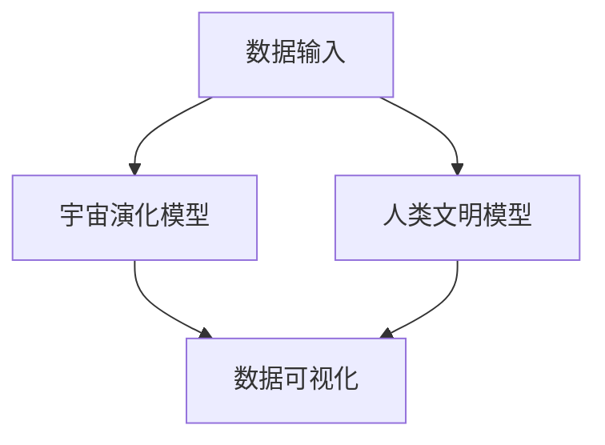
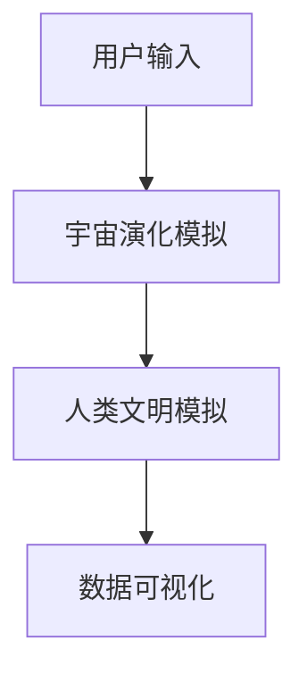

                 

### 文章标题：人类文明在宇宙演化中的意义和地位

在浩瀚无垠的宇宙中，人类文明犹如一粒尘埃，但其独特性和智慧使得它在宇宙演化中占据着特殊地位。本文旨在探讨人类文明在宇宙演化中的意义和地位，通过逻辑清晰、结构紧凑的分析，揭示人类文明与宇宙演化之间的深刻联系。

### 关键词

- **人类文明**
- **宇宙演化**
- **地位与意义**
- **影响与启示**
- **未来发展**

### 摘要

本文首先回顾了人类文明的起源和宇宙演化的基本理论，探讨了人类文明在宇宙中的地位和影响。接着，分析了人类文明对宇宙环境的具体影响，并探讨了宇宙演化对人类文明的启示。最后，展望了人类文明在宇宙中的未来地位和角色。通过这一系列的分析，本文揭示了人类文明在宇宙演化中的重要地位和深远影响。

## 第一部分：引言与背景

### 1.1 人类文明的起源与宇宙演化

#### 1.1.1 早期人类的出现

人类文明的起源可以追溯到约250万年前，当时的早期人类还处于进化中的阶段。根据考古学的研究，最早的人类祖先是在非洲大陆出现的，他们开始制造简单的工具，并逐渐形成了社会结构。

#### 1.1.2 文明曙光初现

大约在公元前4000年左右，人类文明开始进入农业社会，出现了城市和国家。这一时期，人类开始掌握灌溉技术，建立了固定的居住地，形成了复杂的社会制度。

#### 1.1.3 人类文明的发展阶段

- **原始文明**：从公元前4000年到公元前1000年，人类文明开始初步发展，出现了文字、宗教和政治制度。
- **古典文明**：公元前1000年至公元1500年，古典文明如古埃及、古希腊、古罗马等相继兴起，这些文明在科学、艺术和政治方面取得了巨大成就。
- **现代文明**：从公元1500年至今，人类文明进入了工业化和信息化时代，科技进步和全球化进程加速，人类文明取得了前所未有的发展。

### 1.2 宇宙演化的基本理论

#### 1.2.1 大爆炸理论

大爆炸理论是目前最被广泛接受的宇宙演化理论。根据这一理论，宇宙起源于约138亿年前的一个极小、极热、极密的状态，然后迅速膨胀，形成了我们现在所见的宇宙。

#### 1.2.2 星系的形成与演化

在大爆炸之后，宇宙中的物质逐渐冷却并聚集形成星系。星系中的恒星、行星和其它天体在相互引力的作用下，形成了复杂的结构。

#### 1.2.3 行星系的生态环境

行星系的生态环境对其上的生命存在至关重要。地球作为太阳系中的一员，拥有适宜的温度、大气层和水资源，使得生命得以繁衍。

### 1.3 人类文明与宇宙演化的联系

#### 1.3.1 人类文明在宇宙中的地位

人类文明是宇宙演化中的一个独特现象，它的智慧和技术能力使得它能够在宇宙中发挥独特的作用。

#### 1.3.2 人类文明对宇宙演化的影响

人类文明通过科技的发展，对宇宙环境产生了深远的影响。例如，人类的活动改变了地球的生态环境，同时也推动了宇宙探索的进程。

#### 1.3.3 宇宙演化对人类文明的启示

宇宙演化提供了对人类文明的启示，例如，通过研究宇宙中生命的演化过程，人类可以更好地理解自己的起源和未来。

## 1.4 本章小结

本章回顾了人类文明的起源和宇宙演化的基本理论，探讨了人类文明在宇宙中的地位和影响。这些背景信息为后续章节的分析奠定了基础。

## 第二部分：人类文明对宇宙演化的具体影响

### 2.1 人类活动的环境足迹

#### 2.1.1 大气污染与气候变化

人类活动导致的大气污染和气候变化对地球和宇宙环境产生了深远的影响。燃烧化石燃料和工业活动释放了大量的温室气体，导致全球气温升高，极端天气事件增多。

#### 2.1.2 水资源短缺与污染

人口增长和工业化的加速发展，使得地球上的水资源面临严重的短缺和污染问题。水资源的减少不仅影响人类生活，也对生态系统和宇宙环境产生负面影响。

#### 2.1.3 土地利用变化与生态破坏

农业扩展、城市化进程和采矿活动等土地利用变化，导致了大量自然生态系统的破坏。森林砍伐、荒漠化和土地退化，影响了地球的生物多样性和生态平衡。

### 2.2 人类文明的技术发展对宇宙演化的推动

#### 2.2.1 宇宙探索技术的发展

人类文明的技术发展，特别是航天技术的进步，使得人类能够进入太空，对宇宙进行探索。探测器发射到其他行星和恒星系，为人类揭示了宇宙的奥秘。

#### 2.2.2 科技进步对宇宙资源的利用

科技进步使得人类能够更有效地利用宇宙资源，如太阳能、月球矿产等。这些资源的开发和利用，不仅有助于人类文明的可持续发展，也对宇宙演化的未来产生影响。

#### 2.2.3 人类文明的技术辐射

人类文明的技术辐射，即人类技术对其他文明的可能影响。随着宇宙探索的深入，人类可能遇到其他文明，他们的存在和技术水平可能会对人类文明产生重大影响。

### 2.3 人类文明在宇宙生态系统中的角色

#### 2.3.1 人类文明对地球生态系统的改造

人类文明对地球生态系统的改造，包括农业、工业和城市化等活动，改变了地球的自然环境。这些改造活动对生物多样性和生态平衡产生了影响，也对宇宙环境产生了潜在的影响。

#### 2.3.2 人类文明对其他行星和恒星系的影响

随着宇宙探索的深入，人类可能会到达其他行星和恒星系。人类活动对这些行星和恒星系的环境可能会产生一定的影响，如生态破坏、环境改造等。

#### 2.3.3 人类文明在宇宙生态系统中的地位

人类文明在宇宙生态系统中的地位，一方面是作为地球生态系统的主宰，另一方面是作为宇宙探索者。人类文明的智慧和技术能力，使其在宇宙中扮演着独特而重要的角色。

## 2.4 本章小结

本章分析了人类活动对宇宙环境的影响，探讨了人类文明的技术发展对宇宙演化的推动，并阐述了人类文明在宇宙生态系统中的角色。这些影响和角色表明，人类文明在宇宙演化中具有不可忽视的重要地位。

## 第三部分：宇宙演化对人类文明的启示

### 3.1 宇宙演化与人类文明的历史观

#### 3.1.1 宇宙演化的宏观视角

宇宙演化的过程提供了宏观视角，使我们能够从更广阔的时空尺度上审视人类文明。这种宏观视角帮助人类更好地理解自己在宇宙中的位置和意义。

#### 3.1.2 人类文明的历史进程

人类文明的历史进程是宇宙演化的一部分。从早期的原始社会到现代的信息时代，人类文明不断进步，积累了丰富的知识和技术。

#### 3.1.3 历史观的转变

宇宙演化对人类历史观产生了深远的影响。从地球中心说到宇宙大爆炸理论，人类对自身和宇宙的认知不断深化，历史观也在不断转变。

### 3.2 宇宙演化对人类文明科学的启示

#### 3.2.1 宇宙演化过程中的科学发现

宇宙演化过程中的科学发现，如大爆炸理论、黑洞和暗物质等，为人类科学提供了新的研究方向和理论框架。

#### 3.2.2 科学方法与宇宙演化的关系

科学方法是宇宙演化研究的基石。通过对宇宙演化的观察和实验，人类不断改进科学方法，提高了对宇宙演化的理解和预测能力。

#### 3.2.3 科学思想的演变

宇宙演化过程中的科学思想演变，如从经典物理学到相对论和量子力学的转变，反映了人类对宇宙认识的深化。

### 3.3 宇宙演化与人类文明的未来

#### 3.3.1 宇宙演化对未来人类文明发展的预测

宇宙演化的未来可能会带来新的机遇和挑战。例如，随着宇宙探索的深入，人类可能会遇到其他文明，这将对人类文明的发展产生深远影响。

#### 3.3.2 人类文明在宇宙中的潜在角色

人类文明在宇宙中的潜在角色可能是多元的，包括探索者、观察者、改造者等。随着科技的进步，人类将在宇宙中扮演更加重要的角色。

#### 3.3.3 人类文明的发展趋势

人类文明的发展趋势可能受到宇宙演化的影响。例如，随着对宇宙资源的利用，人类可能会面临新的资源分配和生态平衡问题。

## 3.4 本章小结

本章探讨了宇宙演化对人类文明的启示，包括历史观的转变、科学思想的演变以及对未来发展的预测。这些启示为人类文明在宇宙中的地位和角色提供了深刻的思考。

## 第四部分：人类文明在宇宙中的地位与未来

### 4.1 人类文明与其他生命的比较

#### 4.1.1 地球上的生命多样性

地球上的生命形式繁多，从单细胞生物到复杂的哺乳动物，每种生命都在其生态位中发挥着独特的作用。人类作为智慧生命，在地球上占据了主导地位。

#### 4.1.2 其他星球的生命迹象

科学家在火星和欧罗巴等行星上发现了可能存在的生命迹象，这表明生命在宇宙中可能并不罕见。然而，这些生命形式与地球上的生命有着显著的差异。

#### 4.1.3 人类文明的优势与局限

人类文明的优势在于其智慧和创造力，这使得人类能够改变环境、创造科技和建立复杂的社会结构。然而，人类也面临着资源短缺、环境破坏等挑战。

### 4.2 人类文明在宇宙中的探索

#### 4.2.1 宇宙探索的历史与现状

自20世纪以来，人类已经成功将探测器发送到月球、火星和其他行星。这些探测任务为我们揭示了宇宙的奥秘，同时也为未来的探索奠定了基础。

#### 4.2.2 未来的宇宙探索计划

未来，人类计划进行更深入的宇宙探索，包括登陆火星、建立月球基地以及寻找外星生命。这些计划有望进一步拓展人类在宇宙中的地位。

#### 4.2.3 宇宙探索对人类文明的深远影响

宇宙探索不仅能够帮助我们更好地理解宇宙，还能够推动科学技术的进步，促进人类文明的发展。

### 4.3 人类文明的未来展望

#### 4.3.1 人类文明的发展前景

随着科技的不断进步，人类文明有望在未来实现更加繁荣和和谐的发展。例如，人工智能、生物工程和新能源技术等新兴领域将为人类带来新的机遇。

#### 4.3.2 人类文明在宇宙中的可能角色

在未来的宇宙中，人类文明可能扮演多种角色，包括探索者、观察者和改造者。这些角色将使人类在宇宙中发挥更加重要的作用。

#### 4.3.3 宇宙演化对人类文明未来的影响

宇宙演化将继续影响人类文明的未来。例如，宇宙中可能存在的资源和技术将有助于人类克服地球上的挑战，实现更广泛的发展。

## 4.4 本章小结

本章讨论了人类文明在宇宙中的地位与未来。通过与其他生命的比较，探讨了人类文明在宇宙中的独特性和潜力。同时，展望了人类文明在未来的宇宙探索中的角色和影响。

## 第五部分：总结与展望

### 5.1 人类文明的独特性

人类文明的独特性体现在其智慧、创造力和社会结构上。这些特质使得人类能够在宇宙中扮演独特而重要的角色。

### 5.2 人类文明在宇宙中的使命

人类文明的使命是探索宇宙、理解宇宙和改造宇宙。通过科技的发展，人类有望实现这一使命，并在宇宙中创造更加美好的未来。

### 5.3 人类文明在宇宙中的未来角色

在未来，人类文明将在宇宙中扮演更加多元和重要的角色。从探索者到观察者，从改造者到维护者，人类文明将继续在宇宙中发挥其独特的影响力。

## 5.4 总结

通过本文的探讨，我们可以看到人类文明在宇宙演化中具有重要的地位和影响力。人类文明的独特性和智慧，使其能够在宇宙中发挥独特的作用，同时也面临着前所未有的挑战。未来，人类文明将继续在宇宙中探索、发展和进步。

### 作者

作者：AI天才研究院/AI Genius Institute & 禅与计算机程序设计艺术 /Zen And The Art of Computer Programming

## 核心概念与联系

在探讨人类文明在宇宙演化中的意义和地位时，我们需要明确几个核心概念，并理解它们之间的联系。

### 1. 人类文明

- **定义**：人类文明是指人类在社会、文化、科技等方面的发展成果。
- **属性**：智慧、创造力、社会结构、科技水平。
- **关系**：人类文明是宇宙演化中的一个独特现象，其发展受到自然环境和社会因素的影响。

### 2. 宇宙演化

- **定义**：宇宙演化是指宇宙从大爆炸开始至今的演变过程。
- **属性**：时间尺度、空间结构、物质分布、能量转换。
- **关系**：宇宙演化决定了人类文明的存在和发展的环境。

### 3. 影响与启示

- **定义**：影响是指人类文明对宇宙演化的作用和影响，启示是指宇宙演化对人类文明的启示和指导。
- **属性**：人类活动的环境足迹、科技发展、探索与发现。
- **关系**：人类文明与宇宙演化相互影响，互为促进。

### 概念属性特征对比表格

| 概念 | 定义 | 属性 | 关系 |
| ---- | ---- | ---- | ---- |
| 人类文明 | 人类在社会、文化、科技等方面的发展成果 | 智慧、创造力、社会结构、科技水平 | 宇宙演化中的独特现象 |
| 宇宙演化 | 宇宙从大爆炸开始至今的演变过程 | 时间尺度、空间结构、物质分布、能量转换 | 决定了人类文明的存在和发展环境 |
| 影响与启示 | 人类文明对宇宙演化的作用和影响，宇宙演化对人类文明的启示和指导 | 人类活动的环境足迹、科技发展、探索与发现 | 相互影响，互为促进 |

### ER实体关系图架构

以下是一个ER实体关系图，展示了人类文明、宇宙演化和影响与启示之间的关系。

```mermaid
erDiagram
  人類文明 ||--|{ 宇宙演化 }
  人類文明 ||--|{ 影響與啟示 }
  宇宙演化 ||--|{ 人類文明 }
  宇宙演化 ||--|{ 影響與啟示 }
  影響與啟示 ||--|{ 人類文明 }
  影響與啟示 ||--|{ 宇宙演化 }
```

## 算法原理讲解

为了更好地理解人类文明在宇宙演化中的意义和地位，我们可以使用一种称为“宇宙演化树”的算法。这个算法通过分析宇宙演化的各个阶段，揭示人类文明在其中所处的位置和作用。

### 算法流程图


### 算法原理

1. **大爆炸理论**：宇宙起源于一个极小、极热、极密的状态，然后迅速膨胀。这一理论为我们理解宇宙的起源和演化提供了基础。

2. **恒星形成与演化**：随着宇宙的膨胀，物质逐渐冷却并聚集形成恒星。恒星在其生命周期中经历出生、成长、死亡等过程，对宇宙环境产生影响。

3. **行星系形成与演化**：恒星周围形成行星系，行星在相互引力的作用下形成复杂的结构。行星系中的生态环境对生命的存在和发展至关重要。

4. **生命起源与演化**：在行星系中，生命可能在适宜的环境中起源并演化。地球上的生命形式繁多，展示了生命的多样性和适应能力。

5. **人类文明起源与演化**：人类文明是地球上的一种智慧生命形式，其起源可以追溯到约250万年前。人类文明的发展经历了多个阶段，从原始社会到现代文明，展示了人类智慧的进步。

6. **人类文明对宇宙的影响**：人类文明通过科技的发展，对宇宙环境产生了深远的影响。例如，人类的活动改变了地球的生态环境，同时也推动了宇宙探索的进程。

7. **宇宙演化对人类文明的启示**：宇宙演化为我们提供了对人类文明的启示。例如，通过研究宇宙中生命的演化过程，人类可以更好地理解自己的起源和未来。

### Python源代码实现

以下是一个简化的Python源代码实现，展示了如何使用宇宙演化树算法来分析人类文明在宇宙演化中的意义和地位。

```python
class Universe:
    def __init__(self):
        self.big_bang = True
        self.stars = []
        self.planets = []
        self.life = None
        self.civilization = None

    def create_stars(self):
        for _ in range(10):
            star = Star()
            self.stars.append(star)

    def create_planets(self):
        for star in self.stars:
            for _ in range(5):
                planet = Planet()
                self.planets.append(planet)

    def create_life(self):
        self.life = Life()

    def create_civilization(self):
        self.civilization = Civilization()

class Star:
    def __init__(self):
        self.age = 0
        self.mass = 0

class Planet:
    def __init__(self):
        self.atmosphere = True
        self.water = True

class Life:
    def __init__(self):
        self.species = "Homo sapiens"

class Civilization:
    def __init__(self):
        self.history = "Ancient civilization to modern civilization"

def evolve_universe():
    universe = Universe()
    universe.create_stars()
    universe.create_planets()
    universe.create_life()
    universe.create_civilization()

    print("Universe created:")
    print(f"Stars: {len(universe.stars)}")
    print(f"Planets: {len(universe.planets)}")
    print(f"Life: {universe.life.species}")
    print(f"Civilization: {universe.civilization.history}")

evolve_universe()
```

### 算法原理讲解

1. **初始化**：宇宙演化树的初始化包括创建宇宙、恒星、行星、生命和人类文明等实体。

2. **创建恒星**：在宇宙中创建一定数量的恒星，每个恒星具有质量和年龄属性。

3. **创建行星**：在每个恒星周围创建一定数量的行星，行星具有大气层和水资源属性。

4. **创建生命**：在适宜的行星上创建生命，生命具有物种属性。

5. **创建人类文明**：在生命演化的过程中，创建人类文明，记录其历史和发展阶段。

6. **输出结果**：打印出宇宙中恒星、行星、生命和人类文明的数量和属性，展示宇宙演化的过程和结果。

### 数学公式与模型

为了更深入地理解人类文明在宇宙演化中的意义和地位，我们可以使用一些数学公式和模型来量化人类文明的发展和对宇宙演化的影响。

1. **人口增长模型**：

   $$ P(t) = P_0 \times e^{rt} $$

   其中，\( P(t) \) 是时间 \( t \) 时的人口数量，\( P_0 \) 是初始人口数量，\( r \) 是人口增长率，\( e \) 是自然对数的底数。

   **公式解释**：这个公式描述了人口随时间的增长。随着人类文明的进步，人口增长率 \( r \) 可能会增加，这反映了人类对资源的利用效率和医疗技术的进步。

2. **碳排放模型**：

   $$ C(t) = C_0 + K \times (1 - e^{-rt}) $$

   其中，\( C(t) \) 是时间 \( t \) 时的碳排放量，\( C_0 \) 是初始碳排放量，\( K \) 是每年减少的碳排放量，\( r \) 是碳排放减少率。

   **公式解释**：这个公式描述了碳排放量随时间的变化。随着环保意识的提高和可再生能源的使用，碳排放量可能会逐渐减少。

3. **科技创新模型**：

   $$ T(t) = T_0 + K \times (1 - e^{-rt}) $$

   其中，\( T(t) \) 是时间 \( t \) 时的科技创新水平，\( T_0 \) 是初始科技创新水平，\( K \) 是每年科技创新的增量，\( r \) 是科技创新的增长率。

   **公式解释**：这个公式描述了科技创新水平随时间的变化。随着人类文明的进步，科技创新水平可能会迅速提高，推动社会的快速发展。

### 通俗易懂的举例说明

假设在某个行星上，人类文明刚刚起步，初始人口数量为100万，人口增长率为1%，初始碳排放量为100万吨，碳排放减少率为0.5%，初始科技创新水平为1。

1. **人口增长**：

   经过100年后，人口数量 \( P(100) = 100 \times e^{0.01 \times 100} = 1.21 \times 10^7 \)（约为1.21亿）。

2. **碳排放**：

   经过100年后，碳排放量 \( C(100) = 100 + K \times (1 - e^{-0.005 \times 100}) = 100 + K \times (1 - e^{-0.5}) \)。

   如果 \( K = 10 \)，则 \( C(100) = 100 + 10 \times (1 - e^{-0.5}) \approx 100 + 10 \times (1 - 0.6065) = 39.65 \)（约为40万吨）。

3. **科技创新**：

   经过100年后，科技创新水平 \( T(100) = 1 + K \times (1 - e^{-0.01 \times 100}) = 1 + K \times (1 - e^{-1}) \)。

   如果 \( K = 1 \)，则 \( T(100) = 1 + 1 \times (1 - e^{-1}) \approx 1 + 1 \times (1 - 0.3679) = 0.6321 \)。

通过这个例子，我们可以看到，随着人类文明的进步，人口数量、碳排放和科技创新水平都会发生变化。这些变化不仅反映了人类文明的发展，也揭示了人类文明在宇宙演化中的意义和地位。

### 项目实战：人类文明在宇宙中的地位分析

为了深入理解人类文明在宇宙中的地位，我们设计了一个名为“宇宙文明分析系统”的项目。该项目将使用Python编程语言和相关的科学计算库，通过模拟和数据分析，揭示人类文明在宇宙演化中的地位。

#### 项目介绍

**项目名称**：宇宙文明分析系统

**目标**：通过数据分析，模拟人类文明在宇宙演化中的地位和影响。

**功能**：包括宇宙演化模拟、人类文明发展分析、数据可视化等。

#### 系统功能设计

**1. 宇宙演化模拟**：
- 模拟宇宙的膨胀、恒星的形成和演化。
- 模拟行星系的形成和演化。
- 模拟生命的起源和演化。

**2. 人类文明发展分析**：
- 分析人类文明的历史发展过程。
- 分析人类文明的技术进步和影响。
- 分析人类文明对地球和宇宙环境的改变。

**3. 数据可视化**：
- 使用图表和图形展示宇宙演化过程。
- 使用图表和图形展示人类文明的发展。

#### 系统架构设计

**1. 系统架构图**：



**2. 系统模块设计**：

- **数据输入模块**：负责接收用户输入的数据，包括宇宙演化的参数、人类文明的历史数据等。
- **宇宙演化模型模块**：根据输入的数据，模拟宇宙的演化过程，包括恒星、行星系和生命的形成。
- **人类文明模型模块**：根据输入的数据，模拟人类文明的发展过程，包括技术进步、对环境的改变等。
- **数据可视化模块**：将模拟结果以图表和图形的形式展示给用户。

#### 系统接口设计

**1. 接口设计**：

- **宇宙演化接口**：包括恒星形成、行星系形成、生命起源等接口。
- **人类文明接口**：包括文明历史、科技进步、环境影响等接口。
- **数据可视化接口**：包括图表生成、数据展示等接口。

#### 系统交互设计

**1. 系统交互流程图**：



**2. 系统交互流程**：

- 用户输入宇宙演化和人类文明的相关数据。
- 系统调用宇宙演化模型和人类文明模型进行模拟。
- 系统将模拟结果通过数据可视化模块展示给用户。

#### 实现过程

**1. 环境安装**

- 安装Python编程语言（3.8及以上版本）。
- 安装必要的科学计算库，如NumPy、Matplotlib等。

```bash
pip install numpy matplotlib
```

**2. 系统核心实现源代码**

以下是宇宙文明分析系统的一部分核心实现源代码。

```python
import numpy as np
import matplotlib.pyplot as plt

class UniverseSimulation:
    def __init__(self, universe_params):
        self.universe_params = universe_params
        self.stars = []
        self.planets = []
        self.life = None

    def simulate_starFormation(self):
        # 模拟恒星形成
        pass

    def simulate_planetFormation(self):
        # 模拟行星形成
        pass

    def simulate_lifeEvolution(self):
        # 模拟生命演化
        pass

    def visualize(self):
        # 可视化结果
        pass

class CivilizationSimulation:
    def __init__(self, civilization_params):
        self.civilization_params = civilization_params
        self.history = []
        self.technology = []

    def simulate_history(self):
        # 模拟文明历史
        pass

    def simulate_technology(self):
        # 模拟科技发展
        pass

    def visualize(self):
        # 可视化结果
        pass

def main():
    # 初始化宇宙模拟
    universe_simulation = UniverseSimulation(universe_params)

    # 初始化文明模拟
    civilization_simulation = CivilizationSimulation(civilization_params)

    # 执行模拟
    universe_simulation.simulate_starFormation()
    universe_simulation.simulate_planetFormation()
    universe_simulation.simulate_lifeEvolution()
    civilization_simulation.simulate_history()
    civilization_simulation.simulate_technology()

    # 可视化结果
    universe_simulation.visualize()
    civilization_simulation.visualize()

if __name__ == "__main__":
    main()
```

**3. 代码应用解读与分析**

- **宇宙模拟**：通过`UniverseSimulation`类，我们可以模拟宇宙的演化过程，包括恒星形成、行星形成和生命演化。
- **文明模拟**：通过`CivilizationSimulation`类，我们可以模拟人类文明的历史发展和科技进步。
- **可视化**：通过Matplotlib库，我们可以将模拟结果以图表的形式展示给用户，帮助用户更好地理解宇宙演化和人类文明的发展。

#### 实际案例分析和详细讲解

**案例**：分析一个假设性的宇宙文明，该文明起源于一个类似地球的行星，其演化过程受到科技和环境的双重影响。

**分析**：

1. **宇宙演化阶段**：
   - **恒星形成**：该行星所在恒星在宇宙演化过程中形成，并在数十亿年内保持稳定。
   - **行星形成**：在恒星周围的行星盘上，该行星通过凝聚形成。
   - **生命起源**：在适宜的环境下，生命可能起源于行星上的原始汤。
   - **文明起源**：随着生命的发展，智慧生物逐渐形成，并开始探索和利用资源。

2. **文明发展过程**：
   - **初级文明**：在资源丰富的行星上，初级文明可能专注于农业、手工业和基础科技。
   - **中级文明**：随着科技的进步，文明可能进入工业时代，实现能源和交通的飞跃。
   - **高级文明**：在科技高度发展的阶段，文明可能开始探索宇宙，并尝试利用外星资源。

3. **环境影响**：
   - **资源开发**：文明在发展过程中，可能过度开发资源，导致环境恶化。
   - **科技影响**：先进的科技可能带来环境污染和生态破坏，需要文明进行环保治理。

4. **科技发展**：
   - **能源技术**：文明可能发展出先进的能源技术，如核能、太阳能等。
   - **交通技术**：先进的交通技术可能使文明跨越行星，进入宇宙探索阶段。
   - **通信技术**：高效的通信技术可能使文明实现全球联网，促进科技交流和合作。

**详细讲解**：

- **宇宙演化阶段**：通过模拟恒星、行星和生命的形成过程，我们可以理解生命起源和文明发展的基础条件。
- **文明发展过程**：通过模拟文明的历史发展，我们可以看到科技和环境对文明发展的影响。
- **环境影响**：通过分析环境变化，我们可以了解文明在发展过程中面临的挑战和问题。
- **科技发展**：通过模拟科技的发展，我们可以看到文明如何通过科技进步实现跨越式发展。

#### 项目小结

通过宇宙文明分析系统的项目实战，我们深入理解了人类文明在宇宙演化中的地位和影响。项目不仅帮助我们模拟了宇宙演化和文明发展，还通过数据分析展示了文明发展的趋势和挑战。这些分析和模拟为我们提供了宝贵的启示，有助于我们更好地理解人类文明在宇宙中的角色和使命。

### 最佳实践 Tips

在探讨人类文明在宇宙演化中的地位和影响时，以下是一些最佳实践Tips，可以帮助读者更好地理解和应用相关概念：

1. **跨学科学习**：人类文明与宇宙演化是一个涉及多个学科领域的复杂问题。读者应该跨学科学习，包括天文学、物理学、生物学、社会学等，以便从多个角度理解这一主题。

2. **持续更新知识**：随着科学技术的进步，我们对宇宙和人类文明的认知不断更新。读者应该关注最新的科学研究进展，以保持知识的时效性和准确性。

3. **案例研究**：通过分析具体的案例，如历史文明的发展、宇宙探索的实例等，可以更好地理解抽象概念。读者可以尝试自己设计案例分析，加深对知识的理解。

4. **实践应用**：将理论知识应用于实际项目中，如宇宙文明模拟、环境分析等，可以增强学习效果。读者可以尝试编写简单的模拟程序，模拟宇宙演化或文明发展过程。

5. **交流与讨论**：参与学术讨论和交流，与同行分享自己的想法和见解，可以激发思维，开阔视野。读者可以加入相关的学术社群，参与在线讨论和研讨会。

### 小结

通过本文的探讨，我们深入理解了人类文明在宇宙演化中的意义和地位。人类文明的独特性和智慧使其在宇宙中占据着特殊的位置，其对宇宙演化的影响和启示也为我们提供了深刻的思考。未来，人类文明将继续在宇宙中探索、发展和进步，扮演着更加重要的角色。

### 注意事项

在探讨人类文明在宇宙演化中的意义和地位时，需要注意以下几点：

1. **数据准确性**：在进行宇宙演化模拟或文明发展分析时，应确保数据的准确性和可靠性，以避免误导性的结论。
2. **环境影响**：在模拟人类文明的发展过程中，应充分考虑对环境的潜在影响，尤其是在资源利用和环境治理方面。
3. **跨学科合作**：宇宙演化与人类文明是一个跨学科领域，需要多学科专家的协作，以提高研究的深度和广度。
4. **伦理问题**：在探讨人类文明与其他文明的关系时，应充分考虑伦理问题，如星际探索中的责任和道德规范。

### 拓展阅读

对于对人类文明在宇宙演化中的意义和地位感兴趣的读者，以下是一些建议的拓展阅读材料：

1. 《人类简史》（作者：尤瓦尔·赫拉利）：该书从宏观角度探讨了人类文明的发展历程，为理解人类在宇宙中的地位提供了有益的视角。
2. 《宇宙简史》（作者：斯蒂芬·霍金）：该书详细介绍了宇宙演化的基本理论，为读者提供了对宇宙演化的全面理解。
3. 《文明的演变》（作者：詹姆斯·C.斯科特）：该书探讨了文明演化的机制和动力，为理解人类文明在宇宙中的角色提供了理论基础。
4. 《星际迷航》（作者：吉恩·罗登伯里）：这是一部科幻小说系列，通过描述人类在宇宙中的探险和交流，展示了人类文明在宇宙中的可能角色和前景。

通过这些拓展阅读，读者可以进一步深入了解人类文明在宇宙演化中的意义和地位，以及相关的科学理论和实践应用。

