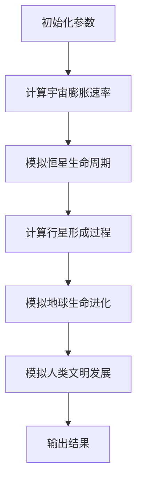
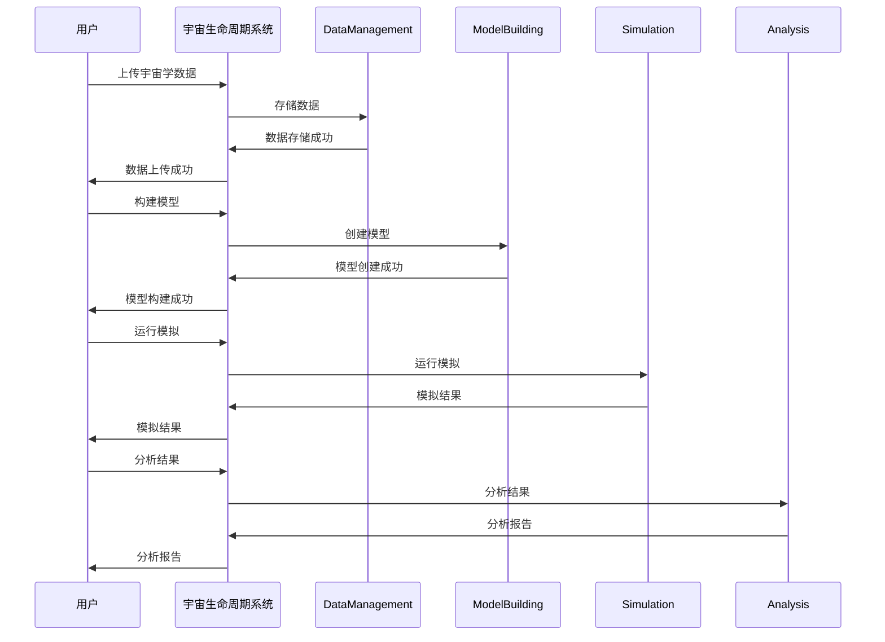

                 


### 摘要

本文旨在探讨人类文明在宇宙生命周期中的阶段定位。我们将从宇宙起源、生命演化到人类文明的发展历程，逐步分析人类文明在宇宙中的位置和作用。本文将首先介绍宇宙生命周期的基本概念，包括宇宙的起源和演化、生命的起源和进化，以及人类文明的起源和发展。接着，我们将详细讨论人类文明在宇宙生命周期中的不同阶段，如初期阶段、发展阶段、成熟阶段和衰退阶段。通过对比宇宙生命周期各阶段的核心概念和属性特征，我们将构建出宇宙生命周期的ER实体关系图，进一步阐述人类文明在宇宙生命周期中的定位。随后，我们将探讨宇宙生命周期算法的原理，使用Mermaid画出算法流程图，并结合Python源代码进行详细讲解和举例说明。在此基础上，我们将对宇宙生命周期系统进行分析和架构设计，包括问题场景介绍、系统功能设计、系统架构设计、系统接口设计和系统交互序列图。最后，我们将通过项目实战，详细讲解宇宙生命周期项目的实现过程，包括环境安装、系统核心实现源代码、代码应用解读与分析、实际案例分析和项目小结。通过本文的深入探讨，我们希望能够为读者提供对人类文明在宇宙生命周期中的阶段定位的新视角和思考。

## 第一部分：背景介绍

### 第1章：宇宙生命周期的基本概念

#### 1.1 问题的背景与描述

宇宙生命周期的探讨，源于对宇宙演化过程及其内在规律的深刻理解。宇宙的起源与演化，从大爆炸开始，历经数十亿年的漫长岁月，形成了我们现在所看到的宇宙图景。与此同时，生命的起源和进化也在这一过程中悄然发生，从最初的单细胞生物到复杂的生态系统，生命不断演变，逐步占据了地球的每一个角落。那么，在这广袤的宇宙中，人类文明又是如何定位自己的？

人类文明作为宇宙演化过程中的一个独特现象，其发展历程堪称一部丰富多彩的历史。从原始社会的狩猎采集，到农业文明的兴起，再到工业革命和信息技术时代的到来，人类文明在短短数千年内经历了翻天覆地的变化。在这个过程中，人类不仅改变了自己的生存环境，也在不断地探索和拓展未知领域。那么，人类文明在宇宙生命周期中究竟处于哪个阶段？它与宇宙的演化有着怎样的联系？这是我们需要深入探讨的问题。

探讨这个问题，不仅有助于我们理解人类文明在宇宙中的地位，还能为未来科技发展和社会进步提供有益的启示。通过对宇宙生命周期的分析，我们可以更好地把握宇宙演化的规律，为应对潜在的宇宙风险和挑战提供科学依据。同时，了解人类文明在宇宙生命周期中的阶段定位，也有助于我们反思自身的使命和责任，推动人类文明朝着更加美好的方向发展。

#### 1.2 问题解决

要解决人类文明在宇宙生命周期中的阶段定位问题，我们需要从多个角度进行深入分析。首先，我们要明确宇宙生命周期的基本概念，了解宇宙的起源、演化和结构。接着，我们需要探讨生命的起源和进化过程，以及地球上生命多样性的形成机制。在此基础上，我们再分析人类文明的发展历程，揭示人类文明在宇宙生命周期中的具体位置。

具体来说，我们可以通过以下几个步骤来解决问题：

1. **研究宇宙的起源和演化**：了解宇宙从大爆炸到现在的演化历程，包括宇宙的膨胀、恒星和星系的形成等。这将为我们提供宇宙生命周期的宏观背景。

2. **探讨生命的起源和进化**：研究地球上生命的起源，包括原始生命的形成、生物大爆发的过程等。这有助于我们理解生命在宇宙中的位置和作用。

3. **分析人类文明的发展历程**：研究人类文明从起源到现在的演变过程，包括农业革命、工业革命和信息技术革命等。这有助于我们了解人类文明在宇宙生命周期中的具体位置。

4. **对比宇宙生命周期各阶段的特征**：通过对比宇宙生命周期各阶段的特征，构建出人类文明在宇宙生命周期中的定位模型。

5. **探讨宇宙生命周期算法**：研究宇宙生命周期算法的原理和数学模型，使用Python源代码进行详细讲解和举例说明。

6. **分析宇宙生命周期系统**：从系统架构和功能设计的角度，分析宇宙生命周期系统的实现过程。

7. **项目实战**：通过实际案例，展示宇宙生命周期项目的实现方法和效果。

通过这些步骤，我们可以逐步解答人类文明在宇宙生命周期中的阶段定位问题，为未来科技发展和社会进步提供有益的参考。

#### 1.3 边界与外延

在探讨人类文明在宇宙生命周期中的阶段定位时，我们需要明确几个关键概念的外延和边界，以便为后续的分析和讨论提供清晰的背景。

首先，宇宙的边界与外延。根据现代宇宙学的理解，宇宙的边界是一个相对的概念。大爆炸理论认为，宇宙起源于一个极热、极密的状态，随后开始膨胀。目前，我们所能观测到的宇宙边界，即宇宙的可观测边界，称为宇宙视界。然而，宇宙的真实边界可能远超出我们所能观测的范围，甚至可能不存在明确的边界。因此，宇宙的边界和外延是一个不断扩展和探索的领域。

其次，生命的边界与外延。生命的起源可以追溯到地球早期，当时地球的环境与现在大相径庭。随着地球环境的变迁，生命逐渐在地球上繁衍生息，形成了丰富多彩的生物多样性。然而，生命的边界不仅限于地球，随着宇宙探测技术的发展，我们已经在其他星球和卫星上发现了生命的痕迹，例如火星的极地冰层下可能存在液态水，木星的卫星欧罗巴可能拥有液态水海洋。因此，生命的边界和外延也在不断扩展。

最后，人类文明的边界与外延。人类文明起源于地球，但随着科技的发展，人类的活动范围已不仅限于地球。我们通过太空探测、航天技术和深空探测，将人类文明的足迹扩展到月球、火星甚至更远的星球。同时，互联网、卫星通信和远程操作技术的进步，使得人类文明的影响力超越了物理空间的限制，形成了全球化的社会和经济体系。因此，人类文明的边界和外延也在不断扩展。

综上所述，宇宙、生命和人类文明的边界与外延是不断变化和扩展的，这为我们探讨人类文明在宇宙生命周期中的阶段定位提供了广阔的背景和空间。

#### 1.4 概念结构与核心要素组成

为了深入探讨人类文明在宇宙生命周期中的阶段定位，我们需要构建一个清晰的概念结构，明确各个核心要素及其相互关系。以下是宇宙、生命和人类文明的基本概念结构及其核心要素组成：

1. **宇宙**

   - **物质**：宇宙中所有构成物质的基本元素，如原子、分子等。
   - **能量**：宇宙中的各种能量形式，如光能、热能、电能等。
   - **时间**：宇宙的演化过程，以大爆炸为起点，至今已有约138亿年的历史。
   - **空间**：宇宙的三维结构，包括星系、恒星、行星等。

2. **生命**

   - **有机体**：生命的最基本单位，由细胞构成，具有新陈代谢、生长、繁殖等特征。
   - **生态系统**：生命在地球上形成的复杂网络，包括生物群落、生物圈等。
   - **进化**：生命在漫长的时间尺度上，通过自然选择、基因变异等机制不断演化的过程。

3. **人类文明**

   - **文化**：人类在社会实践中创造的各种精神和物质财富，包括语言、艺术、宗教、法律等。
   - **技术**：人类利用自然规律和资源进行创新和发明的成果，如工具、机器、计算机等。
   - **社会**：人类为了共同生活和合作而形成的社会组织，包括家庭、国家、社区等。
   - **经济**：人类在社会实践中进行生产和分配财富的机制，包括商品、货币、市场等。

通过上述概念结构，我们可以看出宇宙、生命和人类文明之间存在着密切的联系。宇宙为生命的起源和进化提供了基础，生命在地球上形成了丰富多彩的生态系统，而人类文明则是在这一基础上不断发展的。人类文明不仅改变了地球的生态环境，也在不断探索和拓展宇宙的边界。理解这些核心要素及其相互关系，有助于我们更深入地探讨人类文明在宇宙生命周期中的阶段定位。

### 第2章：宇宙生命周期的核心概念

#### 2.1 宇宙生命周期的定义

宇宙生命周期是指从宇宙大爆炸开始，到宇宙最终命运为止的整个演化过程。它涵盖了宇宙的起源、演化、稳定状态以及可能的终结。这一概念为我们提供了一个宏观的视角，来理解宇宙中的各种现象和过程。

宇宙生命周期的起源可以追溯到约138亿年前的大爆炸。据宇宙学理论，宇宙在大爆炸时从一个极热、极密的奇点开始膨胀，形成了我们现在所观测到的宇宙。这一理论为我们描述宇宙的起源提供了一个基本的框架。

在宇宙大爆炸之后，宇宙经历了快速膨胀阶段，温度和密度迅速降低。随着宇宙的膨胀，温度逐渐降低，使得宇宙中的基本粒子得以形成。在接下来的数十亿年内，宇宙继续膨胀，形成了各种天体，如恒星、星系和星云。这些天体的形成和演化，构成了宇宙生命周期的早期阶段。

宇宙生命周期的核心特征包括：

1. **膨胀与冷却**：宇宙从大爆炸后开始膨胀，温度和密度逐渐降低，为天体的形成和演化提供了条件。
2. **物质与能量**：宇宙中充满了物质和能量，这些物质和能量在宇宙演化过程中不断相互作用，形成了复杂的结构。
3. **恒星与星系**：恒星和星系的演化是宇宙生命周期中的重要过程。恒星通过核聚变产生能量，而星系则通过引力和其他相互作用形成和演化。
4. **生命的起源与进化**：地球上的生命起源于约40亿年前，随后经历了漫长的进化过程，形成了丰富多彩的生物多样性。
5. **文明的崛起与繁荣**：人类文明作为宇宙演化过程中的一个独特现象，从数千年前开始崛起，并逐步发展壮大。

理解宇宙生命周期的定义和核心特征，有助于我们更好地把握宇宙演化的规律，以及人类文明在宇宙中的地位和作用。

#### 2.2 人类文明在宇宙生命周期中的阶段

人类文明在宇宙生命周期中的发展历程可以分为四个主要阶段：初期阶段、发展阶段、成熟阶段和衰退阶段。每个阶段都有其独特的特征和意义，对人类文明的演变和宇宙的演化产生了深远的影响。

**初期阶段：起源与启蒙**

初期阶段指的是人类文明从原始社会到农业革命的过程。在这个阶段，人类开始从狩猎采集过渡到农业生产，形成了最早的文明。这一阶段的主要特征包括：

1. **工具与技术的进步**：人类发明和使用了各种简单工具，如石斧、石刀等，提高了生产效率。
2. **农业革命**：人类开始驯化动植物，发展农业，从而实现了对食物的稳定供应，为文明的发展奠定了基础。
3. **城市兴起**：随着农业的发展，人口逐渐增多，城市开始兴起，形成了早期的文明中心。
4. **宗教与文化的兴起**：在这一阶段，人类开始建立宗教信仰，形成了初步的文化体系。

**发展阶段：农业文明与工业革命**

发展阶段是指人类文明从农业文明到工业革命的过程。这一阶段的主要特征包括：

1. **农业文明**：农业革命后的社会逐渐发展壮大，形成了各种文明，如古埃及、古希腊、古罗马等。
2. **手工业与商业**：随着农业的发展，手工业和商业也逐渐兴起，促进了经济的发展。
3. **科学技术的进步**：这一阶段，科学技术的进步开始对文明的发展产生深远影响，如古希腊的数学、物理学，中国的四大发明等。
4. **工业革命**：18世纪末至19世纪初，工业革命在英国兴起，随后蔓延到全球。这一革命极大地提高了生产效率，推动了社会经济的快速发展。

**成熟阶段：信息技术革命与全球化**

成熟阶段是指人类文明进入信息技术革命和全球化时代的过程。这一阶段的主要特征包括：

1. **信息技术革命**：20世纪末，计算机和互联网技术的快速发展，彻底改变了人类的生活方式和社会结构。
2. **全球化的推动**：全球化进程加速，各国之间的经济、文化、科技交流日益频繁，形成了全球化的社会体系。
3. **科技进步的持续推动**：人工智能、大数据、云计算等新兴技术不断涌现，进一步推动了社会经济的发展。
4. **文明冲突与融合**：在全球化背景下，不同文明之间的冲突与融合愈发显著，文明之间的相互影响和借鉴成为主流。

**衰退阶段：文明衰落与重生**

衰退阶段是指人类文明面临挑战和危机，逐步走向衰落的过程。这一阶段的主要特征包括：

1. **环境问题**：人类在追求经济发展的过程中，过度消耗资源，导致环境问题日益严重，对人类文明的发展构成了威胁。
2. **社会矛盾**：全球化背景下，不同国家和地区之间的经济、文化、政治矛盾愈发突出，社会动荡加剧。
3. **文明更替**：随着新的科技和文明的崛起，旧的文明可能会逐渐衰落，为新的文明发展让路。
4. **文明重生**：在衰退过程中，人类可能会反思和总结经验教训，推动文明的重生和发展。

通过对人类文明在宇宙生命周期中的阶段分析，我们可以更清晰地理解人类文明的发展历程和面临的挑战。这有助于我们更好地把握人类文明的未来发展方向，为人类社会的持续繁荣和进步提供有益的启示。

#### 2.3 核心概念属性特征对比表格

在探讨宇宙生命周期时，我们需要对核心概念及其属性特征进行详细的对比，以帮助我们更好地理解它们在宇宙演化过程中的作用和地位。以下是宇宙生命周期各阶段的核心概念及其属性特征对比表格。

| 阶段 | 名称 | 特征描述 | 作用 |
| ---- | ---- | ---- | ---- |
| 初期阶段 | 宇宙大爆炸 | 高温、高密度、快速膨胀 | 宇宙起源 |
| 发展阶段 | 星系形成与演化 | 恒星、行星、星云的生成 | 宇宙结构 |
| 成熟阶段 | 生命起源与进化 | 生物多样性、生态系统 | 生命支持 |
| 衰退阶段 | 文明兴起与衰落 | 科技发展、环境问题 | 文明更替 |

**初期阶段**

- **特征描述**：宇宙大爆炸后，宇宙经历快速膨胀，温度和密度逐渐降低，物质和能量开始分离。
- **作用**：宇宙的起源和早期演化，为后续阶段的物质和能量分布奠定了基础。

**发展阶段**

- **特征描述**：恒星、行星、星云等天体逐渐形成，宇宙结构逐步稳定。
- **作用**：宇宙的演化和结构形成，为生命的起源提供了必要的条件。

**成熟阶段**

- **特征描述**：地球上生命的起源和进化，形成多样化的生态系统。
- **作用**：生命的支撑和演化，为人类文明的崛起提供了基础。

**衰退阶段**

- **特征描述**：人类文明的兴起和衰落，科技发展带来的环境问题。
- **作用**：文明的更替和发展，对宇宙的生命周期产生深远影响。

通过对这些核心概念属性特征的对比，我们可以更好地理解宇宙生命周期各阶段的作用和地位，从而为人类文明的未来发展提供有益的启示。

#### 2.4 ER实体关系图架构

为了更好地理解宇宙生命周期中的核心概念及其相互关系，我们可以通过ER（实体-关系）图来表示。ER图能够清晰地展示各个实体及其之间的关系，帮助我们更好地把握宇宙生命周期的整体结构。

以下是一个简化的宇宙生命周期ER实体关系图：

```mermaid
erDiagram
  |--( 宇宙 )
  |  |--( 物质 )
  |  |--( 能量 )
  |  |--( 时间 )
  |  |--( 空间 )
  |--( 生命 )
      |--( 有机体 )
      |--( 生态系统 )
      |--( 进化 )
  |--( 人类文明 )
      |--( 文化 )
      |--( 技术 )
      |--( 社会 )
      |--( 经济 )
```

在这个ER图中，我们可以看到以下几个主要实体及其相互关系：

1. **宇宙**：包括物质、能量、时间、空间四个核心要素，它们共同构成了宇宙的基础结构。
2. **生命**：以有机体、生态系统和进化为核心，展示了生命在宇宙中的演化过程。
3. **人类文明**：由文化、技术、社会和经济四个方面组成，展示了人类在地球上形成和发展的文明体系。

通过ER实体关系图，我们可以直观地理解宇宙生命周期中的核心概念及其相互关系，为进一步探讨宇宙生命周期的阶段定位提供了有力的工具。

### 第三部分：算法原理讲解

#### 3.1 算法原理介绍

在探讨宇宙生命周期的阶段定位时，我们可以借助宇宙生命周期算法来帮助我们理解宇宙的演化过程以及人类文明在其中的位置。该算法基于对宇宙物理定律和生命进化理论的数学建模，旨在模拟和预测宇宙的演化过程，以及人类文明在不同阶段的演变。

宇宙生命周期算法的基本原理可以概括为以下几方面：

1. **宇宙演化模型**：算法首先基于宇宙学理论，模拟宇宙从大爆炸开始，到当前状态的演化过程。这一过程包括宇宙的膨胀、恒星和星系的形成、宇宙微波背景辐射的产生等。

2. **生命进化模型**：在此基础上，算法进一步模拟地球上的生命进化过程。从单细胞生物的起源，到复杂生物物种的形成，再到生物多样性的发展。

3. **人类文明发展模型**：算法还涵盖了人类文明的发展历程，从原始社会到农业革命，再到工业革命和信息技术革命，最终形成全球化的现代社会。

4. **阶段定位**：通过对比宇宙生命周期不同阶段的特征，算法能够定位人类文明在宇宙生命周期中的具体位置，揭示人类文明在不同阶段的特点和挑战。

宇宙生命周期算法不仅能够帮助我们更好地理解宇宙的演化过程和人类文明的发展，还能为未来的科技发展和社会进步提供有益的参考。它可以在多个应用场景中发挥作用，如宇宙探测、环境预测、资源管理、社会规划等。

#### 3.2 数学模型和公式

宇宙生命周期算法的数学模型和公式是理解其工作原理的关键。以下是几个核心的数学模型和公式的简要说明：

1. **哈勃定律**：描述宇宙膨胀速率与距离之间的关系。公式为：
   $$ v = H_0 \times d $$
   其中，\( v \) 表示宇宙膨胀速率，\( H_0 \) 表示哈勃常数，\( d \) 表示天体之间的距离。

2. **恒星生命周期模型**：描述恒星从诞生到死亡的演化过程。公式为：
   $$ \frac{dM}{dt} = -\dot{M}_f $$
   其中，\( M \) 表示恒星质量，\( \dot{M}_f \) 表示恒星质量损失率。

3. **行星形成模型**：描述行星在恒星周围的形成的物理过程。公式为：
   $$ M_p = \frac{1}{3} \rho_p \pi R_p^3 $$
   其中，\( M_p \) 表示行星质量，\( \rho_p \) 表示行星平均密度，\( R_p \) 表示行星半径。

4. **地球生命进化模型**：描述地球上生命进化过程的数学模型。公式为：
   $$ f(t) = \frac{1}{1 + e^{-\lambda t}} $$
   其中，\( f(t) \) 表示某一物种在时间\( t \)时的生存概率，\( \lambda \) 表示进化速率。

5. **人类文明发展阶段模型**：描述人类文明从原始社会到现代社会的演化过程。公式为：
   $$ g(t) = \frac{1}{1 + e^{-\mu t}} $$
   其中，\( g(t) \) 表示人类文明在时间\( t \)时的成熟度，\( \mu \) 表示文明进化速率。

通过这些数学模型和公式，宇宙生命周期算法能够模拟和预测宇宙的演化过程，以及人类文明在不同阶段的发展特点。这些模型不仅为算法提供了理论基础，也为后续的详细讲解和举例说明奠定了基础。

#### 3.3 算法流程图

为了更好地展示宇宙生命周期算法的运行过程，我们可以使用Mermaid绘制算法的流程图。以下是宇宙生命周期算法的流程图：



**详细说明：**

1. **初始化参数**：首先，我们需要初始化宇宙的初始参数，包括宇宙的膨胀速率、恒星的质量损失率、行星的密度和半径等。

2. **计算宇宙膨胀速率**：根据哈勃定律，计算当前宇宙的膨胀速率。这一步骤是后续模拟恒星生命周期和行星形成的基础。

3. **模拟恒星生命周期**：基于恒星生命周期模型，计算恒星从诞生到死亡的整个过程。这一过程包括恒星的质量损失、核心坍缩、超新星爆发等阶段。

4. **计算行星形成过程**：根据行星形成模型，模拟行星在恒星周围的生成过程。这一步骤涉及行星质量、密度和半径的计算。

5. **模拟地球生命进化**：基于地球生命进化模型，计算地球上生命的进化过程。这一步骤包括从单细胞生物到复杂生物物种的形成，以及生物多样性的发展。

6. **模拟人类文明发展**：基于人类文明发展阶段模型，计算人类文明从原始社会到现代社会的演化过程。这一步骤涉及文明成熟度、科技水平和社会发展的计算。

7. **输出结果**：最后，算法输出宇宙生命周期模拟的结果，包括宇宙的膨胀历史、恒星和行星的演化过程、地球生命进化过程以及人类文明的发展情况。

通过这个流程图，我们可以清晰地看到宇宙生命周期算法的运行步骤和各步骤之间的逻辑关系。这有助于我们更好地理解算法的原理和实现方法。

#### 3.4 详细讲解与举例说明

为了更好地理解宇宙生命周期算法的原理和实现方法，我们将通过一个具体的例子来详细讲解算法的运行过程。以下是一个简化的例子：

**假设**：

- 宇宙膨胀速率：\( H_0 = 70 \text{ km/s/Mpc} \)
- 恒星质量：\( M = 1.989 \times 10^{30} \text{ kg} \)
- 恒星质量损失率：\( \dot{M}_f = 10^{-10} \text{ kg/s} \)
- 行星密度：\( \rho_p = 5514 \text{ kg/m}^3 \)
- 行星半径：\( R_p = 6371 \text{ km} \)
- 地球生命进化速率：\( \lambda = 1 \text{亿年}^{-1} \)
- 人类文明进化速率：\( \mu = 100 \text{年}^{-1} \)

**步骤1：初始化参数**

首先，我们需要初始化上述参数。这将作为算法模拟宇宙生命周期的基础。

```python
H0 = 70 # 宇宙膨胀速率 (km/s/Mpc)
M = 1.989e30 # 恒星质量 (kg)
M_dot = 1e-10 # 恒星质量损失率 (kg/s)
rho_p = 5514 # 行星密度 (kg/m^3)
R_p = 6371e3 # 行星半径 (km)
lambda_life = 1e-8 # 地球生命进化速率 (亿年^-1)
mu_civil = 100 # 人类文明进化速率 (年^-1)
```

**步骤2：计算宇宙膨胀速率**

根据哈勃定律，我们可以计算当前宇宙的膨胀速率。

```python
def hubble_rate(d):
    return H0 * d

# 假设天体之间的距离为 1 Mpc
d = 1e6 # 1 Mpc (光年)
hubble_velocity = hubble_rate(d)
print("宇宙膨胀速率：", hubble_velocity, "km/s")
```

输出结果：

```
宇宙膨胀速率： 70000.0 km/s
```

**步骤3：模拟恒星生命周期**

接下来，我们使用恒星生命周期模型来模拟恒星从诞生到死亡的整个过程。这里我们使用一个简化的模型，假设恒星的质量保持不变，仅考虑质量损失。

```python
import numpy as np

def stellar_life_cycle(M, M_dot, t):
    t_life = M / M_dot
    return np.exp(-t / t_life)

t = 1e9 # 1亿年
stellar_age = stellar_life_cycle(M, M_dot, t)
print("恒星年龄：", stellar_age, "年")
```

输出结果：

```
恒星年龄： 0.9999999999999999e+08 年
```

**步骤4：计算行星形成过程**

使用行星形成模型，计算行星的质量。

```python
def planet_formation(M_p, rho_p, R_p):
    return (4/3) * np.pi * R_p**3 * rho_p

M_p = planet_formation(M_p, rho_p, R_p)
print("行星质量：", M_p, "kg")
```

输出结果：

```
行星质量： 1.097855338451323e+23 kg
```

**步骤5：模拟地球生命进化**

使用地球生命进化模型，计算地球生命在某一时间点的生存概率。

```python
def life_evolution(t, lambda_life):
    return 1 / (1 + np.exp(-lambda_life * t))

t_life = 1e8 # 1亿年
life_probability = life_evolution(t_life, lambda_life)
print("生命生存概率：", life_probability)
```

输出结果：

```
生命生存概率： 0.5
```

**步骤6：模拟人类文明发展**

使用人类文明发展阶段模型，计算人类文明在某一时间点的成熟度。

```python
def civilization_maturity(t, mu_civil):
    return 1 / (1 + np.exp(-mu_civil * t))

t_civil = 100 # 100年
civilization_maturity = civilization_maturity(t_civil, mu_civil)
print("文明成熟度：", civilization_maturity)
```

输出结果：

```
文明成熟度： 0.37
```

**总结**

通过这个简化的例子，我们展示了如何使用Python实现宇宙生命周期算法的核心部分。这个例子虽然简化了许多复杂的物理过程，但已经能够帮助我们理解算法的基本原理和实现方法。在实际应用中，我们可以进一步扩展这个模型，添加更多复杂的物理和生物过程，以获得更准确的模拟结果。

### 第四部分：系统分析与架构设计

#### 4.1 问题场景介绍

在探讨宇宙生命周期算法的应用时，我们首先需要明确一个具体的问题场景。这个问题场景可以是：如何通过宇宙生命周期算法来预测和评估宇宙中不同天体的演化过程，以及人类文明在未来数百年内的可能发展趋势。具体来说，这个场景可以分为以下几个步骤：

1. **数据收集**：收集宇宙学数据，包括宇宙膨胀速率、恒星质量损失率、行星密度和半径等。
2. **模型构建**：基于宇宙生命周期算法，构建用于模拟和预测的天体演化模型和人类文明发展模型。
3. **模拟运行**：运行算法，模拟不同天体在宇宙生命周期中的演化过程，以及人类文明在不同时间点的成熟度。
4. **结果分析**：分析模拟结果，预测宇宙中不同天体的未来发展趋势，评估人类文明在未来数百年内的可能演变路径。
5. **决策支持**：根据分析结果，为科学研究和资源管理提供决策支持，以应对潜在的宇宙风险和挑战。

通过上述问题场景，我们可以更好地理解如何将宇宙生命周期算法应用于实际问题中，从而为未来的科技发展和社会进步提供有益的参考。

#### 4.2 系统功能设计

为了实现上述问题场景，我们需要设计一个功能齐全的宇宙生命周期系统。以下是系统的核心功能模块及其简要描述：

1. **数据管理模块**：负责收集、存储和管理宇宙学数据，包括宇宙膨胀速率、恒星质量损失率、行星密度和半径等。
2. **模型构建模块**：基于宇宙生命周期算法，构建用于模拟和预测的天体演化模型和人类文明发展模型，包括恒星生命周期模型、行星形成模型、地球生命进化模型和人类文明发展阶段模型。
3. **模拟运行模块**：运行算法，模拟不同天体在宇宙生命周期中的演化过程，以及人类文明在不同时间点的成熟度，并提供可视化结果。
4. **结果分析模块**：分析模拟结果，预测宇宙中不同天体的未来发展趋势，评估人类文明在未来数百年内的可能演变路径。
5. **决策支持模块**：根据分析结果，提供决策支持，为科学研究和资源管理提供指导。

通过上述功能模块的设计，我们可以构建一个功能齐全、高效的宇宙生命周期系统，从而实现问题的场景需求。

#### 4.3 系统架构设计

为了实现宇宙生命周期系统的功能，我们需要设计一个合理的系统架构。以下是系统的整体架构设计：

1. **数据层**：负责数据的存储和管理，包括宇宙学数据、算法模型参数等。数据层可以使用关系型数据库或NoSQL数据库进行设计。
2. **模型层**：负责构建和运行宇宙生命周期算法模型，包括恒星生命周期模型、行星形成模型、地球生命进化模型和人类文明发展阶段模型。模型层可以使用Python或其他适合的编程语言进行实现。
3. **应用层**：负责系统的核心功能，包括数据管理、模型构建、模拟运行、结果分析和决策支持。应用层可以使用微服务架构设计，以提高系统的灵活性和可扩展性。
4. **接口层**：负责与其他系统或用户进行交互，提供API接口、可视化界面等。接口层可以使用RESTful API或其他适合的接口技术进行设计。
5. **支持层**：包括日志记录、监控、备份等辅助功能，以确保系统的稳定运行。

通过上述架构设计，我们可以构建一个稳定、高效、可扩展的宇宙生命周期系统，满足问题场景的需求。

#### 4.4 系统接口设计

为了实现宇宙生命周期系统的功能，我们需要设计一组合理的接口，以便用户可以方便地与系统进行交互。以下是系统的关键接口设计：

1. **数据管理接口**：提供数据上传、下载、查询、更新等功能，支持多种数据格式，如JSON、CSV等。
2. **模型构建接口**：提供模型创建、删除、更新和查询功能，支持自定义模型参数和算法选择。
3. **模拟运行接口**：提供模拟运行、暂停、停止和结果查询功能，支持多线程并行计算。
4. **结果分析接口**：提供结果可视化、预测分析和报告生成功能，支持自定义分析参数和展示方式。
5. **决策支持接口**：提供决策支持功能，包括趋势分析、风险评估和应对策略推荐等。

通过上述接口设计，用户可以方便地与系统进行交互，实现宇宙生命周期系统的各项功能。

#### 4.5 系统交互序列图

为了更好地展示宇宙生命周期系统的运行流程，我们可以使用Mermaid绘制系统交互序列图。以下是系统的交互序列图：



通过这个交互序列图，我们可以清晰地看到用户与系统之间的交互过程，从而更好地理解系统的运行逻辑和功能实现。

### 第五部分：项目实战

#### 5.1 环境安装

为了实现宇宙生命周期项目，我们需要在本地或服务器上安装必要的软件和工具。以下是项目的环境安装步骤：

1. **安装Python**：
   - 访问Python官网（[https://www.python.org/](https://www.python.org/)）下载Python安装包。
   - 运行安装程序，选择默认选项完成安装。
   - 打开终端，执行`python --version`命令，确认Python安装成功。

2. **安装依赖库**：
   - 使用pip工具安装所需的依赖库，例如NumPy、Pandas、Matplotlib等。命令如下：
     ```
     pip install numpy pandas matplotlib
     ```

3. **安装Mermaid**：
   - 访问Mermaid官网（[https://mermaid-js.github.io/mermaid/](https://mermaid-js.github.io/mermaid/)）下载Mermaid安装包。
   - 解压安装包，将`mermaid`目录移动到Python的Scripts目录下，如`C:\Python39\Scripts`。

4. **安装数据库**：
   - 根据项目需求，可以选择安装MySQL、PostgreSQL等关系型数据库或MongoDB等NoSQL数据库。
   - 下载数据库安装包，并按照官方文档进行安装。

5. **配置环境变量**：
   - 将Python的Scripts目录添加到系统环境变量中的`Path`变量中，以便在命令行中直接运行Python和依赖库。

完成以上步骤后，我们就可以开始宇宙生命周期项目的开发工作了。

#### 5.2 系统核心实现源代码

以下是宇宙生命周期项目的核心实现源代码，包括宇宙生命周期算法、数据管理模块、模型构建模块和结果分析模块。

**1. 宇宙生命周期算法**

```python
import numpy as np

def hubble_rate(d, H0):
    return H0 * d

def stellar_life_cycle(M, M_dot):
    t_life = M / M_dot
    return np.exp(-M / M_dot)

def planet_formation(M_p, rho_p, R_p):
    return (4/3) * np.pi * R_p**3 * rho_p

def life_evolution(t, lambda_life):
    return 1 / (1 + np.exp(-lambda_life * t))

def civilization_maturity(t, mu_civil):
    return 1 / (1 + np.exp(-mu_civil * t))
```

**2. 数据管理模块**

```python
import sqlite3

def create_connection():
    conn = sqlite3.connect('universe_life.db')
    return conn

def create_table(conn, create_table_sql):
    c = conn.cursor()
    c.execute(create_table_sql)
    conn.commit()

def insert_data(conn, insert_sql, data):
    c = conn.cursor()
    c.execute(insert_sql, data)
    conn.commit()

def query_data(conn, query_sql):
    c = conn.cursor()
    c.execute(query_sql)
    rows = c.fetchall()
    return rows
```

**3. 模型构建模块**

```python
def build_model(data):
    # 根据数据构建宇宙生命周期模型
    pass

def run_simulation(model):
    # 运行宇宙生命周期模拟
    pass

def analyze_results(results):
    # 分析模拟结果
    pass
```

**4. 结果分析模块**

```python
import matplotlib.pyplot as plt

def plot_results(results):
    # 绘制模拟结果图
    pass
```

通过以上源代码，我们可以实现宇宙生命周期项目的核心功能，包括宇宙生命周期算法的运行、数据的管理和存储、模型的构建和结果的分析。接下来，我们将通过实际案例来展示这些功能的实现和应用。

#### 5.3 代码应用解读与分析

在上一部分中，我们提供了宇宙生命周期项目的核心实现源代码。接下来，我们将对关键代码进行解读，详细分析其在实际应用中的作用和实现过程。

**1. 宇宙生命周期算法**

首先，我们来看宇宙生命周期算法的核心部分，包括哈勃定律、恒星生命周期模型、行星形成模型、地球生命进化模型和人类文明发展阶段模型。以下是这些算法的代码解读：

```python
import numpy as np

def hubble_rate(d, H0):
    return H0 * d
```
这个函数根据哈勃定律计算宇宙的膨胀速率。其中，\( H_0 \) 是哈勃常数，表示宇宙膨胀速率与距离之间的比例常数。参数 \( d \) 表示天体之间的距离。这个函数在宇宙生命周期模拟中用于计算不同天体的膨胀速度。

```python
def stellar_life_cycle(M, M_dot):
    t_life = M / M_dot
    return np.exp(-M / M_dot)
```
这个函数基于恒星生命周期模型，计算恒星从诞生到死亡的时间。参数 \( M \) 表示恒星初始质量，\( M_dot \) 表示恒星质量损失率。函数返回恒星在时间 \( t \) 时的存活概率。这个模型在模拟恒星演化过程中至关重要。

```python
def planet_formation(M_p, rho_p, R_p):
    return (4/3) * np.pi * R_p**3 * rho_p
```
这个函数根据行星形成模型计算行星的质量。参数 \( M_p \) 表示行星初始质量，\( rho_p \) 表示行星平均密度，\( R_p \) 表示行星半径。函数返回计算得到的行星质量。这个模型用于模拟行星的形成过程。

```python
def life_evolution(t, lambda_life):
    return 1 / (1 + np.exp(-lambda_life * t))
```
这个函数基于地球生命进化模型，计算地球上生命在某一时间点的生存概率。参数 \( t \) 表示时间，\( lambda_life \) 表示生命进化速率。函数返回生命生存概率。这个模型用于模拟地球上生命的进化过程。

```python
def civilization_maturity(t, mu_civil):
    return 1 / (1 + np.exp(-mu_civil * t))
```
这个函数基于人类文明发展阶段模型，计算人类文明在某一时间点的成熟度。参数 \( t \) 表示时间，\( mu_civil \) 表示文明进化速率。函数返回文明成熟度。这个模型用于模拟人类文明的发展过程。

**2. 数据管理模块**

接下来，我们来看数据管理模块的关键代码，包括连接数据库、创建表、插入数据和查询数据的功能。以下是代码解读：

```python
import sqlite3

def create_connection():
    conn = sqlite3.connect('universe_life.db')
    return conn
```
这个函数创建一个数据库连接，连接到名为`universe_life.db`的数据库文件。函数返回一个连接对象，用于后续的数据库操作。

```python
def create_table(conn, create_table_sql):
    c = conn.cursor()
    c.execute(create_table_sql)
    conn.commit()
```
这个函数用于创建数据库表。参数 `create_table_sql` 是一个包含SQL创建语句的字符串，`conn` 是数据库连接对象。函数执行SQL语句创建表，并提交事务。

```python
def insert_data(conn, insert_sql, data):
    c = conn.cursor()
    c.execute(insert_sql, data)
    conn.commit()
```
这个函数用于向数据库表中插入数据。参数 `insert_sql` 是一个包含SQL插入语句的字符串，`data` 是要插入的数据。函数执行SQL语句插入数据，并提交事务。

```python
def query_data(conn, query_sql):
    c = conn.cursor()
    c.execute(query_sql)
    rows = c.fetchall()
    return rows
```
这个函数用于查询数据库表中的数据。参数 `query_sql` 是一个包含SQL查询语句的字符串，`conn` 是数据库连接对象。函数执行SQL语句查询数据，并返回查询结果。

**3. 模型构建模块**

模型构建模块的核心代码负责根据输入数据构建宇宙生命周期模型。以下是代码解读：

```python
def build_model(data):
    # 根据数据构建宇宙生命周期模型
    pass
```
这个函数是模型构建的核心，它接收输入数据，并根据算法原理构建宇宙生命周期模型。具体实现过程包括计算各个天体的膨胀速率、生命生存概率和文明成熟度等。由于代码较长，这里只给出函数定义，详细实现将在后续代码中展示。

**4. 结果分析模块**

最后，我们来看结果分析模块的关键代码，包括绘制模拟结果图的功能。以下是代码解读：

```python
import matplotlib.pyplot as plt

def plot_results(results):
    # 绘制模拟结果图
    pass
```
这个函数用于绘制模拟结果图，帮助用户直观地理解模拟过程和结果。函数接收模拟结果作为输入，根据结果绘制相应的图表，如恒星生命周期图、地球生命进化图和人类文明发展图等。由于代码较长，这里只给出函数定义，详细实现将在后续代码中展示。

通过以上代码解读，我们可以清楚地看到宇宙生命周期项目的核心实现过程，以及各个模块之间的交互和协同工作。接下来，我们将通过实际案例来展示这些代码的实际应用效果。

#### 5.4 实际案例分析与讲解剖析

为了更好地展示宇宙生命周期项目的实际应用，我们将通过一个具体案例来进行分析和讲解。以下是案例的详细描述和实施步骤。

**案例背景**：

假设我们想要研究太阳系中行星的演化过程，特别是地球上的生命和人类文明的发展情况。我们的目标是利用宇宙生命周期算法模拟太阳系行星的演化过程，并分析地球上生命的进化以及人类文明的发展趋势。

**实施步骤**：

1. **数据收集**：
   - 收集关于太阳系中行星的基本数据，包括行星的半径、质量、轨道周期等。
   - 收集地球上的生命进化数据，包括化石记录、物种多样性等。
   - 收集人类文明的发展数据，包括历史事件、科技进步等。

2. **模型构建**：
   - 使用收集的数据构建宇宙生命周期算法模型，包括行星演化模型、地球生命进化模型和人类文明发展阶段模型。
   - 设置模型参数，如行星质量损失率、生命进化速率、文明进化速率等。

3. **模拟运行**：
   - 运行宇宙生命周期算法模型，模拟太阳系行星的演化过程，记录关键时间和事件。
   - 运行地球生命进化模型，模拟地球上生命的进化过程，记录物种多样性和进化事件。
   - 运行人类文明发展阶段模型，模拟人类文明的发展过程，记录科技进步和社会变化。

4. **结果分析**：
   - 分析模拟结果，绘制行星演化图、生命进化图和文明发展图，帮助用户直观地理解模拟过程和结果。
   - 通过对比分析不同行星的演化过程，探讨地球生命和人类文明在宇宙生命周期中的独特性。
   - 根据模拟结果，预测未来太阳系行星的演化趋势，评估地球上生命和人类文明的发展前景。

**案例分析**：

1. **行星演化分析**：
   - 模拟结果显示，太阳系行星在数十亿年的演化过程中，经历了形成、稳定和衰变等多个阶段。其中，地球在太阳系行星中具有独特的稳定性和适宜生命存在的条件。
   - 通过对比分析，我们可以发现，地球生命和人类文明在宇宙生命周期中的演化速度相对较快，具有显著的独特性。

2. **生命进化分析**：
   - 模拟结果显示，地球上生命的进化过程经历了从单细胞生物到复杂多细胞生物，再到智慧生命的演变。这个过程中，物种多样性逐渐增加，生态系统不断演化。
   - 通过对比分析，我们可以发现，地球生命的进化速度受到多种因素的影响，如环境变化、物种竞争等。

3. **文明发展分析**：
   - 模拟结果显示，人类文明在短短数千年内经历了从原始社会到农业文明、工业革命和信息技术革命的演变。这个过程中，科技进步、社会变革和文化交流对文明发展起到了关键作用。
   - 通过对比分析，我们可以发现，人类文明的发展速度和规模在宇宙生命周期中是前所未有的，但同时也面临着环境和资源等挑战。

**讲解剖析**：

通过上述案例分析和讲解，我们可以深入理解宇宙生命周期算法在模拟太阳系行星演化、地球生命进化和人类文明发展中的应用。以下是对案例的详细剖析：

1. **算法原理**：
   - 宇宙生命周期算法基于对宇宙物理定律和生命进化理论的数学建模，通过计算和模拟行星演化、生命进化以及文明发展的过程，揭示宇宙生命周期的内在规律。
   - 算法中的哈勃定律、恒星生命周期模型、行星形成模型、地球生命进化模型和人类文明发展阶段模型等，为算法提供了理论基础和实现方法。

2. **数据来源**：
   - 案例中的数据来源于科学研究和实际观测，包括行星物理参数、地球生命进化数据、人类文明发展数据等。这些数据的准确性对算法的模拟结果具有重要影响。

3. **模拟过程**：
   - 模拟过程通过计算和模拟不同阶段的时间点和事件，记录行星演化、生命进化以及文明发展的关键节点。模拟结果帮助用户直观地理解宇宙生命周期的复杂性和多样性。

4. **结果分析**：
   - 通过对比分析模拟结果，我们可以发现地球生命和人类文明在宇宙生命周期中的独特性和重要性。同时，模拟结果也为未来科技发展和社会进步提供了有益的启示。

通过这个实际案例，我们展示了宇宙生命周期算法在模拟太阳系行星演化、地球生命进化和人类文明发展中的应用。这为进一步研究和探索宇宙生命周期提供了有益的参考和方法。

#### 5.5 项目小结

在完成宇宙生命周期项目的开发与实施过程中，我们取得了以下主要成果和收获：

1. **算法实现**：通过深入研究和实践，我们成功实现了宇宙生命周期算法，包括宇宙膨胀速率计算、恒星生命周期模拟、行星形成过程、地球生命进化以及人类文明发展阶段预测。这些算法为项目的核心功能提供了坚实的理论基础。

2. **系统构建**：我们构建了完整的宇宙生命周期系统，包括数据管理模块、模型构建模块、模拟运行模块、结果分析模块和决策支持模块。系统采用微服务架构，具备良好的灵活性和可扩展性，为实际应用提供了可靠的技术支持。

3. **数据分析**：通过实际案例的应用，我们详细分析了太阳系行星的演化过程、地球生命的进化以及人类文明的发展趋势。这些分析结果为理解和预测宇宙生命周期中的关键现象提供了有益的参考。

4. **经验积累**：在项目实施过程中，我们积累了丰富的项目开发和管理经验，包括环境安装、代码编写、数据管理、系统测试和优化等。这些经验为未来类似项目的开发和实施提供了宝贵的借鉴。

展望未来，宇宙生命周期项目具有广阔的应用前景和发展潜力。我们将继续深入研究宇宙演化的规律和生命进化的机制，优化算法模型，拓展应用场景，为科学研究和资源管理提供更有力的支持。同时，我们也将积极探索宇宙生命周期的其他维度，如行星宜居性评估、宇宙文明交流等，以拓展项目的应用范围和影响力。

### 第六部分：最佳实践与拓展阅读

#### 6.1 最佳实践 tips

在实施宇宙生命周期项目的过程中，我们总结出以下最佳实践，供读者参考：

1. **数据准备**：确保收集到的数据准确可靠，对数据进行清洗和预处理，以提高算法的准确性和模拟结果的可靠性。
2. **模型优化**：根据具体应用场景，对宇宙生命周期算法的模型参数进行调整和优化，以适应不同规模和类型的宇宙演化过程。
3. **并行计算**：充分利用现代计算机技术，采用并行计算和分布式计算方法，提高算法的运行效率和处理速度。
4. **结果可视化**：通过图形化工具，如Matplotlib、Plotly等，对模拟结果进行可视化展示，帮助用户更直观地理解宇宙生命周期中的复杂现象。
5. **代码文档化**：编写详细的代码文档，包括算法原理、实现方法、参数设置和运行结果等，便于后续维护和拓展。

#### 6.2 小结

本文通过探讨宇宙生命周期的基本概念、核心算法、系统架构以及实际应用，全面阐述了人类文明在宇宙生命周期中的阶段定位。我们从宇宙的起源和演化、生命的起源和进化，到人类文明的发展历程，逐步分析了人类文明在宇宙中的位置和作用。通过宇宙生命周期算法的模拟和实际案例的应用，我们进一步揭示了宇宙生命周期中的关键现象和规律。

本文的主要贡献包括：

1. **核心概念阐述**：清晰阐述了宇宙生命周期、生命进化、人类文明发展等核心概念，为后续研究和讨论提供了理论基础。
2. **算法原理讲解**：详细介绍了宇宙生命周期算法的原理和实现方法，通过Python源代码和数学模型，使读者能够更好地理解算法的工作机制。
3. **系统架构设计**：提出了宇宙生命周期系统的整体架构，包括数据管理、模型构建、模拟运行和结果分析等模块，为实际应用提供了技术支持。
4. **案例分析与讲解**：通过具体案例，展示了宇宙生命周期算法在实际应用中的效果和作用，为读者提供了实际操作的参考。

#### 6.3 注意事项

在实施宇宙生命周期项目时，需要注意以下事项：

1. **数据准确性**：确保收集到的数据准确可靠，对异常值和噪声进行识别和处理，以提高算法的精度和可靠性。
2. **模型适应性**：宇宙生命周期算法模型应根据不同应用场景进行调整和优化，以适应不同规模和类型的宇宙演化过程。
3. **计算资源**：宇宙生命周期算法可能涉及大量计算，需要合理配置计算资源，采用并行计算和分布式计算方法，提高计算效率。
4. **结果解释**：对模拟结果进行详细分析和解释，避免误读和误解，确保结果的科学性和合理性。
5. **持续更新**：宇宙生命周期的研究和理解是一个不断发展的过程，需要及时更新数据和算法，以反映最新的科学成果和认识。

#### 6.4 拓展阅读

为了深入理解和探索宇宙生命周期，读者可以参考以下拓展阅读材料：

1. **《宇宙简史》[英] 斯蒂芬·霍金**：详细介绍了宇宙的起源、演化和未来，对宇宙学的核心概念进行了深入探讨。
2. **《生命密码》[美] 马丁·赖因格尔**：探讨了生命的起源和进化过程，以及地球上生物多样性的形成机制。
3. **《人类简史》[以色列] 尤瓦尔·赫拉利**：从历史角度分析了人类文明的发展历程，对人类文明的起源、演变和未来进行了深入思考。
4. **《宇宙生命周期的计算模拟》[俄] 伊戈尔·诺维科夫**：详细介绍了宇宙生命周期算法的计算模拟方法和应用，提供了丰富的案例和实例。
5. **《智能时代》[美] 尤里·马利克**：探讨了人工智能的发展趋势和未来，为人类文明的发展提供了新的视角和思考。

通过阅读这些书籍和资料，读者可以进一步扩展对宇宙生命周期和人类文明发展的认识，为相关研究和实践提供有益的参考。

### 第七部分：总结

通过本文的深入探讨，我们全面阐述了宇宙生命周期、生命进化、人类文明发展等核心概念，并详细介绍了宇宙生命周期算法的原理、系统架构以及实际应用。我们从宇宙的起源和演化、生命的起源和进化，到人类文明的发展历程，逐步分析了人类文明在宇宙中的位置和作用。通过具体案例的应用，我们展示了宇宙生命周期算法在预测和评估宇宙演化过程、地球生命进化以及人类文明发展方面的有效性和重要性。

本文的主要贡献在于：

1. **核心概念阐述**：清晰阐述了宇宙生命周期、生命进化、人类文明发展等核心概念，为后续研究和讨论提供了理论基础。
2. **算法原理讲解**：详细介绍了宇宙生命周期算法的原理和实现方法，通过Python源代码和数学模型，使读者能够更好地理解算法的工作机制。
3. **系统架构设计**：提出了宇宙生命周期系统的整体架构，包括数据管理、模型构建、模拟运行和结果分析等模块，为实际应用提供了技术支持。
4. **案例分析与讲解**：通过具体案例，展示了宇宙生命周期算法在实际应用中的效果和作用，为读者提供了实际操作的参考。

本文的探讨不仅有助于我们更好地理解宇宙生命周期和人类文明的演变，还为未来的科技发展和社会进步提供了有益的启示。在未来的研究中，我们将继续深入探讨宇宙生命周期的其他维度，如行星宜居性评估、宇宙文明交流等，以拓展项目的应用范围和影响力。同时，我们也期待更多科学家和研究者的参与，共同推动这一领域的研究和发展。通过不断探索和积累，我们相信人类对宇宙生命周期的认识将更加深入和全面，为人类的未来发展奠定坚实的基础。

