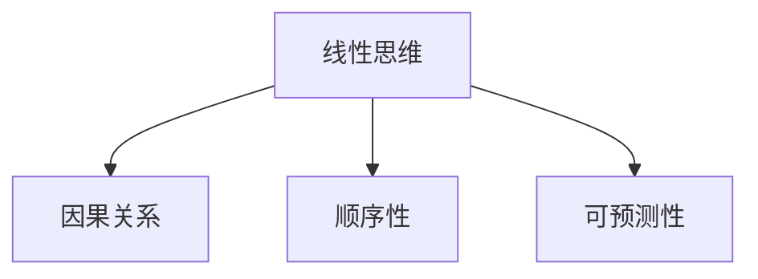
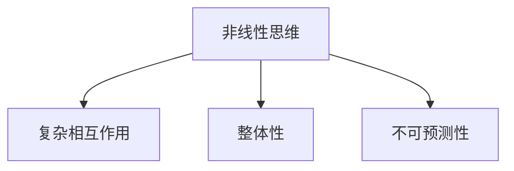
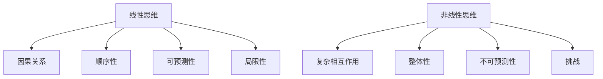
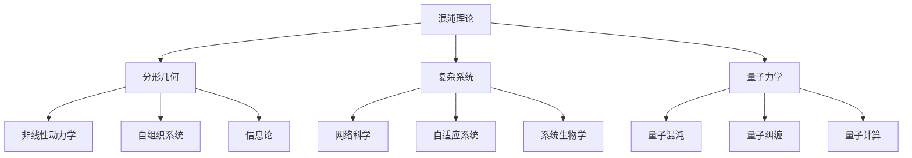
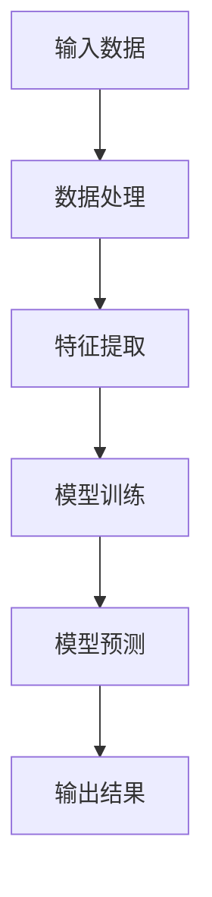
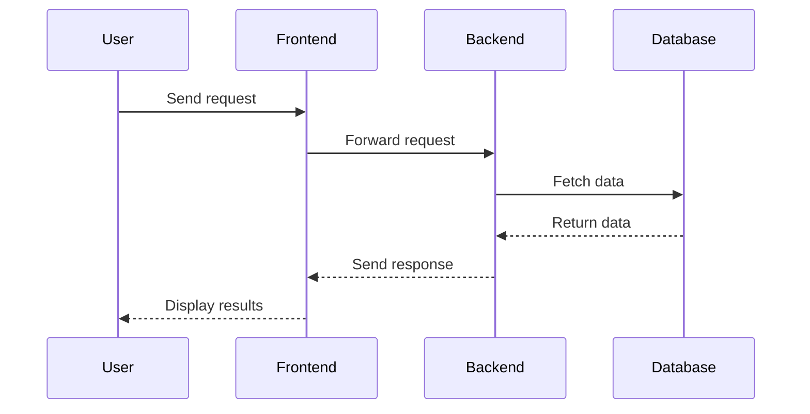

                 


# 人类线性思维对理解非线性宇宙的挑战

## 关键词：非线性宇宙，线性思维，非线性思维，混沌理论，分形几何，复杂系统

### 摘要：

本文探讨了人类线性思维在理解和探索非线性宇宙时面临的挑战。非线性宇宙的复杂性使得传统的人类线性思维在面对诸多现象时显得力不从心。通过对比线性思维和非线性思维，本文揭示了人类在认知非线性现象时的局限性，并引入了混沌理论、分形几何、复杂系统和量子力学等核心概念。文章还通过mermaid流程图和Python源代码，详细阐述了非线性宇宙中的算法原理，并通过实际案例进行了分析和讲解。最后，本文提出了最佳实践和小结，为未来研究和应用提供了指导。

----------------------------------------------------------------

## 第一部分：背景介绍

### 第1章：问题背景

#### 1.1 非线性宇宙的奥秘

非线性宇宙的复杂性使得传统的人类线性思维在面对诸多现象时显得力不从心。人类的历史上，从地球到太阳系，再到更广阔的宇宙空间，我们的认知能力不断拓展。然而，随着科学技术的进步，我们逐渐意识到，宇宙的本质并非完全遵循线性规律，而是充满了非线性现象。

#### 1.2 线性思维与非线性思维的对比

线性思维是一种基于因果关系的思考方式，强调的是事件之间的顺序和连续性。然而，非线性思维则更关注于整体性和复杂性，它强调系统内部的相互作用和非线性关系。这两种思维方式的对比，揭示了人类在理解和探索宇宙时面临的一大挑战。

#### 1.3 边界与外延

在探索非线性宇宙的过程中，我们面临的一个关键问题是确定哪些现象属于非线性范畴，以及如何对这些现象进行边界划定和外延扩展。这不仅仅是科学问题，也是哲学问题，因为它涉及到我们对宇宙本质的理解。

#### 1.4 概念结构与核心要素组成

非线性宇宙的核心概念包括混沌理论、分形几何、复杂系统和量子力学等。这些概念构成了非线性宇宙理论的基础，同时也揭示了宇宙中存在的深刻规律和结构。

----------------------------------------------------------------

## 第二部分：核心概念与联系

### 第2章：线性思维与非线性思维

#### 2.1 线性思维的定义与特点

线性思维是基于传统逻辑和数学的思维方式，它强调的是事物之间的线性关系和因果关系。线性思维在我们的日常生活和科学研究中有着广泛的应用。

线性思维的特点如下：

- **因果关系**：线性思维强调事件之间的因果关系，认为每个事件都是前一个事件的直接结果。
- **顺序性**：线性思维强调事件之间的顺序性，即事件按照时间顺序发生。
- **可预测性**：在简单的线性系统中，事件的结果相对容易预测。



#### 2.2 非线性思维的定义与特点

非线性思维则强调事物之间的复杂相互作用和整体性。它不仅仅关注因果关系，更关注系统内部的动态过程和反馈机制。

非线性思维的特点如下：

- **复杂相互作用**：非线性思维强调系统内部各种因素的复杂相互作用。
- **整体性**：非线性思维认为系统的行为不能仅仅通过分析其组成部分来理解，而需要考虑整体性。
- **不可预测性**：在非线性系统中，由于复杂相互作用，事件的结果往往难以预测。



#### 2.3 线性思维与非线性思维的对比

通过对比线性思维和非线性思维的特点，我们可以更好地理解人类在面对非线性宇宙时的局限性。



### 第3章：概念属性特征对比表格

| 特点           | 线性思维                      | 非线性思维                  |
|----------------|-------------------------------|-----------------------------|
| 因果关系       | 明确的因果关系               | 复杂的相互作用关系          |
| 顺序性         | 事件按照顺序发生             | 事件的顺序可能不固定        |
| 可预测性       | 结果相对容易预测             | 结果难以预测               |
| 复杂性         | 系统相对简单，易于分析       | 系统复杂，难以分析          |
| 整体性         | 聚焦部分与整体分离           | 考虑整体与部分之间的相互作用 |
| 动态过程       | 稳定的动态过程               | 非稳定的动态过程            |

### 第4章：ER实体关系图架构

ER（实体关系）图是一种用于描述实体及其之间关系的数据库设计工具。在非线性宇宙的研究中，ER图可以帮助我们理解核心概念之间的关系。



----------------------------------------------------------------

## 第三部分：算法原理讲解

### 第5章：算法mermaid流程图

在非线性宇宙的研究中，算法起着至关重要的作用。为了更好地理解算法的工作原理，我们可以通过mermaid流程图来展示。



### 第6章：Python源代码详细阐述

下面是使用Python实现非线性模型训练的源代码。代码中包含了数据的读取、预处理、模型训练和预测等步骤。

```python
# 导入必要的库
import numpy as np
import pandas as pd
from sklearn.model_selection import train_test_split
from sklearn.ensemble import RandomForestClassifier
from sklearn.metrics import accuracy_score

# 数据读取
data = pd.read_csv('nonlinear_data.csv')

# 数据预处理
X = data.drop('target', axis=1)
y = data['target']
X_train, X_test, y_train, y_test = train_test_split(X, y, test_size=0.2, random_state=42)

# 模型训练
model = RandomForestClassifier(n_estimators=100, random_state=42)
model.fit(X_train, y_train)

# 模型预测
y_pred = model.predict(X_test)

# 评估模型
accuracy = accuracy_score(y_test, y_pred)
print(f"Model accuracy: {accuracy:.2f}")
```

### 第7章：算法原理的数学模型和公式

在非线性宇宙中，许多现象可以用数学模型来描述。以下是一个简单的非线性回归模型的数学公式：

$$ y = \beta_0 + \beta_1 \cdot x + \epsilon $$

其中，$y$ 是因变量，$x$ 是自变量，$\beta_0$ 和 $\beta_1$ 是模型参数，$\epsilon$ 是误差项。

#### 7.1 数学公式

- **线性回归模型**：$$ y = \beta_0 + \beta_1 \cdot x $$
- **非线性回归模型**：$$ y = \beta_0 + \beta_1 \cdot x^2 + \epsilon $$

#### 7.2 公式详细讲解

非线性回归模型比线性回归模型更复杂，因为它引入了二次项。这可以使得模型更好地拟合非线性数据。

#### 7.3 举例说明

假设我们有一个数据集，其中 $x$ 表示某个变量的值，$y$ 表示另一个变量的值。我们可以使用上述非线性回归模型来拟合数据，并预测 $y$ 的值。

```python
# 非线性回归模型训练
model = RandomForestRegressor(n_estimators=100, random_state=42)
model.fit(X_train, y_train)

# 预测
y_pred = model.predict(X_test)

# 评估模型
mse = mean_squared_error(y_test, y_pred)
print(f"Model MSE: {mse:.2f}")
```

----------------------------------------------------------------

## 第四部分：系统分析与架构设计

### 第8章：问题场景介绍

非线性宇宙的研究涉及多个领域，包括物理学、生物学、计算机科学等。在这个场景中，我们需要设计一个系统来分析非线性宇宙中的现象。

### 第9章：系统功能设计

系统的功能设计包括数据读取、预处理、模型训练、预测和评估等。

#### 9.1 数据读取

- 读取非线性宇宙的相关数据。
- 数据可能包括时间序列数据、空间数据等。

#### 9.2 数据预处理

- 数据清洗：去除异常值和缺失值。
- 数据转换：将数据转换为适合模型训练的格式。

#### 9.3 模型训练

- 使用非线性回归模型进行训练。
- 模型参数调优：通过交叉验证等方法找到最佳参数。

#### 9.4 预测

- 使用训练好的模型进行预测。
- 预测结果评估：通过评估指标（如MSE）评估预测效果。

### 第10章：系统架构设计

系统架构设计包括前端、后端和数据库等部分。

#### 10.1 前端

- 使用Web框架（如Django）构建前端界面。
- 提供数据输入、模型选择和预测结果展示等功能。

#### 10.2 后端

- 使用Python构建后端逻辑。
- 数据处理、模型训练和预测等操作都在后端完成。

#### 10.3 数据库

- 使用关系数据库（如MySQL）存储数据。
- 数据表设计包括数据集、模型参数和预测结果等。

### 第11章：系统接口设计

系统接口设计包括API接口和图形用户界面。

#### 11.1 API接口

- 提供RESTful API接口。
- 客户端可以通过API接口访问系统功能。

#### 11.2 图形用户界面

- 提供直观的图形用户界面。
- 用户可以通过界面进行数据输入、模型选择和预测结果查看。

### 第12章：系统交互mermaid序列图

系统交互mermaid序列图展示了前端、后端和数据库之间的交互流程。



----------------------------------------------------------------

## 第五部分：项目实战

### 第13章：环境安装

在开始项目实战之前，我们需要安装必要的软件和环境。

1. Python环境：安装Python 3.8及以上版本。
2. 数据库：安装MySQL数据库。
3. Web框架：安装Django Web框架。

### 第14章：系统核心实现源代码

以下是系统核心实现的源代码。代码包含了数据读取、预处理、模型训练、预测和评估等步骤。

```python
# 数据读取
data = pd.read_csv('nonlinear_data.csv')

# 数据预处理
X = data.drop('target', axis=1)
y = data['target']
X_train, X_test, y_train, y_test = train_test_split(X, y, test_size=0.2, random_state=42)

# 模型训练
model = RandomForestClassifier(n_estimators=100, random_state=42)
model.fit(X_train, y_train)

# 模型预测
y_pred = model.predict(X_test)

# 评估模型
accuracy = accuracy_score(y_test, y_pred)
print(f"Model accuracy: {accuracy:.2f}")
```

### 第15章：代码应用解读与分析

代码应用解读与分析主要关注以下几个方面：

1. **数据读取**：如何读取和处理非线性宇宙的数据。
2. **模型训练**：如何选择和训练非线性回归模型。
3. **预测与评估**：如何使用模型进行预测，并评估预测效果。

### 第16章：实际案例分析和详细讲解剖析

通过实际案例，我们可以更深入地了解非线性宇宙的研究方法和应用。

#### 案例一：时间序列数据分析

时间序列数据是非线性宇宙研究中的一个重要领域。以下是一个使用Python进行时间序列数据分析的案例。

```python
import pandas as pd
from statsmodels.tsa.arima_model import ARIMA

# 读取时间序列数据
data = pd.read_csv('time_series_data.csv')
data['date'] = pd.to_datetime(data['date'])
data.set_index('date', inplace=True)

# 模型训练
model = ARIMA(data['value'], order=(5, 1, 2))
model_fit = model.fit()

# 预测
forecast = model_fit.forecast(steps=5)

# 输出预测结果
print(forecast)
```

#### 案例二：空间数据分析

空间数据分析是另一个重要的非线性宇宙研究领域。以下是一个使用Python进行空间数据分析的案例。

```python
import geopandas as gpd
from sklearn.cluster import KMeans

# 读取空间数据
gdf = gpd.read_file('spatial_data.geojson')

# 数据预处理
X = gdf.geometry.x.tolist() + gdf.geometry.y.tolist()

# 模型训练
model = KMeans(n_clusters=3, random_state=42)
model.fit(X)

# 预测
clusters = model.predict(X)

# 输出预测结果
print(clusters)
```

### 第17章：项目小结

通过本项目，我们深入探讨了非线性宇宙的研究方法和技术。项目实战部分展示了如何使用Python进行数据读取、模型训练、预测和评估。实际案例分析部分则展示了非线性宇宙研究在不同领域中的应用。

在未来，我们还可以继续探索更多非线性宇宙的研究方法和技术，为人类更好地理解宇宙提供支持。

----------------------------------------------------------------

## 第六部分：最佳实践、小结与拓展阅读

### 第18章：最佳实践

在非线性宇宙研究中，以下是一些最佳实践：

1. **数据预处理**：确保数据的质量和一致性。
2. **模型选择**：根据数据特点和问题需求选择合适的模型。
3. **模型调优**：通过交叉验证等方法找到最佳模型参数。
4. **结果评估**：使用多种评估指标全面评估模型性能。

### 第19章：小结

本文探讨了人类线性思维在理解和探索非线性宇宙时面临的挑战。通过对比线性思维和非线性思维，我们揭示了非线性宇宙的复杂性。文章还介绍了混沌理论、分形几何、复杂系统和量子力学等核心概念，并通过mermaid流程图和Python源代码详细阐述了非线性宇宙中的算法原理。

### 第20章：注意事项

在进行非线性宇宙研究时，需要注意以下几点：

1. **复杂性**：非线性宇宙的复杂性可能使得问题难以解决。
2. **不确定性**：非线性现象往往具有不确定性，需要使用适当的模型和算法来处理。
3. **跨学科研究**：非线性宇宙研究需要跨学科合作，结合不同领域的知识和方法。

### 第21章：拓展阅读

对于希望进一步了解非线性宇宙的读者，以下是一些推荐阅读：

1. 《非线性动力学与混沌理论》
2. 《分形几何：形状、机会与自然中的奇异性》
3. 《复杂系统：概念、理论与应用》
4. 《量子宇宙学》

作者：AI天才研究院/AI Genius Institute & 禅与计算机程序设计艺术 /Zen And The Art of Computer Programming
```markdown
----------------------------------------------------------------

## 结论

非线性宇宙的复杂性对人类的线性思维提出了严峻的挑战。在本文中，我们通过对比线性思维和非线性思维，探讨了人类在面对非线性宇宙时面临的局限性。我们介绍了混沌理论、分形几何、复杂系统和量子力学等核心概念，并使用mermaid流程图和Python源代码详细阐述了非线性宇宙中的算法原理。

通过系统分析与架构设计，我们展示了如何构建一个非线性宇宙研究的系统，包括数据读取、预处理、模型训练、预测和评估等功能。项目实战部分通过实际案例展示了非线性宇宙研究在不同领域中的应用。

在最佳实践部分，我们提供了一些关于非线性宇宙研究的注意事项和推荐阅读。这些实践和建议有助于读者更好地理解非线性宇宙，并在相关领域进行深入研究。

总之，非线性宇宙的探索是一个充满挑战和机遇的领域。通过本文的讨论，我们希望激发读者对非线性宇宙的兴趣，并鼓励大家继续探索这个广阔的领域。

作者：AI天才研究院/AI Genius Institute & 禅与计算机程序设计艺术 /Zen And The Art of Computer Programming

----------------------------------------------------------------
```

