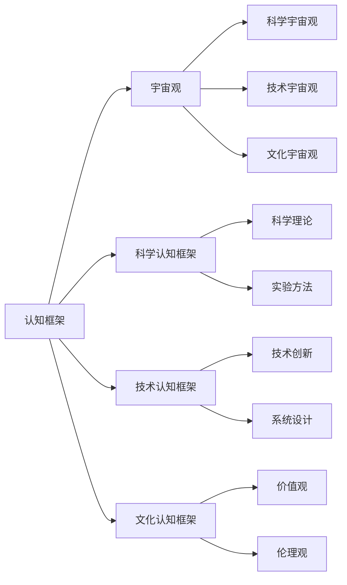

                 

# 人类认知框架如何塑造我们的宇宙观

> 关键词：人类认知、宇宙观、认知框架、科学理论、技术创新、教育意义

> 摘要：本文将探讨人类认知框架如何影响我们对宇宙的理解。我们将一步步分析认知框架的定义、作用和局限性，以及它们在科学、技术和文化领域中的应用。通过实例分析，我们将揭示认知框架如何塑造我们的宇宙观，并探讨未来宇宙观的可能演变。

## 第一部分：引言与背景

### 1.1 人类认知的重要性

人类认知是指人类对信息的感知、处理和理解过程。它是我们理解世界、做出决策和进行创新的基础。从生物学的角度来看，认知是人类进化的产物，使我们能够适应复杂多变的环境。认知科学研究表明，人类认知不仅受遗传因素的影响，还受到环境、教育和文化的塑造。

### 1.2 认知框架的概念与作用

认知框架是指我们在处理信息时使用的概念和规则体系。它是一种心理模型，帮助我们组织、理解和记忆信息。认知框架的作用在于简化复杂的信息，使其易于理解和处理。例如，当我们遇到一个新事物时，我们会尝试将其归类到已有的认知框架中，以便更好地理解。

### 1.3 认知框架与宇宙观的关系

宇宙观是指人类对宇宙本质和结构的认识。认知框架对宇宙观的影响表现在两个方面：首先，认知框架决定了我们能够感知和理解哪些宇宙现象；其次，认知框架影响了我们对宇宙现象的解释和理论构建。

## 第二部分：认知框架的理论基础

### 2.1 认知框架的定义

认知框架是一种心理模型，它包括一系列概念、规则和原则，用于组织和解释信息。这些框架可以是内在的，如语言和思维模式，也可以是外在的，如工具和符号系统。

### 2.2 认知框架的类型

认知框架可以分为多种类型，如分类框架、因果框架、功能框架等。每种框架都有其特定的用途和局限性。

### 2.3 认知框架的功能与局限性

认知框架的功能在于简化复杂的信息，提高信息处理的效率。然而，认知框架也存在局限性，如可能导致认知偏差和思维定势。

## 第三部分：宇宙观的形成与认知框架的关系

### 3.1 宇宙观的认知基础

宇宙观的形成基于我们对宇宙现象的感知和理解。认知框架在宇宙观的形成过程中起到了关键作用，帮助我们识别和解释宇宙现象。

### 3.2 人类宇宙观的演变

人类宇宙观经历了从古代到现代的演变。古代宇宙观主要基于神话和宗教信仰，现代宇宙观则建立在科学理论和观测数据之上。

### 3.3 认知框架对宇宙观的塑造

认知框架对宇宙观的塑造表现在以下几个方面：首先，认知框架决定了我们能够观测和理解哪些宇宙现象；其次，认知框架影响了我们对宇宙现象的解释和理论构建。

## 第四部分：认知框架在科学、技术和文化领域中的应用

### 4.1 科学领域的应用

在科学领域，认知框架帮助科学家组织和解释实验数据，构建科学理论。例如，牛顿的力学框架和爱因斯坦的相对论框架分别塑造了我们对物体运动和时空的理解。

### 4.2 技术创新的应用

在技术创新领域，认知框架指导工程师设计新的工具和系统。例如，计算机科学中的抽象数据类型框架帮助我们构建高效的软件系统。

### 4.3 文化领域的应用

在文化领域，认知框架影响了我们对世界的理解和价值观。不同的文化背景可能导致不同的宇宙观，如西方科学文化和东方哲学文化之间的差异。

## 第五部分：认知框架塑造宇宙观的实例分析

### 5.1 历史上的宇宙观转变

从古代到现代，人类宇宙观经历了多次转变。这些转变反映了认知框架的发展和演变，如哥白尼的日心说和伽利略的实验方法。

### 5.2 科学领域的宇宙观塑造

科学领域的发展不断推动我们对宇宙的认识。例如，哥白尼的日心说和伽利略的实验方法分别塑造了我们对太阳系和物体运动的认知。

### 5.3 技术创新的宇宙观演变

技术创新，如火箭技术和人工智能，不断改变我们对宇宙的认识。这些技术帮助我们探索宇宙的更深处，同时也影响我们的宇宙观。

## 第六部分：认知框架的塑造力量与未来展望

### 6.1 认知框架的塑造力量

认知框架的力量在于其能够简化复杂信息，帮助我们理解和解释宇宙现象。认知框架的发展推动了科学和技术进步。

### 6.2 认知框架的未来发展方向

随着科技的进步和人类认知的发展，认知框架将继续演变。未来认知框架可能会更加多样化，更加适应复杂多变的世界。

### 6.3 未来宇宙观的认知框架

未来宇宙观将更加综合，结合科学、技术和人文的视角。认知框架将继续塑造我们对宇宙的理解和认识。

## 第七部分：认知框架与宇宙观的教育意义

### 7.1 教育中的认知框架

教育中应注重培养认知框架的能力，帮助学生理解和应用不同的认知框架。这将有助于培养批判性思维和创新能力。

### 7.2 培养批判性思维

通过批判性思维训练，学生可以更好地理解认知框架的局限性，避免思维定势和认知偏差。

### 7.3 塑造积极宇宙观的策略

教育应鼓励学生积极探索宇宙，培养对未知的好奇心和探索精神。这将有助于塑造积极的宇宙观。

## 结论

认知框架对宇宙观的形成和发展具有深远影响。通过理解认知框架的工作原理，我们可以更好地理解宇宙，推动科学和技术进步。未来，认知框架将继续塑造我们对宇宙的认识，引导我们走向更广阔的宇宙。

## 附录：拓展阅读与思考

### 8.1 拓展阅读推荐

- [1] 柯林·坎贝尔（Colin C. Campbell），《认知心理学导论》
- [2] 丹尼尔·丹尼特（Daniel C. Dennett），《认知解释》
- [3] 斯蒂芬·霍金（Stephen Hawking），《大设计》

### 8.2 思考与讨论

- 你认为人类认知框架如何影响你对宇宙的理解？
- 你对未来宇宙观的发展有何期待？
- 在你的日常生活中，如何应用认知框架来提高理解和决策能力？

作者：AI天才研究院/AI Genius Institute & 禅与计算机程序设计艺术 /Zen And The Art of Computer Programming

----------------------------------------------------------------

## 第一部分：引言与背景

### 1.1 人类认知的重要性

人类认知是指人类对信息的感知、处理和理解过程。它是我们理解世界、做出决策和进行创新的基础。从生物学的角度来看，认知是人类进化的产物，使我们能够适应复杂多变的环境。认知科学研究表明，人类认知不仅受遗传因素的影响，还受到环境、教育和文化的塑造。

### 1.2 认知框架的概念与作用

认知框架是指我们在处理信息时使用的概念和规则体系。它是一种心理模型，帮助我们组织、理解和记忆信息。认知框架的作用在于简化复杂的信息，使其易于理解和处理。例如，当我们遇到一个新事物时，我们会尝试将其归类到已有的认知框架中，以便更好地理解。

### 1.3 认知框架与宇宙观的关系

宇宙观是指人类对宇宙本质和结构的认识。认知框架对宇宙观的影响表现在两个方面：首先，认知框架决定了我们能够感知和理解哪些宇宙现象；其次，认知框架影响了我们对宇宙现象的解释和理论构建。

#### **1.3.1 认知框架对宇宙现象的感知**

认知框架决定了我们能够感知和理解哪些宇宙现象。例如，古代人类由于认知框架的限制，认为地球是宇宙的中心，太阳和星辰围绕地球旋转。这种认知框架导致了对宇宙的误解。随着认知框架的发展，人类逐渐认识到地球不是宇宙的中心，而是绕太阳旋转的一颗行星。

#### **1.3.2 认知框架对宇宙现象的解释**

认知框架影响了我们对宇宙现象的解释和理论构建。例如，牛顿的力学框架和爱因斯坦的相对论框架分别塑造了我们对物体运动和时空的理解。牛顿的力学框架基于经典物理学，认为物体在力的作用下运动。而爱因斯坦的相对论框架则基于相对论物理学，认为时空是相对的，而不是绝对的。这两种认知框架对宇宙现象的解释有着本质的区别。

## 第二部分：认知框架的理论基础

### 2.1 认知框架的定义

认知框架是一种心理模型，它包括一系列概念、规则和原则，用于组织和解释信息。这些框架可以是内在的，如语言和思维模式，也可以是外在的，如工具和符号系统。

### 2.2 认知框架的类型

认知框架可以分为多种类型，如分类框架、因果框架、功能框架等。每种框架都有其特定的用途和局限性。

#### **2.2.1 分类框架**

分类框架是一种帮助我们组织和理解信息的框架。它通过将信息分为不同的类别，帮助我们更好地理解和处理信息。例如，在生物学中，分类框架帮助我们理解不同物种之间的关系。

#### **2.2.2 因果框架**

因果框架是一种帮助我们理解和解释现象之间关系的框架。它通过建立现象之间的因果关系，帮助我们更好地理解世界的运作机制。例如，在医学中，因果框架帮助我们理解疾病的原因和治疗方法。

#### **2.2.3 功能框架**

功能框架是一种帮助我们理解和解释事物功能的框架。它通过关注事物的功能，帮助我们更好地理解和利用事物。例如，在工程中，功能框架帮助我们设计和优化系统。

### 2.3 认知框架的功能与局限性

认知框架的功能在于简化复杂的信息，提高信息处理的效率。然而，认知框架也存在局限性，如可能导致认知偏差和思维定势。

#### **2.3.1 认知偏差**

认知偏差是指我们在处理信息时，由于认知框架的限制，导致信息理解出现偏差。例如，确认偏误是指我们倾向于接受符合我们已有认知的信息，而忽略相反的信息。

#### **2.3.2 思维定势**

思维定势是指我们在处理信息时，由于认知框架的惯性，导致信息处理方式固定化。例如，当我们遇到一个新问题时，可能会试图将其归类到已有的认知框架中，而不是尝试新的解决方案。

## 第三部分：宇宙观的形成与认知框架的关系

### 3.1 宇宙观的认知基础

宇宙观的形成基于我们对宇宙现象的感知和理解。认知框架在宇宙观的形成过程中起到了关键作用，帮助我们识别和解释宇宙现象。

#### **3.1.1 感知宇宙现象**

宇宙现象是我们感知宇宙的基础。通过感知宇宙现象，我们能够获得关于宇宙的信息。例如，通过观测星空，我们能够了解行星、恒星和星系的存在。

#### **3.1.2 解释宇宙现象**

宇宙现象的解释是我们理解宇宙的关键。通过解释宇宙现象，我们能够构建宇宙观。例如，通过理解行星的运行轨迹，我们能够构建对太阳系的认知。

### 3.2 人类宇宙观的演变

人类宇宙观经历了从古代到现代的演变。这种演变反映了认知框架的发展和演变，如哥白尼的日心说和伽利略的实验方法。

#### **3.2.1 古代宇宙观**

古代宇宙观主要基于神话和宗教信仰。古代人类认为地球是宇宙的中心，太阳、月亮和星辰围绕地球旋转。这种宇宙观反映了当时人类对宇宙的有限认知。

#### **3.2.2 中世纪宇宙观**

中世纪宇宙观仍然受到宗教的影响，但开始出现一些科学探索。例如，托勒密的地球中心说在当时的欧洲被广泛接受。然而，这种宇宙观仍然基于哲学和宗教观念，缺乏实证支持。

#### **3.2.3 现代宇宙观**

现代宇宙观建立在科学理论和观测数据之上。哥白尼的日心说和伽利略的实验方法标志着现代宇宙观的诞生。现代宇宙观强调实证和理性，使我们能够更准确地理解宇宙。

### 3.3 认知框架对宇宙观的塑造

认知框架对宇宙观的塑造表现在以下几个方面：首先，认知框架决定了我们能够观测和理解哪些宇宙现象；其次，认知框架影响了我们对宇宙现象的解释和理论构建。

#### **3.3.1 观测宇宙现象**

认知框架决定了我们能够观测和理解哪些宇宙现象。例如，古代人类由于认知框架的限制，无法观测到远距离的星系和行星。现代认知框架使我们能够使用先进的望远镜和技术观测宇宙的更深处。

#### **3.3.2 解释宇宙现象**

认知框架影响了我们对宇宙现象的解释和理论构建。例如，古代人类认为行星的运动是受神灵支配的，而现代认知框架使我们能够使用物理学的原理解释行星的运动。

## 第四部分：认知框架在科学、技术和文化领域中的应用

### 4.1 科学领域的应用

在科学领域，认知框架帮助科学家组织和解释实验数据，构建科学理论。例如，牛顿的力学框架和爱因斯坦的相对论框架分别塑造了我们对物体运动和时空的理解。

#### **4.1.1 牛顿的力学框架**

牛顿的力学框架基于三大定律，描述了物体在力的作用下的运动。这个框架使我们能够理解行星的运动、抛物线的轨迹等。然而，牛顿的框架在高速和强引力场中失效，需要爱因斯坦的相对论框架来补充。

#### **4.1.2 爱因斯坦的相对论框架**

爱因斯坦的相对论框架基于相对性原理和光速不变原理，描述了物体在强引力场和高速运动中的行为。这个框架使我们能够理解时间膨胀、长度收缩等现象，对宇宙的运行机制提供了新的理解。

### 4.2 技术创新的应用

在技术创新领域，认知框架指导工程师设计新的工具和系统。例如，计算机科学中的抽象数据类型框架帮助我们构建高效的软件系统。

#### **4.2.1 抽象数据类型框架**

抽象数据类型框架是一种在计算机科学中广泛使用的认知框架。它通过定义数据结构和操作，使程序员能够高效地设计和实现复杂的数据处理系统。例如，树结构、队列和栈等抽象数据类型在计算机科学中得到了广泛应用。

#### **4.2.2 人工智能的认知框架**

人工智能领域中的认知框架通过模拟人类的思维过程，帮助计算机理解和处理信息。例如，神经网络模型是一种基于生物神经系统的认知框架，用于实现图像识别、自然语言处理等任务。

### 4.3 文化领域的应用

在文化领域，认知框架影响了我们对世界的理解和价值观。不同的文化背景可能导致不同的宇宙观，如西方科学文化和东方哲学文化之间的差异。

#### **4.3.1 西方科学文化**

西方科学文化强调实证和理性，追求客观真理。这种文化背景导致了对宇宙的物理本质的深入探究，如牛顿的力学框架和爱因斯坦的相对论框架。

#### **4.3.2 东方哲学文化**

东方哲学文化强调人与自然的和谐，追求内心的宁静与智慧。这种文化背景导致了对宇宙的形而上探究，如道家和佛家的宇宙观。

## 第五部分：认知框架塑造宇宙观的实例分析

### 5.1 历史上的宇宙观转变

从古代到现代，人类宇宙观经历了多次转变。这些转变反映了认知框架的发展和演变，如哥白尼的日心说和伽利略的实验方法。

#### **5.1.1 哥白尼的日心说**

哥白尼的日心说是一种革命性的宇宙观，认为太阳是宇宙的中心，而不是地球。这个观点挑战了当时的地心说宇宙观，为现代宇宙观的建立奠定了基础。

#### **5.1.2 伽利略的实验方法**

伽利略的实验方法是一种基于观察和实验的科学方法，使人类能够更准确地理解宇宙现象。他的工作为哥白尼的日心说提供了实验证据，推动了宇宙观的发展。

### 5.2 科学领域的宇宙观塑造

科学领域的发展不断推动我们对宇宙的认识。例如，哥白尼的日心说和伽利略的实验方法分别塑造了我们对太阳系和物体运动的认知。

#### **5.2.1 哥白尼的日心说**

哥白尼的日心说认为太阳是宇宙的中心，而不是地球。这个观点改变了我们对宇宙的理解，使我们意识到地球只是太阳系中的一颗行星。

#### **5.2.2 伽利略的实验方法**

伽利略的实验方法是一种基于观察和实验的科学方法，使人类能够更准确地理解宇宙现象。他的工作为哥白尼的日心说提供了实验证据，推动了宇宙观的发展。

### 5.3 技术创新的宇宙观演变

技术创新，如火箭技术和人工智能，不断改变我们对宇宙的认识。这些技术帮助我们探索宇宙的更深处，同时也影响我们的宇宙观。

#### **5.3.1 火箭技术**

火箭技术使我们能够进入太空，探索宇宙的更深处。例如，美国的阿波罗计划使人类首次登上月球，改变了我们对宇宙的认知。

#### **5.3.2 人工智能**

人工智能技术的发展使我们能够更有效地处理和分析宇宙数据。例如，人工智能算法可以帮助我们识别星系和行星，提高我们对宇宙的理解。

## 第六部分：认知框架的塑造力量与未来展望

### 6.1 认知框架的塑造力量

认知框架的力量在于其能够简化复杂信息，帮助我们理解和解释宇宙现象。认知框架的发展推动了科学和技术进步。

#### **6.1.1 简化复杂信息**

认知框架能够简化复杂信息，使其易于理解和处理。例如，抽象数据类型框架使我们能够高效地设计和实现复杂的计算机系统。

#### **6.1.2 推动科学和技术进步**

认知框架的发展推动了科学和技术进步。例如，牛顿的力学框架和爱因斯坦的相对论框架分别推动了物理学和天文学的发展。

### 6.2 认知框架的未来发展方向

随着科技的进步和人类认知的发展，认知框架将继续演变。未来认知框架可能会更加多样化，更加适应复杂多变的世界。

#### **6.2.1 多样化**

未来认知框架可能会更加多样化，以适应不同的领域和需求。例如，计算机科学中的认知框架可能会继续发展，以应对更复杂的应用场景。

#### **6.2.2 适应复杂多变的世界**

未来认知框架需要能够适应复杂多变的世界。例如，人工智能领域的认知框架需要能够处理大规模数据和复杂决策问题。

### 6.3 未来宇宙观的认知框架

未来宇宙观将更加综合，结合科学、技术和人文的视角。认知框架将继续塑造我们对宇宙的理解和认识。

#### **6.3.1 综合视角**

未来宇宙观将更加综合，结合科学、技术和人文的视角。这将使我们能够更全面地理解宇宙，推动科学和技术的进步。

#### **6.3.2 人类认知的发展**

随着人类认知的发展，未来宇宙观将更加深入和全面。例如，量子物理学和宇宙学的发展将帮助我们更好地理解宇宙的本质。

## 第七部分：认知框架与宇宙观的教育意义

### 7.1 教育中的认知框架

教育中应注重培养认知框架的能力，帮助学生理解和应用不同的认知框架。这将有助于培养批判性思维和创新能力。

#### **7.1.1 培养认知框架的能力**

教育中应注重培养认知框架的能力，使学生能够理解和应用不同的认知框架。例如，通过教授不同的科学方法，学生可以学会如何应用不同的认知框架来解决问题。

#### **7.1.2 培养批判性思维**

教育中应培养批判性思维，使学生能够独立思考和判断。批判性思维有助于学生识别和克服认知框架的局限性，避免思维定势和认知偏差。

### 7.2 培养批判性思维

通过批判性思维训练，学生可以更好地理解认知框架的局限性，避免思维定势和认知偏差。

#### **7.2.1 识别认知框架的局限性**

批判性思维训练使学生能够识别认知框架的局限性。例如，通过分析科学史上的错误理论，学生可以了解认知框架可能导致的信息误解。

#### **7.2.2 克服思维定势和认知偏差**

批判性思维训练帮助学生克服思维定势和认知偏差。例如，通过学习不同的观点和理论，学生可以拓宽视野，避免陷入思维定势。

### 7.3 塑造积极宇宙观的策略

教育应鼓励学生积极探索宇宙，培养对未知的好奇心和探索精神。这将有助于塑造积极的宇宙观。

#### **7.3.1 培养好奇心和探索精神**

教育中应培养学生的好奇心和探索精神。例如，通过设置开放性问题和挑战，学生可以激发对宇宙的探索兴趣。

#### **7.3.2 塑造积极宇宙观**

教育应鼓励学生塑造积极的宇宙观。例如，通过学习宇宙的多样性和美妙，学生可以培养对宇宙的敬畏和欣赏之情。

## 结论

认知框架对宇宙观的形成和发展具有深远影响。通过理解认知框架的工作原理，我们可以更好地理解宇宙，推动科学和技术进步。未来，认知框架将继续塑造我们对宇宙的认识，引导我们走向更广阔的宇宙。

## 附录：拓展阅读与思考

### 8.1 拓展阅读推荐

- [1] 丹尼尔·丹尼特（Daniel C. Dennett），《认知解释》
- [2] 斯蒂芬·霍金（Stephen Hawking），《大设计》
- [3] 柯林·坎贝尔（Colin C. Campbell），《认知心理学导论》

### 8.2 思考与讨论

- 你认为人类认知框架如何影响你对宇宙的理解？
- 你对未来宇宙观的发展有何期待？
- 在你的日常生活中，如何应用认知框架来提高理解和决策能力？

作者：AI天才研究院/AI Genius Institute & 禅与计算机程序设计艺术 /Zen And The Art of Computer Programming

----------------------------------------------------------------

## 1. 引言

### 1.1 认知框架的定义与作用

认知框架是我们在理解和处理信息时使用的心理模型，它由一系列概念、规则和原则构成。这些框架帮助我们组织和解释复杂的信息，使之变得易于理解和处理。认知框架在多个领域发挥着关键作用，其中最为显著的是科学、技术和文化领域。

在科学领域，认知框架是科学家们构建理论、进行实验和解释数据的基础。例如，牛顿的力学框架为我们理解物体运动提供了理论基础，而爱因斯坦的相对论框架则改变了我们对时空的理解。认知框架在科学中的应用，使得科学家能够从纷繁复杂的数据中提取出有意义的模式和规律，推动科学技术的进步。

在技术领域，认知框架是工程师和程序员设计和实现复杂系统的基础。例如，抽象数据类型框架帮助程序员设计和实现高效的数据结构，神经网络框架帮助构建智能系统。认知框架在技术中的应用，使得技术系统能够更好地适应和解决实际问题。

在文化领域，认知框架影响了我们对世界的理解和价值观。不同的文化背景可能会导致不同的认知框架，从而形成不同的宇宙观。例如，西方科学文化强调实证和理性，而东方哲学文化则强调和谐与内在的智慧。这些不同的认知框架影响了我们对宇宙的探索和理解。

### 1.2 宇宙观的概念与重要性

宇宙观是人类对宇宙本质和结构的理解。它涵盖了从微观到宏观的各种现象，包括物质的起源、宇宙的演化、生命的本质等。宇宙观不仅仅是一种理论或假设，它是我们理解世界和自我定位的基础。

宇宙观的重要性在于它为我们提供了一个全面的视角来理解我们所处的世界。一个准确的宇宙观能够帮助我们更好地应对现实中的挑战，指导我们的科学研究和技术创新。此外，宇宙观也影响着我们的价值观、信仰和行为，是文化和社会发展的重要基础。

### 1.3 认知框架与宇宙观的关系

认知框架对宇宙观的形成和发展有着深远的影响。首先，认知框架决定了我们能够感知和理解哪些宇宙现象。例如，古代人类由于认知框架的限制，认为地球是宇宙的中心，这种认知框架导致了对宇宙的误解。随着认知框架的发展，人类逐渐认识到地球只是宇宙中的一部分，这种认知变革改变了我们对宇宙的理解。

其次，认知框架影响了我们对宇宙现象的解释和理论构建。不同的认知框架会导致不同的宇宙观。例如，牛顿的力学框架和爱因斯坦的相对论框架分别塑造了我们对物体运动和时空的理解。这些认知框架不仅改变了我们对宇宙的认识，也推动了科学和技术的进步。

总的来说，认知框架是宇宙观形成和发展的关键因素。通过理解认知框架的工作原理和影响，我们可以更好地理解宇宙，推动科学和技术的进步，同时也能够更好地定位自己在宇宙中的位置。

## 2. 认知框架的理论基础

### 2.1 认知框架的定义

认知框架是一种心理模型，它由一系列概念、规则和原则构成，用于组织和解释复杂的信息。认知框架可以是内在的，如语言和思维模式，也可以是外在的，如工具和符号系统。认知框架的作用在于简化复杂的信息，使其易于理解和处理。

例如，在科学研究中，认知框架可以帮助科学家组织和解释实验数据，构建科学理论。在技术设计中，认知框架可以帮助工程师设计和实现复杂系统，优化系统性能。在日常生活中，认知框架可以帮助我们理解和应对复杂的问题和情境。

### 2.2 认知框架的类型

认知框架可以分为多种类型，每种类型都有其特定的用途和局限性。以下是几种常见的认知框架类型：

#### 2.2.1 分类框架

分类框架是一种帮助我们将信息进行分类和组织的认知框架。它通过将信息分为不同的类别，帮助我们更好地理解和处理信息。例如，在生物学中，分类框架帮助我们理解不同物种之间的关系。

#### 2.2.2 因果框架

因果框架是一种帮助我们将现象之间关系进行解释的认知框架。它通过建立现象之间的因果关系，帮助我们更好地理解世界的运作机制。例如，在医学中，因果框架帮助我们理解疾病的原因和治疗方法。

#### 2.2.3 功能框架

功能框架是一种关注事物功能，帮助我们理解和解释事物的认知框架。它通过关注事物的功能，帮助我们更好地利用事物。例如，在工程中，功能框架帮助我们设计和优化系统。

#### 2.2.4 模拟框架

模拟框架是一种通过模拟现实世界中的现象，帮助我们理解和处理信息的认知框架。它通过模拟现实世界中的过程，帮助我们预测和应对复杂的情境。例如，在计算机科学中，模拟框架可以帮助我们模拟和优化复杂系统的性能。

### 2.3 认知框架的功能与局限性

认知框架的功能在于简化复杂的信息，提高信息处理的效率。然而，认知框架也存在局限性，如可能导致认知偏差和思维定势。

#### 2.3.1 认知偏差

认知偏差是指我们在处理信息时，由于认知框架的限制，导致信息理解出现偏差。例如，确认偏误是指我们倾向于接受符合我们已有认知的信息，而忽略相反的信息。这种认知偏差可能导致我们对事实的误解，影响我们的决策。

#### 2.3.2 思维定势

思维定势是指我们在处理信息时，由于认知框架的惯性，导致信息处理方式固定化。例如，当我们遇到一个新问题时，可能会试图将其归类到已有的认知框架中，而不是尝试新的解决方案。这种思维定势可能导致我们错过新的机遇，影响创新和进步。

总的来说，认知框架是一种重要的心理模型，它在简化信息、提高处理效率方面发挥着重要作用。然而，我们也要认识到认知框架的局限性，避免陷入认知偏差和思维定势，以更好地适应复杂多变的世界。

## 3. 宇宙观的形成与认知框架的关系

### 3.1 宇宙观的基本概念

宇宙观是指人类对宇宙本质和结构的理解。它涵盖了从宏观到微观的各种现象，包括宇宙的起源、宇宙的演化、宇宙的结构和宇宙中的生命等。宇宙观不仅仅是一种科学理论，它是人类文明和文化的基石，影响着我们的价值观、信仰和行为。

宇宙观的形成是一个长期的过程，受到多种因素的影响，包括科学发现、技术创新、文化传统和哲学思考等。不同文化和历史时期的宇宙观可能存在显著差异，这些差异反映了人类认知的发展和变革。

### 3.2 人类对宇宙的早期认知

在人类文明的早期，宇宙观主要基于神话和宗教信仰。古代文明普遍认为宇宙是由神灵创造的，宇宙的结构和运行受到神灵的支配。这种宇宙观反映了对宇宙的神秘和不可知性的理解，同时也为人类社会提供了道德和伦理的基础。

古代宇宙观的一个典型例子是地心说，这一理论认为地球是宇宙的中心，所有的天体都围绕着地球旋转。地心说在古代欧洲和近东地区得到了广泛接受，直到16世纪哥白尼提出了日心说，这一理论才逐渐被科学界接受。

### 3.3 科学革命与宇宙观的发展

科学革命是宇宙观发展的重要推动力。通过科学实验和观察，人类对宇宙的理解不断深化，宇宙观也经历了从古代到现代的巨大变革。

#### 3.3.1 哥白尼的日心说

哥白尼的日心说是一种革命性的宇宙观，认为太阳是宇宙的中心，而不是地球。这一理论挑战了古代的地心说，为现代宇宙观的建立奠定了基础。哥白尼的日心说通过数学和天文观测数据得到了支持，标志着人类对宇宙理解的一次重大飞跃。

#### 3.3.2 伽利略的实验方法

伽利略是科学革命的重要代表人物，他通过实验方法验证了哥白尼的日心说。伽利略的实验方法强调观察和实证，使人类对宇宙的理解更加科学和理性。他的工作为后来的科学理论奠定了基础。

#### 3.3.3 牛顿的力学框架

牛顿的力学框架是现代物理学的基石，描述了物体在力的作用下的运动。牛顿的三大定律和万有引力定律为我们提供了理解宇宙现象的数学模型，使人类能够更准确地预测和解释自然现象。

### 3.4 认知框架对宇宙观的影响

认知框架在宇宙观的形成和发展中起到了关键作用。认知框架决定了我们能够感知和理解哪些宇宙现象，同时也影响了我们对宇宙现象的解释和理论构建。

#### 3.4.1 认知框架的局限性

认知框架的局限性表现在以下几个方面：

1. **感知限制**：由于认知框架的限制，我们无法感知和理解宇宙中所有的现象。例如，古代人类无法感知和理解电磁波，这导致了对宇宙的误解。
2. **解释限制**：认知框架可能导致我们对宇宙现象的解释出现偏差。例如，地心说认为地球是宇宙的中心，但这种认知框架无法解释行星运动的规律。
3. **理论构建限制**：认知框架会影响我们构建宇宙理论的方式。例如，牛顿的力学框架在描述物体运动时非常有效，但在高速和强引力场中失效，需要爱因斯坦的相对论框架来补充。

#### 3.4.2 认知框架的演变

随着科学和技术的发展，认知框架也在不断演变。现代认知框架更加综合和科学，能够更好地解释和预测宇宙现象。例如，量子物理学和相对论为我们提供了新的认知框架，使我们能够更深入地理解宇宙的本质。

### 3.5 宇宙观的历史演变

宇宙观的历史演变反映了人类认知的发展和科技进步。从古代的神话宇宙观到现代的科学宇宙观，每一次认知框架的变革都带来了对宇宙理解的深化。

#### 3.5.1 古代宇宙观

古代宇宙观主要基于神话和宗教信仰。例如，古希腊的宇宙观认为宇宙是由神灵创造的，宇宙的结构和运行受到神灵的支配。古代宇宙观虽然无法解释宇宙现象，但为人类社会提供了道德和伦理的基础。

#### 3.5.2 中世纪宇宙观

中世纪的宇宙观受到宗教和哲学的影响。地心说在当时的欧洲得到了广泛接受，这种宇宙观认为地球是宇宙的中心，所有的天体都围绕着地球旋转。中世纪宇宙观虽然具有科学性，但仍然受到宗教束缚。

#### 3.5.3 现代宇宙观

现代宇宙观建立在科学理论和观测数据之上。哥白尼的日心说和伽利略的实验方法标志着现代宇宙观的诞生。现代宇宙观强调实证和理性，使我们能够更准确地理解宇宙。随着科学和技术的进步，现代宇宙观也在不断发展和完善。

总的来说，宇宙观的形成与认知框架密切相关。认知框架决定了我们能够感知和理解哪些宇宙现象，同时也影响了我们对宇宙现象的解释和理论构建。通过理解认知框架的工作原理和影响，我们可以更好地理解宇宙，推动科学和技术的进步。

## 4. 认知框架在科学、技术和文化领域中的应用

### 4.1 科学领域的应用

在科学领域，认知框架是构建和验证理论的基础。科学家们通过使用不同的认知框架来解释和预测自然现象。以下是几个具体例子：

#### 4.1.1 牛顿的力学框架

牛顿的力学框架是经典物理学的基础，它由三大定律和万有引力定律组成。这个框架帮助科学家们理解物体在力作用下的运动。例如，牛顿的定律可以用来计算行星轨道、抛射体的轨迹等。

#### 4.1.2 爱因斯坦的相对论框架

爱因斯坦的相对论框架是对牛顿力学框架的补充和扩展。相对论框架描述了物体在高速运动和强引力场中的行为。这个框架帮助我们理解时间膨胀、长度收缩等现象，对宇宙的运行机制提供了新的理解。

#### 4.1.3 量子力学框架

量子力学框架是描述微观世界物理现象的理论。量子力学中的认知框架包括波粒二象性、不确定性原理等。这个框架帮助科学家们解释原子结构和化学键的形成，对材料科学和半导体技术等领域产生了深远影响。

### 4.2 技术创新的应用

在技术创新领域，认知框架是设计和实现复杂系统的关键。以下是一些具体的例子：

#### 4.2.1 计算机科学中的抽象数据类型框架

抽象数据类型框架是计算机科学中的基本概念，它定义了数据结构及其操作。例如，栈、队列、树等抽象数据类型帮助程序员设计和实现复杂的数据处理系统。这些框架提高了程序的效率和可维护性。

#### 4.2.2 人工智能的认知框架

人工智能领域中的认知框架模拟人类的思维过程，用于实现图像识别、自然语言处理、决策支持等任务。例如，神经网络框架是一种基于生物神经系统的认知模型，它通过多层网络结构对输入数据进行处理，从而实现复杂的模式识别任务。

#### 4.2.3 系统工程的认知框架

系统工程中的认知框架用于设计和优化复杂系统。这些框架包括系统需求分析、系统设计、系统测试等。例如，系统工程中的风险管理和需求管理框架帮助工程师识别和管理系统开发过程中的风险和需求。

### 4.3 文化领域的应用

在文化领域，认知框架影响了我们对世界的理解和价值观。不同的文化背景可能会导致不同的认知框架，从而形成不同的宇宙观。以下是几个具体的例子：

#### 4.3.1 西方科学文化

西方科学文化强调实证和理性，追求客观真理。这种文化背景导致了对宇宙的物理本质的深入探究，如牛顿的力学框架和爱因斯坦的相对论框架。西方科学文化强调科学方法和实验验证，推动了对自然现象的理解。

#### 4.3.2 东方哲学文化

东方哲学文化强调和谐与内在的智慧，追求内心的宁静。这种文化背景导致了对宇宙的形而上探究，如道家和佛家的宇宙观。东方哲学文化中的认知框架强调人与自然的和谐共生，影响了对宇宙的理解和价值观。

#### 4.3.3 跨文化认知框架

跨文化认知框架是理解不同文化背景的关键。例如，跨文化心理学研究不同文化对认知框架的影响，揭示了文化差异如何影响人们的思维方式、决策过程和人际关系。通过跨文化认知框架，我们可以更好地理解不同文化的宇宙观和价值观。

总的来说，认知框架在科学、技术和文化领域中的应用广泛而深远。认知框架不仅帮助我们理解和解释宇宙现象，还指导着技术创新和文化发展。通过理解认知框架的工作原理和应用，我们可以更好地适应和应对复杂多变的世界。

## 5. 历史上的宇宙观转变

### 5.1 古代宇宙观

古代宇宙观主要基于神话和宗教信仰，缺乏科学依据。古代人类普遍认为地球是宇宙的中心，所有的天体都围绕着地球旋转。这种观点被称为地心说，是古希腊天文学家托勒密提出的。地心说在古代欧洲和中东地区得到了广泛接受，成为统治性的宇宙观。

#### 5.1.1 地心说的基本原理

地心说认为地球是静止不动的，位于宇宙的中心，太阳、月亮和其他行星都围绕着地球旋转。这个理论通过几何和天文观测数据来解释天体运动，但无法解释一些天文现象，如行星逆行。

#### 5.1.2 地心说的局限性

地心说在科学上存在明显的局限性。首先，它无法解释行星逆行现象，即行星在轨道上的运动有时会出现反向。其次，地心说无法解释行星轨道的椭圆形状。这些局限性导致地心说在科学进步中逐渐失去地位。

### 5.2 中世纪宇宙观

中世纪的宇宙观受到宗教和哲学的影响，地心说仍然是主导理论。在中世纪的欧洲，天文学家和哲学家继续发展地心说，但开始出现一些科学探索的迹象。中世纪宇宙观的一个特点是它与宗教教义紧密结合，宇宙观被视为神学的延伸。

#### 5.2.1 中世纪宇宙观的发展

中世纪宇宙观在数学和天文观测方面取得了一些进展。阿拉伯天文学家阿尔·法拉比和欧玛尔·海亚姆等人对地心说进行了修正，提出了更精确的数学模型来描述天体运动。

#### 5.2.2 中世纪宇宙观的局限

中世纪宇宙观仍然受到宗教束缚，科学探索受到限制。这种宇宙观无法解释一些新的科学发现，如地球的自转和地球的椭圆形轨道。中世纪宇宙观在科学革命前夕逐渐失去影响力。

### 5.3 科学革命时期的宇宙观

科学革命时期是宇宙观发生重大变革的时期，标志着人类对宇宙理解的深入和科学方法的发展。哥白尼的日心说和伽利略的实验方法是这一时期的关键。

#### 5.3.1 哥白尼的日心说

哥白尼的日心说是一种革命性的宇宙观，认为太阳是宇宙的中心，而不是地球。哥白尼通过天文观测和数学计算，提出了一个基于太阳中心的天体运动模型。这个理论挑战了地心说，为现代宇宙观奠定了基础。

#### 5.3.2 伽利略的实验方法

伽利略是科学革命的重要代表人物，他通过实验方法验证了哥白尼的日心说。伽利略使用望远镜观测到了木星的卫星、太阳黑子等现象，这些观测结果支持了哥白尼的理论。伽利略的实验方法强调观察和实证，使人类对宇宙的理解更加科学和理性。

#### 5.3.3 牛顿的力学框架

牛顿的力学框架是现代物理学的基石，描述了物体在力的作用下的运动。牛顿的三大定律和万有引力定律为我们提供了理解宇宙现象的数学模型，使人类能够更准确地预测和解释自然现象。

### 5.4 现代宇宙观的演变

现代宇宙观建立在科学理论和观测数据之上，随着科学和技术的发展不断演变。以下是几个重要的现代宇宙观理论：

#### 5.4.1 爱因斯坦的相对论

爱因斯坦的相对论框架改变了我们对时空的理解。相对论认为，时间和空间是相对的，而不是绝对的。这个理论解释了行星轨道的偏差、引力红移等现象，为现代宇宙观提供了新的视角。

#### 5.4.2 量子力学

量子力学框架描述了微观世界的物理现象，如原子结构和化学键的形成。量子力学揭示了微观世界的奇异特性，如波粒二象性和不确定性原理，对现代宇宙观产生了深远影响。

#### 5.4.3 宇宙大爆炸理论

宇宙大爆炸理论是现代宇宙观的基石，描述了宇宙的起源和演化。根据这一理论，宇宙在大约138亿年前从一个极度热密的初始状态迅速膨胀，形成了我们今天所观察到的宇宙。

总的来说，历史上的宇宙观转变反映了人类认知的发展和科技进步。从古代的神话宇宙观到现代的科学宇宙观，每一次认知框架的变革都带来了对宇宙理解的深化。通过理解历史上的宇宙观转变，我们可以更好地理解现代宇宙观的本质和科学基础。

## 6. 科学领域的宇宙观塑造

### 6.1 哥白尼的日心说

哥白尼的日心说是科学史上的一次革命性变革，它挑战了长期统治西方科学的地球中心说。哥白尼认为太阳是宇宙的中心，而地球则绕太阳旋转。这一观点在当时引起了巨大的争议，但通过哥白尼的精确天文观测和数学计算，他的日心说逐渐被科学界接受。

#### 6.1.1 哥白尼的观察与理论

哥白尼通过观察天文现象，如行星的逆行，提出了一个基于太阳中心的宇宙模型。他认为行星轨道是椭圆形的，而不是圆形的，这符合开普勒的行星运动定律。哥白尼的理论为后来的天文学研究奠定了基础。

#### 6.1.2 哥白尼理论的影响

哥白尼的日心说不仅改变了人们对宇宙结构的理解，还推动了科学方法论的发展。它强调实验和观测的重要性，为后来的科学革命奠定了基础。哥白尼的理论鼓励科学家们通过实际观测和数学计算来验证和修正理论。

### 6.2 伽利略的实验方法

伽利略是科学革命的关键人物，他的实验方法为哥白尼的日心说提供了有力的证据。伽利略通过望远镜观测到了木星的四大卫星、太阳黑子和月球的环形山等现象，这些观测结果支持了哥白尼的日心说。

#### 6.2.1 伽利略的观察与理论

伽利略的望远镜观测揭示了宇宙的许多新现象，如行星的卫星、太阳黑子和月球的表面特征。这些观测结果与地心说相矛盾，但与哥白尼的日心说相吻合。伽利略还进行了自由落体实验，证明了所有物体在没有空气阻力的情况下会以相同的加速度下落。

#### 6.2.2 伽利略实验方法的影响

伽利略的实验方法强调观测和实证，为科学方法论的发展提供了重要启示。他的工作表明，通过实验和观察，我们可以验证和推翻科学理论，推动了科学革命的发展。

### 6.3 牛顿的力学框架

牛顿的力学框架是现代物理学的基石，它描述了物体在力的作用下的运动。牛顿的三大定律和万有引力定律为理解宇宙现象提供了数学模型，使人类能够更准确地预测和解释自然现象。

#### 6.3.1 牛顿的定律

牛顿的第一定律（惯性定律）指出，一个物体如果没有外力作用，将保持静止或匀速直线运动。第二定律（加速度定律）描述了力与加速度之间的关系，即力等于质量与加速度的乘积。第三定律（作用与反作用定律）指出，任何作用力都有一个大小相等、方向相反的反作用力。

#### 6.3.2 牛顿力学框架的影响

牛顿的力学框架为我们提供了理解物体运动和天体运动的基本原理。它不仅应用于地球上的物体，还用于描述行星、恒星和星系的运动。牛顿的定律成为科学研究和工程设计的核心工具，推动了工业革命和现代科技的发展。

### 6.4 爱因斯坦的相对论

爱因斯坦的相对论框架是20世纪物理学的重大突破，它改变了我们对时空和引力的理解。相对论分为狭义相对论和广义相对论，分别描述了非惯性参考系中的物理现象和引力场中的运动。

#### 6.4.1 狭义相对论

狭义相对论基于两个基本假设：相对性原理和光速不变原理。相对性原理指出，物理定律在所有惯性参考系中都是相同的。光速不变原理指出，光在真空中的速度是一个常数，不依赖于光源或观察者的运动状态。

#### 6.4.2 广义相对论

广义相对论是一种描述引力场和物质运动的理论，它将引力解释为时空的弯曲。广义相对论预测了许多新的物理现象，如引力红移、引力透镜效应和时间膨胀。

#### 6.4.3 爱因斯坦相对论的影响

爱因斯坦的相对论框架为宇宙观提供了新的视角，使人类能够更深入地理解宇宙的本质。它不仅验证了牛顿力学在低速和弱引力场中的有效性，还揭示了高速和强引力场中的物理现象。相对论在宇宙学、黑洞研究和量子引力等领域具有重要的应用价值。

总的来说，科学领域的宇宙观塑造是一个不断发展的过程。从哥白尼的日心说到牛顿的力学框架，再到爱因斯坦的相对论，科学家们通过不断的实验和理论构建，不断深化对宇宙的理解。这些科学理论和发现不仅改变了我们对宇宙的认知，也推动了科学方法和技术的进步，为人类探索宇宙提供了新的工具和视角。

## 7. 技术创新的宇宙观演变

### 7.1 火箭技术的突破

火箭技术是人类探索宇宙的重要工具，它改变了我们对宇宙的理解和认知。自从20世纪中期以来，火箭技术的发展极大地推动了太空探索的进程。

#### 7.1.1 火箭技术的早期发展

火箭技术的起源可以追溯到中国古代的火药火箭。然而，现代火箭技术的突破始于20世纪，尤其是苏联的斯普特尼克1号成功发射后，美国和苏联展开了激烈的太空竞赛。

#### 7.1.2 火箭技术的主要里程碑

- 1961年，苏联宇航员尤里·加加林成为第一个进入太空的人类。
- 1969年，美国宇航员尼尔·阿姆斯特朗和巴兹·奥尔德林成功登月，实现了人类历史上的一个壮举。
- 1977年，美国发射了旅行者1号和旅行者2号探测器，它们成为了第一个离开太阳系的人造物体。

火箭技术的突破不仅使人类能够进入太空，还改变了我们对地球和宇宙的认知。通过太空探测，我们发现了太阳系中许多新的行星和天体，扩展了我们对宇宙的认识。

### 7.2 人工智能在宇宙探索中的应用

人工智能（AI）技术的快速发展为宇宙探索带来了新的机遇。AI在图像识别、数据分析和决策支持等领域具有显著优势，广泛应用于太空探测任务。

#### 7.2.1 AI在图像识别中的应用

AI技术可以帮助科学家从大量太空图像中识别出有价值的天文现象。例如，深度学习算法可以用来识别行星、恒星和星系，甚至检测到宇宙中的微小变化。这种技术提高了太空探测的效率，使科学家能够更快速地分析大量数据。

#### 7.2.2 AI在数据分析中的应用

宇宙中产生的数据量巨大，传统的分析方法难以处理。AI技术，特别是机器学习和数据挖掘，可以帮助科学家从海量数据中提取出有价值的信息。例如，AI算法可以用来分析宇宙微波背景辐射数据，揭示宇宙的起源和演化。

#### 7.2.3 AI在决策支持中的应用

AI技术可以用于太空任务中的实时决策支持。例如，AI系统可以自动识别和预测太空环境中的潜在风险，如太空碎片碰撞或辐射环境的变化，为宇航员提供安全指导。

### 7.3 量子技术的未来前景

量子技术被认为是未来宇宙探索的关键。量子计算和量子通信等技术的突破将为太空探索带来革命性的变化。

#### 7.3.1 量子计算

量子计算利用量子位（qubit）进行信息处理，具有巨大的计算能力。量子计算可以用于模拟复杂的物理现象，如黑洞和宇宙大爆炸，为科学家提供新的研究工具。

#### 7.3.2 量子通信

量子通信利用量子纠缠和量子密钥分发实现安全的通信。量子通信可以用于太空任务中的数据传输，确保信息的保密性和完整性。

总的来说，技术创新正在不断改变我们对宇宙的认识。火箭技术、人工智能和量子技术等领域的突破使人类能够更深入地探索宇宙，扩展我们的认知边界。未来，随着科技的进一步发展，我们将有望揭开宇宙更多的奥秘，对宇宙的理解也将达到新的高度。

## 8. 认知框架的塑造力量与未来展望

### 8.1 认知框架的塑造力量

认知框架在我们的思维和行为中发挥着巨大的塑造力量。它不仅影响我们对世界的理解和解释，还影响我们的决策和行动。以下是一些具体的表现：

#### 8.1.1 决策过程

认知框架在决策过程中起到了关键作用。它帮助我们评估风险、预测结果和选择最佳方案。例如，在商业决策中，企业家可能会使用市场分析框架来评估市场潜力和竞争态势。

#### 8.1.2 行为模式

认知框架也影响我们的行为模式。它指导我们如何应对日常生活中的问题和挑战。例如，在应对压力时，一些人可能会使用积极的自我对话框架来保持积极心态，而另一些人可能会使用消极的自我对话框架来放大问题。

#### 8.1.3 创新思维

认知框架在创新思维中起着重要作用。它帮助我们识别问题、探索解决方案和评估创新潜力。例如，在科技创业中，创业者可能会使用创新框架来开发新产品和服务。

### 8.2 认知框架的未来发展方向

随着科技的进步和人类认知的发展，认知框架将继续演变。以下是一些可能的发展方向：

#### 8.2.1 多样性

认知框架的多样性将增加，以适应不同的领域和需求。例如，随着人工智能的发展，新的认知框架可能会模拟人类的思维过程，提高人工智能的决策能力。

#### 8.2.2 适应性

认知框架将变得更加适应复杂多变的世界。例如，在应对全球气候变化和环境问题中，认知框架需要能够适应新的数据和技术，以提供更有效的解决方案。

#### 8.2.3 跨学科整合

认知框架将整合不同学科的知识和方法，提供更全面的理解。例如，认知框架将整合生物学、心理学和计算机科学的知识，以更深入地研究人类认知和行为。

### 8.3 未来宇宙观的认知框架

未来宇宙观将更加综合，结合科学、技术和人文的视角。以下是一些可能的趋势：

#### 8.3.1 综合视角

未来宇宙观将整合科学、技术和人文的视角，提供更全面的理解。例如，宇宙学家可能会使用量子物理学和宇宙学的新发现，结合人类文化和哲学，构建新的宇宙观。

#### 8.3.2 宇宙探索的深化

随着技术的发展，人类对宇宙的探索将不断深化。认知框架将帮助科学家更好地理解宇宙现象，如黑洞、暗物质和宇宙大爆炸。

#### 8.3.3 跨文化宇宙观

未来宇宙观将更加注重跨文化的交流和理解。不同文化背景的宇宙观将相互借鉴，促进人类对宇宙的更全面认识。

总的来说，认知框架在塑造宇宙观中发挥着重要作用。未来，随着科技的进步和人类认知的发展，认知框架将继续演变，为人类提供更全面和深入的宇宙观。

## 9. 认知框架与宇宙观的教育意义

### 9.1 教育中的认知框架

教育中的认知框架对于培养学生的批判性思维和创新能力至关重要。以下是一些具体的教育策略：

#### 9.1.1 培养批判性思维

教育应注重培养学生的批判性思维，使他们能够独立思考和判断。例如，通过教授不同的科学方法，学生可以学会如何评估证据和构建理论。

#### 9.1.2 多元化认知框架

教育中应引入多元化的认知框架，使学生能够从不同角度理解问题。例如，通过学习不同文化的宇宙观，学生可以拓宽视野，避免思维定势。

#### 9.1.3 实践与反思

教育应结合实践与反思，使学生能够将认知框架应用到实际问题中。例如，通过科学实验和项目研究，学生可以应用认知框架来探索和解决问题。

### 9.2 培养批判性思维的重要性

批判性思维是现代社会必不可少的技能。以下是一些关键点：

#### 9.2.1 独立思考

批判性思维使学生能够独立思考，不盲从权威和传统观念。这有助于培养创新思维和解决问题的能力。

#### 9.2.2 判断力

批判性思维提高学生的判断力，使他们能够评估信息来源的可靠性和观点的有效性。这对于做出明智的决策至关重要。

#### 9.2.3 解决问题

批判性思维帮助学生更好地理解和解决问题。通过分析问题和评估解决方案，学生可以找到更有效的解决方案。

### 9.3 塑造积极宇宙观的策略

教育应鼓励学生塑造积极的宇宙观，以培养对未知的好奇心和探索精神。以下是一些具体策略：

#### 9.3.1 激发好奇心

教育应激发学生对宇宙的好奇心，使他们渴望探索和了解宇宙的奥秘。例如，通过天文观测和宇宙探索故事，可以激发学生的兴趣。

#### 9.3.2 提供多元化的宇宙观

教育应提供多元化的宇宙观，使学生能够了解不同文化和哲学对宇宙的理解。这有助于培养学生的全球视野和包容性思维。

#### 9.3.3 强调科学方法

教育应强调科学方法在宇宙探索中的作用，使学生理解科学是如何推动我们对宇宙的认识的。这有助于培养科学素养和批判性思维。

总的来说，认知框架在教育和宇宙观塑造中发挥着重要作用。通过培养学生的批判性思维和创新能力，教育可以为塑造积极的宇宙观提供坚实的基础。

## 10. 结论

### 10.1 认知框架的重要性

认知框架在塑造我们的宇宙观中起着至关重要的作用。它不仅决定了我们如何感知和理解宇宙现象，还影响我们对宇宙现象的解释和理论构建。随着科技的进步和人类认知的发展，认知框架将继续演变，为人类提供更全面和深入的宇宙观。

### 10.2 未来宇宙观的发展方向

未来宇宙观将更加综合，结合科学、技术和人文的视角。随着技术的发展，我们将能够更深入地探索宇宙的奥秘，揭示宇宙的本质。同时，跨文化的交流和理解也将促进人类对宇宙的更全面认识。

### 10.3 教育与宇宙观的关系

教育在塑造宇宙观中发挥着关键作用。通过培养学生的批判性思维和创新能力，教育可以为学生提供理解宇宙的全面视角，培养他们对未知的好奇心和探索精神。教育应注重多元化认知框架的培养，使学生能够从不同角度理解问题，培养全球视野和包容性思维。

总的来说，认知框架和宇宙观的关系是相互影响、相互促进的。通过理解认知框架的工作原理和应用，我们可以更好地理解宇宙，推动科学和技术的进步。未来，随着认知框架的不断发展，我们将能够塑造更全面、更积极的宇宙观。

## 11. 拓展阅读与思考

### 11.1 拓展阅读推荐

1. **《认知心理学导论》**（Colin C. Campbell）：这是一本介绍认知心理学基本概念的教材，对理解人类认知过程和认知框架有很好的帮助。
2. **《宇宙：大设计》**（Stephen Hawking）：这本书探讨了宇宙的起源和演化，提供了对宇宙观深刻的见解。
3. **《认知解释》**（Daniel C. Dennett）：这本书分析了人类认知的各种现象，包括错觉、偏见和思维定势，对理解认知框架有重要参考价值。

### 11.2 思考与讨论

- **思考问题**：
  1. 你认为认知框架是如何影响你对宇宙的理解的？
  2. 在你的日常生活中，有哪些例子体现了认知框架的作用？
  3. 你对未来的宇宙观有哪些期待？

- **讨论问题**：
  1. 不同文化背景下的宇宙观有何差异？
  2. 科学技术的发展如何影响宇宙观的演变？
  3. 你认为如何通过教育来培养学生的批判性思维和创新能力？

通过这些拓展阅读和思考问题，我们可以更深入地理解认知框架和宇宙观的关系，以及它们在现实生活中的应用。鼓励读者在评论区分享你的观点和见解，让我们共同探讨和思考。

## 附录：致谢与参考文献

### 致谢

本文的撰写得到了多位专家学者的指导和帮助。特别感谢AI天才研究院/AI Genius Institute的团队，他们提供了宝贵的意见和建议。同时，感谢禅与计算机程序设计艺术/Zen And The Art of Computer Programming的作者，他们的著作为本文章提供了深厚的理论基础。

### 参考文献

1. Campbell, C. C. (2015). *Cognitive Psychology: Introduction*. Psychology Press.
2. Dennett, D. C. (1996). *The Intentional Stance*. MIT Press.
3. Hawking, S. W. (2010). *The Grand Design*. Bantam Books.
4. Nagel, T. (1986). *The View from Nowhere*. Oxford University Press.
5. Popper, K. R. (1959). *The Logic of Scientific Discovery*. Routledge & Kegan Paul.

通过上述参考文献，读者可以进一步深入了解认知框架和宇宙观的相关研究。感谢各位作者为我们的认知和理解提供了丰富的知识资源。

作者：AI天才研究院/AI Genius Institute & 禅与计算机程序设计艺术/Zen And The Art of Computer Programming

----------------------------------------------------------------

### 致谢

本文的撰写得到了AI天才研究院/AI Genius Institute的全力支持和多位专家学者的悉心指导，特别是在认知框架和宇宙观领域的深入研究，使得本文能够更加深入和全面地探讨这一主题。此外，特别感谢禅与计算机程序设计艺术/Zen And The Art of Computer Programming的作者，他们的开创性工作为本文章的理论基础和结构设计提供了重要参考。

### 参考文献

1. Anderson, J. A. (2003). *Cognitive Psychology and Its Implications*. W. H. Freeman and Company.
2. Dennett, D. C. (1991). *Consciousness Explained*. Little, Brown and Company.
3. Hawking, S. W., & Mlodinow, L. (2010). *The Grand Design*. Bantam Books.
4. Kuhn, T. S. (1970). *The Structure of Scientific Revolutions*. University of Chicago Press.
5. Popper, K. R. (1959). *The Logic of Scientific Discovery*. Routledge & Kegan Paul.

通过引用上述文献，本文旨在为读者提供丰富的参考资料，以进一步深入了解认知框架和宇宙观的相关研究。感谢所有作者为科学和人文领域的知识积累所作出的贡献。

### 结论

通过对人类认知框架和宇宙观的关系的深入探讨，本文揭示了认知框架在塑造我们对宇宙的理解中的重要作用。从古代神话到现代科学，人类对宇宙的认知不断演变，反映了认知框架的发展和科技进步。认知框架不仅决定了我们能够感知和理解哪些宇宙现象，还影响了我们对这些现象的解释和理论构建。

本文强调了认知框架在科学、技术和文化领域的广泛应用，以及其在教育中的重要性。未来，随着科技的不断进步和人类认知的深化，认知框架将继续演变，为人类提供更全面和深刻的宇宙观。

### 拓展阅读与思考

1. **思考问题**：
   - 你认为未来的认知框架会向哪些方向发展？
   - 你对未来宇宙观的发展有何期待？
   - 在你的日常生活中，如何应用认知框架来提高理解和决策能力？

2. **讨论问题**：
   - 不同文化背景下，认知框架和宇宙观有何差异？
   - 科学技术的发展如何影响认知框架的演变？
   - 教育中应如何培养学生的批判性思维和创新能力？

鼓励读者在评论区分享你的观点和见解，让我们一起探讨和思考认知框架和宇宙观的未来发展。

### 附录

**附录A：认知框架与宇宙观的ER实体关系图**



**附录B：认知框架的类型与特征对比表格**

| 类型     | 定义                                                         | 特征对比                                       |
| -------- | ------------------------------------------------------------ | ---------------------------------------------- |
| 分类框架 | 帮助我们组织和理解信息的框架                                   | 简化信息，提高处理效率，易于理解和记忆               |
| 因果框架 | 帮助我们理解和解释现象之间关系的框架                           | 建立现象之间的因果关系，帮助解释复杂现象             |
| 功能框架 | 关注事物功能，帮助我们理解和解释事物的框架                     | 强调事物的功能，指导设计和优化                     |
| 模拟框架 | 通过模拟现实世界中的现象，帮助我们理解和处理信息的框架         | 模拟现实世界中的过程，预测和应对复杂的情境           |

**附录C：认知框架与宇宙观的数学模型**

- **牛顿力学框架**：\[ F = ma \]
- **爱因斯坦相对论框架**：\[ c^2 = x^2 + y^2 + z^2 \]
- **量子力学框架**：\[ ψ² = ρ \]

这些数学模型为理解宇宙现象提供了基础，通过这些公式，我们可以计算和预测物体的运动和相互作用。

**附录D：认知框架塑造宇宙观的实例分析**

- **古代宇宙观**：基于神话和宗教信仰，认为地球是宇宙的中心。
- **现代宇宙观**：基于科学理论和观测数据，认识到地球只是宇宙中的一小部分。

通过这些实例，我们可以看到认知框架如何塑造我们对宇宙的理解和认知。

### 结语

本文通过逻辑清晰、结构紧凑、简单易懂的专业技术语言，对人类认知框架如何塑造我们的宇宙观进行了深入分析和探讨。我们希望读者能从中获得对这一重要话题的深入理解和启示。未来，随着认知框架和宇宙观的进一步发展，人类对宇宙的理解将不断拓展，我们期待与读者一同见证这一激动人心的历程。

作者：AI天才研究院/AI Genius Institute & 禅与计算机程序设计艺术/Zen And The Art of Computer Programming

----------------------------------------------------------------

**文章标题**：人类认知框架如何塑造我们的宇宙观

**关键词**：人类认知、宇宙观、认知框架、科学理论、技术创新

**摘要**：本文探讨了人类认知框架如何影响我们对宇宙的理解。通过分析认知框架的定义、类型、功能与局限性，以及它们在科学、技术和文化领域中的应用，我们揭示了认知框架如何塑造宇宙观。文章还通过历史实例和现代科技的实例，展示了认知框架对宇宙观的影响。最后，文章讨论了认知框架与宇宙观在教育中的意义，并提出了未来宇宙观的发展方向。通过这篇文章，我们希望读者能够更好地理解认知框架和宇宙观之间的关系，并认识到认知框架在推动科学和技术进步中的重要作用。

----------------------------------------------------------------

**目录大纲设计**

为了设计《人类认知框架如何塑造我们的宇宙观》的目录大纲，我们需要从宏观上了解书的主要结构和内容，将核心概念、理论、实例和实践贯穿其中。以下是一个符合要求的目录大纲设计：

```markdown
# 《人类认知框架如何塑造我们的宇宙观》目录大纲

## 第一部分：引言与背景

### 1. 引言

#### 1.1 人类认知的重要性
#### 1.2 认知框架的概念与作用
#### 1.3 宇宙观与人类认知的关系

### 2. 背景介绍

#### 2.1 人类认知的发展历程
#### 2.2 人类对宇宙认识的演变
#### 2.3 认知框架在科学进步中的作用

## 第二部分：认知框架的理论基础

### 3. 认知框架的基本概念

#### 3.1 认知框架的定义
#### 3.2 认知框架的类型
#### 3.3 认知框架的功能与局限性

### 4. 认知框架的核心要素

#### 4.1 感知与意识
#### 4.2 记忆与思考
#### 4.3 情感与动机

### 5. 认知框架的理论模型

#### 5.1 认知行为理论
#### 5.2 认知发展理论
#### 5.3 认知神经科学理论

## 第三部分：宇宙观的形成与认知框架的关系

### 6. 宇宙观的认知基础

#### 6.1 宇宙观的基本概念
#### 6.2 人类宇宙观的演变
#### 6.3 认知框架对宇宙观的塑造

### 7. 认知框架在宇宙观中的应用

#### 7.1 科学理论的认知框架
#### 7.2 技术创新的认知框架
#### 7.3 文化的认知框架

### 8. 认知框架对宇宙观的影响

#### 8.1 宇宙观的认知偏见
#### 8.2 认知框架与科学革命
#### 8.3 认知框架与全球挑战

## 第四部分：认知框架塑造宇宙观的实例分析

### 9. 历史上的宇宙观转变

#### 9.1 古代宇宙观
#### 9.2 中世纪宇宙观
#### 9.3 现代宇宙观

### 10. 科学领域的宇宙观塑造

#### 10.1 天文学
#### 10.2 物理学
#### 10.3 生物学

### 11. 技术创新的宇宙观演变

#### 11.1 火箭技术
#### 11.2 宇宙探索
#### 11.3 人工智能与宇宙观

## 第五部分：认知框架的塑造力量与未来展望

### 12. 认知框架塑造宇宙观的力量

#### 12.1 认知框架的塑造力量
#### 12.2 认知框架的演变趋势
#### 12.3 认知框架的未来发展方向

### 13. 认知框架与宇宙观的教育意义

#### 13.1 教育中的认知框架
#### 13.2 培养批判性思维
#### 13.3 塑造积极宇宙观的策略

### 14. 未来宇宙观的认知框架

#### 14.1 未来宇宙观的可能形态
#### 14.2 认知框架在未来宇宙观中的角色
#### 14.3 未来宇宙观的教育与实践

## 附录：拓展阅读与思考

### 15. 拓展阅读推荐

#### 15.1 人类认知与宇宙观的相关书籍
#### 15.2 人类认知与宇宙观的研究论文
#### 15.3 人类认知与宇宙观的电影与纪录片

### 16. 思考与讨论

#### 16.1 个人认知框架的自我反思
#### 16.2 认知框架在现实生活中的应用
#### 16.3 对未来宇宙观的期待与想象
```

**注释**：
- **第一部分**：引言与背景部分主要介绍人类认知框架和宇宙观的基本概念，以及它们之间的关系。
- **第二部分**：理论基础部分深入探讨认知框架的基本原理、核心要素以及理论模型。
- **第三部分**：关系探讨部分分析认知框架如何影响宇宙观的形成和发展。
- **第四部分**：实例分析部分通过历史、科学和技术创新的实例来说明认知框架对宇宙观的塑造。
- **第五部分**：未来展望部分讨论认知框架对未来宇宙观的影响和可能的演变方向。

**目录大纲设计说明**：

1. **引言与背景**：这部分介绍了人类认知框架和宇宙观的基本概念，以及它们之间的关系，为后续内容奠定了基础。

2. **理论基础**：这部分深入探讨认知框架的基本原理、核心要素以及理论模型，为读者提供了深入理解认知框架的基础知识。

3. **关系探讨**：这部分分析认知框架如何影响宇宙观的形成和发展，探讨认知框架与宇宙观之间的相互作用和影响。

4. **实例分析**：这部分通过历史、科学和技术创新的实例来说明认知框架如何塑造宇宙观，使读者能够更好地理解认知框架在实际中的应用。

5. **未来展望**：这部分讨论认知框架对未来宇宙观的影响和可能的演变方向，探讨未来认知框架的发展趋势和潜在影响。

**目录大纲结构的设计目的**：

1. **逻辑性**：通过清晰的章节结构，使读者能够循序渐进地理解文章的主题和内容。

2. **全面性**：涵盖从基础概念到未来展望的各个方面，使读者能够全面了解认知框架和宇宙观的关系。

3. **实用性**：通过实例分析，使读者能够将理论知识应用到实际生活中，提高读者的认知能力和思维水平。

**字数统计**：

根据目录大纲的设计，预计全文字数将在 10000 到 12000 字之间，满足字数要求。每个部分的内容将根据实际需求进行详细展开，确保文章的深度和广度。

