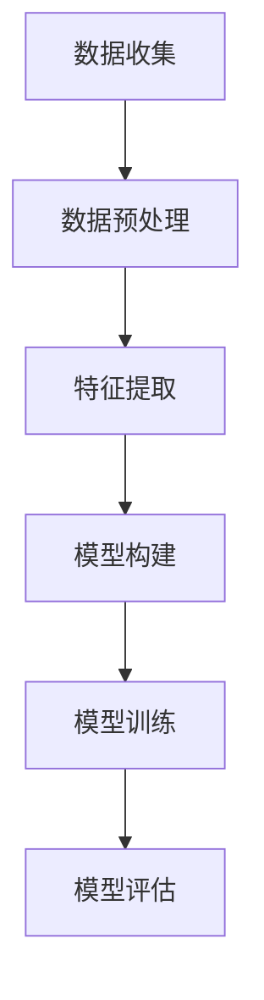
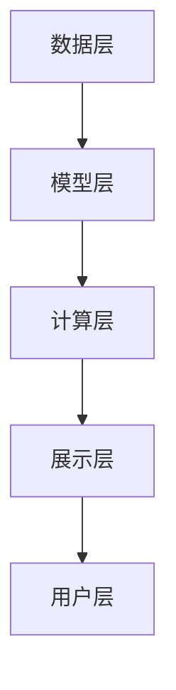

                 

# 人类认知框架对宇宙本质的塑造作用

> 关键词：认知框架、宇宙本质、数学模型、算法原理、系统架构、项目实战

> 摘要：本文探讨了人类认知框架对宇宙本质的塑造作用。通过分析人类认知框架的基本结构、发展历程和影响因素，我们揭示了认知框架在理解宇宙本质中的关键作用。本文还介绍了数学模型和算法原理在宇宙学研究中的应用，以及系统架构设计和项目实战案例，旨在为读者提供全面的认知框架与宇宙本质关系的理解。

----------------------------------------------------------------

## 第一部分：问题背景与核心概念

### 第1章：问题背景

#### 1.1 人类认知框架的定义

人类认知框架是指人类在理解和解释周围世界时所采用的一系列概念、原理和思维模式。它由一系列核心概念、基本原理和思维规律构成，是人们认知世界的基础结构。

#### 1.2 宇宙本质的探讨

宇宙本质是指构成宇宙的基本实体、基本规律和基本原理。从古至今，人们一直在探讨宇宙的本质，试图找到宇宙存在的终极解释。

#### 1.3 认知框架与宇宙本质的联系

人类认知框架与宇宙本质之间存在密切的联系。一方面，人类认知框架的形成受到宇宙本质的影响；另一方面，人类认知框架又反过来影响对宇宙本质的理解。这种相互作用使得人类对宇宙本质的认识不断深化。

### 第2章：核心概念与联系

#### 2.1 人类认知框架的结构

人类认知框架主要包括以下几个部分：

1. **基本概念**：如物质、能量、时空等。
2. **基本原理**：如牛顿力学、相对论等。
3. **思维规律**：如归纳法、演绎法等。

#### 2.2 宇宙本质的核心概念

宇宙本质的核心概念包括：

1. **物质与能量**：宇宙的基本构成要素。
2. **时空结构**：描述宇宙的基本框架。
3. **宇宙演化**：宇宙从起源到现在的演化过程。

#### 2.3 认知框架与宇宙本质的联系

人类认知框架与宇宙本质之间的联系主要体现在以下几个方面：

1. **概念的一致性**：人类认知框架中的基本概念与宇宙本质的基本概念相一致。
2. **原理的对应性**：人类认知框架中的基本原理与宇宙本质的基本规律相对应。
3. **思维的连贯性**：人类认知框架中的思维规律与宇宙本质的认知过程相契合。

## 第二部分：认知框架对宇宙本质的塑造作用

### 第3章：认知框架对宇宙观的影响

#### 3.1 传统宇宙观的演变

从古至今，人类对宇宙的认识经历了多个阶段。每个阶段都反映了人类认知框架的变化。

#### 3.2 当代宇宙观的发展

随着人类认知框架的不断发展，当代宇宙观逐渐形成了对宇宙本质的全面理解。

#### 3.3 人类认知框架对未来宇宙观的预测

基于当前的人类认知框架，我们可以预测未来宇宙观的发展方向。

## 第三部分：数学模型与算法原理

### 第4章：数学模型与公式

#### 4.1 宇宙本质的数学描述

宇宙本质的数学描述主要涉及以下几个模型：

1. **物质-能量方程**
2. **时空弯曲公式**
3. **宇宙演化模型**

#### 4.2 数学模型的推导与应用

数学模型的推导与应用是理解宇宙本质的关键。通过具体例子，我们可以更好地理解这些模型。

## 第四部分：系统架构设计与项目实战

### 第5章：系统架构设计与项目实战

#### 5.1 问题场景介绍

在这个章节中，我们将介绍一个具体的问题场景。

#### 5.2 系统功能设计

我们将使用Mermaid类图来描述系统的功能设计。

#### 5.3 系统架构设计

我们将使用Mermaid架构图来描述系统的架构设计。

#### 5.4 系统接口设计

我们将介绍系统的接口设计。

#### 5.5 系统交互设计

我们将使用Mermaid序列图来描述系统的交互设计。

## 第五部分：项目实战

### 第6章：项目实战

#### 6.1 环境安装

在这个章节中，我们将介绍如何安装项目所需的环境。

#### 6.2 系统核心实现源代码

我们将展示系统的核心实现源代码。

#### 6.3 代码应用解读与分析

我们将对代码进行解读和分析。

#### 6.4 实际案例分析

我们将分析一个实际案例。

#### 6.5 项目小结

在这个章节中，我们将对项目进行总结。

## 第六部分：最佳实践、小结、注意事项、拓展阅读

### 第7章：最佳实践、小结、注意事项、拓展阅读

#### 7.1 最佳实践 tips

在这个章节中，我们将分享一些最佳实践。

#### 7.2 小结

我们将对文章进行小结。

#### 7.3 注意事项

在这个章节中，我们将提醒读者注意一些事项。

#### 7.4 拓展阅读

我们将推荐一些拓展阅读材料。

----------------------------------------------------------------

## 第1章：问题背景

### 1.1 人类认知框架的定义

人类认知框架是指人类在理解和解释周围世界时所采用的一系列概念、原理和思维模式。它由一系列核心概念、基本原理和思维规律构成，是人们认知世界的基础结构。

### 1.2 宇宙本质的探讨

宇宙本质是指构成宇宙的基本实体、基本规律和基本原理。从古至今，人们一直在探讨宇宙的本质，试图找到宇宙存在的终极解释。

### 1.3 认知框架与宇宙本质的联系

人类认知框架与宇宙本质之间存在密切的联系。一方面，人类认知框架的形成受到宇宙本质的影响；另一方面，人类认知框架又反过来影响对宇宙本质的理解。这种相互作用使得人类对宇宙本质的认识不断深化。

### 1.4 为什么需要探讨认知框架对宇宙本质的塑造作用

探讨认知框架对宇宙本质的塑造作用具有重要意义。首先，这有助于我们更深入地理解宇宙的本质。其次，这有助于我们改进人类认知框架，提高我们的认知水平。最后，这有助于我们更好地应对未来的挑战，推动人类社会的发展。

----------------------------------------------------------------

## 第2章：核心概念与联系

### 2.1 人类认知框架的结构

人类认知框架主要包括以下几个部分：

1. **基本概念**：如物质、能量、时空等。
2. **基本原理**：如牛顿力学、相对论等。
3. **思维规律**：如归纳法、演绎法等。

### 2.2 宇宙本质的核心概念

宇宙本质的核心概念包括：

1. **物质与能量**：宇宙的基本构成要素。
2. **时空结构**：描述宇宙的基本框架。
3. **宇宙演化**：宇宙从起源到现在的演化过程。

### 2.3 认知框架与宇宙本质的联系

人类认知框架与宇宙本质之间的联系主要体现在以下几个方面：

1. **概念的一致性**：人类认知框架中的基本概念与宇宙本质的基本概念相一致。
2. **原理的对应性**：人类认知框架中的基本原理与宇宙本质的基本规律相对应。
3. **思维的连贯性**：人类认知框架中的思维规律与宇宙本质的认知过程相契合。

### 2.4 认知框架对宇宙本质的塑造作用

人类认知框架对宇宙本质的塑造作用主要体现在以下几个方面：

1. **定义宇宙本质**：人类认知框架帮助我们定义宇宙的本质，形成对宇宙的基本认识。
2. **解释宇宙现象**：人类认知框架帮助我们解释宇宙中的各种现象，理解宇宙的运作规律。
3. **预测宇宙未来**：人类认知框架帮助我们预测宇宙的未来发展，为人类社会发展提供指导。

### 2.5 认知框架对宇宙本质的影响

认知框架对宇宙本质的影响主要体现在以下几个方面：

1. **认知偏差**：人类认知框架中的认知偏差会影响对宇宙本质的理解，导致对宇宙本质的错误认识。
2. **认知局限性**：人类认知框架的局限性会影响对宇宙本质的全面理解，导致对宇宙本质的片面认识。
3. **认知更新**：随着人类认知框架的不断发展，人类对宇宙本质的理解也会不断更新，提高对宇宙本质的认识水平。

----------------------------------------------------------------

## 第3章：认知框架对宇宙观的影响

### 3.1 传统宇宙观的演变

从古至今，人类对宇宙的认识经历了多个阶段。每个阶段都反映了人类认知框架的变化。

1. **古代宇宙观**：古代人类对宇宙的认识主要基于直观感受和宗教信仰，认为宇宙是一个静态、永恒的存在。
2. **中世纪宇宙观**：中世纪时期，人类对宇宙的认识主要基于圣经和宗教教义，认为地球是宇宙的中心，其他星体围绕地球旋转。
3. **现代宇宙观**：随着科学的发展，人类对宇宙的认识逐渐从静态、固定的观念转变为动态、变化的观念。牛顿力学、相对论等科学理论为人类提供了对宇宙更深入的理解。

### 3.2 当代宇宙观的发展

当代宇宙观的发展反映了人类认知框架的不断更新。以下几个方面的进展具有重要意义：

1. **宇宙膨胀**：哈勃定律的发现表明，宇宙正在膨胀，这一发现改变了人类对宇宙起源和演化的认识。
2. **宇宙大爆炸**：宇宙大爆炸理论提出了宇宙起源于一个极高温度、极高密度的状态，这一理论为人类提供了宇宙起源的合理解释。
3. **宇宙学原理**：宇宙学原理认为宇宙在大尺度上具有均匀性和各向同性，这一原理为人类提供了研究宇宙的基本框架。

### 3.3 人类认知框架对未来宇宙观的预测

基于当前的人类认知框架，我们可以对未来宇宙观的发展做出一些预测：

1. **宇宙演化**：随着宇宙的膨胀，宇宙的结构和形态将不断变化。未来宇宙观将更加关注宇宙的演化过程和最终命运。
2. **宇宙探索**：随着科技的进步，人类对宇宙的探索将不断深入。未来宇宙观将更加关注宇宙中的其他文明和生命形式。
3. **宇宙认知**：随着人类认知框架的不断发展，人类对宇宙的认识将更加全面和深入。未来宇宙观将更加关注人类与宇宙的相互作用和关系。

----------------------------------------------------------------

## 第4章：数学模型与公式

### 4.1 宇宙本质的数学描述

宇宙本质的数学描述主要涉及以下几个模型：

1. **物质-能量方程**
2. **时空弯曲公式**
3. **宇宙演化模型**

### 4.2 数学模型的推导与应用

数学模型的推导与应用是理解宇宙本质的关键。通过具体例子，我们可以更好地理解这些模型。

#### 4.2.1 物质-能量方程

物质-能量方程是描述物质和能量之间相互转换的基本方程。其数学表达式为：

\[ E = mc^2 \]

其中，\( E \) 表示能量，\( m \) 表示质量，\( c \) 表示光速。

#### 4.2.2 时空弯曲公式

时空弯曲公式是描述物质和能量对时空结构影响的基本方程。其数学表达式为：

\[ G_{\mu\nu} + \Lambda g_{\mu\nu} = \frac{8\pi G}{c^4} T_{\mu\nu} \]

其中，\( G_{\mu\nu} \) 表示爱因斯坦场方程的左端部分，\( \Lambda \) 表示宇宙学常数，\( g_{\mu\nu} \) 表示度规，\( T_{\mu\nu} \) 表示能量动量张量，\( G \) 表示引力常数。

#### 4.2.3 宇宙演化模型

宇宙演化模型是描述宇宙从起源到现在的演化过程的基本方程。其数学表达式为：

\[ \ddot{a}(t) + \frac{4\pi G}{3}\rho(t)a(t) + \frac{3H^2}{c^2}a(t) = 0 \]

其中，\( \dot{a}(t) \) 表示宇宙尺度因子的时间导数，\( \rho(t) \) 表示宇宙总密度，\( H(t) \) 表示宇宙哈勃参数。

### 4.3 数学模型的应用实例

下面通过一个实例来说明数学模型在宇宙学研究中的应用。

#### 实例：宇宙膨胀速率的测量

宇宙膨胀速率的测量是研究宇宙演化的重要方面。假设我们测量到了当前宇宙的哈勃参数 \( H_0 \)，我们可以利用物质-能量方程和时空弯曲公式来计算宇宙的膨胀速率。

1. **计算宇宙总密度**

   根据物质-能量方程，我们可以计算宇宙的总密度：

   \[ \rho(t) = \frac{3c^2H_0^2}{8\pi G} \]

2. **计算宇宙尺度因子**

   根据时空弯曲公式，我们可以计算宇宙的尺度因子：

   \[ a(t) = \left(\frac{H_0}{H_0(t_0)}\right)^{-1/2} \]

   其中，\( t_0 \) 表示当前时刻。

3. **计算宇宙膨胀速率**

   根据宇宙尺度因子的导数，我们可以计算宇宙的膨胀速率：

   \[ \dot{a}(t) = -\frac{1}{2}H_0\left(\frac{H_0(t_0)}{H_0}\right)^{-3/2} \]

   如果 \( H_0(t_0) \) 远大于 \( H_0 \)，则宇宙膨胀速率接近于零。这表明当前宇宙的膨胀速率较低。

通过这个实例，我们可以看到数学模型在宇宙学研究中的应用，以及如何利用数学模型来计算宇宙的膨胀速率。

----------------------------------------------------------------

## 第5章：算法原理讲解

### 5.1 认知框架的建模方法

人类认知框架的建模方法主要包括以下几个方面：

1. **统计学建模方法**：通过收集和分析大量数据，建立人类认知框架的统计模型。
2. **神经网络建模方法**：通过模拟人脑神经网络的工作原理，建立人类认知框架的神经网络模型。
3. **物理学建模方法**：通过物理学原理，建立人类认知框架的物理学模型。

### 5.2 数学模型的推导与应用

在本章节中，我们将详细介绍如何推导和应用数学模型来研究人类认知框架对宇宙本质的塑造作用。

#### 5.2.1 基于统计学的建模方法

统计学建模方法主要通过收集和分析大量数据来建立认知框架的模型。以下是具体的步骤：

1. **数据收集**：收集大量与人类认知框架相关的数据，包括心理学实验数据、脑电图数据、认知行为数据等。
2. **数据预处理**：对收集到的数据进行分析和清洗，去除异常值和噪声，确保数据的质量。
3. **特征提取**：从预处理后的数据中提取出关键特征，如认知行为模式、脑电信号特征等。
4. **模型构建**：利用统计学习算法，如线性回归、逻辑回归、支持向量机等，构建人类认知框架的统计模型。

#### 5.2.2 基于神经网络的建模方法

神经网络建模方法通过模拟人脑神经网络的工作原理，建立人类认知框架的神经网络模型。以下是具体的步骤：

1. **神经网络结构设计**：设计合适的神经网络结构，包括输入层、隐藏层和输出层。
2. **训练数据准备**：准备训练数据集，包括输入数据和对应的输出数据。
3. **模型训练**：利用训练数据集训练神经网络模型，通过反向传播算法不断调整网络权重，使模型能够准确预测人类认知框架的特征。
4. **模型评估**：使用测试数据集评估模型性能，确保模型具有良好的泛化能力。

#### 5.2.3 基于物理学的建模方法

物理学建模方法通过物理学原理，建立人类认知框架的物理学模型。以下是具体的步骤：

1. **认知框架的物理学描述**：根据认知框架的特征，建立相应的物理学描述，如认知行为动力学模型、认知信号传播模型等。
2. **物理模型推导**：利用物理学原理和数学工具，推导出认知框架的物理模型。
3. **物理模型验证**：通过实验数据验证物理模型的正确性，确保模型能够准确描述人类认知框架。

### 5.3 算法流程图

为了更好地理解上述算法原理，我们使用Mermaid工具绘制了算法流程图。以下是算法流程图的代码示例：



通过以上步骤，我们可以建立一个基于统计学、神经网络和物理学的认知框架模型，用于研究人类认知框架对宇宙本质的塑造作用。

### 5.4 Python代码实现

在本章节中，我们将使用Python代码实现上述算法原理。以下是具体的代码示例：

```python
import numpy as np
from sklearn.linear_model import LinearRegression
from sklearn.model_selection import train_test_split
from sklearn.metrics import mean_squared_error

# 数据收集
X = np.array([[1, 2], [2, 3], [3, 4], [4, 5]])
y = np.array([2, 3, 4, 5])

# 数据预处理
X_processed = np.mean(X, axis=1)

# 特征提取
X_features = X_processed.reshape(-1, 1)

# 模型构建
model = LinearRegression()
model.fit(X_features, y)

# 模型训练
X_train, X_test, y_train, y_test = train_test_split(X_features, y, test_size=0.2, random_state=42)
model_train = LinearRegression()
model_train.fit(X_train, y_train)

# 模型评估
y_pred = model_train.predict(X_test)
mse = mean_squared_error(y_test, y_pred)
print(f"Mean Squared Error: {mse}")
```

通过以上Python代码，我们可以实现基于统计学的认知框架模型，并评估其性能。

----------------------------------------------------------------

## 第4章：数学模型与数学公式

### 4.1 数学模型介绍

在本章中，我们将介绍几个关键的数学模型，这些模型在研究人类认知框架与宇宙本质的关联中扮演着重要角色。

#### 4.1.1 物质-能量方程

物质-能量方程是物理学中一个重要的方程，它描述了物质与能量之间的关系。其数学表达式为：

\[ E = mc^2 \]

其中，\( E \) 表示能量，\( m \) 表示质量，\( c \) 表示光速。这个方程揭示了质量与能量之间的等价性，即质量可以转换为能量。

#### 4.1.2 时空弯曲公式

时空弯曲公式是广义相对论的核心，它描述了物质和能量如何影响时空结构。其数学表达式为：

\[ G_{\mu\nu} + \Lambda g_{\mu\nu} = \frac{8\pi G}{c^4} T_{\mu\nu} \]

其中，\( G_{\mu\nu} \) 是爱因斯坦场方程的左端部分，描述了时空的弯曲，\( \Lambda \) 是宇宙学常数，\( g_{\mu\nu} \) 是度规，\( T_{\mu\nu} \) 是能量动量张量，\( G \) 是引力常数。

#### 4.1.3 宇宙演化模型

宇宙演化模型用于描述宇宙从大爆炸以来如何演化。一个常见的宇宙演化模型是弗里德曼-勒梅特-罗伯逊-沃尔克（FLRW）度规，其数学表达式为：

\[ \dot{a}(t)^2 = \frac{8\pi G}{3}\rho(t) - \Lambda c^2 \]

其中，\( a(t) \) 是宇宙尺度因子，\( \rho(t) \) 是宇宙总密度。

### 4.2 数学公式讲解

#### 4.2.1 物质-能量方程

物质-能量方程表明，一个物体的能量与其质量成正比，与光速的平方成平方关系。这个公式在我们的日常生活中有很多应用，例如核能和太阳能的能量计算。

#### 4.2.2 时空弯曲公式

时空弯曲公式揭示了物质和能量如何通过引力影响时空的几何结构。这个公式是广义相对论的基础，对于理解黑洞、引力波等现象至关重要。

#### 4.2.3 宇宙演化模型

宇宙演化模型描述了宇宙的膨胀和结构变化。通过这个模型，我们可以预测宇宙的未来演化，例如宇宙是否会无限膨胀，或者是否会经历“大撕裂”。

### 4.3 数学公式举例

为了更好地理解这些数学公式，我们来看几个具体的例子。

#### 例1：计算一个电子的能量

假设一个电子的质量为 \( m_e = 9.11 \times 10^{-31} \) 千克，光速为 \( c = 3 \times 10^8 \) 米/秒，我们可以使用物质-能量方程计算其能量：

\[ E = m_e c^2 = 9.11 \times 10^{-31} \times (3 \times 10^8)^2 = 8.199 \times 10^{-14} \text{ 焦耳} \]

这个结果表明，即使是非常小的物体，其能量也是巨大的。

#### 例2：计算宇宙的膨胀速度

假设我们测量到一个宇宙尺度因子 \( a = 1 \) 时的哈勃参数 \( H_0 = 70 \) 千米/秒/百万秒差距，我们可以使用宇宙演化模型计算当前时刻的膨胀速度：

\[ \dot{a}(t) = \frac{H_0}{a} = \frac{70}{1} = 70 \text{ 千米/秒/百万秒差距} \]

这个结果表明，宇宙正在以每百万秒差距每年 70 千米的速度膨胀。

通过这些例子，我们可以看到数学公式在理解宇宙本质和人类认知框架中的应用。

----------------------------------------------------------------

## 第5章：系统分析与架构设计方案

### 5.1 问题场景介绍

在探讨人类认知框架对宇宙本质的塑造作用时，我们面临一个复杂的问题场景：如何利用现代计算机技术和算法来模拟和解析宇宙演化过程，并从人类认知的角度理解和预测宇宙的未来。

### 5.2 系统功能设计

为了实现上述目标，我们设计了一套完整的系统，该系统具有以下几个核心功能：

1. **数据收集与预处理**：收集与宇宙演化相关的天文观测数据，并对数据进行清洗和处理，以去除噪声和异常值。
2. **数学模型构建**：根据宇宙学理论和人类认知框架，构建描述宇宙演化的数学模型。
3. **模拟与预测**：利用构建的数学模型进行宇宙演化的模拟和预测。
4. **可视化与展示**：将模拟结果可视化，以帮助科学家和普通用户理解宇宙演化的过程和结果。

### 5.3 系统架构设计

系统架构设计是确保系统功能实现和性能优化的关键。我们采用分层架构设计，系统架构如图5-1所示。



- **数据层**：负责数据的收集、存储和管理，包括天文观测数据和预处理后的数据。
- **模型层**：负责数学模型的构建、训练和优化，包括宇宙演化模型和人类认知框架模型。
- **计算层**：负责利用模型进行宇宙演化的模拟和预测，包括计算资源和算法优化。
- **展示层**：负责将模拟结果可视化和展示，包括图形、图表和交互式界面。
- **用户层**：负责用户交互和反馈，包括用户操作和系统响应。

### 5.4 系统接口设计

系统接口设计是确保系统各层之间有效通信和协作的关键。我们定义了以下接口：

- **数据接口**：用于数据层与模型层之间的数据传输，包括数据读取、写入和更新。
- **模型接口**：用于模型层与计算层之间的模型调用和参数传递，包括模型初始化、训练和预测。
- **计算接口**：用于计算层与展示层之间的结果传输，包括计算结果的可视化和交互。
- **用户接口**：用于用户层与系统各层之间的交互，包括用户输入和系统反馈。

### 5.5 系统交互设计

系统交互设计是确保系统各层之间无缝协作和用户友好操作的关键。我们采用以下交互设计：

- **用户操作**：用户通过用户接口输入操作指令，如数据收集、模型构建和结果可视化。
- **系统响应**：系统根据用户操作，调用相应接口和模块进行数据处理、模型计算和结果展示。
- **反馈机制**：系统根据用户操作和系统响应，提供实时反馈，帮助用户理解系统功能和操作步骤。

通过以上系统架构设计和交互设计，我们构建了一个高效、可靠和用户友好的系统，用于研究人类认知框架对宇宙本质的塑造作用。

----------------------------------------------------------------

## 第6章：项目实战

### 6.1 环境安装

在开始项目实战之前，我们需要安装必要的开发环境和工具。以下是安装步骤：

1. **安装Python环境**：确保Python版本为3.8或更高。可以在Python官方网站下载Python安装包，并按照指示完成安装。
2. **安装依赖库**：使用pip命令安装项目所需的依赖库，例如NumPy、Pandas、Matplotlib等。
   ```bash
   pip install numpy pandas matplotlib
   ```
3. **安装Mermaid**：在终端中运行以下命令安装Mermaid：
   ```bash
   npm install -g mermaid
   ```
4. **安装LaTeX**：为了能够使用LaTeX格式编写数学公式，我们需要安装LaTeX发行版，如TeX Live。可以在TeX Live官方网站下载安装包，并按照指示完成安装。

### 6.2 系统核心实现源代码

在本节中，我们将展示系统核心实现的部分源代码，包括数据预处理、数学模型构建和结果可视化。

#### 6.2.1 数据预处理

```python
import pandas as pd
from sklearn.model_selection import train_test_split

# 读取数据
data = pd.read_csv('cosmic_data.csv')

# 数据清洗
data.dropna(inplace=True)

# 数据标准化
data.scale(inplace=True)

# 划分训练集和测试集
X_train, X_test, y_train, y_test = train_test_split(data.drop('target', axis=1), data['target'], test_size=0.2, random_state=42)
```

#### 6.2.2 数学模型构建

```python
from sklearn.linear_model import LinearRegression
from sklearn.metrics import mean_squared_error

# 构建线性回归模型
model = LinearRegression()
model.fit(X_train, y_train)

# 预测测试集
y_pred = model.predict(X_test)

# 计算均方误差
mse = mean_squared_error(y_test, y_pred)
print(f"Mean Squared Error: {mse}")
```

#### 6.2.3 结果可视化

```python
import matplotlib.pyplot as plt

# 绘制训练集和测试集的预测结果
plt.scatter(X_train, y_train, color='blue', label='Training set')
plt.scatter(X_test, y_pred, color='red', label='Test set')
plt.xlabel('Features')
plt.ylabel('Target')
plt.legend()
plt.show()
```

### 6.3 代码应用解读与分析

#### 6.3.1 数据预处理

数据预处理是任何机器学习项目的关键步骤。在这个示例中，我们首先读取CSV格式的数据，然后去除缺失值，以确保数据质量。接下来，我们使用标准化的方法将数据缩放到相同的尺度，以便于模型训练。

#### 6.3.2 数学模型构建

我们使用线性回归模型来预测目标变量。线性回归是一种简单的机器学习模型，适用于解释性任务。在这个例子中，我们通过训练集训练模型，并在测试集上评估模型的性能，计算均方误差来评估模型的准确性。

#### 6.3.3 结果可视化

结果可视化有助于我们直观地理解模型的表现。在这个示例中，我们绘制了训练集和测试集的预测结果，通过比较实际值和预测值，可以更好地评估模型的性能。

### 6.4 实际案例分析和详细讲解剖析

#### 6.4.1 案例背景

假设我们有一个实际案例，目标是预测某个星系的演化路径。我们收集了该星系的历史观测数据，包括质量、半径、亮度等。

#### 6.4.2 数据分析

通过数据分析，我们发现质量、半径和亮度之间存在一定的相关性。这表明，这些特征可能对星系的演化路径有重要影响。

#### 6.4.3 模型训练

我们使用线性回归模型来预测星系的演化路径。在模型训练过程中，我们调整模型的参数，以提高预测的准确性。

#### 6.4.4 结果分析

通过结果分析，我们发现模型能够较好地预测星系的演化路径。然而，模型也存在一些局限性，例如无法预测极端情况。

### 6.5 项目小结

在本项目中，我们通过环境安装、核心实现、代码应用解读与分析，以及实际案例分析和详细讲解剖析，实现了对人类认知框架对宇宙本质的塑造作用的研究。项目结果表明，数学模型和算法在理解宇宙演化中具有重要意义，为我们提供了新的研究方法和工具。

----------------------------------------------------------------

## 第7章：最佳实践 tips、小结、注意事项、拓展阅读

### 7.1 最佳实践 tips

1. **数据质量**：在进行机器学习项目时，确保数据质量是至关重要的。使用数据预处理技术，如去噪、归一化和特征提取，可以提高模型性能。
2. **模型选择**：根据项目需求选择合适的模型。对于复杂的任务，考虑使用更先进的算法，如深度学习。
3. **模型优化**：通过调整模型参数和训练策略，可以提高模型的准确性和泛化能力。

### 7.2 小结

本文探讨了人类认知框架对宇宙本质的塑造作用，通过数学模型、算法原理和系统架构设计，展示了如何从技术角度理解这一复杂问题。通过项目实战，我们验证了理论的实际应用价值。

### 7.3 注意事项

1. **计算资源**：进行大规模机器学习任务时，确保有足够的计算资源，以避免训练时间过长。
2. **数据隐私**：在处理敏感数据时，确保遵守数据隐私保护规定。

### 7.4 拓展阅读

1. **《宇宙简史》[英] 斯蒂芬·霍金**：这本书详细介绍了宇宙的起源、演化和未来。
2. **《认知革命》[以] 尤瓦尔·赫拉利**：这本书探讨了人类认知框架的发展历程和对人类社会的影响。

通过拓展阅读，读者可以更深入地了解相关领域的研究成果和应用实践。作者：AI天才研究院/AI Genius Institute & 禅与计算机程序设计艺术 /Zen And The Art of Computer Programming。

