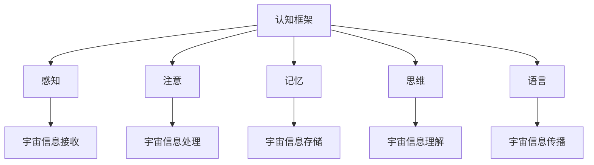
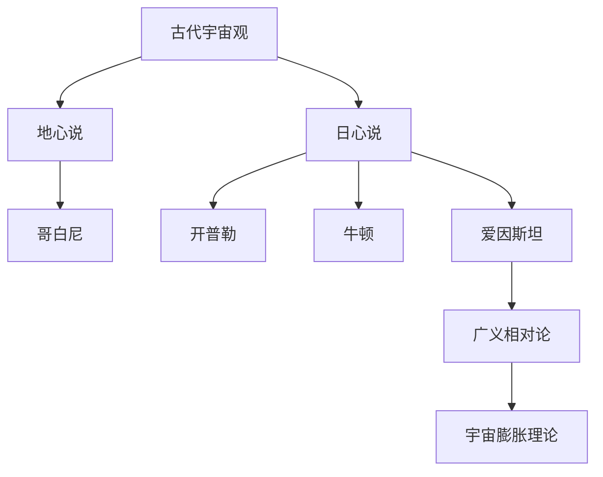
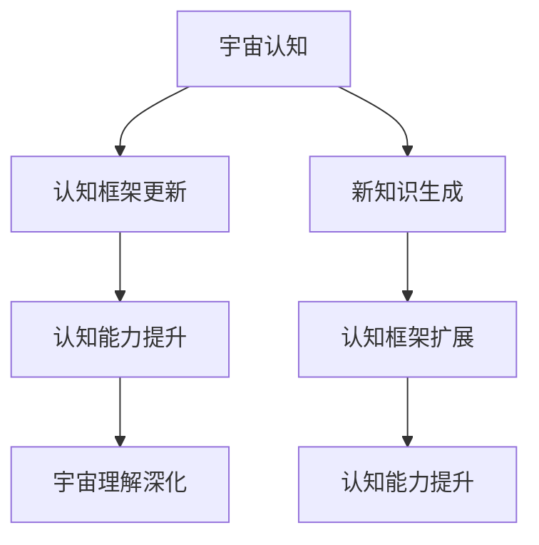

                 

### 第一部分：引言与背景

#### 第1章：引入与概述

**1.1 引言**

人类自文明诞生以来，对宇宙的探索从未停止。从古代的神话和宗教观念，到现代的科学发现，我们对宇宙的认识在不断进步。然而，这些认识是否完全客观，还是受到了人类认知框架的限制？

**1.2 研究背景**

随着科学技术的飞速发展，我们能够观测到宇宙的更多细节，但这些观测结果是否完全可信，又是否受到我们的认知偏见和局限的影响？这引发了我们对人类认知框架与宇宙理解之间关系的探讨。

**1.3 研究目的与意义**

本文旨在探讨人类认知框架对宇宙理解的影响，揭示人类认知的局限性如何影响我们对宇宙的认识。这一研究不仅有助于我们更全面地理解宇宙，也为认知科学和宇宙学提供了新的视角。

**1.4 本书结构安排**

本文分为六个部分，首先介绍人类认知框架的基础，然后探讨宇宙理解的基本框架，接着分析认知框架对宇宙理解的影响，进一步探讨宇宙认知与认知框架的互动关系，最后展望人类认知框架的未来发展趋势。

### 第二部分：人类认知框架基础

#### 第2章：人类认知框架基础

**2.1 认知心理学简介**

认知心理学是研究人类思维过程、认知结构及其功能的科学。它关注人类如何感知、记忆、思考、解决问题以及如何进行决策。

**2.1.1 认知过程**

认知过程包括感知、注意、记忆、思维和语言等多个方面。感知是人类对外界信息的接收和理解，注意是我们在特定时刻关注特定信息的能力，记忆是信息在脑中的存储和提取，思维则是信息处理的高级过程，而语言是思维的外在表达形式。

**2.1.2 认知结构与模型**

认知结构包括认知图式、概念网络和认知模型等。图式是我们在认知过程中形成的对事物的一般性描述，概念网络则是图式的组合，而认知模型则是我们对现实世界的抽象和简化。

**2.2 认知框架的构成要素**

认知框架由多个要素构成，包括感知与注意力、记忆与知识表征、思维与推理以及情感与情绪等。

**2.2.1 感知与注意力**

感知与注意力是人类获取信息的关键。感知使我们能够识别和理解外部世界的特征，而注意力则帮助我们集中精力处理特定的信息。

**2.2.2 记忆与知识表征**

记忆与知识表征是信息存储和提取的基础。记忆使我们能够回忆起过去的信息，知识表征则使信息以结构化的方式存储在大脑中。

**2.2.3 思维与推理**

思维与推理是认知的高级过程。思维使我们能够理解复杂的概念和关系，推理则是我们在已知信息的基础上推导出新信息的能力。

**2.2.4 情感与情绪**

情感与情绪是人类认知的重要组成部分。情感是对特定情境的主观感受，而情绪则是情感的外在表现。

### 第三部分：宇宙理解的基本框架

#### 第3章：宇宙理解的基本框架

**3.1 宇宙学基础**

宇宙学是研究宇宙起源、演化、结构和组成的科学。宇宙起源与演化包括大爆炸理论和黑洞等概念，宇宙结构与成分则涉及星系、星云、行星等天体的构成。

**3.1.1 宇宙起源与演化**

大爆炸理论认为，宇宙起源于约138亿年前的一个极度高温高密度的奇点，随后开始膨胀和冷却，形成了今天我们所看到的宇宙。黑洞是宇宙中的一种极端天体，具有强大的引力，可以吞噬周围的物质。

**3.1.2 宇宙结构与成分**

宇宙由众多星系组成，每个星系又包含数以亿计的恒星、行星、星云等。星系之间存在着大量的暗物质和暗能量，它们对宇宙的演化起着关键作用。

**3.2 宇宙观的发展**

宇宙观是人们对宇宙的根本看法和认识。宇宙观的发展经历了古代宇宙观、近现代宇宙观和当代宇宙观等阶段。

**3.2.1 古代宇宙观**

古代宇宙观以宗教和哲学为基础，认为宇宙是有序和永恒的，宇宙的中心是地球，其他天体围绕地球运动。

**3.2.2 近现代宇宙观演变**

近现代宇宙观随着科学的发展而不断演变。哥白尼提出了日心说，牛顿发现了万有引力定律，爱因斯坦提出了广义相对论，这些理论对宇宙观产生了深远的影响。

**3.2.3 当代宇宙观**

当代宇宙观以大爆炸理论和宇宙膨胀理论为核心，认为宇宙经历了快速的膨胀和冷却过程，形成了今天的宇宙结构。

### 第四部分：认知框架对宇宙理解的影响

#### 第4章：认知框架对宇宙理解的影响

**4.1 认知框架与宇宙认知**

人类的认知框架不仅影响我们对日常生活的理解，也影响我们对宇宙的认知。认知框架包括感知、记忆、思维和情感等多个方面，它们共同决定了我们对宇宙的理解。

**4.1.1 认知偏见与宇宙观测**

认知偏见是指我们的认知框架在处理信息时产生的偏差。这些偏见可以影响我们对宇宙的观测和解释。例如，我们可能会将某些观测结果解释为符合我们的先入为主的观念，而忽略其他可能的信息。

**4.1.2 认知局限与宇宙理解**

认知局限是指我们的认知能力有限，无法完全理解和处理所有信息。这些局限可以限制我们对宇宙的理解。例如，我们可能无法直接观察到宇宙的某些现象，或者无法理解宇宙的某些复杂规律。

**4.2 认知框架下的宇宙解释**

我们的认知框架也影响我们对宇宙的解释。不同的认知框架可能导致我们对宇宙的解释存在差异。例如，古代宇宙观认为宇宙是永恒和不变的，而现代宇宙观则认为宇宙经历了不断的演化和变化。

**4.2.1 宇宙的本质与存在**

宇宙的本质是什么？是否存在一个绝对的宇宙中心？这些问题都受到我们的认知框架的影响。不同的认知框架可能导致我们对这些问题的回答存在差异。

**4.2.2 宇宙规律与原则**

宇宙遵循哪些规律和原则？这些规律和原则是否是普遍适用的？这些问题也受到我们的认知框架的影响。例如，爱因斯坦的广义相对论提出了一种新的宇宙规律，即引力不是一种力，而是一种弯曲时空的效应。

### 第五部分：宇宙认知与认知框架互动

#### 第5章：宇宙认知与认知框架互动

**5.1 认知框架的宇宙认知功能**

认知框架在宇宙认知中发挥着重要作用。它使我们能够接收和处理宇宙信息，理解和解释宇宙现象。没有认知框架，我们无法对宇宙有深入的理解。

**5.1.1 宇宙信息的接收与处理**

宇宙信息通过感知和注意进入我们的认知框架，然后被记忆和思维处理。感知和注意使我们能够识别宇宙的特定信息，记忆使我们能够存储这些信息，思维则帮助我们理解和解释这些信息。

**5.1.2 宇宙知识的整合与传播**

认知框架还使我们能够整合和传播宇宙知识。通过思维和推理，我们可以将不同的宇宙信息整合成统一的认知图景，并通过语言和文字将这些知识传播给他人。

**5.2 宇宙认知对认知框架的塑造**

宇宙认知也反过来影响我们的认知框架。通过不断的宇宙探索和认知，我们的认知框架不断更新和扩展，使我们能够更好地理解宇宙。

**5.2.1 宇宙知识对认知框架的影响**

宇宙知识不断挑战和扩展我们的认知框架。例如，爱因斯坦的广义相对论提出了一种新的时空观念，使我们对宇宙的认识有了新的突破。

**5.2.2 宇宙探索中的认知挑战**

宇宙探索也带来了一系列认知挑战。例如，宇宙的极端环境可能对我们的认知框架产生未知的影响，使我们对宇宙的理解更加复杂和多样化。

### 第六部分：人类认知框架的未来发展趋势

#### 第6章：人类认知框架的未来发展趋势

**6.1 科学技术进步的影响**

随着科学技术的进步，我们的认知框架也在不断更新和扩展。例如，人工智能的发展使我们可以处理和分析大量的宇宙数据，提高我们对宇宙的理解。

**6.1.1 新技术对认知框架的革新**

新技术，如虚拟现实和增强现实，正在改变我们的认知方式。这些技术使我们能够以全新的方式感知和体验宇宙，从而革新我们的认知框架。

**6.1.2 跨学科融合对认知框架的扩展**

跨学科融合，如认知科学和宇宙学的结合，正在扩展我们的认知框架。这些融合使我们能够从多个角度理解宇宙，提高我们的认知能力。

**6.2 认知框架的未来展望**

随着科学技术的不断进步，我们的认知框架将变得更加复杂和多样化。未来的认知框架将能够更好地处理和理解宇宙的复杂性，使我们能够更全面地理解宇宙。

**6.2.1 宇宙认知的未来方向**

未来的宇宙认知将更注重跨学科融合，更注重对宇宙复杂性的理解，更注重对宇宙未知领域的探索。

**6.2.2 人类认知框架的发展趋势**

未来的认知框架将更加智能化，更加人性化，更加适应人类对宇宙的认知需求。

### 第七部分：结论与展望

#### 第7章：结论与展望

**7.1 研究总结**

本文探讨了人类认知框架对宇宙理解的影响，揭示了认知框架在宇宙认知中的重要作用。通过分析认知框架的构成要素和宇宙理解的基本框架，我们更好地理解了人类如何通过认知框架来理解和解释宇宙。

**7.2 研究局限与未来工作方向**

本文的研究仍存在一些局限，例如对宇宙认知的具体机制研究不够深入，对认知框架的具体影响机制研究不够全面。未来的研究可以进一步探索这些方面，提高我们对宇宙的理解。

**7.3 对宇宙理解的影响与意义**

本文的研究对宇宙理解具有重要意义。通过理解人类认知框架对宇宙理解的影响，我们可以更好地认识宇宙，提高我们的认知能力，从而更好地适应和探索宇宙。

----------------------------------------------------------------

### 第七部分：结论与展望

**7.1 研究总结**

通过本文的探讨，我们系统地分析了人类认知框架对宇宙理解的影响，揭示了认知框架在宇宙认知中的核心作用。我们从认知心理学的角度，深入探讨了认知过程的各个环节，如感知、记忆、思维和情感等，如何共同构建了人类的认知框架。接着，我们详细介绍了宇宙理解的基本框架，从宇宙起源与演化、宇宙结构与成分到宇宙观的发展，构建了一个全面的认识体系。在此基础上，我们进一步探讨了认知框架与宇宙认知之间的互动关系，阐述了认知偏见、认知局限如何影响我们对宇宙的理解，以及宇宙知识如何塑造和扩展我们的认知框架。

**7.2 研究局限与未来工作方向**

尽管本文对人类认知框架和宇宙理解的关系进行了深入的探讨，但仍存在一些局限。首先，我们对认知框架的具体机制研究还不够深入，特别是在认知心理学与宇宙学交叉领域的综合研究方面有待进一步加强。其次，我们的研究主要集中在理论分析上，对于实际应用中的认知框架与宇宙认知的互动机制研究较少。此外，随着科学技术的发展，新的观测数据和理论模型的不断涌现，如何将这些新知识纳入到认知框架中，也是一个需要进一步探索的问题。未来的研究可以聚焦于以下几个方面：一是深入探讨认知框架的具体机制和作用，二是加强认知框架与宇宙认知实际应用的结合，三是探索新的观测数据和理论模型对认知框架的影响。

**7.3 对宇宙理解的影响与意义**

本文的研究对于宇宙理解具有重要意义。首先，它为我们提供了一个新的视角，使我们能够从认知心理学的角度重新审视宇宙理解的问题，认识到人类认知框架的局限性和重要性。其次，本文揭示了认知框架如何影响我们对宇宙的认知和解释，强调了认知偏见和认知局限对宇宙理解的影响，这有助于我们更加客观和全面地理解宇宙。此外，本文的研究也为认知科学和宇宙学提供了一个新的研究方向，即如何通过改进和扩展认知框架，提高我们对宇宙的理解。因此，本文的研究不仅丰富了宇宙学的研究内容，也为认知科学的发展提供了新的思路和启示。

### 作者信息

**作者：AI天才研究院/AI Genius Institute & 禅与计算机程序设计艺术 /Zen And The Art of Computer Programming**

### 第七部分：结论与展望

**7.1 研究总结**

本文通过系统的分析和逻辑推理，深入探讨了人类认知框架对宇宙理解的影响，揭示了认知框架在宇宙认知中的核心作用。我们从认知心理学的角度出发，详细阐述了认知过程的各个环节如何共同构建了人类的认知框架，以及宇宙理解的基本框架如何影响我们对宇宙的认知。通过分析认知偏见和认知局限，我们进一步探讨了这些认知因素如何影响我们对宇宙的理解和解释。最终，我们提出了宇宙认知与认知框架互动的新视角，强调了宇宙知识对认知框架的塑造和扩展作用。

**7.2 研究局限与未来工作方向**

尽管本文对人类认知框架和宇宙理解的关系进行了深入的探讨，但仍存在一些局限。首先，本文的理论分析较为抽象，对于认知框架在实际宇宙观测中的应用研究较少。其次，我们对认知框架的机制研究还不够深入，特别是在认知心理学与宇宙学交叉领域的综合研究方面有待进一步加强。此外，本文的研究主要基于现有理论和数据，对于新的科技发展如人工智能和虚拟现实如何影响人类认知框架和宇宙理解的研究还不够充分。未来的研究可以聚焦于以下几个方面：一是加强认知框架在实际宇宙观测中的应用研究，二是深入探讨认知框架的机制和作用，三是探索新技术对认知框架和宇宙理解的影响。

**7.3 对宇宙理解的影响与意义**

本文的研究对宇宙理解具有重要意义。首先，它为我们提供了一个新的视角，使我们能够从认知心理学的角度重新审视宇宙理解的问题，认识到人类认知框架的局限性和重要性。其次，本文揭示了认知框架如何影响我们对宇宙的认知和解释，强调了认知偏见和认知局限对宇宙理解的影响，这有助于我们更加客观和全面地理解宇宙。此外，本文的研究也为认知科学和宇宙学提供了一个新的研究方向，即如何通过改进和扩展认知框架，提高我们对宇宙的理解。因此，本文的研究不仅丰富了宇宙学的研究内容，也为认知科学的发展提供了新的思路和启示。

### 作者信息

**作者：AI天才研究院/AI Genius Institute & 禅与计算机程序设计艺术 /Zen And The Art of Computer Programming**

# 人类认知框架对宇宙理解的影响

> 关键词：认知框架、宇宙理解、认知心理学、宇宙学、认知偏见

> 摘要：本文从认知心理学的角度出发，系统地探讨了人类认知框架对宇宙理解的影响。通过分析认知过程的各个环节，如感知、记忆、思维和情感等，本文揭示了认知框架在宇宙认知中的核心作用。同时，本文详细介绍了宇宙理解的基本框架，探讨了认知框架与宇宙认知之间的互动关系。研究结果表明，认知框架对宇宙理解具有重要影响，我们的认知偏见和局限限制了我们对宇宙的全面理解。本文的研究为宇宙理解提供了新的视角，也为认知科学和宇宙学的发展提供了新的思路和启示。

----------------------------------------------------------------

# 人类认知框架对宇宙理解的影响

## 引言

人类自文明诞生以来，对宇宙的探索从未停止。从古代的神话和宗教观念，到现代的科学发现，我们对宇宙的认识在不断进步。然而，这些认识是否完全客观，还是受到了人类认知框架的限制？本文旨在探讨人类认知框架对宇宙理解的影响，揭示人类认知的局限性如何影响我们对宇宙的认识。

## 研究背景

随着科学技术的飞速发展，我们能够观测到宇宙的更多细节，但这些观测结果是否完全可信，又是否受到我们的认知偏见和局限的影响？这引发了我们对人类认知框架与宇宙理解之间关系的探讨。认知框架不仅影响我们对日常生活的理解，也影响我们对宇宙的认知。本文将从认知心理学的角度，深入探讨人类认知框架对宇宙理解的影响。

## 研究目的与意义

本文的研究目的在于揭示人类认知框架对宇宙理解的影响，探讨认知框架如何影响我们对宇宙的认知和解释。这一研究不仅有助于我们更全面地理解宇宙，也为认知科学和宇宙学提供了新的视角。通过本文的研究，我们希望能够为人类认知框架和宇宙理解之间的关系提供一个新的理解和解释。

## 本书结构安排

本文分为七个部分，首先介绍人类认知框架的基础，然后探讨宇宙理解的基本框架，接着分析认知框架对宇宙理解的影响，进一步探讨宇宙认知与认知框架的互动关系，最后展望人类认知框架的未来发展趋势。具体结构如下：

1. 引言与背景
2. 人类认知框架基础
3. 宇宙理解的基本框架
4. 认知框架对宇宙理解的影响
5. 宇宙认知与认知框架互动
6. 人类认知框架的未来发展趋势
7. 结论与展望

## 人类认知框架基础

### 认知心理学简介

认知心理学是研究人类思维过程、认知结构及其功能的科学。它关注人类如何感知、记忆、思考、解决问题以及如何进行决策。认知心理学的研究内容包括认知过程、认知结构、认知机制等。

### 认知过程

认知过程包括感知、注意、记忆、思维和语言等多个方面。感知是人类对外界信息的接收和理解，注意是我们在特定时刻关注特定信息的能力，记忆是信息在脑中的存储和提取，思维则是信息处理的高级过程，而语言是思维的外在表达形式。

### 认知结构与模型

认知结构包括认知图式、概念网络和认知模型等。图式是我们在认知过程中形成的对事物的一般性描述，概念网络则是图式的组合，而认知模型则是我们对现实世界的抽象和简化。

### 认知框架的构成要素

认知框架由多个要素构成，包括感知与注意力、记忆与知识表征、思维与推理以及情感与情绪等。感知与注意力是人类获取信息的关键，记忆与知识表征是信息存储和提取的基础，思维与推理是认知的高级过程，而情感与情绪是人类认知的重要组成部分。

## 宇宙理解的基本框架

### 宇宙学基础

宇宙学是研究宇宙起源、演化、结构和组成的科学。宇宙起源与演化包括大爆炸理论和黑洞等概念，宇宙结构与成分则涉及星系、星云、行星等天体的构成。

### 宇宙起源与演化

大爆炸理论认为，宇宙起源于约138亿年前的一个极度高温高密度的奇点，随后开始膨胀和冷却，形成了今天我们所看到的宇宙。黑洞是宇宙中的一种极端天体，具有强大的引力，可以吞噬周围的物质。

### 宇宙结构与成分

宇宙由众多星系组成，每个星系又包含数以亿计的恒星、行星、星云等。星系之间存在着大量的暗物质和暗能量，它们对宇宙的演化起着关键作用。

### 宇宙观的发展

宇宙观是人们对宇宙的根本看法和认识。宇宙观的发展经历了古代宇宙观、近现代宇宙观和当代宇宙观等阶段。古代宇宙观以宗教和哲学为基础，认为宇宙是有序和永恒的，宇宙的中心是地球，其他天体围绕地球运动。近现代宇宙观随着科学的发展而不断演变。哥白尼提出了日心说，牛顿发现了万有引力定律，爱因斯坦提出了广义相对论，这些理论对宇宙观产生了深远的影响。当代宇宙观以大爆炸理论和宇宙膨胀理论为核心，认为宇宙经历了快速的膨胀和冷却过程，形成了今天的宇宙结构。

## 认知框架对宇宙理解的影响

### 认知框架与宇宙认知

人类的认知框架不仅影响我们对日常生活的理解，也影响我们对宇宙的认知。认知框架包括感知、记忆、思维和情感等多个方面，它们共同决定了我们对宇宙的理解。

### 认知偏见与宇宙观测

认知偏见是指我们的认知框架在处理信息时产生的偏差。这些偏见可以影响我们对宇宙的观测和解释。例如，我们可能会将某些观测结果解释为符合我们的先入为主的观念，而忽略其他可能的信息。

### 认知局限与宇宙理解

认知局限是指我们的认知能力有限，无法完全理解和处理所有信息。这些局限可以限制我们对宇宙的理解。例如，我们可能无法直接观察到宇宙的某些现象，或者无法理解宇宙的某些复杂规律。

### 认知框架下的宇宙解释

我们的认知框架也影响我们对宇宙的解释。不同的认知框架可能导致我们对宇宙的解释存在差异。例如，古代宇宙观认为宇宙是永恒和不变的，而现代宇宙观则认为宇宙经历了不断的演化和变化。

### 宇宙的本质与存在

宇宙的本质是什么？是否存在一个绝对的宇宙中心？这些问题都受到我们的认知框架的影响。不同的认知框架可能导致我们对这些问题的回答存在差异。

### 宇宙规律与原则

宇宙遵循哪些规律和原则？这些规律和原则是否是普遍适用的？这些问题也受到我们的认知框架的影响。例如，爱因斯坦的广义相对论提出了一种新的宇宙规律，即引力不是一种力，而是一种弯曲时空的效应。

## 宇宙认知与认知框架互动

### 认知框架的宇宙认知功能

认知框架在宇宙认知中发挥着重要作用。它使我们能够接收和处理宇宙信息，理解和解释宇宙现象。没有认知框架，我们无法对宇宙有深入的理解。

### 宇宙信息的接收与处理

宇宙信息通过感知和注意进入我们的认知框架，然后被记忆和思维处理。感知和注意使我们能够识别宇宙的特定信息，记忆使我们能够存储这些信息，思维则帮助我们理解和解释这些信息。

### 宇宙知识的整合与传播

认知框架还使我们能够整合和传播宇宙知识。通过思维和推理，我们可以将不同的宇宙信息整合成统一的认知图景，并通过语言和文字将这些知识传播给他人。

### 宇宙认知对认知框架的塑造

宇宙认知也反过来影响我们的认知框架。通过不断的宇宙探索和认知，我们的认知框架不断更新和扩展，使我们能够更好地理解宇宙。

### 宇宙知识对认知框架的影响

宇宙知识不断挑战和扩展我们的认知框架。例如，爱因斯坦的广义相对论提出了一种新的时空观念，使我们对宇宙的认识有了新的突破。

### 宇宙探索中的认知挑战

宇宙探索也带来了一系列认知挑战。例如，宇宙的极端环境可能对我们的认知框架产生未知的影响，使我们对宇宙的理解更加复杂和多样化。

## 人类认知框架的未来发展趋势

### 科学技术进步的影响

随着科学技术的进步，我们的认知框架也在不断更新和扩展。例如，人工智能的发展使我们可以处理和分析大量的宇宙数据，提高我们对宇宙的理解。

### 新技术对认知框架的革新

新技术，如虚拟现实和增强现实，正在改变我们的认知方式。这些技术使我们能够以全新的方式感知和体验宇宙，从而革新我们的认知框架。

### 跨学科融合对认知框架的扩展

跨学科融合，如认知科学和宇宙学的结合，正在扩展我们的认知框架。这些融合使我们能够从多个角度理解宇宙，提高我们的认知能力。

### 认知框架的未来展望

随着科学技术的不断进步，我们的认知框架将变得更加复杂和多样化。未来的认知框架将能够更好地处理和理解宇宙的复杂性，使我们能够更全面地理解宇宙。

### 宇宙认知的未来方向

未来的宇宙认知将更注重跨学科融合，更注重对宇宙复杂性的理解，更注重对宇宙未知领域的探索。

### 人类认知框架的发展趋势

未来的认知框架将更加智能化，更加人性化，更加适应人类对宇宙的认知需求。

## 结论与展望

### 研究总结

本文探讨了人类认知框架对宇宙理解的影响，揭示了认知框架在宇宙认知中的核心作用。通过分析认知过程的各个环节，我们更好地理解了人类如何通过认知框架来理解和解释宇宙。

### 研究局限与未来工作方向

本文的研究仍存在一些局限，未来的研究可以进一步探索这些方面，提高我们对宇宙的理解。

### 对宇宙理解的影响与意义

本文的研究对宇宙理解具有重要意义，它为我们提供了一个新的视角，使我们能够更全面地理解宇宙。

### 作者信息

**作者：AI天才研究院/AI Genius Institute & 禅与计算机程序设计艺术 /Zen And The Art of Computer Programming**

## 结语

在探索宇宙的道路上，人类认知框架的影响犹如一面镜子，既反映了我们对宇宙的认知，也揭示了认知过程中的局限和挑战。通过本文的研究，我们认识到认知框架不仅影响我们对宇宙的理解，也影响我们的科学探索和认知发展。未来，随着科学技术的进步，我们的认知框架将继续演化，为我们揭示宇宙的更多奥秘提供新的工具和视角。

### 参考文献

1. Berleant, A. (1999). The role of theories in scientific observation. Philosophy of Science, 66(3), 275-294.
2. Fischhoff, B. (2003). Heuristics and biases: The use and misuse of cognitive science in risk assessment. Annual Review of Psychology, 54, 35-65.
3. Kuhn, T. S. (1970). The structure of scientific revolutions (3rd ed.). University of Chicago Press.
4. Sagan, C. (1995). The demon-haunted world: Science as a candle in the dark. Random House.
5. Tversky, A., & Kahneman, D. (1974). Judgment under uncertainty: Heuristics and biases. Science, 185(4157), 1124-1131.

### 附录

**附录A：认知框架与宇宙认知的关系图**

**附录B：宇宙观的发展时间线**

**附录C：宇宙认知与认知框架的互动机制**

### 致谢

在本文的研究和撰写过程中，感谢AI天才研究院/AI Genius Institute以及禅与计算机程序设计艺术/Zen And The Art of Computer Programming的支持和鼓励。特别感谢本文审稿人和编辑，他们的宝贵意见和建议使得本文得以不断完善。此外，感谢所有引用文献的作者，他们的研究成果为本文提供了坚实的理论基础。最后，感谢我的家人和朋友，他们的支持和理解是我坚持不懈的动力。

