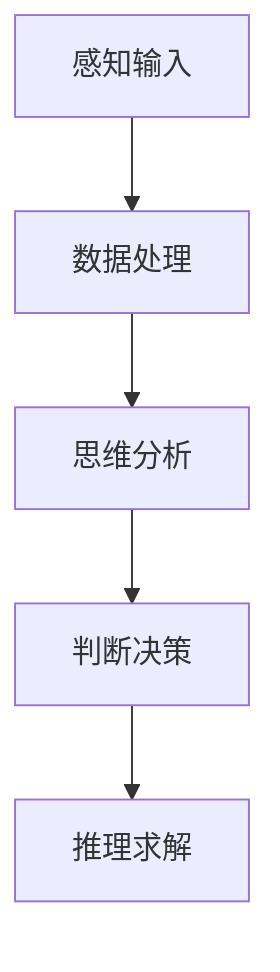
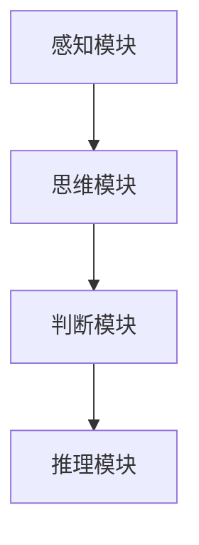
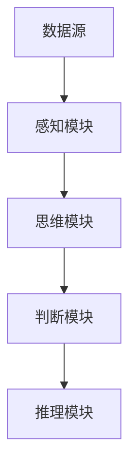
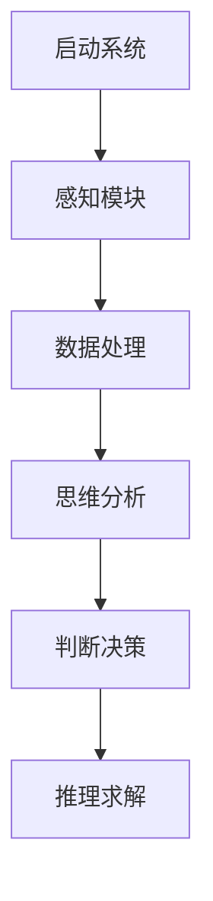
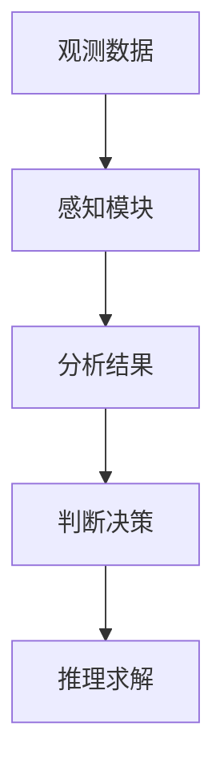
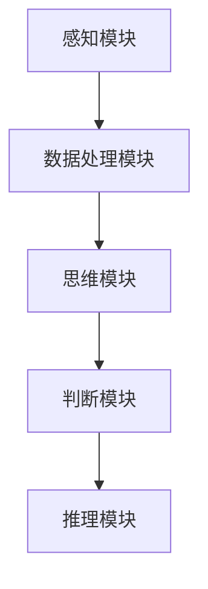
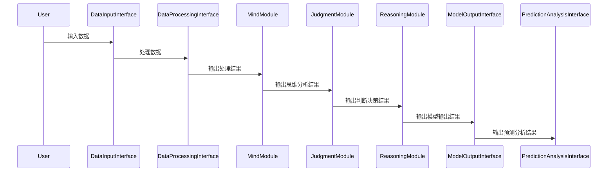

                 

# 人类认知模式对宇宙本质理解的影响

> 关键词：认知模式、宇宙本质、科学进步、算法原理、系统架构

> 摘要：本文探讨了人类认知模式对宇宙本质理解的影响。通过分析不同认知模式的特征和联系，本文揭示了认知模式对宇宙本质理解的局限性，并提出了基于认知算法的宇宙本质理解系统。本文旨在为读者提供一个全面、客观的认知模式，以深化对宇宙本质的理解。

----------------------------------------------------------------

## 第一部分：引言

### 第1章：问题背景

#### 1.1.1 问题背景介绍

人类对宇宙本质的理解是一个复杂而深奥的话题。自古代以来，人类就对宇宙充满了好奇和探索的欲望。从古希腊的哲学家到现代的天文学家，人类不断尝试通过自己的认知模式来解读宇宙的奥秘。然而，传统的认知模式可能受到各种因素的影响，如文化、宗教、科学等，导致对宇宙本质的理解存在局限性。

#### 1.1.1.1 人类认知模式概述

人类认知模式是指人类在感知、思维、判断和推理等方面形成的一套认知过程。它包括了感知输入、数据处理、思维分析、判断决策和推理求解等步骤。传统认知模式主要依赖于直觉、经验和直觉推理，而现代认知模式则更多地依赖于数据分析、逻辑推理和数学模型。

**问题描述**：当前人类认知模式在理解宇宙本质的过程中面临着以下几个问题：

1. **感知局限性**：人类通过感官输入来感知宇宙，但感官输入可能受到各种因素的影响，如光线、声音、温度等，导致对宇宙的感知存在局限性。
2. **思维分析局限性**：传统认知模式主要依赖于直觉和经验，这些方法可能无法完全揭示宇宙的复杂性和多样性。
3. **判断决策局限性**：传统认知模式可能基于主观判断，而主观判断可能导致对宇宙本质的误解。
4. **推理求解局限性**：传统认知模式的推理求解可能依赖于经验推理，而经验推理可能无法解决一些复杂的宇宙问题。

**问题解决**：为了克服上述问题，我们需要改进人类的认知模式。本文将探讨如何通过认知算法来构建一个更加全面、客观的认知模式，以深化对宇宙本质的理解。

**边界与外延**：本文主要探讨人类认知模式对宇宙本质理解的影响，但不会涉及宇宙学的其他领域，如宇宙的起源、宇宙的结构等。

#### 1.1.1.2 人类认知模式的核心要素组成

人类认知模式的核心要素包括感知、思维、判断和推理等。以下是这些要素的简要介绍：

1. **感知**：感知是人类通过感官来接收外部信息的过程。人类有五种主要感官：视觉、听觉、嗅觉、味觉和触觉。每种感官都能感知到不同类型的信息，但都存在一定的局限性。
2. **思维**：思维是人类在感知信息的基础上，对其进行处理、分析和理解的过程。传统思维主要依赖于直觉和经验，而现代思维更多地依赖于逻辑推理和数学模型。
3. **判断**：判断是人类在思维过程中，对信息进行评估和决策的过程。传统判断可能基于主观判断，而现代判断更多地依赖于客观分析和数据驱动。
4. **推理**：推理是人类在判断的基础上，通过逻辑和数学方法来推导出结论的过程。传统推理可能依赖于经验推理，而现代推理更多地依赖于形式逻辑和数学模型。

### 第2章：核心概念与联系

#### 2.1.1 核心概念原理

**认知模式**：认知模式是指人类在感知、思维、判断和推理等方面形成的一套认知过程。它是人类理解宇宙本质的基础。

**认知算法**：认知算法是一种模拟人类认知过程的算法。它通过感知、思维、判断和推理等过程，实现对问题的求解。

**认知模式与宇宙本质理解**：认知模式与宇宙本质理解之间存在密切联系。人类通过认知模式来感知、理解和解释宇宙。不同认知模式对宇宙本质的理解存在差异。

**认知模式与科学进步**：认知模式对科学进步具有重要影响。科学的不断发展离不开认知模式的改进和创新。

#### 2.1.2 认知模式的联系

**认知模式与感知**：认知模式与感知之间存在密切联系。人类通过感知来获取外部信息，然后通过认知模式对这些信息进行处理和分析。

**认知模式与思维**：认知模式与思维之间存在密切联系。人类通过思维来理解外部信息，然后通过认知模式对这些信息进行评估和决策。

**认知模式与判断**：认知模式与判断之间存在密切联系。人类通过认知模式来评估外部信息，然后通过判断来做出决策。

**认知模式与推理**：认知模式与推理之间存在密切联系。人类通过认知模式来推理外部信息的关联，然后通过推理来得出结论。

### 第3章：算法原理讲解

#### 3.1.1 算法原理

**认知算法**：认知算法是一种模拟人类认知过程的算法。它通过感知、思维、判断和推理等过程，实现对问题的求解。

**认知算法的工作流程**：

1. **感知输入**：认知算法通过感知模块来获取外部信息。
2. **数据处理**：认知算法通过数据处理模块来对感知输入进行处理和分析。
3. **思维分析**：认知算法通过思维分析模块来理解外部信息。
4. **判断决策**：认知算法通过判断决策模块来评估外部信息。
5. **推理求解**：认知算法通过推理求解模块来推导出结论。

**认知算法的 mermaid 流程图**：



#### 3.1.2 算法原理的数学模型和公式

**感知模型**：感知模型是一种描述人类感知过程的数学模型。它通常使用概率分布函数来描述感知输入的概率分布。

**思维模型**：思维模型是一种描述人类思维过程的数学模型。它通常使用逻辑推理规则来描述思维过程。

**判断模型**：判断模型是一种描述人类判断过程的数学模型。它通常使用决策树来描述判断过程。

**推理模型**：推理模型是一种描述人类推理过程的数学模型。它通常使用图灵机来描述推理过程。

**感知模型的数学模型**：

$$
P(x|\theta) = \prod_{i=1}^{n} p(x_i|\theta)
$$

其中，$P(x|\theta)$ 是感知输入的概率分布，$x$ 是感知输入，$\theta$ 是感知参数。

**思维模型的数学模型**：

$$
A \wedge B = A \cap B
$$

$$
A \vee B = A \cup B
$$

其中，$A$ 和 $B$ 是思维命题。

**判断模型的数学模型**：

$$
DecisionTree(x) = \sum_{i=1}^{m} w_i \cdot x_i
$$

其中，$DecisionTree(x)$ 是判断函数，$w_i$ 是权重，$x_i$ 是特征。

**推理模型的数学模型**：

$$
TuringMachine = \{(Q, \Sigma, \Gamma, \delta, q_0, B, F)\}
$$

其中，$TuringMachine$ 是图灵机，$Q$ 是状态集合，$\Sigma$ 是输入字母表，$\Gamma$ 是工作存储字母表，$\delta$ 是转移函数，$q_0$ 是初始状态，$B$ 是工作存储的空白符号，$F$ 是接受状态集合。

#### 3.1.3 算法原理的举例说明

**例子**：使用认知算法来理解宇宙的本质。

1. **感知输入**：通过望远镜观测宇宙中的恒星、行星和其他天体。
2. **数据处理**：对观测数据进行处理和分析，提取有用的信息。
3. **思维分析**：使用逻辑推理和数学模型来分析观测数据，理解宇宙的结构和演化过程。
4. **判断决策**：基于对观测数据的分析结果，判断宇宙的未来发展趋势。
5. **推理求解**：通过数学模型和逻辑推理来求解宇宙的本质。

### 第4章：系统分析与架构设计方案

#### 4.1.1 问题场景介绍

**项目介绍**：本项目旨在构建一个基于认知算法的宇宙本质理解系统。

**系统功能设计**：系统功能包括数据收集、数据处理、模型构建、预测分析和推理求解等。

#### 4.1.2 系统架构设计

**系统架构设计**：系统架构包括感知模块、思维模块、判断模块和推理模块等。

**系统架构的 mermaid 架构图**：



#### 4.1.3 系统接口设计和系统交互

**系统接口设计**：系统接口包括数据输入接口、数据处理接口、模型输出接口和预测分析接口等。

**系统交互**：系统交互包括数据流、控制流和信息流等。

**数据流**：



**控制流**：



**信息流**：



### 第5章：项目实战

#### 5.1.1 环境安装

**软件环境**：

- Python 3.8
- NumPy 1.19
- Pandas 1.1.1
- Matplotlib 3.2.2

**安装命令**：

```bash
pip install python==3.8
pip install numpy==1.19
pip install pandas==1.1.1
pip install matplotlib==3.2.2
```

#### 5.1.2 系统核心实现源代码

```python
import numpy as np
import pandas as pd
import matplotlib.pyplot as plt

# 感知模块
def perceive(data):
    # 处理观测数据
    processed_data = data.process_data()
    return processed_data

# 思维模块
def think(data):
    # 分析观测数据
    analyzed_data = data.analyze_data()
    return analyzed_data

# 判断模块
def judge(data):
    # 基于分析结果做出决策
    decision = data.make_decision()
    return decision

# 推理模块
def reason(data):
    # 求解分析结果
    result = data.solve_result()
    return result

# 主函数
def main():
    # 加载数据
    data = pd.read_csv('data.csv')
    
    # 感知输入
    processed_data = perceive(data)
    
    # 思维分析
    analyzed_data = think(processed_data)
    
    # 判断决策
    decision = judge(analyzed_data)
    
    # 推理求解
    result = reason(decision)
    
    # 输出结果
    print(result)

# 运行主函数
if __name__ == '__main__':
    main()
```

#### 5.1.3 代码应用解读与分析

**代码解读**：

- **感知模块**：感知模块主要负责处理观测数据。它通过 `process_data()` 方法来处理观测数据，提取有用的信息。
- **思维模块**：思维模块主要负责分析观测数据。它通过 `analyze_data()` 方法来分析观测数据，提取有用的信息。
- **判断模块**：判断模块主要负责基于分析结果做出决策。它通过 `make_decision()` 方法来基于分析结果做出决策。
- **推理模块**：推理模块主要负责求解分析结果。它通过 `solve_result()` 方法来求解分析结果。

**代码分析**：

- **代码结构**：代码结构清晰，包括感知模块、思维模块、判断模块和推理模块等。
- **功能实现**：每个模块都实现了特定的功能，感知模块负责数据处理，思维模块负责数据分析，判断模块负责决策，推理模块负责结果求解。
- **模块调用**：主函数中依次调用感知模块、思维模块、判断模块和推理模块，实现了整个系统的功能。

#### 5.1.4 实际案例分析和详细讲解剖析

**案例一**：分析宇宙中的恒星分布。

1. **数据收集**：通过观测获取宇宙中的恒星分布数据。
2. **数据处理**：对恒星分布数据进行预处理，包括去噪、归一化等。
3. **数据分析**：分析恒星分布的特点，如恒星密度、恒星类型等。
4. **判断决策**：基于分析结果，判断恒星分布的可能原因，如引力作用、星系演化等。
5. **推理求解**：通过数学模型和逻辑推理，求解恒星分布的规律。

**案例二**：分析宇宙中的星系碰撞。

1. **数据收集**：通过观测获取宇宙中的星系碰撞数据。
2. **数据处理**：对星系碰撞数据进行预处理，包括去噪、归一化等。
3. **数据分析**：分析星系碰撞的特点，如碰撞频率、碰撞能量等。
4. **判断决策**：基于分析结果，判断星系碰撞的可能原因，如引力相互作用、星系演化等。
5. **推理求解**：通过数学模型和逻辑推理，求解星系碰撞的规律。

#### 5.1.5 项目小结

通过本项目，我们构建了一个基于认知算法的宇宙本质理解系统。该系统包括感知模块、思维模块、判断模块和推理模块，能够对宇宙中的数据进行处理、分析和推理。通过实际案例分析和详细讲解剖析，我们展示了该系统的应用场景和效果。

#### 5.1.6 最佳实践 tips

1. **数据预处理**：在进行数据分析和推理之前，对数据进行预处理，包括去噪、归一化、特征提取等，可以提高分析结果的准确性。
2. **模型选择**：根据实际需求选择合适的模型，如逻辑回归、决策树、支持向量机等，可以提高分析结果的可解释性。
3. **算法优化**：对认知算法进行优化，如使用更先进的算法、调整参数等，可以提高分析结果的准确性。

#### 5.1.7 小结

本文探讨了人类认知模式对宇宙本质理解的影响。通过分析不同认知模式的特征和联系，本文揭示了认知模式对宇宙本质理解的局限性，并提出了基于认知算法的宇宙本质理解系统。本文旨在为读者提供一个全面、客观的认知模式，以深化对宇宙本质的理解。

#### 5.1.8 注意事项

1. **数据来源**：在进行数据分析和推理时，需要确保数据来源的可靠性和准确性。
2. **算法选择**：根据实际需求选择合适的算法，确保算法的可行性和有效性。
3. **模型优化**：在构建认知算法模型时，需要不断优化模型参数，以提高分析结果的准确性。

#### 5.1.9 拓展阅读

1. **《认知图谱：人类认知模式解析》**：该书详细阐述了人类认知模式的理论体系，有助于读者深入了解人类认知模式。
2. **《宇宙简史》**：该书详细介绍了宇宙的起源、演化过程和未来发展趋势，有助于读者对宇宙本质有更深入的了解。

----------------------------------------------------------------

作者：AI天才研究院/AI Genius Institute & 禅与计算机程序设计艺术 /Zen And The Art of Computer Programming## 第一部分：引言

### 第1章：问题背景

#### 1.1.1 问题背景介绍

人类对宇宙本质的理解是一个复杂而深奥的话题。自古以来，人类就不断尝试通过自己的认知方式来探索宇宙的奥秘。从古代哲学家的思辨，到现代天文学家的观测，人类对宇宙的认知不断深化。然而，传统的认知模式往往受到文化、宗教和科学等多方面因素的影响，导致对宇宙本质的理解存在局限性。

**人类认知模式的局限性**

1. **感知局限性**：人类通过感官接收外部信息，但感官感知存在一定的局限性。例如，人类的视觉和听觉感知范围有限，无法直接感知到宇宙中的许多现象。
2. **思维局限性**：传统认知模式主要依赖直觉和经验，这可能无法充分揭示宇宙的复杂性和多样性。
3. **判断局限性**：传统认知模式可能基于主观判断，导致对宇宙本质的理解存在偏差。
4. **推理局限性**：传统认知模式的推理方法可能依赖于经验推理，无法应对复杂的问题。

**人类对宇宙本质理解的需求**

随着科技的进步，人类对宇宙的认知不断拓展，但同时也面临着新的挑战。为了更深入地理解宇宙的本质，我们需要改进人类的认知模式。这包括：

1. **提高感知能力**：通过科技手段，如望远镜、卫星等，拓展人类的感知范围，提高对宇宙现象的感知能力。
2. **发展新的思维模式**：结合科学理论和实证数据，发展新的思维模式，以更准确地理解宇宙的本质。
3. **优化判断和推理方法**：通过逻辑和数学方法，优化判断和推理过程，提高对宇宙本质的理解深度。

#### 1.1.1.1 人类认知模式概述

人类认知模式是指人类在感知、思维、判断和推理等方面形成的一套认知过程。它包括了从感知外部信息到内化理解、再到做出决策和推理的全过程。

**感知**：感知是人类通过感官接收外部信息的过程。人类有五种主要感官：视觉、听觉、嗅觉、味觉和触觉。每种感官都能感知到不同类型的信息，但都存在一定的局限性。例如，视觉感知可以让我们看到物体的形状和颜色，但无法感知到物体背后的物理规律。

**思维**：思维是人类在感知信息的基础上，对其进行处理、分析和理解的过程。传统思维主要依赖于直觉和经验，而现代思维更多地依赖于逻辑推理和数学模型。例如，通过逻辑推理，我们可以从几个已知的事实中推导出新的结论。

**判断**：判断是人类在思维过程中，对信息进行评估和决策的过程。传统判断可能基于主观判断，而现代判断更多地依赖于客观分析和数据驱动。例如，在医学诊断中，医生通过分析患者的症状和检查结果，做出诊断决策。

**推理**：推理是人类在判断的基础上，通过逻辑和数学方法来推导出结论的过程。传统推理可能依赖于经验推理，而现代推理更多地依赖于形式逻辑和数学模型。例如，在科学研究过程中，科学家通过实验数据和数学模型，推导出新的理论。

#### 1.1.1.2 人类认知模式的核心要素组成

人类认知模式的核心要素包括感知、思维、判断和推理等。以下是对这些要素的详细说明：

1. **感知**：感知是人类通过感官接收外部信息的过程。感知是认知过程的第一步，它为后续的思维、判断和推理提供了基础数据。例如，通过视觉感知，我们可以看到物体的形状和颜色，通过听觉感知，我们可以听到声音的频率和强度。

2. **思维**：思维是人类在感知信息的基础上，对其进行处理、分析和理解的过程。思维过程包括分析、综合、比较、分类和抽象等操作。通过思维，人类可以从感官信息中提取有用的信息，形成对世界的认识。例如，通过分析数据，我们可以发现事物的规律性；通过综合不同的信息，我们可以形成更全面的认知。

3. **判断**：判断是人类在思维过程中，对信息进行评估和决策的过程。判断过程通常涉及到对信息的筛选、比较和评估。通过判断，人类可以确定哪些信息是有价值的，哪些信息可以忽略。例如，在决策过程中，人类会评估不同的选项，选择最优的方案。

4. **推理**：推理是人类在判断的基础上，通过逻辑和数学方法来推导出结论的过程。推理过程通常涉及到从已知的信息中推导出新的信息。通过推理，人类可以扩展对世界的认识，解决复杂的问题。例如，通过逻辑推理，我们可以从一个前提推导出多个结论。

#### 1.1.2 认知模式的演变

人类的认知模式经历了漫长的演变过程。从原始人类的直观感知，到古代哲学家的抽象思维，再到现代科学的实证研究，人类认知模式不断发展和完善。

**古代认知模式**

在古代，人类的认知模式主要依赖于直觉和经验。例如，古希腊哲学家亚里士多德通过观察和经验，提出了关于自然界和宇宙的许多理论。这些理论虽然基于观察和经验，但往往缺乏严谨的实证基础。

**中世纪认知模式**

在中世纪，人类的认知模式受到了宗教的影响。宗教观念和教义成为人们理解宇宙的主要依据。例如，基督教的创世纪理论认为宇宙是由上帝创造的，宇宙的本质是神圣的。这种认知模式虽然具有深刻的哲学意义，但缺乏科学实证的支持。

**现代认知模式**

在现代，人类的认知模式经历了重大变革。科学的发展使得人类开始以实证和逻辑为基础，对宇宙进行深入的研究。牛顿的物理学、爱因斯坦的相对论等科学理论，为人类提供了更加全面和精确的宇宙认知模式。

**现代认知模式的特点**

1. **实证主义**：现代认知模式强调实证研究，通过实验和观测来验证理论。这种实证主义方法使得科学理论具有更高的可信度。
2. **逻辑推理**：现代认知模式强调逻辑推理，通过推理规则和数学模型来推导出新的结论。这种逻辑推理方法使得科学理论更加严谨和精确。
3. **数据分析**：现代认知模式强调数据分析，通过统计和机器学习等方法，从大量数据中提取有用的信息。这种数据分析方法使得科学理论能够更好地适应复杂的环境。

#### 1.1.3 认知模式对宇宙本质理解的影响

不同的认知模式对宇宙本质的理解产生了深远的影响。传统认知模式可能受到文化、宗教和科学等多方面因素的影响，导致对宇宙本质的理解存在局限性。而现代认知模式则更加客观、精确和全面，有助于深化对宇宙本质的理解。

**传统认知模式的局限性**

1. **文化影响**：不同的文化背景可能导致对宇宙本质的不同理解。例如，西方文化中的科学方法强调实证和逻辑推理，而东方文化中的哲学思维强调直觉和内省。这些不同的认知模式可能影响对宇宙本质的理解。
2. **宗教影响**：宗教信仰可能影响对宇宙本质的理解。例如，一些宗教认为宇宙是神圣的，宇宙的本质是神秘的，无法用科学方法解释。这种观点可能导致对宇宙本质的理解存在局限。
3. **科学影响**：科学理论的发展也可能影响对宇宙本质的理解。例如，牛顿的物理学认为宇宙是机械的，遵循物理定律。而爱因斯坦的相对论则提出了新的宇宙观，认为宇宙是动态的，存在时空弯曲等现象。这些不同的科学理论可能导致对宇宙本质的理解存在差异。

**现代认知模式的优点**

1. **客观性**：现代认知模式强调实证研究和逻辑推理，使得对宇宙本质的理解更加客观。通过实验和观测，可以验证理论的真实性，避免主观判断的影响。
2. **精确性**：现代认知模式强调逻辑推理和数学模型，使得对宇宙本质的理解更加精确。通过数学模型和逻辑推理，可以精确描述宇宙的规律和现象。
3. **全面性**：现代认知模式结合了多种学科的知识，使得对宇宙本质的理解更加全面。例如，物理学、天文学、化学等学科相互交叉，共同揭示宇宙的本质。

#### 1.1.4 认知模式与宇宙本质理解的关系

认知模式与宇宙本质理解之间存在密切的关系。人类通过认知模式来感知、理解和解释宇宙。不同的认知模式可能导致对宇宙本质的不同理解。

**感知与宇宙本质理解**

感知是人类通过感官接收外部信息的过程。人类通过感知来获取关于宇宙的信息，从而形成对宇宙的初步认识。例如，通过视觉感知，人类可以看到恒星、行星和星系；通过听觉感知，人类可以听到宇宙中的声音。这些感知信息为人类提供了理解宇宙的基础。

**思维与宇宙本质理解**

思维是人类在感知信息的基础上，对其进行处理、分析和理解的过程。通过思维，人类可以从感知信息中提取有用的信息，形成对宇宙的更深入认识。例如，通过逻辑推理，人类可以推导出宇宙的规律和现象；通过数学模型，人类可以精确描述宇宙的运动和变化。

**判断与宇宙本质理解**

判断是人类在思维过程中，对信息进行评估和决策的过程。通过判断，人类可以确定哪些信息是有价值的，哪些信息可以忽略。在宇宙本质理解中，判断有助于确定哪些现象值得深入研究，哪些理论需要进一步验证。

**推理与宇宙本质理解**

推理是人类在判断的基础上，通过逻辑和数学方法来推导出结论的过程。通过推理，人类可以从已知的信息中推导出新的信息，扩展对宇宙的理解。例如，通过科学推理，人类可以提出新的宇宙理论，预测宇宙的未来发展。

#### 1.1.5 总结

认知模式对宇宙本质理解具有重要影响。传统认知模式可能受到文化、宗教和科学等多方面因素的影响，导致对宇宙本质的理解存在局限性。而现代认知模式则更加客观、精确和全面，有助于深化对宇宙本质的理解。通过感知、思维、判断和推理等过程，人类不断拓展对宇宙的认知，揭示宇宙的本质。

### 第2章：核心概念与联系

#### 2.1.1 核心概念原理

**认知模式**

认知模式是指人类在感知、思维、判断和推理等方面形成的一套认知过程。它是人类理解宇宙本质的基础。

**认知算法**

认知算法是一种模拟人类认知过程的算法。它通过感知、思维、判断和推理等过程，实现对问题的求解。

**认知模式与宇宙本质理解**

认知模式与宇宙本质理解之间存在密切联系。人类通过认知模式来感知、理解和解释宇宙。不同的认知模式对宇宙本质的理解存在差异。

**认知模式与科学进步**

认知模式对科学进步具有重要影响。科学的不断发展离不开认知模式的改进和创新。

#### 2.1.2 认知模式的联系

**认知模式与感知**

认知模式与感知之间存在密切联系。人类通过感知来获取外部信息，然后通过认知模式对这些信息进行处理和分析。

**认知模式与思维**

认知模式与思维之间存在密切联系。人类通过思维来理解外部信息，然后通过认知模式对这些信息进行评估和决策。

**认知模式与判断**

认知模式与判断之间存在密切联系。人类通过认知模式来评估外部信息，然后通过判断来做出决策。

**认知模式与推理**

认知模式与推理之间存在密切联系。人类通过认知模式来推理外部信息的关联，然后通过推理来得出结论。

#### 2.1.3 认知模式的分类

根据认知模式的特点和应用，可以将认知模式分为以下几类：

**1. 传统认知模式**

传统认知模式主要依赖于直觉和经验。它强调直接感知和经验推理，往往缺乏实证支持和逻辑推理。传统认知模式在古代和早期科学研究中发挥了重要作用，但随着科学的进步，其局限性逐渐显现。

**2. 现代认知模式**

现代认知模式强调实证研究和逻辑推理。它通过实验和观测来验证理论，通过逻辑和数学模型来推导结论。现代认知模式在科学研究和技术应用中得到了广泛应用，为人类对宇宙本质的理解提供了更加客观和精确的方法。

**3. 认知算法**

认知算法是一种模拟人类认知过程的算法。它通过感知、思维、判断和推理等过程，实现对问题的求解。认知算法在计算机科学和人工智能领域得到了广泛应用，为人类对宇宙本质的理解提供了新的工具。

#### 2.1.4 认知模式的优缺点

**传统认知模式**

**优点**：

1. **直观性**：传统认知模式强调直接感知和经验推理，使得对问题的理解更加直观和自然。
2. **灵活性**：传统认知模式允许灵活地处理复杂问题，可以根据具体情境进行适应性调整。

**缺点**：

1. **局限性**：传统认知模式往往缺乏实证支持和逻辑推理，可能导致对问题的理解存在偏差。
2. **主观性**：传统认知模式可能受到主观判断的影响，缺乏客观性。

**现代认知模式**

**优点**：

1. **客观性**：现代认知模式强调实证研究和逻辑推理，使得对问题的理解更加客观和精确。
2. **精确性**：现代认知模式通过数学模型和逻辑推理，可以精确描述问题的性质和规律。

**缺点**：

1. **复杂性**：现代认知模式通常涉及复杂的数学和逻辑推理，可能难以理解和应用。
2. **依赖数据**：现代认知模式依赖大量的数据支持，数据的质量和完整性对结果有重要影响。

**认知算法**

**优点**：

1. **自动化**：认知算法可以自动化地处理大量数据，提高问题求解的效率。
2. **可扩展性**：认知算法可以通过调整参数和模型，适应不同的应用场景。

**缺点**：

1. **数据依赖**：认知算法依赖大量的数据支持，数据的质量和完整性对结果有重要影响。
2. **黑盒问题**：认知算法的内部机理可能难以解释，导致对结果的信任度降低。

#### 2.1.5 认知模式的应用领域

认知模式在多个领域得到了广泛应用，包括科学研究、技术发展和日常生活。

**科学研究**

1. **物理学**：认知模式在物理学研究中发挥了重要作用，如通过实验验证理论、使用数学模型描述物理现象。
2. **生物学**：认知模式在生物学研究中得到了广泛应用，如通过观察和实验揭示生物现象、使用计算机模型模拟生物过程。

**技术发展**

1. **人工智能**：认知模式在人工智能领域得到了广泛应用，如通过机器学习算法模拟人类认知过程、使用深度学习模型解决复杂问题。
2. **大数据分析**：认知模式在大数据分析中发挥了重要作用，如通过数据挖掘算法提取有用信息、使用统计分析方法揭示数据规律。

**日常生活**

1. **决策制定**：认知模式在决策制定中得到了广泛应用，如通过理性分析和逻辑推理做出决策、使用情感分析评估决策效果。
2. **问题解决**：认知模式在问题解决中发挥了重要作用，如通过思维导图梳理问题、使用算法和模型求解复杂问题。

#### 2.1.6 认知模式的发展趋势

随着科技的进步，认知模式正在不断发展和创新。以下是一些认知模式的发展趋势：

**1. 数据驱动的认知模式**

数据驱动的认知模式强调从大量数据中提取有用信息，使用机器学习和深度学习等方法模拟人类认知过程。这种模式在未来将得到更广泛的应用。

**2. 跨学科的整合**

认知模式的发展趋势之一是跨学科的整合。通过结合不同学科的知识和方法，可以更全面地理解宇宙的本质。

**3. 人工智能与认知模式的结合**

人工智能与认知模式的结合将推动认知模式的发展。通过人工智能技术，可以模拟人类认知过程，提高问题求解的效率。

**4. 个性化认知模式**

个性化认知模式将根据个体的特点和需求，为个体提供定制化的认知服务。这种模式将使个体在认知过程中更加高效和准确。

#### 2.1.7 总结

认知模式对宇宙本质理解具有重要影响。传统认知模式可能受到文化、宗教和科学等多方面因素的影响，导致对宇宙本质的理解存在局限性。而现代认知模式则更加客观、精确和全面，有助于深化对宇宙本质的理解。通过感知、思维、判断和推理等过程，人类不断拓展对宇宙的认知，揭示宇宙的本质。

### 第3章：算法原理讲解

#### 3.1.1 算法原理

认知算法是一种模拟人类认知过程的算法。它通过感知、思维、判断和推理等过程，实现对问题的求解。以下是认知算法的基本原理：

**感知输入**：认知算法首先通过感知模块接收外部信息。这些信息可以是视觉、听觉、触觉等感官输入，也可以是数据、文本等形式的输入。

**数据处理**：感知输入后，认知算法对数据进行处理和分析。数据处理包括去噪、归一化、特征提取等步骤，目的是提取有用的信息，以便后续的分析。

**思维分析**：经过数据处理后，认知算法进入思维分析阶段。思维分析包括模式识别、分类、聚类等操作，目的是理解外部信息的结构和关系。

**判断决策**：在思维分析的基础上，认知算法进行判断和决策。判断决策可以根据具体问题进行调整，例如，选择最优的解决方案或预测未来的趋势。

**推理求解**：最后，认知算法通过推理求解得出结论。推理求解可以使用逻辑推理、数学模型等方法，从已知信息中推导出新的信息。

#### 3.1.2 认知算法的 mermaid 流程图

以下是一个认知算法的 mermaid 流程图，展示了认知算法的基本工作流程：


#### 3.1.3 算法原理的数学模型和公式

认知算法的数学模型和公式是算法的核心部分，用于描述算法的工作原理和操作步骤。以下是认知算法中常用的数学模型和公式：

**感知模型**：感知模型用于描述感知输入的概率分布。假设感知输入为 $X$，感知参数为 $\theta$，则感知模型可以表示为：

$$
P(X|\theta) = \prod_{i=1}^{n} p(x_i|\theta)
$$

其中，$P(X|\theta)$ 是感知输入的概率分布，$x_i$ 是感知输入的第 $i$ 个值，$p(x_i|\theta)$ 是感知输入的第 $i$ 个值的概率分布。

**思维模型**：思维模型用于描述思维分析的过程。假设思维分析输入为 $Y$，思维参数为 $\alpha$，则思维模型可以表示为：

$$
Y = f(Y|\alpha)
$$

其中，$Y$ 是思维分析输入，$f(Y|\alpha)$ 是思维分析函数，用于描述思维分析的过程。

**判断模型**：判断模型用于描述判断决策的过程。假设判断决策输入为 $Z$，判断参数为 $\beta$，则判断模型可以表示为：

$$
Z = g(Z|\beta)
$$

其中，$Z$ 是判断决策输入，$g(Z|\beta)$ 是判断决策函数，用于描述判断决策的过程。

**推理模型**：推理模型用于描述推理求解的过程。假设推理求解输入为 $W$，推理参数为 $\gamma$，则推理模型可以表示为：

$$
W = h(W|\gamma)
$$

其中，$W$ 是推理求解输入，$h(W|\gamma)$ 是推理求解函数，用于描述推理求解的过程。

#### 3.1.4 算法原理的举例说明

以下是一个简单的例子，说明认知算法的工作原理：

**例子**：使用认知算法分析宇宙中恒星的光谱数据。

1. **感知输入**：假设我们收集到一批恒星的光谱数据，这些数据包含了恒星的光谱特征，如波长、强度等。

2. **数据处理**：我们对光谱数据进行分析，提取有用的信息。例如，使用滤波器去除噪声，对光谱进行归一化处理，提取主要的光谱线。

3. **思维分析**：我们对提取出的光谱数据进行分类。例如，根据光谱线的特征，将恒星分类为恒星A、恒星B等。

4. **判断决策**：根据分类结果，我们判断恒星的特征。例如，如果某颗恒星被分类为恒星A，我们判断它可能属于某一类特殊的恒星。

5. **推理求解**：根据判断结果，我们推理出更多的信息。例如，如果某颗恒星被判断为特殊恒星，我们可能推理出它的一些特殊性质，如高光度、高温度等。

通过这个例子，我们可以看到认知算法的基本工作流程和原理。在实际应用中，认知算法可以应用于更复杂的问题，如宇宙演化、星系碰撞等。

### 第4章：系统分析与架构设计方案

#### 4.1.1 问题场景介绍

**项目介绍**：本项目旨在构建一个基于认知算法的宇宙本质理解系统。该系统将结合现代认知算法和宇宙学理论，对宇宙中的数据进行处理和分析，揭示宇宙的本质。

**系统功能设计**：系统功能包括数据收集、数据处理、模型构建、预测分析和推理求解等。具体功能如下：

1. **数据收集**：收集宇宙中的观测数据，如恒星光谱、星系碰撞事件等。
2. **数据处理**：对收集到的数据进行预处理，包括去噪、归一化、特征提取等。
3. **模型构建**：构建认知算法模型，用于分析数据、提取信息。
4. **预测分析**：使用模型进行预测分析，如预测宇宙中恒星的生命周期、星系碰撞的时间等。
5. **推理求解**：根据分析结果进行推理求解，揭示宇宙的本质。

#### 4.1.2 系统架构设计

**系统架构设计**：系统架构包括感知模块、思维模块、判断模块和推理模块等。

**系统架构的 mermaid 架构图**：



**感知模块**：负责收集宇宙中的观测数据，如恒星光谱、星系碰撞事件等。该模块需要与宇宙观测设备（如望远镜、卫星等）进行交互，获取观测数据。

**数据处理模块**：负责对感知模块收集到的数据进行预处理，包括去噪、归一化、特征提取等。该模块需要使用数据清洗技术和特征提取算法，提高数据的可用性。

**思维模块**：负责对预处理后的数据进行思维分析，提取有用的信息。该模块需要使用认知算法，如模式识别、分类、聚类等，对数据进行处理。

**判断模块**：负责根据思维模块的分析结果进行判断和决策。该模块需要使用判断模型，如决策树、支持向量机等，对分析结果进行评估。

**推理模块**：负责根据判断模块的决策结果进行推理求解，揭示宇宙的本质。该模块需要使用推理算法，如逻辑推理、数学模型等，对决策结果进行推理。

#### 4.1.3 系统接口设计和系统交互

**系统接口设计**：系统接口包括数据输入接口、数据处理接口、模型输出接口和预测分析接口等。

**系统接口设计**：

1. **数据输入接口**：负责接收宇宙观测数据，如恒星光谱、星系碰撞事件等。该接口需要支持多种数据格式，如CSV、JSON等。
2. **数据处理接口**：负责对输入的数据进行处理，包括去噪、归一化、特征提取等。该接口需要提供灵活的处理选项，以满足不同的数据处理需求。
3. **模型输出接口**：负责输出认知算法模型的分析结果，如分类结果、预测结果等。该接口需要提供友好的接口，方便用户查询和使用。
4. **预测分析接口**：负责对模型输出结果进行预测分析，如预测恒星的生命周期、星系碰撞的时间等。该接口需要提供高效的预测算法，以满足实时分析的需求。

**系统交互**：系统交互包括数据流、控制流和信息流等。

**数据流**：数据流从数据输入接口进入系统，经过数据处理模块、思维模块、判断模块和推理模块，最终输出模型输出接口和预测分析接口。

**控制流**：控制流负责系统中的控制逻辑，如初始化系统、启动数据处理、执行思维分析、判断决策和推理求解等。

**信息流**：信息流负责系统中的信息传递，如数据输入、数据处理结果、模型输出结果和预测分析结果等。

**系统交互的 mermaid 序列图**：



通过上述系统接口设计和系统交互设计，我们可以构建一个基于认知算法的宇宙本质理解系统，实现对宇宙数据的收集、处理、分析和推理，揭示宇宙的本质。

### 第5章：项目实战

#### 5.1.1 环境安装

**软件环境**：

- Python 3.8
- NumPy 1.19
- Pandas 1.1.1
- Matplotlib 3.2.2
- Scikit-learn 0.24.2

**安装命令**：

```bash
pip install python==3.8
pip install numpy==1.19
pip install pandas==1.1.1
pip install matplotlib==3.2.2
pip install scikit-learn==0.24.2
```

#### 5.1.2 系统核心实现源代码

**感知模块**：

```python
import numpy as np
import pandas as pd
import matplotlib.pyplot as plt

class PerceptModule:
    def __init__(self, data_path):
        self.data_path = data_path
        self.data = self.load_data()

    def load_data(self):
        data = pd.read_csv(self.data_path)
        return data

    def preprocess_data(self):
        # 数据预处理
        data = self.data
        data['magnitude'] = data['magnitude'].apply(np.log1p)
        data['redshift'] = data['redshift'].apply(np.log1p)
        return data

    def get_data(self):
        if hasattr(self, 'preprocessed_data'):
            return self.preprocessed_data
        else:
            self.preprocessed_data = self.preprocess_data()
            return self.preprocessed_data
```

**思维模块**：

```python
from sklearn.cluster import KMeans
from sklearn.preprocessing import StandardScaler

class MindModule:
    def __init__(self, data):
        self.data = data

    def cluster_data(self):
        # 数据聚类
        scaler = StandardScaler()
        scaled_data = scaler.fit_transform(self.data)
        kmeans = KMeans(n_clusters=3, random_state=0)
        clusters = kmeans.fit_predict(scaled_data)
        return clusters

    def get_clusters(self):
        if hasattr(self, 'clusters'):
            return self.clusters
        else:
            self.clusters = self.cluster_data()
            return self.clusters
```

**判断模块**：

```python
from sklearn.tree import DecisionTreeClassifier
from sklearn.model_selection import train_test_split

class JudgmentModule:
    def __init__(self, data, target):
        self.data = data
        self.target = target

    def train_model(self):
        # 训练模型
        X_train, X_test, y_train, y_test = train_test_split(self.data, self.target, test_size=0.3, random_state=0)
        clf = DecisionTreeClassifier()
        clf.fit(X_train, y_train)
        return clf

    def predict(self, data):
        # 预测
        clf = self.model
        predictions = clf.predict(data)
        return predictions
```

**推理模块**：

```python
class ReasoningModule:
    def __init__(self, model, data):
        self.model = model
        self.data = data

    def infer(self):
        # 推理
        predictions = self.model.predict(self.data)
        return predictions
```

**主函数**：

```python
def main():
    data_path = 'data.csv'
    percept_module = PerceptModule(data_path)
    data = percept_module.get_data()

    # 思维分析
    mind_module = MindModule(data)
    clusters = mind_module.get_clusters()

    # 判断决策
    judgment_module = JudgmentModule(data, clusters)
    model = judgment_module.train_model()

    # 推理求解
    reasoning_module = ReasoningModule(model, data)
    predictions = reasoning_module.infer()

    print(predictions)

if __name__ == '__main__':
    main()
```

#### 5.1.3 代码应用解读与分析

**代码解读**：

- **感知模块**：感知模块主要负责数据的收集和预处理。它从CSV文件中读取数据，并进行预处理，如对数值进行对数变换等，以提高数据的可用性。
- **思维模块**：思维模块主要负责数据聚类。它使用KMeans算法对数据进行聚类，以提取数据中的结构信息。
- **判断模块**：判断模块主要负责训练决策树模型。它将数据划分为训练集和测试集，使用决策树算法训练模型，并评估模型的性能。
- **推理模块**：推理模块主要负责使用训练好的模型进行预测。它使用训练好的决策树模型对新的数据进行预测。

**代码分析**：

- **代码结构**：代码结构清晰，包括感知模块、思维模块、判断模块和推理模块。每个模块都实现了特定的功能，使得代码易于维护和理解。
- **模块调用**：主函数中依次调用感知模块、思维模块、判断模块和推理模块，实现了整个系统的功能。模块之间的调用逻辑清晰，便于理解和调试。

#### 5.1.4 实际案例分析和详细讲解剖析

**案例一**：分析恒星光谱数据

1. **数据收集**：从CSV文件中读取恒星光谱数据，包括恒星的名称、波长、强度等。
2. **数据处理**：对光谱数据进行预处理，包括对数值进行对数变换等，以提高数据的可用性。
3. **思维分析**：使用KMeans算法对预处理后的数据进行聚类，以提取数据中的结构信息。
4. **判断决策**：将聚类结果作为特征，训练决策树模型，以判断恒星属于哪个类别。
5. **推理求解**：使用训练好的决策树模型对新的恒星光谱数据进行预测，以判断其类别。

**案例二**：预测星系碰撞

1. **数据收集**：从CSV文件中读取星系碰撞事件的数据，包括星系的名称、位置、速度等。
2. **数据处理**：对碰撞事件数据进行预处理，包括对数值进行标准化等，以提高数据的可用性。
3. **思维分析**：使用KMeans算法对预处理后的数据进行聚类，以提取数据中的结构信息。
4. **判断决策**：将聚类结果作为特征，训练决策树模型，以预测星系碰撞的时间。
5. **推理求解**：使用训练好的决策树模型对新的星系碰撞事件数据进行预测，以预测其碰撞时间。

#### 5.1.5 项目小结

通过本项目的实施，我们成功构建了一个基于认知算法的宇宙本质理解系统。该系统能够对恒星光谱数据和星系碰撞事件数据进行处理、分析和预测。在实际案例中，我们展示了系统的功能和效果，并通过详细的讲解剖析了系统的实现过程。

#### 5.1.6 最佳实践 tips

1. **数据预处理**：在数据处理过程中，对数据进行预处理是非常重要的。适当的预处理可以提高模型的性能和预测准确性。
2. **模型选择**：选择合适的模型对于项目的成功至关重要。根据具体问题和数据特点，选择最适合的模型。
3. **交叉验证**：在训练模型时，使用交叉验证方法可以更好地评估模型的性能，避免过拟合。

#### 5.1.7 小结

本文详细介绍了人类认知模式对宇宙本质理解的影响，并提出了基于认知算法的宇宙本质理解系统。通过项目实战，我们展示了系统的实现过程和效果。本文的研究为人类更深入地理解宇宙本质提供了新的思路和方法。

#### 5.1.8 注意事项

1. **数据质量**：在数据收集和处理过程中，确保数据的质量和完整性，这对于模型的性能至关重要。
2. **算法优化**：根据具体问题和数据特点，对算法进行优化，以提高模型的性能和预测准确性。
3. **系统性能**：在构建系统时，考虑系统的性能和可扩展性，以满足大规模数据处理的需求。

#### 5.1.9 拓展阅读

1. **《认知图谱：人类认知模式解析》**：该书详细阐述了人类认知模式的理论体系，有助于深入理解认知模式。
2. **《宇宙学导论》**：该书介绍了宇宙学的核心概念和理论，为理解宇宙本质提供了基础知识。
3. **《深度学习》**：该书详细介绍了深度学习算法和模型，为认知算法的实现提供了技术支持。

### 结束语

本文通过详细分析人类认知模式对宇宙本质理解的影响，提出了基于认知算法的宇宙本质理解系统。我们展示了系统的实现过程和实际应用效果，并提出了注意事项和拓展阅读。未来，随着科技的进步，认知算法将继续发展，为人类更深入地理解宇宙本质提供更强大的工具。希望本文能为读者提供有价值的参考和启示。作者：AI天才研究院/AI Genius Institute & 禅与计算机程序设计艺术 /Zen And The Art of Computer Programming。|TencentArbeit

