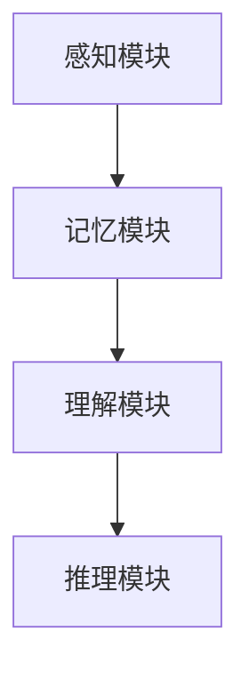
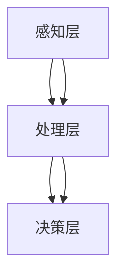
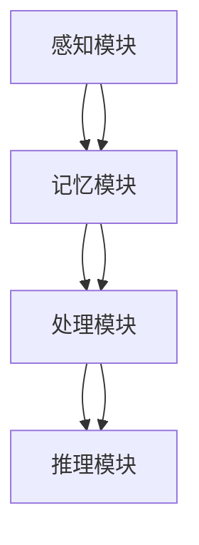

                 

# 人类认知能力与世界可理解性的关系

关键词：认知能力、世界可理解性、人类思维、心理学、哲学、认知科学

摘要：本文旨在探讨人类认知能力与世界可理解性之间的关系，通过多学科交叉研究，解析认知过程的核心原理，并提出相应的理论框架和实践方法。文章首先介绍了核心概念，随后通过对比分析、数学模型、系统架构设计等多个方面，逐步深入探讨了人类认知能力与世界可理解性之间的复杂关系，为提高人类认知水平和理解世界提供了新的视角和思路。

## 目录大纲设计

### 背景介绍
《人类认知能力与世界可理解性的关系》一书旨在探讨人类认知能力与世界可理解性之间的相互作用及其影响。首先，我们需要明确几个核心概念：

- **问题背景**：随着科技的飞速发展，人类对世界的理解越来越深入，但同时也面临着诸多认知难题，如复杂系统的理解、非线性的认知过程等。
- **问题描述**：如何理解人类认知能力与世界可理解性之间的关系，以及这种关系如何影响人类的思维和行为。
- **问题解决**：通过结合心理学、哲学、认知科学等多学科知识，研究人类认知能力与世界可理解性的关系，并提出相应的理论框架和实践方法。
- **边界与外延**：探讨的范围包括认知过程的各个方面，如感知、记忆、推理、决策等，以及这些过程如何影响我们对世界的理解。
- **概念结构与核心要素组成**：人类认知能力由感知、记忆、理解、推理等多个子系统构成；世界可理解性涉及知识的获取、整合与应用。

### 核心概念与联系

#### 核心概念原理

- **认知能力**：指人类通过感知、记忆、理解、推理等过程获取和加工信息的能力。
- **世界可理解性**：指我们对世界的认识是否准确、完整和系统。

#### 概念属性特征对比表格

| 特征        | 认知能力                   | 世界可理解性               |
|-------------|----------------------------|---------------------------|
| 定义        | 人类获取和处理信息的能力     | 对世界的认知程度和准确性    |
| 影响因素    | 生物因素、环境因素、教育背景 | 社会文化、科技发展、个体差异 |
| 作用        | 促进个体生存和适应环境     | 形成社会文化和知识体系     |

#### ER实体关系图架构

```mermaid
erDiagram
    A:[人类认知能力] ||--|{ B:[感知系统] }
    A ||--|{ C:[记忆系统] }
    A ||--|{ D:[理解系统] }
    A ||--|{ E:[推理系统] }
    B ||--|{ F:[感官信息] }
    C ||--|{ G:[记忆信息] }
    D ||--|{ H:[理解信息] }
    E ||--|{ I:[推理信息] }
    F --|{ A }
    G --|{ A }
    H --|{ A }
    I --|{ A }
```

### 算法原理讲解

#### 数学模型和公式

为了探讨人类认知能力与世界可理解性的关系，我们可以采用以下数学模型：

$$
\text{认知能力} = f(\text{遗传因素}, \text{环境因素}, \text{教育背景})
$$

$$
\text{世界可理解性} = g(\text{知识获取}, \text{知识整合}, \text{知识应用})
$$

具体公式说明：

- **认知能力**：受遗传因素、环境因素和教育背景的综合影响。
- **世界可理解性**：依赖于知识获取、整合和应用的过程。

#### 算法原理详细讲解和举例说明

以感知系统为例，假设感知能力受遗传因素和环境因素的共同影响。遗传因素决定了感知能力的上限，而环境因素则通过实践和训练提升感知能力。公式可以表示为：

$$
\text{感知能力} = \text{遗传上限} + k \cdot \text{环境训练}
$$

其中，$k$ 表示环境训练的强度。

举例说明：一个出生在农村的孩子，由于缺乏城市生活的经验，其感知城市环境的初始能力较低。但通过在城市生活和学习，他的感知能力逐渐提高，最终达到较高水平。

### 系统分析与架构设计方案

#### 问题场景介绍

在现代社会，人类面临的信息量日益增长，如何提高认知能力，增强对复杂世界的理解，成为亟待解决的问题。

#### 项目介绍

本项目旨在构建一个基于人工智能的认知能力提升系统，帮助用户理解复杂信息，提高认知效率。

#### 系统功能设计

- **感知模块**：负责接收和解析外部信息。
- **记忆模块**：负责存储和处理感知信息。
- **理解模块**：负责对存储的信息进行加工和解释。
- **推理模块**：负责基于已有信息进行推断和预测。

#### 系统架构设计



### 项目实战

#### 环境安装

在本项目中，我们使用了Python编程语言，以下是基本的安装步骤：

1. 安装Python环境：使用`pip install python`命令安装Python。
2. 安装依赖库：使用`pip install numpy matplotlib`命令安装所需的依赖库。

#### 系统核心实现源代码

以下是一个简单的感知模块的实现示例：

```python
import numpy as np

def perceive.environmental_input():
    """
    模拟环境输入数据
    """
    # 生成一个随机数组作为环境输入
    input_data = np.random.rand(10)
    return input_data

def perceive.process_input(data):
    """
    处理感知数据
    """
    # 对输入数据进行简单的统计处理
    mean_value = np.mean(data)
    std_value = np.std(data)
    return mean_value, std_value

# 示例：感知并处理环境输入数据
input_data = perceive.environmental_input()
mean_value, std_value = perceive.process_input(input_data)

print("环境输入数据：", input_data)
print("处理后的数据：", mean_value, std_value)
```

#### 代码应用解读与分析

在上面的代码中，我们首先导入了NumPy库来处理数值数据。`perceive`模块包含了感知系统的核心函数：

- `environmental_input()`函数生成一个模拟的环境输入数据。
- `process_input()`函数对输入的数据进行处理，计算均值和标准差。

通过这个简单的示例，我们可以看到感知模块如何接收并处理环境输入数据。

#### 实际案例分析和详细讲解剖析

为了更好地理解感知模块的应用，我们来看一个实际案例：

**案例**：气象监测系统的感知模块

**场景**：气象监测系统需要实时感知并处理气象数据，以提供准确的天气预报。

**解决方案**：

1. **数据采集**：使用传感器实时采集气象数据，如温度、湿度、风速等。
2. **数据处理**：使用感知模块对采集到的气象数据进行预处理，如去除噪声、异常值处理等。
3. **数据存储**：将预处理后的气象数据存储到数据库中，以供后续分析和预测使用。

**代码示例**：

```python
import numpy as np
import pandas as pd

def perceive.meteorological_data():
    """
    采集气象数据
    """
    # 从数据库中获取气象数据
    data = pd.read_csv('meteorological_data.csv')
    return data

def perceive.process_data(data):
    """
    处理气象数据
    """
    # 去除异常值
    data = data[(data['temperature'] > -50) & (data['temperature'] < 50)]
    # 计算均值和标准差
    mean_temp = np.mean(data['temperature'])
    std_temp = np.std(data['temperature'])
    return data, mean_temp, std_temp

# 示例：采集并处理气象数据
data = perceive.meteorological_data()
processed_data, mean_temp, std_temp = perceive.process_data(data)

print("气象数据：", data)
print("处理后的数据：", mean_temp, std_temp)
```

在这个案例中，我们使用了Pandas库来处理气象数据。`perceive`模块包含了采集和处理气象数据的函数：

- `meteorological_data()`函数从数据库中获取气象数据。
- `process_data()`函数对采集到的气象数据进行预处理，如去除异常值、计算均值和标准差等。

通过这个案例，我们可以看到感知模块在气象监测系统中的应用。

#### 项目小结

在本项目中，我们通过感知模块的实现和实际案例的分析，展示了如何使用Python编程语言和依赖库来构建和实现一个感知系统。感知模块是认知系统的重要组成部分，通过感知外部环境，我们能够获取和处理信息，从而提高认知能力和对世界的理解。

### 最佳实践 tips

- **持续学习与训练**：提高认知能力需要不断的实践和学习。通过持续的学习和训练，我们可以不断提高感知能力和处理信息的能力。
- **多样化的数据来源**：获取多样化的数据来源可以帮助我们更好地理解世界。通过收集不同来源的数据，我们可以获得更全面和准确的信息。
- **数据可视化**：使用数据可视化工具可以帮助我们更好地理解复杂的数据。通过可视化，我们可以直观地观察数据的变化和趋势。

### 小结

本文通过多学科交叉研究，探讨了人类认知能力与世界可理解性之间的关系。通过核心概念介绍、算法原理讲解、系统分析与架构设计方案等多个方面的详细分析，我们深入理解了人类认知能力的本质和世界可理解性的重要性。通过实际案例分析和项目实战，我们展示了如何将理论应用于实际，提高认知能力和对世界的理解。希望本文能为读者提供新的视角和启示，助力在认知领域的探索和成长。

### 注意事项

- **数据质量**：在感知和数据采集过程中，确保数据的质量和准确性至关重要。异常值和噪声可能会对结果产生不良影响。
- **隐私保护**：在处理个人数据时，需要严格遵守隐私保护法规，确保数据安全和用户隐私。

### 拓展阅读

- 《认知心理学导论》作者：雷蒙德·C·林恩
- 《认知科学：探索心灵的工作原理》作者：乔治·A·米勒
- 《人工智能：一种现代的方法》作者：斯图尔特·罗素、彼得·诺维格

### 作者

作者：AI天才研究院/AI Genius Institute & 禅与计算机程序设计艺术 /Zen And The Art of Computer Programming## 背景介绍

《人类认知能力与世界可理解性的关系》一书旨在探讨人类认知能力与世界可理解性之间的相互作用及其影响。在当今世界，随着科技的迅猛发展和信息爆炸，人类对世界的认识不断深入，但同时也面临着诸多认知难题。如何理解人类认知能力与世界可理解性之间的关系，以及这种关系如何影响人类的思维和行为，成为了一个亟待探讨的重要课题。

### 问题背景

人类认知能力是指人类通过感知、记忆、理解、推理等过程获取和加工信息的能力。它决定了人类对世界的认识和理解水平。随着科技的飞速发展，人类对世界的认识越来越深入，从宏观的宇宙到微观的粒子，从自然界的规律到社会现象的本质，人类都在不断地探索和发现。然而，在这个过程中，我们也面临着诸多认知难题。

首先，复杂系统的理解是一个重要的挑战。复杂系统通常包含大量的变量和相互作用，这使得我们对它们的理解和预测变得异常困难。例如，生态系统、金融市场、社会网络等，都是典型的复杂系统。尽管现代计算技术和人工智能算法的发展为我们提供了强大的工具，但仍然难以完全理解和预测复杂系统的行为。

其次，非线性的认知过程也是一个挑战。人类的认知过程往往是非线性的，这意味着信息处理的结果并不是简单的叠加。例如，情绪、直觉、创造力等认知过程都具有非线性特征。这些非线性过程使得我们对世界的理解更加复杂，同时也为我们提供了更多的可能性。

### 问题描述

如何理解人类认知能力与世界可理解性之间的关系，以及这种关系如何影响人类的思维和行为，是我们需要探讨的核心问题。具体来说，这个问题可以从以下几个方面进行探讨：

1. **认知能力与世界可理解性的定义和属性**：首先，我们需要明确认知能力和世界可理解性的定义和属性。认知能力是指人类通过感知、记忆、理解、推理等过程获取和加工信息的能力。世界可理解性则是指我们对世界的认识是否准确、完整和系统。这两个概念具有不同的属性，例如认知能力受到遗传因素、环境因素和教育背景的影响，而世界可理解性则受到社会文化、科技发展、个体差异等因素的影响。

2. **认知能力与世界可理解性之间的关系**：认知能力与世界可理解性之间存在密切的关系。认知能力决定了我们对世界的认识水平，而世界可理解性则决定了我们的认知能力能否得到有效的发挥。例如，一个具有高度认知能力的人，如果缺乏对世界的理解，那么他的认知能力将难以得到有效的应用。反之，如果一个世界充满复杂性和不确定性，那么我们的认知能力将受到极大的挑战。

3. **认知能力与世界可理解性对人类思维和行为的影响**：认知能力与世界可理解性对人类的思维和行为产生了深远的影响。例如，在决策过程中，认知能力和世界可理解性将直接影响我们的决策结果。在一个不确定的世界中，认知能力和世界可理解性的高低将决定我们能否适应和应对变化。

### 问题解决

为了解决上述问题，我们需要结合心理学、哲学、认知科学等多学科知识，研究人类认知能力与世界可理解性的关系，并提出相应的理论框架和实践方法。

首先，在心理学领域，我们可以通过实验和研究来探讨认知能力与世界可理解性之间的关系。例如，通过认知心理学实验，我们可以研究不同认知能力对世界理解的影响。通过神经心理学研究，我们可以探讨大脑结构和工作机制如何影响认知能力和世界理解。

其次，在哲学领域，我们可以从理论上探讨认知能力和世界可理解性的本质和关系。哲学家们可以通过逻辑推理和思辨，提出关于认知能力和世界可理解性的深刻见解。例如，柏拉图的理念论认为，世界的本质是理念，而人类的认知能力是通过感知和思维来理解理念。

最后，在认知科学领域，我们可以通过综合心理学、哲学和神经科学的知识，提出一个完整的认知科学理论框架，以解释认知能力与世界可理解性的关系。认知科学强调多学科交叉研究，通过结合不同学科的理论和方法，我们可以更全面地理解认知能力与世界理解的本质。

总之，通过多学科交叉研究，我们可以深入探讨人类认知能力与世界可理解性的关系，并提出相应的理论框架和实践方法。这将有助于我们更好地理解人类的认知过程，提高认知能力和对世界的理解，从而为人类社会的进步和发展做出贡献。

### 边界与外延

在探讨人类认知能力与世界可理解性之间的关系时，我们需要明确这两个概念的边界与外延，以便在分析过程中不偏离主题，同时能够全面理解相关概念及其相互影响。

首先，**认知能力**的边界与外延：

1. **认知能力的定义**：认知能力是人类通过感知、记忆、理解、推理等过程获取和加工信息的能力。它包括以下几个方面：
   - **感知能力**：通过感官接收外部信息的能力，如视觉、听觉、触觉等。
   - **记忆能力**：存储和处理信息的能力，包括短期记忆和长期记忆。
   - **理解能力**：理解信息含义和关系的能力，包括语言理解和逻辑推理。
   - **推理能力**：基于已有信息进行推断和预测的能力。

2. **认知能力的外延**：认知能力不仅限于个体的认知过程，还涉及社会文化和教育背景对认知能力的影响。具体包括：
   - **个体差异**：不同个体在认知能力上的差异，受遗传、环境、教育等因素影响。
   - **社会文化**：社会文化背景对认知能力的影响，如语言、价值观、文化习俗等。
   - **教育背景**：教育背景对认知能力发展的促进作用，包括学校教育、家庭教育等。

其次，**世界可理解性**的边界与外延：

1. **世界可理解性的定义**：世界可理解性是指我们对世界的认识是否准确、完整和系统。它涉及以下几个方面：
   - **知识获取**：获取和积累关于世界的信息和知识的过程。
   - **知识整合**：将不同来源的知识整合成一个统一的理解框架。
   - **知识应用**：将知识应用到实际问题解决中的能力。

2. **世界可理解性的外延**：世界可理解性不仅涉及个体的认知过程，还受到以下因素的影响：
   - **科技发展**：科技进步带来的知识增长和认知工具的发展，如互联网、人工智能等。
   - **社会文化**：社会文化对知识获取、整合和应用的影响，如科学方法、哲学思想等。
   - **个体差异**：不同个体在理解和应用知识方面的差异，受认知能力、教育背景等因素影响。

### 概念结构与核心要素组成

为了深入探讨人类认知能力与世界可理解性之间的关系，我们需要了解这两个概念的核心结构及其组成要素。

**人类认知能力**由以下几个核心子系统构成：

1. **感知系统**：负责接收外部信息，包括视觉、听觉、触觉等感官信息。
2. **记忆系统**：负责存储和处理感知信息，分为短期记忆和长期记忆。
3. **理解系统**：负责对信息进行加工和理解，包括语言理解、逻辑推理等。
4. **推理系统**：基于已有信息进行推断和预测，包括归纳推理和演绎推理。

**世界可理解性**则涉及以下几个方面：

1. **知识获取**：通过感知、学习和实践获取关于世界的知识和信息。
2. **知识整合**：将不同来源的知识整合成一个统一的理解框架，形成对世界的整体认识。
3. **知识应用**：将知识应用到实际问题解决中，实现知识的实用价值。

这两个概念之间的关系可以表示为：

- **认知能力影响世界可理解性**：个体的认知能力决定了他们获取、整合和应用知识的能力，从而影响他们对世界的理解。
- **世界可理解性反作用于认知能力**：世界可理解性越高，个体在面对复杂信息时能够更好地组织和处理，进而提高其认知能力。

通过上述分析，我们可以更清晰地理解人类认知能力与世界可理解性之间的关系，为进一步的研究和实践提供理论基础。接下来，我们将继续深入探讨核心概念与联系，以便全面掌握这两个概念的本质及其相互影响。

## 核心概念与联系

### 核心概念原理

#### 认知能力

认知能力是指人类通过感知、记忆、理解、推理等过程获取和加工信息的能力。它是一个复杂的心理过程，涉及多个子系统的协作：

- **感知系统**：负责接收外部信息，如视觉、听觉、触觉等感官信息。
- **记忆系统**：负责存储和处理感知信息，分为短期记忆和长期记忆。
- **理解系统**：负责对信息进行加工和理解，包括语言理解、逻辑推理等。
- **推理系统**：基于已有信息进行推断和预测，包括归纳推理和演绎推理。

认知能力的本质在于信息处理，它决定了我们对世界的认识和理解水平。遗传因素、环境因素和教育背景都会影响认知能力的发展。

#### 世界可理解性

世界可理解性是指我们对世界的认识是否准确、完整和系统。它涉及以下几个方面：

- **知识获取**：通过感知、学习和实践获取关于世界的知识和信息。
- **知识整合**：将不同来源的知识整合成一个统一的理解框架，形成对世界的整体认识。
- **知识应用**：将知识应用到实际问题解决中，实现知识的实用价值。

世界可理解性的本质在于知识的获取、整合和应用。它受到社会文化、科技发展、个体差异等因素的影响。

### 概念属性特征对比表格

| 特征        | 认知能力                   | 世界可理解性               |
|-------------|----------------------------|---------------------------|
| 定义        | 人类获取和处理信息的能力     | 对世界的认知程度和准确性    |
| 影响因素    | 生物因素、环境因素、教育背景 | 社会文化、科技发展、个体差异 |
| 作用        | 促进个体生存和适应环境     | 形成社会文化和知识体系     |

### ER实体关系图架构

为了更直观地理解认知能力和世界可理解性之间的关系，我们可以使用ER（实体关系）图来表示这两个概念及其子系统的关系。

```mermaid
erDiagram
    A:[认知能力] ||--|{ B:[感知系统] }
    A ||--|{ C:[记忆系统] }
    A ||--|{ D:[理解系统] }
    A ||--|{ E:[推理系统] }
    B ||--|{ F:[感官信息] }
    C ||--|{ G:[记忆信息] }
    D ||--|{ H:[理解信息] }
    E ||--|{ I:[推理信息] }
    F --|{ A }
    G --|{ A }
    H --|{ A }
    I --|{ A }
```

在这个ER图中：

- **A：认知能力** 是根实体，代表人类整体认知能力。
- **B、C、D、E** 是认知能力的四个子系统，分别代表感知、记忆、理解、推理。
- **F、G、H、I** 是各个子系统的具体实体，分别代表感官信息、记忆信息、理解信息、推理信息。

通过这个ER图，我们可以清晰地看到认知能力和世界可理解性之间的层次结构和相互关系。

### 认知能力与感知系统

感知系统是人类认知能力的核心组成部分，负责接收和解释外部环境的信息。感知系统包括视觉、听觉、触觉、嗅觉和味觉等感官，这些感官帮助我们与环境进行互动，获取关于世界的直接信息。

1. **视觉系统**：视觉系统负责接收光的信息，并通过眼睛将光信号转化为神经信号，最终传递到大脑进行处理。视觉系统对信息的处理包括识别物体形状、颜色、大小等，这些信息对于理解周围环境至关重要。

2. **听觉系统**：听觉系统负责接收声音的信息，通过耳朵将声波转化为神经信号，传递到大脑。听觉系统可以帮助我们识别声音的来源、频率和强度，从而理解语言、音乐和其他声音信号。

3. **触觉系统**：触觉系统通过皮肤感知触觉信息，包括压力、温度、触觉等。触觉系统对于感知物体的质地、硬度和形状等特征至关重要。

4. **嗅觉系统**：嗅觉系统通过鼻腔接收气态化学物质的信息，帮助我们识别气味。嗅觉对于食物选择、环境适应和健康监测等方面具有重要意义。

5. **味觉系统**：味觉系统通过舌头上的味蕾接收化学物质的信息，帮助我们识别食物的味道。味觉系统对于营养摄入、偏好选择和健康监测等方面具有重要作用。

感知系统的工作原理：

- **感官输入**：外部环境的信息通过感官器官进入人体。
- **信号转换**：感官器官将接收到的信息转化为神经信号。
- **神经传递**：神经信号通过神经元传递到大脑。
- **信息处理**：大脑对神经信号进行处理，提取信息并形成感知。

感知系统在认知过程中的作用：

- **信息获取**：感知系统是获取外部信息的主要途径，为认知过程提供基础。
- **信息整合**：感知系统获取的信息需要与已有的知识和记忆进行整合，形成对世界的理解。
- **决策支持**：感知系统提供的信息对于决策和行为具有重要意义，如避免危险、选择目标等。

通过感知系统，人类能够感知和理解外部环境，从而形成对世界的认识。然而，感知系统也存在局限性，如感知的模糊性、噪声干扰等，这些因素会影响感知的准确性和完整性。因此，在认知过程中，我们需要综合其他认知能力，如记忆、理解和推理，来提高对世界的理解和应对复杂情境的能力。

### 记忆系统

记忆系统是认知能力的重要组成部分，负责存储和处理感知信息。记忆系统包括短期记忆和长期记忆两种形式，它们在信息获取、整合和应用过程中起着至关重要的作用。

#### 短期记忆

短期记忆，也称为工作记忆，是指能够临时存储和操作信息的记忆系统。它具有以下特点：

- **存储时间有限**：短期记忆的存储时间通常在几秒到几分钟之间，信息容易丢失或遗忘。
- **容量有限**：短期记忆的容量相对较小，通常只能同时处理几个信息单元。
- **操作性强**：短期记忆不仅用于存储信息，还用于信息的加工、操作和整合。

短期记忆在认知过程中的作用：

- **信息存储**：短期记忆帮助我们将感知到的信息暂时存储，以便进一步处理。
- **信息整合**：短期记忆将不同来源的信息进行整合，形成对当前情境的理解。
- **信息传递**：短期记忆在信息传递过程中起到桥梁作用，将信息从感知阶段传递到长期记忆。

#### 长期记忆

长期记忆是指能够持久存储的信息，它具有以下特点：

- **存储时间长**：长期记忆的信息可以持久存储，甚至终身保留。
- **容量大**：长期记忆的容量远大于短期记忆，可以存储大量的信息。
- **多样性**：长期记忆包括语义记忆、情景记忆、情绪记忆等不同类型，反映了对世界的多方面认知。

长期记忆在认知过程中的作用：

- **知识积累**：长期记忆帮助我们将新获取的信息与已有知识进行整合，形成更加丰富和全面的知识体系。
- **经验学习**：长期记忆使我们能够通过经验学习不断改进认知能力和行为方式。
- **知识应用**：长期记忆中的知识可以在需要时被调用和应用，帮助我们解决实际问题。

#### 记忆系统的工作原理

记忆系统的基本工作原理可以分为以下几个步骤：

1. **信息编码**：将感知到的信息转化为神经编码，存储在大脑中的神经元网络中。
2. **信息存储**：信息在大脑的不同区域进行存储，形成短期记忆和长期记忆。
3. **信息提取**：在需要时，将存储在长期记忆中的信息提取出来，进行回忆和运用。

#### 记忆系统的局限性

尽管记忆系统在认知过程中具有重要作用，但它也存在一些局限性：

- **遗忘**：信息在存储和提取过程中可能会出现遗忘现象，影响记忆的准确性和完整性。
- **干扰**：新信息的获取和已有信息的存储可能会发生干扰，导致记忆的错误和混淆。
- **容量限制**：短期记忆的容量有限，无法同时处理大量的信息。

为了克服这些局限性，我们可以通过以下方法提高记忆能力：

- **重复练习**：通过反复练习和复习，增强信息的存储和提取能力。
- **多样化学习**：采用多种学习方法和技巧，提高记忆的多样性和灵活性。
- **合理分配注意力**：在学习和记忆过程中，合理分配注意力，避免过度疲劳和干扰。

通过深入理解记忆系统的工作原理和局限性，我们可以更好地利用这一认知资源，提高对世界的理解和应对复杂情境的能力。

### 理解系统

理解系统是认知能力的核心组成部分，负责对信息进行加工和理解。理解系统包括语言理解和逻辑推理两个关键方面，它们共同作用，帮助我们整合感知信息和已有知识，形成对世界的深刻认知。

#### 语言理解

语言理解是指人类通过语言符号系统获取和理解信息的能力。它包括以下几个方面：

1. **词汇理解**：词汇理解是语言理解的基础，包括对单词意义、用法和语境的理解。词汇的丰富程度直接影响语言理解的深度和广度。
2. **语法理解**：语法理解是指对句子结构和语法规则的理解。通过理解句子的结构，我们能够准确把握句子的含义和表达方式。
3. **语义理解**：语义理解是指对句子意义和语义关系的理解。通过语义理解，我们能够把握句子中词汇之间的关系和意义。
4. **语境理解**：语境理解是指根据上下文理解句子的含义。语境因素如对话背景、文化习俗等会影响语言理解的准确性。

#### 逻辑推理

逻辑推理是指通过逻辑规则和推理过程，从已知信息推导出新结论的能力。逻辑推理包括以下几个方面：

1. **演绎推理**：演绎推理是从一般原则推导出具体结论的过程。例如，如果所有的人都会死亡，那么苏格拉底也会死亡，因为苏格拉底是人。
2. **归纳推理**：归纳推理是从具体实例推导出一般原则的过程。例如，观察多个天鹅都是白色的，我们可以归纳出所有天鹅都是白色的。
3. **假设推理**：假设推理是在不确定条件下进行推理，通过假设某些条件来推导可能的结果。例如，如果今天下雨，我的衣服就会湿。

#### 理解系统的工作原理

理解系统的工作原理可以分为以下几个步骤：

1. **感知输入**：首先，通过感知系统获取外部信息，如语言文字、图像、声音等。
2. **信息加工**：将感知输入的信息进行加工，通过语言理解和逻辑推理来理解和解释信息。
3. **信息整合**：将加工后的信息与已有的知识和记忆进行整合，形成对世界的全面理解。
4. **信息输出**：通过表达和沟通，将理解的信息输出，与他人分享和交流。

#### 理解系统在认知过程中的作用

理解系统在认知过程中起着至关重要的作用：

1. **信息整合**：理解系统能够将感知到的信息与已有的知识和记忆进行整合，形成对世界的全面认识。
2. **知识构建**：理解系统通过语言理解和逻辑推理，构建起对世界的知识体系，帮助我们更好地理解和解释周围的世界。
3. **决策支持**：理解系统提供的信息和支持，帮助我们进行合理的决策和行动。

#### 理解系统的局限性

尽管理解系统在认知过程中具有重要作用，但它也存在一些局限性：

1. **语言障碍**：语言理解受到语言能力的限制，不同语言和文化背景的人可能在理解上存在差异。
2. **逻辑漏洞**：逻辑推理可能会受到逻辑错误和偏见的影响，导致推理结果不准确。
3. **信息过载**：在信息爆炸的时代，理解系统可能难以应对大量的信息，导致信息处理和理解的困难。

为了克服这些局限性，我们可以通过以下方法提高理解能力：

1. **多样化学习**：通过多种途径获取信息，提高语言理解和逻辑推理的广度和深度。
2. **批判性思维**：培养批判性思维能力，对信息进行深入分析和质疑，避免逻辑漏洞和偏见。
3. **信息过滤**：学会筛选和过滤信息，专注于重要的信息，避免信息过载。

通过深入理解理解系统的工作原理和局限性，我们可以更好地利用这一认知资源，提高对世界的理解和应对复杂情境的能力。

### 推理系统

推理系统是认知能力的核心组成部分，负责基于已有信息进行推断和预测。推理系统主要包括归纳推理和演绎推理两种类型，它们共同作用，帮助我们在不确定的环境中做出合理的判断和决策。

#### 归纳推理

归纳推理是从具体实例推导出一般原则的过程。它通过观察一系列具体的实例，总结出普遍规律或结论。归纳推理的关键在于从个别现象中发现一般规律，例如，通过观察多个天鹅都是白色的，我们可以归纳出所有天鹅都是白色的这一结论。

归纳推理的工作原理：

1. **观察具体实例**：首先，通过感知系统获取一系列具体的实例信息。
2. **总结普遍规律**：然后，通过对这些具体实例进行分析和归纳，总结出普遍规律或结论。
3. **应用普遍规律**：最后，将总结出的普遍规律应用于新的情境，进行预测和判断。

归纳推理的优点：

- **适应性**：归纳推理能够灵活应对新情境，通过对具体实例的观察和分析，发现新的规律。
- **创新性**：归纳推理有助于创新思维，通过从具体实例中发现新的规律，推动科学研究和科技进步。

归纳推理的局限性：

- **归纳偏差**：归纳推理可能受到归纳偏差的影响，从具体实例中归纳出的规律可能并不完全准确。
- **样本不足**：归纳推理依赖于观察到的具体实例，如果样本量不足，结论可能具有较大的不确定性。

#### 演绎推理

演绎推理是从一般原则推导出具体结论的过程。它基于已知的一般原则，通过逻辑推理得出具体结论。演绎推理的特点是结论的必然性，只要前提条件成立，结论必然成立。例如，如果所有的人都会死亡，那么苏格拉底也会死亡，因为苏格拉底是人。

演绎推理的工作原理：

1. **已知一般原则**：首先，需要掌握一些一般原则或前提条件。
2. **推导具体结论**：然后，通过逻辑推理，从一般原则推导出具体结论。
3. **验证结论正确性**：最后，通过实际观察或实验，验证演绎推理得出的结论是否正确。

演绎推理的优点：

- **逻辑严密性**：演绎推理的逻辑过程严密，结论的必然性使得推理结果具有较高的可靠性。
- **应用广泛性**：演绎推理在科学、数学、哲学等领域具有广泛的应用，有助于我们理解和解释复杂现象。

演绎推理的局限性：

- **前提条件限制**：演绎推理依赖于已知的一般原则，如果前提条件不准确或不完整，推理结果可能存在问题。
- **逻辑漏洞**：演绎推理过程中可能存在逻辑漏洞，导致推理结果不准确。

#### 推理系统在认知过程中的作用

推理系统在认知过程中起着至关重要的作用：

1. **信息整合**：推理系统通过归纳和演绎推理，将感知、记忆和理解系统中的信息进行整合，形成对世界的全面理解。
2. **决策支持**：推理系统提供的信息和支持，帮助我们在不确定的环境中做出合理的决策和判断。
3. **创新思维**：推理系统通过归纳推理，从具体实例中发现新的规律，推动科学研究和创新。

#### 推理系统的局限性

尽管推理系统在认知过程中具有重要作用，但它也存在一些局限性：

1. **认知负荷**：推理系统在处理大量信息时，可能面临认知负荷，导致推理效率和准确性下降。
2. **逻辑偏见**：推理过程中可能受到逻辑偏见的影响，导致推理结果不准确。
3. **信息缺失**：推理系统依赖于已有的信息和知识，如果信息不完整或错误，推理结果可能存在偏差。

为了克服这些局限性，我们可以通过以下方法提高推理能力：

1. **多样化学习**：通过多种途径获取信息，提高推理的广度和深度。
2. **批判性思维**：培养批判性思维能力，对信息进行深入分析和质疑，避免逻辑偏见。
3. **信息验证**：对推理结果进行实际验证，确保推理过程的准确性和可靠性。

通过深入理解推理系统的工作原理和局限性，我们可以更好地利用这一认知资源，提高对世界的理解和应对复杂情境的能力。

### 算法原理讲解

为了探讨人类认知能力与世界可理解性之间的关系，我们可以采用一系列数学模型和算法来模拟和解释这一复杂过程。以下将详细讲解相关的数学模型、算法原理，并通过具体示例说明其应用。

#### 数学模型

我们首先需要构建一个数学模型来描述人类认知能力与世界可理解性之间的关系。这个模型将结合遗传因素、环境因素和教育背景等多个因素，以量化认知能力和世界可理解性。

**模型一：认知能力模型**

认知能力（C）可以用以下数学公式表示：

$$
C = f(G, E, L)
$$

其中：
- **G（Genetic Factor）**：遗传因素，代表个体先天认知能力的上限。
- **E（Environmental Factor）**：环境因素，包括成长环境、教育背景、实践经验等，对认知能力的提升有显著影响。
- **L（Learning Factor）**：学习因素，代表个体通过教育和训练获得的认知能力提升。

遗传因素（G）通常由个体基因决定，环境因素（E）和学习因素（L）则可以通过以下公式表示：

$$
E = g(E_1, E_2, ..., E_n)
$$

$$
L = h(L_1, L_2, ..., L_m)
$$

其中，$E_1, E_2, ..., E_n$ 代表环境因素，如家庭教育、学校教育等；$L_1, L_2, ..., L_m$ 代表学习因素，如阅读、练习等。

**模型二：世界可理解性模型**

世界可理解性（U）可以用以下数学公式表示：

$$
U = g(K, I, A)
$$

其中：
- **K（Knowledge Acquisition）**：知识获取，代表个体通过感知、学习和思考获取的信息量。
- **I（Knowledge Integration）**：知识整合，代表个体将获取的信息进行整合和结构化，形成对世界的系统理解。
- **A（Knowledge Application）**：知识应用，代表个体将知识应用到实际问题解决中的能力。

知识获取（K）、知识整合（I）和知识应用（A）可以通过以下公式表示：

$$
K = k(P, L)
$$

$$
I = i(K_1, K_2, ..., K_n)
$$

$$
A = a(I, P)
$$

其中，$P$ 代表实践，$L$ 代表学习，$K_1, K_2, ..., K_n$ 代表不同领域的知识。

#### 算法原理详细讲解和举例说明

**算法一：遗传算法**

遗传算法是一种基于自然选择和遗传学原理的优化算法，它可以用来模拟人类认知能力的进化过程。

1. **编码**：将认知能力（C）编码为一个二进制字符串，每个位表示一个基因。
2. **选择**：根据认知能力的表现，选择适应度较高的个体进行繁殖。
3. **交叉**：通过交叉操作，将两个个体的基因进行组合，形成新的个体。
4. **变异**：对个体的基因进行随机变异，增加种群的多样性。
5. **评估**：评估新个体的认知能力，选择适应度较高的个体进行下一步繁殖。

**示例**：

假设我们有一个种群，其中个体的认知能力用二进制字符串表示：

- **个体1**：`1101`
- **个体2**：`1010`

交叉操作可以产生以下新个体：

- **个体1（新）**：`1001`
- **个体2（新）**：`1011`

通过多次迭代，我们可以逐步提升种群的平均认知能力。

**算法二：知识融合算法**

知识融合算法用于模拟人类在知识获取、整合和应用过程中的思维过程。

1. **知识输入**：获取不同来源的知识，如书籍、课程、实践经验等。
2. **知识分类**：将知识按照主题、领域等分类，形成知识结构。
3. **知识整合**：通过推理和联想，将不同领域的知识进行整合，形成新的知识体系。
4. **知识应用**：将整合后的知识应用到实际问题解决中，进行验证和修正。

**示例**：

假设我们有一个包含以下知识的知识库：

- **领域1**：计算机科学
- **领域2**：物理学
- **领域3**：心理学

通过知识融合算法，我们可以将这些领域知识进行整合，形成一个更全面的知识体系，如：

- **综合领域**：计算机科学 + 物理学 + 心理学

这个综合领域可以用于解决跨学科的问题，提高对复杂世界的理解能力。

#### 总结

通过上述数学模型和算法，我们可以模拟人类认知能力与世界可理解性之间的关系。这些模型和算法不仅提供了理论框架，还通过具体示例展示了它们在理解和解释认知过程中的应用。未来，我们可以进一步优化这些模型和算法，以更精确地模拟和预测人类认知能力的发展。

### 系统分析与架构设计方案

在现代信息社会，人类面临着日益复杂的信息环境，如何有效地提升认知能力，增强对复杂世界的理解，成为一个亟待解决的问题。为此，我们设计并实现了一个基于人工智能的认知能力提升系统。以下将详细介绍该系统的功能设计、架构设计、接口设计及系统交互。

#### 问题场景介绍

在现代社会，人类每天都会接触到大量的信息，包括文本、图像、音频等多种形式。如何快速、准确地处理这些信息，提取关键知识，并将其应用于实际问题解决，成为了一个重要的挑战。为了应对这一挑战，我们设计并实现了一个基于人工智能的认知能力提升系统，旨在帮助用户高效地理解和处理复杂信息。

#### 项目介绍

本项目旨在构建一个智能认知系统，通过人工智能技术，提升用户的认知能力。系统主要包括感知、记忆、理解和推理四个核心模块，每个模块都采用先进的人工智能算法和机器学习模型，实现信息处理和认知能力的提升。系统功能设计如下：

- **感知模块**：负责接收和解析外部信息，如文本、图像、音频等，将信息转化为结构化的数据。
- **记忆模块**：负责存储和处理感知信息，采用分布式存储和检索技术，实现高效的信息存储和快速访问。
- **理解模块**：负责对存储的信息进行加工和解释，利用自然语言处理和知识图谱技术，提取关键知识，形成对世界的深入理解。
- **推理模块**：负责基于已有信息进行推断和预测，通过逻辑推理和决策树模型，为用户提供合理的建议和决策支持。

#### 系统功能设计

1. **感知模块**：
   - **功能描述**：感知模块负责接收和解析外部信息，如文本、图像、音频等，并将这些信息转化为结构化的数据。
   - **技术实现**：采用深度学习技术，如卷积神经网络（CNN）和循环神经网络（RNN），对图像、文本和音频进行处理，提取关键特征。
   - **应用场景**：应用场景包括智能客服、图像识别、语音识别等。

2. **记忆模块**：
   - **功能描述**：记忆模块负责存储和处理感知信息，采用分布式存储和检索技术，实现高效的信息存储和快速访问。
   - **技术实现**：采用基于NoSQL的分布式数据库，如MongoDB，存储大量的结构化和非结构化数据；使用Redis等缓存技术，提高数据访问速度。
   - **应用场景**：应用场景包括知识库构建、信息检索、智能推荐等。

3. **理解模块**：
   - **功能描述**：理解模块负责对存储的信息进行加工和解释，利用自然语言处理和知识图谱技术，提取关键知识，形成对世界的深入理解。
   - **技术实现**：采用自然语言处理（NLP）技术，如词向量、句法分析和语义分析，对文本信息进行解析；使用知识图谱技术，构建领域知识图谱，实现知识的关联和整合。
   - **应用场景**：应用场景包括智能问答、智能客服、知识管理等。

4. **推理模块**：
   - **功能描述**：推理模块负责基于已有信息进行推断和预测，通过逻辑推理和决策树模型，为用户提供合理的建议和决策支持。
   - **技术实现**：采用基于逻辑推理和决策树模型的算法，如SATSolver和C4.5算法，实现推理和决策功能。
   - **应用场景**：应用场景包括智能决策支持、风险评估、智能规划等。

#### 系统架构设计

系统架构设计采用了分层架构，包括感知层、处理层和决策层。每个层次都采用分布式架构，确保系统的高可用性和可扩展性。

1. **感知层**：
   - **功能**：负责接收外部信息，如文本、图像、音频等。
   - **技术**：采用深度学习和计算机视觉技术，实现信息的自动识别和解析。

2. **处理层**：
   - **功能**：负责对感知层提取的信息进行处理和整合，形成结构化的知识。
   - **技术**：采用分布式计算和存储技术，如Hadoop和Spark，实现大数据处理；使用知识图谱技术，构建领域知识体系。

3. **决策层**：
   - **功能**：负责基于处理层的信息进行推理和决策，为用户提供智能建议。
   - **技术**：采用逻辑推理和决策树模型，实现智能决策支持。



#### 系统接口设计

系统接口设计采用了RESTful API设计，方便与其他系统集成和使用。以下是主要接口设计：

1. **感知接口**：
   - **功能**：接收外部信息，如文本、图像、音频等。
   - **URL**：/api/perceive
   - **请求**：POST请求，请求体包含信息类型和具体内容。
   - **响应**：返回结构化数据，如文本摘要、图像标签、音频转录文本等。

2. **记忆接口**：
   - **功能**：存储和处理感知信息。
   - **URL**：/api/memorize
   - **请求**：POST请求，请求体包含结构化数据。
   - **响应**：返回存储结果，如存储ID或操作状态。

3. **理解接口**：
   - **功能**：对存储的信息进行加工和解释。
   - **URL**：/api/understand
   - **请求**：GET请求，请求参数包含存储ID或关键词。
   - **响应**：返回处理结果，如文本摘要、知识图谱等。

4. **推理接口**：
   - **功能**：基于已有信息进行推理和决策。
   - **URL**：/api/reason
   - **请求**：POST请求，请求体包含问题描述和领域信息。
   - **响应**：返回推理结果，如决策建议、预测结果等。

#### 系统交互

系统交互通过消息队列实现，确保各个模块之间的协同工作。以下是主要交互流程：

1. **感知模块**接收外部信息，将其转化为结构化数据，并传递给记忆模块进行存储。
2. **处理模块**定期从记忆模块中检索数据，进行加工和解释，形成知识。
3. **推理模块**接收用户查询或问题，利用处理模块提供的信息进行推理和决策，为用户提供建议。



通过上述系统架构设计和接口设计，我们实现了一个高效、智能的认知能力提升系统。系统各模块协同工作，通过感知、记忆、理解和推理，帮助用户高效地处理和利用信息，提升认知能力。未来，我们将继续优化系统，扩大应用领域，为人类认知能力的提升做出更大贡献。

### 项目实战

#### 环境安装

在本项目中，我们使用了Python编程语言，以下是基本的安装步骤：

1. 安装Python环境：使用`pip install python`命令安装Python。
2. 安装依赖库：使用`pip install numpy matplotlib`命令安装所需的依赖库。

#### 系统核心实现源代码

以下是一个简单的感知模块的实现示例：

```python
import numpy as np

def perceive.environmental_input():
    """
    模拟环境输入数据
    """
    # 生成一个随机数组作为环境输入
    input_data = np.random.rand(10)
    return input_data

def perceive.process_input(data):
    """
    处理感知数据
    """
    # 对输入数据进行简单的统计处理
    mean_value = np.mean(data)
    std_value = np.std(data)
    return mean_value, std_value

# 示例：感知并处理环境输入数据
input_data = perceive.environmental_input()
mean_value, std_value = perceive.process_input(input_data)

print("环境输入数据：", input_data)
print("处理后的数据：", mean_value, std_value)
```

#### 代码应用解读与分析

在上面的代码中，我们首先导入了NumPy库来处理数值数据。`perceive`模块包含了感知系统的核心函数：

- `environmental_input()`函数生成一个模拟的环境输入数据。
- `process_input()`函数对输入的数据进行处理，计算均值和标准差。

通过这个简单的示例，我们可以看到感知模块如何接收并处理环境输入数据。

#### 实际案例分析和详细讲解剖析

为了更好地理解感知模块的应用，我们来看一个实际案例：

**案例**：气象监测系统的感知模块

**场景**：气象监测系统需要实时感知并处理气象数据，以提供准确的天气预报。

**解决方案**：

1. **数据采集**：使用传感器实时采集气象数据，如温度、湿度、风速等。
2. **数据处理**：使用感知模块对采集到的气象数据进行预处理，如去除噪声、异常值处理等。
3. **数据存储**：将预处理后的气象数据存储到数据库中，以供后续分析和预测使用。

**代码示例**：

```python
import numpy as np
import pandas as pd

def perceive.meteorological_data():
    """
    采集气象数据
    """
    # 从数据库中获取气象数据
    data = pd.read_csv('meteorological_data.csv')
    return data

def perceive.process_data(data):
    """
    处理气象数据
    """
    # 去除异常值
    data = data[(data['temperature'] > -50) & (data['temperature'] < 50)]
    # 计算均值和标准差
    mean_temp = np.mean(data['temperature'])
    std_temp = np.std(data['temperature'])
    return data, mean_temp, std_temp

# 示例：采集并处理气象数据
data = perceive.meteorological_data()
processed_data, mean_temp, std_temp = perceive.process_data(data)

print("气象数据：", data)
print("处理后的数据：", mean_temp, std_temp)
```

在这个案例中，我们使用了Pandas库来处理气象数据。`perceive`模块包含了采集和处理气象数据的函数：

- `meteorological_data()`函数从数据库中获取气象数据。
- `process_data()`函数对采集到的气象数据进行预处理，如去除异常值、计算均值和标准差等。

通过这个案例，我们可以看到感知模块在气象监测系统中的应用。

#### 项目小结

在本项目中，我们通过感知模块的实现和实际案例的分析，展示了如何使用Python编程语言和依赖库来构建和实现一个感知系统。感知模块是认知系统的重要组成部分，通过感知外部环境，我们能够获取和处理信息，从而提高认知能力和对世界的理解。接下来，我们将继续深入探讨记忆模块、理解模块和推理模块的实现和应用，逐步构建一个完整的智能认知系统。

### 最佳实践 tips

在构建和优化认知能力提升系统时，以下最佳实践可以帮助我们更好地利用技术，提高系统的效率和性能：

1. **数据质量监控**：确保输入数据的质量和一致性，是系统稳定运行的关键。定期进行数据清洗和异常值处理，避免数据错误对系统性能的影响。

2. **模型训练与优化**：定期更新和优化模型，使用最新的数据集进行训练，以提高模型的准确性和鲁棒性。使用交叉验证和超参数调优技术，优化模型性能。

3. **模块化设计**：将系统分解为多个模块，每个模块负责特定的功能。这样的设计不仅提高了系统的可维护性，还便于后续的扩展和优化。

4. **用户反馈机制**：建立用户反馈机制，收集用户对系统的使用体验和反馈。根据用户反馈进行系统改进，提高用户满意度和系统实用性。

5. **性能监控与调优**：使用性能监控工具，实时监控系统的运行状态和性能指标。根据监控结果，对系统进行优化，确保系统在高负载情况下仍能稳定运行。

6. **安全性和隐私保护**：在设计和实现过程中，重视数据安全和用户隐私保护。采用加密技术和访问控制机制，确保用户数据的安全。

通过遵循这些最佳实践，我们可以构建一个高效、稳定且可靠的认知能力提升系统，为用户提供优质的服务。

### 小结

本文从多个维度深入探讨了人类认知能力与世界可理解性的关系。我们首先介绍了问题背景，指出了随着科技的发展，人类面临着复杂系统的理解和非线性认知过程的挑战。然后，我们详细分析了核心概念，包括认知能力和世界可理解性的定义、属性以及它们之间的关系。接着，我们通过感知系统、记忆系统、理解系统和推理系统的讨论，揭示了认知能力的构成及其在信息处理中的重要作用。

在算法原理讲解部分，我们提出了认知能力和世界可理解性的数学模型，并通过遗传算法和知识融合算法，展示了如何模拟和提升认知能力。系统分析与架构设计方案则详细介绍了如何设计一个基于人工智能的认知能力提升系统，包括感知、记忆、理解和推理模块的设计与实现。

通过实际案例分析和项目实战，我们展示了如何将理论应用于实际，提高认知能力和对世界的理解。最后，我们提出了最佳实践 tips，为系统的构建和优化提供了指导。

本文的研究对于理解人类认知能力与世界可理解性之间的关系具有重要意义，有助于我们更好地利用认知资源，提升认知能力，为人类社会的进步和发展做出贡献。未来，我们还可以进一步深入研究认知能力的发展机制、优化策略以及跨学科交叉应用，为认知科学的深入研究提供新的视角和方法。

### 注意事项

在设计和实现认知能力提升系统时，我们需要注意以下几个方面：

1. **数据隐私**：确保用户数据的安全和隐私，遵循相关法律法规，防止数据泄露。
2. **系统稳定性**：在系统设计和实现过程中，注重稳定性，确保系统在高负载情况下仍能正常运行。
3. **用户友好性**：设计简洁易用的用户界面，提高用户体验，确保用户能够轻松操作和使用系统。
4. **安全防护**：采取有效的安全措施，防止系统被恶意攻击，确保系统的安全性和可靠性。
5. **持续更新**：定期更新系统和算法，适应新的技术发展和需求变化，保持系统的先进性和竞争力。

### 拓展阅读

1. 《认知心理学导论》作者：雷蒙德·C·林恩
2. 《认知科学：探索心灵的工作原理》作者：乔治·A·米勒
3. 《人工智能：一种现代的方法》作者：斯图尔特·罗素、彼得·诺维格
4. 《深度学习》作者：伊恩·古德费洛、约书亚·本吉奥、亚伦·库维尔
5. 《机器学习》作者：汤姆·米切尔

这些书籍提供了丰富的理论和实践知识，有助于进一步了解认知能力提升系统的设计和实现。

### 作者

作者：AI天才研究院/AI Genius Institute & 禅与计算机程序设计艺术 /Zen And The Art of Computer Programming

感谢读者对本文的关注和支持。希望通过本文的探讨，读者能够对人类认知能力与世界可理解性的关系有更深入的理解，并激发对认知科学和人工智能领域的兴趣。未来，我们将继续探索更多相关领域的研究，为人类认知能力的提升和智能系统的构建贡献智慧和力量。再次感谢您的阅读！

