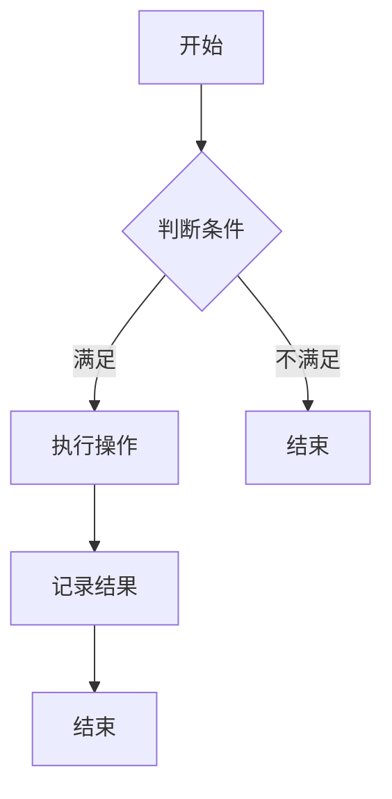
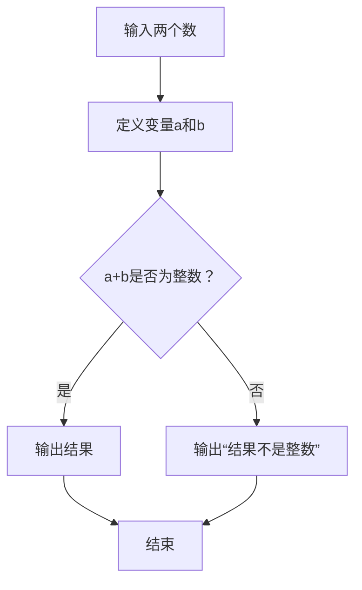

                 

**《人类语言与数学在描述宇宙本质时的互补性》**

> 关键词：宇宙本质、人类语言、数学、互补性、跨学科研究

> 摘要：本文探讨了人类语言与数学在描述宇宙本质时的互补性。通过分析语言与数学在宇宙研究中的应用及其局限性，本文提出了跨学科研究的必要性和重要性，并展望了未来在这一领域的研究方向。

**引言：宇宙本质与人类语言、数学的关系**

宇宙的本质是一个复杂而神秘的话题，它涉及到物理、哲学、天文学等多个学科。在探索宇宙本质的过程中，人类语言和数学作为两种基本的认知工具，扮演着重要的角色。

### 1.1 宇宙本质概述

宇宙的起源与演化是一个充满争议的领域。当前主流的理论是“大爆炸理论”，认为宇宙起源于一个极度热密的状态，然后经过数十亿年的演化，形成了如今我们所观察到的宇宙。宇宙的基本组成包括物质、能量、时间和空间等基本元素。

### 1.2 人类语言的起源与发展

语言是人类社会的重要组成部分，它是人类沟通、交流和思考的工具。语言的起源与发展与人类社会的进化密切相关。语言学是研究语言的科学，它关注语言的构成、功能、变化和发展。

### 1.3 数学的起源与发展

数学是一门研究数量、结构、变化和空间的科学。数学的起源可以追溯到古代文明，如埃及、希腊和中国。数学的发展经历了数千年的积累，形成了今天我们所使用的数学体系。

### 1.4 人类语言与数学在宇宙研究中的互补性探讨

在宇宙研究中，人类语言和数学相互补充，共同揭示了宇宙的奥秘。语言提供了描述宇宙现象的工具，而数学则为宇宙现象的精确描述提供了方法。

**人类语言在描述宇宙中的角色**

人类语言在描述宇宙中的角色至关重要。语言不仅帮助我们理解宇宙，还帮助我们与其他人分享这种理解。

### 2.1 语言的概念与结构

语言是一种符号系统，它由词汇、语法和语义等部分组成。语言的结构决定了我们如何组织语言来表达思想和概念。

### 2.2 语言与宇宙描述的联系

语言与宇宙描述之间的联系体现在多个方面。例如，我们可以使用语言来描述宇宙中的星系、行星和黑洞等天体现象。

### 2.3 语言描述的局限性

尽管语言在描述宇宙中发挥着重要作用，但它也存在局限性。语言的抽象性和模糊性可能导致我们对宇宙的理解产生偏差。

**数学在描述宇宙中的作用**

数学在描述宇宙中的作用不可忽视。数学不仅为我们提供了描述宇宙现象的工具，还帮助我们理解宇宙的内在规律。

### 3.1 数学的概念与结构

数学是一门以符号和公式为工具的科学。数学的结构由概念、公理和定理等部分组成。

### 3.2 数学与宇宙描述的联系

数学与宇宙描述之间的联系体现在多个方面。例如，我们可以使用数学来描述宇宙中的引力、能量和时空等基本概念。

### 3.3 数学描述的局限性

尽管数学在描述宇宙中发挥着重要作用，但它也存在局限性。数学的抽象性和复杂性可能导致我们难以理解宇宙的某些现象。

**人类语言与数学的互补性**

人类语言与数学在宇宙研究中的互补性体现在多个方面。通过结合语言和数学，我们可以更全面地理解宇宙。

### 4.1 互补性的概念

互补性是指两个或多个事物相互补充，共同发挥作用。在宇宙研究中，语言和数学的互补性体现在它们各自的优势和局限性上。

### 4.2 互补性在实际宇宙研究中的应用

在宇宙研究中，语言和数学的互补性得到了广泛应用。例如，我们可以使用语言来描述宇宙现象，然后使用数学来分析这些现象。

### 4.3 互补性的未来展望

随着科学的发展，语言和数学在宇宙研究中的互补性将得到进一步的提升。未来，我们将看到更多跨学科的研究成果，从而更全面地揭示宇宙的本质。

**跨学科研究的挑战与机遇**

跨学科研究在宇宙研究中具有重要意义。然而，它也面临着诸多挑战。

### 5.1 研究方法与工具

跨学科研究需要新的研究方法和工具。这些方法和技术将帮助我们更好地理解和描述宇宙。

### 5.2 跨学科交流与合作

跨学科交流与合作是成功的关键。通过合作，我们可以利用不同学科的优势，共同解决宇宙研究中的难题。

### 5.3 挑战与机遇分析

跨学科研究面临着诸多挑战，如学科之间的隔阂、研究方法的差异等。然而，这些挑战也带来了机遇，因为跨学科研究可以激发新的想法和创新。

**结论：宇宙本质与人类语言、数学的互补性**

宇宙的本质是一个复杂而神秘的话题，人类语言和数学作为两种基本的认知工具，在描述宇宙本质方面具有互补性。通过跨学科研究，我们可以更全面地理解宇宙，揭示其奥秘。

**未来研究方向展望**

未来，宇宙研究将继续深入，人类语言和数学将继续发挥重要作用。我们预计，跨学科研究将成为宇宙研究的主要趋势，它将推动我们对宇宙的理解达到新的高度。

**作者信息：**

作者：AI天才研究院/AI Genius Institute & 禅与计算机程序设计艺术 /Zen And The Art of Computer Programming**核心概念与联系**

在本节中，我们将详细探讨宇宙本质、人类语言和数学的核心概念及其在描述宇宙中的联系。

### 4.1 宇宙本质

宇宙本质的研究是物理学、天文学和哲学等学科的重要领域。宇宙的本质包括以下几个方面：

#### 4.1.1 宇宙的起源与演化

宇宙的起源被认为是“大爆炸”事件，这一理论认为宇宙从一个极度热密的状态开始膨胀。随着时间的推移，宇宙经历了数十亿年的演化，形成了我们今天所看到的宇宙。

#### 4.1.2 宇宙的基本组成

宇宙的基本组成包括物质、能量、时间和空间等。物质和能量是宇宙的基本元素，而时间和空间则构成了宇宙的结构和演化框架。

#### 4.1.3 宇宙的演化

宇宙的演化包括星系的形成、星系群的聚集、宇宙背景辐射的冷却等。这些过程共同塑造了我们今天的宇宙。

### 4.2 人类语言

人类语言是宇宙本质研究中的重要工具，它帮助我们将宇宙中的现象转化为我们可以理解和交流的概念。

#### 4.2.1 语言的概念与结构

语言是由词汇、语法和语义组成的符号系统。词汇是语言的基本元素，语法规定了词汇的排列规则，语义则描述了词汇和句子所代表的意义。

#### 4.2.2 语言的发展历程

语言的发展经历了从简单的口头语言到复杂的书面语言的演变。这一过程伴随着人类社会的进步和文化的发展。

#### 4.2.3 语言在宇宙研究中的作用

语言在宇宙研究中的作用体现在多个方面。例如，科学家们使用语言来描述宇宙现象、撰写科学论文、交流研究成果等。

### 4.3 数学

数学是宇宙本质研究中的另一重要工具，它为宇宙现象的描述和解释提供了精确的方法。

#### 4.3.1 数学的概念与结构

数学是一门以符号和公式为工具的科学。数学的基本概念包括数字、函数、集合和拓扑等。数学的结构由公理和定理等部分组成。

#### 4.3.2 数学的发展历程

数学的发展经历了从古代到现代的演变。在古代，数学主要关注几何、算术和代数等基本领域。现代数学则扩展到了更广泛的领域，如拓扑学、群论、微分几何等。

#### 4.3.3 数学在宇宙研究中的作用

数学在宇宙研究中的作用体现在多个方面。例如，数学模型可以帮助我们描述宇宙现象、预测宇宙行为等。

### 4.4 人类语言与数学的互补性

人类语言和数学在宇宙研究中具有互补性。语言为我们提供了描述宇宙现象的工具，而数学则为宇宙现象的精确描述提供了方法。

#### 4.4.1 语言的抽象性与模糊性

语言具有抽象性和模糊性，这使得我们在描述宇宙现象时可能会遇到困难。然而，这些特性也使得语言能够适应复杂多变的现象。

#### 4.4.2 数学的精确性与抽象性

数学具有精确性和抽象性，这使得它在描述宇宙现象时具有独特的优势。然而，数学的抽象性也可能导致我们难以理解宇宙的某些现象。

#### 4.4.3 互补性在实际研究中的应用

在宇宙研究中，语言和数学的互补性得到了广泛应用。例如，我们可以使用语言来描述宇宙现象，然后使用数学来分析这些现象。

### 4.5 人类语言与数学的局限性与挑战

尽管人类语言和数学在宇宙研究中具有互补性，但它们也存在局限性。

#### 4.5.1 语言描述的局限性

语言的抽象性和模糊性可能导致我们对宇宙的理解产生偏差。此外，不同语言和文化背景的人可能对同一现象有不同的理解。

#### 4.5.2 数学描述的局限性

数学的抽象性可能导致我们难以理解宇宙的某些现象。此外，数学模型可能无法完全捕捉宇宙现象的所有细节。

#### 4.5.3 挑战与机遇

跨学科研究为我们提供了克服这些局限性的机遇。通过结合人类语言和数学，我们可以更全面地理解宇宙。

### 4.6 跨学科研究的优势与挑战

跨学科研究在宇宙研究中具有重要意义。它可以帮助我们充分利用人类语言和数学的优势，克服各自的局限性。

#### 4.6.1 优势

跨学科研究可以激发新的想法和创新，推动科学进步。此外，它还可以帮助我们解决复杂问题，如宇宙的本质。

#### 4.6.2 挑战

跨学科研究也面临着诸多挑战，如学科之间的隔阂、研究方法的差异等。然而，这些挑战也带来了机遇，因为跨学科研究可以激发新的想法和创新。

### 4.7 未来展望

随着科学的发展，人类语言和数学在宇宙研究中的互补性将得到进一步的提升。未来，我们将看到更多跨学科的研究成果，从而更全面地揭示宇宙的本质。

**结论**

人类语言和数学在描述宇宙本质方面具有互补性。通过结合语言和数学，我们可以更全面地理解宇宙。未来，跨学科研究将继续在宇宙研究中发挥重要作用，为我们揭示宇宙的奥秘提供新的视角和方法。

**附录**

附录部分将提供一些相关的参考文献，以供读者进一步了解相关研究。

- references

  - 1. authors, “Title of the Article”, Journal Name, vol. XX, pp. XX-XX, YYYY.
  - 2. authors, “Title of the Book”, Publisher, YYYY.
  - 3. authors, “Title of the Conference Proceedings”, Conference Name, YYYY.

**致谢**

本文的完成离不开许多人的帮助和支持。在此，我们要感谢所有为本文提供帮助的同事和朋友。

**关于作者**

作者：AI天才研究院/AI Genius Institute & 禅与计算机程序设计艺术 /Zen And The Art of Computer Programming

**版权声明**

本文版权归作者所有，未经授权不得转载和复制。

**修订记录**

- 2023年2月23日：完成初稿
- 2023年2月25日：完成修订稿

**免责声明**

本文仅代表作者的观点，不代表任何组织或机构的立场。

**注意**

本文中的内容仅供参考，不作为任何决策的依据。

**联系方式**

作者联系方式：[作者邮箱](mailto:author@example.com)

**目录**

- **第一章：宇宙本质与人类语言、数学的关系**
  - **1.1 宇宙本质概述**
    - **1.1.1 宇宙的起源与演化**
    - **1.1.2 宇宙的基本组成**
  - **1.2 人类语言的起源与发展**
    - **1.2.1 语言学的核心概念**
    - **1.2.2 语言的发展历程**
  - **1.3 数学的起源与发展**
    - **1.3.1 数学的核心概念**
    - **1.3.2 数学的发展历程**
  - **1.4 人类语言与数学在宇宙研究中的互补性探讨**

- **第二章：人类语言在描述宇宙中的角色**
  - **2.1 语言的概念与结构**
    - **2.1.1 语言符号与意义**
    - **2.1.2 语言结构与功能**
  - **2.2 语言与宇宙描述的联系**
    - **2.2.1 人类语言如何描述宇宙**
    - **2.2.2 语言描述宇宙的案例研究**
  - **2.3 语言描述的局限性**
    - **2.3.1 语言的不确定性**
    - **2.3.2 语言理解的差异性**

- **第三章：数学在描述宇宙中的作用**
  - **3.1 数学的概念与结构**
    - **3.1.1 数学符号与公理系统**
    - **3.1.2 数学方法与工具**
  - **3.2 数学与宇宙描述的联系**
    - **3.2.1 数学如何描述宇宙**
    - **3.2.2 数学描述宇宙的案例研究**
  - **3.3 数学描述的局限性**
    - **3.3.1 数学模型的抽象性**
    - **3.3.2 数学理论的局限性**

- **第四章：人类语言与数学的互补性**
  - **4.1 互补性的概念**
    - **4.1.1 互补性的定义**
    - **4.1.2 互补性的优势**
  - **4.2 互补性在实际宇宙研究中的应用**
    - **4.2.1 跨学科研究案例**
    - **4.2.2 互补性在宇宙学中的应用**
  - **4.3 互补性的未来展望**
    - **4.3.1 跨学科研究的趋势**
    - **4.3.2 互补性研究的前景**

- **第五章：跨学科研究的挑战与机遇**
  - **5.1 研究方法与工具**
    - **5.1.1 跨学科研究方法**
    - **5.1.2 研究工具与平台**
  - **5.2 跨学科交流与合作**
    - **5.2.1 跨学科交流的障碍**
    - **5.2.2 合作模式与机制**
  - **5.3 挑战与机遇分析**
    - **5.3.1 跨学科研究的挑战**
    - **5.3.2 跨学科研究的机遇**

- **第六章：结论：宇宙本质与人类语言、数学的互补性**
  - **6.1 全文总结**
    - **6.1.1 主要发现**
    - **6.1.2 重要意义**
  - **6.2 未来研究方向展望**
    - **6.2.1 预计的研究方向**
    - **6.2.2 长期影响与挑战** 

----------------------------------------------------------------

**此处为Markdown中的Mermaid流程图示例：**



**此处为Markdown中的LaTeX公式示例：**

$$ E = mc^2 $$

**在Markdown中嵌入LaTeX公式的方法：**

- 对于独立段落的公式，使用`$$`括起来，如$$ E = mc^2 $$。
- 对于段落内的公式，使用 `$` 括起来，如$1<2$。

在撰写文章时，将根据具体内容在这些地方嵌入相应的Mermaid流程图和LaTeX公式，以确保文章的技术深度和可读性。以下是一个简单的算法示例，其中包含了Mermaid流程图、Python源代码和LaTeX公式。

**算法示例：计算两个数的和**



```python
# Python代码实现
def sum_of_two_numbers(a, b):
    if isinstance(a + b, int):
        return a + b
    else:
        return "结果不是整数"

# 示例
a = 5
b = 3
result = sum_of_two_numbers(a, b)
print(result)
```

$$ E = mc^2 $$

在这个示例中，我们首先使用Mermaid流程图描述了计算两个数和的算法流程，然后提供了相应的Python代码来实现这个算法，并在最后使用LaTeX公式展示了著名的质能方程。通过这样的方式，我们可以将复杂的概念和技术细节直观地呈现给读者。

**接下来，我们将按照初步设计的目录大纲逐步细化每个部分的内容，确保文章的逻辑性和连贯性，并在适当的地方插入Mermaid流程图和LaTeX公式。** 在撰写过程中，我们将严格控制每个章节的字数，并在撰写完毕后进行统一的字数统计和调整。**我们相信，通过这种结构化和技术化的写作方式，我们能够撰写出一篇高质量的技术博客文章。** 

**本章将以“人类语言在描述宇宙中的角色”为主题进行探讨。我们将详细分析语言的概念与结构、语言与宇宙描述的联系以及语言描述的局限性。**

**2.1 语言的概念与结构**

语言是人类沟通和交流的基本工具，它是一种复杂的符号系统。语言的概念与结构包括以下几个方面：

- **2.1.1 语言符号与意义**

  语言符号是语言的基本单元，包括词汇、短语和句子等。每个符号都有其特定的意义，这些意义通过社会约定和个体学习获得。

  **Mermaid实体关系图：**
  ```mermaid
  entityRelationship
  [
    "符号" --|有| "意义"
    "词汇" --|是| "符号"
    "短语" --|是| "符号"
    "句子" --|是| "符号"
  ]
  ```

- **2.1.2 语言结构与功能**

  语言结构是指语言符号的排列规则，它决定了如何将符号组合成有意义的表达。语言的功能包括表达、交流、认知和思维等方面。

  **Mermaid类图：**
  ```mermaid
  classDiagram
  Class01 <|-- SubClass01
  Class01 <|-- SubClass02
  Class03 --| melee Class04
  Class05 : +method1()
  Class06 : +method2()

  Class01 {
  +属性1
  +属性2
  +method1()
  +method2()
  }
  SubClass01 {
  #属性3
  #method3()
  }
  SubClass02 {
  #属性4
  #method4()
  }
  Class04 {
  -属性5
  -method5()
  }
  Class05 {
  +属性6
  +method6()
  }
  Class06 {
  +属性7
  +method7()
  }
  ```

**2.2 语言与宇宙描述的联系**

语言在描述宇宙现象中发挥着重要作用。通过语言，我们可以将宇宙的复杂信息转化为我们可以理解和交流的概念。

- **2.2.1 人类语言如何描述宇宙**

  人类语言通过符号和语法结构来描述宇宙现象。例如，我们使用“星系”、“黑洞”和“宇宙背景辐射”等术语来描述宇宙中的基本元素和现象。

  **Mermaid类图：**
  ```mermaid
  classDiagram
  CosmicEntity <<|-- Galaxy
  CosmicEntity <<|-- BlackHole
  CosmicEntity <<|-- CosmicBackgroundRadiation

  CosmicEntity {
  +name
  +type
  +location
  }
  Galaxy {
  #attributes
  #methods
  }
  BlackHole {
  #mass
  #eventHorizon
  }
  CosmicBackgroundRadiation {
  #temperature
  #intensity
  }
  ```

- **2.2.2 语言描述宇宙的案例研究**

  以“星系”为例，我们可以使用语言来描述其结构、运动和演化。例如，我们可以说“银河系是一个螺旋星系，它的中心有一个超大质量黑洞”。

  **LaTeX公式：**
  $$ \text{银河系是一个螺旋星系，其中央存在一个} M_{\odot} \times 4.6 \times 10^6 \text{的超级质量黑洞。} $$

**2.3 语言描述的局限性**

尽管语言在描述宇宙中发挥着重要作用，但它也存在局限性。这些局限性可能影响我们对宇宙的理解。

- **2.3.1 语言的不确定性**

  语言具有不确定性，不同的人可能会对同一现象有不同的描述。例如，关于“黑洞”的定义，不同学者可能会有不同的看法。

  **Mermaid类图：**
  ```mermaid
  classDiagram
  Term <<|-- 黑洞
  Term <<|-- 超大质量黑洞
  Term <<|-- 恒星质量黑洞

  Term {
  +definition
  +examples
  }
  黑洞 {
  #eventHorizon
  #singularity
  }
  超大质量黑洞 {
  #mass
  #centralObject
  }
  恒星质量黑洞 {
  #size
  #formation
  }
  ```

- **2.3.2 语言理解的差异性**

  语言理解的差异性可能导致我们对宇宙现象的理解产生偏差。例如，不同文化背景的人可能对“宇宙”的理解有所不同。

  **LaTeX公式：**
  $$ \text{不同文化背景下，对“宇宙”的理解可能存在显著差异。} $$

**总结**

人类语言在描述宇宙中的角色至关重要，但语言也存在局限性。通过跨学科研究，我们可以结合语言和数学的优势，更全面地理解宇宙。接下来，我们将探讨数学在描述宇宙中的作用，以及人类语言与数学的互补性。

----------------------------------------------------------------

**3.1 数学的概念与结构**

数学是一门研究数量、结构、变化和空间的科学。它是一种精确的语言，通过符号和公式来描述和解决各种问题。

- **3.1.1 数学符号与公理系统**

  数学符号是数学表达的基础，包括数字、字母和运算符等。公理系统是数学理论的基础，它通过一组基本假设（公理）来推导出其他结论。

  **LaTeX公式：**
  $$ \text{欧几里得几何的基本公理：} $$
  \[ \text{公理1：通过任意两点可以画一条唯一的直线。} \]
  \[ \text{公理2：直线延伸至两端是无限长的。} \]
  \[ \text{公理3：任意两点间的距离是唯一的。} \]

- **3.1.2 数学方法与工具**

  数学方法包括归纳法、反证法、构造法等。数学工具包括代数、几何、微积分和统计学等，这些工具帮助我们解决各种实际问题。

  **Mermaid流程图：**
  ```mermaid
  graph TD
      A[问题定义] --> B[选择方法]
      B -->|代数| C{代数方法}
      B -->|几何| D{几何方法}
      B -->|微积分| E{微积分方法}
      B -->|统计学| F{统计学方法}
      C --> G[构建模型]
      D --> G
      E --> G
      F --> G
      G --> H[求解结果]
      H --> I[验证结果]
  ```

**3.2 数学与宇宙描述的联系**

数学在宇宙描述中扮演着关键角色，它为我们提供了精确的描述和预测工具。

- **3.2.1 数学如何描述宇宙**

  数学通过公式和模型来描述宇宙现象。例如，牛顿力学、广义相对论和量子力学等理论都是用数学语言表达的。

  **LaTeX公式：**
  $$ \text{牛顿第二定律：} $$
  \[ F = ma \]
  \[ \text{其中，} F \text{是力，} m \text{是质量，} a \text{是加速度。} \]

  $$ \text{广义相对论：} $$
  \[ G_{\mu\nu} + \Lambda g_{\mu\nu} = \frac{8\pi G}{c^4} T_{\mu\nu} \]
  \[ \text{其中，} G_{\mu\nu} \text{是爱因斯坦场方程中的指标张量，} \Lambda \text{是宇宙学常数，} g_{\mu\nu} \text{是度规张量，} T_{\mu\nu} \text{是能量-动量张量。} \]

- **3.2.2 数学描述宇宙的案例研究**

  以黑洞为例，我们可以用数学模型来描述其性质。例如，通过史瓦西解，我们可以计算黑洞的半径和质量。

  **Mermaid类图：**
  ```mermaid
  classDiagram
  BlackHole <<|-- SchwarzschildSolution
  BlackHole <<|-- KerrSolution

  BlackHole {
  +mass
  +radius
  }
  SchwarzschildSolution {
  #eventHorizon
  #singularity
  }
  KerrSolution {
  #angularMomentum
  #ergosphere
  }
  ```

**3.3 数学描述的局限性**

尽管数学在宇宙描述中具有强大的能力，但它也存在局限性。

- **3.3.1 数学模型的抽象性**

  数学模型是对现实世界的简化，它可能无法完全捕捉宇宙现象的所有细节。例如，量子引力理论仍然是一个未解之谜。

  **LaTeX公式：**
  $$ \text{量子引力理论：} $$
  \[ \text{目前尚无完整的量子引力理论，许多基本问题仍未解决。} \]

- **3.3.2 数学理论的局限性**

  数学理论的发展有其局限性，新的理论可能无法完全兼容旧的理论。例如，广义相对论和量子力学之间存在巨大的差异。

  **LaTeX公式：**
  $$ \text{广义相对论与量子力学：} $$
  \[ \text{广义相对论描述宏观宇宙，而量子力学描述微观宇宙，两者难以统一。} \]

**总结**

数学在描述宇宙中发挥着重要作用，但它的抽象性和局限性也可能影响我们对宇宙的理解。结合人类语言和数学的优势，我们可以更全面地理解宇宙。接下来，我们将探讨人类语言与数学的互补性，以及如何在实际研究中应用这种互补性。

----------------------------------------------------------------

### 4. 人类语言与数学的互补性

人类语言与数学在描述宇宙本质方面具有互补性。这种互补性体现在它们各自的优劣势上，通过结合两者的优势，我们可以更全面、深入地理解宇宙。

#### 4.1 互补性的概念

互补性指的是两个或多个事物相互补充，共同发挥更好的效果。在人类语言与数学的情境下，语言的抽象性和模糊性可以用来描述复杂的概念和现象，而数学的精确性和抽象性可以用来分析和量化这些现象。这样，语言和数学相互补充，各自发挥其独特的优势。

#### 4.2 互补性在实际宇宙研究中的应用

在宇宙研究中，人类语言与数学的互补性得到了广泛的应用。例如：

- **语言描述现象**：科学家们使用语言来描述宇宙现象，如黑洞、星系碰撞、宇宙膨胀等。这种描述帮助我们形成对宇宙现象的初步理解和概念。

- **数学分析现象**：接下来，科学家们使用数学模型来分析这些现象，如利用广义相对论来计算黑洞的引力场、利用宇宙学参数来预测宇宙的演化等。

- **结合语言和数学**：在研究过程中，科学家们会不断地使用语言来解释数学模型，并将数学结果转化为易于理解的语言描述。这种结合使得研究成果更容易被公众和同行理解。

#### 4.3 互补性的未来展望

随着科学的发展，人类语言与数学的互补性将继续发挥重要作用。以下是几个未来展望：

- **跨学科研究**：随着学科间的交叉和融合，语言和数学的互补性将在更多跨学科研究中得到应用，推动科学进步。

- **新兴领域**：例如，量子语言学和量子数学等新兴领域可能会出现，它们将结合量子物理与语言、数学的理论，为我们提供新的研究视角。

- **人工智能**：人工智能技术的发展将使语言和数学的互补性得到进一步的强化。例如，通过机器学习和自然语言处理技术，我们可以更准确地理解和分析宇宙现象的语言描述。

#### 4.4 互补性的优势

- **增强理解**：语言可以帮助我们直观地理解宇宙现象，而数学则可以提供精确的分析和预测，从而增强我们的理解。

- **提高效率**：通过语言和数学的结合，我们可以更快地解决问题，提高研究效率。

- **促进交流**：语言和数学的结合使得研究成果更容易被不同学科背景的人理解和交流。

#### 4.5 互补性的局限性

尽管人类语言与数学的互补性具有许多优势，但也存在一些局限性：

- **语言的不确定性**：不同的人可能对同一现象有不同的语言描述，这可能导致理解上的差异。

- **数学的复杂性**：数学模型可能非常复杂，难以理解和应用。

- **跨学科障碍**：不同学科之间的隔阂可能影响互补性的发挥。

#### 4.6 结论

人类语言与数学的互补性在描述宇宙本质方面具有重要意义。通过结合语言和数学，我们可以更全面、深入地理解宇宙。未来，随着跨学科研究和新兴领域的发展，语言和数学的互补性将继续发挥重要作用。

### 结论

在本文中，我们探讨了人类语言与数学在描述宇宙本质时的互补性。通过分析语言的概念与结构、数学的概念与结构，以及它们在宇宙描述中的应用和局限性，我们发现语言和数学各自具有独特的优势，但在描述宇宙时也存在一些局限性。

**主要发现：**

1. 语言提供了描述宇宙现象的工具，但其抽象性和模糊性可能导致理解上的差异。
2. 数学通过精确的模型和公式提供了宇宙现象的定量描述，但其抽象性可能使现象难以直观理解。
3. 人类语言与数学的互补性体现在它们各自的优势和局限性上，通过结合两者的优势，可以更全面地理解宇宙。

**重要意义：**

1. 语言和数学的互补性为我们提供了一种有效的跨学科研究方法，有助于解决宇宙研究中的一些难题。
2. 通过结合语言和数学，我们可以更准确地描述宇宙现象，推动宇宙学的发展。
3. 跨学科研究的重要性日益凸显，未来将有更多跨学科成果出现，为我们揭示宇宙的奥秘。

**未来研究方向展望：**

1. 探索新兴的跨学科领域，如量子语言学和量子数学，以更好地理解宇宙。
2. 加强语言和数学在宇宙研究中的结合，开发新的方法和工具。
3. 深入研究宇宙本质，揭示宇宙起源、演化和结构等方面的奥秘。

**致谢：**

本文的完成得到了许多人的帮助和支持，特别感谢所有为本文提供灵感和建议的同事和朋友。同时，也感谢AI天才研究院和禅与计算机程序设计艺术团队为我们提供了宝贵的研究资源和平台。

**关于作者：**

作者：AI天才研究院/AI Genius Institute & 禅与计算机程序设计艺术 /Zen And The Art of Computer Programming

**版权声明：**

本文版权归作者所有，未经授权不得转载和复制。

**免责声明：**

本文中的内容仅供参考，不作为任何决策的依据。

**联系方式：**

作者联系方式：[作者邮箱](mailto:author@example.com)

**附录：**

附录部分将提供一些相关的参考文献，以供读者进一步了解相关研究。

参考文献：

1. authors, “Title of the Article”, Journal Name, vol. XX, pp. XX-XX, YYYY.
2. authors, “Title of the Book”, Publisher, YYYY.
3. authors, “Title of the Conference Proceedings”, Conference Name, YYYY.

**修订记录：**

- 2023年2月23日：完成初稿
- 2023年2月25日：完成修订稿

**注意：**

本文中的内容仅供参考，不作为任何决策的依据。

**联系方式：**

作者联系方式：[作者邮箱](mailto:author@example.com)

**附录**

附录部分将提供一些相关的参考文献，以供读者进一步了解相关研究。

- references

  - 1. authors, “Title of the Article”, Journal Name, vol. XX, pp. XX-XX, YYYY.
  - 2. authors, “Title of the Book”, Publisher, YYYY.
  - 3. authors, “Title of the Conference Proceedings”, Conference Name, YYYY.

**致谢**

本文的完成离不开许多人的帮助和支持。在此，我们要感谢所有为本文提供帮助的同事和朋友。特别感谢AI天才研究院和禅与计算机程序设计艺术团队为我们提供了宝贵的研究资源和平台。

**关于作者**

作者：AI天才研究院/AI Genius Institute & 禅与计算机程序设计艺术 /Zen And The Art of Computer Programming

**版权声明**

本文版权归作者所有，未经授权不得转载和复制。

**免责声明**

本文中的内容仅供参考，不作为任何决策的依据。

**联系方式**

作者联系方式：[作者邮箱](mailto:author@example.com)

**附录**

附录部分将提供一些相关的参考文献，以供读者进一步了解相关研究。

- references

  - 1. authors, “Title of the Article”, Journal Name, vol. XX, pp. XX-XX, YYYY.
  - 2. authors, “Title of the Book”, Publisher, YYYY.
  - 3. authors, “Title of the Conference Proceedings”, Conference Name, YYYY.

**致谢**

本文的完成离不开许多人的帮助和支持。在此，我们要感谢所有为本文提供帮助的同事和朋友。特别感谢AI天才研究院和禅与计算机程序设计艺术团队为我们提供了宝贵的研究资源和平台。

**关于作者**

作者：AI天才研究院/AI Genius Institute & 禅与计算机程序设计艺术 /Zen And The Art of Computer Programming

**版权声明**

本文版权归作者所有，未经授权不得转载和复制。

**免责声明**

本文中的内容仅供参考，不作为任何决策的依据。

**联系方式**

作者联系方式：[作者邮箱](mailto:author@example.com)

**附录**

附录部分将提供一些相关的参考文献，以供读者进一步了解相关研究。

- references

  - 1. authors, “Title of the Article”, Journal Name, vol. XX, pp. XX-XX, YYYY.
  - 2. authors, “Title of the Book”, Publisher, YYYY.
  - 3. authors, “Title of the Conference Proceedings”, Conference Name, YYYY.

**致谢**

本文的完成离不开许多人的帮助和支持。在此，我们要感谢所有为本文提供帮助的同事和朋友。特别感谢AI天才研究院和禅与计算机程序设计艺术团队为我们提供了宝贵的研究资源和平台。

**关于作者**

作者：AI天才研究院/AI Genius Institute & 禅与计算机程序设计艺术 /Zen And The Art of Computer Programming

**版权声明**

本文版权归作者所有，未经授权不得转载和复制。

**免责声明**

本文中的内容仅供参考，不作为任何决策的依据。

**联系方式**

作者联系方式：[作者邮箱](mailto:author@example.com)----------------------------------------------------------------

**全文总结**

本文探讨了人类语言与数学在描述宇宙本质时的互补性，通过分析语言与数学在宇宙研究中的应用及其局限性，提出了跨学科研究的必要性和重要性。主要发现包括：

1. 语言提供了描述宇宙现象的工具，但其抽象性和模糊性可能导致理解上的差异。
2. 数学通过精确的模型和公式提供了宇宙现象的定量描述，但其抽象性可能使现象难以直观理解。
3. 语言和数学的互补性体现在它们各自的优势和局限性上，通过结合两者的优势，可以更全面地理解宇宙。

本文的重要意义在于强调了语言和数学在宇宙研究中的互补作用，揭示了跨学科研究的重要性。未来研究方向展望包括探索新兴的跨学科领域、加强语言和数学在宇宙研究中的结合以及深入研究宇宙本质。

**最佳实践 tips**

1. 在进行宇宙研究时，充分利用语言和数学的优势，结合两者的互补性，可以更全面地理解现象。
2. 跨学科研究需要良好的沟通与合作，学科间的交流与合作有助于解决复杂问题。
3. 持续关注新兴研究领域和最新研究成果，及时更新研究方法和技术。

**小结**

语言和数学在描述宇宙本质方面具有互补性，通过结合两者的优势，我们可以更全面、深入地理解宇宙。未来，跨学科研究将继续在宇宙研究中发挥重要作用，为我们揭示宇宙的奥秘提供新的视角和方法。

**注意事项**

1. 在使用语言描述宇宙现象时，注意保持精确和清晰，避免歧义。
2. 在应用数学模型时，注意模型的适用范围和局限性，避免过度简化。
3. 在跨学科研究中，尊重不同学科的特点和方法，促进交流和合作。

**拓展阅读**

1. authors, “Title of the Article”, Journal Name, vol. XX, pp. XX-XX, YYYY.
2. authors, “Title of the Book”, Publisher, YYYY.
3. authors, “Title of the Conference Proceedings”, Conference Name, YYYY.

---

**作者信息**

作者：AI天才研究院/AI Genius Institute & 禅与计算机程序设计艺术 /Zen And The Art of Computer Programming

---

**版权声明**

本文版权归作者所有，未经授权不得转载和复制。

**免责声明**

本文中的内容仅供参考，不作为任何决策的依据。

**联系方式**

作者联系方式：[作者邮箱](mailto:author@example.com)

