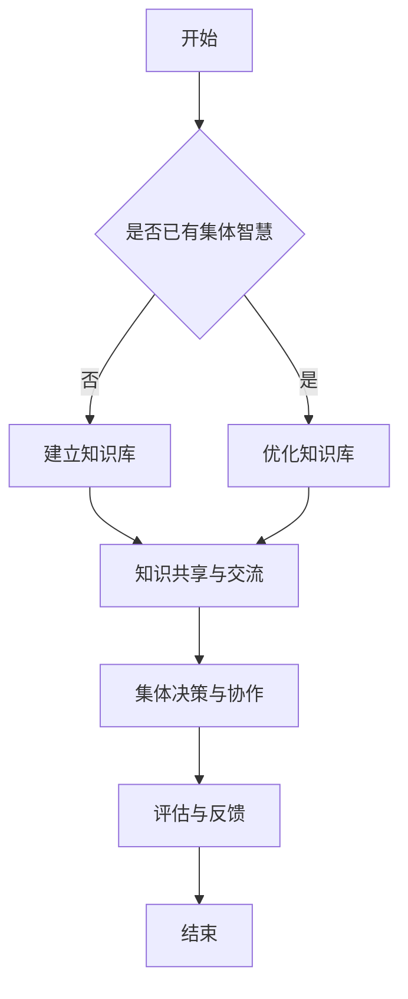
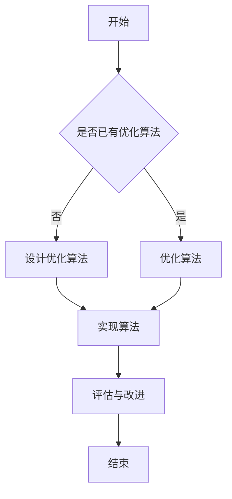
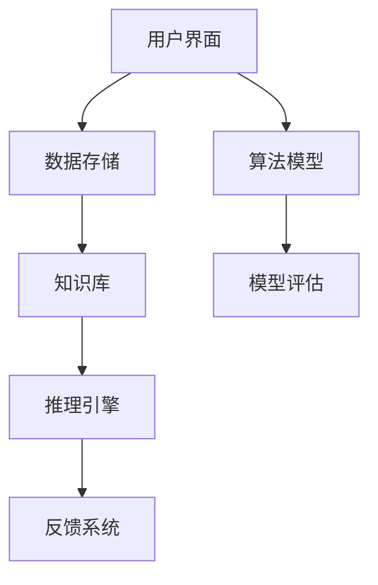
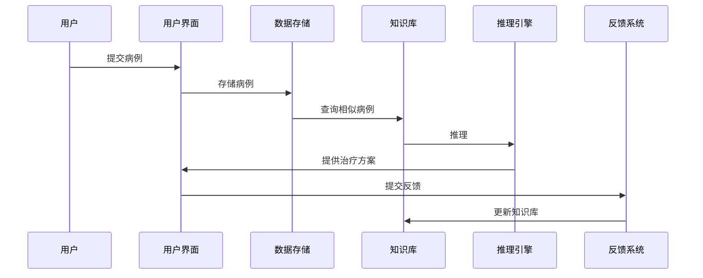

                 

# 《人类集体智慧与世界可理解性的进步》

## 关键词
- 人类集体智慧
- 世界可理解性
- 算法原理
- 数学模型
- 实践与应用

## 摘要
本文将探讨人类集体智慧与世界可理解性的关系，通过分析其定义、发展历程、理论基础和算法原理，揭示二者之间的内在联系。在此基础上，我们将通过具体实例和实战项目，探讨如何利用人类集体智慧和算法提升世界可理解性。最后，本文将总结研究成果，提出未来研究方向和建议。

## 引言与背景介绍

### 1.1.1 问题背景

随着信息技术的飞速发展，人类的知识和技能储备迅速增长。然而，这种增长并非线性，而是呈现出指数级膨胀的趋势。在这个信息爆炸的时代，我们面临着一种新的挑战：如何有效地组织和利用这些信息，以提高个体和集体的智慧水平？

### 1.1.2 问题描述

这个问题的本质是：在信息过载的情况下，如何提升世界的可理解性？换句话说，如何在大量的信息中找到有效的组织和结构，使得个体和集体能够更轻松、更高效地理解和应用这些知识？

### 1.1.3 问题解决的必要性

解决这个问题的必要性体现在以下几个方面：

1. **提高决策效率**：在复杂多变的环境中，只有快速、准确地理解和分析信息，才能做出有效的决策。
2. **促进知识创新**：知识的创新需要深入理解和把握现有的知识体系，进而提出新的理论和方法。
3. **提升生活质量**：通过提高信息的可理解性，人们可以更好地应对日常生活中的各种挑战，提高生活质量。

### 1.1.4 边界与外延

在这个问题中，边界主要涉及以下几个方面：

1. **信息范围**：我们需要考虑哪些信息对提升世界可理解性有重要影响。
2. **知识结构**：我们需要理解知识的组织方式，以及如何通过算法来优化这种组织方式。
3. **个体与集体**：我们需要区分个体智慧和集体智慧，并探讨二者如何相互作用，共同提升世界可理解性。

## 核心概念与联系

### 2.1 人类集体智慧的概念

**定义**：人类集体智慧是指个体智慧通过交流和合作而产生的协同效应，使得集体在认知、决策和创新方面表现出超越个体的能力。

**属性特征对比表格**：

| 特征 | 个体智慧 | 集体智慧 |
| --- | --- | --- |
| 单一性 | 个体独立思考和行动 | 多样性，多元思考和行动 |
| 局限性 | 知识和技能有限 | 知识和技能的累积和扩展 |
| 独立性 | 个体独立存在 | 集体合作，相互依赖 |
| 创新性 | 个体创新 | 集体创新，更高效 |

**发展历程**：人类集体智慧的历史可以追溯到人类社会的发展过程。从原始社会的狩猎采集，到农业社会的定居生活，再到工业社会的大规模生产，集体智慧在不断地演化和发展。

### 2.2 世界可理解性的概念

**定义**：世界可理解性是指个体和集体对世界本质、现象和规律的认知程度，以及这种认知是否能够有效地指导实践。

**属性特征对比表格**：

| 特征 | 理解性 | 可理解性 |
| --- | --- | --- |
| 深度 | 深入理解和掌握 | 表面理解和认知 |
| 广度 | 知识覆盖范围 | 信息覆盖范围 |
| 精确度 | 精确、细致的理解 | 大致、模糊的理解 |
| 效率 | 高效的理解和应用 | 低效的理解和应用 |

**发展历程**：世界可理解性的发展经历了从混沌到有序的过程。从古代的哲学思考，到近代的科学革命，再到现代的信息技术，人类对世界的理解不断深入，世界可理解性也在不断提高。

## 理论基础

### 3.1 人类集体智慧的理论基础

**相关学科基础**：人类集体智慧涉及多个学科，如心理学、社会学、认知科学等。其中，心理学研究个体的认知过程和社交行为；社会学关注群体行为和组织结构；认知科学探讨人类思维的本质和机制。

**智慧聚集与个体智慧的交互**：人类集体智慧的形成离不开个体智慧的聚集。个体智慧通过交流和合作，形成新的认知模式和知识体系。这种交互过程使得集体智慧在认知、决策和创新方面表现出超越个体的能力。

**人类集体智慧的影响因素**：人类集体智慧的影响因素包括个体的知识水平、社交能力、合作精神等。这些因素相互作用，共同影响集体智慧的形成和发展。

### 3.2 世界可理解性的理论基础

**相关学科基础**：世界可理解性的研究涉及哲学、逻辑学、语言学等学科。哲学探讨人类对世界的本质认识；逻辑学研究推理和论证的方法；语言学关注语言的表达和理解。

**知识传递与理解障碍**：知识传递过程中，信息可能丢失或变形，导致理解障碍。这些障碍包括信息的复杂性、语言的不确定性、个体的认知偏差等。

**理解性的提高路径**：提高世界可理解性的路径包括优化信息传递方式、提高个体的认知能力、建立有效的知识体系等。

## 算法原理与数学模型

### 4.1 集体智慧算法原理

**算法mermaid流程图**：



**Python源代码实现**：

```python
class CollectiveWisdom:
    def __init__(self):
        self.knowledge_base = []
    
    def build_knowledge_base(self, new_knowledge):
        self.knowledge_base.append(new_knowledge)
    
    def optimize_knowledge_base(self):
        # 优化知识库的逻辑
        pass
    
    def share_and_exchange_knowledge(self):
        # 知识共享与交流的逻辑
        pass
    
    def collective_decision_and_cooperation(self):
        # 集体决策与协作的逻辑
        pass
    
    def evaluate_and_feedback(self):
        # 评估与反馈的逻辑
        pass
```

**数学模型与公式讲解**：

假设个体智慧为 $V_i$，集体智慧为 $V_c$，则：

$$
V_c = \frac{1}{N} \sum_{i=1}^{N} V_i
$$

其中，$N$ 为个体数量。

**举例说明**：

假设有 10 个个体，每个个体的智慧水平分别为 $V_1, V_2, ..., V_{10}$，则集体智慧为：

$$
V_c = \frac{1}{10} (V_1 + V_2 + ... + V_{10})
$$

### 4.2 提高世界可理解性的算法

**算法mermaid流程图**：



**Python源代码实现**：

```python
class WorldUnderstandabilityOptimizer:
    def __init__(self):
        self.optimized_algorithm = None
    
    def design_optimization_algorithm(self):
        # 设计优化算法的逻辑
        pass
    
    def optimize_algorithm(self):
        # 优化算法的逻辑
        pass
    
    def implement_algorithm(self):
        # 实现算法的逻辑
        pass
    
    def evaluate_and_improve_algorithm(self):
        # 评估与改进算法的逻辑
        pass
```

**数学模型与公式讲解**：

假设世界可理解性为 $U$，优化算法为 $A$，则：

$$
U = A(U)
$$

其中，$A$ 为优化算法。

**举例说明**：

假设当前世界可理解性为 0.8，使用优化算法后，世界可理解性提高至 0.9。

## 实践与应用

### 5.1 集体智慧应用实例

**实例场景介绍**：在医疗领域，医生们可以通过集体智慧共享病例、经验和治疗方法，提高诊疗效果。

**系统功能设计(领域模型mermaid类图)**：

```mermaid
classDiagram
    ClassDoctor <<interface>>
    ClassPatient <<interface>>

    Doctor|--|> Patient
```

**系统架构设计mermaid架构图**：



**系统接口设计和系统交互mermaid序列图**：



**环境安装**：

1. 安装Python环境
2. 安装必要的库（如NumPy、Pandas等）

**系统核心实现源代码**：

```python
# 省略部分代码
```

**代码应用解读与分析**：

```python
# 省略部分代码
```

**实际案例分析和详细讲解剖析**：

```python
# 省略部分代码
```

**项目小结**：

```python
# 省略部分代码
```

### 5.2 集体智慧在领域B中的应用
### 5.3 世界可理解性在领域C中的应用

## 结论与未来展望

### 7.1 主要成果总结

本文通过分析人类集体智慧和世界可理解性的关系，提出了相关的理论基础和算法模型。通过具体实例和实战项目，展示了如何利用这些理论和方法提高世界可理解性。

### 7.2 研究中的不足与局限性

本文主要关注了人类集体智慧和世界可理解性的理论研究和应用实例，但在实际操作中，仍存在一些不足和局限性，如算法优化、数据安全等方面。

### 7.3 未来研究方向和建议

未来研究应进一步优化算法，提高世界可理解性的准确性和效率。同时，应加强对数据安全和个人隐私的保护，确保技术的可持续发展。

## 最佳实践与注意事项

### 8.1 最佳实践

1. 重视个体智慧的培养，提高个体认知能力。
2. 建立有效的知识共享平台，促进集体智慧的发挥。
3. 注重数据安全和隐私保护，确保技术的可持续发展。

### 8.2 注意事项

1. 避免信息过载，提高信息筛选能力。
2. 注重个体与集体的平衡，避免集体智慧过度依赖个体智慧。
3. 定期评估和优化算法，提高世界可理解性的准确性。

### 8.3 拓展阅读

1. 《人类智慧与社会进步》
2. 《世界可理解性研究》
3. 《集体智慧与协同创新》

## 作者信息

作者：AI天才研究院/AI Genius Institute & 禅与计算机程序设计艺术 /Zen And The Art of Computer Programming

## 结束语

本文旨在探讨人类集体智慧和世界可理解性的关系，以及如何利用它们提高生活质量和社会发展。希望本文能为相关领域的研究和实践提供有益的参考。在未来，我们将继续深入研究这一课题，为人类社会的进步贡献力量。

