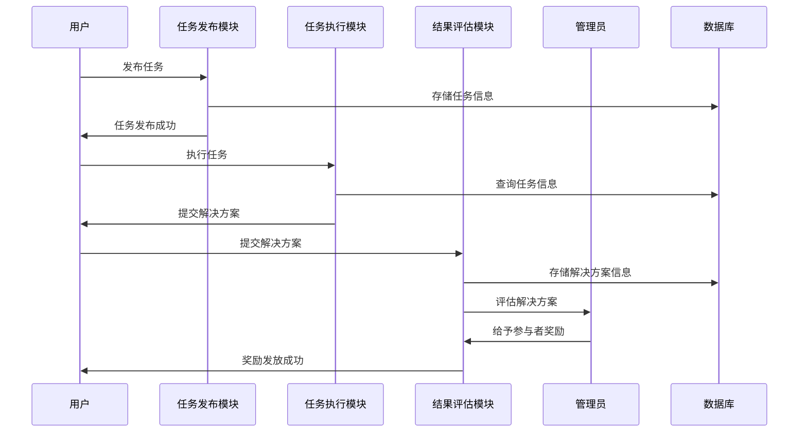

                 

# 人类集体智慧：众包科学与世界可理解性

## 关键词

- 众包科学
- 集体智慧
- 世界可理解性
- 众包平台
- 任务分配与评估

> 在这个信息爆炸的时代，单靠个体的智慧已经难以应对复杂的问题。众包科学作为一种新兴的集体智慧形式，正在逐步改变我们的思维方式。本文将深入探讨众包科学的本质、应用及其对提升世界可理解性的影响。

## 摘要

本文旨在探讨众包科学的理论与实践，分析众包项目的组织与管理方法，探讨众包在提升人类集体智慧中的作用，以及如何利用众包实现世界可理解性的目标。通过本文的阅读，读者将全面了解众包科学的起源、发展、平台设计、任务分配与评估，以及其在不同领域的应用案例。

## 第一部分：引言与背景

### 1.1 问题背景

随着互联网和大数据技术的快速发展，人类面临的信息量呈现出爆炸式增长。传统的个体智慧和集体智慧在应对复杂问题方面已显得力不从心。尤其是在科学、工程、社会问题等领域，个体智慧和传统集体智慧的表现往往难以满足需求。因此，如何有效地组织和管理众包项目，确保众包结果的准确性和可靠性，成为亟待解决的问题。

### 1.2 问题描述

众包科学作为新兴的集体智慧形式，通过将复杂问题分解成多个小任务，向广大网民征集解决方案，实现了人类智慧的大规模聚合。然而，如何设计高效的众包平台、如何合理分配任务、如何评估众包结果，这些问题的解决直接影响众包科学的效果和可靠性。

### 1.3 问题解决

本文将从以下几个方面探讨众包科学及其应用：

1. 众包科学的起源与发展，以及其在世界可理解性提升中的作用。
2. 众包平台的设计与实现，包括平台架构、功能模块等。
3. 众包任务分配与评估的策略与方法。
4. 众包生态系统建设，包括系统功能、系统架构等。
5. 众包在不同领域的应用案例。

### 1.4 边界与外延

本文主要讨论众包科学的各个方面，包括众包平台设计、任务分配与评估、众包生态系统建设等。同时，本文还将探讨众包在不同领域的应用案例，以展示众包科学的广泛影响力。

### 1.5 概念结构与核心要素组成

#### 1.5.1 核心概念

- **众包**：一种通过互联网平台，将问题分解成多个小任务，向广大网民征集解决方案的集体智慧形式。
- **众包平台**：提供众包任务发布、任务执行、结果评估等功能的在线平台。
- **任务分配**：将众包项目中的任务分配给合适的参与者。
- **结果评估**：对众包任务提交的解决方案进行评估，以确定其质量和可行性。

#### 1.5.2 关系

- **众包平台**与**任务分配**、**结果评估**之间是相互依存的，共同构成了众包生态系统。
- **任务分配**与**结果评估**之间存在反馈关系，通过评估结果调整任务分配策略，以提升众包效率。

### 小结

本部分对众包科学的背景、问题、解决方法、边界与外延以及核心概念和关系进行了详细阐述。接下来，我们将深入探讨众包科学的起源与发展，以及其在世界可理解性提升中的作用。

## 第二部分：众包科学与世界可理解性

### 2.1 众包科学与世界可理解性

#### 2.1.1 众包科学的起源与发展

众包科学的起源可以追溯到20世纪初，当时科学家开始利用互联网平台征集大众意见，以解决复杂问题。例如，DARPA（美国国防高级研究计划局）在20世纪80年代提出了“网络众包”的概念，希望通过互联网平台将科学问题分解成小任务，向广大网民征集解决方案。

随着互联网技术的不断发展，众包科学逐渐成熟，形成了完整的理论体系。现代众包科学不仅涵盖了科学领域，还广泛应用于设计创新、数据标注、社会问题解决等多个领域。

#### 2.1.2 众包科学与世界可理解性

- **定义**：世界可理解性指的是人类对世界的认知和理解程度。一个可理解的世界意味着人类能够有效地解释和预测自然现象和社会现象。
- **关系**：众包科学通过聚合人类智慧，提高了人类对世界的认知和理解能力，从而实现了世界可理解性的提升。例如，在科学研究中，众包科学可以帮助科学家更快地解决复杂问题；在设计创新中，众包科学可以收集到来自不同领域和背景的创意，从而推动产品创新；在社会问题解决中，众包科学可以动员大众参与，提高问题解决的效率和效果。

### 小结

本部分探讨了众包科学的起源与发展，以及其在世界可理解性提升中的作用。接下来，我们将深入探讨众包平台的设计与实现。

## 第三部分：众包平台设计与实现

### 3.1 众包平台设计原则

#### 3.1.1 平台架构

众包平台的架构设计是确保平台稳定、高效运行的关键。一个典型的众包平台通常包括前端设计和后端设计两个部分。

- **前端设计**：前端设计的主要目标是提供一个用户友好的界面，方便用户参与众包任务。前端设计需要考虑以下几个方面：

  1. **用户体验**：界面设计要简洁明了，易于操作，提高用户的使用满意度。
  2. **响应速度**：优化前端代码，提高页面的加载速度，减少用户的等待时间。
  3. **交互性**：提供丰富的交互功能，如任务浏览、任务提交、结果反馈等，增强用户的参与感。

- **后端设计**：后端设计的主要目标是实现任务发布、任务执行、结果评估等功能。后端设计需要考虑以下几个方面：

  1. **数据存储**：选择合适的数据存储方案，确保数据的安全性和可靠性。
  2. **负载均衡**：通过负载均衡技术，确保平台在高并发情况下的稳定运行。
  3. **安全防护**：实施安全防护措施，防止数据泄露和恶意攻击。

#### 3.1.2 功能模块

一个典型的众包平台通常包括以下几个功能模块：

- **任务发布**：任务发布模块允许用户发布需要解决的众包任务。用户可以通过填写任务描述、设置任务难度、设定奖励金额等信息，将任务发布到平台上。

- **任务执行**：任务执行模块允许参与者在线完成任务，并提交解决方案。参与者可以通过浏览任务列表，选择合适的任务进行执行。完成任务后，参与者需要提交解决方案，并等待管理员审核。

- **结果评估**：结果评估模块允许管理员对提交的解决方案进行评估。管理员可以根据任务要求，对解决方案的质量、可行性等进行评估，并给予相应的奖励。

### 3.2 众包平台设计实现

#### 3.2.1 前端设计实现

前端设计实现主要涉及HTML、CSS和JavaScript等技术的应用。以下是一个简单的前端界面实现示例：

```html
<!DOCTYPE html>
<html>
<head>
    <title>众包平台</title>
    <style>
        body {
            font-family: Arial, sans-serif;
            margin: 0;
            padding: 0;
        }
        .container {
            width: 80%;
            margin: 0 auto;
            padding: 20px;
        }
        h1 {
            text-align: center;
            margin-bottom: 20px;
        }
        .task-list {
            list-style-type: none;
            padding: 0;
        }
        .task-list li {
            background-color: #f0f0f0;
            margin-bottom: 10px;
            padding: 10px;
        }
        .task-description {
            margin-bottom: 5px;
        }
        .task-reward {
            font-weight: bold;
        }
    </style>
</head>
<body>
    <div class="container">
        <h1>众包平台</h1>
        <ul class="task-list">
            <li>
                <div class="task-description">任务描述：...</div>
                <div class="task-reward">奖励金额：100美元</div>
            </li>
            <!-- 更多任务列表 -->
        </ul>
    </div>
</body>
</html>
```

#### 3.2.2 后端设计实现

后端设计实现主要涉及服务器端编程语言和数据库技术的应用。以下是一个简单的后端接口实现示例：

```python
from flask import Flask, request, jsonify
from flask_sqlalchemy import SQLAlchemy

app = Flask(__name__)
app.config['SQLALCHEMY_DATABASE_URI'] = 'sqlite:///tasks.db'
db = SQLAlchemy(app)

class Task(db.Model):
    id = db.Column(db.Integer, primary_key=True)
    description = db.Column(db.String(255))
    reward = db.Column(db.Float)

@app.route('/tasks', methods=['GET', 'POST'])
def tasks():
    if request.method == 'GET':
        tasks = Task.query.all()
        return jsonify({'tasks': [{'id': task.id, 'description': task.description, 'reward': task.reward} for task in tasks]})
    elif request.method == 'POST':
        data = request.json
        new_task = Task(description=data['description'], reward=data['reward'])
        db.session.add(new_task)
        db.session.commit()
        return jsonify({'status': 'success', 'task_id': new_task.id})

if __name__ == '__main__':
    db.create_all()
    app.run(debug=True)
```

### 小结

本部分详细介绍了众包平台的设计原则和实现方法。接下来，我们将探讨众包任务分配与评估的策略与方法。

## 第四部分：众包任务分配与评估

### 4.1 任务分配策略

#### 4.1.1 个性化推荐

个性化推荐是一种基于用户历史行为和偏好，为其推荐适合任务的策略。其原理如下：

- **用户画像**：通过分析用户的历史行为数据，构建用户画像，包括用户的兴趣、能力、经验等。
- **任务特征**：对任务进行特征提取，包括任务的难度、类型、需求等。
- **推荐算法**：利用协同过滤算法、基于内容的推荐算法等，根据用户画像和任务特征，为用户推荐合适的任务。

实现个性化推荐的方法包括：

1. **协同过滤算法**：通过分析用户之间的相似性，推荐与用户行为相似的用户的任务。
2. **基于内容的推荐算法**：通过分析任务的文本内容，推荐与任务内容相似的任务。
3. **混合推荐算法**：结合协同过滤算法和基于内容的推荐算法，提高推荐的准确性。

#### 4.1.2 分层分配

分层分配是一种将任务按照难度和类型分层，分别分配给不同层次的参与者的策略。其原理如下：

- **任务分层**：将任务按照难度和类型进行分层，例如，将任务分为简单任务、中等任务和复杂任务。
- **参与者分层**：将参与者按照能力、经验等进行分层，例如，将参与者分为新手、中级和高级。
- **任务分配**：根据参与者的层次，为其分配相应难度的任务。

实现分层分配的方法包括：

1. **层次分析法（AHP）**：通过分析任务和参与者的特征，确定任务和参与者的层次，并分配任务。
2. **基于规则的分配**：根据预定义的规则，将任务分配给相应的参与者。

### 4.2 结果评估

#### 4.2.1 评估指标

结果评估的关键是确定评估指标，以下是一些常见的评估指标：

- **准确率**：评估提交的解决方案的正确性。
- **完成时间**：评估参与者完成任务所花费的时间。
- **用户体验**：评估用户对任务和解决方案的满意度。
- **任务质量**：评估任务的完成质量。

#### 4.2.2 评估方法

结果评估的方法包括：

1. **人工评估**：由专家或管理员对提交的解决方案进行评估。
2. **自动化评估**：通过算法自动评估提交的解决方案，如使用自然语言处理技术评估文本任务的准确性。
3. **混合评估**：结合人工评估和自动化评估，提高评估的准确性和效率。

### 小结

本部分详细介绍了众包任务分配与评估的策略与方法。接下来，我们将探讨众包生态系统建设。

## 第五部分：众包生态系统建设

### 5.1 众包生态系统概述

众包生态系统是众包平台运行的基础，它包括多个组成部分，共同实现众包任务的发布、执行、评估和反馈。以下是众包生态系统的核心组成部分：

#### 5.1.1 任务发布模块

任务发布模块是众包生态系统的起点，用户可以通过该模块发布需要解决的众包任务。发布模块需要提供用户友好的界面，允许用户输入任务描述、任务类型、难度、奖励金额等信息。

#### 5.1.2 任务执行模块

任务执行模块是参与者完成任务的主要渠道。该模块需要提供用户友好的界面，允许参与者浏览任务列表，选择任务进行执行，并提交解决方案。同时，执行模块需要提供任务进度跟踪、提交历史记录等功能，方便参与者和管理员监控任务的执行情况。

#### 5.1.3 结果评估模块

结果评估模块是众包生态系统的核心，管理员可以通过该模块对提交的解决方案进行评估。评估模块需要提供多种评估指标，如准确率、完成时间、用户体验等，以便管理员对解决方案进行全面评估。

#### 5.1.4 反馈机制

反馈机制是众包生态系统的重要组成部分，通过反馈机制，管理员可以将评估结果反馈给参与者，同时参与者也可以对任务和管理员提出建议。这有助于提升众包生态系统的整体效率和质量。

### 5.2 众包生态系统设计

#### 5.2.1 系统架构

众包生态系统的设计需要考虑系统的可扩展性、可靠性、安全性和用户体验。以下是众包生态系统的基本架构：

- **前端架构**：采用Vue.js框架，提供用户友好的界面和交互体验。
- **后端架构**：采用Django框架，实现任务发布、任务执行、结果评估等功能。
- **数据库**：采用MySQL数据库，存储用户信息、任务信息、解决方案等数据。

#### 5.2.2 系统功能

众包生态系统的基本功能包括：

- **任务发布**：用户可以发布需要解决的众包任务，设置任务描述、类型、难度、奖励金额等信息。
- **任务执行**：参与者可以浏览任务列表，选择任务进行执行，并提交解决方案。
- **结果评估**：管理员可以对提交的解决方案进行评估，根据评估结果给予参与者奖励。
- **反馈机制**：管理员可以将评估结果反馈给参与者，参与者也可以对任务和管理员提出建议。

#### 5.2.3 系统架构设计

以下是众包生态系统的系统架构设计：



### 小结

本部分介绍了众包生态系统的概述、设计原则和功能模块，以及系统架构设计。接下来，我们将探讨众包在不同领域的应用案例。

## 第六部分：众包在不同领域的应用案例

### 6.1 科学研究

在科学研究领域，众包科学被广泛应用于数据分析和问题解决。例如，SETI（搜寻外星文明计划）通过众包方式邀请全球网民参与外星信号的分析，大大提高了信号分析的效率。此外，许多学术机构和科研团队也利用众包科学来收集数据、解决复杂问题，从而加速科学研究进程。

### 6.2 设计创新

在设计创新领域，众包科学为设计师提供了丰富的创意来源。例如，许多公司通过众包平台征集产品设计方案，从而吸引了来自不同领域和背景的创意。这不仅提高了产品的创新性，也降低了设计成本。此外，众包科学还在建筑设计、艺术创作等领域得到了广泛应用。

### 6.3 数据标注

在数据标注领域，众包科学通过将数据标注任务分解成多个小任务，向广大网民征集标注结果，提高了数据标注的效率和质量。例如，许多机器学习项目需要大量标注数据，通过众包科学可以快速收集到标注数据，从而加速模型的训练和优化。

### 6.4 社会问题解决

在社会问题解决领域，众包科学通过动员大众参与，提高了问题解决的效率和效果。例如，许多公益组织和政府机构通过众包平台征集社会问题的解决方案，动员大众参与社会问题解决。这不仅提高了问题解决的效率，也增强了社会凝聚力。

### 小结

本部分介绍了众包科学在科学研究、设计创新、数据标注和社会问题解决等领域的应用案例，展示了众包科学的广泛影响力。接下来，我们将总结全文，并展望未来。

## 第七部分：总结与展望

### 7.1 总结

本文从众包科学的背景、起源与发展、平台设计与实现、任务分配与评估、生态系统建设以及应用案例等方面进行了全面探讨。通过本文的阅读，读者可以深入了解众包科学的本质、应用及其对提升世界可理解性的作用。

### 7.2 展望

展望未来，众包科学将在更多领域得到应用，如医疗健康、环境保护、城市治理等。同时，随着人工智能技术的发展，众包科学将实现更加智能化、自动化的任务分配和结果评估。此外，众包科学还将与区块链技术相结合，提高众包过程的透明性和可靠性。

### 7.3 结论

总之，众包科学作为一种新兴的集体智慧形式，正在逐步改变我们的思维方式，提高人类对世界的认知和理解能力。未来，随着众包科学的不断发展，我们有理由相信，人类将更好地利用集体智慧，解决复杂问题，实现世界可理解性的提升。

### 作者信息

作者：AI天才研究院/AI Genius Institute & 禅与计算机程序设计艺术 /Zen And The Art of Computer Programming

## 小结

本文通过对众包科学的全面探讨，展示了其在提升人类集体智慧和世界可理解性方面的巨大潜力。未来，随着技术的不断发展，众包科学将发挥更加重要的作用，为人类社会的发展提供强大的动力。希望本文能够为读者带来启示，共同推动众包科学的发展。

