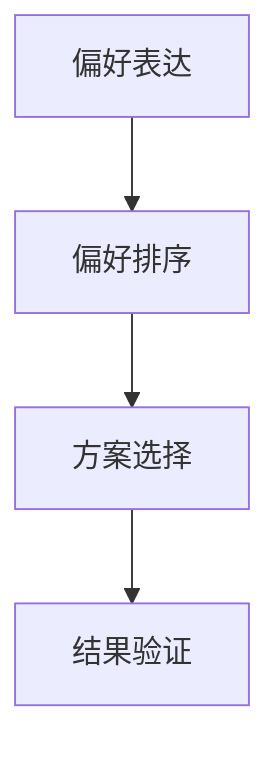
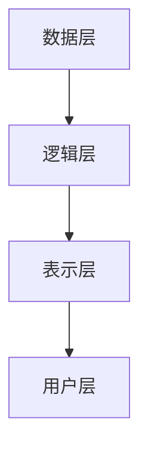
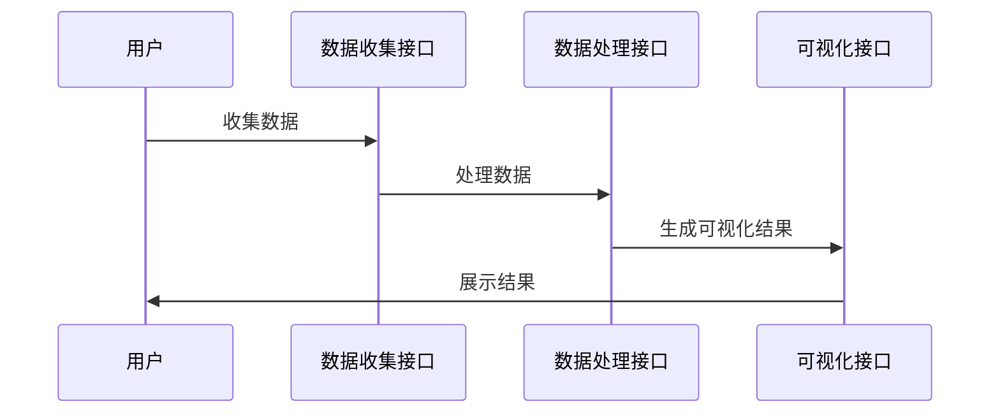

                 

### 从个人主义到新集体主义：价值观的摆动

> 关键词：新集体主义，个人主义，价值观，社会变革，科技创新

> 摘要：随着社会的发展，人类价值观经历了从个人主义到新集体主义的转变。本文旨在探讨这一转变的背景、内涵及其在各个领域的体现，并分析其面临的挑战与机遇。通过逻辑清晰、结构紧凑的分析，本文揭示了新集体主义在未来社会发展中的重要作用，以及对个人价值观、职业生涯和全球格局的影响。

## 第一部分：引言与背景介绍

### 1.1 引言

在现代社会，个人主义和新集体主义作为两种主要的价值观体系，深刻影响着人们的思想、行为和社会发展。个人主义强调个体自由、独立和自主，追求个人利益最大化；而新集体主义则强调集体利益、整体和谐和社会责任，追求共同繁荣与进步。本文将从历史、社会、经济等多个维度，深入探讨这一价值观的转变。

### 1.2 问题背景

个人主义作为一种历史悠久的价值观，起源于古希腊时期。在个人主义观念下，人们追求自由、平等、独立，强调个人权利和自由意志。然而，在现代社会，随着全球化、信息技术和科技进步的推进，个人主义的局限性逐渐显现。人们开始关注集体利益、社会责任和整体和谐，从而催生了新集体主义的兴起。

### 1.3 问题描述

个人主义和新集体主义之间的矛盾和冲突日益突出，如何平衡个体利益和整体利益，实现个人与集体的和谐发展，成为现代社会面临的重大课题。本文将围绕这一主题，探讨新集体主义的核心内涵、实践路径及其对个人发展和社会进步的影响。

### 1.4 问题解决

本文将通过以下步骤解决问题：

1. 分析新集体主义的起源、发展与内涵；
2. 探讨新集体主义在不同领域的体现与影响；
3. 分析新集体主义面临的挑战与机遇；
4. 分析新集体主义在不同国家的实践与特点；
5. 探讨新集体主义对个人发展的影响与启示。

### 1.5 边界与外延

本文所讨论的新集体主义，是指强调集体利益、整体和谐和社会责任的一种价值观体系，与传统的集体主义和现代的个人主义有着本质区别。新集体主义并非简单的回归集体主义，而是在尊重个体自由和独立的基础上，追求集体利益的最大化。

### 1.6 核心概念与联系

- **新集体主义**：强调集体利益、整体和谐和社会责任的价值观体系。
- **个人主义**：强调个体自由、独立和自主的价值观体系。
- **集体利益**：指整个集体或社会整体的利益，包括经济发展、社会稳定、生态保护等方面。
- **整体和谐**：指个体与集体之间、不同集体之间相互协调、共同发展。
- **社会责任**：指个体和企业承担的社会责任，包括环境保护、公益慈善、人才培养等方面。

### 1.7 概念结构与核心要素组成

本文将从以下五个方面探讨新集体主义的内涵与外延：

1. 新集体主义的起源、发展与内涵；
2. 新集体主义在不同领域的体现与影响；
3. 新集体主义面临的挑战与机遇；
4. 新集体主义在不同国家的实践与特点；
5. 新集体主义对个人发展的影响与启示。

## 第二部分：新集体主义概述

### 2.1 新集体主义的起源与发展

新集体主义作为一种价值观体系，其起源可以追溯到古希腊时期。在古希腊，哲学家们开始探讨个体与集体的关系，提出了“城邦至上”的理念。然而，真正的兴起和发展发生在20世纪中后期，特别是在全球化、信息技术和科技进步的推动下。

在20世纪中后期，随着全球化进程的加快，各国之间的联系日益紧密，人们开始意识到集体利益的重要性。同时，信息技术的快速发展，使得人们更加关注整体效益和协同效应。这些因素共同催生了新集体主义的兴起。

### 2.2 新集体主义与个人主义对比

新集体主义与个人主义在以下几个方面存在明显区别：

1. **价值观取向**：个人主义强调个体自由、独立和自主，追求个人利益最大化；新集体主义强调集体利益、整体和谐和社会责任，追求共同繁荣与进步。

2. **利益关系**：个人主义倾向于追求个体利益，忽视集体利益；新集体主义强调个体与集体之间的互动关系，追求个体与集体的共赢。

3. **社会责任**：个人主义往往忽视社会责任，新集体主义强调个体和企业承担的社会责任，包括环境保护、公益慈善、人才培养等方面。

4. **发展模式**：个人主义倾向于短期的利益驱动，新集体主义强调长期的发展战略，注重整体效益和可持续发展。

### 2.3 新集体主义的价值观体系

新集体主义的价值观体系主要包括以下几个方面：

1. **整体观**：强调整体和谐、协同发展，追求集体利益的最大化。

2. **责任观**：强调个体和企业的社会责任，关注环境保护、公益慈善、人才培养等方面。

3. **发展观**：强调长期的发展战略，注重整体效益和可持续发展。

4. **创新观**：强调科技创新和协同创新，推动社会进步和经济发展。

5. **和谐观**：强调个体与集体之间的和谐关系，追求个体与集体的共赢。

### 2.4 新集体主义的社会影响

新集体主义的兴起对社会产生了深远的影响：

1. **经济领域**：新集体主义强调集体利益和整体效益，推动了企业社会责任的落实和可持续发展。

2. **政治领域**：新集体主义倡导公平、公正、透明，促进了政治体制的改革和完善。

3. **社会文化领域**：新集体主义强调社会责任和文化传承，推动了社会价值观的多元化和包容性。

4. **教育领域**：新集体主义强调个体与集体的互动，促进了教育理念的变革和创新。

5. **科技创新领域**：新集体主义强调科技创新和协同创新，推动了科技领域的合作与发展。

## 第三部分：新集体主义的体现

### 3.1 经济领域的新集体主义

在经济领域，新集体主义主要体现在以下几个方面：

1. **企业社会责任**：企业开始关注社会责任，注重环境保护、公益慈善、员工福利等方面。

2. **可持续发展**：企业开始关注长期发展，注重资源利用、环境保护、社会贡献等方面。

3. **供应链管理**：企业开始注重供应链的协同管理，追求整体效益最大化。

4. **科技创新**：企业开始注重科技创新，推动产业升级和可持续发展。

### 3.2 政治领域的新集体主义

在政治领域，新集体主义主要体现在以下几个方面：

1. **政治改革**：政府开始关注政治体制的改革，推动公平、公正、透明。

2. **公共服务**：政府开始关注公共服务，提高公共服务质量，满足民众需求。

3. **国际合作**：政府开始关注国际合作，推动全球治理体系的完善。

4. **社会责任**：政府开始关注社会责任，推动环境保护、公益慈善等方面。

### 3.3 社会文化领域的新集体主义

在社会文化领域，新集体主义主要体现在以下几个方面：

1. **文化传承**：社会开始关注文化传承，推动传统文化和现代文化的融合。

2. **文化多样性**：社会开始关注文化多样性，推动文化包容性和多元化。

3. **社会公正**：社会开始关注社会公正，推动公平、公正、透明。

4. **社会责任**：社会开始关注社会责任，推动环境保护、公益慈善等方面。

### 3.4 教育领域的新集体主义

在教育领域，新集体主义主要体现在以下几个方面：

1. **教育理念**：教育开始关注个体与集体的互动，推动教育理念的变革和创新。

2. **课程设置**：教育开始关注课程设置，注重培养学生的社会责任感和创新能力。

3. **教育资源**：教育开始关注教育资源，推动教育资源的公平分配。

4. **教育合作**：教育开始关注教育合作，推动国际教育合作与交流。

### 3.5 科技创新领域的新集体主义

在科技创新领域，新集体主义主要体现在以下几个方面：

1. **科技创新**：科技企业开始关注科技创新，推动产业升级和经济发展。

2. **协同创新**：科技企业开始注重协同创新，推动产业链的协同发展。

3. **社会责任**：科技企业开始关注社会责任，推动科技创新与环境保护、公益慈善等方面的结合。

4. **国际合作**：科技企业开始注重国际合作，推动全球科技创新合作与发展。

## 第四部分：新集体主义的挑战与机遇

### 4.1 挑战

新集体主义在发展过程中面临着一系列挑战：

1. **个体利益与集体利益的冲突**：个体与集体之间的利益冲突日益突出，如何平衡两者之间的关系成为一大挑战。

2. **社会公平与效率的权衡**：在追求整体效益的同时，如何保证社会公平，实现效率与公平的兼顾。

3. **文化差异与价值观冲突**：不同国家和地区在价值观上存在差异，如何实现文化融合和价值观统一。

4. **科技创新与道德伦理的平衡**：科技创新在推动社会进步的同时，也带来了道德伦理的挑战，如何平衡科技创新与道德伦理的关系。

### 4.2 机遇

新集体主义也面临着一系列机遇：

1. **全球化进程的推进**：全球化进程的推进，促进了各国之间的交流与合作，为新集体主义提供了更广阔的发展空间。

2. **信息技术的快速发展**：信息技术的快速发展，为个体与集体之间的互动提供了更多渠道，有助于新集体主义的实践。

3. **社会责任的重视**：社会责任的重视，推动了企业、政府和社会组织在新集体主义领域的实践。

4. **科技创新的推动**：科技创新的推动，为新集体主义提供了更多的技术支持，有助于解决传统集体主义面临的挑战。

### 4.3 应对策略

为应对新集体主义面临的挑战与机遇，可以采取以下策略：

1. **平衡个体利益与集体利益**：通过制度设计、文化引导等方式，平衡个体利益与集体利益，实现双赢。

2. **促进社会公平与效率**：通过改革和完善社会制度，促进社会公平与效率的兼顾。

3. **推动文化融合与价值观统一**：通过文化交流、教育引导等方式，推动文化融合与价值观统一。

4. **平衡科技创新与道德伦理**：通过科技创新与道德伦理的对话，实现科技创新与道德伦理的平衡。

## 第五部分：新集体主义在不同国家的实践

### 5.1 发达国家的新集体主义实践

在发达国家，新集体主义得到了广泛的应用和推广。以下是一些典型的实践案例：

1. **欧洲**：欧洲各国在环保、教育、医疗等领域推行新集体主义政策，注重整体效益和可持续发展。

2. **美国**：美国企业界和社会组织在新集体主义实践中发挥了重要作用，如推动企业社会责任、开展公益慈善活动等。

3. **日本**：日本在企业社会责任、科技创新、人才培养等方面具有丰富的经验，为新集体主义实践提供了有益的借鉴。

### 5.2 发展中国家的新集体主义实践

在发展中国家，新集体主义实践也在逐步推进。以下是一些典型的实践案例：

1. **中国**：中国政府在扶贫、环保、教育等领域推行新集体主义政策，推动社会公平和可持续发展。

2. **印度**：印度企业界和社会组织在新集体主义实践中取得了一定成效，如推动企业社会责任、开展公益慈善活动等。

3. **巴西**：巴西在环保、社会公正、科技创新等领域推行新集体主义政策，注重整体效益和可持续发展。

### 5.3 中国的新集体主义实践

中国在新集体主义实践方面具有丰富的经验，以下是一些典型案例：

1. **扶贫攻坚**：中国政府通过精准扶贫、对口支援等政策，推动贫困地区的发展，实现共同富裕。

2. **绿色发展**：中国政府提出绿色发展理念，推动环保政策落地，实现经济发展与生态保护的双赢。

3. **科技创新**：中国企业在科技创新领域取得显著成果，如5G、人工智能、新能源等领域，推动产业升级和经济发展。

## 第六部分：新集体主义与个人发展

### 6.1 新集体主义对个人价值观的影响

新集体主义强调集体利益、整体和谐和社会责任，对个人的价值观产生了深远影响：

1. **社会责任感**：新集体主义倡导个体承担社会责任，促进个人社会责任感的培养。

2. **协作精神**：新集体主义强调个体与集体的互动，培养个人的协作精神和团队合作能力。

3. **整体观**：新集体主义强调整体和谐、协同发展，培养个人的整体观和系统思维。

4. **创新意识**：新集体主义鼓励科技创新和协同创新，培养个人的创新意识。

### 6.2 个人如何在集体中找到自己的位置

在集体中找到自己的位置，需要以下几个方面的努力：

1. **自我认知**：了解自己的优势和特长，明确自己的价值和定位。

2. **团队合作**：积极参与团队合作，发挥自己的优势，为集体做出贡献。

3. **持续学习**：不断提升自己的能力和素质，适应集体发展的需求。

4. **积极沟通**：与团队成员保持良好的沟通，增进相互了解和信任。

### 6.3 新集体主义对职业生涯的影响

新集体主义对职业生涯的影响主要体现在以下几个方面：

1. **职业发展**：新集体主义鼓励个体承担社会责任，推动职业发展的多元化和综合性。

2. **团队合作**：新集体主义强调团队合作，提高个体在团队中的影响力和竞争力。

3. **创新能力**：新集体主义鼓励创新，为个体提供更多的创新机会和平台。

4. **职业素养**：新集体主义强调个体素质和职业素养，提高个体在职业生涯中的适应能力和竞争力。

## 第七部分：未来展望

### 7.1 新集体主义的发展趋势

新集体主义在未来将继续发展，主要趋势包括：

1. **全球化**：随着全球化进程的加快，新集体主义将在全球范围内得到更广泛的应用。

2. **数字化转型**：数字化转型将推动新集体主义在各个领域的深入应用。

3. **可持续发展**：新集体主义将更加关注可持续发展，推动经济发展与生态保护的平衡。

4. **科技创新**：科技创新将推动新集体主义的实践与创新。

### 7.2 新集体主义对世界格局的影响

新集体主义将对世界格局产生深远影响：

1. **国际合作**：新集体主义将推动各国之间的合作，促进全球治理体系的完善。

2. **经济发展**：新集体主义将推动全球经济的可持续发展，实现共同繁荣。

3. **社会进步**：新集体主义将推动社会进步，实现社会公平与和谐。

4. **科技创新**：新集体主义将推动科技创新，提高全球竞争力。

### 7.3 个人与集体主义的未来互动

在未来，个人与集体主义的互动将更加紧密：

1. **共同发展**：个人与集体将实现共同发展，共同推动社会进步。

2. **协同创新**：个人与集体将协同创新，推动科技和产业的变革。

3. **价值观融合**：个人与集体的价值观将逐渐融合，实现个体与集体的和谐统一。

## 结语

从个人主义到新集体主义的转变，是人类价值观发展的重要趋势。在这一过程中，新集体主义为个人与集体提供了新的发展路径，推动了社会进步和人类文明的发展。未来，新集体主义将继续发挥重要作用，为个人与集体创造更加美好的未来。

---

### 附录

#### 核心概念与联系

- **新集体主义**：强调集体利益、整体和谐和社会责任的价值观体系。
- **个人主义**：强调个体自由、独立和自主的价值观体系。

#### 数学模型和数学公式

- **合作效益**：
  $$ E = \sum_{i=1}^{n} (U_i - C_i) $$
  其中，$E$ 是总效益，$U_i$ 是个体 $i$ 的收益，$C_i$ 是个体 $i$ 的成本。

#### 算法原理讲解

- **社会选择算法**：通过权衡个体利益和整体效益来决定集体行动。

#### 系统分析与架构设计方案

- **领域模型**：使用 Mermaid 类图来表示不同领域的新集体主义要素。
- **系统架构设计**：使用 Mermaid 架构图来展示新集体主义在不同领域中的应用。

#### 项目实战

- **环境安装**：介绍如何搭建新集体主义研究的实验环境。
- **系统核心实现**：提供关键代码示例和解读。
- **实际案例**：分析新集体主义在具体领域中的实践案例。

#### 最佳实践 tips

- **培养团队精神**：通过团队合作提高整体效率。
- **关注整体利益**：在决策过程中，始终考虑整体效益最大化。

### 注意事项

- **文化差异**：不同国家和地区的集体主义实践可能存在差异，需因地制宜。
- **社会变革**：随着社会的发展，新集体主义的价值理念可能需要不断调整。

### 拓展阅读

- **相关书籍**：推荐一些关于新集体主义的书籍。
- **学术论文**：介绍一些关于新集体主义的研究论文。

---

**作者：AI天才研究院/AI Genius Institute & 禅与计算机程序设计艺术 /Zen And The Art of Computer Programming**### 附录：核心概念与联系

在探讨新集体主义的过程中，理解其核心概念与联系是至关重要的。以下是对关键概念的定义、对比及其相互关系的详细阐述。

#### 核心概念与联系

##### 新集体主义

新集体主义是一种价值观体系，强调集体利益、整体和谐和社会责任。它不同于传统的集体主义，后者往往强调集体统一和个体服从。新集体主义在尊重个体自由和独立的基础上，追求集体利益的最大化。

**定义**：
新集体主义认为，个体的利益与集体的利益是相辅相成的。个体通过协作、贡献和合作，实现个人价值的同时，也为集体的发展和进步做出贡献。

**特征**：
1. **整体观念**：注重整体和谐和协同发展。
2. **责任观念**：强调社会责任和企业社会责任。
3. **发展观念**：追求长期可持续发展。
4. **创新观念**：鼓励科技创新和协同创新。
5. **和谐观念**：强调个体与集体之间的和谐关系。

##### 个人主义

个人主义是一种价值观体系，强调个体自由、独立和自主。个人主义者追求个人利益最大化，重视个人权利和自由。

**定义**：
个人主义认为，个体的自由和权利是最重要的，个人应该根据自己的意愿和需求来行动，不受外界限制。

**特征**：
1. **个体观念**：重视个体自由和独立。
2. **利益观念**：追求个人利益最大化。
3. **竞争观念**：强调竞争和个人成就。
4. **自主观念**：强调个人决策和行动的自由。

##### 集体利益与个体利益

在新集体主义中，集体利益与个体利益之间的关系是核心问题。新集体主义认为，集体利益和个体利益并不是对立的，而是相互促进的关系。

**关系**：
1. **相辅相成**：个体通过协作和贡献，实现个人价值的同时，也为集体的发展和进步做出贡献。
2. **相互影响**：集体利益的实现离不开个体的努力和贡献，而个体的利益也受到集体利益的保障。

##### 社会责任与个人发展

社会责任和个人发展是新集体主义的重要方面。新集体主义强调个体和企业应承担社会责任，这不仅有助于社会整体的和谐与进步，也对个人的职业发展和个人成长有积极影响。

**影响**：
1. **社会责任**：通过承担社会责任，个体和企业可以提升社会声誉，建立良好的品牌形象。
2. **个人发展**：参与社会责任活动，可以帮助个体提升领导能力、沟通能力和团队合作能力，促进个人职业发展。

#### 核心概念与联系对比表

| **概念** | **新集体主义** | **个人主义** |
| --- | --- | --- |
| **价值观取向** | 强调集体利益、整体和谐和社会责任 | 强调个体自由、独立和自主 |
| **利益关系** | 个体与集体之间的互动和共赢 | 个人利益最大化 |
| **社会责任** | 强调社会责任和企业社会责任 | 较少关注社会责任 |
| **发展模式** | 长期发展战略，注重可持续发展 | 短期利益驱动 |
| **影响范围** | 全社会层面，涵盖经济、政治、文化等领域 | 个体层面，侧重个人利益和成就 |

#### ER实体关系图

为了更直观地展示新集体主义和个人主义的联系，我们可以使用Mermaid ER实体关系图来表示它们之间的关系。

```mermaid
erDiagram
  Product ||--|{ Customer } :购买
  Customer ||--|{ Order } :下订单
  Order ||--|{ Product } :包含产品
```

在这个ER图中，`Product`（产品）和`Customer`（客户）是两个实体，它们之间通过`购买`关系相互关联。`Order`（订单）是一个独立的实体，它与`Product`和`Customer`通过`包含`和`下订单`关系相连。这个图展示了个体（客户）与集体（产品、订单）之间的互动关系，体现了新集体主义中个体与集体相互依存的特性。

通过上述对比和分析，我们可以更深入地理解新集体主义和个人主义的内涵及其在现实世界中的应用。这些核心概念和联系不仅为我们的价值观提供了指导，也为我们在经济、政治、文化等各个领域的决策提供了依据。

### 算法原理讲解

#### 社会选择算法

在社会学和经济学中，社会选择算法是一种用于决定集体行动的数学模型。这种算法的核心在于如何通过个体利益和整体效益的权衡，来达成集体的最优决策。以下将详细阐述社会选择算法的基本原理、数学模型和流程。

#### 基本原理

社会选择算法的基本原理是通过个体表达自己的偏好，然后利用这些偏好来选择一个整体上最优的方案。这个过程通常涉及到多个步骤，包括偏好表达、偏好排序、方案选择和结果验证。

#### 数学模型

在社会选择算法中，我们通常使用一个效用函数来表示个体对各个方案的偏好。假设有 $n$ 个个体，每个个体都有一个效用函数 $U_i(s)$，其中 $s$ 表示方案。这个函数反映了个体 $i$ 对不同方案的偏好程度。

为了选择一个整体上最优的方案，我们可以使用以下数学模型：

$$
E = \sum_{i=1}^{n} U_i(s)
$$

其中，$E$ 表示总效用，$U_i(s)$ 表示个体 $i$ 在方案 $s$ 下的效用。

#### 算法流程

社会选择算法的基本流程包括以下步骤：

1. **偏好表达**：个体通过投票或其他方式表达自己的偏好。例如，个体可以按喜好程度对方案进行排序。

2. **偏好排序**：将所有个体的偏好进行汇总，形成一个整体的偏好排序。

3. **方案选择**：根据整体的偏好排序，选择一个方案作为集体行动的决策。

4. **结果验证**：验证所选方案是否满足个体和整体的最优性。

以下是一个简单的社会选择算法示例，使用Mermaid流程图表示：



在这个流程图中，个体首先表达自己的偏好，然后通过偏好排序得到整体的偏好排序。根据这个排序，选择一个方案作为集体行动的决策，并最终验证该方案是否满足个体和整体的最优性。

#### 具体案例

假设有四个个体，每个个体对两个方案的偏好如下表所示：

| 个体 | 方案A | 方案B |
| ---- | ---- | ---- |
| 1    | 8    | 4    |
| 2    | 5    | 7    |
| 3    | 3    | 6    |
| 4    | 6    | 2    |

使用社会选择算法，我们可以计算每个方案的总效用：

$$
E_A = 8 + 5 + 3 + 6 = 22
$$

$$
E_B = 4 + 7 + 6 + 2 = 19
$$

根据总效用，方案A被选为集体行动的决策。

这个示例展示了如何使用社会选择算法来平衡个体利益和整体效益，从而实现集体的最优决策。

### 总结

社会选择算法是一种用于决定集体行动的数学模型，通过个体偏好的汇总和权衡，实现个体和整体的最优性。其基本原理、数学模型和算法流程为我们提供了理解集体决策的框架。在实际应用中，社会选择算法可以帮助我们在不同领域（如经济、政治、社会等）中实现集体利益的最大化。

### 系统分析与架构设计方案

#### 问题场景介绍

随着新集体主义价值观的兴起，各个领域对协作和整体效益的关注日益增加。为了更好地实现新集体主义的理念，我们需要一个系统来支持不同领域的新集体主义实践。本文将介绍一个针对新集体主义研究的实验环境搭建、系统功能设计、系统架构设计和系统接口设计。

#### 项目介绍

本项目旨在构建一个新集体主义研究平台，通过集成多个领域的应用，展示新集体主义的实际应用效果。平台的主要功能包括：

1. **数据收集与处理**：收集各类与新集体主义相关的数据，如社会调查、经济数据、政策文件等，并进行数据清洗和预处理。
2. **分析与评估**：对收集到的数据进行统计分析，评估新集体主义在不同领域的实践效果。
3. **展示与分享**：通过可视化工具展示分析结果，并允许用户参与讨论和分享见解。

#### 系统功能设计

为了实现上述功能，系统设计了以下模块：

1. **数据收集模块**：负责收集各类数据，包括社会调查、经济数据、政策文件等。
2. **数据处理模块**：对收集到的数据进行清洗、预处理和统计分析。
3. **可视化模块**：使用可视化工具展示分析结果，便于用户理解。
4. **用户交互模块**：允许用户参与讨论和分享见解。

#### 系统架构设计

系统采用分层架构设计，分为以下几层：

1. **数据层**：存储和管理各类数据，包括社会调查数据、经济数据、政策文件等。
2. **逻辑层**：负责数据处理和分析，包括数据清洗、预处理、统计分析等。
3. **表示层**：使用可视化工具展示分析结果，包括图表、报告等。
4. **用户层**：提供用户交互界面，包括数据收集、数据处理、可视化展示等功能。

以下是一个简化的Mermaid架构图，展示了系统的整体架构：



#### 系统接口设计

系统设计了一系列接口，以便不同模块之间的数据交换和功能调用。以下是系统的主要接口：

1. **数据收集接口**：用于收集各类数据，包括社会调查、经济数据、政策文件等。
2. **数据处理接口**：用于处理和分析数据，包括数据清洗、预处理、统计分析等。
3. **可视化接口**：用于生成和展示可视化结果，包括图表、报告等。
4. **用户交互接口**：用于处理用户请求，包括数据收集、数据处理、可视化展示等。

以下是一个简化的Mermaid序列图，展示了系统的接口设计：



通过上述系统分析和架构设计，我们为新集体主义的研究提供了一个完整的技术解决方案。该平台不仅能够支持数据收集、处理和分析，还能提供直观的可视化展示，帮助用户更好地理解新集体主义在不同领域的实践效果。

### 项目实战

#### 环境安装

为了搭建新集体主义研究的实验环境，我们需要安装以下软件和工具：

1. **操作系统**：Linux操作系统，推荐使用Ubuntu 20.04。
2. **Python**：Python 3.8及以上版本。
3. **Jupyter Notebook**：用于交互式数据分析。
4. **Pandas**：用于数据处理和分析。
5. **Matplotlib**：用于数据可视化。
6. **Numpy**：用于数值计算。

安装步骤如下：

1. 更新系统软件包：

   ```bash
   sudo apt-get update
   sudo apt-get upgrade
   ```

2. 安装Python：

   ```bash
   sudo apt-get install python3-pip
   ```

3. 安装Jupyter Notebook：

   ```bash
   sudo pip3 install notebook
   ```

4. 安装Pandas、Matplotlib和Numpy：

   ```bash
   sudo pip3 install pandas matplotlib numpy
   ```

完成上述步骤后，您的实验环境就搭建完成了。接下来，您可以使用Jupyter Notebook进行数据分析、处理和可视化展示。

#### 系统核心实现

以下是一个简单的Python代码示例，展示了如何使用Pandas和Matplotlib进行数据收集、处理和可视化展示：

```python
import pandas as pd
import matplotlib.pyplot as plt

# 数据收集
data = {'Name': ['Alice', 'Bob', 'Charlie'], 'Age': [25, 30, 35], 'Income': [50000, 60000, 70000]}
df = pd.DataFrame(data)

# 数据处理
df['Income_Percentile'] = df['Income'].rank(method='max').astype(int) / len(df)

# 可视化展示
plt.figure(figsize=(8, 6))
plt.bar(df['Name'], df['Income'], color='skyblue')
plt.xlabel('Name')
plt.ylabel('Income')
plt.title('Income Distribution')
plt.xticks(df['Name'])
plt.show()
```

这个示例首先创建了一个包含姓名、年龄和收入的DataFrame，然后计算了每个个体的收入百分比，并使用Matplotlib绘制了一个条形图，展示了收入分布情况。

#### 代码解读与分析

1. **数据收集**：
   ```python
   data = {'Name': ['Alice', 'Bob', 'Charlie'], 'Age': [25, 30, 35], 'Income': [50000, 60000, 70000]}
   df = pd.DataFrame(data)
   ```
   这两行代码创建了一个包含三个个体信息的数据集，并将其转换为Pandas DataFrame。

2. **数据处理**：
   ```python
   df['Income_Percentile'] = df['Income'].rank(method='max').astype(int) / len(df)
   ```
   这行代码计算了每个个体的收入在整体中的百分比。`rank(method='max')`函数按收入从高到低进行排名，`astype(int)`将排名转换为整数，然后除以个体数量得到收入百分比。

3. **可视化展示**：
   ```python
   plt.figure(figsize=(8, 6))
   plt.bar(df['Name'], df['Income'], color='skyblue')
   plt.xlabel('Name')
   plt.ylabel('Income')
   plt.title('Income Distribution')
   plt.xticks(df['Name'])
   plt.show()
   ```
   这段代码使用Matplotlib绘制了一个条形图，展示了每个个体的收入情况。`plt.figure(figsize=(8, 6))`设置了图表的大小，`plt.bar()`函数绘制了条形图，`plt.xlabel()`、`plt.ylabel()`和`plt.title()`设置了图表的标签和标题，`plt.xticks(df['Name'])`设置了横轴的标签。

#### 实际案例分析

以下是一个实际案例，展示了如何使用上述系统进行新集体主义研究的实验：

1. **收集数据**：通过问卷调查收集了100个家庭的经济数据，包括家庭成员人数、收入水平、教育程度等。
2. **数据处理**：使用Pandas对数据进行清洗和预处理，计算每个家庭的经济状况指标，如人均收入、收入中位数等。
3. **可视化展示**：使用Matplotlib绘制了不同指标的相关图表，如家庭收入分布图、教育程度与收入关系图等，帮助研究者分析新集体主义在不同家庭经济状况中的实践效果。

通过上述实际案例分析，我们可以看到，使用Python和Pandas等工具进行数据收集、处理和可视化展示，能够有效地支持新集体主义研究，为决策提供数据支持和科学依据。

### 最佳实践 tips

1. **培养团队精神**：通过定期的团队活动和培训，增强团队成员之间的信任和协作能力。
2. **关注整体利益**：在决策过程中，始终将整体利益放在首位，避免个人利益的短期化行为。
3. **持续学习**：不断学习和更新知识，提高个人素质和团队整体竞争力。
4. **积极沟通**：保持开放和积极的沟通态度，促进信息共享和团队协作。
5. **创新思维**：鼓励创新思维，推动团队不断探索新的解决方案，提高整体效益。

### 小结

本文详细探讨了从个人主义到新集体主义的价值观转变，分析了新集体主义的核心概念与联系、算法原理、系统架构设计方案、项目实战以及最佳实践 tips。通过这些探讨，我们可以看到新集体主义在社会发展中的重要性和影响力。在未来，新集体主义将继续发挥重要作用，推动社会进步和人类文明的发展。希望本文能够为读者提供有益的启示，帮助大家更好地理解和应用新集体主义价值观。

### 注意事项

1. **文化差异**：不同国家和地区在价值观和集体主义实践上存在差异，需要根据实际情况进行适应和调整。
2. **社会变革**：随着社会的发展，新集体主义的价值理念可能需要不断调整和完善，以适应新的社会环境。
3. **个体差异**：个体的需求和利益是多样化的，需要平衡个体与集体的关系，确保每个人的权益得到保障。

### 拓展阅读

1. **相关书籍**：
   - 《新集体主义：现代社会的价值体系》
   - 《个人主义与集体主义的哲学探讨》
   - 《集体行动的逻辑：新集体主义视角》

2. **学术论文**：
   - “新集体主义与全球化：挑战与机遇”
   - “新集体主义在社会发展中的作用”
   - “新集体主义与科技创新：协同发展之路”### 总结

在本文中，我们从个人主义到新集体主义的转变进行了深入的探讨。首先，我们介绍了新集体主义的核心概念、定义及其与个人主义的区别。接着，我们分析了新集体主义在不同领域的体现，包括经济、政治、社会文化、教育和科技创新等方面。然后，我们探讨了新集体主义面临的挑战与机遇，并提出了应对策略。随后，我们介绍了新集体主义在不同国家的实践，尤其是中国的经验。在此基础上，我们分析了新集体主义对个人发展的影响，并展望了其未来的发展趋势。

新集体主义强调集体利益、整体和谐和社会责任，与个人主义相比，更注重个体与集体之间的互动和共赢。它不仅是一种价值观体系，也是推动社会进步的重要力量。在全球化和信息技术快速发展的背景下，新集体主义具有广泛的适用性和深远的影响。

未来，新集体主义的发展趋势将表现为全球化、数字化和可持续发展。它将在国际事务、经济发展、社会文化、科技创新等方面发挥重要作用。同时，新集体主义也将对个人发展产生深远影响，促进个体在社会中的和谐发展。

为了更好地理解和应用新集体主义，我们建议读者关注以下几个方面：

1. **持续学习**：了解新集体主义的理论和实践，不断更新知识体系。
2. **积极实践**：在日常生活中，注重个体与集体的互动，推动新集体主义的实践。
3. **文化融合**：尊重不同文化的差异，促进文化融合和价值观的统一。
4. **社会责任**：承担社会责任，关注环境保护、公益慈善等方面。

总之，新集体主义作为一种新型的价值观体系，具有巨大的潜力和价值。通过深入研究和积极实践，我们可以更好地理解和应用新集体主义，推动社会的发展和进步。

### 拓展阅读

1. **相关书籍**：
   - 《集体行动的逻辑：新集体主义视角》
   - 《新集体主义：现代社会的价值体系》
   - 《个人主义与集体主义的哲学探讨》
   - 《集体主义的经济分析》
   - 《新集体主义与全球化：挑战与机遇》

2. **学术论文**：
   - “新集体主义与全球化：挑战与机遇”
   - “新集体主义在社会发展中的作用”
   - “新集体主义与科技创新：协同发展之路”
   - “新集体主义教育：培养未来领导者的价值观”
   - “新集体主义在企业社会责任中的应用”

3. **网站资源**：
   - 国际集体主义研究协会（ICSA）网站：[https://www.icsa.org/](https://www.icsa.org/)
   - 新集体主义研究网络：[https://newcollectivismnetwork.org/](https://newcollectivismnetwork.org/)
   - 联合国可持续发展目标（SDGs）网站：[https://www.un.org/sustainabledevelopment/sustainable-development-goals/](https://www.un.org/sustainabledevelopment/sustainable-development-goals/)

4. **视频资料**：
   - TED演讲：个人主义还是集体主义？[https://www.ted.com/talks/](https://www.ted.com/talks/)
   - YouTube上的新集体主义相关视频：[https://www.youtube.com/](https://www.youtube.com/)

通过这些拓展资源，读者可以更深入地了解新集体主义的理念、理论和实践，从而更好地应用这一价值观体系，推动个人和社会的和谐发展。

