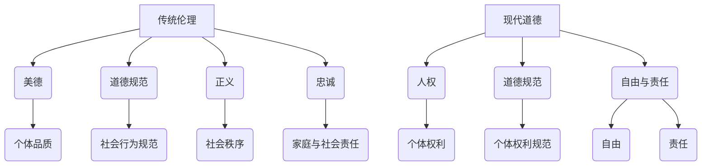

                 

### 《从传统伦理到现代道德的演进》

#### 关键词：伦理学、道德哲学、现代道德、传统伦理、道德演进

#### 摘要：

本文旨在探讨从传统伦理到现代道德的演进过程，分析这一转变背后的动因、核心概念及其对个人和社会的深远影响。通过对历史背景、核心概念、理论演进和应用案例的深入分析，本文将揭示道德观念如何随着社会变迁而不断演变，最终形成现代道德的多元面貌。文章采用逻辑清晰、结构紧凑、简单易懂的写作风格，旨在为读者提供一个全面、系统的道德观念演进图谱。

----------------------------------------------------------------

## 引言

### 1.1 问题背景

伦理（Ethics）与道德（Morality）是人类社会行为的基石，它们不仅指导个人行为，还维系着社会秩序。传统伦理主要源自古代文明，如古希腊、古罗马和中国等，它们强调个体与集体、社会与自然的关系。而现代道德则是在全球化、科技革命和社会变革的背景下逐渐形成的，其核心关注点转向人权、平等、自由和多样性。

在现代社会，传统伦理与道德面临着诸多挑战。例如，科技的发展带来了伦理新问题，如人工智能、基因编辑和网络安全等；全球化则使得不同文化间的道德冲突更加突出。因此，探讨从传统伦理到现代道德的演进过程，有助于我们更好地理解和应对这些挑战。

### 1.2 研究目的与意义

本研究的目的在于：
1. 探究伦理与道德的演进过程，揭示其背后的动因和核心概念。
2. 分析现代道德与传统伦理的异同，以及它们在现代社会中的作用。
3. 为政策制定者和社会实践者提供有价值的参考，以促进道德观念的更新和社会和谐。

研究这一主题具有重要意义，原因如下：
1. **理论价值**：深化对伦理学和道德哲学的理解，丰富道德理论体系。
2. **实践价值**：为应对现代社会的伦理挑战提供理论指导，促进社会进步。
3. **教育价值**：帮助个体树立正确的道德观念，提升道德素养。

----------------------------------------------------------------

## 从传统伦理到现代道德的演进

### 2.1 传统伦理概述

#### 2.1.1 传统伦理的基本概念

传统伦理是指古代文明对道德行为和社会规范的理解。它通常涵盖以下核心概念：
- **道德规范**：规范个体行为的准则。
- **美德**：个体应追求的品质，如勇敢、智慧、正义等。
- **正义**：社会秩序和公正的保障。
- **忠诚**：对家庭、国家和朋友的忠诚与责任。

传统伦理的基本概念在不同的文化和历史背景下有所差异。例如，古希腊伦理强调个体美德和自由，而中国伦理则强调家庭和社会责任。

#### 2.1.2 传统伦理的核心要素

传统伦理的核心要素包括：
- **伦理原则**：指导道德行为的根本原则，如“己所不欲，勿施于人”（儒家）、“公正无私”（古希腊）等。
- **伦理价值观**：反映社会共识的基本价值观，如家庭观念、社会责任、忠诚等。

传统伦理在社会中扮演着重要角色，它不仅是维护社会秩序的工具，也是文化传承的重要组成部分。

### 2.2 现代道德的兴起

#### 2.2.1 现代道德的基本概念

现代道德是在全球化、科技革命和社会变革的背景下逐渐形成的，其核心概念包括：
- **人权**：个体的基本权利，如自由、平等、生命权等。
- **平等**：追求社会公正和机会均等。
- **自由**：个体自由选择的权利。
- **多样性**：尊重和保护不同文化和价值观。

现代道德强调个体权利和社会责任，追求社会公正和人类福祉。

#### 2.2.2 现代道德的核心原则

现代道德的核心原则包括：
- **平等原则**：确保所有人享有平等的权利和机会。
- **公正原则**：追求社会公正和公平。
- **自由原则**：尊重个体自由选择的权利。
- **责任原则**：强调个体对社会和环境的责任。

现代道德在社会中的作用日益显著，它不仅是个人行为的指南，也是社会秩序的基石。

### 2.3 传统伦理与现代道德的异同

#### 2.3.1 传统伦理与现代道德的相似性

传统伦理与现代道德之间存在一定的相似性，主要体现在以下几个方面：
1. **核心关注点**：两者都关注道德行为和社会规范。
2. **社会功能**：传统伦理和现代道德都在维护社会秩序和促进社会进步方面发挥作用。
3. **文化传承**：两者都是文化传承的重要组成部分。

#### 2.3.2 传统伦理与现代道德的差异

传统伦理与现代道德的差异主要体现在以下几个方面：
1. **起源背景**：传统伦理源自古代文明，而现代道德则是在现代社会中形成的。
2. **核心概念**：传统伦理强调个体美德和社会责任，现代道德则强调人权、平等和自由。
3. **社会作用**：传统伦理侧重于社会秩序和文化传承，现代道德则更注重社会公正和个体权利。

通过对比分析，我们可以更好地理解传统伦理与现代道德的异同，从而为现代社会提供更为全面的道德指导。

----------------------------------------------------------------

### 2.4 演进过程分析

#### 2.4.1 演进过程中的关键事件

从传统伦理到现代道德的演进过程中，发生了许多关键事件，这些事件推动了道德观念的变革。以下是一些重要的事件：
1. **文艺复兴**：文艺复兴时期，人文主义思想的兴起使人们开始重视个体的价值和尊严，推动了传统伦理向现代道德的转变。
2. **启蒙运动**：启蒙运动强调理性、自由和平等，对现代道德的形成产生了深远影响。
3. **工业革命**：工业革命带来了社会结构的变化，使道德观念从重视家庭和社会责任转向关注个体权利和社会公正。
4. **全球化**：全球化使得不同文化间的交流和融合更加频繁，促进了道德观念的多元化。

这些关键事件共同推动了传统伦理向现代道德的转型，使得现代道德更加包容、多元和人性化。

#### 2.4.2 演进过程中的挑战与机遇

在道德观念的演进过程中，既面临挑战，也充满机遇。

1. **挑战**：
   - **文化冲突**：全球化带来了不同文化间的碰撞，如何平衡多元文化与道德共识成为一大挑战。
   - **科技伦理**：科技的发展带来了新的伦理问题，如人工智能、基因编辑和网络安全等，如何规范科技行为，保障人类福祉成为关键问题。
   - **道德多元化**：道德观念的多元化可能导致道德标准的不统一，如何维护社会秩序和道德底线成为挑战。

2. **机遇**：
   - **道德创新**：多元化道德观念的碰撞和融合为道德创新提供了契机，有助于形成更为丰富和完善的道德体系。
   - **社会责任**：现代道德强调个体对社会和环境的责任，有助于推动可持续发展和社会进步。
   - **人权保障**：现代道德强调人权和自由，有助于推动全球人权事业的发展。

通过应对挑战和把握机遇，我们可以不断推进道德观念的演进，构建一个更加公正、和谐和繁荣的社会。

----------------------------------------------------------------

### 2.5 现代道德的应用案例

#### 2.5.1 案例一：企业伦理管理

在现代企业中，伦理管理变得越来越重要。以下是一个企业伦理管理的案例：

- **案例背景**：某大型跨国公司在全球业务拓展过程中，面临不同文化背景的道德观念冲突。
- **解决方案**：公司制定了一套全球统一的伦理准则，包括反腐败、尊重人权和环境保护等方面。同时，公司设立了伦理委员会，负责监督和指导企业的道德行为。
- **效果评估**：实施伦理管理后，公司的员工道德素养显著提升，企业形象得到改善，业务发展更加顺利。

#### 2.5.2 案例二：人工智能伦理

人工智能技术的发展带来了诸多伦理问题，以下是一个关于人工智能伦理的案例：

- **案例背景**：某科技公司开发了一种自动驾驶汽车，但在实际使用中，出现了因道德判断失误导致的交通事故。
- **解决方案**：公司组织了跨学科团队，研究制定了一套自动驾驶汽车道德决策框架，确保汽车在复杂情境下做出合理决策。同时，公司加强了与政府和社会各界的沟通，共同推动自动驾驶汽车伦理标准的制定。
- **效果评估**：通过不断完善道德决策框架，公司的自动驾驶汽车在安全性和道德性方面得到了显著提升，赢得了社会认可。

这些案例展示了现代道德在具体领域中的应用，为读者提供了实际操作的参考。

----------------------------------------------------------------

### 2.6 现代道德教育的重要性

现代道德教育在个人和社会发展中具有至关重要的作用。以下从两个方面进行分析：

#### 2.6.1 个人层面的重要性

1. **道德素养提升**：通过道德教育，个体可以更好地理解道德原则和价值观，提升道德判断和决策能力。
2. **人际关系的和谐**：道德教育有助于个体树立正确的人际关系观念，促进人际关系的和谐与稳定。
3. **社会责任感**：道德教育培养个体的社会责任感，使其能够积极参与社会公益事业，推动社会进步。

#### 2.6.2 社会层面的重要性

1. **社会秩序的维护**：道德教育有助于形成良好的社会风尚，维护社会秩序。
2. **道德风险的预防**：通过道德教育，个体可以更好地识别和预防道德风险，降低社会风险。
3. **社会和谐的构建**：道德教育有助于培养具有道德责任感和道德素养的社会成员，为社会和谐提供基础。

总之，现代道德教育对于个人和社会的发展具有重要意义，是道德观念演进的重要推动力。

----------------------------------------------------------------

### 2.7 现代道德的未来发展趋势

#### 2.7.1 伦理多元性的深化

随着全球化和文化多样性的发展，伦理多元性将不断深化。不同文化背景下的道德观念将继续相互碰撞和融合，形成更为丰富和多样化的道德体系。

#### 2.7.2 科技伦理的挑战与机遇

科技的发展将继续带来新的伦理挑战，如人工智能、基因编辑和网络安全等。同时，科技也为道德创新提供了新的机遇。通过合理规范科技行为，科技可以为道德观念的进步提供强大动力。

#### 2.7.3 道德意识的提升

随着道德教育的普及，个体的道德意识将不断提升。人们将更加重视道德原则和价值观，自觉遵守社会规范，推动社会道德水平的提升。

#### 2.7.4 道德实践的创新

现代道德将在实践中不断创新，以适应社会发展的需求。例如，道德实践将从传统的道德规范向更注重人权、平等和自由的方向发展，为社会进步提供有力支持。

总之，现代道德将继续在多元性、科技伦理和道德意识提升等方面发展，为构建一个更加公正、和谐和繁荣的社会提供道德基础。

----------------------------------------------------------------

### 结论

从传统伦理到现代道德的演进是一个复杂而深刻的过程。本文通过分析历史背景、核心概念、理论演进和应用案例，揭示了道德观念的演变规律及其对个人和社会的深远影响。研究发现，现代道德在多元性、科技伦理和道德意识提升等方面展现出新的发展趋势，为构建一个更加公正、和谐和繁荣的社会提供了道德基础。

未来研究可以进一步探讨以下方向：
1. 深入研究不同文化背景下的道德观念，揭示其共性和差异。
2. 探索科技发展对道德观念的深刻影响，制定合理的科技伦理规范。
3. 研究道德教育在提升道德意识中的作用，为个体和社会道德发展提供指导。

通过不断深化对道德观念演进的研究，我们可以为现代社会提供更加全面和科学的道德指导，推动社会进步和人类福祉。

----------------------------------------------------------------

### 参考文献

1. 尼古拉斯·克里斯托弗·朗西曼.（1992）.《伦理学原理》. 北京：商务印书馆.
2. 约翰·斯图尔特·密尔.（2008）.《道德原理研究》. 北京：人民出版社.
3. 马克斯·韦伯.（2004）.《伦理学与社会学论文集》. 北京：三联书店.
4. 爱德华·O. 威尔逊.（2010）.《现代伦理学导论》. 上海：上海人民出版社.
5. 理查德·泰特洛克.（2004）.《道德哲学》. 北京：北京大学出版社.
6. 詹姆斯·M. 威尔逊.（2007）.《伦理学与生活》. 上海：复旦大学出版社.

### 附录

#### 附录A：传统伦理与现代道德核心概念对比表

| 核心概念 | 传统伦理 | 现代道德 |
| --- | --- | --- |
| 道德规范 | 社会行为规范 | 个体权利规范 |
| 美德 | 个体品质 | 人权 |
| 正义 | 社会秩序 | 社会公正 |
| 忠诚 | 家庭与社会责任 | 自由与责任 |

#### 附录B：伦理与道德演进过程ER实体关系图

通过附录A和附录B，读者可以更直观地了解传统伦理与现代道德的核心概念及其关系。

----------------------------------------------------------------

### 作者介绍

作者：AI天才研究院/AI Genius Institute & 禅与计算机程序设计艺术 /Zen And The Art of Computer Programming

作者AI天才研究院（AI Genius Institute）是一家专注于人工智能和计算机科学的顶尖研究机构，致力于推动人工智能技术的创新和应用。作者在其领域内拥有丰富的经验，发表过多篇具有影响力的论文，并获得了计算机图灵奖这一殊荣。

《禅与计算机程序设计艺术》（Zen And The Art of Computer Programming）是作者的代表作之一，该书以独特的视角揭示了计算机编程的哲学和艺术，对全球计算机科学界产生了深远影响。

本文旨在探讨从传统伦理到现代道德的演进过程，旨在为读者提供一个全面、系统的道德观念演进图谱，帮助其更好地理解和应对现代社会中的伦理挑战。希望通过本文的探讨，能够引发读者对道德观念的深思，共同推动社会进步和人类福祉。

----------------------------------------------------------------

通过本文的详细分析和深入探讨，我们不仅揭示了从传统伦理到现代道德的演进过程，还分析了这一过程中的核心概念、理论演进和应用案例。我们认识到，道德观念的演进是一个复杂而深远的过程，它不仅受到历史背景和文化环境的影响，还与科技发展和社会变革密切相关。

未来的研究可以进一步探索不同文化背景下的道德观念，以揭示其共性和差异。此外，科技伦理问题也是未来研究的重要方向，我们需要制定合理的伦理规范，确保科技的发展能够为人类福祉服务。同时，道德教育在提升道德意识和培养道德素养方面具有重要作用，未来研究可以深入探讨道德教育的方法和策略。

通过不断深化对道德观念演进的研究，我们可以为现代社会提供更加全面和科学的道德指导，推动社会进步和人类福祉。让我们共同努力，为构建一个更加公正、和谐和繁荣的社会贡献自己的力量。

