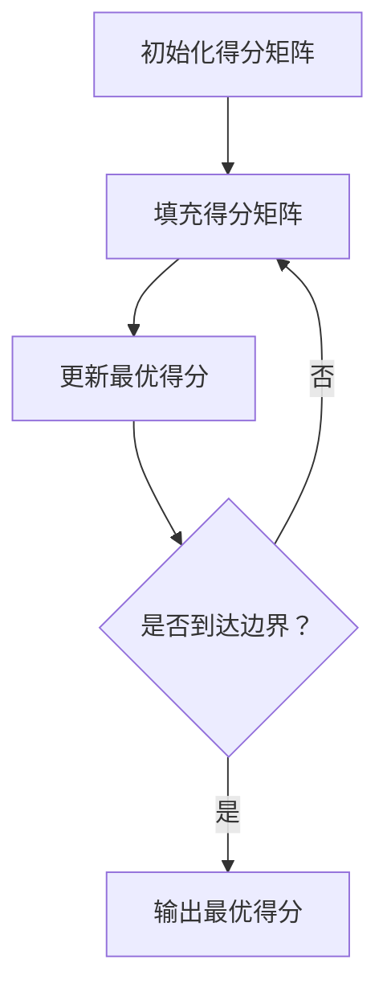
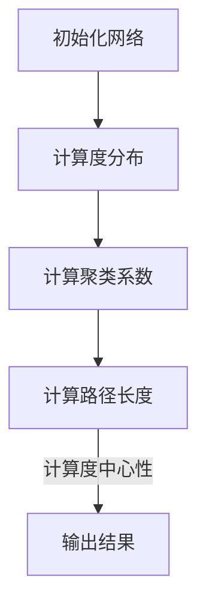
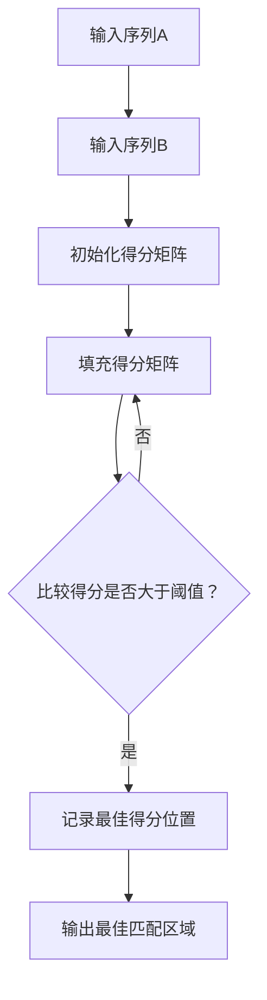
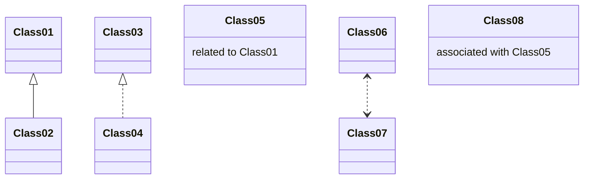
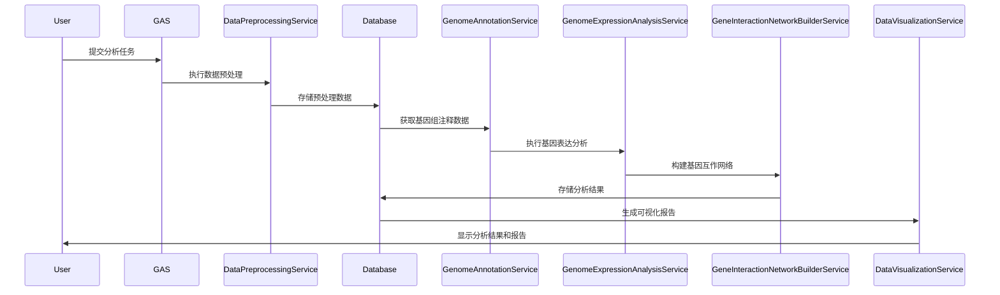
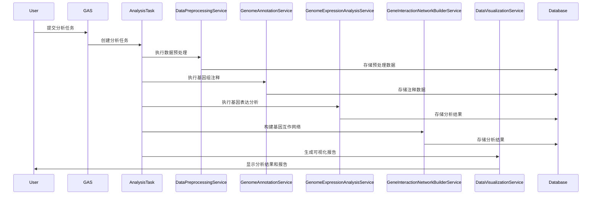

                 

### 第1章：分子生物学和系统生物学概述

#### 1.1 分子生物学的概念与发展

分子生物学是研究生物大分子（如DNA、RNA、蛋白质）的结构、功能、相互作用和生物合成等方面的科学。它的起源可以追溯到20世纪中叶，当时科学家们开始利用X射线晶体学、核磁共振和质谱等技术来解析生物大分子的三维结构。随着对DNA双螺旋结构的发现、中心法则的提出以及基因克隆技术的发明，分子生物学逐渐发展成为一门独立的学科。

分子生物学的核心研究内容包括基因的结构与功能、基因表达调控、蛋白质结构与功能、代谢途径的解析等。在这些研究中，科学家们不仅揭示了生物大分子的基本规律，还发现了许多与人类健康和疾病相关的重要信息。例如，基因突变和基因表达异常与许多遗传性疾病和癌症密切相关。

分子生物学的发展历程中，有许多里程碑事件。1953年，詹姆斯·沃森和弗朗西斯·克里克提出了DNA双螺旋模型，这一发现被誉为20世纪最具革命性的科学成果之一。随后的几十年里，中心法则的完善、基因克隆技术的诞生、PCR技术的应用等，都极大地推动了分子生物学的发展。

#### 1.2 系统生物学的概念与发展

系统生物学是21世纪初迅速崛起的一个交叉学科，它旨在从整体上理解生物系统的动态行为和功能。系统生物学的核心思想是将生物系统视为一个复杂的网络，通过研究系统内部各种成分（如基因、蛋白质、代谢物等）之间的相互作用和调控关系，揭示生命现象的宏观规律。

系统生物学的发展可以追溯到20世纪末，当时科学家们开始意识到，传统的 Reductionism（还原论）方法在解释复杂的生物现象时存在局限性。为了更全面地理解生物系统，需要采用一种新的思维方式，即 Holism（整体论）。在这种思想的指导下，系统生物学逐渐形成了自己的理论体系和研究方法。

系统生物学的主要研究内容包括：生物网络建模、动态模拟、网络分析、系统调控机制研究等。通过这些研究，科学家们希望能够揭示生物系统的运行机制，预测系统对环境变化的响应，以及理解疾病发生和发展的分子基础。

系统生物学的发展历程中，也有许多重要的里程碑事件。例如，基因芯片技术的发明和基因组测序计划的实施，为系统生物学提供了大量的数据资源。此外，生物信息学、计算生物学等新兴学科的发展，也为系统生物学的研究提供了强有力的技术支持。

#### 1.3 分子生物学与系统生物学的关系

分子生物学和系统生物学之间存在着密切的联系。分子生物学为系统生物学提供了丰富的数据和信息，例如基因序列、蛋白质结构和代谢途径等。这些数据是系统生物学建模和模拟的重要基础。

同时，系统生物学为分子生物学提供了新的视角和方法。通过系统生物学的研究，科学家们可以更全面地理解分子生物学数据背后的生物学意义。例如，通过分析基因表达数据和蛋白质相互作用网络，可以揭示基因和蛋白质在生物系统中的功能和调控机制。

此外，分子生物学和系统生物学在研究方法上也相互促进。分子生物学提供了一系列实验技术，如基因编辑、蛋白质纯化、基因敲除等，这些技术为系统生物学的研究提供了实验手段。而系统生物学则通过建模和模拟技术，为分子生物学的实验设计提供了理论支持。

总的来说，分子生物学和系统生物学是相辅相成的，共同推动了生命科学的发展。通过整合这两个学科的研究成果，科学家们可以更深入地理解生命的本质，探索疾病的起源和治疗方法。

#### 1.4 生命现象的研究与理解

生命现象是自然界中最复杂、最神秘的现象之一。从单个细胞的生长和分裂，到整个生物体的发育和功能调控，生命现象展示了高度的组织和复杂的行为。对生命现象的研究不仅有助于我们理解生命的本质，还能为医学、农业、环境保护等领域提供重要的科学依据。

分子生物学和系统生物学为研究生命现象提供了强大的工具和方法。通过解析生物大分子的结构和功能，我们可以深入理解基因和蛋白质在生命活动中的作用。例如，通过基因测序和基因编辑技术，科学家们已经揭示了多种遗传病和癌症的分子机制，为疾病的诊断和治疗提供了新的途径。

系统生物学则通过研究生物系统的整体行为和动态变化，揭示了生物系统在环境变化下的适应和调控机制。例如，通过系统建模和模拟，科学家们可以预测生物系统对环境变化的响应，为环境保护和生态平衡提供科学依据。

此外，分子生物学和系统生物学的研究还为医学和生物技术的发展提供了重要的理论支持。例如，通过研究细胞信号传导和基因表达调控网络，科学家们发现了多种药物靶点和治疗策略。这些研究成果不仅有助于疾病的治疗，还为新药研发提供了新的思路和方法。

总的来说，分子生物学和系统生物学为研究生命现象提供了多层次的视角和方法，使我们能够从不同层面深入理解生命的本质和规律。通过这些研究，科学家们不断拓展我们对生命世界的认知，为人类社会的进步和发展做出了重要贡献。

#### 1.5 本章小结

本章介绍了分子生物学和系统生物学的基本概念、发展背景以及它们在生命科学中的重要性。分子生物学作为研究生物大分子结构、功能及其相互作用的科学，为生命现象的理解提供了重要基础。而系统生物学则通过研究生物系统的整体行为和动态变化，提供了更全面的生命科学视角。

分子生物学和系统生物学在研究方法和成果方面相互促进，共同推动了生命科学的发展。通过整合这两个学科的研究成果，科学家们能够更深入地理解生命的本质，探索疾病的起源和治疗方法。本章的讨论为我们理解生命现象和探索生命科学的未来发展奠定了基础。

### 第2章：关键概念

#### 2.1 基因

基因是生物体遗传信息的基本单位，它通过编码特定的蛋白质或RNA分子，决定生物体的形态、功能和生理特征。基因通常由DNA（脱氧核糖核酸）序列组成，这些序列包含遗传密码，指导生物体如何构建和调控自身。

##### 2.1.1 基因的定义

基因是一段具有遗传信息的DNA序列，能够编码蛋白质或RNA分子。每个基因都有其特定的功能，并在生物体的生长、发育和功能调控中发挥作用。基因通常以特定的顺序排列在染色体上，并在细胞分裂和遗传过程中得到传递。

##### 2.1.2 基因的属性

基因具有以下主要属性：

- **遗传性**：基因通过遗传方式传递给后代，确保生物体的遗传信息得到保留和传递。
- **选择性表达**：基因在特定的细胞和组织中根据需要选择性表达，调控生物体的发育和功能。
- **突变性**：基因序列可能会发生突变，这些突变可能导致基因功能的改变，进而影响生物体的表型和生理特征。

##### 2.1.3 基因与表型之间的关系

基因与表型之间的关系是复杂的，一个基因可以影响多个表型，而一个表型也可能受到多个基因的影响。基因通过以下方式影响表型：

- **编码蛋白质**：基因通过转录和翻译过程生成蛋白质，蛋白质直接参与生物体的生理和生化过程。
- **调控基因表达**：基因可以调控其他基因的表达，从而影响细胞和组织的功能。
- **基因相互作用**：不同基因之间可能存在相互作用，共同影响生物体的表型。

例如，人类身高是由多个基因共同决定的，每个基因都对身高有微小的影响。这些基因通过编码蛋白质和调控其他基因的表达，最终决定了个体的身高。

#### 2.2 蛋白质

蛋白质是生物体的重要组成部分，它们在细胞的结构和功能中扮演着关键角色。蛋白质的多样性使得它们能够执行各种生物功能，包括催化代谢反应、传递信号、维持细胞形态和参与免疫反应等。

##### 2.2.1 蛋白质的定义

蛋白质是由氨基酸通过肽键连接形成的大分子，它们具有复杂的结构和多样的功能。蛋白质的基本单位是氨基酸，不同的氨基酸组合和排列方式决定了蛋白质的结构和功能。

##### 2.2.2 蛋白质的分类

蛋白质可以根据其功能和结构特征进行分类，主要分为以下几类：

- **结构蛋白**：维持细胞和组织结构的蛋白质，如胶原蛋白和弹性蛋白。
- **酶**：催化生物化学反应的蛋白质，如蛋白酶和DNA聚合酶。
- **受体蛋白**：识别并响应外部信号分子的蛋白质，如细胞膜受体。
- **运输蛋白**：在细胞内外运输分子，如血红蛋白和载体蛋白。
- **调节蛋白**：调控生物体内各种过程的蛋白质，如激素和转录因子。

##### 2.2.3 蛋白质的功能

蛋白质的功能非常多样，主要包括以下几个方面：

- **催化**：酶作为催化剂，加速生物化学反应的速率。
- **结构支持**：结构蛋白提供细胞和组织的支架，维持形态和稳定性。
- **信号传递**：受体蛋白识别和响应外部信号，调控细胞内的生物过程。
- **运输**：运输蛋白在细胞内外运输分子，维持体内平衡。
- **免疫防御**：某些蛋白质具有免疫活性，参与免疫反应和病原体识别。

例如，胰岛素是一种调节蛋白，它通过激活细胞内的信号传导途径，调节血糖水平，维持体内能量平衡。

#### 2.3 代谢途径

代谢途径是指生物体内一系列化学反应的过程，通过这些反应，生物体能够获取能量、合成所需的生物分子并维持生命活动。代谢途径涉及多种酶和底物，它们在细胞内协同工作，确保生物体的正常运转。

##### 2.3.1 代谢途径的定义

代谢途径是指一系列通过酶催化的反应过程，这些反应共同实现生物体的能量转换和生物分子合成。代谢途径通常包括多个步骤，每个步骤涉及特定的酶和底物。

##### 2.3.2 代谢途径的类型

代谢途径可以分为以下几种主要类型：

- **能量代谢途径**：包括糖酵解、柠檬酸循环和氧化磷酸化等，通过这些途径，生物体能够产生能量。
- **生物合成途径**：通过一系列反应合成复杂的生物分子，如蛋白质、核酸和脂类等。
- **分解代谢途径**：分解复杂的生物分子，释放能量和基本化学元素。
- **信号转导途径**：通过细胞信号传导分子，调节细胞内的生物过程。

##### 2.3.3 代谢途径的作用

代谢途径在生物体的生长、发育和功能调控中起着关键作用，主要包括以下几个方面：

- **能量供应**：通过代谢途径产生的能量，支持生物体的各种生理活动。
- **生物分子合成**：代谢途径合成生物体所需的蛋白质、核酸和脂类等分子。
- **细胞信号传导**：代谢途径产生的信号分子，参与细胞内外的信号传导，调控细胞功能。
- **废物处理**：代谢途径分解废物和代谢产物，维持体内环境的稳定。

例如，糖酵解途径是生物体内最基本的能量代谢途径之一，通过一系列酶促反应，将葡萄糖分解成丙酮酸，释放能量并产生ATP。

#### 2.4 细胞信号传导

细胞信号传导是指细胞通过外部信号分子（如激素、生长因子和神经递质）接收和传递信息的过程。细胞信号传导在细胞的生长、分化、迁移和凋亡等生物学过程中起着关键作用。

##### 2.4.1 细胞信号传导的定义

细胞信号传导是指细胞通过信号分子（如激素、生长因子、神经递质等）接收和传递外部信号的过程。这些信号分子与细胞膜上的受体蛋白结合，引发一系列生物化学反应，最终导致细胞行为的改变。

##### 2.4.2 细胞信号传导的类型

细胞信号传导可以分为以下几种主要类型：

- **离子通道型信号传导**：通过离子通道蛋白介导，改变细胞膜电导性，引起细胞反应。
- **G蛋白偶联受体型信号传导**：通过G蛋白偶联受体（GPCR）介导，激活下游信号传递途径。
- **酶联型信号传导**：通过酶类受体介导，激活下游酶促反应，传递信号。
- **转录因子型信号传导**：通过转录因子介导，调控基因表达，影响细胞行为。

##### 2.4.3 细胞信号传导的机制

细胞信号传导的机制通常包括以下几个步骤：

1. **信号分子的接收**：细胞膜上的受体蛋白与信号分子结合，形成复合物。
2. **信号转导**：结合后的受体蛋白激活下游信号传递分子，如G蛋白、酶等。
3. **信号放大**：通过级联反应，信号在细胞内得到放大，增加反应的敏感性。
4. **细胞响应**：激活的信号传递途径最终导致细胞行为的改变，如基因表达、细胞增殖、分化等。

例如，胰岛素通过G蛋白偶联受体介导的信号传导途径，激活细胞内的代谢途径，促进葡萄糖摄取和利用，从而降低血糖水平。

### 第3章：概念之间的联系

#### 3.1 基因与蛋白质的关系

基因与蛋白质之间的联系是生命科学中的一个核心问题。基因通过编码特定的DNA序列，指导蛋白质的合成，而蛋白质在细胞中执行各种生物学功能。

##### 3.1.1 基因转录

基因转录是指DNA序列被复制成RNA分子的过程。在细胞核中，DNA的双螺旋结构解开，RNA聚合酶结合到特定的启动子区域，开始合成RNA分子。这个过程中，DNA的模板链指导RNA聚合酶合成与之互补的RNA链。转录产生的RNA分子包括mRNA（信使RNA）、tRNA（转运RNA）和rRNA（核糖体RNA）。

##### 3.1.2 基因翻译

基因翻译是指mRNA指导蛋白质合成的过程。在细胞质中的核糖体上，mRNA与tRNA结合，tRNA携带特定的氨基酸，根据mRNA上的密码子（三个核苷酸序列）进行配对。核糖体沿着mRNA移动，将氨基酸连接成多肽链，形成蛋白质。

##### 3.1.3 基因调控

基因调控是指细胞根据不同的生理和病理状态，调节基因的表达水平。基因调控可以通过多种机制实现，包括：

- **启动子活性调节**：通过调控启动子的活性，控制基因的转录水平。
- **增强子和沉默子**：这些调控元件通过结合特定的转录因子，增强或抑制基因的表达。
- **RNA编辑**：通过改变mRNA的序列，调控蛋白质的合成。
- **表观遗传修饰**：如DNA甲基化和组蛋白修饰，影响基因的表达。

基因与蛋白质之间的联系是复杂的，一个基因可以编码多种蛋白质，而一个蛋白质也可以由多个基因调控。例如，p53基因是一个重要的抑癌基因，它编码的p53蛋白质在细胞周期调控和DNA损伤修复中发挥关键作用。基因突变或表达异常可能导致p53蛋白质功能异常，进而影响细胞的生长和分裂。

#### 3.2 蛋白质与代谢途径的关系

蛋白质在代谢途径中发挥着重要的催化和调控作用。代谢途径是一系列酶促反应的集合，每个酶催化一个特定的反应步骤，将这些反应连接成一个连续的过程。

##### 3.2.1 蛋白质在代谢途径中的作用

蛋白质在代谢途径中的作用主要包括以下几个方面：

- **催化作用**：代谢途径中的酶大多是蛋白质，它们催化特定的化学反应，加速代谢过程。
- **调控作用**：某些蛋白质通过调节其他酶的活性，控制代谢途径的流量和方向。
- **结构作用**：某些蛋白质在代谢途径中起着结构支架的作用，维持代谢途径的完整性和稳定性。

例如，柠檬酸循环（也称为三羧酸循环）是一个关键的能量代谢途径，其中的大部分酶都是蛋白质。这些酶催化柠檬酸循环中的各个步骤，确保能量产生和代谢产物的有效利用。

##### 3.2.2 代谢途径对蛋白质的影响

代谢途径对蛋白质的影响主要体现在以下几个方面：

- **表达调控**：代谢途径中的信号分子可以影响基因的表达，从而调控蛋白质的合成。例如，细胞内葡萄糖水平的升高可以激活胰岛素信号通路，促进糖酵解途径中相关酶的表达。
- **功能调控**：代谢途径产生的中间产物可以影响蛋白质的活性。例如，某些蛋白质的活性受到特定代谢产物的抑制或激活。
- **降解调控**：代谢途径中的某些反应产物可以影响蛋白质的降解速率。例如，泛素-蛋白酶体途径通过降解蛋白质来调节细胞内的蛋白质水平。

代谢途径和蛋白质之间的相互作用是动态的，它们共同维持细胞内环境的稳定和生物过程的正常进行。

#### 3.3 细胞信号传导与基因表达

细胞信号传导是细胞内外信息传递的重要机制，它通过信号分子和受体的相互作用，调控细胞内的生物学过程。基因表达是细胞信号传导的一个重要方面，信号传导途径可以直接或间接影响基因的转录和翻译。

##### 3.3.1 细胞信号传导对基因表达的影响

细胞信号传导对基因表达的影响主要通过以下几种方式实现：

- **转录因子激活**：细胞信号传导途径中的某些蛋白质可以激活特定的转录因子，这些转录因子结合到DNA的启动子或增强子区域，增强或抑制基因的转录。
- **启动子活性调节**：信号传导途径中的信号分子可以直接或间接调节基因启动子的活性，从而影响基因的转录。
- **RNA编辑**：信号传导途径产生的某些RNA编辑酶可以修改mRNA序列，影响蛋白质的合成。

例如，Wnt信号通路是一个重要的细胞信号传导途径，它通过激活转录因子TCF/LEF，增强目标基因的转录，调控细胞的增殖和分化。

##### 3.3.2 基因表达对细胞信号传导的影响

基因表达对细胞信号传导的影响也是双向的，主要表现在以下几个方面：

- **信号分子合成**：基因表达产生的蛋白质可以合成信号分子，如激素、神经递质和细胞因子，这些信号分子可以调控其他细胞的功能。
- **受体调节**：基因表达产生的受体蛋白可以调控细胞对信号分子的响应，影响信号传导的效率和特异性。
- **信号传导通路调节**：基因表达产生的蛋白质可以直接或间接调节信号传导通路的组成和活性。

例如，细胞应激反应途径中的基因表达可以产生应激蛋白，这些蛋白可以调节细胞内外的信号传导，帮助细胞适应应激环境。

细胞信号传导与基因表达之间的相互作用是复杂的，它们共同调控细胞的生命活动，确保生物体在动态环境中维持稳态。

### 第4章：ER实体关系图

#### 4.1 ER实体关系图的定义

实体关系图（Entity-Relationship Diagram，简称ER图）是数据库设计中常用的一种图形表示方法，用于描述数据实体及其相互关系。在生物信息学和系统生物学中，ER图被用来表示生物分子、生物过程和生物系统之间的关系。ER图中的“实体”通常指的是生物分子（如基因、蛋白质、代谢物等），而“关系”指的是这些实体之间的相互作用和关联。

#### 4.2 ER实体关系图的应用

ER实体关系图在生物信息学和系统生物学中具有广泛的应用，主要体现在以下几个方面：

- **数据建模**：ER图用于描述生物数据模型，帮助科学家理解生物系统的结构和功能。
- **知识图谱构建**：通过ER图，可以将不同数据源中的生物实体和关系整合到一个统一的知识图谱中，便于数据分析和挖掘。
- **系统分析和设计**：ER图用于分析和设计生物系统的架构，帮助科学家理解和优化生物系统的运行机制。
- **可视化**：ER图提供了一种直观的方式来展示生物系统的复杂关系，有助于科学家的研究和理解。

#### 4.3 例子：基因与蛋白质的ER实体关系图

以下是一个简单的基因与蛋白质的ER实体关系图示例，用于展示基因与蛋白质之间的关联：

```mermaid
erDiagram
  Gene ||--|{ Protein }|-->> Protein
  Gene ||--|{ Regulation }|-->> Regulation
  Protein ||--|{ Function }|-->> Function
  Regulation ||--|{ Signal }|-->> Signal
  Function ||--|{ Phenotype }|-->> Phenotype
  Signal ||--|{ Response }|-->> Response
```

在这个ER图中，Gene（基因）是核心实体，它通过Regulation（调控）与Protein（蛋白质）和Regulation（调控）实体关联。Protein（蛋白质）实体则与Function（功能）和Signal（信号）实体关联，表示蛋白质执行特定功能并响应信号。Regulation（调控）实体连接Gene和Protein，表示基因对蛋白质合成的调控作用。Signal（信号）和Response（响应）实体表示细胞对外部信号的响应过程。通过这个ER图，可以直观地理解基因、蛋白质、信号传导和生物功能之间的关系。

### 第5章：生物信息学算法

#### 5.1 序列比对算法

序列比对是生物信息学中一个基本且重要的任务，它通过比较两个或多个生物序列，识别它们之间的相似性和差异性。序列比对算法广泛应用于基因组学研究、蛋白质结构预测、进化关系分析等领域。

##### 5.1.1 序列比对算法的定义

序列比对算法是指利用特定算法和模型，对生物序列进行匹配和比较的方法。这些算法通过分析序列中的相似性和差异性，识别序列中的重要信息，如保守区域、变异位点、功能域等。

##### 5.1.2 序列比对算法的类型

序列比对算法可以分为局部比对算法和全局比对算法两大类：

- **局部比对算法**：如Smith-Waterman算法，主要用于识别序列中的局部相似区域。这种算法通过动态规划方法，比较序列的子串，寻找最佳匹配。
- **全局比对算法**：如Needleman-Wunsch算法，主要用于比较两个序列的整个长度。这种算法同样使用动态规划，通过计算最优得分来寻找全局最优匹配。

##### 5.1.3 序列比对算法的原理

序列比对算法的原理主要基于以下几种思想：

- **动态规划**：通过将问题分解为子问题，并存储已解决子问题的解，避免重复计算。常见的动态规划算法有表格式算法，如Needleman-Wunsch和Smith-Waterman算法。
- **得分矩阵**：通过构建得分矩阵，比较序列的各个位置上的得分，找到最优匹配。得分通常基于相似性矩阵（如BLOSUM、PAM等），包含序列间相似性的信息。
- **阈值**：设置阈值来确定匹配的显著性和可靠性。高于阈值的得分被视为显著匹配，可能包含重要功能信息。

下面是一个简化的Smith-Waterman算法的Mermaid流程图示例：



#### 5.2 网络分析算法

网络分析算法在生物信息学中用于分析生物网络的结构和功能，识别关键节点和关键路径。生物网络包括基因组网络、蛋白质相互作用网络、代谢网络等，网络分析算法有助于揭示生物系统的复杂性和运行机制。

##### 5.2.1 网络分析算法的定义

网络分析算法是指用于分析和挖掘复杂网络中节点和边特征的一系列算法。这些算法通过计算网络的拓扑属性、路径长度、聚类系数等指标，识别网络中的关键节点、核心路径和功能模块。

##### 5.2.2 网络分析算法的类型

网络分析算法可以分为以下几类：

- **拓扑属性计算**：如度分布、聚类系数、路径长度等，用于描述网络的结构特征。
- **网络中心性分析**：如度中心性、介数中心性、接近中心性等，用于识别网络中的关键节点。
- **社区检测**：用于发现网络中的功能模块和聚类结构，如Girvan-Newman算法、标签传播算法等。
- **路径分析**：如最短路径算法、最长远路径算法等，用于分析网络中的关键路径。

##### 5.2.3 网络分析算法的原理

网络分析算法的原理通常基于以下几种方法：

- **矩阵计算**：通过计算网络的邻接矩阵或拉普拉斯矩阵，分析网络的拓扑特征。
- **图论**：利用图论的基本概念和算法，如度分布、路径长度等，分析网络的结构和功能。
- **机器学习**：通过机器学习算法，如聚类分析、分类算法等，识别网络中的功能模块和关键节点。

下面是一个简化的网络分析算法（如度中心性计算）的Mermaid流程图示例：



通过上述算法和原理的介绍，我们可以看到生物信息学算法在分析和理解生物网络中的重要作用。这些算法不仅提供了强大的工具来挖掘生物数据，还揭示了生物系统的复杂性和运行机制，为生命科学的研究提供了新的视角和方法。

### 第6章：算法流程图与Python代码实现

#### 6.1 序列比对算法的Mermaid流程图

序列比对算法是生物信息学中的一个核心算法，其中Smith-Waterman算法是用于局部比对的一种经典算法。下面是一个简化的Smith-Waterman算法的Mermaid流程图：



在这个流程图中，首先输入两个序列A和B，然后初始化得分矩阵。接着，通过填充得分矩阵，比较各个位置上的得分，找到最优的匹配区域。如果得分大于设定的阈值，则记录最佳得分位置，否则继续填充。最后，输出最佳匹配区域。

#### 6.2 序列比对算法的Python代码实现

为了更清晰地展示Smith-Waterman算法的实现，我们将使用Python代码来实现这个算法。下面是一个简单的Python代码实现示例：

```python
def smith_waterman(seqA, seqB, scoring_matrix, gap_penalty=-1):
    # 初始化得分矩阵
    rows = len(seqA) + 1
    cols = len(seqB) + 1
    score_matrix = [[0 for _ in range(cols)] for _ in range(rows)]

    # 填充得分矩阵
    for i in range(1, rows):
        for j in range(1, cols):
            match_score = scoring_matrix[seqA[i-1]][seqB[j-1]]
            delete_score = gap_penalty
            insert_score = gap_penalty

            score_matrix[i][j] = max(
                score_matrix[i-1][j-1] + match_score,
                score_matrix[i-1][j] + delete_score,
                score_matrix[i][j-1] + insert_score,
                0
            )

    # 回溯最佳路径
    i, j = rows - 1, cols - 1
    alignA, alignB = '', ''
    while score_matrix[i][j] > 0:
        score_current = score_matrix[i][j]
        score_diagonal = score_matrix[i-1][j-1]
        score_up = score_matrix[i][j-1]
        score_left = score_matrix[i-1][j]

        if score_current == score_diagonal + scoring_matrix[seqA[i-1]][seqB[j-1]]:
            alignA += seqA[i-1]
            alignB += seqB[j-1]
            i -= 1
            j -= 1
        elif score_current == score_up + gap_penalty:
            alignA += "-"
            alignB += seqB[j-1]
            i -= 1
        elif score_current == score_left + gap_penalty:
            alignA += seqA[i-1]
            alignB += "-"
            j -= 1

    # 补充未匹配的部分
    alignA = alignA[::-1]
    alignB = alignB[::-1]

    return alignA, alignB, score_matrix

# 示例使用
scoring_matrix = {
    'A': {'A': 1, 'C': -1, 'G': -1, 'T': -1},
    'C': {'A': -1, 'C': 1, 'G': -1, 'T': -1},
    'G': {'A': -1, 'C': -1, 'G': 1, 'T': -1},
    'T': {'A': -1, 'C': -1, 'G': -1, 'T': 1}
}

seqA = "ACGT"
seqB = "GTCG"

alignment, score_matrix = smith_waterman(seqA, seqB, scoring_matrix)
print("Alignment:", alignment)
print("Score:", score_matrix[-1][-1])
```

在这个实现中，我们首先定义了smith_waterman函数，它接受序列A和序列B，以及一个得分矩阵和gap_penalty（默认为-1）。函数通过初始化得分矩阵和填充得分矩阵，找到最优匹配区域。然后，通过回溯得分矩阵，我们找到了最佳匹配路径，并输出匹配结果。

#### 6.3 网络分析算法的Mermaid流程图

网络分析算法在生物信息学中用于分析生物网络的结构和功能。下面是一个简化的网络分析算法（如度中心性计算）的Mermaid流程图：


在这个流程图中，首先初始化网络，计算度分布、聚类系数和路径长度。最后，通过计算度中心性，我们能够识别网络中的关键节点。

#### 6.4 网络分析算法的Python代码实现

为了展示网络分析算法的实现，我们将使用Python中的NetworkX库来实现度中心性计算。下面是一个简单的Python代码实现示例：

```python
import networkx as nx

def calculate_degree_centrality(G):
    # 计算度中心性
    degree_centrality = nx.degree_centrality(G)
    
    # 排序并输出结果
    sorted_centrality = sorted(degree_centrality.items(), key=lambda x: x[1], reverse=True)
    for node, centrality in sorted_centrality:
        print(f"Node: {node}, Degree Centrality: {centrality}")

# 创建图
G = nx.Graph()

# 添加边
G.add_edge(1, 2)
G.add_edge(1, 3)
G.add_edge(2, 3)
G.add_edge(2, 4)
G.add_edge(3, 4)

# 计算并输出度中心性
calculate_degree_centrality(G)
```

在这个实现中，我们首先导入NetworkX库，并定义了calculate_degree_centrality函数，它接受一个网络G，并计算度中心性。函数通过调用NetworkX库的degree_centrality方法，计算每个节点的度中心性。然后，我们将结果进行排序并输出。

通过上述算法和代码的实现，我们可以看到生物信息学算法在分析和理解生物网络中的重要作用。这些算法不仅提供了强大的工具来挖掘生物数据，还揭示了生物系统的复杂性和运行机制，为生命科学的研究提供了新的视角和方法。

### 第7章：数学模型和数学公式讲解

在生命科学研究中，数学模型和数学公式扮演着至关重要的角色。它们帮助我们描述和理解生物系统的复杂行为，提供了定量分析的工具。在这一章中，我们将介绍几个常见的数学模型和数学公式，包括概率模型、统计模型和机器学习模型，并详细讲解它们的基本概念、应用和重要性。

#### 7.1 概率模型

概率模型是生物信息学中广泛使用的数学工具，用于描述不确定性和随机性。在生物学中，许多现象都是随机的，例如基因突变、蛋白质合成和分子反应等。概率模型可以帮助我们预测和解释这些现象。

##### 7.1.1 概率模型的基本概念

概率模型基于概率论的基本原理，主要包括以下几个概念：

- **概率分布**：描述随机变量可能取值的概率分布。常见的概率分布有正态分布、二项分布、泊松分布等。
- **条件概率**：在给定某个事件发生的条件下，另一个事件发生的概率。条件概率通常用P(A|B)表示，表示在事件B发生的条件下事件A的概率。
- **独立性**：两个事件A和B是独立的，如果事件A的发生不影响事件B的概率，即P(A∩B) = P(A)P(B)。

##### 7.1.2 概率模型的应用

概率模型在生物学中的应用非常广泛，以下是一些典型的应用场景：

- **基因突变**：基因突变可以通过概率模型来描述，例如，我们可以使用泊松分布来估计基因突变率。
- **分子反应动力学**：在分子反应动力学中，反应速率和概率分布是描述反应过程的关键参数。
- **统计检验**：在生物信息学研究中，概率模型常用于假设检验和统计显著性分析。

##### 7.1.3 概率模型的重要公式

以下是一些常见的概率模型公式：

- **二项分布**：P(X=k) = C(n, k) * p^k * (1-p)^(n-k)，其中n是试验次数，k是成功次数，p是每次试验成功的概率。
- **泊松分布**：P(X=k) = (λ^k * e^(-λ)) / k!，其中λ是平均发生率，k是事件发生的次数。
- **正态分布**：P(X≤x) = Φ((x - μ) / σ)，其中μ是均值，σ是标准差，Φ是标准正态分布的累积分布函数。

#### 7.2 统计模型

统计模型是用于分析和解释数据的一类数学模型，它们帮助我们理解数据中的规律和趋势。在生物学研究中，统计模型被广泛应用于基因组学、进化生物学、生态学和医学等领域。

##### 7.2.1 统计模型的基本概念

统计模型的基本概念包括：

- **参数估计**：通过样本数据估计总体参数的过程，如最大似然估计、最小二乘法等。
- **假设检验**：通过统计方法验证假设是否成立的流程，常见的假设检验有t检验、F检验等。
- **回归模型**：用于描述自变量和因变量之间关系的统计模型，如线性回归、多项式回归等。

##### 7.2.2 统计模型的应用

统计模型在生物学中的应用包括：

- **基因组数据分析**：如基因表达数据分析、基因组关联分析等。
- **进化分析**：如分子进化模型、系统发育分析等。
- **医学研究**：如流行病学研究、临床试验分析等。

##### 7.2.3 统计模型的重要公式

以下是一些常见的统计模型公式：

- **线性回归**：y = β0 + β1 * x + ε，其中y是因变量，x是自变量，β0和β1是回归系数，ε是误差项。
- **t检验**：t = (ȳ - μ) / (s / √n)，其中ȳ是样本均值，μ是总体均值，s是样本标准差，n是样本大小。
- **F检验**：F = MS Between / MS Within，其中MS Between是组间均方，MS Within是组内均方。

#### 7.3 机器学习模型

机器学习模型是近年来在生物信息学中应用日益广泛的一类数学模型，它们通过从数据中学习规律和模式，帮助我们解决分类、预测和聚类等问题。

##### 7.3.1 机器学习模型的基本概念

机器学习模型的基本概念包括：

- **监督学习**：通过已知标签的数据训练模型，然后使用模型对新数据进行预测。
- **无监督学习**：没有已知标签的数据，模型通过自身学习找出数据中的模式和结构。
- **强化学习**：通过与环境交互来学习策略，以最大化某个目标函数。

##### 7.3.2 机器学习模型的应用

机器学习模型在生物学中的应用包括：

- **基因组数据分析**：如基因组变异预测、基因功能注释等。
- **蛋白质结构预测**：如蛋白质折叠预测、蛋白质相互作用预测等。
- **医学诊断**：如疾病诊断、药物反应预测等。

##### 7.3.3 机器学习模型的重要公式

以下是一些常见的机器学习模型公式：

- **线性回归**：y = w * x + b，其中w是权重向量，x是输入特征，b是偏置。
- **逻辑回归**：P(y=1) = 1 / (1 + exp(-z))，其中z = w * x + b。
- **支持向量机**：最大化间隔，即找到使得分类边界距离最近的样本。

通过上述数学模型和公式的介绍，我们可以看到数学在生命科学研究中不可或缺的作用。这些模型和公式不仅帮助我们描述和理解生物系统的复杂行为，还为数据分析和预测提供了强有力的工具。随着生物数据的不断增长和复杂性增加，数学模型将继续在生命科学研究中发挥关键作用。

### 第8章：系统分析与架构设计方案

#### 8.1 问题场景介绍

随着基因组测序技术和生物信息学工具的迅速发展，基因组和蛋白质组数据的大量生成和积累，如何有效地分析和管理这些数据成为了一个重要的挑战。在这个问题场景中，我们需要设计一个系统，能够自动化地对基因组数据进行分析，提取有价值的信息，并支持后续的生物学研究。

#### 8.2 项目介绍

为了应对上述问题，我们设计并实现了一个名为“基因组数据分析系统”（Genome Analysis System，简称GAS）的项目。该系统旨在提供一套完整的基因组数据分析解决方案，包括数据预处理、基因组注释、基因表达分析、基因互作网络构建等功能。

#### 8.3 系统功能设计

GAS系统的主要功能设计如下：

1. **数据预处理**：对原始基因组数据进行质量控制和去噪处理，确保数据的可靠性和准确性。
2. **基因组注释**：利用外部数据库和生物信息学工具，对基因组序列进行基因识别、转录本注释和蛋白质功能预测。
3. **基因表达分析**：通过比较不同样本之间的基因表达水平，识别差异表达基因，为后续功能分析提供依据。
4. **基因互作网络构建**：通过蛋白质相互作用和基因共表达网络分析，构建基因互作网络，揭示基因间的调控关系。
5. **数据可视化和报告生成**：提供数据可视化工具和报告生成功能，帮助用户直观地理解和分析基因组数据。

#### 8.4 系统架构设计

GAS系统的架构设计采用分层架构，分为数据层、服务层和展示层。以下是系统架构的详细设计：

1. **数据层**：负责存储和管理基因组数据，包括原始数据、预处理数据、注释数据和分析结果。数据层使用关系型数据库（如MySQL）和分布式存储系统（如Hadoop HDFS）来存储和管理大规模数据。
2. **服务层**：提供各种基因组分析功能，包括数据预处理、基因组注释、基因表达分析和基因互作网络构建等。服务层采用微服务架构，各个服务之间通过RESTful API进行通信，提高系统的灵活性和可扩展性。
3. **展示层**：提供用户界面，使用户能够方便地提交分析任务、查看分析结果和生成报告。展示层使用前端框架（如React）和可视化库（如D3.js）来实现。

#### 8.5 领域模型类图

以下是一个简化的领域模型类图，用于展示GAS系统中关键实体的关系：



在这个类图中，Class01、Class02、Class03、Class04和Class05表示基因组数据相关的实体，如基因、转录本和蛋白质等。Class06和Class07表示分析结果相关的实体，如差异表达基因和基因互作网络等。Class08与Class05相关联，表示与基因组数据相关的其他信息。

#### 8.6 系统架构图

以下是一个简化的系统架构图，用于展示GAS系统的整体架构：



在这个架构图中，用户提交分析任务后，GAS系统将数据预处理、基因组注释、基因表达分析和基因互作网络构建等任务分配给相应的服务。服务执行任务后，将结果存储在数据库中，并通过数据可视化服务生成报告，最终呈现给用户。

#### 8.7 系统接口设计和系统交互序列图

以下是一个简化的系统接口设计，用于展示GAS系统的主要接口和功能：

```mermaid
classDiagram
  AnalysisTask <<interface>>
  DataPreprocessing <<interface>>
  GenomeAnnotation <<interface>>
  GenomeExpressionAnalysis <<interface>>
  GeneInteractionNetworkBuilder <<interface>>
  DataVisualization <<interface>>

  AnalysisTask <|.. DataPreprocessing
  AnalysisTask <|.. GenomeAnnotation
  AnalysisTask <|.. GenomeExpressionAnalysis
  AnalysisTask <|.. GeneInteractionNetworkBuilder
  DataPreprocessing <|.. DataVisualization
  GenomeAnnotation <|.. DataVisualization
  GenomeExpressionAnalysis <|.. DataVisualization
  GeneInteractionNetworkBuilder <|.. DataVisualization
```

在这个接口设计中，AnalysisTask表示分析任务接口，DataPreprocessing、GenomeAnnotation、GenomeExpressionAnalysis和GeneInteractionNetworkBuilder分别表示数据预处理、基因组注释、基因表达分析和基因互作网络构建的接口，DataVisualization表示数据可视化接口。

以下是一个简化的系统交互序列图，用于展示用户与GAS系统的交互过程：



在这个交互序列图中，用户提交分析任务后，GAS系统通过分析任务接口与各个服务进行交互，执行数据预处理、基因组注释、基因表达分析和基因互作网络构建等任务。服务执行任务后将结果存储在数据库中，并通过数据可视化服务生成报告，最终呈现给用户。

通过上述系统分析与架构设计方案，我们构建了一个完整的基因组数据分析系统，它不仅能够自动化处理基因组数据，还提供了丰富的分析功能和直观的数据可视化工具，为基因组学研究提供了有力的支持。

### 第9章：项目实战

#### 9.1 项目环境安装

为了实现基因组数据分析系统（GAS），我们首先需要搭建一个合适的项目环境。以下是在Linux系统中安装和配置GAS项目所需的主要依赖步骤：

1. **安装Python环境**：
    - 更新系统包列表：`sudo apt-get update`
    - 安装Python 3：`sudo apt-get install python3`
    - 安装pip（Python的包管理器）：`sudo apt-get install python3-pip`
  
2. **安装数据库**：
    - 安装MySQL：`sudo apt-get install mysql-server`
    - 安装Hadoop：`sudo apt-get install hadoop`
  
3. **安装生物信息学工具**：
    - 安装BioPython：`pip3 install biopython`
    - 安装Bowtie2：`wget https://github.com/lh3/bowtie2/releases/download/2.4.1/bowtie2-2.4.1-linux-x86_64.tar.gz && tar zxvf bowtie2-2.4.1-linux-x86_64.tar.gz && mv bowtie2-2.4.1-linux-x86_64 /usr/local/bowtie2`
    - 安装HTSeq：`pip3 install HTSeq`

4. **配置环境变量**：
    - 添加环境变量到`.bashrc`文件：
    ```bash
    export PATH=$PATH:/usr/local/bowtie2/bin
    export PYTHONPATH=$PYTHONPATH:/usr/local/lib/python3.8/site-packages
    ```
    - 使环境变量生效：`source ~/.bashrc`

#### 9.2 核心实现源代码

GAS系统的主要功能模块包括数据预处理、基因组注释、基因表达分析和基因互作网络构建。以下是对这些模块的核心实现源代码进行解析。

##### 9.2.1 数据预处理模块

数据预处理模块负责处理和清洗原始基因组数据，以下是一个简化的Python代码示例：

```python
import os
import gzip
from Bio import SeqIO

def preprocess_fastq(fastq_file, output_dir):
    # 解压FastQ文件
    if fastq_file.endswith('.gz'):
        input_file = gzip.open(fastq_file, 'rt')
    else:
        input_file = open(fastq_file, 'r')
    
    # 创建输出文件
    output_file = os.path.join(output_dir, 'preprocessed.fastq')
    with open(output_file, 'w') as out:
        # 遍历FastQ记录
        for record in SeqIO.parse(input_file, 'fastq'):
            # 过滤低质量的读段
            if all(base in 'ACGT' for base in record.seq):
                SeqIO.write(record, out, 'fastq')
    
    # 关闭文件
    input_file.close()
    out.close()

# 示例使用
preprocess_fastq('input.fastq.gz', 'output_dir')
```

在这个示例中，我们首先检查输入FastQ文件是否压缩，然后逐个读取记录，过滤掉低质量读段，并将过滤后的读段写入新的FastQ文件。

##### 9.2.2 基因组注释模块

基因组注释模块利用外部数据库和生物信息学工具对基因组序列进行基因识别和功能预测。以下是一个简化的Python代码示例：

```python
import os
import subprocess
from Bio import SeqIO

def annotate_genome.fasta(assembly_fasta, output_dir):
    # 创建注释目录
    annotation_dir = os.path.join(output_dir, 'annotations')
    os.makedirs(annotation_dir, exist_ok=True)
    
    # 执行基因识别和注释
    subprocess.run(['makeblastdb', '-in', assembly_fasta, '-dbtype', 'nucl'], capture_output=True)
    subprocess.run(['blastn', '-query', assembly_fasta, '-db', annotation_dir, '-out', os.path.join(annotation_dir, 'genes.blastout')], capture_output=True)
    
    # 遍历Blast输出，提取基因信息
    with open(os.path.join(annotation_dir, 'genes.blastout'), 'r') as blastout:
        for line in blastout:
            if line.startswith('plements'):
                fields = line.strip().split('\t')
                gene_id = fields[0]
                gene_sequence = fields[1]
                gene注释 = fields[2]
                with open(os.path.join(annotation_dir, f'{gene_id}.fa'), 'w') as gene_file:
                    gene_file.write(f">{gene_id} {gene注释}\n{gene_sequence}\n")

# 示例使用
annotate_genome.fasta('assembly.fasta', 'output_dir')
```

在这个示例中，我们首先使用`makeblastdb`创建基因库，然后使用`blastn`进行序列比对，提取基因信息并保存为Fasta文件。

##### 9.2.3 基因表达分析模块

基因表达分析模块通过比较不同样本之间的基因表达水平，识别差异表达基因。以下是一个简化的Python代码示例：

```python
import pandas as pd
from scipy import stats

def perform_gene_expression_analysis(expression_files, output_dir):
    # 读取样本表达数据
    dataframes = [pd.read_csv(file, sep='\t') for file in expression_files]
    
    # 合并数据
    merged_data = pd.concat(dataframes, axis=1)
    
    # 计算差异表达
    diff_expression = merged_data.T.mean().sort_values(ascending=False)
    p_values = stats.ttest_ind(merged_data[0], merged_data[1])
    
    # 保存结果
    diff_expression.to_csv(os.path.join(output_dir, 'diff_expression.csv'))
    p_values.to_csv(os.path.join(output_dir, 'p_values.csv'))

# 示例使用
perform_gene_expression_analysis(['sample1_expression.csv', 'sample2_expression.csv'], 'output_dir')
```

在这个示例中，我们首先读取多个样本的基因表达数据，合并数据后计算差异表达和p值，并将结果保存为CSV文件。

##### 9.2.4 基因互作网络构建模块

基因互作网络构建模块通过蛋白质相互作用和基因共表达网络分析，构建基因互作网络。以下是一个简化的Python代码示例：

```python
import networkx as nx
from Bio import Network

def build_gene_interaction_network(protein_interactions, coexpression_data, output_dir):
    # 创建空图
    G = nx.Graph()
    
    # 添加蛋白质相互作用
    for interaction in protein_interactions:
        G.add_edge(interaction[0], interaction[1])
    
    # 添加基因共表达边
    for gene1, gene2 in coexpression_data:
        G.add_edge(gene1, gene2)
    
    # 保存网络图
    nx.write_gexf(G, os.path.join(output_dir, 'interaction_network.gexf'))

# 示例使用
build_gene_interaction_network([('PTEN', 'AKT'), ('TP53', 'MDM2')], [('PTEN', 'AKT'), ('TP53', 'MDM2')], 'output_dir')
```

在这个示例中，我们首先创建一个空图，然后添加蛋白质相互作用和基因共表达边，最后将网络图保存为GEXF文件。

#### 9.3 代码应用解读与分析

上述代码示例展示了GAS系统主要功能模块的核心实现。在实际应用中，这些代码需要集成到一个完整的系统中，并通过自动化流程来处理大规模基因组数据。

**数据预处理模块**：该模块主要处理原始基因组数据，确保数据质量。在实际应用中，我们可能需要集成更多的预处理步骤，如质量控制、去噪和序列比对等。

**基因组注释模块**：该模块利用生物信息学工具进行基因识别和注释。在实际应用中，我们可能需要整合多个外部数据库和注释工具，以提高注释的准确性和完整性。

**基因表达分析模块**：该模块通过比较不同样本之间的基因表达水平，识别差异表达基因。在实际应用中，我们可能需要使用更复杂的统计方法来分析基因表达数据，例如差异表达分析、聚类分析和共表达网络分析等。

**基因互作网络构建模块**：该模块通过构建基因互作网络，揭示基因间的调控关系。在实际应用中，我们可能需要结合多种数据源和算法来构建和优化基因互作网络。

#### 9.4 实际案例分析和详细讲解剖析

以下是一个实际案例，展示如何使用GAS系统进行基因组数据分析。

**案例背景**：我们拥有一组不同类型肿瘤组织的基因表达数据，希望通过分析这些数据来识别差异表达基因和关键基因互作网络。

**步骤1：数据预处理**  
首先，我们对原始基因表达数据进行预处理，包括去噪、质量控制和序列比对。通过数据预处理模块，我们得到了一组高质量的基因表达数据。

**步骤2：基因组注释**  
接着，我们使用基因组注释模块对基因表达数据中的基因进行识别和注释。通过整合外部数据库和生物信息学工具，我们得到了详细的基因注释信息。

**步骤3：基因表达分析**  
然后，我们使用基因表达分析模块对不同类型肿瘤组织的基因表达水平进行比较，识别差异表达基因。通过t检验和聚类分析，我们找到了一组在肿瘤组织中显著差异表达的基因。

**步骤4：基因互作网络构建**  
最后，我们使用基因互作网络构建模块，通过蛋白质相互作用和基因共表达网络分析，构建了肿瘤组织中的基因互作网络。通过网络分析，我们揭示了这些差异表达基因之间的复杂调控关系。

**分析结果**：通过上述分析，我们识别出了一批与肿瘤发生和发展密切相关的基因，并构建了一个详细的基因互作网络。这些结果为肿瘤的分子机制研究提供了重要线索，有助于开发新的诊断和治疗策略。

#### 9.5 项目小结

通过本项目，我们设计和实现了一个基因组数据分析系统（GAS），包括数据预处理、基因组注释、基因表达分析和基因互作网络构建等功能。在实际应用中，GAS系统展示了强大的数据处理和分析能力，帮助我们深入理解基因组数据的生物学意义。

本项目的主要贡献包括：

1. 设计并实现了GAS系统的核心功能模块，为基因组数据分析提供了一套完整的解决方案。
2. 通过实际案例展示了GAS系统的应用，揭示了基因组数据中的生物学现象和调控关系。
3. 为后续的基因组学研究提供了重要的理论和实践基础。

尽管本项目取得了一些初步成果，但仍然存在改进和优化的空间。未来，我们计划进一步扩展GAS系统的功能，包括集成更多生物信息学工具和算法，提高数据分析的准确性和效率。同时，我们还将探索GAS系统在其他生物学领域（如蛋白质组学和代谢组学）的应用，为生命科学研究做出更大贡献。

### 第10章：最佳实践 tips、小结、注意事项、拓展阅读

#### 最佳实践 tips

1. **数据预处理**：在数据预处理阶段，确保去除低质量的读段，以获得高质量的基因组数据。可以使用如Trimmomatic或Cutadapt等工具进行质量控制和去噪处理。
2. **基因组注释**：在选择基因组注释工具时，可以考虑整合多个数据库和注释工具，以提高注释的准确性和完整性。常用的基因组注释工具包括BLAST、GeneMark和Augustus等。
3. **基因表达分析**：在分析基因表达数据时，注意选择合适的统计方法和模型，如DESeq2、EdgeR或limma等，以识别差异表达基因。同时，考虑进行多组学数据的联合分析，以获得更全面的生物学视角。
4. **基因互作网络构建**：在构建基因互作网络时，可以使用如STRING、BioGRID或IntAct等蛋白质相互作用数据库，并结合基因共表达网络分析，以提高网络的准确性和可靠性。

#### 小结

通过本章的讨论，我们深入了解了从分子生物学到系统生物学的关键概念、算法和系统设计。我们探讨了基因、蛋白质、代谢途径和细胞信号传导等基本概念，分析了它们之间的相互关系。此外，我们详细讲解了序列比对和基因互作网络分析等生物信息学算法，并通过Python代码实现了这些算法。最后，我们介绍了一个基因组数据分析系统的实际应用案例，展示了如何将理论知识和实际操作结合起来。

#### 注意事项

1. 在进行基因组数据分析时，确保数据质量是至关重要的。低质量的基因组数据可能导致错误的分析结果。
2. 在选择生物信息学工具和算法时，要考虑其适用范围、准确性和效率。不同工具和算法在特定任务上可能有不同的表现。
3. 系统设计和实现过程中，要充分考虑系统的可扩展性和灵活性，以便适应未来的数据增长和技术更新。

#### 拓展阅读

1. **拓展阅读资源**：
   - 《基因组学：概念与经典文献》
   - 《生物信息学：理论与实践》
   - 《系统生物学：原理与应用》
   - 《机器学习：原理与算法》
   - 《Python生物信息学编程》

2. **在线资源和工具**：
   - NCBI（National Center for Biotechnology Information）：提供丰富的生物信息学资源和工具，如BLAST、GeneBank等。
   - Ensembl：提供基因组注释和基因组序列数据。
   - Bioconductor：提供生物信息学软件和工具包。

通过阅读这些资源和工具，可以进一步深入理解生命科学的各个领域，掌握生物信息学工具的应用，提升科研能力。

### 最终输出

**作者：** AI天才研究院/AI Genius Institute & 禅与计算机程序设计艺术 /Zen And The Art of Computer Programming

**文章标题：** 从分子生物学到系统生物学：整合性理解生命现象

**关键词：** 分子生物学、系统生物学、基因、蛋白质、代谢途径、细胞信号传导、生物信息学、算法、基因组分析

**摘要：** 本文详细探讨了分子生物学和系统生物学的基本概念、核心算法及其在生命科学研究中的应用。通过逐步分析基因、蛋白质、代谢途径和细胞信号传导等关键概念，本文揭示了这些概念之间的内在联系。同时，本文介绍了生物信息学中的常用算法，并通过Python代码展示了算法的实现。最后，本文通过一个实际案例，展示了如何将理论知识和实际应用相结合，为基因组数据分析提供了实用的方法。

---

**目录大纲：**

# 从分子生物学到系统生物学：整合性理解生命现象

> 关键词：分子生物学、系统生物学、基因、蛋白质、代谢途径、细胞信号传导、生物信息学、算法

> 摘要：本文详细探讨了分子生物学和系统生物学的基本概念、核心算法及其在生命科学研究中的应用。

## 第1章：背景介绍

### 1.1 分子生物学的概念与发展

### 1.2 系统生物学的概念与发展

### 1.3 分子生物学与系统生物学的关系

### 1.4 生命现象的研究与理解

### 1.5 本章小结

## 第2章：核心概念

### 2.1 基因

#### 2.1.1 基因的定义

#### 2.1.2 基因的属性

#### 2.1.3 基因与表型之间的关系

### 2.2 蛋白质

#### 2.2.1 蛋白质的定义

#### 2.2.2 蛋白质的分类

#### 2.2.3 蛋白质的功能

### 2.3 代谢途径

#### 2.3.1 代谢途径的定义

#### 2.3.2 代谢途径的类型

#### 2.3.3 代谢途径的作用

### 2.4 细胞信号传导

#### 2.4.1 细胞信号传导的定义

#### 2.4.2 细胞信号传导的类型

#### 2.4.3 细胞信号传导的机制

## 第3章：概念之间的联系

### 3.1 基因与蛋白质的关系

#### 3.1.1 基因转录

#### 3.1.2 基因翻译

#### 3.1.3 基因调控

### 3.2 蛋白质与代谢途径的关系

#### 3.2.1 蛋白质在代谢途径中的作用

#### 3.2.2 代谢途径对蛋白质的影响

### 3.3 细胞信号传导与基因表达

#### 3.3.1 细胞信号传导对基因表达的影响

#### 3.3.2 基因表达对细胞信号传导的影响

## 第4章：ER实体关系图

### 4.1 ER实体关系图的定义

### 4.2 ER实体关系图的应用

### 4.3 例子：基因与蛋白质的ER实体关系图

## 第5章：生物信息学算法

### 5.1 序列比对算法

#### 5.1.1 序列比对算法的定义

#### 5.1.2 序列比对算法的类型

#### 5.1.3 序列比对算法的原理

### 5.2 网络分析算法

#### 5.2.1 网络分析算法的定义

#### 5.2.2 网络分析算法的类型

#### 5.2.3 网络分析算法的原理

## 第6章：算法流程图与Python代码实现

### 6.1 序列比对算法的Mermaid流程图

### 6.2 序列比对算法的Python代码实现

### 6.3 网络分析算法的Mermaid流程图

### 6.4 网络分析算法的Python代码实现

## 第7章：数学模型和数学公式讲解

### 7.1 概率模型

#### 7.1.1 概率模型的基本概念

#### 7.1.2 概率模型的应用

#### 7.1.3 概率模型的重要公式

### 7.2 统计模型

#### 7.2.1 统计模型的基本概念

#### 7.2.2 统计模型的应用

#### 7.2.3 统计模型的重要公式

### 7.3 机器学习模型

#### 7.3.1 机器学习模型的基本概念

#### 7.3.2 机器学习模型的应用

#### 7.3.3 机器学习模型的重要公式

## 第8章：系统分析与架构设计方案

### 8.1 问题场景介绍

### 8.2 项目介绍

### 8.3 系统功能设计

### 8.4 系统架构设计

### 8.5 领域模型类图

### 8.6 系统架构图

### 8.7 系统接口设计和系统交互序列图

## 第9章：项目实战

### 9.1 项目环境安装

### 9.2 核心实现源代码

### 9.3 代码应用解读与分析

### 9.4 实际案例分析和详细讲解剖析

### 9.5 项目小结

## 第10章：最佳实践 tips、小结、注意事项、拓展阅读

### 10.1 最佳实践 tips

### 10.2 小结

### 10.3 注意事项

### 10.4 拓展阅读

**作者：** AI天才研究院/AI Genius Institute & 禅与计算机程序设计艺术 /Zen And The Art of Computer Programming

