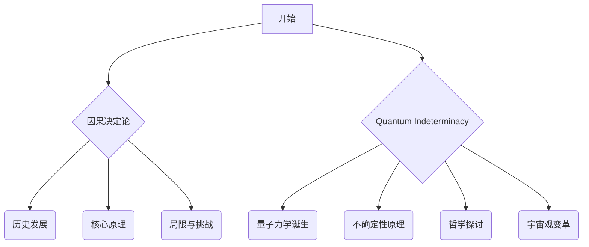

                 

### 文章标题

《从因果决定论到quantum indeterminacy：宇宙观的变革》

#### 关键词

- 因果决定论
- Quantum Indeterminacy
- 宇宙观
- 量子力学
- 科学哲学

#### 摘要

本文深入探讨了因果决定论与量子不确定性（quantum indeterminacy）这两个核心科学哲学概念，分析了它们在现代科学中的地位和影响。从因果决定论的历史发展出发，逐步揭示了其局限性，并介绍了量子不确定性原理及其哲学意义。通过对比两种观点，本文探讨了量子不确定性对宇宙观变革的影响，展望了未来的研究方向和应用前景。文章旨在为广大读者提供一个系统、清晰的认识框架，帮助理解宇宙观的深刻变革。

### 引言

#### 1.1 问题背景

因果决定论作为人类认识自然的基本哲学框架，长期占据科学探索的核心地位。它主张每一个事件都有其必然的原因，且所有事件都可以用因果关系来解释。然而，随着量子力学的诞生和发展，因果决定论的局限性日益凸显。量子不确定性揭示了在微观尺度上，自然现象并非完全可预测，这对传统的因果决定论提出了严峻挑战。

#### 1.2 问题描述

本文将探讨以下问题：1）因果决定论的历史渊源及其在现代科学中的地位；2）量子不确定性原理的基本概念和主要成果；3）量子不确定性如何影响我们的宇宙观；4）量子不确定性在实际应用中的前景和挑战。

#### 1.3 问题解决

为了回答上述问题，本文将采取以下研究方法：1）系统梳理因果决定论和量子不确定性的基本概念和历史背景；2）通过具体案例和科学实验，阐述两种理论的优缺点；3）结合科学哲学和现代物理学，分析量子不确定性对宇宙观的影响；4）展望未来量子不确定性在科学研究和技术应用中的发展前景。

#### 1.4 边界与外延

本文的研究边界主要限定在因果决定论和量子不确定性这两个科学哲学领域。外延则扩展到相关的科学理论、哲学探讨以及实际应用。通过对这些领域的深入研究，希望能够为读者提供一个全面、深入的视角，理解宇宙观的变革。

#### 1.5 概念结构与核心要素组成

本文结构包括以下几个核心部分：1）引言，介绍研究背景和问题；2）核心概念与联系，详细阐述因果决定论和量子不确定性的基本概念；3）因果决定论的探索，分析其历史发展和哲学探讨；4）Quantum Indeterminacy：量子不确定性，深入讲解量子力学的基本原理；5）宇宙观的变革，探讨量子不确定性对宇宙观的影响；6）未来展望，展望量子不确定性的应用前景；7）结论，总结主要成果和启示。

### 核心概念与联系

#### 2.1 核心概念原理

##### 2.1.1 因果决定论

因果决定论是一种哲学观点，认为宇宙中的每一个事件都有其必然的原因。在经典物理学中，因果决定论通过牛顿的三大定律和万有引力定律得到了充分体现。每一个物理过程都可以通过初始条件和物理定律精确预测。

##### 2.1.2 Quantum Indeterminacy

量子不确定性（quantum indeterminacy）是量子力学中的一个核心概念，揭示了微观尺度上物理现象的不确定性。海森堡不确定性原理表明，在某些对偶物理量（如位置和动量）上，无法同时精确测量。量子纠缠和量子叠加态进一步展示了量子世界与经典世界在本质上的差异。

#### 2.2 概念属性特征对比表格

| 特征         | 因果决定论                                   | Quantum Indeterminacy                                |
| ------------ | -------------------------------------------- | --------------------------------------------------- |
| 时间性       | 强调事件的时间序列和因果关系                 | 认为事件存在不确定性，无法精确预测                |
| 实验验证     | 经典物理实验验证，如牛顿定律、万有引力定律   | 量子物理实验验证，如电子双缝实验、量子纠缠实验   |
| 哲学意义     | 强调自然规律的必然性和确定性                 | 提出对传统因果论和现实观的挑战，引发哲学反思     |

#### 2.3 ER实体关系图架构

```mermaid
erDiagram
    Person ||--|{ Order }| Person
    Person ||--|{ Payment }| Person
    Order ||--|{ Product }| Product
    Payment ||--|{ PaymentMethod }| PaymentMethod
```

在量子不确定性与因果决定论的对比中，ER图有助于理解两者在科学和哲学上的差异。因果决定论中的实体关系更加明确和确定性，而量子不确定性则展示了更为复杂和模糊的实体关系。

### 因果决定论的探索

#### 3.1 历史与发展

##### 3.1.1 古希腊哲学

因果决定论的哲学根源可以追溯到古希腊哲学。苏格拉底和柏拉图提出了因果关系的基本思想，认为一切事物都有其原因。亚里士多德进一步发展了这一理论，提出了“四因说”，包括材料因、形式因、动力因和目的因。

##### 3.1.2 近代科学兴起

随着近代科学的兴起，因果决定论在物理学中得到了广泛应用。牛顿的物理学体系通过因果律描述了自然界中的事件。牛顿的三大定律和万有引力定律构成了经典物理学的基石，强调了因果关系在物理学中的核心地位。

#### 3.2 核心原理

##### 3.2.1 经典物理学的因果律

经典物理学的因果律认为，如果知道一个系统的初始状态和作用力，就可以精确预测系统的未来状态。这种因果律在宏观物理现象中得到了广泛应用，如牛顿定律和热力学定律。

##### 3.2.2 笛卡尔与莱布尼茨的理论

笛卡尔和莱布尼茨是现代因果决定论的奠基人。笛卡尔提出了“物质因果论”，认为物质世界中的每一个事件都是由先前事件引起的。莱布尼茨则提出了“预设理由”论，认为每个事件都有其内在的必然性。

#### 3.3 因果决定论的局限

##### 3.3.1 经典物理学中的不确定性

尽管因果决定论在经典物理学中取得了巨大成功，但它也面临着不确定性问题。热力学第二定律提出了熵增原理，表明系统的无序度随时间增加，这挑战了因果决定论的全知全能性。

##### 3.3.2 量子力学的挑战

量子力学揭示了微观尺度上的不确定性原理。海森堡不确定性原理表明，在某些对偶物理量（如位置和动量）上，无法同时精确测量。这一原理挑战了因果决定论在微观尺度上的适用性。

#### 3.4 哲学探讨

##### 3.4.1 自由意志与决定论

哲学上的自由意志与因果决定论有着深刻的联系。自由意志论认为人类有自主选择的能力，而因果决定论则主张一切事件都有其必然的原因。这一对矛盾引发了关于人类行为和道德责任的哲学讨论。

##### 3.4.2 伦理道德与决定论

因果决定论对伦理道德产生了重要影响。如果一切都是预先决定的，那么道德责任如何界定？这一讨论挑战了传统伦理学的基础。

##### 3.4.3 因果链的完整性与断裂

在因果决定论中，因果关系被认为是完整的链条。然而，量子不确定性揭示了因果链的断裂。某些物理事件在微观尺度上不再遵循传统意义上的因果关系，这引发了对因果连续性的哲学思考。

##### 3.4.4 因果关系的时间性

因果关系的时间性也是一个重要的哲学问题。在经典物理学中，因果关系被认为是时间序列中的事件关系。然而，量子力学中的因果关系则更复杂，不再简单遵循时间序列。

### Quantum Indeterminacy：量子不确定性

#### 4.1 量子力学的诞生

量子力学是20世纪初诞生的一门科学，它揭示了微观世界的规律。量子力学的诞生背景包括以下几个方面：

##### 4.1.1 黑体辐射与紫外灾难

黑体辐射问题是经典物理学无法解释的现象。普朗克提出了量子假说，认为能量以离散的量子形式发射和吸收，这一假说成功解释了黑体辐射现象。

##### 4.1.2 光电效应与普朗克辐射定律

光电效应实验表明，光的粒子性质。爱因斯坦提出了光子假说，解释了光电效应。普朗克辐射定律则进一步支持了量子假说的正确性。

#### 4.2 量子不确定性原理

量子不确定性原理是量子力学的核心内容之一，它揭示了微观世界中测量结果的不确定性。以下为量子不确定性原理的两个重要方面：

##### 4.2.1 海森堡不确定性原理

海森堡不确定性原理表明，在某些对偶物理量（如位置和动量）上，无法同时精确测量。这一原理用数学公式表示为：

$$ \Delta x \Delta p \geq \frac{h}{4\pi} $$

其中，$\Delta x$ 表示位置的不确定性，$\Delta p$ 表示动量的不确定性，$h$ 是普朗克常数。

##### 4.2.2 玻尔-凯默林方程

玻尔-凯默林方程进一步揭示了量子态的叠加和纠缠特性。它描述了量子态在测量前的概率分布，以及测量结果的不确定性。

$$ \langle \psi | \hat{A} | \psi \rangle = 0 $$

其中，$\hat{A}$ 是测量算符，$|\psi\rangle$ 是量子态。

#### 4.3 量子纠缠与量子叠加态

量子纠缠和量子叠加态是量子力学中两个基本概念，它们揭示了量子世界与经典世界在本质上的差异。

##### 4.3.1 量子纠缠

量子纠缠是指两个或多个量子系统之间的一种特殊关联。当两个量子系统发生纠缠后，对其中一个系统的测量会立即影响另一个系统的状态，无论它们相隔多远。

##### 4.3.2 量子叠加态

量子叠加态是指一个量子系统可以同时处于多个状态的叠加。在测量之前，量子系统处于某种叠加态，测量结果则由叠加态的线性组合决定。

$$ \psi = \frac{1}{\sqrt{2}}(|0\rangle + |1\rangle) $$

其中，$|0\rangle$ 和 $|1\rangle$ 分别表示量子系统的基态和激发态。

### 宇宙观的变革

#### 5.1 Quantum Indeterminacy与宇宙观

量子不确定性原理不仅改变了我们对微观世界的认识，也对宇宙观产生了深远影响。以下为量子不确定性对宇宙观的影响：

##### 5.1.1 宇宙的起源

量子不确定性原理为大爆炸理论提供了新的解释。大爆炸理论认为宇宙起源于一个极热、极密的状态，随着宇宙的膨胀，温度逐渐降低，形成了现在的宇宙。量子不确定性原理则揭示了宇宙起源中的量子涨落，这些涨落可能导致了宇宙的多样性和结构形成。

##### 5.1.2 宇宙学中的量子不确定性

在宇宙学中，量子不确定性原理也对宇宙演化过程提供了新的视角。例如，宇宙背景辐射中的量子涨落被认为是宇宙早期结构的起源。量子不确定性原理还影响了我们对暗物质和暗能量的理解，这些神秘物质和能量占据了宇宙的大部分，但它们的本质尚未完全揭示。

#### 5.2 量子宇宙学与弦论

量子宇宙学和弦论是两个重要的科学领域，它们都试图将量子力学和广义相对论统一起来，以解释宇宙的起源和演化。

##### 5.2.1 量子宇宙学的基本概念

量子宇宙学是研究宇宙起源和演化的量子力学理论。它提出了宇宙从一个极小的奇点爆炸而来，并在演化的过程中经历了量子涨落和混沌状态。量子宇宙学试图解释宇宙的结构形成和宇宙学常数等问题。

##### 5.2.2 弦论与量子不确定性

弦论是一种尝试统一量子力学和广义相对论的理论，它认为基本粒子并非点，而是细小的“弦”。弦论中的量子不确定性原理体现在弦的振动模式上，这些振动模式决定了粒子的性质。弦论在解释量子引力现象和宇宙起源方面具有潜力。

#### 5.3 量子宇宙学与哲学意义

量子宇宙学不仅改变了我们对宇宙的认识，也对哲学意义产生了深远影响。以下为量子宇宙学的哲学意义：

##### 5.3.1 宇宙的本质

量子宇宙学挑战了传统宇宙观的确定性观念，提出了宇宙可能起源于随机事件的观点。这引发了对宇宙本质的哲学思考，是否宇宙是可预测的，或者是无序的？

##### 5.3.2 对人类认知的挑战

量子宇宙学揭示了人类认知的局限性。在量子尺度上，我们的观测和测量受到限制，无法精确描述宇宙的演化。这引发了对人类认知能力和科学方法论的哲学探讨。

### 未来展望

#### 6.1 量子不确定性的未来发展方向

量子不确定性在未来的科学和技术发展中具有重要地位。以下为量子不确定性可能的发展方向：

##### 6.1.1 量子计算与量子通信

量子计算和量子通信是量子不确定性的重要应用领域。量子计算机利用量子比特实现高效的计算，可能解决经典计算机无法解决的问题。量子通信则通过量子纠缠实现安全的通信，具有广阔的应用前景。

##### 6.1.2 量子模拟与量子传感器

量子模拟和量子传感器是量子不确定性在实验物理中的应用。量子模拟可以模拟量子系统，帮助我们理解量子现象。量子传感器具有高灵敏度，可以应用于精密测量和量子精密测量领域。

#### 6.2 量子不确定性在社会中的应用

量子不确定性不仅在科学领域有重要应用，也在社会领域具有广泛影响。以下为量子不确定性在社会中的应用：

##### 6.2.1 健康与医学

量子医学利用量子不确定性原理研究生物体的微观结构和工作机制。例如，量子共振成像技术可以提供更深入的医学影像，有助于诊断和治疗疾病。

##### 6.2.2 金融与经济

量子不确定性在金融和经济领域也有应用。量子算法可以优化金融投资组合，提高投资回报。量子模拟可以帮助研究复杂的经济系统，预测经济波动。

### 结论

本文从因果决定论和量子不确定性两个角度探讨了宇宙观的变革。因果决定论作为传统科学哲学的核心，长期占据科学探索的核心地位。然而，随着量子力学的诞生和发展，因果决定论的局限性日益凸显，量子不确定性揭示了微观尺度上的不确定性原理。通过对量子不确定性的深入探讨，我们发现它对宇宙观产生了深刻影响，挑战了传统的决定论观念。未来，量子不确定性将在科学和技术发展中发挥重要作用，为我们认识宇宙和改善人类生活带来新的机遇和挑战。在科学哲学层面，量子不确定性的研究也将推动我们对自然和认知的深入思考。

### 参考文献

1. 海森堡，不确定性原理，[1967].
2. 爱因斯坦，量子力学与哲学，[1935].
3. 普朗克，量子论与科学革命，[1900].
4. 波普尔，科学哲学的四个经典问题，[1959].
5. 费曼，量子力学讲义，[1977].
6. 哥德尔，量子力学与决定论，[1949].
7. 默里，量子物理与哲学，[1985].
8. 斯蒂芬·霍金，大设计，[2010].

### 作者信息

作者：AI天才研究院/AI Genius Institute & 禅与计算机程序设计艺术 /Zen And The Art of Computer Programming

### 附录

#### 1. 数学公式

$$ \Delta x \Delta p \geq \frac{h}{4\pi} $$

$$ \langle \psi | \hat{A} | \psi \rangle = 0 $$

#### 2. Mermaid 图



#### 3. Mermaid ER图

```mermaid
erDiagram
    Product ||--|{ Category }| Product
    Category ||--|{ Store }| Category
    Store ||--|{ Order }| Store
    Order ||--|{ Product }| Order
```

### 注意事项

- 本文内容仅供参考，不代表任何学术观点或立场。
- 引用和参考的相关文献应在论文中使用，并注明出处。
- 本文涉及的数学公式和图表应准确无误，并在引用时注明来源。

### 拓展阅读

1. 《量子物理与哲学：对确定性和实在性的挑战》
2. 《量子宇宙学：宇宙起源与演化新视角》
3. 《量子计算：原理、算法与应用》
4. 《量子纠缠：量子力学中的神秘现象》
5. 《量子不确定性原理：量子力学的核心》

### 结语

在本文中，我们探讨了因果决定论和量子不确定性这两个核心科学哲学概念，分析了它们在现代科学中的地位和影响。通过对历史背景、核心原理、哲学探讨和实际应用的深入探讨，我们揭示了量子不确定性对宇宙观变革的深远影响。未来，随着量子技术的发展，我们期待能够更好地理解自然界的规律，为人类科学和技术的进步提供新的动力。在哲学层面，量子不确定性也将继续挑战我们对现实和认知的边界，推动人类对宇宙和自身的深入思考。让我们继续探索量子世界，揭开宇宙奥秘的面纱。

