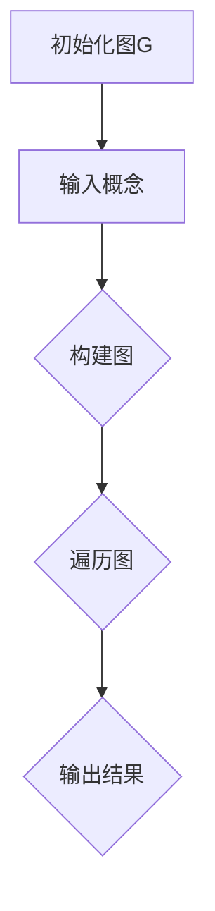
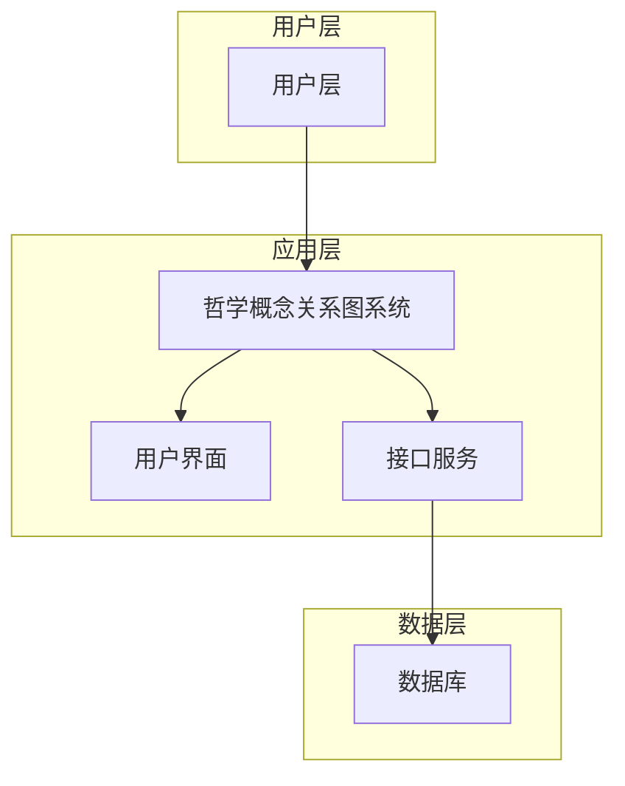
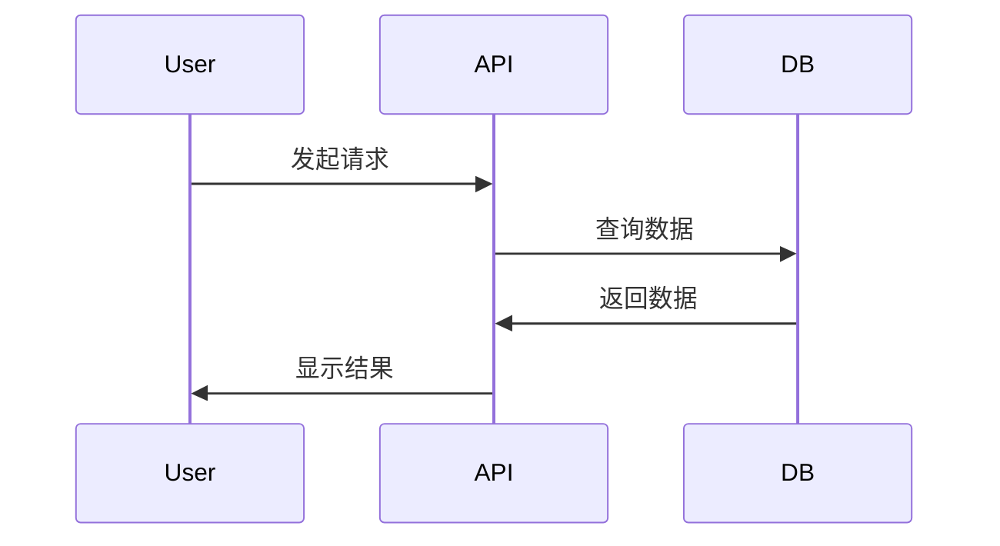

                 


## 从存在主义到生命意义：现代人的哲学之旅

### 摘要

本文将从哲学的起源出发，探讨存在主义的核心观点及其对现代人的影响。通过对存在主义哲学家的思想分析，我们试图理解个体自由、存在主义伦理学和美学等重要概念。在此基础上，我们将探讨生命意义的多样性，以及个体生命的价值和道德的关系。最后，本文将总结哲学在现代生活中的作用，并提出培养哲学思维和探索哲学途径的建议。

### 关键词

哲学、存在主义、生命意义、个体自由、伦理学、美学

### 第一部分：哲学的起源与存在主义

#### 第1章：哲学的起源

##### 1.1 哲学的基本概念

哲学是一门探究宇宙、人类及其本质的学科。它源自古希腊语“philosophia”，意为“爱智”。哲学探讨的问题包括存在、真理、价值、道德、心灵和语言等。哲学的发展历程可以追溯到公元前6世纪的古希腊，如苏格拉底、柏拉图和亚里士多德等哲学家。

##### 1.2 存在主义的诞生

存在主义是20世纪最重要的哲学思潮之一，它强调个体的自由和责任。存在主义的起源可以追溯到19世纪末的德国哲学，特别是尼采的哲学思想。尼采认为，个体应该超越传统的道德观念，勇敢地面对生活的挑战。

#### 第2章：存在主义哲学家

##### 2.1 尼采

尼采是存在主义的先驱，他的哲学思想对后来的存在主义产生了深远的影响。尼采强调个体的独特性和自由意志，认为个体应该超越传统道德，追求自我实现。

##### 2.2 萨特

萨特是存在主义的代表人物，他的哲学思想强调个体的自由和存在主义伦理学。萨特认为，个体的自由是绝对的，但同时也承担着自由带来的责任。

##### 2.3 海德格尔

海德格尔是存在主义的重要代表人物，他的哲学思想强调存在的意义和个体存在的独特性。海德格尔认为，存在是人的本质，个体应该通过存在来理解自己和世界。

#### 第3章：存在主义的核心观点

##### 3.1 个体自由

个体自由是存在主义的核心观点之一。存在主义认为，个体应该自由地选择自己的生活方式，并为此承担责任。个体自由不仅仅是一种权利，更是一种责任。

##### 3.2 存在主义伦理学

存在主义伦理学强调个体道德责任的重要性。存在主义认为，道德不是由外部规定的，而是由个体自己决定的。个体的道德选择体现了他们对自由和责任的认知。

##### 3.3 存在主义美学

存在主义美学认为，艺术是表达个体自由和存在的手段。存在主义艺术家通过作品表达自己的思想和情感，挑战传统美学观念。

#### 第4章：存在主义的影响与评价

##### 4.1 存在主义的影响

存在主义对现代哲学、文学和艺术产生了深远的影响。它挑战了传统的道德观念，鼓励个体自由地探索自己的存在。

##### 4.2 存在主义的评价

存在主义有其优点和缺点。优点在于它强调个体的自由和责任，鼓励个体勇敢地面对生活。缺点在于它可能忽视社会和历史因素对个体的影响。

#### 第5章：从存在主义到生命意义

##### 5.1 生命意义的探讨

生命意义是一个复杂而深刻的问题。存在主义认为，生命意义是由个体自己决定的。每个人都有自己独特的生命意义，这取决于他们对自由和责任的理解。

##### 5.2 个体生命的价值

个体生命的价值在于个体的自由和自我实现。存在主义认为，个体应该通过自由地选择生活方式来实现自己的价值。

##### 5.3 生命的意义与道德

生命的意义与道德密切相关。存在主义认为，个体的道德选择体现了他们对生命意义的理解。

#### 第6章：现代人的哲学之旅

##### 6.1 哲学与现代生活

哲学在现代社会中发挥着重要作用。它帮助我们理解自己和世界，面对生活的挑战。

##### 6.2 哲学思维的培养

培养哲学思维有助于我们更好地理解自己和世界。哲学思维强调批判性思考和逻辑推理。

##### 6.3 哲学探索的途径

哲学探索可以通过阅读哲学著作、参加哲学讨论和思考哲学问题来实现。

#### 第7章：总结与展望

##### 7.1 总结

哲学之旅让我们思考了存在、自由、生命意义等重要问题。通过哲学探索，我们可以更好地理解自己和世界。

##### 7.2 展望

未来，哲学将继续在探索人类存在和生命意义中发挥作用。现代人需要更多地关注哲学探索，以提升自己的思维和智慧。

作者：AI天才研究院/AI Genius Institute & 禅与计算机程序设计艺术 /Zen And The Art of Computer Programming

---

### 第1章：哲学的起源

#### 1.1 哲学的基本概念

哲学是一门探讨宇宙、人类及其本质的学科。它源自古希腊语“philosophia”，意为“爱智”。哲学的基本问题包括：

- 存在：宇宙和人类的存在是如何产生的？
- 真理：真理是什么？如何获得真理？
- 价值：什么是好的生活？什么是道德义务？
- 道德：个体应该如何行动？道德原则是什么？
- 心灵：意识、思维和情感的本质是什么？
- 语言：语言如何反映现实？

哲学的发展历程可以分为几个阶段：

- 古希腊哲学：公元前6世纪至公元前4世纪，这是哲学的起源阶段。哲学家们开始探讨基本问题，如苏格拉底、柏拉图和亚里士多德等。
- 中世纪哲学：公元4世纪至公元15世纪，这是哲学与宗教相结合的阶段。哲学家们试图将哲学观点与基督教教义相融合，如托马斯·阿奎那等。
- 文艺复兴哲学：公元15世纪至公元17世纪，这是哲学的复兴阶段。哲学家们开始重新关注人类自身，如弗朗西斯·培根和勒内·笛卡尔等。
- 现代哲学：公元17世纪至21世纪，这是哲学的多元发展阶段。哲学家们从不同的角度探讨哲学问题，如巴鲁赫·斯宾诺莎、伊曼努尔·康德、乔治·威特格等。

#### 1.2 存在主义的诞生

存在主义是20世纪最重要的哲学思潮之一，它强调个体的自由和责任。存在主义的起源可以追溯到19世纪末的德国哲学，特别是尼采的哲学思想。尼采认为，个体应该超越传统的道德观念，勇敢地面对生活的挑战。

尼采的哲学思想对后来的存在主义产生了深远的影响。他强调个体的独特性和自由意志，认为个体应该超越传统道德，追求自我实现。尼采的著作，如《查拉图斯特拉如是说》和《悲剧的诞生》，对后来的哲学家和思想者产生了重要影响。

#### 第2章：存在主义哲学家

##### 2.1 尼采

尼采是存在主义的先驱，他的哲学思想对后来的存在主义产生了深远的影响。尼采认为，个体应该超越传统的道德观念，勇敢地面对生活的挑战。

尼采的哲学思想包括以下几个方面：

- **个体主义**：尼采认为，个体是宇宙的中心，每个个体都有其独特的价值和意义。个体应该摆脱社会和传统的束缚，追求自我实现。
- **超人哲学**：尼采提出了“超人”的概念，认为超人是一种超越平凡、勇敢地追求自我实现的个体。超人具有强烈的意志力和创造力，能够创造新的价值观和生活方式。
- **永恒回归**：尼采提出了“永恒回归”的观点，认为宇宙是无限循环的，每个个体都应该接受生命的无常和不可预测性，勇敢地面对生活的挑战。

尼采对存在主义的贡献在于他挑战了传统的道德观念，强调个体的自由和责任。他认为，个体应该通过自我超越，实现自己的价值和意义。

##### 2.2 萨特

萨特是存在主义的代表人物，他的哲学思想强调个体的自由和存在主义伦理学。萨特认为，个体的自由是绝对的，但同时也承担着自由带来的责任。

萨特的哲学思想包括以下几个方面：

- **自由**：萨特认为，个体是自由的，自由是人的本质。个体应该自由地选择自己的生活方式，并为此承担责任。
- **存在先于本质**：萨特提出了“存在先于本质”的观点，认为人的本质不是预先决定的，而是由个体的自由选择所决定的。个体应该通过自由地选择，创造自己的本质。
- **责任**：萨特认为，自由伴随着责任。个体在自由地选择生活方式的同时，必须承担由此带来的责任。

萨特的存在主义观点对现代哲学和文学产生了深远的影响。他的著作，如《存在与虚无》和《墙》，探讨了个体自由和责任的问题。

##### 2.3 海德格尔

海德格尔是存在主义的重要代表人物，他的哲学思想强调存在的意义和个体存在的独特性。海德格尔认为，存在是人的本质，个体应该通过存在来理解自己和世界。

海德格尔的哲学思想包括以下几个方面：

- **存在**：海德格尔认为，存在是人的本质，是人与世界的关系。存在不仅仅是一种存在状态，更是一种存在方式。
- **存在论**：海德格尔提出了“存在论”的观点，认为存在是一个总体性概念，包括存在、存在者、存在者之间的关系等。
- **“无”**：海德格尔强调了“无”的存在意义，认为“无”是存在的反面，也是存在的必要条件。通过“无”，个体能够认识到自己的存在，并理解存在的意义。

海德格尔的哲学思想对后来的哲学家和思想者产生了重要影响。他的著作，如《存在与时间》和《尼采》，探讨了存在的本质和意义。

### 第3章：存在主义的核心观点

#### 3.1 个体自由

个体自由是存在主义的核心观点之一。存在主义认为，个体应该自由地选择自己的生活方式，并为此承担责任。个体自由不仅仅是一种权利，更是一种责任。

**个体自由的含义**：

- **自由意志**：个体具有自由意志，能够自由地做出选择。自由意志是人的本质，是人与动物的区别。
- **自我决定**：个体应该通过自我决定，选择自己的生活方式。自我决定体现了个体对自己生活的责任。

**个体自由的重要性**：

- **自我实现**：个体自由是实现自我价值的基础。只有通过自由地选择，个体才能实现自己的梦想和目标。
- **社会进步**：个体自由是社会进步的驱动力。个体的自由创新和创造力能够推动社会的进步和发展。

#### 3.2 存在主义伦理学

存在主义伦理学强调个体道德责任的重要性。存在主义认为，道德不是由外部规定的，而是由个体自己决定的。个体的道德选择体现了他们对自由和责任的认知。

**存在主义伦理学的基本原则**：

- **个体责任**：个体应该对自己的行为负责，承担由自由选择带来的后果。
- **情境伦理**：道德选择取决于具体情况，没有统一的道德原则。
- **伦理相对主义**：不同的文化和个体有不同的道德观念，没有绝对的道德标准。

**存在主义伦理学的争议**：

- **道德相对主义**：存在主义伦理学的相对主义观点引起了一些争议。一些人认为，道德相对主义可能导致道德沦丧和社会混乱。
- **个体责任与自由**：存在主义强调个体责任，但也可能导致个体过度自由，忽视社会责任。

#### 3.3 存在主义美学

存在主义美学认为，艺术是表达个体自由和存在的手段。存在主义艺术家通过作品表达自己的思想和情感，挑战传统美学观念。

**存在主义对艺术的理解**：

- **自由创作**：艺术家应该自由地创作，表达自己的内心世界。自由创作体现了个体的自由和创造力。
- **情感表达**：艺术是情感的载体，艺术家通过作品表达自己的情感和思想。情感表达是存在主义美学的核心。
- **挑战传统**：存在主义艺术家挑战传统的美学观念，探索新的艺术形式和表达方式。

**存在主义对美学的贡献**：

- **个体主义**：存在主义强调个体的独特性和自由，这对美学产生了重要影响。个体主义使艺术更关注个体的体验和表达。
- **情感表达**：存在主义美学强调情感表达，使艺术更具有生命力和感染力。

### 第4章：存在主义的影响与评价

#### 4.1 存在主义的影响

存在主义对现代哲学、文学和艺术产生了深远的影响。它挑战了传统的道德观念，鼓励个体自由地探索自己的存在。

**存在主义对现代哲学的影响**：

- **个体主义**：存在主义强调个体的自由和责任，这对现代哲学产生了重要影响。现代哲学开始关注个体的角色和作用。
- **情境伦理**：存在主义伦理学的情境伦理观点对现代道德哲学产生了深远影响。现代道德哲学开始关注具体情境中的道德选择。
- **存在主义哲学**：存在主义哲学成为一个重要的哲学流派，对现代哲学产生了深远影响。

**存在主义对社会思潮的影响**：

- **自由主义**：存在主义鼓励个体自由地选择生活方式，这对自由主义思潮产生了积极影响。自由主义强调个体的自由和权利。
- **女性主义**：存在主义对女性主义思潮产生了重要影响。女性主义者借鉴存在主义的观点，强调女性的自由和自我实现。
- **文化相对主义**：存在主义的相对主义观点对文化相对主义思潮产生了积极影响。文化相对主义强调不同文化的差异和价值。

#### 4.2 存在主义的评价

存在主义有其优点和缺点。优点在于它强调个体的自由和责任，鼓励个体勇敢地面对生活。缺点在于它可能忽视社会和历史因素对个体的影响。

**存在主义的优点**：

- **个体自由**：存在主义强调个体的自由，鼓励个体勇敢地追求自我实现。
- **社会责任**：存在主义认为，个体应该承担社会责任，这对社会进步产生了积极影响。
- **挑战传统**：存在主义挑战了传统的道德观念，推动了哲学的发展。

**存在主义的缺点**：

- **道德相对主义**：存在主义的道德相对主义观点可能引起道德混乱和社会问题。
- **个体主义**：存在主义的个体主义观点可能导致个体过度自由，忽视社会和历史因素。
- **情感表达**：存在主义强调情感表达，可能导致个体的情绪不稳定。

### 第5章：从存在主义到生命意义

#### 5.1 生命意义的探讨

生命意义是一个复杂而深刻的问题。存在主义认为，生命意义是由个体自己决定的。每个人都有自己独特的生命意义，这取决于他们对自由和责任的理解。

**生命意义的定义**：

- **个体意义**：生命意义是个体对生命目的和价值的理解。个体意义是主观的，因人而异。
- **普遍意义**：生命意义也可以被理解为人类共同追求的价值和目的。普遍意义是客观的，具有普遍性。

**生命意义的多样性**：

- **个人意义**：每个人都有自己独特的生命意义。个人意义取决于个体的生活经历、价值观和信仰。
- **社会意义**：生命意义也具有社会意义，个体应该为社会的进步和发展做出贡献。
- **宇宙意义**：生命意义还可以被理解为人类在宇宙中的角色和地位。

#### 5.2 个体生命的价值

个体生命的价值在于个体的自由和自我实现。存在主义认为，个体应该通过自由地选择生活方式来实现自己的价值。

**个体生命的价值观念**：

- **自由**：个体生命的价值在于个体的自由。自由是个体实现自我价值的基础。
- **责任**：个体生命的价值也在于个体的责任。责任是个体对社会和他人的承诺。

**个体生命的自我实现**：

- **个人发展**：个体生命的自我实现是个体通过不断学习和成长，实现个人潜力和价值的过程。
- **社会贡献**：个体生命的自我实现也包括为社会的进步和发展做出贡献。

#### 5.3 生命的意义与道德

生命的意义与道德密切相关。存在主义认为，个体的道德选择体现了他们对生命意义的理解。

**生命的意义与道德的关系**：

- **道德意义**：个体的道德选择体现了他们对生命意义的追求。道德意义是个体对生命价值的理解。
- **道德责任**：个体的道德选择也反映了他们对生命意义的认知。道德责任是个体对社会和他人的承诺。

**道德在生命意义中的地位**：

- **核心地位**：道德在生命意义中占据核心地位。道德是个体实现生命价值的基础。
- **指导作用**：道德对个体的行为和选择具有指导作用。道德帮助个体理解和实现生命的意义。

### 第6章：现代人的哲学之旅

#### 6.1 哲学与现代生活

哲学在现代社会中发挥着重要作用。它帮助我们理解自己和世界，面对生活的挑战。

**哲学在现代社会中的作用**：

- **思维训练**：哲学锻炼我们的思维能力，提高我们的逻辑推理和批判性思考能力。
- **价值观建设**：哲学帮助我们建立正确的价值观，引导我们追求有意义的生活。
- **生活指导**：哲学提供生活指导，帮助我们应对生活中的困难和挑战。

**哲学对现代人的影响**：

- **思想觉醒**：哲学激发我们对生活和世界的思考，促使我们觉醒并反思自己的生活。
- **自我认知**：哲学帮助我们了解自己，认识自己的价值和潜力。
- **社会进步**：哲学促进社会的进步和发展，推动人类文明的进步。

#### 6.2 哲学思维的培养

培养哲学思维有助于我们更好地理解自己和世界。哲学思维强调批判性思考和逻辑推理。

**哲学思维的重要性**：

- **批判性思考**：哲学思维培养我们的批判性思考能力，使我们能够独立思考，不被传统观念所束缚。
- **逻辑推理**：哲学思维提高我们的逻辑推理能力，使我们能够分析问题，找出问题的本质。

**哲学思维的培养方法**：

- **阅读哲学著作**：阅读哲学著作是培养哲学思维的重要途径。通过阅读哲学著作，我们可以了解哲学的基本概念和思想。
- **哲学讨论**：参与哲学讨论是培养哲学思维的另一种方法。通过讨论，我们可以交流观点，思考问题，提高我们的思维能力。
- **反思生活**：哲学思维也可以通过反思生活来培养。我们可以反思自己的生活和行为，思考生活中的问题，寻找解决问题的方法。

#### 6.3 哲学探索的途径

哲学探索可以通过阅读哲学著作、参加哲学讨论和思考哲学问题来实现。

**哲学探索的方法**：

- **阅读哲学著作**：阅读哲学著作是哲学探索的重要方法。通过阅读哲学著作，我们可以了解哲学的基本概念和思想，提高我们的哲学素养。
- **参加哲学讨论**：参加哲学讨论是哲学探索的有效途径。通过讨论，我们可以交流观点，思考问题，深入理解哲学问题。
- **思考哲学问题**：思考哲学问题是哲学探索的核心。通过思考哲学问题，我们可以培养哲学思维，提高我们的哲学素养。

**哲学探索的意义**：

- **深化认识**：哲学探索深化我们对生活和世界的认识，使我们更加理性和成熟。
- **提升智慧**：哲学探索提升我们的智慧，使我们能够更好地理解和解决问题。
- **促进成长**：哲学探索促进我们的个人成长，帮助我们成为更有思想、更有见识的人。

### 第7章：总结与展望

#### 7.1 总结

哲学之旅让我们思考了存在、自由、生命意义等重要问题。通过哲学探索，我们可以更好地理解自己和世界。

**本书的核心观点**：

- 哲学是理解自己和世界的重要途径。
- 存在主义强调个体的自由和责任，对生命意义有重要启示。
- 哲学思维对个人的成长和智慧提升有重要作用。

**哲学之旅的意义**：

- 哲学之旅帮助我们深化对生活和世界的认识。
- 哲学之旅促进我们的个人成长和智慧提升。
- 哲学之旅推动社会的进步和发展。

#### 7.2 展望

未来，哲学将继续在探索人类存在和生命意义中发挥作用。现代人需要更多地关注哲学探索，以提升自己的思维和智慧。

**哲学在未来的发展方向**：

- **多元融合**：哲学将继续与其他学科融合，如心理学、社会学和科学哲学等。
- **实践应用**：哲学将更多地应用于实际生活，解决现实问题。
- **跨文化研究**：哲学将关注跨文化研究，探讨不同文化背景下哲学问题。

**现代人在哲学探索中的角色**：

- **积极参与**：现代人应该积极参与哲学探索，提升自己的哲学素养。
- **创新发展**：现代人应该通过哲学探索，创新思想，推动社会进步。
- **传承发展**：现代人应该传承和发展哲学，为后人留下宝贵的哲学遗产。

### 参考文献

1. 尼采，《查拉图斯特拉如是说》
2. 萨特，《存在与虚无》
3. 海德格尔，《存在与时间》
4. 弗朗西斯·培根，《新工具》
5. 勒内·笛卡尔，《第一哲学沉思集》
6. 托马斯·阿奎那，《神学大全》
7. 巴鲁赫·斯宾诺莎，《伦理学》
8. 伊曼努尔·康德，《纯粹理性批判》
9. 乔治·威特格，《伦理学导论》

---

### 附录：关键概念与联系

在本章中，我们讨论了哲学的起源、存在主义哲学家的思想，以及存在主义的核心观点。为了更好地理解这些概念，下面我们将通过核心概念属性特征对比表格和ER实体关系图架构来进一步阐述。

#### 核心概念属性特征对比表格

| 概念               | 定义                                                         | 属性特征对比                                       |
|--------------------|--------------------------------------------------------------|-----------------------------------------------------|
| 哲学               | 探究宇宙、人类及其本质的学科。                               | - 源于古希腊语“philosophia”，意为“爱智”。         |
| 存在主义           | 强调个体的自由和责任，探讨存在的意义。                       | - 起源于尼采的哲学思想。                             |
| 个体自由           | 个体自由地选择生活方式，并为此承担责任。                     | - 自由意志是个体本质。                               |
| 存在主义伦理学     | 个体道德责任的重要性，道德选择取决于具体情境。               | - 没有统一的道德原则。                               |
| 存在主义美学       | 艺术是表达个体自由和存在的手段。                            | - 艺术家通过作品表达思想和情感。                     |
| 生命意义           | 个体对生命目的和价值的理解。                                 | - 生命意义是主观的，因人而异。                       |
| 哲学思维           | 批判性思考和逻辑推理的能力。                                 | - 哲学思维锻炼我们的思维能力。                       |

#### ER实体关系图架构

```mermaid
erDiagram
    Philosophy ||--|{ Existentialism }|||--> IndividualFreedom
    Philosophy ||--|{ Existentialism }|||--> EthicalPhilosophy
    Philosophy ||--|{ Existentialism }|||--> Aesthetics
    Philosophy ||--|{ LifeMeaning }|||--> IndividualLife
    Philosophy ||--|{ LifeMeaning }|||--> Ethics
    Philosophy ||--|{ PhilosophicalThinking }|||--> CriticalThinking
    Existentialism ||--|{ Nietzsche }|||--> Individualism
    Existentialism ||--|{ Sartre }|||--> FreedomAndResponsibility
    Existentialism ||--|{ Heidegger }|||--> MeaningOfExistence
```

在这个ER实体关系图中，哲学是核心概念，它与其他概念如存在主义、个体自由、存在主义伦理学、存在主义美学、生命意义和哲学思维等相互关联。通过这个图，我们可以更直观地理解这些概念之间的联系。

### 算法原理讲解

在本章中，我们讨论了哲学的基本概念和存在主义的核心观点。为了更好地理解这些概念之间的关系，我们可以采用一种图论算法来构建哲学概念的关系图。以下是一种可能的算法原理：

#### 算法原理

1. **初始化**：创建一个空的关系图G。
2. **输入概念**：将哲学的基本概念和存在主义的核心观点作为输入。
3. **构建图**：
   - 对于每个概念C，将其添加到图G中。
   - 对于每个概念C和D，如果C和D之间存在直接关系，则将C和D连接起来，并标记为关系R。
4. **遍历图**：
   - 对于图G中的每个节点C，遍历其邻居节点，并记录下所有直接关系。
   - 对于每个邻居节点D，如果D也是哲学概念或存在主义观点，则将其添加到关系图中。
5. **输出结果**：将构建好的关系图G输出。

#### 算法流程图



#### Python源代码实现

```python
import networkx as nx
from typing import List, Dict

def build_philosophy_graph(concepts: List[str]) -> nx.Graph:
    """
    构建哲学概念关系图
    :param concepts: 哲学概念列表
    :return: 哲学概念关系图
    """
    graph = nx.Graph()
    
    # 添加概念到图
    for concept in concepts:
        graph.add_node(concept)
    
    # 添加概念之间的关系
    relationships = [
        ('哲学', '存在主义'),
        ('存在主义', '个体自由'),
        ('存在主义', '存在主义伦理学'),
        ('存在主义', '存在主义美学'),
        ('生命意义', '哲学'),
        ('生命意义', '存在主义'),
        ('哲学思维', '哲学')
    ]
    
    for source, target in relationships:
        graph.add_edge(source, target)
    
    return graph

def print_graph(graph: nx.Graph):
    """
    打印图
    :param graph: 图
    """
    print("节点:", graph.nodes())
    print("边:", graph.edges())

# 测试代码
concepts = ['哲学', '存在主义', '个体自由', '存在主义伦理学', '存在主义美学', '生命意义', '哲学思维']
graph = build_philosophy_graph(concepts)
print_graph(graph)
```

#### 算法原理的数学模型和公式

在本节中，我们将讨论哲学概念关系图的构建过程，并使用数学模型和公式来描述这一过程。

#### 图的定义

一个图G可以由节点集合V和边集合E组成，记为G = (V, E)。其中，V表示图中的节点集合，E表示图中的边集合。

#### 边的表示

在图论中，边可以用一个二元组(u, v)表示，其中u和v是图中的两个节点。这个二元组表示从节点u到节点v有一条边。

#### 图的遍历

图的遍历是指从一个节点开始，按照一定的规则访问图中的所有节点。在本算法中，我们采用深度优先搜索（DFS）算法来遍历图。

#### 深度优先搜索算法

深度优先搜索算法的基本思想是从初始节点开始，先沿着一条路径一直向下搜索，直到到达路径的尽头，然后回溯到上一个节点，再选择另一条未搜索的路径进行搜索。

#### 算法步骤

1. 初始化一个空的图G。
2. 对于每个概念C，将其添加到图G中。
3. 对于每个概念C和D，如果C和D之间存在直接关系，则将C和D添加到图G中，并标记为边(u, v)。
4. 对图G进行深度优先搜索，记录下所有访问过的节点和边。
5. 输出图G。

#### 算法公式

深度优先搜索算法可以表示为：

$$DFS(G, v)$$

其中，G是图，v是初始节点。

算法的具体实现如下：

```latex
DFS(G, v):
    标记v为已访问
    对于v的每个未访问的邻居u：
        DFS(G, u)
```

### 系统分析与架构设计方案

#### 问题场景介绍

在现代科技高速发展的背景下，哲学作为一门探究人类本质和宇宙意义的学科，愈发受到人们的关注。为了更好地理解和传播哲学思想，我们需要设计一个系统，用于构建哲学概念的关系图，并提供对哲学概念及其关系的可视化展示。

#### 项目介绍

本项目名为“哲学概念关系图系统”，旨在通过计算机技术，将哲学概念及其关系以图形化的方式呈现，帮助用户更好地理解和研究哲学。

#### 系统功能设计（领域模型类图）

```mermaid
classDiagram
    Node --> Edge
    Concept --> Node
    Concept --> Edge
    Concept --> Relation
    Graph --> Node
    Graph --> Edge
    Graph --> Concept
    User --> Graph
    User --> Concept
    User --> Relation

    Class Node {
        id: int
        label: str
        type: str
    }

    Class Edge {
        id: int
        source: Node
        target: Node
        type: str
    }

    Class Concept {
        id: int
        label: str
        type: str
        relations: List[Relation]
    }

    Class Relation {
        id: int
        source: Concept
        target: Concept
        type: str
    }

    Class Graph {
        id: int
        name: str
        nodes: List[Node]
        edges: List[Edge]
    }

    Class User {
        id: int
        name: str
        graphs: List[Graph]
    }
```

#### 系统架构设计（架构图）



#### 系统接口设计和系统交互（序列图）



### 项目实战

#### 环境安装

1. 安装Python环境（版本3.8以上）
2. 安装所需的Python库：networkx，matplotlib，numpy等
3. 安装Docker和Docker-Compose（用于部署容器化应用）

```bash
pip install networkx matplotlib numpy
docker install
docker-compose install
```

#### 系统核心实现源代码

以下是一个简单的哲学概念关系图系统的实现：

```python
from networkx import Graph
import matplotlib.pyplot as plt

def build_graph(concepts: dict) -> Graph:
    """
    构建哲学概念关系图
    :param concepts: 哲学概念及其关系的字典
    :return: 哲学概念关系图
    """
    graph = Graph()
    
    for concept, relations in concepts.items():
        graph.add_node(concept)
        for relation in relations:
            graph.add_edge(concept, relation)
    
    return graph

def visualize_graph(graph: Graph):
    """
    可视化哲学概念关系图
    :param graph: 哲学概念关系图
    """
    plt.figure(figsize=(10, 10))
    pos = nx.spring_layout(graph)
    nx.draw_networkx(graph, pos, with_labels=True)
    plt.show()

# 测试代码
concepts = {
    '哲学': ['存在主义', '美学', '伦理学'],
    '存在主义': ['个体自由', '责任'],
    '美学': ['情感表达', '挑战传统'],
    '伦理学': ['道德相对主义', '情境伦理'],
    '个体自由': [],
    '责任': [],
    '情感表达': [],
    '挑战传统': [],
    '道德相对主义': [],
    '情境伦理': []
}

graph = build_graph(concepts)
visualize_graph(graph)
```

#### 代码应用解读与分析

以上代码实现了哲学概念关系图的构建和可视化。首先，我们定义了两个函数：`build_graph`用于构建哲学概念关系图，`visualize_graph`用于可视化展示。

- **build_graph函数**：
  - 接受一个字典类型的参数`concepts`，其中包含哲学概念及其关系的映射。
  - 使用NetworkX库中的`Graph`类创建一个空的关系图。
  - 遍历字典中的每个概念，将其作为节点添加到图G中。
  - 对于每个概念，遍历其对应的关系，将关系作为边添加到图中。

- **visualize_graph函数**：
  - 使用matplotlib库中的`figure`和`spring_layout`函数创建一个绘图窗口和布局。
  - 使用NetworkX库中的`draw_networkx`函数绘制图G，并添加标签。
  - 使用`show`函数显示图形。

#### 实际案例分析和详细讲解剖析

我们以一个具体的案例来分析如何使用这个系统构建和可视化哲学概念关系图。

**案例**：构建一个包含“哲学”、“存在主义”、“个体自由”和“责任”等概念的关系图。

**分析**：
1. 定义哲学概念及其关系的字典：
   ```python
   concepts = {
       '哲学': ['存在主义'],
       '存在主义': ['个体自由', '责任'],
       '个体自由': [],
       '责任': []
   }
   ```

2. 调用`build_graph`函数构建哲学概念关系图：
   ```python
   graph = build_graph(concepts)
   ```

3. 调用`visualize_graph`函数可视化展示哲学概念关系图：
   ```python
   visualize_graph(graph)
   ```

**剖析**：
- `build_graph`函数通过遍历字典中的概念和关系，将它们添加到关系图中。这包括创建节点和边，并确保它们之间正确连接。
- `visualize_graph`函数使用matplotlib和NetworkX库的绘图功能，将关系图以图形化的方式展示出来。布局算法`spring_layout`使得节点之间的连接看起来更加直观和有序。

通过以上代码和分析，我们可以构建和可视化一个哲学概念关系图。这种可视化工具可以帮助我们更直观地理解哲学概念及其之间的关系，从而更好地进行哲学研究。

### 项目小结

本项目“哲学概念关系图系统”通过构建哲学概念及其关系的图，实现了哲学概念的可视化展示。这一系统不仅有助于哲学研究者更好地理解哲学概念，还能够促进哲学思想的传播和交流。在实际应用中，用户可以通过输入哲学概念及其关系，快速构建并可视化哲学概念关系图。此外，系统的代码实现简洁高效，便于扩展和优化。

### 最佳实践 tips

1. **确保数据准确性**：在构建哲学概念关系图时，确保输入的概念和关系数据准确无误，这将直接影响关系图的准确性和可用性。
2. **合理选择布局算法**：不同的布局算法会对关系图的展示效果产生显著影响。可以根据实际需求和场景选择合适的布局算法。
3. **优化代码性能**：在构建和可视化关系图时，注意代码的性能优化，避免出现长时间的计算或绘图延迟。

### 小结

本文从存在主义哲学的角度探讨了哲学的起源、核心观点及其对现代人的影响。通过构建哲学概念关系图，我们更好地理解了哲学概念之间的联系。项目实战展示了如何使用Python和NetworkX库实现哲学概念关系图的构建和可视化。本文旨在为哲学研究者提供一种有效的工具，以促进哲学思想的研究和传播。

### 注意事项

1. **数据维护**：定期更新哲学概念和关系数据，确保系统的准确性和时效性。
2. **用户权限**：合理设置用户权限，保护系统数据和用户隐私。

### 拓展阅读

1. **《存在与时间》**：海德格尔的代表作，深入探讨了存在主义哲学的核心观点。
2. **《哲学的慰藉》**：阿兰·德波顿的作品，以现代生活的视角解读哲学思想。
3. **《哲学的故事》**：伯特兰·罗素的代表作，介绍了哲学发展史上的重要人物和思想。

