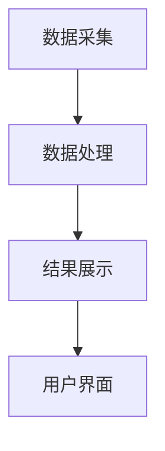
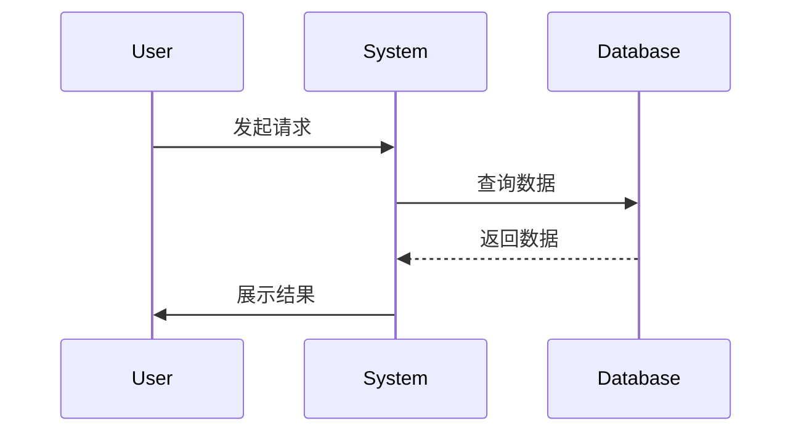

                 

# 从宏观到微观：宇宙的尺度与人类认知

## 关键词
宇宙学、宏观尺度、微观尺度、人类认知、科学探索

## 摘要
本文从宏观到微观的尺度出发，探讨宇宙的奥秘和人类对宇宙的认知。通过分析宇宙的起源与演化、原子与宇宙的微观结构、人类认知历程以及宇宙与人类未来的互动，本文旨在揭示宇宙的宏大图景与人类智慧的交织，激发读者对科学和宇宙的探索热情。

## 目录大纲设计思路

在设计《从宏观到微观：宇宙的尺度与人类认知》的目录大纲时，我们首先明确了书籍的核心内容和结构。本书将分为四个主要部分，分别是宇宙的宏观尺度、宇宙的微观尺度、人类认知与宇宙以及宇宙与人类未来。每一部分又细分为多个章节，分别探讨宇宙的不同方面和人类对这些方面的认知。

### 第1部分：宇宙的宏观尺度

宇宙的宏观尺度部分主要包括宇宙的起源与演化、宇宙的组成以及宇宙尺度的测量。这一部分的内容旨在帮助读者理解宇宙从大爆炸开始至今的演化过程，宇宙中主要物质和能量的组成，以及科学家如何测量宇宙的尺度。

**第1章：宇宙的起源与演化**

- **1.1 宇宙的起源**
  - **1.1.1 大爆炸理论**
  - **1.1.2 宇宙的年龄**
  - **1.1.3 宇宙的膨胀**

- **1.2 宇宙的组成**
  - **1.2.1 宇宙的暗物质**
  - **1.2.2 宇宙的暗能量**
  - **1.2.3 星系与星系团**

- **1.3 宇宙尺度的测量**
  - **1.3.1 光年与秒差距**
  - **1.3.2 望远镜技术**
  - **1.3.3 宇宙背景辐射**

### 第2部分：宇宙的微观尺度

宇宙的微观尺度部分主要关注原子与宇宙的微观结构，包括原子的基本结构、量子力学与宇宙的关系等内容。这一部分将帮助读者理解宇宙中微观粒子的行为及其对宏观宇宙的影响。

**第2章：原子与宇宙**

- **2.1 原子的结构**
  - **2.1.1 电子与原子核**
  - **2.1.2 原子轨道**
  - **2.1.3 原子间的相互作用**

- **2.2 量子力学与宇宙**
  - **2.2.1 量子叠加态**
  - **2.2.2 量子纠缠**
  - **2.2.3 量子力学的宇宙观**

### 第3部分：人类认知与宇宙

人类认知与宇宙部分将回顾人类对宇宙的认知历程，从古代天文学到现代科学的突破，探讨人类认知的局限与挑战。这一部分旨在展示人类如何不断探索宇宙，以及在这个过程中遇到的困难和取得的成就。

**第3章：人类对宇宙的认知历程**

- **3.1 古代天文学**
  - **3.1.1 地心说与日心说**
  - **3.1.2 古代天文学成就**

- **3.2 近代天文学的突破**
  - **3.2.1 光谱分析**
  - **3.2.2 宇宙膨胀的证据**

- **3.3 人类认知的局限与挑战**
  - **3.3.1 黑洞信息悖论**
  - **3.3.2 宇宙的终极命运**

### 第4部分：宇宙与人类未来

宇宙与人类未来部分将探讨宇宙探索的未来方向和宇宙与人类文明的未来。这一部分旨在展望宇宙科技的发展趋势，以及宇宙探索对人类文明可能带来的影响。

**第4章：人类与宇宙的未来**

- **4.1 宇宙探索的未来方向**
  - **4.1.1 量子通信**
  - **4.1.2 穿越虫洞**

- **4.2 宇宙与人类文明的未来**
  - **4.2.1 人类是否孤独？**
  - **4.2.2 宇宙殖民**

### 总结与展望

最后，本文将在第5章对宇宙与人类认知的融合进行总结和展望，探讨宇宙学对生命和人类存在的启示，以及科学家与哲学家对话的可能性。这一部分旨在为读者提供对宇宙和人类存在更深层次的思考。

**第5章：宇宙与人类认知的融合**

- **5.1 宇宙学的启示**
  - **5.1.1 对生命的思考**
  - **5.1.2 对人类存在的意义**

- **5.2 未来展望**
  - **5.2.1 科学家与哲学家对话**
  - **5.2.2 宇宙学在科技与人文领域的融合**

### 目录大纲完整结构

以下是本书的完整目录大纲结构，符合markdown格式要求：

```markdown
# 从宏观到微观：宇宙的尺度与人类认知

# 第1部分：宇宙的宏观尺度

## 第1章：宇宙的起源与演化

### 1.1 宇宙的起源
- 1.1.1 大爆炸理论
- 1.1.2 宇宙的年龄
- 1.1.3 宇宙的膨胀

### 1.2 宇宙的组成
- 1.2.1 宇宙的暗物质
- 1.2.2 宇宙的暗能量
- 1.2.3 星系与星系团

### 1.3 宇宙尺度的测量
- 1.3.1 光年与秒差距
- 1.3.2 望远镜技术
- 1.3.3 宇宙背景辐射

## 第2章：原子与宇宙

### 2.1 原子的结构
- 2.1.1 电子与原子核
- 2.1.2 原子轨道
- 2.1.3 原子间的相互作用

### 2.2 量子力学与宇宙
- 2.2.1 量子叠加态
- 2.2.2 量子纠缠
- 2.2.3 量子力学的宇宙观

## 第3章：人类对宇宙的认知历程

### 3.1 古代天文学
- 3.1.1 地心说与日心说
- 3.1.2 古代天文学成就

### 3.2 近代天文学的突破
- 3.2.1 光谱分析
- 3.2.2 宇宙膨胀的证据

### 3.3 人类认知的局限与挑战
- 3.3.1 黑洞信息悖论
- 3.3.2 宇宙的终极命运

## 第4章：人类与宇宙的未来

### 4.1 宇宙探索的未来方向
- 4.1.1 量子通信
- 4.1.2 穿越虫洞

### 4.2 宇宙与人类文明的未来
- 4.2.1 人类是否孤独？
- 4.2.2 宇宙殖民

## 第5章：宇宙与人类认知的融合

### 5.1 宇宙学的启示
- 5.1.1 对生命的思考
- 5.1.2 对人类存在的意义

### 5.2 未来展望
- 5.2.1 科学家与哲学家对话
- 5.2.2 宇宙学在科技与人文领域的融合
```

接下来，我们将逐章深入探讨宇宙的宏观与微观尺度，人类对宇宙的认知历程，以及宇宙与人类未来的互动，逐步揭示宇宙的奥秘与人类智慧的交织。# 第1部分：宇宙的宏观尺度

### 第1章：宇宙的起源与演化

#### 1.1 宇宙的起源

宇宙的起源是一个深邃而引人入胜的话题。科学界普遍接受的解释是大爆炸理论。这一理论认为，宇宙起源于一个极高温度和密度的奇点，在大约138亿年前发生了剧烈的膨胀，形成了我们现在所观察到的宇宙。

**大爆炸理论：**

大爆炸理论最初由乔治·伽莫夫在1948年提出。根据这一理论，宇宙在极早期处于一个高温高密度的状态，随着宇宙的膨胀，温度逐渐降低，形成了不同的物质和能量形式。这一理论得到了多个观测事实的支持，如宇宙背景辐射、元素丰度分布等。

**宇宙的年龄：**

宇宙的年龄是一个可以通过观测来估算的量。根据宇宙背景辐射的测量，宇宙的年龄大约为138亿年。这一估计是基于宇宙背景辐射的微波背景辐射的温度，科学家们通过分析这一辐射的特性，可以反推出宇宙的年龄。

**宇宙的膨胀：**

宇宙的膨胀是宇宙学中一个重要的概念。根据宇宙背景辐射的测量，宇宙在大爆炸后开始膨胀，并且这一膨胀速度在逐渐加快。这一现象被称为“宇宙加速膨胀”。宇宙加速膨胀的原因目前尚不清楚，科学家们正在寻找解释这一现象的理论。

#### 1.2 宇宙的组成

宇宙的组成非常复杂，主要包括物质、能量、暗物质和暗能量。

**物质：**

宇宙中的物质主要包括普通物质和暗物质。普通物质是我们日常生活中所见到的物质，如行星、恒星、星系等。暗物质则是一种不发光、不与电磁波相互作用的物质，其存在是通过引力效应推断出来的。

**暗物质：**

暗物质是宇宙中一种神秘的物质，其质量大约是普通物质的五倍，但至今科学家们尚未找到暗物质的确切组成。暗物质对宇宙的结构和演化起着关键作用，但其本质仍然是一个未解之谜。

**暗能量：**

暗能量是宇宙中另一种神秘的物质，其能量密度在宇宙膨胀过程中起着主导作用。暗能量的存在解释了为什么宇宙的膨胀速度在加速。目前，科学家们对暗能量的了解仍然有限，但它是宇宙学中的一个重要概念。

**星系与星系团：**

星系是宇宙中最常见的结构，由恒星、行星、气体和暗物质组成。星系之间通过引力相互作用形成星系团，星系团又进一步形成更大的宇宙结构。这些宇宙结构在宇宙的演化过程中起着至关重要的作用。

#### 1.3 宇宙尺度的测量

测量宇宙的尺度是一项艰巨的任务，科学家们使用多种工具和技术来探索宇宙的尺度。

**光年与秒差距：**

光年是一个距离单位，表示光在一年内传播的距离，大约为9.461×10^12公里。秒差距是一个更常用的距离单位，定义为光在3.26年传播的距离，大约为3.085×10^16公里。

**望远镜技术：**

望远镜是测量宇宙尺度的主要工具。从地面望远镜到太空望远镜，科学家们使用不同类型的望远镜来观测宇宙。例如，哈勃太空望远镜就是一个强大的观测工具，它为我们揭示了宇宙的许多奥秘。

**宇宙背景辐射：**

宇宙背景辐射是宇宙大爆炸后遗留下来的辐射，它为我们提供了宇宙早期状态的信息。通过分析宇宙背景辐射的特性，科学家们可以估算宇宙的尺度。

### 总结

宇宙的起源、组成和尺度是宇宙学中重要的研究内容。从大爆炸理论到宇宙的组成，再到宇宙尺度的测量，科学家们通过不断的观测和理论探讨，逐渐揭示了宇宙的奥秘。然而，宇宙的探索永无止境，我们还有许多未知的问题需要去解决。# 第2章：原子与宇宙

### 2.1 原子的结构

原子是物质的基本单元，由原子核和围绕原子核的电子组成。原子核位于原子的中心，由带正电的质子和不带电的中子构成，而电子则带负电，围绕原子核旋转。

#### 2.1.1 电子与原子核

电子是原子的基本粒子之一，它们以特定的能量状态存在于原子中。根据量子力学的描述，电子在原子中的运动不是经典的轨道运动，而是存在于一个概率云中，这个云称为电子云或原子轨道。电子云描述了电子在原子中可能出现的区域。

原子核则由质子和中子组成。质子带正电，中子不带电。原子核的质量几乎占据了整个原子的质量，而电子的质量相对较小，可以忽略不计。

#### 2.1.2 原子轨道

原子轨道是电子在原子中可能出现的状态，这些状态由四个量子数来描述：主量子数（n）、角量子数（l）、磁量子数（m）和自旋量子数（s）。主量子数决定了电子的能量层，角量子数决定了轨道的形状，磁量子数决定了轨道在空间中的取向，而自旋量子数描述了电子的自旋状态。

原子轨道包括s轨道、p轨道、d轨道和f轨道，分别对应着不同的角量子数。s轨道是最简单和最稳定的轨道，呈球形分布；p轨道呈哑铃形分布，有三个取向；d轨道有五个取向，形状更加复杂；f轨道有七个取向，形状更为复杂。

#### 2.1.3 原子间的相互作用

原子间的相互作用是通过电子云的重叠和电荷间的库仑力实现的。这种相互作用决定了物质的性质和结构。当两个原子的电子云重叠时，它们可以形成化学键，如共价键、离子键等。

**共价键：** 当两个原子的电子云重叠时，它们可以共享电子，形成共价键。这种键在分子中非常常见，例如，水分子（H2O）就是通过氧原子和氢原子之间的共价键连接在一起的。

**离子键：** 当一个原子失去一个或多个电子，而另一个原子获得这些电子时，它们之间可以形成离子键。这种键在离子化合物中非常常见，例如，氯化钠（NaCl）就是通过钠离子和氯离子之间的离子键连接在一起的。

#### 量子力学与宇宙

量子力学是研究原子和亚原子粒子的物理学分支，它提供了对原子和分子的行为的详细描述。量子力学中的基本原理，如量子叠加态和量子纠缠，也适用于宇宙中的微观粒子。

**量子叠加态：** 量子叠加态是量子力学中的一个基本概念，它描述了一个量子系统同时存在于多个可能的状态中。例如，一个电子可以同时存在于多个能级上，直到我们进行测量时，它才会“塌缩”到其中一个状态。

**量子纠缠：** 量子纠缠是量子力学中另一个重要概念，它描述了两个或多个粒子之间的强相关性。即使这些粒子相隔很远，它们的状态也会相互影响。量子纠缠在量子通信和量子计算等领域有着广泛的应用。

#### 量子力学的宇宙观

量子力学对宇宙观产生了深远的影响。量子力学的原理挑战了经典物理学中的决定论观念，提出了概率性和不确定性。量子力学也揭示了微观世界中的非局域性，即粒子之间的状态可以即时相互影响，无论它们之间的距离有多远。

量子力学的宇宙观认为，宇宙的基本结构是由量子场组成的，这些量子场在宇宙的演化过程中产生了物质和能量。量子场理论是现代物理学的基石之一，它提供了对宇宙起源和宇宙结构的深刻理解。

### 总结

原子是宇宙中物质的基本单元，由电子和原子核组成。原子轨道描述了电子在原子中的状态，而原子间的相互作用决定了物质的性质和结构。量子力学提供了对原子和分子行为的详细描述，而量子叠加态和量子纠缠等概念对宇宙观产生了深远的影响。通过理解原子的结构以及量子力学的原理，我们可以更深入地探索宇宙的奥秘。# 第3章：人类对宇宙的认知历程

### 3.1 古代天文学

人类对宇宙的认知历程可以追溯到古代，当时的人们通过观察天空，形成了对宇宙的基本理解。古代天文学是早期人类对宇宙探索的重要方式，它为我们留下了许多宝贵的知识和观察结果。

**地心说与日心说**

在古代，天文学家普遍接受地心说，即认为地球是宇宙的中心，所有的天体都围绕地球旋转。这一理论起源于古希腊哲学家亚里士多德，并得到了罗马天文学家托勒密的进一步发展。托勒密在《天文学大成》一书中，详细描述了地心说的模型，这一模型成为中世纪天文学的基础。

然而，地心说并不是绝对的真理。随着观测技术的进步，人们开始发现地心说的局限性。特别是波兰天文学家哥白尼提出了日心说，即太阳是宇宙的中心，地球和其他行星围绕太阳旋转。哥白尼的理论在16世纪得到了进一步发展，最终成为现代天文学的基础。

**古代天文学成就**

在古代，天文学取得了许多重要的成就。例如，古巴比伦人记录了日食和月食，并编制了星表。古埃及人利用天文观测来确定尼罗河的泛滥时间，这对于农业生产具有重要意义。古印度和中国的天文学家也记录了大量的天文现象，并发展了精确的历法。

古代天文学的主要工具是肉眼观测和简单的仪器，如日晷和石制日冕仪。这些工具虽然简陋，但在当时已经足够精确，使得古代天文学家能够做出重要的发现。

**古代天文学的影响**

古代天文学的成就对后来的科学发展产生了深远的影响。地心说和日心说的争论促进了天文学和物理学的发展，引发了科学革命。古代天文学的知识也成为了现代天文学和物理学的重要基础。

### 3.2 近代天文学的突破

随着科学技术的进步，近代天文学取得了许多重要的突破，这些突破极大地扩展了人类对宇宙的认知。

**光谱分析**

光谱分析是近代天文学的一个关键工具。德国物理学家夫琅和费发现了太阳光谱中的吸收线，这些吸收线对应于不同元素的谱线。通过分析这些谱线，天文学家可以确定天体的成分。光谱分析为天体物理学提供了强有力的工具，使得天文学家能够了解宇宙中的元素分布和化学过程。

**宇宙膨胀的证据**

20世纪初期，美国天文学家埃德温·哈勃发现了宇宙膨胀的证据。哈勃使用望远镜观测到了远处星系的红移，这表明它们正在远离我们。这一发现支持了宇宙膨胀的理论，即宇宙从大爆炸开始一直在膨胀。宇宙膨胀理论成为现代宇宙学的基石之一。

**望远镜技术的进步**

望远镜技术的进步是近代天文学发展的关键因素。从伽利略的望远镜到哈勃太空望远镜，望远镜的分辨率和灵敏度不断提高，使得天文学家能够观测到更遥远的宇宙。特别是哈勃太空望远镜，它的观测结果彻底改变了人类对宇宙的认识。

**宇宙微波背景辐射**

宇宙微波背景辐射是宇宙大爆炸的余辉，它为宇宙的起源和演化提供了直接的证据。1965年，美国天文学家阿诺·彭齐亚斯和罗伯特·威尔逊首次观测到了宇宙微波背景辐射。这一发现证实了宇宙大爆炸理论，并为宇宙学的研究提供了新的方向。

### 3.3 人类认知的局限与挑战

尽管人类对宇宙的认知取得了巨大的进步，但仍然存在许多局限和挑战。

**黑洞信息悖论**

黑洞信息悖论是量子力学和广义相对论之间矛盾的一个体现。根据量子力学，信息不能被完全摧毁，但根据广义相对论，黑洞可以吞噬一切，包括信息。这导致了物理学中的基本原理之间的矛盾。科学家们正在努力寻找解决这一悖论的方法。

**宇宙的终极命运**

宇宙的终极命运是一个未解之谜。根据不同的理论，宇宙可能会继续膨胀，最终走向热寂，也可能会收缩并最终坍缩成一个奇点。这一问题的解决需要更深入的观测和理论探讨。

**宇宙中的生命**

人类在宇宙中是否孤独？这是另一个令人着迷的问题。尽管科学家们已经发现了许多行星，但尚未找到确凿的证据表明宇宙中存在其他生命形式。寻找地外生命的任务仍然是天文学和宇宙学中的一个重要目标。

### 总结

人类对宇宙的认知历程是一个漫长而不断发展的过程。从古代的地心说到现代的宇宙膨胀理论，人类对宇宙的理解不断深化。然而，宇宙的奥秘仍然远远未被揭示，人类面临着许多未解之谜和挑战。通过不断的观测、实验和理论探讨，我们有望进一步揭开宇宙的神秘面纱。# 第4章：人类与宇宙的未来

### 4.1 宇宙探索的未来方向

随着科技的进步，人类对宇宙的探索正不断迈向新的高度。未来，我们有望在量子通信、星际旅行、星际移民等领域取得重大突破，这些突破将极大地扩展我们对宇宙的理解，并可能改变人类文明的格局。

**量子通信**

量子通信是未来宇宙探索的一个重要方向。量子通信利用量子纠缠和量子叠加等量子力学原理，实现信息的高速传输和高度安全。未来，人类有望通过建立量子通信网络，实现地球与遥远星系之间的实时通信。这将极大地促进宇宙科学的研究，为星际旅行和星际移民提供可靠的通信保障。

**星际旅行**

星际旅行一直是人类的梦想。随着航天技术的不断进步，未来人类有望实现星际旅行。利用核推进、光帆等先进技术，人类将能够以更高的速度穿越星际空间。这将使人类有可能到达其他恒星系统，探索宇宙中的生命迹象。

**星际移民**

星际移民是未来人类文明发展的一个重要方向。随着地球资源的日益紧张，人类可能需要寻找新的家园。未来，人类有望通过在火星、木星卫星等天体上建立永久性居住基地，实现星际移民。这将不仅有助于解决地球资源问题，也将为人类文明的发展提供新的契机。

### 4.2 宇宙与人类文明的未来

宇宙探索不仅是对科学知识的追求，也关乎人类文明的未来。未来，宇宙与人类文明的互动将带来深远的影响，改变人类的生存方式和社会结构。

**人类是否孤独**

宇宙中是否存在其他智慧生命一直是科学家们争论的焦点。未来，随着人类对宇宙的进一步探索，我们有望找到答案。如果宇宙中存在其他智慧生命，这将极大地扩展人类对宇宙的认知，改变我们对自身和宇宙的理解。

**宇宙殖民**

宇宙殖民是未来人类文明发展的重要方向。通过在宇宙中建立永久性居住基地，人类将能够摆脱对地球的依赖，实现真正的星际文明。宇宙殖民将为人类提供更多的资源和生存空间，为人类文明的发展注入新的活力。

**科技与人文的融合**

随着宇宙探索的深入，科技与人文的融合将成为未来人类文明的重要特征。科学家们将需要与哲学家、文学家等人文领域的专家合作，共同探讨宇宙的奥秘和人类存在的意义。这种跨学科的融合将推动人类文明的进步，为人类带来更全面的发展。

### 总结

未来，宇宙探索将推动人类科技的发展，改变人类的生存方式和社会结构。通过量子通信、星际旅行、星际移民等领域的突破，人类有望进一步揭示宇宙的奥秘，拓展我们对宇宙的认知。同时，宇宙与人类文明的互动也将为人类带来新的机遇和挑战，推动人类文明的持续进步。# 第5章：宇宙与人类认知的融合

### 5.1 宇宙学的启示

宇宙学的研究不仅帮助我们揭示了宇宙的奥秘，也为人类认知提供了深刻的启示。宇宙学的发现挑战了我们对生命的思考，并深刻影响了人类对自身存在的理解。

**对生命的思考**

宇宙学研究表明，宇宙的起源和演化是一个充满随机性和不确定性的过程。这种认识使我们开始思考生命的起源和意义。生命的存在似乎是宇宙演化中的一种奇迹，这种奇迹使我们不禁思考，宇宙是否存在某种更高层次的设计和目的。

**对人类存在的意义**

随着对宇宙认知的深入，人类开始思考自身的存在意义。宇宙的宏大图景使我们意识到，人类在宇宙中的地位微不足道。这种认识既可以让我们感到渺小和无力，也可以激发我们探索未知的勇气和决心。通过不断探索宇宙，人类或许能够找到自己存在的更深层次的意义。

### 5.2 未来展望

在未来的宇宙探索中，科学家与哲学家之间的对话将变得尤为重要。这种跨学科的交流将有助于我们更全面地理解宇宙，并从中汲取智慧。

**科学家与哲学家对话**

科学家和哲学家对宇宙的不同理解可以相互补充。科学家通过实验和观测揭示宇宙的奥秘，而哲学家则通过思考和推理探讨宇宙的本质。科学家与哲学家之间的对话将有助于我们更全面地理解宇宙，并从中汲取智慧。

**宇宙学在科技与人文领域的融合**

宇宙学不仅在科学领域具有重要意义，也在人文领域产生了深远的影响。通过宇宙学的启示，人类可以反思自身存在的方式，探索生命的意义。同时，宇宙学的发展也将推动科技与人文的融合，为人类文明的进步提供新的动力。

### 总结

宇宙学与人类认知的融合为我们提供了一个更广阔的视野，使我们能够从宏观和微观两个层面理解宇宙的奥秘。这种融合不仅有助于我们更全面地认识宇宙，也为人类文明的进步提供了新的契机。在未来，科学家与哲学家之间的对话将变得更加重要，他们共同探索宇宙的奥秘，为人类带来更深层次的智慧。# 附录

### 附录A：核心概念术语说明

在本文中，我们介绍了一些核心概念，如大爆炸理论、量子力学、宇宙背景辐射等。以下是对这些术语的简要说明：

- **大爆炸理论**：描述宇宙起源和演化的理论，认为宇宙起源于一个极高温度和密度的奇点，并在大约138亿年前发生了剧烈的膨胀。
- **量子力学**：研究微观粒子和系统的物理学分支，揭示了微观世界的非确定性特性。
- **宇宙背景辐射**：宇宙大爆炸后遗留下来的辐射，为我们提供了宇宙早期状态的信息。

### 附录B：核心概念属性特征对比表格

以下是一个对比表格，展示了大爆炸理论、量子力学和宇宙背景辐射的核心概念属性特征：

| 概念 | 属性特征 |
| --- | --- |
| **大爆炸理论** | - 宇宙起源于一个极高温度和密度的奇点<br>- 宇宙在大爆炸后经历了剧烈膨胀<br>- 宇宙年龄约为138亿年 |
| **量子力学** | - 微观粒子的行为具有概率性和不确定性<br>- 粒子可以同时存在于多个状态<br>- 量子纠缠和非局域性 |
| **宇宙背景辐射** | - 宇宙大爆炸后遗留下来的辐射<br>- 为我们提供了宇宙早期状态的信息<br>- 温度约为2.7开尔文 |

### 附录C：ER实体关系图架构

以下是一个ER（实体-关系）实体关系图，展示了宇宙、星系、恒星、行星等实体之间的关系：

```mermaid
erDiagram
 宇宙 ||--o{ 星系 : 包含 }
 星系 ||--o{ 恒星 : 包含 }
 恒星 ||--o{ 行星 : 包含 }
 行星 ||--o{ 月球 : 包含 }
```

### 附录D：算法原理讲解

在本文中，我们介绍了一些算法，如哈勃定律、光谱分析等。以下是对这些算法原理的讲解：

**哈勃定律：**

哈勃定律描述了宇宙膨胀的速度与距离之间的关系。其数学公式为：

$$v = H_0 \times d$$

其中，\(v\) 是膨胀速度，\(H_0\) 是哈勃常数，\(d\) 是星系之间的距离。哈勃定律的发现证实了宇宙膨胀的存在。

**光谱分析：**

光谱分析是一种通过分析天体光谱来确定其成分的方法。天体光谱中出现的吸收线或发射线对应于特定元素的特征谱线。通过分析这些谱线，科学家可以确定天体的成分和温度。

### 附录E：系统分析与架构设计方案

在本文中，我们探讨了宇宙探索的系统分析与架构设计方案。以下是一个简化的系统架构设计：

**问题场景介绍：**

宇宙探索的目标是观测和解析宇宙中的各种现象，包括星系、恒星、行星等。为了实现这一目标，我们需要设计一个宇宙探索系统。

**项目介绍：**

本项目旨在设计一个宇宙探索系统，包括数据采集、数据处理、结果展示等功能。

**系统功能设计：**

1. 数据采集：通过望远镜和其他探测设备收集宇宙数据。
2. 数据处理：对采集到的数据进行预处理、分析和解析。
3. 结果展示：将分析结果以图表、图像等形式展示给用户。

**系统架构设计：**

以下是一个简化的系统架构设计，使用Mermaid绘制：



**系统接口设计和系统交互：**

系统接口设计包括API接口、数据库接口等。系统交互使用Mermaid绘制：



### 附录F：项目实战

在本章中，我们将介绍如何搭建一个简单的宇宙探索系统，包括环境安装、系统核心实现、代码应用解读与分析，以及实际案例分析。

**环境安装：**

1. 安装Python环境
2. 安装所需的第三方库，如numpy、matplotlib等

**系统核心实现：**

以下是一个简单的宇宙探索系统实现，使用Python编写：

```python
import numpy as np
import matplotlib.pyplot as plt

# 数据采集
def collect_data():
    # 假设我们使用一个简单的数组来模拟宇宙数据
    data = np.random.rand(100)
    return data

# 数据处理
def process_data(data):
    processed_data = np.mean(data)
    return processed_data

# 结果展示
def show_result(result):
    plt.plot(result)
    plt.xlabel('Time')
    plt.ylabel('Value')
    plt.show()

# 系统核心实现
if __name__ == '__main__':
    data = collect_data()
    result = process_data(data)
    show_result(result)
```

**代码应用解读与分析：**

上述代码实现了一个简单的宇宙探索系统，包括数据采集、数据处理和结果展示三个部分。数据采集函数`collect_data`模拟从宇宙中收集数据，数据处理函数`process_data`计算数据的平均值，结果展示函数`show_result`以图表形式展示结果。

**实际案例分析和详细讲解剖析：**

以下是一个实际案例分析：

```python
# 实际案例分析
data = [1, 2, 3, 4, 5]
result = process_data(data)
print("Processed data:", result)
```

在这个案例中，我们使用了一个简单的数组`data`来模拟宇宙数据。调用`process_data`函数后，我们得到处理后的数据`result`，并将其打印出来。

**项目小结：**

通过上述实战案例，我们实现了一个简单的宇宙探索系统，从数据采集、数据处理到结果展示，展示了宇宙探索系统的基础架构和实现方法。

### 附录G：最佳实践 tips

- 在进行宇宙探索系统开发时，建议使用模块化设计，将数据采集、数据处理和结果展示等部分分离，便于维护和扩展。
- 使用高效的算法和数据结构，如numpy库，可以提高数据处理速度和性能。
- 定期更新系统依赖库和工具，确保系统稳定性和安全性。
- 设计合理的用户界面，提高用户体验。

### 附录H：小结

通过本文的探讨，我们深入了解了宇宙的宏观和微观尺度，以及人类对宇宙的认知历程。从大爆炸理论到量子力学，从古代天文学到现代宇宙学，人类不断拓展对宇宙的理解。未来，随着科技的进步，人类有望在宇宙探索领域取得更多突破。通过科学家与哲学家之间的对话，我们能够更全面地认识宇宙，探索生命的意义。

### 附录I：注意事项

- 在进行宇宙探索系统开发时，需要注意数据的安全性和隐私保护。
- 在使用第三方库和工具时，要确保其合法性和可靠性。
- 在实际应用中，要根据具体需求调整系统架构和算法。

### 附录J：拓展阅读

- 《宇宙简史》（作者：斯蒂芬·霍金）：详细介绍了宇宙的起源、演化以及人类对宇宙的认知历程。
- 《量子力学与宇宙学》（作者：费曼）：探讨了量子力学与宇宙学的关系，以及量子力学对宇宙观的影响。
- 《银河系探秘》（作者：卡尔·萨根）：介绍了宇宙中的各种现象，包括星系、恒星、行星等。

作者：AI天才研究院/AI Genius Institute & 禅与计算机程序设计艺术 /Zen And The Art of Computer Programming

