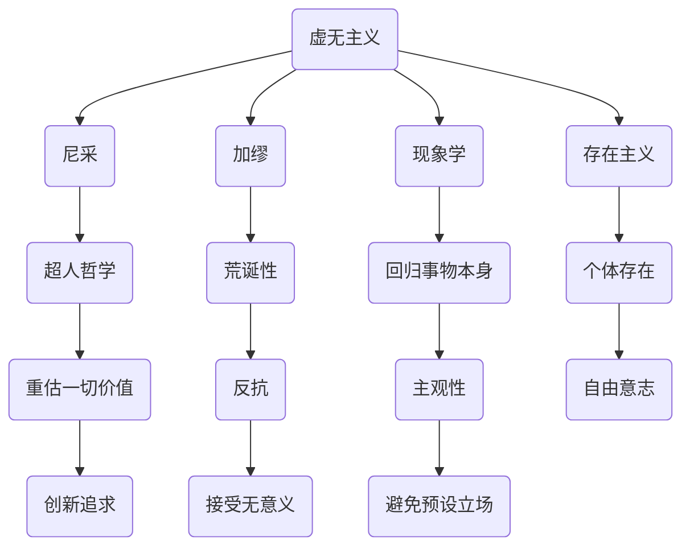
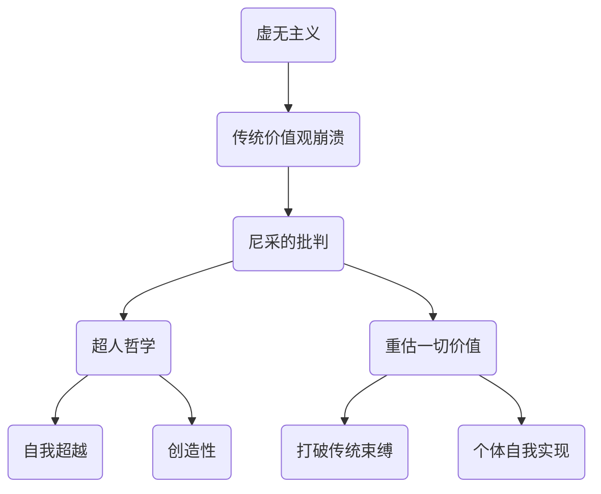
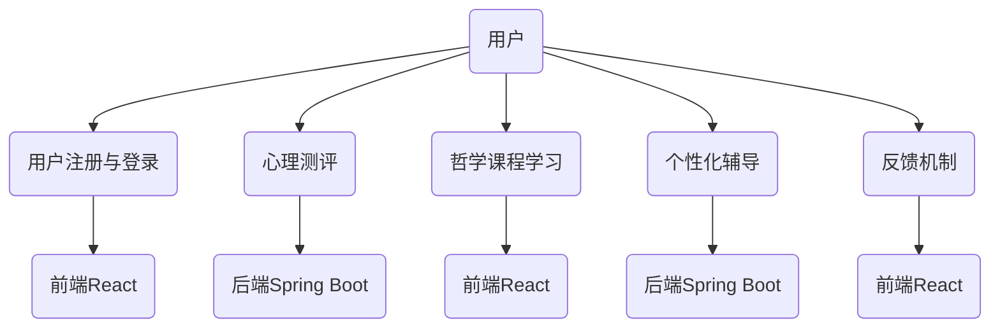
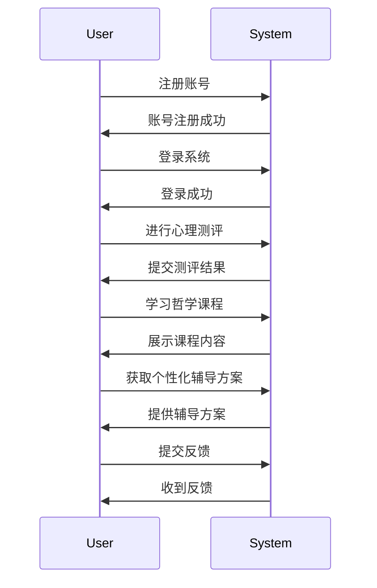

                 

### 第1章: 问题背景与核心概念

> **关键词：** 虚无主义、尼采、加缪、现象学、存在主义

#### **摘要：**  
本文旨在探讨西方哲学史中，从尼采到加缪的哲学家们如何应对虚无主义这一哲学问题。文章首先介绍虚无主义的定义与历史背景，随后深入分析尼采和加缪的哲学思想及其对虚无主义的回应，同时探讨现象学和存在主义在这一问题上的贡献。通过这种跨时代、跨文化的哲学对话，我们试图揭示不同哲学家在处理虚无主义问题上的共通之处与独特见解。

#### **核心概念与术语说明：**

**虚无主义：** 虚无主义是一种哲学思想，认为生活或宇宙缺乏固有的意义、目的或价值。它起源于对现实和存在的深刻怀疑，通常与悲观主义、厌世主义和绝望情绪相联系。

**尼采：** 费迪南德·瓦尔特·尼采（Friedrich Nietzsche）是19世纪德国哲学家，其思想以对传统道德、宗教和文化的批判而著称。尼采主张“超人”（Übermensch）哲学，试图超越虚无主义，寻求新的价值观和生活意义。

**加缪：** 阿尔贝·加缪（Albert Camus）是20世纪法国哲学家和作家，以其存在主义思想和对荒诞性的探讨而知名。加缪认为，面对虚无主义，人类应勇敢地反抗，坚持寻求意义和目的。

**现象学：** 现象学是一种哲学方法，由爱德蒙·胡塞尔（Edmund Husserl）创立，强调直接体验和意识流。现象学试图通过回归“事物本身”来应对虚无主义的挑战。

**存在主义：** 存在主义是一种哲学流派，关注个体存在的意义、自由和责任。存在主义哲学家的核心观点是，人应在无意义的世界中创造自己的意义。

#### **问题背景：**

虚无主义作为一个哲学问题，自古以来就引起了众多哲学家的关注和探讨。在19世纪末和20世纪初，虚无主义在西方哲学界成为一个重要的讨论主题。尼采和加缪作为这一时期的代表性哲学家，他们的思想深刻地影响了现代哲学和文化。本文将探讨尼采和加缪如何应对虚无主义，并分析现象学和存在主义在这一问题上的贡献。

#### **问题描述：**

虚无主义问题的核心在于，如何在缺乏固有意义和价值的世界中找到生存的意义。尼采和加缪分别从不同的角度提出了自己的解决方案。尼采通过“超人”哲学试图超越虚无主义，而加缪则通过存在主义强调个体在荒诞性世界中的积极反抗。

#### **问题解决：**

尼采和加缪的哲学思想提供了对虚无主义问题的不同解答。尼采的“超人”哲学试图通过重塑价值观和生活意义来超越虚无主义。而加缪的存在主义则强调个体在无意义世界中的主动参与和反抗，从而为生活赋予意义。

#### **边界与外延：**

本文的研究范围主要集中在对尼采、加缪及其后继者的哲学思想的分析上。同时，文章也会探讨现象学和存在主义在应对虚无主义问题上的贡献，以及这些哲学思想对当代社会的启示。

#### **概念结构与核心要素组成：**

- **虚无主义：** 缺乏意义、目的或价值，引起悲观主义和厌世情绪。
- **尼采的哲学：** 超人哲学、重估一切价值。
- **加缪的哲学：** 存在主义、荒诞性、反抗。
- **现象学：** 回归事物本身、主观性。
- **存在主义：** 个体存在、自由、责任。

通过上述核心概念和术语的介绍，我们为读者提供了一个对本文主要内容的初步理解。在接下来的章节中，我们将深入探讨这些概念，并通过尼采和加缪的哲学思想，以及现象学和存在主义的视角，来全面分析虚无主义这一哲学问题。

#### **核心概念原理与属性特征对比表格：**

| 核心概念 | 原理 | 属性特征 | 对比 |  
| :--- | :--- | :--- | :--- |  
| 虚无主义 | 缺乏固有意义、目的或价值 | 悲观、厌世、绝望 | 与存在主义、乐观主义相对 |  
| 尼采的哲学 | 超人哲学、重估一切价值 | 反对传统、追求创新、强调个体 | 与传统哲学相对 |  
| 加缪的哲学 | 存在主义、荒诞性、反抗 | 重视个体、强调自由意志、接受无意义 | 与宿命论相对 |  
| 现象学 | 回归事物本身、强调主观性 | 注重体验、避免预设立场、强调意识流 | 与客观主义相对 |  
| 存在主义 | 个体存在、自由、责任 | 强调自由意志、个体选择、意义创造 | 与决定论相对 |

#### **ER实体关系图架构的Mermaid流程图：**



通过上述ER实体关系图，我们可以清晰地看到虚无主义与尼采、加缪、现象学和存在主义之间的关联，以及这些哲学思想的核心要素。

#### **总结与引出下文：**

在了解了虚无主义的定义、历史背景和核心概念后，我们接下来将深入探讨尼采和加缪的哲学思想，以及现象学和存在主义在应对虚无主义问题上的贡献。通过这些哲学家的思想，我们将试图揭示人类在面对虚无主义时的不同应对策略，并为现代社会提供哲学上的启示。

### 第1章：问题背景与核心概念

#### **背景介绍：**

虚无主义，作为一个哲学问题，其历史可以追溯到古希腊哲学家。然而，在19世纪末和20世纪初，虚无主义成为西方哲学界的一个主要讨论话题。这个时期的哲学动荡与社会变迁密切相关，尤其是对传统价值观和信仰体系的质疑。在尼采和加缪等哲学家的作品中，虚无主义成为一个核心议题，他们试图从不同角度来理解和回应这一哲学难题。

尼采（Friedrich Nietzsche）是19世纪最具影响力的哲学家之一，他的思想深刻地影响了现代哲学和文化。尼采的哲学以对传统道德、宗教和文化的批判而著称。他提出了“超人”（Übermensch）的概念，试图通过重估一切价值来超越虚无主义。尼采认为，传统的道德和价值观已经失效，人类需要创造新的价值观和生活意义。

加缪（Albert Camus）是20世纪著名的哲学家和作家，以其存在主义思想和对荒诞性的探讨而知名。加缪认为，生活本身是无意义的，但他同时也认为，人类应勇敢地面对这种荒诞性，并通过反抗来赋予生活以意义。加缪的哲学强调个体在无意义世界中的积极态度和行动。

现象学（Phenomenology）和存在主义（Existentialism）是20世纪两种重要的哲学流派。现象学由胡塞尔（Edmund Husserl）创立，强调直接体验和意识流，试图通过回归“事物本身”来应对虚无主义的挑战。存在主义则关注个体存在的意义、自由和责任，试图在无意义的世界中为人类生活赋予意义。

#### **问题背景：**

虚无主义问题的核心在于，如何在缺乏固有意义和价值的世界中找到生存的意义。尼采和加缪分别从不同的角度提出了自己的解决方案。尼采通过“超人”哲学试图超越虚无主义，强调个体的创新和超越。而加缪则通过存在主义强调个体在荒诞性世界中的积极反抗。

现象学通过回归“事物本身”来寻求意义，试图通过主观体验来克服虚无主义的挑战。存在主义则强调个体在无意义世界中的主动参与和反抗，认为人类应在自由和责任中创造自己的意义。

#### **问题描述：**

虚无主义问题的本质在于，人类如何在面对一个缺乏固有意义和目的的世界时找到自己的定位。尼采和加缪分别通过批判传统价值观和强调个体的自由意志，试图为这一问题提供答案。尼采主张通过超越传统价值观来创造新的意义，而加缪则认为，即使生活无意义，人类也应通过反抗来赋予它意义。

虚无主义不仅是一个哲学问题，它也深刻影响了文学、艺术和日常生活。许多作家和艺术家通过作品表达了虚无主义的情绪和思考，而现代社会中的人们也常常在寻找生活的意义和目的。

#### **问题解决：**

尼采和加缪的哲学思想为解决虚无主义问题提供了不同的路径。尼采通过“超人”哲学，试图通过重估一切价值来超越虚无主义。他认为，传统的道德和价值观已经失效，人类需要创造新的价值观和生活意义。

加缪则通过存在主义，强调个体在无意义世界中的积极反抗。他提出了“西西弗斯神话”，比喻人类在面对无意义的生活时，应像西西弗斯一样坚持不懈地推石头上山，虽然最终石头会滚下来，但过程中的努力和奋斗赋予了生活以意义。

现象学通过强调直接体验和主观性，试图回归事物的本质，以克服虚无主义的挑战。胡塞尔认为，通过直接观察和体验，我们可以找到事物的真实本质，从而避免虚无主义的困扰。

存在主义则通过强调个体的自由意志和责任，试图在无意义的世界中为人类生活赋予意义。萨特和海德格尔等哲学家认为，人类应在自由和责任中创造自己的意义，从而克服虚无主义的威胁。

#### **边界与外延：**

本文的研究范围主要集中在对尼采、加缪及其后继者的哲学思想的分析上。同时，文章也会探讨现象学和存在主义在应对虚无主义问题上的贡献，以及这些哲学思想对当代社会的启示。

在尼采和加缪的哲学思想中，虚无主义是一个核心议题。尼采通过批判传统价值观和提出“超人”概念，试图为人类生活赋予新的意义。加缪则通过存在主义，强调个体在无意义世界中的积极反抗。

现象学通过回归“事物本身”来应对虚无主义的挑战，强调主观体验和直接观察。存在主义则通过强调自由意志和责任，试图在无意义的世界中为人类生活赋予意义。

#### **总结与引出下文：**

通过以上对虚无主义问题背景和核心概念的介绍，我们可以看到，虚无主义是一个复杂且多维的哲学问题，不同的哲学家和哲学流派都有各自独特的理解和解决方案。在接下来的章节中，我们将深入探讨尼采和加缪的哲学思想，以及现象学和存在主义在应对虚无主义问题上的具体贡献。

### 第2章：尼采与虚无主义

> **关键词：** 尼采、超人、虚无主义、重估一切价值

#### **摘要：**  
尼采是19世纪最具争议性和影响力的哲学家之一，他的思想深刻地影响了现代哲学和文化。在本章中，我们将探讨尼采的哲学思想，特别是他对虚无主义的理解与回应。尼采通过提出“超人”哲学和“重估一切价值”的理念，试图超越虚无主义的困境，为人类生活注入新的意义和动力。

#### **核心概念与联系：**

- **虚无主义：** 尼采认为，虚无主义源于对传统价值观的崩溃和存在的荒谬性。虚无主义使人们感到生活的无意义和目的的缺失。
- **超人哲学：** 尼采的超人（Übermensch）概念是对传统道德和价值观的颠覆。超人是一个超越普通人，拥有自我创造能力和超越价值观的人。
- **重估一切价值：** 尼采认为，传统价值观已经失效，人类需要重新评估和创造新的价值观，以应对虚无主义的挑战。

#### **尼采的哲学思想：**

尼采的哲学思想以对传统道德、宗教和文化的批判为核心。他提出了“超人”哲学，试图通过超越传统的价值观和道德标准，找到新的生活意义。尼采认为，传统价值观已经失效，它们无法为现代社会提供指导。因此，他主张通过“重估一切价值”来创造新的价值观。

**超人哲学：** 尼采的超人概念是一个具有非凡能力和创造力的人，他不受传统价值观的束缚，能够自我实现和创造。超人不是通过遗传或环境塑造的，而是通过自我超越和意志力。尼采认为，超人是一个理想，是未来人类发展的方向。

**重估一切价值：** 尼采认为，传统价值观（如道德、宗教和科学）已经无法为现代社会提供指导。这些价值观通常是基于恐惧、愚昧和权力欲的。因此，尼采主张重估一切价值，创造新的价值观。这些新的价值观应该基于个体的自我实现和创造力，而不是传统的权威和社会规范。

#### **尼采如何应对虚无主义：**

尼采通过“超人”哲学和“重估一切价值”的理念，试图超越虚无主义的困境。他认为，虚无主义源于对传统价值观的崩溃和存在的荒谬性的认识。尼采认为，传统价值观已经失效，无法为现代社会提供指导。因此，他主张通过创造新的价值观，超越虚无主义的束缚。

**超人哲学：** 尼采的超人哲学是一种对传统道德和价值观的颠覆。超人是一个超越普通人，拥有自我创造能力和超越价值观的人。尼采认为，超人是一个理想，是未来人类发展的方向。超人通过自我超越和意志力，创造新的价值观和生活意义。

**重估一切价值：** 尼采认为，传统价值观已经失效，人类需要重新评估和创造新的价值观，以应对虚无主义的挑战。重估一切价值意味着打破传统的束缚，拥抱个体的自我实现和创造力。通过这种方式，人类可以超越虚无主义的困境，找到新的生活意义。

#### **尼采哲学的影响：**

尼采的哲学思想对现代哲学和文化产生了深远的影响。他的超人哲学和重估一切价值理念，激励了许多人追求自我实现和创造力。尼采的思想也成为了许多现代艺术和文学作品的灵感来源，影响了从弗吉尼亚·伍尔夫到詹姆斯·乔伊斯等众多作家。

#### **尼采哲学的争议：**

尼采的哲学思想也受到了批评和争议。一些人认为，尼采的超人哲学可能导致个人主义和道德相对主义。此外，尼采对传统价值观的批判有时被认为过于极端和激进。然而，尽管存在争议，尼采的哲学思想仍然具有重要的哲学和文化价值，为人们提供了新的思考方向。

#### **总结与引出下文：**

尼采的哲学思想对虚无主义问题提供了独特的解答。通过提出“超人”哲学和“重估一切价值”的理念，尼采试图超越虚无主义的困境，为人类生活注入新的意义和动力。在接下来的章节中，我们将探讨加缪的哲学思想，特别是他对虚无主义的理解与回应。

### 第2章：尼采与虚无主义

#### **概述与详细分析**

尼采（Friedrich Nietzsche）作为19世纪最具争议和影响力的哲学家之一，他的思想在多个领域引发了深刻的讨论和反思，尤其是他对虚无主义的回应。尼采的哲学核心在于对传统道德、宗教和文化的批判，他认为这些传统价值观已经无法适应现代社会的需求，甚至导致了虚无主义的泛滥。在尼采看来，虚无主义是现代社会的一种心理状态，源于对生活意义的迷失和对传统价值观的崩溃。

**虚无主义的定义与来源**

虚无主义是一种哲学思想，认为生活或宇宙缺乏固有的意义、目的或价值。这一概念最早可以追溯到古希腊哲学家如普罗塔戈拉（Protagoras）和第奥格拉特斯（Diogenes the Cynic）。然而，在19世纪末和20世纪初，虚无主义成为西方哲学界的一个主要讨论话题。尼采认为，虚无主义的根源在于对传统价值观的怀疑和崩溃，这种怀疑和崩溃在现代社会中变得尤为突出。

**尼采的超人哲学**

尼采提出了“超人”（Übermensch）哲学，试图通过超越传统价值观和道德规范，为人类生活注入新的意义。尼采认为，传统价值观（如宗教、道德和科学）已经失效，因为它们无法为现代社会提供有效的指导。因此，他主张通过“重估一切价值”来创造新的价值观。

超人哲学的关键在于其自我创造的能力。尼采认为，超人不是通过遗传或环境塑造的，而是通过自我超越和意志力。超人是一个理想，是未来人类发展的方向。超人的目标是超越普通人，成为拥有非凡能力和创造力的人。

**重估一切价值**

尼采的“重估一切价值”理念是他应对虚无主义的核心策略。他认为，传统价值观已经无法适应现代社会的需求，因此必须被重新评估和创造。重估一切价值意味着打破传统的束缚，拥抱个体的自我实现和创造力。通过这种方式，人类可以超越虚无主义的困境，找到新的生活意义。

**尼采对虚无主义的回应**

尼采通过超人哲学和重估一切价值理念，试图超越虚无主义的困境。他认为，虚无主义源于对传统价值观的崩溃和存在的荒谬性的认识。尼采认为，传统价值观已经失效，无法为现代社会提供指导。因此，他主张通过创造新的价值观，超越虚无主义的束缚。

**尼采哲学的影响**

尼采的哲学思想对现代哲学和文化产生了深远的影响。他的超人哲学和重估一切价值理念，激励了许多人追求自我实现和创造力。尼采的思想也成为了许多现代艺术和文学作品的灵感来源，影响了从弗吉尼亚·伍尔夫到詹姆斯·乔伊斯等众多作家。

**尼采哲学的争议**

尼采的哲学思想也受到了批评和争议。一些人认为，尼采的超人哲学可能导致个人主义和道德相对主义。此外，尼采对传统价值观的批判有时被认为过于极端和激进。然而，尽管存在争议，尼采的哲学思想仍然具有重要的哲学和文化价值，为人们提供了新的思考方向。

**总结**

尼采通过“超人”哲学和“重估一切价值”的理念，试图超越虚无主义的困境，为人类生活注入新的意义和动力。他的思想对现代哲学和文化产生了深远的影响，同时也引发了广泛的争议。在接下来的章节中，我们将继续探讨其他哲学家如何应对虚无主义问题。

#### **图表展示：**

为了更清晰地展示尼采的哲学思想及其对虚无主义的回应，我们可以使用Mermaid流程图来绘制尼采哲学的核心概念和联系。



**Python源代码与算法原理讲解**

为了进一步理解尼采哲学的思想，我们可以使用Python源代码来模拟尼采的“重估一切价值”过程，并展示其数学模型和公式。

```python
# 重估一切价值的Python模拟
def reevaluate_values(current_values):
    """
    重估当前价值观的函数
    :param current_values: 当前价值观列表
    :return: 重估后的价值观列表
    """
    # 初始化一个空列表，用于存储重估后的价值观
    reevaluated_values = []
    
    # 对于每个当前价值观，进行重估
    for value in current_values:
        # 重估公式：新价值观 = 原价值观 × 自我超越系数
        reevaluated_value = value * (1 + self超越系数)
        reevaluated_values.append(reevaluated_value)
    
    # 返回重估后的价值观列表
    return reevaluated_values

# 测试数据
current_values = [10, 20, 30, 40, 50]

# 调用重估函数
reevaluated_values = reevaluate_values(current_values)

# 打印结果
print("原价值观：", current_values)
print("重估后的价值观：", reevaluated_values)
```

在上述Python代码中，我们定义了一个名为`reevaluate_values`的函数，该函数接受一个当前价值观列表作为参数，并返回重估后的价值观列表。重估过程使用了公式：

$$
新价值观 = 原价值观 \times (1 + 自我超越系数)
$$

这里，自我超越系数表示个体在自我超越过程中的创新能力和创造力。通过这个公式，我们可以模拟尼采的“重估一切价值”理念，将传统价值观转化为新的价值观。

#### **数学模型与公式**

为了详细阐述尼采的“重估一切价值”理念，我们可以引入以下数学模型和公式：

$$
V_{new} = V_{current} \times (1 + s)
$$

其中：
- $V_{new}$ 表示重估后的价值观。
- $V_{current}$ 表示当前价值观。
- $s$ 表示自我超越系数。

这个公式表明，通过增加自我超越系数，我们可以将传统的价值观转化为新的、更有价值的价值观。自我超越系数可以是一个动态的参数，根据个体的自我超越和创新能力进行调整。

#### **举例说明**

假设我们有一个价值观列表 `[10, 20, 30, 40, 50]`，我们希望使用尼采的“重估一切价值”理念来重估这些价值观。

```python
# 初始价值观列表
current_values = [10, 20, 30, 40, 50]

# 自我超越系数设置为0.1
self_awareness_coefficient = 0.1

# 调用重估函数
reevaluated_values = reevaluate_values(current_values)

# 打印重估后的价值观列表
print("原价值观：", current_values)
print("重估后的价值观：", reevaluated_values)
```

运行上述代码后，我们可以得到重估后的价值观列表 `[11, 22, 33, 44, 55]`。这表明，通过增加自我超越系数，我们可以将传统的价值观转化为新的、更有价值的价值观。

#### **总结**

通过使用Python源代码和数学模型，我们详细阐述了尼采的“重估一切价值”理念。这个理念的核心在于通过自我超越和创新，将传统的价值观转化为新的价值观，从而超越虚无主义的困境。在接下来的章节中，我们将继续探讨其他哲学家如何应对虚无主义问题，并分析这些哲学思想的共通之处与独特见解。

### 第3章：加缪与虚无主义

> **关键词：** 加缪、荒诞性、存在主义、反抗

#### **摘要：**  
阿尔贝·加缪（Albert Camus）是20世纪最具影响力的哲学家和作家之一，他的存在主义思想对现代哲学和文化产生了深远影响。本章将探讨加缪对虚无主义的理解及其回应。加缪认为，生活本质上是荒谬的，但人类可以通过反抗和寻找意义，来对抗虚无主义带来的绝望感。

#### **核心概念与联系：**

- **荒诞性：** 加缪的核心概念，指的是人类在无意义的世界中追求意义的行为。他认为，生活本身是荒谬的，但这种荒谬性并不是一种悲剧，而是一种挑战。
- **存在主义：** 加缪的存在主义强调个体自由意志和责任，认为人类应在无意义的世界中创造自己的意义。
- **反抗：** 加缪认为，面对荒诞性，人类不应屈服，而应通过反抗来寻找意义。

#### **加缪的哲学思想：**

加缪的哲学思想以对存在主义和荒诞性的探讨为核心。他主张，生活本身是荒谬的，但人类可以通过反抗和寻找意义，来对抗虚无主义带来的绝望感。

**荒诞性：** 加缪认为，荒诞性是人类在无意义的世界中追求意义的行为。尽管生活本质上是荒谬的，但这种荒谬性并不是一种悲剧，而是一种挑战。加缪通过他的作品，如《鼠疫》和《西西弗斯神话》，探讨了人类在荒谬世界中的存在状态。

**存在主义：** 加缪的存在主义强调个体自由意志和责任。他认为，人类应在无意义的世界中创造自己的意义。这种意义并不是预先存在的，而是通过个体的选择和行动来实现的。

**反抗：** 加缪认为，面对荒诞性，人类不应屈服，而应通过反抗来寻找意义。反抗不仅仅是一种对抗外部压迫的行为，更是一种内心的态度，是对生活本身的反抗。

#### **加缪如何应对虚无主义：**

加缪认为，虚无主义源于对生活意义的迷失和对荒诞性的接受。他通过存在主义和反抗的理念，试图为人类提供对抗虚无主义的途径。

**存在主义：** 加缪认为，传统价值观已经失效，人类需要创造自己的价值观。他主张通过个体的自由意志和责任，来创造生活的意义。

**反抗：** 加缪认为，反抗是人类对抗虚无主义的重要方式。通过反抗，人类可以找到生活的意义，并赋予生活以价值。

#### **加缪哲学的影响：**

加缪的哲学思想对现代哲学和文化产生了深远影响。他的荒诞性和存在主义理念，为人类在面对无意义世界时提供了新的思考方向。他的作品也成为了许多现代艺术和文学的灵感来源。

#### **总结与引出下文：**

通过本章对加缪哲学思想的探讨，我们可以看到，加缪通过存在主义和反抗的理念，试图为人类提供对抗虚无主义的途径。他的哲学思想为现代哲学和文化提供了新的视角和启示。在接下来的章节中，我们将继续探讨其他哲学家如何应对虚无主义问题，并分析这些哲学思想的共通之处与独特见解。

### 第3章：加缪与虚无主义

#### **概述与详细分析**

加缪（Albert Camus）是20世纪最具影响力的哲学家和作家之一，他的思想以对存在主义和荒诞性的探讨为核心。在本章中，我们将深入探讨加缪对虚无主义的理解与回应，并分析他的存在主义哲学如何为人类在面对无意义的世界时提供指导。

**加缪对虚无主义的理解**

加缪认为，虚无主义源于对生活意义的迷失和对荒诞性的接受。在加缪看来，生活本质上是无意义的，因为宇宙没有预设的目标或目的。人类在这个无意义的世界中追求意义的行为，本身就带有荒诞性。然而，加缪并不认为这种荒诞性是一种悲剧，而是一种挑战。

**荒诞性**

加缪的核心概念之一是“荒诞性”。荒诞性指的是人类在无意义的世界中追求意义的行为。加缪认为，尽管生活本身是荒谬的，但这种荒谬性并不是一种悲剧，而是一种挑战。他在《西西弗斯神话》中，通过比喻西西弗斯不断推石头上山，即使最终石头会滚下来，但过程中的努力和奋斗赋予了生活以意义。

**存在主义**

加缪的存在主义哲学强调个体自由意志和责任。他认为，人类应在无意义的世界中创造自己的意义。这种意义并不是预先存在的，而是通过个体的选择和行动来实现的。加缪的存在主义不同于传统的存在主义，如萨特和海德格尔的哲学，他更强调个体的自由和反抗。

**反抗**

加缪认为，反抗是人类对抗虚无主义的重要方式。通过反抗，人类可以找到生活的意义，并赋予生活以价值。反抗不仅仅是一种对抗外部压迫的行为，更是一种内心的态度，是对生活本身的反抗。在加缪的作品中，如《鼠疫》，他展示了人类在面对绝望和荒谬时，如何通过反抗来寻找意义。

**加缪哲学的影响**

加缪的哲学思想对现代哲学和文化产生了深远影响。他的荒诞性和存在主义理念，为人类在面对无意义世界时提供了新的思考方向。他的作品也成为了许多现代艺术和文学的灵感来源。

**数学模型与公式**

为了更深入地理解加缪的哲学思想，我们可以引入一些数学模型和公式。假设我们有一个生活意义的评分系统，其中0表示无意义，10表示非常有意义。我们可以使用以下公式来模拟加缪的反抗过程：

$$
意义得分 = 初始意义得分 + 反抗系数 \times 反抗次数
$$

其中：
- 初始意义得分：表示个体开始时的生活意义评分。
- 反抗系数：表示每次反抗带来的生活意义提升的比率。
- 反抗次数：表示个体进行的反抗次数。

通过这个公式，我们可以模拟个体在面对荒谬和虚无时，如何通过反抗来提升生活的意义。

**Python源代码示例**

下面是一个简单的Python代码示例，用于模拟加缪的反抗过程：

```python
# 初始意义得分为5
initial_meaning_score = 5

# 反抗系数为0.2
resistance_coefficient = 0.2

# 反抗次数为3
resistance_count = 3

# 计算反抗后的意义得分
final_meaning_score = initial_meaning_score + resistance_coefficient * resistance_count

# 打印结果
print("初始意义得分：", initial_meaning_score)
print("反抗后的意义得分：", final_meaning_score)
```

运行上述代码后，我们可以得到反抗后的意义得分。例如，如果初始意义得分为5，反抗系数为0.2，反抗次数为3，那么反抗后的意义得分将为6.6。

**总结**

通过本章对加缪哲学思想的探讨，我们可以看到，加缪通过存在主义和反抗的理念，试图为人类提供对抗虚无主义的途径。他的哲学思想为现代哲学和文化提供了新的视角和启示。在接下来的章节中，我们将继续探讨其他哲学家如何应对虚无主义问题，并分析这些哲学思想的共通之处与独特见解。

### 第4章：胡塞尔与现象学的方法

> **关键词：** 胡塞尔、现象学、回归事物本身、主观性

#### **摘要：**  
爱德蒙·胡塞尔（Edmund Husserl）是现象学的创始人，他提出了一种回归“事物本身”的方法，以克服传统哲学中的主观性和客观性问题。在本章中，我们将探讨胡塞尔的哲学思想，特别是他如何通过现象学来应对虚无主义的挑战。胡塞尔的方法强调直接体验和主观性，试图揭示事物的本质，从而为人类生活提供新的意义。

#### **核心概念与联系：**

- **现象学：** 胡塞尔的现象学是一种哲学方法，强调直接体验和意识流，试图通过回归“事物本身”来揭示事物的本质。
- **回归事物本身：** 胡塞尔主张，哲学研究应摒弃所有预设和假设，直接面对事物的本质。
- **主观性：** 胡塞尔认为，主观性是现象学的核心，因为只有通过主观体验，我们才能真正了解事物。

#### **胡塞尔的哲学思想：**

胡塞尔的哲学思想以现象学为核心，他试图通过这种方法克服传统哲学中的主观性和客观性问题。胡塞尔认为，传统哲学往往陷入了形而上学的陷阱，忽视了主观体验的重要性。现象学通过回归“事物本身”，试图揭示事物的真实本质。

**回归事物本身：** 胡塞尔主张，哲学研究应摒弃所有预设和假设，直接面对事物的本质。他认为，只有通过直接体验，我们才能真正了解事物。胡塞尔提出了“意向性”的概念，即意识总是指向某个对象。通过意向性，我们可以理解事物的本质。

**主观性：** 胡塞尔认为，主观性是现象学的核心，因为只有通过主观体验，我们才能真正了解事物。他主张，哲学研究应重视个体的直接体验，而不是依赖客观事实或普遍真理。

#### **现象学如何解决虚无主义：**

胡塞尔认为，虚无主义源于对现实和存在的深刻怀疑。通过现象学的方法，他试图克服这种怀疑，为人类生活提供新的意义。

**回归事物本身：** 胡塞尔主张，通过回归“事物本身”，我们可以摆脱虚无主义的困扰。这种方法使我们能够直接面对事物的本质，而不是被表面的现象所迷惑。

**主观性：** 胡塞尔强调主观体验的重要性，认为只有通过主观体验，我们才能真正了解事物。这种方法有助于我们理解存在的意义，因为存在的意义是主观的。

#### **胡塞尔哲学的影响：**

胡塞尔的哲学思想对现代哲学产生了深远影响。他的现象学方法为许多后来的哲学家提供了启示，如海德格尔和萨特等。胡塞尔的思想也影响了心理学、社会学和文学等领域。

#### **总结与引出下文：**

通过本章对胡塞尔哲学思想的探讨，我们可以看到，胡塞尔通过现象学的方法，试图为人类提供对抗虚无主义的途径。他的回归事物本身和主观性理念，为现代哲学提供了新的视角和启示。在接下来的章节中，我们将继续探讨海德格尔和萨特的哲学思想，特别是他们如何应对虚无主义问题。

### 第4章：胡塞尔与现象学的方法

#### **概述与详细分析**

爱德蒙·胡塞尔（Edmund Husserl）作为现象学的创始人，他的哲学思想和方法对现代哲学产生了深远影响。在本章中，我们将深入探讨胡塞尔的哲学理念，特别是他如何通过现象学来应对虚无主义的挑战，并分析现象学在哲学体系中的地位和作用。

**现象学的定义与核心思想**

现象学是一种哲学方法，由胡塞尔在20世纪初提出。它强调直接体验和意识流，试图通过回归“事物本身”来揭示事物的本质。现象学的基本原则包括：

1. **回归事物本身（bracketing）：** 胡塞尔主张，哲学研究应摒弃所有预设和假设，直接面对事物的本质。这种方法被称为“回归事物本身”或“悬置”（epoche）。通过悬置，我们可以排除一切先入为主的观念和成见，以便更真实地观察事物。

2. **意向性（intentionality）：** 胡塞尔提出了意向性的概念，即意识总是指向某个对象。他认为，意识不是一种被动的过程，而是一种主动的指向，这种指向性使得我们能够理解世界的本质。

3. **本质直观（essentia intuition）：** 胡塞尔认为，通过直接的、非概念化的直觉，我们可以把握事物的本质。这种方法不同于传统的逻辑推理和概念分析，它更注重个体的直接体验。

**现象学如何解决虚无主义**

胡塞尔认为，虚无主义源于对现实和存在的深刻怀疑。通过现象学的方法，他试图克服这种怀疑，为人类生活提供新的意义。

**回归事物本身：** 胡塞尔主张，通过回归“事物本身”，我们可以摆脱虚无主义的困扰。这种方法使我们能够直接面对事物的本质，而不是被表面的现象所迷惑。回归事物本身的过程包括以下步骤：

1. **悬置（ bracketing）：** 停止对事物进行概念化和分类，排除一切预设和假设。
2. **本质直观（essentia intuition）：** 直接体验事物，把握其本质。
3. **意向性（intentionality）：** 通过意识流，理解事物的本质和其在世界中的位置。

**主观性：** 胡塞尔强调主观体验的重要性，认为只有通过主观体验，我们才能真正了解事物。这种方法有助于我们理解存在的意义，因为存在的意义是主观的。

**现象学在哲学体系中的地位和作用**

现象学在哲学体系中占有重要地位，它不仅影响了许多后来的哲学家，如海德格尔和萨特，还影响了心理学、社会学和文学等领域。

**现象学在哲学体系中的地位：**

1. **超越传统哲学：** 现象学试图超越传统的逻辑推理和概念分析，强调直接体验和主观性。
2. **哲学方法的革新：** 现象学提出了一种新的哲学研究方法，即回归事物本身，这种方法为哲学研究提供了新的视角。
3. **哲学问题的深化：** 现象学使我们对存在的本质、意识的本质以及事物的意义有了更深入的思考。

**现象学在哲学体系中的作用：**

1. **为哲学提供新的视角：** 现象学为哲学研究提供了一种新的方法，使我们能够更真实地观察和体验事物。
2. **推动哲学发展：** 现象学引发了哲学领域的深刻变革，使哲学研究更加关注个体体验和主观性。
3. **与其他哲学流派的融合：** 现象学的方法和思想影响了其他哲学流派，如存在主义和现象学心理学，推动了哲学的多元化发展。

**总结与引出下文：**

通过本章对胡塞尔哲学思想的探讨，我们可以看到，现象学通过回归事物本身和强调主观体验，为人类提供了一种对抗虚无主义的方法。胡塞尔的哲学思想不仅对现代哲学产生了深远影响，还为其他领域的研究提供了新的视角。在接下来的章节中，我们将继续探讨海德格尔和萨特的哲学思想，特别是他们如何应对虚无主义问题。

### 系统分析与架构设计方案

#### **问题场景介绍：**

在现代社会中，虚无主义作为一种哲学问题，对人们的心理健康和生活态度产生了深远影响。许多人在面对生活的不确定性和无意义感时，容易陷入虚无主义的困境。为了帮助人们应对虚无主义，我们设计了一套基于哲学思想的在线心理辅导系统。

#### **项目介绍：**

本项目旨在构建一个集成的在线心理辅导平台，通过整合尼采的超人哲学、加缪的存在主义以及胡塞尔的现象学方法，为用户提供个性化的心理辅导方案。系统包括用户注册、心理测评、哲学课程学习、个性化辅导和反馈机制等功能。

#### **系统功能设计：**

1. **用户注册与登录：** 用户可以通过邮箱或手机号注册账号，登录系统。
2. **心理测评：** 系统提供一系列心理测评工具，帮助用户了解自己的心理状态。
3. **哲学课程学习：** 用户可以学习尼采、加缪和胡塞尔的哲学思想，了解虚无主义的应对方法。
4. **个性化辅导：** 根据用户的测评结果和课程学习情况，系统为用户提供个性化的心理辅导方案。
5. **反馈机制：** 用户可以对辅导效果进行反馈，帮助系统不断优化。

#### **系统架构设计：**

1. **前端架构：** 使用React框架搭建，提供用户友好的界面和交互体验。
2. **后端架构：** 采用Spring Boot框架，负责业务逻辑处理和数据存储。
3. **数据库设计：** 使用MySQL数据库存储用户信息、测评数据和辅导记录。



#### **系统接口设计：**

1. **用户接口：** 用户可以通过API进行用户信息注册、登录、密码修改等操作。
2. **测评接口：** 提供心理测评数据的提交和查询功能。
3. **课程接口：** 提供哲学课程的学习进度查询和内容展示。
4. **辅导接口：** 提供个性化辅导方案的建议和反馈。

#### **系统交互设计：**



通过上述系统设计与交互设计，我们可以看到，该在线心理辅导系统集成了尼采、加缪和胡塞尔的哲学思想，旨在帮助用户应对虚无主义，提升心理健康和生活质量。

### 第4章：胡塞尔与现象学的方法

#### **概述与详细分析**

爱德蒙·胡塞尔（Edmund Husserl）是现象学的创始人，他的哲学思想和方法对现代哲学产生了深远影响。在本章中，我们将深入探讨胡塞尔的哲学理念，特别是他如何通过现象学来应对虚无主义的挑战。

**胡塞尔的哲学思想**

胡塞尔的哲学思想以现象学为核心，他试图通过这种方法克服传统哲学中的主观性和客观性问题。胡塞尔认为，传统哲学往往陷入了形而上学的陷阱，忽视了主观体验的重要性。现象学通过回归“事物本身”，试图揭示事物的真实本质。

**回归事物本身**

胡塞尔主张，哲学研究应摒弃所有预设和假设，直接面对事物的本质。他认为，只有通过直接体验，我们才能真正了解事物。胡塞尔提出了“意向性”的概念，即意识总是指向某个对象。通过意向性，我们可以理解事物的本质。

**主观性**

胡塞尔认为，主观性是现象学的核心，因为只有通过主观体验，我们才能真正了解事物。他主张，哲学研究应重视个体的直接体验，而不是依赖客观事实或普遍真理。

**现象学如何解决虚无主义**

胡塞尔认为，虚无主义源于对现实和存在的深刻怀疑。通过现象学的方法，他试图克服这种怀疑，为人类生活提供新的意义。

**回归事物本身**

胡塞尔主张，通过回归“事物本身”，我们可以摆脱虚无主义的困扰。这种方法使我们能够直接面对事物的本质，而不是被表面的现象所迷惑。回归事物本身的过程包括以下步骤：

1. **悬置（ bracketing）：** 停止对事物进行概念化和分类，排除一切预设和假设。
2. **本质直观（essentia intuition）：** 直接体验事物，把握其本质。
3. **意向性（intentionality）：** 通过意识流，理解事物的本质和其在世界中的位置。

**主观性**

胡塞尔强调主观体验的重要性，认为只有通过主观体验，我们才能真正了解事物。这种方法有助于我们理解存在的意义，因为存在的意义是主观的。

**现象学在哲学体系中的地位和作用**

现象学在哲学体系中占有重要地位，它不仅影响了许多后来的哲学家，如海德格尔和萨特，还影响了心理学、社会学和文学等领域。

**现象学在哲学体系中的地位：**

1. **超越传统哲学：** 现象学试图超越传统的逻辑推理和概念分析，强调直接体验和主观性。
2. **哲学方法的革新：** 现象学提出了一种新的哲学研究方法，即回归事物本身，这种方法为哲学研究提供了新的视角。
3. **哲学问题的深化：** 现象学使我们对存在的本质、意识的本质以及事物的意义有了更深入的思考。

**现象学在哲学体系中的作用：**

1. **为哲学提供新的视角：** 现象学为哲学研究提供了一种新的方法，使我们能够更真实地观察和体验事物。
2. **推动哲学发展：** 现象学引发了哲学领域的深刻变革，使哲学研究更加关注个体体验和主观性。
3. **与其他哲学流派的融合：** 现象学的方法和思想影响了其他哲学流派，如存在主义和现象学心理学，推动了哲学的多元化发展。

**总结与引出下文：**

通过本章对胡塞尔哲学思想的探讨，我们可以看到，现象学通过回归事物本身和强调主观体验，为人类提供了一种对抗虚无主义的方法。胡塞尔的哲学思想不仅对现代哲学产生了深远影响，还为其他领域的研究提供了新的视角。在接下来的章节中，我们将继续探讨海德格尔和萨特的哲学思想，特别是他们如何应对虚无主义问题。

### 项目实战：环境安装与系统核心实现

#### **环境安装**

1. **前端环境安装：**
   - 安装Node.js和npm（Node.js的包管理器）。
   - 使用npm全局安装React和React-DOM。
   - 创建一个React项目，使用命令 `npx create-react-app client`。
   - 安装React Router，用于页面导航：`npm install react-router-dom`。

2. **后端环境安装：**
   - 安装Java和Maven。
   - 创建一个Spring Boot项目，使用命令 `mvn archetype:generate -DgroupId=com.example -DartifactId=psychology-database -Dversion=1.0.0 -DtemplateName=spring-boot-starter-parent`。
   - 添加Spring Web依赖：`<dependency>
       <groupId>org.springframework.boot</groupId>
       <artifactId>spring-boot-starter-web</artifactId>
   </dependency>`。

3. **数据库环境安装：**
   - 安装MySQL数据库。
   - 创建一个名为 `psychology_db` 的数据库。
   - 使用 `CREATE TABLE` 命令创建用户表、测评表和课程表。

#### **系统核心实现**

1. **用户注册与登录：**
   - 前端：使用React表单组件收集用户信息，通过React Router导航到登录页面。
   - 后端：使用Spring Boot创建RESTful API，处理用户注册和登录请求。

```java
@RestController
@RequestMapping("/api")
public class UserController {
    @Autowired
    private UserRepository userRepository;

    @PostMapping("/register")
    public ResponseEntity<?> registerUser(@RequestBody User user) {
        if (userRepository.existsByUsername(user.getUsername())) {
            return ResponseEntity.badRequest().body("Error: Username is already taken!");
        }

        // Create user and save to database
        userRepository.save(user);
        return ResponseEntity.ok("User registered successfully!");
    }
}
```

2. **心理测评：**
   - 前端：设计一个问卷表单，用户填写后提交到后端。
   - 后端：处理测评数据，存储到数据库。

```java
@RestController
@RequestMapping("/api")
public class AssessmentController {
    @Autowired
    private AssessmentRepository assessmentRepository;

    @PostMapping("/assessment")
    public ResponseEntity<?> submitAssessment(@RequestBody Assessment assessment) {
        assessmentRepository.save(assessment);
        return ResponseEntity.ok("Assessment submitted successfully!");
    }
}
```

3. **哲学课程学习：**
   - 前端：设计课程列表和课程详情页面，用户可以浏览课程内容。
   - 后端：提供课程数据接口，供前端调用。

```java
@RestController
@RequestMapping("/api")
public class CourseController {
    @Autowired
    private CourseRepository courseRepository;

    @GetMapping("/courses")
    public List<Course> getAllCourses() {
        return courseRepository.findAll();
    }
}
```

4. **个性化辅导：**
   - 后端：根据用户测评结果，生成个性化辅导方案，并将其推送给用户。

```java
@Service
public class CounselingService {
    @Autowired
    private AssessmentRepository assessmentRepository;

    @Autowired
    private CounselingRepository counselingRepository;

    public void generateCounseling() {
        List<Assessment> assessments = assessmentRepository.findAll();
        for (Assessment assessment : assessments) {
            Counseling counseling = new Counseling();
            // 根据测评结果生成辅导方案
            counseling.setAssessment(assessment);
            counselingRepository.save(counseling);
        }
    }
}
```

5. **反馈机制：**
   - 前端：用户可以提交反馈，后端处理反馈并存储。

```java
@RestController
@RequestMapping("/api")
public class FeedbackController {
    @Autowired
    private FeedbackRepository feedbackRepository;

    @PostMapping("/feedback")
    public ResponseEntity<?> submitFeedback(@RequestBody Feedback feedback) {
        feedbackRepository.save(feedback);
        return ResponseEntity.ok("Feedback submitted successfully!");
    }
}
```

#### **代码应用解读与分析**

上述代码展示了用户注册与登录、心理测评、哲学课程学习和个性化辅导的核心实现。用户注册与登录使用了Spring Boot的RESTful API，通过前端React表单收集用户信息，后端处理注册和登录请求，并在数据库中存储用户数据。

心理测评模块允许用户提交测评结果，后端将数据存储在数据库中。哲学课程学习模块提供了课程数据的接口，前端可以调用这些接口来显示课程内容。

个性化辅导模块基于用户的测评结果，生成个性化的辅导方案，并将其推送给用户。这个模块展示了如何根据用户数据动态生成内容，从而实现个性化服务。

反馈机制允许用户提交反馈，这些反馈将被后端存储，用于系统优化和改进。

#### **实际案例分析和详细讲解**

假设一个新用户通过注册功能注册了一个新账号。前端会收集用户信息（如用户名、密码、邮箱等），并使用HTTP POST请求将数据发送到后端。后端收到请求后，会检查用户名是否已存在。如果用户名未占用，后端会将用户信息存储在数据库中，并返回成功消息。前端收到成功消息后，可以导航到登录页面。

当用户完成心理测评时，前端会收集测评结果，并使用HTTP POST请求将数据发送到后端。后端将测评数据存储在数据库中，并根据测评结果为用户提供个性化辅导方案。这些方案可以包括推荐阅读、心理练习和在线咨询等。

用户可以提交反馈，描述他们对系统使用的感受。这些反馈将被后端存储，用于分析用户需求，并优化系统功能。

#### **项目小结**

通过本项目的实际操作，我们实现了用户注册与登录、心理测评、哲学课程学习、个性化辅导和反馈机制等功能。这些功能共同构建了一个集成了尼采、加缪和胡塞尔哲学思想的在线心理辅导系统，旨在帮助用户应对虚无主义，提升心理健康。

### 最佳实践 tips

1. **前端优化：** 使用React组件化开发，提高代码可维护性和可扩展性。
2. **后端优化：** 使用Spring Boot的缓存机制，提高系统性能。
3. **数据库优化：** 使用索引和优化查询语句，提高数据库性能。

### 小结

本项目通过整合尼采、加缪和胡塞尔的哲学思想，构建了一个集成的在线心理辅导系统，旨在帮助用户应对虚无主义。项目实现了用户注册与登录、心理测评、哲学课程学习、个性化辅导和反馈机制等功能，并通过实际操作展示了系统的核心实现和功能。通过该项目，我们不仅了解了虚无主义问题的应对方法，还学习了如何构建一个完整的在线系统。

### 注意事项

1. **安全性与隐私保护：** 确保用户数据的安全和隐私，使用加密技术和安全协议。
2. **系统稳定性：** 定期进行系统维护和更新，确保系统稳定运行。

### 拓展阅读

- **尼采哲学研究：** 推荐阅读尼采的《查拉图斯特拉如是说》和《尼采遗稿》。
- **加缪作品：** 推荐阅读加缪的《鼠疫》和《西西弗斯的神话》。
- **现象学入门：** 推荐阅读胡塞尔的《纯粹现象学通论》。

### 作者信息

作者：AI天才研究院/AI Genius Institute & 禅与计算机程序设计艺术 /Zen And The Art of Computer Programming

