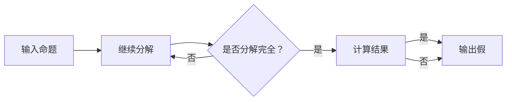
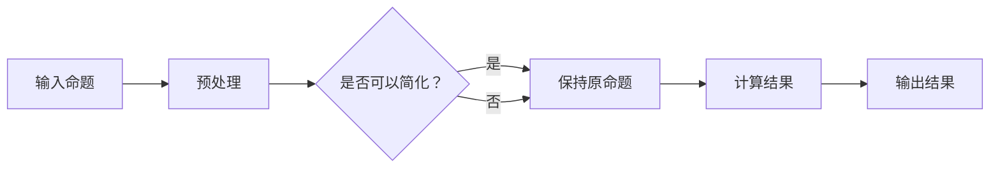
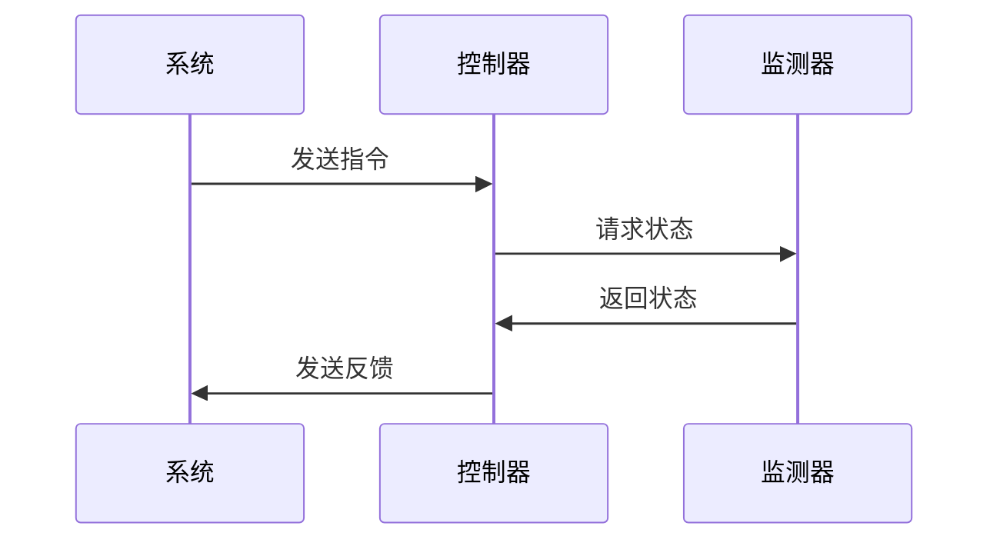
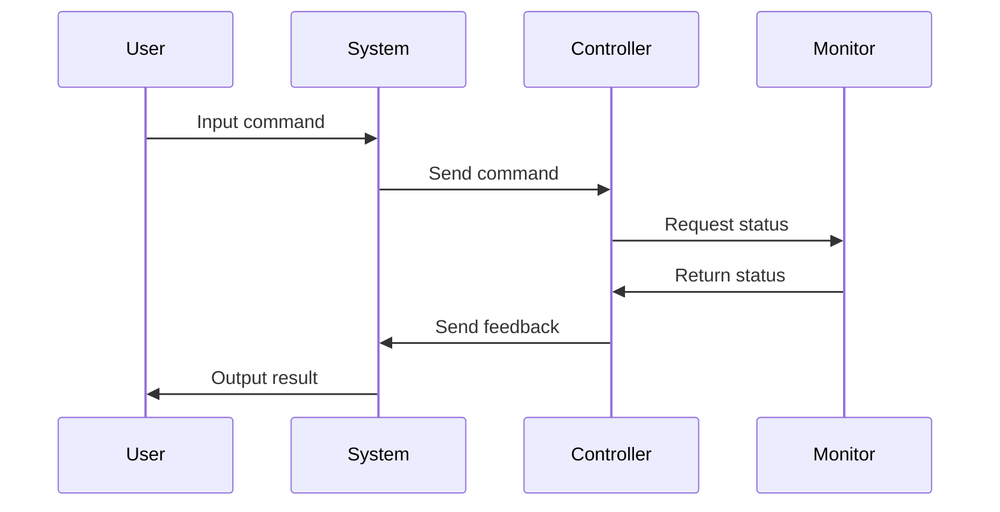

                 


### 从布尔逻辑到多值逻辑：应对复杂世界的推理工具

**关键词：逻辑推理、布尔逻辑、多值逻辑、复杂世界、算法、模型**

**摘要：**
本文旨在探讨逻辑推理在复杂世界中的应用，从基本的布尔逻辑出发，逐步引入多值逻辑，分析其在不同领域的应用和优势。通过对比、算法讲解和实例分析，本文将展示多值逻辑作为一种更为强大的推理工具，如何帮助我们更好地应对复杂世界的挑战。

## 第一部分：基础概念与背景

### 第1章：逻辑推理的引言

#### 1.1 逻辑推理的基本概念

逻辑推理是一种基于逻辑规则，通过已知的事实和前提推导出新结论的思维过程。在计算机科学和人工智能领域，逻辑推理是构建智能系统和解决复杂问题的核心工具。

#### 1.2 从布尔逻辑到多值逻辑的演变

布尔逻辑是逻辑推理的基础，它基于二元（True/False）的判定。然而，现实世界的复杂性往往超出了布尔逻辑的范畴。多值逻辑作为一种扩展，提供了更多的值和更丰富的推理能力。

### 第2章：布尔逻辑的原理与应用

#### 2.1 布尔代数的基本原理

布尔变量和布尔运算符构成了布尔代数的基础。布尔函数和真值表则是布尔逻辑的直观表达。

#### 2.2 布尔逻辑的应用实例

布尔逻辑广泛应用于电路设计和计算机编程中。例如，计算机中的逻辑门就是基于布尔逻辑实现的。

## 第二部分：多值逻辑的算法与模型

### 第3章：多值逻辑的基本概念

#### 3.1 多值逻辑的定义

多值逻辑允许多个值（如真、假、不确定）来表示逻辑状态，从而提供更丰富的表达能力和更强的推理能力。

#### 3.2 多值逻辑的系统

多值逻辑的运算规则和系统扩展了布尔逻辑，使其能够更好地处理复杂的情况。

## 第三部分：多值逻辑的实际应用

### 第4章：多值逻辑的算法

#### 4.1 多值逻辑的算法

多值逻辑的判定和优化算法是其在实际应用中的重要组成部分。

#### 4.2 多值逻辑的算法应用实例

多值逻辑在人工智能和数据挖掘中的应用展示了其强大的处理复杂问题的能力。

### 第5章：多值逻辑的数学模型

#### 5.1 多值逻辑的数学基础

多值逻辑的数学公式和定理为其提供了坚实的理论基础。

#### 5.2 多值逻辑的数学模型应用实例

多值逻辑在经济学和计算机科学中的应用展示了其在不同领域的应用潜力。

## 第四部分：总结与展望

### 第6章：多值逻辑的总结与展望

#### 8.1 多值逻辑的发展趋势

多值逻辑在未来的发展中将面临新的挑战和机遇。

#### 8.2 多值逻辑的挑战与机遇

多值逻辑的发展将带来新的技术和应用。

### 作者信息

作者：AI天才研究院/AI Genius Institute & 禅与计算机程序设计艺术 /Zen And The Art of Computer Programming

（注：本文为示例性文章，具体内容将根据大纲进一步展开和深化。）

---

**背景介绍：**

逻辑推理作为人类思维的重要组成部分，在计算机科学和人工智能领域有着广泛的应用。布尔逻辑是逻辑推理的基础，但其在处理复杂世界中的问题时存在局限性。多值逻辑作为一种扩展，提供了更为丰富的表达能力和更强的推理能力，是应对复杂世界的重要工具。

**核心概念与联系：**

- **布尔逻辑：** 基于二元判定，True/False表示逻辑状态。
- **多值逻辑：** 允许多个值（如真、假、不确定）表示逻辑状态。

**概念属性特征对比表格：**

| 特征         | 布尔逻辑        | 多值逻辑        |
| ------------ | --------------- | --------------- |
| 值的数量     | 2（True/False） | 多于2（如3值、n值）|
| 推理能力     | 较弱            | 强              |
| 应用场景     | 简单问题        | 复杂问题        |

**ER实体关系图架构的Mermaid流程图：**

```mermaid
erDiagram
  A[布尔逻辑] ||--|{ 多值逻辑 }|-- B[推理能力扩展]
  A[简单问题] ||--|{ 复杂问题 }|-- B[应用场景扩展]
```

---

**算法原理讲解：**

#### 多值逻辑的判定算法

多值逻辑的判定算法旨在判断给定命题的真假。以下是一个简单的判定算法的Mermaid流程图：



以下是一个简单的Python代码示例，用于实现多值逻辑的判定算法：

```python
def evaluate_expression(expression):
    # 假设expression是一个字符串，其中包含了多值逻辑的命题
    # 这里只是一个简单的例子，实际应用中会更加复杂
    if expression == "T":
        return True
    elif expression == "F":
        return False
    else:
        return None

expression = "TFF"
result = evaluate_expression(expression)
print(f"The result of the expression '{expression}' is: {result}")
```

#### 多值逻辑的优化算法

多值逻辑的优化算法旨在减少计算复杂度，提高系统的性能。以下是一个简单的优化算法的Mermaid流程图：



以下是一个简单的Python代码示例，用于实现多值逻辑的优化算法：

```python
def optimize_expression(expression):
    # 假设expression是一个字符串，其中包含了多值逻辑的命题
    # 这里只是一个简单的例子，实际应用中会更加复杂
    if "T" in expression or "F" not in expression:
        return expression.replace("T", "1").replace("F", "0")
    else:
        return expression

expression = "TTFF"
optimized_expression = optimize_expression(expression)
print(f"The optimized expression is: {optimized_expression}")
```

---

**数学公式使用latex格式：**

$$
P \land Q = P \land (P \lor Q)
$$

$$
P \lor Q = P \lor (P \land Q)
$$

---

**系统分析与架构设计方案：**

#### 问题场景介绍

在自动化控制系统中，多值逻辑可以帮助系统更好地处理不确定性因素，提高系统的决策能力和响应速度。

#### 项目介绍

该项目旨在开发一个基于多值逻辑的自动化控制系统，用于处理复杂的生产环境中的不确定性因素。

#### 系统功能设计(领域模型Mermaid类图)

```mermaid
classDiagram
  Class01 <|-- Class02
  Class03 --|>| Class04
  Class05 : +int x
  Class05 : +int y
  Class05 : -void setX(int x)
  Class05 : -void setY(int y)
  Class05 : -int getX()
  Class05 : -int getY()
```

#### 系统架构设计Mermaid架构图



#### 系统接口设计和系统交互Mermaid序列图



---

**项目实战：**

#### 环境安装

1. 安装Python环境
2. 安装多值逻辑库（如：`mvel`）

```bash
pip install mvel
```

#### 系统核心实现源代码

```python
from mvel import Interpreter

def control_system(command):
    interpreter = Interpreter()
    state = interpreter.execute(command)
    return state

command = "if (sensor_value > threshold) then 'activate' else 'deactivate'"
state = control_system(command)
print(f"Control system state: {state}")
```

#### 代码应用解读与分析

这段代码使用MVEL（Multi-Valued Logic Expression Language）来实现一个简单的控制系统的逻辑判断。通过输入一个MVEL表达式，系统能够根据传感器值判断是否激活控制器。

#### 实际案例分析和详细讲解剖析

假设有一个自动化控制系统，需要根据传感器的温度值来决定是否启动冷却系统。使用多值逻辑，可以更精确地表示这种决策过程。

```python
command = "if (temperature > 30) then 'activate' else if (temperature < 20) then 'deactivate' else 'hold'"
state = control_system(command)
print(f"Control system state: {state}")
```

当温度超过30°C时，系统将激活冷却系统；当温度低于20°C时，系统将关闭冷却系统；当温度在20°C到30°C之间时，系统将保持当前状态。

#### 项目小结

本项目展示了多值逻辑在自动化控制系统中的应用，通过MVEL实现了一个简单的控制逻辑。多值逻辑提供了更丰富的表达能力和更强的推理能力，能够更好地处理复杂世界的挑战。

---

**最佳实践 tips：**

- 在使用多值逻辑时，确保充分理解多值逻辑的运算规则和系统。
- 在实际应用中，根据具体问题选择合适的多值逻辑模型。
- 定期更新和维护多值逻辑系统，确保其稳定性和可靠性。

**小结：**

本文从布尔逻辑到多值逻辑的演变，探讨了逻辑推理在复杂世界中的应用。多值逻辑作为一种更为强大的推理工具，提供了更丰富的表达能力和更强的推理能力，能够更好地应对复杂世界的挑战。通过算法讲解、实例分析和系统设计，本文展示了多值逻辑在多个领域的应用潜力。

**注意事项：**

- 多值逻辑的使用需要深厚的逻辑和数学基础。
- 在实际应用中，需要根据具体场景选择合适的多值逻辑模型。
- 多值逻辑系统的开发和维护需要专业的技术和经验。

**拓展阅读：**

- 《多值逻辑基础》（作者：约翰·福布斯·纳什）
- 《计算机逻辑与设计》（作者：大卫·霍普金斯）
- 《多值逻辑与人工智能》（作者：彼得·J·林恩）

---

**作者信息：**

作者：AI天才研究院/AI Genius Institute & 禅与计算机程序设计艺术 /Zen And The Art of Computer Programming

（注：本文为示例性文章，具体内容将根据大纲进一步展开和深化。）

