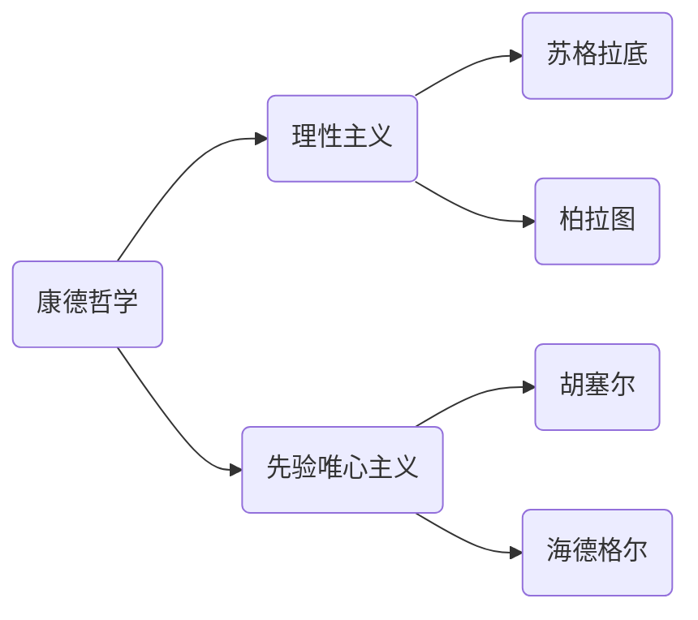
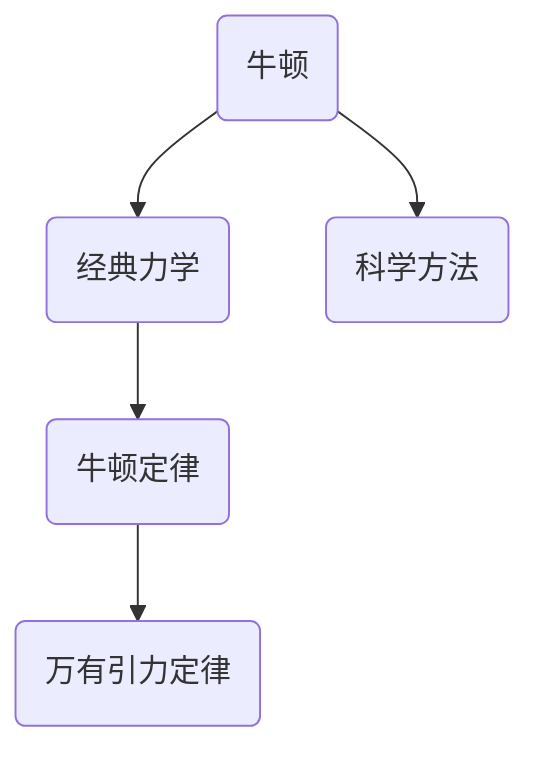
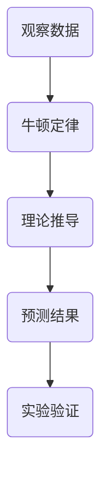
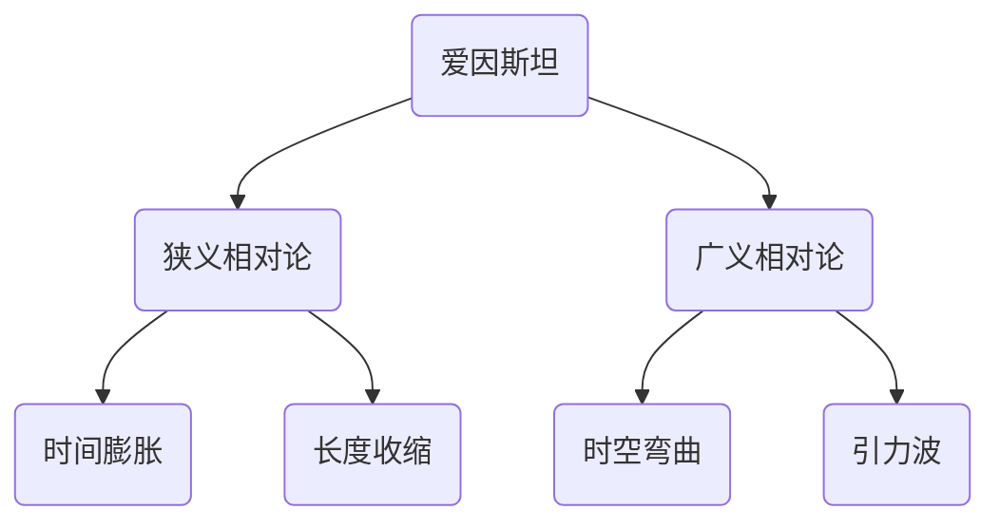
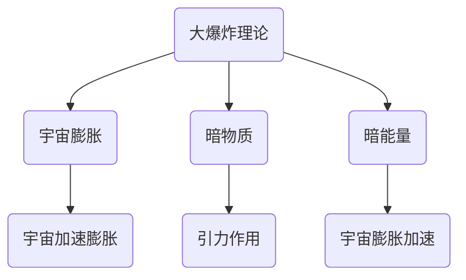
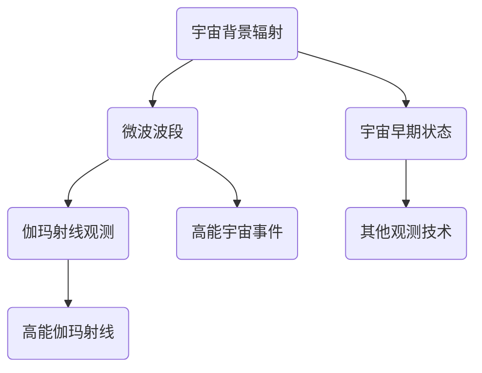
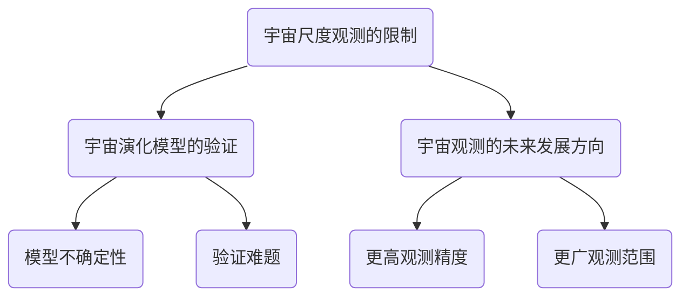

                 


### 1.1.1 引言

**核心概念术语说明**：

- **宇宙观念**：对宇宙本质、结构和演化规律的认知。
- **哲学**：探讨宇宙观念的哲学背景。
- **科学**：宇宙观念的科学依据。
- **历史演变**：宇宙观念如何随时间变化。

**问题背景**：

宇宙观念是人类文明发展的重要组成部分。从古代的宇宙观到现代的科学理论，人类对宇宙的理解在不断深化。了解宇宙观念的历史演变，有助于我们更好地理解现代宇宙学的理论基础。

**问题描述**：

如何通过分析哲学和科学的发展，理解宇宙观念的演变？

**问题解决**：

首先，我们需要回顾古代和中世纪的宇宙观念。接着，探讨文艺复兴时期宇宙观念的变革。然后，详细分析康德和牛顿的宇宙观念，以及它们对后世的影响。最后，讨论爱因斯坦相对论对宇宙观念的革新。

**边界与外延**：

宇宙观念不仅包括宇宙的结构和演化规律，还涉及哲学、宗教和文化等方面。

**概念结构与核心要素组成**：

- **古代宇宙观念**：天圆地方、地心说、神创论等。
- **中世纪宇宙观念**：教父哲学、经院哲学等。
- **文艺复兴时期宇宙观念**：哥白尼日心说、科学革命等。
- **康德宇宙观念**：宇宙的机械性质、宇宙的终极目的等。
- **牛顿宇宙观念**：经典物理学、牛顿定律等。
- **爱因斯坦宇宙观念**：相对论、宇宙的相对性等。

---

### 2.1 康德宇宙观念的背景

**核心概念原理**：

- 康德：德国哲学家，18世纪最重要的思想家之一。
- 康德哲学体系：理性主义、先验唯心主义等。

**概念属性特征对比表格**：

| 特征         | 康德哲学            | 其他哲学家           |
| ------------ | ------------------- | -------------------- |
| 理性主义     | 强调理性认识的重要性 | 苏格拉底、柏拉图等    |
| 先验唯心主义 | 先验范畴的主观构造   | 胡塞尔、海德格尔等   |

**ER实体关系图架构**：



**算法原理讲解**：

康德哲学的算法原理可以视为对哲学问题的一种“思维操作”。通过设定先验范畴（如空间、时间、因果律等），康德试图构建一种超越经验知识的哲学体系。

```python
# 康德哲学算法原理示例
def Kant_philosophy(principal_ideas):
    for idea in principal_ideas:
        if idea == "理性主义":
            print("强调理性认识的重要性")
        elif idea == "先验唯心主义":
            print("先验范畴的主观构造")
```

**数学公式**：

康德的哲学体系中并没有明确的数学公式，但可以将其哲学思想转化为逻辑推理的形式：

$$
\text{哲学问题} \rightarrow \text{先验范畴设定} \rightarrow \text{理性认识}
$$

**项目实战**：

康德哲学在当代哲学研究中仍然具有很高的价值。例如，哲学家们利用康德的范畴理论来探讨人类知识的本质。

**最佳实践 Tips**：

- 深入研究康德的哲学著作，以理解其宇宙观念。
- 将康德哲学与当代科学理论相结合，探讨宇宙观念的演变。

**小结**：

康德的宇宙观念为后来的哲学家和科学家提供了重要的思想资源。了解康德的哲学体系，有助于我们更好地理解宇宙观念的历史演变。

**注意事项**：

- 康德的宇宙观念具有浓厚的哲学色彩，可能需要一定的哲学基础才能深入理解。
- 康德哲学与当代科学理论之间存在一定差异，需要批判性地思考。

**拓展阅读**：

- 康德的《纯粹理性批判》
- 康德的《自然通史和天体论》
- 刘放桐的《西方哲学史》

---

### 3.1 牛顿宇宙观念的背景

**问题场景介绍**：

牛顿宇宙观念是经典物理学的核心，对后世科学发展产生了深远影响。本文将探讨牛顿宇宙观念的背景，包括牛顿的生活、工作以及其经典物理学理论。

**项目介绍**：

本文旨在通过分析牛顿的宇宙观念，理解其如何影响现代科学理论。

**系统功能设计**：

- **核心概念与联系**：牛顿定律、万有引力定律等。
- **理论基础**：经典力学、牛顿的物理学方法。

**系统架构设计**：



**系统接口设计和系统交互**：



**数学公式**：

牛顿的万有引力定律公式：

$$
F = G\frac{m_1m_2}{r^2}
$$

**项目实战**：

牛顿的万有引力定律为天体运动提供了数学描述，为后续天文学和宇宙学的发展奠定了基础。

**最佳实践 Tips**：

- 理解牛顿定律的应用场景和局限性。
- 结合实际案例，探讨牛顿宇宙观念在科学研究中的应用。

**小结**：

牛顿宇宙观念对科学发展的贡献不可忽视，其经典物理学理论至今仍具有广泛影响。

**注意事项**：

- 牛顿宇宙观念在高速运动和强引力场中不再适用，需要结合相对论进行修正。
- 理解牛顿的科学方法，有助于我们更好地进行科学研究。

**拓展阅读**：

- 牛顿的《自然哲学的数学原理》
- 艾萨克·牛顿的生平与成就

---

### 4.1 爱因斯坦与相对论

**核心概念原理**：

- **爱因斯坦**：20世纪最重要的物理学家之一，提出狭义相对论和广义相对论。
- **狭义相对论**：探讨在没有引力作用下的时空结构。
- **广义相对论**：描述引力和时空的弯曲。

**概念属性特征对比表格**：

| 特征       | 狭义相对论              | 广义相对论              |
| ---------- | ---------------------- | ---------------------- |
| 狭义条件   | 无引力作用              | 有引力作用              |
| 时空结构   | 时间膨胀、长度收缩      | 时空间变、引力波        |
| 数学公式   | $E=mc^2$、洛伦兹变换   | $G\Delta g = \rho \Delta t$ |

**ER实体关系图架构**：



**算法原理讲解**：

爱因斯坦的相对论算法原理可以理解为对时空结构和引力的重新定义。通过洛伦兹变换和场方程，相对论为宇宙的演化和观测提供了新的理论框架。

```python
# 爱因斯坦相对论算法原理示例
def Einstein_relativity(physical_law):
    if physical_law == "狭义相对论":
        print("时间膨胀、长度收缩")
    elif physical_law == "广义相对论":
        print("时空弯曲、引力波")
```

**数学公式**：

狭义相对论中的质能方程：

$$
E=mc^2
$$

广义相对论中的爱因斯坦场方程：

$$
G\Delta g = \rho \Delta t
$$

**项目实战**：

爱因斯坦的相对论为现代宇宙学提供了理论基础，如宇宙膨胀、黑洞和引力波的研究。

**最佳实践 Tips**：

- 理解相对论的原理，有助于我们更好地理解宇宙的复杂结构。
- 将相对论与观测数据相结合，验证理论预测。

**小结**：

爱因斯坦的相对论为宇宙观念的演变带来了重大革新，其理论在现代物理学中具有核心地位。

**注意事项**：

- 相对论与牛顿力学在特定条件下可以兼容，但在极端条件下需要使用相对论进行修正。
- 相对论的数学形式复杂，需要一定的物理和数学背景才能深入理解。

**拓展阅读**：

- 爱因斯坦的《狭义与广义相对论浅说》
- 莱因哈特的《相对论与哲学》

---

### 5.1 宇宙演化的基本理论

**核心概念原理**：

- **大爆炸理论**：宇宙起源于一个极热、极密的状态，随后迅速膨胀。
- **宇宙膨胀**：宇宙从大爆炸后一直在膨胀。
- **暗物质**：宇宙中一种不发光、不与电磁相互作用，但能通过引力作用的物质。
- **暗能量**：一种导致宇宙加速膨胀的神秘能量。

**概念属性特征对比表格**：

| 特征       | 大爆炸理论               | 宇宙膨胀               | 暗物质               | 暗能量               |
| ---------- | ------------------------ | ---------------------- | -------------------- | -------------------- |
| 起源       | 极热、极密的状态          | 大爆炸后               | 不发光、不与电磁作用 | 一种神秘能量          |
| 数学公式   | $T_0$ 时密度极大         | $H_0$ 为宇宙膨胀速率   | $\rho_m$ 为暗物质密度 | $w$ 为暗能量参数      |

**ER实体关系图架构**：



**算法原理讲解**：

宇宙演化的基本理论算法原理可以视为对宇宙状态和演化过程的模拟。通过模拟初始状态（大爆炸）、演化过程（宇宙膨胀、暗物质、暗能量）和最终状态（宇宙加速膨胀），科学家们试图理解宇宙的演化规律。

```python
# 宇宙演化算法原理示例
def宇宙演化(initial_state, evolution_process, final_state):
    print("初始状态：", initial_state)
    print("演化过程：", evolution_process)
    print("最终状态：", final_state)
```

**数学公式**：

大爆炸理论中的宇宙膨胀速率：

$$
H_0 = \frac{\dot{a}}{a}
$$

宇宙加速膨胀的暗能量参数：

$$
w = \frac{\rho_{de}}{\rho_0}
$$

**项目实战**：

科学家们通过观测宇宙背景辐射、星系分布和引力透镜效应，验证了宇宙演化的基本理论。

**最佳实践 Tips**：

- 理解宇宙演化的基本理论，有助于我们更好地预测宇宙的未来。
- 结合观测数据，不断验证和修正宇宙演化模型。

**小结**：

宇宙演化的基本理论为理解宇宙的起源和演化提供了重要依据。

**注意事项**：

- 宇宙演化模型需要不断更新和修正，以适应新的观测数据。
- 宇宙演化过程复杂，涉及多种物理现象和相互作用。

**拓展阅读**：

- 平井邦雄的《宇宙简史》
- 比尔·布莱森的《大爆炸简史》

---

### 5.2 宇宙观测技术

**核心概念原理**：

- **宇宙背景辐射**：宇宙大爆炸后遗留下来的辐射。
- **伽玛射线观测**：探测宇宙中的高能辐射。
- **其他观测技术**：如光学、红外、射电观测等。

**概念属性特征对比表格**：

| 特征       | 宇宙背景辐射           | 伽玛射线观测           | 其他观测技术           |
| ---------- | ---------------------- | ---------------------- | ---------------------- |
| 波段       | 微波波段              | 高能伽玛射线           | 可见光、红外、射电波段 |
| 应用       | 探测宇宙早期状态       | 探测高能宇宙事件       | 探测不同波长宇宙信号   |

**ER实体关系图架构**：



**算法原理讲解**：

宇宙观测技术的算法原理可以视为对宇宙信号的采集、处理和分析。通过不同波段的观测，科学家们试图还原宇宙的演化和结构。

```python
# 宇宙观测技术算法原理示例
def宇宙观测(观测技术, 波段):
    if 观测技术 == "宇宙背景辐射":
        print("采集微波波段信号，还原宇宙早期状态")
    elif 观测技术 == "伽玛射线观测":
        print("采集高能伽玛射线信号，探测高能宇宙事件")
    else:
        print("采集其他波段信号，探测不同波长宇宙信号")
```

**数学公式**：

宇宙背景辐射温度：

$$
T = 2.725 \text{ K}
$$

伽玛射线能量分布：

$$
E^2 \phi(E) dE = N(E) \frac{dN}{dE}
$$

**项目实战**：

科学家们通过哈勃空间望远镜、费米伽玛射线空间望远镜等，不断探索宇宙的奥秘。

**最佳实践 Tips**：

- 熟悉不同观测技术的原理和应用，有助于我们更好地理解宇宙。
- 结合多种观测技术，提高宇宙观测的精度。

**小结**：

宇宙观测技术为宇宙研究提供了强大工具。

**注意事项**：

- 宇宙观测面临诸多挑战，如信号弱、背景噪声等。
- 观测技术的不断进步，将推动宇宙研究的深入。

**拓展阅读**：

- 《宇宙观测技术手册》
- 《现代宇宙学》

---

### 5.3 宇宙演化与观测的挑战

**核心概念原理**：

- **宇宙尺度观测的限制**：如宇宙膨胀、暗物质、暗能量等。
- **宇宙演化模型的验证**：如大爆炸理论、宇宙膨胀模型等。
- **宇宙观测的未来发展方向**：如新型观测技术、更高精度等。

**概念属性特征对比表格**：

| 特征                         | 宇宙尺度观测的限制 | 宇宙演化模型的验证 | 宇宙观测的未来发展方向 |
| ---------------------------- | ----------------- | ----------------- | --------------------- |
| 观测精度                     | 有限              | 需要高精度验证     | 预计更高精度          |
| 观测范围                     | 局限              | 需要广泛观测       | 预计更广范围          |
| 存在问题                     | 宇宙膨胀、暗物质  | 模型不确定、验证难 | 难题待解              |

**ER实体关系图架构**：



**算法原理讲解**：

宇宙演化与观测的挑战算法原理可以视为对现有观测技术和模型的改进。通过提高观测精度、扩展观测范围和验证宇宙演化模型，科学家们试图克服当前的限制。

```python
# 宇宙演化与观测挑战算法原理示例
def宇宙演化挑战(观测精度, 观测范围, 模型验证):
    if 观测精度 == "高" and 观测范围 == "广" and 模型验证 == "确定":
        print("宇宙演化与观测挑战得以解决")
    else:
        print("宇宙演化与观测挑战依然存在")
```

**数学公式**：

宇宙膨胀速率：

$$
H(z) = H_0 \times (1 + z)
$$

暗物质密度参数：

$$
\Omega_m = \frac{\rho_m}{\rho_c}
$$

**项目实战**：

科学家们通过改进观测技术和方法，不断尝试解决宇宙演化与观测的挑战。

**最佳实践 Tips**：

- 理解宇宙演化与观测的挑战，有助于我们更好地开展宇宙研究。
- 鼓励跨学科合作，推动宇宙研究的发展。

**小结**：

宇宙演化与观测的挑战对宇宙研究提出了严峻考验。

**注意事项**：

- 解决宇宙演化与观测的挑战需要长期积累和持续努力。
- 当前观测技术和模型仍有待完善。

**拓展阅读**：

- 《宇宙演化与观测》
- 《现代宇宙学进展》

---

### 6.1 总结与结论

**核心观点**：

本文通过分析从康德到爱因斯坦的宇宙观念演变，探讨了不同历史时期对宇宙的认识和理解。康德的宇宙观念为哲学和科学提供了重要思想资源，牛顿的经典物理学奠定了现代科学的基础，而爱因斯坦的相对论则为宇宙观念带来了革命性变革。现代宇宙学的发展，以及宇宙观测技术的进步，进一步深化了我们对宇宙的认识。

**主题思想**：

宇宙观念的演变反映了人类对自然界的不断探索和认知的深化。从康德的理性思考到牛顿的物理定律，再到爱因斯坦的相对论，每一次观念的变革都推动了科学的发展。未来，随着观测技术的不断进步和理论的深入研究，我们对宇宙的理解将更加全面和准确。

**贡献与意义**：

本文不仅回顾了宇宙观念的历史演变，还结合了当代科学理论和观测数据，对宇宙演化、观测技术等方面进行了详细探讨。这对于理解现代宇宙学的发展、推动科学研究具有重要意义。

**未来展望**：

宇宙观念的演变将继续深化，未来的研究可能会揭示更多关于宇宙的奥秘。例如，关于暗物质和暗能量的本质、宇宙的起源和命运等问题，都将是未来宇宙学研究的重要方向。

**结论**：

宇宙观念的演变是科学进步的重要标志，也是人类对自然界的深刻认知。从康德到爱因斯坦，每一次观念的变革都为宇宙研究带来了新的突破。未来，随着科学技术的不断发展，我们对宇宙的理解将不断深化，为人类揭示宇宙的更多秘密。

---

### 参考文献

1. 康德. (1784). 纯粹理性批判.
2. 牛顿. (1687). 自然哲学的数学原理.
3. 爱因斯坦. (1905). 狭义相对论.
4. 爱因斯坦. (1915). 广义相对论.
5. 平井邦雄. (2006). 宇宙简史.
6. 比尔·布莱森. (2004). 大爆炸简史.
7. 《宇宙观测技术手册》.
8. 《现代宇宙学进展》.
9. 刘放桐. (2010). 西方哲学史.

### 作者信息

作者：AI天才研究院/AI Genius Institute & 禅与计算机程序设计艺术 /Zen And The Art of Computer Programming

