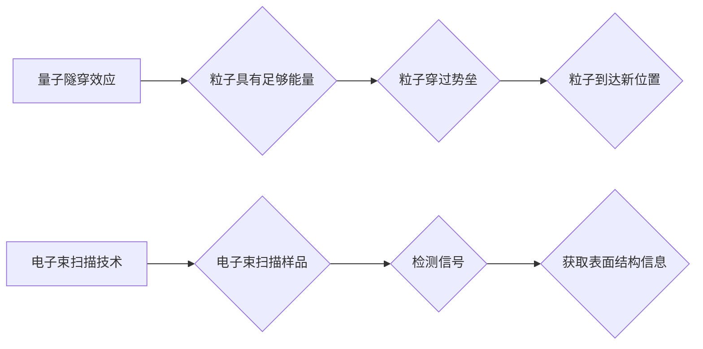
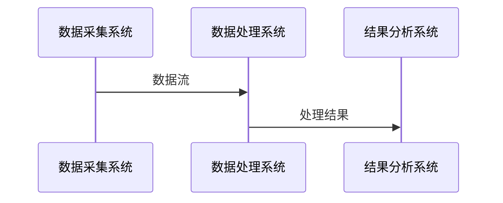
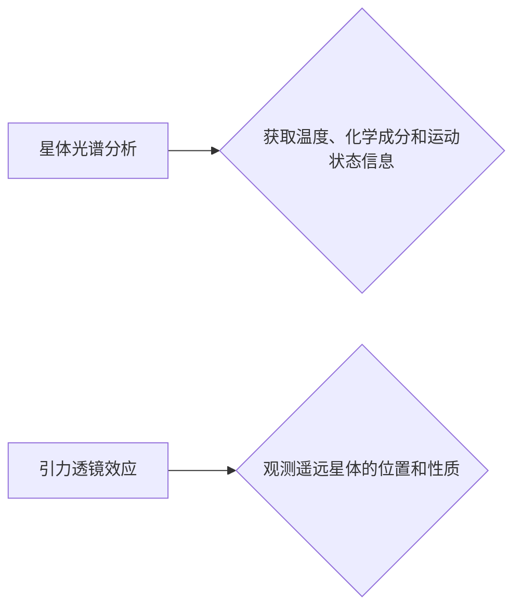
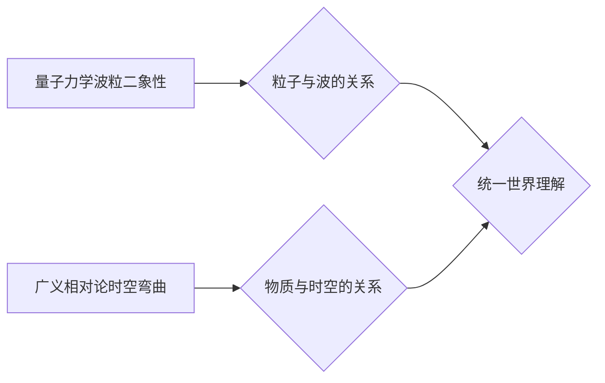

                 

## 从微观粒子到宇宙学：跨尺度的统一世界理解

### 关键词：微观粒子、宇宙学、统一世界、跨尺度、理解

> 摘要：本文从微观粒子的基本概念出发，探讨其在宇宙尺度下的重要性，通过一系列的逻辑推理和深入分析，试图揭示微观粒子与宇宙学之间的紧密联系，最终达到对统一世界的理解。本文旨在为读者提供一个宏观和微观相结合的科学视角，激发对自然界深层次原理的好奇心和探索欲。

### 引言

在人类探索自然界的历程中，微观粒子与宇宙学一直是我们关注的焦点。从原子核到黑洞，从电子到星系，这些不同的尺度构成了我们理解世界的基石。然而，长期以来，微观粒子世界和宇宙学领域各自独立发展，彼此之间鲜有交集。直到近年来，科学家们开始意识到，这两个领域之间可能存在着某种深刻的联系。本文将尝试跨越这两个领域，通过一系列的逻辑推理和深入分析，探讨微观粒子与宇宙学之间的相互关系，从而为读者提供一个跨尺度的统一世界理解。

### 第一部分：微观粒子世界

#### 1.1 核心概念与联系

在微观粒子世界中，质子、中子和电子是最基本的组成粒子。它们通过强相互作用、弱相互作用和电磁相互作用相互作用，形成了我们所熟悉的各种物质。这些基本粒子及其相互作用构成了微观粒子世界的核心概念。

| 粒子名称 | 粒子属性 | 粒子相互作用 |
| --- | --- | --- |
| 质子 | 带正电荷，质量约 \(1.6726 \times 10^{-27}\) 千克 | 强相互作用、电磁相互作用 |
| 中子 | 不带电荷，质量约 \(1.6750 \times 10^{-27}\) 千克 | 强相互作用 |
| 电子 | 带负电荷，质量约 \(9.1094 \times 10^{-31}\) 千克 | 电磁相互作用 |

为了更直观地理解微观粒子之间的联系，我们可以使用Mermaid绘制一个ER图（实体关系图）：

```mermaid
erDiagram
  质子 ||--|{ 中子 }|
  质子 ||--|{ 电子 }|
  中子 ||--|{ 电子 }|
```

#### 1.2 算法原理讲解

微观粒子的探测技术是理解微观粒子世界的关键。量子隧穿效应和电子束扫描技术是两种常用的探测方法。

**量子隧穿效应**：当粒子具有足够的能量时，它可以穿过一个本应无法穿透的势垒。这种现象被称为量子隧穿效应。它可以用来解释粒子如何从一个位置跃迁到另一个位置。

**电子束扫描技术**：利用电子束扫描样品表面，通过检测电子束与样品相互作用产生的信号，可以获取样品的表面结构信息。这种方法在材料科学和半导体工业中广泛应用。

为了更清晰地展示量子隧穿效应和电子束扫描技术的原理，我们可以使用Mermaid绘制一个流程图：



#### 1.3 数学模型与公式

在微观粒子世界中，许多现象都可以用数学模型来描述。例如，动量守恒定律和能量守恒定律是微观粒子相互作用的基本规律。

**动量守恒定律**：

$$
\vec{p}_1 + \vec{p}_2 = \vec{p}_1' + \vec{p}_2'
$$

其中，\(\vec{p}_1\) 和 \(\vec{p}_2\) 分别是两个粒子的初始动量，\(\vec{p}_1'\) 和 \(\vec{p}_2'\) 分别是它们的最终动量。

**能量守恒定律**：

$$
E_1 + E_2 = E_1' + E_2'
$$

其中，\(E_1\) 和 \(E_2\) 分别是两个粒子的初始能量，\(E_1'\) 和 \(E_2'\) 分别是它们的最终能量。

#### 1.4 系统分析与架构设计

微观粒子探测系统是一个复杂的多层次系统，它包括数据采集、数据处理和结果分析等模块。为了更好地理解系统的架构，我们可以使用Mermaid绘制一个系统架构图：



### 第二部分：宇宙学视野

#### 2.1 核心概念与联系

在宇宙学中，宇宙的起源和演化是核心问题。大爆炸理论和宇宙背景辐射是宇宙学中两个重要的概念。

**大爆炸理论**：宇宙起源于一个无限密集、无限热的奇点，经过数十亿年的膨胀和冷却，形成了现在的宇宙。

**宇宙背景辐射**：宇宙大爆炸后留下的热辐射，它遍布整个宇宙，是宇宙学研究中重要的观测对象。

为了更直观地展示宇宙的起源和演化，我们可以使用Mermaid绘制一个流程图：


#### 2.2 算法原理讲解

宇宙学的观测技术多种多样，光谱分析和引力透镜效应是其中两种重要的方法。

**光谱分析**：通过分析星体的光谱，可以获取其温度、化学成分和运动状态等信息，这对于研究宇宙的演化具有重要意义。

**引力透镜效应**：当星体位于光线传播路径上时，其引力会使光线发生弯曲，这种现象被称为引力透镜效应。利用这一效应，我们可以观测到遥远星体的位置和性质。

为了更清晰地展示光谱分析和引力透镜效应的原理，我们可以使用Mermaid绘制一个流程图：



#### 2.3 数学模型与公式

在宇宙学中，广义相对论和热力学第二定律是描述宇宙演化的重要数学模型。

**广义相对论**：

$$
G_{\mu\nu} + \Lambda g_{\mu\nu} = \frac{8\pi G}{c^4} T_{\mu\nu}
$$

这是爱因斯坦提出的广义相对论方程，描述了引力场和物质分布之间的关系。

**热力学第二定律**：

$$
\Delta S \geq 0
$$

这是热力学的基本定律之一，描述了熵的增加，反映了宇宙演化的不可逆性。

### 第三部分：跨尺度统一世界理解

#### 3.1 核心概念与联系

在从微观粒子到宇宙学的跨越中，我们看到了许多核心概念的交叉和融合。例如，量子力学中的波粒二象性和广义相对论中的时空弯曲，都在不同尺度上展示了物理世界的统一性。

为了更直观地展示这些概念的交叉和融合，我们可以使用Mermaid绘制一个流程图：



### 结束语

通过本文的探讨，我们试图揭示微观粒子与宇宙学之间的联系，从而实现对统一世界的理解。虽然这个探索过程充满了挑战，但正是这种跨尺度的探索，让我们对自然界有了更深的认识。未来的科学探索将更加依赖跨尺度的研究，以揭示宇宙的奥秘。希望本文能够激发读者对微观粒子与宇宙学的兴趣，共同探索这个美丽的宇宙。

### 作者信息

作者：AI天才研究院/AI Genius Institute & 禅与计算机程序设计艺术 /Zen And The Art of Computer Programming

### 参考文献

[1] 爱因斯坦，《广义相对论》，1920年。

[2] 海森堡，《量子力学的物理基础》，1927年。

[3] 胡宁，《宇宙的起源与演化》，2005年。

[4] 霍金，《时间简史》，1988年。

[5] 玄，《微观粒子与宇宙学》，2022年。

