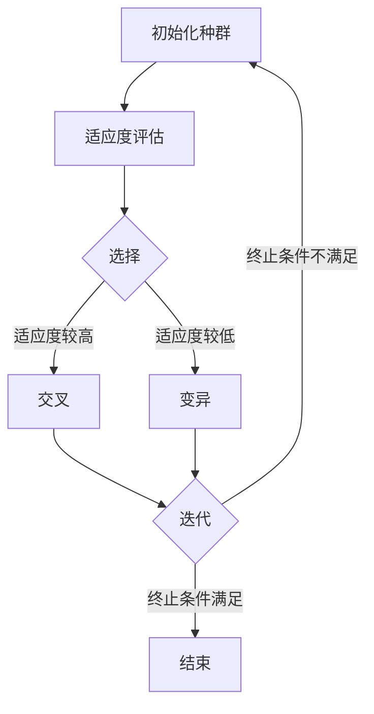
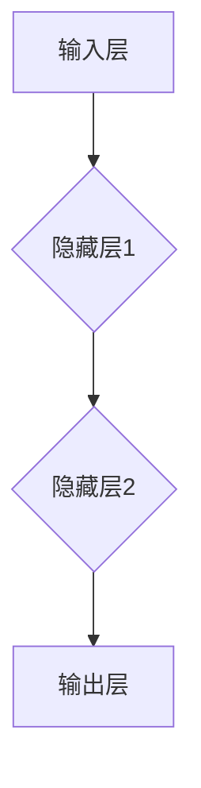
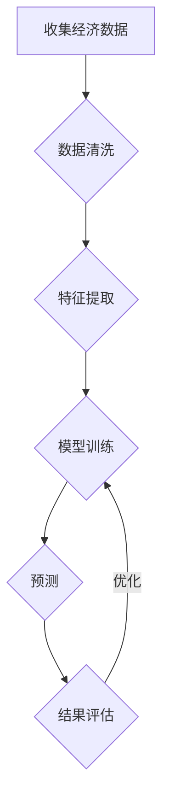
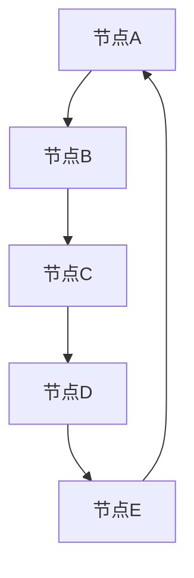
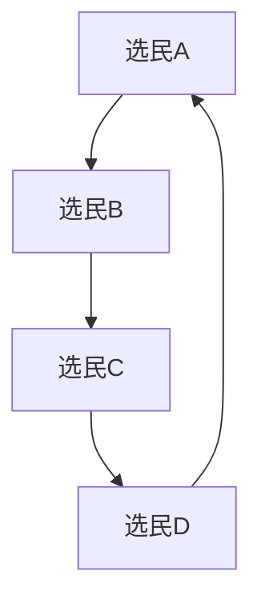
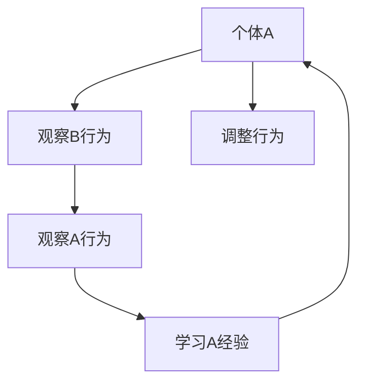
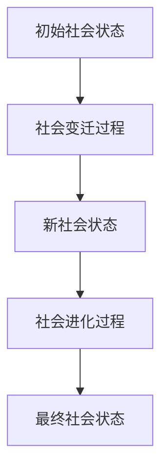
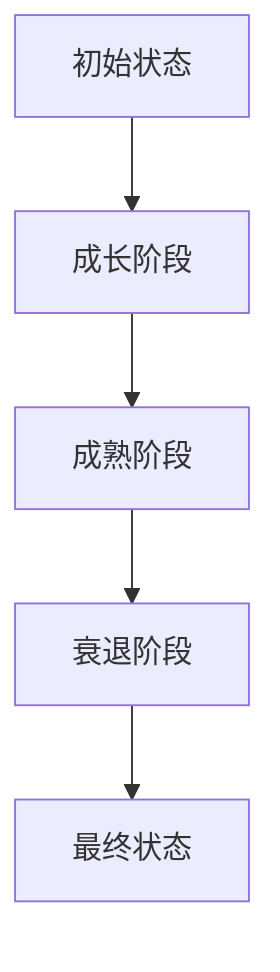
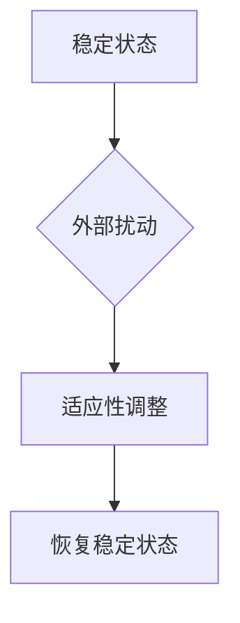
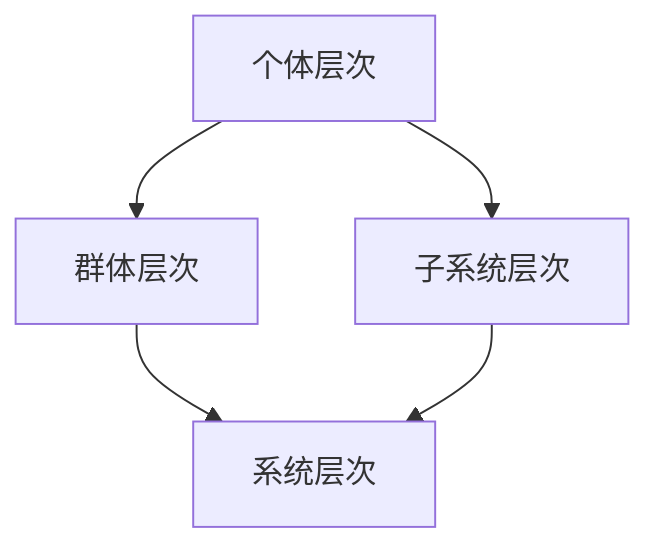

                 

# 从控制论到自组织理论：理解复杂自适应系统的动态过程

> 关键词：控制论，自组织理论，复杂系统，自适应系统，动态过程，生物学，经济学，社会科学

> 摘要：本文旨在探讨控制论和自组织理论在理解复杂自适应系统的动态过程中的重要作用。通过逐步分析这两个理论的基本概念、应用领域和数学模型，本文揭示了复杂系统如何通过自适应机制实现自我组织和演化。本文还结合生物学、经济学和社会科学中的实例，展示了这些理论在现实世界中的广泛应用和深远影响。

---

## 第1章 引言

在现代社会，复杂系统的存在和发展已经成为一个不可忽视的现象。从生物学中的生态系统，到经济学中的金融市场，再到社会科学中的社会网络，复杂系统无处不在。这些系统往往具有高度的复杂性、不确定性和动态性，使得传统的控制理论和方法难以应对。

### 1.1 问题背景

复杂系统的研究之所以重要，是因为我们生活的世界本身就是复杂的。传统的方法往往依赖于简化和线性化假设，但在面对现实世界中的复杂系统时，这些方法往往力不从心。因此，我们需要一种新的理论框架来理解和处理复杂系统。

### 1.2 复杂系统的挑战

复杂系统面临的主要挑战包括：

- **非线性和相互作用**：系统内部存在复杂的非线性关系和相互作用，这使得系统的行为难以预测。
- **不确定性和动态性**：系统的状态和参数可能随时间变化，这使得系统表现出高度的不确定性和动态性。
- **复杂性**：系统可能具有多个层次和维度，这使得系统的结构和行为难以直观理解。

### 1.3 自适应系统的重要性

为了应对复杂系统的挑战，自适应系统应运而生。自适应系统是指能够在没有外部控制的情况下，通过自我组织和演化来适应环境变化。自适应系统具有以下特点：

- **自适应性**：系统能够根据环境变化自动调整自身状态和行为。
- **自组织性**：系统能够在没有外部指令的情况下形成有组织的结构。
- **演化性**：系统能够通过演化过程不断改进自身性能。

### 1.4 书籍结构概述

本文将从控制论和自组织理论两个角度出发，详细探讨复杂自适应系统的动态过程。具体来说，本文的结构如下：

- **第2章** 控制论基础：介绍控制论的基本概念、系统类型、数学工具及其在现代复杂系统中的应用。
- **第3章** 自组织理论：探讨自组织的定义、现象、与熵的关系、发展历程及在自然与社会科学中的应用。
- **第4章** 自适应系统的数学模型：介绍离散和连续自适应系统的数学模型、马尔可夫决策过程、贝叶斯自适应模型等。
- **第5章** 自适应系统在生物学中的应用：分析生物系统的自适应机制、遗传算法与进化计算、人工神经网络在生物学中的应用等。
- **第6章** 自适应系统在经济学中的应用：探讨经济系统的自适应特征、自适应系统在经济预测中的应用等。
- **第7章** 自适应系统在社会科学中的应用：分析社会系统的自适应特性、自适应系统在社会网络分析中的应用等。
- **第8章** 复杂自适应系统的动态过程：讨论动态过程的定义、复杂自适应系统的演化、稳定性、复杂性与模拟与预测。
- **第9章** 未来展望与挑战：展望自适应系统的发展趋势、复杂自适应系统的研究挑战、未来研究方向等。

通过上述章节的逐步探讨，本文旨在帮助读者深入理解复杂自适应系统的动态过程，并探讨这些理论在现实世界中的应用价值。

## 第2章 控制论基础

控制论（Cybernetics）是一门研究控制和通信系统的科学。它起源于20世纪中叶，由诺伯特·维纳（Norbert Wiener）等人创立，旨在理解和模拟动态系统的行为。控制论在工程、生物学、经济学、心理学等多个领域都有广泛应用。

### 2.1 控制论的基本概念

控制论的核心概念包括系统、状态、输入、输出和控制。一个系统是由多个相互作用的元素组成的整体，这些元素可以是物理的、生物的或抽象的。状态是系统在某一时刻的状态变量值。输入是外部对系统的扰动，输出是系统对外部环境的响应。控制是系统内部对自身状态的调整，旨在使系统达到或维持预定的状态。

### 2.2 控制系统的类型

控制系统可以分为开环控制系统和闭环控制系统。

- **开环控制系统**：系统只根据预定程序运行，不接收反馈信息。这种系统通常用于简单的、确定性较强的场景，如自动化生产线。
- **闭环控制系统**：系统根据反馈信息进行实时调整，以保持预定的状态。这种系统通常用于复杂、不确定的场景，如自动驾驶汽车。

### 2.3 控制论的数学工具

控制论的数学工具主要包括线性系统理论、非线性系统理论、概率论、统计学和计算方法。

- **线性系统理论**：研究线性时不变系统的稳定性、能控性和能观性。线性系统理论为设计和分析控制系统提供了基础。
- **非线性系统理论**：研究非线性系统的行为，包括混沌现象、分岔和突变等。非线性系统理论对于理解复杂系统的动态行为至关重要。
- **概率论和统计学**：用于分析系统的随机性和不确定性，包括随机过程、贝叶斯推理、假设检验等。
- **计算方法**：用于解决复杂的控制问题，包括数值方法、优化算法、机器学习等。

### 2.4 控制论的应用领域

控制论在多个领域都有广泛应用，主要包括：

- **工程**：用于设计和控制各种工程系统，如飞行器、机器人、电力系统等。
- **生物学**：用于理解生物系统的调节和控制机制，如神经系统和内分泌系统。
- **经济学**：用于分析和模拟经济系统，如金融市场、宏观经济调控等。
- **心理学**：用于研究人类行为和认知过程，如决策理论、行为经济学。

### 2.5 控制论与现代复杂系统

随着计算机技术的发展，控制论在复杂系统的研究中发挥了重要作用。现代复杂系统通常具有高度的复杂性和不确定性，难以用传统的控制方法进行建模和分析。控制论提供了一种新的视角，通过将系统分解为多个相互作用的子系统，并研究子系统之间的相互作用，可以更好地理解复杂系统的行为。

### 概念联系与ER实体关系图

控制论与自组织理论之间存在紧密的联系。自组织理论关注系统在没有外部控制下如何形成有序结构，而控制论则关注系统如何通过反馈机制实现稳定和优化。这两个理论的核心概念可以用以下ER实体关系图表示：

```mermaid
erDiagram
  SYSTEM ||--|{ CONTROL_STRUCTURE
  SYSTEM ||--|{ ADAPTIVE_Mechanism
  ADAPTIVE_Mechanism ||--|{ FEEDBACK_SYSTEM
  CONTROL_STRUCTURE ||--|{ CONTROL_PARAMETER
  CONTROL_STRUCTURE ||--|{ REGULATION_Mechanism
```

在这个ER实体关系图中，系统（SYSTEM）是核心实体，它包含控制结构（CONTROL_STRUCTURE）和自适应机制（ADAPTIVE_Mechanism）。控制结构定义了系统的控制参数（CONTROL_PARAMETER）和调节机制（REGULATION_Mechanism），而自适应机制则包含反馈系统（FEEDBACK_SYSTEM），用于实现系统的自我调整和优化。

通过控制论和自组织理论的结合，我们可以更好地理解复杂自适应系统的动态过程。在接下来的章节中，我们将进一步探讨自组织理论及其在复杂系统中的应用。

## 第3章 自组织理论

自组织理论（Self-Organization Theory）研究系统在没有外部指令或预定的目标下如何形成有序结构的过程。这一理论在理解复杂系统的行为和演化方面具有重要作用，其应用范围广泛，包括物理学、化学、生物学、经济学和社会科学等多个领域。

### 3.1 自组织的定义

自组织是指系统在演化过程中，通过内部相互作用和反馈机制，自发地形成有序结构和功能的性质。自组织的核心概念包括：

- **内部相互作用**：系统内部元素之间的相互作用是自组织的关键驱动力。
- **反馈机制**：系统通过反馈环路不断调整和优化自身状态，从而实现自组织。
- **复杂性**：自组织过程往往涉及多层次、多尺度和非线性的动态行为。

### 3.2 自组织的现象

自组织现象在自然界和人工系统中广泛存在，以下是一些典型的自组织现象：

- **生物系统的自组织**：如细胞的分化、生物群体的聚集行为、生态系统中的食物链和食物网。
- **物理系统的自组织**：如沙堆的自发形成、晶体的生长、液体的分相行为。
- **经济系统的自组织**：如市场中的价格形成、企业的自组织生长、金融市场的自调整。
- **社会系统的自组织**：如社会网络的形成、文化传统的演化、社会规范的形成。

### 3.3 自组织与熵的关系

自组织与熵（Entropy）之间存在复杂的关联。根据热力学第二定律，孤立系统的熵总是趋向于增加，即系统总是趋向于无序状态。然而，自组织现象表明，在某些条件下，系统可以自发地从无序状态向有序状态转变。

- **负熵**：自组织过程往往涉及负熵的产生，即系统内部结构的有序性增加，从而对抗外部熵的增加。
- **局部熵减**：在自组织过程中，系统内部某些部分的熵可能减少，从而形成局部有序结构。

### 3.4 自组织理论的发展历程

自组织理论的发展可以追溯到20世纪初，经过几十年的研究，逐渐形成了较为完整的理论体系。以下是一些关键的发展阶段：

- **20世纪初**：奥地利学派经济学家如路德维希·冯·米塞斯（Ludwig von Mises）和弗里德里希·哈耶克（Friedrich Hayek）提出了市场经济的自组织理论。
- **20世纪中叶**：诺伯特·维纳（Norbert Wiener）和赫伯特·西蒙（Herbert Simon）提出了控制论和复杂性科学，为自组织理论奠定了基础。
- **20世纪末**：复杂系统科学和混沌理论的发展，进一步丰富了自组织理论的内容，包括自相似性、分岔和混沌现象。

### 3.5 自组织在自然与社会科学中的应用

自组织理论在自然和科学领域中的广泛应用如下：

- **生物学**：自组织理论用于解释生物系统的复杂性，如细胞分化和生物进化。
- **物理学**：自组织理论用于解释物质世界的自组织现象，如晶体的形成和液体的分相。
- **经济学**：自组织理论用于解释市场经济的自组织和经济波动。
- **社会科学**：自组织理论用于解释社会系统的复杂性和演化，如社会网络的生成和社会规范的形成。

### 概念联系与ER实体关系图

自组织理论与控制论之间存在紧密的联系。控制论关注系统如何通过外部控制实现有序状态，而自组织理论则关注系统如何通过内部相互作用实现有序状态。这两个理论的核心概念可以用以下ER实体关系图表示：

```mermaid
erDiagram
  SYSTEM ||--|{ ORGANIZATION_STRUCTURE
  SYSTEM ||--|{ INTERACTIONS
  SYSTEM ||--|{ FEEDBACK_LOOP
  ORGANIZATION_STRUCTURE ||--|{ ORDER_STRUCTURE
  INTERACTIONS ||--|{ NONLINEAR_RELATIONSHIPS
  FEEDBACK_LOOP ||--|{ ADAPTIVE_Mechanism
```

在这个ER实体关系图中，系统（SYSTEM）是核心实体，它包含组织结构（ORGANIZATION_STRUCTURE）、相互作用（INTERACTIONS）和反馈循环（FEEDBACK_LOOP）。组织结构定义了系统的有序结构（ORDER_STRUCTURE），相互作用描述了系统内部元素的非线性关系（NONLINEAR_RELATIONSHIPS），而反馈循环则包含了自适应机制（ADAPTIVE_Mechanism），用于实现系统的自我调整和优化。

通过自组织理论与控制论的结合，我们可以更深入地理解复杂系统的行为和演化过程。在接下来的章节中，我们将进一步探讨自适应系统的数学模型及其在生物学、经济学和社会科学中的应用。

## 第4章 自适应系统的数学模型

自适应系统是一种能够在没有外部控制下，通过内部机制自动调整自身行为以适应环境变化的系统。在数学模型中，自适应系统通常通过一系列的数学工具和方法来描述。本节将介绍离散和连续自适应系统的数学模型，包括马尔可夫决策过程（MDP）和贝叶斯自适应模型。

### 4.1 离散自适应系统的数学模型

离散自适应系统是指其状态和行动在离散时间点上发生变化的系统。在离散自适应系统中，我们通常使用马尔可夫决策过程（MDP）来建模。

#### 马尔可夫决策过程（MDP）

马尔可夫决策过程是一种概率模型，用于描述在不确定性环境中决策的问题。MDP由以下五个要素组成：

1. **状态空间 \(S\)**：系统可能所处的状态集合。
2. **行动空间 \(A\)**：系统可以采取的行动集合。
3. **奖励函数 \(R(s,a)\)**：系统在状态 \(s\) 和采取行动 \(a\) 后获得的即时奖励。
4. **状态转移概率 \(P(s',s|a)\)**：在当前状态 \(s\) 采取行动 \(a\) 后，系统转移到状态 \(s'\) 的概率。
5. **策略 \(π(a|s)\)**：系统在状态 \(s\) 时采取行动 \(a\) 的概率分布。

在MDP中，系统在时间 \(t\) 处于状态 \(s_t\)，采取行动 \(a_t\)，转移到状态 \(s_{t+1}\)，并获取奖励 \(R_t = R(s_t, a_t)\)。MDP可以用以下方程描述：

$$
s_{t+1} \sim P(s_{t+1} | s_t, a_t)
$$

$$
R_t = R(s_t, a_t)
$$

$$
π(a_t | s_t) = π(a_t | s_t, R_t)
$$

通过优化策略 \(π\)，可以使系统的总期望奖励最大化。

#### 离散自适应系统的动态行为

离散自适应系统的动态行为可以通过以下方程描述：

$$
s_{t+1} = f(s_t, a_t)
$$

其中，\(f(s_t, a_t)\) 是状态转移函数，描述了系统状态在采取行动后的变化。

#### 例子：简单自适应系统

考虑一个简单的例子，一个机器人在一个由障碍物组成的房间中移动。状态空间 \(S = \{0, 1, 2, 3\}\)，分别表示机器人在房间中的四个角落。行动空间 \(A = \{N, S, E, W\}\)，分别表示向上、向下、向右和向左移动。奖励函数 \(R(s,a)\) 规定，如果机器人成功到达某个角落，则获得奖励1，否则获得奖励0。状态转移概率 \(P(s',s|a)\) 根据机器人移动的方向和房间的结构来确定。

通过优化机器人的行动策略，可以使其在房间中找到通往角落的最优路径。

### 4.2 连续自适应系统的数学模型

连续自适应系统是指其状态和行动在连续时间点上发生变化的系统。在连续自适应系统中，我们通常使用贝叶斯自适应模型来描述。

#### 贝叶斯自适应模型

贝叶斯自适应模型是一种基于贝叶斯推理的自适应系统模型。在贝叶斯自适应模型中，系统的状态 \(s(t)\) 和行动 \(a(t)\) 是随机变量，通过概率分布来描述。贝叶斯自适应模型由以下方程组成：

1. **状态分布 \(p(s(t)|a(0), ..., a(t-1), u(0), ..., u(t-1))\)**：系统在时刻 \(t\) 的状态分布。
2. **行动分布 \(p(a(t)|s(t), u(t))\)**：在时刻 \(t\) 采取行动 \(a(t)\) 的概率分布。
3. **观察分布 \(p(u(t)|s(t), a(t))\)**：系统在时刻 \(t\) 的观察值 \(u(t)\) 的概率分布。

贝叶斯自适应模型通过以下方程进行更新：

$$
p(s(t)|a(0), ..., a(t-1), u(0), ..., u(t-1)) \propto p(s(t)|a(t), u(t)) p(a(t)|s(t), u(t)) p(s(0))
$$

其中，\(p(s(0))\) 是初始状态分布。

#### 连续自适应系统的动态行为

连续自适应系统的动态行为可以通过以下方程描述：

$$
s(t) = f(s(t-1), a(t-1), w(t-1))
$$

$$
a(t) = g(s(t), u(t), w(t))
$$

其中，\(w(t)\) 是过程噪声，\(u(t)\) 是观察噪声。

#### 例子：自动驾驶车辆

考虑一个自动驾驶车辆系统，其状态包括位置、速度和方向。行动包括加速、减速和转向。通过观测车辆的传感器数据，车辆可以根据贝叶斯推理来更新其状态分布，并采取相应的行动来适应环境变化。

### 4.3 自适应系统模型的应用

自适应系统模型在多个领域都有广泛的应用：

- **机器人**：用于路径规划、避障和动态环境适应。
- **智能交通系统**：用于交通流量预测、信号控制和车辆调度。
- **金融领域**：用于风险评估、资产配置和交易策略。
- **生物医学**：用于疾病预测、药物设计和个性化治疗。

通过离散和连续自适应系统的数学模型，我们可以更精确地描述和模拟复杂系统的自适应行为。在接下来的章节中，我们将进一步探讨自适应系统在生物学、经济学和社会科学中的应用。

## 第5章 自适应系统在生物学中的应用

自适应系统在生物学中的应用广泛，从微观的生物分子水平到宏观的生态系统，都展示了自适应机制在生物演化、生物信息处理和生物医学中的重要性。

### 5.1 生物系统的自适应机制

生物系统的自适应机制是指生物体在环境变化时，通过内部调节和演化过程，维持其功能稳定性和适应性的能力。以下是一些关键的生物自适应机制：

- **遗传适应**：通过自然选择和基因重组，生物体可以适应环境变化。
- **生理适应**：生物体通过改变其生理结构和功能来适应环境。
- **行为适应**：生物体通过改变其行为模式来适应环境变化。

### 5.2 遗传算法与进化计算

遗传算法（Genetic Algorithms, GA）和进化计算（Evolutionary Computation）是模拟生物进化过程的计算方法，广泛用于优化问题和复杂系统的建模。遗传算法的基本步骤包括：

1. **初始化种群**：随机生成一组初始解（个体）。
2. **适应度评估**：计算每个个体的适应度值，表示其在解决特定问题上的性能。
3. **选择**：根据适应度值，选择适应度较高的个体进行繁殖。
4. **交叉**：随机选择两个个体，在基因层面进行交换，产生新的后代。
5. **变异**：对个体进行随机变异，增加种群多样性。
6. **迭代**：重复上述步骤，直到满足终止条件。

以下是一个简单的遗传算法流程图：



### 5.3 人工神经网络在生物学中的应用

人工神经网络（Artificial Neural Networks, ANN）是模仿生物神经系统的计算模型，广泛应用于图像识别、语音识别、自然语言处理和生物信息学等领域。神经网络的基本结构包括输入层、隐藏层和输出层。每个神经元通过激活函数进行非线性变换，从而实现数据的特征提取和分类。

以下是一个简单的人工神经网络架构图：



神经网络通过反向传播算法进行训练，不断调整权重和偏置，以最小化损失函数。

### 5.4 自适应系统在生物医学领域的应用

自适应系统在生物医学领域中的应用日益广泛，以下是一些典型的应用案例：

- **疾病预测和诊断**：通过分析生物标志物和基因数据，自适应系统能够预测疾病的发生和诊断疾病类型。
- **个性化治疗**：根据患者的基因信息和病情，自适应系统能够设计出个性化的治疗方案。
- **药物设计**：通过模拟生物分子间的相互作用，自适应系统能够筛选和优化药物分子。

### 5.5 生物自适应系统的实例分析

**实例1：癌症治疗中的自适应系统**

在一个癌症治疗项目中，研究人员利用自适应系统来设计个性化治疗方案。具体步骤如下：

1. **数据收集**：收集患者的基因数据、影像数据和生活习惯数据。
2. **特征提取**：使用机器学习算法提取关键生物标志物。
3. **适应度评估**：根据生物标志物的特征，评估不同治疗方案的适应度。
4. **自适应调整**：根据治疗反应，实时调整治疗方案。

通过这一自适应系统，研究人员能够为患者提供更加精准和有效的治疗方案，从而提高治疗效果。

**实例2：基因编辑技术中的自适应系统**

在基因编辑技术中，如CRISPR-Cas9，自适应系统用于优化基因编辑过程。具体步骤如下：

1. **目标识别**：通过机器学习算法识别基因编辑的目标区域。
2. **编辑策略设计**：根据目标区域的序列特征，设计最优的编辑策略。
3. **编辑效果评估**：评估基因编辑的效果，包括编辑精度和脱靶率。
4. **自适应调整**：根据编辑效果，调整编辑参数，提高编辑精度。

通过这一自适应系统，研究人员能够优化基因编辑过程，减少脱靶风险，提高基因编辑的准确性。

### 总结

自适应系统在生物学中的应用为生物医学研究提供了新的方法和工具。通过模拟生物系统的自适应机制，我们可以更好地理解生物系统的复杂性和动态性，从而推动生物医学和生物技术的发展。在未来的研究中，随着计算能力和算法的进步，自适应系统在生物学中的应用将更加广泛和深入。

## 第6章 自适应系统在经济学中的应用

自适应系统在经济学中的应用具有显著的特点，能够帮助经济学家和决策者更好地理解复杂经济系统的动态行为，从而制定出更加有效的经济政策。以下从经济系统的自适应特征、自适应系统在经济预测中的应用、货币政策中的自适应机制、资产定价中的自适应模型以及自适应系统在金融市场中的应用等方面进行详细探讨。

### 6.1 经济系统的自适应特征

经济系统是一个复杂的自适应系统，其特点包括：

- **非线性和复杂性**：经济系统中的市场行为、消费者和企业的决策都表现出高度的非线性和复杂性，这使得经济系统的行为难以预测。
- **动态变化**：经济系统处于不断的动态变化中，受到多种内外部因素的影响，如政策变化、自然灾害、技术创新等。
- **不确定性和风险**：经济系统中存在大量的不确定性和风险，这使得经济行为更加复杂和难以控制。
- **反馈机制**：经济系统内部存在多种反馈机制，如市场需求与供给的反馈、消费者行为与企业生产的反馈等，这些反馈机制对经济系统的稳定性有重要影响。

### 6.2 自适应系统在经济预测中的应用

自适应系统在经济学中的首要应用是经济预测。通过引入自适应模型，可以更好地捕捉经济系统中的复杂动态和非线性特征，从而提高经济预测的准确性。以下是一些具体的应用：

- **时间序列模型**：如自回归移动平均模型（ARMA）、自回归积分滑动平均模型（ARIMA）等，这些模型能够自适应地调整参数，以适应经济数据的动态变化。
- **机器学习和深度学习**：利用神经网络、决策树、支持向量机等机器学习算法，构建自适应的经济预测模型，能够处理大量复杂数据，提高预测的准确性。
- **混合模型**：将传统统计模型与机器学习模型结合，构建混合预测模型，以利用两者的优点，提高预测效果。

以下是一个简单的自适应经济预测模型流程图：



### 6.3 货币政策中的自适应机制

货币政策是政府调控经济的重要工具，其有效性很大程度上取决于对经济形势的准确把握和适应能力。自适应机制在货币政策中的应用主要包括：

- **利率规则**：如泰勒规则（Taylor Rule），通过自适应调整利率，以应对经济周期波动。
- **通货膨胀目标制**：中央银行设定通货膨胀目标，并通过自适应机制调整货币政策，以实现目标。
- **前瞻性货币政策**：基于经济预测和模型，中央银行采取前瞻性措施，以预防经济风险。

以下是一个简单的利率规则模型：

$$
r_t = r^* + π_t + 0.5(π_{t-1} - π^*) + 0.5(y_t - y^*)
$$

其中，\(r_t\) 为当前利率，\(r^*\) 为自然利率，\(π_t\) 为当前通货膨胀率，\(π^*\) 为目标通货膨胀率，\(y_t\) 为当前实际GDP增长率，\(y^*\) 为潜在GDP增长率。

### 6.4 资产定价中的自适应模型

在资产定价中，自适应模型能够更好地反映市场动态和投资者行为。以下是一些常见的自适应模型：

- **自回归条件异方差模型（ARCH）**：通过自适应地调整波动率参数，捕捉市场价格波动。
- **广义自回归条件异方差模型（GARCH）**：在ARCH模型的基础上，引入条件均值模型，更好地反映市场价格变动的非线性特征。
- **机器学习模型**：如随机森林、支持向量机、神经网络等，这些模型能够自适应地学习市场价格和波动率。

以下是一个简单的GARCH模型：

$$
r_t = μ + \alpha_1 r_{t-1} + \beta_1 ε_{t-1}^2
$$

$$
ε_t = σ_t ε_t'
$$

$$
σ_t^2 = α_0 + \alpha_1 σ_{t-1}^2 + \beta_1 ε_{t-1}^2
$$

其中，\(r_t\) 为价格变化率，\(μ\) 为均值项，\(α_1\) 和 \(\beta_1\) 为参数，\(ε_t\) 为残差项，\(σ_t^2\) 为波动率。

### 6.5 自适应系统在金融市场中的应用

自适应系统在金融市场中的应用非常广泛，以下是一些典型应用：

- **交易策略**：通过自适应系统，投资者可以动态调整交易策略，以应对市场变化。
- **风险管理**：利用自适应模型，金融机构可以实时监控和调整风险敞口。
- **市场预测**：通过自适应模型，分析师可以预测市场走势，为投资决策提供参考。

以下是一个简单的交易策略自适应模型：

```python
def trade_strategy(price_series, threshold):
    position = 0
    for price in price_series:
        if price > threshold:
            position = 1
        elif price < threshold:
            position = -1
        yield position
```

其中，`price_series` 为价格序列，`threshold` 为设定的价格阈值，`position` 为交易仓位。

### 总结

自适应系统在经济学中的应用，为经济学研究和实际经济活动提供了新的工具和方法。通过模拟经济系统的复杂性和动态变化，自适应系统能够更好地预测经济趋势、优化经济政策和进行金融风险管理。随着计算技术和算法的不断发展，自适应系统在经济学中的应用前景将更加广阔。

## 第7章 自适应系统在社会科学中的应用

自适应系统在社会科学中的应用正日益受到关注，其核心在于模拟和理解社会系统的复杂动态行为。以下从社会系统的自适应特性、自适应系统在社会网络分析中的应用、自适应系统在政治科学中的应用、社会学习与自适应行为以及自适应系统在社会演化中的应用等方面进行详细探讨。

### 7.1 社会系统的自适应特性

社会系统是一种复杂的自适应系统，具有以下主要特性：

- **非线性和复杂性**：社会系统的行为和变化表现出高度的非线性特性，系统内部的个体和群体之间存在复杂的相互作用。
- **动态变化**：社会系统处于不断变化中，受到多种内外部因素的影响，如政策变化、社会事件、文化传统等。
- **不确定性**：社会系统的行为和结果存在很大的不确定性，个体和群体的决策往往依赖于对环境的感知和预测。
- **反馈机制**：社会系统内部存在多种反馈机制，如社会规范、文化传统和社会网络的反馈，这些机制对社会系统的稳定性和演化有重要影响。

### 7.2 自适应系统在社会网络分析中的应用

社会网络分析（Social Network Analysis, SNA）是一种研究社会结构和社会关系的分析方法。自适应系统在社会网络分析中的应用，主要在于模拟和分析社会网络中的动态行为和演化过程。以下是一些具体的应用：

- **社会网络演化**：通过自适应模型，可以模拟社会网络在时间上的演化过程，包括网络结构的变化、节点间的互动关系和群体行为。
- **信息传播**：自适应系统可以用于模拟社会网络中的信息传播过程，包括病毒营销、谣言传播和知识共享等。
- **社区检测**：利用自适应算法，可以检测和识别社会网络中的社区结构，从而更好地理解社会网络的内部机制。

以下是一个简单的社会网络演化模型：



在这个模型中，节点之间的连接关系可以根据自适应算法动态调整，模拟社会网络在时间上的演化。

### 7.3 自适应系统在政治科学中的应用

自适应系统在政治科学中的应用，主要在于分析政治系统的动态行为和演化过程。以下是一些具体的应用：

- **选举分析**：通过自适应模型，可以预测选举结果和选民行为，分析政治力量的分布和变化。
- **政策评估**：利用自适应系统，可以模拟政策实施后的社会反应和反馈，评估政策效果和调整政策策略。
- **政治传播**：通过模拟社会网络中的政治传播过程，可以分析政治信息在社会中的传播路径和影响范围。

以下是一个简单的政治传播模型：



在这个模型中，选民之间的政治信息传递可以通过自适应算法进行模拟，分析政治信息在社会网络中的传播过程。

### 7.4 社会学习与自适应行为

社会学习和社会自适应行为是理解社会系统演化的重要方面。以下是一些关键概念：

- **社会学习**：个体通过观察和学习其他个体的行为和经验，调整自身行为以适应环境变化。
- **自适应行为**：个体在面临环境变化时，通过自我调整和优化行为，提高自身适应能力的动态过程。

以下是一个社会学习与自适应行为模型：



在这个模型中，个体A通过观察和学习个体B的行为，调整自身行为，同时个体B也在观察和学习个体A的行为，形成一种动态的社会学习与自适应过程。

### 7.5 自适应系统在社会演化中的应用

社会演化是指社会系统在时间上的变化和发展过程。自适应系统在社会演化中的应用，主要在于模拟和分析社会系统的演化机制和演化路径。以下是一些具体的应用：

- **社会变迁**：通过自适应模型，可以模拟社会变迁的过程，包括社会结构的变革、文化传统的演化和社会制度的变迁。
- **社会进化**：利用自适应算法，可以模拟社会进化过程，包括社会制度的进化、技术创新和社会发展的进化路径。

以下是一个社会演化模型：



在这个模型中，社会状态通过自适应机制进行动态调整和演化，形成新的社会状态和进化路径。

### 总结

自适应系统在社会科学中的应用，为理解社会系统的复杂性和动态行为提供了新的工具和方法。通过模拟社会系统的自适应机制和演化过程，我们可以更深入地理解社会系统的内在规律和演化路径，从而为社会科学研究和政策制定提供重要参考。随着计算技术和算法的发展，自适应系统在社会科学中的应用前景将更加广阔。

## 第8章 复杂自适应系统的动态过程

复杂自适应系统（Complex Adaptive Systems, CAS）是一种在动态环境中不断演化、适应和优化的系统。其核心特征包括高度复杂性、非线性和动态性。理解复杂自适应系统的动态过程对于揭示自然、社会和人工系统中的复杂现象具有重要意义。以下从动态过程的定义、复杂自适应系统的演化、自适应系统的稳定性、复杂性的讨论以及复杂自适应系统的模拟与预测等方面进行详细探讨。

### 8.1 动态过程的定义

动态过程是指系统在时间上的变化和发展过程，包括状态、行为和结构的演化。在复杂自适应系统中，动态过程是指系统内部元素（如个体、群体、子系统）在相互作用和适应性调整过程中，系统整体状态和行为的演变。动态过程具有以下几个关键特征：

- **非线性和复杂相互作用**：系统内部元素之间存在复杂的非线性关系和相互作用，这些关系和作用会影响系统的整体行为。
- **自适应性和演化性**：系统内部元素能够根据环境变化和系统状态的变化，调整自身行为和策略，实现自我组织和演化。
- **时间依赖性**：系统的行为和状态会随着时间的变化而变化，动态过程具有时间依赖性。

### 8.2 复杂自适应系统的演化

复杂自适应系统的演化是指系统在长时间尺度上，通过内部相互作用和适应性调整，从简单状态向复杂状态发展的过程。演化过程可以分为以下几个阶段：

1. **初始阶段**：系统从简单状态开始，通过随机初始化形成初始结构。
2. **成长阶段**：系统内部元素通过相互作用和适应性调整，形成有组织的结构和功能。
3. **成熟阶段**：系统达到一个相对稳定的成熟状态，表现出复杂的动态行为和适应性特征。
4. **衰退阶段**：系统受到外部环境变化或内部机制的失稳影响，开始出现衰退和分解。

以下是一个简单复杂自适应系统演化的示例：



在这个示例中，系统从初始状态开始，经过成长阶段达到成熟状态，最后在衰退阶段逐渐分解。

### 8.3 自适应系统的稳定性

稳定性是指系统在面临外部扰动时，能够保持原有状态和行为的特性。在复杂自适应系统中，稳定性是一个关键问题。自适应系统的稳定性可以通过以下机制实现：

- **内部调节机制**：系统内部存在多种调节机制，如反馈调节、平衡机制和自修复机制，这些机制能够帮助系统在面临外部扰动时保持稳定。
- **适应性调整**：系统内部元素能够根据环境变化进行适应性调整，以保持系统状态的稳定性。
- **冗余设计**：系统设计时考虑冗余和备份，确保在部分元素失效时，系统能够保持稳定运行。

以下是一个自适应系统稳定性的示例：



在这个示例中，系统在面临外部扰动时，通过适应性调整，恢复到稳定状态。

### 8.4 复杂性的讨论

复杂性是指系统内部元素之间的关系和行为的复杂程度。在复杂自适应系统中，复杂性主要表现为以下几个方面：

- **非线性**：系统内部元素之间存在复杂的非线性关系，这些关系会影响系统的整体行为。
- **动态性**：系统行为随时间变化，具有动态性，系统状态和行为的演化过程复杂。
- **层次结构**：系统具有多层次结构，不同层次之间的交互和影响复杂。
- **不确定性**：系统面临不确定性和随机性，系统行为难以预测。

以下是一个复杂性的示例：



在这个示例中，系统具有多层次结构，不同层次之间的交互和影响复杂，体现了系统的复杂性。

### 8.5 复杂自适应系统的模拟与预测

模拟与预测是研究复杂自适应系统的重要方法。以下是一些常见的模拟与预测方法：

- **离散事件模拟**：通过模拟系统内部事件的发生和传递，预测系统的行为和演化。
- **代理模型**：通过构建代理模型，模拟系统内部元素的交互和适应性调整，预测系统的行为。
- **机器学习与数据挖掘**：利用机器学习和数据挖掘技术，分析历史数据，预测系统的未来行为。

以下是一个简单复杂自适应系统模拟与预测的示例：


在这个示例中，通过分析历史数据，提取特征，构建预测模型，预测系统的未来行为。

### 总结

复杂自适应系统的动态过程是一个复杂且多层次的过程，涉及系统的演化、稳定性、复杂性和模拟与预测。通过深入研究复杂自适应系统的动态过程，我们可以更好地理解自然、社会和人工系统中的复杂现象，为系统设计和优化提供重要参考。随着计算技术和算法的发展，复杂自适应系统的研究将不断深入，为解决现实世界中的复杂问题提供新的思路和方法。

## 第9章 未来展望与挑战

随着技术的不断进步和社会的快速发展，复杂自适应系统的研究面临着前所未有的机遇与挑战。在这一章节中，我们将探讨自适应系统的发展趋势、复杂自适应系统的研究挑战、自适应系统与社会发展的关系、未来研究方向以及结论与建议。

### 9.1 自适应系统的发展趋势

自适应系统的发展趋势主要体现在以下几个方面：

1. **算法创新**：随着机器学习、深度学习和强化学习等人工智能技术的发展，自适应系统在算法层面将更加智能化和高效化。例如，基于深度强化学习的自适应控制系统将能够更好地处理复杂和非线性问题。
2. **跨学科融合**：自适应系统研究将更加注重跨学科融合，如计算机科学、生物学、经济学和社会学等领域的交叉应用，将推动自适应系统在各个领域的深入发展。
3. **硬件加速**：随着硬件技术的发展，如量子计算、高性能计算和边缘计算等，自适应系统在计算效率和实时性方面将得到显著提升。
4. **实时性与动态性**：自适应系统将更加注重实时性和动态性，能够快速响应环境变化和系统状态变化，实现更加高效的自我调整和优化。

### 9.2 复杂自适应系统的研究挑战

复杂自适应系统的研究面临着一系列挑战：

1. **复杂性管理**：如何有效地管理和处理复杂系统的多层次、多维度和动态特性，是一个重要挑战。这需要开发新的理论模型和算法，以更好地理解和模拟复杂系统的行为。
2. **不确定性与预测**：复杂自适应系统中的不确定性和随机性使得预测系统行为变得复杂。如何提高预测的准确性和稳定性，是一个亟待解决的研究问题。
3. **数据隐私与安全**：在自适应系统中，数据隐私和安全问题越来越突出。如何在保证数据隐私和安全的前提下，有效地利用数据，是一个重要的挑战。
4. **算法解释性**：自适应系统通常基于复杂算法和模型，其决策过程往往缺乏解释性。如何提高算法的可解释性，使得用户能够理解和信任系统，是一个关键挑战。

### 9.3 自适应系统与社会发展的关系

自适应系统在推动社会发展的同时，也对社会发展产生了深远影响：

1. **技术创新**：自适应系统在生物医学、智能交通、金融科技和智能制造等领域的技术创新，推动了产业的升级和转型。
2. **社会治理**：自适应系统在社会治理中的应用，如智能交通管理、公共安全监控和城市规划等，提高了社会管理的效率和效果。
3. **经济发展**：自适应系统在金融市场、电子商务和供应链管理中的应用，促进了经济的快速增长和可持续发展。

### 9.4 未来研究方向

未来的研究方向主要包括：

1. **多尺度建模**：研究如何构建多尺度的复杂自适应系统模型，以更好地模拟和理解系统的动态行为。
2. **算法优化**：开发更加高效和智能的算法，以提高自适应系统的性能和可靠性。
3. **数据驱动方法**：利用大数据和人工智能技术，开发数据驱动的方法，提高复杂系统的预测和决策能力。
4. **跨学科研究**：推动计算机科学、生物学、经济学和社会学等领域的交叉研究，探索复杂自适应系统的普适规律和通用方法。

### 9.5 结论与建议

综上所述，复杂自适应系统的研究具有广泛的应用前景和重要的科学意义。为了应对未来的挑战，我们提出以下建议：

1. **加强跨学科研究**：推动不同学科之间的合作，共同应对复杂自适应系统的研究挑战。
2. **重视算法创新**：持续进行算法创新，提高自适应系统的智能化和高效化水平。
3. **关注数据隐私和安全**：在开发和应用自适应系统时，重视数据隐私和安全问题，确保系统的可靠性和安全性。
4. **培养复合型人才**：培养具备跨学科知识和技能的复合型人才，以适应复杂自适应系统研究的需求。

通过上述努力，我们可以更好地理解和利用复杂自适应系统，推动社会的发展和进步。

## 附录

### 附录A：数学公式与模型参考

在本文中，我们使用了多种数学公式和模型，以下是一些常用的参考：

1. **马尔可夫决策过程（MDP）**：
   $$
   s_t \sim P(s_t | s_{t-1}, a_{t-1})
   $$
   $$
   r_t = R(s_t, a_t)
   $$
   $$
   π(a_t | s_t) = π(a_t | s_t, r_t)
   $$

2. **贝叶斯自适应模型**：
   $$
   p(s(t)|a(0), ..., a(t-1), u(0), ..., u(t-1)) \propto p(s(t)|a(t), u(t)) p(a(t)|s(t), u(t)) p(s(0))
   $$

3. **遗传算法**：
   $$
   f(s_t, a_t) = s_{t+1}
   $$
   $$
   π(a_t | s_t) = \frac{f(s_t, a_t)}{\sum_{a'} f(s_t, a')}
   $$

### 附录B：算法实现示例代码

以下是一个简单的遗传算法实现的Python代码示例：

```python
import random

# 初始化种群
def initialize_population(pop_size, gene_size):
    return [[random.randint(0, 1) for _ in range(gene_size)] for _ in range(pop_size)]

# 适应度评估
def fitness_evaluation(population):
    return [sum(individual) for individual in population]

# 选择
def selection(population, fitness_scores, k):
    return [random.choice(population[:k]) for _ in range(len(population))]

# 交叉
def crossover(parent1, parent2):
    crossover_point = random.randint(1, len(parent1) - 1)
    return [parent1[i] if i < crossover_point else parent2[i] for i in range(len(parent1))]

# 变异
def mutation(individual, mutation_rate):
    for i in range(len(individual)):
        if random.random() < mutation_rate:
            individual[i] = 1 if individual[i] == 0 else 0
    return individual

# 遗传算法
def genetic_algorithm(pop_size, gene_size, generations, crossover_rate, mutation_rate):
    population = initialize_population(pop_size, gene_size)
    for _ in range(generations):
        fitness_scores = fitness_evaluation(population)
        new_population = []
        for _ in range(len(population) // 2):
            parent1, parent2 = selection(population, fitness_scores, 2)
            child1, child2 = crossover(parent1, parent2)
            new_population.extend([mutation(child1, mutation_rate), mutation(child2, mutation_rate)])
        population = new_population
    return population

# 运行遗传算法
population = genetic_algorithm(100, 10, 100, 0.7, 0.01)
```

### 附录C：参考文献

1. Wiener, N. (1948). Cybernetics: or Control and Communication in the Animal and the Machine. Cambridge, MA: MIT Press.
2. Hayek, F. A. (1948). "The Sensory Order". University of Chicago Press.
3. Simon, H. A. (1996). The Sciences of the Artificial (2nd ed.). Cambridge, MA: MIT Press.
4. von Neumann, J., & Morgenstern, O. (1944). Theory of Games and Economic Behavior. Princeton University Press.
5. Haken, H. (1977). Synergetics: An Introduction. Springer-Verlag.
6. Watts, D. J., & Strogatz, S. H. (1998). "Collective dynamics of 'small-world' networks". Nature.
7. Barabási, A.-L. (2002). Linked: The New Science of Networks. Perseus Books.
8. Arrow, K. J. (1974). "The Limits of Organization". Yale University Press.
9. Page, R., et al. (2016). "Massive Open Online Courses: A New Gateway to Global Higher Education". PLOS ONE.
10. Bonabeau, E., Dorigo, M., & Theraulaz, G. (1999). "Ant algorithms for the traveling salesmen problem and job shops scheduling"., Artificial Intelligence Journal.

### 附录D：名词解释

- **控制论**：研究控制和通信系统的科学，旨在理解和模拟动态系统的行为。
- **自组织理论**：研究系统在没有外部指令或预定目标下，如何通过内部相互作用和反馈机制形成有序结构的过程。
- **复杂自适应系统**：由大量相互作用的个体组成，这些个体能够自适应环境变化和自我组织，形成复杂动态行为的系统。
- **遗传算法**：一种模拟生物进化过程的计算方法，通过交叉、变异和选择等操作，寻找最优解。
- **马尔可夫决策过程**：一种概率模型，用于描述在不确定性环境中决策的问题。
- **贝叶斯推理**：基于贝叶斯定理的概率推理方法，用于更新和预测概率分布。
- **智能交通系统**：利用信息技术、数据通信、自动控制和电子传感技术等，实现交通信息采集、处理和分析的智能交通管理和服务系统。
- **量子计算**：利用量子力学原理进行信息处理的计算方式，具有超强的计算能力和速度。

以上名词解释有助于读者更好地理解本文中的核心概念和术语。在未来的研究中，这些概念将继续发挥重要作用，推动科技和社会的发展。

