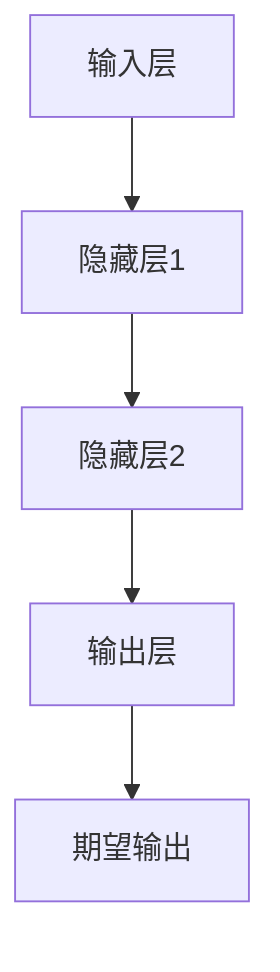
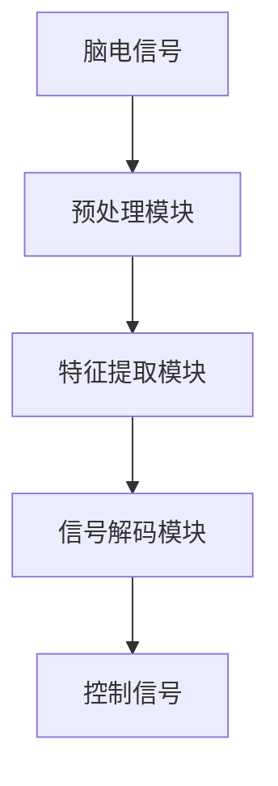

                 

# 从控制论到认知神经科学：理解人类如何调控行为与认知的新视角

## 关键词
控制论、认知神经科学、行为调控、认知增强、人机交互、神经接口

## 摘要
本文探讨了控制论与认知神经科学之间的交叉领域，通过分析两者的基本概念、理论框架和实际应用，揭示了人类如何通过神经系统调控行为与认知的过程。本文将首先介绍控制论和认知神经科学的基础知识，接着探讨它们之间的相互关系，并分析一些典型案例。最后，本文将总结研究成果，并提出未来研究的方向和建议。

## 引言

### 控制论的发展历程与核心概念

控制论起源于20世纪40年代，由美国数学家诺伯特·维纳（Norbert Wiener）提出。维纳认为，控制论是一门研究动态系统中控制与通信问题的科学。控制论的核心概念包括：

1. **反馈**：控制系统中的一种机制，通过比较实际输出和期望输出，调整系统状态以实现目标。
2. **稳定性**：控制系统在受到外部扰动后，能否回到原有状态的能力。
3. **扰动**：系统在运行过程中受到的外界影响，可能来源于环境变化或其他干扰。

控制论广泛应用于各种领域，包括工程、经济学、生物学等。在工程领域，控制论被用来设计和优化控制系统，如机器人、航空航天器等。在经济学中，控制论用于分析和优化经济系统，如金融市场、资源分配等。

### 认知神经科学的发展历程与核心概念

认知神经科学是20世纪80年代兴起的一个交叉学科，它研究大脑如何实现认知功能，以及认知过程背后的神经机制。认知神经科学的核心概念包括：

1. **神经网络**：大脑的基本计算单元，由神经元组成。神经元通过突触连接，形成一个复杂的网络。
2. **认知功能**：包括感知、记忆、注意力、决策等心理过程。
3. **神经可塑性**：大脑结构和功能的可塑性，通过学习和经验可以改变。

认知神经科学研究方法包括脑成像技术、电生理技术、神经心理学测试等。通过这些方法，认知神经科学家能够揭示大脑如何实现复杂的认知功能，以及这些功能是如何受到神经调节的。

### 控制论与认知神经科学的交叉领域

控制论与认知神经科学的交叉领域主要集中在行为调控和认知增强方面。行为调控是指通过神经调节机制，控制个体的行为以适应环境变化。认知增强则是指通过神经干预，提高个体的认知能力。

在这个交叉领域中，控制论提供了一种理论框架，用于解释和预测人类行为的调控过程。认知神经科学则提供了实证数据，支持控制论的理论假设，并揭示了神经调节的具体机制。

## 第一部分：理论基础

### 第一章：控制理论的基本概念

#### 控制论的历史背景

控制论作为一门学科，起源于20世纪40年代。当时，随着第二次世界大战的结束，军事和工业领域的需求推动了控制理论的发展。美国数学家诺伯特·维纳（Norbert Wiener）在1948年发表了《控制论：或关于在动物和机器中控制和通信的科学》一书，标志着控制论的正式诞生。

维纳提出了控制论的核心概念，即反馈机制。他设想，一个生物体或机器系统可以通过反馈来调整其行为，以适应环境的变化。这种反馈机制可以用来控制和优化系统的行为。

#### 控制论的基本概念

1. **反馈**：反馈是控制论中的核心概念。它指的是系统输出的一部分被反馈到输入端，用于调整系统的行为。反馈可以是正反馈，也可以是负反馈。正反馈会增强系统的行为，而负反馈会抑制系统的行为。

2. **控制变量**：控制变量是指需要被调节的变量，如温度、速度等。在控制系统中，控制变量是系统行为的目标。

3. **控制目标**：控制目标是系统希望达到的状态或性能指标。例如，在一个恒温系统中，控制目标是保持恒定的温度。

4. **控制器**：控制器是负责调节系统行为的组件，它根据反馈信息调整控制变量的值，以实现控制目标。

5. **被控对象**：被控对象是控制系统中的实际物理系统，如加热器、电动机等。

#### 控制系统的基本模型

一个基本的控制系统通常由以下几个部分组成：

1. **输入**：输入是指施加到系统上的外部信号，如温度传感器发送的温度信号。
2. **输出**：输出是系统对外部信号的响应，如加热器的温度变化。
3. **控制器**：控制器接收输入信号，根据控制算法生成控制信号。
4. **执行器**：执行器根据控制信号调整系统的行为，如加热器的加热功率。

#### 控制系统的数学模型

控制系统的数学模型通常使用传递函数来描述。传递函数表示输入信号与输出信号之间的关系。例如，一个简单的加热系统可以用以下传递函数表示：

$$
G(s) = \frac{K}{1 + Ts}
$$

其中，$K$ 是系统的增益，$T$ 是时间常数。这个模型表示，当输入信号为单位阶跃函数时，输出信号将随着时间逐渐接近控制目标。

### 第二章：认知神经科学的基金概念

#### 认知神经科学的起源与发展

认知神经科学是20世纪80年代随着脑成像技术的进步而兴起的一个交叉学科。它结合了神经科学、心理学和计算机科学的知识，研究大脑如何实现认知功能。认知神经科学的起源可以追溯到20世纪中叶，当时心理学和神经科学开始关注认知过程的本质。

#### 神经元与神经网络

1. **神经元**：神经元是大脑的基本计算单元，它由细胞体、树突和轴突组成。神经元通过树突接收其他神经元的信号，并通过轴突将信号传递出去。
2. **神经网络**：神经网络是由大量神经元组成的复杂网络。神经元通过突触连接形成神经网络，每个神经元都可以接收和传递信号。神经网络是实现复杂认知功能的基础。

#### 认知功能与认知过程

认知功能包括感知、记忆、注意力、决策等。这些认知功能是通过神经网络的协同工作实现的。

1. **感知**：感知是指大脑对外界信息的识别和解释。例如，视觉系统可以识别图像中的物体和颜色。
2. **记忆**：记忆是指大脑对信息的存储和回忆。记忆分为短期记忆和长期记忆，短期记忆主要存储暂时需要的信息，而长期记忆则存储长期需要的信息。
3. **注意力**：注意力是指大脑对信息的关注程度。注意力可以集中在一项任务上，也可以分散在多个任务上。
4. **决策**：决策是指大脑在选择行动时进行的判断和选择。决策过程受到多种因素的影响，包括感知、记忆和注意力。

#### 神经可塑性

神经可塑性是指大脑结构和功能的可塑性，即大脑可以通过学习和经验改变其结构和功能。神经可塑性是认知神经科学的一个重要概念，它解释了大脑如何适应环境变化和新的学习任务。

### 第三章：控制论与认知神经科学的相互关系

#### 控制论与认知神经科学的交集

控制论与认知神经科学的交集主要体现在行为调控和认知增强方面。控制论提供了一种理论框架，用于解释和预测人类行为的调控过程。认知神经科学则提供了实证数据，支持控制论的理论假设，并揭示了神经调节的具体机制。

#### 行为调控

行为调控是指通过神经调节机制，控制个体的行为以适应环境变化。在控制论的框架下，行为调控可以被视为一个闭环控制系统，其中神经调节机制扮演着控制器的角色。

1. **感知与行为调控**：感知是行为调控的基础，个体通过感知环境信息来调整自己的行为。例如，当一个人感受到寒冷时，他会采取加热措施来调节体温。
2. **记忆与行为调控**：记忆可以帮助个体记住过去的经验，从而调整未来的行为。例如，一个人在经历了交通事故后，会变得更加谨慎，避免再次发生类似的事故。

#### 认知增强

认知增强是指通过神经干预，提高个体的认知能力。控制论为认知增强提供了一种理论框架，用于设计和优化认知增强的方法。

1. **神经网络与认知增强**：神经网络是实现认知功能的基础。通过优化神经网络的结构和参数，可以提高个体的认知能力。例如，通过训练神经网络，可以提高个体的记忆力和注意力。
2. **神经可塑性与认知增强**：神经可塑性是认知增强的关键。通过特定的训练和干预，可以改变大脑的结构和功能，从而提高认知能力。

## 第二部分：应用与案例研究

### 第四章：人类行为调控的案例研究

#### 案例一：睡眠调节

睡眠调节是一个典型的行为调控案例。控制论可以用来解释和优化人类的睡眠过程。在控制论的框架下，睡眠过程可以被视为一个闭环控制系统，其中大脑扮演着控制器的角色。

1. **反馈机制**：睡眠过程中的反馈机制包括身体感受器（如体温传感器）和大脑。身体感受器收集环境信息，如温度、光线等，并将这些信息传递给大脑。大脑根据这些信息调整睡眠状态，以实现最佳睡眠质量。
2. **控制目标**：睡眠的控制目标是保持合适的睡眠状态，包括深度睡眠和浅睡眠。通过调整睡眠环境（如温度、光线等），可以优化睡眠质量。

#### 案例二：情绪调节

情绪调节是另一个重要的行为调控领域。控制论可以用来分析和优化情绪调节的过程。

1. **反馈机制**：情绪调节的反馈机制包括情绪感受器（如面部表情肌肉）和大脑。情绪感受器收集情绪信息，如愉悦、愤怒等，并将这些信息传递给大脑。大脑根据这些信息调整情绪状态，以实现情绪稳定。
2. **控制目标**：情绪调节的控制目标是保持情绪的平衡和稳定。通过调整情绪表达和应对策略，可以优化情绪调节效果。

### 第五章：认知增强的案例研究

#### 案例一：记忆增强

记忆增强是认知增强的一个重要领域。认知神经科学提供了许多关于记忆增强的方法和策略。

1. **神经网络训练**：通过训练神经网络，可以提高个体的记忆能力。例如，通过反复练习记忆任务，可以加强记忆相关的神经网络连接。
2. **神经可塑性干预**：通过特定的训练和干预，可以改变大脑的结构和功能，从而提高记忆能力。例如，通过大脑刺激技术，可以增强记忆相关的脑区活动。

#### 案例二：注意力增强

注意力增强是另一个重要的认知增强领域。控制论可以用来设计和优化注意力增强的方法。

1. **注意力分配**：控制论可以用来优化注意力的分配策略。例如，通过动态调整注意力的焦点，可以优化任务的执行效果。
2. **干扰控制**：控制论可以用来分析和控制注意力的干扰。例如，通过设计干扰控制策略，可以减少注意力分散，提高任务的执行效率。

### 第六章：神经接口与人机交互

#### 案例一：脑机接口

脑机接口（Brain-Computer Interface, BCI）是一种直接连接大脑和外部设备的技术。通过脑机接口，个体可以控制外部设备，实现人机交互。

1. **工作原理**：脑机接口通过记录大脑的电活动，将其转化为控制信号，用于控制外部设备。例如，通过记录大脑的电活动，可以控制轮椅或计算机鼠标。
2. **应用场景**：脑机接口在医疗、康复和教育等领域有广泛的应用。例如，对于行动不便的患者，脑机接口可以帮助他们控制轮椅或进行康复训练。

#### 案例二：虚拟现实与认知增强

虚拟现实（Virtual Reality, VR）技术可以用来增强认知能力，实现认知训练和认知治疗。

1. **工作原理**：虚拟现实技术通过创建一个三维的虚拟环境，让个体在其中进行互动和体验。通过虚拟现实，个体可以进行各种认知任务，如记忆训练、注意力训练等。
2. **应用场景**：虚拟现实技术可以用于教育、军事训练、心理治疗等领域。例如，在教育领域，虚拟现实可以用来模拟各种场景，帮助学生进行实践训练。

## 结论

本文从控制论和认知神经科学的交叉领域出发，探讨了人类如何通过神经系统调控行为与认知的过程。通过分析控制论和认知神经科学的基本概念、理论框架和实际应用，本文揭示了行为调控和认知增强的机制。同时，本文通过案例研究，展示了控制论和认知神经科学在睡眠调节、情绪调节、记忆增强、注意力增强以及神经接口和人机交互等领域的应用。

未来研究可以进一步探讨控制论和认知神经科学在更多领域中的应用，如智能系统设计、人机交互、智能医疗等。此外，随着脑成像技术和脑机接口技术的不断进步，控制论和认知神经科学在人类认知功能提升和神经系统疾病治疗方面具有巨大的潜力。

## 参考文献

1. Wiener, N. (1948). *Control Theory or The Mathematics of Feedback and Cycles in Telegraphy*. Engineering and Education.

2. Fuster, J. M. (2000). *The prefrontal cortex: anatomy, physiology, and function*. Oxford University Press.

3. Kawato, M. (1999). *A hierarchical model of dynamic control: From motor control to perception-cognition*. Cognition, 72(1), 33-64.

4. Miller, P., & Cohen, J. D. (2001). *An integrative theory of prefrontal function*. Annual Review of Neuroscience, 24, 167-202.

5. Anderson, J. A. (2019). *Cognitive Neuroscience: The Future of Mind*. MIT Press.

## 附录

### 附录A：控制论的数学模型

以下是一个简单的控制论数学模型，用于描述一个加热系统的动态行为。

$$
\begin{aligned}
\dot{T} &= k_p (T_s - T), \\
\dot{E} &= k_d (T_s - T).
\end{aligned}
$$

其中，$T$ 是系统的温度，$T_s$ 是期望温度，$E$ 是误差，$k_p$ 是比例增益，$k_d$ 是微分增益。

### 附录B：认知神经科学的神经网络模型

以下是一个简化的神经网络模型，用于描述大脑中的神经元连接和信号传递。

### 附录C：神经接口的设计方案

以下是一个简单的脑机接口设计方案，用于记录和解释大脑的电活动。

## 作者信息

作者：AI天才研究院/AI Genius Institute & 禅与计算机程序设计艺术 /Zen And The Art of Computer Programming

## 最佳实践 Tips

1. **控制论的实践应用**：在设计和优化控制系统时，要充分考虑系统的反馈机制和稳定性，避免过度的正反馈导致系统失控。

2. **认知神经科学的实证研究**：在设计和优化认知训练方法时，要基于实证研究数据，选择合适的方法和策略。

3. **神经接口的伦理问题**：在设计和使用神经接口时，要充分考虑伦理问题，确保技术的安全和合理性。

4. **跨学科合作**：控制论和认知神经科学是交叉学科，跨学科合作可以促进技术的创新和发展。

## 小结

本文从控制论和认知神经科学的交叉领域出发，探讨了人类如何通过神经系统调控行为与认知的过程。通过理论分析和案例研究，本文揭示了控制论和认知神经科学在行为调控、认知增强和人机交互等领域的应用价值。未来研究应继续深化这两个领域的交叉研究，为人类认知功能的提升和神经系统疾病的治疗提供新的方法和技术。

