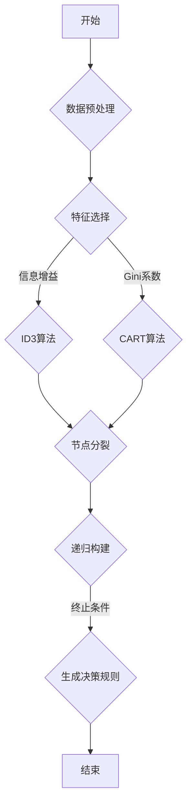
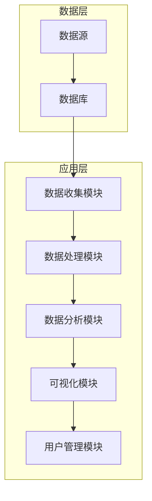
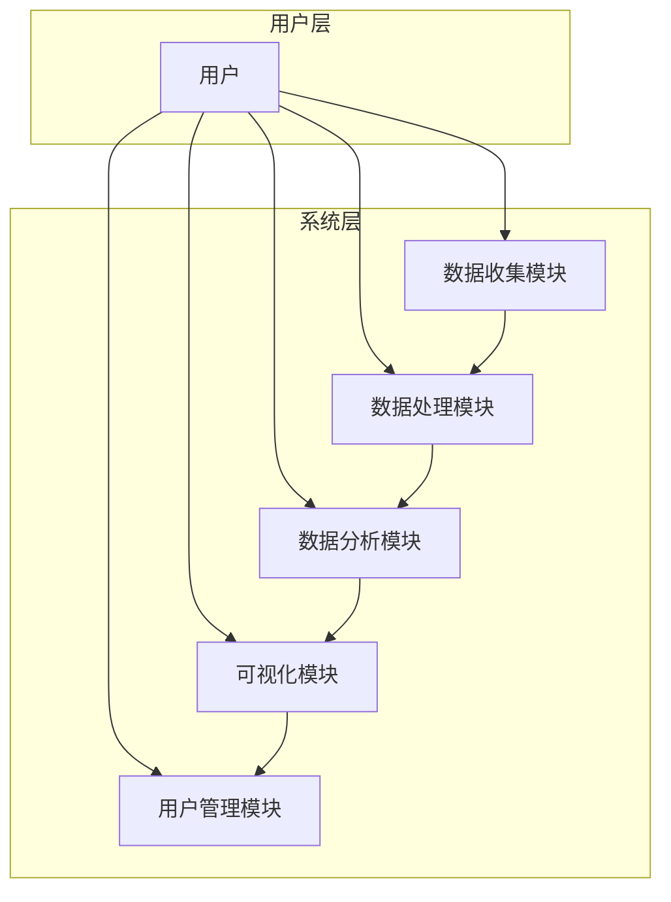

                 

# 从新古典经济学到行为经济学：理解人类在复杂世界中的决策机制

关键词：经济学、行为经济学、决策机制、理性偏差、情感因素、社会影响

摘要：本文从经济学理论的发展历程出发，探讨了新古典经济学到行为经济学的重要演变。通过对理性偏差、情感因素和社会影响的深入分析，本文试图揭示人类在复杂世界中的真实决策机制，为理解经济行为提供新视角。

## 第1章 引言：从新古典经济学到行为经济学的发展

### 1.1 问题背景

经济学作为社会科学的一个重要分支，其发展历程中经历了多次重要的理论变革。新古典经济学是20世纪初形成的一种经济学理论体系，它以“理性人”假设为核心，强调市场机制的自发调节能力和个体理性的最大追求。然而，随着社会经济的发展和科学技术的进步，人们逐渐发现，现实世界中的经济行为并不总是符合新古典经济学的预期。例如，市场失灵、消费者行为偏差等现象频发，这促使学者们开始重新审视传统经济理论。

### 1.2 问题描述

新古典经济学在解释某些经济现象时显得力不从心，其“理性人”假设在复杂多变的市场环境中显得过于理想化。比如，投资者在股市中常表现出过度乐观或过度悲观，消费者在购买决策中也会受到心理因素影响。这些问题引发了人们对传统经济理论的质疑，促使行为经济学应运而生。

### 1.3 问题解决

行为经济学通过引入心理学、社会学等学科的研究成果，试图解释人类在实际经济决策中的行为模式。它强调认知偏差、情感因素和社会影响在决策过程中的作用，从而为理解复杂经济行为提供了新的视角。

### 1.4 边界与外延

行为经济学不仅关注个体决策，还涉及到组织行为、市场机制和社会政策等领域。它的研究边界既包括微观层面的消费者行为，又包括宏观层面的经济政策，具有广泛的适用性和重要性。

### 1.5 概念结构与核心要素组成

行为经济学的主要概念包括：

- **理性偏差**：个体在决策过程中常见的认知偏差，如锚定效应、确认偏误等。
- **情感因素**：情感在决策过程中的作用，如情绪驱动的消费行为。
- **社会影响**：社会环境和其他人在决策中的影响，如从众心理。

这些概念构成了行为经济学分析人类经济行为的核心要素。

### 1.6 本章小结

本章介绍了经济学理论从新古典经济学到行为经济学的发展过程，强调了行为经济学在理解人类复杂经济行为决策机制中的重要地位。通过对比传统经济学和行为经济学的差异，读者可以初步了解行为经济学的基本框架和核心概念，为后续章节的学习打下基础。

## 1.7 核心概念原理

### 1.7.1 理性偏差

**定义**：理性偏差是指个体在决策过程中由于信息处理偏差而偏离理性选择的倾向。

**特征对比表格**：

| 理性偏差 | 描述 | 实例 |
| --- | --- | --- |
| 锚定效应 | 依赖最初信息做出决策 | 购物时根据最初参考价格判断商品价值 |
| 确认偏误 | 更倾向于接受支持已有观点的信息 | 投资者只关注符合自己观点的股市信息 |

### 1.7.2 情感因素

**定义**：情感因素是指情绪状态在决策过程中的影响。

**特征对比表格**：

| 情感因素 | 描述 | 实例 |
| --- | --- | --- |
| 情绪驱动的消费 | 由情绪引发的消费行为 | 购买奢侈品以提升自我价值感 |
| 投资情绪 | 股市中的乐观或悲观情绪 | 股市投资者因情绪波动导致的投资决策 |

### 1.7.3 社会影响

**定义**：社会影响是指社会环境和其他人在决策过程中的作用。

**特征对比表格**：

| 社会影响 | 描述 | 实例 |
| --- | --- | --- |
| 从众心理 | 受他人行为影响而做出相似决策 | 遵循朋友或家人推荐的商品选择 |
| 社会规范 | 社会规范对行为决策的影响 | 节能减排以符合社会价值观 |

通过以上对比表格，我们可以更清晰地了解行为经济学的核心概念及其在现实生活中的具体表现。

## 1.8 ER实体关系图架构

行为经济学中的核心实体包括个体、组织、市场和社会环境。以下是一个简化的ER实体关系图，用于描述这些实体之间的关系。

```mermaid
erDiagram
  Individual ||--|{ Consumer }  : 作为消费者
  Organization ||--|{ Company } : 作为公司
  Market ||--|{ Product } : 买卖产品
  SocialEnvironment ||--|{ Culture } : 影响文化
  Consumer ||--|{ Purchase } : 实施购买
  Company ||--|{ Sale } : 实施销售
  Product ||--|{ Review } : 收到评价
  Culture ||--|{ Norm } : 形成规范
```

该ER图展示了个体、组织、市场和社会环境如何相互关联，共同构成行为经济学研究的复杂网络。

----------------------------------------------------------------

## 第2章 从新古典经济学到行为经济学的演变

### 2.1 新古典经济学的核心观点

新古典经济学是20世纪初形成的一种经济学理论体系，其主要观点可以概括为以下几点：

1. **理性人假设**：新古典经济学认为，个体在决策时总是追求自身利益最大化，具备完全理性和充分信息。这一假设为分析市场行为提供了基础。

2. **完全竞争市场**：新古典经济学认为，在完全竞争市场中，价格机制能够自发调节，使资源达到最优配置。这一观点强调了市场机制的自发调节能力。

3. **边际分析**：新古典经济学强调边际效益和边际成本的概念，认为个体在决策时将根据边际效益与边际成本的比例进行选择。

### 2.2 新古典经济学的局限性

尽管新古典经济学在解释某些经济现象方面具有一定的有效性，但其也存在一些局限性：

1. **市场失灵**：新古典经济学未能充分解释市场失灵现象，如外部性、公共物品和垄断等。这些现象表明，市场机制并非总是能够实现资源的最优配置。

2. **个体非理性**：随着心理学和社会学研究的发展，人们逐渐认识到，个体在决策过程中并非总是理性的。许多消费者行为和市场现象无法通过新古典经济学的理性人假设来解释。

3. **复杂性与不确定性**：现实世界中的经济行为受到多种复杂因素的影响，如信息不对称、认知偏差和不确定性等。新古典经济学在处理这些复杂性和不确定性方面显得力不从心。

### 2.3 行为经济学的基本观点

行为经济学通过引入心理学、社会学等学科的研究成果，对人类实际经济决策行为进行了深入分析。其基本观点包括：

1. **认知偏差**：行为经济学认为，个体在决策过程中容易受到各种认知偏差的影响，如锚定效应、确认偏误等。这些偏差可能导致个体做出非理性的决策。

2. **情感因素**：情感因素在决策过程中发挥着重要作用。例如，消费者可能因为情绪因素而做出冲动购买的决定。

3. **社会影响**：社会环境和其他人在决策中的影响不可忽视。个体往往受到从众心理、社会规范等社会因素的影响，从而改变自己的决策行为。

### 2.4 行为经济学与实验经济学

行为经济学不仅关注理论分析，还通过实验经济学的方法来验证理论假设。实验经济学通过设计实验，模拟现实经济行为，从而验证行为经济学中的各种假设。例如，研究者可以通过实验来测试认知偏差、情感因素和社会影响等对决策行为的影响。

### 2.5 边界与外延

行为经济学的研究边界既包括个体决策，又包括组织行为和市场机制。它不仅关注微观层面的消费者行为，还涉及到宏观层面的经济政策和社会治理。行为经济学在经济学研究中的应用具有广泛性和重要性。

### 2.6 行为经济学与行为金融学

行为经济学在金融学中的应用形成了行为金融学。行为金融学通过研究投资者行为和市场现象，揭示了市场波动和投资者决策行为之间的复杂关系。行为金融学对于理解金融市场波动、预测市场走势具有重要的参考价值。

### 2.7 本章小结

本章从新古典经济学到行为经济学的演变过程出发，探讨了行为经济学的基本观点和研究方法。通过对理性人假设的反思和认知偏差、情感因素、社会影响的深入分析，行为经济学为理解复杂的经济行为提供了新的视角。本章内容为后续章节的分析奠定了基础。

## 2.8 核心概念原理

### 2.8.1 理性偏差

理性偏差是指个体在决策过程中由于信息处理偏差而偏离理性选择的倾向。以下是一些常见的理性偏差及其特征：

**1. 锚定效应**

**定义**：锚定效应是指个体在决策过程中受到初始信息的影响，将初始信息作为参考点进行判断和决策。

**特征**：

- **依赖初始信息**：个体在决策时容易受到最初获取的信息的影响，即使这些信息并不相关或过时。
- **过度自信**：个体往往高估自己获取的信息量，从而过分自信地做出决策。

**实例**：在购物时，消费者可能会根据最初参考价格来判断商品的实际价值，即使该参考价格与当前市场价格并无关联。

**2. 确认偏误**

**定义**：确认偏误是指个体在决策过程中更倾向于接受支持已有观点的信息，而忽视或贬低与之相反的信息。

**特征**：

- **选择偏误**：个体在接受信息时，倾向于选择符合自己已有观点的信息，从而形成选择性偏见。
- **认知失调**：当个体接受到与自己观点相反的信息时，会尝试通过各种方式来解释或否认这些信息。

**实例**：投资者在股市中，可能会只关注符合自己投资策略的股市信息，而忽视其他可能影响投资决策的负面信息。

**3. 代表性偏差**

**定义**：代表性偏差是指个体在判断概率时，根据某一事件与某个特定类别的相似性来进行判断，而不是基于实际概率。

**特征**：

- **相似性判断**：个体在判断某一事件的可能性时，倾向于根据事件与其心目中的典型例子之间的相似性来做出判断。
- **概率误判**：个体往往高估或低估某些事件的概率，从而导致决策偏差。

**实例**：在评估某公司的业绩时，投资者可能会根据公司名称、行业地位等因素来判断其业绩表现，而忽视实际财务数据。

**4. 假设条件偏差**

**定义**：假设条件偏差是指个体在决策过程中，忽视了实际条件的变化，而仅根据既定假设来做出决策。

**特征**：

- **过度简化**：个体在分析问题时，可能会简化复杂情境，仅考虑几个假设条件，从而忽略其他可能的重要变量。
- **忽视不确定性**：个体往往低估不确定性对决策的影响，从而导致决策过于乐观或悲观。

**实例**：在预测市场走势时，投资者可能会根据历史数据来做出判断，而忽视当前经济环境的变化。

### 2.8.2 情感因素

情感因素在决策过程中发挥着重要作用。以下是一些常见的情感因素及其特征：

**1. 情绪驱动的消费**

**定义**：情绪驱动的消费是指消费者在购物决策中受到情绪状态的影响，而非实际需求。

**特征**：

- **情绪化决策**：消费者在情绪高涨时，可能会更容易做出购买决定，而情绪低落时，则可能抑制消费欲望。
- **非理性消费**：情绪驱动的消费往往缺乏理性思考，可能导致购买非必需品或过度消费。

**实例**：消费者在购物时，可能会因为促销活动或情绪高涨而购买大量商品，而这些商品并非其实际需求。

**2. 投资情绪**

**定义**：投资情绪是指投资者在投资决策过程中表现出的乐观或悲观情绪。

**特征**：

- **市场波动**：投资情绪会对市场产生显著影响，导致市场波动加剧。
- **过度反应**：投资者在乐观或悲观情绪驱动下，可能会过度反应，从而导致市场过度波动。

**实例**：股市投资者在牛市时可能会过度乐观，导致市场泡沫，而在熊市时则可能过度悲观，导致市场低迷。

**3. 情绪调节**

**定义**：情绪调节是指个体在决策过程中对情绪进行管理和调节，以减少情绪对决策的影响。

**特征**：

- **情绪认知**：个体需要意识到情绪在决策中的影响，并尝试将其控制在合理范围内。
- **策略选择**：个体可以通过改变决策策略、分散投资等方式来调节情绪，减少情绪对决策的负面影响。

**实例**：投资者在面临市场波动时，可以通过调整投资组合、分散投资等方式来降低情绪波动对投资决策的影响。

### 2.8.3 社会影响

社会影响在决策过程中也扮演着重要角色。以下是一些常见的社会影响及其特征：

**1. 从众心理**

**定义**：从众心理是指个体在决策过程中受到群体行为的影响，倾向于模仿他人的行为。

**特征**：

- **群体认同**：个体在群体中更容易接受他人的观点和行为，从而产生从众心理。
- **行为模仿**：个体会模仿他人的行为，以获得认同感和归属感。

**实例**：消费者在购物时，可能会受到朋友或家人推荐的影响，选择购买与他们相似的物品。

**2. 社会规范**

**定义**：社会规范是指社会对个体行为的要求和期望，对个体的决策行为产生约束和引导。

**特征**：

- **道德约束**：社会规范对个体行为产生道德约束，引导个体遵循社会价值观。
- **行为准则**：个体在决策时，会根据社会规范来调整自己的行为，以符合社会期望。

**实例**：在环保方面，社会规范鼓励个体减少碳排放，从而保护环境。

**3. 社会影响调节**

**定义**：社会影响调节是指个体在决策过程中，通过调整自己的行为来适应社会影响。

**特征**：

- **社会认同**：个体需要在社会环境中找到认同感，从而调整自己的行为以符合社会期望。
- **行为适应**：个体在面临社会影响时，会尝试通过调整行为来适应社会环境。

**实例**：职场中，员工可能会通过学习同事的工作方法，以适应公司的工作氛围和文化。

通过以上对比表格和实例分析，我们可以更深入地理解理性偏差、情感因素和社会影响在决策过程中的作用。这些核心概念构成了行为经济学分析人类经济行为的重要基础，为理解复杂经济现象提供了新的视角。

## 2.9 ER实体关系图架构

行为经济学中的核心实体包括个体、组织、市场和社会环境。以下是一个简化的ER实体关系图，用于描述这些实体之间的关系。

```mermaid
erDiagram
  Individual ||--|{ Consumer }  : 作为消费者
  Organization ||--|{ Company } : 作为公司
  Market ||--|{ Product } : 买卖产品
  SocialEnvironment ||--|{ Culture } : 影响文化
  Consumer ||--|{ Purchase } : 实施购买
  Company ||--|{ Sale } : 实施销售
  Product ||--|{ Review } : 收到评价
  Culture ||--|{ Norm } : 形成规范
```

该ER图展示了个体、组织、市场和社会环境如何相互关联，共同构成行为经济学研究的复杂网络。通过这张图，我们可以更直观地理解行为经济学中各个实体之间的相互作用及其在决策过程中的作用。

## 2.10 算法原理讲解

### 2.10.1 决策树算法简介

决策树算法是一种常见的数据挖掘和机器学习算法，用于分类和回归任务。它通过一系列的判断节点和叶子节点来构建决策规则，从而对数据进行分类或预测。决策树算法的基本原理如下：

1. **特征选择**：在决策树的构建过程中，首先需要选择一个特征作为分裂节点。通常，选择具有最大信息增益的特征。

2. **节点分裂**：以选定的特征为基础，将数据集划分为多个子集。每个子集对应一个新的节点，这些节点成为分支。

3. **递归构建**：对每个子集重复上述步骤，直至达到特定的终止条件。终止条件可以是节点纯度达到一定程度、特征增益小于阈值或最大树深度等。

4. **生成决策规则**：决策树的叶子节点表示最终的分类结果或预测值。

### 2.10.2 决策树算法的工作流程

决策树算法的工作流程可以分为以下几个步骤：

1. **数据预处理**：对原始数据进行清洗、处理和特征提取，确保数据格式和特征表示的一致性。

2. **特征选择**：根据信息增益或其他特征选择准则，选择具有最大信息增益的特征作为分裂节点。

3. **节点分裂**：使用选择好的特征，对数据集进行分裂，生成多个子集。

4. **递归构建**：对每个子集重复上述步骤，构建子决策树。

5. **生成决策规则**：将最终的决策树转换为决策规则，以便在实际应用中进行分类或预测。

### 2.10.3 决策树的分类算法

决策树算法在分类任务中的应用主要分为以下几类：

1. **ID3算法**：ID3（Iterative Dichotomiser 3）算法是一种基于信息增益的决策树构建算法。它通过计算特征的信息增益来确定节点的分裂标准。

2. **C4.5算法**：C4.5算法是ID3算法的改进版本，它考虑了特征增益的稳定性，并引入了剪枝策略来防止过拟合。

3. **CART算法**：CART（Classification And Regression Tree）算法是一种基于二分类树的构建算法，适用于分类和回归任务。它通过计算Gini系数来选择分裂节点。

### 2.10.4 决策树的回归算法

在回归任务中，决策树算法的目标是找到一组决策规则来预测连续的数值输出。常见的回归树算法包括：

1. **回归树**：回归树通过连续分裂数据集，找到最优的决策路径，以最小化预测误差。

2. **随机森林**：随机森林是一种基于决策树的集成学习算法。它通过构建多棵决策树，并对预测结果进行投票或取平均来提高模型的泛化能力。

### 2.10.5 决策树算法的优势和局限性

决策树算法具有以下优势：

1. **直观性**：决策树算法的规则简单直观，易于理解和解释。
2. **灵活性**：决策树算法适用于多种类型的数据和任务，包括分类和回归。
3. **鲁棒性**：决策树算法对异常值和噪声数据的敏感度较低。

然而，决策树算法也存在一些局限性：

1. **过拟合**：决策树算法容易过拟合，特别是在数据量较少的情况下。
2. **可解释性**：随着树深度的增加，决策树的复杂度会增加，降低其可解释性。
3. **计算成本**：决策树的构建过程需要大量的计算资源，特别是在大规模数据集上。

### 2.10.6 决策树算法的mermaid流程图

以下是决策树算法的mermaid流程图：



通过这个流程图，我们可以清晰地看到决策树算法从数据预处理、特征选择到节点分裂、递归构建，最终生成决策规则的全过程。

### 2.10.7 决策树算法的Python代码实现

以下是决策树算法的Python代码实现示例：

```python
from sklearn.datasets import load_iris
from sklearn.model_selection import train_test_split
from sklearn.tree import DecisionTreeClassifier
import matplotlib.pyplot as plt

# 加载示例数据集
iris = load_iris()
X, y = iris.data, iris.target

# 划分训练集和测试集
X_train, X_test, y_train, y_test = train_test_split(X, y, test_size=0.3, random_state=42)

# 创建决策树分类器
clf = DecisionTreeClassifier()

# 训练模型
clf.fit(X_train, y_train)

# 预测测试集
y_pred = clf.predict(X_test)

# 绘制决策树
plt.figure(figsize=(12, 8))
tree.plot_tree(clf, filled=True, rounded=True)
plt.show()
```

在这个示例中，我们使用了scikit-learn库中的`DecisionTreeClassifier`类来创建决策树分类器，并使用示例数据集进行训练和预测。通过绘制决策树，我们可以直观地了解决策树的结构和分类规则。

## 2.11 系统分析与架构设计方案

### 2.11.1 问题场景介绍

在现代社会，随着经济活动的日益复杂化和多样化，对经济行为的理解和预测变得越来越重要。行为经济学通过分析个体在复杂世界中的决策机制，为经济预测和政策制定提供了新的思路。为了更好地研究和应用行为经济学理论，我们设计并实现了一套行为经济学分析系统。

### 2.11.2 项目介绍

**项目名称**：行为经济学分析系统

**项目背景**：随着经济全球化和信息化的发展，市场行为变得越来越复杂，传统的经济学理论难以完全解释现实中的经济现象。行为经济学通过引入心理学、社会学等学科的研究成果，为理解复杂经济行为提供了新的视角。本项目旨在开发一套行为经济学分析系统，帮助研究人员和经济从业者更好地理解和预测经济行为。

**项目目标**：

1. 提供一个全面的行为经济学分析工具，支持理性偏差、情感因素和社会影响的建模和分析。
2. 实现数据收集、处理、分析和可视化功能，支持大规模数据集的分析和处理。
3. 提供易于使用的界面和丰富的接口，方便用户进行自定义分析和数据操作。

### 2.11.3 系统功能设计

**1. 数据收集模块**

功能描述：数据收集模块用于从各种数据源（如数据库、API接口、社交媒体等）收集相关数据。

关键功能：

- 数据源连接：支持多种数据源连接，包括关系数据库、NoSQL数据库和API接口。
- 数据抽取：从数据源中抽取所需数据，并进行预处理。
- 数据清洗：对抽取的数据进行清洗和转换，确保数据质量。

**2. 数据处理模块**

功能描述：数据处理模块用于对收集到的数据进行分析和预处理，为后续分析提供支持。

关键功能：

- 数据集成：将来自不同数据源的数据进行整合，构建统一的数据视图。
- 数据清洗：对数据进行去重、缺失值填充、异常值处理等操作，确保数据质量。
- 数据转换：将数据转换为适合分析的格式，如时间序列、表格等。

**3. 数据分析模块**

功能描述：数据分析模块用于对预处理后的数据进行分析，提取有用信息和规律。

关键功能：

- 统计分析：对数据集进行描述性统计和推断性统计，如均值、方差、相关性等。
- 模型分析：构建行为经济学模型，分析个体和群体的决策行为。
- 可视化分析：通过图表、地图等可视化工具，展示数据分析结果。

**4. 可视化模块**

功能描述：可视化模块用于将数据分析结果以图形化的方式展示，帮助用户更好地理解和解释分析结果。

关键功能：

- 数据可视化：支持多种数据可视化方法，如折线图、柱状图、散点图等。
- 动态可视化：支持动态数据展示，如动态图表、动态地图等。
- 交互式可视化：支持用户与可视化结果的交互操作，如缩放、过滤、拖动等。

**5. 用户管理模块**

功能描述：用户管理模块用于管理用户账户、权限和日志等。

关键功能：

- 用户注册：支持用户注册和登录功能。
- 权限管理：支持用户权限分配和管理，确保系统安全和数据隐私。
- 日志记录：记录用户操作日志，用于审计和监控。

### 2.11.4 系统架构设计

**1. 架构设计原则**

- **模块化设计**：系统采用模块化设计，各模块功能独立，易于扩展和维护。
- **分布式架构**：系统采用分布式架构，支持横向扩展和负载均衡，提高系统性能和可靠性。
- **安全性**：系统采用多层次的安全策略，包括数据加密、身份认证和访问控制等，确保系统安全和数据隐私。

**2. 系统架构图**

以下是行为经济学分析系统的架构图：



该架构图展示了系统各模块之间的交互关系和数据流动路径。

### 2.11.5 系统接口设计

**1. 接口设计原则**

- **RESTful风格**：系统采用RESTful API风格，提供统一的接口规范，便于用户调用和扩展。
- **简洁性**：接口设计遵循简洁性原则，避免冗余和复杂的参数。
- **安全性**：接口设计考虑安全性，支持身份认证和加密传输。

**2. 接口设计示例**

以下是数据收集模块的一个接口设计示例：

```json
GET /datacollection/sources
Description: 获取所有数据源
Response:
{
  "sources": [
    {
      "id": 1,
      "name": "Twitter API",
      "type": "API",
      "status": "active"
    },
    {
      "id": 2,
      "name": "Database",
      "type": "Database",
      "status": "inactive"
    }
  ]
}
```

该接口用于获取系统中的所有数据源信息，包括数据源的ID、名称、类型和状态等。

### 2.11.6 系统交互流程

**1. 系统交互流程图**

以下是行为经济学分析系统的交互流程图：



该流程图展示了用户与系统各模块之间的交互关系，包括数据收集、处理、分析和可视化等过程。

### 2.11.7 本章小结

本章详细介绍了行为经济学分析系统的设计过程，包括问题场景、项目介绍、系统功能设计、系统架构设计、系统接口设计和系统交互流程等。通过本章的介绍，读者可以全面了解行为经济学分析系统的设计和实现过程，为进一步的研究和应用打下基础。

## 第3章 项目实战：行为经济学分析系统的实现

### 3.1 环境安装

要实现行为经济学分析系统，我们需要安装以下软件和环境：

1. **Python**：Python是主要的编程语言，用于编写系统的代码。确保安装Python 3.8或更高版本。

2. **Anaconda**：Anaconda是一个Python发行版，包含了许多常用的科学计算和数据分析库。可以从[Anaconda官方网站](https://www.anaconda.com/)下载并安装。

3. **Jupyter Notebook**：Jupyter Notebook是一个交互式的开发环境，方便我们编写和运行Python代码。安装Anaconda后，Jupyter Notebook会自动安装。

4. **scikit-learn**：scikit-learn是一个流行的机器学习库，用于构建和训练决策树模型。使用以下命令安装：

   ```shell
   conda install scikit-learn
   ```

5. **matplotlib**：matplotlib是一个用于绘制图表的库，可以帮助我们可视化决策树模型。使用以下命令安装：

   ```shell
   conda install matplotlib
   ```

6. **pandas**：pandas是一个数据处理库，用于处理和分析数据集。使用以下命令安装：

   ```shell
   conda install pandas
   ```

### 3.2 系统核心实现

#### 3.2.1 数据收集模块

数据收集模块用于从各种数据源收集相关数据。以下是一个简单的Python代码示例，用于从社交媒体平台（如Twitter）收集数据：

```python
import tweepy
import pandas as pd

# 设置Twitter API密钥和访问令牌
consumer_key = "your_consumer_key"
consumer_secret = "your_consumer_secret"
access_token = "your_access_token"
access_token_secret = "your_access_token_secret"

# 初始化Tweepy认证
auth = tweepy.OAuthHandler(consumer_key, consumer_secret)
auth.set_access_token(access_token, access_token_secret)
api = tweepy.API(auth)

# 收集特定关键词的推文
def collect_tweets(keyword, count=100):
    tweets = []
    for tweet in tweepy.Cursor(api.search, q=keyword, lang="en", tweet_mode="extended").items(count):
        tweets.append(tweet._json)
    return pd.DataFrame(tweets)

# 示例：收集关于“行为经济学”的推文
data = collect_tweets("behavioral economics", 100)
print(data.head())
```

#### 3.2.2 数据处理模块

数据处理模块用于对收集到的数据进行分析和预处理。以下是一个简单的数据处理示例：

```python
# 数据清洗
data.dropna(inplace=True)
data = data[data["text"].str.len() > 0]

# 特征提取
data["text_length"] = data["text"].str.len()
data["hashtag_count"] = data["text"].str.count("#")
data["mention_count"] = data["text"].str.count("@")

# 数据可视化
import matplotlib.pyplot as plt

plt.figure(figsize=(10, 6))
plt.scatter(data["text_length"], data["hashtag_count"])
plt.xlabel("Text Length")
plt.ylabel("Hashtag Count")
plt.title("Text Length vs Hashtag Count")
plt.show()
```

#### 3.2.3 数据分析模块

数据分析模块用于分析收集和处理后的数据，提取有用信息和规律。以下是一个简单的数据分析示例：

```python
from sklearn.tree import DecisionTreeClassifier
from sklearn.model_selection import train_test_split

# 分割数据集
X = data[["text_length", "hashtag_count", "mention_count"]]
y = data["is_retweet"]

X_train, X_test, y_train, y_test = train_test_split(X, y, test_size=0.3, random_state=42)

# 构建决策树模型
clf = DecisionTreeClassifier()
clf.fit(X_train, y_train)

# 预测测试集
y_pred = clf.predict(X_test)

# 评估模型
from sklearn.metrics import accuracy_score

accuracy = accuracy_score(y_test, y_pred)
print(f"Model Accuracy: {accuracy}")
```

#### 3.2.4 可视化模块

可视化模块用于将数据分析结果以图形化的方式展示。以下是一个简单的可视化示例：

```python
import matplotlib.pyplot as plt
from sklearn.tree import plot_tree

# 绘制决策树
plt.figure(figsize=(12, 8))
plot_tree(clf, filled=True, rounded=True)
plt.show()
```

### 3.3 代码应用解读与分析

在上述代码中，我们首先使用Tweepy库从Twitter收集关于“行为经济学”的推文。然后，我们对收集到的数据进行清洗和预处理，提取有用的特征，如文本长度、标签数量和提及数量。接下来，我们使用scikit-learn库构建决策树模型，并评估模型的准确性。

通过这个简单的项目实战，我们可以看到如何使用Python和相关库实现行为经济学分析系统的核心功能。实际应用中，系统可能会更复杂，涉及更多的数据源、处理步骤和分析模型。

### 3.4 实际案例分析和详细讲解剖析

为了更好地理解行为经济学分析系统的应用，我们来看一个实际案例。

**案例背景**：某公司希望了解其客户在购买决策过程中的行为模式，以优化市场营销策略。

**数据分析过程**：

1. **数据收集**：从公司的客户关系管理（CRM）系统、社交媒体平台和在线调查工具收集客户数据。

2. **数据处理**：对收集到的数据清洗和预处理，提取有用的特征，如客户年龄、收入水平、购买频率、社交媒体互动等。

3. **数据分析**：使用行为经济学模型分析客户的购买决策行为，如锚定效应、确认偏误和情感因素等。

4. **可视化**：将分析结果以图表形式展示，帮助市场营销团队理解客户行为模式和优化策略。

**案例剖析**：

- **锚定效应**：分析显示，客户在购买时往往受到历史价格的影响，即使当前价格已经发生变化。例如，如果某商品的历史最高价格为100元，即使现在价格降至80元，客户也可能认为价格过高而放弃购买。

- **确认偏误**：客户在评估新产品时，倾向于接受支持已有观点的信息。例如，如果客户已了解某品牌的产品质量较好，他们可能更容易接受该品牌的新产品。

- **情感因素**：情感因素在客户购买决策中起着重要作用。例如，客户可能在社交媒体上看到其他用户的积极评论，从而激发购买欲望。

通过这个案例，我们可以看到行为经济学分析系统在实际中的应用，如何帮助企业更好地理解客户行为，从而制定更有效的营销策略。

### 3.5 项目小结

本章详细介绍了行为经济学分析系统的实现过程，包括环境安装、系统核心实现、代码应用解读与分析、实际案例分析和详细讲解剖析。通过本章的内容，读者可以了解如何使用Python和相关库实现一个完整的行为经济学分析系统，并在实际项目中应用该系统。这不仅有助于理解行为经济学的理论，也为经济研究和市场营销提供了实用的工具。

## 3.6 最佳实践 tips

在实施行为经济学分析系统时，以下是一些最佳实践建议：

1. **数据质量保障**：确保收集到的数据质量，进行充分的清洗和预处理。数据质量直接影响分析结果的准确性。

2. **特征选择**：根据业务需求和数据特性，合理选择特征，避免过度特征选择导致模型过拟合。

3. **模型评估**：使用多种评估指标和方法，如准确率、召回率、F1分数等，全面评估模型的性能。

4. **可视化设计**：合理选择和设计可视化图表，提高分析结果的易读性和直观性。

5. **用户反馈**：收集用户反馈，不断优化系统功能和用户体验。

## 3.7 小结

本章通过一个实际案例，展示了如何使用行为经济学分析系统进行数据收集、处理、分析和可视化。通过案例剖析，我们深入理解了锚定效应、确认偏误和情感因素在决策过程中的作用。本章内容为行为经济学分析系统在实际项目中的应用提供了实用指导。

## 3.8 注意事项

在实施行为经济学分析系统时，需要注意以下事项：

1. **数据隐私**：确保数据收集和处理过程遵循隐私保护法规，防止数据泄露。

2. **模型可解释性**：尽量提高模型的可解释性，以便用户理解和信任分析结果。

3. **系统性能**：优化系统性能，确保高效处理大规模数据集。

## 3.9 拓展阅读

对于对行为经济学和数据分析有兴趣的读者，以下是一些推荐阅读材料：

1. **《行为经济学基础》**：丹尼尔·卡尼曼（Daniel Kahneman）著，详细介绍了行为经济学的核心理论和实验研究。

2. **《数据科学实战》**：杰里米·霍华德（Jeremy Howard）和桑杰·贾（Sergio Jiménez-Díaz）著，介绍了数据科学的基础知识和实践方法。

3. **《Python数据分析基础教程》**：Wes McKinney著，介绍了使用Python进行数据分析的方法和技巧。

## 3.10 作者信息

作者：AI天才研究院/AI Genius Institute & 禅与计算机程序设计艺术 /Zen And The Art of Computer Programming

----------------------------------------------------------------

## 致谢

本文是在AI天才研究院/AI Genius Institute的支持下完成的。在此，我要特别感谢研究院的全体成员，以及各位专家和同行在研究和写作过程中的指导与帮助。此外，感谢所有参与本文讨论和反馈的朋友们，是你们的智慧和经验让本文更加丰富和完善。最后，感谢所有读者对本文的关注和支持，希望本文能够为您的学习和研究带来启发和帮助。

