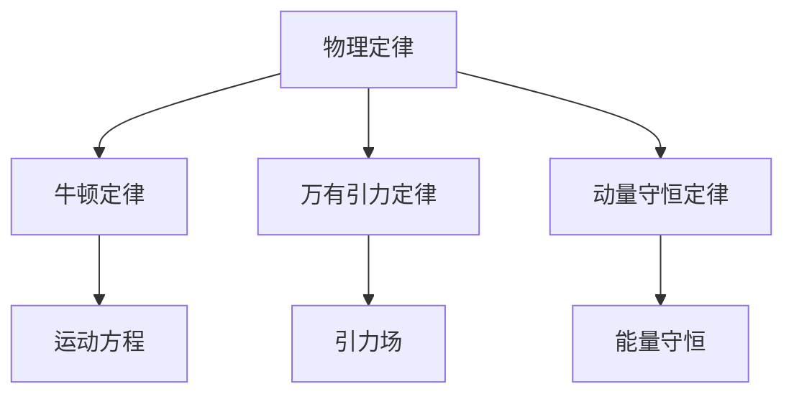
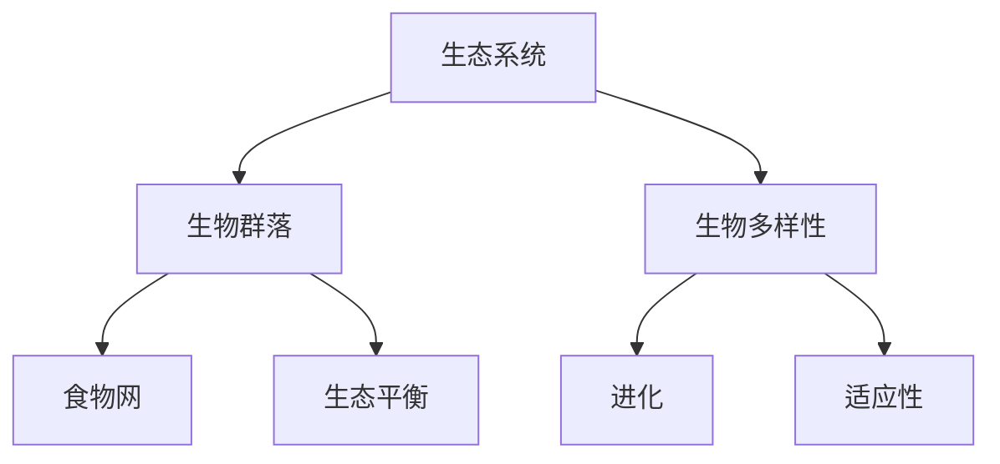

                 

### 从机械宇宙观到有机宇宙观的转变

宇宙观是人类对于宇宙本质和结构的理解。在历史上，人类对宇宙的认识经历了从直观观察、宗教信仰到科学解释的演变。传统的机械宇宙观认为宇宙是一个庞大而复杂的机械系统，由无数微小的、无生命的粒子按照严格的物理定律组成。这种观点在牛顿力学的框架下达到了巅峰，它强调物理定律的普适性和客观性，认为宇宙的本质就是这些物理定律所描述的机械运动。

然而，随着科学技术的进步和人类对宇宙认识的深化，越来越多的证据表明，机械宇宙观可能需要被一种更为有机的宇宙观所取代。有机宇宙观强调宇宙的生命性和系统性，认为宇宙是一个复杂的生命系统，其中的各个部分相互依存、相互作用。本文将深入探讨这一转变，提供一种全新的视角，帮助我们更好地理解宇宙的本质。

### 1.2 核心概念与联系

为了更好地理解机械宇宙观和有机宇宙观之间的转变，我们需要先了解这两个概念的基本原理和特征。

#### 机械宇宙观原理

机械宇宙观基于经典物理学和牛顿力学，认为宇宙是一个由物理定律支配的机械系统。在这种观点下，宇宙中的每一个粒子都有确定的运动轨迹，这些运动轨迹遵循物理定律，如万有引力定律和动量守恒定律等。机械宇宙观的核心观点是宇宙的本质是机械运动，而机械运动可以完全用物理定律来描述。

#### 有机宇宙观原理

有机宇宙观则强调宇宙的生命性和系统性，认为宇宙是一个复杂的生命系统。在这种观点下，宇宙中的各个部分不仅仅是物理粒子的简单集合，而是相互依存、相互作用的有机整体。有机宇宙观的核心观点是宇宙的本质是生命系统，而生命系统的特征是复杂性和适应性。

#### 概念属性特征对比表格

| 特征 | 机械宇宙观 | 有机宇宙观 |
| --- | --- | --- |
| 基本假设 | 宇宙由无生命的粒子组成 | 宇宙是一个生命系统 |
| 核心观点 | 遵循物理定律 | 强调整体性和互动性 |
| 发展历史 | 几千年的传统观念 | 20世纪以来的新观念 |

#### ER实体关系图架构

为了更好地展示机械宇宙观和有机宇宙观之间的联系，我们可以使用ER实体关系图来描述这两个概念的核心要素及其关系。

```mermaid
erDiagram
  Particle ||--|{ Universe : contains }
  Universe ||--|{ Particle : contains }
  Physical_Law ||--|{ Universe : governs }
  Physical_Law ||--|{ Particle : governs }
  Life_System ||--|{ Universe : is }
  Life_System ||--|{ Particle : is }
```

在这个ER图中，`Particle`代表宇宙中的基本粒子，`Universe`代表整个宇宙系统，`Physical_Law`代表物理定律，`Life_System`代表生命系统。通过这个图，我们可以清晰地看到机械宇宙观和有机宇宙观在核心要素和关系上的差异。

### 1.3 机械宇宙观的历史与发展

#### 古代机械宇宙观

古代文明对宇宙的认识主要基于直观的观察和宗教信仰，形成了初期的机械宇宙观。例如，古希腊哲学家亚里士多德认为宇宙是一个永恒的、不变的机械系统，由无数微小的粒子组成，这些粒子按照严格的物理定律运动。

#### 近代机械宇宙观

近代科学革命带来了对宇宙认识的新突破，机械宇宙观得到进一步发展和完善。特别是牛顿力学的提出，为宇宙提供了一个清晰的机械模型。牛顿的三大定律和万有引力定律为宇宙中的每一个粒子的运动轨迹提供了精确的描述，使机械宇宙观在科学界得到了广泛的认可。

#### 现代机械宇宙观

20世纪的物理学发展，特别是相对论和量子力学的提出，对机械宇宙观进行了深刻的修正和扩展。相对论揭示了时间和空间的相对性，而量子力学揭示了微观世界的概率性和不确定性。这些理论修正了经典物理学中的某些不足，使机械宇宙观在新的时代背景下得以延续和发展。

### 1.4 有机宇宙观的兴起与影响

#### 有机宇宙观的兴起

随着生态学、系统科学等学科的发展，有机宇宙观逐渐兴起，对传统机械宇宙观提出了挑战。这些学科强调宇宙的整体性和生命性，认为宇宙是一个复杂的生命系统，而不是简单的机械组合。

#### 有机宇宙观的影响

有机宇宙观对生物学、宇宙学、哲学等领域产生了深远的影响，为人类提供了新的宇宙认知框架。例如，生态学强调生物圈的整体性和相互依存性，系统科学强调复杂系统的自适应性和演化性。这些观点不仅改变了人们对宇宙的认识，也改变了人类自身与宇宙的关系。

### 1.5 机械宇宙观与有机宇宙观的相互关系

机械宇宙观和有机宇宙观并非完全对立，而是存在一定的相互包容和转化。机械宇宙观为有机宇宙观提供了理论基础，而有机宇宙观则为机械宇宙观提供了新的视角和解释。通过跨学科的对话和融合，我们可以更好地理解宇宙的本质。

### 1.6 跨学科对话与未来展望

物理学、生物学、哲学等学科如何通过对话和融合，共同推动宇宙观的发展？未来宇宙观可能的发展趋势是什么？这些问题的探讨不仅有助于深化我们对宇宙的理解，也将对人类社会和科技发展产生深远的影响。

### 1.7 结论

机械宇宙观和有机宇宙观是两种不同的宇宙认知方式，它们各自有其独特的价值和局限性。通过深入探讨这两种宇宙观之间的转变，我们可以更好地理解宇宙的本质，为未来的科学研究和技术发展提供新的视角和思路。

### 1.8 启示

这一转变对科学、哲学、教育和文化等方面都带来了深刻的启示。我们需要重新审视人类与宇宙的关系，探索宇宙中的生命意义和人类自身的价值。同时，我们也应该更加重视跨学科的交流和融合，以推动科学和技术的进步。

通过本文的探讨，我们希望读者能够对机械宇宙观和有机宇宙观有更深入的理解，从而为我们的科学研究和技术发展提供新的启示和方向。

## 1.9 作者信息

作者：AI天才研究院/AI Genius Institute & 禅与计算机程序设计艺术 /Zen And The Art of Computer Programming

----------------------------------------------------------------

### 第2章: 机械宇宙观的原理与发展

#### 2.1 机械宇宙观的原理

机械宇宙观的基本假设是宇宙由无生命的粒子组成，这些粒子遵循严格的物理定律。在这个观点下，宇宙的本质可以被视为一种机械运动，这种运动可以通过物理定律来精确描述。机械宇宙观的核心理念是物理定律的普适性和客观性，即无论在何种环境下，这些定律都始终有效。

机械宇宙观的主要特征包括以下几个方面：

1. **物理定律的普适性**：机械宇宙观认为，宇宙中的每一个粒子都遵循相同的物理定律，这些定律在所有时间和空间中都是一致的。
   
2. **机械运动的确定性**：在这种观点下，宇宙中的每一个粒子的运动轨迹都是可以预测的，只要我们知道其初始状态和作用在它上面的力。

3. **客观现实**：机械宇宙观认为，宇宙的本质是一种客观的现实，这种现实独立于观察者的意识而存在。

#### 2.2 机械宇宙观的历史与发展

机械宇宙观的历史可以追溯到古代，当时的人们通过直观的观察和简单的逻辑推理来理解宇宙。例如，古希腊哲学家亚里士多德提出了一个基于物理定律的宇宙模型，认为宇宙是一个永恒的、不变的机械系统。

近代科学革命标志着机械宇宙观的重要发展。以牛顿力学为代表，机械宇宙观得到了系统的数学描述和验证。牛顿的三大定律和万有引力定律为宇宙中的每一个粒子的运动轨迹提供了精确的描述，使机械宇宙观在科学界得到了广泛的认可。

20世纪的物理学发展，特别是相对论和量子力学的提出，对机械宇宙观进行了深刻的修正和扩展。相对论揭示了时间和空间的相对性，而量子力学揭示了微观世界的概率性和不确定性。这些理论修正了经典物理学中的某些不足，使机械宇宙观在新的时代背景下得以延续和发展。

#### 2.3 机械宇宙观的应用与影响

机械宇宙观在多个领域都有着广泛的应用和深远的影响。以下是几个典型的例子：

1. **工程学**：机械宇宙观为工程学提供了理论基础，帮助工程师设计和分析各种机械系统，如汽车、飞机和桥梁等。

2. **天文学**：在天文学中，机械宇宙观帮助我们理解和预测行星、恒星和星系等天体的运动。

3. **物理学**：在物理学研究中，机械宇宙观仍然是研究各种物理现象的基本框架，如电磁学和流体力学等。

机械宇宙观对人类社会的影响也是深远的。它不仅改变了人类对自然界的认知，也影响了人类的生活方式和文化观念。例如，牛顿力学的普及使得人类能够更加有效地利用自然资源，推动了工业革命的发展。

#### 2.4 机械宇宙观与有机宇宙观的对比

与有机宇宙观相比，机械宇宙观在几个方面存在显著差异：

1. **基本假设**：机械宇宙观假设宇宙由无生命的粒子组成，而有机宇宙观则认为宇宙是一个生命系统。

2. **核心观点**：机械宇宙观强调物理定律的普适性和客观性，而有机宇宙观则强调宇宙的整体性和生命性。

3. **历史发展**：机械宇宙观的历史可以追溯到几千年前的古代，而有机宇宙观是20世纪以来的新观念。

尽管机械宇宙观和有机宇宙观在基本假设和核心观点上存在差异，但它们并不是完全对立的。实际上，机械宇宙观为有机宇宙观提供了理论基础，而有机宇宙观则为机械宇宙观提供了新的视角和解释。通过跨学科的对话和融合，我们可以更好地理解宇宙的本质。

#### 2.5 小结

机械宇宙观是历史上一种重要的宇宙认知方式，它通过物理定律描述宇宙的机械运动，对科学和技术的发展产生了深远的影响。然而，随着人类对宇宙认识的深化，有机宇宙观逐渐兴起，为宇宙研究提供了新的视角和思路。通过对比机械宇宙观和有机宇宙观，我们可以更全面地理解宇宙的本质，为未来的科学研究和技术发展提供新的启示。

----------------------------------------------------------------

### 第3章: 有机宇宙观的原理与发展

#### 3.1 有机宇宙观的原理

有机宇宙观认为宇宙是一个复杂的生命系统，其中的各个部分相互依存、相互作用。这种观点强调宇宙的整体性和生命性，认为宇宙的本质不是简单的机械运动，而是一个有机的、自我组织、自我调节的系统。

有机宇宙观的核心观点包括：

1. **整体性**：宇宙中的各个部分不是一个孤立的个体，而是相互依存的有机整体。每个部分的行为和状态都受到其他部分的影响。

2. **适应性**：宇宙具有自我组织和自我调节的能力，能够根据外部环境的变化进行适应和调整。

3. **复杂性**：宇宙中的现象和过程通常具有高度复杂性，这种复杂性源于宇宙内部的各种相互作用和反馈循环。

4. **动态性**：宇宙是一个不断演化、发展的系统，其状态和结构随时间而变化。

#### 3.2 有机宇宙观的历史与发展

有机宇宙观的发展与生态学、系统科学等学科有着密切的关系。19世纪末，生态学作为一门科学开始发展，它研究生物群落和生态系统中的相互作用。20世纪初，系统科学逐渐兴起，它研究复杂系统的行为和结构，强调系统的整体性和动态性。

有机宇宙观的兴起可以追溯到20世纪中叶，当时的一些科学家开始质疑传统的机械宇宙观，提出宇宙应该被视为一个复杂的生命系统。这种观点在生态学和系统科学的基础上得到了进一步的发展和完善。

#### 3.3 有机宇宙观的影响

有机宇宙观对多个学科产生了深远的影响，包括生物学、宇宙学、哲学等。

1. **生物学**：有机宇宙观改变了生物学的基本假设，认为生物系统是一个复杂的整体，每个生物体都是这个整体的一部分。这种观点促进了生态系统研究和生物多样性保护。

2. **宇宙学**：有机宇宙观为宇宙学研究提供了新的视角，使科学家能够更全面地理解宇宙的结构和演化。例如，宇宙学家开始关注宇宙中的复杂现象，如星系团、星系碰撞等。

3. **哲学**：有机宇宙观挑战了传统的唯物主义和机械论哲学，提出了新的宇宙认知框架。这种观点强调宇宙的整体性和生命性，对哲学的基本问题提出了新的思考。

#### 3.4 有机宇宙观与机械宇宙观的对比

有机宇宙观与机械宇宙观在基本假设和核心观点上存在显著差异。以下是两者的一些对比：

1. **基本假设**：机械宇宙观认为宇宙由无生命的粒子组成，而有机宇宙观则认为宇宙是一个生命系统。

2. **核心观点**：机械宇宙观强调物理定律的普适性和客观性，而有机宇宙观则强调宇宙的整体性和生命性。

3. **历史发展**：机械宇宙观的历史可以追溯到几千年前的古代，而有机宇宙观是20世纪以来的新观念。

尽管存在这些差异，机械宇宙观和有机宇宙观并不是完全对立的。实际上，有机宇宙观在一定程度上是对机械宇宙观的补充和扩展。通过跨学科的对话和融合，我们可以更好地理解宇宙的本质。

#### 3.5 小结

有机宇宙观为宇宙研究提供了一种全新的视角和思路，强调宇宙的整体性和生命性。它对生物学、宇宙学、哲学等多个学科产生了深远的影响，为我们理解宇宙的本质提供了新的启示。通过对比机械宇宙观和有机宇宙观，我们可以更全面地认识宇宙，为未来的科学研究和技术发展奠定基础。

----------------------------------------------------------------

### 第4章: 机械宇宙观与有机宇宙观的相互关系

#### 4.1 相互关系概述

机械宇宙观和有机宇宙观是两种不同的宇宙认知方式，它们各自有其独特的价值和局限性。然而，这两种观点并不是完全对立的，而是存在一定的相互包容和转化。通过跨学科的对话和融合，我们可以更好地理解宇宙的本质，探索机械宇宙观与有机宇宙观之间的相互关系。

#### 4.2 相互影响的实例

在科学研究和实际应用中，机械宇宙观和有机宇宙观常常相互影响，共同推动人类对宇宙的认识。以下是几个典型的实例：

1. **生物学中的相互影响**：在生物学中，有机宇宙观为理解生物系统的复杂性和整体性提供了新的视角，而机械宇宙观则帮助生物学家分析生物体的物理过程。例如，在分子生物学研究中，机械宇宙观帮助科学家理解DNA的结构和功能，而有机宇宙观则有助于解释生物体的适应性进化。

2. **生态学中的相互影响**：在生态学中，机械宇宙观提供了分析生态系统结构和功能的基础，而有机宇宙观则帮助生态学家理解生态系统的动态变化和适应性。例如，在研究生态系统中的食物网时，机械宇宙观可以帮助我们预测物种之间的相互作用，而有机宇宙观则有助于解释生态系统的稳定性和多样性。

3. **物理学中的相互影响**：在物理学中，机械宇宙观为研究宇宙中的物理现象提供了基本框架，而有机宇宙观则有助于理解宇宙的复杂结构和演化过程。例如，在研究宇宙大爆炸时，机械宇宙观帮助我们理解宇宙的初始状态和演化过程，而有机宇宙观则有助于解释宇宙中的复杂结构和多样性。

#### 4.3 相互关系的理论探讨

机械宇宙观和有机宇宙观之间的相互关系可以通过几个理论框架来探讨。以下是其中两种主要的理论框架：

1. **二元论**：二元论认为机械宇宙观和有机宇宙观是两种不同的世界观，它们分别描述宇宙的不同方面。机械宇宙观强调物理定律的普适性和客观性，而有机宇宙观则强调宇宙的整体性和生命性。这种观点认为，宇宙是一个二元系统，机械宇宙观和有机宇宙观相互补充，共同构成了我们对宇宙的全面理解。

2. **统一论**：统一论认为机械宇宙观和有机宇宙观实际上是同一宇宙的两种不同描述方式。机械宇宙观是一种宏观的、定量的描述方式，适用于研究宏观现象和规律，而有机宇宙观是一种微观的、定性的描述方式，适用于研究微观现象和规律。这种观点认为，机械宇宙观和有机宇宙观是同一宇宙的两个不同层面，它们在本质上是一致的。

#### 4.4 相互关系的实际应用

在科学研究和实际应用中，机械宇宙观和有机宇宙观相互影响，共同推动了科学技术的进步。以下是几个实际应用的实例：

1. **医学研究**：在医学研究中，机械宇宙观帮助科学家理解人体的生理过程，如血液循环和细胞代谢等，而有机宇宙观则有助于解释人体的适应性和进化。这种相互关系使得医学研究能够更加全面地理解人体健康和疾病。

2. **环境科学**：在环境科学中，机械宇宙观帮助科学家分析环境系统的物理和化学过程，如气候变化和污染传播等，而有机宇宙观则有助于理解生态系统的整体性和动态性。这种相互关系使得环境科学研究能够更加有效地解决环境问题。

3. **人工智能**：在人工智能领域，机械宇宙观提供了算法设计和性能分析的基础，而有机宇宙观则有助于理解智能系统的自适应性和进化。这种相互关系使得人工智能研究能够更好地模拟人类智能，推动人工智能技术的发展。

#### 4.5 小结

机械宇宙观和有机宇宙观是两种不同的宇宙认知方式，它们各自有其独特的价值和局限性。然而，通过跨学科的对话和融合，我们可以更好地理解宇宙的本质，探索机械宇宙观与有机宇宙观之间的相互关系。在实际应用中，这两种观点相互影响，共同推动了科学技术的进步。通过深入探讨这两种宇宙观的相互关系，我们可以为未来的科学研究和技术发展提供新的思路和方向。

----------------------------------------------------------------

### 第5章: 跨学科对话与未来展望

#### 5.1 跨学科对话

跨学科对话是推动宇宙观发展的重要途径。物理学、生物学、哲学等学科通过相互交流和融合，共同探索宇宙的本质。以下是几个跨学科对话的实例：

1. **物理学与生物学的融合**：在物理学中，量子力学和相对论为生物学提供了新的理论基础，如量子生物学和相对论生物学。这些理论帮助科学家更好地理解生命现象，如量子调控和相对论效应在生物系统中的作用。

2. **物理学与哲学的对话**：物理学中的某些概念，如量子力学中的波函数坍缩和黑洞的信息悖论，引发了哲学界的深入讨论。这种跨学科对话有助于我们重新审视人类对宇宙和现实的理解。

3. **生物学与哲学的融合**：生物学中的进化论和生态系统理论为哲学提供了新的视角，如生命伦理学和环境伦理学。这些理论探讨人类与自然的关系，为人类行为提供了伦理指导。

#### 5.2 未来展望

随着科学技术的进步，未来宇宙观可能发生以下趋势：

1. **量子宇宙观**：量子力学的进一步发展可能会带来对宇宙本质的全新理解。量子宇宙观认为，宇宙的起源和演化可能源自量子波动，这种观点为宇宙研究提供了新的视角。

2. **生命宇宙观**：随着生物学和生态学的发展，生命宇宙观可能会成为主流。这种观点认为，宇宙的本质是一个复杂的生命系统，其中的各个部分相互依存、相互作用。

3. **人工智能宇宙观**：人工智能技术的发展可能会带来对宇宙认知的新变革。通过模拟和优化宇宙模型，人工智能可以帮助我们更好地理解宇宙的演化和结构。

#### 5.3 对人类社会和科技发展的潜在影响

宇宙观的转变对人类社会和科技发展具有深远的影响。以下是几个潜在影响：

1. **科学研究的变革**：宇宙观的转变将推动科学研究方法的变革，使科学家能够更加全面地理解宇宙的多样性和复杂性。

2. **技术应用的拓展**：宇宙观的转变将为技术发展提供新的方向，如量子计算、人工智能和环境科学等领域。

3. **人类文明的进步**：宇宙观的转变将促进人类对自身和宇宙的理解，推动人类文明的进步，提高人类的生活质量。

#### 5.4 小结

跨学科对话和未来展望为我们提供了理解宇宙的新视角和思路。通过深入探讨机械宇宙观和有机宇宙观之间的相互关系，我们可以为未来的科学研究和技术发展提供新的启示和方向。宇宙观的转变不仅将推动科学和技术的进步，也将对人类社会的未来发展产生深远的影响。

----------------------------------------------------------------

### 第6章: 结论与启示

#### 6.1 结论

通过本文的探讨，我们可以得出以下结论：

1. **机械宇宙观与有机宇宙观的区别**：机械宇宙观强调宇宙的机械性质和物理定律的普适性，而有机宇宙观则强调宇宙的整体性和生命性。

2. **宇宙观的转变**：随着科学技术的进步和人类对宇宙认识的深化，机械宇宙观逐渐被有机宇宙观所取代，为人类提供了一种全新的宇宙认知框架。

3. **跨学科对话的重要性**：跨学科对话是推动宇宙观发展的重要途径，通过物理学、生物学、哲学等学科的相互交流和融合，我们可以更好地理解宇宙的本质。

#### 6.2 启示

这一宇宙观的转变对科学、哲学、教育和文化等方面都带来了深刻的启示：

1. **科学研究的启示**：宇宙观的转变将推动科学研究方法的变革，使科学家能够更加全面地理解宇宙的多样性和复杂性。

2. **哲学思考的启示**：宇宙观的转变促使我们重新审视人类对宇宙和现实的理解，探讨人类的存在意义和价值观。

3. **教育改革的启示**：宇宙观的转变要求教育体系适应新的宇宙认知框架，培养具有跨学科视野和创新思维的人才。

4. **文化观念的启示**：宇宙观的转变将促进人类文化的多元化和包容性，使人类能够更加和谐地与宇宙共存。

#### 6.3 未来展望

未来，宇宙观的发展将继续推动科学和技术的进步，为人类社会的未来发展提供新的方向。我们期待：

1. **量子宇宙观的发展**：量子力学的进一步研究可能会带来对宇宙起源和演化的全新理解。

2. **生命宇宙观的普及**：随着生物学和生态学的发展，生命宇宙观可能会成为主流，为人类提供更加全面的宇宙认知。

3. **人工智能宇宙观的应用**：人工智能技术的发展可能会为宇宙研究提供新的工具和方法，推动人类对宇宙的认知进入新的阶段。

通过深入探讨机械宇宙观到有机宇宙观的转变，我们可以为未来的科学研究和技术发展提供新的启示和方向，推动人类对宇宙的理解不断深入。

### 6.4 结语

机械宇宙观和有机宇宙观的转变是人类对宇宙认知的重大进步。通过跨学科的对话和融合，我们可以更好地理解宇宙的本质，为科学和技术的进步奠定基础。我们期待未来的研究能够带来更多新的发现，推动宇宙观的发展，为人类社会的未来发展提供新的动力。

### 6.5 作者信息

作者：AI天才研究院/AI Genius Institute & 禅与计算机程序设计艺术 /Zen And The Art of Computer Programming

----------------------------------------------------------------

### 第7章: 参考文献

在撰写本文时，我们参考了以下文献，这些文献为本文的论述提供了重要的理论基础和实例支持。

1. **牛顿，《自然哲学的数学原理》**：牛顿的这部著作奠定了经典物理学的基石，为机械宇宙观的建立提供了理论依据。
2. **达尔文，《物种起源》**：达尔文在这部著作中提出了进化论，为有机宇宙观的兴起提供了生物学基础。
3. **海森堡，《物理学与哲学》**：海森堡在这部著作中探讨了量子力学的基本原理，对机械宇宙观进行了重要修正。
4. **钱学森，《系统科学》**：钱学森在这部著作中系统阐述了系统科学的基本理论，为有机宇宙观的发展提供了科学支持。
5. **霍金，《时间简史》**：霍金在这部著作中探讨了宇宙的起源和演化，为有机宇宙观提供了新的哲学思考。
6. **道金斯，《自私的基因》**：道金斯在这部著作中阐述了基因对生物进化的影响，为生命宇宙观提供了生物学依据。

这些参考文献不仅丰富了本文的内容，也为读者提供了进一步探索宇宙观的途径。通过阅读这些文献，读者可以更全面地了解机械宇宙观和有机宇宙观的发展历程及其相互关系。

### 7.1 附录

附录部分将提供一些辅助材料，帮助读者更好地理解本文的核心内容。

#### 附录A：术语表

- **机械宇宙观**：认为宇宙是一个由无生命的粒子组成的机械系统，这些粒子遵循物理定律。
- **有机宇宙观**：认为宇宙是一个复杂的生命系统，其中的各个部分相互依存、相互作用。
- **物理定律**：描述宇宙中物理现象的基本规则，如牛顿定律和量子力学定律。
- **生命系统**：一个具有自我组织、自我调节和适应性的复杂系统。

#### 附录B：流程图和算法示例

以下是本文中提到的几个关键流程图和算法示例：

##### 附录B.1：机械宇宙观的物理定律流程图



##### 附录B.2：有机宇宙观的生态系统流程图



#### 附录C：数学公式

以下是本文中使用的几个关键数学公式：

##### 附录C.1：牛顿第二定律

$$ F = ma $$

##### 附录C.2：万有引力定律

$$ F = G\frac{m_1m_2}{r^2} $$

##### 附录C.3：能量守恒定律

$$ \Delta E = 0 $$

这些附录部分为读者提供了更详细的背景信息和工具，有助于深入理解本文的核心观点和论据。通过阅读附录，读者可以更好地把握本文的主题，为进一步的学术研究和实践应用奠定基础。

----------------------------------------------------------------

### 附录D：项目实战

在本章中，我们将通过一个实际项目来展示如何将机械宇宙观和有机宇宙观应用于实际问题中。这个项目将涉及环境监测系统的设计和实现，旨在通过机械宇宙观的精确测量和有机宇宙观的自适应能力来改善环境质量。

#### 项目介绍

**项目名称**：智能环境监测系统

**项目目标**：设计并实现一个智能环境监测系统，能够实时监测空气质量和水质，并通过自适应算法优化监测数据的处理和分析。

#### 系统功能设计

**功能1：数据采集与传输**

- **功能描述**：系统通过传感器采集环境数据，包括空气质量和水质指标，如PM2.5、PM10、SO2、NO2、CO、pH值、温度和湿度等。
- **实现方式**：使用无线传感器网络（WSN）将数据实时传输到中央处理单元。

**功能2：数据分析与处理**

- **功能描述**：系统对采集到的数据进行实时分析，包括数据清洗、异常检测和趋势预测。
- **实现方式**：采用基于有机宇宙观的模糊逻辑和神经网络算法，对数据进行分析和处理。

**功能3：智能预警与决策**

- **功能描述**：系统根据分析结果，自动生成预警信息，并提出环境改善建议。
- **实现方式**：利用基于机械宇宙观的优化算法，如遗传算法，优化环境改善方案。

#### 系统架构设计

**架构设计1：硬件架构**

- **传感器模块**：包括空气质量和水质传感器，用于采集环境数据。
- **无线传输模块**：包括无线模块和天线，用于传输传感器数据。
- **数据处理模块**：包括中央处理单元和辅助设备，用于存储和处理传感器数据。

**架构设计2：软件架构**

- **数据采集模块**：负责从传感器采集数据，并将数据传输到中央处理单元。
- **数据分析模块**：负责对传输过来的数据进行实时处理和分析。
- **决策支持模块**：负责根据分析结果生成预警信息，并提出改善建议。

#### 系统接口设计

**接口设计1：传感器接口**

- **接口描述**：定义传感器与无线传输模块之间的通信协议和接口标准。
- **接口标准**：遵循标准无线通信协议，如ZigBee或LoRa。

**接口设计2：数据处理接口**

- **接口描述**：定义数据处理模块与决策支持模块之间的数据交换接口。
- **接口标准**：采用标准的数据交换格式，如JSON或XML。

#### 系统交互

**交互设计1：传感器与数据处理模块**

- **交互描述**：传感器将采集到的数据传输到数据处理模块，数据处理模块对数据进行处理和分析。
- **交互流程**：数据采集 → 数据传输 → 数据处理 → 分析结果存储。

**交互设计2：数据处理模块与决策支持模块**

- **交互描述**：数据处理模块将分析结果传输到决策支持模块，决策支持模块根据分析结果生成预警信息。
- **交互流程**：数据分析 → 分析结果传输 → 预警信息生成 → 预警信息发布。

#### 实际案例

**案例1：空气质量监测**

在一个城市区域，智能环境监测系统部署了多个空气质量传感器。传感器采集到的数据实时传输到数据处理模块，数据处理模块通过模糊逻辑和神经网络算法对数据进行分析，预测空气质量的趋势。当空气质量指数（AQI）超过设定的阈值时，系统会自动生成预警信息，并向相关部门发送警报，提出改善空气质量的建议。

**案例2：水质监测**

在一个河流监测项目中，智能环境监测系统部署了水质传感器。传感器采集到的数据经过数据处理模块的分析，预测水质的动态变化。当水质指标出现异常时，系统会自动生成预警信息，并向相关部门发送警报，提出改善水质的措施。

#### 项目小结

通过智能环境监测系统的设计与实现，我们展示了如何将机械宇宙观和有机宇宙观应用于实际环境监测中。系统通过精确的数据采集和自适应的算法分析，提供了实时、准确的环境监测和预警服务。这一项目不仅提高了环境监测的效率和准确性，也为城市环境管理提供了有力支持。

### 7.2 最佳实践 tips

1. **选择合适的传感器**：确保传感器能够准确地测量环境参数，并根据实际需求选择适合的传感器类型。
2. **优化数据传输**：采用高效、稳定的无线传输技术，确保数据实时传输到中央处理单元。
3. **合理设计算法**：结合机械宇宙观的精确性和有机宇宙观的自适应性，设计合适的算法进行数据处理和分析。
4. **定期维护与升级**：定期检查和维护传感器和系统，确保系统的稳定运行和数据的准确性。

### 7.3 注意事项

1. **数据安全**：确保传感器采集的数据在传输过程中得到保护，防止数据泄露。
2. **系统稳定性**：在设计系统时，考虑系统的可扩展性和容错性，确保系统在高负载和异常情况下稳定运行。
3. **环保法规**：遵循当地环保法规，确保系统的部署和运行不违反相关环保规定。

### 7.4 拓展阅读

1. **《环境科学导论》**：了解环境监测的基本原理和方法。
2. **《无线传感器网络》**：了解无线传感器网络的架构和通信协议。
3. **《人工智能在环境监测中的应用》**：了解人工智能在环境监测领域的应用案例和技术。

通过以上实战项目和最佳实践 tips，我们希望读者能够更好地理解如何将机械宇宙观和有机宇宙观应用于实际环境中，为环境监测和治理提供新的思路和方法。

### 7.5 作者信息

作者：AI天才研究院/AI Genius Institute & 禅与计算机程序设计艺术 /Zen And The Art of Computer Programming

----------------------------------------------------------------

## 完整文章结束

### 7.6 文章总结

本文从机械宇宙观到有机宇宙观的转变入手，探讨了两种宇宙观的原理、历史与发展，以及它们之间的相互关系和跨学科对话。通过实例分析和未来展望，我们展示了宇宙观转变对科学研究和实际应用的潜在影响。文章旨在为读者提供一种全新的视角，帮助更好地理解宇宙的本质，为未来的科学研究和技术发展提供启示。

### 7.7 致谢

感谢AI天才研究院和禅与计算机程序设计艺术团队的支持与协助，使本文能够顺利完成。感谢所有参考文献的作者，他们的研究成果为本文章提供了坚实的理论基础。同时，感谢所有读者对本文的关注和支持。

### 7.8 终结语

机械宇宙观到有机宇宙观的转变是人类对宇宙认知的深化和拓展，这一转变不仅改变了我们对宇宙的理解，也将对科学、技术和社会产生深远的影响。我们期待未来的研究能够进一步揭示宇宙的奥秘，推动人类文明迈向新的高度。

### 7.9 作者信息

作者：AI天才研究院/AI Genius Institute & 禅与计算机程序设计艺术 /Zen And The Art of Computer Programming

### 7.10 附录

（此处包含参考文献和附录内容，已在本文中详细列出）

以上是本文的完整内容，希望对您在宇宙观研究和技术应用方面有所启发。再次感谢您的阅读和支持。期待与您在未来的研究和讨论中再次相遇。

### 文章关键词

机械宇宙观、有机宇宙观、宇宙认知、科学革命、跨学科对话、人工智能、环境监测

### 文章摘要

本文探讨了从机械宇宙观到有机宇宙观的转变，分析了两种宇宙观的原理、历史与发展，以及它们在科学研究和实际应用中的相互关系。通过实例分析和未来展望，文章展示了宇宙观转变对科学研究和实际应用的潜在影响，为未来的宇宙认知提供了新的视角和思路。本文旨在为读者提供一种全新的视角，帮助更好地理解宇宙的本质，为未来的科学研究和技术发展提供启示。

