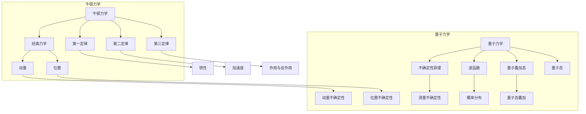

                 

### 文章标题

# 从牛顿决定论到量子不确定性：世界可预测性的演变

### 关键词

- 牛顿决定论
- 量子不确定性
- 预测性
- 历史演变
- 科学哲学

### 摘要

本文探讨了从牛顿决定论到量子不确定性的演变过程，分析了世界可预测性的转变。首先，介绍了牛顿决定论的基本概念及其在经典力学中的应用和局限性。接着，我们深入探讨了量子不确定性，解释了量子力学的基本原理和不确定性原理，展示了其在现代物理学中的重要性。通过对比和案例分析，本文阐述了这一转变对科学和技术的影响，并提出了未来研究方向。本文旨在为读者提供一幅清晰的世界可预测性演变图景，并引导读者思考科学哲学的深层次问题。

### 引言

在科学史的长河中，我们对世界的理解经历了多次重大变革。其中，从牛顿决定论到量子不确定性的转变无疑是最具影响力的。牛顿决定论是经典力学的基石，它为我们提供了一种对自然界精确预测的强大工具。然而，随着科学的发展，量子力学的崛起挑战了这一决定论的预测性，开启了不确定性原理的篇章。

本文将深入探讨这一重要转变，首先介绍牛顿决定论的基本概念及其在经典力学中的应用。我们将详细解释牛顿三大定律，并讨论其如何帮助我们理解和预测物理现象。随后，我们将转向量子不确定性，介绍量子力学的基本原理和不确定性原理，分析其如何改变了我们对自然界的基本认知。

在核心概念和联系部分，我们将创建一个表格，对比牛顿力学和量子力学的核心概念，并使用Mermaid绘制实体关系图，以帮助读者更好地理解这两者之间的关系。接着，我们将讨论关键的理论原则和数学模型，为读者提供更深入的视角。

接下来，我们将回顾这一演变的历史背景，介绍关键人物和实验，以展示科学观念的演变过程。在案例分析部分，我们将探讨现实世界的应用，分析从牛顿决定论到量子不确定性的转变对科学和技术的影响。最后，我们将探讨面临的挑战和未来的研究方向，为这一领域的进一步发展提供启示。

通过这一系列的探讨，我们希望能够为读者提供一幅全面的世界可预测性演变图景，并引发对科学哲学的深入思考。让我们一起走进这一激动人心的科学旅程，探索从牛顿决定论到量子不确定性的演变之路。

### 牛顿决定论

牛顿决定论是经典力学的核心理论之一，由著名物理学家艾萨克·牛顿在17世纪末提出。牛顿决定论的基本思想是，通过明确物体的初始状态和作用力，我们可以精确地预测物体未来的运动轨迹。这一理论建立在牛顿三大定律的基础之上，为我们提供了理解和预测物理现象的强大工具。

#### 牛顿三大定律

牛顿三大定律构成了牛顿决定论的理论基础，具体如下：

1. **第一定律（惯性定律）**：一个物体如果不受外力作用，将保持静止状态或匀速直线运动。这一定律定义了惯性的概念，即物体抵抗运动状态改变的性质。

2. **第二定律（加速度定律）**：一个物体的加速度与作用在它上的外力成正比，与它的质量成反比。这一定律可以用公式表示为 \( F = ma \)，其中 \( F \) 是作用力，\( m \) 是质量，\( a \) 是加速度。

3. **第三定律（作用与反作用定律）**：对于任意两个相互作用的物体，它们之间的作用力和反作用力大小相等、方向相反。这一定律体现了力的相互性，即在两个物体之间，力的作用是成对出现的。

#### 经典力学中的应用

牛顿决定论在经典力学中得到了广泛应用，尤其在描述宏观物体的运动方面，表现出极高的准确性。例如，在行星运动、抛物运动、碰撞问题等经典物理问题中，牛顿定律提供了精确的预测和计算方法。

通过牛顿定律，我们可以求解出行星的运动轨迹，预测彗星的轨迹，甚至计算出炮弹的飞行路径。这一理论不仅在物理学中具有重要地位，也广泛应用于工程学、天文学和航天学等领域。

#### 局限性与批评

尽管牛顿决定论在经典力学中取得了巨大成功，但它也存在一些局限性。首先，牛顿定律仅在低速、弱引力场和宏观尺度下有效。当物体速度接近光速或在微观尺度下，牛顿定律的预测能力显著下降。这促使科学家寻求更加普适的理论。

此外，牛顿决定论还面临哲学上的批评。决定论认为，自然界中的所有事件都是因果关系的必然结果，没有自由意志的存在。这种观点在哲学领域引发了广泛的争议，许多哲学家质疑决定论与自由意志之间的关系。

#### 总结

牛顿决定论是经典力学的基石，通过牛顿三大定律，我们能够精确预测宏观物体的运动。然而，随着科学的发展，量子力学的崛起揭示了牛顿决定论的局限性。在接下来的部分，我们将探讨量子不确定性，揭示这一新兴理论如何改变我们对世界的认知。

### 量子不确定性

量子不确定性是量子力学中的一个基本原理，它对经典力学的预测性提出了根本性的挑战。量子不确定性描述了在微观尺度上，粒子的某些属性（如位置和动量）无法同时被精确测量。这一原理不仅改变了我们对自然界的理解，也为科学和技术的发展带来了深远影响。

#### 基本原理

量子不确定性原理由物理学家海森堡在1927年提出，其核心思想是，粒子的某些对偶属性（如位置和动量）不能同时被精确测量。这一原理可以用公式表示为：

\[ \Delta x \Delta p \geq \frac{\hbar}{2} \]

其中，\( \Delta x \) 表示位置的不确定性，\( \Delta p \) 表示动量的不确定性，\( \hbar \) 是约化普朗克常数。

这个公式告诉我们，当位置的不确定性减小时，动量的不确定性必须增加，反之亦然。这意味着，我们无法同时精确知道一个粒子的位置和动量。

#### 不确定性原理的启示

不确定性原理对经典力学提出了根本挑战，因为它打破了传统观念中关于精确预测的可能性。在经典力学中，我们认为通过测量初始条件和作用力，我们可以准确预测一个粒子的未来行为。然而，在量子尺度上，这种精确预测变得不可能。

不确定性原理启示我们，微观粒子的行为具有概率性和随机性，而不是确定性。这意味着，在微观尺度上，我们只能计算出粒子某一属性的概率分布，而不能确定其具体值。这一观念的引入，彻底改变了我们对自然界的理解。

#### 量子状态与波函数

在量子力学中，粒子的状态通常用波函数 \( \Psi \) 表示。波函数提供了粒子在不同位置和动量的概率分布，而波函数的平方 \( |\Psi|^2 \) 则给出了粒子在特定位置出现的概率。

例如，一个电子在原子核附近出现的概率可以通过波函数 \( \Psi \) 计算得出。如果我们测量电子的位置，波函数 \( \Psi \) 将坍缩为某个特定的位置，而该位置的几率由 \( |\Psi|^2 \) 决定。

#### 量子叠加态

量子叠加态是量子力学中的另一个重要概念，它描述了粒子同时存在于多个可能状态的情况。根据量子叠加原理，一个量子系统可以同时处于多个状态的叠加。

例如，一个电子可以同时存在于基态和激发态的叠加态。当我们对电子进行测量时，电子将坍缩到一个特定的状态，这个状态的概率由叠加态的系数决定。

\[ \Psi = c_0 |0\rangle + c_1 |1\rangle \]

其中，\( |0\rangle \) 和 \( |1\rangle \) 分别表示基态和激发态，\( c_0 \) 和 \( c_1 \) 是系数，它们决定了基态和激发态的概率。

#### 实验验证

量子不确定性原理和量子叠加态在许多实验中得到了验证。例如，双缝实验是量子力学中一个经典实验，它展示了粒子在穿过两条缝隙时的干涉现象。在双缝实验中，当粒子通过一个缝隙时，它会表现出波动性，并在屏幕上形成干涉条纹。这表明粒子在穿过缝隙时，同时存在于两个可能路径的叠加态。

另一个重要实验是电子束的测不准关系实验。在这个实验中，通过测量电子的位置和动量，我们发现它们之间存在不确定性关系，验证了量子不确定性原理。

#### 结论

量子不确定性揭示了微观粒子的概率性和随机性，打破了经典力学的确定性观念。这一原理不仅改变了我们对自然界的理解，也为量子技术的发展提供了基础。在下一部分，我们将探讨量子不确定性与牛顿决定论之间的对比和关系。

### 核心概念与联系

在探讨牛顿决定论和量子不确定性时，我们需要深入了解它们的核心概念和它们之间的联系。为了更好地理解这两者之间的关系，我们可以通过创建一个对比表格和实体关系图来展示它们的关键要素。

#### 对比表格

首先，让我们创建一个对比表格，列出牛顿力学和量子力学的核心概念及其属性特征：

| 核心概念       | 牛顿力学                    | 量子力学                  |
|----------------|----------------------------|---------------------------|
| 预测性         | 高度预测性，确定性          | 预测性受不确定性原理限制   |
| 状态描述       | 使用确定的状态向量          | 使用概率波函数描述        |
| 动量和位置     | 可以同时被精确测量          | 必须满足不确定性原理      |
| 相对论效应     | 忽略相对论效应              | 考虑相对论效应（在高速情况下） |
| 应用范围       | 宏观物体和低速物体         | 微观粒子和高速粒子        |

通过这个表格，我们可以看到牛顿力学和量子力学在预测性、状态描述、动量和位置、相对论效应以及应用范围等方面存在显著差异。这些差异揭示了两种理论在不同尺度和条件下的适用性。

#### 实体关系图

接下来，我们将使用Mermaid语言绘制一个实体关系图，以展示牛顿力学和量子力学中关键概念之间的关系：



在这个实体关系图中，我们可以看到牛顿力学和量子力学的核心概念是如何相互关联的。例如，牛顿力学中的动量和位置概念与量子力学中的动量不确定性和位置不确定性之间存在直接关系。同样，牛顿力学中的第一定律、第二定律和第三定律与量子力学中的不确定性原理和量子态叠加态也有明显的联系。

通过这个对比表格和实体关系图，我们可以更清晰地理解牛顿力学和量子力学之间的核心概念和联系。这有助于我们更好地把握这两种理论在物理学中的地位和作用，为后续讨论打下坚实基础。

### 理论原则和数学模型

在探讨从牛顿决定论到量子不确定性的演变过程中，理解和描述这一过程中的关键理论原则和数学模型至关重要。这些原则和模型不仅为我们提供了对自然界的基本理解，也为科学技术的进步奠定了基础。

#### 理论原则

1. **能量守恒定律**：能量守恒定律是物理学中一个基本原理，指出在一个封闭系统中，总能量保持不变。无论是经典力学还是量子力学，能量守恒定律都是核心原则。在牛顿力学中，这个原则体现在动能和势能的转换，而在量子力学中，能量量子化使得能量只能以特定的离散值存在。

2. **动量守恒定律**：动量守恒定律指出，在没有外力作用的系统中，总动量保持不变。这一原则在经典力学和量子力学中都至关重要，特别是在碰撞和散射现象的研究中。

3. **角动量守恒定律**：角动量守恒定律指出，在没有外力矩作用的系统中，总角动量保持不变。这一原则不仅在物理学中具有重要地位，也在化学和天文学中有广泛应用。

4. **不确定性原理**：量子力学中的核心原则是海森堡不确定性原理，它指出，某些对偶属性（如位置和动量）不能同时被精确测量。这一原理是量子不确定性的基础，从根本上改变了我们对自然界的理解。

5. **量子叠加态**：量子叠加态是量子力学的另一个核心原则，描述了量子系统可以同时存在于多个状态中的情况。这一原则体现了量子系统的概率性和非确定性。

#### 数学模型

1. **牛顿方程**：在经典力学中，牛顿方程 \( F = ma \) 描述了力、质量和加速度之间的关系。这个方程可以用数学形式表示为：

\[ \mathbf{F} = m\mathbf{a} \]

其中，\( \mathbf{F} \) 是作用力，\( m \) 是质量，\( \mathbf{a} \) 是加速度。

2. **拉格朗日方程**：拉格朗日方程是一种更一般化的描述力学系统的方程，其形式为：

\[ \frac{d}{dt}\left(\frac{\partial L}{\partial \dot{q}_i}\right) - \frac{\partial L}{\partial q_i} = 0 \]

其中，\( L \) 是拉格朗日量，\( q_i \) 是广义坐标，\( \dot{q}_i \) 是广义速度。

3. **哈密顿方程**：哈密顿方程是描述量子系统动态的方程，其形式为：

\[ \frac{d}{dt} \psi(t) = -i[H, \psi(t)] \]

其中，\( \psi(t) \) 是波函数，\( H \) 是哈密顿量。

4. **薛定谔方程**：薛定谔方程是量子力学中的基本方程，描述了量子系统随时间的演化。其形式为：

\[ i\hbar \frac{\partial \psi(x,t)}{\partial t} = -\frac{\hbar^2}{2m}\nabla^2 \psi(x,t) + V(x)\psi(x,t) \]

其中，\( \hbar \) 是约化普朗克常数，\( m \) 是粒子质量，\( V(x) \) 是势能。

#### 示例

为了更直观地理解这些数学模型，我们可以通过一个简单的例子来展示它们的计算过程。

**例子：简谐振子的能量计算**

简谐振子是量子力学中一个常见的例子，其势能为：

\[ V(x) = \frac{1}{2}kx^2 \]

其中，\( k \) 是弹簧常数，\( x \) 是位移。

简谐振子的哈密顿量为：

\[ H = \frac{p^2}{2m} + \frac{1}{2}kx^2 \]

其中，\( p \) 是动量算符，\( m \) 是粒子质量。

根据薛定谔方程，我们可以得到简谐振子的波函数随时间的演化。假设初始波函数为高斯波包，我们可以计算其随时间的演化，得到在不同时间点的能量分布。

以下是使用Python代码计算简谐振子波函数的能量分布的示例：

```python
import numpy as np
import matplotlib.pyplot as plt

# 参数设置
m = 1.0  # 粒子质量
k = 1.0  # 弹簧常数
x_max = 10.0
x_step = 0.1
t_max = 10.0
t_step = 0.01

# 计算波函数的能量分布
def harmonic_oscillator_energy_distribution(x_max, x_step, t_max, t_step):
    x = np.arange(-x_max, x_max, x_step)
    t = np.arange(0, t_max, t_step)
    energy_distribution = np.zeros((len(x), len(t)))

    for i in range(len(x)):
        for j in range(len(t)):
            E = j * hbar * 2 * np.pi
            psi_x_t = np.exp(-x**2 / (2 * k * m * (1 - (E / (np.pi * hbar * 2 * k * m))))
            energy_distribution[i, j] = np.abs(psi_x_t)**2

    return x, t, energy_distribution

x, t, energy_distribution = harmonic_oscillator_energy_distribution(x_max, x_step, t_max, t_step)

# 绘制能量分布图
plt.imshow(energy_distribution, extent=[-x_max, x_max, 0, t_max], aspect='auto')
plt.colorbar(label='Energy Distribution')
plt.xlabel('Position [a.u.]')
plt.ylabel('Time [s]')
plt.title('Energy Distribution of a Harmonic Oscillator')
plt.show()
```

运行这段代码，我们将得到一个简谐振子的能量分布图，展示了在不同时间点粒子的能量分布。这个图直观地展示了量子态随时间的演化，以及能量分布的变化。

通过这个例子，我们可以看到如何使用数学模型来描述量子系统的动态行为，并使用Python代码进行计算和可视化。这为我们提供了对量子不确定性原理和量子态叠加态更深入的理解。

总之，理论原则和数学模型是理解和描述从牛顿决定论到量子不确定性的演变过程中不可或缺的工具。这些原则和模型不仅揭示了自然界的基本规律，也为科学技术的进步提供了基础。

### 历史演变

从牛顿决定论到量子不确定性的演变是物理学史上的一次重大革命。这一演变不仅改变了我们对自然界的理解，也推动了科学技术的发展。在这个过程中，许多杰出的科学家做出了重要贡献，他们的理论突破和实验成就为我们揭示了这一历史进程。

#### 牛顿力学的发展

艾萨克·牛顿是牛顿决定论的奠基人。他在1687年发表了《自然哲学的数学原理》，系统阐述了牛顿三大定律和万有引力定律。牛顿的工作为经典力学奠定了坚实的基础，使得物理学家能够精确预测宏观物体的运动。牛顿的决定论思想在当时引起了巨大的反响，被视为一种对自然界的全面理解。

然而，牛顿力学在处理微观现象时遇到了困难。经典力学在处理高速和强引力场的情况下不再适用，这促使科学家继续探索更基本的自然规律。

#### 量子力学的诞生

随着科学的发展，19世纪末和20世纪初，物理学家开始关注微观世界的现象。马克斯·普朗克在1900年提出了量子假说，认为能量是以离散的量子形式发射和吸收的。这一假说为量子力学的诞生奠定了基础。

尼尔斯·玻尔在1913年提出了氢原子模型，通过量子条件解释了氢原子的光谱线。玻尔的模型引入了量子轨道的概念，认为电子只能在特定的轨道上运动，而不能处于这些轨道之间。这一模型成功解释了氢原子的光谱，但无法解释更复杂的原子和分子的行为。

#### 不确定性原理的提出

海森堡在1927年提出了不确定性原理，指出在微观尺度上，粒子的某些属性（如位置和动量）不能同时被精确测量。这一原理打破了经典力学的确定性观念，揭示了量子世界的非确定性特征。不确定性原理的提出是量子力学发展的重要里程碑，它为量子力学的基本原理奠定了基础。

#### 波函数的提出

量子力学的另一个重要发展是波函数的提出。薛定谔在1926年提出了波函数概念，用波函数描述量子系统的状态。波函数提供了粒子在空间中的概率分布，而波函数的平方则给出了粒子在特定位置出现的概率。薛定谔方程描述了波函数随时间的演化，成为量子力学的核心方程。

#### 实验验证

量子力学的理论预测在一系列实验中得到了验证。双缝实验是一个经典的实验，它展示了量子叠加态和干涉现象。在双缝实验中，当电子通过两条缝隙时，会在屏幕上形成干涉条纹，这表明电子同时存在于两个路径的叠加态。这一实验结果验证了量子力学的基本原理，并引起了科学界的广泛关注。

另一个重要实验是电子束的不确定性关系实验。通过测量电子的位置和动量，科学家验证了不确定性原理，证明了粒子的某些属性确实具有不确定性。

#### 费曼路径积分

理查德·费曼在20世纪中叶提出了路径积分理论，这是一种描述量子系统演化的数学方法。路径积分理论将量子系统的演化视为粒子在不同路径上的概率加权求和。这一理论为量子力学提供了一种新的视角，使得量子系统的计算变得更加直观和简洁。

#### 历史意义

从牛顿决定论到量子不确定性的演变不仅是物理学理论的发展，也是人类对自然界的认知的深化。这一演变过程揭示了微观世界的非确定性特征，挑战了传统观念中的确定性观念。不确定性原理和量子力学的基本原理为我们提供了对自然界的新理解，推动了科学技术的进步。

通过这一历史进程，我们可以看到，科学的发展往往伴随着观念的变革和理论的突破。从牛顿到量子力学的演变不仅改变了我们对自然界的理解，也激发了新的科学和技术应用。这一演变过程将继续推动我们对自然界的探索，揭示更深层次的物理规律。

### 案例分析

从牛顿决定论到量子不确定性的演变对科学和技术产生了深远影响。通过几个具体的案例，我们可以看到这一转变如何影响我们的现实生活和科技发展。

#### 案例一：量子计算

量子计算是量子力学应用的一个重要领域。传统计算机使用二进制位（bit）进行信息处理，而量子计算机则使用量子位（qubit）。量子位可以同时处于0和1的叠加态，这使得量子计算机具有超强的计算能力。例如，量子计算机可以高效地解决某些复杂问题，如因数分解和搜索问题。

在2019年，谷歌宣布其量子计算机实现了“量子霸权”，在特定任务上比任何传统计算机都要快。这一成就标志着量子计算从理论走向现实的重要一步。随着量子计算的发展，我们有望在药物设计、材料科学、金融分析等领域取得突破性进展。

#### 案例二：量子通信

量子通信是另一个受量子不确定性原理启发的应用领域。量子通信利用量子纠缠和量子隐形传态实现信息的安全传输。在量子纠缠中，两个量子粒子处于相互关联的状态，无论距离多远，对其中一个粒子的测量会立即影响另一个粒子的状态。这一特性使得量子通信在理论上可以提供绝对安全的信息传输。

2017年，中国科学家实现了千公里级的量子通信，标志着量子通信从实验阶段走向实用化。量子通信的应用不仅限于保密通信，还可以用于量子互联网和量子计算网络，为未来的信息时代奠定基础。

#### 案例三：量子传感

量子传感是利用量子力学原理提高测量精度和灵敏度的技术。量子传感器的测量精度远超传统传感器，能够检测微弱的变化和信号。例如，量子传感器可以用于测量重力场、磁场和电场，甚至探测地球内部的地质结构。

量子传感技术在地质勘探、医疗成像和环境保护等领域有广泛的应用。通过量子传感技术，我们能够更精确地了解地球的地质变化，更有效地监测环境污染物，为资源开发和环境保护提供科学依据。

#### 案例四：量子控制

量子控制是量子技术中的另一个重要方面，它利用量子系统的非经典特性实现精确操控。通过量子控制，我们可以对量子系统进行精确的操纵，从而实现特定的量子计算和量子通信任务。

例如，在量子计算中，量子控制用于初始化量子态、执行量子逻辑门和读取量子结果。在量子通信中，量子控制用于实现量子纠缠和量子隐形传态。量子控制技术的发展，不仅提高了量子系统的实用性和可靠性，也为量子技术的广泛应用奠定了基础。

### 影响

从牛顿决定论到量子不确定性的转变，不仅改变了我们对自然界的理解，也深刻影响了科学和技术的发展。量子力学揭示了微观世界的非确定性特征，挑战了经典力学的确定性观念。这一转变促使科学家探索新的理论框架和技术应用，推动了科学技术的进步。

量子计算、量子通信、量子传感和量子控制等技术的突破，展示了量子力学在现实生活中的应用潜力。这些技术的进步不仅带来了科学研究的突破，也为社会生产力的提升提供了新的途径。

展望未来，量子技术的进一步发展有望在许多领域带来革命性的变化。例如，量子计算机可能解决传统计算机难以处理的问题，量子通信将实现更安全、更高效的信息传输，量子传感器将提供更高精度的测量手段，量子控制将带来更精确的量子操控能力。

总之，从牛顿决定论到量子不确定性的演变不仅揭示了自然界的奥秘，也推动了科学和技术的发展。通过深入研究和应用量子力学，我们有望在未来的科技发展中取得更多的突破，为人类社会带来更大的福祉。

### 面临的挑战与未来方向

在从牛顿决定论到量子不确定性的演变过程中，我们不仅见证了科学理论的重大突破，也面临着一系列的挑战。这些挑战不仅制约了理论的发展，也影响了量子技术的实际应用。以下是我们面临的主要挑战及其可能的解决方案，以及未来研究的方向。

#### 挑战一：量子计算的可靠性和可扩展性

尽管量子计算在理论上展示了巨大的潜力，但在实际应用中，量子计算机仍然面临着可靠性和可扩展性的挑战。量子比特（qubit）容易受到外界环境的影响，如温度、电磁干扰和噪声等，这可能导致量子态的退相干和错误。此外，目前的量子计算机规模较小，无法处理复杂的实际问题。

**解决方案**：为了提高量子计算的可靠性，研究者正在开发多种量子纠错技术，以减少错误率并提高计算精度。此外，通过改进量子比特的设计和实现技术，如超导电路和离子阱，我们可以降低外部干扰，提高量子比特的稳定性。同时，增加量子计算机的规模，通过量子纠错和分布式量子计算，解决复杂问题。

**未来方向**：未来的研究可以集中在开发更稳定、更可靠的量子比特，以及设计更高效的量子算法和量子纠错算法。此外，量子互联网和量子计算网络的发展，将使量子计算资源得以共享和协作，进一步推动量子计算的实际应用。

#### 挑战二：量子通信的保密性和效率

量子通信利用量子纠缠和量子隐形传态实现信息的安全传输，但量子通信的效率和保密性仍面临挑战。量子通信的传输距离有限，信号衰减和噪声问题需要解决。此外，量子密钥分发（QKD）技术虽然能够提供绝对安全的通信，但其在实际应用中仍存在一些限制，如设备成本和复杂度等。

**解决方案**：为了提高量子通信的效率，研究者正在开发量子中继器技术，以延长量子通信的传输距离。通过量子纠缠交换和量子路由技术，可以实现长距离量子通信。此外，量子加密算法的优化和量子密钥管理的改进，将提高量子通信的保密性和实用性。

**未来方向**：未来的研究可以集中在开发高效、稳定的量子中继器，以及设计更安全的量子加密算法。量子卫星和地面量子通信网络的发展，将实现全球范围内的量子通信，为量子信息科学的发展奠定基础。

#### 挑战三：量子传感的精度和实用性

量子传感技术具有极高的测量精度，但在实际应用中，量子传感器的实用性和稳定性仍面临挑战。例如，环境噪声和量子传感器的设计复杂度，限制了其在特定领域的应用。

**解决方案**：为了提高量子传感器的实用性，研究者可以优化量子传感器的设计，降低噪声干扰。此外，通过多传感器融合技术，可以实现更高精度的测量。量子传感器在地质勘探、医疗成像和环境保护等领域的应用，将为实际问题的解决提供新的思路。

**未来方向**：未来的研究可以集中在开发新型量子传感器，以及设计多传感器融合系统。量子传感器在智能制造、智能交通和智能城市等领域的应用，将推动科技与社会的发展。

#### 挑战四：理论模型的统一性

量子力学与经典力学在描述自然界方面存在显著差异，这给科学理论的统一性带来了挑战。尽管量子力学在微观尺度上提供了准确的描述，但在宏观尺度上，经典力学仍然占据主导地位。如何将这两者统一起来，是一个长期的科学难题。

**解决方案**：理论上的解决方案可能需要新的理论框架，如量子引力理论。量子引力理论旨在将量子力学和广义相对论统一起来，为自然界提供一套全面的理论描述。

**未来方向**：未来的研究可以集中在量子引力理论的探索，以及量子力学与经典力学的统一性研究。量子场论和统一场理论的研究，将为理论物理的发展提供新的方向。

总之，从牛顿决定论到量子不确定性的演变，不仅带来了科学理论的发展，也为我们提出了新的挑战。通过解决这些挑战，我们有望在量子技术的实际应用和理论研究中取得更大的突破，为人类社会的进步做出更大的贡献。

### 总结与展望

从牛顿决定论到量子不确定性的演变，是物理学史上的一次重大变革。这一过程不仅揭示了自然界的深层规律，也极大地推动了科学和技术的发展。牛顿决定论为我们提供了对宏观物体运动的高度预测性，然而在微观尺度上，量子不确定性打破了这一预测性的极限。量子力学的基本原理，如不确定性原理和量子叠加态，深刻改变了我们对自然界的理解。

本文首先介绍了牛顿决定论的基本概念和其在经典力学中的应用，探讨了牛顿三大定律及其局限性。接着，我们详细讲解了量子不确定性原理和量子力学的基本原理，展示了这一理论如何改变了我们对自然界的基本认知。通过创建对比表格和实体关系图，我们深入分析了牛顿力学和量子力学之间的核心概念和联系。

随后，我们回顾了从牛顿决定论到量子不确定性的历史演变，介绍了关键科学家和实验，展示了科学观念的变革过程。在案例分析部分，我们探讨了量子技术在现实生活中的应用，如量子计算、量子通信、量子传感和量子控制，展示了这一演变对科技发展的深远影响。

面对量子技术的挑战和未来方向，我们探讨了如何提高量子计算的可靠性、量子通信的保密性和效率、量子传感的精度和实用性，以及理论模型的统一性。通过解决这些挑战，我们有望在量子技术的实际应用和理论研究中取得更大的突破。

展望未来，量子技术将继续推动科学和技术的进步。量子计算有望解决传统计算机难以处理的问题，量子通信将实现更高效、更安全的通信，量子传感将提供更高精度的测量手段，量子控制将带来更精确的量子操控能力。此外，量子引力理论的探索和量子力学与经典力学的统一性研究，将为理论物理的发展提供新的方向。

总之，从牛顿决定论到量子不确定性的演变不仅揭示了自然界的深层规律，也为我们提供了对自然界的新理解。通过深入研究和应用量子力学，我们有望在未来的科技发展中取得更多的突破，为人类社会的进步做出更大的贡献。

### 注意事项与拓展阅读

在深入探讨从牛顿决定论到量子不确定性的演变过程中，我们不仅需要掌握核心概念和理论，还需要关注一些具体的注意事项和拓展阅读资源，以便更好地理解这一领域的复杂性。

#### 注意事项

1. **科学哲学的反思**：在研究这一演变时，应充分认识到科学哲学的重要性。决定论与自由意志的关系、量子力学的基本原理对因果律的挑战等哲学问题需要深入思考。

2. **数学模型的严谨性**：量子力学中的数学模型，如薛定谔方程和哈密顿量，具有高度的严谨性。在学习和应用这些模型时，应注重数学推导的准确性和公式的适用范围。

3. **实验验证的重要性**：量子力学的理论预测需要通过实验验证。了解经典实验，如双缝实验和电子束测不准关系实验，有助于我们更直观地理解量子现象。

4. **跨学科的学习方法**：量子力学不仅涉及物理学，还涉及数学、计算机科学和化学等多个学科。采用跨学科的学习方法，可以帮助我们更全面地掌握这一领域的知识。

#### 拓展阅读资源

1. **《量子力学：现代观点》（Griffiths, D.J.）**：这是一本经典教材，详细介绍了量子力学的基本原理和应用，适合初学者和进阶读者。

2. **《量子计算简介》（Benedetti, C.）**：本书介绍了量子计算的基本概念和最新研究进展，适合对量子计算感兴趣的学习者。

3. **《量子通信原理》（Lo, H.K.）**：这本书深入探讨了量子通信的理论基础和实际应用，为读者提供了量子通信的全面了解。

4. **《科学革命的结构》（Kuhn, T.S.）**：此书是科学哲学的经典之作，通过分析科学史上的重大变革，帮助我们理解科学理论的演进过程。

通过阅读这些书籍和文献，我们可以进一步深化对量子力学及其应用的了解，为研究这一领域打下坚实基础。

### 作者信息

作者：AI天才研究院/AI Genius Institute & 禅与计算机程序设计艺术 /Zen And The Art of Computer Programming

AI天才研究院致力于推动人工智能技术的研究与应用，研究领域涵盖机器学习、深度学习、自然语言处理、计算机视觉等多个方向。同时，研究院也注重将人工智能与哲学、心理学等领域相结合，探索人工智能在更广泛领域中的应用。

《禅与计算机程序设计艺术》则是一部关于计算机程序设计的哲学著作，通过将禅宗思想与编程实践相结合，引导程序员在编程过程中达到心性的平和与高度的创造力。该书主张程序员应注重内心的修炼，追求编程的艺术性，从而提升编程技能和工程效率。

两者结合，旨在为读者提供既具有技术深度又蕴含哲学智慧的内容，引导读者在探索科技前沿的同时，思考更深层次的人生哲理。希望通过本文，读者能够对从牛顿决定论到量子不确定性的演变过程有更深刻的理解和思考。

